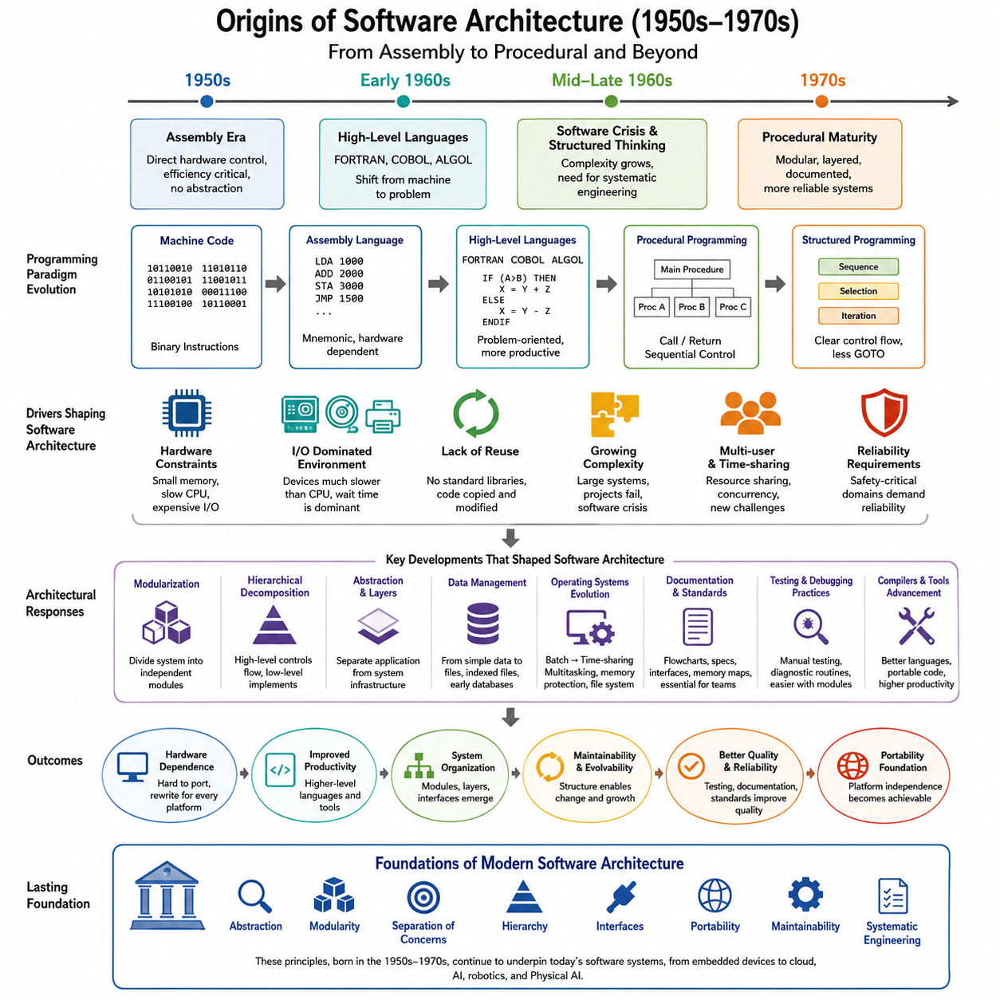
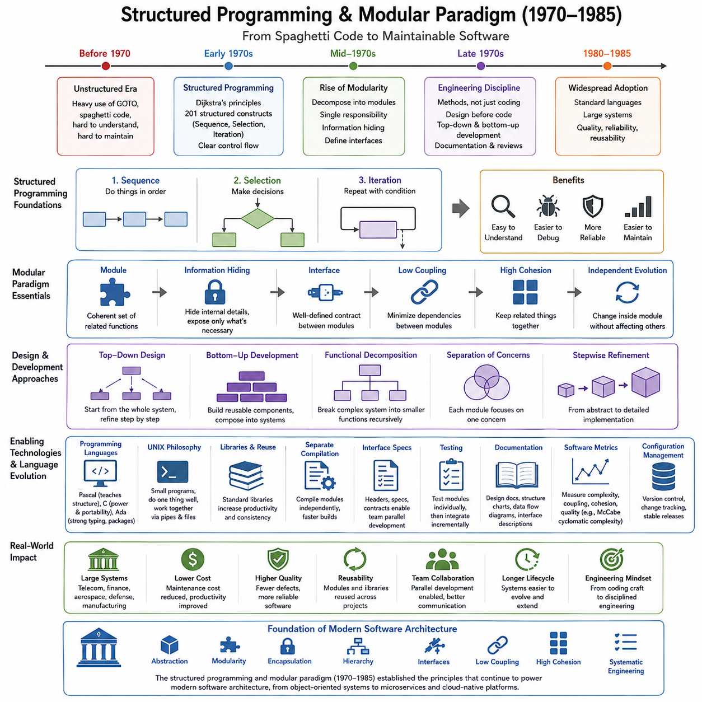
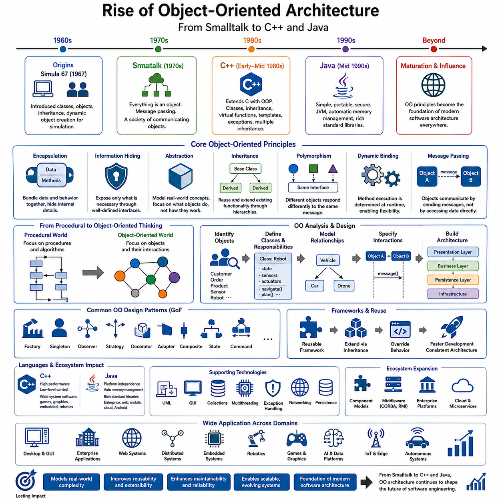
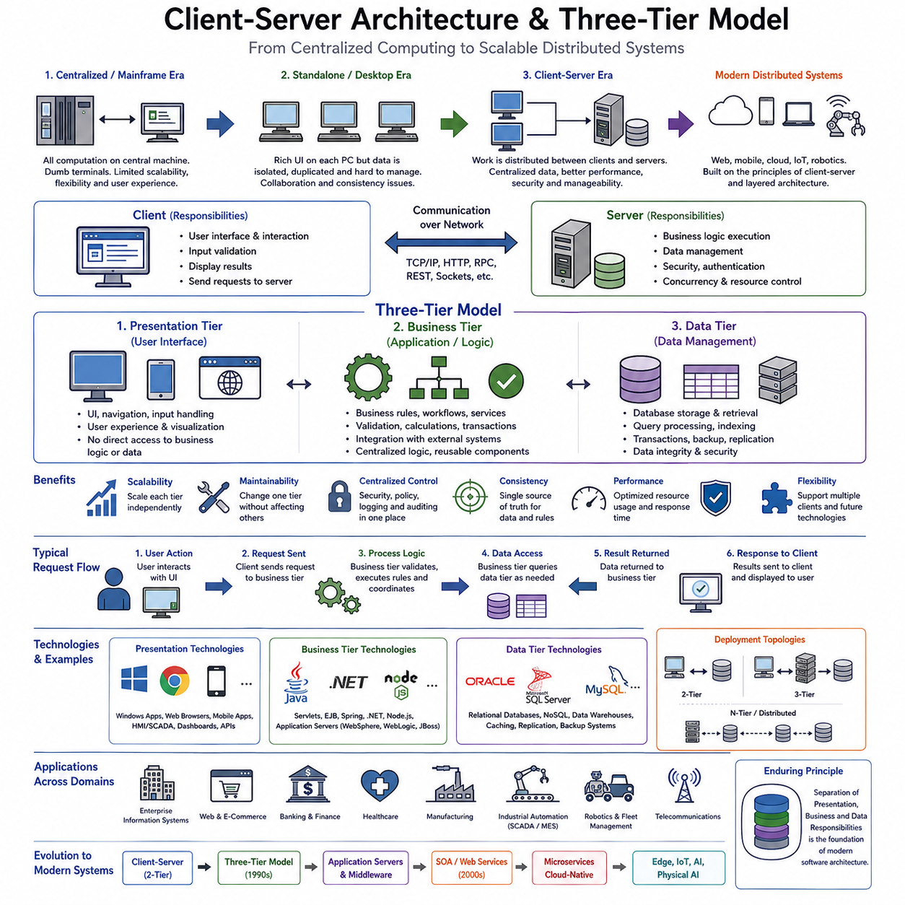
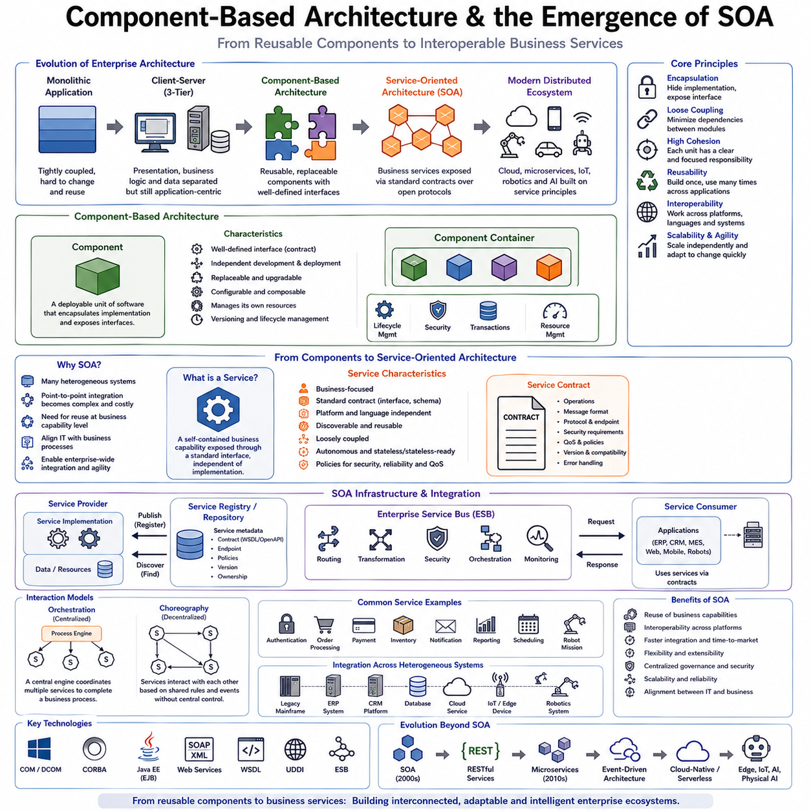
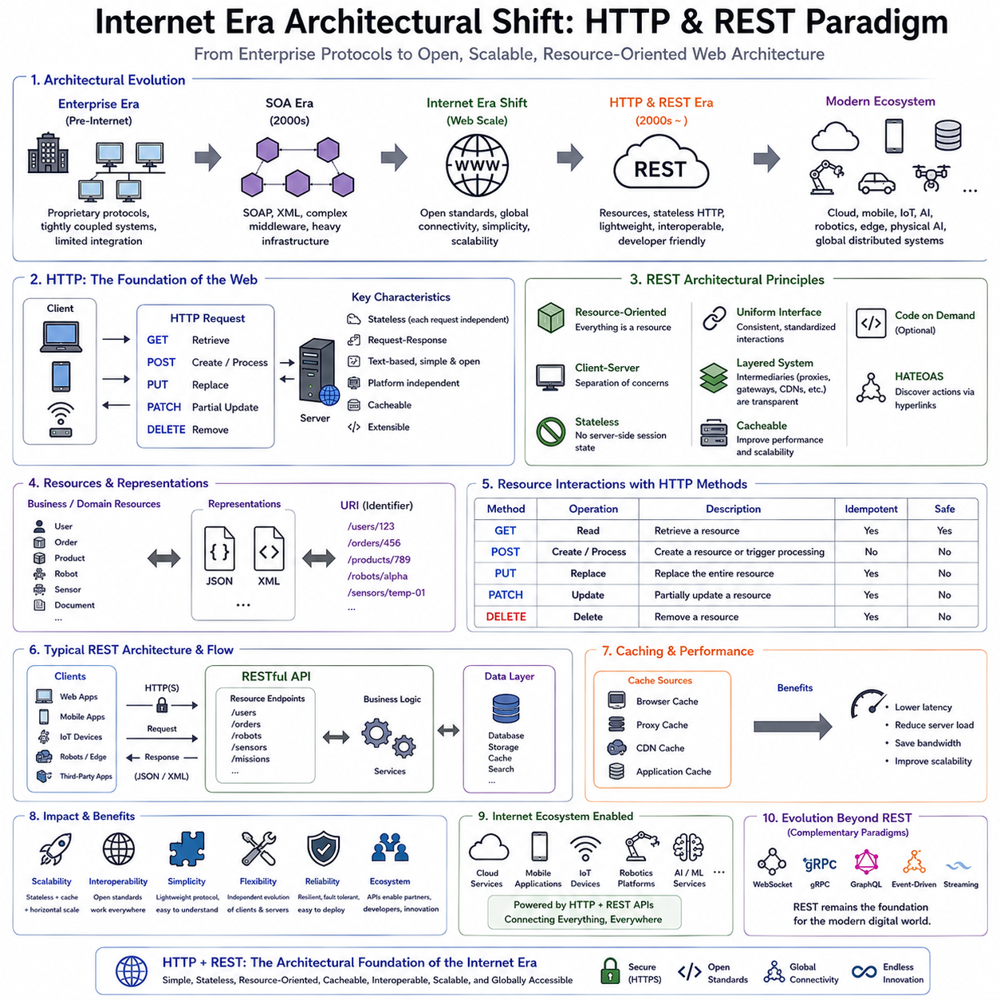
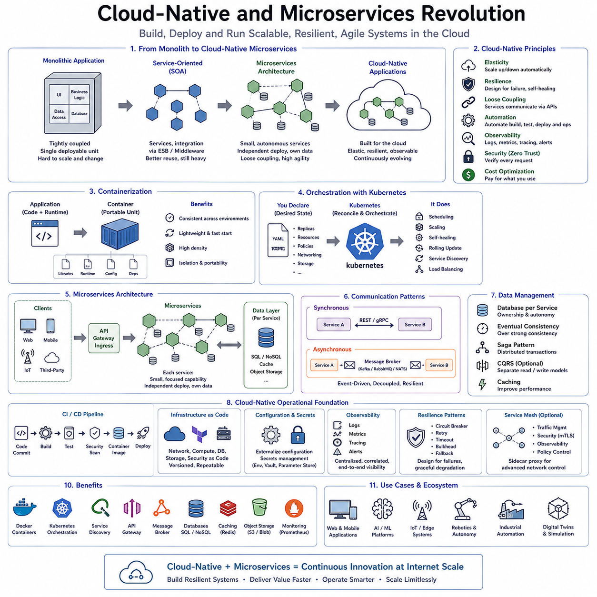
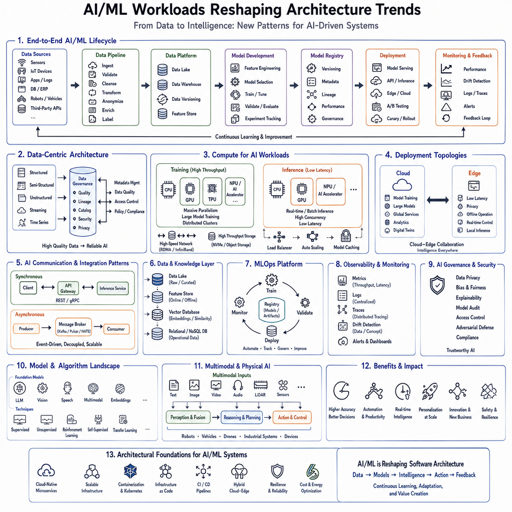
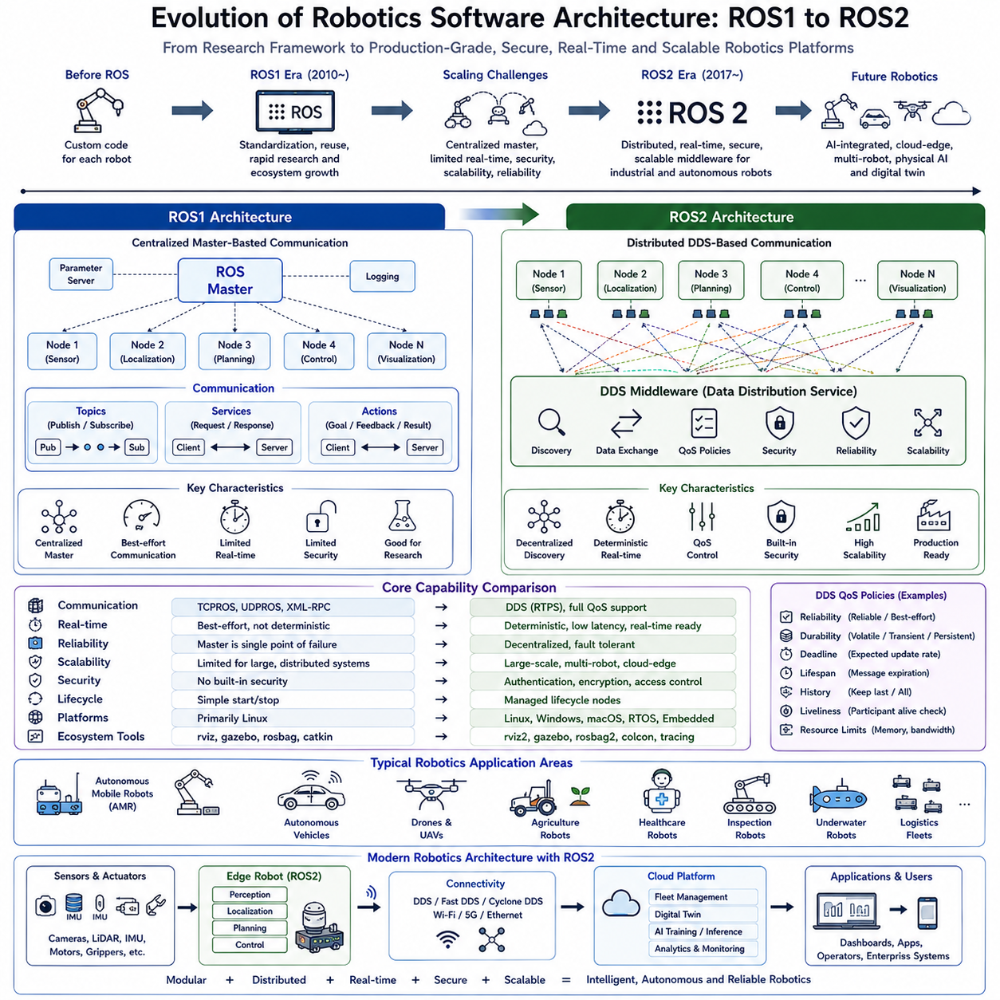
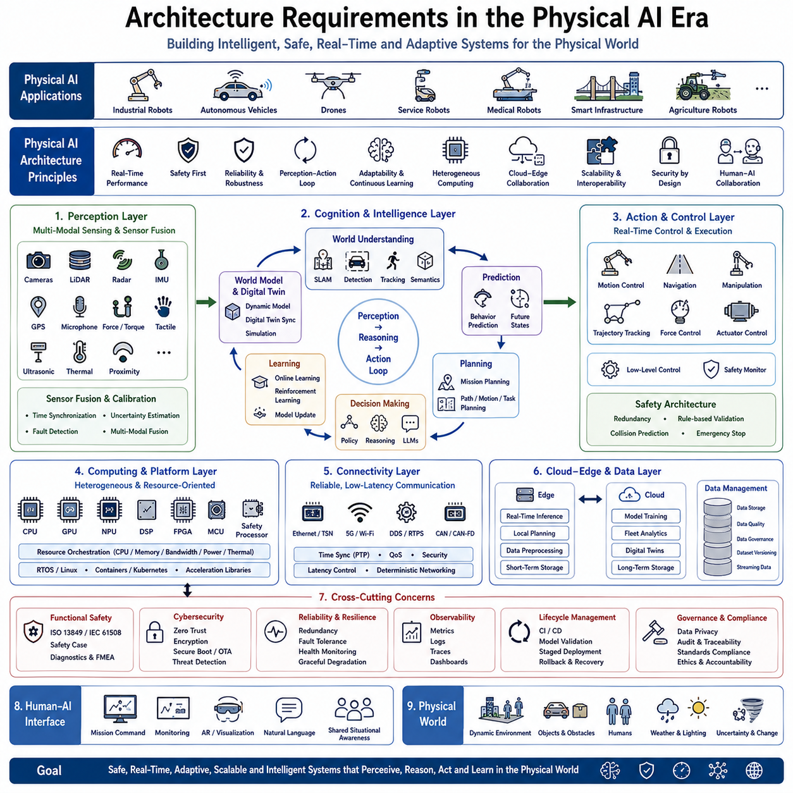

**Volume 1 Software Architecture Fundamentals**


# 01. Software Architecture History

##  

## 01.01 Origins of SW Architecture 1950s--1970s: Assembly and Procedural

{width="7.268055555555556in" height="7.268055555555556in"}

The requested topic, **"23_01_01_Origins_of_SW_Architecture_1950s-1970s_Assembly_and_Procedural,"** belongs to **Volume 23 → Software Architecture Fundamentals → Software Architecture History** in the provided library structure. The overall organization of the engineering library also confirms that this chapter is intended as the historical foundation for the subsequent evolution of software architecture.

The origins of software architecture can be traced back to the earliest decades of digital computing, long before the term "software architecture" itself was formally introduced. During the period spanning roughly from the early 1950s through the late 1970s, computer systems evolved from experimental scientific machines into commercially available computing platforms that supported government organizations, universities, military institutions, financial companies, and industrial enterprises. Although developers during this era rarely discussed architecture as a separate engineering discipline, many of the principles that later became fundamental architectural concepts were gradually established through practical experience. Software was no longer viewed merely as a sequence of machine instructions but increasingly as a structured system whose organization directly influenced maintainability, reliability, efficiency, and long-term evolution.

Early computers possessed extremely limited computational resources. Memory capacity was measured in only a few kilobytes, processor speeds were slow by modern standards, storage devices were unreliable and expensive, and programming tools were almost nonexistent. Every instruction executed by the processor consumed valuable machine cycles, making efficiency the highest priority. Software engineers, who were commonly called programmers during this period, were expected to understand the hardware architecture in intimate detail. Programming involved manipulating processor registers, memory addresses, arithmetic units, and input-output devices directly. Consequently, the earliest form of software architecture was inseparable from hardware architecture. Program structure reflected the physical organization of the computer itself rather than abstract models of software behavior.

Assembly language became the dominant programming method during the 1950s because it provided a symbolic representation of machine instructions while preserving almost complete control over the underlying hardware. Instead of entering binary codes directly, programmers could write mnemonic instructions representing processor operations such as loading registers, performing arithmetic calculations, branching to other memory locations, and interacting with peripheral devices. Although assembly language improved programmer productivity compared to pure machine code, it remained fundamentally hardware dependent. Every processor family possessed its own instruction set, register organization, addressing modes, interrupt mechanisms, and memory model. Software written for one machine generally required complete rewriting before it could execute on another platform.

This hardware dependency strongly influenced software organization. Programs were typically divided according to hardware functions rather than business functionality. Separate code sections managed memory allocation, device communication, interrupt handling, arithmetic operations, and data movement. Control flow was highly linear, relying extensively on conditional jumps, unconditional branches, and manually managed execution sequences. Since high-level abstractions did not yet exist, developers organized systems primarily around execution order rather than conceptual responsibilities.

One of the defining characteristics of early software development was the absence of reusable software libraries. Every organization often developed its own mathematical routines, file management utilities, communication interfaces, and device drivers independently. The concept of standardized software components had not yet emerged. Code reuse occurred primarily through manual copying of assembly routines between projects, often requiring significant modification because of hardware differences. As a result, software systems evolved independently with limited opportunity for standardization across organizations.

Memory management represented one of the greatest engineering challenges during this era. Computers offered extremely small amounts of random-access memory, forcing programmers to optimize every byte of storage. Data structures were carefully designed to minimize memory consumption, and code itself was frequently optimized to occupy the smallest possible space. Self-modifying code occasionally appeared in systems where available memory constraints justified altering instructions during execution. While such techniques improved efficiency, they significantly reduced program readability and maintainability.

Input and output operations dominated software design because peripheral devices operated many orders of magnitude slower than processors. Programs frequently spent much of their execution time waiting for punched card readers, magnetic tape drives, printers, or disk controllers. Consequently, architectural organization often revolved around coordinating device activity rather than maximizing computational throughput. Interrupt handling gradually became an important architectural mechanism because it allowed processors to perform useful work while waiting for slower devices to complete operations.

As computers became increasingly capable throughout the late 1950s and early 1960s, higher-level programming languages began transforming software engineering. FORTRAN, introduced primarily for scientific computing, demonstrated that mathematical algorithms could be expressed using language constructs significantly more readable than assembly instructions. COBOL emerged as a business-oriented language emphasizing data processing, record management, and commercial applications. ALGOL introduced structured syntax that strongly influenced many future programming languages. These languages represented a fundamental shift because software organization gradually became independent from individual processor instructions.

Despite the emergence of high-level languages, procedural thinking remained the dominant programming paradigm. Programs were organized as collections of procedures, subroutines, and functions that executed sequentially to solve computational problems. Data structures typically existed separately from procedures, while control logic determined the overall behavior of the application. This separation between procedures and data would later motivate the development of object-oriented programming, but during this historical period procedural decomposition represented a major advancement over monolithic assembly programs.

The concept of modular programming began developing during the 1960s as software systems grew larger and increasingly difficult to maintain. Early programmers discovered that dividing large programs into smaller independently understandable modules improved readability, debugging, testing, and collaboration. Modules usually represented logical collections of procedures responsible for specific computational tasks such as mathematical calculations, file operations, report generation, or communication with hardware devices. Although formal module interfaces were still primitive, this approach established one of the earliest architectural principles that remains fundamental today: decomposition reduces complexity.

Software complexity increased dramatically as governments and industries commissioned increasingly ambitious computer systems. Military command systems, airline reservation systems, banking applications, and space exploration programs demanded unprecedented software scale. Many projects exceeded initial budgets and schedules because existing development techniques proved insufficient for managing complexity. The growing gap between software capability and development methodology became known as the "software crisis," a term formally recognized during the NATO Software Engineering Conferences in the late 1960s. This crisis highlighted that software failures often resulted not from programming mistakes alone but from poor organization of entire software systems.

The software crisis motivated researchers and practitioners to investigate systematic engineering approaches rather than ad hoc programming practices. Documentation standards, design methodologies, testing procedures, configuration management, and lifecycle planning gradually emerged as important disciplines. Although software architecture had not yet been formally defined, the need to organize software at a system level became increasingly obvious. Engineers realized that successful large-scale systems depended as much on structural organization as on correct implementation of individual algorithms.

Operating systems underwent remarkable evolution during this period, significantly influencing software architecture. Early computers typically executed one program at a time without sophisticated resource management. As operating systems evolved, they introduced concepts including batch processing, job scheduling, memory protection, file systems, process isolation, and multitasking. These operating system services encouraged programmers to separate application logic from system management responsibilities, leading toward clearer architectural boundaries between user applications and platform infrastructure.

Time-sharing systems further accelerated architectural development by allowing multiple users to access a single computer simultaneously. Software now required mechanisms for resource sharing, concurrency control, user management, and security. These requirements introduced architectural concerns extending far beyond individual algorithms. Designers increasingly needed to consider interactions among multiple executing programs rather than focusing exclusively on isolated computations.

Programming methodologies also evolved considerably throughout the late 1960s. Developers increasingly recognized the disadvantages of unrestricted branching using GOTO statements. Excessive branching produced tangled control flow that complicated debugging and maintenance. Researchers including Edsger Dijkstra advocated structured programming techniques emphasizing sequential execution, conditional selection, and iterative loops instead of arbitrary jumps. This movement significantly improved software organization and laid essential foundations for later architectural design methodologies.

Procedural decomposition became increasingly sophisticated during the 1970s. Rather than viewing software simply as instruction sequences, engineers began organizing systems into hierarchical layers of procedures. High-level routines coordinated major application functions while lower-level routines implemented specialized operations. This hierarchical organization improved abstraction by allowing developers to understand systems at multiple levels of detail. Modern layered architectures owe much of their conceptual heritage to these early procedural hierarchies.

Data management gradually became another architectural concern. Initially, programs embedded data directly within executable code or manipulated simple memory structures without formal organization. As applications expanded, developers introduced shared data structures, indexed files, database precursors, and standardized record formats. Software architecture increasingly required careful coordination between computational procedures and persistent information storage. This evolution ultimately contributed to later architectural patterns emphasizing separation between application logic and data management.

Testing practices during this historical period were largely manual but nevertheless influenced software structure. Since debugging tools remained relatively primitive, programmers often inserted diagnostic routines directly into programs or created dedicated testing procedures. Software designed with clearer modular boundaries proved significantly easier to test, reinforcing the value of decomposition. Consequently, testing considerations indirectly promoted architectural organization long before automated testing frameworks became available.

Documentation also became increasingly important. Early assembly programs frequently relied on programmer memory with minimal written explanation. As project sizes expanded and development teams grew larger, comprehensive documentation became essential for collaboration. Flowcharts, procedure descriptions, memory maps, interface specifications, and system diagrams provided visual representations of software organization. These artifacts can be viewed as early architectural documentation even though the terminology differed from modern practice.

Compiler technology represented another milestone influencing software architecture. Advances in compiler design enabled increasingly sophisticated programming languages featuring structured control statements, complex data types, procedure abstraction, and portable source code. Developers could concentrate more on problem decomposition than processor instructions. This shift gradually separated logical architecture from physical hardware implementation, an essential prerequisite for modern software engineering.

Throughout this period, software portability remained a significant challenge. Because assembly language tied programs directly to processor instruction sets, migrating applications between hardware platforms required substantial redevelopment effort. Higher-level procedural languages partially addressed portability by allowing compilers to generate machine-specific code automatically. This abstraction encouraged architectural thinking independent of hardware characteristics, promoting longer software lifecycles and broader system compatibility.

Reliability emerged as a critical requirement in aerospace, military, telecommunications, and industrial control applications. Failures could produce catastrophic consequences, encouraging systematic design methods emphasizing predictability, verification, redundancy, and fault handling. Although many modern reliability engineering techniques would appear later, their conceptual origins can be traced to these early safety-critical computing systems.

By the late 1970s, procedural programming had matured into the dominant software development paradigm. Structured programming, modular decomposition, hierarchical design, documentation standards, compiler technology, operating system abstractions, and software lifecycle management collectively established the intellectual foundations upon which modern software architecture would be constructed. Developers increasingly understood that software quality depended not only on efficient algorithms but also on the organization of components, interfaces, responsibilities, dependencies, and information flow throughout entire systems.

The historical significance of the 1950s through the 1970s extends far beyond obsolete programming languages or outdated hardware platforms. Many architectural principles regarded today as fundamental---including abstraction, modularity, separation of concerns, hierarchical decomposition, interface definition, portability, maintainability, and systematic engineering discipline---originated during this formative era. Even though contemporary software systems employ cloud computing, distributed services, artificial intelligence, robotics, and large-scale autonomous infrastructures, they continue to build upon concepts first established during the age of assembly language and procedural programming.

Modern software architecture therefore should not be viewed as a completely new discipline but rather as the result of continuous evolution spanning several decades. The challenges encountered by early programmers---managing complexity, optimizing limited resources, organizing growing codebases, coordinating hardware interactions, and ensuring reliable execution---remain recognizable today, although they now occur at vastly different scales. Understanding the origins of software architecture provides valuable insight into why modern architectural principles exist and why foundational concepts developed during the first generation of software engineering continue to influence contemporary system design across embedded systems, cloud platforms, industrial automation, autonomous robots, and Physical AI applications.

소프트웨어 아키텍처(Software Architecture)의 기원은 "소프트웨어 아키텍처"라는 용어가 정식으로 등장하기 훨씬 이전인 디지털 컴퓨팅(Digital Computing)의 초기 시대로 거슬러 올라간다. 대략 1950년대 초부터 1970년대 후반까지의 시기는 실험적인 계산 장비가 정부 기관, 대학, 군사 조직, 금융기관, 산업 현장에서 활용되는 상용 컴퓨터 시스템으로 발전한 중요한 전환기였다. 당시 개발자들은 소프트웨어 아키텍처를 독립적인 공학 분야로 인식하지는 않았지만, 오늘날 소프트웨어 아키텍처의 핵심이 되는 여러 개념과 원칙은 실제 개발 경험을 통해 점진적으로 형성되었다. 소프트웨어는 단순한 명령어의 나열이 아니라 유지보수성(Maintainability), 신뢰성(Reliability), 성능(Efficiency), 그리고 장기적인 확장성(Evolvability)에 직접적인 영향을 미치는 구조적인 시스템으로 인식되기 시작하였다.

초기의 컴퓨터는 매우 제한적인 계산 자원을 가지고 있었다. 메모리(Memory)는 수 킬로바이트(Kilobytes)에 불과했으며, 프로세서(Processor)는 매우 느렸고, 저장장치(Storage)는 고가이면서도 신뢰성이 낮았다. 또한 개발 도구 역시 거의 존재하지 않았다. 따라서 CPU가 수행하는 모든 명령어는 매우 중요한 자원이었으며, 효율성(Efficiency)은 소프트웨어 개발의 최우선 목표였다. 당시의 프로그래머는 프로세서 레지스터(Register), 메모리 주소(Memory Address), 산술 연산 장치(ALU), 입출력 장치(Input/Output Device)를 모두 직접 이해해야 했다. 이러한 이유로 초기 소프트웨어 구조는 하드웨어 아키텍처(Hardware Architecture)와 사실상 분리될 수 없었다. 프로그램의 구조 역시 비즈니스 기능이 아니라 컴퓨터 하드웨어의 물리적인 구조를 중심으로 설계되었다.

1950년대에는 어셈블리 언어(Assembly Language)가 가장 널리 사용되는 프로그래밍 방식이었다. 어셈블리 언어는 기계어(Machine Code)를 사람이 이해하기 쉬운 기호(Mnemonic)로 표현하면서도 하드웨어를 거의 완벽하게 제어할 수 있도록 해주었다. 프로그래머는 이진수(Binary) 대신 레지스터 로드(Load), 산술 연산(Arithmetic Operation), 분기(Branch), 입출력 제어(I/O)와 같은 명령어를 기호 형태로 작성할 수 있었다. 그러나 어셈블리 언어 역시 특정 프로세서의 명령어 집합(Instruction Set)에 강하게 의존하였다. CPU마다 레지스터 구조, 주소 지정 방식(Addressing Mode), 인터럽트(Interrupt), 메모리 모델(Memory Model)이 모두 달랐기 때문에 한 시스템에서 작성된 프로그램은 다른 시스템에서는 거의 다시 작성해야 했다.

이러한 하드웨어 의존성은 소프트웨어 구조에도 그대로 반영되었다. 프로그램은 비즈니스 기능보다는 하드웨어 기능을 기준으로 구성되었다. 메모리 관리, 입출력 제어, 인터럽트 처리, 산술 계산, 데이터 이동 등의 기능이 각각 별도의 코드 영역으로 나누어졌으며, 전체 실행 흐름은 조건 분기와 무조건 분기를 이용하여 순차적으로 연결되었다. 오늘날과 같은 추상화(Abstraction)가 존재하지 않았기 때문에 소프트웨어는 개념적인 책임보다는 실행 순서 자체를 중심으로 구성되었다.

초기의 소프트웨어 개발에서는 재사용 가능한 소프트웨어 라이브러리(Software Library)가 거의 존재하지 않았다. 각 기관은 수학 계산 루틴(Mathematical Routine), 파일 관리(File Management), 통신 인터페이스(Communication Interface), 장치 드라이버(Device Driver)를 독립적으로 개발하였다. 표준화된 소프트웨어 컴포넌트(Component)라는 개념도 아직 형성되지 않았다. 코드 재사용(Code Reuse)은 기존 어셈블리 루틴을 복사하여 수정하는 수준에 머물렀으며, 하드웨어 차이로 인해 대부분의 코드는 상당한 수정이 필요했다. 그 결과 조직마다 서로 다른 소프트웨어 구조가 형성되었고, 산업 전반의 표준화는 거의 이루어지지 않았다.

메모리 관리(Memory Management)는 당시 가장 어려운 기술적 과제 가운데 하나였다. 매우 제한된 RAM을 최대한 활용하기 위해 프로그래머는 데이터 구조(Data Structure)와 코드(Code)를 가능한 한 작게 설계해야 했다. 일부 시스템에서는 실행 중 명령어 자체를 수정하는 자기 수정 코드(Self-Modifying Code)까지 사용되었다. 이러한 기법은 메모리 효율성을 높였지만 프로그램의 가독성과 유지보수성은 크게 저하시켰다.

입출력(Input/Output)은 소프트웨어 구조를 결정하는 핵심 요소였다. 천공 카드(Punched Card), 자기 테이프(Magnetic Tape), 프린터(Printer), 디스크 장치(Disk Drive)는 CPU보다 훨씬 느리게 동작했기 때문에 프로그램은 대부분의 시간을 장치가 작업을 완료하기를 기다리며 소비했다. 따라서 당시의 소프트웨어는 계산 성능을 극대화하는 것보다 입출력 장치를 효율적으로 관리하는 구조가 더욱 중요했다. 이후 인터럽트 기반 처리(Interrupt-Driven Processing)가 발전하면서 CPU는 장치를 기다리는 동안 다른 작업을 수행할 수 있게 되었고, 이는 소프트웨어 구조에도 큰 영향을 주었다.

1950년대 후반과 1960년대로 접어들면서 고급 프로그래밍 언어(High-Level Programming Language)가 등장하기 시작하였다. 과학 계산을 위한 포트란(FORTRAN)은 복잡한 수식을 사람이 이해하기 쉬운 형태로 표현할 수 있게 했으며, 비즈니스 데이터 처리를 위한 코볼(COBOL)은 대규모 상업 시스템 개발에 활용되었다. 또한 알고르(ALGOL)는 구조적인 문법과 블록(Block) 개념을 도입하여 이후 수많은 프로그래밍 언어의 기반이 되었다. 이러한 언어들은 프로그래머가 하드웨어 명령어가 아닌 문제 자체에 집중할 수 있도록 만들었으며, 소프트웨어 구조가 하드웨어 구조로부터 점차 독립하기 시작하는 계기가 되었다.

그러나 당시의 개발 방식은 여전히 절차적 프로그래밍(Procedural Programming)이 중심이었다. 프로그램은 함수(Function), 프로시저(Procedure), 서브루틴(Subroutine)의 집합으로 구성되었으며, 이들이 순차적으로 실행되어 문제를 해결하였다. 데이터(Data)는 절차와 분리되어 존재하였고, 전체 프로그램의 동작은 절차들의 호출 순서에 의해 결정되었다. 이러한 데이터와 절차의 분리는 훗날 객체지향(Object-Oriented Programming)의 등장 배경이 되었지만, 당시에는 절차 중심의 분해(Procedural Decomposition)가 가장 중요한 설계 방식이었다.

1960년대부터는 모듈화(Modular Programming)의 개념이 등장하였다. 프로그램의 규모가 커질수록 하나의 거대한 코드로는 개발과 유지보수가 어려워졌기 때문이다. 따라서 프로그램을 독립적으로 이해하고 수정할 수 있는 작은 모듈(Module)로 나누기 시작하였다. 하나의 모듈은 수학 계산, 파일 처리, 보고서 생성, 장치 제어 등 특정 기능을 담당하였다. 비록 오늘날처럼 명확한 인터페이스(Interface)는 없었지만, 이러한 모듈 분리는 복잡성을 줄이는 가장 중요한 아키텍처 원칙 가운데 하나가 되었다.

1960년대 후반에는 정부와 산업계가 훨씬 더 큰 규모의 시스템을 요구하기 시작하였다. 군사 지휘 시스템(Military Command System), 항공 예약 시스템(Airline Reservation System), 은행 정보 시스템(Banking System), 우주 탐사 시스템(Space Exploration System)과 같은 대형 프로젝트가 등장하였다. 그러나 당시의 개발 방법론으로는 이러한 복잡성을 효과적으로 관리할 수 없었고, 대부분의 프로젝트는 일정 지연과 예산 초과를 경험하였다. 이러한 현상은 훗날 "소프트웨어 위기(Software Crisis)"라고 불리게 되었다.

1968년과 1969년에 개최된 NATO 소프트웨어 공학(NATO Software Engineering Conference)은 이러한 소프트웨어 위기를 공식적으로 논의한 중요한 행사였다. 이 시기를 계기로 개발자들은 단순히 프로그램을 작성하는 것이 아니라 시스템 전체를 체계적으로 설계하는 공학적 접근이 필요하다는 사실을 인식하게 되었다. 비록 "소프트웨어 아키텍처"라는 용어는 아직 존재하지 않았지만, 시스템 전체의 구조를 먼저 설계해야 한다는 개념은 이 시기에 본격적으로 형성되기 시작하였다.

운영체제(Operating System)의 발전 역시 소프트웨어 아키텍처 발전에 결정적인 영향을 주었다. 초기 컴퓨터는 하나의 프로그램만 실행하는 단순한 구조였지만, 이후 배치 처리(Batch Processing), 작업 스케줄링(Job Scheduling), 메모리 보호(Memory Protection), 파일 시스템(File System), 프로세스(Process), 멀티태스킹(Multitasking)과 같은 기능이 운영체제에 포함되기 시작하였다. 이에 따라 응용 프로그램(Application)은 시스템 관리 기능을 운영체제에 맡기고 자신의 비즈니스 로직에 집중할 수 있게 되었으며, 응용 계층(Application Layer)과 시스템 계층(System Layer)이 점차 분리되기 시작하였다.

시분할 시스템(Time-Sharing System)의 등장은 또 다른 중요한 변화를 가져왔다. 하나의 컴퓨터를 여러 사용자가 동시에 사용할 수 있게 되면서 자원 공유(Resource Sharing), 동시성(Concurrency), 사용자 관리(User Management), 보안(Security)과 같은 새로운 설계 문제가 등장하였다. 이제 소프트웨어는 단순히 하나의 계산을 수행하는 프로그램이 아니라 여러 프로그램이 동시에 협력하는 시스템으로 발전하기 시작하였다.

1960년대 후반부터는 구조적 프로그래밍(Structured Programming)이 본격적으로 확산되었다. 특히 에츠허르 데이크스트라(Edsger Dijkstra)는 GOTO 문의 남용이 프로그램을 이해하기 어렵게 만든다고 지적하였다. 그는 순차 실행(Sequence), 선택(Selection), 반복(Iteration)이라는 세 가지 기본 제어 구조만으로도 대부분의 프로그램을 표현할 수 있다고 주장하였다. 이러한 철학은 소프트웨어 구조를 훨씬 단순하고 명확하게 만들었으며, 이후 모든 현대 프로그래밍 언어에 큰 영향을 미쳤다.

1970년대로 들어서면서 절차적 분해(Procedural Decomposition)는 더욱 체계화되었다. 프로그램은 상위 수준의 제어 루틴(Control Routine)과 하위 수준의 세부 기능 루틴으로 계층적으로 구성되기 시작하였다. 상위 계층은 전체 프로그램의 흐름을 관리하고, 하위 계층은 특정 기능을 수행하였다. 이러한 계층적 구조(Hierarchical Structure)는 오늘날 계층형 아키텍처(Layered Architecture)의 중요한 출발점이 되었다.

데이터 관리(Data Management) 역시 중요한 설계 요소로 발전하였다. 초기에는 데이터가 코드 내부에 포함되거나 단순한 메모리 구조로 관리되었지만, 이후에는 공유 데이터 구조(Shared Data Structure), 인덱스 파일(Indexed File), 데이터베이스(Database)의 전신이 되는 저장 구조가 등장하였다. 이에 따라 응용 로직(Application Logic)과 데이터 저장(Data Storage)을 분리하는 설계 개념도 점차 형성되었다.

테스트(Test) 역시 당시에는 대부분 수작업으로 이루어졌지만 소프트웨어 구조에 큰 영향을 주었다. 디버깅 도구(Debugging Tool)가 거의 없었기 때문에 개발자는 프로그램 내부에 진단 루틴(Diagnostic Routine)을 직접 삽입해야 했다. 모듈화가 잘 된 프로그램은 테스트가 훨씬 쉬웠으며, 이는 모듈 기반 설계가 확산되는 또 하나의 이유가 되었다.

문서화(Documentation)의 중요성도 점차 커졌다. 초기에는 개발자의 기억에 의존하는 경우가 많았지만, 프로젝트 규모가 커지고 여러 명의 개발자가 협업하면서 순서도(Flowchart), 절차 설명서(Procedure Description), 메모리 맵(Memory Map), 인터페이스 명세서(Interface Specification), 시스템 다이어그램(System Diagram) 등이 필수적인 개발 산출물이 되었다. 이러한 문서는 오늘날 아키텍처 문서(Architecture Documentation)의 시초라고 볼 수 있다.

컴파일러(Compiler)의 발전 역시 소프트웨어 구조를 크게 변화시켰다. 컴파일러 기술이 발전하면서 구조적 제어문, 복합 데이터 구조, 프로시저 추상화(Procedure Abstraction), 플랫폼 독립적인 소스 코드(Source Code)를 사용할 수 있게 되었다. 프로그래머는 하드웨어 명령어 대신 문제 자체를 구조적으로 설계하는 데 집중할 수 있었으며, 이는 논리적인 소프트웨어 아키텍처(Logical Software Architecture)가 물리적인 하드웨어 구현으로부터 독립하는 중요한 계기가 되었다.

이 시기의 가장 큰 문제 가운데 하나는 이식성(Portability)이었다. 어셈블리 언어는 특정 CPU에 종속되었기 때문에 새로운 플랫폼으로 이전하려면 대부분의 코드를 다시 작성해야 했다. 그러나 고급 프로그래밍 언어는 동일한 소스 코드를 서로 다른 컴퓨터에서 컴파일할 수 있도록 지원하였으며, 이는 하드웨어와 무관한 아키텍처 설계를 가능하게 만들었다.

항공우주(Aerospace), 군사(Military), 통신(Telecommunications), 산업 제어(Industrial Control) 분야에서는 신뢰성(Reliability)이 매우 중요한 요구사항이었다. 소프트웨어 오류는 심각한 사고를 초래할 수 있었기 때문에 예측 가능한 설계(Predictable Design), 검증(Verification), 중복성(Redundancy), 오류 처리(Fault Handling)에 대한 연구가 활발하게 이루어졌다. 오늘날의 안전 필수 시스템(Safety-Critical System) 설계 원칙도 이 시기의 경험에서 많은 영향을 받았다.

1970년대 후반에 이르러 절차적 프로그래밍은 성숙한 개발 패러다임으로 자리 잡았다. 구조적 프로그래밍, 모듈화, 계층적 설계, 문서화, 컴파일러 기술, 운영체제 추상화, 소프트웨어 생명주기 관리(Software Lifecycle Management)는 현대 소프트웨어 아키텍처를 구성하는 핵심 기반이 되었다. 개발자들은 이제 좋은 소프트웨어란 단순히 빠른 알고리즘을 구현하는 것이 아니라, 컴포넌트(Component), 인터페이스(Interface), 책임(Responsibility), 의존성(Dependency), 데이터 흐름(Data Flow)을 체계적으로 조직하는 것이라는 사실을 점차 이해하게 되었다.

1950년대부터 1970년대까지의 역사는 단순히 오래된 프로그래밍 언어나 구식 하드웨어의 역사가 아니다. 오늘날 소프트웨어 아키텍처의 핵심 원칙으로 여겨지는 추상화(Abstraction), 모듈성(Modularity), 관심사의 분리(Separation of Concerns), 계층적 분해(Hierarchical Decomposition), 인터페이스 정의(Interface Definition), 이식성(Portability), 유지보수성(Maintainability), 체계적인 공학적 접근(Systematic Engineering Discipline)은 모두 이 시기에 형성되기 시작하였다.

오늘날 클라우드 컴퓨팅(Cloud Computing), 분산 시스템(Distributed System), 인공지능(AI), 로보틱스(Robotics), 피지컬 AI(Physical AI)와 같은 최첨단 기술이 등장했음에도 불구하고, 이들 모두는 결국 어셈블리 언어와 절차적 프로그래밍 시대에 확립된 기본 원칙 위에서 발전해 왔다. 초기 개발자들이 제한된 자원 속에서 복잡성을 관리하고, 코드를 구조화하며, 하드웨어와 소프트웨어의 관계를 체계적으로 설계하기 위해 축적한 경험은 현대 소프트웨어 아키텍처의 출발점이자 가장 중요한 토대라고 할 수 있다. 이러한 역사적 배경을 이해하는 것은 현대의 대규모 분산 시스템, 임베디드 시스템(Embedded System), 자율주행 로봇(Autonomous Robot), 산업용 AI(Industrial AI), 그리고 피지컬 AI 시스템을 설계하는 데 필요한 근본적인 설계 철학을 이해하는 데 매우 중요한 의미를 가진다.

##  

## 01.02 Structured Programming and Modular Paradigm 1970--1985

{width="7.268055555555556in" height="7.268055555555556in"}

The period between 1970 and 1985 represents one of the most transformative eras in the history of software engineering. During these years, software development evolved from a craft primarily concerned with writing executable programs into a disciplined engineering practice focused on designing maintainable, understandable, and scalable systems. While the previous decades had established procedural programming as the dominant paradigm, the rapid increase in software complexity exposed significant weaknesses in existing development practices. Programs had become larger, teams had become bigger, and software lifecycles had extended over many years. These changes demanded new methods for organizing software beyond simple collections of procedures. Structured programming and modular programming emerged as complementary paradigms that fundamentally changed the way software systems were designed, implemented, maintained, and evolved. Together they laid the architectural foundation for virtually every modern software engineering methodology.

Before structured programming became widely accepted, many software systems relied heavily on unrestricted branching through GOTO statements, deeply nested conditional logic, duplicated code, and monolithic program structures. Such systems were often described as "spaghetti code" because their execution paths intertwined in unpredictable ways. Even relatively small modifications could introduce unintended side effects, making debugging increasingly difficult. Maintenance costs frequently exceeded the original development costs, and organizations recognized that software quality depended not only on the correctness of individual algorithms but also on the structural organization of the entire program.

One of the most influential events of this era was the growing acceptance of the principles advocated by Edsger W. Dijkstra. In his famous 1968 letter, "Go To Statement Considered Harmful," Dijkstra argued that unrestricted jumps destroyed the logical structure of programs and made reasoning about software correctness extremely difficult. His work inspired the structured programming movement, which emphasized that every algorithm could be expressed using only three fundamental control structures: sequence, selection, and iteration. These principles became the intellectual basis for nearly every programming language developed afterward.

Sequence represents the simplest execution model in which statements are executed one after another in a predictable order. This linear progression allows developers to understand program behavior without tracking arbitrary jumps throughout the code. Although sequence appears trivial, it provides the foundation upon which more sophisticated program structures are built. Clear sequential execution improves readability and enables both programmers and automated analysis tools to reason about software behavior more effectively.

Selection introduces controlled decision-making through conditional constructs such as IF-THEN-ELSE and CASE statements. Instead of jumping to arbitrary memory locations, programs evaluate logical conditions and execute well-defined alternative branches. This structured approach makes control flow explicit, improves documentation, and significantly reduces programming errors associated with uncontrolled branching. Selection also encourages developers to express business logic in a form closely aligned with problem-domain requirements rather than hardware execution patterns.

Iteration provides controlled repetition through loops including FOR, WHILE, and REPEAT-UNTIL constructs. Before structured programming, repeated execution often relied on backward GOTO statements that obscured program intent. Structured loops clearly define initialization, termination conditions, and repeated operations, allowing both humans and compilers to understand program behavior more accurately. Modern optimization techniques implemented by compilers also became possible because loop boundaries and dependencies were explicitly defined.

These three control structures fundamentally changed software organization by eliminating the need for arbitrary jumps while preserving computational expressiveness. Structured programming demonstrated that software could remain both efficient and significantly easier to understand. As developers adopted these principles, software quality improved through enhanced readability, reduced complexity, simplified debugging, and more predictable maintenance.

Structured programming alone, however, was insufficient to address the growing scale of software systems. Large applications containing hundreds of thousands of lines of code required organizational mechanisms extending beyond individual procedures. This necessity led to the widespread adoption of modular programming, a paradigm emphasizing decomposition of software into independently understandable and manageable units known as modules.

A module represents a cohesive collection of related functionality grouped according to a single responsibility. Rather than organizing programs solely according to execution order, modular programming organizes software according to logical functionality. Each module encapsulates specific algorithms, data structures, and implementation details while exposing only carefully defined interfaces to the remainder of the system. This separation between interface and implementation became one of the most enduring architectural concepts in software engineering.

The concept of information hiding, introduced by David Parnas in the early 1970s, significantly strengthened modular design principles. Parnas argued that modules should conceal design decisions likely to change over time. External software components should depend only upon stable interfaces rather than internal implementation details. This philosophy reduced coupling between modules and allowed developers to modify implementations without affecting unrelated portions of the system. Information hiding remains one of the cornerstones of modern software architecture, influencing object-oriented programming, component-based design, microservices, and API engineering.

Modularity also introduced clear responsibility boundaries throughout software systems. Instead of allowing every part of a program to manipulate every data structure directly, modules became responsible for maintaining the integrity of their own internal state. This responsibility-based organization improved software reliability because interactions between modules occurred through explicitly defined interfaces rather than unrestricted access to shared data.

Functional decomposition emerged as a primary design methodology during this era. Complex systems were recursively divided into progressively smaller functions until each module performed a single well-defined task. High-level modules coordinated overall application behavior, while lower-level modules implemented specialized operations. This hierarchical decomposition greatly simplified software development because engineers could focus on one abstraction level at a time without understanding every implementation detail simultaneously.

Top-down design became another influential methodology supporting structured programming. Developers first described overall system functionality at an abstract level before progressively refining each subsystem into increasingly detailed modules. This refinement process encouraged systematic planning before implementation began. Rather than writing code immediately, engineers developed architectural hierarchies representing system responsibilities, interfaces, dependencies, and execution flow. This approach reduced design errors while improving communication among development teams.

Bottom-up development complemented top-down design by emphasizing construction of reusable low-level modules before integrating them into larger systems. Many successful projects combined both methodologies, designing overall architecture from the top while implementing reusable building blocks from the bottom. This balanced approach remains common in contemporary software engineering.

Programming languages evolved rapidly to support structured and modular programming. Pascal, designed by Niklaus Wirth, became one of the most influential educational programming languages because it strongly encouraged structured programming principles. Its syntax promoted clear program organization, strong typing, nested procedures, and disciplined control flow. Pascal demonstrated that programming language design itself could encourage good software engineering practices.

C also gained widespread adoption during this period, particularly following the development of the UNIX operating system. Although C offered greater flexibility than Pascal, it still embraced structured programming principles through well-defined control constructs, functions, local variables, and modular source files. The combination of C and UNIX profoundly influenced operating systems, embedded software, networking infrastructure, and later generations of software architecture.

Ada, developed under sponsorship of the United States Department of Defense, further advanced modular programming by introducing packages, strong typing, separate compilation, exception handling, and explicit interface specifications. Ada illustrated how programming languages could directly support architectural principles required for large-scale safety-critical systems.

The UNIX operating system itself became one of the most influential demonstrations of modular software architecture. UNIX adopted a philosophy in which each utility performed one specific function exceptionally well while interacting with other utilities through standardized interfaces. Programs communicated using files, pipes, and simple text streams rather than tightly coupled internal dependencies. This design philosophy encouraged composition of small reusable components into larger systems, foreshadowing modern service-oriented and microservice architectures.

Software libraries expanded dramatically during this period. Instead of repeatedly implementing identical algorithms, developers increasingly relied on standardized reusable modules providing mathematical functions, file management, communication protocols, data manipulation, and system services. Reusable libraries improved productivity while promoting architectural consistency across multiple projects.

Separate compilation represented another major technological advancement supporting modular development. Individual modules could be compiled independently before being linked together into complete applications. Developers no longer needed to recompile entire systems after modifying a single component. This capability significantly reduced build times, improved team collaboration, and encouraged independent evolution of software components.

Interface specifications became increasingly formalized. Function declarations, header files, module specifications, and documentation defined precise contracts governing interactions among software components. Stable interfaces enabled independent development teams to work concurrently while reducing integration problems. Modern API design principles can be directly traced to these early interface specification practices.

Software testing also benefited from modular programming. Individual modules could be verified independently before integration, reducing debugging complexity and improving defect isolation. Although formal unit testing frameworks had not yet emerged, modular organization naturally encouraged testing at progressively higher levels of integration. This hierarchical testing strategy remains fundamental in modern continuous integration and continuous deployment environments.

Documentation practices evolved alongside architectural thinking. Instead of documenting only algorithms, engineers increasingly documented module responsibilities, interfaces, dependencies, data flow, control flow, and design rationale. Structured charts, module hierarchy diagrams, data dictionaries, and interface specifications became standard engineering artifacts supporting long-term software maintenance.

Software metrics began receiving increased attention during this era. Researchers investigated methods for measuring program complexity, module size, coupling, cohesion, defect density, and maintainability. Thomas McCabe introduced cyclomatic complexity, providing one of the earliest quantitative methods for evaluating control-flow complexity. Such metrics reinforced structured programming by demonstrating measurable relationships between software organization and maintainability.

Coupling and cohesion emerged as particularly important architectural quality attributes. Highly cohesive modules concentrate closely related responsibilities within a single component, while loosely coupled modules minimize unnecessary dependencies among components. This balance improves flexibility, maintainability, testability, and reuse. These concepts remain central to software architecture evaluation today.

Configuration management also evolved significantly during this period. As software systems expanded, organizations required systematic methods for controlling versions, coordinating team development, tracking modifications, and reproducing stable releases. Although modern distributed version control systems would appear much later, the organizational principles established during the structured programming era laid essential foundations for contemporary DevOps practices.

The software engineering discipline itself matured substantially between 1970 and 1985. Universities introduced formal software engineering curricula emphasizing design methodologies alongside programming skills. Industrial organizations adopted coding standards, design reviews, walkthroughs, inspections, and quality assurance processes. Software architecture gradually emerged as a distinct engineering activity separate from implementation, even if the terminology remained inconsistent across organizations.

Large industrial projects including telecommunications systems, financial transaction platforms, aerospace control software, manufacturing automation, and defense applications demonstrated the practical value of structured and modular design. Organizations consistently observed that disciplined software organization reduced maintenance costs, simplified upgrades, improved reliability, and extended software lifecycles. These economic benefits accelerated widespread adoption throughout the software industry.

The influence of structured programming extended beyond procedural software itself. Object-oriented programming, which gained prominence during the 1980s, inherited many foundational concepts including modular decomposition, abstraction, encapsulation, hierarchical organization, and interface definition. Likewise, component-based software engineering, service-oriented architecture, layered architecture, clean architecture, hexagonal architecture, and microservices all trace significant portions of their conceptual heritage to the structured programming movement.

Compiler technology advanced considerably during this era as well. Structured languages enabled compilers to perform sophisticated optimization techniques because program control flow became predictable. Better optimization improved performance without sacrificing readability, eliminating the historical tradeoff between efficient execution and understandable software organization.

The emergence of software design methodologies further distinguished architecture from coding. Techniques including structure charts, data flow diagrams, Jackson Structured Programming, Warnier-Orr diagrams, and structured analysis encouraged developers to think systematically about software organization before implementation began. These methodologies introduced explicit architectural planning into mainstream software engineering.

By the mid-1980s, structured programming and modular design had become the accepted foundation for professional software development worldwide. Most newly developed programming languages incorporated structured control constructs, modular compilation units, strong abstraction mechanisms, and improved support for information hiding. Educational institutions taught these principles as fundamental programming concepts, while industrial organizations incorporated them into development standards and engineering guidelines.

Perhaps the greatest legacy of the structured programming era lies in its transformation of software engineering philosophy. Software ceased to be viewed merely as executable instructions running on hardware and instead became recognized as a carefully organized collection of cooperating components designed to evolve over time. Architecture, maintainability, readability, abstraction, modularity, and disciplined engineering became first-class design objectives rather than secondary concerns.

Modern software systems---including cloud-native platforms, distributed microservices, autonomous robots, embedded control systems, large-scale AI infrastructure, and Physical AI platforms---continue to reflect the architectural principles established between 1970 and 1985. Although today\'s technologies operate at vastly greater scales and complexity, their underlying organizational concepts remain remarkably consistent with the structured programming and modular paradigms developed during this pivotal period. The emphasis on clear control flow, modular decomposition, information hiding, interface stability, low coupling, high cohesion, hierarchical abstraction, systematic documentation, and disciplined engineering continues to define successful software architecture more than half a century after these principles first emerged.

1970년부터 1985년까지의 시기는 소프트웨어 공학(Software Engineering) 역사에서 가장 혁신적인 시대 가운데 하나로 평가된다. 이 시기 동안 소프트웨어 개발은 단순히 실행 가능한 프로그램을 작성하는 기술에서 벗어나, 유지보수성(Maintainability), 이해 용이성(Understandability), 확장성(Scalability)을 갖춘 시스템을 설계하는 체계적인 공학 분야로 발전하였다. 이전 시대에는 절차적 프로그래밍(Procedural Programming)이 주류였지만, 소프트웨어의 규모가 급격히 증가하면서 기존 개발 방식의 한계가 명확하게 드러났다. 프로그램은 수십만 줄 이상의 코드로 커졌고, 개발 조직은 대규모 팀으로 확대되었으며, 소프트웨어의 수명 역시 수년에서 수십 년에 이르렀다. 이러한 변화는 단순히 프로시저(Procedure)를 나열하는 수준을 넘어 새로운 구조화 방법을 요구하였다. 그 결과 구조적 프로그래밍(Structured Programming)과 모듈형 프로그래밍(Modular Programming)이 등장하였으며, 이 두 가지 패러다임은 현대 소프트웨어 공학과 소프트웨어 아키텍처의 기초를 형성하였다.

구조적 프로그래밍이 보편화되기 이전의 소프트웨어는 GOTO 문을 이용한 무분별한 분기, 깊게 중첩된 조건문, 반복되는 코드, 거대한 단일 프로그램(Monolithic Program) 구조를 가지는 경우가 많았다. 이러한 프로그램은 흔히 스파게티 코드(Spaghetti Code)라고 불렸으며, 실행 흐름이 서로 얽혀 있어 작은 수정만으로도 예상하지 못한 오류가 발생하였다. 유지보수 비용은 초기 개발 비용보다 훨씬 커지는 경우가 많았으며, 소프트웨어의 품질은 개별 알고리즘의 정확성뿐만 아니라 전체 프로그램의 구조에 크게 의존한다는 사실이 점차 인식되기 시작하였다.

이 시대를 대표하는 가장 중요한 사건 가운데 하나는 에츠허르 데이크스트라(Edsger W. Dijkstra)의 영향력이었다. 그는 1968년에 발표한 「Go To Statement Considered Harmful」에서 GOTO 문이 프로그램의 논리적 구조를 파괴하고 소프트웨어의 정확성을 검증하기 어렵게 만든다고 주장하였다. 그는 모든 알고리즘은 순차(Sequence), 선택(Selection), 반복(Iteration)이라는 세 가지 기본 제어 구조만으로 표현할 수 있다고 설명하였으며, 이러한 원칙은 이후 거의 모든 프로그래밍 언어와 소프트웨어 설계 방법론의 기본 철학이 되었다.

순차(Sequence)는 프로그램이 위에서 아래로 예측 가능한 순서로 실행되는 가장 기본적인 실행 방식이다. 비록 단순해 보이지만, 순차 실행은 프로그램의 흐름을 명확하게 만들고 개발자가 실행 과정을 쉽게 추론할 수 있도록 한다. 이러한 예측 가능한 실행 흐름은 프로그램의 가독성(Readability)을 높이고 자동 분석 도구가 프로그램을 이해하는 데에도 큰 도움을 주었다.

선택(Selection)은 IF-THEN-ELSE나 CASE와 같은 조건문을 통해 프로그램이 논리적인 판단을 수행하도록 한다. 이전에는 GOTO를 이용하여 프로그램의 흐름을 임의로 변경하였지만, 구조적 선택문은 조건에 따라 명확한 분기 구조를 제공하였다. 이는 프로그램의 제어 흐름(Control Flow)을 훨씬 쉽게 이해할 수 있도록 만들었으며, 비즈니스 로직(Business Logic)을 하드웨어 중심이 아니라 문제 중심으로 표현할 수 있게 하였다.

반복(Iteration)은 FOR, WHILE, REPEAT-UNTIL과 같은 반복문을 이용하여 동일한 작업을 반복 수행하는 방법이다. 과거에는 반복 작업을 GOTO를 이용하여 구현하였지만, 구조적 반복문은 초기화, 종료 조건, 반복 수행 내용을 명확하게 구분하였다. 이러한 명확한 구조는 사람이 프로그램을 이해하기 쉽게 만들었을 뿐 아니라 컴파일러(Compiler)가 최적화(Optimization)를 수행하기에도 유리하였다.

이 세 가지 기본 제어 구조는 프로그램의 표현 능력을 유지하면서도 임의의 점프를 제거하여 소프트웨어의 구조를 획기적으로 개선하였다. 구조적 프로그래밍은 소프트웨어가 효율성을 유지하면서도 훨씬 읽기 쉽고 이해하기 쉬울 수 있다는 사실을 증명하였다. 개발자들은 구조적 프로그래밍을 통해 코드의 복잡성을 줄이고 디버깅(Debugging)을 쉽게 수행할 수 있었으며, 유지보수 역시 훨씬 안정적으로 수행할 수 있었다.

그러나 구조적 프로그래밍만으로는 점점 커지는 소프트웨어 시스템을 관리하기에는 부족하였다. 수십만 줄 이상의 프로그램을 관리하기 위해서는 개별 함수(Function)를 넘어서는 조직화 방법이 필요하였다. 이러한 요구 속에서 등장한 것이 모듈형 프로그래밍(Modular Programming)이었다.

모듈(Module)은 하나의 명확한 책임(Responsibility)을 수행하는 기능들의 집합이다. 프로그램을 단순히 실행 순서에 따라 구성하는 것이 아니라 논리적인 기능(Functionality)을 기준으로 분리하였다. 하나의 모듈은 자신만의 알고리즘, 데이터 구조(Data Structure), 내부 구현을 포함하지만 외부에는 명확하게 정의된 인터페이스(Interface)만을 제공하였다. 이러한 인터페이스와 구현의 분리는 오늘날까지 이어지는 가장 중요한 소프트웨어 아키텍처 원칙 가운데 하나이다.

1970년대 초 데이비드 파나스(David Parnas)는 정보 은닉(Information Hiding)이라는 개념을 제안하였다. 그는 모듈이 시간이 지나면서 변경될 가능성이 높은 구현 세부 사항을 외부로부터 숨겨야 한다고 주장하였다. 외부 시스템은 내부 구현이 아니라 안정적인 인터페이스에만 의존해야 하며, 이를 통해 특정 모듈의 구현을 변경하더라도 다른 부분에는 영향을 주지 않도록 해야 한다고 설명하였다. 정보 은닉은 이후 객체지향(Object-Oriented Programming), 컴포넌트 기반 설계(Component-Based Design), 서비스 지향 아키텍처(Service-Oriented Architecture), 마이크로서비스(Microservices), API 설계(API Design) 등 현대 소프트웨어 아키텍처의 핵심 개념으로 발전하였다.

모듈화(Modularity)는 프로그램 전체에 명확한 책임 경계를 형성하였다. 과거에는 모든 코드가 모든 데이터를 자유롭게 수정할 수 있었지만, 모듈형 구조에서는 각 모듈이 자신의 데이터를 직접 관리하며 외부는 공개된 인터페이스를 통해서만 접근할 수 있었다. 이러한 책임 기반 구조는 소프트웨어의 신뢰성을 크게 향상시켰다.

이 시기에는 기능 분해(Function Decomposition)가 가장 중요한 설계 방법론으로 자리 잡았다. 복잡한 시스템을 점차 작은 기능 단위로 나누고, 각각의 기능이 하나의 명확한 작업만 수행하도록 설계하였다. 상위 모듈은 전체 시스템을 제어하고, 하위 모듈은 세부 기능을 담당하였다. 이러한 계층적 분해(Hierarchical Decomposition)는 개발자가 전체 시스템을 모두 이해하지 않고도 특정 수준의 문제만 집중하여 해결할 수 있도록 해주었다.

상향식(Bottom-Up) 개발과 하향식(Top-Down) 설계도 이 시기에 함께 발전하였다. 하향식 설계는 먼저 전체 시스템 구조를 설계한 후 점차 세부 기능으로 분해하는 방법이며, 상향식 개발은 재사용 가능한 작은 모듈을 먼저 구현한 후 이를 조합하여 전체 시스템을 완성하는 방식이다. 실제 산업에서는 두 가지 방법을 함께 사용하는 경우가 많았으며, 이러한 접근 방식은 현재까지도 널리 사용되고 있다.

프로그래밍 언어 역시 구조적 프로그래밍을 지원하도록 발전하였다. 니클라우스 비르트(Niklaus Wirth)가 설계한 파스칼(Pascal)은 구조적 프로그래밍 교육을 위해 개발된 대표적인 언어였다. 강한 타입 검사(Strong Typing), 명확한 문법, 중첩 프로시저(Nested Procedure), 체계적인 제어 구조를 제공하여 올바른 소프트웨어 개발 습관을 형성하는 데 큰 역할을 하였다.

C 언어(C Language) 역시 이 시기에 급속히 보급되었다. 특히 UNIX 운영체제와 함께 발전하면서 운영체제, 임베디드 시스템(Embedded System), 네트워크(Network), 시스템 소프트웨어(System Software)의 표준 언어가 되었다. C는 파스칼보다 유연성이 높았지만 함수(Function), 지역 변수(Local Variable), 구조적 제어문 등을 통해 구조적 프로그래밍 철학을 유지하였다.

미국 국방부의 지원으로 개발된 에이다(Ada)는 모듈형 프로그래밍을 더욱 발전시켰다. 패키지(Package), 강한 타입 검사, 예외 처리(Exception Handling), 분리 컴파일(Separate Compilation), 명확한 인터페이스 정의를 제공하여 대규모 안전 필수 시스템(Safety-Critical System)에 적합한 언어가 되었다.

UNIX 운영체제 자체도 모듈형 소프트웨어 아키텍처의 대표적인 사례였다. UNIX는 하나의 프로그램이 하나의 기능만 수행하도록 설계되었으며, 프로그램 간에는 파일(File), 파이프(Pipe), 텍스트 스트림(Text Stream)과 같은 표준 인터페이스를 통해 데이터를 주고받았다. 이러한 철학은 작은 모듈을 조합하여 큰 시스템을 만드는 현대 마이크로서비스 아키텍처(Microservices Architecture)의 원형이라고 할 수 있다.

소프트웨어 라이브러리(Software Library)의 활용도 크게 증가하였다. 개발자는 더 이상 동일한 알고리즘을 반복해서 작성하지 않고, 수학 함수, 파일 처리, 통신 프로토콜, 데이터 관리 등 표준 라이브러리를 재사용하기 시작하였다. 이는 생산성을 높였을 뿐 아니라 여러 프로젝트에서 일관된 소프트웨어 구조를 유지하는 데에도 기여하였다.

분리 컴파일(Separate Compilation)은 모듈별 독립적인 개발을 가능하게 하였다. 이전에는 작은 수정이 있어도 전체 시스템을 다시 컴파일해야 했지만, 이제는 수정된 모듈만 다시 컴파일하면 되었다. 이는 개발 시간을 크게 단축하였으며 여러 개발자가 동시에 협업하는 환경을 가능하게 만들었다.

인터페이스 명세(Interface Specification) 역시 더욱 체계화되었다. 함수 선언(Function Declaration), 헤더 파일(Header File), 모듈 명세(Module Specification), 설계 문서(Design Documentation)를 통해 모듈 간 계약(Contract)을 명확하게 정의하였다. 이를 통해 서로 다른 팀이 동시에 개발하더라도 통합 과정에서 발생하는 문제를 크게 줄일 수 있었다.

소프트웨어 테스트(Software Testing) 역시 모듈화를 통해 큰 발전을 이루었다. 개별 모듈을 독립적으로 검증한 후 점진적으로 통합하는 방식이 가능해졌으며, 이는 오류를 빠르게 발견하고 수정하는 데 매우 효과적이었다. 오늘날의 단위 테스트(Unit Test), 통합 테스트(Integration Test)의 기본 개념도 이 시기에 형성되었다.

문서화(Documentation)의 수준도 크게 향상되었다. 단순히 알고리즘을 설명하는 것이 아니라 모듈의 책임, 인터페이스, 의존성(Dependency), 데이터 흐름(Data Flow), 설계 의도까지 기록하기 시작하였다. 구조도(Structure Chart), 데이터 사전(Data Dictionary), 인터페이스 명세서는 현대 아키텍처 문서의 시초가 되었다.

소프트웨어 메트릭(Software Metric)에 대한 연구도 활발하게 이루어졌다. 토머스 맥케이브(Thomas McCabe)는 순환 복잡도(Cyclomatic Complexity)를 제안하여 프로그램의 제어 흐름 복잡성을 수치로 평가하는 방법을 제시하였다. 이러한 연구는 구조적 프로그래밍이 유지보수성과 밀접한 관계가 있음을 객관적으로 보여주었다.

또한 응집도(Cohesion)와 결합도(Coupling)는 소프트웨어 품질을 평가하는 핵심 지표가 되었다. 응집도가 높은 모듈은 하나의 책임에 집중하며, 결합도가 낮은 시스템은 모듈 간 의존성이 최소화된다. 이러한 원칙은 오늘날의 소프트웨어 아키텍처에서도 가장 중요한 설계 기준으로 사용된다.

형상 관리(Configuration Management) 역시 발전하였다. 프로젝트가 커지면서 버전 관리(Version Control), 변경 이력 관리(Change Management), 팀 협업(Collaboration), 안정적인 릴리스(Release)를 위한 체계적인 관리가 필요해졌다. 비록 오늘날의 Git과 같은 분산 버전 관리 시스템은 존재하지 않았지만, 당시 형성된 관리 원칙은 현대 DevOps의 기반이 되었다.

1970년부터 1985년까지 소프트웨어 공학 자체도 크게 성숙하였다. 대학에서는 프로그래밍뿐 아니라 설계 방법론을 교육하기 시작하였고, 산업계에서는 코딩 표준(Coding Standard), 설계 검토(Design Review), 코드 인스펙션(Code Inspection), 품질 보증(Quality Assurance)을 도입하였다. 비록 "소프트웨어 아키텍처"라는 용어는 아직 널리 사용되지 않았지만, 구현과 별도로 시스템 구조를 설계하는 활동은 이미 독립적인 공학 분야로 자리 잡기 시작하였다.

통신 시스템(Telecommunications), 금융 시스템(Financial System), 항공우주(Aerospace), 제조 자동화(Manufacturing Automation), 국방 시스템(Defense System) 등 다양한 산업 분야의 대규모 프로젝트는 구조적 프로그래밍과 모듈형 설계의 효과를 입증하였다. 체계적인 구조를 가진 소프트웨어는 유지보수 비용이 감소하고, 기능 추가가 쉬워졌으며, 신뢰성과 수명이 크게 향상되었다.

구조적 프로그래밍은 이후 등장한 객체지향 프로그래밍(Object-Oriented Programming)에도 큰 영향을 미쳤다. 추상화(Abstraction), 캡슐화(Encapsulation), 모듈화(Modularity), 계층 구조(Hierarchy), 인터페이스 정의(Interface Definition)는 모두 이 시기에 확립된 개념을 기반으로 발전하였다. 또한 컴포넌트 기반 소프트웨어(Component-Based Software Engineering), 서비스 지향 아키텍처(Service-Oriented Architecture), 클린 아키텍처(Clean Architecture), 헥사고날 아키텍처(Hexagonal Architecture), 마이크로서비스(Microservices) 역시 구조적 프로그래밍 시대의 철학을 계승하고 있다.

컴파일러 기술도 크게 발전하였다. 구조적인 제어 흐름을 가진 프로그램은 컴파일러가 훨씬 효과적으로 최적화를 수행할 수 있었으며, 성능과 가독성을 동시에 확보할 수 있게 되었다.

또한 구조적 설계 방법론(Structured Design Methodology)이 등장하면서 소프트웨어 개발은 구현 이전에 전체 구조를 먼저 설계하는 방향으로 발전하였다. 구조도(Structure Chart), 데이터 흐름도(Data Flow Diagram), 잭슨 구조적 프로그래밍(Jackson Structured Programming), 워니어-오르 기법(Warnier-Orr Method) 등 다양한 설계 기법이 등장하여 아키텍처 중심의 개발 문화를 형성하였다.

1980년대 중반이 되면서 구조적 프로그래밍과 모듈형 설계는 전 세계 소프트웨어 산업의 표준이 되었다. 대부분의 새로운 프로그래밍 언어는 구조적 제어문, 모듈화된 컴파일 단위, 추상화 메커니즘, 정보 은닉 기능을 기본적으로 제공하였다. 대학에서는 이러한 원칙을 프로그래밍의 기본 개념으로 교육하였고, 산업계에서는 이를 개발 표준으로 채택하였다.

이 시대가 남긴 가장 중요한 유산은 소프트웨어를 단순한 명령어 집합이 아니라 시간이 지나면서 지속적으로 발전하는 협력적인 컴포넌트들의 집합으로 바라보는 철학이었다. 아키텍처(Architecture), 유지보수성(Maintainability), 가독성(Readability), 추상화(Abstraction), 모듈성(Modularity), 체계적인 공학(Systematic Engineering)은 구현 이후에 고려하는 요소가 아니라 설계 초기부터 반드시 반영해야 하는 핵심 목표가 되었다.

오늘날의 클라우드 네이티브 시스템(Cloud-Native System), 분산 마이크로서비스(Distributed Microservices), 자율주행 로봇(Autonomous Robot), 임베디드 제어 시스템(Embedded Control System), 대규모 AI 인프라(Large-Scale AI Infrastructure), 그리고 피지컬 AI 플랫폼(Physical AI Platform)은 기술적으로는 당시보다 훨씬 발전하였지만, 그 근본적인 설계 철학은 1970년부터 1985년 사이에 확립된 구조적 프로그래밍과 모듈형 패러다임 위에 여전히 견고하게 자리 잡고 있다. 명확한 제어 흐름, 기능 중심의 모듈 분해, 정보 은닉, 안정적인 인터페이스, 낮은 결합도, 높은 응집도, 계층적 추상화, 체계적인 문서화, 그리고 공학적 설계 원칙은 반세기가 지난 오늘날에도 성공적인 소프트웨어 아키텍처를 정의하는 가장 중요한 기준으로 남아 있다.

##  

## 01.03 Rise of Object-Oriented Architecture: Smalltalk to C++ / Java

{width="7.268055555555556in" height="7.268055555555556in"}

The emergence of object-oriented architecture between the late 1970s and the late 1990s represents one of the most influential paradigm shifts in the history of software engineering. While structured programming and modular programming successfully reduced software complexity by organizing code into procedures and modules, the continuous growth of software systems revealed new challenges. Large enterprise applications, graphical user interfaces, distributed systems, engineering software, telecommunications platforms, and industrial automation systems required software architectures capable of modeling increasingly complex real-world domains. Developers recognized that procedural decomposition alone often failed to represent naturally interconnected entities, long-lived system states, evolving business rules, and reusable software components. Object-oriented architecture emerged as a solution by fundamentally changing the primary unit of software organization from procedures to objects, thereby reshaping software design, implementation, maintenance, and evolution.

The conceptual origins of object-oriented thinking can be traced back to the simulation language Simula 67, developed by Ole-Johan Dahl and Kristen Nygaard in Norway. Simula introduced revolutionary concepts including classes, objects, inheritance, and dynamic object creation for modeling real-world simulation environments. Instead of viewing software as a sequence of computational procedures, Simula represented software systems as collections of interacting entities possessing both state and behavior. Although initially designed for simulation applications, these concepts demonstrated that software could mirror real-world structures much more naturally than procedural programming.

The true philosophical foundation of object-oriented architecture, however, was established through the development of Smalltalk at Xerox PARC during the 1970s. Led primarily by Alan Kay and his colleagues, Smalltalk was designed not merely as a programming language but as an entirely new computing environment centered around objects. Alan Kay envisioned software as a society of communicating objects, where each object possessed its own internal state, performed its own computations, and interacted with other objects exclusively through message passing. This vision fundamentally differed from procedural systems in which centralized control routines manipulated shared data structures.

Smalltalk introduced the principle that everything within a software system could be represented as an object. Numbers, strings, windows, files, graphical components, collections, user interface elements, and even classes themselves existed as objects communicating through standardized messages. This uniform object model significantly simplified software architecture by providing consistent rules governing every software component regardless of complexity or functionality.

One of the defining characteristics of object-oriented architecture is encapsulation. Encapsulation combines data and behavior within a single software entity while hiding internal implementation details from external components. Instead of exposing raw data structures that any procedure could modify, objects maintain control over their own internal state. External software interacts only through well-defined public interfaces, ensuring that objects remain responsible for preserving their own consistency. Encapsulation reduces unintended side effects, improves software robustness, and greatly simplifies long-term maintenance.

Closely related to encapsulation is the concept of information hiding. Although introduced earlier within modular programming by David Parnas, object-oriented architecture operationalized information hiding through language constructs including private variables, protected members, and public methods. Developers could modify internal implementations without affecting software components depending upon stable interfaces. This separation between interface and implementation became one of the most powerful mechanisms for managing software evolution.

Abstraction represents another fundamental pillar of object-oriented architecture. Rather than exposing unnecessary implementation details, objects present simplified conceptual models corresponding to problem-domain entities. A vehicle object, for example, exposes operations such as start, stop, accelerate, and steer without revealing internal engine control algorithms. Similarly, a database object provides methods for querying information without exposing storage mechanisms. Abstraction enables software engineers to reason about systems at higher conceptual levels while postponing implementation concerns.

Inheritance further revolutionized software reuse. Classes could inherit attributes and behaviors from existing parent classes while extending or modifying functionality through specialization. Instead of duplicating similar implementations across multiple software components, developers organized related concepts into hierarchical class structures. Common functionality resided within generalized base classes, while specialized behavior appeared within derived classes. This hierarchical organization significantly reduced code duplication while encouraging systematic software evolution.

Polymorphism introduced another major advancement in software flexibility. Objects belonging to different classes could respond differently to identical interface methods while preserving consistent external behavior. Software components therefore depended upon abstract interfaces rather than concrete implementations. Polymorphism reduced coupling throughout software architectures because new object types could be introduced without modifying existing client code. This principle later became central to extensible frameworks, plugin architectures, and dependency inversion.

Dynamic binding complemented polymorphism by postponing method selection until runtime rather than compile time. Instead of determining function execution statically, software selected appropriate object behavior dynamically according to actual object types. Dynamic dispatch enabled highly flexible architectures supporting runtime extensibility, framework customization, and adaptive software behavior.

Message passing represented one of Smalltalk\'s most influential architectural concepts. Rather than directly manipulating another object\'s internal state, software components requested services by sending messages. Each receiving object independently determined how to process requests. This communication-oriented perspective anticipated many principles now found within distributed systems, actor-based architectures, service-oriented architectures, and microservices. Modern API communication patterns continue reflecting this message-centric philosophy.

During the early 1980s object-oriented concepts gradually expanded beyond research laboratories into commercial software development. C++, developed by Bjarne Stroustrup, played a decisive role in this transition. Rather than replacing existing procedural programming practices, C++ extended the highly successful C programming language with object-oriented capabilities while maintaining backward compatibility. Organizations possessing substantial investments in C software could therefore adopt object-oriented techniques incrementally rather than rewriting entire software systems.

C++ introduced classes, constructors, destructors, inheritance, virtual functions, operator overloading, templates, exception handling, and multiple inheritance. These features allowed developers to design sophisticated software architectures suitable for operating systems, graphical user interfaces, engineering applications, embedded software, robotics, computer graphics, game engines, and high-performance computing. Because C++ maintained direct access to low-level hardware resources while supporting high-level abstractions, it became one of the dominant implementation languages for performance-critical software throughout the 1980s and 1990s.

The widespread adoption of C++ accelerated the emergence of object-oriented design methodologies. Researchers including Grady Booch, James Rumbaugh, and Ivar Jacobson developed systematic techniques for analyzing, designing, documenting, and implementing object-oriented systems. Their methodologies emphasized identifying real-world objects, defining class relationships, specifying responsibilities, modeling interactions, and constructing hierarchical software architectures. These independent methodologies later converged into the Unified Modeling Language, establishing standardized architectural documentation practices still widely used today.

Object-oriented analysis shifted software development toward domain-driven thinking. Rather than beginning with computational algorithms, engineers first identified entities existing within the application domain. Customer objects, order objects, inventory objects, robot objects, sensor objects, vehicle objects, and controller objects formed the conceptual building blocks of software architecture. This domain-oriented perspective significantly improved communication between software engineers and domain experts because architectural models closely resembled real-world systems.

Object-oriented design also emphasized responsibility assignment. Every class possessed clearly defined responsibilities governing the services it provided and the information it maintained. Rather than allowing centralized procedures to manipulate every aspect of system behavior, responsibility became distributed throughout cooperating objects. This decentralized organization improved modularity, maintainability, and scalability while reducing dependencies among software components.

Software frameworks emerged naturally from object-oriented architecture. Instead of constructing every application independently, organizations developed reusable architectural skeletons defining common application behavior. Developers extended frameworks by implementing specialized subclasses rather than modifying core infrastructure. Framework-based development significantly accelerated software production while promoting architectural consistency across multiple projects.

Design patterns further expanded the practical application of object-oriented architecture. During the early 1990s, Erich Gamma, Richard Helm, Ralph Johnson, and John Vlissides---collectively known as the Gang of Four---documented recurring object-oriented design solutions addressing common software engineering problems. Patterns including Factory, Singleton, Observer, Strategy, Decorator, Adapter, Composite, Proxy, Visitor, Command, State, and Template Method provided reusable architectural building blocks independent of specific programming languages. Design patterns demonstrated that software architecture itself contained recurring structural solutions analogous to architectural patterns within civil engineering.

The Observer pattern proved particularly influential because it enabled event-driven communication among loosely coupled objects. User interface frameworks, robotics middleware, graphical systems, operating systems, and distributed event processing architectures continue employing observer-based communication extensively. Similarly, the Strategy pattern enabled runtime selection of interchangeable algorithms without modifying client software, supporting extensible architectures suitable for evolving business requirements.

As personal computing expanded throughout the late 1980s and early 1990s, graphical user interfaces became increasingly important. Object-oriented architecture naturally supported GUI development because windows, buttons, menus, dialogs, documents, icons, and graphical controls could all be modeled as interacting objects. Event-driven programming complemented object-oriented design by representing user interactions as messages exchanged among interface objects. Major GUI frameworks including Microsoft Foundation Classes, Qt, Java AWT, Swing, and later JavaFX inherited these architectural principles.

Java marked another milestone in the evolution of object-oriented architecture during the mid-1990s. Developed at Sun Microsystems under the leadership of James Gosling, Java sought to simplify object-oriented programming while emphasizing portability, security, reliability, and distributed computing. Unlike C++, Java eliminated many language features contributing to software complexity, including manual memory management, pointer arithmetic, multiple implementation inheritance, and explicit resource deallocation.

Java introduced automatic garbage collection, significantly reducing memory management errors responsible for many software defects. Developers concentrated upon business logic rather than manual allocation and deallocation of memory resources. This improvement enhanced software reliability while simplifying large-scale application development.

Platform independence became Java\'s defining architectural contribution. Java source code compiled into platform-neutral bytecode executed by the Java Virtual Machine. This architecture realized the vision of "write once, run anywhere," enabling identical software to execute across diverse operating systems and hardware platforms. Platform independence profoundly influenced enterprise software, distributed applications, embedded systems, mobile devices, and cloud computing.

Java also standardized comprehensive class libraries supporting networking, graphical interfaces, multithreading, database connectivity, distributed objects, cryptography, collections, reflection, serialization, internationalization, and enterprise computing. Rather than developing infrastructure independently for every application, organizations relied upon standardized reusable frameworks integrated into the language ecosystem.

Enterprise software architecture experienced dramatic transformation following Java\'s widespread adoption. Technologies including JavaBeans, Enterprise JavaBeans, Servlets, JavaServer Pages, Java Message Service, Remote Method Invocation, and later the Spring Framework enabled construction of large-scale distributed enterprise systems using object-oriented architectural principles. Layered architectures separating presentation, business logic, persistence, and infrastructure became increasingly common throughout commercial software development.

Object-oriented architecture also significantly influenced software testing. Individual classes could be verified independently through unit testing, while interfaces enabled creation of mock objects supporting isolated verification of complex software interactions. These testing capabilities encouraged more maintainable architectures while improving software quality.

Component-based software engineering evolved directly from object-oriented principles. Larger reusable software components emerged by composing related classes into independently deployable packages exposing stable interfaces. Technologies including COM, CORBA, JavaBeans, and later OSGi extended object-oriented concepts toward distributed component architectures. These developments ultimately contributed to service-oriented architecture and microservices.

The robotics community likewise embraced object-oriented architecture because robots naturally consist of interacting physical entities possessing state, behavior, and communication mechanisms. Sensors, actuators, controllers, planners, maps, localization modules, navigation systems, manipulators, and perception pipelines all map effectively onto object-oriented abstractions. Modern robotics frameworks including ROS and ROS 2 extensively employ object-oriented principles throughout their libraries, middleware, drivers, planning algorithms, and hardware abstraction layers.

Embedded systems initially adopted object-oriented techniques cautiously because of concerns regarding performance and memory overhead. However, improvements in compiler optimization and processor capabilities gradually enabled object-oriented design even within resource-constrained environments. Automotive control systems, aerospace software, industrial automation platforms, and medical devices increasingly combined real-time performance requirements with object-oriented software organization.

Despite its many strengths, object-oriented architecture also revealed limitations. Deep inheritance hierarchies often became difficult to understand and maintain. Excessive abstraction occasionally obscured straightforward implementations. Overuse of design patterns sometimes introduced unnecessary complexity. Developers gradually recognized that inheritance should be applied carefully while favoring composition whenever appropriate. The principle of "composition over inheritance" eventually became a widely accepted architectural guideline.

Object-oriented architecture fundamentally changed software engineering by shifting attention from algorithms toward interacting software entities modeling real-world concepts. It introduced abstraction mechanisms allowing developers to manage complexity through encapsulation, information hiding, inheritance, polymorphism, dynamic binding, and message passing. More importantly, object-oriented architecture established software as a collection of collaborating components possessing well-defined responsibilities rather than merely sequences of executable procedures.

The influence of object-oriented architecture extends far beyond traditional desktop applications. Component-based development, enterprise frameworks, distributed middleware, robotics software, embedded platforms, mobile operating systems, cloud-native services, AI frameworks, digital twins, industrial automation, autonomous vehicles, and Physical AI systems all continue relying upon architectural principles first established during the transition from Smalltalk to C++ and Java. Even modern paradigms such as domain-driven design, dependency injection, clean architecture, hexagonal architecture, and microservices inherit essential concepts including abstraction, interface-based programming, encapsulation, loose coupling, high cohesion, responsibility assignment, and reusable software components. Consequently, the rise of object-oriented architecture should be viewed not merely as the introduction of new programming languages but as a profound transformation in architectural thinking that continues shaping software engineering decades after its original emergence.

1970년대 후반부터 1990년대 후반까지는 소프트웨어 공학(Software Engineering) 역사에서 가장 중요한 패러다임 전환(Paradigm Shift) 가운데 하나가 이루어진 시기였다. 구조적 프로그래밍(Structured Programming)과 모듈형 프로그래밍(Modular Programming)은 절차(Procedure)와 모듈(Module)을 중심으로 소프트웨어를 조직함으로써 복잡성을 크게 줄였지만, 대규모 기업용 시스템, 그래픽 사용자 인터페이스(Graphical User Interface), 분산 시스템(Distributed System), 공학용 소프트웨어, 통신 플랫폼, 산업 자동화 시스템과 같은 복잡한 응용 프로그램이 등장하면서 새로운 한계가 나타났다. 개발자들은 절차 중심의 분해만으로는 실제 세계의 복잡한 객체(Object), 지속적으로 변화하는 상태(State), 복잡한 비즈니스 규칙(Business Rule), 재사용 가능한 소프트웨어 컴포넌트(Component)를 자연스럽게 표현하기 어렵다는 사실을 깨닫게 되었다. 이러한 문제를 해결하기 위해 등장한 것이 객체지향 아키텍처(Object-Oriented Architecture)이며, 이는 소프트웨어의 기본 구성 단위를 절차(Procedure)에서 객체(Object)로 전환시키며 소프트웨어 설계와 구현, 유지보수, 확장 방식 전체를 근본적으로 변화시켰다.

객체지향 개념의 시작은 노르웨이에서 올레 요한 달(Ole-Johan Dahl)과 크리스텐 니고르(Kristen Nygaard)가 개발한 시뮬라 67(Simula 67)에서 찾을 수 있다. 시뮬라는 클래스(Class), 객체(Object), 상속(Inheritance), 동적 객체 생성(Dynamic Object Creation)이라는 혁신적인 개념을 최초로 도입하였다. 기존의 절차적 프로그램이 계산 절차를 중심으로 구성되었다면, 시뮬라는 현실 세계를 구성하는 독립적인 객체들이 서로 상호작용하는 형태로 시스템을 모델링하였다. 비록 시뮬레이션을 위해 만들어진 언어였지만, 현실 세계를 훨씬 자연스럽게 표현할 수 있다는 점을 보여주었으며 이후 객체지향 프로그래밍의 기반이 되었다.

객체지향 아키텍처의 철학적 기반은 1970년대 제록스 PARC(Xerox PARC)에서 개발된 스몰토크(Smalltalk)를 통해 본격적으로 확립되었다. 앨런 케이(Alan Kay)를 중심으로 개발된 스몰토크는 단순한 프로그래밍 언어가 아니라 객체(Object)를 중심으로 모든 컴퓨팅 환경을 구성하는 새로운 개념의 시스템이었다. 앨런 케이는 소프트웨어를 "서로 메시지(Message)를 주고받는 객체들의 사회(Society of Objects)"로 정의하였다. 각각의 객체는 자신의 상태(State)를 가지고 스스로 계산을 수행하며, 다른 객체와는 오직 메시지(Message)를 통해서만 상호작용하였다. 이는 공유 데이터 구조를 여러 함수가 직접 수정하는 기존 절차적 시스템과는 완전히 다른 접근 방식이었다.

스몰토크는 시스템 내부의 모든 요소를 객체로 표현하였다. 숫자(Number), 문자열(String), 파일(File), 창(Window), 버튼(Button), 컬렉션(Collection), 사용자 인터페이스(User Interface), 심지어 클래스(Class) 자체도 모두 객체였다. 이처럼 모든 요소가 동일한 객체 모델(Object Model)을 따르면서 소프트웨어 전체에 일관성 있는 구조를 제공할 수 있었다.

객체지향 아키텍처의 가장 중요한 특징 가운데 하나는 캡슐화(Encapsulation)이다. 캡슐화는 데이터(Data)와 동작(Behavior)을 하나의 객체 내부에 함께 포함시키고 내부 구현을 외부로부터 숨기는 개념이다. 이전에는 모든 함수가 동일한 데이터를 직접 수정할 수 있었지만, 객체지향에서는 객체 자신만이 자신의 상태를 변경할 수 있다. 외부에서는 공개된 인터페이스(Public Interface)를 통해서만 객체를 사용할 수 있기 때문에 객체 내부의 일관성과 무결성(Integrity)이 유지된다. 캡슐화는 의도하지 않은 부작용(Side Effect)을 줄이고 유지보수성을 크게 향상시키는 핵심 원칙이 되었다.

캡슐화와 밀접하게 관련된 개념이 정보 은닉(Information Hiding)이다. 정보 은닉은 앞서 데이비드 파나스(David Parnas)가 제안한 개념이지만, 객체지향 언어에서는 private, protected, public과 같은 접근 제어(Access Control)를 통해 실제 언어 수준에서 구현되었다. 객체 내부 구현은 자유롭게 변경할 수 있지만 외부는 공개된 인터페이스에만 의존하기 때문에 시스템 전체의 안정성이 크게 향상되었다.

추상화(Abstraction)는 객체지향 아키텍처의 또 다른 핵심 개념이다. 객체는 내부 구현을 모두 공개하는 대신 문제 영역(Problem Domain)에 맞는 단순하고 이해하기 쉬운 모델만 외부에 제공한다. 예를 들어 자동차 객체(Vehicle Object)는 시동(Start), 정지(Stop), 가속(Accelerate), 조향(Steer)과 같은 기능만 제공하고 내부 엔진 제어 방식은 숨긴다. 데이터베이스(Database) 역시 질의(Query) 기능은 제공하지만 저장 방식은 외부에 노출하지 않는다. 이러한 추상화는 개발자가 세부 구현보다 개념적인 설계에 집중할 수 있도록 한다.

상속(Inheritance)은 소프트웨어 재사용성을 획기적으로 향상시킨 기능이다. 새로운 클래스는 기존 클래스의 속성(Attribute)과 기능(Behavior)을 그대로 물려받으면서 필요한 부분만 확장하거나 변경할 수 있다. 공통 기능은 상위 클래스(Base Class)에 두고 특수한 기능은 하위 클래스(Derived Class)에 추가함으로써 코드 중복을 크게 줄일 수 있었다. 이러한 계층 구조(Hierarchy)는 소프트웨어를 체계적으로 발전시키는 중요한 수단이 되었다.

다형성(Polymorphism)은 동일한 인터페이스를 다양한 객체가 서로 다른 방식으로 구현할 수 있도록 한다. 외부에서는 동일한 메서드(Method)를 호출하지만 실제 수행되는 기능은 객체의 실제 타입(Type)에 따라 달라진다. 이를 통해 새로운 객체를 추가하더라도 기존 코드를 수정하지 않고 시스템을 확장할 수 있게 되었으며, 이는 느슨한 결합도(Low Coupling)를 실현하는 핵심 원칙이 되었다.

동적 바인딩(Dynamic Binding)은 다형성을 실현하는 핵심 기술이다. 어떤 메서드를 실행할지는 컴파일 시점이 아니라 실행 시점(Runtime)에 실제 객체 타입에 따라 결정된다. 이를 통해 런타임 확장(Runtime Extension), 플러그인(Plugin), 프레임워크(Framework) 기반 시스템과 같은 매우 유연한 구조를 구현할 수 있게 되었다.

메시지 전달(Message Passing)은 스몰토크가 제시한 가장 혁신적인 개념 가운데 하나이다. 객체는 다른 객체의 내부 데이터를 직접 수정하지 않고 필요한 기능을 요청하는 메시지를 전달한다. 메시지를 받은 객체는 자신의 방식대로 이를 처리한다. 이러한 철학은 오늘날 분산 시스템, 액터 모델(Actor Model), 서비스 지향 아키텍처(Service-Oriented Architecture), 마이크로서비스(Microservices)까지 이어지고 있으며, 현대 API(Application Programming Interface) 설계에서도 동일한 철학을 찾아볼 수 있다.

1980년대 초부터 객체지향 개념은 연구실을 넘어 산업계로 확산되기 시작하였다. 그 중심에는 비야네 스트롭스트룹(Bjarne Stroustrup)이 개발한 C++가 있었다. C++는 기존 C 언어(C Language)를 완전히 버리지 않고 객체지향 기능을 추가하여 기존 C 개발자들이 자연스럽게 객체지향 개발 방식으로 전환할 수 있도록 하였다.

C++는 클래스(Class), 생성자(Constructor), 소멸자(Destructor), 상속(Inheritance), 가상 함수(Virtual Function), 연산자 오버로딩(Operator Overloading), 템플릿(Template), 예외 처리(Exception Handling), 다중 상속(Multiple Inheritance) 등 다양한 기능을 제공하였다. 이를 통해 운영체제(Operating System), 그래픽 시스템(Graphics System), CAD, 게임 엔진(Game Engine), 임베디드 시스템(Embedded System), 로보틱스(Robotics), 고성능 컴퓨팅(High Performance Computing) 등에서 폭넓게 사용되었다.

C++의 성공은 객체지향 설계 방법론(Object-Oriented Design Methodology)의 발전을 촉진하였다. 그래디 부치(Grady Booch), 제임스 럼바우(James Rumbaugh), 아이바 야콥슨(Ivar Jacobson)은 객체 식별(Object Identification), 클래스 관계(Class Relationship), 책임 정의(Responsibility Assignment), 객체 상호작용(Object Interaction)을 체계적으로 설계하는 방법론을 제시하였다. 이들의 방법론은 이후 통합 모델링 언어(UML, Unified Modeling Language)로 통합되면서 현대 소프트웨어 아키텍처 문서화의 표준이 되었다.

객체지향 분석(Object-Oriented Analysis)은 알고리즘보다 문제 영역(Domain)을 먼저 이해하는 접근 방식을 제시하였다. 고객(Customer), 주문(Order), 차량(Vehicle), 센서(Sensor), 로봇(Robot), 컨트롤러(Controller), 지도(Map)와 같은 현실 세계의 객체를 그대로 소프트웨어의 기본 구성 요소로 모델링하였다. 이러한 방식은 도메인 전문가(Domain Expert)와 소프트웨어 개발자가 동일한 개념을 공유할 수 있도록 만들었다.

객체지향 설계(Object-Oriented Design)는 책임 기반 설계(Responsibility-Driven Design)를 강조하였다. 각각의 클래스는 자신만의 명확한 책임을 가지고 필요한 서비스(Service)를 제공한다. 중앙 집중형 함수가 모든 것을 제어하는 대신 여러 객체가 협력(Cooperation)하여 시스템을 구성하는 구조가 되었으며, 이는 유지보수성과 확장성을 크게 향상시켰다.

객체지향 아키텍처는 프레임워크(Framework)의 등장도 가능하게 하였다. 모든 프로그램을 처음부터 새로 개발하는 대신 공통 기능을 포함하는 프레임워크를 먼저 만들고, 개발자는 이를 상속하거나 확장하여 자신의 응용 프로그램을 개발하였다. 이러한 방식은 개발 생산성을 크게 향상시키면서 여러 프로젝트에 동일한 아키텍처를 적용할 수 있도록 하였다.

1990년대 초에는 디자인 패턴(Design Pattern)이 등장하면서 객체지향 설계는 더욱 성숙하였다. 에리히 감마(Erich Gamma), 리처드 헬름(Richard Helm), 랄프 존슨(Ralph Johnson), 존 블리시디스(John Vlissides)로 구성된 GoF(Gang of Four)는 반복적으로 나타나는 객체지향 설계 문제를 해결하는 표준 패턴을 정리하였다. Factory, Singleton, Observer, Strategy, Decorator, Adapter, Composite, Proxy, Visitor, Command, State, Template Method 등의 패턴은 특정 언어에 종속되지 않는 재사용 가능한 설계 방법으로 자리 잡았다.

그 가운데 Observer 패턴은 이벤트(Event) 기반 통신을 가능하게 하였으며 GUI, 로봇 미들웨어(Robot Middleware), 운영체제, 이벤트 처리 시스템(Event Processing System)에서 널리 사용되었다. Strategy 패턴은 실행 중(Runtime)에 알고리즘을 자유롭게 변경할 수 있도록 하여 높은 확장성을 제공하였다.

1980년대 후반과 1990년대에는 그래픽 사용자 인터페이스(GUI)가 폭발적으로 성장하였다. 객체지향은 창(Window), 버튼(Button), 메뉴(Menu), 아이콘(Icon), 대화상자(Dialog), 문서(Document) 등을 각각 독립된 객체로 표현할 수 있었기 때문에 GUI 개발에 매우 적합하였다. 이벤트 기반 프로그래밍(Event-Driven Programming) 역시 객체 간 메시지 전달을 기반으로 발전하였다.

1990년대 중반 등장한 자바(Java)는 객체지향 아키텍처 발전의 또 다른 전환점이었다. 제임스 고슬링(James Gosling)이 개발한 자바는 객체지향 프로그래밍을 보다 단순하고 안전하며 이식성이 높은 형태로 제공하고자 하였다. 자바는 포인터 연산(Pointer Arithmetic), 수동 메모리 관리(Manual Memory Management), 다중 구현 상속(Multiple Implementation Inheritance) 등을 제거하여 언어를 단순화하였다.

자바는 자동 가비지 컬렉션(Automatic Garbage Collection)을 도입하여 메모리 관리 오류를 크게 줄였다. 개발자는 메모리 해제보다 비즈니스 로직에 집중할 수 있었으며, 이는 대규모 시스템의 안정성을 크게 향상시켰다.

자바의 가장 큰 특징은 플랫폼 독립성(Platform Independence)이었다. 자바 코드는 바이트코드(Bytecode)로 컴파일되고 자바 가상 머신(Java Virtual Machine)에서 실행되기 때문에 운영체제와 하드웨어에 관계없이 동일한 프로그램을 실행할 수 있었다. "한 번 작성하면 어디서나 실행한다(Write Once, Run Anywhere)"라는 철학은 기업용 소프트웨어와 인터넷 애플리케이션의 발전을 크게 촉진하였다.

또한 자바는 네트워크(Network), GUI, 멀티스레드(Multithreading), 데이터베이스(Database), 암호화(Cryptography), 컬렉션(Collections), 리플렉션(Reflection), 직렬화(Serialization) 등을 위한 표준 라이브러리를 제공하여 개발자가 인프라를 직접 구현하지 않아도 되도록 하였다.

자바는 엔터프라이즈 소프트웨어 아키텍처(Enterprise Software Architecture)에도 큰 영향을 미쳤다. JavaBeans, Enterprise JavaBeans(EJB), Servlet, JavaServer Pages(JSP), Java Message Service(JMS), Remote Method Invocation(RMI), 그리고 이후 등장한 Spring Framework는 프레젠테이션(Presentation), 비즈니스 로직(Business Logic), 영속성(Persistence), 인프라(Infrastructure)를 분리하는 계층형 아키텍처(Layered Architecture)를 보편화하였다.

객체지향 아키텍처는 테스트(Test) 방식도 변화시켰다. 각각의 클래스는 독립적으로 단위 테스트(Unit Test)를 수행할 수 있었으며, 인터페이스 기반 설계를 통해 Mock 객체를 사용한 테스트가 가능해졌다. 이는 소프트웨어 품질(Quality)을 크게 향상시키는 계기가 되었다.

객체지향 원칙은 컴포넌트 기반 소프트웨어(Component-Based Software Engineering)로도 발전하였다. 여러 클래스를 하나의 독립적인 컴포넌트(Component)로 구성하여 재사용성과 배포성을 향상시켰으며, COM, CORBA, JavaBeans, OSGi 등의 기술은 이후 서비스 지향 아키텍처와 마이크로서비스의 기반이 되었다.

로보틱스(Robotics) 분야 역시 객체지향 아키텍처를 적극적으로 받아들였다. 센서(Sensor), 액추에이터(Actuator), 제어기(Controller), 경로 계획기(Planner), 지도(Map), 위치 추정(Localization), 내비게이션(Navigation), 매니퓰레이터(Manipulator), 인식 시스템(Perception System)은 모두 객체(Object)로 자연스럽게 모델링될 수 있었다. 오늘날 ROS와 ROS 2 역시 라이브러리, 미들웨어, 드라이버, 하드웨어 추상화 계층(Hardware Abstraction Layer) 전반에 객체지향 원칙을 적극 활용하고 있다.

초기의 임베디드 시스템은 성능과 메모리 오버헤드 때문에 객체지향을 신중하게 도입하였지만, 컴파일러 최적화와 하드웨어 성능 향상으로 인해 자동차 ECU, 항공우주 시스템, 산업 자동화, 의료기기 등에서도 객체지향 설계가 일반화되었다.

물론 객체지향 아키텍처에도 한계는 존재하였다. 지나치게 깊은 상속 구조는 이해하기 어렵고 유지보수가 어려웠으며, 과도한 추상화는 오히려 시스템을 복잡하게 만들기도 하였다. 또한 디자인 패턴을 불필요하게 남용하는 경우도 있었다. 이러한 경험을 통해 "상속보다 조합(Composition over Inheritance)"이라는 설계 원칙이 널리 받아들여지게 되었다.

객체지향 아키텍처는 알고리즘 중심 사고에서 현실 세계의 객체 중심 사고로 소프트웨어 공학의 관점을 근본적으로 바꾸었다. 캡슐화, 정보 은닉, 추상화, 상속, 다형성, 동적 바인딩, 메시지 전달을 통해 복잡성을 효과적으로 관리할 수 있는 구조를 제공하였다. 무엇보다도 소프트웨어를 단순한 명령어의 집합이 아니라 명확한 책임을 가진 객체들이 협력하는 시스템으로 바라보게 만든 것이 가장 큰 혁신이었다.

오늘날 컴포넌트 기반 개발(Component-Based Development), 엔터프라이즈 프레임워크(Enterprise Framework), 분산 미들웨어(Distributed Middleware), 로봇 소프트웨어(Robot Software), 임베디드 플랫폼(Embedded Platform), 모바일 운영체제(Mobile Operating System), 클라우드 네이티브 서비스(Cloud-Native Service), AI 프레임워크(AI Framework), 디지털 트윈(Digital Twin), 산업 자동화(Industrial Automation), 자율주행 시스템(Autonomous System), 그리고 피지컬 AI(Physical AI)까지도 모두 스몰토크에서 시작되어 C++와 자바를 거치며 발전한 객체지향 아키텍처의 핵심 원칙을 계승하고 있다. 또한 도메인 주도 설계(Domain-Driven Design), 의존성 주입(Dependency Injection), 클린 아키텍처(Clean Architecture), 헥사고날 아키텍처(Hexagonal Architecture), 마이크로서비스(Microservices) 역시 추상화, 인터페이스 기반 프로그래밍(Interface-Based Programming), 캡슐화, 낮은 결합도(Low Coupling), 높은 응집도(High Cohesion), 책임 기반 설계(Responsibility-Driven Design), 재사용 가능한 컴포넌트(Reusability)라는 객체지향 철학을 그대로 이어받고 있다.

결국 객체지향 아키텍처의 등장은 단순히 새로운 프로그래밍 언어가 등장한 사건이 아니라, 소프트웨어를 바라보는 사고방식 자체를 변화시킨 근본적인 혁명이었다. 그 영향력은 수십 년이 지난 오늘날에도 현대 소프트웨어 공학과 로보틱스, 클라우드, AI, 그리고 피지컬 AI 시스템 설계의 핵심 기반으로 계속 이어지고 있다.

##  

## 01.04 Client-Server Architecture and 3-Tier Model

{width="7.268055555555556in" height="7.268055555555556in"}

The emergence of client-server architecture during the late 1980s and throughout the 1990s marked one of the most significant milestones in the evolution of software architecture. As personal computers became widely available and computer networks rapidly expanded, organizations required software systems capable of supporting hundreds or thousands of concurrent users while maintaining centralized data management and consistent business operations. The traditional mainframe computing model, in which all computation occurred on a centralized machine accessed through simple terminals, began to reveal limitations in flexibility, scalability, user experience, and cost efficiency. Simultaneously, standalone desktop applications proved inadequate for enterprise environments because data became fragmented across individual computers, making collaboration, consistency, and centralized management increasingly difficult. Client-server architecture emerged as an architectural solution that distributed computational responsibilities between user-facing client applications and centralized server systems, establishing principles that continue influencing modern distributed software architecture.

The fundamental concept behind client-server architecture is the separation of responsibilities between two distinct computing entities. A client is responsible primarily for interacting with users, collecting input, presenting information, and initiating requests. A server is responsible for managing shared resources, executing business logic, storing persistent data, enforcing security policies, and coordinating multiple simultaneous client requests. Rather than concentrating every computational task on a single machine, client-server systems distribute work according to functional responsibilities, thereby improving performance, scalability, maintainability, and resource utilization.

In early client-server systems, communication typically occurred over Local Area Networks that connected desktop computers to centralized servers. Network protocols evolved rapidly during this period, enabling reliable communication between heterogeneous hardware platforms. The increasing adoption of Ethernet, TCP/IP, remote procedure calls, and standardized networking interfaces transformed software architecture by making distributed communication an ordinary component of enterprise applications rather than a specialized capability.

One of the primary motivations for client-server architecture was centralized data management. Organizations recognized that maintaining separate copies of critical business data on individual desktop computers inevitably produced inconsistencies, duplication, synchronization problems, and security risks. Centralized database servers ensured that all users accessed the same authoritative information while administrators maintained consistent backup procedures, access control policies, transaction management, and auditing mechanisms. This architectural shift significantly improved enterprise data integrity and operational reliability.

The earliest client-server applications frequently adopted a two-tier architecture. In this model, client applications communicated directly with database servers. The client typically contained both presentation logic and substantial portions of business logic, while the server primarily managed persistent data storage. This architecture represented a major improvement over isolated desktop software because it centralized data while preserving rich graphical user interfaces running on personal computers.

Two-tier systems offered several immediate advantages. User interfaces became significantly more responsive because graphical rendering occurred locally on client machines. Network traffic remained relatively efficient because only database queries and results traversed the network rather than complete application execution. Organizations could deploy powerful desktop software while maintaining centralized enterprise databases supporting multiple simultaneous users.

Despite these benefits, two-tier architectures gradually revealed important limitations as enterprise systems expanded. Business logic became duplicated across multiple client applications, making maintenance increasingly difficult. Updating application behavior required deploying new software versions to every desktop computer. Security policies implemented within clients proved vulnerable because business rules executed outside centralized administrative control. Network traffic also increased substantially because clients frequently requested large datasets directly from database servers before performing processing locally.

As software complexity continued increasing, architects recognized the need for additional separation between presentation logic and business logic. This realization led to the widespread adoption of the three-tier architecture, one of the most influential software architectural models ever developed.

The three-tier model separates software into presentation, business, and data tiers, each possessing clearly defined responsibilities. The presentation tier manages user interaction, visual interfaces, input validation, navigation, and user experience. The business tier implements domain rules, workflows, transaction coordination, authorization, decision making, and application services. The data tier manages persistent storage, query processing, indexing, transaction consistency, backup, replication, and database administration.

This separation significantly improved software maintainability because modifications to one layer rarely required changes throughout the entire application. User interface redesigns no longer affected database implementation. Database optimization could proceed independently from business logic development. Business rules evolved without requiring extensive modifications to graphical interfaces. These architectural boundaries reduced coupling while increasing flexibility across large software systems.

The presentation tier became increasingly sophisticated throughout the 1990s. Initially consisting primarily of desktop graphical user interfaces built using technologies such as Microsoft Windows, Motif, and Macintosh development frameworks, presentation layers gradually expanded to include web browsers, mobile interfaces, industrial operator panels, embedded displays, and specialized visualization environments. Regardless of implementation technology, presentation components focused exclusively on interacting with users rather than performing complex business computation.

A well-designed presentation layer minimizes knowledge of internal application behavior. User interface components submit requests, display results, collect user input, and provide navigation while delegating all significant decision making to business services. This separation enables identical business functionality to support multiple interface technologies simultaneously, including desktop applications, web applications, mobile devices, APIs, robotics dashboards, and industrial control panels.

The business tier represents the intellectual core of three-tier architecture. Business services implement organizational policies, operational workflows, validation rules, scheduling algorithms, transaction management, security enforcement, inventory calculations, pricing logic, manufacturing coordination, financial processing, healthcare regulations, and every domain-specific requirement defining application behavior. Centralizing business logic eliminates duplication across clients while ensuring consistent operation throughout the organization.

Business components frequently interact with multiple databases, external services, communication systems, messaging infrastructure, authentication providers, reporting engines, artificial intelligence modules, and enterprise integration platforms. The business tier therefore becomes responsible not only for implementing functional requirements but also for coordinating interactions among diverse infrastructure components. This orchestration responsibility anticipates many architectural concepts later formalized within service-oriented architecture and microservices.

The data tier focuses exclusively on persistent information management. Relational database management systems became dominant throughout this period because they provided standardized query languages, transaction guarantees, concurrency control, indexing mechanisms, backup capabilities, security policies, and reliable storage. Database servers handled simultaneous requests from numerous clients while preserving consistency through ACID transaction properties. This centralized approach significantly improved enterprise information management compared with decentralized desktop storage.

Database abstraction also became increasingly important. Business logic interacted with logical data models rather than physical storage implementations. This abstraction enabled organizations to optimize database performance, modify storage structures, introduce replication strategies, and migrate hardware platforms without significantly affecting application behavior. The concept of separating logical data access from physical implementation remains fundamental within modern persistence architectures.

One of the greatest strengths of three-tier architecture lies in scalability. Because each tier performs distinct responsibilities, organizations can scale infrastructure independently according to workload characteristics. Increasing user demand may require additional presentation servers without modifying database infrastructure. Computationally intensive business processing can be distributed across multiple application servers while maintaining a centralized database. Database optimization may proceed independently through clustering, indexing, replication, partitioning, or hardware upgrades. Independent scalability significantly improves resource utilization while reducing infrastructure costs.

Load balancing became an increasingly important architectural capability as enterprise deployments expanded. Rather than directing all requests toward a single application server, incoming client requests could be distributed across multiple identical business servers. Load balancers improved availability, throughput, fault tolerance, and response time while supporting incremental system expansion. Modern cloud-native architectures continue relying extensively upon these principles.

Security architecture also improved substantially under the three-tier model. Instead of allowing clients unrestricted database access, all requests passed through centralized business services enforcing authentication, authorization, validation, auditing, encryption, and policy compliance. Centralized security reduced opportunities for unauthorized access while simplifying regulatory compliance and administrative management. Sensitive database credentials remained confined to application servers rather than distributed throughout desktop software.

Transaction management became significantly more reliable because business services coordinated complete operations spanning multiple database updates. Rather than allowing independent client applications to manipulate data inconsistently, centralized transaction managers ensured atomic execution of complex business workflows. Failed operations could be rolled back automatically while preserving overall database consistency. Financial systems, inventory management platforms, manufacturing control software, and healthcare applications particularly benefited from centralized transaction coordination.

Enterprise software engineering matured considerably alongside client-server architecture. Organizations increasingly recognized software architecture as a strategic discipline influencing long-term maintainability, operational cost, organizational agility, and business competitiveness. Development teams became specialized according to architectural responsibilities, with user interface engineers focusing upon presentation technologies, business analysts modeling organizational processes, database administrators optimizing information storage, and infrastructure engineers maintaining server platforms. This specialization encouraged higher quality while enabling increasingly sophisticated enterprise applications.

Object-oriented programming strongly complemented three-tier architecture. Business tiers frequently consisted of domain objects modeling customers, products, orders, invoices, employees, robots, sensors, vehicles, production lines, and industrial assets. Object-oriented frameworks simplified implementation of reusable business components while promoting abstraction, encapsulation, inheritance, and polymorphism throughout enterprise software. The convergence of object-oriented design and layered architecture became one of the defining characteristics of software engineering during the 1990s.

The rapid growth of the World Wide Web introduced another major transformation. Web browsers gradually replaced many traditional desktop clients, leading to browser-server architectures that retained three-tier organizational principles while changing presentation technologies. Web servers generated dynamic content by interacting with application servers, which in turn communicated with database servers. Technologies including CGI, ASP, JSP, PHP, and Servlets enabled server-side generation of web pages while preserving layered architectural separation.

Application servers emerged as specialized platforms implementing the business tier. Rather than embedding business logic directly within web servers or desktop applications, enterprise platforms including IBM WebSphere, BEA WebLogic, Oracle Application Server, and later JBoss provided infrastructure supporting transactions, security, messaging, persistence, distributed objects, session management, scalability, and fault tolerance. Application servers standardized enterprise software development while reducing implementation complexity.

Distributed object technologies also gained considerable attention during this era. CORBA, Microsoft\'s DCOM, Java RMI, and Enterprise JavaBeans sought to simplify communication among distributed software components by making remote services appear similar to local objects. Although later architectural paradigms would adopt different communication mechanisms, these technologies demonstrated the growing importance of distributed software composition.

Three-tier architecture significantly influenced software development methodologies. Requirements analysis increasingly distinguished presentation requirements, business requirements, and data requirements as separate architectural concerns. Testing strategies likewise evolved into presentation testing, business logic verification, integration testing, database validation, and end-to-end system evaluation. Architectural separation simplified defect isolation while improving software quality assurance.

Industrial automation systems also adopted client-server principles. Factory operators interacted with graphical supervisory applications running on industrial workstations while centralized servers coordinated production schedules, manufacturing execution systems, quality inspection, inventory tracking, equipment monitoring, and historical data management. Similar architectures appeared within power plants, transportation infrastructure, healthcare information systems, logistics operations, telecommunications networks, and financial trading platforms.

Robotics software similarly benefited from layered architectural organization. Operator interfaces presented robot status, diagnostics, maps, sensor information, and mission planning capabilities. Business services coordinated navigation, task scheduling, fleet management, perception pipelines, mission execution, safety monitoring, and operational decision making. Data services maintained maps, telemetry, historical logs, configuration databases, digital twins, and machine learning datasets. Contemporary fleet management systems continue reflecting these architectural principles despite employing far more advanced communication technologies.

Although highly successful, client-server architecture eventually encountered scalability challenges as internet-scale applications emerged. Monolithic application servers became increasingly difficult to maintain, deploy, and scale independently. Organizations sought greater architectural flexibility through service-oriented architecture, event-driven systems, distributed messaging, cloud-native infrastructure, and microservices. Nevertheless, these newer paradigms largely preserved the essential separation of presentation, business, and data responsibilities originally established by three-tier architecture.

Even contemporary cloud computing continues reflecting the architectural philosophy introduced during the client-server era. Web frontends correspond to presentation tiers, containerized microservices implement business functionality, managed databases provide persistent storage, API gateways coordinate communication, and cloud load balancers distribute requests across replicated application instances. The underlying organizational concepts remain remarkably consistent despite dramatic technological evolution.

The historical significance of client-server architecture and the three-tier model extends far beyond their original implementation technologies. They introduced systematic responsibility separation, centralized business logic, layered abstraction, scalable deployment strategies, enterprise security models, reusable service components, independent infrastructure evolution, and disciplined software organization. These principles transformed software architecture from isolated application development into coordinated distributed system engineering. Modern enterprise platforms, cloud-native applications, robotics infrastructures, industrial automation systems, autonomous fleet management platforms, AI-powered enterprise solutions, and Physical AI ecosystems continue relying upon the architectural foundations established during the rise of client-server computing and the three-tier model. Although implementation technologies have evolved from desktop applications and relational databases toward containers, Kubernetes, edge computing, and distributed cloud services, the core architectural vision of separating presentation, business, and data responsibilities remains one of the most enduring and influential contributions in the history of software architecture.

1980년대 후반부터 1990년대에 이르기까지 등장한 클라이언트-서버 아키텍처(Client-Server Architecture)는 소프트웨어 아키텍처 역사에서 가장 중요한 발전 가운데 하나로 평가된다. 개인용 컴퓨터(Personal Computer)가 급속히 보급되고 컴퓨터 네트워크(Network)가 빠르게 확산되면서 기업과 기관은 수백에서 수천 명의 사용자가 동시에 사용할 수 있는 소프트웨어 시스템을 필요로 하게 되었다. 동시에 데이터는 중앙에서 일관성 있게 관리되어야 했으며, 조직 전체의 비즈니스 프로세스(Business Process)는 동일한 규칙에 따라 운영되어야 했다.

기존 메인프레임(Mainframe) 기반 컴퓨팅 환경에서는 모든 계산이 중앙 컴퓨터에서 수행되고 사용자는 단순한 터미널(Terminal)을 통해 접속하였다. 그러나 이러한 구조는 유연성(Flexibility), 확장성(Scalability), 사용자 경험(User Experience), 비용 효율성(Cost Efficiency) 측면에서 점차 한계를 드러냈다. 반대로 독립적인 데스크톱 애플리케이션(Desktop Application)은 중앙 데이터 관리가 불가능하여 데이터 중복(Data Duplication), 일관성 부족(Inconsistency), 협업의 어려움, 보안 문제를 발생시켰다. 이러한 문제를 해결하기 위해 등장한 것이 클라이언트-서버 아키텍처이며, 사용자 인터페이스와 중앙 서버의 역할을 명확하게 분리하여 현대 분산 시스템(Distributed System)의 기반을 마련하였다.

클라이언트-서버 아키텍처의 핵심 개념은 두 개의 독립적인 컴퓨팅 주체 사이에 역할을 분리하는 것이다. 클라이언트(Client)는 사용자와 직접 상호작용하며 입력을 받고 화면을 표시하고 서버에 요청(Request)을 전달하는 역할을 수행한다. 반면 서버(Server)는 공유 자원(Shared Resource), 비즈니스 로직(Business Logic), 데이터 저장(Data Storage), 보안(Security), 다수 사용자의 동시 요청을 처리하는 역할을 담당한다. 하나의 컴퓨터에 모든 기능을 집중시키는 대신 기능에 따라 역할을 분산함으로써 성능, 확장성, 유지보수성, 자원 활용도를 크게 향상시킬 수 있었다.

초기의 클라이언트-서버 시스템은 대부분 근거리 통신망(Local Area Network, LAN)을 이용하여 데스크톱 컴퓨터와 중앙 서버를 연결하였다. 이 시기에는 이더넷(Ethernet), TCP/IP, 원격 프로시저 호출(Remote Procedure Call, RPC), 다양한 네트워크 표준이 빠르게 발전하면서 서로 다른 하드웨어 플랫폼 간의 안정적인 통신이 가능해졌다. 네트워크는 더 이상 특별한 기능이 아니라 모든 기업용 소프트웨어가 기본적으로 활용하는 핵심 인프라가 되었다.

클라이언트-서버 아키텍처가 등장한 가장 중요한 이유 가운데 하나는 중앙 집중형 데이터 관리(Centralized Data Management)였다. 기업들은 중요한 비즈니스 데이터를 각 PC에 저장할 경우 데이터 불일치, 중복 저장, 동기화 문제, 보안 위험이 발생한다는 사실을 경험하였다. 따라서 데이터베이스(Database)를 중앙 서버에서 관리하고 모든 사용자가 동일한 데이터를 참조하도록 하는 구조가 도입되었다. 중앙 데이터베이스는 백업(Backup), 접근 제어(Access Control), 트랜잭션(Transaction), 감사(Auditing)를 통합적으로 관리할 수 있었으며, 기업 데이터의 무결성(Data Integrity)을 크게 향상시켰다.

초기의 클라이언트-서버 시스템은 대부분 2계층 아키텍처(Two-Tier Architecture)를 채택하였다. 이 구조에서는 클라이언트 애플리케이션이 데이터베이스 서버(Database Server)에 직접 접근하였다. 클라이언트는 사용자 인터페이스와 상당 부분의 비즈니스 로직을 포함하고 있었으며, 서버는 주로 데이터 저장과 검색을 담당하였다. 이는 독립적인 데스크톱 프로그램보다 훨씬 발전된 구조였으며, 중앙 데이터 관리와 풍부한 사용자 인터페이스(Rich Graphical User Interface)를 동시에 제공하였다.

2계층 구조는 여러 가지 장점을 제공하였다. 사용자 인터페이스는 로컬 PC에서 실행되므로 매우 빠른 반응성을 제공하였다. 네트워크를 통해서는 SQL 질의(Query)와 결과(Result)만 전송되므로 비교적 효율적인 통신이 가능하였다. 또한 기업은 강력한 데스크톱 소프트웨어와 중앙 데이터베이스를 동시에 활용할 수 있었다.

그러나 기업 시스템이 점점 커지면서 2계층 구조는 여러 한계를 드러내기 시작하였다. 동일한 비즈니스 로직이 여러 클라이언트 프로그램에 중복 구현되었으며, 프로그램 수정 시 모든 PC에 새로운 버전을 설치해야 했다. 또한 보안 정책이 클라이언트에서 실행되므로 중앙에서 일관되게 관리하기 어려웠다. 네트워크 부하(Network Traffic)도 증가하였다. 클라이언트는 대량의 데이터를 데이터베이스에서 가져온 후 자체적으로 처리하는 경우가 많았기 때문이다.

이러한 문제를 해결하기 위해 등장한 것이 3계층 아키텍처(Three-Tier Architecture)이다. 3계층 모델은 오늘날까지 가장 영향력 있는 소프트웨어 아키텍처 가운데 하나로 인정받고 있다.

3계층 모델은 시스템을 프레젠테이션 계층(Presentation Tier), 비즈니스 계층(Business Tier), 데이터 계층(Data Tier)으로 명확하게 분리한다. 프레젠테이션 계층은 사용자 인터페이스, 화면 구성, 입력 처리, 사용자 경험을 담당한다. 비즈니스 계층은 업무 규칙(Business Rule), 워크플로우(Workflow), 트랜잭션 관리, 인증(Authentication), 의사결정(Decision Making), 서비스(Service)를 구현한다. 데이터 계층은 데이터 저장, 질의 처리(Query Processing), 인덱싱(Indexing), 트랜잭션 일관성(Transaction Consistency), 백업, 복제(Replication), 데이터베이스 운영을 담당한다.

이러한 계층 분리는 유지보수성을 획기적으로 향상시켰다. 사용자 인터페이스를 변경해도 데이터베이스는 영향을 받지 않았고, 데이터베이스 최적화를 수행해도 사용자 화면은 변경할 필요가 없었다. 비즈니스 규칙이 변경되더라도 화면이나 데이터 저장 구조를 크게 수정하지 않아도 되었다. 계층 간 책임이 명확하게 분리되면서 결합도(Coupling)는 낮아지고 유연성(Flexibility)은 크게 증가하였다.

프레젠테이션 계층은 1990년대에 매우 빠르게 발전하였다. 초기에는 Windows, Motif, Macintosh 등의 데스크톱 GUI가 중심이었지만 이후 웹 브라우저(Web Browser), 모바일 인터페이스(Mobile Interface), 산업용 HMI(Human Machine Interface), 임베디드 디스플레이(Embedded Display), 시각화 대시보드(Visualization Dashboard)까지 다양한 형태로 확장되었다. 어떤 기술을 사용하든 프레젠테이션 계층은 사용자와 상호작용하는 역할만 수행하고 복잡한 업무 처리는 모두 비즈니스 계층에 위임하는 것이 원칙이었다.

잘 설계된 프레젠테이션 계층은 내부 비즈니스 로직을 거의 알지 못한다. 화면은 요청(Request)을 전달하고 결과(Result)를 보여주며 입력(Input)을 받는 역할만 수행한다. 이러한 구조 덕분에 동일한 비즈니스 기능을 데스크톱 프로그램, 웹 애플리케이션(Web Application), 모바일 앱(Mobile App), API(Application Programming Interface), 로봇 관제 시스템(Robot Dashboard), 산업용 제어 패널(Industrial Control Panel) 등 다양한 사용자 인터페이스에서 동시에 사용할 수 있게 되었다.

비즈니스 계층은 3계층 아키텍처의 핵심이다. 이 계층은 기업의 업무 규칙, 승인 절차, 제조 공정, 가격 계산, 재고 관리, 생산 계획, 병원 업무, 금융 거래 등 실제 조직의 핵심 기능을 구현한다. 비즈니스 로직을 중앙 서버에 집중함으로써 여러 클라이언트에서 동일한 규칙을 사용할 수 있게 되었으며, 시스템 전체의 일관성이 크게 향상되었다.

비즈니스 계층은 여러 데이터베이스, 외부 서비스, 메시징 시스템(Message Queue), 인증 시스템(Authentication Provider), AI 모델, 보고서 생성기(Reporting Engine) 등 다양한 시스템과 연동한다. 따라서 단순한 계산 기능뿐 아니라 전체 시스템을 조율(Orchestration)하는 역할까지 수행하게 되었으며, 이러한 개념은 이후 서비스 지향 아키텍처(Service-Oriented Architecture, SOA)와 마이크로서비스(Microservices)의 기반이 되었다.

데이터 계층은 영속 데이터(Persistent Data)를 관리하는 역할을 수행한다. 이 시기에는 관계형 데이터베이스 관리 시스템(Relational Database Management System, RDBMS)이 기업 환경의 표준으로 자리 잡았다. 관계형 데이터베이스는 SQL, ACID 트랜잭션(Transaction), 동시성 제어(Concurrency Control), 인덱싱, 백업, 보안 기능을 제공하였으며, 수많은 사용자가 동시에 데이터를 사용하면서도 일관성을 유지할 수 있었다.

데이터 추상화(Data Abstraction) 역시 중요한 개념이었다. 비즈니스 계층은 물리적인 저장 구조가 아니라 논리적인 데이터 모델(Logical Data Model)에만 의존하였다. 따라서 데이터베이스 구조를 변경하거나 서버를 교체하거나 복제(Replication)를 수행하더라도 응용 프로그램은 거의 수정하지 않아도 되었다.

3계층 아키텍처의 가장 큰 장점 가운데 하나는 뛰어난 확장성이다. 각 계층은 독립적으로 확장할 수 있다. 사용자가 증가하면 프레젠테이션 서버만 추가하면 되고, 계산량이 증가하면 애플리케이션 서버(Application Server)를 여러 대 추가할 수 있다. 데이터 처리량이 증가하면 데이터베이스 클러스터(Database Cluster), 인덱스(Index), 샤딩(Sharding), 복제 기술을 적용할 수 있다. 이러한 독립적인 확장은 자원을 효율적으로 활용하고 운영 비용을 절감하는 데 매우 효과적이었다.

로드 밸런싱(Load Balancing) 역시 중요한 기술로 발전하였다. 여러 개의 애플리케이션 서버(Application Server)가 동일한 기능을 수행하고 로드 밸런서가 사용자 요청을 균등하게 분산하였다. 이를 통해 처리량(Throughput), 가용성(Availability), 장애 허용성(Fault Tolerance), 응답 속도(Response Time)를 크게 향상시킬 수 있었다. 현대 클라우드(Cloud) 환경에서도 동일한 개념이 그대로 사용되고 있다.

보안(Security)도 크게 향상되었다. 클라이언트가 데이터베이스에 직접 접근하는 대신 모든 요청이 비즈니스 계층을 거치도록 함으로써 인증(Authentication), 권한 관리(Authorization), 입력 검증(Input Validation), 감사(Audit), 암호화(Encryption)를 중앙에서 통합 관리할 수 있게 되었다. 또한 데이터베이스 접속 정보(Database Credential)가 서버 내부에만 존재하므로 보안 수준이 크게 향상되었다.

트랜잭션 관리(Transaction Management) 역시 중앙 집중화되었다. 하나의 업무가 여러 데이터베이스 작업을 포함하더라도 비즈니스 계층이 전체 작업을 하나의 트랜잭션으로 관리하였다. 오류가 발생하면 모든 작업을 자동으로 롤백(Rollback)하여 데이터 일관성을 유지하였다. 금융 시스템, 제조 시스템, 병원 정보 시스템, 물류 시스템은 이러한 구조를 통해 높은 신뢰성을 확보할 수 있었다.

클라이언트-서버 아키텍처는 소프트웨어 공학 자체도 크게 발전시켰다. 사용자 인터페이스 개발자(UI Developer), 비즈니스 분석가(Business Analyst), 데이터베이스 관리자(Database Administrator), 인프라 엔지니어(Infrastructure Engineer)가 각각 자신의 계층을 전문적으로 개발하게 되었으며, 이러한 역할 분리는 대규모 기업용 소프트웨어 개발을 가능하게 하였다.

객체지향 프로그래밍(Object-Oriented Programming)도 3계층 구조와 자연스럽게 결합되었다. 비즈니스 계층은 고객(Customer), 제품(Product), 주문(Order), 로봇(Robot), 센서(Sensor), 차량(Vehicle), 생산 설비(Production Equipment) 등을 객체(Object)로 모델링하였다. 객체지향 기술은 계층형 아키텍처와 함께 기업용 시스템의 표준 설계 방식이 되었다.

1990년대 후반 인터넷(World Wide Web)의 폭발적인 성장으로 웹 브라우저(Web Browser)가 기존 데스크톱 클라이언트를 대체하기 시작하였다. CGI, ASP, JSP, PHP, Servlet과 같은 기술은 웹 서버(Web Server)가 동적으로 웹 페이지를 생성하도록 하였으며, 내부적으로는 여전히 프레젠테이션-비즈니스-데이터 계층 구조를 유지하였다.

애플리케이션 서버(Application Server)는 비즈니스 계층을 위한 전용 플랫폼으로 발전하였다. IBM WebSphere, BEA WebLogic, Oracle Application Server, 이후의 JBoss 등은 트랜잭션, 보안, 메시징, 세션(Session), 영속성(Persistence), 확장성을 표준 기능으로 제공하여 기업용 시스템 개발을 크게 단순화하였다.

또한 CORBA, DCOM, Java RMI, Enterprise JavaBeans(EJB)와 같은 분산 객체 기술(Distributed Object Technology)은 원격 객체(Remote Object)를 마치 로컬 객체처럼 사용할 수 있도록 하였다. 비록 이후 REST, gRPC 등 새로운 기술로 대체되었지만, 이러한 시도는 분산 소프트웨어 아키텍처 발전에 중요한 역할을 하였다.

3계층 구조는 소프트웨어 개발 방법론에도 큰 영향을 주었다. 요구사항 분석에서는 프레젠테이션 요구사항, 비즈니스 요구사항, 데이터 요구사항을 별도로 정의하기 시작하였다. 테스트(Test) 역시 UI 테스트(User Interface Test), 비즈니스 로직 테스트(Business Logic Test), 통합 테스트(Integration Test), 데이터베이스 테스트(Database Test), 시스템 테스트(System Test)로 구분되면서 품질 관리가 훨씬 체계화되었다.

산업 자동화(Industrial Automation) 역시 클라이언트-서버 구조를 적극적으로 채택하였다. 공장 운영자는 HMI나 SCADA 시스템을 통해 생산 현황을 확인하고, 중앙 서버는 생산 일정, MES(Manufacturing Execution System), 품질 검사(Quality Inspection), 재고 관리(Inventory Management), 설비 상태 모니터링(Monitoring)을 수행하였다. 전력 시스템, 병원, 물류, 통신, 금융 분야에서도 동일한 구조가 널리 활용되었다.

로보틱스(Robotics) 분야 역시 이러한 계층 구조를 적극 활용하였다. 사용자 인터페이스는 로봇 상태와 지도를 표시하고, 비즈니스 계층은 내비게이션(Navigation), 작업 스케줄링(Task Scheduling), 플릿 관리(Fleet Management), 인식(Perception), 미션 실행(Mission Execution), 안전 감시(Safety Monitoring)를 수행하였다. 데이터 계층은 지도(Map), 텔레메트리(Telemetry), 로그(Log), 설정(Configuration), 디지털 트윈(Digital Twin), AI 데이터셋을 관리하였다. 오늘날의 로봇 플릿 관리 시스템(Robot Fleet Management System)도 이러한 계층 구조를 그대로 계승하고 있다.

물론 클라이언트-서버 아키텍처 역시 시간이 지나면서 한계를 드러냈다. 거대한 애플리케이션 서버(Monolithic Application Server)는 유지보수와 확장이 어려워졌으며, 인터넷 규모의 서비스에서는 더 높은 유연성이 요구되었다. 이에 따라 서비스 지향 아키텍처(Service-Oriented Architecture), 이벤트 기반 아키텍처(Event-Driven Architecture), 마이크로서비스(Microservices), 클라우드 네이티브(Cloud-Native) 아키텍처가 등장하였다. 그러나 이러한 새로운 아키텍처 역시 프레젠테이션(Presentation), 비즈니스(Business), 데이터(Data)를 분리한다는 기본 철학은 그대로 유지하고 있다.

오늘날의 클라우드 컴퓨팅(Cloud Computing) 환경에서도 동일한 구조를 쉽게 발견할 수 있다. 웹 프런트엔드(Web Frontend)는 프레젠테이션 계층에 해당하며, 컨테이너(Container) 기반 마이크로서비스는 비즈니스 계층을 담당하고, 관리형 데이터베이스(Managed Database)는 데이터 계층 역할을 수행한다. API 게이트웨이(API Gateway), 로드 밸런서(Load Balancer), 쿠버네티스(Kubernetes) 등 현대 기술 역시 당시 확립된 계층 분리 원칙을 더욱 발전시킨 형태라고 볼 수 있다.

클라이언트-서버 아키텍처와 3계층 모델의 역사적 의미는 단순히 데스크톱 프로그램과 데이터베이스를 연결한 기술에 그치지 않는다. 이들은 책임 분리(Separation of Responsibilities), 중앙 집중형 비즈니스 로직(Centralized Business Logic), 계층형 추상화(Layered Abstraction), 독립적인 확장성(Independent Scalability), 엔터프라이즈 보안 모델(Enterprise Security Model), 재사용 가능한 서비스(Component Reuse), 인프라 독립성(Infrastructure Independence), 체계적인 소프트웨어 조직화(Systematic Software Organization)라는 현대 소프트웨어 아키텍처의 핵심 원칙을 확립하였다.

오늘날의 엔터프라이즈 플랫폼(Enterprise Platform), 클라우드 네이티브 애플리케이션(Cloud-Native Application), 로봇 운영 플랫폼(Robot Operating Platform), 산업 자동화 시스템(Industrial Automation System), 자율주행 플릿(Fleet Management), AI 기반 서비스(AI Service), 그리고 피지컬 AI(Physical AI) 시스템까지도 모두 클라이언트-서버 시대에 확립된 계층 분리 철학 위에서 발전하고 있다. 구현 기술은 데스크톱 프로그램과 관계형 데이터베이스에서 컨테이너(Container), 쿠버네티스(Kubernetes), 엣지 컴퓨팅(Edge Computing), 분산 클라우드(Distributed Cloud)로 크게 발전했지만, **프레젠테이션(Presentation), 비즈니스(Business), 데이터(Data)의 역할을 명확하게 분리한다는 기본 철학은 여전히 현대 소프트웨어 아키텍처를 구성하는 가장 중요한 원칙 가운데 하나로 남아 있다.**

##  

## 01.05 Component-Based Architecture and Emergence of SOA

{width="7.268055555555556in" height="7.268055555555556in"}

The evolution from client-server systems and layered architectures toward component-based architecture and Service-Oriented Architecture (SOA) represents one of the most significant transitions in enterprise software engineering. During the late 1990s and early 2000s, organizations experienced unprecedented growth in software complexity. Enterprise applications expanded across multiple departments, geographic regions, and business domains, while Internet technologies connected organizations, suppliers, customers, and partners into increasingly distributed digital ecosystems. Traditional monolithic applications and tightly coupled client-server systems became difficult to maintain, integrate, and evolve. Software architects therefore sought architectural paradigms that promoted reuse, interoperability, scalability, and organizational agility. Component-Based Architecture (CBA) and Service-Oriented Architecture emerged as complementary solutions, fundamentally changing how enterprise software systems were designed, deployed, integrated, and maintained.

The central philosophy of component-based architecture is the construction of software systems from independently developed, reusable software components rather than monolithic applications. A component represents a deployable software unit that encapsulates implementation details while exposing well-defined interfaces through which other components interact. Unlike individual classes in object-oriented programming, components typically contain collections of cooperating classes, configuration information, business logic, and resource management capabilities. Components therefore represent larger architectural building blocks capable of independent development, deployment, replacement, and versioning.

The emergence of component-based software engineering reflected growing recognition that software reuse required more than inheritance or class libraries. While object-oriented programming encouraged reuse through class hierarchies, practical enterprise applications demonstrated that organizations required larger functional units capable of representing complete business capabilities. Components provided this higher level of abstraction by grouping related functionality into cohesive modules that could be assembled into complex enterprise systems without exposing internal implementation complexity.

Encapsulation remained a foundational principle within component-based architecture. Each component maintained complete control over its internal algorithms, data structures, resource allocation, and implementation technologies. External systems interacted exclusively through standardized interfaces defined as contracts specifying available operations, input parameters, output formats, exception behavior, and service guarantees. This separation between interface and implementation enabled independent evolution of components while preserving system stability.

Loose coupling became another defining architectural objective. Rather than allowing software modules to depend upon internal implementation details of neighboring components, dependencies were minimized through explicit interfaces and standardized communication protocols. Low coupling significantly reduced the ripple effects traditionally associated with software modifications. Organizations could upgrade individual components without requiring complete redevelopment of entire enterprise applications.

High cohesion complemented loose coupling by ensuring that each component implemented closely related responsibilities centered around a single business capability. Components responsible for authentication managed user identity without incorporating inventory processing. Payment components handled financial transactions without implementing customer relationship management. Inventory components maintained stock information independently from order processing. This clear responsibility assignment simplified maintenance, testing, deployment, and organizational ownership.

Interface definition became increasingly formalized throughout the component era. Interfaces specified not only functional operations but also communication protocols, transaction behavior, security requirements, exception handling policies, lifecycle management, and version compatibility. Stable interfaces allowed independently developed components to cooperate reliably despite differences in programming languages, operating systems, hardware platforms, and organizational ownership.

Component lifecycle management represented another important architectural advancement. Components could be installed, configured, upgraded, replaced, activated, suspended, monitored, and removed independently from complete applications. Runtime component containers managed initialization, dependency resolution, security enforcement, resource allocation, transaction coordination, and communication infrastructure. Developers therefore concentrated primarily upon business functionality while component platforms provided common infrastructure services.

Several influential component technologies emerged during the 1990s. Microsoft\'s Component Object Model (COM) introduced standardized binary interfaces enabling software components developed in different programming languages to cooperate within Windows environments. Distributed COM extended these capabilities across networks, supporting communication among distributed software components while preserving familiar programming abstractions.

The Common Object Request Broker Architecture (CORBA), standardized by the Object Management Group, sought to provide platform-independent distributed object communication. CORBA introduced Interface Definition Language, Object Request Brokers, standardized object references, and language-neutral communication protocols. Organizations deploying heterogeneous computing environments viewed CORBA as an important mechanism for integrating software developed using diverse technologies across multiple operating systems.

JavaBeans and Enterprise JavaBeans extended component-based principles into Java enterprise development. Enterprise JavaBeans provided standardized containers supporting transaction management, persistence, security, messaging, remote communication, lifecycle management, and distributed execution. Business developers implemented domain-specific logic while application servers automatically managed infrastructure responsibilities. This separation significantly simplified development of large-scale enterprise applications.

Component marketplaces gradually emerged within organizations. Instead of repeatedly developing authentication systems, logging frameworks, communication libraries, reporting engines, scheduling services, workflow processors, or payment modules, engineering teams increasingly reused certified components across multiple projects. Organizational software assets evolved from isolated applications into reusable component ecosystems supporting long-term engineering productivity.

Although component-based architecture significantly improved software reuse and maintainability, enterprise integration remained challenging. Large organizations frequently operated dozens or even hundreds of independent applications developed by different teams over many years using incompatible technologies. Enterprise Resource Planning systems, Customer Relationship Management platforms, Supply Chain Management solutions, Human Resource systems, manufacturing software, financial applications, warehouse management systems, and industrial automation platforms all maintained separate databases, communication mechanisms, authentication systems, and business processes. Integrating these heterogeneous systems became one of the defining software engineering challenges of the late 1990s.

Point-to-point integration initially appeared as an intuitive solution. Applications established direct communication links with one another using proprietary interfaces. However, as additional systems joined enterprise environments, the number of required integration connections increased exponentially. Maintenance costs, interface incompatibilities, version conflicts, and operational complexity rapidly became unmanageable. Organizations required architectural solutions capable of supporting large-scale enterprise integration without creating tightly coupled dependency networks.

Service-Oriented Architecture emerged as a direct response to these integration challenges. Unlike component-based architecture, which focused primarily upon reusable software modules within applications, SOA elevated reusable business services to the primary architectural building blocks of enterprise systems. A service represents a self-contained business capability accessible through standardized communication interfaces independent of implementation technology.

Service-Oriented Architecture emphasizes business functionality rather than technical implementation. Instead of exposing internal object structures, services expose meaningful business operations such as CreateOrder, ProcessPayment, ScheduleInspection, CalculateInsurancePremium, AuthenticateUser, GenerateInvoice, or AssignRobotMission. Service consumers require knowledge only of published service contracts rather than underlying software implementations. This business-centric perspective significantly improved communication between technical teams and organizational stakeholders.

Service contracts became one of the defining concepts within SOA. Every service published formal interface specifications describing available operations, message formats, communication protocols, security requirements, quality-of-service guarantees, version information, and error-handling behavior. Consumers depended upon contracts rather than implementation details, allowing service providers to evolve internal technologies while preserving external compatibility.

Platform independence represented another major advantage of SOA. Services communicated using standardized protocols including XML, SOAP, HTTP, WSDL, and later REST-inspired approaches. Because communication relied upon open standards rather than language-specific object representations, Java applications, .NET systems, legacy mainframes, embedded controllers, UNIX servers, cloud platforms, and industrial automation systems could cooperate within unified enterprise architectures.

SOAP became the dominant messaging protocol during the early years of SOA. SOAP standardized XML-based message envelopes supporting structured request-response interactions, security extensions, reliable messaging, transaction coordination, and extensible metadata. Although SOAP introduced communication overhead compared with later lightweight protocols, it provided comprehensive enterprise functionality required by financial institutions, government organizations, healthcare providers, telecommunications companies, and multinational enterprises.

The Web Services Description Language enabled automated discovery and integration of services by formally describing available operations, message schemas, endpoint locations, communication bindings, and protocol requirements. Development tools generated client proxies automatically from WSDL documents, simplifying integration among independently developed enterprise systems.

Enterprise Service Bus architecture emerged as another defining characteristic of mature SOA deployments. Rather than connecting every application directly to every other application, enterprise systems communicated through centralized integration infrastructure responsible for routing, protocol transformation, message validation, security enforcement, monitoring, orchestration, event processing, and service mediation. Enterprise Service Buses significantly reduced integration complexity while improving governance and operational visibility.

Service orchestration became increasingly important as organizations composed larger business processes from multiple independent services. Rather than implementing complex workflows within individual applications, orchestration engines coordinated service interactions according to business process definitions. Order fulfillment, manufacturing workflows, healthcare treatment coordination, insurance processing, logistics planning, financial settlement, and robotic mission execution all benefited from centralized workflow orchestration.

Service choreography represented an alternative interaction model emphasizing decentralized coordination. Instead of relying upon centralized orchestration engines, services interacted autonomously according to shared communication protocols. Choreography reduced centralized dependencies while supporting highly distributed enterprise ecosystems involving multiple independent organizations.

Enterprise application integration expanded dramatically under SOA. Legacy mainframes, ERP systems, CRM platforms, warehouse management software, manufacturing execution systems, supply chain solutions, business intelligence platforms, document management systems, industrial controllers, IoT gateways, robotics middleware, and cloud services could all participate within unified service ecosystems despite technological diversity accumulated over decades of software evolution.

Governance became a major architectural concern within SOA. Large organizations operating hundreds of reusable services required systematic management of service ownership, versioning, lifecycle policies, security standards, documentation, quality assurance, dependency analysis, monitoring, auditing, and regulatory compliance. Service registries and repositories maintained metadata describing available enterprise services while supporting discovery and organizational reuse.

Security architecture also evolved considerably. Authentication, authorization, digital signatures, encryption, identity federation, policy enforcement, and secure messaging became standardized service infrastructure capabilities rather than application-specific implementations. Centralized identity providers and security gateways enabled consistent protection across entire enterprise ecosystems.

Component-based architecture and SOA strongly influenced software development methodologies. Teams increasingly organized around business capabilities rather than technical layers. Development emphasized interface-first design, contract specification, service reuse, integration testing, compatibility verification, and incremental deployment. Business analysts collaborated more closely with architects because services directly represented organizational capabilities rather than technical implementation details.

Industrial automation systems adopted service-oriented principles as manufacturing facilities became increasingly connected. Manufacturing Execution Systems, Enterprise Resource Planning software, warehouse automation, quality inspection platforms, predictive maintenance systems, programmable logic controllers, supervisory control systems, robotic cells, and enterprise analytics platforms exchanged information through standardized service interfaces. Service-oriented integration enabled digital manufacturing environments supporting flexible production, real-time monitoring, and enterprise-wide coordination.

Robotics likewise benefited from service-oriented thinking. Navigation services, localization services, perception services, mapping services, task allocation services, fleet management services, mission scheduling services, diagnostics services, charging management services, digital twin synchronization, and AI inference services became independently deployable capabilities supporting heterogeneous robot fleets. Rather than embedding all functionality within monolithic robot software, service-oriented robotics architectures distributed intelligence across edge devices, cloud infrastructure, fleet management platforms, and onboard computing resources.

Cloud computing inherited numerous principles originally established by SOA. Cloud services expose standardized APIs representing independent business capabilities while infrastructure components remain hidden behind service contracts. Authentication services, storage services, machine learning platforms, messaging infrastructure, monitoring systems, identity management, serverless computing, and database platforms all reflect service-oriented architectural principles despite employing newer implementation technologies.

Nevertheless, SOA also encountered significant challenges. SOAP messaging introduced substantial XML processing overhead, reducing performance for latency-sensitive applications. Enterprise Service Buses occasionally evolved into centralized bottlenecks limiting organizational agility. Governance processes sometimes became excessively bureaucratic, slowing software evolution. Large service implementations frequently remained internally monolithic despite exposing service interfaces externally. These practical limitations eventually motivated architectural evolution toward lightweight RESTful services, decentralized microservices, event-driven communication, and cloud-native platforms.

Despite these challenges, the historical importance of component-based architecture and Service-Oriented Architecture cannot be overstated. Component-based engineering established reusable deployable software units with explicit interfaces, lifecycle management, and independent evolution. Service-Oriented Architecture elevated these concepts to enterprise-wide business integration by emphasizing standardized service contracts, platform independence, distributed communication, business capability modeling, and organizational interoperability. Together these architectural paradigms transformed enterprise software from isolated applications into interconnected ecosystems of reusable capabilities.

Modern cloud-native architecture, containerized applications, Kubernetes platforms, API gateways, event-driven systems, distributed robotics, Industrial Internet of Things, digital twins, autonomous fleet management, edge computing, artificial intelligence platforms, and Physical AI ecosystems continue building upon architectural foundations established during the component and SOA era. Although technologies have evolved toward REST APIs, gRPC, asynchronous messaging, serverless computing, and microservices, the enduring architectural principles of encapsulation, interface-based interaction, loose coupling, high cohesion, service contracts, business capability decomposition, interoperability, reuse, independent deployment, and scalable integration remain central to successful software architecture. The emergence of component-based architecture and Service-Oriented Architecture therefore represents not merely a historical transition but a foundational stage in the continuing evolution toward highly distributed, intelligent, and service-centric software ecosystems.

클라이언트-서버 아키텍처(Client-Server Architecture)와 계층형 아키텍처(Layered Architecture)에서 컴포넌트 기반 아키텍처(Component-Based Architecture)와 서비스 지향 아키텍처(Service-Oriented Architecture, SOA)로의 발전은 엔터프라이즈 소프트웨어 공학(Enterprise Software Engineering) 역사에서 가장 중요한 전환점 가운데 하나이다. 1990년대 후반과 2000년대 초반에 들어서면서 기업의 소프트웨어는 급격하게 복잡해졌다. 기업용 애플리케이션은 여러 부서, 다양한 지역, 복수의 비즈니스 영역으로 확대되었으며, 인터넷 기술의 발전으로 기업, 공급업체, 고객, 협력사가 하나의 거대한 디지털 생태계(Digital Ecosystem)로 연결되기 시작하였다. 이러한 변화 속에서 기존의 모놀리식 애플리케이션(Monolithic Application)과 긴밀하게 결합된(Tightly Coupled) 클라이언트-서버 시스템은 유지보수, 통합, 확장 측면에서 한계를 드러냈다. 이에 따라 소프트웨어 아키텍트들은 재사용성(Reusability), 상호운용성(Interoperability), 확장성(Scalability), 그리고 조직의 민첩성(Agility)을 높일 수 있는 새로운 아키텍처를 요구하게 되었고, 그 결과 컴포넌트 기반 아키텍처와 서비스 지향 아키텍처가 등장하였다. 이 두 가지 아키텍처는 엔터프라이즈 소프트웨어의 설계, 배포, 통합, 유지보수 방식을 근본적으로 변화시켰다.

컴포넌트 기반 아키텍처의 핵심 철학은 하나의 거대한 프로그램을 만드는 것이 아니라 독립적으로 개발되고 재사용 가능한 소프트웨어 컴포넌트(Component)를 조합하여 시스템을 구축하는 것이다. 컴포넌트는 내부 구현을 숨기면서 외부에는 명확하게 정의된 인터페이스(Interface)만을 제공하는 독립적인 소프트웨어 단위이다. 객체지향 프로그래밍(Object-Oriented Programming)의 클래스(Class)가 하나의 객체를 표현하는 수준이라면, 컴포넌트는 여러 클래스, 설정(Configuration), 비즈니스 로직(Business Logic), 자원 관리(Resource Management)를 포함하는 훨씬 큰 단위이다. 따라서 컴포넌트는 독립적으로 개발, 배포, 교체, 버전 관리가 가능한 소프트웨어 구성 요소가 된다.

컴포넌트 기반 소프트웨어 공학(Component-Based Software Engineering)이 등장한 이유는 객체지향의 상속(Inheritance)이나 클래스 라이브러리(Class Library)만으로는 충분한 재사용성을 제공하기 어려웠기 때문이다. 객체지향은 클래스 수준의 재사용에는 효과적이었지만, 기업 환경에서는 하나의 완전한 업무 기능(Business Capability)을 재사용 가능한 단위로 관리할 필요가 있었다. 컴포넌트는 이러한 요구를 충족시키기 위해 관련 기능을 하나의 응집된(Cohesive) 모듈(Module)로 묶어 제공하였다.

캡슐화(Encapsulation)는 컴포넌트 기반 아키텍처에서도 가장 중요한 원칙이었다. 각각의 컴포넌트는 내부 알고리즘, 데이터 구조(Data Structure), 자원 관리 방식을 외부에 공개하지 않는다. 외부 시스템은 오직 인터페이스를 통해서만 컴포넌트를 사용할 수 있으며, 인터페이스는 제공 가능한 기능, 입력과 출력, 예외 처리(Exception Handling), 서비스 보장(Service Guarantee)을 계약(Contract)의 형태로 정의한다. 이러한 인터페이스와 구현의 분리는 컴포넌트 내부를 자유롭게 변경하면서도 시스템 전체의 안정성을 유지할 수 있게 한다.

느슨한 결합도(Low Coupling)는 컴포넌트 기반 아키텍처가 추구하는 또 다른 핵심 목표이다. 컴포넌트는 서로의 내부 구현에 의존하지 않고 명확한 인터페이스를 통해서만 상호작용한다. 따라서 하나의 컴포넌트를 수정하거나 교체하더라도 다른 컴포넌트에는 최소한의 영향만 미친다. 이러한 특성은 대규모 엔터프라이즈 시스템의 유지보수성과 확장성을 크게 향상시켰다.

높은 응집도(High Cohesion)는 컴포넌트 내부의 기능들이 하나의 업무 책임에 집중하도록 하는 원칙이다. 예를 들어 인증(Authentication) 컴포넌트는 사용자 인증만 담당하며, 재고 관리(Inventory Management)나 결제(Payment) 기능을 포함하지 않는다. 결제 컴포넌트는 금융 처리만 수행하고 고객 관리(Customer Management)는 담당하지 않는다. 이러한 명확한 책임 분리는 유지보수와 테스트(Test), 배포(Deployment), 그리고 조직 내 역할 분담을 훨씬 쉽게 만들어 주었다.

인터페이스 정의(Interface Definition)는 컴포넌트 시대에 더욱 체계화되었다. 인터페이스는 단순히 함수(Function)를 정의하는 것이 아니라 통신 프로토콜(Communication Protocol), 트랜잭션(Transaction), 보안(Security), 예외 처리, 생명주기(Lifecycle), 버전 호환성(Version Compatibility)까지 포함하는 명확한 계약이 되었다. 이러한 안정적인 인터페이스 덕분에 서로 다른 언어, 운영체제, 하드웨어에서 개발된 컴포넌트도 함께 동작할 수 있었다.

컴포넌트 생명주기 관리(Component Lifecycle Management)도 중요한 발전이었다. 컴포넌트는 전체 시스템을 중단하지 않고도 설치(Install), 설정(Configuration), 업그레이드(Upgrade), 교체(Replacement), 활성화(Activation), 비활성화(Suspension), 제거(Removal)가 가능하였다. 런타임 컨테이너(Runtime Container)는 컴포넌트의 초기화, 의존성 관리(Dependency Resolution), 보안, 자원 할당(Resource Allocation), 트랜잭션 관리 등을 자동으로 수행하였다. 개발자는 공통 인프라 대신 실제 비즈니스 기능 개발에 집중할 수 있었다.

1990년대에는 다양한 컴포넌트 기술(Component Technology)이 등장하였다. 마이크로소프트(Microsoft)의 COM(Component Object Model)은 서로 다른 언어로 작성된 컴포넌트가 Windows 환경에서 함께 동작할 수 있도록 하였다. 이후 DCOM(Distributed COM)은 네트워크 환경까지 지원하면서 분산 컴포넌트 개발을 가능하게 만들었다.

OMG(Object Management Group)가 표준화한 CORBA(Common Object Request Broker Architecture)는 운영체제와 프로그래밍 언어에 독립적인 분산 객체 통신을 목표로 하였다. CORBA는 인터페이스 정의 언어(Interface Definition Language), 객체 요청 브로커(Object Request Broker), 표준 객체 참조(Object Reference)를 제공하여 다양한 플랫폼 간 상호운용성을 지원하였다.

자바(Java)의 JavaBeans와 Enterprise JavaBeans(EJB)는 엔터프라이즈 환경에서 컴포넌트 기반 개발을 더욱 발전시켰다. EJB 컨테이너(Container)는 트랜잭션, 보안, 영속성(Persistence), 메시징(Messaging), 원격 호출(Remote Communication), 생명주기 관리 등을 자동으로 제공하였다. 개발자는 업무 로직만 구현하면 되고 나머지 인프라는 애플리케이션 서버(Application Server)가 담당하였다.

이 시기에는 기업 내부에 컴포넌트 저장소(Component Repository)가 구축되기 시작하였다. 인증 시스템(Authentication System), 로그 관리(Logging Framework), 통신 라이브러리(Communication Library), 보고서 생성기(Reporting Engine), 워크플로우(Workflow), 결제 모듈(Payment Module) 등을 반복해서 개발하지 않고 여러 프로젝트에서 재사용하였다. 이로 인해 기업의 소프트웨어 자산은 개별 프로그램이 아니라 재사용 가능한 컴포넌트 생태계(Component Ecosystem)로 발전하였다.

그러나 컴포넌트 기반 아키텍처만으로는 기업 전체의 시스템 통합 문제를 해결하기 어려웠다. 하나의 기업 안에는 ERP(Enterprise Resource Planning), CRM(Customer Relationship Management), SCM(Supply Chain Management), 인사 시스템(Human Resource System), 제조 시스템(Manufacturing System), 재무 시스템(Financial System), 창고 관리 시스템(Warehouse Management System) 등 수많은 독립적인 시스템이 존재하였다. 이들은 서로 다른 데이터베이스, 통신 방식, 인증 시스템, 개발 언어를 사용하고 있었기 때문에 상호 연동이 매우 어려웠다.

초기에는 점대점(Point-to-Point) 방식으로 시스템을 직접 연결하였다. 그러나 시스템이 증가할수록 연결 관계(Connection)는 기하급수적으로 증가하였으며, 인터페이스 변경, 버전 충돌, 유지보수 비용이 급격히 증가하였다. 이러한 문제를 해결하기 위해 등장한 것이 서비스 지향 아키텍처(Service-Oriented Architecture, SOA)이다.

SOA는 컴포넌트보다 한 단계 더 높은 수준에서 비즈니스 서비스를 중심으로 시스템을 구성한다. 서비스(Service)는 특정 비즈니스 기능을 수행하는 독립적인 기능 단위이며, 구현 기술과 관계없이 표준 인터페이스를 통해 접근할 수 있다.

SOA는 기술보다 비즈니스 기능(Business Capability)을 중심으로 설계된다. 서비스는 내부 객체 구조를 공개하지 않고 \`CreateOrder\`, \`ProcessPayment\`, \`ScheduleInspection\`, \`AuthenticateUser\`, \`GenerateInvoice\`, \`AssignRobotMission\`과 같이 실제 업무를 수행하는 기능을 제공한다. 서비스 사용자는 내부 구현을 알 필요 없이 서비스 계약(Service Contract)만 이해하면 된다. 이러한 접근은 개발자와 비즈니스 담당자가 동일한 업무 개념을 공유할 수 있도록 하였다.

서비스 계약(Service Contract)은 SOA의 가장 중요한 개념이다. 서비스는 제공 가능한 기능, 메시지 형식(Message Format), 통신 프로토콜, 보안 정책, 품질 보장(Quality of Service), 버전 정보, 오류 처리 방식 등을 명확하게 정의한 계약을 제공한다. 서비스 이용자는 내부 구현이 아니라 계약에만 의존하기 때문에 서비스 내부를 자유롭게 변경할 수 있다.

플랫폼 독립성(Platform Independence)은 SOA의 또 다른 장점이었다. XML, SOAP, HTTP, WSDL 등의 표준 기술을 사용함으로써 Java, .NET, 메인프레임(Mainframe), UNIX, 임베디드 시스템, 산업 자동화 시스템이 동일한 서비스 구조 안에서 협력할 수 있었다.

초기의 SOA에서는 SOAP(Simple Object Access Protocol)가 가장 널리 사용되었다. SOAP는 XML 기반 메시지(Message)를 이용하여 요청과 응답을 교환하며, 보안(Security), 신뢰성(Reliability), 트랜잭션(Transaction), 확장성(Extensibility)을 모두 지원하였다. 금융, 정부, 의료, 통신과 같이 높은 신뢰성이 요구되는 분야에서 폭넓게 활용되었다.

WSDL(Web Services Description Language)은 서비스의 기능과 메시지 구조, 통신 방식, 엔드포인트(Endpoint)를 표준 형식으로 기술하였다. 개발 도구는 WSDL을 이용하여 자동으로 클라이언트 코드를 생성할 수 있었기 때문에 시스템 통합이 훨씬 쉬워졌다.

SOA가 성숙하면서 ESB(Enterprise Service Bus)가 등장하였다. ESB는 모든 애플리케이션을 직접 연결하는 대신 중앙 통합 플랫폼을 통해 연결하도록 하는 구조이다. ESB는 메시지 라우팅(Routing), 프로토콜 변환(Protocol Transformation), 보안, 모니터링(Monitoring), 오케스트레이션(Orchestration), 이벤트 처리(Event Processing) 등을 담당하였다. 이를 통해 기업 전체의 통합 복잡성이 크게 감소하였다.

서비스 오케스트레이션(Service Orchestration)은 여러 서비스를 조합하여 하나의 비즈니스 프로세스를 수행하는 방식이다. 주문 처리(Order Fulfillment), 제조 공정(Manufacturing Workflow), 의료 서비스, 보험 처리, 물류 계획(Logistics Planning), 로봇 미션 수행(Robot Mission Execution) 등은 여러 서비스를 하나의 워크플로우로 연결하여 실행하였다.

서비스 코레오그래피(Service Choreography)는 중앙 제어 없이 각 서비스가 스스로 상호작용하는 분산 방식이다. 중앙 오케스트레이터 없이도 서비스들이 정해진 프로토콜에 따라 협력하며 대규모 분산 환경을 구성할 수 있었다.

SOA는 엔터프라이즈 애플리케이션 통합(EAI, Enterprise Application Integration)을 크게 발전시켰다. 메인프레임, ERP, CRM, MES(Manufacturing Execution System), WMS(Warehouse Management System), BI(Business Intelligence), 산업용 제어기, IoT 게이트웨이(IoT Gateway), 로봇 미들웨어(Robot Middleware), 클라우드 서비스까지 모두 하나의 서비스 생태계에서 연결될 수 있었다.

서비스 수가 증가하면서 거버넌스(Governance)도 중요한 문제가 되었다. 기업은 서비스 소유권(Ownership), 버전 관리(Versioning), 생명주기 관리(Lifecycle Management), 보안 정책(Security Policy), 문서화(Documentation), 품질 관리(Quality Assurance), 모니터링(Monitoring), 감사(Auditing), 규정 준수(Compliance)를 체계적으로 관리해야 했다. 이를 위해 서비스 레지스트리(Service Registry)와 서비스 저장소(Service Repository)가 도입되었다.

보안(Security)도 크게 발전하였다. 인증(Authentication), 권한 관리(Authorization), 전자 서명(Digital Signature), 암호화(Encryption), 연합 인증(Federated Identity), 정책 기반 접근 제어(Policy Enforcement)가 서비스 인프라 차원에서 제공되었다. 이를 통해 기업 전체에 일관된 보안 정책을 적용할 수 있었다.

컴포넌트 기반 아키텍처와 SOA는 소프트웨어 개발 방법론도 변화시켰다. 개발 조직은 기술 계층이 아니라 비즈니스 기능(Business Capability)을 중심으로 팀을 구성하기 시작하였다. 인터페이스 우선 설계(Interface-First Design), 계약 중심 설계(Contract-Based Design), 서비스 재사용(Service Reuse), 통합 테스트(Integration Test), 호환성 검증(Compatibility Verification)이 개발의 핵심 요소가 되었다.

산업 자동화(Industrial Automation) 역시 SOA를 적극적으로 도입하였다. MES, ERP, 품질 검사 시스템(Quality Inspection), 설비 유지보수(Predictive Maintenance), PLC(Programmable Logic Controller), SCADA, 로봇 셀(Robot Cell), 분석 시스템(Analytics Platform)이 서비스 기반으로 연결되면서 스마트 팩토리(Smart Factory)의 기반이 마련되었다.

로보틱스(Robotics)에서도 서비스 지향 사고는 중요한 영향을 미쳤다. 내비게이션 서비스(Navigation Service), 위치 추정 서비스(Localization Service), 인식 서비스(Perception Service), 지도 서비스(Mapping Service), 작업 할당(Task Allocation), 플릿 관리(Fleet Management), 충전 관리(Charging Management), AI 추론 서비스(AI Inference Service)는 각각 독립적인 서비스로 배포되고 운영될 수 있게 되었다. 이러한 구조는 엣지 컴퓨팅(Edge Computing), 클라우드, 온보드 컴퓨팅(Onboard Computing)을 연결하는 현대 로봇 플랫폼의 기반이 되었다.

클라우드 컴퓨팅(Cloud Computing)은 SOA의 철학을 그대로 계승하였다. 인증 서비스, 스토리지(Storage), AI 플랫폼, 메시징 시스템, 모니터링(Monitoring), 서버리스(Serverless), 데이터베이스(Database as a Service) 등은 모두 독립적인 서비스 형태로 제공된다.

물론 SOA도 한계를 가지고 있었다. SOAP는 XML 처리 오버헤드가 커 성능이 낮았고, ESB는 중앙 병목(Central Bottleneck)이 되는 경우가 많았다. 또한 거버넌스 절차가 지나치게 복잡해져 개발 속도가 느려지는 문제도 발생하였다. 일부 서비스는 외부만 서비스 형태일 뿐 내부는 여전히 거대한 모놀리식 구조인 경우도 많았다. 이러한 문제들은 이후 REST API, 경량 서비스(Lightweight Service), 이벤트 기반 아키텍처(Event-Driven Architecture), 마이크로서비스(Microservices), 클라우드 네이티브(Cloud-Native) 아키텍처가 등장하는 계기가 되었다.

그럼에도 불구하고 컴포넌트 기반 아키텍처와 서비스 지향 아키텍처의 역사적 의미는 매우 크다. 컴포넌트 기반 아키텍처는 독립적으로 배포 가능한 재사용 컴포넌트와 명확한 인터페이스, 생명주기 관리, 독립적인 진화를 가능하게 하였다. SOA는 이러한 개념을 기업 전체로 확장하여 표준 서비스 계약(Service Contract), 플랫폼 독립성, 분산 통신, 비즈니스 기능 중심 설계, 조직 간 상호운용성을 실현하였다. 이 두 아키텍처는 소프트웨어를 하나의 거대한 프로그램이 아니라 서로 연결된 재사용 가능한 기능들의 생태계(Ecosystem)로 변화시킨 결정적인 전환점이었다.

오늘날의 클라우드 네이티브 아키텍처(Cloud-Native Architecture), 컨테이너(Container), 쿠버네티스(Kubernetes), API 게이트웨이(API Gateway), 이벤트 기반 시스템(Event-Driven System), 분산 로보틱스(Distributed Robotics), 산업용 사물인터넷(Industrial Internet of Things), 디지털 트윈(Digital Twin), 자율주행 플릿(Fleet Management), 엣지 컴퓨팅(Edge Computing), 인공지능 플랫폼(AI Platform), 그리고 피지컬 AI(Physical AI) 생태계는 모두 컴포넌트 기반 아키텍처와 SOA 시대에 확립된 핵심 철학을 계승하고 있다. 기술은 REST API, gRPC, 비동기 메시징(Asynchronous Messaging), 서버리스(Serverless), 마이크로서비스(Microservices)로 발전했지만, **캡슐화(Encapsulation), 인터페이스 기반 상호작용(Interface-Based Interaction), 느슨한 결합도(Low Coupling), 높은 응집도(High Cohesion), 서비스 계약(Service Contract), 비즈니스 기능 분해(Business Capability Decomposition), 상호운용성(Interoperability), 재사용성(Reusability), 독립 배포(Independent Deployment), 확장 가능한 통합(Scalable Integration)**이라는 핵심 원칙은 여전히 현대 소프트웨어 아키텍처를 구성하는 가장 중요한 기반으로 남아 있다.

##  

## 01.06 Internet Era Architectural Shift: HTTP / REST Paradigm

{width="7.268055555555556in" height="7.268055555555556in"}

The emergence of the Internet as a global communication infrastructure during the mid-1990s fundamentally transformed software architecture. Until that period, most enterprise software systems operated within organizational boundaries using client-server architectures, proprietary communication protocols, enterprise middleware, and tightly controlled network environments. Software applications were primarily designed for internal users connected through Local Area Networks or corporate Wide Area Networks. Although Service-Oriented Architecture had begun addressing enterprise integration, its implementation often relied upon complex middleware, XML-based protocols, and heavyweight infrastructure. As the World Wide Web rapidly expanded into a universal platform connecting billions of devices across heterogeneous networks, software architecture required a dramatically different philosophy emphasizing openness, simplicity, scalability, interoperability, and global accessibility. The architectural transition toward HTTP-based communication and the Representational State Transfer paradigm fundamentally reshaped software engineering and established many of the principles that continue defining modern cloud-native systems, distributed applications, artificial intelligence platforms, robotics infrastructures, and Physical AI ecosystems.

The rapid growth of the Internet introduced challenges unlike those previously encountered within enterprise computing. Applications were no longer confined to controlled organizational environments. Instead, software needed to communicate across public networks characterized by high latency, unreliable connections, diverse hardware platforms, multiple operating systems, heterogeneous programming languages, and unpredictable user populations. Systems designed for thousands of internal users suddenly faced millions of concurrent global users. These conditions demanded architectural approaches emphasizing simplicity, fault tolerance, horizontal scalability, platform independence, and standardized communication protocols.

Hypertext Transfer Protocol emerged as the universal communication foundation for the World Wide Web. Unlike proprietary communication protocols requiring specialized software stacks, HTTP provided an open, text-based, request-response communication model understandable across virtually every computing platform. Clients initiated requests using standardized methods, while servers responded with structured representations of requested resources. This simplicity significantly lowered barriers to interoperability while enabling independent evolution of clients and servers.

HTTP itself embodies several architectural characteristics that profoundly influenced software engineering. The protocol is stateless, meaning each request contains sufficient information for independent processing without relying upon previous interactions. Stateless communication simplifies server implementation, improves scalability, facilitates load balancing, enhances fault tolerance, and supports distributed deployment. Instead of maintaining extensive conversational state between clients and servers, applications externalize state management while preserving independent request processing.

Uniform Resource Identifiers introduced another transformational concept by assigning globally unique addresses to every accessible resource. Rather than exposing implementation-specific procedures or object references, software systems exposed resources identified through standardized URLs. This resource-oriented perspective shifted architectural thinking away from remote procedure invocation toward manipulation of identifiable information resources. Modern APIs continue reflecting this conceptual transition.

The World Wide Web itself demonstrated that large-scale distributed systems could be constructed using remarkably simple architectural principles. Hyperlinks connected independently managed information resources without centralized coordination. Browsers communicated with countless servers using standardized protocols despite enormous diversity in implementation technologies. This loosely coupled global ecosystem illustrated that architectural simplicity frequently produces greater scalability than highly sophisticated integration mechanisms.

As web applications evolved beyond static documents toward dynamic interactive systems, developers initially attempted to reuse traditional distributed object technologies including CORBA, DCOM, Enterprise JavaBeans, and SOAP-based web services. Although technically powerful, these technologies often introduced substantial complexity, extensive configuration requirements, verbose communication protocols, and tight coupling between clients and servers. Their complexity became increasingly problematic as Internet-scale software systems expanded.

Against this historical background, Roy Fielding introduced Representational State Transfer as an architectural style describing the underlying principles responsible for the Web\'s extraordinary scalability and flexibility. Rather than defining another communication protocol, REST articulated architectural constraints that naturally produced highly scalable distributed systems. Fielding\'s dissertation fundamentally changed software architecture by demonstrating that Internet-scale performance resulted from adherence to specific architectural principles rather than particular implementation technologies.

REST defines resources as the primary conceptual elements within distributed systems. Instead of exposing executable procedures, software exposes identifiable resources representing business entities, documents, devices, users, sensors, products, robots, digital twins, AI models, or virtually any meaningful domain concept. Clients manipulate resources through standardized operations rather than invoking implementation-specific methods. This resource-oriented philosophy significantly improves interoperability because every client understands the same fundamental interaction model regardless of application domain.

HTTP methods naturally map onto resource manipulation operations. GET retrieves resource representations without modifying server state. POST creates new resources or initiates complex processing. PUT replaces existing resource representations. PATCH modifies selected resource attributes. DELETE removes resources. These standardized operations eliminate the need for application-specific communication semantics while improving consistency across independently developed systems.

Stateless communication remains one of REST\'s defining architectural constraints. Every client request includes all information necessary for processing, including authentication credentials, resource identifiers, parameters, preferences, and contextual metadata. Servers process requests independently without retaining conversational session state between interactions. Statelessness enables requests to be distributed freely across replicated servers, dramatically simplifying horizontal scalability and infrastructure resilience.

Client-server separation constitutes another essential REST constraint. Clients focus exclusively upon user interaction, visualization, input collection, and local processing. Servers manage business logic, persistent storage, security enforcement, resource coordination, and computational services. This clear responsibility separation allows independent evolution of user interfaces and server infrastructure while reducing coupling throughout distributed software systems.

Layered architecture represents another important REST principle. Clients need not understand whether responses originate from application servers, proxy servers, caching infrastructure, gateways, content delivery networks, load balancers, or cloud edge services. Intermediate architectural layers perform routing, security inspection, compression, caching, monitoring, protocol translation, and performance optimization transparently. Layering significantly enhances scalability, maintainability, and operational flexibility.

Caching became an increasingly influential architectural mechanism under HTTP and REST. Resource representations include metadata describing cacheability, expiration policies, validation conditions, modification timestamps, and entity versions. Clients, browsers, proxies, gateways, and content delivery networks reuse previously retrieved representations whenever appropriate, dramatically reducing server workload while improving user responsiveness. Modern Internet performance depends extensively upon hierarchical caching strategies originally enabled by HTTP semantics.

Representation independence distinguishes REST from earlier distributed object architectures. Clients exchange resource representations rather than implementation-specific objects. XML initially dominated enterprise integration, but JavaScript Object Notation gradually emerged as the preferred representation format because of its simplicity, compactness, readability, and natural compatibility with web programming languages. JSON-based APIs significantly reduced communication overhead while simplifying software development.

The transition from XML toward JSON reflected broader architectural simplification occurring throughout Internet software engineering. Earlier enterprise systems frequently emphasized comprehensive standards supporting every conceivable integration scenario. Internet-scale applications instead prioritized lightweight communication, developer productivity, rapid deployment, and operational scalability. RESTful APIs combined with JSON representations embodied this philosophy of architectural minimalism.

Uniform interfaces remain central to REST architecture. Every resource supports consistent interaction mechanisms independent of underlying implementation technologies. Clients therefore require minimal application-specific knowledge because communication patterns remain standardized across diverse services. Uniform interfaces encourage loose coupling, independent evolution, platform interoperability, and reusable client infrastructure.

Hypermedia as the Engine of Application State represents one of REST\'s most sophisticated architectural concepts. Rather than hardcoding every possible navigation path within clients, resource representations include hyperlinks describing available subsequent operations. Clients dynamically discover application behavior by following hyperlinks provided by servers. Although many practical REST implementations only partially implement this principle, it remains an important conceptual distinction between REST and simple HTTP-based APIs.

Resource-oriented architecture significantly influenced enterprise software design. Business entities previously represented through remote object hierarchies became identifiable resources accessible through standardized endpoints. Customers, orders, invoices, inventory, robots, sensors, vehicles, production jobs, inspection reports, AI models, datasets, digital twins, and autonomous missions all naturally fit the resource-oriented perspective encouraged by REST.

The explosive growth of web browsers further accelerated HTTP-centric architecture. Browsers evolved into universal application platforms capable of executing increasingly sophisticated client-side software. JavaScript transformed from a simple scripting language into a comprehensive application development environment supporting asynchronous communication, interactive visualization, offline processing, and complex user interfaces. Browser-based applications communicated continuously with RESTful backend services, establishing architectural patterns still dominating modern web development.

AJAX introduced asynchronous communication between browsers and servers without requiring complete page reloads. Instead of repeatedly generating entire HTML documents, servers exchanged lightweight resource representations with JavaScript clients. This interaction model significantly improved responsiveness while reducing bandwidth consumption. Single Page Applications later expanded this architectural approach by moving substantial presentation logic into browsers while preserving RESTful communication with backend services.

Mobile computing reinforced the importance of REST architecture. Smartphones, tablets, wearable devices, autonomous robots, industrial controllers, drones, IoT sensors, medical devices, and embedded platforms all required lightweight communication protocols suitable for constrained networks and heterogeneous computing environments. RESTful HTTP APIs provided universal interoperability across these diverse device categories without requiring platform-specific integration technologies.

Public web APIs emerged as a defining feature of the Internet era. Rather than restricting software functionality to proprietary client applications, organizations increasingly exposed standardized REST APIs enabling third-party developers to integrate services into entirely new applications. Mapping platforms, payment gateways, weather services, social media platforms, logistics providers, cloud infrastructure, AI services, robotics platforms, and industrial automation vendors all embraced API-centric business models built upon HTTP and REST principles.

API economy fundamentally transformed software architecture by encouraging organizations to treat digital capabilities as reusable services available beyond organizational boundaries. Internal software assets evolved into externally consumable business capabilities supporting partner ecosystems, developer communities, and platform-based business models. API management platforms introduced authentication, authorization, rate limiting, monitoring, analytics, documentation, lifecycle management, and monetization capabilities supporting large-scale API ecosystems.

Microservices later inherited many foundational principles established during the REST revolution. Independent deployment, loose coupling, autonomous services, resource-oriented interfaces, stateless communication, decentralized governance, lightweight protocols, and standardized APIs all trace conceptual origins to HTTP and REST architecture. Although microservices extend beyond REST through asynchronous messaging and event-driven communication, REST remains one of their most common interaction mechanisms.

Cloud computing likewise reflects Internet architectural principles. Infrastructure services expose standardized REST APIs enabling programmable management of virtual machines, storage systems, databases, networking resources, artificial intelligence platforms, identity management, monitoring infrastructure, serverless functions, and container orchestration. Cloud-native software treats infrastructure itself as addressable resources manipulated through uniform HTTP interfaces.

Robotics architecture increasingly embraced REST for higher-level coordination while preserving real-time communication mechanisms for latency-sensitive control. Fleet management systems expose REST APIs supporting mission scheduling, robot registration, map distribution, health monitoring, diagnostics, software updates, digital twin synchronization, charging coordination, maintenance scheduling, and enterprise integration. Manufacturing execution systems, warehouse management platforms, enterprise resource planning software, AI orchestration services, and cloud robotics infrastructure communicate extensively through RESTful interfaces.

Industrial Internet of Things platforms similarly adopted HTTP and REST for device management, telemetry retrieval, configuration, diagnostics, firmware updates, digital asset management, predictive maintenance, and analytics integration. Although low-level industrial communication frequently relies upon specialized protocols, enterprise integration increasingly employs REST APIs bridging operational technology and information technology infrastructures.

Artificial intelligence platforms also demonstrate the continuing influence of REST architecture. Model training services, inference endpoints, vector databases, knowledge retrieval systems, multimodal processing pipelines, autonomous planning modules, large language models, computer vision services, speech recognition systems, and Physical AI orchestration platforms commonly expose REST APIs enabling standardized integration across heterogeneous software ecosystems.

Security architecture evolved significantly during the Internet era. Stateless authentication mechanisms including API keys, bearer tokens, OAuth, OpenID Connect, and JSON Web Tokens replaced many traditional session-oriented authentication strategies. HTTPS became the universal foundation for encrypted communication, protecting confidentiality, integrity, and authenticity across public networks. API gateways centralized authentication, authorization, monitoring, traffic management, and policy enforcement for distributed service ecosystems.

Versioning emerged as another essential architectural concern. Public APIs serving diverse external clients required careful evolution without disrupting existing integrations. URI versioning, header-based negotiation, content negotiation, backward compatibility strategies, and semantic versioning all became important architectural practices supporting long-term API stability while allowing continuous software evolution.

Developer experience gradually became recognized as an architectural quality attribute. RESTful APIs emphasized intuitive resource naming, consistent endpoint design, predictable error handling, comprehensive documentation, machine-readable specifications, interactive testing environments, and discoverable capabilities. OpenAPI specifications later standardized API documentation, enabling automated client generation, testing, validation, governance, and lifecycle management.

Despite its remarkable success, REST also revealed limitations. Stateless request-response communication proves less suitable for continuous bidirectional streaming, extremely low-latency interactions, complex distributed transactions, or high-frequency event propagation. Emerging technologies including WebSockets, gRPC, GraphQL, server-sent events, asynchronous messaging, and event-driven architectures complement REST by addressing communication scenarios beyond traditional resource manipulation. Nevertheless, these newer technologies generally coexist with REST rather than replacing its architectural role.

The architectural significance of the Internet era extends far beyond adoption of HTTP or REST alone. This period fundamentally shifted software engineering toward open standards, resource-oriented thinking, lightweight communication, platform independence, API-centric design, stateless scalability, decentralized integration, and globally accessible distributed services. The principles established during the HTTP and REST revolution continue shaping cloud-native computing, edge intelligence, autonomous robotics, Industrial IoT, digital twins, enterprise integration, artificial intelligence infrastructure, and Physical AI platforms.

Modern software ecosystems containing billions of interconnected devices, millions of APIs, globally distributed cloud platforms, autonomous robot fleets, intelligent manufacturing systems, AI inference networks, and cyber-physical infrastructures remain deeply rooted in the architectural philosophy established during the Internet era. Although implementation technologies continue evolving toward container orchestration, service meshes, serverless computing, event streaming, federated AI, edge computing, and autonomous distributed intelligence, the enduring principles of standardized communication, stateless interaction, resource orientation, loose coupling, platform interoperability, layered abstraction, scalable deployment, and API-driven integration remain among the most influential contributions in the entire history of software architecture.

1990년대 중반 인터넷(Internet)이 전 세계적인 통신 인프라로 급속히 확산되면서 소프트웨어 아키텍처(Software Architecture)는 근본적인 변화를 맞이하게 되었다. 그 이전까지 대부분의 엔터프라이즈 소프트웨어(Enterprise Software)는 기업 내부 네트워크를 중심으로 운영되었으며, 클라이언트-서버(Client-Server) 아키텍처, 독자적인 통신 프로토콜(Proprietary Protocol), 엔터프라이즈 미들웨어(Enterprise Middleware), 그리고 통제된 네트워크 환경을 기반으로 설계되었다. 대부분의 응용 프로그램은 근거리 통신망(Local Area Network, LAN)이나 기업 광역 통신망(Wide Area Network, WAN)에 연결된 내부 사용자를 대상으로 개발되었다. 서비스 지향 아키텍처(Service-Oriented Architecture, SOA)가 기업 시스템 통합을 일부 해결하기 시작했지만, XML 기반 프로토콜과 복잡한 미들웨어에 크게 의존하는 구조였다.

그러나 월드 와이드 웹(World Wide Web)이 폭발적으로 성장하면서 수십억 개의 장치(Device)를 하나의 네트워크로 연결하는 범용 플랫폼이 되자, 소프트웨어는 이전과는 전혀 다른 철학을 필요로 하게 되었다. 개방성(Openness), 단순성(Simplicity), 확장성(Scalability), 상호운용성(Interoperability), 그리고 전 세계 어디서나 접근 가능한(Global Accessibility) 아키텍처가 요구되었으며, 이러한 변화는 HTTP(Hypertext Transfer Protocol)와 REST(Representational State Transfer)를 중심으로 하는 새로운 소프트웨어 아키텍처 시대를 열었다. 이 패러다임은 오늘날의 클라우드 네이티브(Cloud-Native) 시스템, 분산 애플리케이션(Distributed Application), 인공지능(AI) 플랫폼, 로보틱스(Robotics), 그리고 피지컬 AI(Physical AI) 시스템까지 이어지는 핵심 기반이 되었다.

인터넷의 급속한 확산은 기존 엔터프라이즈 시스템에서는 경험하지 못했던 새로운 문제를 가져왔다. 애플리케이션은 더 이상 기업 내부에서만 동작하지 않았으며, 지연 시간(Latency)이 크고 연결이 불안정하며, 다양한 하드웨어(Hardware), 운영체제(Operating System), 프로그래밍 언어(Programming Language)가 혼재하는 공용 네트워크(Public Network)에서 동작해야 했다. 또한 수천 명 수준이던 사용자가 수백만 명으로 증가하면서 기존 아키텍처는 한계를 드러내기 시작하였다. 이에 따라 단순하고 장애에 강하며(Fault Tolerant), 수평 확장(Horizontal Scalability)이 가능하고 플랫폼 독립적인 구조가 필요하게 되었다.

HTTP(Hypertext Transfer Protocol)는 월드 와이드 웹의 표준 통신 프로토콜로 자리 잡았다. 기존의 독자적인 프로토콜과 달리 HTTP는 텍스트 기반(Text-Based)의 개방형(Open) 요청-응답(Request-Response) 프로토콜이었다. 클라이언트(Client)는 표준 메서드(Method)를 이용하여 요청(Request)을 보내고, 서버(Server)는 요청된 자원의 표현(Resource Representation)을 반환한다. 이러한 단순성 덕분에 거의 모든 운영체제와 프로그래밍 언어에서 쉽게 구현할 수 있었으며, 상호운용성이 획기적으로 향상되었다.

HTTP 자체는 이후 소프트웨어 아키텍처에 큰 영향을 준 여러 가지 특징을 가지고 있다. 가장 중요한 특징은 무상태성(Statelessness)이다. HTTP에서는 각각의 요청이 독립적으로 처리되며 이전 요청의 상태를 서버가 유지하지 않는다. 모든 요청에는 필요한 인증 정보, 파라미터(Parameter), 컨텍스트(Context)가 포함된다. 이러한 구조는 서버 구현을 단순하게 만들고, 부하 분산(Load Balancing), 장애 복구(Fault Recovery), 수평 확장을 매우 쉽게 만들어 주었다.

또한 URI(Uniform Resource Identifier)는 인터넷 상의 모든 자원(Resource)에 전 세계적으로 고유한 주소를 부여하였다. 기존의 분산 객체 시스템(Distributed Object System)이 원격 객체(Remote Object)를 호출하는 방식이었다면, HTTP 기반 시스템은 URL(Uniform Resource Locator)을 통해 자원을 식별하고 접근하였다. 이로 인해 아키텍처의 중심이 함수(Function) 호출에서 자원(Resource) 중심으로 변화하기 시작하였다.

월드 와이드 웹은 매우 단순한 원칙만으로도 거대한 분산 시스템을 구축할 수 있음을 보여주었다. 각각의 웹 페이지는 독립적으로 관리되었으며, 하이퍼링크(Hyperlink)를 통해 서로 연결되었다. 웹 브라우저(Web Browser)는 서로 다른 기술로 구현된 수많은 서버와 동일한 프로토콜을 통해 통신하였다. 이러한 느슨한 결합도(Loose Coupling)는 복잡한 미들웨어보다 오히려 더 뛰어난 확장성을 제공하였다.

웹 애플리케이션(Web Application)이 정적인 문서(Static Document)에서 동적인 응용 프로그램(Dynamic Application)으로 발전하면서 초기에는 CORBA, DCOM, Enterprise JavaBeans(EJB), SOAP 기반 웹 서비스(Web Service)와 같은 기존 분산 객체 기술을 그대로 사용하려는 시도가 많았다. 그러나 이러한 기술은 복잡한 설정(Configuration), 무거운 XML 메시지, 높은 결합도(Tight Coupling) 등의 문제를 가지고 있었으며, 인터넷 규모(Internet Scale)의 시스템에는 적합하지 않았다.

이러한 배경 속에서 로이 필딩(Roy Fielding)은 REST(Representational State Transfer)라는 아키텍처 스타일(Architectural Style)을 제안하였다. REST는 새로운 프로토콜을 만든 것이 아니라, 월드 와이드 웹이 왜 뛰어난 확장성과 유연성을 가지는지를 설명하는 아키텍처 원칙을 정리한 것이다. 그는 특정 기술보다 아키텍처 제약(Architectural Constraint)이 인터넷 규모의 시스템을 가능하게 한다는 사실을 설명하였다.

REST는 자원(Resource)을 분산 시스템의 가장 중요한 개념으로 정의한다. 기존의 시스템이 함수나 메서드(Method)를 외부에 공개하였다면, REST는 사용자(User), 주문(Order), 제품(Product), 문서(Document), 센서(Sensor), 로봇(Robot), 디지털 트윈(Digital Twin), AI 모델(Model) 등 실제 비즈니스 개체(Business Entity)를 자원으로 표현한다. 클라이언트는 이러한 자원을 표준 방식으로 조작하며, 내부 구현은 전혀 알 필요가 없다.

HTTP 메서드(Method)는 자원 조작(Resource Manipulation)과 자연스럽게 연결된다. GET은 자원을 조회하고 서버 상태를 변경하지 않는다. POST는 새로운 자원을 생성하거나 복잡한 처리를 요청한다. PUT은 기존 자원을 전체 교체하며, PATCH는 일부 속성만 수정한다. DELETE는 자원을 삭제한다. 이러한 표준화된 인터페이스는 모든 REST 시스템에서 동일한 의미를 가지므로 상호운용성을 크게 향상시켰다.

무상태성(Statelessness)은 REST의 가장 중요한 제약 조건이다. 모든 요청은 독립적이며 필요한 모든 정보를 포함한다. 서버는 이전 요청을 기억하지 않는다. 이 덕분에 여러 서버가 동일한 요청을 자유롭게 처리할 수 있으며, 수평 확장과 장애 복구가 매우 쉬워진다.

클라이언트-서버 분리(Client-Server Separation) 역시 REST의 핵심 원칙이다. 클라이언트는 사용자 인터페이스(User Interface), 화면 표시(Display), 입력(Input)만 담당하고, 서버는 비즈니스 로직(Business Logic), 데이터 저장(Data Storage), 보안(Security), 계산(Computation)을 담당한다. 이러한 역할 분리는 양쪽을 독립적으로 발전시킬 수 있게 해준다.

REST는 계층형 시스템(Layered System)도 중요한 제약 조건으로 정의한다. 클라이언트는 응답이 실제 서버에서 왔는지, 프록시(Proxy), 게이트웨이(Gateway), 캐시(Cache), CDN(Content Delivery Network)을 거쳤는지를 알 필요가 없다. 중간 계층은 라우팅(Routing), 보안(Security), 압축(Compression), 캐싱(Caching), 프로토콜 변환 등을 수행하며 시스템의 확장성과 유지보수성을 높인다.

캐싱(Caching)은 HTTP와 REST가 인터넷 규모의 성능을 달성할 수 있었던 중요한 기술이다. 서버는 응답과 함께 캐시 정책(Cache Policy), 만료 시간(Expiration), 수정 시간(Modification Time), 버전 정보를 제공한다. 브라우저, 프록시, CDN은 이를 활용하여 동일한 데이터를 반복적으로 다운로드하지 않도록 하며 서버 부하를 크게 줄인다.

REST에서는 구현 객체(Object)가 아니라 자원의 표현(Resource Representation)을 교환한다. 초기에는 XML이 많이 사용되었지만 이후 JSON(JavaScript Object Notation)이 훨씬 간결하고 읽기 쉬우며 JavaScript와 자연스럽게 연동되기 때문에 표준 데이터 표현 형식으로 자리 잡았다. JSON 기반 REST API는 XML보다 통신량을 크게 줄였으며 개발 생산성도 향상시켰다.

XML에서 JSON으로의 변화는 인터넷 시대 전체가 추구한 단순화(Simplification)를 잘 보여준다. 초기 엔터프라이즈 시스템은 모든 상황을 고려한 매우 복잡한 표준을 선호하였지만, 인터넷 서비스는 가볍고 빠르며 개발자가 쉽게 사용할 수 있는 구조를 선택하였다. REST와 JSON은 이러한 철학을 대표하는 기술이 되었다.

REST는 균일한 인터페이스(Uniform Interface)를 가장 중요한 원칙 가운데 하나로 제시한다. 모든 자원은 동일한 방식으로 접근되며 동일한 통신 모델을 사용한다. 따라서 클라이언트는 서비스마다 다른 규칙을 배우지 않아도 되며, 시스템 전체의 결합도가 크게 감소한다.

REST의 가장 고급 개념 가운데 하나는 HATEOAS(Hypermedia as the Engine of Application State)이다. 클라이언트는 다음에 수행 가능한 작업을 미리 알고 있는 것이 아니라 서버가 제공하는 하이퍼링크(Hyperlink)를 따라가면서 시스템을 탐색한다. 실제 산업에서는 완전한 HATEOAS 구현이 많지는 않지만 REST의 중요한 철학 가운데 하나로 남아 있다.

REST는 기업용 소프트웨어 설계에도 큰 영향을 미쳤다. 기존의 원격 객체(Remote Object)는 REST에서 고객(Customer), 주문(Order), 송장(Invoice), 재고(Inventory), 로봇(Robot), 센서(Sensor), 생산 작업(Job), 검사 결과(Inspection Report), AI 모델(Model)과 같은 자원(Resource)으로 표현되었다. 이러한 자원 중심 설계(Resource-Oriented Design)는 현대 API 설계의 기본 원칙이 되었다.

웹 브라우저의 급속한 발전 역시 HTTP 중심 아키텍처를 가속화하였다. JavaScript는 단순한 스크립트 언어에서 강력한 응용 프로그램 플랫폼으로 발전하였다. 브라우저는 REST API와 지속적으로 통신하면서 사용자 인터페이스를 동적으로 구성하였다.

AJAX(Asynchronous JavaScript and XML)는 페이지 전체를 새로 고치지 않고 필요한 데이터만 서버와 비동기적으로 교환하는 기술이다. 서버는 HTML 전체가 아니라 JSON과 같은 경량 데이터만 전송하였으며, 이후 등장한 SPA(Single Page Application)는 대부분의 화면 처리를 브라우저에서 수행하고 서버는 REST API만 제공하는 구조로 발전하였다.

스마트폰(Smartphone), 태블릿(Tablet), 웨어러블(Wearable Device), 자율주행 로봇(Autonomous Robot), 산업용 제어기(Industrial Controller), 드론(Drone), IoT 센서(IoT Sensor) 등 모바일과 임베디드 장치가 급격히 증가하면서 REST는 더욱 중요한 위치를 차지하게 되었다. REST API는 운영체제와 하드웨어에 관계없이 동일한 방식으로 사용할 수 있었기 때문이다.

공개 API(Public API)는 인터넷 시대를 대표하는 새로운 비즈니스 모델이 되었다. 지도(Map), 결제(Payment), 날씨(Weather), SNS(Social Network Service), 물류(Logistics), 클라우드(Cloud), AI 서비스 등은 REST API를 외부 개발자에게 공개하여 새로운 생태계를 구축하였다.

API 경제(API Economy)는 소프트웨어 아키텍처를 크게 변화시켰다. 기업은 내부 기능을 외부에서도 사용할 수 있는 디지털 서비스(Digital Service)로 제공하기 시작하였다. API 관리(API Management) 플랫폼은 인증(Authentication), 권한 관리(Authorization), 호출 제한(Rate Limiting), 모니터링(Monitoring), 분석(Analytics), 문서화(Documentation), 수익화(Monetization)를 지원하였다.

마이크로서비스(Microservices)는 REST가 확립한 핵심 원칙을 그대로 계승하였다. 독립 배포(Independent Deployment), 느슨한 결합도(Low Coupling), 자율적인 서비스(Autonomous Service), 자원 중심 인터페이스(Resource-Oriented Interface), 무상태 통신(Stateless Communication), 표준 API(Standard API)는 모두 REST 철학에서 발전한 개념이다.

클라우드 컴퓨팅 역시 REST 철학을 기반으로 발전하였다. 가상 머신(Virtual Machine), 스토리지(Storage), 데이터베이스(Database), 네트워크(Network), AI 플랫폼(AI Platform), 모니터링(Monitoring), 서버리스(Serverless) 등 거의 모든 클라우드 서비스는 REST API를 통해 관리된다.

로보틱스(Robotics)에서도 REST는 상위 수준의 시스템 통합에 널리 활용되고 있다. 플릿 관리(Fleet Management), 미션 스케줄링(Mission Scheduling), 지도 관리(Map Management), 상태 모니터링(Health Monitoring), 진단(Diagnostics), 소프트웨어 업데이트(Update), 디지털 트윈(Digital Twin), 충전 관리(Charging Management), 기업 시스템 연동은 대부분 REST API를 이용하여 수행된다.

산업용 사물인터넷(Industrial Internet of Things, IIoT)에서도 장치 관리(Device Management), 원격 설정(Configuration), 텔레메트리(Telemetry), 펌웨어 업데이트(Firmware Update), 예지보전(Predictive Maintenance), 데이터 분석(Analytics)은 REST 기반으로 이루어지는 경우가 많다. 실시간 제어는 별도의 산업용 프로토콜을 사용하더라도, 기업 시스템과의 통합은 대부분 REST API가 담당한다.

인공지능 플랫폼(AI Platform) 역시 REST를 적극적으로 사용한다. AI 모델 학습(Model Training), 추론(Inference), 벡터 데이터베이스(Vector Database), 지식 검색(Retrieval), 멀티모달 처리(Multimodal Processing), 대규모 언어 모델(Large Language Model), 컴퓨터 비전(Computer Vision), 음성 인식(Speech Recognition), 피지컬 AI 오케스트레이션(Physical AI Orchestration)까지 대부분 REST API 형태로 제공된다.

보안(Security)도 인터넷 시대에 크게 발전하였다. API Key, Bearer Token, OAuth, OpenID Connect, JWT(JSON Web Token)와 같은 무상태 인증(Stateless Authentication)이 널리 사용되었으며, HTTPS는 인터넷 통신의 기본 보안 프로토콜이 되었다. API Gateway는 인증, 권한 관리, 트래픽 제어(Traffic Management), 정책 관리(Policy Enforcement)를 중앙에서 수행하였다.

버전 관리(Versioning) 역시 중요한 아키텍처 요소가 되었다. 공개 API는 수많은 외부 애플리케이션이 사용하기 때문에 기존 시스템을 깨뜨리지 않고 새로운 기능을 추가해야 했다. URI 버전 관리(URI Versioning), 헤더 기반 버전(Header-Based Versioning), 콘텐츠 협상(Content Negotiation), 하위 호환성(Backward Compatibility), 시맨틱 버전 관리(Semantic Versioning)가 중요한 설계 원칙으로 발전하였다.

개발자 경험(Developer Experience, DX)도 아키텍처 품질 요소로 인식되기 시작하였다. REST API는 직관적인 자원 이름(Resource Naming), 일관된 엔드포인트(Endpoint), 예측 가능한 오류 처리(Error Handling), 풍부한 문서(Documentation), 테스트 환경(Test Environment)을 제공해야 했다. 이후 OpenAPI Specification은 API 문서화와 자동 코드 생성, 테스트, 검증의 표준이 되었다.

물론 REST도 한계를 가지고 있다. REST는 요청-응답(Request-Response) 구조이기 때문에 양방향 실시간 통신(Bidirectional Communication), 초저지연(Low Latency), 대규모 이벤트(Event) 전달에는 적합하지 않은 경우가 있다. 이러한 문제를 해결하기 위해 WebSocket, gRPC, GraphQL, Server-Sent Events(SSE), 비동기 메시징(Asynchronous Messaging), 이벤트 기반 아키텍처(Event-Driven Architecture) 등이 등장하였다. 그러나 이들 역시 REST를 완전히 대체하기보다는 REST와 함께 사용되는 경우가 대부분이다.

인터넷 시대의 가장 큰 의미는 HTTP나 REST라는 기술 자체가 아니라, **개방형 표준(Open Standard), 자원 중심 사고(Resource-Oriented Thinking), 경량 통신(Lightweight Communication), 플랫폼 독립성(Platform Independence), API 중심 설계(API-Centric Design), 무상태 확장성(Stateless Scalability), 분산 통합(Distributed Integration), 그리고 전 세계 어디서나 접근 가능한 서비스(Global Service Accessibility)**라는 새로운 소프트웨어 아키텍처 철학을 확립했다는 점에 있다.

오늘날 수십억 개의 IoT 장치, 수백만 개의 API, 전 세계에 분산된 클라우드 플랫폼(Cloud Platform), 자율주행 로봇 플릿(Autonomous Robot Fleet), 스마트 제조 시스템(Smart Manufacturing System), AI 추론 네트워크(AI Inference Network), 사이버-물리 시스템(Cyber-Physical System), 그리고 피지컬 AI(Physical AI) 생태계는 모두 인터넷 시대에 확립된 HTTP와 REST의 아키텍처 철학 위에서 발전하고 있다. 구현 기술은 컨테이너(Container), 쿠버네티스(Kubernetes), 서비스 메시(Service Mesh), 서버리스(Serverless), 이벤트 스트리밍(Event Streaming), 엣지 컴퓨팅(Edge Computing), 연합 AI(Federated AI) 등으로 계속 발전하고 있지만, **표준화된 통신(Standardized Communication), 무상태 상호작용(Stateless Interaction), 자원 중심 설계(Resource Orientation), 느슨한 결합도(Low Coupling), 플랫폼 상호운용성(Platform Interoperability), 계층형 추상화(Layered Abstraction), 확장 가능한 배포(Scalable Deployment), API 기반 통합(API-Driven Integration)**이라는 핵심 원칙은 여전히 현대 소프트웨어 아키텍처를 지탱하는 가장 중요한 기반으로 남아 있다.

##  

## 01.07 Cloud-Native and Microservices Revolution

{width="7.268055555555556in" height="7.268055555555556in"}

The emergence of cloud-native architecture and the microservices revolution represents one of the most profound transformations in modern software engineering. While Service-Oriented Architecture successfully introduced service abstraction and enterprise integration, rapidly growing Internet services, global cloud platforms, mobile computing, artificial intelligence, Internet of Things ecosystems, and continuously evolving digital businesses demanded software architectures capable of evolving at unprecedented speed and scale. Traditional monolithic applications and even many Service-Oriented Architecture implementations gradually revealed limitations in deployment flexibility, operational agility, development velocity, infrastructure utilization, and organizational scalability. Cloud-native architecture and microservices emerged not merely as new implementation techniques but as a fundamentally different philosophy that reshaped software design, deployment, operations, organizational structure, and software lifecycle management.

The driving force behind cloud-native architecture was the realization that software should no longer be designed for individual servers but for dynamic cloud infrastructure composed of elastic computing resources. Earlier enterprise software typically assumed relatively static hardware environments in which applications were installed on long-lived physical servers or virtual machines. Infrastructure planning focused primarily on hardware acquisition, capacity estimation, maintenance windows, and manual system administration. Cloud computing fundamentally altered this perspective by treating computing resources as programmable infrastructure capable of automatic provisioning, scaling, replacement, monitoring, and recovery.

Cloud-native software therefore assumes that infrastructure is dynamic rather than permanent. Servers may appear and disappear automatically, network topologies may change continuously, storage systems may be distributed globally, and workloads may migrate across multiple geographical regions without interrupting application functionality. Rather than depending upon specific machines, cloud-native applications depend upon abstract infrastructure services providing standardized capabilities independent of physical hardware.

One of the foundational principles of cloud-native architecture is elasticity. Cloud infrastructure enables applications to increase or decrease computational resources automatically according to workload demand. During periods of high traffic, additional computing instances are provisioned dynamically. As demand decreases, unused resources are released automatically, optimizing infrastructure costs while maintaining consistent application performance. This elastic behavior contrasts sharply with traditional enterprise infrastructure, where hardware capacity often remained underutilized except during peak operating periods.

Closely related to elasticity is horizontal scalability. Instead of improving performance by upgrading individual servers with larger processors or additional memory, cloud-native systems scale by replicating application instances across multiple machines. Incoming requests are distributed among identical service instances using load balancing infrastructure. Horizontal scaling improves fault tolerance, resource utilization, and operational flexibility while enabling virtually unlimited expansion for Internet-scale applications.

Containerization became another defining characteristic of cloud-native software architecture. Prior to container technology, enterprise applications frequently experienced compatibility problems resulting from differences in operating systems, installed libraries, runtime environments, configuration settings, and deployment procedures. Developers often encountered situations in which software functioned correctly during development but failed after deployment due to environmental inconsistencies.

Containers solved this problem by packaging applications together with all required runtime dependencies into isolated execution environments. Every container includes application binaries, libraries, runtime components, configuration files, and system dependencies necessary for consistent execution across diverse infrastructure platforms. Consequently, identical containers execute predictably within development environments, testing infrastructure, staging systems, production clusters, edge devices, and cloud platforms without modification.

Unlike traditional virtual machines, containers share the host operating system kernel while maintaining process isolation, filesystem separation, network namespaces, and resource constraints. This lightweight architecture enables significantly faster startup times, lower resource consumption, higher application density, and more efficient infrastructure utilization. Container technology therefore became an essential enabling mechanism for microservice deployment.

The introduction of Docker dramatically accelerated container adoption by simplifying container creation, distribution, version management, and deployment. Docker images standardized software packaging while Docker registries enabled organizations to manage reusable application artifacts across global development teams. Containers transformed software deployment from infrastructure-specific installation procedures into standardized image distribution workflows.

As organizations increasingly deployed hundreds or thousands of containers, orchestration became an essential architectural requirement. Manual management of container lifecycles rapidly became impractical. Systems required automated scheduling, deployment, health monitoring, scaling, networking, service discovery, storage management, rolling updates, rollback mechanisms, and failure recovery. Container orchestration platforms emerged to automate these operational responsibilities.

Kubernetes rapidly established itself as the dominant orchestration platform for cloud-native applications. Rather than treating servers as primary management units, Kubernetes manages declarative application state. Developers specify desired system configurations including service replicas, resource limits, networking policies, storage requirements, security constraints, and deployment strategies. Kubernetes continuously reconciles actual system behavior with desired configurations by scheduling workloads, replacing failed containers, balancing resources, and maintaining application availability automatically.

Declarative infrastructure represents one of cloud-native computing\'s most important conceptual innovations. Instead of writing procedural deployment scripts describing every operational step, engineers specify desired outcomes using declarative configuration models. Infrastructure automation systems determine necessary implementation actions independently. This approach significantly improves repeatability, consistency, auditability, and operational reliability while reducing manual intervention.

Infrastructure as Code extends this declarative philosophy beyond application deployment. Networks, virtual machines, databases, storage systems, security policies, load balancers, monitoring infrastructure, identity management, and cloud resources become version-controlled software artifacts managed through source repositories. Infrastructure therefore evolves according to software engineering principles including version control, code review, automated testing, continuous integration, and reproducible deployment.

Microservices represent the application architecture most closely associated with cloud-native computing. Rather than constructing software as large monolithic applications containing all business functionality within a single executable, microservices divide systems into numerous independently deployable services, each responsible for a specific business capability. Individual services own their own business logic, persistent storage, communication interfaces, deployment lifecycle, and operational responsibilities.

The decomposition strategy underlying microservices differs significantly from earlier technical modularization. Instead of organizing software according to infrastructure layers or technical functions, microservices emphasize business domains. Customer management, payment processing, inventory control, authentication, recommendation systems, robot fleet coordination, digital twin management, localization, perception, scheduling, and analytics each become autonomous services aligned with organizational business capabilities.

Independent deployment represents one of the defining advantages of microservice architecture. Each service evolves according to its own development schedule without requiring synchronized release cycles involving the entire software system. Development teams deploy new functionality, security patches, performance optimizations, or bug fixes independently while minimizing operational risk. Continuous deployment becomes practical because individual releases affect relatively small portions of the overall application.

Autonomous teams naturally accompany microservice architecture. Rather than organizing development according to technical specialties, organizations increasingly structure engineering teams around individual services or business domains. Each team assumes complete responsibility for designing, implementing, testing, deploying, monitoring, maintaining, and evolving its assigned services. This organizational alignment significantly improves ownership, accountability, communication efficiency, and development velocity.

Domain-Driven Design strongly influenced microservice decomposition. Business domains become partitioned into bounded contexts representing coherent areas of organizational knowledge. Each bounded context evolves independently while communicating through explicitly defined service interfaces. Domain models therefore remain internally consistent while minimizing unnecessary dependencies between unrelated business capabilities.

Database ownership represents another distinguishing characteristic of mature microservice architecture. Unlike traditional enterprise systems sharing centralized relational databases across multiple applications, each microservice manages its own persistent storage independently. Services interact through published APIs rather than direct database access. Independent data ownership improves service autonomy while reducing coupling between development teams.

This architectural independence introduces new challenges regarding distributed data consistency. Traditional ACID transactions spanning multiple databases become impractical within highly distributed environments. Cloud-native systems therefore increasingly adopt eventual consistency, distributed sagas, compensating transactions, asynchronous messaging, and event-driven coordination to maintain business correctness without sacrificing scalability or service independence.

API-first design became another defining cloud-native practice. Service interfaces are designed before implementation, enabling parallel development among multiple engineering teams. Standardized API specifications provide precise contracts governing communication, version compatibility, authentication, request validation, response formats, and error handling. OpenAPI specifications, Protocol Buffers, and interface definition languages facilitate automated client generation, documentation, testing, and governance.

REST remained the dominant communication mechanism for many cloud-native systems because of its simplicity, platform independence, and extensive ecosystem support. However, gRPC gained increasing popularity for high-performance internal communication requiring efficient binary serialization, bidirectional streaming, and strongly typed interfaces. Modern cloud-native systems frequently employ REST for external APIs while utilizing gRPC for internal service communication.

Asynchronous communication also became increasingly important. Rather than requiring immediate synchronous responses for every interaction, services exchange events, commands, and notifications through distributed messaging infrastructure. Message brokers enable loosely coupled communication supporting fault tolerance, workload buffering, independent scalability, and resilient business workflows. Event-driven architecture therefore complements microservices by reducing temporal dependencies among distributed services.

Observability emerged as a fundamental architectural requirement rather than an operational afterthought. Distributed microservice environments contain hundreds of independently executing processes communicating across complex networks. Traditional debugging techniques relying upon local log inspection proved inadequate. Cloud-native systems therefore integrate centralized logging, distributed tracing, metrics collection, health monitoring, telemetry aggregation, and performance analytics directly into application architecture.

Distributed tracing enables engineers to reconstruct complete request execution paths spanning dozens or hundreds of interacting services. Correlation identifiers propagate throughout distributed communication chains, allowing operational teams to identify latency bottlenecks, infrastructure failures, dependency problems, and performance anomalies within highly distributed software ecosystems.

Monitoring likewise evolved substantially. Cloud-native platforms continuously observe infrastructure health, application performance, service availability, resource consumption, security events, user experience, business metrics, and operational reliability. Automated alerting, anomaly detection, predictive maintenance, and self-healing mechanisms enable highly resilient operation despite increasing architectural complexity.

Resilience engineering became central to cloud-native design. Since distributed systems inevitably experience partial failures, applications are intentionally designed to tolerate unavailable services, network interruptions, infrastructure outages, hardware failures, and unpredictable operating conditions. Circuit breakers prevent cascading failures by temporarily isolating unavailable services. Retry policies recover from transient communication failures. Timeout mechanisms prevent indefinite resource consumption. Bulkhead isolation limits failure propagation among unrelated components.

Service discovery eliminated the need for static infrastructure configuration. Because cloud-native services appear, disappear, scale, and relocate dynamically, clients cannot depend upon fixed network addresses. Service registries automatically maintain current service locations while clients discover available endpoints dynamically. Kubernetes, Consul, Eureka, and cloud-native DNS mechanisms provide automated service discovery supporting dynamic infrastructure evolution.

Configuration management similarly evolved. Rather than embedding configuration values within application binaries, cloud-native systems externalize configuration into centralized management platforms. Environment-specific parameters, security credentials, feature flags, resource limits, connection endpoints, and operational policies become independently managed configuration assets supporting flexible deployment across multiple environments.

Security architecture underwent significant transformation within cloud-native environments. Traditional perimeter-based security assumed trusted internal networks protected by external firewalls. Cloud-native systems instead adopt zero-trust principles in which every service authenticates every communication regardless of network location. Mutual TLS, identity-based authentication, API gateways, secret management systems, policy engines, runtime security monitoring, and fine-grained authorization collectively provide comprehensive distributed security.

Continuous Integration and Continuous Deployment became essential operational practices supporting cloud-native software evolution. Every software modification automatically triggers compilation, testing, security analysis, container construction, deployment validation, integration testing, and production release pipelines. Automation dramatically reduces human error while enabling organizations to deploy software dozens or even hundreds of times daily without compromising reliability.

DevOps culture evolved alongside cloud-native architecture by integrating software development and operational engineering into unified collaborative workflows. Rather than transferring completed software between isolated organizational departments, cross-functional teams jointly assume responsibility for software throughout its complete lifecycle. Infrastructure automation, monitoring, deployment, incident response, and continuous improvement become integral components of software engineering rather than independent operational activities.

Cloud-native principles profoundly influenced robotics architecture. Robot operating systems increasingly separate perception, localization, mapping, planning, navigation, diagnostics, fleet management, digital twin synchronization, AI inference, mission scheduling, and analytics into independently deployable cloud-connected services. Edge computing complements cloud infrastructure by executing latency-sensitive workloads locally while leveraging cloud resources for large-scale coordination, model training, simulation, and fleet optimization.

Artificial intelligence infrastructure similarly reflects cloud-native philosophy. Large language model serving, computer vision inference, speech recognition, multimodal reasoning, reinforcement learning orchestration, dataset management, vector databases, knowledge retrieval, model registries, feature stores, and training pipelines operate as independently scalable cloud-native services communicating through standardized APIs and event-driven workflows.

Industrial automation increasingly adopts cloud-native architecture as manufacturing systems become more intelligent and interconnected. Manufacturing execution, predictive maintenance, production scheduling, warehouse automation, autonomous mobile robots, quality inspection, energy optimization, digital twins, and enterprise resource planning integrate through microservice ecosystems spanning edge devices, private cloud infrastructure, and public cloud platforms.

Despite its remarkable advantages, cloud-native architecture also introduces substantial complexity. Distributed systems require sophisticated operational tooling, comprehensive monitoring, resilient communication mechanisms, advanced security models, distributed data management, automated deployment infrastructure, and highly skilled engineering teams. Organizations frequently discover that adopting microservices prematurely without appropriate operational maturity increases rather than decreases overall system complexity. Successful cloud-native transformation therefore depends upon disciplined architectural governance, organizational readiness, automation investment, and continuous operational improvement.

The historical significance of the cloud-native and microservices revolution extends far beyond containers or distributed deployment. It represents a comprehensive redefinition of software architecture emphasizing autonomous business capabilities, independently deployable services, programmable infrastructure, declarative operations, elastic scalability, distributed resilience, continuous delivery, infrastructure automation, organizational alignment, and operational observability. These principles have fundamentally reshaped enterprise software engineering while establishing the architectural foundation upon which modern cloud platforms, artificial intelligence systems, robotics ecosystems, autonomous vehicles, Industrial Internet of Things, digital twins, edge computing, and Physical AI infrastructures continue to evolve. Cloud-native architecture therefore should be understood not simply as a deployment strategy but as a complete architectural philosophy that unifies software engineering, infrastructure management, organizational design, and intelligent distributed computing into a coherent and continuously evolving digital ecosystem.

클라우드 네이티브(Cloud-Native) 아키텍처와 마이크로서비스(Microservices) 혁명은 현대 소프트웨어 공학(Software Engineering)에서 가장 근본적인 변화 가운데 하나이다. 서비스 지향 아키텍처(Service-Oriented Architecture, SOA)는 서비스 추상화(Service Abstraction)와 엔터프라이즈 시스템 통합(Enterprise Integration)을 성공적으로 실현하였지만, 인터넷 서비스의 폭발적인 성장, 글로벌 클라우드 플랫폼(Global Cloud Platform), 모바일 컴퓨팅(Mobile Computing), 인공지능(Artificial Intelligence), 사물인터넷(Internet of Things), 그리고 끊임없이 변화하는 디지털 비즈니스 환경은 이전보다 훨씬 더 빠르고 유연하게 진화할 수 있는 소프트웨어 아키텍처를 요구하게 되었다. 기존의 모놀리식(Monolithic) 애플리케이션과 초기 SOA 시스템은 배포 유연성(Deployment Flexibility), 운영 민첩성(Operational Agility), 개발 속도(Development Velocity), 인프라 활용도(Infrastructure Utilization), 조직 확장성(Organizational Scalability) 측면에서 점차 한계를 드러냈다. 이에 따라 등장한 클라우드 네이티브와 마이크로서비스는 단순한 새로운 구현 기술이 아니라 소프트웨어 설계, 배포, 운영, 조직 구조, 개발 생명주기 전체를 다시 정의한 새로운 아키텍처 철학이었다.

클라우드 네이티브 아키텍처가 등장하게 된 가장 중요한 배경은 소프트웨어가 더 이상 특정 서버(Server)를 기준으로 설계되어서는 안 되며, 동적으로 변화하는 클라우드 인프라(Cloud Infrastructure)를 중심으로 설계되어야 한다는 인식이었다. 과거의 엔터프라이즈 시스템은 물리 서버(Physical Server)나 가상 머신(Virtual Machine)에 장기간 설치되어 운영되는 것을 전제로 하였다. 인프라는 미리 용량을 계산하고, 하드웨어를 구매하며, 정기적인 유지보수 기간을 확보하고, 관리자가 직접 운영하는 방식이었다. 그러나 클라우드 컴퓨팅은 컴퓨팅 자원을 프로그래밍 가능한 인프라(Programmable Infrastructure)로 바꾸어 놓았다. 서버는 자동으로 생성되고, 필요에 따라 확장되며, 장애가 발생하면 자동으로 교체되고, 운영 상태 역시 자동으로 모니터링되고 복구된다.

따라서 클라우드 네이티브 소프트웨어는 인프라가 항상 변할 수 있다는 것을 전제로 설계된다. 서버는 언제든 생성되거나 제거될 수 있고, 네트워크 구조는 지속적으로 변경될 수 있으며, 저장소(Storage)는 여러 지역에 분산될 수 있다. 또한 애플리케이션은 서비스 중단 없이 여러 지역(Region)으로 이동할 수 있어야 한다. 즉, 특정 물리 서버에 의존하지 않고 추상화된 인프라 서비스(Infrastructure Service)에 의존하는 것이 클라우드 네이티브의 핵심 철학이다.

클라우드 네이티브 아키텍처의 가장 중요한 특징 가운데 하나는 탄력성(Elasticity)이다. 클라우드 환경에서는 시스템 부하에 따라 컴퓨팅 자원을 자동으로 늘리거나 줄일 수 있다. 사용자가 급격히 증가하면 새로운 컴퓨팅 인스턴스(Instance)가 자동으로 생성되고, 사용량이 감소하면 불필요한 자원은 자동으로 제거된다. 이를 통해 일정한 성능을 유지하면서도 인프라 비용을 최소화할 수 있다. 이는 항상 최대 부하를 고려하여 하드웨어를 구매하던 기존 방식과는 근본적으로 다른 접근이다.

탄력성과 밀접하게 연결된 개념이 수평 확장(Horizontal Scalability)이다. 과거에는 CPU나 메모리를 더 큰 장비로 교체하는 수직 확장(Vertical Scaling)이 일반적이었다. 그러나 클라우드 네이티브에서는 동일한 애플리케이션을 여러 서버에 복제하여 동시에 실행하고, 로드 밸런서(Load Balancer)가 사용자 요청을 여러 인스턴스에 분산한다. 이러한 구조는 장애 허용성(Fault Tolerance), 자원 활용도(Resource Utilization), 운영 유연성을 크게 향상시키며 사실상 무제한에 가까운 확장을 가능하게 한다.

컨테이너(Container)는 클라우드 네이티브 아키텍처를 대표하는 핵심 기술이다. 컨테이너가 등장하기 이전에는 운영체제, 라이브러리, 런타임(Runtime), 설정(Configuration)의 차이 때문에 개발 환경에서는 정상적으로 동작하던 프로그램이 실제 운영 환경에서는 실행되지 않는 문제가 자주 발생하였다.

컨테이너는 애플리케이션과 실행에 필요한 라이브러리, 런타임, 설정 파일 등을 하나의 독립된 실행 환경으로 패키징(Packaging)한다. 따라서 동일한 컨테이너 이미지는 개발 환경, 테스트 환경, 스테이징(Staging), 운영 환경, 엣지 컴퓨팅(Edge Computing), 클라우드 플랫폼 등 어디에서나 동일하게 실행된다.

기존 가상 머신과 달리 컨테이너는 운영체제 커널(Kernel)을 공유하면서도 프로세스(Process), 파일 시스템(File System), 네트워크(Network), 자원(Resource)을 서로 격리한다. 이 때문에 시작 속도가 매우 빠르고 메모리 사용량이 적으며 동일한 서버에서 훨씬 많은 애플리케이션을 실행할 수 있다. 이러한 특성 덕분에 컨테이너는 마이크로서비스 배포의 핵심 기술이 되었다.

도커(Docker)의 등장은 컨테이너 기술의 대중화를 이끌었다. Docker는 컨테이너 생성, 배포, 버전 관리, 이미지(Image) 관리 과정을 매우 단순하게 만들었으며, Docker Registry를 통해 전 세계 개발자가 동일한 이미지를 사용할 수 있게 하였다. 이로써 소프트웨어 배포는 복잡한 설치 작업이 아니라 이미지 배포(Image Distribution)로 변화하였다.

기업이 수백에서 수천 개의 컨테이너를 운영하게 되면서 이를 자동으로 관리하는 오케스트레이션(Orchestration)이 필요해졌다. 컨테이너의 생성, 배치(Scheduling), 상태 확인(Health Check), 확장(Scaling), 네트워크 관리(Networking), 서비스 탐색(Service Discovery), 스토리지(Storage), 롤링 업데이트(Rolling Update), 롤백(Rollback), 장애 복구(Failure Recovery)를 사람이 직접 수행하는 것은 불가능했기 때문이다.

쿠버네티스(Kubernetes)는 이러한 문제를 해결하며 클라우드 네이티브의 대표적인 오케스트레이션 플랫폼으로 자리 잡았다. Kubernetes는 서버를 관리하는 것이 아니라 원하는 시스템 상태(Desired State)를 선언적으로(Declarative) 정의한다. 개발자는 서비스 개수, 자원 사용량, 네트워크 정책(Network Policy), 저장소 요구사항, 보안 정책(Security Policy), 배포 전략(Deployment Strategy)을 정의하기만 하면 Kubernetes가 실제 시스템을 원하는 상태로 지속적으로 유지한다.

선언형 인프라(Declarative Infrastructure)는 클라우드 네이티브가 가져온 가장 중요한 혁신 가운데 하나이다. 기존에는 관리자가 모든 설치 과정을 순차적으로 실행해야 했지만, 선언형 모델에서는 최종적으로 원하는 상태만 정의하면 시스템이 스스로 필요한 작업을 수행한다. 이는 반복 가능성(Repeatability), 일관성(Consistency), 감사 가능성(Auditability), 운영 안정성(Operational Reliability)을 크게 향상시켰다.

이러한 철학은 IaC(Infrastructure as Code)로 발전하였다. 네트워크(Network), 가상 머신, 데이터베이스(Database), 스토리지(Storage), 보안 정책(Security Policy), 로드 밸런서, 모니터링 시스템(Monitoring System) 등 모든 인프라를 코드(Code)로 관리하게 되었다. 인프라도 일반 소프트웨어처럼 버전 관리(Version Control), 코드 리뷰(Code Review), 자동 테스트(Automated Testing), 지속적 통합(Continuous Integration)의 대상이 되었다.

마이크로서비스는 클라우드 네이티브와 가장 밀접하게 연결된 애플리케이션 아키텍처이다. 하나의 거대한 프로그램 대신 수십에서 수백 개의 독립적인 서비스(Service)로 시스템을 구성한다. 각각의 서비스는 하나의 비즈니스 기능(Business Capability)을 담당하며, 자신의 비즈니스 로직(Business Logic), 데이터 저장소(Persistent Storage), API, 배포 주기(Deployment Lifecycle)를 독립적으로 가진다.

마이크로서비스의 분해 방식은 기존 기술 중심 분해와 다르다. 고객 관리(Customer Management), 결제(Payment), 재고(Inventory), 인증(Authentication), 추천 시스템(Recommendation), 로봇 플릿 관리(Robot Fleet Management), 디지털 트윈(Digital Twin), 위치 추정(Localization), 인식(Perception), 작업 스케줄링(Task Scheduling), 분석(Analytics)과 같이 비즈니스 도메인(Business Domain)을 기준으로 서비스를 분리한다.

독립 배포(Independent Deployment)는 마이크로서비스의 가장 큰 장점이다. 하나의 서비스를 수정하더라도 전체 시스템을 다시 배포할 필요가 없다. 새로운 기능, 보안 패치(Security Patch), 성능 개선, 버그 수정 등을 개별 서비스 단위로 즉시 배포할 수 있다. 이러한 특성은 지속적 배포(Continuous Deployment)를 가능하게 한다.

마이크로서비스는 조직 구조까지 변화시켰다. 과거에는 UI 개발팀, 데이터베이스 팀, 서버 개발팀처럼 기술 중심으로 조직이 구성되었다면, 마이크로서비스 시대에는 하나의 서비스 또는 하나의 비즈니스 도메인을 담당하는 자율 팀(Autonomous Team)이 구성되었다. 각 팀은 설계, 개발, 테스트, 배포, 운영, 유지보수까지 모든 책임을 가진다. 이러한 구조는 소유권(Ownership)과 책임감(Accountability)을 높이고 개발 속도를 크게 향상시켰다.

도메인 주도 설계(Domain-Driven Design, DDD)는 마이크로서비스 설계에 큰 영향을 주었다. 복잡한 비즈니스 도메인을 경계 컨텍스트(Bounded Context)로 나누고, 각각을 독립적인 서비스로 구현한다. 이렇게 하면 각 서비스는 내부적으로 일관성을 유지하면서도 다른 서비스와는 최소한의 의존성만 가진다.

마이크로서비스에서는 데이터베이스 소유권(Database Ownership)도 매우 중요하다. 기존 엔터프라이즈 시스템은 여러 프로그램이 하나의 중앙 데이터베이스를 공유하였지만, 마이크로서비스에서는 각 서비스가 자신의 데이터베이스를 독립적으로 관리한다. 서비스 간 데이터 공유는 직접 데이터베이스를 접근하는 것이 아니라 API를 통해 이루어진다. 이를 통해 서비스 간 결합도가 크게 감소한다.

물론 이러한 구조는 분산 데이터 일관성(Distributed Data Consistency)이라는 새로운 문제를 만든다. 기존 ACID 트랜잭션(Transaction)은 여러 서비스에 적용하기 어렵기 때문에 최종 일관성(Eventual Consistency), 사가 패턴(Saga Pattern), 보상 트랜잭션(Compensating Transaction), 비동기 메시징(Asynchronous Messaging), 이벤트 기반 조정(Event-Driven Coordination)과 같은 새로운 기법이 등장하였다.

API 우선 설계(API-First Design)는 클라우드 네이티브의 대표적인 개발 방식이다. 실제 구현보다 먼저 API 계약(API Contract)을 정의하고 이를 기준으로 여러 팀이 동시에 개발한다. OpenAPI, Protocol Buffers 등은 API 문서화, 자동 코드 생성(Code Generation), 테스트(Test), 검증(Validation)을 지원한다.

REST는 여전히 외부 API의 가장 대표적인 통신 방식이지만, 내부 서비스 간에는 높은 성능과 효율적인 바이너리 직렬화(Binary Serialization)를 제공하는 gRPC도 널리 사용된다. 현대 시스템에서는 외부는 REST, 내부는 gRPC를 사용하는 경우가 많다.

비동기 통신(Asynchronous Communication)도 중요한 역할을 한다. 모든 요청이 즉시 응답을 받을 필요는 없다. 서비스들은 메시지(Message), 이벤트(Event), 명령(Command)을 메시지 브로커(Message Broker)를 통해 교환한다. 이러한 이벤트 기반 아키텍처(Event-Driven Architecture)는 서비스 간 의존성을 크게 줄이고 시스템의 확장성과 복원력을 향상시킨다.

관측 가능성(Observability)은 클라우드 네이티브 시대에 새롭게 강조된 개념이다. 수백 개의 서비스가 동시에 실행되는 환경에서는 단순한 로그(Log)만으로 문제를 찾을 수 없다. 따라서 중앙 로그 관리(Centralized Logging), 분산 추적(Distributed Tracing), 메트릭(Metrics), 텔레메트리(Telemetry), 성능 분석(Performance Analytics)이 기본적으로 포함된다.

분산 추적은 하나의 요청(Request)이 수십 개의 서비스를 거쳐 처리되는 과정을 모두 기록한다. 이를 통해 어느 서비스에서 지연(Latency)이 발생했는지, 어떤 서비스가 장애를 일으켰는지를 쉽게 확인할 수 있다.

모니터링(Monitoring) 역시 크게 발전하였다. 시스템은 인프라 상태, 서비스 성능, 자원 사용량(Resource Consumption), 보안(Security), 사용자 경험(User Experience), 비즈니스 지표(Business Metrics)를 지속적으로 감시한다. 이상이 발견되면 자동 경고(Alert), 이상 탐지(Anomaly Detection), 예지보전(Predictive Maintenance), 자가 복구(Self-Healing)가 수행된다.

복원력 공학(Resilience Engineering)은 클라우드 네이티브 설계의 핵심 철학이다. 분산 시스템에서는 일부 서비스가 항상 실패할 수 있다고 가정한다. 따라서 Circuit Breaker, Retry, Timeout, Bulkhead와 같은 패턴을 이용하여 장애가 전체 시스템으로 확산되는 것을 방지한다.

서비스 탐색(Service Discovery)은 동적으로 생성되고 사라지는 서비스를 자동으로 찾는 기술이다. Kubernetes DNS, Consul, Eureka 등이 서비스 위치를 자동으로 관리하며 클라이언트는 고정 IP를 알 필요 없이 필요한 서비스를 자동으로 찾을 수 있다.

설정 관리(Configuration Management) 역시 변화하였다. 환경별 설정값(Environment Variable), 보안 키(Security Secret), 기능 플래그(Feature Flag), 자원 제한(Resource Limit)은 애플리케이션 내부가 아니라 중앙 설정 시스템에서 관리된다.

보안(Security)도 크게 발전하였다. 기존에는 내부 네트워크를 신뢰하는 경계 기반 보안(Perimeter Security)이 일반적이었지만, 클라우드 네이티브는 제로 트러스트(Zero Trust)를 기본 원칙으로 한다. 모든 서비스는 서로를 항상 인증(Authentication)해야 하며, Mutual TLS, API Gateway, Secret Management, Policy Engine 등을 통해 보안을 유지한다.

지속적 통합(Continuous Integration, CI)과 지속적 배포(Continuous Deployment, CD)는 클라우드 네이티브 운영의 필수 요소가 되었다. 코드 변경이 발생하면 자동으로 빌드(Build), 테스트(Test), 보안 검사(Security Scan), 컨테이너 생성(Container Build), 통합 테스트(Integration Test), 운영 배포(Production Deployment)가 수행된다.

DevOps 문화 역시 클라우드 네이티브와 함께 발전하였다. 개발팀과 운영팀이 분리되어 있던 기존 구조에서 벗어나 하나의 팀이 개발부터 운영까지 모두 책임지는 방식으로 변화하였다. 인프라 자동화(Infrastructure Automation), 모니터링, 장애 대응(Incident Response), 지속적인 개선(Continuous Improvement)이 모두 개발 프로세스에 포함되었다.

로보틱스(Robotics)도 클라우드 네이티브의 영향을 크게 받고 있다. 인식(Perception), 위치 추정(Localization), 지도(Map), 경로 계획(Path Planning), 내비게이션(Navigation), 진단(Diagnostics), 플릿 관리(Fleet Management), 디지털 트윈 동기화(Digital Twin Synchronization), AI 추론(AI Inference), 미션 스케줄링(Mission Scheduling)은 모두 독립적인 서비스로 분리되고 있다. 지연에 민감한 작업은 엣지 컴퓨팅에서 처리하고, 대규모 데이터 분석과 AI 학습은 클라우드에서 수행하는 구조가 일반화되고 있다.

인공지능 플랫폼(AI Platform) 역시 동일한 철학을 따른다. 대규모 언어 모델(Large Language Model), 컴퓨터 비전(Computer Vision), 음성 인식(Speech Recognition), 멀티모달 AI(Multimodal AI), 강화학습(Reinforcement Learning), 데이터셋 관리(Dataset Management), 벡터 데이터베이스(Vector Database), 모델 저장소(Model Registry), 피처 스토어(Feature Store), 학습 파이프라인(Training Pipeline)은 모두 독립적으로 확장 가능한 클라우드 네이티브 서비스로 운영된다.

산업 자동화(Industrial Automation) 역시 클라우드 네이티브 아키텍처를 적극적으로 채택하고 있다. 제조 실행 시스템(MES), 예지보전(Predictive Maintenance), 생산 계획(Production Scheduling), 물류 자동화(Warehouse Automation), 자율주행 AMR(Autonomous Mobile Robot), 품질 검사(Quality Inspection), 에너지 최적화(Energy Optimization), 디지털 트윈(Digital Twin), ERP가 하나의 마이크로서비스 생태계 안에서 통합되고 있다.

물론 클라우드 네이티브는 새로운 복잡성도 가져왔다. 분산 시스템은 고급 운영 도구, 정교한 모니터링, 안정적인 통신 구조, 복잡한 보안 모델, 분산 데이터 관리, 자동화된 배포 시스템을 요구한다. 운영 성숙도(Operational Maturity)가 부족한 조직이 무리하게 마이크로서비스를 도입하면 오히려 시스템이 더 복잡해질 수도 있다. 따라서 성공적인 클라우드 네이티브 전환을 위해서는 체계적인 아키텍처 거버넌스(Architecture Governance), 조직 준비도(Organizational Readiness), 자동화 투자(Automation Investment), 지속적인 운영 개선(Continuous Operational Improvement)이 반드시 필요하다.

클라우드 네이티브와 마이크로서비스 혁명의 가장 큰 역사적 의미는 단순히 컨테이너(Container)나 분산 배포 기술의 발전이 아니라, **독립적인 비즈니스 기능(Autonomous Business Capability), 독립 배포(Independent Deployment), 프로그래밍 가능한 인프라(Programmable Infrastructure), 선언형 운영(Declarative Operations), 탄력적 확장성(Elastic Scalability), 분산 복원력(Distributed Resilience), 지속적 배포(Continuous Delivery), 인프라 자동화(Infrastructure Automation), 조직과 아키텍처의 정렬(Organizational Alignment), 그리고 높은 관측 가능성(Observability)**이라는 새로운 소프트웨어 공학의 패러다임을 확립했다는 점에 있다.

오늘날의 클라우드 플랫폼(Cloud Platform), 인공지능 시스템(AI System), 로봇 생태계(Robotics Ecosystem), 자율주행 차량(Autonomous Vehicle), 산업용 사물인터넷(Industrial Internet of Things), 디지털 트윈(Digital Twin), 엣지 컴퓨팅(Edge Computing), 그리고 피지컬 AI(Physical AI)는 모두 이러한 클라우드 네이티브 철학 위에서 발전하고 있다. 따라서 클라우드 네이티브 아키텍처는 단순한 배포 기술이 아니라, **소프트웨어 개발, 인프라 운영, 조직 구조, 그리고 지능형 분산 컴퓨팅(Intelligent Distributed Computing)을 하나의 통합된 디지털 생태계로 연결하는 현대 소프트웨어 아키텍처의 핵심 철학**이라고 할 수 있다.

##  

## 01.08 AI/ML Workloads Reshaping Architecture Trends

{width="7.268055555555556in" height="7.268055555555556in"}

The rapid advancement of Artificial Intelligence and Machine Learning during the last decade has fundamentally transformed software architecture. Earlier software systems were primarily designed around deterministic business logic, predefined workflows, relational databases, and rule-based decision making. Applications processed structured inputs according to explicitly programmed algorithms, and architectural decisions focused on scalability, maintainability, availability, security, and transactional consistency. The emergence of large-scale AI models, deep neural networks, generative AI, multimodal reasoning, autonomous agents, and Physical AI has introduced an entirely new category of computational workload whose characteristics differ dramatically from traditional enterprise applications. As a result, modern software architecture is increasingly being redesigned around AI and ML workloads rather than conventional transactional processing, giving rise to new architectural paradigms that integrate data-centric computing, heterogeneous hardware acceleration, distributed model execution, and intelligent decision-making as core architectural elements.

One of the most significant differences between traditional software systems and AI-driven systems lies in the role of data. Conventional enterprise software treats data primarily as information stored and manipulated by business applications. AI systems, however, consider data to be the primary asset from which intelligence itself is derived. Machine learning models learn behavioral patterns directly from enormous datasets rather than relying solely on manually programmed business rules. Consequently, software architecture has shifted from application-centric thinking toward data-centric architecture, where data acquisition, validation, transformation, governance, storage, labeling, versioning, and continuous refinement become fundamental architectural responsibilities rather than secondary implementation concerns.

This transition has elevated the importance of data pipelines. Instead of treating data ingestion as a simple import process, AI architectures implement sophisticated data engineering pipelines responsible for collecting information from sensors, enterprise systems, cloud services, IoT devices, user interactions, simulation environments, autonomous robots, industrial equipment, cameras, LiDAR, radar, GPS, and numerous heterogeneous data sources. These pipelines perform cleansing, normalization, feature extraction, quality verification, privacy protection, anonymization, synchronization, and semantic enrichment before information becomes suitable for model training or inference.

Data quality has consequently become an architectural concern equal in importance to software quality. Poor data quality directly reduces model accuracy regardless of algorithm sophistication. Modern AI architectures therefore integrate automated data validation, statistical anomaly detection, drift analysis, missing value detection, schema verification, duplicate elimination, and continuous quality monitoring into data pipelines. Rather than assuming data correctness, AI systems continuously evaluate incoming information to preserve model reliability throughout operational lifecycles.

Machine learning also fundamentally changes software development workflows. Traditional applications primarily progress through coding, compilation, testing, deployment, and maintenance. AI systems introduce an additional lifecycle involving data collection, dataset preparation, feature engineering, model selection, hyperparameter optimization, distributed training, validation, deployment, monitoring, retraining, and continuous improvement. Consequently, software architecture now encompasses both application lifecycle management and model lifecycle management operating simultaneously within integrated engineering ecosystems.

Training workloads represent one of the most computationally demanding activities introduced by AI. Unlike conventional business software executing deterministic logic on CPUs, deep learning training requires massive matrix multiplication, tensor computation, gradient optimization, and parallel numerical processing across billions or even trillions of parameters. This computational intensity has driven widespread adoption of specialized hardware accelerators including GPUs, TPUs, NPUs, AI accelerators, tensor processors, and heterogeneous computing architectures specifically optimized for machine learning operations.

The emergence of GPU computing has significantly influenced architectural design. Earlier enterprise servers typically relied upon symmetric CPU clusters executing relatively independent business transactions. AI infrastructure instead emphasizes accelerator-rich architectures where CPUs coordinate execution while GPUs perform massively parallel mathematical operations. Memory bandwidth, interconnect topology, distributed synchronization, storage throughput, and communication latency become primary architectural optimization targets because training performance depends more heavily upon data movement than traditional application execution.

Distributed training introduces additional architectural complexity. Large foundation models frequently exceed the memory capacity of individual accelerators, requiring sophisticated parallelization strategies. Data parallelism distributes training examples across multiple processors while maintaining synchronized model parameters. Model parallelism partitions neural network layers across multiple devices. Pipeline parallelism executes different network segments concurrently. Hybrid parallelization combines multiple strategies to optimize scalability across accelerator clusters containing hundreds or thousands of processing units.

The emergence of foundation models has further accelerated architectural evolution. Earlier machine learning solutions frequently involved specialized models trained independently for individual business tasks. Contemporary AI increasingly relies upon large pretrained foundation models serving as general-purpose intelligence platforms adaptable to numerous downstream applications through fine-tuning, prompt engineering, retrieval augmentation, reinforcement learning, or adapter-based specialization. Architecture therefore shifts from maintaining numerous isolated models toward managing centralized foundational intelligence shared across multiple enterprise services.

Inference architecture introduces another major transformation. Unlike training, which occurs periodically using massive computational infrastructure, inference often requires continuous low-latency execution supporting millions of simultaneous requests. Production AI systems therefore separate training infrastructure from inference infrastructure. Training clusters prioritize computational throughput, whereas inference platforms optimize latency, concurrency, memory efficiency, energy consumption, and operational cost. This architectural separation enables independent optimization of fundamentally different computational workloads.

Real-time inference has become increasingly important for autonomous systems. Self-driving vehicles, collaborative robots, industrial automation platforms, intelligent surveillance systems, healthcare diagnostics, financial fraud detection, recommendation engines, conversational assistants, and Physical AI applications all require inference decisions within milliseconds. Architectural optimization therefore extends beyond algorithmic accuracy toward deterministic response time, predictable execution latency, hardware acceleration, scheduling efficiency, and communication reliability.

Edge computing has emerged as a direct consequence of AI inference requirements. While cloud platforms provide enormous computational capacity for model training and centralized intelligence, latency-sensitive applications frequently require local execution near physical devices. Edge AI architectures distribute inference engines onto autonomous robots, manufacturing equipment, drones, mobile devices, medical systems, industrial controllers, vehicles, and embedded platforms. Local execution minimizes communication delays while preserving operational continuity during network disruptions.

Cloud-edge collaboration represents one of the defining architectural trends of modern AI systems. Rather than treating cloud and edge as competing alternatives, contemporary architectures distribute responsibilities according to computational characteristics. Edge devices perform perception, immediate decision making, sensor fusion, safety monitoring, motion planning, and low-latency control. Cloud platforms perform large-scale model training, fleet optimization, digital twin synchronization, long-term analytics, knowledge aggregation, simulation, collaborative learning, and software lifecycle management. Hybrid cloud-edge architecture thereby balances latency, scalability, cost, privacy, and computational efficiency.

Model serving infrastructure has likewise evolved into a specialized architectural discipline. AI models are no longer embedded directly within application binaries. Instead, dedicated inference servers manage model loading, memory allocation, hardware scheduling, request batching, accelerator utilization, version management, autoscaling, and runtime optimization. Model serving platforms abstract hardware complexity while enabling standardized AI integration throughout enterprise software ecosystems.

Model registries have become essential architectural components supporting AI governance. Organizations frequently maintain hundreds or thousands of trained models representing different business domains, hardware targets, performance characteristics, regulatory requirements, and deployment environments. Model registries maintain metadata describing model lineage, training datasets, hyperparameters, evaluation metrics, version history, deployment status, ownership, licensing, and compliance information. This centralized governance significantly improves reproducibility and operational reliability.

Feature stores represent another architectural innovation introduced by large-scale machine learning. Rather than repeatedly implementing identical feature engineering logic across numerous training pipelines and inference services, organizations maintain centralized repositories containing validated reusable feature definitions. Training and inference therefore consume identical features, reducing inconsistencies while improving engineering productivity and model reproducibility.

The increasing importance of vector representations has created entirely new architectural components. Traditional relational databases organize structured records according to predefined schemas. AI systems frequently represent knowledge, documents, images, videos, sensor observations, source code, molecular structures, and semantic relationships as high-dimensional embeddings stored within specialized vector databases. Similarity search replaces exact matching as the primary retrieval mechanism, fundamentally changing information architecture throughout AI-powered applications.

Retrieval-Augmented Generation has emerged as one of the most influential architectural patterns accompanying large language models. Rather than requiring models to memorize all organizational knowledge during training, retrieval systems dynamically provide relevant contextual information during inference. Vector databases retrieve semantically similar documents, while language models synthesize responses grounded in retrieved knowledge. This architecture significantly improves factual accuracy, knowledge freshness, explainability, regulatory compliance, and organizational adaptability without requiring complete model retraining.

Multimodal AI further expands architectural complexity. Modern foundation models increasingly process combinations of text, speech, images, video, LiDAR point clouds, radar measurements, force sensors, tactile information, GPS trajectories, medical signals, industrial telemetry, and robotic perception simultaneously. Software architecture must therefore integrate heterogeneous sensor pipelines, synchronization mechanisms, temporal alignment, cross-modal fusion, representation learning, and unified inference orchestration supporting diverse information modalities.

Physical AI extends these requirements beyond purely digital environments. Unlike traditional AI systems operating primarily upon static datasets, Physical AI continuously interacts with dynamic real-world environments through perception, planning, reasoning, control, manipulation, navigation, and autonomous adaptation. Architectural design therefore incorporates robotics middleware, real-time operating constraints, hardware abstraction, digital twins, safety verification, simulation environments, sensor synchronization, deterministic scheduling, and continuous environmental learning.

Simulation has become an integral architectural component for AI development. High-fidelity simulation environments generate synthetic datasets, evaluate autonomous behavior, verify safety constraints, test rare operating conditions, accelerate reinforcement learning, and support digital twin synchronization. Simulation infrastructure increasingly operates alongside production systems rather than serving solely as offline development tools. Continuous simulation enables AI systems to improve safely before deployment into physical environments.

MLOps has emerged as the operational discipline responsible for managing machine learning lifecycles. Analogous to DevOps for software engineering, MLOps integrates dataset management, experiment tracking, distributed training, automated validation, model registration, deployment automation, monitoring, rollback, governance, compliance, and continuous retraining into unified engineering workflows. Architecture therefore incorporates experimentation platforms, metadata repositories, artifact management systems, orchestration engines, and automated deployment pipelines specifically supporting AI operations.

Continuous learning introduces another significant architectural evolution. Traditional software behavior changes only after developers modify source code. AI systems instead improve by learning from newly acquired operational data. Continuous retraining pipelines periodically incorporate fresh observations, update model parameters, validate performance, and redeploy improved models. Architecture consequently supports ongoing adaptation rather than static software releases.

However, continuous learning also introduces substantial governance challenges. Model drift occurs when operational environments gradually diverge from training conditions, reducing prediction accuracy over time. Data drift reflects changing input distributions, while concept drift represents evolving relationships between inputs and desired outputs. AI architectures therefore integrate continuous drift detection, performance monitoring, statistical evaluation, retraining triggers, human oversight, and rollback capabilities to preserve operational reliability.

Explainability has likewise become an architectural requirement. Many AI models, particularly deep neural networks, operate as highly complex nonlinear systems whose internal reasoning remains difficult to interpret. Regulatory compliance, healthcare applications, financial systems, autonomous vehicles, industrial automation, and public sector deployments increasingly require interpretable decision processes. AI architecture therefore incorporates explainability modules generating feature importance analysis, attention visualization, confidence estimation, reasoning traces, uncertainty quantification, and human-readable decision explanations.

AI governance extends beyond technical implementation into organizational architecture. Responsible AI requires systematic management of fairness, bias detection, privacy protection, security, transparency, accountability, regulatory compliance, intellectual property, model auditing, dataset provenance, and ethical oversight. Governance platforms therefore become first-class architectural components coordinating policy enforcement throughout AI lifecycles.

Security architecture has also evolved substantially under AI workloads. Adversarial attacks target machine learning models through manipulated inputs designed to induce incorrect predictions. Data poisoning attempts to corrupt training datasets. Model extraction seeks to reconstruct proprietary models through repeated inference queries. Prompt injection attacks manipulate generative AI systems by exploiting natural language interactions. Consequently, AI architecture integrates adversarial testing, secure model serving, confidential computing, encrypted inference, secure enclaves, access control, watermarking, and continuous threat monitoring.

Energy efficiency has emerged as another architectural concern. Large-scale AI training consumes enormous electrical power and cooling resources. Architectural optimization increasingly considers computational efficiency, model compression, quantization, pruning, sparsity, mixed-precision arithmetic, accelerator scheduling, workload placement, renewable energy utilization, and carbon-aware computing. Sustainable AI architecture balances computational capability with environmental responsibility.

The convergence of AI with cloud-native computing has accelerated distributed intelligent systems. AI inference services, model registries, vector databases, orchestration engines, feature stores, simulation environments, monitoring systems, digital twins, robotics coordination platforms, and autonomous agents operate as cloud-native microservices communicating through APIs, asynchronous messaging, and event-driven workflows. This convergence enables independent scaling, continuous deployment, resilient operation, and rapid innovation across highly distributed AI ecosystems.

The historical significance of AI and ML workloads extends far beyond introducing new computational algorithms. Artificial intelligence has fundamentally reshaped software architecture by shifting emphasis from deterministic programming toward data-driven intelligence, from application-centric design toward knowledge-centric ecosystems, from static software releases toward continuously learning systems, and from homogeneous computing toward heterogeneous accelerator-rich infrastructure. Modern software architecture increasingly integrates data engineering, machine learning operations, distributed AI infrastructure, cloud-edge collaboration, multimodal perception, autonomous decision making, intelligent orchestration, digital twins, robotics integration, and Physical AI into unified computational ecosystems. As generative AI, autonomous agents, embodied intelligence, and Physical AI continue evolving, architectural design will increasingly prioritize adaptive intelligence, continuous learning, distributed reasoning, scalable inference, trustworthy AI governance, and seamless integration between digital computation and the physical world, establishing AI as one of the most transformative forces in the continuing evolution of software architecture.

지난 10여 년 동안 인공지능(Artificial Intelligence, AI)과 머신러닝(Machine Learning, ML)의 급속한 발전은 소프트웨어 아키텍처(Software Architecture)를 근본적으로 변화시켰다. 과거의 소프트웨어 시스템은 결정론적 비즈니스 로직(Deterministic Business Logic), 미리 정의된 워크플로우(Workflow), 관계형 데이터베이스(Relational Database), 규칙 기반 의사결정(Rule-Based Decision Making)을 중심으로 설계되었다. 응용 프로그램은 명시적으로 작성된 알고리즘에 따라 구조화된 데이터를 처리하였으며, 아키텍처의 핵심 관심사는 확장성(Scalability), 유지보수성(Maintainability), 가용성(Availability), 보안(Security), 그리고 트랜잭션 일관성(Transaction Consistency)이었다.

그러나 대규모 AI 모델(Large AI Model), 딥러닝(Deep Learning), 생성형 AI(Generative AI), 멀티모달 AI(Multimodal AI), 자율 에이전트(Autonomous Agent), 그리고 피지컬 AI(Physical AI)의 등장은 기존 엔터프라이즈 애플리케이션과는 완전히 다른 계산 특성을 가진 새로운 형태의 워크로드(Workload)를 만들어냈다. 이에 따라 현대 소프트웨어 아키텍처는 더 이상 단순한 트랜잭션 처리(Transaction Processing)가 아니라 AI와 ML 워크로드를 중심으로 재설계되고 있으며, 데이터 중심 컴퓨팅(Data-Centric Computing), 이기종 하드웨어 가속(Heterogeneous Hardware Acceleration), 분산 모델 실행(Distributed Model Execution), 그리고 지능형 의사결정(Intelligent Decision Making)을 핵심 요소로 하는 새로운 아키텍처 패러다임이 등장하였다.

전통적인 소프트웨어와 AI 시스템의 가장 큰 차이점은 데이터(Data)의 역할에 있다. 기존 엔터프라이즈 시스템에서는 데이터가 비즈니스 애플리케이션이 저장하고 조회하는 정보(Information)였다. 그러나 AI 시스템에서는 데이터 자체가 지능(Intelligence)을 생성하는 핵심 자산(Primary Asset)이 된다. 머신러닝 모델은 사람이 직접 규칙을 작성하는 대신 대규모 데이터셋(Dataset)으로부터 스스로 패턴(Pattern)을 학습한다. 따라서 현대 소프트웨어 아키텍처는 애플리케이션 중심(Application-Centric)에서 데이터 중심(Data-Centric)으로 이동하였다. 데이터 수집(Data Acquisition), 검증(Validation), 변환(Transformation), 거버넌스(Governance), 저장(Storage), 라벨링(Labeling), 버전 관리(Versioning), 지속적인 품질 개선이 이제는 구현 세부사항이 아니라 아키텍처의 핵심 요소가 되었다.

이러한 변화는 데이터 파이프라인(Data Pipeline)의 중요성을 크게 높였다. 과거에는 데이터를 단순히 데이터베이스(Database)로 가져오는 작업이면 충분했지만, AI 시스템은 센서(Sensor), 기업 시스템(Enterprise System), 클라우드 서비스(Cloud Service), IoT 장치, 사용자 행동(User Interaction), 시뮬레이션(Simulation), 자율주행 로봇(Autonomous Robot), 산업 설비(Industrial Equipment), 카메라(Camera), LiDAR, Radar, GPS 등 수많은 이기종 데이터 소스로부터 데이터를 수집해야 한다. 이러한 데이터는 정제(Cleansing), 정규화(Normalization), 특징 추출(Feature Extraction), 품질 검증(Quality Verification), 개인정보 보호(Privacy Protection), 익명화(Anonymization), 시간 동기화(Synchronization), 의미 정보 추가(Semantic Enrichment)를 거친 후에야 모델 학습이나 추론에 활용될 수 있다.

이와 함께 데이터 품질(Data Quality)은 소프트웨어 품질만큼 중요한 아키텍처 요소가 되었다. 아무리 뛰어난 AI 모델이라도 입력 데이터의 품질이 낮으면 정확도는 크게 떨어진다. 따라서 현대 AI 아키텍처는 자동 데이터 검증(Automatic Data Validation), 통계적 이상 탐지(Statistical Anomaly Detection), 데이터 드리프트(Data Drift) 분석, 결측치(Missing Value) 탐지, 스키마 검증(Schema Validation), 중복 제거(Duplicate Elimination), 지속적인 데이터 품질 모니터링을 기본 기능으로 포함한다.

머신러닝은 소프트웨어 개발 생명주기(Software Development Lifecycle) 자체도 변화시켰다. 기존 소프트웨어는 코드 작성(Coding), 컴파일(Compilation), 테스트(Test), 배포(Deployment), 유지보수(Maintenance)의 과정을 거쳤다. 그러나 AI 시스템은 데이터 수집(Data Collection), 데이터셋 준비(Dataset Preparation), 특징 공학(Feature Engineering), 모델 선택(Model Selection), 하이퍼파라미터 최적화(Hyperparameter Optimization), 분산 학습(Distributed Training), 검증(Validation), 배포(Deployment), 모니터링(Monitoring), 재학습(Retraining), 지속적인 개선(Continuous Improvement)이라는 새로운 생명주기를 추가적으로 포함하게 되었다. 따라서 현대 아키텍처는 애플리케이션 생명주기와 모델 생명주기를 동시에 관리해야 한다.

AI 학습(Training)은 기존 소프트웨어와 비교할 수 없을 정도로 높은 계산량을 요구한다. 기존 비즈니스 시스템이 CPU에서 결정론적인 로직을 수행하였다면, 딥러닝은 수십억에서 수조 개의 파라미터(Parameter)에 대해 행렬 연산(Matrix Multiplication), 텐서 계산(Tensor Computation), 경사 하강법(Gradient Optimization)을 반복 수행한다. 이러한 특성 때문에 GPU(Graphics Processing Unit), TPU(Tensor Processing Unit), NPU(Neural Processing Unit), AI Accelerator 등 AI 전용 하드웨어가 아키텍처의 핵심 요소로 자리 잡았다.

GPU 컴퓨팅(GPU Computing)의 등장 역시 아키텍처를 크게 변화시켰다. 과거의 서버는 CPU 중심으로 구성되었지만, AI 인프라는 CPU가 제어(Control)를 담당하고 GPU가 대규모 병렬 연산(Parallel Computation)을 수행하는 구조가 되었다. 따라서 메모리 대역폭(Memory Bandwidth), GPU 간 연결(Interconnect), 데이터 이동(Data Movement), 저장소 처리량(Storage Throughput), 통신 지연(Communication Latency)이 아키텍처 설계의 중요한 요소가 되었다.

대규모 AI 모델은 하나의 GPU 메모리에 모두 저장할 수 없기 때문에 분산 학습(Distributed Training)이 필수적이다. 데이터 병렬화(Data Parallelism)는 데이터를 여러 GPU에 나누어 학습시키고 모델을 동기화한다. 모델 병렬화(Model Parallelism)는 모델 자체를 여러 GPU에 분산한다. 파이프라인 병렬화(Pipeline Parallelism)는 신경망의 여러 계층을 동시에 실행한다. 실제 대규모 AI 시스템은 이러한 방식을 혼합하여 수백\~수천 개의 GPU 클러스터에서 학습을 수행한다.

파운데이션 모델(Foundation Model)의 등장은 AI 아키텍처를 다시 한 번 변화시켰다. 과거에는 업무마다 별도의 AI 모델을 개발하였지만, 현재는 범용 Foundation Model을 먼저 학습하고 이후 미세 조정(Fine-Tuning), 프롬프트 엔지니어링(Prompt Engineering), 검색 증강(Retrieval Augmentation), 강화학습(Reinforcement Learning), 어댑터(Adapter)를 이용하여 다양한 업무에 적용한다. 이에 따라 여러 개의 독립 모델을 관리하는 대신 중앙의 범용 AI 플랫폼(Centralized Intelligence Platform)을 관리하는 구조가 일반화되고 있다.

추론(Inference) 아키텍처도 학습과는 완전히 다른 특성을 가진다. 학습은 대규모 GPU 클러스터에서 주기적으로 수행되지만, 추론은 수백만 명의 사용자를 대상으로 실시간 응답을 제공해야 한다. 따라서 학습 인프라와 추론 인프라는 별도로 설계된다. 학습 시스템은 계산량을 최우선으로 고려하고, 추론 시스템은 응답 속도(Latency), 동시 처리량(Concurrency), 메모리 효율성(Memory Efficiency), 전력 소비(Energy Consumption), 운영 비용(Cost)을 최적화한다.

실시간 추론(Real-Time Inference)은 자율주행 차량(Autonomous Vehicle), 협동 로봇(Collaborative Robot), 산업 자동화(Industrial Automation), 지능형 감시(Intelligent Surveillance), 의료 진단(Medical Diagnosis), 금융 이상 탐지(Fraud Detection), 추천 시스템(Recommendation System), 대화형 AI(Conversational AI), 피지컬 AI 등에서 매우 중요한 요소가 되었다. 따라서 아키텍처는 단순한 정확도뿐 아니라 결정론적인 응답 시간(Deterministic Response Time), 예측 가능한 지연 시간(Predictable Latency), 하드웨어 가속(Hardware Acceleration), 효율적인 스케줄링(Scheduling), 안정적인 통신(Reliable Communication)을 함께 고려해야 한다.

이러한 요구는 엣지 AI(Edge AI)의 발전으로 이어졌다. 클라우드는 막대한 계산 능력을 제공하지만, 실제 로봇, 드론, 산업 설비, 의료기기, 차량과 같은 물리적 시스템은 네트워크 지연 없이 즉시 판단해야 한다. 따라서 AI 추론은 엣지 장치(Edge Device)에서 수행하고, 클라우드는 대규모 학습과 장기 분석을 담당하는 구조가 일반화되고 있다.

현재 AI 아키텍처의 대표적인 형태는 클라우드-엣지 협업(Cloud-Edge Collaboration)이다. 엣지는 인식(Perception), 센서 융합(Sensor Fusion), 안전 감시(Safety Monitoring), 제어(Control), 경로 계획(Motion Planning)을 담당하며, 클라우드는 모델 학습(Model Training), 플릿 최적화(Fleet Optimization), 디지털 트윈(Digital Twin), 장기 분석(Long-Term Analytics), 지식 통합(Knowledge Aggregation), 시뮬레이션(Simulation)을 담당한다. 이러한 하이브리드(Hybrid) 구조는 지연 시간, 비용, 개인정보 보호, 계산 효율을 모두 균형 있게 만족시킨다.

모델 서빙(Model Serving)은 AI 시대에 새롭게 등장한 중요한 아키텍처이다. AI 모델은 더 이상 애플리케이션 내부에 포함되지 않는다. 대신 전용 추론 서버(Inference Server)가 모델을 메모리에 적재하고 GPU를 관리하며 요청 배치(Request Batching), 버전 관리(Version Management), 자동 확장(Auto Scaling)을 수행한다.

모델 레지스트리(Model Registry)는 AI 거버넌스(Governance)의 핵심 요소이다. 하나의 기업은 수백\~수천 개의 AI 모델을 운영할 수 있으며, 각각은 서로 다른 데이터셋, 하이퍼파라미터, 성능 지표, 버전, 소유자, 라이선스(License), 배포 환경을 가진다. 모델 레지스트리는 이러한 메타데이터(Metadata)를 중앙에서 관리하여 재현성(Reproducibility)과 운영 안정성을 높인다.

피처 스토어(Feature Store)는 대규모 머신러닝 환경에서 반복적으로 사용하는 특징(Feature)을 중앙에서 관리하는 저장소이다. 학습과 추론이 동일한 피처를 사용하도록 하여 데이터 불일치를 방지하고 개발 생산성을 향상시킨다.

AI 시대에는 벡터(Vector) 표현도 매우 중요한 요소가 되었다. 기존 관계형 데이터베이스는 구조화된 데이터를 저장하지만, AI는 문서(Document), 이미지(Image), 영상(Video), 코드(Code), 센서 데이터(Sensor Data), 분자(Molecule) 등을 고차원 임베딩(High-Dimensional Embedding)으로 변환하여 저장한다. 이를 위해 벡터 데이터베이스(Vector Database)가 등장하였으며, 정확한 검색보다 의미 기반 유사도 검색(Similarity Search)이 중요한 역할을 수행하게 되었다.

검색 증강 생성(Retrieval-Augmented Generation, RAG)은 대규모 언어 모델(Large Language Model) 시대를 대표하는 아키텍처 패턴이다. 모델이 모든 지식을 기억하는 대신 벡터 데이터베이스에서 관련 정보를 검색하고 이를 바탕으로 답변을 생성한다. 이를 통해 최신 정보(Freshness), 정확성(Accuracy), 설명 가능성(Explainability), 규제 준수(Regulatory Compliance)를 크게 향상시킬 수 있다.

멀티모달 AI(Multimodal AI)는 AI 아키텍처를 더욱 복잡하게 만들고 있다. 현대 AI는 텍스트(Text), 음성(Speech), 이미지(Image), 영상(Video), LiDAR 포인트 클라우드(Point Cloud), Radar, 촉각(Tactile), GPS, 의료 신호(Medical Signal), 산업 센서 등을 동시에 처리한다. 따라서 여러 센서를 시간적으로 동기화하고(Cross-Modal Synchronization), 다양한 데이터를 융합(Cross-Modal Fusion)하는 구조가 필수적이다.

피지컬 AI(Physical AI)는 AI를 실제 물리 세계로 확장하였다. 기존 AI가 정적인 데이터셋을 처리하였다면, 피지컬 AI는 인식, 계획, 추론, 제어, 조작, 자율주행, 환경 적응을 실시간으로 수행한다. 따라서 로보틱스 미들웨어(Robotics Middleware), 실시간 운영체제(Real-Time Operating System), 하드웨어 추상화(Hardware Abstraction), 디지털 트윈, 안전 검증(Safety Verification), 시뮬레이션, 센서 동기화(Sensor Synchronization), 결정론적 스케줄링(Deterministic Scheduling), 지속적 환경 학습(Continuous Environment Learning)이 모두 아키텍처의 일부가 된다.

시뮬레이션(Simulation)은 AI 개발에서 핵심적인 아키텍처 요소가 되었다. 디지털 환경에서 합성 데이터(Synthetic Data)를 생성하고, 자율 시스템의 안전성을 검증하며, 강화학습을 수행하고, 디지털 트윈과 지속적으로 동기화한다. 시뮬레이션은 더 이상 개발 단계에서만 사용하는 도구가 아니라 실제 운영 시스템과 함께 동작하는 핵심 플랫폼으로 발전하고 있다.

MLOps(Machine Learning Operations)는 머신러닝 운영을 위한 새로운 공학 분야이다. DevOps가 소프트웨어 운영을 담당하였다면, MLOps는 데이터셋 관리, 실험 추적(Experiment Tracking), 분산 학습, 모델 검증, 모델 등록, 자동 배포, 모니터링, 롤백(Rollback), 거버넌스, 규정 준수(Compliance)를 통합 관리한다.

AI 시스템은 지속적 학습(Continuous Learning)도 가능하게 만들었다. 기존 소프트웨어는 코드가 변경되어야만 기능이 바뀌었지만, AI는 새로운 데이터를 이용하여 지속적으로 학습하고 성능을 개선할 수 있다. 따라서 최신 데이터를 자동으로 수집하고 모델을 재학습하여 운영 환경에 배포하는 구조가 일반화되고 있다.

그러나 지속적 학습은 새로운 문제도 만든다. 데이터 드리프트(Data Drift)는 입력 데이터 분포가 변하는 현상이며, 개념 드리프트(Concept Drift)는 입력과 출력의 관계가 변하는 현상이다. AI 아키텍처는 이러한 변화를 지속적으로 감지하고 성능을 평가하며 필요할 때 자동으로 재학습을 수행해야 한다.

설명 가능성(Explainability)은 AI 시대의 중요한 요구사항이다. 딥러닝 모델은 매우 복잡하여 내부 판단 과정을 이해하기 어렵다. 따라서 의료, 금융, 자율주행, 산업 자동화 등에서는 특징 중요도(Feature Importance), 주의 집중(Attention Visualization), 신뢰도(Confidence), 추론 과정(Reasoning Trace), 불확실성(Uncertainty)을 함께 제공해야 한다.

AI 거버넌스(AI Governance)는 기술을 넘어 조직 차원의 문제로 발전하였다. 공정성(Fairness), 편향(Bias), 개인정보 보호(Privacy), 보안(Security), 투명성(Transparency), 책임성(Accountability), 규제 준수(Compliance), 지식재산권(Intellectual Property), 모델 감사(Model Auditing), 데이터 출처(Data Provenance)를 체계적으로 관리해야 한다.

AI 보안(Security)도 새로운 형태로 발전하였다. 적대적 공격(Adversarial Attack), 데이터 중독(Data Poisoning), 모델 추출(Model Extraction), 프롬프트 인젝션(Prompt Injection) 등 기존에는 존재하지 않던 공격이 등장하였다. 이에 따라 적대적 테스트(Adversarial Testing), 안전한 모델 서빙(Secure Model Serving), 기밀 컴퓨팅(Confidential Computing), 암호화 추론(Encrypted Inference), 워터마킹(Watermarking), 지속적인 위협 모니터링이 새로운 보안 아키텍처 요소가 되었다.

에너지 효율(Energy Efficiency)도 AI 시대의 중요한 설계 요소이다. 대규모 AI 학습은 막대한 전력과 냉각 비용을 요구한다. 따라서 모델 압축(Model Compression), 양자화(Quantization), 프루닝(Pruning), 희소성(Sparsity), 혼합 정밀도 연산(Mixed-Precision Computing), GPU 스케줄링, 친환경 에너지 활용(Carbon-Aware Computing)이 점점 더 중요한 아키텍처 요소가 되고 있다.

AI와 클라우드 네이티브(Cloud-Native)의 융합은 새로운 분산 지능 시스템(Distributed Intelligent System)을 만들어 내고 있다. AI 추론 서비스(Inference Service), 모델 레지스트리(Model Registry), 벡터 데이터베이스(Vector Database), 오케스트레이션 엔진(Orchestration Engine), 피처 스토어(Feature Store), 시뮬레이션 플랫폼(Simulation Platform), 모니터링 시스템(Monitoring System), 디지털 트윈(Digital Twin), 로봇 플릿 관리(Robot Fleet Management), 자율 에이전트(Autonomous Agent)는 모두 클라우드 네이티브 마이크로서비스(Microservices) 형태로 운영되며 API와 이벤트 기반(Event-Driven) 구조로 상호 연결된다.

AI와 ML 워크로드가 소프트웨어 아키텍처에 미친 가장 큰 의미는 단순히 새로운 알고리즘을 추가한 것이 아니라 **결정론적 프로그래밍(Deterministic Programming)에서 데이터 기반 지능(Data-Driven Intelligence)으로, 애플리케이션 중심(Application-Centric)에서 지식 중심(Knowledge-Centric)으로, 정적인 소프트웨어(Static Software)에서 지속적으로 학습하는 시스템(Continuously Learning System)으로, 그리고 CPU 중심 컴퓨팅에서 GPU·NPU 기반의 이기종 컴퓨팅(Heterogeneous Computing)으로 소프트웨어 아키텍처의 중심축 자체를 변화시켰다는 점**이다.

오늘날의 소프트웨어 아키텍처는 데이터 엔지니어링(Data Engineering), MLOps, 분산 AI 인프라(Distributed AI Infrastructure), 클라우드-엣지 협업(Cloud-Edge Collaboration), 멀티모달 AI, 자율 의사결정(Autonomous Decision Making), 지능형 오케스트레이션(Intelligent Orchestration), 디지털 트윈(Digital Twin), 로보틱스(Robotics), 그리고 피지컬 AI를 하나의 통합된 지능형 컴퓨팅 생태계(Intelligent Computing Ecosystem)로 연결하는 방향으로 발전하고 있다. 앞으로 생성형 AI, 자율 에이전트, 체화 지능(Embodied Intelligence), 피지컬 AI가 더욱 발전할수록 소프트웨어 아키텍처는 **적응형 지능(Adaptive Intelligence), 지속적 학습(Continuous Learning), 분산 추론(Distributed Reasoning), 확장 가능한 AI 추론(Scalable Inference), 신뢰 가능한 AI 거버넌스(Trustworthy AI Governance), 그리고 디지털 세계와 물리 세계를 자연스럽게 연결하는 통합 아키텍처**를 중심으로 계속 진화할 것이다.

##  

## 01.09 Evolution of Robotics SW Architecture: ROS1 to ROS2

{width="7.268055555555556in" height="7.268055555555556in"}

The evolution of robotics software architecture from the first generation of the Robot Operating System (ROS1) to the modern Robot Operating System 2 (ROS2) represents one of the most significant architectural transformations in the history of intelligent robotic systems. This transition was not simply the replacement of one middleware platform with another, but rather a comprehensive redesign of robotics software architecture driven by the increasing demand for industrial reliability, real-time performance, distributed intelligence, cybersecurity, cloud integration, autonomous decision making, and large-scale multi-robot collaboration. As robotics moved beyond research laboratories into manufacturing, logistics, healthcare, agriculture, autonomous transportation, defense, and service industries, software architecture had to evolve from experimental frameworks into production-grade infrastructure capable of supporting safety-critical and mission-critical applications.

The original Robot Operating System emerged during an era when robotics research primarily focused on accelerating algorithm development rather than building commercially deployable products. Research laboratories around the world required a common software framework that could simplify hardware integration, sensor communication, algorithm sharing, visualization, simulation, and collaborative software development. Rather than functioning as a traditional operating system, ROS1 provided middleware services, development tools, standardized communication mechanisms, hardware abstraction, package management, visualization environments, and reusable software libraries that dramatically reduced the complexity of robotics software engineering.

Before ROS1, robotics software development often involved highly customized code written specifically for individual robot platforms. Sensor drivers, motor controllers, localization algorithms, navigation systems, computer vision modules, and actuator interfaces were frequently developed independently without standardized communication interfaces. As a result, software reuse was extremely limited, integration required significant engineering effort, and collaboration between research groups remained difficult. ROS1 fundamentally changed this situation by introducing standardized architectural concepts that enabled modular robotics software development.

The architectural foundation of ROS1 is built upon independent software processes known as nodes. Rather than implementing entire robot functionality within a single monolithic application, developers separate perception, localization, mapping, planning, navigation, manipulation, visualization, diagnostics, user interfaces, hardware drivers, and decision-making into independent executable nodes. Each node performs a specific computational responsibility while communicating with other nodes through standardized middleware interfaces. This modular architecture greatly improves maintainability, software reuse, debugging efficiency, and collaborative development.

Communication between ROS1 nodes primarily relies upon the publish-subscribe messaging model. Publishers generate messages representing sensor measurements, robot state, environmental observations, navigation goals, control commands, or diagnostic information. Subscribers receive only the message streams relevant to their computational responsibilities. Publishers remain completely unaware of subscriber identities, creating loose coupling throughout the robotics software architecture. This communication model significantly simplifies integration because new software components can subscribe to existing information streams without modifying previously deployed applications.

ROS1 also introduced synchronous communication through services. While publish-subscribe communication supports continuous asynchronous data streaming, services enable request-response interactions appropriate for parameter queries, device initialization, configuration changes, map retrieval, calibration procedures, and numerous other operations requiring immediate responses. Service interfaces define explicit contracts describing requests and corresponding responses, thereby promoting interoperability among independently developed software modules.

Action interfaces represent another important communication abstraction within ROS1. Many robotic operations require long-running execution rather than immediate completion. Navigation, manipulation, docking, object grasping, inspection missions, and autonomous exploration may require seconds or minutes before completion. Actions support asynchronous goal execution, progress feedback, cancellation requests, and final completion notifications, making them particularly suitable for complex robotic behaviors involving extended execution times.

The ROS Master constitutes one of the defining architectural components of ROS1. Rather than directly connecting every node with every other node, all nodes initially register with a centralized master responsible for service discovery, name resolution, parameter management, and communication initialization. Once communication relationships have been established, nodes exchange messages directly without routing through the master. This architecture significantly simplified network configuration while enabling dynamic discovery of distributed software components.

Although the ROS Master effectively supported research environments, its centralized design gradually revealed limitations as robotics systems increased in scale and complexity. The master represented a potential single point of failure. Dynamic network changes became increasingly difficult to manage within highly distributed robotic systems. Large industrial deployments demanded decentralized communication mechanisms capable of supporting redundancy, fault tolerance, and resilient operation without centralized coordination.

ROS1 introduced standardized message definitions that greatly improved software interoperability. Sensor messages, camera images, point clouds, laser scans, odometry, transforms, joint states, GPS measurements, inertial measurements, occupancy grids, trajectories, and visualization markers all employed standardized data structures. Developers therefore integrated independently developed software packages with minimal interface adaptation, fostering a vibrant global ecosystem of reusable robotics software.

The transform library became another foundational architectural innovation. Modern robots continuously estimate relationships among multiple coordinate frames representing sensors, manipulators, mobile platforms, cameras, tools, maps, and environmental landmarks. The transform framework maintains dynamic coordinate transformations throughout distributed software systems, enabling perception, planning, navigation, manipulation, and sensor fusion algorithms to operate consistently despite complex mechanical configurations.

Package management significantly accelerated robotics software development. Rather than repeatedly implementing localization, simultaneous localization and mapping, path planning, motion control, perception, inverse kinematics, calibration, diagnostics, visualization, simulation, and communication infrastructure, developers increasingly reused community-maintained software packages. ROS thereby evolved into one of the largest open-source robotics ecosystems in history, containing thousands of reusable software components contributed by universities, research laboratories, industrial organizations, and independent developers worldwide.

Visualization also became a defining architectural capability. RViz provided integrated three-dimensional visualization supporting sensor observations, robot models, trajectories, occupancy maps, navigation paths, planning results, coordinate frames, perception outputs, and diagnostic information. Developers gained unprecedented insight into internal robot behavior, greatly improving debugging efficiency and algorithm development productivity.

Simulation architecture likewise matured around ROS. Gazebo integrated closely with ROS, allowing developers to execute nearly identical software stacks within simulated and physical robots. Simulation environments generated realistic sensor observations, physics interactions, collision detection, environmental dynamics, actuator behavior, and multi-robot scenarios. Software verification increasingly shifted toward simulation before physical deployment, reducing development cost while improving safety.

Parameter servers introduced centralized configuration management. Robot dimensions, sensor calibration parameters, navigation settings, communication frequencies, safety thresholds, planner configurations, controller gains, and application settings could be modified without recompiling software. Runtime configurability significantly improved operational flexibility across diverse robotic platforms.

Despite these remarkable achievements, ROS1 exhibited several architectural limitations as industrial robotics requirements evolved. Perhaps the most significant limitation involved real-time performance. ROS1 communication mechanisms relied primarily upon TCPROS and XML-RPC protocols that provided excellent flexibility but insufficient deterministic timing for safety-critical control applications. Industrial robots, autonomous vehicles, collaborative manipulators, medical systems, and aerospace platforms frequently require guaranteed communication latency measured in milliseconds or microseconds. ROS1 could not consistently satisfy these stringent real-time constraints.

Scalability also became increasingly problematic. Large autonomous systems containing hundreds of software nodes, multiple robots, cloud services, edge devices, simulation environments, digital twins, and distributed AI infrastructure required communication architectures far exceeding the original assumptions underlying ROS1 design. Multi-robot coordination, fleet management, cloud robotics, and industrial automation demanded middleware capable of supporting highly distributed computing environments with greater robustness.

Security represented another major architectural challenge. ROS1 originally assumed trusted research laboratory networks rather than hostile public infrastructure. Communication channels lacked integrated authentication, encryption, access control, identity management, and policy enforcement. As robots increasingly connected to enterprise networks, cloud platforms, public infrastructure, healthcare environments, and industrial manufacturing systems, cybersecurity became an essential architectural requirement rather than an optional enhancement.

Quality of Service management likewise remained limited within ROS1. Different robotic applications require different communication guarantees. Camera streaming prioritizes throughput. Motion control demands deterministic latency. Diagnostics tolerate occasional delays. Safety monitoring requires guaranteed message delivery. ROS1 provided relatively limited mechanisms for expressing these diverse communication requirements, reducing flexibility within heterogeneous robotic systems.

These architectural limitations motivated the development of ROS2. Rather than extending ROS1 incrementally, ROS2 represents a comprehensive architectural redesign addressing industrial deployment requirements while preserving many conceptual strengths of the original framework. The transition emphasizes production reliability, real-time communication, distributed systems, cybersecurity, scalability, cloud integration, and long-term maintainability.

The most fundamental architectural change introduced by ROS2 involves replacing the centralized ROS Master with Data Distribution Service middleware. DDS provides decentralized automatic discovery, eliminating the single point of failure associated with master-based communication. Every participant independently discovers available publishers, subscribers, services, and communication endpoints without requiring centralized coordination. This decentralized architecture significantly improves resilience, scalability, and operational robustness.

DDS also introduces sophisticated Quality of Service policies unavailable within ROS1. Reliability settings distinguish between best-effort and guaranteed delivery. Durability determines whether historical messages remain available for newly joining participants. Deadline constraints specify maximum acceptable communication intervals. Lifespan policies control message expiration. Ownership, liveliness detection, history management, resource limits, and transport priorities collectively enable communication behavior precisely tailored to diverse robotic workloads.

Real-time capability represents one of ROS2\'s most important architectural improvements. Middleware optimizations, executor models, deterministic scheduling, memory management strategies, zero-copy communication, loaned messages, and compatibility with real-time operating systems enable ROS2 to support industrial motion control, autonomous driving, collaborative manipulation, precision manufacturing, medical robotics, and safety-critical cyber-physical systems requiring deterministic execution characteristics.

The executor architecture introduced by ROS2 provides more flexible computation scheduling than ROS1 callback processing. Single-threaded, multi-threaded, static, and custom executors coordinate callback execution according to application-specific requirements. Developers therefore optimize concurrency, responsiveness, determinism, and computational efficiency according to diverse robotic workloads.

ROS2 significantly enhances lifecycle management through managed nodes. Rather than simply starting or terminating processes, nodes transition through well-defined states including unconfigured, inactive, active, finalized, and error processing. Lifecycle management enables deterministic startup sequences, controlled shutdown procedures, health verification, recovery strategies, diagnostics, and operational orchestration suitable for industrial deployment.

Security architecture receives comprehensive treatment within ROS2. Authentication verifies participant identities. Encryption protects communication confidentiality. Access control restricts resource usage according to predefined security policies. Secure key management establishes trusted communication channels. ROS2 security architecture builds upon DDS Security standards, enabling deployment within healthcare, manufacturing, transportation, defense, and critical infrastructure applications requiring rigorous cybersecurity protection.

Multi-platform support likewise expanded significantly. ROS2 operates consistently across Linux, Windows, macOS, embedded systems, and real-time operating systems. This broader platform compatibility facilitates integration across cloud infrastructure, industrial controllers, autonomous robots, simulation environments, edge computing platforms, and heterogeneous embedded devices.

Cloud integration has become a defining characteristic of modern ROS2 architecture. Earlier robotics systems primarily executed onboard computation. Contemporary robots increasingly cooperate with cloud services providing fleet management, digital twin synchronization, AI inference, model deployment, simulation, analytics, remote diagnostics, software updates, collaborative learning, and operational monitoring. ROS2 architecture naturally supports these distributed computing environments through standardized middleware interfaces and Internet-compatible communication.

Edge computing complements cloud robotics within ROS2 deployments. Latency-sensitive perception, localization, planning, obstacle avoidance, motion control, sensor fusion, and safety monitoring execute locally on embedded computing platforms. Computationally intensive AI training, long-term analytics, semantic mapping, knowledge aggregation, digital twin management, and fleet optimization execute within cloud infrastructure. Hybrid edge-cloud architecture thereby balances responsiveness, scalability, privacy, and computational efficiency.

ROS2 also supports increasingly sophisticated multi-robot systems. Autonomous mobile robots operating within warehouses, collaborative industrial manipulators, agricultural machinery, drone swarms, autonomous inspection robots, logistics fleets, underwater vehicles, healthcare assistants, and defense systems frequently cooperate through distributed communication architectures. DDS middleware enables scalable information exchange supporting coordination, task allocation, environmental sharing, collaborative mapping, mission planning, and distributed perception.

Artificial intelligence integration has become substantially more prominent within ROS2 ecosystems. Deep learning inference engines, computer vision pipelines, multimodal perception, reinforcement learning agents, large language models, foundation models, behavior planning, semantic scene understanding, and Physical AI components increasingly operate alongside traditional robotics algorithms. ROS2 middleware facilitates integration between AI services, robotics software, edge accelerators, cloud infrastructure, and heterogeneous computational resources.

Digital twin architecture likewise benefits from ROS2\'s distributed capabilities. Physical robots continuously synchronize operational state with virtual counterparts executing within simulation environments or cloud platforms. Digital twins support predictive maintenance, fleet optimization, software validation, anomaly detection, mission rehearsal, performance analysis, and operational decision support. Continuous synchronization between physical and virtual systems represents a defining capability of Industry 4.0 and intelligent manufacturing architectures.

Modern robotics software architecture increasingly incorporates containerization and cloud-native deployment alongside ROS2. Individual robotics services execute within containers managed by Kubernetes or similar orchestration platforms. Continuous integration, continuous deployment, infrastructure automation, observability, distributed monitoring, and microservice principles increasingly converge with robotics software engineering. Robots thereby become distributed cyber-physical computing platforms participating within broader intelligent enterprise ecosystems.

Observability has similarly become an architectural priority. Large robotic fleets generate enormous volumes of operational telemetry including sensor health, actuator performance, computational utilization, network statistics, AI inference latency, navigation accuracy, localization confidence, battery condition, mission progress, and environmental observations. Centralized logging, distributed tracing, performance metrics, anomaly detection, predictive maintenance, and fleet-wide monitoring platforms provide comprehensive operational visibility supporting reliable long-term deployment.

The evolution from ROS1 to ROS2 ultimately reflects the broader transformation of robotics itself. Earlier robotics research emphasized algorithm development, academic experimentation, and individual robotic platforms. Contemporary robotics emphasizes industrial deployment, autonomous collaboration, cloud connectivity, artificial intelligence integration, digital twins, cybersecurity, distributed computing, lifecycle management, and Physical AI operating across heterogeneous intelligent ecosystems. ROS2 therefore represents not merely the next generation of robotics middleware but a foundational architectural platform enabling modern autonomous systems to function reliably within increasingly complex cyber-physical environments.

The historical significance of this architectural evolution extends well beyond robotics alone. The principles established during the transition from ROS1 to ROS2---including modular software design, distributed middleware, standardized interfaces, decentralized discovery, real-time communication, cloud-edge collaboration, lifecycle management, security by design, AI integration, observability, and scalable distributed intelligence---closely parallel broader trends shaping cloud-native computing, Industrial Internet of Things, autonomous vehicles, intelligent manufacturing, digital twins, edge AI, and Physical AI. As embodied intelligence and autonomous robotic ecosystems continue advancing, ROS2 provides an architectural foundation upon which future generations of intelligent machines will increasingly build adaptive, resilient, secure, and collaborative software systems capable of operating safely within the dynamic physical world.

로봇 운영체제(Robot Operating System, ROS)의 1세대인 ROS1에서 차세대 플랫폼인 ROS2로의 발전은 지능형 로봇 시스템(Intelligent Robotic System) 역사에서 가장 중요한 소프트웨어 아키텍처 변화 가운데 하나이다. 이러한 변화는 단순히 하나의 미들웨어(Middleware)를 다른 미들웨어로 교체한 것이 아니라, 산업용 신뢰성(Industrial Reliability), 실시간 성능(Real-Time Performance), 분산 지능(Distributed Intelligence), 사이버 보안(Cybersecurity), 클라우드 통합(Cloud Integration), 자율 의사결정(Autonomous Decision Making), 그리고 대규모 다중 로봇 협업(Multi-Robot Collaboration)에 대한 요구가 증가하면서 로보틱스 소프트웨어 아키텍처 전체를 근본적으로 재설계한 과정이었다. 로봇이 연구실을 넘어 제조(Manufacturing), 물류(Logistics), 의료(Healthcare), 농업(Agriculture), 자율주행(Autonomous Transportation), 국방(Defense), 서비스 산업(Service Industry)으로 확산되면서, 소프트웨어 역시 연구용 프레임워크에서 안전 필수(Safety-Critical) 및 임무 필수(Mission-Critical) 환경을 지원하는 산업용 플랫폼으로 진화해야 했다.

ROS1은 원래 로봇 알고리즘 개발을 가속화하기 위한 연구 환경에서 탄생하였다. 당시 전 세계의 연구기관은 하드웨어 통합(Hardware Integration), 센서 통신(Sensor Communication), 알고리즘 공유(Algorithm Sharing), 시각화(Visualization), 시뮬레이션(Simulation), 협업 개발(Collaborative Development)을 지원하는 공통 소프트웨어 프레임워크가 필요했다. ROS1은 운영체제 자체가 아니라 미들웨어 서비스, 개발 도구, 표준 통신 방식, 하드웨어 추상화(Hardware Abstraction), 패키지 관리(Package Management), 시각화 도구, 재사용 가능한 라이브러리를 제공함으로써 로봇 소프트웨어 개발을 획기적으로 단순화하였다.

ROS1 이전에는 대부분의 로봇 소프트웨어가 특정 로봇을 위해 독립적으로 개발되었다. 센서 드라이버(Sensor Driver), 모터 제어기(Motor Controller), 위치 추정(Localization), 내비게이션(Navigation), 컴퓨터 비전(Computer Vision), 액추에이터(Actuator) 인터페이스는 모두 별도로 구현되었으며 표준 통신 방식이 존재하지 않았다. 따라서 소프트웨어 재사용성이 매우 낮았고, 시스템 통합에는 막대한 개발 비용이 필요하였다. ROS1은 이러한 문제를 해결하기 위해 표준화된 아키텍처 개념을 도입하였다.

ROS1의 가장 중요한 아키텍처 요소는 노드(Node)이다. 로봇의 모든 기능을 하나의 거대한 프로그램으로 구현하는 대신, 인식(Perception), 위치 추정(Localization), 지도 작성(Mapping), 경로 계획(Path Planning), 내비게이션(Navigation), 조작(Manipulation), 시각화, 진단(Diagnostics), 사용자 인터페이스(User Interface), 하드웨어 드라이버(Hardware Driver), 의사결정(Decision Making) 등을 각각 독립적인 실행 프로그램으로 분리하였다. 각각의 노드는 하나의 기능만 수행하며 표준 미들웨어를 통해 서로 통신한다. 이러한 구조는 유지보수성(Maintainability), 재사용성(Reusability), 디버깅(Debugging), 협업 개발을 크게 향상시켰다.

노드 간 통신은 주로 발행-구독(Publish-Subscribe) 모델을 사용한다. Publisher는 센서 데이터, 로봇 상태, 환경 정보, 목표 위치, 제어 명령, 진단 정보 등을 지속적으로 발행(Publish)하고, Subscriber는 자신에게 필요한 데이터만 구독(Subscribe)한다. Publisher는 누가 데이터를 사용하는지 알 필요가 없으며, Subscriber 역시 데이터 생성자를 직접 알지 않아도 된다. 이러한 느슨한 결합도(Low Coupling)는 새로운 기능을 추가할 때 기존 시스템을 수정하지 않아도 되는 장점을 제공하였다.

ROS1은 서비스(Service) 기반의 동기식 통신도 지원하였다. Publish-Subscribe가 지속적인 데이터 스트림을 처리하는 데 적합하다면, 서비스는 요청(Request)-응답(Response)이 필요한 상황에 사용된다. 예를 들어 장치 초기화(Device Initialization), 파라미터 조회(Parameter Query), 센서 보정(Calibration), 지도 요청(Map Retrieval)과 같은 작업은 즉각적인 응답이 필요하므로 서비스 구조가 적합하였다.

또한 ROS1은 액션(Action) 인터페이스를 제공하였다. 내비게이션, 도킹(Docking), 물체 파지(Object Grasping), 검사 미션(Inspection Mission), 자율 탐사(Autonomous Exploration)와 같은 작업은 수 초에서 수 분이 걸릴 수 있다. 액션은 목표(Goal)를 전달하고 진행 상황(Feedback)을 실시간으로 받을 수 있으며, 작업 중 취소(Cancel)도 가능하다. 따라서 장시간 수행되는 로봇 작업에 매우 적합한 구조였다.

ROS1의 핵심 구성 요소 가운데 하나는 ROS Master이다. 모든 노드는 먼저 Master에 등록(Register)하고, Master는 서비스 탐색(Service Discovery), 이름 관리(Name Resolution), 파라미터(Parameter) 관리, 통신 초기화를 수행한다. 이후 실제 데이터는 노드끼리 직접 통신한다. 이러한 구조는 네트워크 구성을 매우 단순하게 만들었다.

그러나 ROS Master는 시간이 지나면서 여러 한계를 드러냈다. 가장 큰 문제는 중앙 집중형 구조(Centralized Architecture)라는 점이었다. Master가 장애를 일으키면 새로운 노드는 시스템에 참여할 수 없었다. 또한 다수의 로봇과 복잡한 분산 시스템에서는 네트워크 변경 관리가 어려웠으며, 산업 현장에서는 단일 장애 지점(Single Point of Failure)이 큰 위험 요소가 되었다.

ROS1은 표준 메시지(Message) 정의를 제공하였다. 카메라 이미지(Camera Image), 포인트 클라우드(Point Cloud), LiDAR 스캔(Laser Scan), 오도메트리(Odometry), 좌표 변환(Transform), GPS, IMU, 점유 지도(Occupancy Grid), 경로(Trajectory) 등은 모두 표준 메시지 형식을 사용하였다. 이를 통해 서로 다른 개발자가 만든 소프트웨어도 쉽게 함께 사용할 수 있었으며, ROS는 세계 최대의 오픈소스 로보틱스 생태계(Open Source Robotics Ecosystem)로 성장하였다.

TF(Transform Framework)는 ROS의 또 다른 중요한 혁신이었다. 현대 로봇은 카메라, LiDAR, IMU, 매니퓰레이터, 모바일 플랫폼 등 수많은 좌표계(Coordinate Frame)를 동시에 사용한다. TF는 이러한 좌표계 간 변환을 실시간으로 관리하여 인식, 내비게이션, 조작, 센서 융합(Sensor Fusion)이 일관된 좌표 체계에서 수행될 수 있도록 하였다.

패키지 관리(Package Management)도 ROS의 성공 요인 가운데 하나였다. 위치 추정(Localization), SLAM(Simultaneous Localization and Mapping), 경로 계획(Path Planning), 컴퓨터 비전, 역기구학(Inverse Kinematics), 진단(Diagnostics), 시뮬레이션 등의 기능을 다시 개발할 필요 없이 기존 패키지를 재사용할 수 있었다.

RViz는 ROS의 대표적인 시각화 도구였다. 개발자는 3차원 공간에서 센서 데이터, 로봇 모델, 이동 경로, 지도, 좌표계, 계획 결과, 진단 정보를 실시간으로 확인할 수 있었으며, 이를 통해 디버깅과 알고리즘 개발 효율이 크게 향상되었다.

Gazebo는 ROS와 긴밀하게 통합된 시뮬레이션 플랫폼이었다. 실제 로봇에서 사용하는 거의 동일한 소프트웨어를 시뮬레이션 환경에서도 그대로 실행할 수 있었다. 물리 엔진(Physics Engine), 센서 모델, 충돌(Collision), 환경 모델(Environment Model), 다중 로봇 시나리오를 제공하여 실제 하드웨어 없이도 안전하게 개발과 검증이 가능하였다.

파라미터 서버(Parameter Server)는 중앙 설정 관리 기능을 제공하였다. 로봇 크기, 센서 보정값, 내비게이션 파라미터, 제어기 게인(Controller Gain), 안전 임계값 등을 프로그램을 다시 컴파일하지 않고도 변경할 수 있었다.

하지만 산업용 로봇이 증가하면서 ROS1의 여러 한계가 분명해졌다. 가장 큰 문제는 실시간 성능이었다. ROS1은 TCPROS와 XML-RPC 기반의 통신을 사용하였는데, 이는 유연성은 뛰어났지만 결정론적 시간 보장(Deterministic Timing)이 어려웠다. 산업용 로봇, 자율주행 차량, 협동 로봇, 의료 로봇 등은 수 밀리초(ms) 수준의 정확한 응답 시간이 요구되었지만 ROS1은 이를 안정적으로 제공하기 어려웠다.

확장성(Scalability)도 문제였다. 수백 개의 노드, 다수의 로봇, 클라우드 서비스, 엣지 컴퓨팅, 디지털 트윈(Digital Twin), AI 시스템을 동시에 운영하는 현대 환경에서는 ROS1의 구조가 충분하지 않았다.

보안(Security) 역시 중요한 문제였다. ROS1은 신뢰된 연구실 네트워크를 전제로 설계되었기 때문에 인증(Authentication), 암호화(Encryption), 접근 제어(Access Control), 권한 관리(Authorization) 기능이 기본적으로 포함되어 있지 않았다. 그러나 로봇이 인터넷과 클라우드에 연결되면서 이러한 기능은 필수 요소가 되었다.

서비스 품질(Quality of Service, QoS) 관리도 부족하였다. 카메라는 높은 처리량(Throughput)이 중요하지만, 모터 제어는 매우 낮은 지연 시간(Low Latency)이 필요하다. 안전 시스템은 메시지 손실이 없어야 하지만 진단 정보는 약간의 지연이 허용될 수 있다. ROS1은 이러한 다양한 요구를 세밀하게 표현하기 어려웠다.

이러한 문제를 해결하기 위해 ROS2가 개발되었다. ROS2는 ROS1을 단순히 개선한 것이 아니라 산업용 환경을 목표로 전체 아키텍처를 다시 설계하였다. ROS2는 산업 신뢰성, 실시간 성능, 분산 시스템, 보안, 클라우드 통합, 장기 유지보수를 핵심 목표로 한다.

ROS2의 가장 큰 변화는 ROS Master를 제거하고 DDS(Data Distribution Service)를 사용하는 것이다. DDS는 중앙 서버 없이 자동으로 노드를 탐색(Discovery)한다. Publisher와 Subscriber는 서로를 자동으로 발견하며, 단일 장애 지점이 존재하지 않는다. 이로 인해 시스템의 복원력(Resilience)과 확장성이 크게 향상되었다.

DDS는 강력한 QoS 정책도 제공한다. 신뢰성(Reliability), 지속성(Durability), 마감 시간(Deadline), 메시지 수명(Lifespan), 히스토리 관리(History), 자원 제한(Resource Limit), 우선순위(Priority) 등을 세밀하게 제어할 수 있다. 따라서 카메라, 제어기, 안전 시스템 등 서로 다른 요구사항을 하나의 네트워크에서 동시에 만족시킬 수 있다.

ROS2는 실시간 성능도 크게 향상되었다. DDS 최적화, Executor 모델, 결정론적 스케줄링, 메모리 관리, Zero-Copy 통신, Loaned Message, 실시간 운영체제(Real-Time Operating System, RTOS) 지원을 통해 산업용 제어와 자율주행 시스템에 적합한 구조를 제공한다.

Executor 구조 역시 ROS2의 중요한 변화이다. 단일 스레드(Single Thread), 다중 스레드(Multi Thread), 정적 Executor, 사용자 정의 Executor를 제공하여 응용 프로그램에 맞는 실행 구조를 선택할 수 있다.

ROS2는 Lifecycle Node를 통해 노드의 생명주기(Lifecycle)를 체계적으로 관리한다. 노드는 Unconfigured, Inactive, Active, Finalized 등의 상태를 가지며, 시작(Start-Up), 종료(Shutdown), 오류 복구(Error Recovery)를 체계적으로 제어할 수 있다. 이는 산업용 시스템에서 매우 중요한 기능이다.

보안 역시 ROS2에서 크게 강화되었다. DDS Security를 기반으로 인증(Authentication), 암호화(Encryption), 접근 제어(Access Control), 보안 키 관리(Key Management)를 기본적으로 제공한다. 이를 통해 의료, 제조, 국방, 교통과 같은 보안이 중요한 산업에서도 사용할 수 있게 되었다.

ROS2는 Linux뿐 아니라 Windows, macOS, 임베디드 시스템(Embedded System), 실시간 운영체제까지 지원한다. 이러한 플랫폼 독립성(Platform Independence)은 다양한 산업 환경에서 ROS2를 사용할 수 있게 하였다.

클라우드 통합(Cloud Integration)은 ROS2 시대의 대표적인 특징이다. 과거에는 대부분의 연산이 로봇 내부에서 수행되었지만, 현재는 플릿 관리(Fleet Management), 디지털 트윈, AI 추론(AI Inference), 모델 배포(Model Deployment), 시뮬레이션, 데이터 분석(Analytics), 원격 진단(Remote Diagnostics), 소프트웨어 업데이트(Update)가 모두 클라우드와 연결된다.

엣지 컴퓨팅(Edge Computing)도 중요한 역할을 한다. 센서 융합, 위치 추정, 장애물 회피(Obstacle Avoidance), 경로 계획, 제어와 같이 지연에 민감한 기능은 로봇 내부에서 실행하고, AI 학습, 플릿 최적화, 디지털 트윈, 장기 데이터 분석은 클라우드에서 수행한다. 이러한 클라우드-엣지 협업(Cloud-Edge Collaboration)은 현대 로봇 시스템의 표준 구조가 되고 있다.

ROS2는 다중 로봇 시스템(Multi-Robot System)도 자연스럽게 지원한다. 창고 AMR, 산업용 협동 로봇, 농업 로봇, 드론 군집(Drone Swarm), 검사 로봇, 물류 로봇, 수중 로봇, 의료 로봇 등이 DDS를 통해 정보를 공유하고 작업을 분담(Task Allocation)하며 공동으로 환경을 인식하고 협력할 수 있다.

AI와의 통합도 ROS2에서 크게 강화되었다. 딥러닝 추론(Deep Learning Inference), 컴퓨터 비전, 멀티모달 인식(Multimodal Perception), 강화학습(Reinforcement Learning), 대규모 언어 모델(Large Language Model), 파운데이션 모델(Foundation Model), 행동 계획(Behavior Planning), 의미 기반 환경 이해(Semantic Scene Understanding), 피지컬 AI 구성 요소가 모두 ROS2 기반 시스템과 자연스럽게 통합된다.

디지털 트윈(Digital Twin) 역시 ROS2에서 중요한 역할을 한다. 실제 로봇과 가상 로봇은 지속적으로 상태를 동기화하며, 이를 통해 예지보전(Predictive Maintenance), 플릿 최적화, 소프트웨어 검증, 이상 탐지(Anomaly Detection), 임무 시뮬레이션(Mission Rehearsal), 성능 분석을 수행할 수 있다. 이는 스마트 팩토리(Smart Factory)와 인더스트리 4.0(Industry 4.0)의 핵심 기술이다.

현대 로보틱스 아키텍처는 컨테이너(Container), 클라우드 네이티브(Cloud-Native), 쿠버네티스(Kubernetes), 지속적 통합(Continuous Integration), 지속적 배포(Continuous Deployment), 관측 가능성(Observability), 마이크로서비스(Microservices)와 ROS2를 함께 사용하는 방향으로 발전하고 있다. 로봇은 이제 단순한 기계가 아니라 분산형 사이버-물리 시스템(Distributed Cyber-Physical System)의 일부가 되었다.

관측 가능성도 매우 중요한 요소가 되었다. 대규모 로봇 플릿은 센서 상태, 모터 성능, CPU와 GPU 사용률, 네트워크 통계, AI 추론 시간, 위치 추정 정확도, 배터리 상태, 미션 진행 상황 등을 지속적으로 생성한다. 중앙 로그(Centralized Logging), 분산 추적(Distributed Tracing), 성능 메트릭(Metrics), 이상 탐지, 예지보전, 플릿 모니터링(Fleet Monitoring)을 통해 안정적인 운영이 가능해진다.

ROS1에서 ROS2로의 진화는 결국 로보틱스 자체의 진화를 반영한다. 초기 로보틱스는 알고리즘 연구와 단일 로봇 중심이었다면, 현대 로보틱스는 산업용 배포, 자율 협업, 클라우드 연결, AI 통합, 디지털 트윈, 보안, 분산 컴퓨팅, 생명주기 관리, 피지컬 AI를 중심으로 발전하고 있다. ROS2는 단순한 차세대 미들웨어가 아니라 이러한 현대 지능형 로봇 시스템을 가능하게 하는 핵심 소프트웨어 플랫폼이다.

ROS1에서 ROS2로의 변화가 갖는 역사적 의미는 로보틱스를 넘어 소프트웨어 아키텍처 전체에도 영향을 미친다. **모듈형 설계(Modular Design), 분산 미들웨어(Distributed Middleware), 표준 인터페이스(Standard Interface), 분산 탐색(Decentralized Discovery), 실시간 통신(Real-Time Communication), 클라우드-엣지 협업(Cloud-Edge Collaboration), 생명주기 관리(Lifecycle Management), 보안 중심 설계(Security by Design), AI 통합(AI Integration), 관측 가능성(Observability), 확장 가능한 분산 지능(Scalable Distributed Intelligence)**이라는 ROS2의 핵심 철학은 클라우드 네이티브, 산업용 사물인터넷(Industrial Internet of Things), 자율주행 차량, 스마트 제조, 디지털 트윈, 엣지 AI, 피지컬 AI 등 현대 소프트웨어 아키텍처 전반의 발전 방향과 정확히 일치한다. 앞으로 체화 지능(Embodied Intelligence)과 피지컬 AI가 더욱 발전할수록 ROS2는 **안전하고, 적응 가능하며, 확장 가능하고, 협력적인 차세대 지능형 로봇 시스템을 구현하는 핵심 아키텍처 기반**으로 더욱 중요한 역할을 수행하게 될 것이다.

##  

## 01.10 Architecture Requirements in the Physical AI Era

{width="7.268055555555556in" height="7.268055555555556in"}

The emergence of Physical Artificial Intelligence represents one of the most profound transformations in the history of software architecture. Unlike conventional Artificial Intelligence systems that primarily process digital information within isolated computing environments, Physical AI continuously interacts with the physical world through perception, reasoning, planning, action, and adaptation. Robots, autonomous vehicles, drones, industrial automation systems, collaborative machines, medical robots, intelligent infrastructure, smart cities, and cyber-physical systems increasingly rely upon AI models that must perceive dynamic environments, understand complex situations, make autonomous decisions, and execute physical actions safely in real time. Consequently, software architecture has evolved beyond supporting computational intelligence alone toward enabling embodied intelligence capable of operating reliably within uncertain, continuously changing physical environments.

Traditional enterprise software architecture primarily focused on transaction processing, information management, business workflows, database consistency, and service integration. Even modern cloud-native systems generally assume that computation occurs entirely within digital environments where failures can often be recovered through retries, rollbacks, or delayed processing. Physical AI fundamentally changes these assumptions because decisions directly influence physical systems whose actions may be irreversible. A robotic manipulator moving unexpectedly, an autonomous vehicle selecting an unsafe trajectory, or an industrial inspection robot failing to detect hazardous conditions may produce immediate real-world consequences. Therefore, Physical AI architecture must simultaneously optimize computational intelligence, operational safety, deterministic execution, environmental awareness, and continuous adaptation.

One of the defining architectural characteristics of Physical AI is the tight integration between perception and action. Conventional software systems often separate data processing from operational execution. Physical AI continuously acquires sensory information, interprets environmental conditions, updates internal world models, plans future actions, executes physical control, evaluates resulting outcomes, and immediately begins the next perception cycle. This continuous perception-action loop forms the architectural foundation of embodied intelligence. Every architectural layer must therefore minimize latency while preserving accuracy, robustness, and safety.

Environmental perception becomes a first-class architectural capability rather than an isolated subsystem. Modern Physical AI platforms integrate multiple heterogeneous sensing modalities including RGB cameras, depth cameras, stereo vision, thermal imaging, LiDAR, radar, ultrasonic sensors, inertial measurement units, GPS, force sensors, tactile arrays, microphones, environmental sensors, joint encoders, torque sensors, and proximity detectors. Each sensor observes different aspects of the physical environment with distinct strengths and limitations. Software architecture must therefore support synchronized acquisition, timestamp alignment, calibration management, uncertainty estimation, fault detection, and multimodal sensor fusion to generate coherent environmental understanding.

Sensor fusion has consequently become one of the most important architectural responsibilities. No individual sensing modality remains reliable under every operating condition. Cameras perform well under favorable lighting but struggle during darkness or adverse weather. LiDAR provides accurate geometric measurements but limited semantic understanding. Radar operates reliably in poor weather while offering lower spatial resolution. GPS provides global positioning but may degrade indoors or near tall structures. Physical AI architectures combine complementary sensing technologies through probabilistic estimation, Bayesian filtering, graph optimization, neural fusion networks, and multimodal learning to achieve robust situational awareness despite sensor uncertainty.

Time synchronization similarly becomes a foundational architectural requirement. Perception algorithms frequently integrate observations originating from dozens of sensors operating at different frequencies with varying communication delays. Even small timestamp inconsistencies may significantly reduce localization accuracy, object tracking performance, mapping quality, and motion planning reliability. Physical AI architectures therefore employ hardware timestamping, Precision Time Protocol, deterministic networking, synchronized triggering, and unified temporal reference models to preserve consistent interpretation of dynamic environments.

Localization architecture extends beyond conventional navigation capabilities. Physical AI systems require continuous estimation of their position, orientation, velocity, uncertainty, and environmental relationships across multiple spatial reference frames. Simultaneous Localization and Mapping, visual odometry, inertial navigation, GNSS positioning, LiDAR registration, map matching, and semantic localization frequently operate concurrently while complementing one another under changing environmental conditions. Architectural integration of multiple localization technologies improves resilience against temporary sensor degradation or environmental ambiguity.

World modeling represents another fundamental architectural evolution. Rather than maintaining isolated sensor observations, Physical AI continuously constructs dynamic internal representations describing surrounding environments, objects, obstacles, terrain, human operators, infrastructure, movable equipment, semantic regions, operational constraints, and predicted future states. World models integrate geometry, semantics, temporal history, uncertainty, and behavioral predictions into unified environmental knowledge supporting intelligent reasoning and long-term planning.

Digital twins increasingly complement world models by maintaining synchronized virtual representations of physical assets, operational environments, industrial facilities, robot fleets, transportation infrastructure, warehouses, manufacturing systems, and autonomous machines. Continuous synchronization between physical systems and digital twins enables predictive maintenance, mission rehearsal, operational optimization, anomaly detection, simulation-based verification, fleet coordination, and lifecycle management. Digital twin architecture therefore becomes an integral component of modern Physical AI ecosystems rather than an optional engineering tool.

Planning architecture has also evolved substantially. Traditional robotics frequently employed deterministic path planning algorithms assuming relatively static environments. Physical AI instead requires hierarchical planning spanning strategic objectives, mission decomposition, task allocation, behavior selection, trajectory generation, motion optimization, collision avoidance, resource management, and continuous replanning. Planning systems increasingly combine symbolic reasoning, optimization techniques, probabilistic search, reinforcement learning, large language models, foundation models, and predictive world models to generate adaptive behavior under uncertainty.

Real-time decision making represents another defining architectural requirement. Autonomous systems operating within dynamic environments cannot depend exclusively upon cloud computation because communication latency, intermittent connectivity, or network failures may compromise operational safety. Critical perception, localization, obstacle avoidance, manipulation control, vehicle stabilization, and emergency response therefore execute locally on embedded computing platforms. Cloud infrastructure complements local intelligence by supporting model training, fleet analytics, simulation, knowledge aggregation, software updates, and long-term optimization. Physical AI architecture consequently emphasizes cloud-edge collaboration rather than cloud dependency.

Edge computing becomes indispensable because physical interaction requires deterministic execution. Robots controlling manipulators, autonomous vehicles navigating traffic, drones maintaining stable flight, medical devices assisting surgery, and industrial automation coordinating manufacturing equipment must respond within milliseconds. Software architecture therefore partitions computational workloads according to latency sensitivity. Immediate control loops execute on real-time processors, high-performance inference executes on local AI accelerators, collaborative optimization executes on edge servers, and computationally intensive training executes within centralized cloud infrastructure.

Heterogeneous computing similarly becomes unavoidable within Physical AI systems. Modern platforms integrate CPUs, GPUs, NPUs, DSPs, FPGAs, dedicated AI accelerators, microcontrollers, and safety processors, each optimized for different computational workloads. CPUs coordinate system management and sequential logic. GPUs perform massively parallel neural inference. NPUs accelerate tensor operations with improved energy efficiency. DSPs process signal conditioning. FPGAs implement deterministic communication and hardware acceleration. Safety controllers supervise critical operations independently from AI computation. Architecture therefore focuses upon workload partitioning rather than uniform computation.

Resource orchestration grows increasingly sophisticated as computational complexity increases. Physical AI platforms dynamically allocate processors, memory, communication bandwidth, storage resources, accelerator utilization, thermal budgets, and energy consumption according to changing mission priorities. Runtime orchestration continuously balances computational demand with available resources while preserving safety-critical responsiveness.

Artificial intelligence itself becomes a distributed architectural component rather than a single centralized model. Foundation models, vision-language models, speech recognition, semantic mapping, object detection, anomaly detection, predictive maintenance, manipulation policies, reinforcement learning agents, and planning models frequently execute simultaneously while exchanging information through standardized interfaces. AI orchestration layers coordinate these specialized intelligence modules into coherent decision-making systems rather than relying upon monolithic end-to-end models.

Embodied reasoning introduces another major architectural requirement. Unlike purely conversational AI operating within digital contexts, Physical AI must reason about geometry, physics, causality, affordances, temporal evolution, mechanical constraints, human intentions, and environmental uncertainty. Architectural support for reasoning therefore integrates symbolic knowledge graphs, probabilistic inference engines, neural world models, simulation-based prediction, and multimodal contextual understanding into unified cognitive frameworks.

Large Language Models increasingly participate within Physical AI architecture by providing semantic reasoning, task planning, human interaction, procedural understanding, documentation retrieval, knowledge integration, and high-level decision support. However, language models rarely control physical systems directly. Instead, architecture separates high-level cognitive planning from deterministic low-level execution. Structured interfaces translate semantic plans into validated robotic behaviors while preserving safety guarantees and operational constraints.

Safety architecture becomes fundamentally different from conventional software safety. Traditional enterprise applications generally tolerate delayed responses or temporary failures. Physical AI must prevent hazardous physical actions regardless of AI uncertainty. Multi-layer safety mechanisms therefore supervise autonomous decision making through redundancy, rule-based validation, safety monitors, collision prediction, emergency stop systems, runtime verification, constraint enforcement, independent watchdog controllers, and formally verified execution boundaries. Artificial intelligence proposes actions, but safety architecture validates them before physical execution whenever necessary.

Functional safety standards increasingly influence Physical AI architecture. Autonomous machines operating near humans must satisfy stringent certification requirements governing hazard analysis, failure detection, redundancy, fault isolation, diagnostic coverage, reliability estimation, software quality assurance, and operational risk management. Architecture therefore incorporates safety cases, traceability, verification evidence, runtime diagnostics, fail-safe behavior, and graceful degradation strategies throughout system design rather than adding safety mechanisms afterward.

Cybersecurity likewise becomes inseparable from operational safety. Physical AI systems connect cloud infrastructure, edge devices, wireless communication, robotic controllers, industrial equipment, sensors, AI services, digital twins, and enterprise software. Compromise of any architectural layer may influence physical behavior. Consequently, zero-trust security, encrypted communication, hardware roots of trust, secure boot, trusted execution environments, identity management, continuous authentication, intrusion detection, secure over-the-air updates, and runtime integrity monitoring become architectural necessities.

Continuous learning presents unique challenges within Physical AI. Autonomous systems improve by incorporating operational experience collected during deployment. However, directly replacing deployed models without validation introduces unacceptable operational risk. Architecture therefore separates experimentation from production operation. New models undergo simulation testing, scenario validation, safety verification, performance benchmarking, shadow deployment, and staged rollout before replacing existing operational intelligence. Continuous learning thus operates under controlled governance rather than unrestricted adaptation.

Simulation has become an essential architectural component supporting Physical AI evolution. High-fidelity digital environments reproduce sensor behavior, environmental dynamics, human interactions, weather conditions, lighting variation, equipment failure, traffic scenarios, manufacturing processes, warehouse operations, and robotic manipulation tasks. Simulation supports reinforcement learning, synthetic dataset generation, software verification, safety validation, regression testing, digital twin synchronization, and mission planning before deployment into real environments. Physical AI architecture increasingly integrates simulation continuously throughout operational lifecycles.

Observability extends beyond software metrics into physical system awareness. Modern Physical AI platforms monitor processor utilization, AI inference latency, memory consumption, communication quality, battery condition, actuator health, sensor reliability, localization confidence, environmental complexity, mission progress, safety events, thermal behavior, hardware degradation, and predictive maintenance indicators. Centralized telemetry platforms aggregate distributed operational information supporting diagnostics, optimization, lifecycle management, and autonomous maintenance.

Human-AI collaboration introduces another important architectural dimension. Physical AI rarely operates entirely independently from human supervision. Operators assign missions, define operational objectives, authorize high-risk activities, interpret diagnostic information, and intervene during exceptional situations. Architecture therefore supports explainable decision making, natural language interaction, augmented reality visualization, collaborative planning, shared situational awareness, confidence estimation, and intuitive supervisory interfaces that enhance human understanding of autonomous behavior.

Scalability extends beyond individual robots toward coordinated intelligent ecosystems. Future Physical AI environments will contain heterogeneous robot fleets, autonomous vehicles, industrial automation systems, unmanned aerial systems, collaborative manipulators, environmental sensors, edge computing infrastructure, cloud platforms, and intelligent enterprise applications operating simultaneously. Architecture therefore emphasizes distributed coordination, standardized communication interfaces, decentralized decision making, service discovery, resource sharing, mission orchestration, and collaborative intelligence across large-scale cyber-physical ecosystems.

Cloud-native architectural principles continue influencing Physical AI deployment. Containerization, microservices, Kubernetes orchestration, Infrastructure as Code, continuous integration, continuous deployment, service meshes, API gateways, distributed observability, and automated operations increasingly support robotics software deployment. However, Physical AI extends cloud-native principles by integrating deterministic control, real-time execution, heterogeneous hardware acceleration, safety certification, and physical interaction into cloud-oriented software ecosystems.

Energy awareness emerges as another architectural consideration. Autonomous mobile robots, drones, wearable systems, planetary rovers, underwater vehicles, agricultural machinery, and field inspection robots operate under constrained energy budgets. Architecture therefore optimizes computation placement, accelerator utilization, communication scheduling, model compression, adaptive sensing, power-aware planning, battery management, thermal regulation, and workload prioritization to maximize operational endurance while preserving intelligent behavior.

Standardization also assumes growing importance. Physical AI integrates diverse hardware manufacturers, AI frameworks, robotics middleware, communication protocols, cloud platforms, industrial automation standards, simulation environments, and enterprise software. Architecture increasingly depends upon standardized APIs, middleware abstraction, semantic data models, interoperable communication standards, digital twin interfaces, and open ecosystems supporting long-term maintainability despite technological diversity.

Ultimately, the defining architectural requirement of the Physical AI era is adaptive intelligence operating safely within complex physical environments. Modern software architecture no longer supports isolated computation alone but orchestrates continuous interaction among perception, reasoning, planning, action, learning, communication, simulation, cloud services, edge intelligence, digital twins, cybersecurity, safety assurance, and human collaboration. Every architectural layer contributes simultaneously to intelligence, reliability, scalability, explainability, and resilience.

The historical progression from procedural software through object-oriented systems, distributed services, cloud-native computing, artificial intelligence, and autonomous robotics has culminated in the emergence of Physical AI as a unifying architectural paradigm. Future software systems will increasingly function not as isolated applications executing predefined algorithms but as continuously learning, embodied, collaborative, distributed intelligence platforms capable of perceiving, understanding, reasoning about, and safely interacting with the physical world. Architecture in the Physical AI era therefore becomes the discipline of coordinating computation, intelligence, communication, safety, and physical embodiment into coherent autonomous ecosystems capable of operating reliably throughout continuously evolving real-world environments.

# 23_01_10 피지컬 AI(Physical AI) 시대의 소프트웨어 아키텍처 요구사항(Architecture Requirements)

피지컬 AI(Physical AI)의 등장은 소프트웨어 아키텍처(Software Architecture) 역사에서 가장 근본적인 변화 가운데 하나이다. 기존의 인공지능(Artificial Intelligence, AI)이 주로 디지털 환경(Digital Environment)에서 데이터를 처리하는 데 집중하였다면, 피지컬 AI는 인식(Perception), 추론(Reasoning), 계획(Planning), 행동(Action), 적응(Adaptation)을 통해 실제 물리 세계(Physical World)와 지속적으로 상호작용한다. 로봇(Robot), 자율주행 차량(Autonomous Vehicle), 드론(Drone), 산업 자동화 시스템(Industrial Automation System), 협동 로봇(Collaborative Robot), 의료 로봇(Medical Robot), 스마트 인프라(Smart Infrastructure), 스마트 시티(Smart City), 사이버-물리 시스템(Cyber-Physical System)은 모두 주변 환경을 이해하고, 복잡한 상황을 판단하며, 안전하게 행동할 수 있는 AI를 요구한다. 이에 따라 현대 소프트웨어 아키텍처는 단순한 계산 플랫폼을 넘어 실제 환경에서 안전하고 신뢰성 있게 동작하는 체화 지능(Embodied Intelligence)을 구현하는 방향으로 발전하고 있다.

기존 엔터프라이즈 소프트웨어는 주로 트랜잭션 처리(Transaction Processing), 데이터 관리(Data Management), 비즈니스 프로세스(Business Workflow), 데이터베이스(Database), 서비스 통합(Service Integration)을 중심으로 설계되었다. 심지어 클라우드 네이티브(Cloud-Native) 시스템조차 대부분 디지털 환경에서 실행되며, 오류가 발생해도 재시도(Retry), 롤백(Rollback), 또는 지연 처리로 복구가 가능하다고 가정한다. 그러나 피지컬 AI는 이러한 전제를 근본적으로 바꾼다. AI의 결정은 곧바로 물리적인 행동으로 이어지며, 한 번 실행된 행동은 되돌릴 수 없는 경우가 많다. 예를 들어 로봇 팔(Robot Manipulator)이 잘못 움직이거나, 자율주행 차량이 위험한 경로를 선택하거나, 산업용 검사 로봇이 치명적인 결함을 발견하지 못하면 즉시 현실 세계에 영향을 미친다. 따라서 피지컬 AI 아키텍처는 계산 성능뿐 아니라 안전성(Safety), 실시간성(Real-Time), 환경 인식(Environmental Awareness), 지속적 적응(Continuous Adaptation)을 동시에 만족해야 한다.

피지컬 AI를 대표하는 가장 중요한 아키텍처 특징은 인식과 행동의 긴밀한 결합(Perception-Action Integration)이다. 기존 소프트웨어는 데이터를 처리한 후 별도의 실행 단계로 넘어가는 구조였다. 그러나 피지컬 AI는 센서를 통해 환경을 지속적으로 관찰하고, 현재 상황을 이해하며, 내부 세계 모델(World Model)을 갱신하고, 행동을 계획하고, 실제 동작을 수행한 뒤 그 결과를 다시 인식하는 순환 구조(Perception-Action Loop)를 끊임없이 반복한다. 따라서 모든 아키텍처 계층은 지연 시간(Latency)을 최소화하면서도 정확성(Accuracy), 안정성(Robustness), 안전성(Safety)을 유지해야 한다.

환경 인식(Environmental Perception)은 더 이상 하나의 기능이 아니라 시스템 전체를 구성하는 핵심 아키텍처 요소가 되었다. 현대의 피지컬 AI는 RGB 카메라(RGB Camera), 깊이 카메라(Depth Camera), 스테레오 비전(Stereo Vision), 열화상 카메라(Thermal Camera), LiDAR, Radar, 초음파 센서(Ultrasonic Sensor), 관성측정장치(IMU), GPS, 힘 센서(Force Sensor), 촉각 센서(Tactile Sensor), 마이크(Microphone), 환경 센서(Environment Sensor), 엔코더(Encoder), 토크 센서(Torque Sensor), 근접 센서(Proximity Sensor) 등 매우 다양한 센서를 동시에 사용한다. 각 센서는 서로 다른 장점과 한계를 가지므로, 소프트웨어 아키텍처는 시간 동기화(Time Synchronization), 센서 보정(Calibration), 불확실성 추정(Uncertainty Estimation), 장애 탐지(Fault Detection), 멀티모달 센서 융합(Multimodal Sensor Fusion)을 기본적으로 지원해야 한다.

센서 융합(Sensor Fusion)은 피지컬 AI에서 가장 중요한 아키텍처 요소 가운데 하나이다. 단일 센서는 모든 환경에서 항상 신뢰할 수 없다. 카메라는 조명이 부족하면 성능이 저하되고, LiDAR는 기하학적 정보에는 강하지만 의미 정보(Semantic Information)는 부족하다. Radar는 악천후에도 안정적이지만 공간 해상도가 낮다. GPS는 실외에서는 매우 정확하지만 실내에서는 사용할 수 없다. 따라서 현대 피지컬 AI는 베이지안 필터(Bayesian Filter), 확률적 추정(Probabilistic Estimation), 그래프 최적화(Graph Optimization), 신경망 기반 융합(Neural Fusion), 멀티모달 학습(Multimodal Learning)을 이용하여 서로 다른 센서 정보를 통합한다.

시간 동기화(Time Synchronization)는 현대 피지컬 AI의 핵심 요구사항이다. 다양한 센서는 서로 다른 주기와 지연 시간을 가지며 동작한다. 작은 시간 오차만 발생해도 위치 추정(Localization), 객체 추적(Object Tracking), 지도 작성(Mapping), 경로 계획(Path Planning)의 정확도가 크게 떨어질 수 있다. 따라서 하드웨어 타임스탬프(Hardware Timestamp), 정밀 시간 프로토콜(Precision Time Protocol, PTP), 결정론적 네트워크(Deterministic Networking), 하드웨어 트리거(Hardware Trigger), 통합 시간 기준(Unified Time Reference)이 필수적인 아키텍처 요소가 된다.

위치 추정(Localization)은 단순한 내비게이션 기능을 넘어 시스템 전체를 구성하는 핵심 요소가 되었다. 피지컬 AI는 자신의 위치(Position), 자세(Orientation), 속도(Velocity), 위치 오차(Uncertainty), 주변 환경과의 관계를 지속적으로 추정해야 한다. SLAM(Simultaneous Localization and Mapping), Visual Odometry, IMU 기반 관성 항법(Inertial Navigation), GNSS, LiDAR Registration, 지도 매칭(Map Matching), 의미 기반 위치 추정(Semantic Localization)이 동시에 동작하며 서로를 보완한다.

세계 모델(World Model)은 현대 피지컬 AI에서 새롭게 등장한 핵심 개념이다. 단순히 센서 데이터를 저장하는 것이 아니라 주변 환경(Environment), 장애물(Obstacle), 사람(Human), 장비(Equipment), 지형(Terrain), 의미 정보(Semantic Information), 미래 상태(Predicted Future State)를 하나의 통합된 내부 표현으로 유지한다. 이러한 세계 모델은 기하학적 구조(Geometry), 의미 정보, 시간 변화(Temporal History), 불확실성, 행동 예측(Behavior Prediction)을 모두 포함하며, AI가 장기적인 계획(Long-Term Planning)을 수행하는 기반이 된다.

디지털 트윈(Digital Twin)은 세계 모델을 더욱 확장한 개념이다. 실제 로봇, 생산 설비, 창고, 공장, 도시, 차량, 로봇 플릿(Fleet) 등을 가상 공간에 실시간으로 동기화한다. 이를 통해 예지보전(Predictive Maintenance), 시뮬레이션 기반 검증(Simulation-Based Verification), 임무 리허설(Mission Rehearsal), 운영 최적화(Operational Optimization), 이상 탐지(Anomaly Detection), 생명주기 관리(Lifecycle Management)를 수행할 수 있다. 디지털 트윈은 더 이상 선택적인 기술이 아니라 피지컬 AI의 핵심 아키텍처 구성 요소가 되었다.

계획(Planning) 아키텍처도 크게 발전하였다. 과거 로봇은 정적인 환경에서 단순한 경로 계획(Path Planning)만 수행하였다. 그러나 피지컬 AI는 전략 계획(Strategic Planning), 미션 분해(Mission Decomposition), 작업 할당(Task Allocation), 행동 선택(Behavior Selection), 궤적 생성(Trajectory Generation), 충돌 회피(Collision Avoidance), 자원 관리(Resource Management), 지속적 재계획(Continuous Replanning)을 모두 수행해야 한다. 이를 위해 기호 추론(Symbolic Reasoning), 최적화(Optimization), 강화학습(Reinforcement Learning), 대규모 언어 모델(Large Language Model), 파운데이션 모델(Foundation Model), 예측 기반 세계 모델(Predictive World Model)이 함께 사용된다.

실시간 의사결정(Real-Time Decision Making)은 피지컬 AI의 핵심 요구사항이다. 물리 환경에서 동작하는 시스템은 네트워크 지연이나 클라우드 연결에 의존할 수 없다. 장애물 회피, 위치 추정, 센서 융합, 제어(Control), 안전 모니터링(Safety Monitoring)은 반드시 로컬(Edge)에서 수행되어야 한다. 반면 AI 학습(Model Training), 플릿 분석(Fleet Analytics), 디지털 트윈 관리, 장기 최적화는 클라우드에서 수행된다. 따라서 현대 피지컬 AI는 클라우드 의존 구조가 아니라 클라우드-엣지 협업(Cloud-Edge Collaboration)을 기본으로 한다.

엣지 컴퓨팅(Edge Computing)은 이러한 이유로 필수 요소가 되었다. 로봇, 자율주행 차량, 드론, 의료기기, 산업 설비는 수 밀리초 이내에 반응해야 한다. 따라서 제어 루프(Control Loop)는 실시간 프로세서에서 실행되고, AI 추론은 GPU 또는 NPU에서 수행되며, 협업 최적화는 엣지 서버에서 처리되고, 대규모 AI 학습은 클라우드에서 수행되는 계층형 구조(Hierarchical Architecture)가 일반화되고 있다.

이기종 컴퓨팅(Heterogeneous Computing)은 현대 피지컬 AI 플랫폼의 기본 구조이다. CPU는 시스템 관리와 순차 처리를 담당하고, GPU는 대규모 AI 추론을 수행하며, NPU는 저전력 AI 연산을 담당한다. DSP(Digital Signal Processor)는 신호 처리를 수행하고, FPGA는 결정론적 하드웨어 가속을 제공하며, MCU(Microcontroller)는 저수준 장치 제어를 담당하고, 독립적인 Safety Processor는 AI와 별도로 안전 기능을 감시한다. 따라서 현대 아키텍처는 단일 프로세서가 아니라 여러 프로세서 간의 작업 분배를 중심으로 설계된다.

컴퓨팅 자원 오케스트레이션(Resource Orchestration)도 매우 중요하다. 피지컬 AI는 CPU, GPU, 메모리, 통신 대역폭, 저장소, 전력 소비, 냉각(Thermal Budget)을 지속적으로 관리하며, 미션 우선순위에 따라 계산 자원을 동적으로 재배치한다.

AI 자체도 하나의 거대한 모델이 아니라 분산형 AI(Distributed AI) 구조로 발전하고 있다. 파운데이션 모델, Vision-Language Model, 음성 인식(Speech Recognition), 객체 검출(Object Detection), 이상 탐지(Anomaly Detection), 예지보전 모델, 강화학습 정책(Policy), 행동 계획 모델 등이 각각 독립적으로 동작하며 AI 오케스트레이션 계층(AI Orchestration Layer)이 이들을 하나의 지능 시스템으로 통합한다.

체화 추론(Embodied Reasoning)은 피지컬 AI 시대에 새롭게 요구되는 기능이다. 기존 대화형 AI는 언어만 이해하면 되었지만, 피지컬 AI는 기하학(Geometry), 물리학(Physics), 인과관계(Causality), 행동 가능성(Affordance), 시간 변화(Temporal Evolution), 기계적 제약(Mechanical Constraint), 인간의 의도(Human Intention), 환경 불확실성(Environmental Uncertainty)을 함께 이해해야 한다. 이를 위해 지식 그래프(Knowledge Graph), 확률 추론(Probabilistic Inference), 신경망 세계 모델(Neural World Model), 시뮬레이션 기반 예측(Simulation-Based Prediction), 멀티모달 추론이 통합된다.

대규모 언어 모델(Large Language Model, LLM)은 피지컬 AI에서도 중요한 역할을 한다. 자연어 이해(Natural Language Understanding), 미션 계획(Task Planning), 사람과의 상호작용(Human Interaction), 매뉴얼 검색(Document Retrieval), 지식 통합(Knowledge Integration), 고수준 의사결정(High-Level Decision Support)에 활용된다. 그러나 LLM이 직접 모터를 제어하지는 않는다. 현대 아키텍처는 고수준 추론과 저수준 제어를 명확하게 분리하며, LLM의 결과는 안전하게 검증된 구조를 통해 실제 로봇 동작으로 변환된다.

안전(Safety)은 기존 소프트웨어와는 완전히 다른 수준에서 고려된다. 일반 소프트웨어는 응답이 조금 늦거나 오류가 발생해도 치명적이지 않지만, 피지컬 AI는 AI가 잘못된 결정을 내리더라도 실제 위험한 행동이 발생해서는 안 된다. 따라서 중복 시스템(Redundancy), 규칙 기반 검증(Rule-Based Validation), 안전 모니터(Safety Monitor), 충돌 예측(Collision Prediction), 비상 정지(Emergency Stop), 실행 시간 검증(Runtime Verification), 독립적인 감시 제어기(Watchdog Controller), 형식 검증(Formal Verification) 등이 함께 사용된다. AI는 행동을 제안하지만, 실제 실행 여부는 안전 계층이 최종적으로 판단한다.

기능 안전(Functional Safety) 표준도 점점 더 중요한 요소가 되고 있다. 사람과 함께 작업하는 로봇은 위험 분석(Hazard Analysis), 고장 탐지(Failure Detection), 이중화(Redundancy), 진단(Diagnostics), 신뢰성 분석(Reliability Analysis), 품질 보증(Quality Assurance), 운영 위험 관리(Risk Management)를 만족해야 한다. 따라서 안전 사례(Safety Case), 추적성(Traceability), 검증 증거(Verification Evidence), 안전 종료(Fail-Safe), 점진적 성능 저하(Graceful Degradation)가 아키텍처 설계 단계부터 포함된다.

사이버 보안(Cybersecurity)은 운영 안전과 동일한 수준으로 중요해졌다. 피지컬 AI는 클라우드, 엣지, 무선 통신, 로봇 제어기, AI 서비스, 디지털 트윈, 기업 시스템을 모두 연결한다. 어느 한 계층이 공격받아도 실제 물리적 사고로 이어질 수 있다. 따라서 제로 트러스트(Zero Trust), 암호화 통신(Encrypted Communication), 하드웨어 신뢰 기반(Hardware Root of Trust), 보안 부팅(Secure Boot), 신뢰 실행 환경(Trusted Execution Environment), 지속적 인증(Continuous Authentication), 침입 탐지(Intrusion Detection), OTA 보안 업데이트(Secure Over-the-Air Update), 실행 무결성(Runtime Integrity)이 기본 아키텍처 요소가 된다.

지속적 학습(Continuous Learning)은 피지컬 AI에서 매우 조심스럽게 관리되어야 한다. AI는 운영 중 수집한 데이터를 이용하여 지속적으로 성능을 향상시킬 수 있지만, 검증되지 않은 모델을 바로 적용하는 것은 위험하다. 따라서 새로운 모델은 시뮬레이션, 안전 검증, 성능 평가, 그림자 배포(Shadow Deployment), 단계적 배포(Staged Rollout)를 거친 후에만 실제 시스템에 적용된다.

시뮬레이션(Simulation)은 피지컬 AI의 핵심 플랫폼으로 발전하였다. 현실과 동일한 센서 모델, 물리 모델, 사람과의 상호작용, 날씨, 조명 변화, 장비 고장, 교통 상황, 제조 공정 등을 재현하여 강화학습, 합성 데이터 생성(Synthetic Data Generation), 안전 검증, 회귀 테스트(Regression Test), 디지털 트윈 동기화를 수행한다. 시뮬레이션은 개발 단계뿐 아니라 실제 운영 과정에서도 지속적으로 활용된다.

관측 가능성(Observability)은 소프트웨어 상태를 넘어 물리 시스템 전체를 감시한다. CPU 사용률, AI 추론 시간, 메모리 사용량, 네트워크 품질, 배터리 상태, 모터 성능, 센서 이상, 위치 추정 신뢰도, 주변 환경 복잡도, 미션 진행률, 안전 이벤트, 열 관리(Thermal Management), 장비 노후화(Hardware Degradation) 등을 지속적으로 모니터링하여 예지보전과 장기 운영을 지원한다.

사람과 AI의 협업(Human-AI Collaboration)도 중요한 아키텍처 요소가 되었다. 피지컬 AI는 완전히 독립적으로 동작하기보다 사람이 미션을 설정하고, 위험한 작업을 승인하며, 시스템 상태를 이해하고, 예외 상황에 개입하는 구조를 가진다. 이를 위해 설명 가능한 AI(Explainable AI), 자연어 인터페이스(Natural Language Interface), 증강현실(Augmented Reality), 협업 계획(Collaborative Planning), 신뢰도 표시(Confidence Estimation), 직관적인 운영자 인터페이스가 함께 제공된다.

확장성(Scalability)은 단일 로봇이 아니라 지능형 생태계(Intelligent Ecosystem)를 대상으로 한다. 미래의 피지컬 AI 환경에는 다양한 종류의 로봇, 자율주행 차량, 산업 자동화 장비, 드론, 센서 네트워크, 엣지 컴퓨팅, 클라우드 플랫폼, 기업 시스템이 동시에 연결된다. 따라서 분산 협업(Distributed Coordination), 표준 인터페이스(Standard Interface), 분산 의사결정(Decentralized Decision Making), 서비스 탐색(Service Discovery), 자원 공유(Resource Sharing), 미션 오케스트레이션(Mission Orchestration)이 핵심 아키텍처 요소가 된다.

클라우드 네이티브(Cloud-Native)의 원칙 역시 피지컬 AI에 그대로 적용되고 있다. 컨테이너(Container), 마이크로서비스(Microservices), 쿠버네티스(Kubernetes), Infrastructure as Code(IaC), 지속적 통합(CI), 지속적 배포(CD), 서비스 메시(Service Mesh), API Gateway, 분산 모니터링(Distributed Observability) 등이 로봇 소프트웨어에도 적용된다. 그러나 피지컬 AI는 여기에 실시간 제어, 안전 인증, 이기종 하드웨어, 실제 물리 세계와의 상호작용이라는 새로운 요구사항을 추가한다.

에너지 관리(Energy Awareness) 역시 중요한 설계 요소이다. 자율주행 로봇, 드론, 웨어러블 장치, 탐사 로버(Rover), 수중 로봇, 농업용 로봇은 제한된 배터리 안에서 장시간 동작해야 한다. 따라서 계산 위치 최적화(Computation Placement), AI 모델 경량화(Model Compression), 통신 스케줄링(Communication Scheduling), 적응형 센싱(Adaptive Sensing), 전력 관리(Power Management), 열 제어(Thermal Regulation), 작업 우선순위 관리가 필수적이다.

표준화(Standardization)의 중요성도 점점 커지고 있다. 피지컬 AI는 다양한 하드웨어 제조사, AI 프레임워크, 로봇 미들웨어, 통신 프로토콜, 클라우드 플랫폼, 산업 자동화 표준, 시뮬레이션 플랫폼, 기업 시스템을 모두 연결해야 한다. 따라서 표준 API(Standard API), 미들웨어 추상화(Middleware Abstraction), 의미 기반 데이터 모델(Semantic Data Model), 상호운용 가능한 통신 표준(Interoperable Communication Standard), 디지털 트윈 인터페이스(Open Digital Twin Interface)가 필수적인 아키텍처 요소가 된다.

결국 피지컬 AI 시대의 가장 중요한 아키텍처 요구사항은 **복잡한 현실 환경 속에서 안전하게 적응하며 지속적으로 학습하는 지능형 시스템(Adaptive Intelligence)**을 구현하는 것이다. 현대 소프트웨어 아키텍처는 더 이상 단순한 계산 플랫폼이 아니라 **인식(Perception), 추론(Reasoning), 계획(Planning), 행동(Action), 학습(Learning), 통신(Communication), 시뮬레이션(Simulation), 클라우드 서비스(Cloud Service), 엣지 AI(Edge AI), 디지털 트윈(Digital Twin), 사이버 보안(Cybersecurity), 기능 안전(Functional Safety), 사람과 AI의 협업(Human-AI Collaboration)**을 하나의 통합된 생태계로 연결하는 역할을 수행한다.

절차적 프로그래밍(Procedural Programming), 객체지향(Object-Oriented Programming), 분산 서비스(Distributed Service), 클라우드 네이티브, 인공지능, 자율 로보틱스를 거쳐 발전해 온 소프트웨어 아키텍처는 이제 **피지컬 AI(Physical AI)**라는 새로운 패러다임으로 수렴하고 있다. 미래의 소프트웨어는 더 이상 정해진 알고리즘만 실행하는 프로그램이 아니라, **현실 세계를 지속적으로 인식하고 이해하며, 스스로 학습하고 추론하고, 안전하게 행동하는 체화 지능형 분산 시스템(Embodied Distributed Intelligent System)**으로 발전하게 될 것이다. 따라서 피지컬 AI 시대의 소프트웨어 아키텍처는 **계산(Computation), 지능(Intelligence), 통신(Communication), 안전(Safety), 그리고 물리적 실행(Physical Embodiment)을 하나의 유기적인 자율 생태계(Autonomous Ecosystem)로 통합하는 핵심 공학 분야**가 될 것이다.
