**Volume 1 Software Architecture Fundamentals**

# 02. Modern Software Architecture Patterns

## 02.01 Architecture Patterns vs. Design Patterns: Definitions and Scope

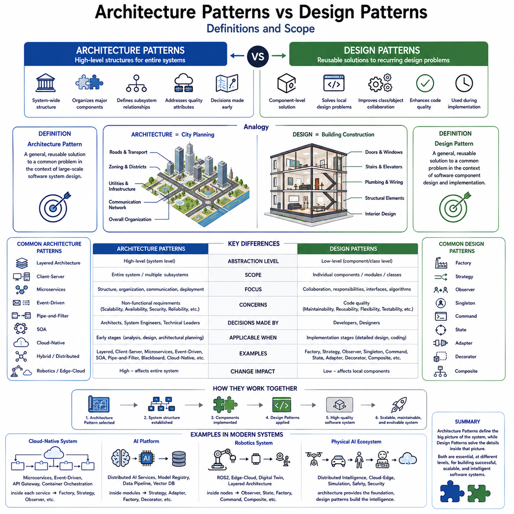{width="7.268055555555556in" height="7.268055555555556in"}

소프트웨어 아키텍처(Software Architecture)는 수십 년에 걸친 기술 혁신과 함께 발전하면서 현대 소프트웨어 공학(Software Engineering)의 가장 중요한 분야 가운데 하나가 되었다. 소프트웨어 시스템의 규모와 복잡성, 분산성, 그리고 지능화가 지속적으로 증가하면서 성공적인 소프트웨어 개발은 더 이상 효율적인 알고리즘을 구현하거나 재사용 가능한 클래스를 작성하는 것만으로는 충분하지 않게 되었다. 전체 시스템을 체계적으로 구성하는 방법과 반복적으로 발생하는 구현 문제를 해결하기 위한 재사용 가능한 설계 방법이 필요하게 되었으며, 이러한 과정에서 등장한 대표적인 개념이 바로 **아키텍처 패턴(Architecture Pattern)**과 **디자인 패턴(Design Pattern)**이다.

이 두 용어는 함께 언급되는 경우가 많으며 때로는 동일한 의미로 잘못 사용되기도 한다. 그러나 실제로는 서로 다른 추상화 수준(Abstraction Level)에서 서로 다른 문제를 해결하며, 소프트웨어 개발 과정에서도 서로 다른 역할을 담당한다. 따라서 소프트웨어 아키텍트(Software Architect), 시스템 엔지니어(System Engineer), 로봇 개발자(Robotics Developer), 클라우드 아키텍트(Cloud Architect), AI 엔지니어(AI Engineer), 그리고 피지컬 AI(Physical AI) 시스템 설계자는 이 둘의 차이를 명확하게 이해해야 한다.

아키텍처 패턴은 **전체 소프트웨어 시스템을 어떻게 구성할 것인가**를 정의하는 상위 수준의 구조적 모델이다. 시스템을 구성하는 주요 컴포넌트(Component), 서브시스템(Sub-System), 통신 방식(Communication Mechanism), 배포 구조(Deployment Strategy), 책임 분배(Responsibility Allocation), 확장 전략(Scalability Strategy), 장애 대응(Fault Tolerance), 그리고 시스템이 따라야 하는 기본 원칙(Fundamental Principle)을 정의한다. 다시 말해 아키텍처 패턴은 구현이 시작되기 전에 시스템 전체의 청사진(Blueprint)을 결정하며, 이후 이루어지는 모든 설계와 구현 과정에 영향을 미친다.

반면 디자인 패턴은 훨씬 낮은 추상화 수준에서 동작한다. 디자인 패턴은 소프트웨어 구현 과정에서 반복적으로 발생하는 문제를 해결하기 위한 검증된 설계 방법이다. 디자인 패턴은 전체 시스템 구조를 결정하는 것이 아니라 클래스(Class), 객체(Object), 인터페이스(Interface), 모듈(Module), 알고리즘(Algorithm), 라이브러리(Library)와 같은 세부 구현 요소들의 협력 방식을 정의한다.

이 둘의 차이는 도시(City)와 건물(Building)의 관계로 이해할 수 있다. 도시 계획(City Planning)은 도로, 교통망, 상하수도, 전력망, 공공시설, 통신망 등을 포함하는 도시 전체의 구조를 설계한다. 반면 건축 설계(Building Design)는 건물 내부의 계단(Staircase), 엘리베이터(Elevator), 창문(Window), 문(Door), 배관(Pipe), 구조물(Structure)을 어떻게 설계할 것인지를 결정한다. 도시 계획이 아키텍처 패턴이라면, 건물 내부 설계는 디자인 패턴에 해당한다.

아키텍처 패턴이 등장한 이유는 소프트웨어가 점점 더 거대해졌기 때문이다. 초기의 소프트웨어는 하나의 개발자가 전체 프로그램을 이해할 수 있을 정도로 작았지만, 엔터프라이즈 시스템(Enterprise System), 클라우드 컴퓨팅(Cloud Computing), 글로벌 인터넷 서비스(Global Internet Service), 자율주행 로봇(Autonomous Robot), AI 플랫폼(AI Platform) 등이 등장하면서 전체 시스템을 체계적으로 설계하지 않으면 유지보수 자체가 어려워졌다. 이에 따라 확장성(Scalability), 유지보수성(Maintainability), 보안(Security), 가용성(Availability), 상호운용성(Interoperability), 장애 복원력(Resilience)을 고려한 아키텍처 패턴이 필요하게 되었다.

디자인 패턴은 조금 다른 배경에서 발전하였다. 객체지향 프로그래밍(Object-Oriented Programming)이 보편화되면서 객체 생성(Object Creation), 알고리즘 교체(Algorithm Replacement), 이벤트 처리(Event Handling), 상태 변화(State Transition), 인터페이스 변환(Interface Adaptation), 객체 간 협력(Collaboration)과 같은 동일한 문제가 반복적으로 등장하였다. 개발자들은 이러한 문제를 매번 새롭게 해결하기보다는 이미 검증된 해결 방법을 일반화하여 재사용하기 시작하였으며, 이것이 디자인 패턴의 출발점이 되었다.

아키텍처 패턴은 프로젝트 초기 단계부터 시스템 전체에 영향을 미친다. 개발이 시작되기 전에 시스템을 계층형 아키텍처(Layered Architecture), 클라이언트-서버(Client-Server), 이벤트 기반(Event-Driven), 마이크로서비스(Microservices), 서비스 지향 아키텍처(Service-Oriented Architecture), 파이프-필터(Pipe-and-Filter), 블랙보드(Blackboard), P2P(Peer-to-Peer), 클라우드 네이티브(Cloud-Native), 또는 하이브리드 분산 아키텍처(Hybrid Distributed Architecture)로 설계할 것인지 결정한다. 이러한 결정은 배포 방식, 조직 구조, 통신 프로토콜, 운영 전략, 확장 방식까지 모두 결정한다.

반면 디자인 패턴은 이러한 아키텍처가 결정된 이후 실제 구현 과정에서 사용된다. 예를 들어 하나의 마이크로서비스 내부에서는 객체 생성에 Factory Pattern을 사용하고, 알고리즘 선택에는 Strategy Pattern을 사용하며, 이벤트 전달에는 Observer Pattern을 사용할 수 있다. 이러한 디자인 패턴은 구현을 단순화하지만 전체 시스템의 구조를 바꾸지는 않는다.

즉, **아키텍처 패턴은 시스템 구조(System Structure)를 결정하고, 디자인 패턴은 구현 구조(Implementation Structure)를 결정한다.** 아키텍처는 어떤 서브시스템이 존재하는지를 정의하고, 디자인 패턴은 그 내부 코드를 어떻게 작성할지를 정의한다.

아키텍처 패턴의 적용 범위는 전체 소프트웨어 생태계(Software Ecosystem)이다. 현대의 엔터프라이즈 시스템은 웹 서비스(Web Service), 데이터베이스(Database), 클라우드 인프라(Cloud Infrastructure), AI 플랫폼(AI Platform), 메시지 브로커(Message Broker), 캐시(Cache), 인증(Authentication), 로봇 미들웨어(Robotics Middleware), 디지털 트윈(Digital Twin), 모니터링 시스템(Monitoring System), 엣지 컴퓨팅(Edge Computing), 모바일 애플리케이션(Mobile Application) 등을 포함한다. 아키텍처 패턴은 이러한 구성 요소 간의 책임과 통신 구조를 정의한다.

디자인 패턴의 범위는 훨씬 작다. 하나의 마이크로서비스(Microservice), ROS 노드(Node), AI 추론 모듈(Inference Module), 사용자 인터페이스(User Interface), 하드웨어 추상화 계층(Hardware Abstraction Layer) 내부에는 여러 개의 디자인 패턴이 동시에 존재할 수 있다.

아키텍처 패턴은 주로 비기능 요구사항(Non-Functional Requirement)을 해결한다. 확장성, 장애 허용성(Fault Tolerance), 유지보수성, 보안, 운영 편의성(Operational Manageability), 배포 유연성(Deployment Flexibility), 모니터링, 재해 복구(Disaster Recovery) 등이 아키텍처 설계의 주요 관심사이다.

반면 디자인 패턴은 코드 품질(Code Quality)에 집중한다. 코드 중복(Code Duplication)을 줄이고, 추상화(Abstraction)를 높이며, 결합도(Coupling)를 낮추고, 응집도(Cohesion)를 높이며, 테스트(Testability)를 쉽게 하고, 재사용성을 높이는 것이 디자인 패턴의 핵심 목적이다.

책임 분배(Responsibility Allocation)에서도 차이가 있다. 아키텍처 패턴은 프레젠테이션 계층(Presentation Layer), 비즈니스 계층(Business Layer), 데이터 계층(Data Layer), 인프라 계층(Infrastructure Layer)과 같은 시스템 수준의 책임을 정의한다. 마이크로서비스는 비즈니스 기능(Business Capability)을 서비스 단위로 분리하며, 이벤트 기반 아키텍처(Event-Driven Architecture)는 이벤트 생산자(Event Producer)와 소비자(Event Consumer)를 분리한다.

반면 디자인 패턴은 클래스와 객체 간의 책임을 정의한다. Strategy Pattern은 알고리즘을 분리하고, Observer Pattern은 이벤트 통지를 담당하며, Mediator Pattern은 객체 간 통신을 중앙에서 관리하고, Composite Pattern은 계층 구조를 표현한다.

통신(Communication)의 관점에서도 차이가 있다. 아키텍처 패턴은 REST API, gRPC, Publish-Subscribe, 메시지 브로커(Message Broker), DDS(Data Distribution Service), 클라우드-엣지 통신(Cloud-Edge Communication)과 같은 시스템 수준의 통신 구조를 결정한다.

반면 디자인 패턴은 클래스 내부의 통신만을 다룬다. Observer Pattern은 객체 간 이벤트 전달을 담당하고, Command Pattern은 명령을 객체로 캡슐화하며, Chain of Responsibility는 요청을 순차적으로 전달한다.

배포(Deployment)는 아키텍처 패턴만이 결정할 수 있다. 모놀리식(Monolithic), 마이크로서비스(Microservices), 쿠버네티스(Kubernetes), 임베디드 시스템(Embedded System), 자율주행 로봇, 클라우드, 엣지 컴퓨팅, 서버리스(Serverless) 등의 배포 방식은 모두 아키텍처 패턴이 결정한다.

반면 디자인 패턴은 어디에서 실행되는지와 관계없이 동일하게 동작한다. Strategy Pattern이나 Factory Pattern은 클라우드에서도 사용할 수 있고, 로봇 내부에서도 사용할 수 있으며, 모바일 애플리케이션에서도 사용할 수 있다.

기술 발전도 아키텍처 패턴과 디자인 패턴에 서로 다른 영향을 준다. 아키텍처 패턴은 시대의 기술 변화와 함께 진화하였다. 메인프레임(Mainframe) 시대에는 중앙집중형(Centralized Architecture)이 일반적이었고, 이후 클라이언트-서버(Client-Server), 인터넷 기반 REST, SOA, 마이크로서비스, 클라우드 네이티브, AI 플랫폼, 피지컬 AI 아키텍처로 발전하였다.

반면 디자인 패턴은 수십 년 동안 거의 변하지 않았다. Factory Pattern, Observer Pattern, Strategy Pattern, Decorator Pattern, Adapter Pattern, Composite Pattern, Singleton Pattern은 객체지향 프로그래밍 시대부터 오늘날의 클라우드, AI, 로보틱스, 피지컬 AI까지 동일한 원리로 계속 사용되고 있다. 이는 디자인 패턴이 특정 기술이 아니라 소프트웨어 공학의 기본 원칙을 다루기 때문이다.

재사용성(Reusability)의 관점에서도 차이가 있다. 아키텍처 패턴은 조직 전체가 동일한 방식으로 시스템을 구축하도록 하여 조직 수준의 재사용성을 제공한다. 예를 들어 클라우드 플랫폼, 로봇 플랫폼, AI 플랫폼, 산업 자동화 플랫폼은 동일한 아키텍처 패턴을 기반으로 반복적으로 구축된다.

반면 디자인 패턴은 구현 수준에서 재사용성을 제공한다. 객체 생성, 이벤트 처리, 상태 관리, 인터페이스 변환, 알고리즘 선택 등을 새로운 프로젝트에서도 반복적으로 사용할 수 있다.

프로젝트에서 담당하는 역할도 다르다. 아키텍처 패턴은 소프트웨어 아키텍트(Software Architect), 엔터프라이즈 아키텍트(Enterprise Architect), 시스템 엔지니어(System Engineer), 클라우드 아키텍트(Cloud Architect), 로보틱스 아키텍트(Robotics Architect)가 프로젝트 초기 단계에서 결정한다. 이들은 비즈니스 목표(Business Objective), 운영 요구사항(Operational Requirement), 확장성, 보안, 조직 구조, 장기 유지보수까지 모두 고려한다.

반면 디자인 패턴은 실제 구현 과정에서 소프트웨어 개발자(Software Developer)가 선택하는 경우가 많다. 개발자는 코드 구조, 테스트 편의성, 유지보수성, 성능 등을 고려하여 적절한 디자인 패턴을 적용한다.

인공지능(AI) 시스템은 아키텍처 패턴과 디자인 패턴이 함께 사용되는 대표적인 사례이다. AI 플랫폼은 클라우드 네이티브 아키텍처, 마이크로서비스, 벡터 데이터베이스(Vector Database), 모델 레지스트리(Model Registry), MLOps 플랫폼 등을 사용한다. 동시에 각 서비스 내부에서는 Factory Pattern, Strategy Pattern, Observer Pattern, Cache Pattern 등을 사용하여 모델 관리, 추론 파이프라인(Inference Pipeline), 자원 관리(Resource Management)를 구현한다.

로보틱스(Robotics)도 마찬가지이다. 현대의 자율주행 로봇은 ROS2, 클라우드-엣지 아키텍처, 디지털 트윈, 이벤트 기반 통신(Event-Driven Communication), 계층형 아키텍처를 사용한다. 그러나 ROS 노드 내부에서는 Observer Pattern으로 센서 이벤트를 처리하고, Strategy Pattern으로 경로 계획 알고리즘을 교체하며, Factory Pattern으로 하드웨어 드라이버를 생성하고, State Pattern으로 미션 상태를 관리하며, Command Pattern으로 로봇 동작을 표현하고, Composite Pattern으로 행동 트리(Behavior Tree)를 구성한다.

피지컬 AI(Physical AI)는 이러한 관계를 더욱 확장한다. 미래의 지능형 시스템은 분산 AI 서비스, 멀티모달 인식(Multimodal Perception), 이기종 컴퓨팅(Heterogeneous Computing), 디지털 트윈, 클라우드 네이티브, 자율 추론(Autonomous Reasoning), 사이버 보안(Cybersecurity), 기능 안전(Functional Safety), 생명주기 관리(Lifecycle Management), 지속적 학습(Continuous Learning)을 모두 하나의 아키텍처로 통합한다. 동시에 각 구성 요소 내부는 다양한 디자인 패턴을 이용하여 구현된다. 즉, **아키텍처 패턴은 지능형 생태계(Intelligent Ecosystem)를 구성하고, 디자인 패턴은 그 내부 동작을 정교하게 구현한다.**

또 하나의 중요한 차이는 변경 비용(Change Cost)이다. 아키텍처 패턴은 시스템 전체에 영향을 미치므로 구현 이후 변경하기가 매우 어렵다. 모놀리식을 마이크로서비스로 변경하거나 중앙집중형 구조를 분산형 구조로 변경하는 것은 시스템 전체를 다시 설계해야 하는 대규모 작업이다.

반면 디자인 패턴은 비교적 국소적인 변경(Local Change)이 가능하다. Singleton Pattern을 의존성 주입(Dependency Injection)으로 교체하거나, Observer Pattern을 다른 이벤트 처리 방식으로 변경하는 것은 시스템 전체를 수정하지 않아도 된다.

소프트웨어 공학의 발전 과정을 살펴보면 아키텍처 패턴과 디자인 패턴은 서로 경쟁하는 개념이 아니라 **서로 다른 추상화 수준에서 협력하는 상호보완적인 공학 기법**임을 알 수 있다. 아키텍처 패턴은 시스템 전체의 구조를 제공하고, 디자인 패턴은 그 구조 내부를 효율적으로 구현하도록 지원한다.

클라우드 네이티브, 인공지능, 자율 로봇, 디지털 트윈, 사이버-물리 시스템(Cyber-Physical System), 엣지 AI(Edge AI), 그리고 피지컬 AI 시대가 될수록 이 둘의 차이는 더욱 중요해지고 있다. 미래의 지능형 시스템은 **확장성(Scalability), 복원력(Resilience), 보안(Security), 상호운용성(Interoperability), 분산 지능(Distributed Intelligence)**을 제공하는 강력한 **아키텍처 패턴**과, **유연성(Flexibility), 유지보수성(Maintainability), 재사용성(Reusability), 지속적인 진화(Continuous Evolution)**를 지원하는 우수한 **디자인 패턴**을 동시에 필요로 한다.

결국 **아키텍처 패턴은 지능형 시스템의 전체 구조를 결정하고, 디자인 패턴은 그 내부의 지능을 효율적으로 구현한다.** 이 두 가지 개념은 함께 현대 소프트웨어 공학, 로보틱스(Robotics), 인공지능(AI), 그리고 피지컬 AI를 구성하는 가장 중요한 이론적 기반이며, 앞으로 등장할 더욱 자율적이고 적응적이며 협력적인 지능형 컴퓨팅 생태계(Intelligent Computing Ecosystem)를 구축하는 핵심 원칙으로 계속 발전해 나갈 것이다.

## 02.02 Layered Architecture: Principles, Tradeoffs, and Use Cases

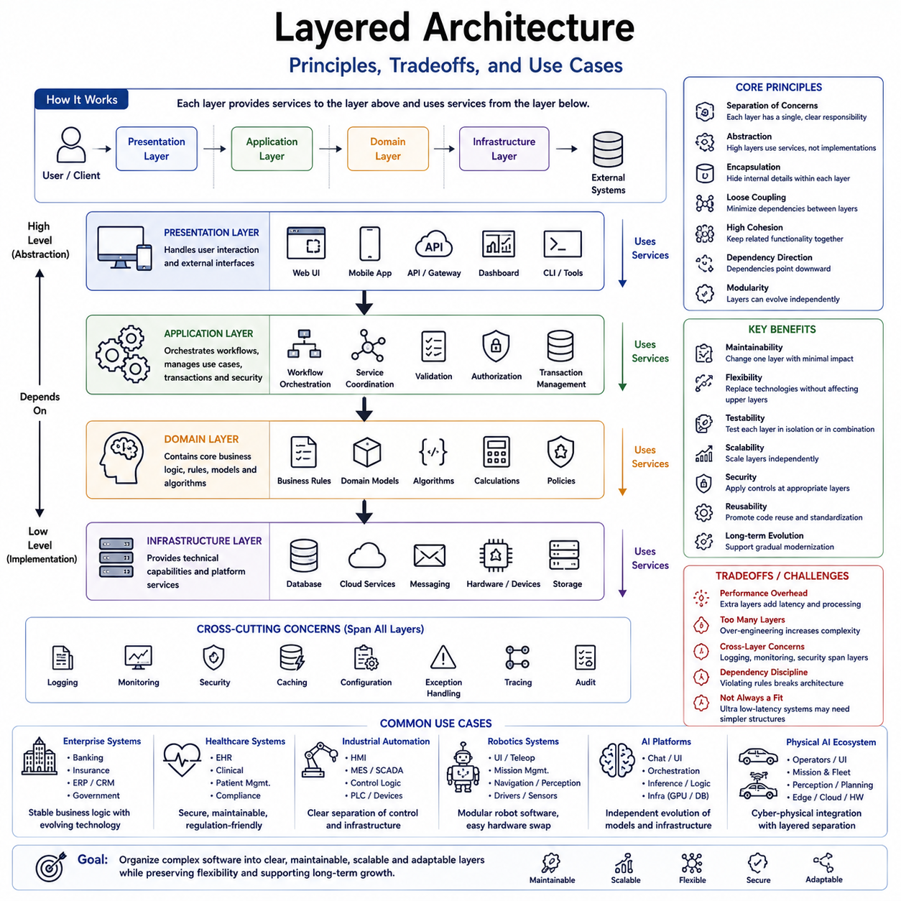{width="7.268055555555556in" height="7.268055555555556in"}

계층형 아키텍처(Layered Architecture)는 소프트웨어 공학(Software Engineering) 역사에서 가장 오래되고, 가장 영향력이 크며, 가장 널리 사용되는 소프트웨어 아키텍처 패턴 가운데 하나이다. 초기 엔터프라이즈 소프트웨어(Enterprise Software)가 등장한 이후 개발자들은 시스템의 기능을 여러 개의 논리적인 계층(Layer)으로 분리하면 시스템의 구조를 훨씬 체계적으로 만들 수 있으며, 유지보수성(Maintainability), 확장성(Scalability), 그리고 장기적인 발전 가능성을 크게 향상시킬 수 있다는 사실을 발견하였다. 하나의 거대한 프로그램 안에서 모든 기능이 서로 직접 연결되는 구조 대신, 계층형 아키텍처는 시스템을 여러 개의 계층으로 나누고 각 계층이 특정한 역할만 수행하도록 설계한다. 일반적으로 상위 계층은 바로 아래 계층의 서비스를 이용하며, 각 계층은 자신의 내부 구현을 외부에 노출하지 않는다. 이러한 단순하지만 강력한 구조는 운영체제(Operating System), 엔터프라이즈 시스템, 금융 플랫폼(Financial Platform), 의료 정보 시스템(Healthcare Information System), 산업 자동화(Industrial Automation), 로보틱스(Robotics), 클라우드 애플리케이션(Cloud Application), 그리고 현대의 AI 플랫폼(AI Platform)에 이르기까지 매우 다양한 분야에서 활용되고 있다.

계층형 아키텍처의 핵심 철학은 **관심사의 분리(Separation of Concerns)** 이다. 하나의 소프트웨어 시스템은 사용자 인터페이스(User Interface), 비즈니스 규칙(Business Logic), 데이터 처리(Data Processing), 인프라 관리(Infrastructure Management), 통신(Communication), 보안(Security), 데이터 저장(Persistence), 하드웨어 제어(Hardware Control) 등 매우 다양한 역할을 수행한다. 이러한 역할들이 하나의 코드 안에 뒤섞이면 특정 기능을 수정할 때 예상하지 못한 다른 기능까지 영향을 받게 된다. 계층형 아키텍처는 이러한 문제를 해결하기 위해 각 기능을 독립적인 계층으로 분리하고, 계층 간에는 명확한 인터페이스(Interface)를 통해서만 상호작용하도록 한다.

각 계층은 자신의 바로 아래 계층이 제공하는 서비스를 사용하며, 위쪽 계층에는 서비스를 제공한다. 상위 계층은 하위 계층이 어떻게 구현되었는지를 알 필요가 없다. 이러한 추상화(Abstraction)는 데이터베이스(Database), 통신 프로토콜(Communication Protocol), 하드웨어 드라이버(Hardware Driver), 클라우드 서비스(Cloud Service) 등이 변경되더라도 비즈니스 로직이나 사용자 인터페이스를 수정하지 않아도 되는 유연성을 제공한다. 또한 비즈니스 요구사항이 변경되더라도 기반 기술은 그대로 유지할 수 있어 장기적인 유지보수가 매우 쉬워진다.

가장 전통적인 계층형 아키텍처는 일반적으로 네 개의 주요 계층으로 구성된다.

가장 위에는 **프레젠테이션 계층(Presentation Layer)** 이 존재한다. 이 계층은 사용자와 시스템 사이의 상호작용을 담당한다. 웹 페이지(Web Page), 모바일 애플리케이션(Mobile Application), 데스크톱 프로그램(Desktop Application), 대시보드(Dashboard), 명령행 인터페이스(Command Line Interface), REST API, 시각화(Visualization), 사용자 입력(User Input), 인증 화면(Authentication Screen) 등이 모두 이 계층에 포함된다. 프레젠테이션 계층은 사용자와의 상호작용만 담당하며, 복잡한 비즈니스 규칙은 포함하지 않는다.

그 아래에는 **애플리케이션 계층(Application Layer)** 또는 **서비스 계층(Service Layer)** 이 존재한다. 이 계층은 업무 흐름(Workflow)을 관리하고, 여러 비즈니스 기능을 연결하며, 트랜잭션(Transaction)을 관리하고, 사용자 요청을 검증하며, 여러 도메인 서비스(Domain Service)를 호출하여 하나의 업무를 완성한다. 애플리케이션 계층은 실제 비즈니스 규칙을 구현하기보다는 비즈니스 기능들이 올바른 순서대로 수행되도록 조정하는 역할을 담당한다.

그 다음에는 **도메인 계층(Domain Layer)** 또는 **비즈니스 계층(Business Layer)** 이 존재한다. 이 계층은 시스템의 핵심 지식과 비즈니스 규칙을 포함한다. 금융 시스템이라면 이자 계산, 의료 시스템이라면 진단 규칙, 제조 시스템이라면 생산 로직, 로봇이라면 경로 계획(Path Planning), AI 시스템이라면 추론 정책(Inference Policy)이 모두 이 계층에 위치한다. 도메인 계층은 데이터베이스나 사용자 인터페이스와 독립적으로 유지되므로 기술이 변경되어도 핵심 업무 로직은 그대로 유지될 수 있다.

가장 아래에는 **인프라 계층(Infrastructure Layer)** 이 존재한다. 데이터베이스(Database), 클라우드 플랫폼(Cloud Platform), 메시지 브로커(Message Broker), 운영체제(Operating System), 네트워크(Network), 파일 시스템(File System), 로봇 미들웨어(Robotics Middleware), 센서(Sensor), 액추에이터(Actuator), 하드웨어 드라이버, AI 추론 엔진(AI Inference Engine), 로그 시스템(Log System), 모니터링(Monitoring) 등이 모두 여기에 포함된다. 이 계층은 기술적인 서비스를 제공하지만 비즈니스 정책은 포함하지 않는다.

계층형 아키텍처의 가장 중요한 원칙 가운데 하나는 **의존성 방향(Dependency Direction)** 이다. 일반적으로 의존성은 위에서 아래 방향으로만 존재한다. 프레젠테이션 계층은 애플리케이션 계층을 사용하고, 애플리케이션 계층은 도메인 계층을 사용하며, 도메인 계층은 인프라 계층을 사용하거나 의존성 역전(Dependency Inversion)을 통해 인프라로부터 독립성을 유지한다. 이러한 방향성은 시스템의 결합도(Coupling)를 크게 줄여준다.

또 다른 중요한 원칙은 **추상화(Abstraction)** 이다. 상위 계층은 하위 계층의 구현을 알지 못하고 오직 인터페이스만 사용한다. 데이터베이스가 관계형 데이터베이스(Relational Database)에서 NoSQL로 변경되거나, AI 엔진이 새로운 모델로 교체되더라도 상위 계층은 수정할 필요가 없다.

**캡슐화(Encapsulation)** 역시 핵심 원칙이다. 데이터베이스 최적화(Database Optimization)는 인프라 계층 내부에서만 관리되고, 센서 제어는 하드웨어 추상화(Hardware Abstraction) 내부에서만 관리된다. 비즈니스 로직은 사용자 인터페이스나 하드웨어의 복잡성을 알 필요가 없다.

계층형 아키텍처는 **느슨한 결합(Low Coupling)** 을 지향한다. 시스템의 한 부분이 변경되어도 다른 부분에는 최소한의 영향만 미치도록 설계한다. 계층 간에는 정의된 인터페이스만 존재하며 내부 구현은 숨겨진다. 이러한 구조는 테스트(Test), 유지보수(Maintenance), 병렬 개발(Parallel Development), 코드 재사용(Code Reuse)을 매우 쉽게 만든다.

동시에 **높은 응집도(High Cohesion)** 도 추구한다. 하나의 계층은 서로 밀접하게 관련된 기능만 포함해야 하며, 관련 없는 기능은 포함하지 않는다. 사용자 인터페이스는 Presentation Layer에, 비즈니스 로직은 Domain Layer에, 데이터 저장은 Infrastructure Layer에 위치한다.

계층형 아키텍처는 모듈화(Modularization)를 자연스럽게 지원한다. 사용자 인터페이스는 웹(Web)에서 모바일(Mobile)로 변경될 수 있으며, 데이터베이스는 Oracle에서 PostgreSQL 또는 Cloud Database로 변경될 수 있다. 로봇 센서도 새로운 하드웨어로 교체할 수 있지만 비즈니스 로직은 그대로 유지된다.

테스트(Testability)도 크게 향상된다. 단위 테스트(Unit Test)는 도메인 계층만 독립적으로 검증할 수 있으며, 통합 테스트(Integration Test)는 계층 간 연결을 검증한다. 인프라 테스트는 데이터베이스나 센서 인터페이스를 확인하고, 시스템 테스트(System Test)는 전체 계층을 함께 검증한다.

장기 유지보수(Long-Term Maintenance) 역시 계층형 아키텍처의 큰 장점이다. 엔터프라이즈 시스템은 수십 년 동안 운영되는 경우가 많다. 기술은 계속 발전하지만 핵심 비즈니스 규칙은 크게 변하지 않는다. 계층 구조는 필요한 부분만 점진적으로 현대화할 수 있도록 해 준다.

확장성(Scalability)도 계층별로 독립적으로 확보할 수 있다. 프레젠테이션 계층은 여러 대의 웹 서버(Web Server)로 확장할 수 있고, 애플리케이션 계층은 서비스 서버(Service Server)를 늘릴 수 있으며, 데이터베이스는 복제(Replication)나 샤딩(Sharding)을 통해 확장할 수 있다.

보안(Security)도 계층별로 관리할 수 있다. 사용자 인증(Authentication)은 프레젠테이션 계층에서 시작되고, 권한 관리(Authorization)는 애플리케이션 계층에서 수행되며, 데이터 암호화(Encryption), 감사 로그(Audit Log), 저장소 보안(Storage Security)은 인프라 계층에서 담당한다.

트랜잭션(Transaction) 관리 역시 자연스럽게 계층 구조에 맞추어 수행된다. 애플리케이션 계층은 여러 비즈니스 작업을 하나의 트랜잭션으로 관리하며, 인프라 계층은 실제 데이터베이스 트랜잭션과 롤백(Rollback)을 수행한다.

계층형 아키텍처는 금융(Banking), 의료(Healthcare), 정부 시스템(Government System), 보험(Insurance), 교육(Education), 제조(Manufacturing), 공급망 관리(Supply Chain Management) 등 거의 모든 엔터프라이즈 시스템에서 성공적으로 활용되고 있다.

산업 자동화(Industrial Automation)에서도 매우 적합하다. HMI(Human Machine Interface)는 프레젠테이션 계층에 위치하고, 생산 관리(Production Management)는 애플리케이션 계층, 생산 로직은 도메인 계층, PLC 통신(PLC Communication), 산업용 프로토콜(Industrial Protocol), 로봇 제어기(Robot Controller), 데이터베이스는 인프라 계층에 위치한다.

로보틱스(Robotics) 역시 계층형 구조를 적극 활용한다. 사용자 인터페이스는 프레젠테이션 계층, 미션 관리(Mission Management)는 애플리케이션 계층, 위치 추정(Localization), 경로 계획(Path Planning), 객체 인식(Object Recognition), 행동 생성(Behavior Generation)은 도메인 계층, ROS 미들웨어, DDS(Data Distribution Service), 센서, 액추에이터, GPU, 임베디드 제어기는 인프라 계층에 위치한다.

인공지능(AI) 시스템도 계층형 구조를 활용한다. 사용자 인터페이스는 대화형 AI(Chatbot), 대시보드(Dashboard), 모니터링 시스템을 제공하며, 애플리케이션 계층은 AI 워크플로우를 관리하고, 도메인 계층은 의미 추론(Semantic Reasoning), 정책(Policy), 비즈니스 규칙을 포함한다. 인프라 계층은 GPU, 벡터 데이터베이스(Vector Database), 모델 레지스트리(Model Registry), Feature Store, 클라우드 서비스 등을 관리한다.

피지컬 AI(Physical AI)는 이러한 구조를 더욱 확장한다. 운영자 인터페이스는 프레젠테이션 계층, 미션 관리와 플릿 관리(Fleet Management)는 애플리케이션 계층, 인식(Perception), 계획(Planning), 추론(Reasoning), 세계 모델(World Model), 자율주행, 안전 검증은 도메인 계층, GPU, NPU, ROS2, DDS, 센서, 액추에이터, 클라우드, 엣지 컴퓨팅(Edge Computing), Safety Processor는 인프라 계층에 위치한다.

그러나 계층형 아키텍처에도 단점이 존재한다.

가장 대표적인 단점은 **성능 오버헤드(Performance Overhead)** 이다. 하나의 요청(Request)이 여러 계층을 거쳐야 하기 때문에 함수 호출(Function Call), 데이터 변환(Data Transformation), 인터페이스 처리 등이 반복되어 응답 시간이 증가할 수 있다. 대부분의 엔터프라이즈 시스템에서는 큰 문제가 되지 않지만, 매우 짧은 지연 시간을 요구하는 시스템에서는 최적화가 필요하다.

또 다른 문제는 **과도한 계층화(Excessive Layering)** 이다. 단순한 기능임에도 불필요하게 여러 계층을 추가하면 코드량과 복잡도만 증가하고 실제 효과는 거의 없을 수 있다. 따라서 계층은 필요한 만큼만 설계해야 한다.

또한 **횡단 관심사(Cross-Cutting Concern)** 는 계층 구조만으로 해결하기 어렵다. 로그(Log), 모니터링(Monitoring), 캐시(Cache), 보안(Security), 예외 처리(Exception Handling), 추적(Tracing), 설정(Configuration)은 모든 계층에 동시에 영향을 미친다. 이러한 기능은 AOP(Aspect-Oriented Programming), 인터셉터(Interceptor), 필터(Filter), 의존성 주입(Dependency Injection) 등을 이용하여 해결한다.

계층 구조를 유지하려면 지속적인 설계 원칙도 필요하다. 프레젠테이션 계층이 직접 데이터베이스를 접근하거나, 인프라 계층이 비즈니스 로직을 포함하기 시작하면 계층 구조는 점차 무너지게 된다. 따라서 명확한 책임 분리와 설계 규칙을 지속적으로 유지해야 한다.

매우 대규모 인터넷 서비스에서는 계층형 아키텍처만으로는 충분하지 않을 수 있다. 마이크로서비스(Microservices), 이벤트 기반 아키텍처(Event-Driven Architecture), 분산 캐시(Distributed Cache), 도메인 주도 설계(Domain-Driven Design), 서비스 메시(Service Mesh)와 함께 사용하는 경우가 많다. 실제로는 **각각의 마이크로서비스 내부가 계층형 아키텍처를 사용하는 경우가 매우 일반적**이다.

클라우드 네이티브(Cloud-Native) 시대에도 계층형 아키텍처는 사라지지 않았다. 오히려 하나의 마이크로서비스 내부에서 Presentation Layer, Application Layer, Domain Layer, Infrastructure Layer를 그대로 유지하는 형태로 발전하였다.

최근에는 도메인 주도 설계(Domain-Driven Design, DDD)와 함께 사용하는 경우도 많다. 도메인 모델(Domain Model)을 시스템의 중심에 두고, Repository Pattern, Dependency Inversion, Hexagonal Architecture(육각형 아키텍처), Ports and Adapters Architecture와 결합하여 더욱 유연한 구조를 만든다.

계층형 아키텍처는 AI, 로보틱스, 클라우드 컴퓨팅, 피지컬 AI 시대에도 계속 발전하고 있다. AI 추론 서비스, 멀티모달 인식(Multimodal Perception), 디지털 트윈, 엣지 컴퓨팅, 분산 로봇 시스템, GPU 기반 AI 플랫폼도 모두 계층 구조를 기반으로 설계된다. 사용하는 기술은 계속 변화하지만 **관심사의 분리(Separation of Concerns), 추상화(Abstraction), 캡슐화(Encapsulation), 느슨한 결합(Low Coupling), 높은 응집도(High Cohesion), 의존성 관리(Dependency Management), 모듈화(Modularization)** 라는 핵심 원칙은 변하지 않는다.

계층형 아키텍처가 수십 년 동안 지속적으로 사용되고 있는 이유는 특정 기술에 의존하지 않는 보편적인 설계 원칙을 제공하기 때문이다. 프로그래밍 언어(Programming Language)는 계속 발전하고, 클라우드 플랫폼은 변화하며, AI는 더욱 지능화되고, 로봇은 피지컬 AI로 발전하고 있다. 그러나 **복잡성을 분리하고, 유지보수를 쉽게 하며, 독립적인 발전을 가능하게 하는 계층형 구조의 기본 철학은 여전히 현대 소프트웨어 공학의 핵심 기반**이다. 따라서 계층형 아키텍처는 과거의 엔터프라이즈 시스템뿐만 아니라 **현대의 클라우드 네이티브 시스템, 로보틱스, 인공지능, 그리고 피지컬 AI 시대에도 가장 유연하고 오래 지속될 수 있는 대표적인 소프트웨어 아키텍처 패턴**으로 자리매김하고 있다.

## 02.03 Hexagonal Architecture: Ports and Adapters

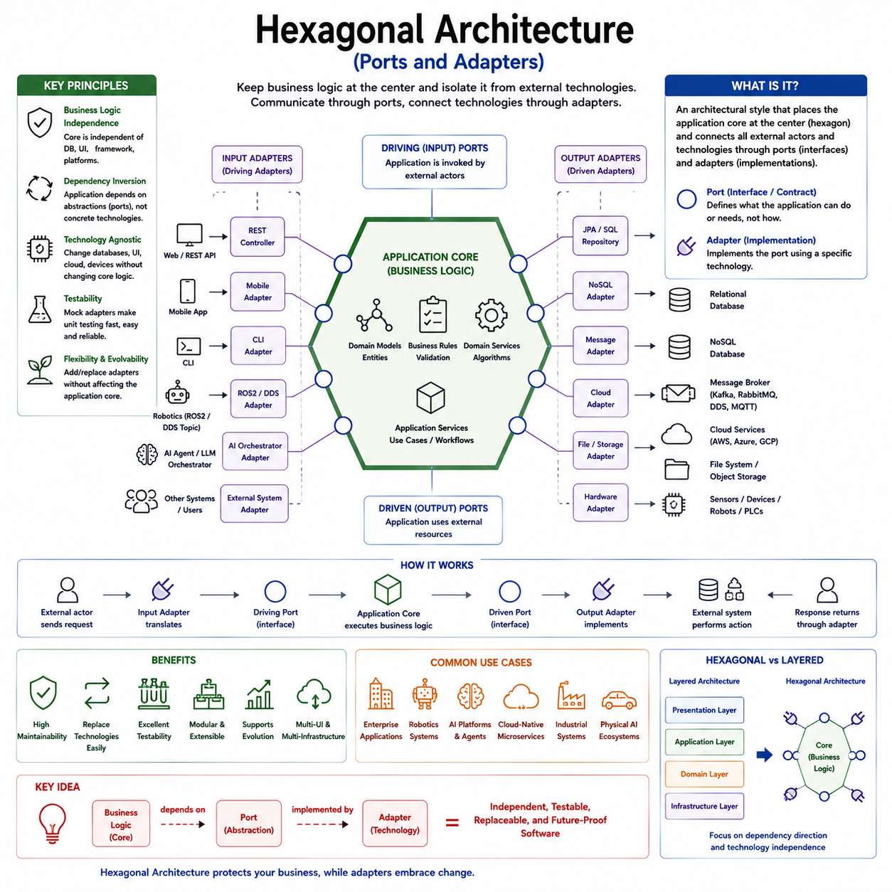{width="7.268055555555556in" height="7.268055555555556in"}

육각형 아키텍처(Hexagonal Architecture)는 **포트와 어댑터 아키텍처(Ports and Adapters Architecture)** 라고도 불리며, 현대 소프트웨어 공학(Software Engineering)에서 가장 영향력 있는 아키텍처 패턴 가운데 하나이다. 이 개념은 2000년대 초반 알리스테어 콕번(Alistair Cockburn)이 제안하였으며, 수십 년 동안 엔터프라이즈 소프트웨어(Enterprise Software)가 가지고 있던 근본적인 문제를 해결하기 위해 등장하였다. 기존의 계층형 아키텍처(Layered Architecture)는 프레젠테이션(Presentation), 비즈니스 로직(Business Logic), 인프라(Infrastructure)를 논리적으로 분리하는 데에는 성공했지만, 실제 구현 과정에서는 비즈니스 로직이 데이터베이스(Database), 사용자 인터페이스(User Interface), 메시징 시스템(Messaging System), 프레임워크(Framework), 미들웨어(Middleware)와 강하게 결합되는 문제가 자주 발생하였다. 소프트웨어 규모가 커지고 기술 변화 속도가 빨라질수록 이러한 결합은 유지보수성(Maintainability), 이식성(Portability), 테스트 용이성(Testability), 그리고 장기적인 확장성을 크게 저하시켰다. 육각형 아키텍처는 **비즈니스 로직을 시스템의 절대적인 중심(Core)에 배치하고, 모든 외부 기술을 교체 가능한 구성 요소로 취급**함으로써 이러한 문제를 해결한다.

육각형 아키텍처의 핵심 철학은 **비즈니스 로직은 외부 기술과 완전히 독립적이어야 한다**는 것이다. 비즈니스 규칙(Business Rules)은 기업의 업무 지식(Domain Knowledge), 운영 절차(Operational Procedure), 의사결정 정책(Decision Policy), 최적화 알고리즘(Optimization Algorithm), 미션 목표(Mission Objective) 등을 담고 있으며, 이것이 소프트웨어의 가장 중요한 자산이다. 반면 데이터베이스, 웹 프레임워크, 클라우드 플랫폼, 통신 프로토콜, 로봇 미들웨어, AI 추론 엔진, 사용자 인터페이스는 시간이 지나면서 반드시 변경된다. 따라서 아키텍처는 이러한 기술 변화가 핵심 비즈니스 로직에 영향을 주지 않도록 설계되어야 한다. 다시 말해 **기술이 애플리케이션을 지배하는 것이 아니라, 애플리케이션이 기술을 선택하는 구조**를 만드는 것이 육각형 아키텍처의 목표이다.

\'육각형(Hexagonal)\'이라는 이름은 시스템 중심에 육각형을 그리고 그 주변에 여러 외부 시스템을 배치한 그림에서 유래하였다. 육각형이라는 형태 자체에 특별한 의미가 있는 것은 아니다. 중요한 것은 애플리케이션이 하나의 사용자 인터페이스나 하나의 데이터베이스만을 대상으로 하는 것이 아니라, **여러 종류의 외부 시스템과 동시에 연결될 수 있다**는 사실을 표현하는 것이다. 육각형의 각 면은 하나의 연결 지점(Connection Point)을 의미하며, 모든 연결은 **포트(Port)** 를 통해 이루어진다.

애플리케이션 코어(Application Core)는 이 아키텍처의 중심이다. 여기에는 도메인 모델(Domain Model), 비즈니스 엔티티(Business Entity), 비즈니스 규칙, 검증 정책(Validation Policy), 최적화 알고리즘, 일정 관리(Scheduling), 미션 계획(Mission Planning), 도메인 서비스(Domain Service), 애플리케이션 서비스(Application Service) 등이 포함된다. 이 영역에는 데이터베이스, GUI, 클라우드 API, 운영체제, 하드웨어, 로봇 미들웨어, AI 프레임워크와 같은 기술적인 요소가 직접 존재하지 않는다. 애플리케이션 코어는 오직 비즈니스 문제를 해결하는 것에만 집중한다.

포트(Port)는 애플리케이션과 외부 세계를 연결하는 **추상적인 인터페이스(Interface)** 이다. 포트는 어떤 정보가 들어오고 나갈 수 있는지를 정의하지만, 실제 통신 방식은 정의하지 않는다. 포트는 기능(Capability)을 정의하는 계약(Contract)이며, 비즈니스 로직과 외부 기술 사이의 경계를 형성한다. 따라서 애플리케이션은 REST API를 통해 호출되는지, GUI에서 호출되는지, ROS2 DDS 메시지를 통해 호출되는지, CLI(Command Line Interface)에서 호출되는지 전혀 알 필요가 없다.

포트는 일반적으로 두 가지 종류로 나뉜다.

첫 번째는 **입력 포트(Input Port)** 또는 **주 포트(Primary Port)** 이다. 외부 사용자가 애플리케이션의 기능을 호출하기 위한 인터페이스이다. 사용자, AI 에이전트(AI Agent), 로봇, 웹 서비스(Web Service), 업무 시스템(Business Workflow) 등이 애플리케이션의 기능을 요청할 때 사용된다.

두 번째는 **출력 포트(Output Port)** 또는 **보조 포트(Secondary Port)** 이다. 애플리케이션이 외부 기술을 사용하기 위해 정의하는 인터페이스이다. 데이터베이스 저장, 메시지 송신, 외부 API 호출, 파일 저장, 클라우드 서비스, AI 모델 호출, 디지털 트윈(Digital Twin), 산업용 제어기(Industrial Controller) 등이 모두 출력 포트를 통해 연결된다.

어댑터(Adapter)는 포트를 실제 기술과 연결하는 구현체(Implementation)이다.

입력 어댑터(Input Adapter)는 외부 요청을 애플리케이션 호출로 변환한다. REST Controller는 HTTP 요청을 애플리케이션 서비스 호출로 변환하고, GUI는 사용자의 클릭을 비즈니스 명령으로 변환하며, ROS2 노드는 DDS 메시지를 애플리케이션 명령으로 변환한다. AI 오케스트레이션(AI Orchestration) 시스템도 LLM의 결과를 애플리케이션 서비스 호출로 변환할 수 있다.

반대로 출력 어댑터(Output Adapter)는 애플리케이션의 요청을 실제 기술로 전달한다. Repository는 비즈니스 저장 요청을 SQL이나 NoSQL 명령으로 변환하고, 클라우드 어댑터는 AWS, Azure, GCP와 통신하며, 메시지 어댑터는 Kafka, RabbitMQ, DDS, MQTT 등을 통해 이벤트를 전달한다. 하드웨어 어댑터는 센서, 액추에이터, PLC, 임베디드 장치와 통신하며, AI 어댑터는 GPU 추론 엔진, 파운데이션 모델(Foundation Model), 벡터 데이터베이스(Vector Database)와 연결된다.

육각형 아키텍처의 이론적 기반은 **의존성 역전 원칙(Dependency Inversion Principle)** 이다. 기존 소프트웨어에서는 비즈니스 로직이 데이터베이스 라이브러리나 프레임워크에 직접 의존하는 경우가 많았다. 따라서 데이터베이스를 변경하면 비즈니스 코드도 함께 수정해야 했다. 육각형 아키텍처는 이러한 관계를 뒤집는다. 비즈니스 로직이 필요한 기능을 인터페이스로 정의하고, 인프라가 그 인터페이스를 구현한다. 즉, **비즈니스는 기술에 의존하지 않고, 기술이 비즈니스에 의존한다.**

이러한 구조는 비즈니스 독립성(Business Independence)을 크게 향상시킨다. 기업은 데이터베이스를 교체하거나, 클라우드 공급자를 변경하거나, 새로운 AI 프레임워크를 도입하거나, 새로운 로봇 하드웨어를 적용할 수 있다. 그러나 이러한 변화는 모두 어댑터 내부에서 해결되므로 비즈니스 로직은 전혀 수정할 필요가 없다.

테스트(Testability)도 매우 뛰어나다. 비즈니스 로직은 포트를 통해서만 외부와 통신하기 때문에 실제 데이터베이스나 클라우드 없이도 가짜(Mock) 어댑터를 연결하여 테스트할 수 있다. 따라서 단위 테스트(Unit Test)는 매우 빠르고 안정적으로 수행되며, 이후 통합 테스트(Integration Test)에서 실제 어댑터만 검증하면 된다.

기술 독립성(Technology Independence)은 소프트웨어의 수명을 크게 연장한다. 클라우드 서비스는 계속 발전하고, AI 프레임워크는 빠르게 바뀌며, ROS1에서 ROS2로 발전하고, CPU에서 GPU, NPU로 컴퓨팅 구조도 변화한다. 육각형 아키텍처는 이러한 변화가 모두 어댑터 내부에서만 일어나도록 만들어 비즈니스 지식을 보호한다.

또한 육각형 아키텍처는 여러 개의 사용자 인터페이스를 동시에 지원하기 쉽다. 하나의 고객 관리(Customer Management) 시스템이 웹(Web), 모바일(Mobile), 관리자(Admin), 외부 API, AI Agent를 모두 지원하더라도 비즈니스 로직은 하나만 존재한다. 각각의 인터페이스는 독립적인 입력 어댑터만 추가하면 된다.

출력 기술도 동시에 여러 개를 사용할 수 있다. 동일한 애플리케이션은 관계형 데이터베이스(Relational Database), NoSQL, 메모리 저장소(In-Memory Repository), 클라우드 스토리지(Cloud Storage)를 동시에 지원할 수 있다. 실행 환경에 따라 적절한 어댑터만 선택하면 된다.

육각형 아키텍처는 점진적인 시스템 발전(Evolutionary Development)에도 매우 적합하다. 초기에는 간단한 데이터베이스를 사용하다가 이후 클라우드 플랫폼, AI 서비스, 이벤트 기반(Event-Driven) 구조, 디지털 트윈으로 발전하더라도 새로운 어댑터만 추가하면 되므로 기존 비즈니스 로직은 그대로 유지된다.

엔터프라이즈 시스템은 육각형 아키텍처의 대표적인 활용 사례이다. 고객 관리 시스템은 웹, 모바일, API를 입력 어댑터로 사용하고, 데이터베이스, 이메일, SMS, 인증 서버를 출력 어댑터로 사용한다. 핵심 고객 관리 규칙은 애플리케이션 코어 안에서 그대로 유지된다.

클라우드 네이티브(Cloud-Native) 시스템도 이 구조를 적극 활용한다. 하나의 마이크로서비스(Microservice)는 포트를 중심으로 설계되고, 어댑터는 쿠버네티스(Kubernetes), API Gateway, 서비스 메시(Service Mesh), 분산 캐시(Distributed Cache), 클라우드 저장소(Cloud Storage), 모니터링 시스템과 연결된다.

AI 플랫폼에서도 매우 유용하다. AI 오케스트레이션 시스템은 LLM, 벡터 데이터베이스, 임베딩 모델(Embedding Model), 멀티모달 AI, GPU 서버 등을 모두 어댑터로 연결한다. 새로운 LLM으로 교체하거나 다른 GPU 서버를 사용하더라도 비즈니스 로직은 그대로 유지된다.

로보틱스(Robotics)는 육각형 아키텍처의 장점이 가장 잘 나타나는 분야 가운데 하나이다. 자율주행 로봇은 카메라(Camera), LiDAR, Radar, IMU, GPS, 로봇 팔(Robot Manipulator), 모터 제어기(Motor Controller), 산업용 센서, 무선 통신, Safety Controller 등 다양한 하드웨어와 연결된다. 시간이 지나면 센서는 교체되고, ROS1은 ROS2로 바뀌며, CPU는 GPU와 NPU 중심으로 발전한다. 육각형 아키텍처는 이러한 모든 장치를 출력 어댑터로 연결하므로 **내비게이션(Navigation), 위치 추정(Localization), 미션 계획(Mission Planning), 조작(Manipulation), 자율 행동(Autonomous Behavior)** 은 하드웨어와 독립적으로 유지된다.

ROS2 역시 육각형 아키텍처와 매우 잘 어울린다. 애플리케이션 코어는 행동 계획, 미션 관리, 센서 융합(Sensor Fusion), 자율 의사결정을 수행한다. 입력 어댑터는 ROS Topic, DDS 메시지, Service, Action을 처리하고, 출력 어댑터는 모터 제어, 센서 요청, 진단 정보, 클라우드 연동, 디지털 트윈 동기화를 담당한다.

피지컬 AI(Physical AI)는 이 구조를 더욱 확장한다. 미래의 지능형 시스템은 멀티모달 인식(Multimodal Perception), 이기종 컴퓨팅(Heterogeneous Computing), 클라우드-엣지 협업(Cloud-Edge Collaboration), 디지털 트윈, AI 에이전트, 자율 추론(Autonomous Reasoning), 사이버 보안(Cybersecurity), 기능 안전(Functional Safety), 지속적 학습(Continuous Learning)을 모두 포함한다. 센서, 세계 모델(World Model), 계획 엔진(Planning Engine), LLM, GPU, 디지털 트윈, 시뮬레이터(Simulator), 플릿 관리(Fleet Management)는 모두 독립적인 어댑터가 되며, 중앙의 인지 코어(Cognitive Core)는 그대로 유지된다.

이벤트 기반 아키텍처(Event-Driven Architecture)와도 매우 잘 결합된다. 이벤트 생산자(Event Producer)는 입력 포트를 통해 들어오고, 출력 어댑터는 Kafka, DDS, MQTT, RabbitMQ, Apache Pulsar 등 다양한 메시징 시스템으로 이벤트를 전달한다. 따라서 메시징 기술이 바뀌어도 비즈니스 로직은 수정되지 않는다.

도메인 주도 설계(Domain-Driven Design, DDD)와도 매우 자연스럽게 결합된다. 풍부한 도메인 모델(Rich Domain Model), Repository, Factory, Aggregate, Value Object, Domain Event가 애플리케이션 코어 안에 존재하고, 외부 기술은 모두 포트와 어댑터를 통해 연결된다.

의존성 주입(Dependency Injection) 프레임워크도 육각형 아키텍처를 구현하는 데 매우 유용하다. 실행 시점(Runtime)에 적절한 어댑터를 자동으로 연결할 수 있다. 개발 환경에서는 메모리 저장소(In-Memory Repository)를 사용하고, 운영 환경에서는 클라우드 데이터베이스를 사용할 수 있으며, 시뮬레이션에서는 가상 하드웨어(Virtual Hardware)를 사용할 수도 있다.

물론 육각형 아키텍처에도 단점은 존재한다.

가장 큰 단점은 초기 설계 복잡성(Initial Complexity)이다. 인터페이스, 포트, 어댑터, 의존성 관리 등을 모두 설계해야 하므로 작은 프로젝트에서는 오히려 과도한 구조가 될 수 있다.

또 다른 문제는 지나친 추상화(Over-Abstraction)이다. 필요하지 않은 인터페이스를 너무 많이 만들면 코드가 오히려 복잡해질 수 있다. 따라서 **안정적인 비즈니스 기능**을 중심으로 포트를 설계해야 한다.

성능 오버헤드(Performance Overhead)는 일반적으로 매우 작지만 존재한다. 어댑터를 거치면서 함수 호출과 객체 변환이 추가된다. 대부분의 엔터프라이즈 시스템에서는 문제가 되지 않지만 초저지연(Ultra Low Latency) 시스템에서는 최적화가 필요할 수 있다.

학습 난이도(Learning Complexity)도 다소 높다. 프레임워크 중심 개발에 익숙한 개발자는 의존성 역전과 인터페이스 중심 설계에 익숙해지는 데 시간이 필요하다. 또한 개발 과정에서 비즈니스 로직이 어댑터로 새어나가거나, 인프라 코드가 도메인으로 침투하지 않도록 지속적인 설계 원칙을 유지해야 한다.

많은 사람들이 육각형 아키텍처가 계층형 아키텍처를 대체한다고 오해하지만 실제로는 그렇지 않다. **두 아키텍처는 서로 경쟁하는 것이 아니라 상호 보완적인 관계**이다. 실제 프로젝트에서는 애플리케이션 코어 내부를 **Application Layer, Domain Layer, Infrastructure Abstraction** 형태의 계층 구조로 구성하면서, 외부와의 연결만 포트와 어댑터 구조를 사용하는 경우가 매우 많다. 육각형 아키텍처는 계층을 없애는 것이 아니라 **의존성 방향(Dependency Direction)을 올바르게 만드는 것**이 핵심이다.

기존 계층형 아키텍처가 **데이터베이스를 어떻게 연결할 것인가**에 초점을 맞추었다면, 육각형 아키텍처는 **비즈니스가 어떤 기능을 제공해야 하는가**에 초점을 맞춘다. 즉 기술 중심 사고에서 **비즈니스 중심 사고(Business-Centric Thinking)** 로 관점을 전환하는 것이다.

클라우드 네이티브, 분산 AI(Distributed AI), 로보틱스, 엣지 컴퓨팅(Edge Computing), 사이버-물리 시스템(Cyber-Physical System), 그리고 피지컬 AI 시대에는 이러한 철학이 더욱 중요해지고 있다. 미래의 지능형 시스템은 끊임없이 새로운 하드웨어와 새로운 AI 기술을 도입해야 하지만, 기업의 핵심 업무 지식과 운영 정책은 오랫동안 유지되어야 한다. **포트와 어댑터 아키텍처는 변화하는 기술과 변하지 않는 비즈니스를 분리하는 가장 효과적인 아키텍처 가운데 하나**이다.

결국 육각형 아키텍처는 단순한 구조나 설계 기법이 아니라 **비즈니스 지식을 기술 변화로부터 보호하려는 소프트웨어 철학(Software Philosophy)** 이다. 데이터베이스, 클라우드 플랫폼, 로봇 하드웨어, AI 프레임워크, 통신 프로토콜, 운영체제, 사용자 인터페이스는 앞으로도 계속 변화할 것이다. 그러나 기업의 업무 지식과 핵심 알고리즘은 오랫동안 유지되어야 한다. 육각형 아키텍처는 이러한 핵심 지식을 시스템의 중심에 두고, 그 주변을 교체 가능한 어댑터로 감싸며, 안정적인 포트를 통해 연결함으로써 **현대 소프트웨어 공학, 클라우드 네이티브 시스템, 로보틱스, 인공지능(AI), 그리고 피지컬 AI 시대를 위한 가장 유지보수하기 쉽고, 테스트하기 쉬우며, 미래 지향적인 아키텍처 패턴 가운데 하나**로 자리 잡고 있다.

## 02.04 Clean Architecture and Domain-Driven Design

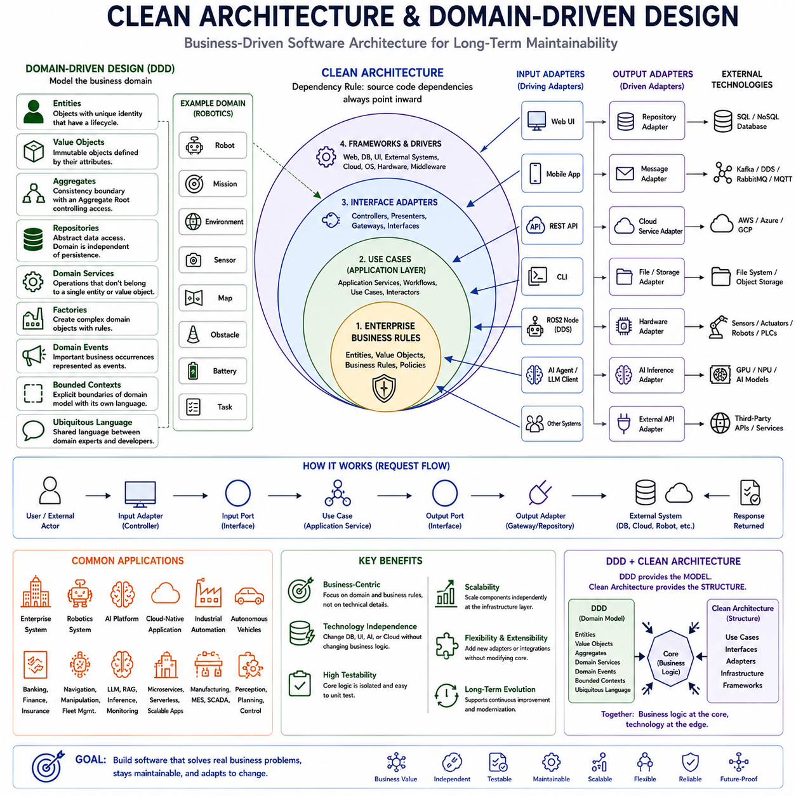{width="7.268055555555556in" height="7.268055555555556in"}

클린 아키텍처(Clean Architecture)와 도메인 주도 설계(Domain-Driven Design, DDD)는 현대 소프트웨어 공학(Software Engineering)의 발전 과정에서 등장한 가장 영향력 있는 소프트웨어 아키텍처 방법론(Methodology) 가운데 두 가지이다. 이들은 서로 다른 시대적 배경과 목적에서 출발하였지만 공통적으로 **소프트웨어는 기술 중심이 아니라 비즈니스 지식(Business Knowledge) 중심으로 설계되어야 한다**는 철학을 공유한다. 엔터프라이즈 시스템(Enterprise System), 클라우드 네이티브 플랫폼(Cloud-Native Platform), 로보틱스(Robotics), 인공지능(Artificial Intelligence), 사이버-물리 시스템(Cyber-Physical System), 그리고 피지컬 AI(Physical AI) 시스템이 점점 복잡해지면서 장기적인 유지보수성과 확장성은 최신 프레임워크를 선택하는 것보다 **핵심 비즈니스 로직을 보호하고 기술 변화로부터 독립시키는 것**이 훨씬 중요하다는 사실이 명확해졌다. 클린 아키텍처와 도메인 주도 설계는 이러한 요구를 충족하기 위해 서로 보완적으로 사용되는 대표적인 설계 방법이다.

과거의 많은 소프트웨어는 비즈니스 요구사항보다 데이터베이스(Database), 웹 프레임워크(Web Framework), 미들웨어(Middleware), 프로그래밍 언어(Programming Language), 클라우드 서비스(Cloud Service)와 같은 기술 요소를 중심으로 설계되었다. 그 결과 비즈니스 규칙(Business Rules)이 사용자 인터페이스(User Interface), 데이터 저장(Persistence), 메시징 시스템(Messaging System), 하드웨어 드라이버(Hardware Driver), 통신 프로토콜(Communication Protocol)과 강하게 결합되었다. 이러한 구조에서는 데이터베이스를 변경하거나 프레임워크를 교체하는 것만으로도 핵심 비즈니스 코드까지 함께 수정해야 했으며, 유지보수 비용이 크게 증가하고 시스템의 수명도 짧아졌다.

도메인 주도 설계는 이러한 문제를 해결하기 위해 **에릭 에반스(Eric Evans)** 가 제안한 접근 방식이다. 도메인 주도 설계는 소프트웨어 개발을 단순한 기술 구현이 아니라 **현실 세계의 업무(Domain)를 정확하게 모델링(Modeling)하는 과정**으로 본다. 여기서 도메인(Domain)은 기업이나 조직이 수행하는 업무 지식(Knowledge), 개념(Concept), 용어(Terminology), 비즈니스 규칙, 운영 절차(Operational Procedure), 관계(Relationship), 제약 조건(Constraint), 워크플로우(Workflow), 의사결정(Decision Logic)을 의미한다. 즉 소프트웨어는 단순한 프로그램이 아니라 **현실 업무를 실행 가능한 형태로 표현한 모델**이어야 한다.

도메인 주도 설계의 핵심은 **도메인 모델(Domain Model)** 이다. 도메인 모델은 현실 세계의 비즈니스 개념과 관계를 소프트웨어 안에 그대로 표현한 것이다. 데이터베이스 구조나 화면 구성이 아니라 **비즈니스 자체를 중심으로 모델을 설계**한다. 이를 위해 엔티티(Entity), 값 객체(Value Object), 집합체(Aggregate), 도메인 서비스(Domain Service), 리포지토리(Repository), 팩토리(Factory), 도메인 이벤트(Domain Event), 경계 컨텍스트(Bounded Context) 등의 개념을 사용한다.

엔티티(Entity)는 시스템 안에서 고유한 식별자(Identity)를 가지는 객체이다. 고객(Customer), 주문(Order), 로봇(Robot), 미션(Mission), 차량(Vehicle), 환자(Patient), 제조 장비(Manufacturing Equipment), 창고 자산(Warehouse Asset), 검사 작업(Inspection Task), 자율 에이전트(Autonomous Agent) 등이 대표적인 엔티티이다. 엔티티는 내부 상태가 변경되어도 동일한 객체로 계속 유지된다.

값 객체(Value Object)는 엔티티와 달리 독립적인 식별자를 가지지 않는다. 좌표(Coordinate), 시간(Time Stamp), 금액(Monetary Value), 색상(Color), 크기(Dimension), 온도(Temperature), 배터리 잔량(Battery Level), 위치(Position), 속도(Velocity), 설정 값(Configuration Parameter) 등이 여기에 해당한다. 값 객체는 값 자체만으로 동일성이 결정되며 일반적으로 변경 불가능(Immutable)하게 설계된다. 이러한 특성은 코드의 안정성과 예측 가능성을 높여 준다.

집합체(Aggregate)는 여러 엔티티와 값 객체를 하나의 일관성 경계(Consistency Boundary)로 묶는 개념이다. 모든 객체가 자유롭게 서로를 수정하는 것이 아니라 **집합체 루트(Aggregate Root)** 를 통해서만 내부 객체에 접근하도록 하여 비즈니스 규칙을 항상 일관성 있게 유지한다. 예를 들어 제조 시스템에서는 생산 주문(Production Order)이 집합체 루트가 되어 작업 목록, 일정 정보, 품질 기록, 재고 정보를 관리할 수 있다. 로보틱스에서는 하나의 미션(Mission)이 경로 계획(Path Planning), 안전 정책(Safety Policy), 실행 기록(Execution History)을 포함하는 집합체가 될 수 있다.

리포지토리(Repository)는 도메인 모델과 데이터 저장 기술을 분리하기 위한 추상화 계층이다. 도메인 모델은 데이터를 저장해야 하지만 관계형 데이터베이스(Relational Database), NoSQL, 파일 시스템(File System), 디지털 트윈(Digital Twin)과 같은 구체적인 저장 기술을 직접 알 필요는 없다. 리포지토리는 저장 기능을 인터페이스로 정의하고 실제 구현은 인프라 계층에서 담당한다.

팩토리(Factory)는 복잡한 객체 생성 과정을 담당한다. 생성 과정에서 검증(Validation), 초기화(Initialization), 여러 객체 간의 조합(Cooperation), 비즈니스 규칙 적용이 필요한 경우 생성 로직을 하나의 팩토리로 모아 코드 중복을 줄이고 일관성을 유지한다.

도메인 서비스(Domain Service)는 하나의 엔티티에 속하지 않는 비즈니스 기능을 담당한다. 생산 일정 최적화(Scheduling Optimization), 플릿 관리(Fleet Coordination), 미션 할당(Mission Allocation), 경로 계획(Route Planning), 예지보전(Predictive Maintenance), 에너지 최적화(Energy Optimization), 업무 오케스트레이션(Workflow Orchestration) 등이 대표적인 예이다.

도메인 이벤트(Domain Event)는 비즈니스적으로 의미 있는 사건(Event)을 표현한다. 주문 완료(Order Completed), 로봇 도킹(Robot Docked), 배터리 부족(Battery Depleted), 검사 실패(Inspection Failed), 재고 보충(Inventory Replenished), 이상 탐지(Anomaly Detected), 유지보수 예약(Maintenance Scheduled) 등이 모두 도메인 이벤트이다. 이벤트 기반 아키텍처(Event-Driven Architecture)는 이러한 도메인 이벤트와 매우 자연스럽게 결합된다.

도메인 주도 설계에서 가장 중요한 개념 가운데 하나는 **경계 컨텍스트(Bounded Context)** 이다. 하나의 대기업 안에서도 제조(Manufacturing), 물류(Logistics), 회계(Accounting), 구매(Procurement), 유지보수(Maintenance), 고객 관리(Customer Management), 로보틱스 운영(Robotics Operation), AI 분석(AI Analytics)은 동일한 용어를 사용하더라도 서로 다른 의미를 가질 수 있다. 경계 컨텍스트는 이러한 차이를 명확히 구분하여 **각 업무 영역마다 독립적인 모델을 유지**하도록 한다.

또한 **공통 언어(Ubiquitous Language)** 의 사용을 강조한다. 개발자, 아키텍트, 업무 담당자, 운영자, 관리자 모두가 동일한 용어를 사용하여 업무를 표현함으로써 의사소통 오류를 줄이고 소프트웨어가 실제 업무를 정확하게 반영하도록 한다.

도메인 주도 설계가 **비즈니스 모델링**에 초점을 맞춘다면, 클린 아키텍처는 **소프트웨어 구조(Software Structure)** 에 초점을 맞춘다.

클린 아키텍처는 **로버트 C. 마틴(Robert C. Martin)** 이 제안한 아키텍처 방법론으로, 육각형 아키텍처(Hexagonal Architecture), 어니언 아키텍처(Onion Architecture) 등의 개념을 발전시킨 형태이다. 핵심 목표는 **비즈니스 정책(Business Policy)이 프레임워크, 데이터베이스, UI, 클라우드, 운영체제, 하드웨어와 독립적으로 유지되도록 하는 것**이다.

클린 아키텍처는 시스템을 **동심원(Concentric Circle)** 형태로 구성한다.

가장 안쪽에는 **엔터프라이즈 비즈니스 규칙(Enterprise Business Rules)** 이 위치한다. 이 계층은 여러 시스템에서 공통으로 사용되는 조직의 핵심 정책을 포함한다. 금융 규정(Financial Regulation), 제조 표준(Manufacturing Standard), 의료 규칙(Medical Protocol), 로봇 안전 정책(Robot Safety Policy), 자율주행 제약(Autonomous Navigation Constraint), 에너지 관리 정책(Energy Management Strategy) 등이 여기에 해당한다.

그 다음 계층에는 **유스케이스(Use Case)** 가 위치한다. 유스케이스는 고객 등록(Customer Registration), 로봇 미션 실행(Robot Mission Execution), 창고 재고 갱신(Warehouse Inventory Update), 자율 검사(Autonomous Inspection), AI 추론 오케스트레이션(AI Inference Orchestration), 디지털 트윈 동기화(Digital Twin Synchronization)와 같이 실제 업무 흐름을 수행한다. 유스케이스는 오직 도메인 모델과 추상 인터페이스만 사용한다.

그 다음 계층은 **인터페이스 어댑터(Interface Adapter)** 이다. 컨트롤러(Controller), 프레젠터(Presenter), 게이트웨이(Gateway), API 어댑터 등이 이 계층에 포함된다. 외부 요청을 유스케이스로 전달하고, 유스케이스의 결과를 외부 시스템이 이해할 수 있는 형태로 변환한다.

가장 바깥쪽은 **프레임워크와 드라이버(Frameworks and Drivers)** 이다. 데이터베이스(Database), 웹 프레임워크(Web Framework), 클라우드 플랫폼(Cloud Platform), 운영체제(Operating System), ROS2, DDS, GPU 라이브러리, AI 프레임워크, IoT 게이트웨이(IoT Gateway), 파일 시스템 등이 여기에 포함된다. 클린 아키텍처에서는 이러한 요소들을 모두 **교체 가능한 구현 세부 사항(Implementation Detail)** 으로 취급한다.

클린 아키텍처의 가장 중요한 원칙은 **의존성 규칙(Dependency Rule)** 이다. 모든 의존성은 항상 안쪽을 향한다. 즉 바깥 계층은 안쪽 계층에 의존하지만, 안쪽 계층은 바깥 계층을 알지 못한다. 비즈니스 엔티티는 웹 프레임워크, 데이터베이스, ROS2, AI 라이브러리, GPU 드라이버에 의존하지 않는다. 반대로 외부 기술이 비즈니스 모델에 의존한다.

이러한 구조는 뛰어난 기술 독립성(Technology Independence)을 제공한다. AI 프레임워크는 계속 바뀌고, ROS1은 ROS2로 발전하며, GPU는 NPU와 FPGA로 발전하고, 클라우드 서비스도 지속적으로 변화한다. 그러나 핵심 비즈니스 로직은 그대로 유지된다.

테스트(Testability)도 크게 향상된다. 도메인 엔티티와 유스케이스는 데이터베이스나 GPU 없이도 독립적으로 테스트할 수 있다. Mock 객체를 이용하여 빠른 단위 테스트(Unit Test)를 수행하고, 이후 인터페이스 어댑터와 인프라를 별도로 통합 테스트(Integration Test)할 수 있다.

유지보수성(Maintainability) 역시 매우 뛰어나다. 데스크톱 애플리케이션을 웹으로 변경하거나 REST API를 gRPC로 변경하거나, 클라우드 플랫폼을 교체하거나, 로봇 하드웨어를 업그레이드하거나, AI 모델을 새로운 모델로 교체하더라도 대부분의 변경은 외부 계층에서만 이루어진다.

확장성(Scalability)도 자연스럽게 확보된다. 클라우드에서는 API Gateway, AI 추론 서버, 디지털 트윈 서버, 데이터베이스, 로봇 플릿 서버(Fleet Server)를 각각 독립적으로 확장할 수 있다. 핵심 비즈니스 로직은 변경되지 않는다.

보안(Security) 역시 계층별로 관리된다. 인증(Authentication)은 인터페이스 계층에서 수행하고, 권한 관리(Authorization)는 유스케이스에서 처리하며, 암호화(Encryption), 보안 저장소(Secure Storage), HSM(Hardware Security Module), 신뢰 실행 환경(Trusted Execution Environment)은 인프라 계층에서 구현한다.

도메인 주도 설계와 클린 아키텍처는 매우 자연스럽게 결합된다. 도메인 주도 설계는 **무엇을 모델링할 것인가**를 정의하고, 클린 아키텍처는 **그 모델을 어떻게 보호할 것인가**를 정의한다. 도메인 모델은 가장 안쪽 계층에 위치하고, 유스케이스가 이를 활용하며, 인터페이스 어댑터가 외부와 연결하고, 프레임워크는 가장 바깥에서 기술적인 역할만 수행한다.

현대의 엔터프라이즈 시스템은 대부분 이러한 구조를 사용한다. 금융 시스템은 고객(Customer), 계좌(Account), 거래(Transaction), 규제(Regulation)를 도메인 모델로 표현하고, 의료 시스템은 환자(Patient), 진단(Diagnosis), 치료 계획(Treatment Plan), 의료 프로토콜(Medical Protocol)을 모델링한다. 제조 시스템은 생산 주문, 설비 유지보수, 품질 관리, 물류를 각각 도메인으로 구성한다.

AI 시스템도 동일한 원리를 적용한다. 의미 지식(Semantic Knowledge), AI 정책(AI Governance), 추론 규칙(Reasoning Rule)은 도메인 모델에 포함되고, 유스케이스는 RAG(Retrieval-Augmented Generation), 멀티모달 추론(Multimodal Reasoning), 모델 선택(Model Selection), 프롬프트 관리(Prompt Management)를 담당한다. 인터페이스 어댑터는 벡터 데이터베이스(Vector Database), LLM, 임베딩 모델(Embedding Model), GPU 클러스터와 연결한다.

로보틱스에서도 매우 효과적이다. 로봇(Robot), 미션(Mission), 지도(Map), 장애물(Obstacle), 매니퓰레이터(Manipulator), 센서(Sensor), 자율 행동(Autonomous Behavior), 검사 절차(Inspection Procedure)는 모두 도메인 모델이 된다. 유스케이스는 위치 추정(Localization), 자율주행(Navigation), 플릿 관리(Fleet Management), 조작(Manipulation), 미션 수행, 안전 검증(Safety Validation)을 담당한다. ROS2, DDS, LiDAR, 카메라, GPU, 클라우드, 시뮬레이터(Simulator)는 모두 인터페이스 어댑터와 인프라 계층에 위치한다.

피지컬 AI는 이러한 구조를 더욱 발전시킨다. 미래의 지능형 시스템은 로봇, 멀티모달 AI, 디지털 트윈, 클라우드-엣지 협업(Cloud-Edge Collaboration), 분산 AI, 자율 계획(Autonomous Planning), 인간-기계 협업(Human-Machine Collaboration), 사이버 보안(Cybersecurity), 지속적 학습(Continuous Learning)을 모두 포함한다. 도메인 주도 설계는 물리 환경(Physical Environment), 자율 에이전트, 협업 미션, 체화 추론(Embodied Reasoning), 안전 정책을 모델링하며, 클린 아키텍처는 이러한 모델을 보호한다. 센서, GPU, NPU, LLM, 세계 모델(World Model), 시뮬레이터, ROS2, 엣지 플랫폼(Edge Platform), 클라우드 서비스는 모두 교체 가능한 기술 요소가 된다.

물론 두 방법론에도 어려움은 존재한다.

도메인 주도 설계는 개발자와 업무 전문가(Domain Expert)의 긴밀한 협력이 필수적이다. 업무를 제대로 이해하지 못하면 도메인 모델은 현실과 동떨어진 추상적인 구조가 된다.

클린 아키텍처 역시 엄격한 의존성 관리가 필요하다. 개발자가 편의를 위해 프레임워크 코드를 도메인 내부에 넣거나 인프라 로직을 유스케이스에 포함시키면 구조가 쉽게 무너질 수 있다. 따라서 지속적인 코드 리뷰(Code Review)와 아키텍처 관리(Architecture Governance)가 필요하다.

초기 개발 비용도 상대적으로 높다. 도메인 모델, 인터페이스, 의존성 경계, 유스케이스, 어댑터 등을 먼저 설계해야 하기 때문에 작은 프로젝트에서는 과도한 구조가 될 수도 있다.

또한 모든 프로젝트에 반드시 적용해야 하는 것은 아니다. 비즈니스 규칙이 거의 없고 규모가 작은 시스템이라면 단순한 계층형 아키텍처만으로도 충분할 수 있다. 따라서 프로젝트 규모, 수명, 업무 복잡도, 기술 변화 가능성 등을 종합적으로 고려하여 적용 여부를 결정해야 한다.

클라우드 네이티브, 인공지능, 로보틱스, 자율주행, 산업 자동화, 피지컬 AI 시대에는 이 두 방법론의 중요성이 더욱 커지고 있다. 미래의 시스템은 다양한 하드웨어와 AI 기술 위에서 동작하지만 핵심 업무 지식과 자율 의사결정 능력은 오랫동안 유지되어야 한다. 도메인 주도 설계와 클린 아키텍처는 **변하지 않는 비즈니스 지식과 끊임없이 변화하는 기술을 효과적으로 분리하는 가장 강력한 아키텍처 방법론** 가운데 하나이다.

결국 **도메인 주도 설계(Domain-Driven Design)** 는 **현실 세계를 정확하게 모델링하는 방법**을 제공하며, **클린 아키텍처(Clean Architecture)** 는 **그 모델을 기술 변화로부터 안전하게 보호하는 구조**를 제공한다. 두 방법론을 함께 적용하면 소프트웨어는 특정 프레임워크나 인프라에 종속되지 않고, 조직의 핵심 업무 지식을 중심으로 성장하는 장기적인 시스템이 된다. 이는 앞으로의 **클라우드 네이티브(Cloud-Native), 로보틱스(Robotics), 인공지능(AI), 그리고 피지컬 AI 시대**에도 가장 중요한 소프트웨어 설계 철학으로 계속 발전해 나갈 것이다.

## 02.05 CQRS and Event Sourcing Pattern

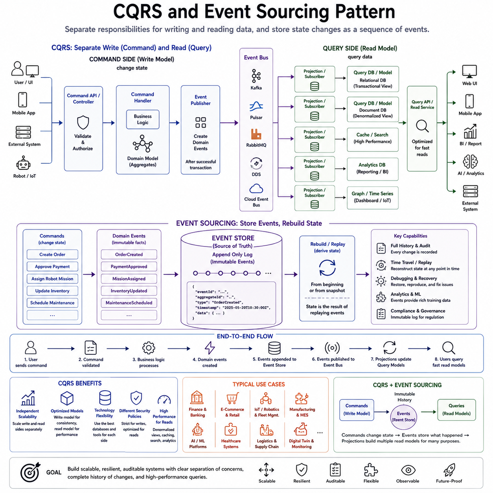{width="7.268055555555556in" height="7.268055555555556in"}

CQRS(Command Query Responsibility Segregation)와 이벤트 소싱(Event Sourcing)은 현대의 확장 가능한(Scalable), 분산형(Distributed), 복원력이 높은(Resilient), 그리고 완전한 감사 추적(Auditable)이 가능한 소프트웨어 시스템을 구축하기 위한 가장 영향력 있는 아키텍처 패턴 가운데 하나이다. 두 기술은 각각 독립적으로 사용할 수도 있지만, 서로 매우 뛰어난 상호보완성을 가지므로 함께 적용되는 경우가 많다. CQRS는 **시스템 상태를 변경하는 작업(Command)** 과 **시스템 상태를 조회하는 작업(Query)** 을 분리하는 아키텍처이며, 이벤트 소싱은 객체의 현재 상태(Current State)를 저장하는 대신 **상태를 변화시킨 모든 비즈니스 이벤트(Business Event)를 저장하는 방식**이다. 이 두 가지를 함께 적용하면 현대의 엔터프라이즈 시스템(Enterprise System), 클라우드 네이티브 플랫폼(Cloud-Native Platform), 금융 시스템(Financial System), 산업 자동화(Industrial Automation), 로보틱스(Robotics), 디지털 트윈(Digital Twin), 인공지능(AI), 그리고 피지컬 AI(Physical AI)에 매우 적합한 아키텍처를 구축할 수 있다.

기존의 대부분의 엔터프라이즈 시스템은 CRUD(Create, Read, Update, Delete) 모델을 기반으로 설계되었다. 생성(Create), 조회(Read), 수정(Update), 삭제(Delete)가 모두 동일한 데이터베이스 구조(Database Schema)와 동일한 도메인 모델(Domain Model)을 공유한다. 이러한 구조는 비교적 단순한 업무에서는 매우 효과적이며 대부분의 관계형 데이터베이스(Relational Database)가 이를 지원한다.

그러나 시스템 규모가 커질수록 CRUD 방식은 여러 한계를 드러낸다. 일반적으로 조회(Read)는 수정(Write)보다 수백 배에서 수천 배 이상 많이 발생한다. 또한 비즈니스 규칙은 점점 복잡해지고, 분산 서비스는 독립적인 확장이 필요하며, 기업은 모든 업무 변경 내역을 완벽하게 추적하기를 원한다. 이러한 요구사항을 해결하기 위해 CQRS와 이벤트 소싱이 등장하였다.

CQRS의 기본 철학은 매우 단순하다.

소프트웨어가 수행하는 작업은 크게 두 가지뿐이다.

**명령(Command)** 은 시스템의 상태(State)를 변경한다.

**조회(Query)** 는 시스템의 상태를 읽기만 하며 어떠한 변경도 하지 않는다.

두 작업은 동일한 비즈니스 개념을 다루더라도 성능 특성, 확장성 요구사항, 보안 수준, 데이터 구조가 완전히 다르다. 따라서 하나의 모델로 처리하는 것보다 각각 독립적으로 설계하는 것이 더 효율적이라는 것이 CQRS의 핵심이다.

명령(Command)은 비즈니스 상태를 변경하는 작업이다. 고객 등록(Customer Registration), 금융 거래 승인(Financial Transaction Approval), 로봇 미션 할당(Robot Mission Assignment), 창고 재고 수정(Warehouse Inventory Update), 유지보수 예약(Maintenance Scheduling), 의료 진단 등록(Medical Diagnosis Registration), 자율 검사 시작(Autonomous Inspection), 생산 작업 시작(Manufacturing Workflow), 플릿 자원 할당(Fleet Resource Allocation) 등이 모두 명령에 해당한다.

명령은 단순히 데이터를 저장하는 것이 아니라 비즈니스 규칙을 검증하고, 도메인 규칙(Domain Rule)을 적용하며, 일관성(Consistency)을 유지하고, 집합체(Aggregate)를 관리하며, 도메인 이벤트(Domain Event)를 생성한다.

반대로 조회(Query)는 시스템 상태를 변경하지 않는다.

고객 정보 조회(Customer Information), 금융 보고서 생성(Financial Report), 로봇 상태 모니터링(Robot Monitoring), 디지털 트윈 시각화(Digital Twin Visualization), AI 추론 결과 조회(AI Inference Result), 창고 재고 조회(Warehouse Inventory), 생산 현황 대시보드(Production Dashboard), 운영 통계(Operation Statistics) 등이 모두 조회 작업이다.

기존 CRUD에서는 명령과 조회가 동일한 데이터 모델을 사용한다.

그러나 명령은 정확성과 일관성이 가장 중요하고, 조회는 속도와 검색 효율이 가장 중요하다.

CQRS는 이러한 서로 다른 요구사항을 하나의 모델에서 억지로 해결하지 않고 각각 독립적인 모델로 설계한다.

명령 모델(Command Model)은 **비즈니스 정확성(Business Correctness)** 을 가장 중요하게 생각한다.

사용자의 요청을 검증하고, 비즈니스 규칙을 적용하며, 트랜잭션(Transaction)을 유지하고, 집합체(Aggregate)를 관리하며, 동시성(Concurrency)을 제어하고, 도메인 이벤트를 생성한다.

반면 조회 모델(Query Model)은 **검색 효율(Search Efficiency)** 을 최우선으로 한다.

조회 모델은 화면 표시나 통계 생성에 맞게 데이터를 자유롭게 비정규화(Denormalization)할 수 있다.

Materialized View, 검색 엔진(Search Engine), 그래프 데이터베이스(Graph Database), 시계열 데이터베이스(Time-Series Database), 캐시(Cache) 등이 조회 모델에서 자주 사용된다.

CQRS의 가장 큰 장점 가운데 하나는 **독립적인 확장성(Independent Scalability)** 이다.

현대의 인터넷 서비스는 읽기(Read)가 쓰기(Write)보다 수백에서 수천 배 많다.

전자상거래(E-Commerce), 금융 대시보드(Financial Dashboard), 공장 모니터링, 디지털 트윈, AI 분석 플랫폼, 로봇 플릿 관리(Fleet Management) 등은 대부분 조회 비율이 압도적으로 높다.

CQRS에서는 조회 서버만 수십 대로 확장하고 명령 서버는 소수만 유지할 수 있으므로 매우 효율적이다.

또한 각 모델은 서로 다른 기술을 사용할 수도 있다.

명령 모델은 강한 일관성(Strong Consistency)을 제공하는 관계형 데이터베이스를 사용할 수 있다.

조회 모델은 Elasticsearch, MongoDB, Redis, Graph Database, Vector Database 등을 사용할 수 있다.

즉 하나의 시스템 안에서도 각 작업의 특성에 맞는 최적의 기술을 선택할 수 있다.

보안(Security)도 각각 독립적으로 관리할 수 있다.

명령은 반드시 인증(Authentication), 권한 관리(Authorization), 감사(Audit), 트랜잭션 보장이 필요하다.

반면 조회는 빠른 응답과 캐시(Cache)가 중요하며 상대적으로 완화된 접근 정책을 사용할 수도 있다.

CQRS는 이러한 서로 다른 보안 정책을 자연스럽게 적용할 수 있다.

CQRS만으로도 많은 장점이 있지만 이벤트 소싱(Event Sourcing)과 결합하면 더욱 강력해진다.

이벤트 소싱은 데이터 저장 방식 자체를 완전히 바꾼다.

기존 데이터베이스는 객체의 **현재 상태(Current State)** 만 저장한다.

예를 들어 은행 계좌라면 현재 잔액(Balance)만 저장된다.

하지만 이벤트 소싱에서는 잔액을 저장하지 않는다.

대신 계좌 생성(Account Opened), 입금(Deposit Completed), 출금(Withdrawal Processed), 송금(Transfer Executed), 환불(Refund Received), 이자 지급(Interest Applied)과 같은 **모든 이벤트(Event)** 를 저장한다.

현재 잔액은 이러한 이벤트를 순서대로 다시 실행(Replaying)하여 계산된다.

비즈니스 이벤트(Business Event)는 **변경 불가능한 사실(Immutable Fact)** 이다.

한 번 발생한 이벤트는 절대로 수정되지 않는다.

Customer Registered, Robot Mission Assigned, Battery Charged, Inspection Completed, Inventory Received, Manufacturing Started, Shipment Delivered, AI Model Updated, Maintenance Scheduled, Safety Alert Triggered 등은 모두 영구적으로 저장되는 역사(History)이다.

이벤트 저장소(Event Store)는 시스템의 **진실의 원천(Source of Truth)** 이 된다.

기존 시스템에서는 현재 데이터가 진실이었다.

이벤트 소싱에서는 모든 이벤트의 기록 자체가 진실이며, 현재 상태는 이벤트를 계산하여 얻는 결과일 뿐이다.

이벤트 재생(Event Replay)은 이벤트 소싱의 가장 강력한 기능 가운데 하나이다.

모든 이벤트가 저장되어 있으므로 특정 시점의 시스템 상태를 언제든지 다시 복원할 수 있다.

이를 이용하면 장애 분석(Failure Analysis), 디버깅(Debugging), 과거 상태 복원(Historical Reconstruction), 전략 시뮬레이션(Simulation), 데이터 복구(Data Recovery), 규제 감사(Regulatory Compliance) 등을 수행할 수 있다.

감사 추적(Auditability)은 매우 뛰어나다.

금융, 의료, 제조, 정부, 물류, 로보틱스, 피지컬 AI 분야에서는 **왜 특정 의사결정이 이루어졌는가**를 설명해야 한다.

이벤트 소싱은 모든 변경 과정을 그대로 보관하므로 완벽한 추적이 가능하다.

시간 기반 분석(Temporal Analysis)도 가능하다.

기존 데이터베이스는 현재 상태만 보여준다.

하지만 이벤트 스트림(Event Stream)은 수개월 또는 수년 동안의 운영 변화를 모두 저장한다.

이를 이용하여 업무 변화 추세, 고객 행동, AI 의사결정 변화, 로봇 운행 이력, 생산 효율, 예지보전(Predictive Maintenance) 등을 분석할 수 있다.

AI 시스템은 이벤트 소싱의 혜택을 크게 받을 수 있다.

이벤트 스트림은 매우 훌륭한 학습 데이터셋(Training Dataset)이 된다.

AI는 과거의 행동 순서, 유지보수 이력, 고객 행동, 자율주행 기록 등을 그대로 학습할 수 있다.

연속 학습(Continuous Learning)도 자연스럽게 구현된다.

디지털 트윈(Digital Twin)도 이벤트 소싱과 매우 잘 맞는다.

로봇, 제조 장비, 자율주행 차량, 발전소, 의료 장비 등은 끊임없이 상태가 변한다.

이벤트 소싱은 이러한 모든 변화를 기록하여 시뮬레이션(Simulation), 이상 탐지(Anomaly Detection), 원인 분석(Root Cause Analysis), 수명 관리(Lifecycle Management)를 가능하게 한다.

CQRS와 이벤트 소싱은 이벤트 기반 아키텍처(Event-Driven Architecture)와 매우 자연스럽게 결합된다.

명령이 성공하면 도메인 이벤트가 생성된다.

이 이벤트는 이벤트 저장소에 영구 저장된다.

그 후 여러 Projection 서비스가 이벤트를 구독하여 조회용 데이터베이스(Query Database)를 계속 업데이트한다.

Projection은 이벤트 스트림(Event Stream)을 조회에 적합한 형태로 변환하는 기능이다.

동일한 이벤트 스트림으로부터 재무 보고서, 창고 현황, 로봇 플릿 대시보드, 유지보수 화면, AI 모니터링, 생산 통계, 디지털 트윈 화면 등 여러 조회 모델을 동시에 만들 수 있다.

CQRS와 이벤트 소싱에서는 **최종 일관성(Eventual Consistency)** 이 자주 사용된다.

명령이 성공하더라도 조회 데이터는 약간의 시간이 지난 후 업데이트될 수 있다.

즉시 일관성(Immediate Consistency)보다 확장성과 가용성(Availability), 분산 처리 성능을 우선하는 것이다.

클라우드 네이티브 시스템에서는 이러한 구조가 매우 일반적이다.

마이크로서비스(Microservice)는 명령을 처리하고 이벤트를 발행(Publish)한다.

Kafka, Apache Pulsar, RabbitMQ, DDS, Cloud Event Bus 등이 이벤트를 다른 서비스로 전달한다.

각 서비스는 자신에게 필요한 Projection만 생성한다.

로보틱스에서도 CQRS와 이벤트 소싱은 매우 유용하다.

로봇은 위치 추정(Localization), 장애물 탐지(Obstacle Detection), 미션 시작, 배터리 충전(Battery Charging), 도킹(Docking), 조작(Manipulation), 안전 개입(Safety Intervention), 센서 정보 등을 끊임없이 생성한다.

이벤트 소싱은 이러한 모든 기록을 저장하므로 디버깅, 디지털 트윈, 플릿 분석, AI 학습, 안전 인증(Safety Certification)에 활용할 수 있다.

ROS2도 이러한 구조와 잘 어울린다.

DDS는 실시간 메시지를 전달하고, 상위 시스템에서는 CQRS를 이용하여 명령(Command)과 조회(Query)를 분리하며, 이벤트 소싱을 이용하여 전체 운행 기록을 관리할 수 있다.

AI 플랫폼에서도 동일하다.

AI 추론 요청은 Command가 된다.

추론 결과, 임베딩 생성(Embedding Generation), 멀티모달 인식(Multimodal Perception), Tool 호출, 강화학습(Reinforcement Learning), 사용자 상호작용(User Interaction)은 모두 이벤트가 된다.

이벤트 스트림은 Explainable AI(XAI), AI 거버넌스(AI Governance), 규제 준수(Compliance), 지속적 학습을 위한 핵심 데이터가 된다.

피지컬 AI는 이러한 구조를 더욱 확장한다.

미션 시작, 자율 계획, 협업 작업, 안전 개입은 모두 Command이다.

환경 변화(Environment Observation), 추론 결과(Reasoning Result), 물리적 상호작용(Physical Interaction), 학습 결과(Learned Knowledge), 하드웨어 상태(Hardware Status)는 모두 이벤트(Event)가 된다.

조회 모델은 실시간 대시보드, 디지털 트윈, 예지보전, AI 분석, 운영 모니터링을 독립적으로 제공한다.

금융 시스템은 CQRS와 이벤트 소싱을 가장 먼저 적극적으로 적용한 분야이다.

모든 입금, 출금, 송금, 승인, 정산, 이자 계산, 사기 탐지는 이벤트로 저장된다.

현재 잔액은 이벤트를 다시 계산하여 얻어진다.

의료 시스템도 환자 입원, 진단, 검사 결과, 약물 투여, 수술, 의사의 판단 등을 이벤트로 저장하여 완전한 의료 이력을 유지한다.

산업 자동화에서도 생산 시작, 설비 가동, 품질 검사, 자재 사용, 유지보수, 설비 고장, 에너지 소비 등이 이벤트가 된다.

물론 CQRS와 이벤트 소싱은 기존 CRUD보다 구조가 복잡하다.

명령 모델과 조회 모델을 각각 관리해야 하며, 이벤트 버전(Event Version) 관리, Projection 재생성(Rebuilding), 분산 일관성 관리도 필요하다.

또한 이벤트 설계(Event Design)는 매우 중요하다.

이벤트는 기술적인 변경이 아니라 **비즈니스에서 실제 발생한 의미 있는 사실**을 표현해야 한다.

이벤트는 한 번 저장되면 수정하기 어렵기 때문에 이름, 버전, 메타데이터(Metadata), 스키마(Schema)를 신중하게 설계해야 한다.

이벤트 저장소는 시간이 지날수록 계속 커진다.

따라서 보관 정책(Retention Policy), 압축(Compression), 파티셔닝(Partitioning), 아카이빙(Archiving)이 필요하다.

이를 해결하기 위해 **스냅샷(Snapshot)** 이 사용된다.

수백만 개의 이벤트를 처음부터 다시 실행하는 대신 특정 시점의 상태를 저장해 두고 이후 이벤트만 다시 재생하면 매우 빠르게 상태를 복원할 수 있다.

많은 사람들이 CQRS와 이벤트 소싱은 반드시 함께 사용해야 한다고 생각하지만 그렇지는 않다.

CQRS만 사용하는 경우도 있고, 이벤트 소싱만 사용하는 경우도 있다.

프로젝트의 복잡도, 규제 요구사항, 확장성 목표, 감사 요구사항 등을 고려하여 적절하게 선택해야 한다.

클라우드 네이티브, 분산 AI(Distributed AI), 자율 로봇, 디지털 트윈, 산업 자동화, 피지컬 AI 시대에는 CQRS와 이벤트 소싱의 중요성이 계속 커지고 있다.

미래의 지능형 시스템은 확장 가능한 명령 처리, 고속 조회, 완전한 이력 관리, 설명 가능한 AI(Explainable AI), 지속적 학습, 분산 협업, 예측 분석(Predictive Analytics), 이벤트 기반 통신(Event-Driven Communication)을 요구한다.

CQRS와 이벤트 소싱은 이러한 요구사항을 만족시키는 가장 강력한 아키텍처 패턴 가운데 하나이다.

궁극적으로 CQRS와 이벤트 소싱은 단순한 데이터베이스 설계 기법이 아니라 **소프트웨어를 변경 가능한 데이터의 집합이 아니라 의미 있는 비즈니스 이벤트의 연속으로 바라보는 새로운 아키텍처 철학**이다. **명령(Command)** 은 변화를 발생시키고, **이벤트(Event)** 는 조직의 기억(Organizational Memory)을 영구적으로 보존하며, **조회(Query)** 는 그 기억으로부터 필요한 지식을 제공한다. 이 세 가지 요소가 결합됨으로써 소프트웨어는 높은 확장성(Scalability), 완전한 감사 추적(Auditability), 뛰어난 적응성(Adaptability), 지능성(Intelligence), 그리고 복원력(Resilience)을 동시에 갖추게 되며, 이는 앞으로의 **클라우드 네이티브, 엔터프라이즈 시스템, 로보틱스, 인공지능(AI), 그리고 피지컬 AI 시대**를 위한 핵심 아키텍처 기반으로 계속 발전해 나갈 것이다.

## 02.06 Pipeline-Filter Architecture for Robot Perception

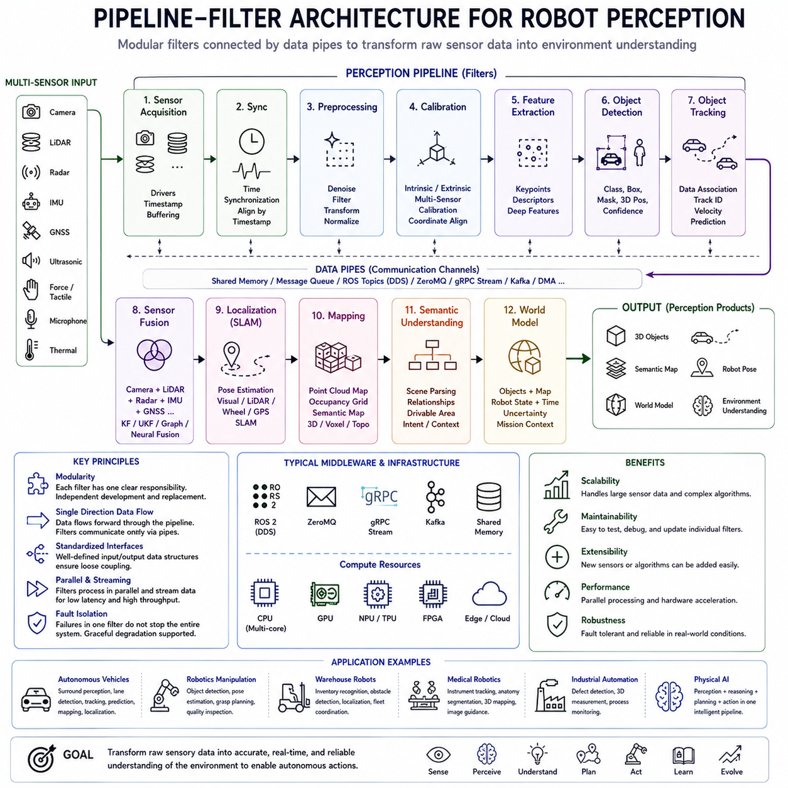{width="7.268055555555556in" height="7.268055555555556in"}

파이프라인-필터 아키텍처(Pipeline-Filter Architecture)는 로봇 인지(Robot Perception), 컴퓨터 비전(Computer Vision), 자율주행 차량(Autonomous Vehicle), 산업 자동화(Industrial Automation), 그리고 피지컬 AI(Physical AI) 시스템에서 가장 널리 사용되는 대표적인 소프트웨어 아키텍처 패턴 가운데 하나이다. 이 아키텍처는 복잡한 인지 과정을 여러 개의 독립적인 처리 단계(Processing Stage)로 분리하며, 각각의 처리 단계는 **필터(Filter)** 라고 불린다. 각 필터는 입력 데이터를 받아 하나의 명확한 연산만 수행한 후 그 결과를 다음 필터로 전달한다. 즉, 하나의 거대한 인지 알고리즘(Monolithic Algorithm)으로 모든 문제를 해결하는 것이 아니라, 전체 인지 과정을 여러 개의 독립적인 처리 모듈로 나누어 개발, 테스트, 최적화, 교체 및 병렬 실행이 가능하도록 만드는 것이 핵심 철학이다. 현대의 로봇은 다양한 센서, 이기종 컴퓨팅(Heterogeneous Computing), 인공지능(AI), 실시간 제어(Real-Time Control)를 동시에 활용하기 때문에 이러한 구조는 유지보수성(Maintainability), 확장성(Scalability), 재사용성(Reusability), 그리고 장기적인 발전 가능성을 크게 향상시킨다.

로봇 인지는 일반적인 비즈니스 소프트웨어와는 근본적으로 다르다. 현실 세계는 끊임없이 방대한 양의 센서 데이터를 생성한다. 카메라(Camera)는 고해상도 영상(Image Stream)을 지속적으로 생성하고, LiDAR는 초당 수백만 개의 3차원 점(Point Cloud)을 출력하며, 레이더(Radar)는 거리와 속도를 측정한다. IMU(Inertial Measurement Unit)는 가속도와 각속도를 제공하고, GNSS(Global Navigation Satellite System)는 위치를 계산하며, 초음파(Ultrasonic Sensor)는 근거리 장애물을 감지하고, 힘 센서(Force Sensor)는 물리적인 접촉을 측정하며, 열화상 카메라(Thermal Camera)는 적외선 정보를 수집한다. 이러한 센서들은 각각 서로 다른 해상도(Resolution), 샘플링 주기(Sampling Rate), 좌표계(Coordinate System), 불확실성(Uncertainty), 시간 동기화 요구사항(Time Synchronization), 통신 방식(Communication Protocol)을 가진다. 파이프라인-필터 아키텍처는 이러한 다양한 센서 데이터를 단계적으로 처리하여 환경(Environment)에 대한 의미 있는 이해(Understanding)를 생성하는 구조를 제공한다.

이 아키텍처의 가장 중요한 철학은 **처리 책임의 분리(Separation of Processing Responsibilities)** 이다. 각각의 필터는 단 하나의 명확한 기능만 수행하며 다른 필터의 내부 구현을 알 필요가 없다. 데이터는 항상 한 방향으로 흐르며, 필터는 표준화된 인터페이스(Standardized Interface)를 통해서만 데이터를 주고받는다. 따라서 특정 알고리즘을 교체하거나 개선하더라도 나머지 시스템에는 영향을 주지 않는다. 이러한 모듈성(Modularity)은 유지보수성, 확장성, 테스트 용이성(Testability), 그리고 기술 발전에 대한 대응 능력을 크게 향상시킨다.

파이프라인은 크게 두 가지 요소로 구성된다.

첫 번째는 **필터(Filter)** 이다. 필터는 하나의 독립적인 계산 모듈로 특정한 처리만 수행한다.

두 번째는 **파이프(Pipe)** 이다. 파이프는 필터와 필터 사이에서 데이터를 전달하는 통신 채널(Communication Channel)이다. 실제 구현에서는 공유 메모리(Shared Memory), 메시지 큐(Message Queue), Publish-Subscribe, DDS(Data Distribution Service), ROS Topic, ZeroMQ, Apache Kafka, gRPC Streaming, DMA(Direct Memory Access) 등 다양한 방식이 사용될 수 있다. 중요한 것은 필터는 서로 독립적이며 파이프만이 데이터를 전달한다는 점이다.

인지 파이프라인의 첫 번째 단계는 일반적으로 **센서 획득(Sensor Acquisition)** 이다.

하드웨어 드라이버(Hardware Driver)가 카메라, LiDAR, Radar, IMU, GNSS, 깊이 카메라(Depth Camera), 촉각 센서(Tactile Sensor), 마이크(Microphone), 산업용 계측기 등의 데이터를 수집한다. 이 단계에서는 장치 초기화(Device Initialization), 시간 정보 생성(Time Stamp Generation), 통신 오류 처리(Communication Error Handling), 버퍼 관리(Buffer Management), 데이터 포맷(Data Formatting) 등을 수행한다.

그 다음 단계는 **센서 동기화(Sensor Synchronization)** 이다.

여러 센서는 서로 다른 주기로 동작하므로 동일한 시점의 데이터를 맞추는 작업이 필요하다. PTP(Precision Time Protocol), GPS 시간 동기화, 하드웨어 트리거(Hardware Trigger), 소프트웨어 보간(Interpolation), 클록 동기화(Clock Synchronization)를 이용하여 동일한 시각의 데이터를 생성한다. 이는 이후 센서 융합(Sensor Fusion)의 정확도를 결정하는 매우 중요한 과정이다.

다음 단계는 **데이터 전처리(Data Preprocessing)** 이다.

센서 데이터에는 노이즈(Noise), 왜곡(Distortion), 센서 오차(Sensor Artifact), 통신 오류, 환경 간섭(Environmental Interference), 캘리브레이션 오차(Calibration Error)가 포함된다.

영상(Image)은 노출 보정(Exposure Correction), 화이트 밸런스(White Balance), 렌즈 왜곡 제거(Lens Distortion Removal), 히스토그램 평활화(Histogram Equalization), 노이즈 제거(Denoising), 크기 조정(Resizing), 색상 정규화(Color Normalization)를 수행한다.

LiDAR는 이상점(Removing Invalid Points), 대기 간섭 제거(Atmospheric Filtering), 운동 왜곡 보정(Motion Compensation), 좌표계 변환(Coordinate Transformation)을 수행한다.

IMU는 바이어스(Bias) 보정과 드리프트(Drift) 제거를 수행하며, Radar는 클러터(Clutter)를 제거하고 움직이는 물체를 강조한다.

다음은 **캘리브레이션(Calibration)** 단계이다.

카메라는 내부 파라미터(Intrinsic Calibration)를 보정하고, 외부 파라미터(Extrinsic Calibration)를 계산한다.

LiDAR, Camera, Radar, IMU, GNSS를 하나의 공통 좌표계(Common Coordinate System)로 맞추는 다중 센서 캘리브레이션(Multi-Sensor Calibration)도 수행한다.

정확한 캘리브레이션은 이후 모든 인지 알고리즘의 정확도를 결정한다.

다음 단계는 **특징 추출(Feature Extraction)** 이다.

과거에는 SIFT, SURF, ORB, Harris Corner와 같은 알고리즘이 Edge, Corner, Texture, Gradient, Keypoint 등을 추출하였다.

오늘날에는 CNN(Convolutional Neural Network), Transformer, 멀티모달 인코더(Multimodal Encoder)가 자동으로 특징을 학습한다.

구현 방식은 달라졌지만 특징 추출은 여전히 독립적인 파이프라인 단계로 유지된다.

그 다음에는 **객체 검출(Object Detection)** 이 수행된다.

차량(Vehicle), 사람(Pedestrian), 로봇(Robot), 팔레트(Pallet), 산업 설비(Equipment), 장애물(Obstacle), 제품(Product), 결함(Defect), 랜드마크(Landmark)를 인식한다.

YOLO, Faster R-CNN, DETR, Vision Transformer, Foundation Vision Model 등이 사용되며, 출력은 객체 종류(Class), 신뢰도(Confidence), Bounding Box, Segmentation Mask, 3차원 위치(Position), 불확실성(Uncertainty) 등을 포함한다.

그 다음은 **객체 추적(Object Tracking)** 이다.

시간에 따라 검출된 객체를 동일한 객체로 연결한다.

Kalman Filter, Particle Filter, Hungarian Algorithm, Multiple Hypothesis Tracking, Deep Appearance Embedding, Transformer 기반 추적 알고리즘이 사용된다.

객체의 속도(Velocity), 가속도(Acceleration), 이동 방향(Motion Direction), 미래 위치(Future Motion), 객체 ID를 지속적으로 유지한다.

다음 단계는 **센서 융합(Sensor Fusion)** 이다.

Camera는 풍부한 의미 정보(Semantic Information)를 제공하고, LiDAR는 정확한 3차원 기하 구조를 제공하며, Radar는 악천후에서도 거리와 속도를 측정한다.

IMU는 운동 정보를 제공하고, GNSS는 절대 위치를 제공한다.

Bayesian Estimation, EKF(Extended Kalman Filter), UKF(Unscented Kalman Filter), Factor Graph, Particle Filter, Neural Fusion Network, Attention Mechanism, Multimodal Transformer 등이 이러한 정보를 통합한다.

센서 융합은 각각의 센서가 가진 단점을 서로 보완하여 인지의 강건성(Robustness)을 크게 향상시킨다.

다음은 **위치 추정(Localization)** 이다.

Wheel Odometry, IMU, Visual Odometry, LiDAR Scan Matching, GNSS, Landmark Recognition, SLAM(Simultaneous Localization and Mapping) 등을 이용하여 로봇의 위치를 계산한다.

최근에는 기하학적 최적화(Geometric Optimization)와 딥러닝 기반 의미 위치 추정(Semantic Localization)을 함께 사용하는 경우가 증가하고 있다.

**맵 생성(Mapping)** 은 위치 추정과 동시에 수행되는 경우가 많다.

Occupancy Grid, Point Cloud Map, Semantic Map, Elevation Map, Voxel Map, Topological Graph, Neural Scene Representation 등을 생성한다.

이러한 지도는 지속적으로 업데이트되며 환경의 변화도 반영한다.

더 높은 단계에서는 **의미 이해(Semantic Understanding)** 가 수행된다.

단순히 객체를 인식하는 것이 아니라 객체 간의 관계(Relationship), 사람의 행동(Activity), 환경(Context), 안전 영역(Safety Zone), 이동 가능 영역(Traversable Area), 사람의 의도(Human Intention), 미션과 관련된 정보(Mission-Relevant Knowledge)를 이해한다.

최근에는 Vision-Language Model(VLM)이 이러한 의미 이해를 수행하는 중요한 역할을 한다.

최종 단계에서는 **세계 모델(World Model)** 을 구축한다.

지금까지 생성된 모든 정보가 하나의 통합된 환경 모델로 결합된다.

정적 환경(Static Environment), 동적 객체(Dynamic Object), 로봇 상태(Robot State), 의미 정보(Semantic Information), 불확실성(Uncertainty), 시간 정보(Temporal History), 운영 제약(Operational Constraint), 미션 목표(Mission Objective)가 모두 하나의 세계 모델 안에 포함된다.

세계 모델은 자율주행, 조작(Manipulation), 계획(Planning), 의사결정(Decision Making), 피지컬 AI의 핵심 지식 저장소(Knowledge Representation)가 된다.

파이프라인-필터 아키텍처는 **스트리밍 처리(Streaming Processing)** 에 매우 적합하다.

각 필터는 이전 단계의 처리가 모두 끝날 때까지 기다리지 않는다.

충분한 데이터가 들어오는 즉시 다음 처리를 시작한다.

카메라는 영상을 계속 생성하고, 인지 필터는 이를 즉시 처리하며, 계획 시스템은 바로 경로를 계산하고, 제어기는 즉시 로봇을 움직인다.

이러한 연속 처리 방식은 지연 시간(Latency)을 최소화하고 처리량(Throughput)을 극대화한다.

병렬 처리(Parallel Processing) 역시 매우 중요한 장점이다.

영상 전처리와 LiDAR 필터링은 동시에 수행될 수 있으며, 객체 검출과 위치 추정도 병렬 실행이 가능하다.

CPU, GPU, NPU, FPGA, 분산 서버(Distributed Server)에서 각각의 필터를 독립적으로 실행할 수 있어 계산 효율이 크게 향상된다.

또한 장애 격리(Fault Isolation)도 우수하다.

카메라에 문제가 발생하더라도 LiDAR 파이프라인은 계속 동작할 수 있으며, 객체 검출 알고리즘이 실패하더라도 위치 추정은 계속 수행될 수 있다.

시스템은 문제가 발생한 필터만 재시작하거나 대체 알고리즘으로 교체할 수 있다.

모듈성(Modularity)은 알고리즘의 발전에도 매우 유리하다.

새로운 객체 검출 AI 모델이나 새로운 SLAM 알고리즘이 등장하면 해당 필터만 교체하면 된다.

나머지 시스템은 그대로 유지되므로 장기적인 유지보수가 매우 쉬워진다.

테스트(Testability)도 향상된다.

각 필터는 독립적으로 단위 테스트(Unit Test)를 수행할 수 있으며, 통합 테스트(Integration Test)는 인접한 필터 간의 연결만 검증하면 된다.

하드웨어 인 더 루프(Hardware-in-the-Loop), 디지털 트윈(Digital Twin), 시뮬레이션(Simulation), 재생 데이터셋(Replay Dataset)을 이용하여 다양한 환경에서 안정성을 검증할 수 있다.

ROS1과 ROS2도 이러한 구조를 자연스럽게 지원한다.

각 Node는 하나의 필터 역할을 수행하며, ROS Topic과 DDS가 Pipe 역할을 수행한다.

카메라 노드(Camera Node), LiDAR 노드(LiDAR Node), Localization Node, Mapping Node, Detection Node, Sensor Fusion Node가 독립적으로 실행된다.

자율주행 차량은 거의 모든 인지 시스템을 파이프라인 구조로 설계한다.

센서 획득, 동기화, 캘리브레이션, 객체 검출, 차선 인식(Lane Detection), 자유 공간 추정(Free Space Estimation), 교통표지판 인식(Traffic Sign Recognition), 센서 융합, 위치 추정, 경로 예측(Trajectory Prediction), 의미 이해, 세계 모델 생성이 모두 독립적인 필터로 연결된다.

산업용 로봇도 동일한 구조를 사용한다.

영상 획득(Image Acquisition), 캘리브레이션, 객체 분할(Object Segmentation), 자세 추정(Pose Estimation), 그립 계획(Grasp Planning), 품질 검사(Quality Inspection), 바코드 인식(Barcode Recognition), 치수 측정(Dimensional Measurement), 로봇 조작이 각각 독립적인 필터가 된다.

물류 로봇은 카메라, LiDAR, RFID, 바코드, 위치 추정, 플릿 관리 등을 하나의 파이프라인으로 연결하여 창고 운영을 수행한다.

의료 로봇은 내시경(Endoscope), 초음파(Ultrasound), MRI, CT, 힘 센서, 수술 도구 추적(Instrument Tracking), 해부학적 분할(Anatomical Segmentation)을 독립적인 필터로 구성하여 높은 안전성과 검증 가능성을 확보한다.

최근 인공지능은 파이프라인 구조를 크게 변화시키고 있다.

기존에는 사람이 설계한 특징(Human-Crafted Feature)을 사용했지만 현재는 딥러닝이 대부분의 특징을 자동으로 학습한다.

그러나 파이프라인-필터 아키텍처는 여전히 중요하다.

객체 검출 AI, Vision-Language Model, 세계 모델(World Model), 대규모 언어 모델(LLM), 멀티모달 Transformer는 모두 하나의 독립적인 필터처럼 동작하며 전체 인지 파이프라인 안에서 협력한다.

엣지 컴퓨팅(Edge Computing)도 이러한 구조와 잘 어울린다.

센서 획득은 임베디드 장치(Embedded Device)에서 수행하고, AI 추론은 GPU 서버에서 실행하며, 디지털 트윈은 클라우드에서 관리하고, 장기 분석은 중앙 서버에서 수행하는 등 계산을 여러 장치에 분산할 수 있다.

피지컬 AI는 이러한 구조를 더욱 발전시킨다.

미래의 지능형 시스템은 **인지(Perception), 기억(Memory), 추론(Reasoning), 계획(Planning), 예측(Prediction), 시뮬레이션(Simulation), 행동 생성(Action Generation), 안전 검증(Safety Verification), 학습(Learning), 인간-기계 상호작용(Human-Machine Interaction)** 을 하나의 거대한 인지 파이프라인으로 통합한다.

인지 필터는 환경을 이해하고, 인지 AI는 의미를 해석하며, 세계 모델은 지식을 저장하고, 계획기는 행동을 생성하며, 제어기는 실제 움직임을 수행하고, 피드백 필터는 결과를 평가하여 지속적으로 학습한다.

물론 파이프라인-필터 아키텍처에도 과제는 존재한다.

가장 큰 문제는 **누적 지연 시간(Pipeline Latency)** 이다.

필터가 많아질수록 처리 시간이 누적된다.

이를 해결하기 위해 병렬 처리, GPU 가속(Hardware Acceleration), 비동기 처리(Asynchronous Communication), 최적 스케줄링(Optimized Scheduling)이 사용된다.

또 다른 문제는 데이터 전송 오버헤드(Data Serialization Overhead)이다.

대용량 영상, Point Cloud, AI Feature Tensor를 여러 필터 간에 전달하면 많은 메모리와 대역폭(Bandwidth)이 필요하다.

이를 해결하기 위해 Zero-Copy, Shared Memory, GPU Memory Sharing, DMA 등을 활용한다.

부하 균형(Load Balancing)도 중요하다.

AI 추론은 GPU 자원을 많이 사용하지만 전처리는 CPU만으로 충분할 수 있다.

따라서 동적 스케줄링(Dynamic Scheduling), 이기종 하드웨어(Heterogeneous Hardware Allocation), 분산 실행(Distributed Execution)을 이용하여 전체 파이프라인의 자원 활용률을 최적화한다.

디버깅(Debugging)도 어려울 수 있다.

문제가 여러 필터를 거쳐 전달되므로 어느 단계에서 오류가 발생했는지 확인하기 어렵다.

이를 해결하기 위해 분산 로깅(Distributed Logging), 성능 프로파일링(Performance Profiling), 텔레메트리(Telemetry), 실행 추적(Runtime Tracing), 파이프라인 시각화(Pipeline Visualization) 등을 적극적으로 사용한다.

파이프라인-필터 아키텍처는 앞으로도 계속 발전할 것이다. 미래의 로봇 인지 시스템은 **멀티모달 파운데이션 모델(Multimodal Foundation Model), 분산 AI 에이전트(Distributed AI Agent), 세계 모델(World Model), 뉴로모픽 센서(Neuromorphic Sensor), 이벤트 카메라(Event Camera), 자기지도학습(Self-Supervised Learning), 지속적 적응(Continual Adaptation), 체화 지능(Embodied Intelligence)** 을 하나의 통합된 파이프라인으로 연결하게 될 것이다. 개별 알고리즘은 계속 변화하더라도 **복잡한 인지 과정을 독립적인 처리 단계로 분해하고, 표준화된 인터페이스를 통해 연결하는 파이프라인-필터 아키텍처의 핵심 원칙은 앞으로도 차세대 자율 로봇과 피지컬 AI 플랫폼을 위한 가장 중요한 소프트웨어 구조 가운데 하나로 계속 유지될 것이다.**

## 02.07 Reactive Architecture and Backpressure Mechanism

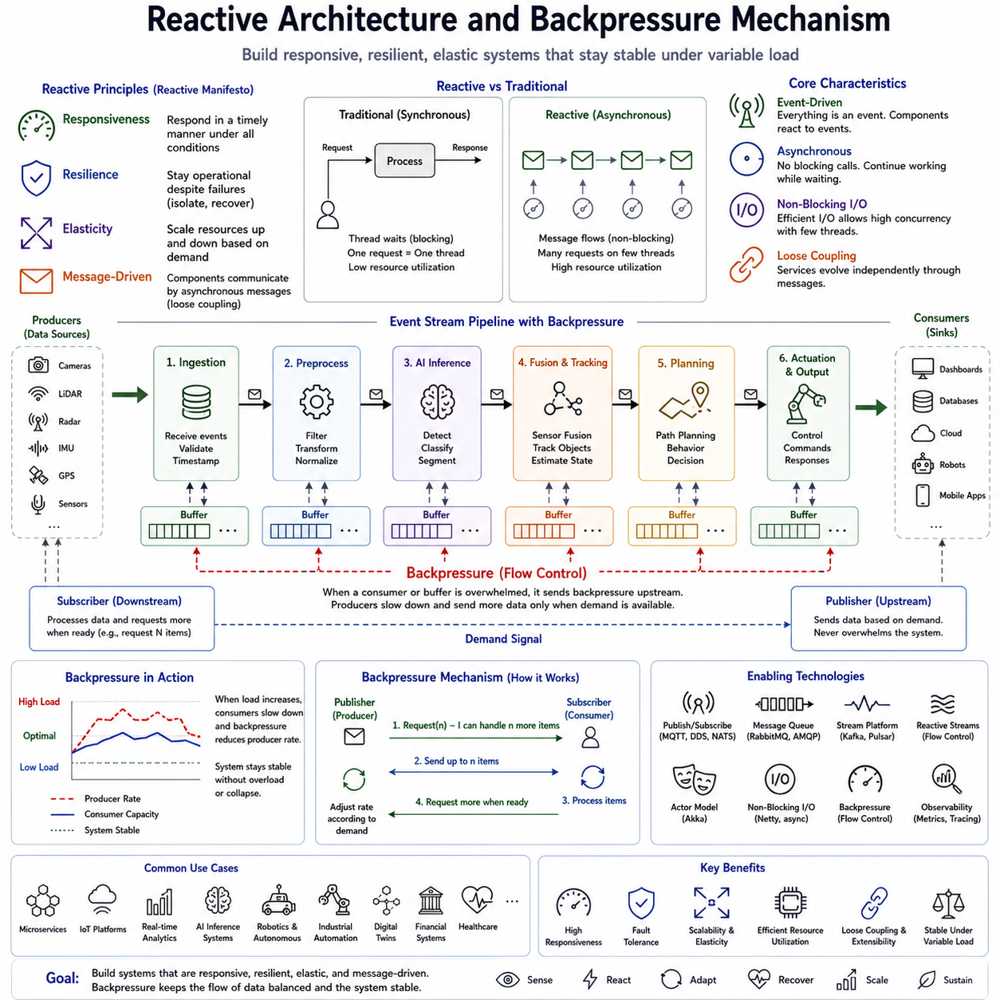{width="7.268055555555556in" height="7.268055555555556in"}

리액티브 아키텍처(Reactive Architecture)는 **높은 응답성(Responsiveness), 복원력(Resilience), 탄력성(Elasticity), 그리고 메시지 기반(Message-Driven) 통신을 제공하는 현대적인 소프트웨어 아키텍처 패러다임(Architectural Paradigm)** 이다. 클라우드 네이티브(Cloud-Native), 분산 마이크로서비스(Distributed Microservices), 사물인터넷(IoT), 로보틱스(Robotics), 자율 시스템(Autonomous System), 엣지 컴퓨팅(Edge Computing), 디지털 트윈(Digital Twin), 그리고 피지컬 AI(Physical AI)가 발전하면서 기존의 동기식(Synchronous) 요청-응답(Request-Response) 구조는 확장성(Scalability), 지연 시간(Latency), 장애 허용(Fault Tolerance), 자원 활용(Resource Utilization) 측면에서 여러 한계를 드러내기 시작하였다. 이러한 문제를 해결하기 위해 등장한 것이 리액티브 아키텍처이며, 이 구조는 **비동기 통신(Asynchronous Communication), 이벤트 기반 처리(Event-Driven Processing), 논블로킹 실행(Non-Blocking Execution), 동적 부하 적응(Dynamic Workload Adaptation)** 을 중심으로 설계된다. 특히 이러한 구조를 안정적으로 유지하기 위한 핵심 기술이 **백프레셔(Backpressure)** 메커니즘이다.

초기의 엔터프라이즈 시스템은 대부분 **동기식 실행 모델(Synchronous Execution Model)** 을 사용하였다. 클라이언트(Client)가 요청(Request)을 보내면 서버(Server)는 해당 요청을 처리하고, 응답(Response)이 반환될 때까지 클라이언트는 기다린다. 사용자가 많지 않고 시스템 규모가 작을 때는 이러한 방식으로도 충분하였다.

그러나 클라우드 서비스가 대규모로 확장되고 수백만 명의 사용자가 동시에 접속하기 시작하면서 상황은 크게 달라졌다. 분산 서비스는 지속적으로 서로 통신하고, AI 추론(AI Inference)은 GPU와 NPU 같은 이기종 컴퓨팅(Heterogeneous Computing)을 사용하며, 로봇은 초당 수십에서 수백 개의 센서 스트림(Sensor Stream)을 처리해야 하고, 산업 자동화 시스템은 실시간 협업(Real-Time Coordination)을 요구하게 되었다. 이러한 환경에서는 하나의 느린 서비스가 전체 시스템을 지연시키고, 대기 중인 스레드(Thread)가 메모리와 CPU 자원을 낭비하며, 순간적인 트래픽 증가가 전체 시스템의 장애(Cascading Failure)로 이어질 수 있다.

리액티브 아키텍처는 이러한 문제를 전혀 다른 관점에서 해결한다.

애플리케이션을 단순한 함수 호출(Function Call)의 집합으로 보는 것이 아니라 **끊임없이 발생하는 이벤트(Event)의 흐름(Stream)** 으로 바라본다.

각 컴포넌트(Component)는 직접 함수를 호출하지 않고 메시지(Message)를 교환하며 독립적으로 동작한다.

데이터가 도착하면 해당 컴포넌트는 자신의 작업만 수행하고 다시 다음 컴포넌트로 전달한다.

따라서 일부 서비스가 느려지더라도 전체 시스템은 계속 응답성을 유지할 수 있다.

이러한 이벤트 중심(Event-Centric) 구조는 확장성, 자원 활용률, 장애 격리(Fault Isolation), 복원력을 크게 향상시킨다.

리액티브 매니페스토(Reactive Manifesto)는 리액티브 시스템이 반드시 가져야 할 네 가지 핵심 특성을 정의한다.

첫 번째는 **응답성(Responsiveness)** 이다.

시스템은 부하가 증가하거나 일부 서비스가 장애를 일으키더라도 예측 가능한 시간 안에 응답해야 한다.

사용자, AI 에이전트(AI Agent), 로봇, 산업 제어기(Industrial Controller), 디지털 트윈 모두 안정적인 응답 시간을 경험해야 한다.

두 번째는 **복원력(Resilience)** 이다.

현실에서는 하드웨어(Hardware), 네트워크(Network), 소프트웨어(Software), 클라우드 서비스(Cloud Service)는 언제든지 장애가 발생할 수 있다.

리액티브 시스템은 이를 예외 상황이 아니라 **항상 발생할 수 있는 정상적인 상황**으로 간주한다.

장애는 특정 컴포넌트 안에서만 격리되고, 다른 컴포넌트는 계속 동작한다.

자동 재시작(Auto Restart), 복제(Replication), 감독(Supervision), 점진적 기능 저하(Graceful Degradation)를 이용하여 전체 서비스는 계속 유지된다.

세 번째는 **탄력성(Elasticity)** 이다.

클라우드 환경에서는 사용량이 지속적으로 변화한다.

AI 추론 서버는 사용자 수에 따라 부하가 크게 변하고, 로봇 플릿(Fleet)은 시간대에 따라 운영 대수가 달라지며, 제조 공장은 생산량에 따라 작업량이 변한다.

리액티브 시스템은 필요할 때 자동으로 자원을 늘리고, 사용량이 줄어들면 다시 축소한다.

이러한 자동 확장은 비용 절감과 높은 응답성을 동시에 제공한다.

네 번째는 **메시지 기반(Message-Driven)** 구조이다.

각 컴포넌트는 서로 직접 함수를 호출하지 않는다.

대신 메시지 큐(Message Queue), 이벤트 버스(Event Bus), Publish-Subscribe, DDS(Data Distribution Service), MQTT, Kafka, AMQP, Cloud Event Service 등을 이용하여 비동기적으로 통신한다.

이러한 느슨한 결합(Loose Coupling)은 독립적인 개발과 배포를 가능하게 한다.

리액티브 아키텍처의 가장 중요한 특징 가운데 하나는 **비동기 실행(Asynchronous Execution)** 이다.

기존 시스템은 하나의 요청마다 하나의 스레드를 사용하였다.

데이터베이스(Database), 파일(File), 네트워크(Network)를 기다리는 동안에도 스레드는 아무 일도 하지 않은 채 메모리만 점유하였다.

반면 리액티브 시스템에서는 논블로킹(Non-Blocking) 방식으로 동작한다.

외부 작업을 기다리는 동안 CPU는 다른 요청을 처리한다.

따라서 적은 수의 스레드만으로도 수많은 동시 요청(Concurrent Request)을 처리할 수 있다.

이벤트 기반 프로그래밍(Event-Driven Programming)은 리액티브 아키텍처와 매우 잘 맞는다.

사용자의 입력(User Interaction), 센서 데이터(Sensor Measurement), AI 추론 완료(AI Inference Completion), 하드웨어 인터럽트(Hardware Interrupt), 금융 거래(Financial Transaction), 산업 경보(Industrial Alarm), 로봇 상태 변경(Robot Status Update), 디지털 트윈 동기화(Digital Twin Synchronization) 등이 모두 이벤트가 된다.

각 컴포넌트는 자신이 필요한 이벤트만 구독(Subscribe)한다.

필요 없는 이벤트는 전혀 처리하지 않는다.

이러한 구조는 시스템 간의 의존성을 크게 줄여 준다.

Publish-Subscribe 구조도 매우 중요한 역할을 한다.

이벤트 생산자(Event Producer)는 이벤트를 발행(Publish)하기만 하면 된다.

누가 이를 사용하는지 알 필요가 없다.

반대로 소비자(Subscriber)는 자신이 필요한 이벤트만 구독한다.

새로운 서비스를 추가하거나 제거하더라도 기존 서비스는 수정할 필요가 없다.

리액티브 스트림(Reactive Streams)은 이러한 이벤트 기반 구조를 더욱 발전시킨 기술이다.

가장 중요한 특징은 **데이터가 무조건 흘러가는 것이 아니라 소비자의 처리 능력에 맞추어 흐른다**는 것이다.

이를 가능하게 하는 기술이 바로 **백프레셔(Backpressure)** 이다.

백프레셔는 리액티브 아키텍처의 핵심 메커니즘이다.

도로에서 차량이 너무 많이 몰리면 앞 차량의 속도에 맞추어 뒤 차량도 속도를 줄인다.

그렇지 않으면 전체 도로가 마비된다.

컴퓨터 시스템도 동일하다.

데이터 생산자(Producer)가 소비자(Consumer)의 처리 능력보다 빠르게 데이터를 보내면 메모리(Buffer)가 계속 증가하고 결국 시스템은 다운된다.

백프레셔는 소비자가 **"지금은 더 이상 처리할 수 없으니 천천히 보내라."** 라는 신호를 생산자에게 보내는 구조이다.

이를 통해 전체 시스템은 항상 안정적인 처리 속도를 유지한다.

백프레셔가 없는 시스템에서는 **연쇄 장애(Cascading Failure)** 가 쉽게 발생한다.

예를 들어 자율주행 로봇을 생각해 보자.

카메라는 초당 60장의 영상을 생성한다.

객체 인식(Object Detection)은 GPU에서 실행된다.

GPU 부하가 증가하여 처리 속도가 느려졌는데도 카메라는 계속 영상을 보낸다.

영상은 메모리에 계속 쌓이고, 객체 인식은 점점 늦어지며, 이후의 의미 분석(Semantic Reasoning), 경로 계획(Path Planning), 디지털 트윈 동기화도 모두 지연된다.

결국 전체 시스템이 불안정해진다.

백프레셔는 GPU가 감당할 수 있는 속도에 맞추어 카메라의 데이터 전송량을 자동으로 조절한다.

리액티브 스트림(Reactive Streams)은 이러한 백프레셔를 위한 표준 프로토콜(Standard Protocol)을 정의한다.

여기에는 네 가지 역할이 존재한다.

Publisher는 데이터를 생성한다.

Subscriber는 데이터를 소비한다.

Subscription은 두 컴포넌트를 연결한다.

Processor는 데이터를 소비하면서 동시에 새로운 데이터를 생성하는 중간 처리기이다.

가장 중요한 특징은 Subscriber가 **필요한 만큼만 데이터를 요청(Request)** 한다는 것이다.

즉 소비자가 "다음 데이터 100개만 보내라."라고 요청하면 Publisher는 정확히 100개만 전송한다.

이를 **수요 기반 처리(Demand-Driven Processing)** 라고 한다.

백프레셔와 함께 중요한 요소가 **버퍼(Buffer)** 관리이다.

짧은 시간 동안의 데이터 폭주는 버퍼가 흡수한다.

그러나 버퍼는 무한하지 않다.

버퍼가 가득 차기 전에 백프레셔가 활성화되어 생산자의 속도를 줄인다.

이로써 메모리 부족(Out of Memory)을 방지할 수 있다.

리액티브 아키텍처에서는 **불변 메시지(Immutable Message)** 를 사용하는 경우가 많다.

메시지는 생성된 이후 절대로 수정되지 않는다.

이 덕분에 여러 스레드가 동시에 데이터를 처리하더라도 공유 메모리(Shared Memory)에 대한 동기화 문제가 거의 발생하지 않는다.

멀티코어 CPU, GPU 클러스터, 분산 시스템에서도 안정적으로 병렬 처리가 가능하다.

액터 모델(Actor Model)은 리액티브 아키텍처를 구현하는 대표적인 방법이다.

액터(Actor)는 자신의 내부 상태만 가지고 있으며 외부와는 오직 메시지(Message)만 주고받는다.

한 번에 하나의 메시지만 처리하기 때문에 복잡한 락(Lock)이나 동기화(Synchronization)가 거의 필요 없다.

감독 계층(Supervision Hierarchy)은 장애가 발생한 액터를 자동으로 재시작하거나 다른 액터로 교체할 수 있다.

Akka와 같은 프레임워크가 대표적인 사례이다.

클라우드 네이티브 환경도 리액티브 철학을 적극적으로 활용한다.

쿠버네티스(Kubernetes)는 부하에 따라 컨테이너(Container)를 자동으로 확장한다.

서비스 메시(Service Mesh)는 비동기 통신을 관리한다.

Kafka와 같은 메시지 시스템은 이벤트를 전달한다.

Serverless는 이벤트가 발생할 때만 함수를 실행한다.

모니터링 시스템은 지연 시간(Latency), 처리량(Throughput), 장애(Failure), 자원 사용량(Resource Utilization)을 지속적으로 감시한다.

마이크로서비스(Microservice)는 리액티브 아키텍처와 매우 잘 어울린다.

주문(Order), 결제(Payment), 재고(Inventory), 로봇 플릿 관리(Fleet Management), AI 추론(AI Inference), 디지털 트윈(Digital Twin), 예지보전(Predictive Maintenance) 등이 각각 독립적인 서비스로 동작하며 도메인 이벤트(Domain Event)를 통해 협력한다.

하나의 서비스가 장애를 일으켜도 다른 서비스는 계속 운영될 수 있다.

사물인터넷(IoT) 플랫폼에서도 동일한 구조가 사용된다.

수백만 개의 센서가 온도, 진동, 전력 소비, 장비 상태, 환경 정보를 지속적으로 전송한다.

리액티브 구조는 이러한 대량의 이벤트를 안정적으로 처리할 수 있다.

로보틱스에서는 리액티브 아키텍처의 중요성이 더욱 커지고 있다.

센서는 비동기적으로 데이터를 생성하고, 자율주행은 경로를 계속 수정하며, 로봇 팔은 작업을 수행하고, 안전 시스템은 위험을 감시하며, 플릿 관리 시스템은 여러 로봇을 동시에 제어한다.

각 시스템은 서로 독립적으로 동작하지만 이벤트를 통해 협력한다.

ROS2는 DDS 기반 Publish-Subscribe 구조를 사용하기 때문에 리액티브 철학과 매우 잘 맞는다.

센서는 Topic을 Publish하고, 위치 추정(Localization)은 이를 Subscribe하며, 맵 생성(Mapping), 계획(Planning), 제어(Control), 진단(Diagnostics)은 각각 독립적으로 동작한다.

완전한 Reactive Streams는 아니지만 매우 유사한 구조를 가진다.

자율주행 차량은 리액티브 구조를 가장 잘 활용하는 사례 가운데 하나이다.

카메라, LiDAR, Radar, IMU, GPS, 객체 인식, 위치 추정, 경로 계획, 안전 모니터링, 지도, 클라우드 연결, 운전자 인터페이스(HMI)가 모두 독립적인 이벤트 처리기로 동작한다.

AI 플랫폼도 리액티브 구조를 적극적으로 활용한다.

AI 추론 요청은 지속적으로 들어오며 GPU 사용률은 계속 변한다.

벡터 데이터베이스(Vector Database), LLM, 멀티모달 AI(Multimodal AI)는 모두 서로 다른 속도로 동작한다.

리액티브 스케줄링은 이러한 요청을 GPU에 적절하게 분배하고 백프레셔는 GPU 처리 능력에 맞추어 요청량을 조절한다.

실시간 AI(Video Analytics, Speech Recognition, Multimodal Reasoning, Industrial Inspection, Medical Imaging, Autonomous Robotics)는 모두 백프레셔가 반드시 필요하다.

디지털 트윈도 리액티브 구조를 기반으로 동작한다.

현실의 장비는 계속 이벤트를 발생시키고, 클라우드는 이를 가상 모델(Virtual Model)에 반영하며, AI는 미래를 예측하고, 운영자는 이를 실시간으로 확인한다.

모든 구성 요소는 이벤트 스트림(Event Stream)으로 연결된다.

피지컬 AI에서는 이러한 개념이 더욱 확대된다.

멀티모달 인식(Multimodal Perception), 세계 모델(World Model), 자율 계획(Autonomous Planning), 분산 AI 에이전트(Distributed AI Agent), 인간-기계 협업(Human-Machine Collaboration), 안전 모니터링(Safety Monitoring), 지속적 학습(Continual Learning)이 각각 독립적인 리액티브 컴포넌트가 된다.

이들은 환경 관찰(Environment Observation), 추론 결과(Reasoning Result), 학습 결과(Learning Update), 안전 정책(Safety Constraint), 미션 상태(Mission Status)를 이벤트 형태로 교환한다.

산업 자동화에서도 동일한 구조를 사용한다.

생산 설비는 상태 이벤트를 생성하고, AI 검사 시스템은 품질을 분석하며, 유지보수 시스템은 이상을 감지하고, ERP는 공급망을 관리한다.

모든 시스템은 메시지 기반으로 연결된다.

의료 시스템 역시 환자 모니터링(Patient Monitoring), 검사 결과(Laboratory Result), 의료 영상(Medical Imaging), AI 진단(AI Diagnosis), 전자의무기록(EHR)이 이벤트를 기반으로 동작한다.

리액티브 아키텍처는 많은 장점을 제공하지만 구현 난이도도 높다.

개발자는 비동기 실행, 최종 일관성(Eventual Consistency), 분산 메시징(Distributed Messaging), 논블로킹 프로그래밍, 이벤트 기반 설계를 이해해야 한다.

디버깅(Debugging)도 순차적인 프로그램보다 훨씬 어렵다.

백프레셔 역시 적절하게 설계되어야 한다.

너무 강하게 제한하면 처리량이 감소하고, 너무 약하면 메모리 부족과 시스템 장애가 발생한다.

따라서 지연 시간, 처리량, 버퍼 크기, CPU 및 GPU 사용률, 서비스 품질(Quality of Service, QoS)을 고려하여 동적으로 조절해야 한다.

메시지 순서(Message Ordering)도 중요한 문제이다.

금융 거래, 산업 제어, 로봇 안전 이벤트, 의료 절차와 같이 반드시 순서가 보장되어야 하는 시스템도 있다.

반면 일부 AI 분석 시스템은 순서보다 처리량이 더 중요하다.

따라서 응용 분야에 맞는 메시지 순서 보장 정책을 설계해야 한다.

모니터링(Observability) 역시 필수적이다.

메시지 지연(Message Latency), 큐 길이(Queue Length), 처리량, Subscriber의 처리 속도, 백프레셔 활성화 여부, 버퍼 사용률, CPU 및 GPU 자원 사용량, 장애 발생률 등을 지속적으로 관찰하여 병목 현상(Bottleneck)을 사전에 발견해야 한다.

리액티브 아키텍처는 앞으로도 클라우드 네이티브, 분산 AI, 로보틱스, 디지털 트윈, 엣지 컴퓨팅, 자율 시스템, 그리고 피지컬 AI와 함께 지속적으로 발전할 것이다. 미래의 시스템은 **멀티모달 AI 에이전트(Multimodal AI Agent), 세계 모델(World Model), 뉴로모픽 컴퓨팅(Neuromorphic Computing), 이벤트 기반 센서(Event-Based Sensor), 이기종 AI 가속기(Heterogeneous AI Accelerator), 자기 적응형 스케줄링(Self-Adaptive Scheduling), 분산 인지(Distributed Cognition), 지속적 학습(Continual Learning)** 을 하나의 거대한 리액티브 생태계(Reactive Ecosystem) 안에서 운영하게 될 것이다.

궁극적으로 **리액티브 아키텍처는 단순한 비동기 프로그래밍 기법이 아니라 변화하는 환경에 지속적으로 반응하고 적응하는 지능형 소프트웨어를 설계하기 위한 철학**이다. **응답성(Responsiveness), 복원력(Resilience), 탄력성(Elasticity), 메시지 기반 통신(Message-Driven Communication), 그리고 백프레셔(Backpressure)를 통한 지능적인 데이터 흐름 제어**는 앞으로 수십 년 동안 클라우드, 엔터프라이즈 시스템, 로보틱스, 인공지능(AI), 그리고 피지컬 AI를 위한 핵심 소프트웨어 아키텍처 원칙으로 계속 자리매김할 것이다.

## 02.08 Serverless and Function-as-a-Service Patterns

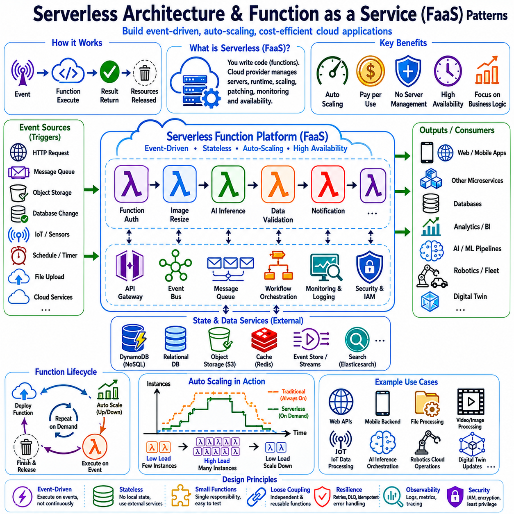{width="7.268055555555556in" height="7.268055555555556in"}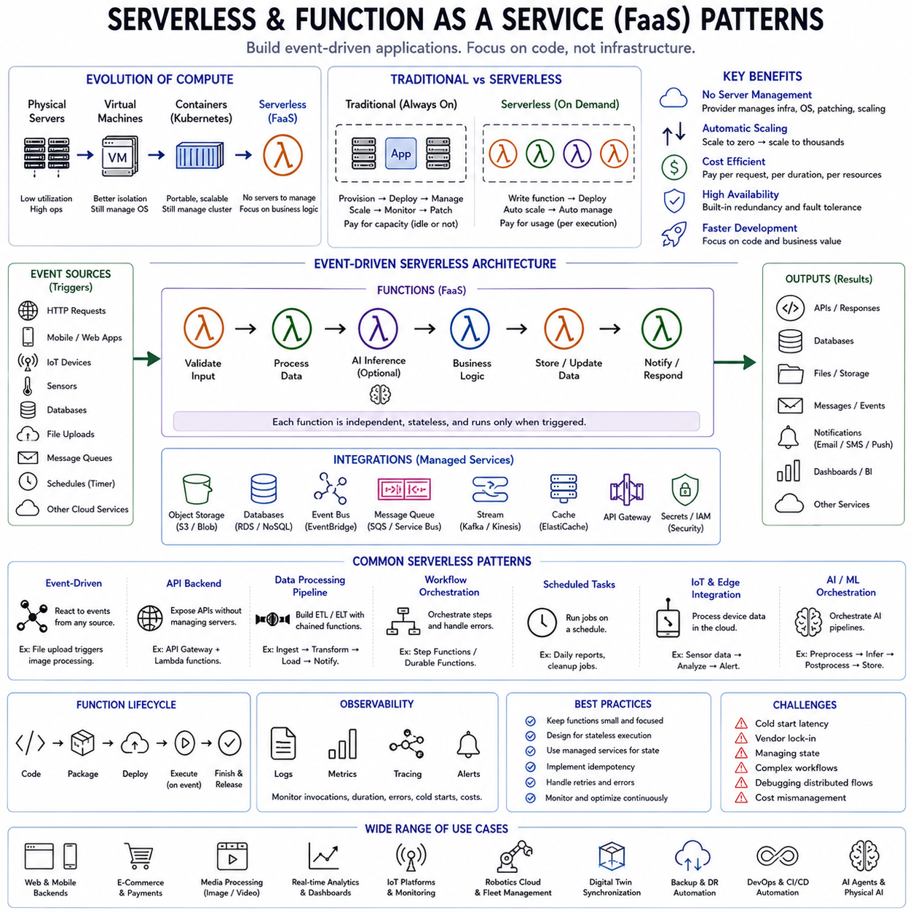{width="7.268055555555556in" height="7.268055555555556in"}

서버리스 아키텍처(Serverless Architecture)와 서비스형 함수(Function as a Service, FaaS)는 현대 클라우드 컴퓨팅(Cloud Computing)의 구조를 근본적으로 변화시킨 대표적인 아키텍처 패턴이다. 이 기술은 소프트웨어를 설계하고 배포하며 운영하는 방식을 기존의 서버(Server) 중심 사고에서 이벤트(Event) 중심 사고로 전환하였다. 전통적인 서버 기반 아키텍처에서는 개발자가 서버를 준비하고 운영체제(Operating System)를 설치하며 네트워크(Network)를 구성하고, 확장(Scaling), 모니터링(Monitoring), 장애 복구(Fault Recovery)까지 직접 관리해야 했다. 반면 서버리스 컴퓨팅에서는 이러한 인프라(Infrastructure) 관리를 대부분 클라우드 제공자(Cloud Provider)가 담당한다. 개발자는 서버나 운영체제를 신경 쓰지 않고 오직 비즈니스 로직(Business Logic)에만 집중할 수 있으며, 클라우드 플랫폼은 실행 환경(Runtime Environment), 자원 할당(Resource Allocation), 자동 확장(Auto Scaling), 장애 복구, 운영 관리까지 모두 자동으로 수행한다. 이러한 구조는 클라우드 네이티브(Cloud-Native), 사물인터넷(IoT), 이벤트 기반 시스템(Event-Driven System), 인공지능(AI), 로보틱스(Robotics), 엣지 컴퓨팅(Edge Computing), 그리고 피지컬 AI(Physical AI) 환경에서 매우 중요한 역할을 수행하고 있다.

\'서버리스(Serverless)\'라는 용어는 다소 오해의 소지가 있다. 실제로 서버(Server)가 사라지는 것은 아니다. 서버는 여전히 클라우드 데이터센터(Data Center)에 존재한다. 달라지는 것은 **서버를 누가 관리하는가**이다. 서버 설치, 운영체제 관리, 보안 패치(Security Patch), 네트워크 설정(Network Configuration), 용량 계획(Capacity Planning), 하드웨어 교체(Hardware Replacement), 장애 복구는 모두 클라우드 제공자가 수행한다. 따라서 개발자는 인프라 관리 대신 서비스 개발과 비즈니스 가치 창출에 집중할 수 있다.

엔터프라이즈 시스템(Enterprise System)의 발전 과정을 살펴보면 서버리스는 자연스러운 진화 단계임을 알 수 있다.

초기에는 애플리케이션이 물리 서버(Physical Server)에서 직접 실행되었다. 기업은 서버를 구매하고 운영체제를 설치하며 네트워크를 구성하고 애플리케이션을 직접 배포하였다. 높은 제어권(Control)은 제공되었지만 대부분의 서버는 낮은 자원 활용률(Resource Utilization)로 운영되면서도 지속적인 관리가 필요하였다.

이후 가상화(Virtualization)가 등장하면서 하나의 물리 서버 위에서 여러 개의 가상 머신(Virtual Machine)을 실행할 수 있게 되었다. 자원 활용률은 크게 향상되었지만 운영체제 관리, 미들웨어(Middleware), 소프트웨어 배포, 모니터링, 확장은 여전히 사용자의 책임이었다.

다음 단계는 컨테이너(Container) 기술이었다. Docker와 Kubernetes는 애플리케이션과 필요한 라이브러리를 하나의 실행 단위로 묶어 배포를 단순화하였다. 그러나 컨테이너 오케스트레이션(Container Orchestration), 네트워크, 스토리지(Storage), 보안(Security), 모니터링 등은 여전히 운영자가 관리해야 했다.

서버리스 아키텍처는 이러한 진화를 한 단계 더 발전시킨다.

애플리케이션 서버(Application Server)를 항상 실행하는 대신, 특정 이벤트(Event)가 발생할 때만 필요한 코드(Function)를 실행한다. 실행이 끝나면 컴퓨팅 자원은 즉시 반환된다. 따라서 개발자는 서버 자체를 거의 의식하지 않아도 된다.

서비스형 함수(Function as a Service)는 서버리스의 대표적인 구현 방식이다.

FaaS에서는 개발자가 작은 기능(Function) 단위로 프로그램을 작성한다.

각 함수는 하나의 명확한 기능만 수행한다.

외부 이벤트가 발생하면 함수가 실행되고, 작업이 끝나면 종료된다.

항상 실행 중인 서버와는 달리 실제 작업을 수행하는 시간 동안에만 CPU와 메모리를 사용한다.

FaaS의 가장 중요한 특징은 **이벤트 기반(Event-Driven)** 실행이다.

HTTP 요청(HTTP Request), 메시지 큐(Message Queue), 파일 업로드(File Upload), 데이터베이스 변경(Database Modification), 센서 데이터(Sensor Observation), 예약 작업(Scheduled Timer), IoT 데이터(IoT Telemetry), AI 추론 요청(AI Inference Request), 로봇 미션(Robot Mission), 디지털 트윈(Digital Twin) 이벤트 등이 발생하면 해당 함수가 자동으로 실행된다.

이러한 구조는 현대의 이벤트 중심(Event-Centric) 시스템과 매우 잘 어울린다.

서버리스의 가장 큰 장점 가운데 하나는 **자동 확장(Auto Scaling)** 이다.

기존 시스템에서는 예상 사용량을 계산하여 서버를 미리 준비해야 했다.

부하가 증가하면 운영자가 서버를 추가하거나 Auto Scaling 정책을 직접 구성해야 했다.

반면 서버리스 플랫폼은 요청(Request)의 수에 따라 함수 인스턴스(Function Instance)를 자동으로 생성한다.

사용량이 증가하면 수천 개의 함수가 동시에 실행될 수 있으며, 사용량이 감소하면 실행 환경은 자동으로 제거된다.

따라서 사용자는 별도의 인프라 운영 없이도 높은 확장성을 얻을 수 있다.

비용 효율성(Cost Efficiency)도 매우 뛰어나다.

전통적인 서버는 사용하지 않는 시간에도 비용이 발생한다.

그러나 서버리스는 실행 시간(Execution Time), 메모리 사용량(Memory Allocation), CPU 사용량, 저장소(Storage), 네트워크(Network Traffic) 등에 대해서만 비용을 지불한다.

즉 함수가 실행되지 않는 동안에는 거의 비용이 발생하지 않는다.

이러한 **Pay-per-Execution** 모델은 간헐적으로 실행되는 서비스에서 매우 큰 비용 절감 효과를 제공한다.

FaaS는 일반적으로 **무상태(Stateless)** 구조를 가진다.

각 함수 실행은 이전 실행과 독립적이다.

함수는 입력(Input)을 받고 계산을 수행한 후 결과(Output)를 반환하고 종료된다.

상태(State)는 함수 내부에 저장하지 않고 데이터베이스(Database), 객체 저장소(Object Storage), 분산 캐시(Distributed Cache), 이벤트 저장소(Event Store) 등에 저장한다.

무상태 구조는 수평 확장(Horizontal Scaling)을 매우 쉽게 만든다.

함수의 크기(Function Granularity)는 매우 중요하다.

좋은 서버리스 시스템은 하나의 함수가 하나의 책임(Single Responsibility)만 수행하도록 설계한다.

사용자 인증(Authentication), 이미지 리사이징(Image Resizing), 센서 검증(Sensor Validation), 객체 인식(Object Detection), 결제 처리(Payment Processing), 로봇 미션 검증(Robot Mission Validation), AI 추론(AI Inference), 디지털 트윈 갱신(Digital Twin Update), 알림(Notification), 재고 동기화(Inventory Synchronization) 등이 각각 독립적인 함수가 된다.

작은 함수는 테스트(Test), 배포(Deployment), 버전 관리(Versioning), 모니터링을 훨씬 쉽게 만든다.

서버리스는 마이크로서비스(Microservice)와도 매우 잘 결합된다.

예를 들어 전자상거래(E-Commerce)에서는 주문(Order), 결제(Payment), 재고(Inventory), 배송(Shipment), 추천 시스템(Recommendation Engine), 고객 알림(Customer Notification)이 각각 독립적인 서버리스 함수로 구현될 수 있다.

각 기능은 독립적으로 배포되고 확장된다.

복잡한 업무 프로세스에서는 여러 함수가 하나의 워크플로우(Workflow)를 구성한다.

예를 들어 고객 가입(Customer Registration)은 사용자 검증(Identity Verification), 사기 탐지(Fraud Detection), 데이터 저장(Database Persistence), 이메일 발송(Notification), 통계 업데이트(Analytics Update), 감사 기록(Audit Logging)을 순차적으로 수행해야 한다.

워크플로우 오케스트레이션(Workflow Orchestration)은 이러한 함수들의 실행 순서와 예외 처리를 관리한다.

서버리스는 다양한 클라우드 서비스와 자연스럽게 통합된다.

이벤트 버스(Event Bus)는 이벤트를 전달하고,

메시지 큐(Message Queue)는 생산자와 소비자를 분리하며,

Publish-Subscribe는 여러 서비스가 동일한 이벤트를 동시에 처리하도록 한다.

객체 저장소(Object Storage)는 파일 업로드 시 자동으로 이벤트를 생성하고,

데이터베이스(Database)는 데이터 변경 시 이벤트를 발생시킨다.

이러한 이벤트 기반 구조는 매우 유연한 클라우드 생태계를 형성한다.

인공지능(AI) 플랫폼도 서버리스를 적극 활용한다.

AI 추론 오케스트레이션(AI Inference Orchestration), 특징 추출(Feature Engineering), 임베딩 생성(Embedding Generation), 문서 전처리(Document Preprocessing), 이미지 변환(Image Transformation), 데이터 검증(Data Validation), 프롬프트 관리(Prompt Management), RAG(Retrieval-Augmented Generation), 멀티모달 전처리(Multimodal Preprocessing)는 대부분 이벤트 기반으로 실행될 수 있다.

GPU가 필요한 대규모 추론은 전용 GPU 클러스터에서 수행하고, 주변 작업은 서버리스 함수가 담당하여 전체 비용을 절감할 수 있다.

머신러닝(Machine Learning) 파이프라인도 동일하다.

데이터 수집(Data Ingestion), 특징 추출, 정규화(Normalization), 데이터 검증, 모델 모니터링(Model Monitoring), 메타데이터 관리(Metadata Management), 실험 관리(Experiment Tracking), 모델 등록(Model Registration), 결과 후처리(Post Processing), 알림(Notification)이 각각 독립적인 함수가 될 수 있다.

사물인터넷(IoT)은 서버리스와 가장 잘 어울리는 분야 가운데 하나이다.

수백만 개의 센서가 온도(Temperature), 진동(Vibration), 전력(Energy), 환경(Environment), 스마트 빌딩(Smart Building), 농업(Agriculture), 웨어러블(Wearable Device), 스마트 공장(Smart Factory)의 데이터를 지속적으로 전송한다.

이벤트가 도착하면 함수가 자동으로 실행되어 데이터를 검증하고, 이상 탐지(Anomaly Detection)를 수행하며, 디지털 트윈을 갱신하고, AI를 호출하거나 운영자에게 알림을 보낸다.

로보틱스 클라우드(Robotics Cloud Platform)도 서버리스를 적극 활용할 수 있다.

로봇은 클라우드와 지속적으로 연결되어 플릿 관리(Fleet Management), 미션 스케줄링(Mission Scheduling), 지도 동기화(Map Synchronization), 소프트웨어 업데이트(Software Update), 예지보전(Predictive Maintenance), AI 추론, 디지털 트윈, 운영 분석(Operation Analytics)을 수행한다.

미션 완료, 진단 정보 업로드, 지도 업데이트, 장애 보고, 검사 결과와 같은 작업은 항상 실행될 필요가 없으므로 서버리스 함수로 구현하면 매우 효율적이다.

엣지 컴퓨팅(Edge Computing)에서도 중요한 역할을 수행한다.

실시간 자율주행(Navigation), 위치 추정(Localization), 조작(Manipulation), 안전 제어(Safety Control)는 로컬 엣지(Edge Device)에서 수행하고,

장기 로그(Long-Term Logging), 클라우드 동기화(Cloud Synchronization), AI 재학습(Model Retraining), 플릿 분석, 유지보수 예약은 서버리스에서 수행한다.

이처럼 실시간 처리와 클라우드 처리를 효과적으로 분리할 수 있다.

디지털 트윈도 서버리스와 잘 결합된다.

현실의 장비에서 이벤트가 발생하면 함수가 실행되어 가상 모델을 갱신하고,

성능 분석(Performance Analysis), 이상 탐지, 예지보전, ERP 연동을 수행한다.

이벤트 발생 빈도는 일정하지 않으므로 자동 확장이 매우 큰 장점을 제공한다.

피지컬 AI에서는 서버리스가 더욱 중요한 역할을 한다.

미래의 피지컬 AI는 클라우드 AI, 엣지 컴퓨팅, 멀티모달 인식(Multimodal Perception), 세계 모델(World Model), 디지털 트윈, 협업 로봇(Collaborative Robot), 산업 자동화, 지속적 학습(Continuous Learning)을 통합한다.

엣지에서는 실시간 제어를 수행하고,

클라우드에서는 이벤트 기반 서버리스 함수가 AI 추론, 디지털 트윈 동기화, 예지보전, 운영 분석, 사용자 알림 등을 담당한다.

보안(Security)도 서버리스와 자연스럽게 결합된다.

사용자 인증(Authentication), 권한 관리(Authorization), 감사 로그(Audit Logging), 이상 탐지(Threat Detection), 규제 준수(Compliance), 암호화(Encryption)는 각각 독립적인 서버리스 함수로 구현할 수 있다.

보안 정책을 변경하더라도 다른 비즈니스 기능에는 영향을 주지 않는다.

관측성(Observability)은 서버리스 환경에서 매우 중요하다.

비록 서버 관리가 자동화되더라도 함수 실행 횟수, 실행 시간, 메모리 사용량, 오류율(Error Rate), 콜드 스타트(Cold Start), 네트워크 지연(Network Latency), 재시도(Retry), 워크플로우 성공률 등을 지속적으로 모니터링해야 한다.

분산 추적(Distributed Tracing), 구조화 로그(Structured Logging), 메트릭(Metrics)을 활용하여 운영 상태를 분석한다.

서버리스의 대표적인 단점은 **콜드 스타트(Cold Start)** 이다.

오랫동안 호출되지 않은 함수는 실행 환경이 제거된다.

다음 요청이 들어오면 런타임(Runtime)을 다시 초기화해야 하므로 지연 시간이 발생한다.

이 지연은 프로그래밍 언어, 패키지 크기, 라이브러리 수, 클라우드 플랫폼에 따라 달라진다.

이를 해결하기 위해 Provisioned Concurrency, 경량 런타임(Lightweight Runtime), 작은 패키지 구조, 또는 항상 실행되는 서비스와 서버리스를 함께 사용하는 하이브리드 구조(Hybrid Architecture)를 사용한다.

상태 관리(State Management)도 고려해야 한다.

함수는 무상태이므로 장기적인 데이터는 외부 데이터베이스, 캐시(Cache), 이벤트 저장소(Event Store), 워크플로우 엔진(Workflow Engine)에 저장해야 한다.

아키텍트는 일시적인 계산 로직과 영구적인 비즈니스 상태를 명확히 구분해야 한다.

클라우드 종속성(Vendor Lock-in)도 하나의 과제이다.

클라우드 제공자는 각각 고유한 이벤트 서비스, 스토리지 API, 보안 모델, 워크플로우 서비스를 제공한다.

이러한 기능에 지나치게 의존하면 다른 클라우드로 이전(Migration)하기 어려워질 수 있다.

이를 줄이기 위해 표준 API(Standard API), 추상화 계층(Abstraction Layer), 컨테이너 기반 함수(Containerized Function), 오픈소스 프레임워크(Open Source Framework)를 사용하는 경우도 많다.

함수 수가 많아질수록 워크플로우 복잡성도 증가한다.

수백 또는 수천 개의 함수가 하나의 업무 프로세스를 구성할 수 있기 때문에 상태 머신(State Machine), 워크플로우 엔진, Saga 패턴(Saga Pattern), 이벤트 코레오그래피(Event Choreography), 보상 트랜잭션(Compensation Transaction) 등을 이용하여 전체 흐름을 안정적으로 관리해야 한다.

성능 최적화도 중요하다.

실행 시간, 메모리 크기, 동시 실행 수(Concurrency), 네트워크 호출, 패키지 크기, 초기화 시간, 저장소 접근을 지속적으로 최적화해야 비용을 절감하고 응답 속도를 향상시킬 수 있다.

서버리스는 기존 아키텍처를 완전히 대체하는 것은 아니다.

실시간 제어(Real-Time Control), 초저지연 산업 제어(Ultra-Low Latency Industrial Control), GPU 기반 지속 추론(Continuous AI Inference), 임베디드 로봇 제어(Embedded Robot Controller)는 여전히 항상 실행되는 서비스가 필요하다.

따라서 실제 시스템에서는 서버리스, 컨테이너(Container), Kubernetes, 가상 머신(Virtual Machine), GPU 서버, 엣지 컴퓨팅을 함께 사용하는 **하이브리드 아키텍처(Hybrid Architecture)** 가 가장 일반적이다.

클라우드 네이티브가 발전할수록 서버리스는 이벤트 기반 마이크로서비스(Event-Driven Microservice), 리액티브 아키텍처(Reactive Architecture), CQRS(Command Query Responsibility Segregation), 이벤트 소싱(Event Sourcing), 디지털 트윈, AI 오케스트레이션(AI Orchestration), 로보틱스 클라우드, 분산 데이터 처리와 더욱 긴밀하게 결합될 것이다.

미래에는 **멀티모달 AI 에이전트(Multimodal AI Agent), 자율 로봇(Autonomous Robot), 세계 모델(World Model), 엣지-클라우드 협업(Edge-Cloud Collaboration), 자기 최적화(Self-Optimizing) 워크플로우, 지속적 학습(Continuous Learning)** 을 지원하는 핵심 실행 플랫폼으로 발전할 것이다.

결국 **서버리스 아키텍처와 서비스형 함수(Function as a Service)** 는 단순한 클라우드 배포 기술이 아니라 **인프라 중심(Infrastructure-Centric) 컴퓨팅에서 이벤트 중심(Event-Centric) 컴퓨팅으로 전환하는 새로운 소프트웨어 철학**이다. 서버를 항상 실행하는 대신 **현실 세계에서 의미 있는 이벤트가 발생할 때만 필요한 기능을 실행**함으로써 자동 확장성(Automatic Scalability), 운영 효율성(Operational Efficiency), 비용 최적화(Cost Optimization), 그리고 클라우드 네이티브 생태계와의 뛰어난 통합성을 동시에 제공한다. 이러한 특성 덕분에 서버리스는 앞으로의 **엔터프라이즈 소프트웨어, 인공지능(AI), 로보틱스(Robotics), 디지털 트윈(Digital Twin), 그리고 피지컬 AI 시대를 위한 가장 중요한 소프트웨어 아키텍처 패턴 가운데 하나**로 계속 발전해 나갈 것이다.

## 02.09 Data-Centric Architecture: Data Mesh / Data Fabric

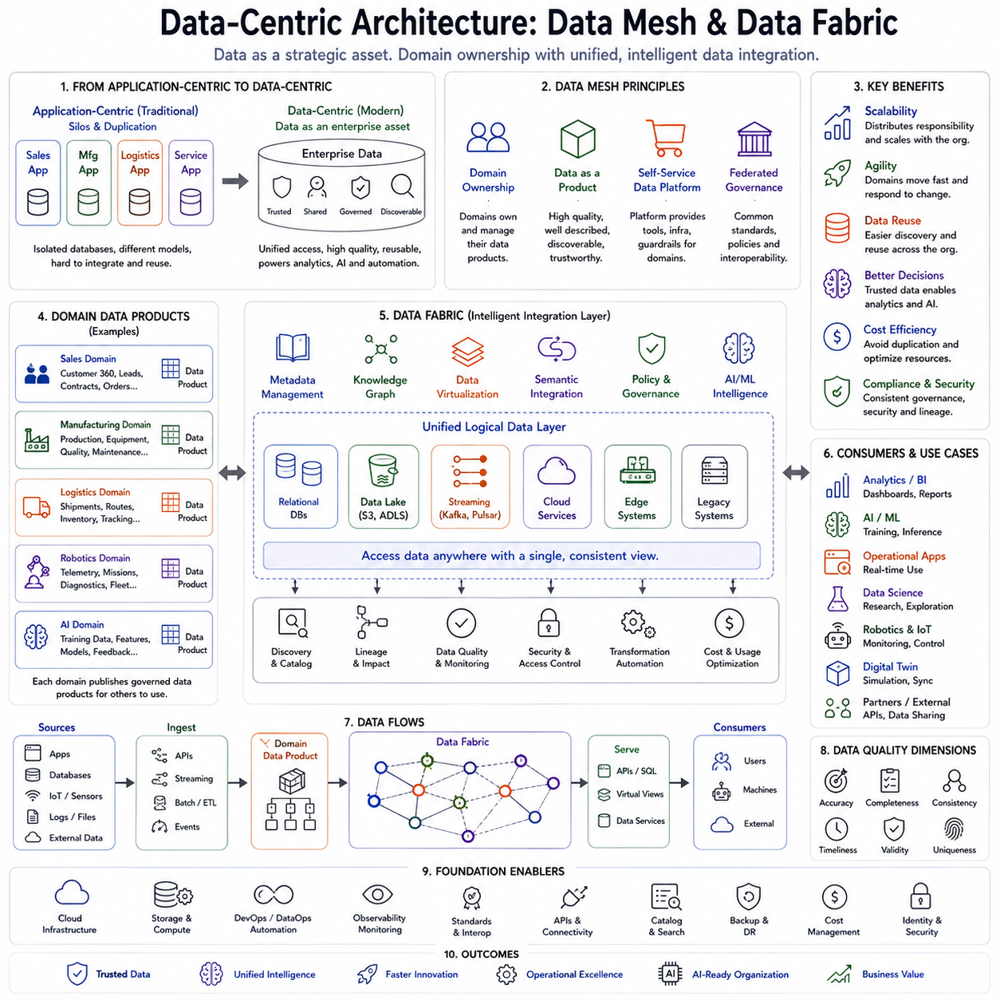{width="7.268055555555556in" height="7.268055555555556in"}

데이터 중심 아키텍처(Data-Centric Architecture)는 현대 소프트웨어 공학(Software Engineering), 엔터프라이즈 정보 시스템(Enterprise Information System), 클라우드 컴퓨팅(Cloud Computing), 인공지능(AI), 로보틱스(Robotics), 산업 자동화(Industrial Automation), 그리고 피지컬 AI(Physical AI) 시대를 대표하는 가장 중요한 아키텍처 패러다임(Architectural Paradigm) 가운데 하나이다. 과거의 소프트웨어는 대부분 **애플리케이션 중심(Application-Centric)** 으로 설계되었다. 즉, 애플리케이션이 중심이었고 데이터는 애플리케이션 내부에 저장되는 부수적인 요소로 취급되었다. 그러나 수천 개의 애플리케이션, 페타바이트(Petabyte) 규모의 데이터, 분산 클라우드, 엣지 장치(Edge Device), 자율 로봇, 사물인터넷(IoT), 그리고 AI가 보편화되면서 이러한 구조는 한계를 드러내기 시작하였다. 현대 기업은 이제 데이터를 단순한 저장 대상이 아니라 가장 중요한 전략적 자산(Strategic Asset)으로 인식하고 있다. 따라서 데이터 중심 아키텍처는 애플리케이션을 데이터의 생산자(Producer)와 소비자(Consumer)로 바라보고, 데이터 자체를 기업의 장기적인 지식(Knowledge)과 핵심 자산으로 관리하는 새로운 철학이다.

기업 시스템의 발전 과정을 살펴보면 이러한 변화는 매우 자연스럽다.

초기의 모놀리식(Monolithic) 시스템에서는 하나의 애플리케이션이 하나의 데이터베이스(Database)를 소유하였다.

이후 클라이언트-서버(Client-Server), 서비스 지향 아키텍처(Service-Oriented Architecture, SOA), 마이크로서비스(Microservice), 클라우드 네이티브(Cloud-Native), 이벤트 기반(Event-Driven) 시스템으로 발전하면서 애플리케이션은 점점 더 독립적으로 운영되기 시작하였다.

그러나 그 결과 고객 정보(Customer Information), 제품 정보(Product Catalog), 생산 데이터(Production Data), 센서 데이터(Sensor Data), 유지보수 기록(Maintenance History), 금융 정보(Financial Transaction)가 각각 다른 시스템에 저장되면서 데이터가 조직 전체에 흩어지게 되었다.

이러한 현상을 **데이터 사일로(Data Silo)** 라고 한다.

데이터 사일로는 현대 기업이 해결해야 하는 가장 큰 문제 가운데 하나이다.

영업(Sales), 제조(Manufacturing), 물류(Logistics), 고객 관리(CRM), 로보틱스(Robotics), 디지털 트윈(Digital Twin), AI, ERP, 재무(Finance) 시스템은 각각 독립적으로 운영되면서 서로 다른 데이터베이스, 데이터 모델(Data Model), 메타데이터(Metadata), 보안 정책(Security Policy), 데이터 품질(Data Quality)을 사용한다.

각 시스템은 개별적으로는 정상적으로 동작하지만 기업 전체에서는 데이터를 통합적으로 활용하기 어려워진다.

이 문제를 해결하기 위해 과거에는 **데이터 웨어하우스(Data Warehouse)** 가 등장하였다.

여러 운영 시스템의 데이터를 ETL(Extract, Transform, Load)을 통해 중앙 저장소(Central Repository)로 모은 후 BI(Business Intelligence)와 분석(Analytics)에 활용하였다.

데이터 웨어하우스는 오랫동안 매우 성공적인 구조였지만, 데이터의 양(Volume), 다양성(Variety), 생성 속도(Velocity)가 폭발적으로 증가하면서 중앙 집중식 구조는 점차 한계를 드러냈다.

모든 데이터를 하나의 중앙 조직이 관리하는 것은 비용과 운영 측면에서 매우 어려워졌다.

이를 보완하기 위해 **데이터 레이크(Data Lake)** 가 등장하였다.

데이터 레이크는 데이터를 미리 정형화하지 않고 원본(Raw Data) 그대로 저장한다.

이미지(Image), 영상(Video), 로그(Log), 센서 데이터(Sensor Stream), 문서(Document), 포인트 클라우드(Point Cloud), AI 학습 데이터셋(Training Dataset), 의료 영상(Medical Image), 시뮬레이션 결과(Simulation Output) 등을 모두 저장할 수 있다.

그러나 메타데이터 관리와 품질 관리가 부족하면 데이터 레이크는 검색도 어렵고 신뢰하기도 어려운 **데이터 스웜프(Data Swamp)** 로 변질될 위험이 있다.

데이터 중심 아키텍처는 단순히 저장 기술을 바꾸는 것이 아니다.

데이터를 생성하고 관리하며 공유하고 검색하고 보호하며 활용하는 조직 전체의 방식을 근본적으로 바꾸는 아키텍처이다.

애플리케이션은 일시적인 계산 서비스(Computational Service)가 되고, 데이터는 기업의 장기적인 지식 기반(Knowledge Base)이 된다.

이러한 철학을 가장 잘 대표하는 것이 **데이터 메시(Data Mesh)** 이다.

데이터 메시는 모든 데이터를 중앙 조직이 관리하는 대신 **도메인(Domain)** 별로 데이터를 관리하도록 한다.

영업 부서는 고객 데이터를 관리하고,

생산 부서는 제조 데이터를 관리하며,

물류 부서는 운송 데이터를 관리하고,

로보틱스 팀은 운영 데이터를 관리하며,

AI 팀은 학습 데이터를 관리한다.

즉 데이터를 가장 잘 이해하는 조직이 데이터를 직접 책임진다.

데이터 메시의 핵심 철학은 **데이터를 하나의 제품(Data as a Product)** 으로 보는 것이다.

과거에는 데이터가 애플리케이션의 부산물(By-product)이었다.

그러나 데이터 메시에서는 데이터셋(Dataset) 자체가 하나의 제품(Product)이다.

소프트웨어 제품처럼 데이터도 품질(Quality), 문서(Document), 검색 가능성(Discoverability), 버전 관리(Versioning), 메타데이터, 서비스 수준 목표(Service Level Objective), 사용성(Usability), 신뢰성(Reliability)을 가져야 한다.

데이터를 제공하는 조직은 자신이 만든 데이터 제품에 대해 장기적인 책임을 진다.

도메인 소유권(Domain Ownership)은 확장성을 크게 향상시킨다.

중앙 데이터 조직은 항상 병목(Bottleneck)이 되기 쉽다.

데이터 메시는 의사결정을 각 도메인으로 분산시켜 변화에 빠르게 대응할 수 있도록 한다.

데이터 메시에서 중요한 또 하나의 원칙은 **셀프 서비스 데이터 플랫폼(Self-Service Data Infrastructure)** 이다.

조직은 각 도메인이 쉽게 데이터를 등록하고 공유하며 보호할 수 있도록 표준 플랫폼(Standard Platform)을 제공한다.

클라우드 플랫폼은 저장소 생성(Storage Provisioning), 메타데이터 등록(Metadata Registration), 스키마 관리(Schema Evolution), 접근 제어(Access Control), 품질 검증(Data Validation), 계보(Lineage) 추적 등을 자동으로 수행한다.

각 도메인은 인프라보다 데이터 품질에 집중할 수 있다.

또 다른 핵심 개념은 **연합형 거버넌스(Federated Computational Governance)** 이다.

완전히 자유롭게 운영하면 메타데이터와 인터페이스가 제각각이 되어 상호운용성(Interoperability)이 사라진다.

반대로 지나치게 중앙집중화하면 민첩성(Agility)이 떨어진다.

연합형 거버넌스는 기업 전체의 표준(Standard)을 유지하면서도 각 도메인에 충분한 자율성을 제공한다.

메타데이터 정의(Metadata Definition), 보안(Security), 품질(Quality), 규제 준수(Compliance), 의미 모델(Semantic Model)은 조직 차원에서 관리되지만 실제 데이터 운영은 각 도메인이 담당한다.

데이터 패브릭(Data Fabric)은 데이터 메시와는 조금 다른 접근 방식을 가진다.

데이터 메시가 **조직(Organization)** 중심이라면 데이터 패브릭은 **기술(Technology)** 중심이다.

데이터 패브릭은 여러 데이터베이스(Database), 클라우드, 엣지 시스템, 레거시 시스템(Legacy System), AI 저장소, IoT 플랫폼, 디지털 트윈, 로보틱스 시스템을 하나의 논리적 데이터 계층(Logical Data Layer)으로 통합한다.

즉 실제 데이터는 여러 곳에 존재하지만 사용자 입장에서는 하나의 통합된 데이터 환경처럼 보인다.

데이터 패브릭의 핵심 목표는 **데이터 접근성(Data Accessibility)** 이다.

모든 데이터를 한곳으로 복사하는 것이 아니라 메타데이터(Metadata), 가상화(Virtualization), 의미 통합(Semantic Integration), 자동 변환(Transformation), 계보(Lineage), 정책 관리(Policy Enforcement)를 이용하여 어디에 저장되어 있든 동일한 방식으로 접근할 수 있도록 만든다.

데이터 패브릭에서 가장 중요한 요소는 **메타데이터(Metadata)** 이다.

모든 데이터는 소유자(Owner), 스키마(Schema), 품질(Quality), 갱신 주기(Update Frequency), 보안 등급(Security Classification), 의미(Semantics), 계보(Lineage), 접근 정책(Access Policy)을 포함한 메타데이터를 가진다.

풍부한 메타데이터는 자동화된 데이터 관리의 기반이 된다.

최근에는 **지식 그래프(Knowledge Graph)** 가 데이터 패브릭에서 중요한 역할을 한다.

고객(Customer), 제품(Product), 설비(Equipment), 센서(Sensor), 로봇(Robot), AI 모델(Model), 유지보수(Maintenance), 생산 공정(Manufacturing Process) 간의 관계를 그래프로 표현하여 의미 기반 검색(Semantic Search)과 자동 통합(Automated Integration)을 가능하게 한다.

인공지능도 데이터 패브릭의 중요한 구성 요소가 되고 있다.

머신러닝(Machine Learning)은 데이터 자동 분류(Classification), 이상 탐지(Anomaly Detection), 데이터 품질 평가(Data Quality Assessment), 메타데이터 생성(Metadata Generation), 정책 추천(Policy Recommendation), 관계 분석(Relationship Discovery)을 자동으로 수행한다.

즉 데이터 패브릭은 시간이 지나면서 스스로 진화하는 지능형 데이터 플랫폼(Intelligent Data Platform)이 된다.

데이터 가상화(Data Virtualization)도 중요한 기능이다.

모든 데이터를 복사하지 않고도 여러 시스템의 데이터를 하나의 논리적 데이터(Logical View)처럼 제공한다.

예를 들어 고객 정보는 CRM, ERP, 물류, IoT, AI 추천 시스템에 각각 존재할 수 있다.

데이터 가상화는 이를 하나의 고객 정보처럼 통합하여 제공한다.

실시간 스트리밍(Real-Time Streaming)도 데이터 패브릭의 중요한 기능이다.

IoT 센서, 산업 설비, 자율 로봇, 디지털 트윈, 금융 거래, AI 추론은 지속적으로 이벤트(Event)를 생성한다.

데이터 패브릭은 이러한 스트림(Stream)을 실시간으로 통합하여 운영 분석(Operation Analytics), 이상 탐지(Anomaly Detection), 예지보전(Predictive Maintenance), 자율 의사결정(Autonomous Decision Making)을 지원한다.

클라우드 네이티브는 데이터 메시와 데이터 패브릭 모두와 잘 결합된다.

분산 객체 저장소(Distributed Object Storage), 서버리스(Serverless), Kubernetes, 메시지 브로커(Message Broker), 메타데이터 서비스(Metadata Service), AI 플랫폼이 모두 데이터 중심 아키텍처를 지원한다.

마이크로서비스도 데이터 중심 아키텍처와 자연스럽게 연결된다.

각 서비스는 자신의 데이터를 소유하면서도 이벤트(Event)를 발행하여 다른 서비스와 정보를 공유한다.

CQRS(Command Query Responsibility Segregation), 이벤트 소싱(Event Sourcing), 리액티브 아키텍처(Reactive Architecture)도 데이터 메시와 함께 자주 사용된다.

인공지능은 데이터 품질에 크게 의존한다.

LLM(Large Language Model), 파운데이션 모델(Foundation Model), 멀티모달 AI(Multimodal AI), 추천 시스템(Recommendation System), 강화학습(Reinforcement Learning), 컴퓨터 비전(Computer Vision)은 모두 지속적으로 관리되는 데이터가 필요하다.

데이터 메시는 AI 학습 데이터를 도메인별로 관리하게 하고,

데이터 패브릭은 이를 통합하여 검색하고 품질을 관리하며 안전하게 공유할 수 있도록 한다.

MLOps(Machine Learning Operations)도 데이터 중심 아키텍처의 혜택을 크게 받는다.

Feature Store, 학습 데이터셋, 모델 레지스트리(Model Registry), 추론 로그(Inference Log), 평가 지표(Evaluation Metric), 피드백 데이터가 모두 데이터 제품(Data Product)이 된다.

로보틱스에서는 데이터 중심 아키텍처가 더욱 중요하다.

자율 로봇은 카메라 영상(Camera Image), LiDAR 포인트 클라우드(Point Cloud), Radar 데이터, IMU, GNSS, 조작 로그(Manipulation Log), 안전 이벤트(Safety Event), 위치 추정(Localization History), 배터리 상태(Battery Telemetry), 플릿 운영(Fleet Operation), 디지털 트윈 데이터를 지속적으로 생성한다.

이러한 데이터는 단순한 운행 기록이 아니라 미래 AI 학습을 위한 핵심 자산이다.

데이터 메시에서는 로봇 운영 데이터, 내비게이션 데이터, 유지보수 데이터, 검사 데이터, 시뮬레이션 데이터, AI 학습 데이터가 각각 독립적인 데이터 제품이 된다.

AI 팀은 이를 이용하여 모델을 학습하고,

운영팀은 예지보전을 수행하며,

생산팀은 생산성을 최적화한다.

데이터 패브릭은 로봇, 클라우드, 디지털 트윈, MES(Manufacturing Execution System), WMS(Warehouse Management System), ERP, AI 플랫폼을 하나의 통합된 데이터 계층으로 연결한다.

메타데이터를 이용하여 센서 데이터, 소프트웨어 버전, 환경 조건, AI 모델 성능, 유지보수 이력을 모두 연결할 수 있다.

디지털 트윈은 데이터 중심 아키텍처를 가장 적극적으로 활용하는 분야이다.

센서 데이터, 유지보수 기록, 환경 정보, 시뮬레이션 결과, AI 예측, 검사 결과가 모두 하나의 디지털 자산(Digital Asset)을 구성한다.

데이터 메시는 데이터 소유권을 정의하고,

데이터 패브릭은 이를 하나의 통합된 지식 시스템으로 연결한다.

산업 자동화도 마찬가지이다.

MES, PLC(Programmable Logic Controller), 산업용 로봇, 물류 자동화, 품질 검사 시스템, 예지보전, ERP는 각각 데이터를 생성한다.

데이터 중심 아키텍처는 이를 하나의 기업 지식 생태계(Knowledge Ecosystem)로 통합하여 최적화, 지속 가능성(Sustainability), 추적성(Traceability), 품질 관리(Quality Assurance)를 가능하게 한다.

의료 분야에서도 데이터 중심 아키텍처가 빠르게 확산되고 있다.

의료 영상(Medical Imaging), 전자의무기록(Electronic Health Record), 웨어러블(Wearable Device), 검사 시스템(Laboratory System), 유전체 데이터(Genomic Database), AI 진단, 병원 운영 데이터가 모두 통합되어 정밀 의료(Precision Medicine)를 지원한다.

보안(Security)과 거버넌스(Governance)는 데이터 중심 아키텍처에서 매우 중요하다.

민감한 데이터는 인증(Authentication), 권한 관리(Authorization), 암호화(Encryption), 감사 로그(Audit Logging), 개인정보 보호(Privacy Preservation), 규제 준수(Regulatory Compliance)를 반드시 만족해야 한다.

최근에는 **제로 트러스트(Zero Trust)** 보안 모델이 데이터 중심 아키텍처와 함께 사용되고 있다.

데이터 계보(Data Lineage)도 매우 중요하다.

데이터가 어디에서 생성되었고,

어떻게 변환되었으며,

어떤 AI 모델이 사용했고,

어떤 결과를 생성했는지를 모두 추적할 수 있어야 한다.

이는 AI의 설명 가능성(Explainability)과 규제 준수를 위해 매우 중요하다.

데이터 품질(Data Quality)은 데이터 중심 아키텍처의 핵심이다.

완전성(Completeness), 정확성(Accuracy), 일관성(Consistency), 최신성(Timeliness), 유일성(Uniqueness), 신뢰성(Reliability)을 지속적으로 자동 평가해야 한다.

품질이 높은 데이터는 AI 성능, BI 정확도, 로봇 신뢰성을 크게 향상시킨다.

물론 데이터 메시와 데이터 패브릭은 기술만으로 구현되지 않는다.

도메인 중심 조직(Domain Ownership), 협업 문화(Collaboration), 메타데이터 관리(Metadata Discipline), 데이터 거버넌스(Data Governance), 플랫폼 엔지니어링(Platform Engineering)이 함께 변화해야 한다.

즉 조직 문화와 기술이 함께 발전해야 한다.

데이터 메시와 데이터 패브릭은 경쟁 관계가 아니라 상호 보완적인 관계이다.

데이터 메시는 **조직의 확장성(Organizational Scalability)** 을 해결하고,

데이터 패브릭은 **기술적인 통합(Technological Integration)** 을 해결한다.

많은 글로벌 기업은 두 방식을 동시에 적용하고 있다.

클라우드 네이티브, 분산 AI(Distributed AI), 디지털 트윈(Digital Twin), 로보틱스(Robotics), 산업 자동화, 엣지 컴퓨팅(Edge Computing), 멀티모달 AI(Multimodal AI), 피지컬 AI가 발전할수록 데이터 중심 아키텍처는 더욱 중요한 역할을 하게 될 것이다.

미래의 지능형 시스템은 뛰어난 알고리즘만으로는 충분하지 않다. **신뢰할 수 있고(Trustworthy), 상호운용 가능하며(Interoperable), 쉽게 검색할 수 있고(Discoverable), 체계적으로 관리되며(Governed), 지속적으로 발전하는 조직의 지식(Knowledge)** 이 필수적이다.

데이터 메시(Data Mesh)와 데이터 패브릭(Data Fabric)은 이러한 미래를 위한 핵심 기반 기술이다. 이들은 데이터를 단순한 저장 대상이 아니라 **조직 전체의 지능(Enterprise Intelligence)을 형성하는 핵심 자산**으로 승격시킨다. 궁극적으로 **데이터 중심 아키텍처는 애플리케이션을 일시적인 계산 수행자(Computational Participant)로, 데이터를 기업과 AI의 지속 가능한 전략적 자산(Strategic Asset)으로 바라보는 새로운 소프트웨어 철학**이며, 앞으로 **엔터프라이즈 시스템, 인공지능(AI), 로보틱스, 디지털 트윈, 그리고 피지컬 AI 시대를 이끌어갈 핵심 아키텍처 패러다임**으로 계속 발전해 나갈 것이다.

## 02.10 Composite Pattern Selection Guide for Robot Software

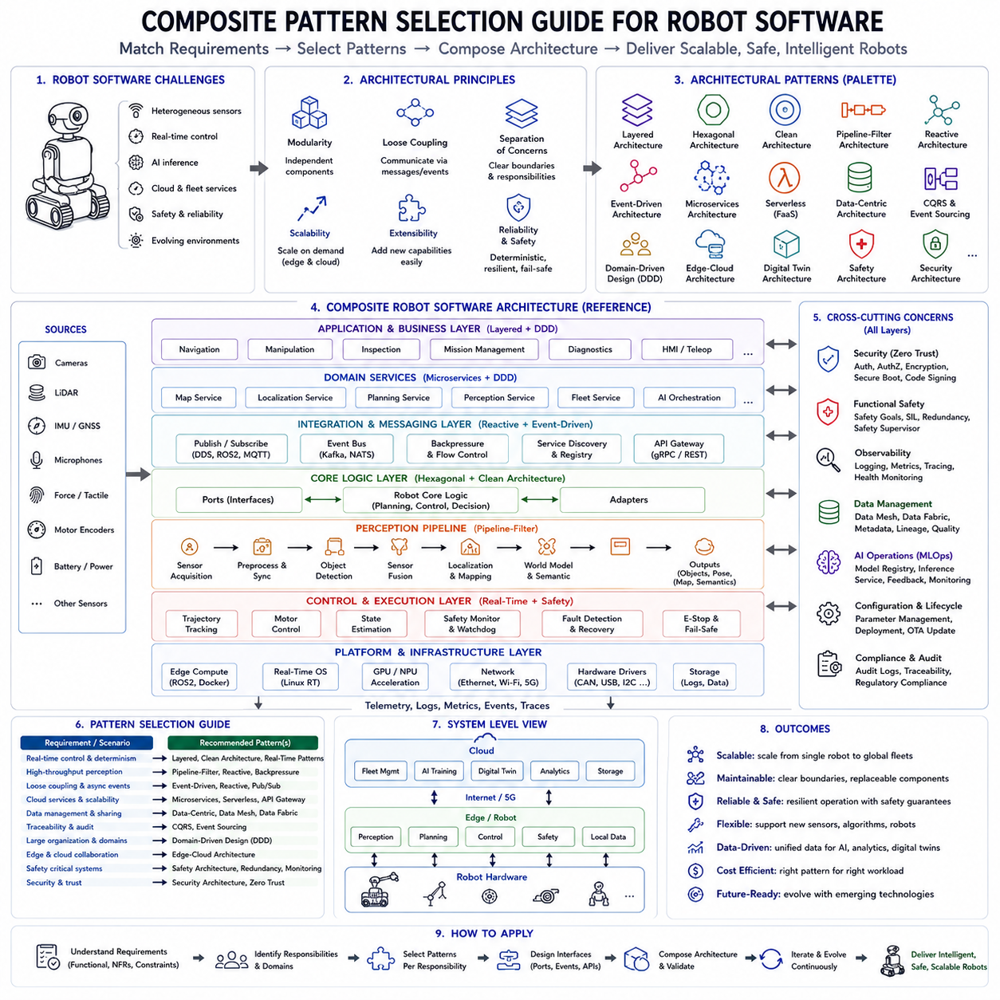{width="7.268055555555556in" height="7.268055555555556in"}

현대의 로봇 소프트웨어(Robot Software)는 가장 복잡한 분산 소프트웨어(Distributed Software) 시스템 가운데 하나로 발전하였다. 일반적인 엔터프라이즈 소프트웨어와 달리 로봇은 다양한 센서(Sensor)의 데이터를 동시에 처리하고, 결정론적 실시간 제어(Deterministic Real-Time Control)를 수행하며, 인공지능(AI) 추론(Inference), 클라우드 서비스(Cloud Service) 연동, 하드웨어 자원 관리(Resource Management), 기능 안전(Functional Safety), 그리고 끊임없이 변화하는 물리 환경(Physical Environment)에 대한 적응까지 모두 수행해야 한다. 이러한 요구사항을 하나의 소프트웨어 아키텍처(Software Architecture)나 하나의 디자인 패턴(Design Pattern)만으로 해결하는 것은 사실상 불가능하다. 따라서 현대의 로봇 소프트웨어는 여러 개의 아키텍처 패턴을 하나의 시스템 안에서 조합하여 사용하는 **복합 아키텍처(Composite Architecture)** 를 채택한다. 복합 패턴 선택(Composite Pattern Selection)은 단순한 설계 기법이 아니라, 장기간 유지 가능한(Maintainable), 확장 가능한(Scalable), 신뢰성 높은(Reliable), 그리고 지속적으로 진화 가능한(Evolvable) 로봇 플랫폼을 구축하기 위한 핵심 설계 전략이다.

초기의 로봇 소프트웨어는 대부분 **모놀리식 아키텍처(Monolithic Architecture)** 를 사용하였다. 센서 처리, 경로 계획(Path Planning), 제어(Control), 통신(Communication), 하드웨어 인터페이스(Hardware Interface)가 하나의 프로그램 안에 구현되었다. 이러한 구조는 초기에는 단순하고 구현하기 쉬웠지만, 기능이 증가할수록 유지보수가 매우 어려워졌다. 새로운 센서를 추가하거나 내비게이션 알고리즘을 변경하고, 클라우드 기능을 추가하거나 AI 모델을 교체할 때 전체 시스템을 수정해야 하는 경우가 많았다.

이후 ROS(Robot Operating System)와 같은 미들웨어(Middleware)가 등장하면서 로봇 소프트웨어는 **노드(Node)** 기반 구조로 발전하였다. 각각의 기능은 독립적인 노드로 실행되며 Publish-Subscribe 구조를 통해 통신하였다. 이는 결합도(Coupling)를 크게 줄였지만, 클라우드 네이티브(Cloud-Native), 분산 AI(Distributed AI), 디지털 트윈(Digital Twin), 플릿 관리(Fleet Management), 엣지 컴퓨팅(Edge Computing), 그리고 피지컬 AI(Physical AI)가 등장하면서 노드 기반 구조만으로는 충분하지 않게 되었다.

복합 아키텍처의 가장 중요한 철학은 **모든 기능에 동일한 아키텍처를 적용하지 않는 것**이다.

모터 제어(Motor Control), 센서 인지(Perception), 미션 계획(Mission Planning), 클라우드 동기화(Cloud Synchronization), 진단(Diagnostics), 플릿 관리(Fleet Coordination), AI 추론(AI Inference), 디지털 트윈, 안전(Safety), 사이버 보안(Cybersecurity), 인간-기계 인터페이스(Human-Machine Interface)는 모두 서로 다른 계산 특성을 가진다.

따라서 기능에 맞는 아키텍처를 선택하여 조합해야 한다.

가장 기본이 되는 구조는 **계층형 아키텍처(Layered Architecture)** 이다.

하드웨어 추상화 계층(Hardware Abstraction Layer)은 모터, 센서, 카메라(Camera), LiDAR, IMU, GNSS, 배터리(Battery), 통신 장치를 관리한다.

미들웨어 계층(Middleware Layer)은 메시지(Message), 동기화(Synchronization), 라이프사이클(Lifecycle)을 관리한다.

애플리케이션 계층(Application Layer)은 내비게이션(Navigation), 조작(Manipulation), 인지(Perception), 검사(Inspection), 진단(Diagnostics)을 담당한다.

비즈니스 계층(Business Layer)은 미션 관리(Mission Management)를 수행하며,

클라우드 계층(Cloud Integration Layer)은 플릿 관리, 디지털 트윈, 분석(Analytics)을 담당한다.

계층 구조는 책임 분리를 명확하게 하여 유지보수를 쉽게 만든다.

그러나 계층 구조만으로는 충분하지 않다.

**헥사고날 아키텍처(Hexagonal Architecture)** 는 핵심 로직(Core Logic)을 외부 인프라로부터 분리한다.

내비게이션, 위치 추정(Localization), 세계 모델(World Model), 조작 계획(Manipulation Planning), 검사 로직은 내부(Core)에 존재하며,

ROS2, DDS, MQTT, REST API, CAN Bus, 산업용 필드버스(Fieldbus), 데이터베이스(Database), 클라우드 서비스는 모두 Adapter 역할을 수행한다.

Ports와 Adapters 구조 덕분에 하드웨어나 통신 프로토콜을 변경해도 핵심 로직은 거의 수정되지 않는다.

**클린 아키텍처(Clean Architecture)** 는 의존성 역전(Dependency Inversion)을 더욱 강화한다.

예를 들어 내비게이션 알고리즘은 특정 LiDAR 제조사에 의존해서는 안 되며,

조작 계획은 특정 로봇팔(Robot Arm)에 종속되어서는 안 된다.

플릿 관리도 특정 클라우드 플랫폼에 종속되지 않아야 한다.

비즈니스 정책(Business Policy)은 기술보다 오래 살아남기 때문에 항상 외부 기술과 분리되어야 한다.

**파이프라인-필터 아키텍처(Pipeline-Filter Architecture)** 는 인지 시스템에 가장 적합하다.

카메라 입력(Image Acquisition), 전처리(Preprocessing), 센서 동기화(Sensor Synchronization), 객체 검출(Object Detection), 의미 분할(Semantic Segmentation), 특징 추출(Feature Extraction), 센서 융합(Sensor Fusion), 위치 추정(Localization), 지도 생성(Mapping), 세계 모델 생성(World Model), 의미 추론(Semantic Reasoning)이 각각 독립적인 필터(Filter)로 연결된다.

각 필터는 하나의 기능만 수행하므로 새로운 AI 모델로 쉽게 교체할 수 있다.

**리액티브 아키텍처(Reactive Architecture)** 는 비동기 이벤트(Asynchronous Event)를 처리하는 데 매우 적합하다.

센서는 데이터를 생성하고,

플릿 관리자는 미션을 전달하며,

클라우드는 상태를 동기화하고,

AI는 추론 결과를 생성하며,

운영자는 명령을 내린다.

이러한 이벤트는 서로 독립적으로 발생하므로 Publish-Subscribe 구조가 매우 적합하다.

**백프레셔(Backpressure)** 는 리액티브 구조를 안정적으로 유지하기 위한 핵심 메커니즘이다.

카메라는 초당 60장의 영상을 생성하지만 GPU는 30장만 처리할 수도 있다.

이 경우 카메라가 계속 데이터를 보내면 메모리가 가득 차고 전체 시스템이 느려진다.

백프레셔는 GPU 처리 속도에 맞추어 입력 속도를 자동으로 조절한다.

**이벤트 기반 아키텍처(Event-Driven Architecture)** 는 상위 업무 흐름을 구성하는 데 적합하다.

미션 완료는 검사 시작 이벤트를 발생시키고,

검사 결과는 유지보수 요청을 생성하며,

배터리 부족은 충전 작업을 시작하고,

AI 이상 탐지는 진단 시스템을 호출한다.

새로운 서비스는 기존 이벤트를 구독하기만 하면 되므로 확장이 매우 쉽다.

**마이크로서비스(Microservice)** 는 로봇 외부의 클라우드 시스템에 적합하다.

플릿 관리(Fleet Management), 지도 관리(Map Management), AI 오케스트레이션(AI Orchestration), 디지털 트윈, 사용자 인증(Authentication), 예지보전(Predictive Maintenance), 분석(Analytics), 소프트웨어 업데이트는 각각 독립적인 서비스가 된다.

필요한 서비스만 확장하면 되므로 운영 효율성이 매우 높다.

**서버리스(Serverless)** 는 간헐적으로 실행되는 기능에 적합하다.

검사 보고서 생성,

이상 알림(Notification),

유지보수 예약,

AI 전처리,

로그(Log) 분석,

원격 업데이트(Remote Update)는 항상 실행될 필요가 없다.

이벤트가 발생할 때만 Function as a Service(FaaS)가 실행되므로 비용을 크게 절감할 수 있다.

**데이터 중심 아키텍처(Data-Centric Architecture)** 는 AI 시대에 필수적인 구조이다.

내비게이션 데이터,

인지 데이터,

유지보수 기록,

검사 이미지,

배터리 데이터,

플릿 운영 정보,

디지털 트윈 정보는 모두 기업의 장기적인 데이터 자산이다.

데이터 메시(Data Mesh)는 이를 도메인(Domain)별로 관리하고,

데이터 패브릭(Data Fabric)은 메타데이터(Metadata)를 이용하여 통합한다.

**CQRS(Command Query Responsibility Segregation)** 와 **이벤트 소싱(Event Sourcing)** 은 운영 이력을 관리하는 데 매우 적합하다.

미션 명령(Command)은 실행 시스템으로 전달되고,

조회(Query)는 운영 대시보드(Dashboard)를 제공한다.

모든 이벤트(Event)는 영구 저장되어 디버깅(Debugging), AI 학습, 디지털 트윈 재생성(Reconstruction), 규제 준수(Compliance)에 활용된다.

**도메인 주도 설계(Domain-Driven Design, DDD)** 는 대규모 로봇 프로젝트에서 매우 중요하다.

내비게이션,

인지,

조작,

검사,

충전,

플릿,

사이버 보안,

디지털 트윈,

유지보수는 각각 독립적인 바운디드 컨텍스트(Bounded Context)가 된다.

각 팀은 자신의 도메인만 이해하면 되므로 협업 효율성이 크게 향상된다.

인공지능은 별도의 구조를 필요로 한다.

AI 추론은 실시간 제어와 분리되어야 한다.

실시간 제어는 결정론적 실행(Deterministic Execution)이 중요하지만,

멀티모달 AI(Multimodal AI),

강화학습(Reinforcement Learning),

세계 모델(World Model)은 상대적으로 유연한 비동기 실행이 가능하다.

따라서 AI는 독립적인 AI 서비스(AI Service)로 분리하는 것이 일반적이다.

**엣지-클라우드 하이브리드(Edge-Cloud Hybrid)** 구조도 매우 중요하다.

실시간 인지,

위치 추정,

모터 제어,

안전 시스템은 엣지 컴퓨터(Edge Computer)에서 실행되고,

플릿 최적화,

AI 학습,

디지털 트윈,

예지보전,

ERP 연동은 클라우드에서 수행된다.

두 환경은 지속적으로 데이터를 동기화한다.

**디지털 트윈(Digital Twin)** 은 이제 독립적인 기능이 아니라 모든 시스템을 연결하는 공통 플랫폼이 된다.

로봇은 지속적으로 상태를 디지털 트윈으로 전송하고,

디지털 트윈은 운영 상태, 유지보수 기록, AI 모델 버전, 환경 정보를 관리한다.

시뮬레이션(Simulation)은 미래의 작업을 미리 검증하고,

예지보전은 고장을 예측하며,

AI는 이를 이용하여 지속적으로 학습한다.

**안전 아키텍처(Safety Architecture)** 는 기능과 반드시 분리되어야 한다.

비상 정지(Emergency Stop),

워치독(Watchdog),

장애 감지(Fault Detection),

중복성(Redundancy),

통신 무결성(Communication Integrity),

건전성 모니터링(Health Monitoring)은 항상 독립적으로 실행되어야 한다.

안전 시스템은 필요하면 AI나 내비게이션보다 우선하여 로봇을 정지시킬 수 있어야 한다.

**사이버 보안 아키텍처(Cybersecurity Architecture)** 도 모든 계층에 적용되어야 한다.

인증(Authentication),

권한 관리(Authorization),

암호화 통신(Encrypted Communication),

신뢰 실행 환경(Trusted Execution Environment),

소프트웨어 서명(Code Signing),

침입 탐지(Intrusion Detection)는 특정 모듈이 아니라 시스템 전체의 구조에 포함되어야 한다.

**관측성 아키텍처(Observability Architecture)** 도 필수 요소이다.

분산 추적(Distributed Tracing),

구조화 로그(Structured Logging),

텔레메트리(Telemetry),

메모리,

배터리,

센서,

AI 신뢰도,

위치 추정 정확도,

미션 성공률을 지속적으로 모니터링해야 한다.

이는 복잡한 분산 시스템을 운영하는 데 필수적인 기반이 된다.

복합 패턴을 선택할 때 가장 중요한 기준은 **기술이 아니라 요구사항(Requirement)** 이다.

모터 제어는 결정론적 구조가 적합하고,

인지는 파이프라인 구조가 적합하며,

분산 통신은 리액티브 구조,

클라우드는 마이크로서비스,

간헐적 작업은 서버리스,

AI는 데이터 중심 구조,

장기 유지보수는 클린 아키텍처,

대규모 조직은 DDD가 적합하다.

즉 하나의 패턴이 모든 문제를 해결하지 않는다.

성능 요구사항도 패턴 선택에 큰 영향을 준다.

초저지연(Ultra-Low Latency) 제어는 불필요한 미들웨어를 최소화해야 하고,

GPU 기반 인지는 병렬 처리(Parallel Processing)를 극대화해야 하며,

클라우드는 탄력성(Elasticity)을 우선해야 하고,

AI는 비동기 실행을 활용해야 한다.

각 기능은 서로 다른 성능 목표를 가진다.

로봇 프로젝트가 성장할수록 복합 패턴의 중요성은 더욱 커진다.

프로토타입(Prototype)은 단순한 계층 구조로 시작할 수 있지만,

상용 제품(Product)은 점차 파이프라인,

리액티브,

디지털 트윈,

플릿,

클라우드,

데이터 중심 구조를 추가하게 된다.

글로벌 규모의 로봇 플랫폼은 거의 모든 현대적인 아키텍처 패턴을 함께 사용하게 된다.

기술(Technology)은 아키텍처보다 우선하지 않는다.

NVIDIA Isaac은 모두 구현 기술(Implementation Technology)일 뿐이다.

아키텍처는 이러한 기술 위에 존재하는 상위 개념이다.

미래의 피지컬 AI 플랫폼은 더욱 복합적인 구조를 가지게 될 것이다.

멀티모달 인식(Multimodal Perception),

세계 모델(World Model),

분산 AI 에이전트(Distributed AI Agent),

디지털 트윈,

엣지-클라우드 협업,

지속적 학습(Continual Learning),

예지보전,

산업 자동화,

인간-로봇 협업(Human-Robot Collaboration)이 하나의 통합된 생태계를 형성하게 된다.

이러한 복잡성을 하나의 패턴으로 해결하는 것은 불가능하다.

궁극적으로 **복합 패턴 선택(Composite Pattern Selection)** 은 여러 아키텍처 패턴을 단순히 나열하는 것이 아니라 **각 패턴의 장점과 한계를 이해하고, 요구사항에 맞추어 가장 적절한 조합을 구성하는 체계적인 아키텍처 설계 방법론**이다. **계층형 아키텍처(Layered Architecture), 클린 아키텍처(Clean Architecture), 헥사고날 아키텍처(Hexagonal Architecture), 파이프라인-필터(Pipeline-Filter), 리액티브 시스템(Reactive System), 이벤트 기반 아키텍처(Event-Driven Architecture), 마이크로서비스(Microservices), 서버리스(Serverless), 데이터 중심 아키텍처(Data-Centric Architecture), CQRS, 이벤트 소싱(Event Sourcing), 디지털 트윈(Digital Twin), AI 서비스(AI Services), 엣지-클라우드 컴퓨팅(Edge-Cloud Computing), 그리고 도메인 주도 설계(DDD)** 를 유기적으로 결합할 때 비로소 **확장 가능하고(Scalable), 유지보수가 쉬우며(Maintainable), 복원력이 높고(Resilient), 지능적이며(Intelligent), 지속적으로 진화 가능한(Evolvable) 차세대 자율 로봇 및 피지컬 AI 플랫폼을 위한 소프트웨어 기반**을 구축할 수 있다.
