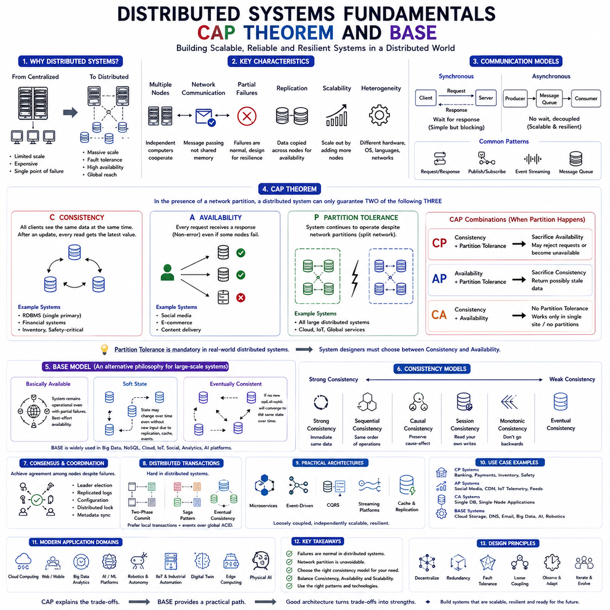
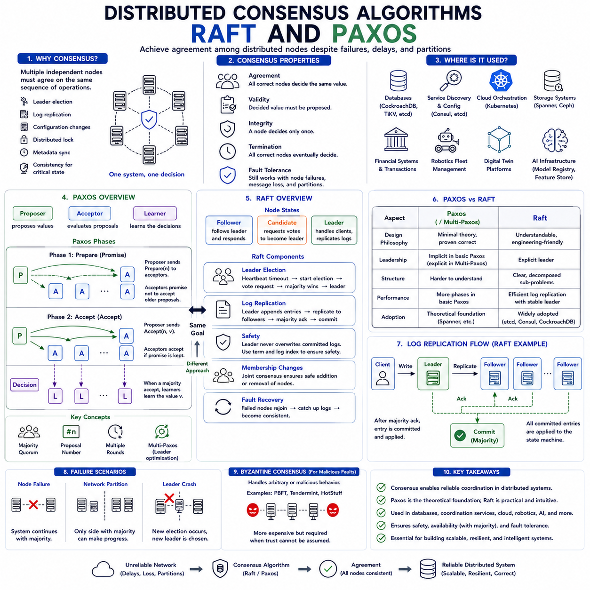
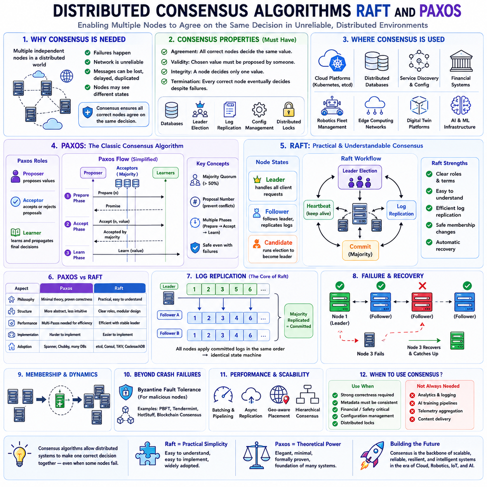
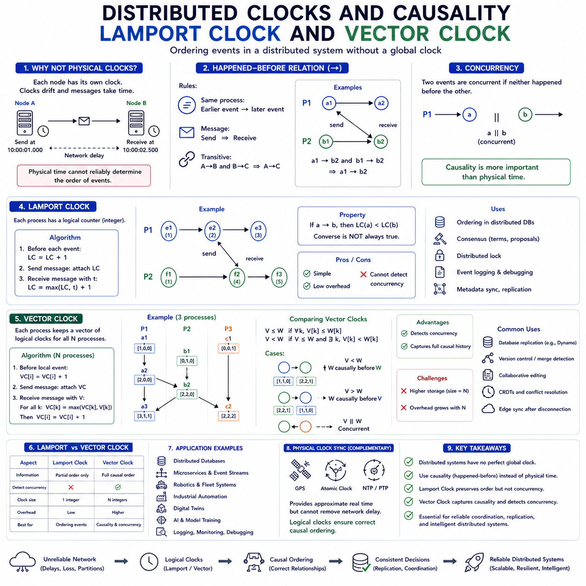
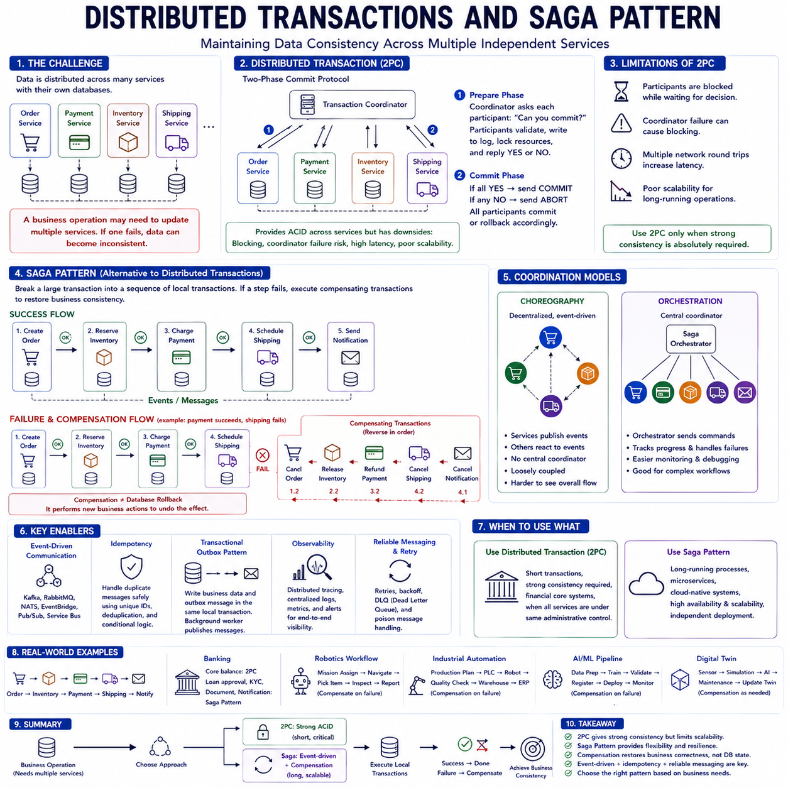
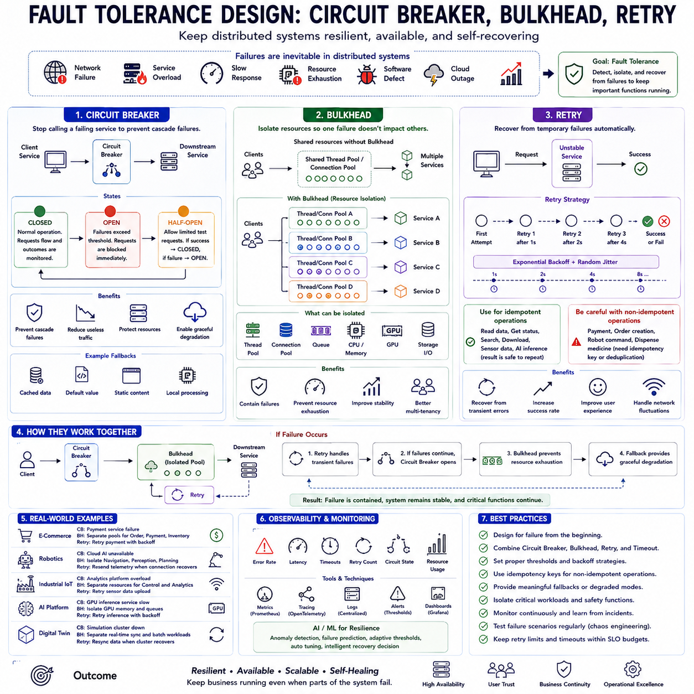
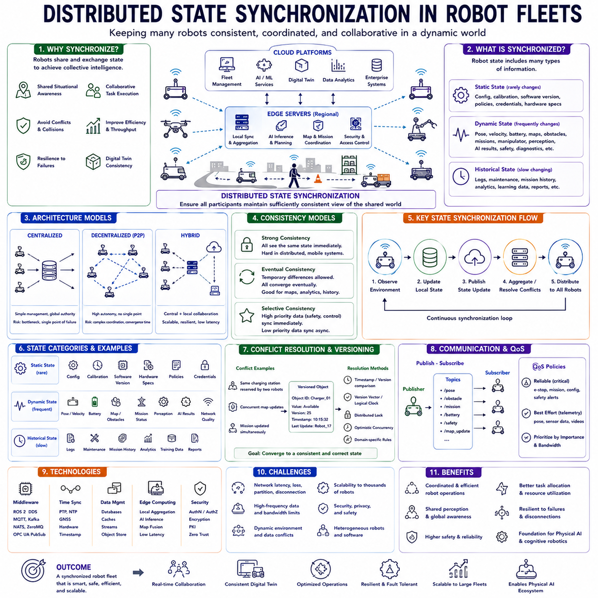
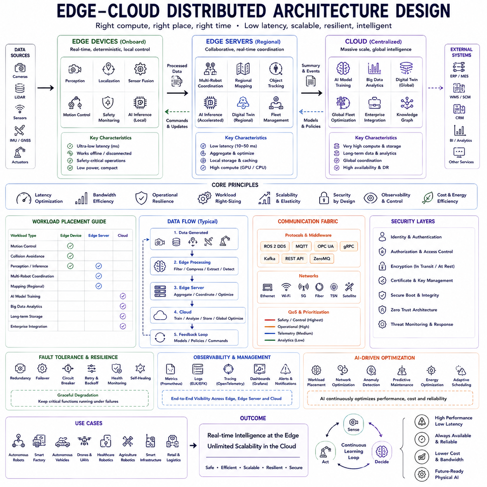
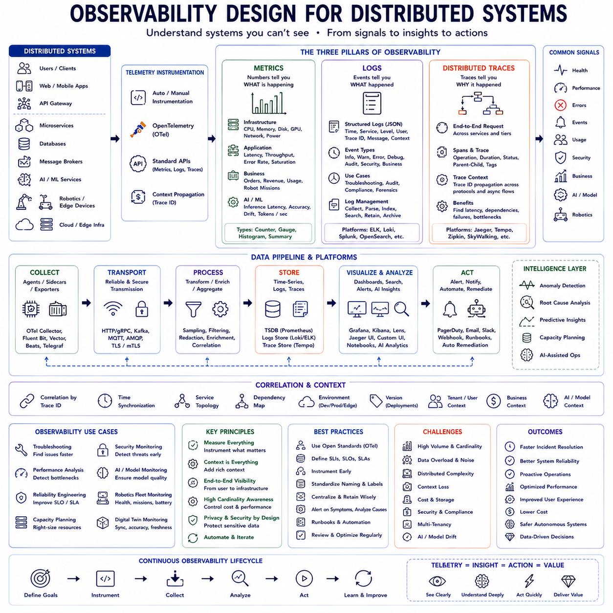
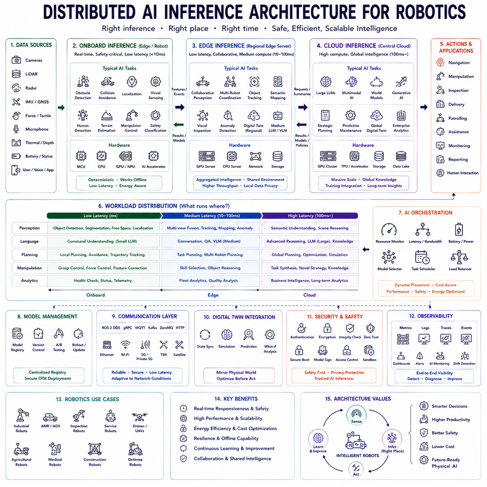

**Volume 1 Software Architecture Fundamentals**


# 03. Distributed Systems

##  

## 03.01 Distributed Systems Fundamentals: CAP Theorem / BASE

{width="7.268055555555556in" height="7.268055555555556in"}

Distributed systems have become the fundamental computational infrastructure supporting nearly every modern software platform, including cloud computing, enterprise information systems, Internet services, artificial intelligence, robotics, Industrial Internet of Things (IIoT), autonomous vehicles, digital twins, edge computing, and Physical AI. Unlike traditional monolithic software that executes on a single computer, distributed systems divide computation, storage, communication, and decision making across multiple interconnected machines that cooperate to achieve a common objective. This architectural evolution enables organizations to process enormous volumes of data, support millions of concurrent users, tolerate hardware failures, provide global availability, and dynamically scale computational capacity according to operational demand. However, distribution also introduces new engineering challenges involving communication latency, network failures, consistency management, fault tolerance, synchronization, and data replication. Understanding the fundamental principles governing distributed systems is therefore essential for designing reliable, scalable, and resilient software architectures.

The motivation for distributed computing emerged as computational requirements outgrew the capabilities of individual machines. Early enterprise applications often executed on centralized mainframes where computation, storage, and user interaction occurred within a single physical system. Although centralized architectures simplified programming and consistency management, they suffered from limited scalability, expensive hardware upgrades, and single points of failure. As networking technologies matured and commodity hardware became increasingly powerful, organizations recognized that collections of interconnected computers could collectively provide significantly greater computational capacity than individual high-end systems while simultaneously improving fault tolerance and operational flexibility.

Modern distributed systems appear throughout virtually every computing domain. Cloud service providers operate millions of servers distributed across geographically separated data centers. Social media platforms continuously synchronize user information across global infrastructure. Financial institutions replicate transaction processing among redundant computing centers. Industrial automation coordinates manufacturing equipment through distributed control systems. Autonomous robot fleets communicate with cloud intelligence while performing local edge computation. Artificial intelligence platforms distribute model training across GPU clusters. Digital twins synchronize physical assets with virtual representations located in cloud infrastructure. Every one of these examples illustrates software components collaborating across multiple independent computational nodes.

The defining characteristic of distributed systems is that computation occurs on multiple autonomous machines connected through communication networks rather than within a single shared memory environment. Each node possesses its own processor, memory, storage, operating system, and local execution environment. Communication therefore occurs through message passing rather than direct memory access. Consequently, network latency, bandwidth limitations, communication failures, clock synchronization, and partial system failures become fundamental architectural considerations absent from centralized software systems.

One of the earliest assumptions challenged by distributed computing concerns failure. Traditional software often implicitly assumes that computational resources remain continuously available. Distributed systems instead assume that failures inevitably occur. Hardware components fail unexpectedly. Network links become unavailable. Storage devices malfunction. Software services crash. Cloud regions experience outages. Power failures interrupt operation. Communication delays fluctuate unpredictably. Consequently, modern distributed architecture emphasizes fault tolerance rather than failure avoidance. Systems must continue operating despite partial infrastructure failures because complete infrastructure reliability remains unattainable.

Scalability represents another central motivation. Vertical scaling increases computational capacity by upgrading individual hardware systems with faster processors, additional memory, or larger storage. While relatively straightforward, vertical scaling eventually encounters physical, economic, and technological limitations. Horizontal scaling instead increases capacity by adding additional computational nodes. Distributed systems therefore support virtually unlimited growth because computational resources expand incrementally according to organizational demand rather than depending upon increasingly expensive individual machines.

Replication provides another important architectural mechanism. Critical data frequently exists simultaneously on multiple independent servers located across different physical locations. If one storage node becomes unavailable, alternative replicas continue serving client requests. Replication significantly improves availability, disaster recovery, read performance, and geographic distribution. However, maintaining consistency among multiple replicas introduces substantial engineering complexity because updates must eventually propagate throughout distributed infrastructure while preserving application correctness.

Distributed systems generally distinguish between synchronous and asynchronous communication models. Synchronous communication requires clients to wait until responses arrive before continuing execution. Asynchronous communication instead allows computation to continue while messages remain in transit. Modern cloud-native architectures increasingly emphasize asynchronous messaging because loosely coupled communication improves scalability, resilience, and resource utilization. Event-driven architectures, reactive systems, message queues, publish-subscribe middleware, and distributed streaming platforms all leverage asynchronous communication extensively.

Network latency fundamentally influences distributed application design. Even high-speed communication remains orders of magnitude slower than local memory access. Reading information from local memory typically requires nanoseconds. Accessing local storage requires microseconds or milliseconds. Communicating with remote cloud services may require tens or hundreds of milliseconds depending upon geographic separation. Consequently, distributed algorithms carefully minimize unnecessary network communication while maximizing locality whenever possible.

One of the most influential theoretical foundations within distributed computing is the CAP Theorem. Proposed by Eric Brewer and formally proven by Seth Gilbert and Nancy Lynch, the CAP Theorem states that a distributed data system cannot simultaneously guarantee Consistency, Availability, and Partition Tolerance under network partition conditions. Since network partitions inevitably occur within sufficiently large distributed systems, architects must carefully balance these competing properties according to application requirements.

Consistency within CAP Theorem differs somewhat from traditional database consistency. CAP consistency requires that every client always observes the same data regardless of which replica serves individual requests. Following successful updates, every subsequent read immediately returns the latest committed value. Multiple replicas therefore appear as one logically consistent database despite physical distribution.

Availability means every request receives a response regardless of individual node failures. Systems emphasizing availability prioritize continuous service even when certain replicas become temporarily inconsistent. Users therefore continue interacting with applications despite partial infrastructure failures, although returned information may not always represent the most recent globally committed state.

Partition Tolerance refers to continued system operation despite communication failures separating portions of distributed infrastructure. Networks inevitably experience interruptions due to hardware failures, routing problems, congestion, maintenance activities, cloud outages, wireless interference, or geographic disruptions. Partition-tolerant systems therefore continue operating independently within separated network segments until communication becomes restored.

The CAP Theorem does not imply architects simply choose two properties while abandoning the third. Rather, network partition tolerance becomes mandatory within sufficiently large distributed environments because communication failures cannot be eliminated. Consequently, architectural decisions primarily balance consistency against availability whenever network partitions occur. Different applications prioritize these tradeoffs differently depending upon business requirements.

CP systems emphasize consistency and partition tolerance while sacrificing availability during communication failures. Distributed databases supporting financial transactions frequently adopt CP behavior because preserving correct account balances outweighs temporary service interruptions. If communication among replicas becomes impossible, systems may reject certain operations rather than risk inconsistent financial records. Banking systems, inventory management, industrial safety databases, and regulatory compliance platforms often prioritize correctness above uninterrupted availability.

AP systems emphasize availability and partition tolerance while accepting temporary consistency relaxation. Social media platforms, content distribution networks, recommendation systems, IoT telemetry platforms, operational dashboards, and distributed caching frequently employ AP architectures because continuous service remains more valuable than immediate global consistency. Users continue accessing information despite temporary synchronization delays, while background replication eventually restores consistency after communication recovers.

CA systems theoretically provide consistency and availability without partition tolerance. Such architectures function effectively only within environments where network partitions never occur, such as centralized databases operating on single machines or tightly controlled local infrastructure. Because large distributed systems inevitably experience communication failures, pure CA architectures remain largely impractical at cloud scale.

Understanding CAP tradeoffs prevents unrealistic architectural expectations. Organizations frequently request globally distributed databases simultaneously providing perfect consistency, uninterrupted availability, instantaneous synchronization, unlimited scalability, and zero communication latency. CAP Theorem demonstrates these objectives cannot all coexist under realistic network conditions. Effective architecture therefore requires explicit prioritization according to application requirements rather than assuming impossible technological capabilities.

While CAP Theorem explains fundamental distributed tradeoffs, practical cloud computing increasingly employs another conceptual model known as BASE. BASE represents Basically Available, Soft State, and Eventual Consistency. Originally proposed as an alternative philosophy complementing ACID transactional databases, BASE recognizes that many large-scale distributed applications benefit more from scalability and availability than from immediate strict consistency.

Basically Available means systems remain operational despite partial failures. Individual services, replicas, storage nodes, or communication links may temporarily malfunction, yet overall application functionality continues through redundancy, replication, graceful degradation, and distributed recovery mechanisms. Availability therefore becomes an architectural objective rather than an absolute guarantee.

Soft State acknowledges that distributed system state continuously evolves even without immediate client interaction because background synchronization, replication, cache updates, event propagation, and distributed coordination modify information asynchronously. Unlike strictly synchronized databases maintaining globally identical state at every instant, BASE systems permit temporary differences among distributed replicas while synchronization gradually progresses.

Eventual Consistency represents the defining characteristic of BASE. Instead of requiring immediate synchronization after every update, distributed replicas converge toward consistent state over time provided no additional conflicting updates occur. Temporary inconsistencies therefore become acceptable engineering tradeoffs supporting scalability, availability, geographic distribution, and operational resilience. Eventually every replica stores identical information once background synchronization completes successfully.

Eventual consistency appears throughout modern cloud computing. Online shopping platforms frequently display inventory counts updated asynchronously across global regions. Social media posts gradually propagate among distributed servers. Cloud object storage synchronizes replicated files across geographic locations. DNS infrastructure distributes updated domain information incrementally. Email systems replicate messages among servers asynchronously. Distributed caches gradually invalidate obsolete information. Users rarely notice brief synchronization delays because eventual convergence satisfies practical application requirements.

Distributed databases implement numerous consistency models beyond strict CAP categorization. Strong consistency guarantees immediate visibility of committed updates. Sequential consistency preserves identical operation ordering across clients. Causal consistency maintains logical dependency relationships. Session consistency ensures users observe their own previous updates. Monotonic consistency prevents clients from observing older data after newer versions. Eventual consistency guarantees convergence without immediate synchronization. Architects select consistency models according to business requirements rather than universally applying strongest possible guarantees.

Consensus algorithms play critical roles within strongly consistent distributed systems. Algorithms including Paxos, Raft, and Zab coordinate agreement among distributed nodes despite failures. Consensus determines leadership election, replicated log ordering, configuration management, distributed locking, metadata synchronization, and fault recovery. Although consensus significantly improves correctness, communication overhead increases latency while reducing throughput compared with eventually consistent architectures.

Distributed transactions introduce additional complexity. Traditional ACID transactions execute efficiently within centralized databases because all operations occur locally. Distributed transactions spanning multiple independent services require sophisticated coordination protocols such as Two-Phase Commit, Three-Phase Commit, Saga Pattern, compensating transactions, or event-driven orchestration. Modern cloud-native architectures increasingly avoid globally coordinated distributed transactions whenever possible because coordination overhead significantly reduces scalability and resilience.

Microservices architecture illustrates practical distributed system design. Individual services independently manage customers, orders, inventory, payments, shipping, authentication, recommendations, analytics, AI inference, robotics coordination, or digital twins. Each service owns authoritative local data while exchanging information through asynchronous events rather than tightly coupled distributed transactions. Eventual consistency therefore becomes acceptable because independent scalability outweighs immediate global synchronization.

Cloud-native infrastructure heavily embraces BASE philosophy. Kubernetes clusters dynamically schedule workloads across distributed nodes. Distributed object storage replicates information geographically. Service meshes coordinate communication among independent microservices. Event streaming platforms propagate operational events asynchronously. Reactive architectures employ message-driven communication while tolerating temporary synchronization delays. These technologies collectively prioritize elasticity, resilience, and scalability consistent with BASE principles.

Artificial Intelligence platforms similarly depend upon distributed computation. Large language model training distributes computation across hundreds or thousands of GPU accelerators. Feature stores replicate training datasets geographically. Model registries synchronize deployment metadata. Vector databases distribute semantic embeddings. Inference services scale dynamically across cloud infrastructure. AI orchestration coordinates asynchronous computational workflows. Strict global consistency often proves unnecessary because temporary synchronization delays rarely affect overall learning quality.

Robotics introduces unique distributed system requirements. Individual autonomous robots operate continuously despite intermittent cloud connectivity. Edge computers perform perception, localization, navigation, manipulation, and safety-critical control locally while synchronizing operational telemetry with cloud infrastructure whenever communication becomes available. Fleet management distributes mission assignments asynchronously. Digital twins gradually synchronize operational knowledge. Predictive maintenance aggregates distributed sensor observations. Consequently, robotics frequently combines strong consistency for safety-critical local control with eventual consistency for cloud synchronization and fleet coordination.

Industrial automation similarly balances distributed tradeoffs. Real-time control loops require deterministic local execution independent of cloud communication. Manufacturing execution systems synchronize production information across facilities asynchronously. Quality inspection platforms aggregate observations globally. Supply chain systems coordinate distributed inventory. Enterprise planning integrates manufacturing telemetry gradually through event-driven architectures. Local operational correctness therefore coexists with eventually consistent enterprise knowledge.

Edge computing further reinforces distributed architectural principles. Edge devices process latency-sensitive computation locally while cloud infrastructure performs long-term analytics, artificial intelligence training, digital twin synchronization, and enterprise integration. Communication interruptions should never compromise local safety or operational autonomy. Consequently, edge systems continue functioning independently before eventually synchronizing accumulated operational history after connectivity returns.

Physical AI extends distributed systems toward globally coordinated embodied intelligence. Future intelligent robots, autonomous vehicles, collaborative industrial systems, smart infrastructure, cloud intelligence, digital twins, multimodal AI, and distributed world models will cooperate through geographically distributed computational ecosystems. Individual physical agents maintain local autonomy while exchanging knowledge asynchronously across cloud-edge infrastructure. Distributed intelligence therefore depends fundamentally upon balancing consistency, availability, scalability, resilience, and communication efficiency.

Security introduces additional distributed considerations. Authentication, authorization, encryption, certificate management, identity federation, audit logging, Zero Trust networking, and policy enforcement must operate consistently across geographically distributed infrastructure. Replicated identity services require reliable synchronization while maintaining continuous availability despite partial failures. Distributed trust management therefore becomes another important application of CAP and BASE principles.

Observability also depends upon distributed architecture. Logs, metrics, traces, events, AI inference statistics, robotics telemetry, infrastructure monitoring, network performance, application diagnostics, and security events originate across thousands of distributed nodes. Observability platforms aggregate this information through scalable event streaming while accepting eventual consistency because real-time operational awareness generally outweighs perfectly synchronized telemetry.

Despite their theoretical nature, CAP Theorem and BASE philosophy remain extraordinarily practical architectural tools. They encourage engineers to recognize unavoidable tradeoffs rather than pursuing impossible objectives. Financial systems prioritize consistency. Social media prioritizes availability. Cloud storage emphasizes durability with eventual consistency. Robotics separates deterministic local control from distributed cloud coordination. Artificial intelligence embraces asynchronous distributed computation. Digital twins continuously synchronize evolving operational knowledge. Every successful distributed architecture therefore reflects deliberate engineering decisions balancing competing requirements rather than universally maximizing every desirable property simultaneously.

As cloud-native computing, distributed artificial intelligence, robotics, edge computing, digital twins, Industrial Internet of Things, and Physical AI continue evolving, distributed systems will become even more fundamental. Future computational ecosystems will consist of billions of interconnected intelligent devices collaborating across heterogeneous infrastructure while continuously exchanging knowledge through resilient distributed architectures. CAP Theorem and BASE philosophy will remain foundational conceptual frameworks guiding architects toward balanced engineering decisions that prioritize correctness, scalability, resilience, operational efficiency, and long-term maintainability within increasingly complex distributed intelligent systems.

분산 시스템(Distributed Systems)은 오늘날 클라우드 컴퓨팅(Cloud Computing), 엔터프라이즈 정보 시스템(Enterprise Information System), 인터넷 서비스(Internet Service), 인공지능(AI), 로보틱스(Robotics), 산업용 사물인터넷(Industrial Internet of Things, IIoT), 자율주행(Autonomous Vehicle), 디지털 트윈(Digital Twin), 엣지 컴퓨팅(Edge Computing), 그리고 피지컬 AI(Physical AI)를 포함한 거의 모든 현대 소프트웨어 플랫폼의 핵심 기반 기술이 되었다. 전통적인 모놀리식(Monolithic) 소프트웨어가 하나의 컴퓨터에서 실행되었다면, 분산 시스템은 여러 대의 컴퓨터가 네트워크(Network)를 통해 서로 협력하여 하나의 공통 목표를 달성하도록 구성된다.

계산(Computation), 저장(Storage), 통신(Communication), 의사결정(Decision Making)이 여러 노드(Node)에 분산되기 때문에 대규모 데이터 처리, 수백만 명의 동시 사용자 지원, 장애 허용(Fault Tolerance), 글로벌 서비스(Global Service), 그리고 동적인 확장성(Scalability)을 동시에 실현할 수 있다. 그러나 이러한 장점과 함께 네트워크 지연(Network Latency), 통신 장애(Communication Failure), 데이터 일관성(Data Consistency), 복제(Replication), 동기화(Synchronization)와 같은 새로운 문제도 함께 등장하였다.

따라서 분산 시스템의 기본 원리를 이해하는 것은 현대 소프트웨어 아키텍처를 설계하는 데 반드시 필요한 지식이다.

분산 컴퓨팅이 등장한 가장 큰 이유는 단일 컴퓨터(Single Machine)의 한계를 극복하기 위해서였다.

초기의 기업 시스템은 메인프레임(Mainframe) 하나에서 모든 계산과 저장을 수행하였다.

이러한 중앙집중형 구조(Centralized Architecture)는 구현이 단순하고 데이터 일관성을 유지하기 쉬웠지만, 시스템 확장이 어렵고 하나의 장비가 고장 나면 전체 서비스가 중단되는 단일 장애점(Single Point of Failure)을 가지고 있었다.

네트워크 기술(Network Technology)과 범용 하드웨어(Commodity Hardware)가 발전하면서 여러 대의 저렴한 컴퓨터를 연결하여 하나의 거대한 시스템처럼 사용하는 방식이 등장하였고, 이것이 현대 분산 시스템의 출발점이 되었다.

오늘날 분산 시스템은 거의 모든 분야에서 사용된다.

클라우드 서비스는 전 세계 수백만 대의 서버(Server)를 운영하고, 소셜 미디어(Social Media)는 사용자 데이터를 여러 지역에 복제하며, 금융 시스템(Financial System)은 거래 정보를 여러 데이터센터(Data Center)에 동기화하고, 산업 자동화(Industrial Automation)는 여러 제어 장치(Controller)를 동시에 운영한다.

또한 자율 로봇은 엣지 컴퓨터(Edge Computer)와 클라우드를 함께 사용하고, AI 플랫폼은 수천 개의 GPU에서 모델을 학습하며, 디지털 트윈은 현실의 설비와 가상 모델을 지속적으로 동기화한다.

이 모든 사례는 여러 컴퓨터가 협력하여 하나의 시스템을 구성하는 분산 시스템의 대표적인 예이다.

분산 시스템의 가장 큰 특징은 **공유 메모리(Shared Memory)** 를 사용하는 것이 아니라 **메시지(Message)** 를 통해 통신한다는 점이다.

각 노드는 자신의 CPU, 메모리, 저장장치, 운영체제(Operating System)를 독립적으로 가지고 있다. 따라서 데이터를 공유하려면 반드시 네트워크를 통해 메시지를 주고받아야 한다.

이 때문에 네트워크 지연(Network Latency), 대역폭(Bandwidth), 패킷 손실(Packet Loss), 통신 장애, 시계 동기화(Clock Synchronization)가 매우 중요한 설계 요소가 된다.

분산 시스템에서는 장애(Failure)를 예외 상황이 아니라 **항상 발생하는 정상적인 상황**으로 간주한다.

하드웨어는 고장 날 수 있고, 네트워크는 끊어질 수 있으며, 디스크(Disk)는 손상될 수 있고, 클라우드 서비스는 중단될 수 있으며, 전원 장애(Power Failure)가 발생할 수도 있다.

따라서 현대 분산 시스템은 장애를 없애려 하기보다 **장애가 발생하더라도 계속 동작하도록 설계**된다. 이를 장애 허용(Fault Tolerance)이라고 한다.

확장성(Scalability)은 분산 시스템의 또 다른 핵심 목적이다.

수직 확장(Vertical Scaling)은 CPU나 메모리를 더 큰 장비로 교체하는 방식이다. 구현은 간단하지만 물리적 한계와 높은 비용이 존재한다.

반면 수평 확장(Horizontal Scaling)은 서버를 계속 추가하는 방식이다. 분산 시스템은 새로운 노드를 추가하는 것만으로 거의 무한에 가까운 확장이 가능하다.

데이터 복제(Replication)도 중요한 기술이다.

중요한 데이터는 여러 서버에 동시에 저장된다. 하나의 서버가 장애를 일으켜도 다른 복제본(Replica)이 서비스를 계속 제공할 수 있다.

복제는 가용성(Availability), 재해 복구(Disaster Recovery), 읽기 성능(Read Performance)을 크게 향상시킨다.

그러나 여러 복제본이 항상 동일한 데이터를 유지하도록 만드는 것은 매우 어려운 문제이다.

분산 시스템은 일반적으로 **동기식 통신(Synchronous Communication)** 과 **비동기식 통신(Asynchronous Communication)** 을 구분한다.

동기식은 응답(Response)이 올 때까지 기다린다.

비동기식은 메시지를 보낸 후 다른 작업을 계속 수행한다.

현대 클라우드 시스템은 대부분 비동기 구조를 사용한다.

이벤트 기반(Event-Driven) 시스템, 리액티브 아키텍처(Reactive Architecture), 메시지 큐(Message Queue), Publish-Subscribe, 스트림 처리(Stream Processing)가 모두 이러한 방식을 활용한다.

네트워크 지연(Network Latency)은 분산 시스템 설계에 매우 큰 영향을 준다.

메모리 접근은 나노초(Nanosecond) 단위지만, 원격 서버 접근은 수십에서 수백 밀리초(Millisecond)가 걸릴 수 있다.

따라서 분산 알고리즘은 네트워크 통신을 최소화하도록 설계된다.

분산 시스템 이론 가운데 가장 중요한 것이 **CAP 정리(CAP Theorem)** 이다.

CAP 정리는 **에릭 브루어(Eric Brewer)** 가 제안하고 **세스 길버트(Seth Gilbert)** 와 **낸시 린치(Nancy Lynch)** 가 수학적으로 증명하였다.

이 이론은 분산 데이터 시스템이 네트워크 분할(Network Partition)이 발생하는 상황에서 **일관성(Consistency), 가용성(Availability), 분할 허용성(Partition Tolerance)** 을 동시에 완벽하게 만족시킬 수 없음을 설명한다.

여기서 **일관성(Consistency)** 은 모든 사용자가 항상 동일한 데이터를 보게 되는 것을 의미한다.

데이터가 수정되면 모든 복제본이 즉시 동일한 값을 가져야 하며, 어느 서버에 접속하더라도 같은 결과를 얻는다.

**가용성(Availability)** 은 어떤 서버가 장애를 일으켜도 시스템이 항상 응답(Response)을 제공하는 것을 의미한다.

일부 데이터가 최신이 아니더라도 서비스를 계속 제공하는 것이 우선이다.

**분할 허용성(Partition Tolerance)** 은 네트워크가 분리되더라도 시스템이 계속 동작하는 능력이다.

대규모 분산 시스템에서는 네트워크 장애가 반드시 발생하므로 사실상 필수 조건이다.

CAP 정리는 단순히 세 가지 가운데 두 개를 선택하라는 의미가 아니다.

현실에서는 **분할 허용성은 반드시 필요**하기 때문에 결국 **일관성과 가용성 사이에서 어떤 것을 더 우선할 것인가**를 선택하는 문제라고 이해하는 것이 맞다.

**CP(Consistency + Partition Tolerance)** 시스템은 데이터의 정확성을 가장 중요하게 생각한다.

금융 시스템, 재고 관리, 산업 안전, 의료 기록, 규제 시스템은 잠시 서비스를 중단하더라도 잘못된 데이터를 제공해서는 안 된다.

따라서 통신이 끊어지면 일부 요청을 거부하는 것이 더 안전하다.

**AP(Availability + Partition Tolerance)** 시스템은 서비스 지속성을 우선한다.

소셜 미디어, 콘텐츠 전송(Content Delivery), 추천 시스템, IoT, 운영 대시보드, 분산 캐시(Cache)는 최신 데이터가 아니더라도 계속 서비스를 제공하는 것이 더 중요하다.

데이터는 나중에 자동으로 동기화된다.

**CA(Consistency + Availability)** 시스템은 네트워크 분할이 절대로 발생하지 않는 환경에서만 가능하다.

단일 데이터베이스(Single Database)나 하나의 컴퓨터에서는 구현할 수 있지만, 대규모 클라우드에서는 현실적으로 거의 불가능하다.

CAP 정리는 아키텍트에게 중요한 교훈을 제공한다.

완벽한 일관성, 완벽한 가용성, 무한한 확장성, 즉시 동기화, 지연 없는 통신을 모두 동시에 달성하는 것은 불가능하다.

따라서 시스템의 목적에 따라 우선순위를 명확히 결정해야 한다.

CAP 정리와 함께 자주 등장하는 개념이 **BASE 모델(BASE)** 이다.

BASE는 ACID(Atomicity, Consistency, Isolation, Durability)와 대비되는 개념으로 제안되었다.

BASE는 **Basically Available, Soft State, Eventual Consistency** 의 약자이며, 현대 클라우드와 대규모 분산 시스템에서 매우 널리 사용되는 철학이다.

**Basically Available** 은 일부 장애가 발생하더라도 시스템이 전체적으로 계속 동작하는 것을 의미한다.

일부 서버나 서비스가 중단되더라도 다른 노드가 서비스를 이어받는다.

즉 시스템은 가능한 한 항상 사용 가능해야 한다.

**Soft State** 는 시스템 상태(State)가 시간이 지나면서 계속 변할 수 있다는 의미이다.

백그라운드 동기화, 캐시(Cache) 갱신, 데이터 복제, 이벤트(Event) 전달이 계속 이루어지므로 시스템은 항상 동일한 상태를 유지하지 않는다.

**Eventual Consistency** 는 BASE의 핵심 개념이다.

데이터는 즉시 동일해질 필요는 없다.

시간이 지나면 결국(Eventually) 모든 복제본이 동일한 상태로 수렴(Converge)하면 된다.

즉 잠시 동안은 데이터가 서로 다를 수 있지만 최종적으로는 같은 데이터를 가지게 된다.

Eventual Consistency는 현대 클라우드에서 매우 흔하게 사용된다.

온라인 쇼핑몰은 재고 정보를 비동기적으로 갱신하고, SNS 게시물은 여러 서버로 점진적으로 전파되며, 클라우드 저장소(Object Storage)는 여러 지역으로 데이터를 복제하고, DNS는 전 세계 서버에 정보를 순차적으로 갱신한다.

사용자는 대부분 이러한 짧은 동기화 지연을 거의 느끼지 못한다.

현대 분산 데이터베이스는 다양한 일관성 모델(Consistency Model)을 제공한다.

강한 일관성(Strong Consistency)은 즉시 동일한 데이터를 보장한다.

순차 일관성(Sequential Consistency)은 동일한 실행 순서를 유지한다.

인과적 일관성(Causal Consistency)은 원인과 결과 관계를 보장한다.

세션 일관성(Session Consistency)은 사용자가 자신의 변경 사항을 항상 볼 수 있도록 한다.

단조 일관성(Monotonic Consistency)은 오래된 데이터로 되돌아가지 않도록 보장한다.

최종 일관성(Eventual Consistency)은 시간이 지나면 동일한 상태가 되는 것을 보장한다.

강한 일관성을 구현하기 위해서는 **합의 알고리즘(Consensus Algorithm)** 이 사용된다.

Paxos, Raft, Zab와 같은 알고리즘은 여러 서버가 동일한 결정을 내리도록 한다.

리더 선출(Leader Election), 로그 복제(Log Replication), 분산 락(Distributed Lock), 메타데이터 동기화(Metadata Synchronization)에 널리 활용된다.

하지만 이러한 알고리즘은 높은 통신 비용과 지연 시간을 수반한다.

분산 트랜잭션(Distributed Transaction)은 더욱 복잡한 문제이다.

하나의 데이터베이스에서는 ACID 트랜잭션을 쉽게 수행할 수 있지만, 여러 서비스에 걸친 트랜잭션은 Two-Phase Commit(2PC), Three-Phase Commit(3PC), Saga Pattern, 보상 트랜잭션(Compensation Transaction), 이벤트 오케스트레이션(Event Orchestration) 등을 사용해야 한다.

현대 마이크로서비스는 가능한 한 전역(Global) 트랜잭션을 피하고 이벤트 기반으로 문제를 해결한다.

마이크로서비스는 분산 시스템의 대표적인 사례이다.

주문(Order), 결제(Payment), 재고(Inventory), 배송(Shipping), AI, 디지털 트윈, 플릿 관리가 각각 독립적으로 운영된다.

각 서비스는 자신의 데이터를 관리하며 이벤트를 통해 정보를 공유한다.

즉시 일관성보다 독립적인 확장성이 더 중요하다.

클라우드 네이티브도 BASE 철학을 적극적으로 따른다.

Kubernetes, 분산 객체 저장소, 서비스 메시(Service Mesh), 메시지 스트리밍(Message Streaming), 리액티브 시스템은 모두 높은 가용성과 탄력성을 우선한다.

AI 플랫폼도 분산 시스템의 대표적인 사례이다.

LLM(Large Language Model) 학습은 수천 개의 GPU에서 동시에 수행된다.

Feature Store, Vector Database, 모델 레지스트리(Model Registry), AI 추론 서비스는 모두 분산 구조이다.

엄격한 일관성보다 대규모 병렬 처리와 확장성이 더 중요하다.

로보틱스는 독특한 분산 구조를 가진다.

자율 로봇은 네트워크가 끊겨도 계속 동작해야 한다.

인지(Perception), 위치 추정(Localization), 내비게이션(Navigation), 조작(Manipulation), 안전 제어(Safety Control)는 엣지 컴퓨터에서 수행된다.

클라우드는 운영 데이터(Telemetry), 플릿 관리, 디지털 트윈, 예지보전(Predictive Maintenance)을 담당한다.

클라우드 연결이 복구되면 데이터는 자동으로 동기화된다.

산업 자동화도 동일한 철학을 사용한다.

PLC, MES, ERP, 품질 검사, 예지보전은 서로 다른 시스템에서 동작한다.

실시간 제어는 로컬에서 수행하고, 기업 데이터는 이벤트 기반으로 점진적으로 통합된다.

엣지 컴퓨팅은 분산 시스템의 대표적인 응용 분야이다.

실시간 처리는 엣지에서 수행하고, 장기 분석, AI 학습, 디지털 트윈, 기업 시스템 연동은 클라우드에서 수행한다.

네트워크 장애가 발생해도 엣지는 독립적으로 운영되어야 한다.

피지컬 AI에서는 이러한 구조가 더욱 중요해진다.

미래의 로봇, 자율주행 차량, 산업 자동화, 스마트 시티(Smart City), 디지털 트윈, 멀티모달 AI(Multimodal AI), 세계 모델(World Model)은 모두 거대한 분산 지능(Distributed Intelligence)을 형성하게 된다.

각 시스템은 독립적으로 동작하면서도 지속적으로 지식을 공유한다.

보안(Security)도 분산 시스템에서 매우 중요한 요소이다.

인증(Authentication), 권한 관리(Authorization), 암호화(Encryption), 인증서 관리(Certificate Management), Zero Trust, 감사 로그(Audit Logging)는 여러 데이터센터와 클라우드에서 일관되게 관리되어야 한다.

관측성(Observability)도 마찬가지이다.

로그(Log), 메트릭(Metrics), 분산 추적(Distributed Tracing), AI 추론 정보, 로봇 운영 데이터, 네트워크 상태, 보안 이벤트는 모두 수천 개의 노드에서 생성된다.

이를 실시간으로 수집하고 분석하는 것이 현대 운영 플랫폼의 핵심 기능이다.

비록 CAP 정리와 BASE는 이론처럼 보이지만 실제 시스템 설계에서는 매우 실용적인 기준이 된다.

금융 시스템은 일관성을 우선하고, SNS는 가용성을 우선하며, 클라우드 저장소는 최종 일관성을 채택하고, 로보틱스는 실시간 제어에는 강한 일관성을 적용하면서 클라우드 동기화에는 최종 일관성을 사용한다.

AI는 비동기 분산 처리를 적극 활용하며, 디지털 트윈은 지속적으로 데이터를 동기화한다.

즉 모든 분산 시스템은 **무엇을 우선할 것인가에 대한 명확한 아키텍처적 선택**을 바탕으로 설계된다.

앞으로 클라우드 네이티브, 분산 AI(Distributed AI), 로보틱스, 디지털 트윈, 산업용 사물인터넷(IIoT), 엣지 컴퓨팅, 그리고 피지컬 AI가 더욱 발전할수록 분산 시스템은 모든 지능형 플랫폼의 핵심 기반이 될 것이다.

미래에는 수십억 개의 지능형 장치(Intelligent Device)가 서로 연결되어 하나의 거대한 분산 지능 생태계(Distributed Intelligent Ecosystem)를 형성하게 된다.

**CAP 정리(CAP Theorem)** 와 **BASE 모델(BASE)** 은 이러한 시스템을 설계하는 가장 기본적인 이론적 토대이자 실무적인 설계 원칙으로 계속 활용될 것이며, **정확성(Correctness), 확장성(Scalability), 복원력(Resilience), 운영 효율성(Operational Efficiency), 그리고 장기적인 유지보수성(Maintainability)** 을 균형 있게 달성하기 위한 핵심 아키텍처 철학으로 자리매김할 것이다.

##  

## 03.02 Distributed Consensus Algorithms: Raft and Paxos

{width="7.268055555555556in" height="7.268055555555556in"}{width="7.268055555555556in" height="7.268055555555556in"}

Distributed consensus algorithms form one of the most fundamental building blocks of modern distributed computing. Every large-scale cloud platform, distributed database, container orchestration system, financial transaction infrastructure, industrial automation platform, robotics fleet management system, edge computing network, digital twin platform, and Physical AI ecosystem depends upon multiple independent machines making identical decisions despite failures, communication delays, and network partitions. Consensus algorithms provide the mathematical and engineering mechanisms that allow distributed nodes to agree upon a single sequence of operations while maintaining correctness even when some machines fail unexpectedly. Without consensus, distributed systems could not reliably synchronize metadata, elect leaders, replicate logs, coordinate configuration changes, maintain distributed locks, or preserve the integrity of critical operational state across geographically distributed infrastructure.

The necessity for consensus emerges directly from the nature of distributed systems. Unlike centralized applications running on a single computer with shared memory, distributed systems consist of autonomous nodes connected through unreliable communication networks. Each node maintains its own processor, memory, storage, and execution environment. Communication occurs exclusively through message passing, introducing unpredictable latency, packet loss, duplicate messages, network partitions, and temporary failures. Consequently, individual nodes may observe different system states at different times. Without a formal coordination mechanism, distributed components can easily reach conflicting conclusions regarding system configuration, data updates, leadership, or operational status.

Consider a robotics fleet management platform controlling hundreds of autonomous mobile robots operating inside multiple industrial facilities. Mission assignments, traffic coordination, charging schedules, software deployment, digital twin synchronization, AI model distribution, and safety policies must remain consistent throughout the fleet. If different management servers disagree about which robot owns a particular task or which software version should execute, collisions, duplicated work, inconsistent operational reporting, or unsafe behaviors may result. Consensus algorithms eliminate such inconsistencies by ensuring all participating nodes eventually agree upon identical decisions despite communication failures.

Consensus problems were formally studied long before cloud computing became widespread. Early distributed computing researchers recognized that coordinating independent computers was significantly more difficult than coordinating processes executing on a single machine. The famous Byzantine Generals Problem illustrated how distributed participants attempting to reach agreement could be misled by faulty or malicious participants transmitting inconsistent information. Although practical consensus algorithms such as Paxos and Raft primarily address crash failures rather than arbitrary Byzantine failures, the broader theoretical foundation established many principles governing distributed agreement under uncertainty.

Distributed consensus differs fundamentally from ordinary communication. Broadcasting messages alone does not guarantee agreement because messages may arrive in different orders, become delayed, or disappear entirely. Consensus instead requires every correct participant to eventually accept exactly the same decision while preventing conflicting conclusions even during failures. This requirement introduces challenging tradeoffs involving fault tolerance, availability, latency, communication complexity, and scalability.

Consensus algorithms generally satisfy several essential properties. Agreement guarantees that all non-faulty nodes ultimately decide upon identical values. Validity ensures any accepted decision originated from legitimate system proposals rather than arbitrary invention. Integrity prevents participants from deciding multiple conflicting values. Termination guarantees that every correct participant eventually reaches a decision despite failures occurring elsewhere within the distributed system. Together these properties establish reliable distributed coordination despite unreliable infrastructure.

One of the earliest and most influential practical consensus algorithms is Paxos. Developed by Leslie Lamport, Paxos became the theoretical foundation underlying many distributed databases, metadata services, cloud storage platforms, and coordination systems. Although mathematically elegant and formally proven correct, Paxos has historically been regarded as difficult to understand and implement because its presentation emphasizes formal correctness rather than intuitive operational behavior.

Paxos divides participating nodes into logical roles rather than fixed physical machines. Proposers generate candidate values requiring consensus. Acceptors evaluate proposals while collectively determining which values become accepted. Learners observe accepted proposals and distribute final decisions throughout the distributed system. Individual physical servers may simultaneously perform multiple logical roles depending upon implementation requirements.

Paxos execution proceeds through multiple communication phases. During the Prepare phase, proposers request permission from acceptors before submitting candidate values. Acceptors promise not to accept older conflicting proposals after observing newer proposal numbers. During the Accept phase, proposers submit actual values together with proposal identifiers. Acceptors determine whether proposals satisfy previously established promises before recording accepted values. Once a majority quorum accepts identical proposals, learners disseminate consensus results throughout the system. Carefully designed proposal numbering prevents conflicting decisions despite concurrent proposers and communication delays.

Majority quorums represent one of Paxos\' most important concepts. Consensus does not require unanimous agreement among every participant. Instead, proposals become committed once accepted by a majority of participating nodes. Since any two majority quorums always overlap by at least one participant, conflicting decisions cannot simultaneously satisfy majority acceptance. This mathematical property enables reliable consensus despite minority node failures.

Although theoretically powerful, classical Paxos exhibits practical limitations. Multiple communication phases increase latency. Leadership remains implicit rather than explicitly managed. Concurrent proposers may repeatedly interfere with one another, reducing throughput under heavy contention. Implementation complexity discourages adoption despite strong theoretical guarantees. Consequently, practical systems frequently employ Multi-Paxos, introducing stable leadership to optimize repeated consensus operations after initial leader establishment.

Multi-Paxos significantly improves performance by electing one proposer as long-term leader. After leadership becomes established, repeated Prepare phases become unnecessary for ordinary log replication. Client requests therefore proceed directly through Accept operations, substantially reducing communication overhead. Google Chubby, Apache ZooKeeper predecessors, and numerous commercial distributed databases incorporate Paxos-inspired optimizations supporting practical large-scale deployment.

Despite Paxos\' widespread influence, many engineers continued seeking consensus algorithms emphasizing conceptual simplicity alongside theoretical correctness. Raft emerged precisely to address this objective. Designed by Diego Ongaro and John Ousterhout, Raft intentionally prioritizes understandability while providing functionality comparable to Multi-Paxos. Rather than introducing entirely new theoretical principles, Raft reorganizes consensus responsibilities into more intuitive operational mechanisms.

Raft decomposes distributed consensus into several clearly separated subproblems including leader election, log replication, safety preservation, membership changes, and fault recovery. This modular organization significantly simplifies both implementation and educational understanding. Consequently, Raft has become one of the most widely adopted consensus algorithms within modern cloud-native infrastructure.

Raft organizes participating nodes into three possible states. Followers remain passive, responding to requests from recognized leaders without initiating independent decisions. Candidates temporarily compete for leadership whenever existing leaders become unavailable. Leaders coordinate all client requests, replicate operational logs, distribute committed updates, and maintain overall cluster consistency. At any given moment exactly one leader normally exists within each operational term.

Leader election represents one of Raft\'s defining mechanisms. Followers continuously monitor periodic heartbeat messages transmitted by current leaders. If heartbeat communication ceases for randomly selected timeout intervals, followers transition into candidate state. Candidates increment election terms, vote for themselves, and request votes from other participants. Once candidates receive majority support, they become leaders while immediately broadcasting heartbeat messages preventing competing elections. Randomized election timeouts significantly reduce simultaneous leadership conflicts.

Terms provide global logical time within Raft clusters. Every election increments cluster term numbers. Messages always include associated terms enabling participants to recognize obsolete leadership attempts or delayed communication. Whenever nodes encounter messages containing newer terms, they immediately update local knowledge while reverting to follower state if necessary. Term management therefore prevents outdated leaders from continuing authoritative operation after cluster leadership changes.

Once elected, leaders exclusively accept client requests. Every operation becomes appended to leaders\' replicated logs before distribution toward follower nodes. Followers acknowledge successful log replication. After majority replication succeeds, leaders commit operations while notifying followers of committed entries. Since every committed operation appears identically ordered across majority participants, distributed state machines remain synchronized despite failures.

Log replication constitutes Raft\'s operational core. Rather than replicating entire databases, Raft replicates ordered sequences of deterministic commands. Every node executes identical commands in identical order after commitment, guaranteeing identical state evolution across distributed participants. Deterministic execution therefore transforms replicated logs into consistent distributed state machines supporting databases, configuration services, metadata management, robotics coordination, digital twins, and distributed infrastructure.

Safety properties receive exceptional emphasis within Raft. Leaders never overwrite committed log entries. Followers reject inconsistent replication requests whenever previous log history diverges. Leaders automatically repair inconsistent followers by retransmitting missing historical entries until synchronization becomes restored. Consequently, temporary communication failures eventually resolve without compromising committed system state.

Membership changes introduce additional complexity because distributed clusters occasionally require adding or removing participating nodes. Naively changing cluster membership risks conflicting majority quorums producing inconsistent decisions. Raft solves this problem using joint consensus, temporarily requiring agreement across both previous and updated cluster configurations before completing membership transitions. This carefully designed mechanism preserves safety throughout dynamic infrastructure evolution.

Fault recovery naturally follows Raft\'s replicated log architecture. Failed nodes rejoining clusters compare local log histories against current leaders before automatically receiving missing operations. Recovery therefore requires no manual database restoration because complete operational history remains preserved within replicated logs. Newly recovered participants gradually synchronize before resuming ordinary cluster participation.

Comparing Paxos and Raft reveals substantial philosophical differences despite equivalent theoretical objectives. Paxos emphasizes minimal theoretical mechanisms proving consensus correctness under extremely general conditions. Raft instead emphasizes practical engineering organization simplifying implementation and operational reasoning. Most engineers consider Raft considerably easier to understand because leadership, log replication, elections, and recovery follow intuitive operational workflows.

Communication complexity also differs somewhat. Classical Paxos requires multiple proposal phases before commitment, while stable Raft leadership enables relatively straightforward log replication during ordinary operation. Multi-Paxos narrows this performance difference considerably, making practical throughput broadly comparable under many workloads. Consequently, architectural selection frequently depends more upon implementation preferences than raw theoretical performance.

Consensus algorithms appear throughout modern cloud infrastructure. Kubernetes employs etcd, which internally relies upon Raft consensus for cluster metadata management. Consul uses Raft to coordinate service discovery and distributed configuration. RethinkDB, CockroachDB, TiKV, and numerous distributed databases employ Raft or Paxos derivatives for replication. Google Spanner incorporates Paxos-based replication supporting globally distributed transactions. Apache ZooKeeper implements Zab, another consensus-inspired protocol. Distributed storage systems, metadata services, configuration platforms, and service orchestration infrastructures all depend fundamentally upon consensus.

Artificial intelligence infrastructure increasingly employs consensus mechanisms. Distributed model registries synchronize deployment metadata. Feature stores coordinate schema evolution. Training clusters elect parameter servers. Vector databases maintain replicated indexes. AI workflow orchestration platforms synchronize distributed execution state. Consensus therefore supports reliable coordination beneath large-scale machine learning infrastructure.

Robotics provides particularly compelling applications. Fleet managers coordinate autonomous robot missions through replicated metadata services. Distributed mapping systems synchronize environmental updates. Charging infrastructure allocates limited docking resources consistently. Digital twins maintain globally synchronized operational state. Multi-robot collaboration requires shared mission assignment, traffic coordination, safety policies, and software version management despite communication interruptions. Consensus algorithms provide reliable coordination supporting these distributed robotic ecosystems.

Industrial automation similarly benefits. Manufacturing execution systems replicate production schedules across redundant servers. Industrial historians synchronize operational telemetry. Distributed programmable logic controller coordination manages facility-wide configuration. Predictive maintenance platforms maintain consistent equipment metadata. Safety management infrastructure synchronizes operational policies throughout manufacturing environments. Consensus therefore underlies reliable industrial digital transformation.

Edge computing introduces additional challenges because geographically distributed edge nodes frequently experience intermittent connectivity. Local consensus clusters maintain regional autonomy while synchronizing periodically with cloud infrastructure. Temporary communication loss therefore affects only global coordination rather than local operational correctness. Such hierarchical consensus architectures increasingly appear within smart cities, autonomous transportation, telecommunications, and distributed robotics.

Digital Twin platforms likewise require distributed agreement. Virtual asset representations synchronize sensor observations, maintenance records, software versions, operational analytics, simulation parameters, and AI predictions across globally distributed infrastructure. Consensus preserves metadata consistency while enabling collaborative engineering across multiple operational sites.

Consensus algorithms intentionally assume crash failures rather than arbitrary malicious behavior. Byzantine fault tolerant algorithms address environments where participants may intentionally transmit incorrect information. Practical examples include PBFT, Tendermint, HotStuff, and blockchain consensus protocols. Although considerably more computationally expensive, Byzantine consensus becomes essential whenever trust among participants cannot be assumed.

Performance optimization remains an active research area. Consensus introduces unavoidable communication overhead because majority agreement requires multiple network messages before commitment. Engineers therefore optimize batching, pipelining, asynchronous replication, adaptive quorum selection, hierarchical consensus, geographical placement, and storage performance to maximize throughput while preserving correctness. Modern implementations routinely process tens or hundreds of thousands of operations per second despite consensus overhead.

Observability becomes especially important within consensus-based systems. Leadership transitions, election frequency, replication latency, quorum availability, log growth, follower synchronization delay, network partitions, storage performance, and communication reliability require continuous monitoring. Distributed tracing and operational telemetry enable engineers to diagnose consensus-related bottlenecks before service reliability becomes compromised.

Consensus algorithms should not be applied indiscriminately. Many distributed workloads tolerate eventual consistency without requiring strict coordination. AI training pipelines, telemetry aggregation, recommendation systems, multimedia distribution, log analytics, and social media platforms frequently prioritize scalability over immediate agreement. Consensus becomes appropriate whenever correctness fundamentally depends upon globally consistent decisions involving metadata, configuration, financial transactions, safety policies, distributed locks, resource allocation, or replicated operational state.

Future distributed intelligent systems supporting Physical AI will rely increasingly upon consensus. Autonomous robot fleets, collaborative industrial systems, edge-cloud intelligence, distributed world models, multimodal AI agents, digital twins, smart infrastructure, and global knowledge networks will continuously coordinate through resilient consensus mechanisms. Rather than merely synchronizing databases, future consensus systems will coordinate distributed cognition, collaborative planning, resource optimization, continuous learning, semantic knowledge evolution, and autonomous multi-agent cooperation across globally distributed computational ecosystems.

Ultimately, distributed consensus algorithms represent far more than specialized distributed database techniques. They provide the mathematical foundation enabling independent computers to function collectively as coherent intelligent systems despite failures, unreliable communication, and continuously evolving infrastructure. Paxos established the theoretical foundations proving reliable distributed agreement possible, while Raft transformed these principles into an intuitive engineering methodology broadly adopted throughout modern cloud-native software. Together they remain among the most important architectural technologies supporting scalable cloud computing, distributed artificial intelligence, enterprise software, robotics, industrial automation, digital twins, and the emerging generation of globally distributed Physical AI platforms.

분산 합의 알고리즘(Distributed Consensus Algorithms)은 현대 분산 컴퓨팅(Distributed Computing)을 구성하는 가장 중요한 핵심 기술 가운데 하나이다. 오늘날 클라우드 플랫폼(Cloud Platform), 분산 데이터베이스(Distributed Database), 컨테이너 오케스트레이션(Container Orchestration), 금융 거래 시스템(Financial Transaction System), 산업 자동화 플랫폼(Industrial Automation Platform), 로봇 플릿 관리(Robotics Fleet Management), 엣지 컴퓨팅(Edge Computing), 디지털 트윈(Digital Twin), 피지컬 AI(Physical AI) 시스템은 모두 여러 대의 독립적인 컴퓨터가 장애와 지연 속에서도 동일한 결정을 내려야 한다.

이러한 문제를 해결하는 기술이 바로 분산 합의 알고리즘이다. 합의 알고리즘은 여러 노드(Node)가 동일한 순서로 동일한 결정을 내리도록 보장하며, 일부 노드가 고장 나더라도 시스템 전체의 정확성과 일관성을 유지할 수 있도록 한다. 이러한 합의 메커니즘이 없다면 메타데이터(Metadata) 동기화, 리더(Leader) 선출, 로그(Log) 복제, 설정(Configuration) 관리, 분산 락(Distributed Lock), 운영 상태(Operational State) 유지가 사실상 불가능하다.

분산 시스템에서 합의가 필요한 이유는 여러 대의 독립적인 컴퓨터가 서로 다른 상태(State)를 볼 수 있기 때문이다. 단일 컴퓨터에서는 모든 프로세스(Process)가 동일한 메모리(Shared Memory)를 공유하므로 동일한 정보를 본다. 그러나 분산 시스템에서는 각 노드가 독립적인 CPU, 메모리, 저장장치(Storage), 운영체제(Operating System)를 가진다.

노드들은 오직 메시지(Message)를 통해서만 통신할 수 있다. 이 과정에서 메시지가 지연되거나, 손실되거나, 중복 전송되거나, 네트워크가 분리될 수 있다. 따라서 서로 다른 노드가 서로 다른 결론을 내리는 상황이 매우 쉽게 발생한다. 이러한 문제를 해결하기 위해 합의 알고리즘이 필요하다.

예를 들어 수백 대의 자율주행 로봇(Autonomous Robot)을 관리하는 플릿 관리 시스템(Fleet Management System)을 생각해 볼 수 있다. 미션(Mission) 배정, 충전 스케줄(Charging Schedule), 교통 제어(Traffic Coordination), 소프트웨어 업데이트(Software Deployment), 디지털 트윈(Digital Twin), AI 모델(Model) 배포가 여러 관리 서버에서 동시에 이루어진다.

만약 서로 다른 서버가 동일한 로봇에게 서로 다른 미션을 배정한다면 충돌(Collision)이나 중복 작업(Duplicate Task)이 발생할 수 있다. 합의 알고리즘은 이러한 상황을 방지하여 모든 서버가 동일한 결정을 내리도록 만든다. 즉 분산 합의는 단순한 데이터 동기화가 아니라 시스템 안전성과 운영 정확성을 보장하는 핵심 기술이다.

분산 합의 문제는 오래전부터 연구되어 왔다. 대표적인 이론이 비잔틴 장군 문제(Byzantine Generals Problem)이다. 여러 장군이 서로 떨어져 있으면서 동일한 공격 시점을 결정해야 하지만, 일부 장군은 거짓 정보를 전달할 수도 있다. 이 문제는 신뢰할 수 없는 참여자가 존재하는 환경에서 어떻게 공통 결정을 내릴 수 있는지를 설명한다.

실제 Paxos와 Raft는 악의적인 공격(Byzantine Fault)보다는 시스템 장애(Crash Failure)를 대상으로 한다. 그러나 비잔틴 장군 문제는 분산 합의 이론의 중요한 출발점이 되었다. 합의 알고리즘은 단순히 메시지를 전달하는 기술이 아니라, 불완전한 네트워크와 장애 상황에서도 하나의 결정으로 수렴하게 만드는 절차이다.

합의 알고리즘은 몇 가지 핵심 속성을 만족해야 한다. Agreement(합의)는 모든 정상 노드가 동일한 값을 선택해야 한다는 의미이다. Validity(유효성)는 선택된 값이 실제로 누군가가 제안(Propose)한 값이어야 한다는 뜻이다. Integrity(무결성)는 하나의 노드가 여러 개의 서로 다른 결정을 내릴 수 없음을 의미한다.

Termination(종료성)은 장애가 발생하더라도 결국 모든 정상 노드가 결정을 완료해야 한다는 의미이다. 이 네 가지 속성이 모두 만족되어야 진정한 분산 합의가 이루어진다. 만약 일부 속성이라도 깨지면 시스템은 서로 다른 상태로 분기되거나, 결정을 내리지 못하거나, 잘못된 값을 확정할 수 있다.

가장 유명한 합의 알고리즘 가운데 하나가 팍소스(Paxos)이다. Paxos는 레슬리 램포트(Leslie Lamport)가 제안하였다. 수학적으로 매우 우아하며 분산 합의를 정확하게 증명한 최초의 알고리즘 가운데 하나이다. 그러나 실제 구현은 상당히 어렵고, 개념을 이해하기도 쉽지 않다는 단점이 있다.

Paxos는 시스템을 여러 개의 논리적 역할(Logical Role)로 나눈다. Proposer는 새로운 값을 제안한다. Acceptor는 제안을 받아들일지 결정한다. Learner는 최종적으로 합의된 결과를 학습하고 다른 노드에 전달한다. 하나의 물리 서버가 여러 역할을 동시에 수행할 수도 있다.

Paxos는 여러 단계로 동작한다. 첫 번째는 Prepare 단계이다. Proposer는 새로운 Proposal Number를 이용하여 Acceptors에게 준비 요청을 보낸다. Acceptors는 더 오래된 Proposal을 더 이상 수락하지 않겠다고 약속(Promise)한다. 이 약속은 서로 다른 제안이 충돌하지 않도록 만드는 중요한 장치이다.

두 번째는 Accept 단계이다. Proposer는 실제 값을 전송한다. Acceptors는 이전 약속을 확인한 후 Proposal을 받아들인다. 과반수(Majority)가 동일한 Proposal을 수락하면 합의가 이루어진다. Learners는 이를 모든 노드에 전파한다. 이 과정을 통해 여러 노드는 하나의 값에 대해 동일한 결론에 도달한다.

Paxos의 가장 중요한 개념 가운데 하나는 과반수 쿼럼(Majority Quorum)이다. 모든 노드가 동의할 필요는 없다. 전체 노드의 과반수만 동의하면 된다. 두 개의 서로 다른 과반수는 반드시 하나 이상의 공통 노드를 가지므로, 서로 다른 두 개의 결정이 동시에 승인될 수 없다. 이것이 Paxos의 핵심적인 수학적 원리이다.

그러나 기본 Paxos는 실제 운영에서 여러 문제를 가진다. Prepare 단계와 Accept 단계를 반복해야 하므로 지연 시간이 증가한다. 또한 Leader 개념이 명확하지 않아 여러 Proposer가 동시에 경쟁할 수도 있다. 이 때문에 실제 시스템에서는 Multi-Paxos가 많이 사용된다. Multi-Paxos는 하나의 Leader를 선출하여 반복 비용을 줄인다.

Multi-Paxos에서는 Leader가 유지되는 동안 Prepare 단계를 반복하지 않아도 된다. 따라서 이후의 Log Replication은 훨씬 빠르게 수행된다. Google Chubby를 비롯한 여러 대규모 시스템이 Paxos 계열 알고리즘을 사용한다. Paxos는 매우 강력하지만 이해하기 어렵다는 문제가 있었고, 이를 해결하기 위해 등장한 것이 Raft이다.

Raft는 디에고 온가로(Diego Ongaro)와 존 우스터하우트(John Ousterhout)가 설계하였다. Raft의 목표는 Paxos보다 이해하기 쉬운 합의 알고리즘을 만드는 것이었다. Raft는 복잡한 합의 문제를 Leader Election, Log Replication, Safety, Membership Change, Fault Recovery와 같은 독립적인 하위 문제(Subproblem)로 나눈다.

이러한 구조 덕분에 Raft는 구현과 교육이 훨씬 쉬워졌다. Raft에서는 모든 노드가 세 가지 상태 가운데 하나를 가진다. Follower는 Leader의 명령만 수행한다. Candidate는 새로운 Leader가 되기 위해 선거(Election)에 참여한다. Leader는 모든 Client 요청을 처리하고 Log를 복제하며 시스템 전체를 관리한다.

Raft에서는 동시에 Leader가 하나만 존재해야 한다. Leader Election은 Raft의 가장 중요한 기능이다. Follower는 주기적으로 Leader가 보내는 Heartbeat를 기다린다. 일정 시간이 지나도 Heartbeat가 도착하지 않으면 Candidate로 변경된다. Candidate는 새로운 Term을 시작하고 자기 자신에게 투표한 후 다른 노드에게 Vote를 요청한다.

Candidate가 과반수 이상의 Vote를 얻으면 새로운 Leader가 된다. Leader는 즉시 Heartbeat를 보내 다른 Candidate의 선거를 중지시킨다. Raft는 무작위(Randomized) Election Timeout을 사용하여 여러 Candidate가 동시에 Leader가 되는 상황을 줄인다. 이를 통해 Leader Election 과정의 충돌 가능성을 낮춘다.

Raft는 Term이라는 논리적인 시간을 사용한다. 새로운 Leader가 선출될 때마다 Term이 증가한다. 모든 메시지에는 Term 번호가 포함된다. 더 높은 Term을 가진 메시지를 받은 노드는 즉시 자신의 상태를 업데이트하고 필요하면 Follower로 돌아간다. 이를 통해 오래된 Leader가 계속 동작하는 문제를 방지한다.

Leader는 Client의 요청을 받아 Log에 기록한다. 그 후 Followers에게 Log를 복제한다. 과반수의 Followers가 복제를 완료하면 Leader는 해당 Log를 Commit한다. 모든 노드는 동일한 순서로 Log를 실행하므로 항상 동일한 상태를 유지하게 된다. 이 방식은 분산 상태 머신(State Machine Replication)의 기본 원리이다.

Raft의 핵심은 Log Replication이다. 데이터 자체를 복제하는 것이 아니라 명령(Command)의 순서를 복제한다. 모든 노드는 동일한 명령을 동일한 순서로 실행하므로 결과도 동일해진다. 따라서 Raft는 단순한 파일 복제가 아니라 여러 서버가 하나의 상태 머신처럼 동작하도록 만드는 구조이다.

Raft는 Safety를 매우 중요하게 생각한다. Commit된 Log는 절대로 덮어쓰지 않는다. Follower가 일부 Log를 잃어버렸다면 Leader가 부족한 부분을 자동으로 다시 전송한다. 따라서 일시적인 네트워크 장애 이후에도 모든 노드는 결국 동일한 Log를 가지게 된다. 이 과정에서 시스템의 일관성이 유지된다.

클러스터(Cluster)의 노드를 추가하거나 제거하는 것도 쉽지 않은 문제이다. Raft는 Joint Consensus를 사용한다. 기존 클러스터와 새로운 클러스터가 동시에 과반수 동의를 해야만 Membership이 변경된다. 이를 통해 노드 변경 과정에서도 안전성이 유지된다. 장애 복구(Fault Recovery)도 자동으로 수행된다.

고장 났던 노드가 다시 연결되면 현재 Leader와 Log를 비교한다. 부족한 부분만 자동으로 복제받고 다시 정상적으로 동작한다. 관리자가 직접 데이터를 복원할 필요가 거의 없다. 이처럼 Raft는 실제 운영 환경에서 장애 복구와 클러스터 관리가 가능하도록 설계된 실용적인 합의 알고리즘이다.

Paxos와 Raft를 비교하면 철학이 다르다. Paxos는 최소한의 이론으로 최대한 일반적인 문제를 해결하려 한다. 반면 Raft는 실제 엔지니어가 쉽게 구현하고 이해할 수 있도록 설계되었다. 성능 차이는 Multi-Paxos 이후에는 크게 줄어들었다. 오늘날 많은 엔지니어는 구현의 단순성 때문에 Raft를 선호한다.

현대 클라우드에서는 합의 알고리즘이 매우 널리 사용된다. Kubernetes의 etcd는 내부적으로 Raft를 사용한다. Consul도 Raft를 사용하여 Service Discovery를 수행한다. CockroachDB, TiKV, RethinkDB는 Raft 기반이다. Google Spanner는 Paxos 기반이다. ZooKeeper는 Zab라는 자체 합의 프로토콜을 사용한다.

AI 플랫폼도 분산 합의를 활용한다. Feature Store, Model Registry, Vector Database, AI Workflow, GPU Cluster는 메타데이터를 동기화하기 위해 합의 알고리즘을 사용한다. AI 학습 자체는 비동기 병렬 처리를 많이 사용하지만, 모델 버전, 실험 이력, 리소스 상태와 같은 중요한 정보는 일관성 있게 관리되어야 한다.

로보틱스에서는 합의 알고리즘이 더욱 중요하다. 플릿 관리, 맵(Map) 공유, 충전 스테이션 관리, 디지털 트윈, 다중 로봇 협업(Multi-Robot Collaboration), 소프트웨어 버전 관리, 안전 정책(Safety Policy)은 모두 동일한 정보를 유지해야 한다. Raft나 Paxos는 이러한 분산 로봇 시스템의 핵심 기반이 된다.

산업 자동화도 마찬가지이다. MES, 생산 스케줄, 산업용 히스토리언(Historian), PLC 설정, 예지보전 메타데이터는 모두 여러 서버에 복제된다. 합의 알고리즘은 이를 일관되게 유지한다. 엣지 컴퓨팅에서는 지역별(Local Region)로 작은 Raft 클러스터를 구성하기도 한다.

지역 내부에서는 빠르게 합의를 수행하고, 클라우드와는 주기적으로 동기화한다. 이를 계층형 합의(Hierarchical Consensus)라고 볼 수 있다. 디지털 트윈도 분산 합의가 필요하다. 센서 데이터, 유지보수 기록, AI 모델 버전, 운영 이력, 시뮬레이션 결과가 여러 데이터센터에서 동일하게 유지되어야 한다.

Raft와 Paxos는 주로 Crash Failure를 대상으로 한다. 악의적인 공격(Malicious Attack)까지 고려하는 경우에는 PBFT(Practical Byzantine Fault Tolerance), Tendermint, HotStuff와 같은 Byzantine Fault Tolerant 알고리즘이 사용된다. 블록체인(Blockchain)에서도 이러한 알고리즘이 많이 활용된다.

합의 알고리즘은 많은 통신(Message Exchange)이 필요하기 때문에 성능 최적화가 매우 중요하다. Batching, Pipelining, 비동기 복제(Asynchronous Replication), Adaptive Quorum, 계층형 합의, 지역 기반 배치(Geographical Placement) 등을 이용하여 성능을 향상시킨다. 오늘날에는 초당 수십만 개의 요청도 처리할 수 있다.

관측성(Observability)도 중요하다. Leader 변경 횟수, Election 빈도, Replication 지연, Follower 동기화 상태, 네트워크 상태, 저장장치 성능을 지속적으로 모니터링해야 한다. 이를 통해 장애를 사전에 발견할 수 있다. 합의 알고리즘은 정확성뿐 아니라 운영 안정성과도 직접 연결된다.

모든 시스템이 합의 알고리즘을 사용할 필요는 없다. SNS, 추천 시스템, 로그 분석, 멀티미디어 서비스, AI 학습, 텔레메트리(Telemetry)는 최종 일관성(Eventual Consistency)만으로도 충분한 경우가 많다. 합의 알고리즘은 정확성이 절대적으로 중요한 시스템에서 사용하는 것이 적절하다.

미래의 피지컬 AI는 더욱 복잡한 분산 합의를 요구하게 될 것이다. 수천 대의 자율 로봇, 멀티모달 AI(Multimodal AI), 세계 모델(World Model), 디지털 트윈, 엣지-클라우드 협업, 분산 AI 에이전트(Distributed AI Agent), 스마트 인프라(Smart Infrastructure)는 모두 지속적으로 동일한 지식을 공유해야 한다.

합의 알고리즘은 단순한 데이터베이스 복제가 아니라 분산 지능(Distributed Intelligence)을 유지하는 핵심 기술이 될 것이다. 궁극적으로 분산 합의 알고리즘(Distributed Consensus Algorithm)은 수많은 독립적인 컴퓨터를 하나의 지능형 시스템처럼 동작하게 만드는 수학적·공학적 기반 기술이다.

Paxos는 분산 합의의 이론적 기초를 확립하였고, Raft는 이를 실제 엔지니어가 이해하고 구현하기 쉬운 형태로 발전시켰다. 이 두 알고리즘은 클라우드 컴퓨팅(Cloud Computing), 분산 데이터베이스(Distributed Database), 엔터프라이즈 소프트웨어(Enterprise Software), 인공지능(AI), 로보틱스(Robotics), 산업 자동화(Industrial Automation), 디지털 트윈(Digital Twin), 차세대 피지컬 AI 플랫폼의 핵심 기반 기술로 자리 잡고 있다.

앞으로도 Paxos와 Raft를 포함한 분산 합의 알고리즘은 확장성(Scalability), 신뢰성(Reliability), 복원력(Resilience), 분산 지능(Distributed Intelligence)을 실현하기 위한 필수 아키텍처 요소로 지속적으로 발전해 나갈 것이다.

##  

## 03.03 Distributed Clocks and Causality: Lamport / Vector Clock

{width="7.268055555555556in" height="7.268055555555556in"}

Distributed systems fundamentally differ from centralized computing because there is no single global clock that every machine can trust. In a centralized computer, every process observes the same hardware clock, executes within the same memory space, and can easily determine the temporal order of operations. In contrast, distributed systems consist of numerous independent computers, each possessing its own processor, operating system, memory, hardware timer, and local clock. These clocks inevitably drift over time due to hardware imperfections, environmental conditions, clock frequency variation, operating system scheduling, virtualization, and network latency. Consequently, two distributed nodes may disagree about the exact time when an event occurred even if both clocks appear highly accurate. This seemingly simple problem creates profound challenges for distributed databases, cloud platforms, robotics, industrial automation, financial systems, artificial intelligence, edge computing, digital twins, and Physical AI. Understanding distributed clocks and causality therefore becomes one of the most important theoretical and practical foundations of distributed software architecture.

Traditional software often assumes that timestamps completely determine event ordering. If Event A occurred at 10:00:01 and Event B occurred at 10:00:02, then Event A obviously happened before Event B. Unfortunately, this assumption fails within distributed systems because individual clocks are never perfectly synchronized. Even highly accurate synchronization technologies such as Network Time Protocol (NTP), Precision Time Protocol (PTP), GPS clocks, or atomic clock references cannot completely eliminate communication delay, oscillator drift, interrupt latency, network congestion, and operating system scheduling variability. As distributed infrastructure expands across multiple geographic regions, clock synchronization errors become increasingly unavoidable.

Clock synchronization becomes even more difficult because communication itself requires time. When one computer sends a message to another, the message experiences transmission delay, propagation delay, routing delay, processing delay, and scheduling delay before arriving. During this interval, neither computer can determine precisely when the other observed the transmitted information. Consequently, absolute timestamps alone cannot reliably determine causal relationships between distributed events.

One of the earliest researchers to recognize this challenge was Leslie Lamport. Rather than attempting to achieve perfect physical clock synchronization, Lamport introduced a fundamentally different perspective. Instead of asking whether two events occurred at exactly the same physical time, distributed systems should determine whether one event could have causally influenced another. This shift from physical time toward logical time transformed distributed computing and remains one of the most influential theoretical contributions in computer science.

The central concept introduced by Lamport is the Happened-Before Relation. This relation defines causal ordering independently of physical clocks. If two events occur within the same process, earlier execution naturally happened before later execution. If one process sends a message and another subsequently receives that message, the send event necessarily happened before the receive event because communication cannot be received before transmission. Finally, happened-before relationships become transitive. If Event A happened before Event B, and Event B happened before Event C, then Event A also happened before Event C. These three simple rules establish a complete mathematical framework describing causality within distributed systems.

Importantly, not every pair of events possesses a causal relationship. Two independent events executing simultaneously on separate machines without communication may occur in either order or even concurrently. Such events are considered concurrent because neither could have influenced the other. Distributed computing therefore distinguishes between causal ordering and simple chronological ordering. Logical causality often proves significantly more important than physical timestamps.

To represent happened-before relationships computationally, Lamport proposed the Logical Clock, commonly called the Lamport Clock. Rather than measuring physical time, every process maintains an integer counter representing logical progress through distributed computation. Each process increments its local logical clock before executing internal events. Whenever a process transmits a message, it includes its current logical timestamp within the message. Upon receiving a message, the receiving process compares its own logical clock against the received timestamp, updates its clock to the maximum of both values, and then increments the result before continuing execution. This simple algorithm guarantees that whenever one event causally precedes another, the corresponding logical timestamp also reflects that ordering.

Lamport clocks therefore satisfy an important correctness property. If Event A happened before Event B, then the logical timestamp assigned to Event A will always be smaller than the logical timestamp assigned to Event B. However, the converse does not necessarily hold. Two events may receive different logical timestamps even when they remain causally unrelated. Lamport clocks therefore preserve causal ordering but cannot determine whether apparently ordered events actually influenced one another. They provide a partial ordering rather than complete causal knowledge.

Despite this limitation, Lamport clocks remain extraordinarily useful because they eliminate dependence upon synchronized physical clocks. Distributed databases employ Lamport timestamps for ordering replicated operations. Consensus algorithms utilize logical clocks for leader election terms. Distributed mutual exclusion algorithms coordinate resource allocation using logical ordering. Event logging, distributed debugging, conflict resolution, metadata synchronization, and replicated state machines similarly benefit from Lamport\'s logical time abstraction.

Consensus algorithms illustrate Lamport clock usage particularly well. Raft employs monotonically increasing terms functioning conceptually similar to logical clocks. Every leadership election increments the current term. Messages containing outdated terms become immediately recognizable. Participants therefore distinguish obsolete leadership attempts without requiring globally synchronized physical clocks. Paxos proposal numbers similarly provide logical ordering supporting conflict-free distributed agreement.

Distributed databases frequently assign logical timestamps to transactions. Concurrent updates become consistently ordered according to logical progression rather than uncertain physical clocks. Replicated storage systems therefore preserve deterministic operation ordering despite asynchronous communication. Distributed version control systems similarly employ logical version numbers representing causal history rather than relying exclusively upon wall-clock timestamps.

Although Lamport clocks preserve causal ordering, they cannot identify concurrency explicitly. Consider two independent processes simultaneously updating unrelated resources without exchanging messages. Their logical timestamps may differ simply because one process executed additional internal events. Observing timestamp differences alone does not reveal whether causal influence actually existed. Consequently, researchers sought richer representations capable of distinguishing true causality from independent concurrent activity.

Vector Clocks emerged as the natural extension addressing this limitation. Rather than maintaining one logical counter, every process maintains an entire vector containing one logical clock for every participant within the distributed system. Each process updates its own component whenever local events occur. When transmitting messages, complete vectors accompany communication. Receivers compare incoming vectors component-wise against local vectors, updating every component individually before incrementing their own local entries. Consequently, every vector summarizes causal knowledge accumulated throughout distributed execution.

Vector clocks provide significantly greater expressive power than Lamport clocks. Comparing vectors reveals whether one event causally preceded another or whether events remained concurrent. If every component within Vector A is less than or equal to corresponding components within Vector B, and at least one component is strictly smaller, then Event A causally preceded Event B. Conversely, if neither vector dominates the other component-wise, the associated events remain concurrent because each possesses independent causal history unavailable to the other.

Concurrency detection represents the defining advantage of vector clocks. Distributed collaborative editing systems employ vector clocks to identify conflicting document modifications. Replicated databases detect concurrent updates requiring conflict resolution. Version control systems recognize independently developed branches. Distributed file synchronization platforms identify competing modifications across disconnected devices. Multi-master replication algorithms distinguish causally related updates from genuinely concurrent changes. Such capabilities prove impossible using Lamport clocks alone.

Distributed storage platforms frequently rely upon vector clocks. Amazon Dynamo popularized vector clock usage for eventually consistent replicated databases. Multiple replicas independently accept updates during temporary network partitions. Once communication resumes, vector clocks identify whether updates represent causal progression or concurrent modifications requiring application-level conflict resolution. This approach significantly improves availability while preserving sufficient causal information supporting intelligent reconciliation.

Conflict-free Replicated Data Types, commonly known as CRDTs, similarly benefit from vector clock concepts. CRDTs allow multiple distributed replicas to update shared data independently before automatically merging state after synchronization. Logical causality enables mathematically guaranteed convergence without centralized coordination. Modern collaborative editing applications, distributed caches, edge computing platforms, and decentralized databases frequently leverage these principles.

Distributed debugging also illustrates the importance of logical clocks. Modern cloud-native applications generate enormous quantities of logs originating from thousands of independent microservices executing across geographically distributed infrastructure. Physical timestamps alone rarely reveal precise causal relationships because clock synchronization errors accumulate continuously. Logical timestamps instead reconstruct distributed execution histories by identifying communication dependencies linking events across multiple services. Engineers therefore diagnose failures by analyzing causal chains rather than merely sorting timestamps.

Event sourcing architectures naturally integrate logical clocks. Every business event receives deterministic ordering according to causal history rather than physical execution time. Distributed financial systems preserve transaction ordering despite asynchronous communication. Digital twins maintain coherent operational histories reflecting actual causal relationships among physical observations, maintenance activities, AI predictions, and simulation results. Logical ordering therefore strengthens historical correctness throughout distributed event stores.

Microservices architecture increasingly depends upon causal reasoning. Independent services communicate asynchronously through message brokers, event streams, and publish-subscribe infrastructure. Customer management, inventory systems, payment processing, shipping coordination, recommendation engines, AI inference services, robotics orchestration, and analytics pipelines exchange events continuously. Logical clocks assist engineers reconstructing end-to-end business workflows spanning numerous independently executing services.

Robotics introduces especially interesting causality challenges. Autonomous robots continuously generate sensor observations, localization updates, navigation decisions, manipulation commands, obstacle detections, safety interventions, battery telemetry, inspection results, and AI reasoning outputs. Individual robots communicate with fleet managers, cloud services, neighboring robots, digital twins, and edge computing platforms through asynchronous networks. Physical timestamps alone cannot reliably reconstruct operational history because wireless communication experiences unpredictable latency. Logical clocks instead preserve causal relationships among distributed robotic events.

Consider a fleet of warehouse robots collaboratively transporting inventory. Robot A detects congestion before informing fleet management. Fleet management subsequently reroutes Robot B. Robot B then updates shared navigation maps. Digital twins synchronize resulting operational knowledge with cloud analytics. Maintenance systems generate recommendations based upon accumulated observations. Although physical communication delays vary considerably, logical causality precisely captures actual dependency relationships linking every operational decision.

Artificial intelligence systems similarly benefit from distributed causality. Large language model training distributes computation across hundreds or thousands of GPU accelerators exchanging gradient updates asynchronously. Parameter servers coordinate optimization. Feature stores synchronize evolving datasets. Model registries manage deployment versions. Inference services exchange semantic information through distributed pipelines. Logical ordering preserves computational correctness despite asynchronous communication and variable execution speeds.

Edge computing further emphasizes causality because communication with cloud infrastructure often experiences intermittent connectivity. Edge devices continue operating autonomously while accumulating locally generated events. Once connectivity returns, accumulated event histories synchronize with cloud services. Logical clocks reconstruct correct causal ordering despite prolonged communication interruptions. Industrial automation, autonomous transportation, smart cities, and remote robotics all depend increasingly upon such asynchronous synchronization mechanisms.

Distributed databases implement numerous algorithms extending logical clock concepts. Hybrid Logical Clocks combine physical timestamps with logical counters, preserving approximate real-world time while maintaining causal correctness. Google\'s TrueTime API employs tightly synchronized atomic clocks together with bounded uncertainty intervals supporting globally distributed transactions. CockroachDB utilizes Hybrid Logical Clocks for scalable distributed consistency. Spanner combines physical clock synchronization with uncertainty management rather than depending exclusively upon logical ordering.

Clock synchronization technologies nevertheless remain important despite logical clocks. Network Time Protocol provides millisecond-level synchronization suitable for many enterprise applications. Precision Time Protocol achieves microsecond accuracy supporting industrial automation, telecommunications, financial trading, and robotics. Global Navigation Satellite Systems provide highly accurate reference timing for geographically distributed infrastructure. However, even perfect synchronization cannot eliminate fundamental uncertainty introduced by communication latency. Logical clocks therefore complement rather than replace physical synchronization technologies.

Security introduces additional considerations. Authentication services, certificate management, distributed authorization, audit logging, blockchain infrastructure, and Zero Trust architectures frequently rely upon logical ordering alongside physical timestamps. Replay attack detection, certificate expiration, distributed identity management, and security event correlation all benefit from carefully managed temporal reasoning across distributed infrastructure.

Observability platforms increasingly incorporate causality analysis. Distributed tracing systems such as OpenTelemetry reconstruct causal relationships among requests traversing microservices. Rather than merely recording timestamps, traces explicitly represent parent-child relationships describing request propagation throughout distributed applications. Causal visualization therefore enables engineers to identify latency bottlenecks, communication dependencies, cascading failures, and resource contention with significantly greater accuracy than timestamp analysis alone.

Digital Twin platforms similarly require sophisticated temporal reasoning. Sensor observations, simulation updates, maintenance activities, AI predictions, operational decisions, environmental changes, and engineering modifications originate across multiple distributed systems. Logical causality ensures virtual representations evolve consistently according to actual operational dependencies rather than imperfect physical clock synchronization. Consequently, Digital Twins maintain trustworthy historical knowledge supporting predictive analytics, simulation validation, and autonomous optimization.

Physical AI extends distributed temporal reasoning toward embodied intelligence. Future autonomous robots, collaborative industrial systems, intelligent infrastructure, cloud-edge AI, multimodal world models, distributed cognition, and self-organizing robotic ecosystems will continuously exchange knowledge through asynchronous communication. Causal reasoning will become increasingly important because physical interactions propagate through distributed computational environments where communication latency, intermittent connectivity, heterogeneous hardware, and decentralized decision making remain unavoidable.

Choosing between Lamport clocks and vector clocks depends upon application requirements. Lamport clocks provide computational simplicity, minimal storage overhead, deterministic ordering, and straightforward implementation suitable whenever total ordering suffices. Vector clocks require additional storage proportional to participating nodes but uniquely identify concurrency while preserving complete causal history. Large-scale systems therefore frequently employ optimized variants balancing expressive power against scalability.

Ultimately, distributed clocks represent far more than timing mechanisms. They provide mathematical models describing how knowledge propagates through distributed computation. Lamport transformed distributed systems by demonstrating that logical ordering matters more than absolute physical time. Vector clocks extended this insight by explicitly representing causal history and concurrency. Together these concepts established the theoretical foundation supporting distributed databases, consensus algorithms, cloud-native infrastructure, microservices, collaborative software, robotics, industrial automation, digital twins, artificial intelligence, and Physical AI. As globally distributed intelligent systems continue expanding across cloud, edge, and autonomous platforms, logical time and causality will remain indispensable architectural principles enabling reliable coordination among countless interconnected computational agents.

분산 시스템(Distributed Systems)은 모든 컴퓨터가 신뢰할 수 있는 하나의 전역 시계(Global Clock)를 공유하지 않는다는 점에서 중앙집중형 시스템과 근본적으로 다르다. 단일 컴퓨터에서는 모든 프로세스(Process)가 동일한 하드웨어 시계(Hardware Clock)를 사용하고 같은 메모리 공간에서 실행되므로 이벤트(Event)가 발생한 순서를 비교적 쉽게 판단할 수 있다.

그러나 분산 시스템은 여러 대의 독립적인 컴퓨터로 구성된다. 각각의 컴퓨터는 자체 CPU, 운영체제(Operating System), 메모리(Memory), 하드웨어 타이머(Hardware Timer), 로컬 시계(Local Clock)를 가진다. 이 시계들은 하드웨어 오차, 온도 변화, 클럭 주파수(Clock Frequency) 편차, 운영체제 스케줄링(Scheduling), 가상화(Virtualization), 네트워크 지연(Network Latency) 등으로 시간이 지나며 조금씩 달라진다.

따라서 두 개의 노드(Node)가 모두 매우 정확한 시계를 가지고 있더라도 동일한 이벤트가 언제 발생했는지에 대해 서로 다른 시간을 기록할 수 있다. 이러한 문제는 분산 데이터베이스(Distributed Database), 클라우드 플랫폼(Cloud Platform), 로보틱스(Robotics), 산업 자동화(Industrial Automation), 금융 시스템(Financial System), 인공지능(AI), 엣지 컴퓨팅(Edge Computing), 디지털 트윈(Digital Twin), 피지컬 AI(Physical AI)에서 매우 중요한 설계 과제가 된다.

따라서 분산 시계와 인과관계(Causality)를 이해하는 것은 현대 분산 소프트웨어 아키텍처의 가장 중요한 기초 가운데 하나이다. 전통적인 소프트웨어에서는 시간(Time)이 이벤트의 순서를 결정한다고 생각한다. 예를 들어 이벤트 A가 오전 10시 00분 01초에 발생하고 이벤트 B가 오전 10시 00분 02초에 발생했다면 A가 먼저 발생했다고 판단한다.

그러나 분산 시스템에서는 이러한 가정이 성립하지 않는다. 각 컴퓨터의 시계가 완전히 동일하지 않기 때문이다. NTP(Network Time Protocol), PTP(Precision Time Protocol), GPS 시계(GPS Clock), 원자 시계(Atomic Clock)와 같은 고정밀 시간 동기화 기술을 사용하더라도 네트워크 지연, 클럭 드리프트(Clock Drift), 운영체제 인터럽트, 네트워크 혼잡(Network Congestion)을 완전히 제거할 수는 없다.

특히 여러 국가와 여러 데이터센터(Data Center)에 걸쳐 시스템이 분산될수록 시간 오차는 더욱 커질 수밖에 없다. 시간 동기화가 어려운 또 다른 이유는 통신 자체에도 시간이 필요하기 때문이다. 한 컴퓨터가 다른 컴퓨터로 메시지(Message)를 전송하면 전송 지연(Transmission Delay), 전파 지연(Propagation Delay), 라우팅 지연(Routing Delay), 처리 지연(Processing Delay), 스케줄링 지연(Scheduling Delay)이 발생한다.

이 과정에서 송신 노드(Sender)와 수신 노드(Receiver)는 서로가 언제 해당 정보를 확인했는지 정확하게 알 수 없다. 따라서 단순히 물리적인 시간(Physical Time)만으로는 이벤트 간의 순서를 정확하게 판단할 수 없다. 이러한 문제를 가장 먼저 체계적으로 해결한 사람이 레슬리 램포트(Leslie Lamport)이다.

램포트는 완벽한 물리적 시계 동기화를 시도하는 대신 전혀 다른 접근법을 제안하였다. 그는 "두 이벤트가 정확히 언제 발생했는가"가 아니라, "한 이벤트가 다른 이벤트에 영향을 줄 수 있었는가"를 판단해야 한다고 보았다. 이러한 개념이 바로 인과관계(Causality)이며, 현대 분산 시스템 이론의 핵심 개념이 되었다.

램포트는 이를 설명하기 위해 Happened-Before Relation(선행 관계)을 정의하였다. 이 관계는 물리적인 시간이 아니라 논리적인 관계(Logical Relationship)를 기반으로 한다. 먼저 동일한 프로세스 안에서 실행되는 이벤트는 프로그램 실행 순서대로 앞선 이벤트가 반드시 뒤의 이벤트보다 먼저 발생한다.

두 번째로 한 프로세스가 메시지를 전송(Send)하고 다른 프로세스가 이를 수신(Receive)하였다면, 전송 이벤트는 반드시 수신 이벤트보다 먼저 발생한 것이다. 세 번째로 이러한 관계는 추이성(Transitivity)을 가진다. 즉 A가 B보다 먼저 발생하고 B가 C보다 먼저 발생하였다면 A는 C보다 먼저 발생한 것이다.

이 세 가지 규칙만으로도 분산 시스템에서 인과관계를 정의할 수 있다. 중요한 점은 모든 이벤트가 인과관계를 가지는 것은 아니라는 것이다. 예를 들어 서로 다른 두 컴퓨터에서 동시에 독립적으로 실행되는 두 이벤트는 서로 영향을 주지 않는다. 이러한 이벤트를 동시 발생(Concurrent Event)이라고 한다.

즉 분산 시스템에서는 단순한 시간 순서보다 원인과 결과의 관계가 훨씬 중요하다. 이러한 인과관계를 표현하기 위해 램포트는 논리 시계(Logical Clock)를 제안하였다. 이를 램포트 시계(Lamport Clock)라고 한다. 램포트 시계는 실제 시간을 측정하지 않고, 각 프로세스가 하나의 정수(Integer) 카운터(Counter)를 사용한다.

로컬 이벤트(Local Event)가 발생하면 자신의 카운터를 1 증가시킨다. 메시지를 보낼 때 현재 카운터 값을 함께 전송한다. 메시지를 받은 프로세스는 자신의 카운터와 받은 값을 비교하여 더 큰 값을 선택한 후 1을 증가시킨다. 이러한 단순한 알고리즘만으로도 분산 시스템의 인과관계를 표현할 수 있다.

램포트 시계는 매우 중요한 성질을 가진다. 만약 이벤트 A가 이벤트 B보다 먼저 발생하였다면 반드시 Lamport Timestamp(A) \< Lamport Timestamp(B)가 성립한다. 즉 인과관계는 항상 유지된다. 그러나 반대는 성립하지 않는다. A의 Timestamp가 B보다 작다고 해서 반드시 A가 B의 원인이 되는 것은 아니다.

서로 독립적인 이벤트도 Timestamp가 다르게 나타날 수 있기 때문이다. 즉 램포트 시계는 인과관계를 보존(Preserve)하지만 동시성(Concurrency)을 구분하지는 못한다. 그럼에도 불구하고 램포트 시계는 분산 시스템에서 매우 널리 사용된다. 단순하면서도 이벤트 순서를 다루는 데 실용적이기 때문이다.

분산 데이터베이스에서는 트랜잭션(Transaction)의 순서를 결정하는 데 램포트 시계가 활용된다. 합의 알고리즘(Consensus Algorithm)은 Leader Election Term과 Proposal Number를 관리한다. 분산 락(Distributed Lock), 메타데이터 동기화(Metadata Synchronization), 로그 복제(Log Replication), 이벤트 로그(Event Log), 분산 디버깅(Distributed Debugging)에서도 논리 시계가 사용된다.

Raft의 Term 역시 램포트 시계와 매우 유사한 개념이다. Leader Election이 발생할 때마다 Term이 증가한다. 오래된 Leader는 더 작은 Term을 가지므로 즉시 구분할 수 있다. Paxos의 Proposal Number도 동일한 논리적인 시간(Logical Time)의 개념을 활용한다. 분산 데이터베이스는 트랜잭션에 논리적인 Timestamp를 부여하여 모든 노드가 동일한 순서로 데이터를 처리하도록 만든다.

그러나 램포트 시계에는 중요한 한계가 있다. 두 개의 프로세스가 서로 아무런 메시지도 주고받지 않고 독립적으로 실행되었다고 가정해 보자. 한 프로세스는 이벤트를 많이 수행하고 다른 프로세스는 적게 수행하였다면 Timestamp는 서로 다르게 나타난다. 하지만 이 두 이벤트는 실제로는 서로 아무런 인과관계가 없다.

램포트 시계는 이러한 동시 발생(Concurrency)을 구분하지 못한다. 이 문제를 해결하기 위해 등장한 것이 벡터 시계(Vector Clock)이다. 벡터 시계는 하나의 숫자 대신 벡터(Vector)를 사용한다. 노드가 N개라면 각 프로세스는 길이가 N인 벡터를 가진다.

자신의 이벤트가 발생하면 자신의 인덱스(Index)를 증가시킨다. 메시지를 보낼 때는 전체 벡터를 함께 전송한다. 메시지를 받은 프로세스는 각 요소(Component)를 비교하여 더 큰 값을 선택한 후 자신의 값을 증가시킨다. 이렇게 하면 단순한 순서뿐 아니라 전체 시스템의 인과관계를 표현할 수 있다.

벡터 시계는 램포트 시계보다 훨씬 많은 정보를 제공한다. 두 벡터를 비교하여 모든 요소가 같거나 작고 하나 이상이 더 작다면 A가 B보다 먼저 발생한 것이다. 반대로 어느 한쪽도 다른 쪽보다 크거나 작지 않다면 두 이벤트는 서로 독립적인 Concurrent Event이다. 즉 벡터 시계는 동시성까지 정확하게 판별할 수 있다.

이것이 벡터 시계의 가장 큰 장점이다. 벡터 시계는 협업 시스템(Collaborative Editing)에서 매우 많이 사용된다. 여러 사용자가 동시에 문서를 수정하면 어떤 수정은 서로 영향을 주고 어떤 수정은 독립적으로 이루어진다. 벡터 시계는 이러한 수정 관계를 정확하게 구분할 수 있다.

분산 데이터베이스에서도 벡터 시계는 중요한 역할을 한다. Amazon Dynamo는 벡터 시계를 이용하여 여러 Replica에서 동시에 발생한 업데이트를 비교하였다. 네트워크가 복구되면 벡터 시계를 이용하여 인과관계가 있는 변경인지, 아니면 충돌(Conflict)이 발생한 것인지를 판별한다.

CRDT(Conflict-free Replicated Data Type)도 이러한 개념을 적극적으로 활용한다. 각 Replica는 독립적으로 데이터를 수정한다. 이후 동기화 시 벡터 시계를 기반으로 자동 병합(Auto Merge)을 수행한다. 협업 편집기(Collaborative Editor), 분산 캐시(Cache), 엣지 컴퓨팅, 분산 저장소가 이러한 기술을 사용한다.

분산 디버깅에서도 논리 시계는 매우 중요하다. 현대 클라우드 시스템은 수천 개의 마이크로서비스(Microservice)에서 로그(Log)를 생성한다. 단순한 Timestamp만으로는 어떤 요청(Request)이 어떤 서비스를 거쳐 실행되었는지 정확하게 알기 어렵다. 논리 시계를 이용하면 요청의 인과관계를 복원하여 장애 원인을 쉽게 추적할 수 있다.

이벤트 소싱(Event Sourcing)도 논리 시계와 잘 결합된다. 모든 이벤트는 논리적인 순서(Logical Order)를 가진다. 금융 거래, 디지털 트윈, AI 추론, 운영 이벤트를 올바른 순서대로 재생(Replay)할 수 있다. 마이크로서비스도 동일하게 서비스 간 비동기 이벤트의 인과관계를 추적해야 한다.

주문(Order), 재고(Inventory), 결제(Payment), 배송(Shipping), 추천 시스템, AI, 디지털 트윈은 서로 비동기 이벤트(Event)를 주고받는다. 논리 시계는 이러한 서비스 간의 인과관계를 추적하는 데 매우 유용하다. 특히 서비스가 많아질수록 단순 시간순 정렬만으로는 전체 흐름을 이해하기 어렵다.

로보틱스에서는 이러한 개념이 더욱 중요하다. 자율 로봇은 카메라, LiDAR, IMU, 위치 추정(Localization), 내비게이션(Navigation), 조작(Manipulation), 배터리, 안전 시스템, AI 추론 데이터를 지속적으로 생성한다. 또한 플릿 관리, 클라우드, 디지털 트윈, 주변 로봇과 비동기적으로 데이터를 교환한다.

무선 통신은 항상 지연이 존재하므로 물리적 시간보다 논리적 인과관계가 훨씬 중요하다. 예를 들어 창고에서 여러 대의 AMR(Autonomous Mobile Robot)이 함께 작업한다고 가정해 볼 수 있다. Robot A가 혼잡(Congestion)을 감지하고, 이 정보가 Fleet Manager로 전달된다.

Fleet Manager는 Robot B의 경로를 변경한다. Robot B는 새로운 지도를 생성한다. Digital Twin은 이를 클라우드에 반영한다. Maintenance 시스템은 이를 분석하여 운영 정책을 수정한다. 이 과정에서는 각 이벤트가 몇 시 몇 분에 발생했는가보다 어떤 이벤트가 어떤 결정의 원인이 되었는지가 더 중요하다.

AI 시스템도 마찬가지이다. LLM(Large Language Model)은 수천 개의 GPU에서 학습한다. Parameter Server, Feature Store, Model Registry, Inference Service는 모두 비동기적으로 데이터를 주고받는다. 논리 시계는 이러한 학습 과정과 모델 운영 과정을 올바르게 추적하는 데 사용될 수 있다.

엣지 컴퓨팅에서는 논리 시계가 더욱 중요하다. 엣지 장치(Edge Device)는 네트워크가 끊겨도 계속 동작한다. 연결이 복구되면 로컬 이벤트를 클라우드와 동기화한다. 논리 시계는 이러한 이벤트를 정확한 인과관계로 복원하여 어떤 이벤트가 먼저 발생했고 어떤 이벤트가 영향을 주었는지 판단하게 해준다.

분산 데이터베이스는 램포트와 벡터 시계를 더욱 발전시켰다. Hybrid Logical Clock(HLC)은 물리적인 시간과 논리 시계를 결합한다. Google의 TrueTime API는 원자 시계와 GPS를 이용하면서도 시간 오차(Uncertainty Interval)를 함께 관리한다. CockroachDB는 Hybrid Logical Clock을 사용하고, Google Spanner는 TrueTime을 기반으로 글로벌 트랜잭션(Global Transaction)을 지원한다.

물리적 시계도 여전히 중요하다. NTP는 밀리초(Millisecond) 수준, PTP는 마이크로초(Microsecond) 수준의 동기화를 제공한다. GNSS(Global Navigation Satellite System)는 매우 정확한 기준 시간을 제공한다. 그러나 아무리 정밀한 시계도 네트워크 지연 자체를 제거할 수는 없다. 따라서 논리 시계는 물리적 시계를 대체하는 것이 아니라 보완하는 역할을 한다.

보안(Security)도 시간과 밀접한 관련이 있다. 인증(Authentication), 인증서(Certificate), 권한 관리(Authorization), 감사 로그(Audit Log), Zero Trust는 시간 정보를 사용한다. Replay Attack 방지와 이벤트 추적에도 논리 시계가 활용된다. 시간과 인과관계를 함께 이해해야 보안 이벤트의 실제 흐름을 분석할 수 있다.

관측성(Observability)도 마찬가지이다. OpenTelemetry와 같은 분산 추적(Distributed Tracing)은 단순한 Timestamp보다 Parent-Child 관계를 사용하여 요청의 인과관계를 표현한다. 이를 통해 성능 병목(Bottleneck)과 장애 원인을 정확하게 분석할 수 있다. 즉 관측성은 시간 기록이 아니라 관계 복원에 가깝다.

디지털 트윈 역시 복잡한 시간 관계를 관리해야 한다. 센서 데이터, AI 예측, 유지보수 기록, 시뮬레이션, 운영 이력은 모두 여러 시스템에서 생성된다. 논리 시계는 이러한 데이터를 올바른 인과관계로 연결하여 신뢰할 수 있는 디지털 트윈을 유지한다. 이를 통해 현실 시스템과 가상 모델 사이의 흐름을 더 정확하게 이해할 수 있다.

피지컬 AI에서는 이러한 개념이 더욱 중요해질 것이다. 미래의 자율 로봇, 멀티모달 AI(Multimodal AI), 분산 AI 에이전트(Distributed AI Agent), 디지털 트윈, 스마트 인프라(Smart Infrastructure), 엣지-클라우드 AI는 모두 비동기적으로 지식을 교환한다. 논리적 인과관계는 이러한 거대한 분산 지능 시스템을 유지하는 핵심 요소가 될 것이다.

램포트 시계와 벡터 시계의 선택은 시스템의 요구사항에 따라 달라진다. 램포트 시계는 구현이 단순하고 저장 공간이 적게 필요하며 전체적인 이벤트 순서를 결정하는 데 적합하다. 반면 벡터 시계는 노드 수만큼의 정보를 저장해야 하므로 오버헤드가 증가하지만, 동시성(Concurrency)과 완전한 인과관계(Complete Causal History)를 정확하게 표현할 수 있다.

궁극적으로 분산 시계(Distributed Clocks)는 단순히 시간을 측정하는 기술이 아니라 분산 시스템에서 지식(Knowledge)과 이벤트(Event)가 어떻게 전파되고 서로 영향을 주는지를 표현하는 수학적 모델이다. 램포트 시계(Lamport Clock)는 절대 시간보다 논리적 순서(Logical Ordering)가 중요하다는 사실을 보여주었다.

벡터 시계(Vector Clock)는 이를 더욱 발전시켜 인과관계(Causality)와 동시성(Concurrency)을 명확하게 표현할 수 있도록 하였다. 이 두 개념은 오늘날 분산 데이터베이스(Distributed Database), 합의 알고리즘(Consensus Algorithm), 클라우드 네이티브(Cloud-Native), 마이크로서비스(Microservices), 협업 시스템(Collaborative System), 로보틱스(Robotics), 산업 자동화(Industrial Automation), 디지털 트윈(Digital Twin), 인공지능(AI), 피지컬 AI(Physical AI)의 핵심 이론적 기반으로 자리 잡고 있다.

앞으로 수십억 개의 지능형 장치(Intelligent Device)가 연결되는 미래의 분산 지능 생태계에서도 램포트 시계와 벡터 시계는 가장 중요한 시간 관리 및 인과관계 모델로 계속 활용될 것이다.

##  

## 03.04 Service Discovery and Load Balancing

{width="7.268055555555556in" height="7.268055555555556in"}

Modern distributed software systems have evolved far beyond the static infrastructures of earlier enterprise computing. Traditional applications typically operated on a fixed collection of servers whose network addresses rarely changed after deployment. System administrators manually configured application endpoints, database addresses, communication ports, and network routes. Although such static configuration worked adequately for relatively small and stable environments, it became increasingly impractical as cloud computing, container orchestration, microservices, edge computing, robotics, Industrial Internet of Things (IIoT), artificial intelligence, and Physical AI introduced highly dynamic computing environments where computational resources continuously appear, disappear, scale, migrate, recover, and evolve. Within these modern architectures, applications must discover one another automatically while computational workloads must be intelligently distributed across numerous available service instances. Consequently, Service Discovery and Load Balancing have become two of the most fundamental architectural capabilities supporting scalable, resilient, and self-managing distributed systems.

Service Discovery refers to the process through which distributed software components automatically locate available service providers without requiring manually configured network addresses. Rather than embedding fixed IP addresses or hostnames directly into application configuration, distributed clients dynamically obtain current service locations from discovery infrastructure. This capability enables services to scale horizontally, migrate between servers, recover from failures, and undergo continuous deployment without disrupting dependent applications. Service Discovery therefore decouples service identity from physical network location, allowing infrastructure to evolve independently from application logic.

The necessity for Service Discovery becomes immediately apparent within cloud-native computing. Consider an e-commerce platform implemented using dozens of microservices supporting authentication, customer management, inventory, payments, shipping, recommendations, notifications, analytics, artificial intelligence, and digital twins. Individual services execute inside containers orchestrated by Kubernetes across hundreds or thousands of physical servers. Containers frequently restart due to software updates, autoscaling, resource optimization, or hardware failures. Every restart may assign different IP addresses. If client applications depended upon hardcoded addresses, every infrastructure change would require widespread reconfiguration, producing unacceptable operational complexity. Service Discovery eliminates this problem by maintaining continuously updated mappings between logical service names and currently available network endpoints.

Early distributed systems often relied upon static configuration files containing server addresses. Administrators manually edited configuration whenever infrastructure changed. Although straightforward for small installations, static configuration quickly became error-prone as environments expanded. Human intervention delayed recovery following failures, complicated software deployment, increased operational cost, and limited scalability. Modern distributed systems therefore automate endpoint management through dedicated discovery mechanisms maintaining accurate real-time service registries.

Service registries constitute the central component of most discovery architectures. Every service instance registers itself upon startup, providing metadata including network address, communication protocol, version information, health status, geographic location, security credentials, supported capabilities, and operational characteristics. Clients query the registry whenever communication becomes necessary, obtaining currently available service instances dynamically rather than relying upon outdated configuration. Registry infrastructure therefore becomes the authoritative source describing operational service topology throughout distributed environments.

Service registration generally occurs through one of two approaches. Self-registration allows individual services to announce their availability directly after startup. Upon successful initialization, services connect to registry infrastructure, publish metadata, periodically renew registration through heartbeat messages, and automatically remove themselves during graceful shutdown. Alternatively, third-party registration delegates monitoring responsibilities to infrastructure components such as orchestration platforms, sidecar proxies, or health monitoring agents. Container orchestration systems frequently employ third-party registration because infrastructure already observes container lifecycle events continuously.

Health checking represents another essential capability supporting reliable Service Discovery. Merely registering service endpoints proves insufficient because previously registered instances may subsequently fail, become overloaded, lose network connectivity, or encounter software errors. Registry infrastructure therefore continuously verifies operational health before advertising service availability. Health checks may include heartbeat messages, HTTP status endpoints, TCP connection verification, gRPC health protocols, application-specific diagnostics, or comprehensive operational validation including dependency availability and resource utilization.

Health monitoring enables automatic failure recovery. Whenever service instances become unavailable, registries immediately remove unhealthy endpoints from discovery results, preventing clients from directing requests toward failed infrastructure. Once recovered instances successfully complete health validation, registries automatically restore availability without manual intervention. Consequently, distributed systems continuously adapt to changing operational conditions while maintaining high availability.

Discovery architectures generally follow two primary models: client-side discovery and server-side discovery. Client-side discovery delegates endpoint selection directly to client applications. Clients query discovery infrastructure, obtain available service lists, select appropriate endpoints according to local load balancing algorithms, and communicate directly with chosen service instances. Netflix Eureka combined with Ribbon historically exemplified this approach. Client-side discovery provides flexibility because individual applications implement customized selection policies. However, every client must incorporate discovery logic, increasing software complexity across distributed environments.

Server-side discovery instead delegates endpoint selection to intermediary infrastructure components. Clients communicate with load balancers, reverse proxies, API gateways, or service meshes using stable network addresses. Infrastructure components consult discovery registries, select appropriate backend instances, forward requests transparently, and manage failure recovery automatically. Cloud load balancers, Kubernetes Services, Envoy proxies, NGINX, HAProxy, and modern service meshes frequently employ server-side discovery because application developers remain isolated from infrastructure complexity.

Domain Name System represents one of the earliest forms of Service Discovery. DNS maps human-readable service names onto network addresses while abstracting physical infrastructure details. Modern cloud platforms extend DNS beyond static hostname resolution toward dynamic service registration supporting rapidly changing containerized environments. Kubernetes, for example, automatically creates DNS records for every service, allowing applications to communicate using stable logical names regardless of underlying pod locations.

Container orchestration platforms have dramatically transformed Service Discovery implementation. Kubernetes automatically manages service registration, endpoint updates, DNS generation, health monitoring, and network abstraction throughout container clusters. Pods receive temporary IP addresses whenever restarted, yet applications continue communicating through stable Service objects representing logical application identities. Endpoint controllers automatically update routing information whenever pod membership changes, providing transparent operational continuity despite highly dynamic infrastructure.

Service meshes further enhance discovery capabilities. Platforms including Istio, Linkerd, Kuma, and Consul Service Mesh introduce dedicated sidecar proxies intercepting every network request. Service meshes automatically manage discovery, encryption, authentication, authorization, traffic routing, observability, retries, circuit breakers, fault injection, and policy enforcement independently from application code. Consequently, business logic remains focused upon functional requirements while communication infrastructure evolves separately.

Load Balancing complements Service Discovery by distributing incoming requests intelligently among available service instances. Discovering multiple healthy endpoints alone does not guarantee efficient resource utilization because uneven traffic distribution may overload certain servers while others remain underutilized. Load balancing therefore optimizes performance, scalability, fault tolerance, and resource efficiency by selecting appropriate service instances according to predefined algorithms and continuously changing operational conditions.

Historically, load balancing originated within hardware appliances positioned before server farms. Specialized network devices distributed incoming TCP or HTTP connections among backend servers while monitoring health and availability. Although dedicated appliances continue supporting certain enterprise environments, software-defined load balancers have become increasingly dominant because cloud-native infrastructure demands dynamic scalability impossible through fixed hardware alone.

Load balancing algorithms vary considerably according to application requirements. Round Robin represents one of the simplest approaches, sequentially distributing requests among available servers without considering current workload. Every instance receives approximately equal request counts assuming similar processing capacity. Although computationally inexpensive, Round Robin may perform poorly whenever requests exhibit highly variable execution time or backend servers possess differing computational capabilities.

Weighted Round Robin extends this concept by assigning proportional request distribution according to server capacity. More powerful servers receive larger request shares while smaller instances handle proportionally fewer requests. Capacity weights may reflect CPU performance, memory resources, GPU availability, network bandwidth, or administrator-defined priorities. Heterogeneous infrastructure therefore achieves improved resource utilization compared with uniform distribution.

Least Connections algorithms instead monitor currently active sessions before selecting destinations. Requests preferentially target servers maintaining fewer concurrent connections, naturally balancing long-lived workloads. WebSocket applications, streaming services, robotics telemetry, industrial monitoring, and persistent communication platforms frequently benefit from connection-aware load balancing because session duration varies significantly among clients.

Least Response Time algorithms incorporate real-time performance metrics. Rather than counting connections alone, load balancers continuously measure backend response latency while directing requests toward fastest currently available instances. Artificial intelligence inference services, cloud databases, digital twin platforms, robotics coordination, and latency-sensitive industrial automation frequently benefit because computational load fluctuates dynamically according to operational complexity.

Hash-based load balancing deterministically maps clients onto specific backend instances using request attributes such as client IP addresses, session identifiers, user accounts, cookies, or request parameters. Session persistence improves because repeated requests consistently reach identical servers. Stateful applications requiring local caches, conversational AI sessions, collaborative editing, robotics mission coordination, or personalized recommendation engines often leverage deterministic routing.

Geographic load balancing introduces another optimization dimension. Global cloud providers operate multiple regional data centers serving geographically distributed users. DNS-based routing, Anycast networking, latency-aware routing, and regional traffic management direct clients toward nearest or healthiest operational infrastructure. Reduced communication latency significantly improves user experience while enhancing disaster recovery through automatic regional failover.

Application-layer load balancing extends beyond simple network distribution. Layer 7 load balancers inspect HTTP headers, URLs, cookies, authentication tokens, request content, API versions, or business metadata before routing requests. AI inference requests may target GPU-equipped servers. Multimedia uploads may utilize storage-optimized infrastructure. Administrative operations may route toward privileged management clusters. Such intelligent routing substantially improves operational efficiency compared with purely network-level distribution.

Load balancing increasingly integrates closely with autoscaling. Cloud-native platforms continuously monitor CPU utilization, memory consumption, request rates, queue length, GPU utilization, AI inference latency, robotics workload, or industrial telemetry volume. Whenever demand increases, orchestration platforms automatically launch additional service instances while Service Discovery immediately registers new endpoints. Load balancers subsequently begin distributing requests toward expanded infrastructure. Conversely, declining demand triggers controlled scale reduction. Automatic elasticity therefore minimizes operational cost while maintaining required performance.

Artificial intelligence introduces unique load balancing challenges. Large language models, multimodal inference engines, computer vision pipelines, robotics perception, recommendation systems, and generative AI frequently require GPU acceleration. GPU memory availability, model residency, inference latency, batch optimization, thermal constraints, and accelerator utilization influence routing decisions. AI-aware load balancers therefore consider computational characteristics extending beyond traditional CPU-oriented algorithms.

Edge computing further complicates Service Discovery because services execute across geographically distributed infrastructure with intermittent connectivity. Autonomous robots, industrial gateways, autonomous vehicles, drones, and smart infrastructure maintain local computational capabilities while synchronizing periodically with cloud services. Discovery mechanisms therefore distinguish local edge resources from cloud infrastructure while supporting graceful degradation whenever communication becomes unavailable. Local service availability frequently receives higher priority than distant cloud resources because deterministic operation demands minimal latency.

Robotics provides particularly compelling examples combining Service Discovery and Load Balancing. Modern autonomous robot fleets comprise numerous distributed services supporting localization, navigation, perception, manipulation, inspection, fleet coordination, mapping, AI inference, digital twins, diagnostics, predictive maintenance, battery management, software deployment, and cloud analytics. Robots dynamically discover nearby localization servers, edge inference engines, map repositories, charging infrastructure, or mission coordinators according to operational context. Load balancing distributes computational workloads among available edge computers or cloud clusters, ensuring timely perception, planning, and coordination despite continuously changing fleet activity.

Industrial automation similarly benefits from dynamic discovery. Manufacturing execution systems communicate with programmable logic controllers, industrial robots, quality inspection platforms, warehouse management, digital twins, predictive maintenance services, AI analytics, and enterprise resource planning systems. Infrastructure evolves continuously through maintenance activities, software updates, equipment replacement, and production expansion. Automatic discovery significantly reduces engineering effort while improving operational resilience throughout manufacturing facilities.

Digital Twin platforms also depend heavily upon discovery infrastructure. Physical assets continuously synchronize telemetry with distributed simulation services, AI prediction engines, maintenance analytics, visualization platforms, and cloud databases. New simulation services, sensor gateways, analytics engines, or AI components automatically become available through discovery registries without requiring manual system reconfiguration. Load balancing distributes computationally intensive simulations across scalable cloud resources according to operational demand.

Microservices architecture fundamentally depends upon Service Discovery because hundreds of independently deployable services continuously evolve through software updates, continuous integration, canary deployment, blue-green deployment, autoscaling, and fault recovery. Discovery decouples application logic from infrastructure evolution while load balancing ensures efficient resource utilization despite heterogeneous operational workloads.

Security considerations significantly influence discovery architecture. Unauthorized services must never register malicious endpoints capable of intercepting sensitive communication. Mutual authentication, encrypted communication, certificate validation, service identity management, Zero Trust principles, policy enforcement, and authorization controls therefore integrate directly into discovery infrastructure. Service meshes frequently implement secure identity frameworks ensuring only authenticated workloads participate within distributed communication.

Observability similarly becomes essential. Modern discovery platforms continuously collect metrics describing service registration, health status, endpoint availability, request distribution, response latency, retry frequency, circuit breaker activation, traffic volume, autoscaling activity, network failures, and routing decisions. Distributed tracing reconstructs request propagation across dynamically discovered services, enabling engineers to diagnose communication bottlenecks and optimize system architecture.

Failure handling represents another critical capability. Load balancers automatically detect unhealthy instances, redirect traffic toward healthy alternatives, retry failed requests where appropriate, activate circuit breakers preventing cascading failures, and coordinate graceful recovery after infrastructure restoration. Combined with discovery registries continuously updating service topology, distributed applications remain operational despite hardware failures, software crashes, maintenance activities, or regional outages.

Future Physical AI ecosystems will rely increasingly upon intelligent Service Discovery extending beyond conventional networking. Autonomous robots, distributed AI agents, multimodal perception services, world models, edge-cloud collaboration, collaborative industrial systems, digital twins, semantic knowledge repositories, and intelligent infrastructure will dynamically discover computational capabilities rather than merely network addresses. Discovery will evolve toward capability-aware resource selection where applications identify services according to semantic functionality, computational performance, AI specialization, safety certification, energy efficiency, geographic proximity, and operational context.

Load balancing will likewise become increasingly intelligent. Rather than distributing requests solely according to connection counts or response time, future AI-driven load balancing will continuously optimize resource allocation using predictive analytics, reinforcement learning, digital twin simulation, workload forecasting, energy optimization, thermal management, hardware specialization, and semantic task understanding. Distributed systems will therefore become progressively self-optimizing while adapting automatically to continuously changing operational environments.

Ultimately, Service Discovery and Load Balancing represent far more than networking utilities. Together they establish the adaptive communication infrastructure enabling modern distributed systems to remain scalable, resilient, fault tolerant, elastic, and operationally efficient despite continuously evolving computational environments. Service Discovery provides dynamic awareness of available capabilities, while Load Balancing intelligently allocates computational work across those capabilities. Combined with cloud-native infrastructure, microservices, artificial intelligence, robotics, digital twins, edge computing, and Physical AI, these architectural mechanisms form the communication backbone supporting the next generation of globally distributed intelligent software ecosystems.

현대의 분산 소프트웨어 시스템(Distributed Software System)은 과거의 정적인(Static) 엔터프라이즈 컴퓨팅 환경과는 완전히 다른 방향으로 발전하였다. 과거 애플리케이션(Application)은 대부분 고정된 서버(Server) 집합에서 실행되었고, 서버의 IP 주소(IP Address)나 네트워크(Network) 정보도 배포 이후 거의 변경되지 않았다.

당시 시스템 관리자는 애플리케이션의 주소, 데이터베이스(Database) 위치, 통신 포트(Communication Port), 네트워크 경로(Network Route)를 직접 설정하였다. 이러한 방식은 규모가 작고 변화가 적은 환경에서는 충분히 효과적이었다. 그러나 클라우드 컴퓨팅(Cloud Computing), 컨테이너(Container), 마이크로서비스(Microservices)가 등장하면서 환경은 크게 달라졌다.

엣지 컴퓨팅(Edge Computing), 산업용 사물인터넷(Industrial Internet of Things, IIoT), 로보틱스(Robotics), 인공지능(AI), 피지컬 AI(Physical AI)가 확산되면서 컴퓨팅 환경은 매우 동적으로 변화하기 시작하였다. 서버는 계속 생성되고 제거되며, 컨테이너는 재시작되고, 서비스(Service)는 자동 확장(Auto Scaling)되거나 다른 노드(Node)로 이동(Migration)한다.

이러한 환경에서는 애플리케이션이 서로를 자동으로 찾아야 하며, 동시에 수많은 서비스 인스턴스(Service Instance)로 작업 부하(Workload)를 효율적으로 분산해야 한다. 따라서 서비스 디스커버리(Service Discovery)와 로드 밸런싱(Load Balancing)은 확장 가능하고(Scalable), 복원력이 높으며(Resilient), 자율적으로 관리(Self-Managing)되는 현대 분산 시스템의 핵심 기술이 되었다.

서비스 디스커버리는 분산 시스템에서 하나의 서비스가 다른 서비스를 자동으로 찾아 연결하는 과정을 의미한다. 애플리케이션은 더 이상 고정된 IP 주소를 사용하지 않는다. 대신 논리적인 서비스 이름(Service Name)을 사용하며, 현재 실행 중인 실제 서비스 위치는 디스커버리 시스템이 자동으로 알려준다.

이 덕분에 서비스는 자유롭게 이동하거나 재시작할 수 있으며, 새로운 서버를 추가하거나 제거해도 기존 애플리케이션은 수정할 필요가 없다. 즉 서비스의 논리적 이름(Logical Identity)과 물리적 위치(Physical Location)를 분리하는 것이 서비스 디스커버리의 핵심이다.

클라우드 네이티브(Cloud-Native) 환경에서는 이러한 기능이 반드시 필요하다. 예를 들어 전자상거래(E-Commerce) 시스템에는 인증(Authentication), 고객 관리(Customer Management), 재고(Inventory), 결제(Payment), 배송(Shipping), 추천 시스템(Recommendation), AI, 디지털 트윈(Digital Twin), 분석(Analytics) 등 수십 개의 마이크로서비스가 존재한다.

각 서비스는 Kubernetes 위에서 컨테이너(Container) 형태로 실행된다. 컨테이너는 장애, 자동 확장, 소프트웨어 업데이트 때문에 지속적으로 재생성된다. 이 과정에서 IP 주소는 계속 변경된다. 만약 모든 서비스가 IP 주소를 직접 알고 있다면 매번 설정 파일(Configuration File)을 수정해야 한다.

서비스 디스커버리는 이러한 문제를 제거한다. 초기의 분산 시스템은 정적인 설정 파일(Static Configuration File)을 사용하였다. 관리자가 직접 서버 주소를 입력하였다. 하지만 서비스 수가 증가하면서 설정 오류가 많아지고, 장애 복구(Failure Recovery)가 늦어지며, 운영 비용(Operation Cost)이 증가하였다.

오늘날에는 서비스 위치를 자동으로 관리하는 서비스 레지스트리(Service Registry)를 사용한다. 서비스 레지스트리는 서비스 디스커버리의 핵심 구성 요소이다. 모든 서비스는 시작(Start)될 때 자신의 정보를 레지스트리에 등록(Register)한다.

등록 정보에는 IP 주소, 포트(Port), 통신 프로토콜(Protocol), 버전(Version), 건강 상태(Health Status), 지역(Location), 지원 기능(Capability), 보안 정보(Security Information) 등이 포함된다. 서비스를 사용하는 클라이언트(Client)는 레지스트리에서 현재 사용 가능한 서비스 목록을 조회한다.

즉 레지스트리는 현재 운영 중인 시스템 구조를 실시간으로 관리하는 중앙 정보 저장소가 된다. 서비스 등록 방식에는 크게 두 가지가 있다. 첫 번째는 Self Registration이다. 서비스가 시작되면 스스로 레지스트리에 등록하고, 주기적으로 Heartbeat를 보내 자신의 생존 상태를 알린다.

서비스가 종료될 때는 등록을 해제한다. 두 번째는 Third-Party Registration이다. Kubernetes나 Service Mesh와 같은 인프라가 서비스의 시작과 종료를 감시하여 자동으로 등록한다. 현대의 컨테이너 환경에서는 대부분 두 번째 방식을 사용한다.

서비스 디스커버리에서 가장 중요한 기능 가운데 하나가 Health Check이다. 서비스가 등록되어 있다고 해서 항상 정상적으로 동작하는 것은 아니다. 프로세스가 중단될 수도 있고, 메모리 부족, 네트워크 장애, 과부하(Overload), 소프트웨어 오류가 발생할 수도 있다.

따라서 디스커버리 시스템은 지속적으로 서비스 상태를 검사한다. Heartbeat, HTTP 상태 확인, TCP 연결 확인, gRPC Health Protocol, 애플리케이션 수준의 진단(Diagnostics) 등을 이용하여 서비스의 건강 상태를 확인한다. Health Check는 자동 장애 복구를 가능하게 한다.

서비스가 비정상 상태가 되면 레지스트리는 즉시 해당 서비스를 목록에서 제거한다. 로드 밸런서는 더 이상 해당 서비스로 요청(Request)을 전달하지 않는다. 서비스가 복구되면 다시 등록되어 자동으로 트래픽(Traffic)을 받기 시작한다.

서비스 디스커버리에는 크게 두 가지 구조가 존재한다. 첫 번째는 Client-Side Discovery이다. 클라이언트가 직접 서비스 레지스트리를 조회한다. 현재 사용 가능한 서비스 목록을 가져온 후, 자체적으로 어느 서버를 사용할지 결정한다. Netflix Eureka와 Ribbon이 대표적인 예이다.

Client-Side Discovery는 유연성이 높지만 모든 클라이언트에 Discovery Logic이 포함되어야 한다는 단점이 있다. 두 번째는 Server-Side Discovery이다. 클라이언트는 항상 하나의 고정된 주소만 사용한다. 로드 밸런서, API Gateway, Reverse Proxy, Service Mesh가 내부적으로 서비스 레지스트리를 조회하여 적절한 서버를 선택한다.

Server-Side Discovery에서는 클라이언트가 인프라의 존재를 거의 알 필요가 없다. 현대 클라우드에서는 대부분 이 방식을 사용한다. DNS(Domain Name System)는 가장 오래된 서비스 디스커버리 기술이라고 볼 수 있다. DNS는 사람이 읽을 수 있는 이름을 IP 주소로 변환한다.

현대 Kubernetes도 내부 DNS를 자동으로 생성한다. 서비스 이름만 알면 실제 Pod 위치와 관계없이 항상 연결할 수 있다. Kubernetes는 서비스 디스커버리를 자동으로 관리한다. Pod가 생성되거나 삭제되면 Endpoint가 자동으로 업데이트되고, DNS도 함께 수정된다. 애플리케이션은 항상 동일한 Service 이름만 사용하면 된다.

Service Mesh는 서비스 디스커버리를 한 단계 더 발전시켰다. Istio, Linkerd, Kuma, Consul Service Mesh는 Sidecar Proxy를 사용한다. 모든 네트워크 요청(Network Request)은 Proxy를 거친다. Proxy는 서비스 디스커버리, 암호화(Encryption), 인증(Authentication), 권한 관리(Authorization), 로드 밸런싱을 자동으로 수행한다.

또한 Proxy는 재시도(Retry), Circuit Breaker, Observability도 자동으로 처리한다. 비즈니스 로직(Business Logic)은 이러한 기능을 전혀 알 필요가 없다. 서비스 디스커버리가 서비스를 찾는 기술이라면, 로드 밸런싱은 여러 서비스 가운데 어느 서비스를 사용할 것인가를 결정하는 기술이다.

동일한 서비스를 여러 서버에서 실행하면 부하를 효율적으로 분산해야 한다. 그렇지 않으면 일부 서버만 과부하가 발생하고 나머지는 거의 사용되지 않을 수 있다. 로드 밸런싱은 성능(Performance), 확장성(Scalability), 가용성(Availability), 자원 활용(Resource Utilization)을 크게 향상시킨다.

초기의 로드 밸런서는 전용 하드웨어(Hardware Appliance)였다. 네트워크 앞단에서 여러 서버로 요청을 분산하였다. 오늘날에는 대부분 소프트웨어 기반(Software Defined Load Balancer)으로 구현된다. 로드 밸런싱 알고리즘에는 다양한 종류가 있다.

가장 단순한 알고리즘은 Round Robin이다. 순서대로 서버를 하나씩 선택한다. 모든 서버가 동일한 성능이라면 매우 효과적이다. 그러나 요청 처리 시간이 크게 다르면 효율이 떨어질 수 있다. 이를 개선한 것이 Weighted Round Robin이다.

Weighted Round Robin은 성능이 좋은 서버에는 더 많은 요청을 보내고, 성능이 낮은 서버에는 적은 요청을 보낸다. CPU, 메모리, GPU, 네트워크 성능 등을 기준으로 가중치(Weight)를 부여할 수 있다. 자원의 성능 차이가 큰 환경에서 유용하다.

Least Connections 알고리즘은 현재 연결(Connection) 수가 가장 적은 서버를 선택한다. WebSocket, 실시간 스트리밍, 산업용 모니터링, 로봇 통신처럼 연결 시간이 긴 서비스에 적합하다. 연결 수를 기준으로 부하를 분산하기 때문에 장시간 연결 서비스에서 효과적이다.

Least Response Time은 응답 시간(Response Time)이 가장 짧은 서버를 선택한다. AI 추론, 데이터베이스, 디지털 트윈, 실시간 로보틱스와 같이 지연 시간이 중요한 서비스에서 많이 사용된다. 단순한 요청 수보다 실제 응답 품질을 기준으로 서버를 선택한다는 점이 중요하다.

Hash 기반 로드 밸런싱(Hash-Based Load Balancing)은 사용자 ID, Cookie, Session, IP 주소 등을 Hash하여 항상 동일한 서버를 선택한다. Session 유지(Session Persistence)가 필요한 서비스에 적합하다. 사용자의 상태 정보를 특정 서버에 유지해야 하는 경우 유용하다.

전 세계 서비스를 제공하는 클라우드에서는 지역 기반 로드 밸런싱(Geographic Load Balancing)이 사용된다. DNS, Anycast, Latency-Based Routing을 이용하여 가장 가까운 데이터센터(Data Center)로 사용자를 연결한다. 이를 통해 지연 시간이 크게 줄어들고 사용자 경험이 향상된다.

현대의 Layer 7 Load Balancer는 단순히 IP만 보는 것이 아니다. HTTP Header, URL, Cookie, 인증 정보, API Version, 비즈니스 데이터까지 분석한다. 예를 들어 AI 요청은 GPU 서버로, 이미지 업로드는 Storage 서버로, 관리자 요청은 별도의 관리 서버로 보낼 수 있다.

로드 밸런서는 자동 확장(Auto Scaling)과도 밀접하게 연결된다. CPU, 메모리, GPU, 요청 수(Request Rate), 큐 길이(Queue Length), AI 추론 시간, 로봇 작업량을 지속적으로 모니터링한다. 부하가 증가하면 새로운 인스턴스를 자동 생성한다.

서비스 디스커버리는 새로 생성된 인스턴스를 즉시 등록한다. 로드 밸런서는 새로운 서버로 트래픽을 분산한다. 부하가 감소하면 인스턴스를 자동으로 제거한다. 이 과정이 자동화되기 때문에 클라우드 네이티브 시스템은 수요 변화에 유연하게 대응할 수 있다.

AI 시스템에서는 GPU가 중요한 자원이다. 따라서 GPU 메모리, 모델(Model) 적재 상태, 추론 시간(Inference Latency), Batch Size, GPU 온도(Thermal), GPU 사용률(Utilization)을 고려하여 요청을 분산한다. 기존 CPU 중심 로드 밸런싱보다 훨씬 복잡하다.

엣지 컴퓨팅은 또 다른 문제를 가진다. 서비스는 클라우드뿐 아니라 엣지 장치(Edge Device)에도 존재한다. 네트워크가 끊기면 로컬 서비스를 우선 사용해야 한다. 따라서 서비스 디스커버리는 로컬 서비스와 클라우드 서비스를 구분하여 관리한다.

지연 시간이 중요한 경우에는 항상 가까운 엣지 서비스를 우선 선택한다. 로보틱스에서는 서비스 디스커버리와 로드 밸런싱이 매우 중요한 역할을 한다. 현대의 자율주행 로봇은 위치 추정(Localization), 내비게이션(Navigation), 인지(Perception), 조작(Manipulation), 검사(Inspection), 플릿 관리(Fleet Management) 등 수많은 서비스를 사용한다.

또한 로봇은 지도(Map), AI 추론, 디지털 트윈, 예지보전(Predictive Maintenance) 서비스도 사용한다. 로봇은 현재 가장 가까운 AI 서버, 지도 서버, Localization 서버, Charging Server를 자동으로 찾아야 한다. 로드 밸런서는 여러 Edge Computer와 Cloud GPU Cluster에 AI 추론 작업을 분산하여 실시간 성능을 유지한다.

산업 자동화도 동일하다. MES, PLC, 품질 검사, 창고 관리, ERP, 디지털 트윈, AI 분석 서비스는 지속적으로 생성되고 변경된다. 서비스 디스커버리는 이러한 변화를 자동으로 관리한다. 디지털 트윈 역시 많은 서비스를 사용한다.

디지털 트윈에서는 센서 데이터, AI 분석, 시뮬레이션(Simulation), 예지보전, 시각화(Visualization)가 서로 독립적인 서비스로 운영된다. 새로운 서비스가 추가되더라도 자동으로 검색되고 연결된다. 로드 밸런서는 대규모 시뮬레이션을 여러 서버에 분산한다.

마이크로서비스는 서비스 디스커버리 없이는 사실상 운영하기 어렵다. 수백 개의 서비스가 지속적으로 업데이트되고, Blue-Green Deployment, Canary Deployment, Auto Scaling, Rolling Update가 반복되기 때문이다. 서비스 디스커버리는 이러한 복잡성을 모두 숨겨 준다.

보안(Security)도 매우 중요하다. 악성 서비스가 자신을 등록해서는 안 된다. Mutual TLS(mTLS), 인증(Authentication), 권한 관리(Authorization), Zero Trust, 서비스 신원(Service Identity)이 반드시 적용되어야 한다. Service Mesh는 이러한 보안 기능을 기본적으로 제공한다.

관측성(Observability)도 필수이다. 서비스 등록 횟수, Health Status, 응답 시간, 트래픽, 재시도, Circuit Breaker, Auto Scaling, 네트워크 오류를 지속적으로 모니터링해야 한다. 분산 추적(Distributed Tracing)을 통해 요청이 어떤 서비스를 거쳤는지 분석할 수 있다.

장애 처리(Failure Handling) 역시 자동화된다. 로드 밸런서는 장애가 발생한 서버를 즉시 제외한다. 다른 서버로 요청을 자동 전달하고, 필요하면 Retry를 수행한다. Circuit Breaker는 장애가 전체 시스템으로 확산되는 것을 방지한다. 서비스가 복구되면 자동으로 다시 참여한다.

미래의 피지컬 AI에서는 서비스 디스커버리가 단순히 서비스 위치를 찾는 기술을 넘어 서비스의 능력(Capability)을 찾는 기술로 발전하게 될 것이다. 자율 로봇, 멀티모달 AI(Multimodal AI), 세계 모델(World Model), 엣지-클라우드 협업, 디지털 트윈, 분산 AI 에이전트(Distributed AI Agent)는 단순한 IP 주소가 아니라 능력 중심으로 서비스를 선택하게 된다.

미래 시스템은 AI 모델의 종류(Model Type), GPU 성능, 안전 등급(Safety Level), 에너지 효율(Energy Efficiency), 지역(Location), 의미적 기능(Semantic Capability) 등을 기준으로 서비스를 선택하게 될 것이다. 즉 서비스 디스커버리는 위치 탐색을 넘어 지능형 자원 탐색 기술로 발전한다.

로드 밸런싱도 더욱 지능화될 것이다. 미래에는 단순히 연결 수를 분산하는 것이 아니라 AI 기반 예측(Predictive Analytics), 강화학습(Reinforcement Learning), 디지털 트윈 시뮬레이션(Digital Twin Simulation), 작업량 예측(Workload Forecasting)을 고려하게 된다.

또한 에너지 최적화(Energy Optimization), 열 관리(Thermal Management), 하드웨어 특성(Hardware Specialization)을 고려하여 실시간으로 최적의 자원 배치를 수행하게 될 것이다. 이는 피지컬 AI와 대규모 로보틱스 시스템에서 매우 중요한 운영 기술이 된다.

궁극적으로 서비스 디스커버리(Service Discovery)와 로드 밸런싱(Load Balancing)은 단순한 네트워크 기술이 아니다. 이들은 현대 분산 시스템을 살아 움직이는 유기적인 생태계처럼 동작하게 만드는 핵심 아키텍처 기술이다.

서비스 디스커버리는 현재 사용 가능한 서비스와 기능을 동적으로 발견하고, 로드 밸런싱은 발견된 자원에 작업을 가장 효율적으로 분배한다. 이 두 기술은 클라우드 네이티브(Cloud-Native), 마이크로서비스 (Microservices), 인공지능(AI), 로보틱스(Robotics), 디지털 트윈(Digital Twin), 엣지 컴퓨팅(Edge Computing), 차세대 피지컬 AI 플랫폼(Physical AI Platform)의 통신과 협업을 가능하게 한다.

앞으로 서비스 디스커버리와 로드 밸런싱은 지능적(Intelligent), 자율적(Autonomous), 확장 가능(Scalable), 복원력 있는(Resilient) 글로벌 분산 소프트웨어 생태계를 구축하는 가장 중요한 구성 요소로 지속적으로 발전해 나갈 것이다.

##  

## 03.05 Distributed Transactions and Saga Pattern

{width="7.268055555555556in" height="7.268055555555556in"}

Distributed systems have fundamentally transformed the architecture of modern software by decomposing large monolithic applications into collections of independent services that communicate through networks. Cloud-native platforms, microservices, distributed databases, robotics, Industrial Internet of Things (IIoT), artificial intelligence, edge computing, digital twins, and Physical AI all rely on distributed computation to achieve scalability, resilience, and operational flexibility. However, distributing computation also distributes data ownership. Instead of maintaining a single centralized database where all business operations execute within one transaction, modern applications often manage information across dozens or even hundreds of independent services, each maintaining its own database and operational autonomy. While this architectural approach significantly improves scalability and organizational agility, it introduces one of the most difficult challenges in distributed computing: maintaining data consistency across multiple independent services during complex business operations. Distributed transactions and the Saga Pattern were developed to address this challenge, providing practical mechanisms for coordinating business processes without sacrificing the scalability and fault tolerance that distributed architectures require.

Traditional enterprise software typically relied on ACID transactions executed within a single relational database. ACID, representing Atomicity, Consistency, Isolation, and Durability, guarantees that either every operation within a transaction completes successfully or every change is completely rolled back. This all-or-nothing execution model provides strong correctness guarantees while simplifying application development. Consider a banking system transferring money between two accounts stored in the same database. The system deducts money from one account, adds it to another, records the transfer history, updates account balances, and commits all changes simultaneously. If any step fails before commitment, the database automatically restores its previous state. Because every operation executes inside one database engine with complete control over concurrency, recovery, and durability, maintaining consistency remains relatively straightforward.

As software architectures evolved toward service-oriented and cloud-native environments, this centralized transactional model became increasingly difficult to preserve. Modern applications frequently separate customer management, payment processing, inventory control, shipping, authentication, recommendation engines, billing, analytics, digital twins, robotics orchestration, and artificial intelligence into independent services. Each service owns its own database and evolves independently. Consequently, a single business process may require coordinated updates across numerous databases managed by different services executing on different physical machines. Since no individual database controls the entire business workflow, traditional ACID transactions cannot simply span every participating component without introducing substantial complexity and scalability limitations.

Distributed transactions attempt to extend transactional guarantees across multiple independent resources. Rather than coordinating operations within one database, distributed transaction protocols synchronize commit decisions among multiple participating services. Every participant either commits its local changes or rolls them back according to globally coordinated decisions. In principle, distributed transactions preserve the familiar all-or-nothing semantics developers expect from centralized databases. However, implementing such guarantees within geographically distributed, failure-prone, independently scalable systems proves extraordinarily challenging.

One of the earliest and most influential distributed transaction protocols is the Two-Phase Commit protocol, commonly known as 2PC. Two-Phase Commit introduces a transaction coordinator responsible for managing agreement among participating services. During the first phase, often called the Prepare Phase, the coordinator asks every participant whether it can successfully commit its local transaction. Each participant performs necessary validation, reserves required resources, writes transaction information into durable logs, and responds either positively or negatively without actually committing changes. Once every participant responds successfully, the coordinator enters the second phase, known as the Commit Phase, instructing every participant to permanently commit its prepared transaction. If any participant reports failure during preparation, the coordinator instead instructs every participant to abort, restoring original system state.

Two-Phase Commit successfully preserves atomicity across distributed databases under many operating conditions. Nevertheless, the protocol introduces significant disadvantages. Participants remain blocked while waiting for coordinator decisions, reducing concurrency and limiting scalability. Long-running business processes increase lock duration, preventing other transactions from accessing reserved resources. Coordinator failures may temporarily prevent participants from determining whether commitment or rollback should occur, introducing blocking behavior detrimental to highly available cloud-native systems. Communication overhead increases because every transaction requires multiple coordinated message exchanges before completion. Consequently, although Two-Phase Commit remains valuable for certain financial, enterprise, and database systems requiring extremely strong consistency, many modern distributed architectures avoid it whenever possible.

Three-Phase Commit extends Two-Phase Commit by introducing an additional communication stage intended to reduce blocking under coordinator failures. Although theoretically improving fault tolerance, Three-Phase Commit significantly increases protocol complexity while still depending upon assumptions difficult to guarantee within asynchronous distributed networks. Consequently, Three-Phase Commit has seen relatively limited industrial adoption compared with simpler alternatives emphasizing eventual consistency rather than globally coordinated atomic commitment.

Cloud-native architectures increasingly recognize that many business processes need not preserve strict ACID semantics across every participating service. Instead, systems frequently prioritize scalability, availability, independent deployment, resilience, and fault isolation. Rather than attempting to execute one enormous distributed transaction spanning dozens of databases simultaneously, applications decompose business workflows into collections of smaller local transactions coordinated through asynchronous communication. This philosophical shift gave rise to the Saga Pattern, now regarded as one of the defining architectural patterns supporting modern microservices.

The Saga Pattern views large business transactions as sequences of independent local transactions executed by individual services. Each service performs its own ACID transaction within its own database before publishing events or commands informing subsequent services about completed work. If every local transaction succeeds, the overall business process completes successfully despite never employing one global distributed transaction. If failures occur during intermediate stages, previously completed local transactions execute compensating actions that logically reverse their earlier business effects. Rather than rolling back database state directly, Saga compensations perform new business operations restoring acceptable system consistency.

Understanding compensation represents the key to understanding Saga architecture. Consider an online shopping platform processing customer purchases. The ordering service creates a new order. The inventory service reserves products. The payment service charges customer accounts. The shipping service schedules delivery. The notification service informs customers. Each service executes its own independent database transaction before notifying subsequent participants. Suppose payment succeeds but shipping later fails because no transportation capacity remains available. Traditional distributed transactions would roll back every previous database modification automatically. Saga instead executes compensating transactions. Payment refunds customer funds. Inventory releases reserved products. Order status changes to cancelled. Notifications inform users about cancellation. Although intermediate states temporarily existed, compensating actions restore acceptable long-term business consistency.

Compensation differs fundamentally from database rollback. Database rollback restores previous storage state before transaction commitment, assuming no external observation occurred. Compensation instead acknowledges that earlier business actions may already have become visible to customers, external partners, robots, AI systems, financial institutions, or industrial equipment. Rather than pretending those operations never occurred, compensation performs explicit business activities reversing their observable consequences. Consequently, designing reliable compensating transactions requires deep understanding of business semantics rather than merely database mechanics.

Saga implementations generally follow two principal coordination models: choreography and orchestration. Choreography relies entirely upon decentralized event-driven communication. Each service publishes events after completing local transactions. Interested downstream services subscribe to relevant events while independently determining subsequent actions. No central coordinator explicitly manages workflow progression. Event streams therefore naturally propagate business activity throughout distributed architecture. Choreography promotes loose coupling because services remain unaware of global workflow structure beyond subscribed event types. However, understanding complete business processes becomes increasingly difficult as event interactions grow more complex.

Orchestration introduces centralized workflow coordination. A dedicated Saga orchestrator explicitly directs participating services by sending commands, monitoring responses, tracking workflow progress, handling timeouts, initiating compensations, and determining overall business outcomes. Individual services remain responsible only for local transactions while orchestration logic resides centrally. Workflow visibility improves substantially because one component maintains complete process knowledge. Modern workflow engines such as Temporal, Camunda, Netflix Conductor, Cadence, AWS Step Functions, and Azure Durable Functions frequently implement orchestration-based Saga management supporting complex enterprise business processes.

Choosing between choreography and orchestration depends upon application requirements. Small systems with relatively simple event interactions often benefit from decentralized choreography because services remain loosely coupled and independently deployable. Large enterprises involving numerous teams, complex business rules, regulatory requirements, long-running workflows, robotics coordination, AI pipelines, or industrial automation frequently prefer orchestration because centralized workflow visibility simplifies monitoring, debugging, auditing, compensation management, and operational governance.

Long-running business processes particularly benefit from Saga architecture. Traditional distributed transactions hold locks throughout transaction duration, severely limiting scalability. Business operations involving customer approval, manual inspection, logistics coordination, manufacturing, robotics execution, AI inference, supplier confirmation, or regulatory verification may require minutes, hours, or even days before completion. Maintaining database locks throughout such intervals proves impossible. Saga permits independent progress while preserving eventual business consistency through asynchronous coordination and compensating activities.

Event-driven architecture naturally complements Saga implementation. Services communicate using domain events describing meaningful business outcomes rather than low-level database operations. OrderCreated, PaymentAuthorized, InventoryReserved, ShipmentScheduled, RobotInspectionCompleted, AIInferenceFinished, MaintenanceRequested, or DigitalTwinUpdated become business events propagating through messaging infrastructure. Event brokers including Apache Kafka, RabbitMQ, NATS, Amazon EventBridge, Google Pub/Sub, and Azure Service Bus distribute events reliably among interested participants. Asynchronous communication improves scalability while reducing direct service dependencies.

Idempotency represents another essential Saga requirement. Distributed communication inevitably experiences retries due to network failures, message duplication, service restarts, or timeout recovery. Services therefore design transaction handlers capable of processing identical requests multiple times without producing inconsistent business effects. Unique transaction identifiers, deduplication tables, conditional updates, and deterministic business logic prevent repeated execution from introducing duplicate payments, repeated inventory reservations, redundant robot commands, or multiple AI processing requests.

Reliable messaging significantly influences Saga correctness. Publishing business events immediately after database updates risks inconsistencies if failures occur between database commitment and message transmission. The Transactional Outbox Pattern addresses this problem by recording outgoing messages inside local databases during the same ACID transaction updating business state. Background processors subsequently deliver pending events reliably toward messaging infrastructure. This approach preserves consistency between persistent business data and distributed event propagation.

Distributed observability becomes increasingly important because Saga workflows span numerous independent services executing asynchronously across distributed infrastructure. Engineers require complete visibility into workflow progression, service interactions, event propagation, compensation execution, latency, retries, failures, and recovery. Distributed tracing technologies such as OpenTelemetry correlate requests across service boundaries while centralized logging aggregates business events supporting operational diagnosis and compliance auditing.

Artificial intelligence platforms increasingly employ Saga principles. Model training pipelines involve dataset preparation, feature engineering, distributed GPU allocation, parameter optimization, model validation, registry publication, deployment approval, and inference rollout. Individual stages execute independently while failures trigger compensating activities such as resource release, deployment cancellation, dataset rollback, or model deactivation. AI workflow orchestration therefore naturally aligns with Saga coordination.

Robotics provides especially compelling Saga applications. Autonomous robot fleets frequently execute missions involving multiple distributed services including mission planning, localization, navigation, obstacle detection, manipulation, inspection, quality verification, warehouse management, charging coordination, digital twins, predictive maintenance, and cloud analytics. Consider a warehouse robot retrieving inventory. Mission assignment succeeds. Navigation begins successfully. Inventory becomes reserved. Robotic manipulation fails because packages become obstructed. Compensation releases reserved inventory, updates warehouse management, reassigns alternative robots, notifies operators, and records operational diagnostics. Rather than attempting impossible rollback of physical robot movement, compensating actions restore overall business correctness.

Industrial automation similarly benefits. Manufacturing workflows coordinate programmable logic controllers, industrial robots, quality inspection systems, manufacturing execution systems, warehouse logistics, enterprise planning, predictive maintenance, and digital twins. Equipment failures occurring midway through production require compensating business processes rather than simple transactional rollback. Material reservations release automatically. Production schedules update. Alternative manufacturing lines receive reassigned work. Maintenance workflows activate. Quality systems record incomplete processing. Saga coordination therefore reflects real industrial operations more accurately than globally blocking distributed transactions.

Digital Twin platforms coordinate distributed updates originating from physical sensors, simulation engines, maintenance records, AI predictions, engineering modifications, inspection reports, and operational analytics. Since updates propagate asynchronously across distributed infrastructure, eventual consistency combined with compensating actions frequently provides more practical operational behavior than globally synchronized transactions. Digital twins therefore maintain coherent operational history while tolerating temporary inconsistencies arising naturally within distributed environments.

Financial systems demonstrate careful balance between traditional distributed transactions and Saga approaches. Core account balances frequently remain protected through strong transactional guarantees because monetary correctness cannot tolerate inconsistency. Higher-level business workflows including customer onboarding, loan processing, fraud investigation, notification delivery, document management, AI risk assessment, and regulatory reporting increasingly adopt Saga coordination because these activities naturally involve long-running asynchronous processes unsuitable for global locking.

Cloud-native infrastructure strongly favors Saga architecture because independent scalability, resilience, continuous deployment, fault isolation, and autonomous service evolution outweigh strict global transactional guarantees for most business workloads. Kubernetes, service meshes, API gateways, event streaming platforms, serverless computing, and distributed workflow engines collectively support asynchronous Saga execution while minimizing centralized coordination bottlenecks.

Security considerations remain important throughout distributed transactions. Authentication, authorization, encrypted communication, audit logging, identity propagation, compliance validation, and policy enforcement must accompany every participating service interaction. Compensating actions require identical security guarantees because reversal operations frequently modify sensitive business information or physical system behavior.

Future Physical AI ecosystems will increasingly depend upon Saga coordination. Autonomous robots, collaborative industrial systems, edge-cloud intelligence, digital twins, multimodal AI agents, distributed world models, smart infrastructure, and autonomous manufacturing will execute complex workflows spanning numerous computational and physical components. Since physical actions cannot simply roll back after execution, compensating business logic becomes even more essential. Robots cannot undo time itself, but they can safely reverse operational consequences through carefully designed recovery procedures coordinated by distributed Saga workflows.

Ultimately, distributed transactions and the Saga Pattern represent two fundamentally different philosophies for maintaining consistency within distributed systems. Traditional distributed transactions attempt to preserve strong ACID guarantees across multiple services through tightly coordinated commit protocols, providing immediate consistency at the cost of scalability, availability, and operational flexibility. The Saga Pattern instead embraces distributed autonomy by decomposing business workflows into sequences of local transactions coordinated through asynchronous communication and compensating actions. As cloud-native computing, microservices, robotics, artificial intelligence, digital twins, edge computing, and Physical AI continue expanding, Saga architecture has emerged as one of the most practical and influential patterns enabling resilient, scalable, observable, and business-consistent distributed software ecosystems operating across increasingly dynamic computational environments.

분산 시스템(Distributed Systems)은 하나의 거대한 모놀리식(Monolithic) 애플리케이션을 여러 개의 독립적인 서비스(Service)로 분리하는 방향으로 발전해 왔다. 오늘날 클라우드 네이티브(Cloud-Native), 마이크로서비스(Microservices), 분산 데이터베이스(Distributed Database), 로보틱스(Robotics), 산업용 사물인터넷(IIoT), 인공지능(AI), 엣지 컴퓨팅(Edge Computing), 디지털 트윈(Digital Twin), 피지컬 AI(Physical AI)는 모두 이러한 분산 구조를 기반으로 한다.

이러한 구조는 높은 확장성(Scalability), 복원력(Resilience), 서비스별 독립적인 개발과 배포를 가능하게 한다. 그러나 동시에 하나의 중요한 문제를 발생시킨다. 바로 여러 서비스에 흩어져 있는 데이터를 하나의 비즈니스 작업(Business Process)으로 일관성 있게 처리하는 문제이다.

하나의 데이터베이스에서 수행되는 전통적인 트랜잭션(Transaction)과 달리, 현대의 분산 시스템은 수십 개 이상의 독립적인 서비스와 데이터베이스(Database)가 동시에 협력해야 한다. 이때 데이터의 정확성과 비즈니스 일관성을 유지하기 위해 등장한 개념이 분산 트랜잭션(Distributed Transaction)과 사가 패턴(Saga Pattern)이다.

초기의 엔터프라이즈 시스템은 대부분 하나의 관계형 데이터베이스(Relational Database)를 사용하였다. 모든 데이터는 동일한 데이터베이스 안에 존재하였다. 따라서 ACID(Atomicity, Consistency, Isolation, Durability) 트랜잭션을 쉽게 사용할 수 있었다.

예를 들어 은행에서 계좌 이체를 수행한다고 가정하자. 출금(Account Debit), 입금(Account Credit), 거래 기록(Transaction History), 잔액 업데이트(Balance Update)가 모두 하나의 데이터베이스 안에서 수행된다. 만약 중간에 오류가 발생하면 모든 작업이 자동으로 취소(Rollback)된다.

사용자는 실패 이전 상태 그대로의 데이터를 보게 된다. 이처럼 하나의 데이터베이스 안에서는 트랜잭션의 원자성(Atomicity)을 매우 쉽게 보장할 수 있다. 그러나 현대의 마이크로서비스에서는 상황이 완전히 달라진다.

주문(Order), 결제(Payment), 재고(Inventory), 배송(Shipping), 고객(Customer), AI 추천(Recommendation), 디지털 트윈(Digital Twin), 분석(Analytics)은 각각 독립적인 서비스가 된다. 각 서비스는 자신의 데이터베이스만 관리한다.

따라서 하나의 주문 처리 과정은 여러 개의 데이터베이스를 동시에 변경해야 한다. 이때 어느 하나가 실패하면 전체 시스템의 데이터가 서로 다른 상태가 될 수 있다. 바로 이러한 문제를 해결하기 위해 분산 트랜잭션이 필요하다.

분산 트랜잭션은 여러 개의 독립적인 데이터베이스가 하나의 트랜잭션처럼 동작하도록 만드는 기술이다. 즉 모든 서비스가 성공하면 모두 Commit되고, 하나라도 실패하면 모두 Rollback되어야 한다. 이론적으로는 기존 ACID 트랜잭션을 여러 데이터베이스로 확장한 개념이다.

대표적인 구현 방법이 2단계 커밋(Two-Phase Commit, 2PC)이다. 2PC에서는 트랜잭션 코디네이터(Transaction Coordinator)가 전체 트랜잭션을 관리한다. 첫 번째 단계는 Prepare Phase이다. 코디네이터는 모든 서비스에게 Commit이 가능한지 질문한다.

각 서비스는 필요한 검사를 수행하고, 자원을 예약(Resource Reservation)하며, 로그(Log)를 저장한 후 준비가 되었다고 응답한다. 이 단계에서는 아직 실제 Commit은 수행하지 않는다. 모든 서비스가 준비되었다고 응답하면 두 번째 단계인 Commit Phase로 이동한다.

Commit Phase에서 코디네이터는 모든 서비스에게 Commit 명령을 전달한다. 각 서비스는 자신의 변경 내용을 영구적으로 저장한다. 만약 Prepare 단계에서 하나라도 실패하면 Commit 대신 Abort가 수행된다. 모든 서비스는 Rollback을 수행하여 원래 상태로 복원한다.

2PC는 원자성을 매우 잘 보장한다. 그러나 여러 가지 문제가 존재한다. 모든 서비스는 Commit 결정이 내려질 때까지 대기해야 한다. 즉 자원(Resource)이 계속 잠겨(Lock) 있게 된다. 트랜잭션이 길어질수록 다른 작업은 해당 데이터를 사용할 수 없다.

또한 Coordinator가 장애를 일으키면 참여한 서비스들은 Commit해야 하는지 Rollback해야 하는지 알 수 없어 대기(Block) 상태가 된다. 네트워크 통신도 최소 두 번 이상 필요하므로 지연 시간이 증가한다. 따라서 2PC는 강한 일관성이 필요한 금융 시스템에서는 유용하지만, 확장성과 가용성이 중요한 클라우드 환경에서는 한계가 크다.

이를 개선하기 위해 3단계 커밋(Three-Phase Commit, 3PC)도 제안되었다. 3PC는 Prepare와 Commit 사이에 추가 단계를 넣어 Block 상태를 줄이려고 하였다. 그러나 구현이 매우 복잡하며 실제 산업에서는 거의 사용되지 않는다.

현대 클라우드 시스템은 다른 철학을 선택하였다. 모든 서비스를 하나의 거대한 트랜잭션으로 묶는 대신, 각 서비스가 자신의 데이터베이스에서 독립적으로 ACID 트랜잭션을 수행하도록 만든다. 서비스 간에는 비동기 이벤트(Event)를 이용하여 협력한다. 이러한 방식이 Saga Pattern이다.

Saga는 하나의 큰 비즈니스 트랜잭션을 여러 개의 Local Transaction으로 나눈다. 각 서비스는 자신의 데이터베이스에서 독립적으로 Commit한다. 작업이 끝나면 다음 서비스에게 이벤트(Event) 또는 명령(Command)을 전달한다. 모든 서비스가 성공하면 전체 비즈니스 작업도 성공한다.

중간에 실패하면 이전 서비스들이 보상 트랜잭션(Compensating Transaction)을 수행한다. Saga에서 가장 중요한 개념은 보상(Compensation)이다. 보상은 데이터베이스 Rollback과 다르다. Rollback은 Commit 이전 상태로 되돌리는 것이다.

반면 Compensation은 이미 Commit된 비즈니스 작업을 새로운 작업으로 취소하는 것이다. 예를 들어 온라인 쇼핑몰에서 주문을 처리한다고 가정하자. 주문 서비스가 주문을 생성하고, 재고 서비스는 상품을 예약하며, 결제 서비스는 고객의 카드에서 금액을 결제한다.

이후 배송 서비스가 배송을 예약하려고 하는데 운송 차량이 부족하여 실패할 수 있다. 이 경우 Saga는 Rollback을 수행하지 않는다. 대신 보상 트랜잭션을 수행한다. 결제 서비스는 고객에게 환불(Refund)을 수행하고, 재고 서비스는 예약된 상품을 다시 해제한다.

주문 상태는 취소(Cancelled)로 변경된다. 고객에게 주문 취소 알림(Notification)이 전달된다. 즉 비즈니스적으로는 처음 상태와 동일한 결과를 얻게 된다. Saga에서는 데이터베이스를 되돌리는 것이 아니라 비즈니스 결과를 되돌리는 것이 핵심이다.

현실 세계에서는 이미 외부 시스템이 작업 결과를 보았을 수도 있다. 고객은 결제 완료 메시지를 받았을 수도 있고, 로봇은 실제로 이동했을 수도 있으며, 산업 설비는 이미 동작을 시작했을 수도 있다. 따라서 단순한 Rollback은 불가능하다.

Compensation은 이러한 현실 세계의 결과까지 고려하여 설계되어야 한다. Saga에는 크게 두 가지 구현 방식이 있다. 첫 번째는 Choreography이다. 각 서비스는 이벤트를 발행(Publish)하고, 다음 서비스는 필요한 이벤트를 구독(Subscribe)한다.

Choreography 방식에는 중앙 관리자가 존재하지 않는다. 서비스들은 이벤트를 통해 자연스럽게 협력한다. 결합도(Coupling)가 매우 낮다는 장점이 있다. 그러나 서비스 수가 많아질수록 전체 흐름을 이해하기 어려워진다.

두 번째는 Orchestration이다. 중앙의 Saga Orchestrator가 존재한다. Orchestrator는 어떤 서비스를 언제 호출할지 결정한다. 응답(Response)을 수집하고, Timeout을 관리하며, 실패하면 Compensation을 시작한다. 전체 워크플로우(Workflow)를 한눈에 볼 수 있다는 장점이 있다.

Temporal, Cadence, Camunda, Netflix Conductor, AWS Step Functions, Azure Durable Functions와 같은 Workflow Engine이 이러한 방식을 사용한다. 작은 시스템에서는 Choreography가 적합할 수 있다. 서비스 수가 적고 이벤트 흐름이 단순하기 때문이다.

반면 대규모 기업, 산업 자동화, 로보틱스, AI 플랫폼, 복잡한 업무 흐름에서는 Orchestration이 더 많이 사용된다. 관리와 디버깅(Debugging)이 훨씬 쉽기 때문이다. Saga는 특히 장시간 실행되는(Long-Running) 업무에 적합하다.

전통적인 ACID 트랜잭션은 수 초 이상 지속되면 성능이 크게 저하된다. 반면 제조 공정, 물류, 승인(Approval), 검사, AI 추론, 사람의 개입, 공급업체 확인은 수 분에서 수 시간까지 걸릴 수도 있다. 이러한 작업을 하나의 트랜잭션으로 유지하는 것은 불가능하다.

Saga는 각 작업을 독립적으로 수행하므로 이러한 문제를 해결할 수 있다. Saga는 이벤트 기반 아키텍처(Event-Driven Architecture)와도 매우 잘 어울린다. OrderCreated, PaymentCompleted, InventoryReserved, ShipmentStarted와 같은 비즈니스 이벤트가 시스템 전체를 흐른다.

또한 RobotInspectionCompleted, DigitalTwinUpdated, AIInferenceCompleted와 같은 이벤트도 Saga 흐름에 포함될 수 있다. Kafka, RabbitMQ, NATS, Amazon EventBridge, Google Pub/Sub, Azure Service Bus가 이러한 이벤트를 전달한다.

Saga에서는 멱등성(Idempotency)이 매우 중요하다. 네트워크 장애 때문에 동일한 메시지가 여러 번 전달될 수도 있다. 서비스는 동일한 요청이 반복되어도 결과가 한 번만 수행된 것처럼 동작해야 한다. 중복 결제, 중복 배송, 중복 로봇 명령, 중복 AI 추론을 방지해야 한다.

이를 위해 Transaction ID, Deduplication Table, 조건부 업데이트(Conditional Update)가 자주 사용된다. 메시지 신뢰성(Reliable Messaging)도 중요하다. 데이터베이스는 Commit되었지만 이벤트 전송 전에 장애가 발생할 수 있기 때문이다.

이 문제를 해결하기 위해 Transactional Outbox Pattern이 사용된다. 비즈니스 데이터와 Outbox 메시지를 하나의 ACID 트랜잭션으로 저장한다. 이후 백그라운드 프로세스(Background Process)가 Outbox를 읽어 메시지를 안전하게 전달한다. 이렇게 하면 데이터와 이벤트가 항상 일치한다.

관측성(Observability)도 Saga에서 매우 중요하다. 하나의 비즈니스 작업이 수십 개의 서비스에 걸쳐 실행된다. OpenTelemetry, Distributed Tracing, Centralized Logging을 이용하여 전체 흐름을 추적해야 한다. 어느 서비스에서 실패했는지, 어느 Compensation이 실행되었는지, 어떤 이벤트가 전달되었는지 확인할 수 있어야 한다.

AI 플랫폼도 Saga를 많이 사용한다. 데이터 준비(Data Preparation), Feature Engineering, GPU 할당, 모델 학습(Model Training), 검증(Validation), 모델 등록(Model Registry), 배포(Deployment)는 모두 독립적인 작업이다. 중간에 실패하면 GPU를 반납하고, 모델 등록을 취소하며, 배포를 중단하는 Compensation이 수행된다.

로보틱스에서는 Saga가 더욱 현실적인 구조를 제공한다. 예를 들어 창고 로봇이 물건을 가져오는 작업을 수행한다고 하자. Fleet Manager는 미션을 할당하고, Navigation은 이동을 시작하며, Inventory는 상품을 예약한다. Manipulator가 물건을 집으려 했지만 장애물이 있어 실패할 수 있다.

이 경우 Saga는 Compensation을 수행한다. 상품 예약을 해제하고, Fleet Manager는 다른 로봇에게 작업을 재할당하며, 운영자에게 알림을 보낸다. 또한 진단(Diagnostics) 데이터를 저장한다. 로봇이 실제로 이동한 사실 자체는 되돌릴 수 없지만, 비즈니스 결과는 올바르게 복구된다.

산업 자동화도 동일하다. 생산 스케줄, PLC, 산업용 로봇, 품질 검사, 창고, ERP, 디지털 트윈은 모두 독립적인 시스템이다. 생산 도중 장애가 발생하면 Rollback은 불가능하다. 대신 생산 계획을 수정하고, 자재 예약을 해제하며, 다른 생산 라인으로 작업을 이동하고, 유지보수(Maintenance)를 시작하는 Compensation이 수행된다.

디지털 트윈도 Saga 구조와 잘 맞는다. 센서, AI 예측, 유지보수, 시뮬레이션, 운영 분석은 서로 다른 서비스에서 수행된다. 일시적인 불일치는 허용하되, 최종적으로는 비즈니스적으로 일관된 상태(Eventual Business Consistency)를 유지한다.

금융 시스템은 두 가지 방식을 함께 사용한다. 계좌 잔액(Account Balance)과 같은 핵심 데이터는 강한 ACID 트랜잭션으로 관리한다. 반면 고객 가입, 대출 승인, 문서 처리, AI 위험 분석, 알림, 규제 보고는 Saga를 이용하여 처리한다.

클라우드 네이티브는 Saga를 매우 선호한다. 독립적인 배포, 높은 확장성, 장애 격리(Fault Isolation), 지속적 배포(Continuous Deployment), 서비스 자율성(Service Autonomy)이 훨씬 중요하기 때문이다. 보안(Security)도 함께 고려되어야 한다.

각 서비스는 인증(Authentication), 권한 관리(Authorization), 암호화 통신(Encrypted Communication), 감사 로그(Audit Log)를 수행해야 한다. Compensation 역시 동일한 보안 정책을 따라야 한다. 보상 작업도 비즈니스적으로 중요한 변경이기 때문이다.

미래의 피지컬 AI에서는 Saga가 더욱 중요한 역할을 하게 될 것이다. 자율 로봇, 산업 자동화, 엣지-클라우드 협업, 디지털 트윈, 멀티모달 AI(Multimodal AI), 세계 모델(World Model)은 모두 긴 시간 동안 실행되는 복잡한 작업을 수행한다.

이미 수행된 물리적 행동은 되돌릴 수 없다. 따라서 Rollback보다 Compensation 중심의 복구 전략이 필수적이다. 예를 들어 로봇이 이미 이동한 사실은 취소할 수 없지만, 미션을 재배정하고, 자원을 반환하며, 새로운 작업을 시작하는 방식으로 전체 비즈니스 목표를 복원할 수 있다.

궁극적으로 분산 트랜잭션(Distributed Transaction)과 사가 패턴(Saga Pattern)은 분산 시스템에서 일관성을 유지하기 위한 서로 다른 철학을 대표한다. 분산 트랜잭션은 2단계 커밋(Two-Phase Commit, 2PC)과 같은 프로토콜을 통해 여러 서비스에 걸쳐 강한 ACID 일관성(Strong ACID Consistency)을 제공한다.

그러나 분산 트랜잭션은 확장성(Scalability), 가용성(Availability), 운영 유연성(Flexibility)에 제약이 따른다. 반면 Saga 패턴은 하나의 큰 비즈니스 작업을 여러 개의 로컬 트랜잭션(Local Transaction)으로 분해하고, 보상 트랜잭션(Compensating Transaction)을 이용하여 비즈니스 수준의 일관성을 유지한다.

이러한 접근은 클라우드 네이티브(Cloud-Native), 마이크로서비스(Microservices), 이벤트 기반 아키텍처(Event-Driven Architecture), 로보틱스(Robotics), 디지털 트윈(Digital Twin), 인공지능(AI), 엣지 컴퓨팅(Edge Computing), 차세대 피지컬 AI 플랫폼(Physical AI Platform)에서 가장 실용적이고 확장 가능한 분산 트랜잭션 모델로 자리 잡고 있다.

앞으로도 Saga 패턴과 분산 트랜잭션 설계는 복잡한 분산 지능 시스템을 안정적으로 운영하기 위한 핵심 아키텍처 패턴으로 지속적으로 활용될 것이다.

##  

## 03.06 Fault Tolerance Design: Circuit Breaker, Bulkhead, Retry

{width="7.268055555555556in" height="7.268055555555556in"}

Modern distributed software systems are expected to remain operational despite hardware failures, software defects, network interruptions, resource exhaustion, cloud outages, and continuously changing workloads. Unlike traditional monolithic applications executing on a single server, cloud-native systems, microservices, distributed databases, robotics platforms, Industrial Internet of Things (IIoT), edge computing infrastructures, digital twins, artificial intelligence, and Physical AI consist of hundreds or thousands of independently executing components connected through unreliable communication networks. Every network call introduces uncertainty because remote services may become overloaded, temporarily unavailable, slow to respond, or permanently fail. Consequently, fault tolerance has evolved from being an optional engineering enhancement into one of the fundamental architectural principles governing modern distributed software. Rather than assuming failures are rare exceptions, contemporary distributed architecture assumes that failures occur continuously and therefore designs systems capable of detecting, isolating, recovering from, and adapting to those failures without compromising overall system availability.

Fault tolerance refers to the capability of a system to continue providing acceptable service despite partial failures occurring within individual components. Rather than attempting to eliminate every possible fault, fault-tolerant architectures acknowledge that failures are inevitable and instead focus on limiting their impact. This philosophy significantly differs from traditional software engineering approaches that emphasized preventing failures through extensive testing alone. Although software quality remains critically important, no practical distributed system can completely avoid network outages, cloud infrastructure failures, hardware defects, software bugs, storage corruption, operating system crashes, power interruptions, human errors, or unexpected workload spikes. Therefore, resilient systems must survive failures rather than simply attempting to avoid them.

Distributed failures rarely remain isolated unless architectures explicitly prevent failure propagation. A single overloaded service may increase response latency. Client services waiting for delayed responses accumulate additional pending requests. Thread pools gradually become exhausted. Connection pools become saturated. Queues continue growing. Upstream services subsequently experience resource starvation while additional requests timeout. Eventually, failures spread throughout the entire distributed environment despite originating from one relatively small subsystem. This phenomenon, commonly known as cascading failure, represents one of the greatest operational risks within large-scale cloud platforms.

Several architectural patterns have emerged specifically to prevent cascading failures while preserving overall service availability. Among the most influential are the Circuit Breaker, Bulkhead, and Retry patterns. Together they establish complementary mechanisms that isolate failures, reduce unnecessary load, recover automatically whenever possible, and preserve critical system functionality during abnormal operating conditions.

The Circuit Breaker pattern derives its name from electrical engineering. Electrical circuit breakers continuously monitor electrical current flowing through power systems. Whenever dangerous overload conditions occur, circuit breakers disconnect electrical flow before equipment becomes damaged. After conditions stabilize, breakers may automatically reconnect power or require manual reset depending upon system design. Software circuit breakers apply the same conceptual principle to distributed communication.

Instead of allowing applications to repeatedly invoke failing remote services indefinitely, circuit breakers monitor communication outcomes continuously. Whenever failure rates exceed predefined thresholds, circuit breakers temporarily interrupt additional requests toward unhealthy services. Rather than consuming computational resources waiting for responses unlikely to succeed, applications fail immediately while alternative recovery mechanisms activate. Consequently, unnecessary communication load decreases significantly while healthy services remain protected from cascading resource exhaustion.

Circuit breakers generally operate through three principal states. The Closed state represents normal operation. Requests flow normally toward downstream services while circuit breakers continuously observe response latency, timeout frequency, error rates, and operational health. Successful requests maintain normal operation. However, if observed failures exceed configured thresholds within specified observation windows, the circuit transitions into the Open state.

During the Open state, incoming requests no longer reach downstream services. Instead, circuit breakers immediately reject communication attempts or invoke fallback logic without contacting unavailable infrastructure. Since failing services receive no additional requests, recovery becomes easier because overloaded systems no longer process continuously increasing traffic. Client applications also preserve computational resources because blocked requests terminate almost immediately rather than waiting for network timeouts.

After predefined recovery intervals expire, circuit breakers transition into the Half-Open state. Limited numbers of carefully controlled requests become permitted to determine whether downstream services have recovered successfully. If trial requests succeed consistently, circuit breakers return to the Closed state, restoring normal communication. Conversely, if failures continue, breakers immediately reopen while extending recovery intervals. This gradual recovery process prevents sudden traffic surges from overwhelming recently restored infrastructure.

Threshold selection significantly influences circuit breaker effectiveness. Failure percentages, minimum request counts, timeout durations, latency thresholds, observation windows, recovery intervals, and half-open trial limits require careful tuning according to application characteristics. Excessively sensitive configurations produce unnecessary interruptions despite temporary performance fluctuations. Insufficient sensitivity delays protective intervention until cascading failures already propagate throughout distributed systems. Modern implementations frequently employ adaptive threshold tuning based upon continuously observed operational behavior.

Fallback strategies often accompany circuit breakers. Rather than merely rejecting requests during service failures, applications frequently provide degraded but acceptable functionality. Recommendation systems may return cached recommendations instead of personalized AI inference. Product catalogs may display recently synchronized inventory rather than real-time availability. Navigation systems may utilize local maps instead of cloud updates. Robotics platforms may switch toward onboard perception whenever remote AI services become unavailable. Such graceful degradation significantly improves user experience during infrastructure failures.

Popular software libraries implementing circuit breaker functionality include Netflix Hystrix, Resilience4j, Sentinel, Envoy Proxy, Istio Service Mesh, and numerous cloud-native resilience frameworks. Although Hystrix entered maintenance mode several years ago, its architectural concepts remain highly influential throughout distributed software engineering.

While circuit breakers isolate communication failures, they cannot prevent every form of resource contention. Applications frequently share computational resources including thread pools, memory, database connections, message queues, network bandwidth, GPU accelerators, storage devices, and CPU scheduling capacity. Excessive resource consumption within one subsystem may therefore degrade unrelated application functionality even when communication remains operational. The Bulkhead pattern addresses precisely this challenge.

Bulkheads originated in naval engineering. Ships divide interior compartments using watertight walls called bulkheads. Whenever one compartment floods after hull damage, bulkheads prevent water from spreading throughout the entire vessel. Consequently, localized structural damage does not necessarily sink the entire ship. Software bulkheads similarly isolate computational resources, ensuring failures affecting one subsystem cannot consume resources required by unrelated application components.

Thread pool isolation represents one common Bulkhead implementation. Rather than executing every remote service call using one shared thread pool, applications allocate independent thread pools for different downstream dependencies. If payment services become slow, only payment threads become exhausted. Inventory management, customer authentication, recommendation engines, AI inference, robotics coordination, and monitoring continue operating using separate computational resources. Independent resource allocation therefore prevents localized overload from disabling entire applications.

Connection pool isolation provides another practical example. Modern applications frequently maintain persistent database or network connections. If one database becomes unavailable, unlimited connection retries may consume every available network connection throughout application infrastructure. Independent connection pools ensure each dependency receives bounded resource allocation. Consequently, database failures cannot prevent communication with unrelated services.

Queue isolation similarly limits overload propagation. Distributed messaging platforms often process numerous event streams simultaneously. Assigning independent queues for different business domains prevents one high-volume workload from delaying unrelated processing. AI inference requests, robotics telemetry, digital twin synchronization, maintenance notifications, user interactions, and financial events therefore progress independently despite localized traffic spikes.

Memory isolation becomes increasingly important within artificial intelligence infrastructure. Large language models, multimodal perception, robotics planning, simulation engines, and computer vision frequently consume substantial GPU memory. Independent memory allocation prevents individual inference tasks from exhausting accelerator resources required by safety-critical workloads. Consequently, autonomous robots maintain navigation capabilities even while optional AI workloads experience heavy demand.

Cloud-native platforms naturally support Bulkhead principles through containerization and orchestration. Kubernetes namespaces, resource quotas, CPU limits, memory limits, GPU allocation, network policies, and scheduling constraints isolate workloads automatically. Container failures therefore remain localized while neighboring applications continue operating normally despite infrastructure instability.

The Retry pattern addresses another fundamental characteristic of distributed systems. Many communication failures prove temporary rather than permanent. Network congestion, brief service restarts, transient storage delays, cloud infrastructure migration, leader election, autoscaling events, or intermittent wireless interference frequently disappear within milliseconds or seconds. Immediately abandoning every failed request therefore unnecessarily reduces system reliability. Retry mechanisms instead attempt repeated execution after carefully controlled delays, significantly increasing overall success probability.

Naive retry implementation, however, may unintentionally amplify failures. Suppose thousands of clients simultaneously retry failed requests immediately after experiencing temporary service interruptions. Newly recovering infrastructure suddenly receives overwhelming request bursts substantially exceeding ordinary workload levels. Instead of facilitating recovery, synchronized retries frequently prolong outages while increasing congestion. Therefore, effective retry strategies require careful timing, bounded repetition, and intelligent backoff algorithms.

Exponential Backoff represents one of the most widely adopted retry strategies. Rather than repeating failed requests immediately, each subsequent retry waits progressively longer intervals. Initial retries occur quickly because transient failures often resolve rapidly. Later retries employ substantially longer delays, reducing infrastructure pressure during prolonged outages. Typical delay sequences double after every attempt while remaining bounded by configurable maximum intervals.

Randomized Jitter further improves retry behavior. Pure exponential delays may still synchronize numerous clients if failures occur simultaneously. Adding small random timing variations disperses retry traffic across broader time intervals, preventing synchronized request storms commonly known as thundering herd problems. Modern cloud platforms almost universally recommend exponential backoff combined with randomized jitter for reliable distributed communication.

Retry policies require careful consideration regarding operation semantics. Idempotent operations may safely execute repeatedly because multiple identical executions produce identical outcomes. Reading sensor data, querying inventory, requesting robot status, downloading configuration, or retrieving AI model metadata typically remain idempotent. Conversely, charging credit cards, creating purchase orders, issuing robot movement commands, dispensing medication, or launching industrial equipment often produce irreversible side effects. Such operations require additional safeguards including transaction identifiers, deduplication mechanisms, or exactly-once processing guarantees before enabling automatic retries.

Retry limits remain equally important. Unlimited retries consume excessive computational resources while delaying failure detection. Modern resilience frameworks therefore configure maximum retry counts, cumulative timeout budgets, cancellation policies, and failure escalation procedures. Once retry budgets become exhausted, applications invoke fallback mechanisms, circuit breakers, human intervention workflows, or compensation procedures depending upon operational requirements.

Timeout management closely complements retry behavior. Requests should never wait indefinitely because blocked communication consumes valuable computational resources. Every distributed interaction therefore establishes explicit timeout boundaries reflecting acceptable operational latency. Timeout values require careful balancing. Excessively short timeouts unnecessarily abandon requests likely to succeed moments later. Excessively long timeouts delay failure detection while increasing resource consumption. Timeout configuration frequently depends upon network characteristics, workload complexity, service-level objectives, and user experience requirements.

Circuit Breakers, Bulkheads, Retries, and Timeouts function most effectively when combined rather than deployed independently. Retry mechanisms recover transient failures automatically. Circuit breakers prevent repeated communication with persistently failing services. Bulkheads isolate computational resources, preventing localized overload from spreading. Timeouts detect stalled communication promptly. Together these patterns establish layered resilience supporting graceful degradation throughout distributed systems.

Artificial intelligence infrastructure presents unique resilience challenges because AI inference frequently depends upon GPU accelerators exhibiting limited computational capacity. Large language model requests may require substantial processing time while consuming significant accelerator memory. AI-aware circuit breakers monitor inference latency, GPU utilization, queue length, thermal conditions, and memory availability before temporarily rejecting additional requests. Bulkhead isolation separates safety-critical perception workloads from optional analytics. Retry strategies account for expensive GPU execution costs while avoiding excessive recomputation.

Robotics platforms provide particularly compelling applications of fault tolerance patterns. Autonomous robots depend upon localization, perception, navigation, manipulation, mapping, mission planning, fleet coordination, cloud synchronization, digital twins, and AI inference. Suppose cloud-based object recognition temporarily becomes unavailable. Circuit breakers immediately redirect perception toward onboard models. Bulkheads preserve navigation resources despite perception overload. Retries synchronize delayed telemetry after connectivity recovers. Timeouts prevent navigation from waiting indefinitely for cloud responses. Consequently, robots continue operating safely despite partial infrastructure failures.

Industrial automation similarly benefits. Manufacturing execution systems coordinate programmable logic controllers, industrial robots, quality inspection, predictive maintenance, digital twins, enterprise planning, and warehouse logistics. Production scheduling failures should never disable safety monitoring. AI analytics should never delay emergency stop commands. Bulkheads therefore isolate safety-critical control paths from computationally intensive optimization services. Circuit breakers prevent malfunctioning analytics platforms from overwhelming industrial communication networks. Retry policies recover temporary sensor communication failures while preserving deterministic control behavior.

Digital Twin platforms continuously synchronize sensor observations, simulation updates, AI predictions, maintenance activities, engineering modifications, and operational telemetry. Temporary synchronization failures frequently resolve automatically through retries, while circuit breakers prevent overloaded simulation clusters from degrading operational monitoring. Bulkhead isolation separates real-time telemetry ingestion from historical analytics, ensuring current operational awareness remains available despite extensive background computation.

Service meshes increasingly integrate resilience patterns directly into communication infrastructure. Envoy Proxy, Istio, Linkerd, Kuma, and cloud-native gateways automatically implement circuit breaking, retries, timeout management, outlier detection, connection pooling, load balancing, and traffic shaping independently from application code. Developers therefore concentrate upon business functionality while infrastructure transparently manages communication resilience.

Observability represents another indispensable resilience component. Fault tolerance patterns continuously generate operational metrics including retry frequency, timeout rates, circuit breaker transitions, fallback activation, queue utilization, resource consumption, latency distributions, and error classifications. Distributed tracing reconstructs communication pathways during cascading failures, enabling engineers to identify root causes rapidly. Artificial intelligence increasingly analyzes operational telemetry automatically, predicting impending failures before they impact service availability.

Future Physical AI ecosystems will require even more sophisticated fault tolerance. Autonomous robots, distributed AI agents, edge-cloud collaboration, multimodal perception, world models, digital twins, industrial automation, and intelligent infrastructure will operate continuously across unreliable communication environments. Future resilience frameworks will incorporate predictive fault detection, reinforcement learning--based recovery optimization, adaptive retry strategies, semantic failure classification, autonomous workload redistribution, energy-aware resource isolation, and self-healing orchestration. Rather than merely responding to failures after occurrence, intelligent systems will increasingly anticipate failures before they manifest while proactively adjusting computational architecture.

Ultimately, fault tolerance represents far more than a collection of defensive programming techniques. It establishes the architectural philosophy enabling distributed systems to remain dependable despite inevitable uncertainty. Circuit Breakers prevent failures from propagating through communication pathways. Bulkheads isolate computational resources so localized overload cannot disable entire platforms. Retry mechanisms recover temporary failures automatically while timeout management ensures prompt failure detection. Together these complementary patterns create resilient software ecosystems capable of sustaining cloud-native platforms, distributed artificial intelligence, robotics, industrial automation, digital twins, edge computing, and the emerging generation of globally distributed Physical AI systems operating reliably across continuously changing computational environments.

현대의 분산 소프트웨어 시스템(Distributed Software System)은 하드웨어 장애(Hardware Failure), 소프트웨어 결함(Software Defect), 네트워크 장애(Network Failure), 자원 고갈(Resource Exhaustion), 클라우드 장애(Cloud Outage), 그리고 지속적으로 변화하는 작업 부하(Workload) 속에서도 안정적으로 동작해야 한다.

과거의 단일 서버(Monolithic Server) 기반 애플리케이션과 달리, 오늘날의 클라우드 네이티브(Cloud-Native), 마이크로서비스(Microservices), 분산 데이터베이스(Distributed Database), 로보틱스(Robotics), 산업용 사물인터넷(IIoT), 엣지 컴퓨팅(Edge Computing), 디지털 트윈(Digital Twin), 인공지능(AI), 피지컬 AI(Physical AI)는 수백 또는 수천 개의 독립적인 컴포넌트(Component)가 네트워크를 통해 협력하는 구조를 가진다.

이러한 환경에서는 모든 네트워크 호출(Network Call)이 불확실성을 내포한다. 원격 서비스(Remote Service)는 과부하 상태일 수도 있고, 일시적으로 응답하지 않을 수도 있으며, 매우 느리게 동작하거나 완전히 장애가 발생할 수도 있다. 따라서 장애 허용(Fault Tolerance)은 현대 분산 시스템 설계의 핵심 원칙이 되었다.

현대 시스템은 장애가 거의 발생하지 않는다고 가정하지 않는다. 오히려 장애는 항상 발생한다는 전제 위에서 이를 감지하고, 격리하며, 복구하고, 적응하도록 설계된다. 장애 허용이란 일부 구성 요소에서 장애가 발생하더라도 시스템 전체가 허용 가능한 수준의 서비스를 계속 제공하는 능력을 의미한다.

즉 장애 자체를 완전히 제거하는 것이 목적이 아니라, 장애가 시스템 전체로 확산되지 않도록 만드는 것이 핵심이다. 과거에는 테스트(Test)를 충분히 수행하여 장애를 예방하는 것이 중심이었다. 하지만 실제 운영 환경에서는 네트워크 장애, 클라우드 장애, 디스크 오류, 메모리 부족, 전원 문제, 운영체제 오류, 인적 실수(Human Error), 갑작스러운 트래픽 증가를 완전히 방지하는 것은 불가능하다.

따라서 현대 시스템은 장애를 제거하는 것이 아니라 장애를 견디도록(Resilient) 설계된다. 분산 시스템에서 가장 위험한 현상 가운데 하나는 연쇄 장애(Cascading Failure)이다. 하나의 서비스가 과부하 상태가 되면 응답 시간이 길어지고, 이를 호출하는 상위 서비스는 응답을 기다리면서 스레드(Thread)를 점유하게 된다.

동시에 새로운 요청도 계속 들어오면 스레드 풀이 모두 사용되고, 커넥션 풀(Connection Pool)이 고갈되며, 대기 큐(Queue)가 길어진다. 결국 원래 장애가 없던 다른 서비스까지 영향을 받게 된다. 이처럼 작은 장애가 전체 시스템으로 확산되는 현상을 연쇄 장애라고 한다.

이를 방지하기 위해 여러 가지 장애 허용 패턴(Fault Tolerance Pattern)이 개발되었다. 대표적인 것이 서킷 브레이커(Circuit Breaker), 벌크헤드(Bulkhead), 재시도(Retry) 패턴이다. 이 세 가지는 서로 다른 역할을 수행하지만 함께 사용될 때 가장 높은 효과를 발휘한다.

먼저 Circuit Breaker는 전기 공학(Electrical Engineering)의 차단기에서 유래하였다. 전기 회로에서 과전류(Overcurrent)가 발생하면 차단기가 자동으로 회로를 끊는다. 문제가 해결되면 다시 연결한다. 소프트웨어에서도 동일하게, 어떤 원격 서비스가 반복적으로 실패하면 계속 호출하지 않고 일시적으로 연결을 차단한다.

이를 통해 불필요한 네트워크 호출과 자원 낭비를 방지한다. Circuit Breaker는 일반적으로 세 가지 상태(State)를 가진다. 첫 번째는 Closed State이다. 정상 상태이며 모든 요청이 원격 서비스로 전달된다. 동시에 오류율(Error Rate), 응답 시간(Response Time), Timeout 발생 빈도를 지속적으로 모니터링한다.

오류가 일정 수준 이상 발생하면 다음 상태로 전환된다. 두 번째는 Open State이다. 이 상태에서는 모든 요청을 즉시 차단한다. 원격 서비스에는 요청을 보내지 않는다. 애플리케이션은 즉시 오류를 반환하거나 Fallback 기능을 수행한다. 장애가 있는 서비스에 더 이상 부하를 주지 않으므로 복구가 쉬워진다.

클라이언트도 Timeout을 기다리지 않아 자원을 절약할 수 있다. 세 번째는 Half-Open State이다. 일정 시간이 지나면 일부 요청만 허용한다. 시험적으로 몇 개의 요청을 보내 서비스가 정상으로 복구되었는지 확인한다. 성공하면 다시 Closed 상태로 돌아가고, 실패하면 다시 Open 상태가 된다.

Circuit Breaker의 설정은 매우 중요하다. 오류율 임계값(Error Threshold), 최소 요청 수, Timeout 시간, 관찰 구간(Observation Window), Recovery Time 등을 적절히 설정해야 한다. 너무 민감하면 정상적인 서비스도 자주 차단되고, 너무 느슨하면 연쇄 장애를 막지 못한다.

Circuit Breaker는 Fallback과 함께 사용하는 경우가 많다. 예를 들어 AI 추천 시스템에 장애가 발생하면 실시간 AI 추천 대신 캐시에 저장된 추천 결과를 보여줄 수 있다. 지도 서비스는 클라우드 대신 로컬 맵(Local Map)을 사용할 수 있고, 로봇은 클라우드 AI 대신 Edge AI 모델을 사용할 수도 있다.

이러한 방식을 Graceful Degradation이라고 한다. Circuit Breaker 구현에는 Netflix Hystrix, Resilience4j, Sentinel, Envoy, Istio 등이 널리 사용된다. Hystrix는 현재 유지보수 모드이지만, 그 설계 철학은 여전히 현대 시스템에 큰 영향을 주고 있다.

Circuit Breaker가 통신 장애를 차단한다면, Bulkhead는 자원(Resource)을 격리(Isolation)하는 역할을 한다. Bulkhead는 선박 공학(Ship Engineering)에서 유래하였다. 배는 여러 개의 방수 격벽(Watertight Bulkhead)으로 나뉘어 있어, 한 구역이 침수되어도 다른 구역은 영향을 받지 않는다.

소프트웨어에서도 동일한 원리를 적용한다. 하나의 서비스가 자원을 모두 사용하더라도 다른 서비스는 정상적으로 동작하도록 만드는 것이 Bulkhead이다. 대표적인 예가 Thread Pool Isolation이다. 결제 서비스, 재고 서비스, AI 서비스, 인증 서비스가 모두 동일한 Thread Pool을 사용하면 하나가 느려질 때 모든 스레드를 점유할 수 있다.

그러면 다른 서비스도 함께 멈춘다. Bulkhead는 서비스마다 독립적인 Thread Pool을 제공한다. 결제 서비스가 느려져도 AI 서비스나 인증 서비스는 영향을 받지 않는다. Connection Pool도 동일하다. 데이터베이스 연결(Connection)을 공유하면 하나의 DB 장애가 모든 Connection을 점유할 수 있다.

Bulkhead는 서비스마다 Connection Pool을 분리한다. Queue도 분리할 수 있다. AI 추론, 로봇 Telemetry, Digital Twin, 사용자 요청, 금융 이벤트를 서로 다른 Queue에서 처리하면 한 Queue가 폭주하더라도 다른 Queue는 정상적으로 동작한다.

AI에서는 GPU 자원도 Bulkhead 대상이 된다. 대규모 언어 모델(LLM), 멀티모달 AI(Multimodal AI), 컴퓨터 비전(Computer Vision), 로봇 계획(Robot Planning)은 GPU 메모리를 많이 사용한다. 안전 관련 AI와 일반 분석 AI를 서로 다른 GPU 자원으로 분리하면 안전 기능이 항상 우선적으로 실행될 수 있다.

Kubernetes는 Bulkhead를 자연스럽게 지원한다. Namespace, CPU Limit, Memory Limit, GPU Allocation, Network Policy, Resource Quota 등을 이용하여 자원을 분리할 수 있다. 세 번째 중요한 패턴이 Retry이다. 많은 네트워크 장애는 영구적인 것이 아니라 일시적인 장애(Transient Failure)이다.

네트워크 혼잡, 서비스 재시작, Leader Election, Auto Scaling, 무선 통신 장애는 수 초 안에 해결되는 경우가 많다. 따라서 한 번 실패했다고 바로 포기하는 것은 효율적이지 않다. Retry는 일정 시간 후 다시 요청을 수행하는 방식이다.

하지만 Retry도 잘못 구현하면 더 큰 장애를 만든다. 수천 개의 클라이언트가 동시에 Retry를 수행하면 복구 중인 서버가 다시 과부하가 된다. 이를 Thundering Herd Problem이라고 한다. 이를 해결하기 위해 Exponential Backoff가 사용된다. Retry 간격을 점점 길게 만드는 방식이다.

첫 번째 Retry는 빠르게 수행하고, 그 이후에는 2배, 4배, 8배처럼 기다리는 시간을 증가시킨다. 여기에 Random Jitter를 추가하면 모든 클라이언트가 같은 시점에 Retry하지 않는다. 무작위 시간이 추가되어 요청이 분산된다.

Retry에서는 멱등성(Idempotency)이 매우 중요하다. 읽기(Read) 요청은 여러 번 수행해도 문제가 없다. 그러나 결제(Payment), 주문 생성(Order Creation), 로봇 이동(Robot Motion), 의약품 투입(Medication Dispensing)은 여러 번 수행되면 큰 문제가 발생한다.

이러한 작업은 Transaction ID, Deduplication, Exactly Once Processing 등의 기술과 함께 사용해야 한다. Retry 횟수도 제한되어야 한다. 무한정 Retry하면 시스템 자원을 낭비한다. 일반적으로 최대 Retry 횟수, 최대 Timeout, 전체 Retry Budget 등을 설정한다.

모든 Retry가 실패하면 Circuit Breaker나 Compensation으로 넘어간다. Retry와 함께 Timeout도 매우 중요하다. 네트워크 요청은 무한정 기다려서는 안 된다. 적절한 Timeout을 설정하여 실패를 빠르게 감지해야 한다. Timeout이 너무 짧으면 정상 요청도 실패하고, 너무 길면 시스템 자원을 오래 점유한다.

Circuit Breaker, Bulkhead, Retry, Timeout은 함께 사용할 때 가장 효과적이다. Retry는 일시적인 장애를 복구한다. Circuit Breaker는 지속적인 장애를 차단한다. Bulkhead는 자원을 분리하여 연쇄 장애를 막는다. Timeout은 장애를 빠르게 감지한다. 이 네 가지가 함께 현대 분산 시스템의 핵심 장애 허용 구조를 형성한다.

AI 플랫폼은 특별한 장애 허용 구조가 필요하다. LLM 추론은 GPU 메모리를 많이 사용하며 실행 시간이 길다. Circuit Breaker는 GPU 사용률(Utilization), 추론 시간(Inference Latency), GPU 메모리, Queue Length, 온도(Thermal)를 모니터링한다. Bulkhead는 안전 관련 AI와 일반 AI를 분리한다.

Retry는 GPU 재계산 비용을 고려하여 신중하게 수행된다. 로보틱스에서는 이러한 패턴이 더욱 중요하다. 자율주행 로봇은 Localization, Perception, Navigation, Fleet Management, Cloud AI, Digital Twin, Mapping, Manipulation 서비스를 사용한다.

예를 들어 Cloud AI가 장애를 일으키면 Circuit Breaker는 즉시 Cloud 호출을 차단한다. Fallback으로 Edge AI를 사용한다. Bulkhead는 Navigation Thread를 보호한다. Retry는 통신이 복구되면 Telemetry를 다시 전송한다. Timeout은 Navigation이 Cloud 응답을 무한정 기다리지 않도록 만든다.

덕분에 로봇은 일부 기능이 제한되더라도 안전하게 계속 운행할 수 있다. 산업 자동화에서도 동일하다. MES, PLC, 산업용 로봇, 품질 검사, 디지털 트윈, 예지보전은 모두 독립적으로 동작해야 한다. AI 분석 시스템이 장애를 일으켜도 비상 정지(Emergency Stop)는 절대로 영향을 받아서는 안 된다.

Bulkhead는 이러한 안전 시스템을 완전히 분리한다. Circuit Breaker는 장애가 있는 AI 서버를 즉시 차단한다. Retry는 센서 통신을 자동으로 복구한다. 디지털 트윈은 센서, AI 예측, 시뮬레이션, 유지보수 데이터를 지속적으로 동기화한다.

일시적인 네트워크 장애는 Retry로 복구된다. Simulation Cluster가 과부하가 되면 Circuit Breaker가 이를 차단한다. Bulkhead는 실시간 센서 처리와 백그라운드 분석을 서로 분리한다. Service Mesh도 이러한 기능을 기본적으로 제공한다.

Envoy, Istio, Linkerd, Kuma는 Circuit Breaker, Retry, Timeout, Load Balancing, Connection Pool, Traffic Shaping 등을 애플리케이션 코드 수정 없이 자동으로 수행한다. 관측성(Observability)도 필수이다. Retry 횟수, Circuit Breaker 상태, Timeout, Fallback 발생, Queue 길이, CPU, GPU, 메모리, Latency를 지속적으로 모니터링해야 한다.

OpenTelemetry, Distributed Tracing, Metrics, Logging이 이러한 정보를 제공한다. AI는 이러한 운영 데이터를 분석하여 장애를 미리 예측(Predictive Fault Detection)할 수도 있다. 미래의 피지컬 AI에서는 장애 허용 기술이 더욱 발전하게 될 것이다.

자율 로봇, 분산 AI 에이전트(Distributed AI Agent), 멀티모달 AI(Multimodal AI), 엣지-클라우드 협업(Edge-Cloud Collaboration), 디지털 트윈, 스마트 인프라(Smart Infrastructure)는 스스로 장애를 예측하고 복구하는 방향으로 발전할 것이다.

강화학습(Reinforcement Learning)을 이용하여 복구 전략을 최적화하고, AI가 Retry 정책을 동적으로 변경하며, 에너지 소비, 온도, 하드웨어 상태, 의미 기반 장애(Semantic Failure)까지 고려하여 자원을 재배치하는 Self-Healing Architecture가 등장할 것으로 예상된다.

궁극적으로 장애 허용 설계(Fault Tolerance Design)는 단순한 예외 처리(Exception Handling) 기법이 아니라 현대 분산 시스템이 불확실한 환경에서도 지속적으로 동작할 수 있도록 만드는 핵심 아키텍처 철학이다. Circuit Breaker는 장애의 확산을 차단하고, Bulkhead는 자원을 격리하여 국부적인 장애가 전체 시스템으로 전파되는 것을 방지한다.

Retry는 일시적인 장애를 자동으로 복구하고, Timeout은 장애를 신속하게 감지한다. 이들 패턴은 서로 보완적으로 작동하여 클라우드 네이티브(Cloud-Native), 마이크로서비스(Microservices), 인공지능(AI), 로보틱스(Robotics), 산업 자동화(Industrial Automation), 디지털 트윈(Digital Twin), 엣지 컴퓨팅(Edge Computing), 차세대 피지컬 AI 플랫폼(Physical AI Platform)이 높은 신뢰성(Reliability), 복원력(Resilience), 확장성(Scalability), 지속적인 서비스 가용성(High Availability)을 유지할 수 있도록 한다.

앞으로 장애 허용 설계는 예측 기반 자율 복구(Predictive Self-Healing)와 AI 기반 장애 대응(Intelligent Fault Management)을 중심으로 더욱 지능적인 방향으로 발전해 나갈 것이다.

##  

## 03.07 Distributed State Synchronization in Robot Fleets

{width="7.268055555555556in" height="7.268055555555556in"}

Modern autonomous robot fleets have evolved from isolated robotic systems into highly distributed cyber-physical ecosystems where dozens, hundreds, or even thousands of robots continuously cooperate while sharing information across cloud platforms, edge servers, digital twins, artificial intelligence services, warehouse management systems, manufacturing execution systems, traffic management infrastructure, and enterprise software. Unlike traditional industrial robots operating independently within fixed production cells, contemporary autonomous mobile robots, automated guided vehicles, service robots, inspection robots, collaborative robots, outdoor autonomous platforms, drones, and Physical AI systems continuously exchange operational knowledge to maintain coordinated behavior. This collaborative operation fundamentally depends upon distributed state synchronization, which enables geographically distributed robotic agents to maintain sufficiently consistent knowledge about the shared environment despite communication latency, intermittent connectivity, hardware failures, network partitions, asynchronous computation, and continuously changing operational conditions. Consequently, distributed state synchronization has become one of the most important architectural foundations supporting reliable multi-robot systems.

State synchronization refers to the process of ensuring that multiple computational entities maintain sufficiently consistent representations of shared operational information while executing independently. In robotics, state extends far beyond simple software variables. Robot state includes localization estimates, navigation goals, global maps, semantic maps, obstacle information, mission assignments, battery levels, charging schedules, manipulator status, perception results, digital twin synchronization, AI inference outputs, safety conditions, software versions, operational diagnostics, maintenance history, environmental observations, and collaborative task progress. Every participating robot continuously generates new information while simultaneously consuming information produced by other robots and infrastructure services. Synchronization therefore represents a continuous process rather than an occasional communication event.

Unlike centralized systems where every computation accesses one shared memory space, robot fleets operate across physically separated computing platforms connected through wireless communication networks exhibiting unpredictable latency, bandwidth limitations, packet loss, interference, and temporary disconnection. Individual robots frequently execute partially disconnected from cloud infrastructure while continuing autonomous operation using local perception and planning capabilities. Consequently, no participant possesses perfectly current global knowledge at every moment. Distributed synchronization therefore aims to provide sufficiently accurate shared knowledge supporting safe and efficient collaboration rather than impossible instantaneous consistency.

One of the primary motivations for distributed synchronization is collaborative situational awareness. Consider a warehouse containing hundreds of autonomous mobile robots transporting inventory. Every robot continuously detects temporary obstacles, human workers, pallet locations, blocked aisles, available charging stations, traffic congestion, and dynamically changing operational conditions. If these observations remain isolated within individual robots, fleet-wide efficiency declines substantially because each robot repeatedly discovers identical environmental changes independently. Instead, robots share newly acquired knowledge through synchronized distributed state, enabling every participant to benefit from collective perception. Shared situational awareness therefore transforms independently operating robots into coordinated intelligent fleets.

State synchronization also enables collaborative task execution. Large industrial operations frequently require multiple robots cooperating simultaneously. One robot may transport materials while another performs inspection. Additional robots manage inventory replenishment, environmental monitoring, cleaning, maintenance, or security. Fleet management continuously assigns, modifies, suspends, transfers, and completes missions according to operational priorities. Distributed synchronization ensures every participant maintains sufficiently consistent understanding regarding task ownership, execution progress, resource allocation, operational dependencies, and completion status despite asynchronous communication.

Synchronization becomes especially challenging because robot state changes continuously. Localization estimates update dozens or hundreds of times each second. Sensor observations arrive at high frequency from LiDAR, cameras, radar, inertial measurement units, GNSS receivers, ultrasonic sensors, force sensors, thermal cameras, and numerous specialized industrial instruments. Navigation planners recompute trajectories whenever environments change. Artificial intelligence continuously refines semantic understanding of surrounding environments. Digital twins update virtual representations reflecting evolving physical reality. Consequently, synchronization architectures must efficiently manage rapidly changing information without overwhelming communication infrastructure.

Distributed robot state generally consists of multiple categories exhibiting different synchronization requirements. Static configuration changes rarely. Examples include robot hardware specifications, calibration parameters, software versions, sensor configurations, communication credentials, and operational policies. Since these values remain stable, infrequent synchronization proves sufficient.

Dynamic operational state changes continuously during normal operation. Robot positions, velocities, battery levels, navigation status, obstacle detections, manipulator configurations, localization confidence, communication quality, mission progress, environmental observations, and AI inference results require frequent synchronization because operational decisions depend directly upon current values. High-frequency synchronization therefore dominates communication bandwidth within most fleet management systems.

Historical state represents accumulated operational knowledge. Maintenance records, completed missions, inspection reports, production statistics, battery degradation, fault histories, AI learning datasets, digital twin archives, and operational analytics evolve more slowly while supporting long-term optimization rather than immediate robot control. Historical synchronization frequently employs asynchronous batch transfer rather than continuous streaming.

Synchronization architectures generally follow centralized, decentralized, or hybrid organizational models. Centralized synchronization maintains one authoritative fleet management server coordinating all robot state. Every robot periodically transmits local observations toward centralized infrastructure while retrieving globally synchronized operational information. Centralized architectures simplify conflict resolution because one authority determines official system state. Warehouse automation, manufacturing execution, enterprise logistics, and cloud-based fleet management frequently employ centralized synchronization due to simplified operational oversight.

Despite operational simplicity, centralized synchronization introduces several limitations. Central servers become potential bottlenecks under heavy communication load. Network failures temporarily isolate robots from global coordination. Single-point failures threaten overall fleet operation unless redundant infrastructure provides fault tolerance. Large-scale deployments involving thousands of robots therefore increasingly distribute synchronization responsibilities across multiple regional coordinators.

Decentralized synchronization removes centralized authority entirely. Robots exchange information directly through peer-to-peer communication whenever collaboration becomes necessary. Every participant independently maintains locally synchronized knowledge derived from neighboring observations. Swarm robotics, autonomous drone coordination, military robotics, planetary exploration, underwater robotics, disaster response, and remote environmental monitoring frequently employ decentralized synchronization because communication infrastructure may be unavailable or unreliable.

Hybrid synchronization combines centralized coordination with decentralized local collaboration. Robots maintain continuous communication with fleet management whenever connectivity permits while simultaneously exchanging information directly with nearby robots during local collaboration. Edge computing platforms frequently coordinate regional synchronization before periodically updating cloud infrastructure. Hybrid architectures therefore balance centralized oversight against local autonomy while improving scalability and resilience.

Consistency models strongly influence synchronization architecture. Strong consistency guarantees every participant immediately observes identical state following updates. Although conceptually attractive, strong consistency proves difficult to achieve within mobile robotic systems because wireless communication inevitably experiences latency, temporary disconnection, and bandwidth variation. Waiting for globally synchronized confirmation before executing every robotic action would significantly reduce responsiveness while potentially compromising safety.

Eventually consistent synchronization instead permits temporary differences among robot knowledge while guaranteeing convergence after communication stabilizes. Warehouse inventory updates, semantic mapping, environmental annotations, maintenance records, digital twin synchronization, and collaborative learning frequently tolerate eventual consistency because immediate agreement remains unnecessary. Robots continue operating independently while gradually exchanging accumulated knowledge until consistent global understanding emerges.

Selective consistency provides another practical compromise. Safety-critical information including emergency stop commands, collision avoidance zones, restricted operational areas, robot identities, security credentials, and fleet control commands require immediate synchronization with high reliability. Less critical information such as analytics, historical telemetry, maintenance scheduling, AI model statistics, environmental observations, or learning datasets synchronize asynchronously according to bandwidth availability. Prioritized synchronization therefore allocates communication resources according to operational importance.

Time synchronization significantly influences distributed robot state. Sensor observations, localization estimates, AI inference, digital twin updates, mission coordination, and multi-sensor fusion depend upon accurate temporal relationships. Precision Time Protocol, Network Time Protocol, Global Navigation Satellite Systems, hardware timestamping, synchronized clocks, and logical clock mechanisms support consistent temporal interpretation across distributed robotic infrastructure. Accurate timestamp management enables deterministic sensor fusion, trajectory reconstruction, distributed debugging, and synchronized collaborative behavior.

Distributed mapping illustrates synchronization complexity particularly well. Multiple robots simultaneously construct shared environmental maps while exploring large industrial facilities, warehouses, hospitals, construction sites, agricultural fields, or urban environments. Individual robots continuously generate local occupancy grids, point clouds, semantic annotations, object detections, traversability estimates, and localization corrections. Synchronization infrastructure merges independently generated observations into globally consistent maps while resolving conflicting measurements caused by dynamic environments, sensor uncertainty, or differing viewpoints. Modern simultaneous localization and mapping systems increasingly support distributed map fusion enabling collaborative exploration across multiple robotic agents.

Mission synchronization similarly requires careful architectural design. Fleet managers continuously allocate tasks according to robot capabilities, operational priorities, geographic proximity, battery status, traffic conditions, maintenance requirements, and production schedules. Mission updates propagate toward participating robots while progress reports synchronize back toward centralized orchestration. Temporary communication failures must never produce duplicate task execution or conflicting mission ownership. Consequently, mission synchronization frequently employs transactional coordination, version management, unique task identifiers, and acknowledgment protocols preserving operational correctness.

Conflict resolution becomes inevitable whenever independently operating robots modify shared state concurrently. Two robots may simultaneously reserve identical charging stations. Multiple inspection robots may attempt to update shared maintenance records. Distributed mapping systems may receive contradictory obstacle observations. Digital twins may observe conflicting operational measurements. Resolving such conflicts requires carefully designed synchronization policies including timestamp comparison, version vectors, optimistic concurrency control, distributed locking, consensus algorithms, application-specific business rules, or artificial intelligence--assisted reconciliation.

Version management therefore represents another fundamental synchronization mechanism. Every synchronized object maintains version information describing modification history. Whenever robots exchange state, version comparison identifies outdated information requiring updates. Version vectors, Lamport clocks, vector clocks, hybrid logical clocks, and monotonic revision identifiers all support efficient synchronization while minimizing unnecessary communication. Version-aware synchronization additionally simplifies distributed debugging because engineers reconstruct historical state evolution throughout robotic operations.

Publish-subscribe communication naturally complements distributed synchronization. Rather than repeatedly polling centralized databases, robots subscribe to relevant operational topics including localization updates, mission assignments, obstacle notifications, charging availability, safety alerts, maintenance requests, AI model deployment, digital twin synchronization, and environmental observations. Middleware such as ROS 2 DDS, MQTT, Apache Kafka, NATS, ZeroMQ, OPC UA PubSub, and cloud messaging infrastructure distribute updates efficiently toward interested subscribers while minimizing unnecessary communication overhead.

Quality of Service policies significantly influence synchronization reliability. Some robot state requires guaranteed reliable delivery. Safety commands, emergency stop messages, authentication updates, software deployment, mission assignments, and configuration changes must never disappear during transmission. Other information including high-frequency telemetry, camera streams, localization estimates, or environmental observations tolerates occasional packet loss because newer updates rapidly replace older information. Adaptive communication policies therefore optimize bandwidth utilization while preserving correctness where required.

Artificial intelligence increasingly participates directly within synchronization architectures. Machine learning models analyze communication patterns, predict bandwidth availability, prioritize synchronization traffic, compress sensor observations, detect anomalous state transitions, forecast communication failures, and optimize synchronization scheduling dynamically. AI-assisted synchronization therefore reduces communication overhead while improving fleet responsiveness under varying operational conditions.

Digital Twin platforms represent another major synchronization consumer. Every physical robot continuously synchronizes operational state with virtual representations executing within edge servers or cloud infrastructure. Digital twins integrate localization, battery telemetry, mission status, manipulator configuration, maintenance diagnostics, sensor observations, environmental changes, AI predictions, and simulation outputs into coherent virtual models supporting monitoring, optimization, predictive maintenance, and operator visualization. Since synchronization latency directly influences digital twin fidelity, efficient distributed state management becomes essential for trustworthy virtual representations.

Edge computing substantially improves synchronization efficiency. Rather than transmitting every sensor observation toward distant cloud infrastructure, nearby edge servers aggregate regional robot state, perform local AI inference, coordinate collaborative navigation, maintain regional maps, synchronize digital twins, and optimize communication before selectively forwarding summarized information toward cloud platforms. Hierarchical synchronization therefore reduces latency, conserves bandwidth, and improves resilience during intermittent wide-area connectivity.

Robotics safety imposes additional synchronization requirements. Emergency stop propagation, restricted operational zones, human detection alerts, hazardous material notifications, equipment failures, collision avoidance information, cybersecurity events, and software safety updates require deterministic, prioritized synchronization independent of ordinary telemetry traffic. Dedicated safety communication channels, redundant networking, Quality of Service prioritization, certified middleware, and fail-safe synchronization mechanisms therefore remain essential within industrial autonomous systems.

Cybersecurity similarly influences synchronization architecture. Authentication, authorization, encrypted communication, secure identity management, certificate distribution, software integrity verification, and trust establishment accompany every synchronized state exchange. Malicious synchronization updates could compromise fleet operation by distributing incorrect maps, false mission assignments, manipulated AI models, or unsafe operational commands. Consequently, cryptographic protection, digital signatures, Zero Trust principles, and secure communication protocols become integral components of synchronization infrastructure.

Observability remains indispensable because synchronization architectures generate complex distributed interactions difficult to diagnose without comprehensive monitoring. Engineers continuously analyze synchronization latency, message delivery success, bandwidth utilization, queue growth, version conflicts, communication topology, state convergence time, regional connectivity, AI synchronization decisions, and digital twin freshness. Distributed tracing reconstructs synchronization pathways across robots, edge infrastructure, cloud platforms, and enterprise services, enabling systematic optimization of fleet communication performance.

Future Physical AI ecosystems will require synchronization extending beyond traditional operational state. Distributed world models, semantic knowledge graphs, multimodal perception, collaborative reasoning, AI memory sharing, distributed planning, autonomous learning, and cognitive coordination will synchronize high-level knowledge rather than merely numerical telemetry. Robot fleets will continuously exchange semantic understanding of environments, learned manipulation skills, navigation experience, human interaction models, predictive maintenance knowledge, and adaptive operational policies. Synchronization architectures will therefore evolve from exchanging data toward exchanging distributed intelligence.

Ultimately, distributed state synchronization represents the communication fabric enabling independent robots to function collectively as coordinated intelligent systems. Rather than merely copying information among machines, synchronization establishes shared situational awareness, collaborative decision making, coordinated task execution, distributed perception, consistent digital twins, resilient fleet management, and scalable autonomous operation across continuously changing environments. Combined with cloud-native infrastructure, edge computing, artificial intelligence, robotics middleware, digital twins, and Physical AI, distributed synchronization forms one of the most essential architectural foundations supporting the next generation of globally coordinated autonomous robotic ecosystems.

현대의 자율 로봇 플릿(Robot Fleet)은 과거처럼 하나의 로봇이 독립적으로 동작하는 구조가 아니라 수십, 수백, 수천 대의 로봇이 서로 협력하는 분산 시스템(Distributed System)으로 발전하였다. 이들은 클라우드(Cloud), 엣지 서버(Edge Server), 디지털 트윈(Digital Twin), 인공지능(AI), 창고 관리 시스템(Warehouse Management System), 제조 실행 시스템(Manufacturing Execution System), 교통 관리 시스템(Traffic Management System), 기업 정보 시스템(Enterprise Software)과 지속적으로 데이터를 교환하며 하나의 거대한 사이버-물리 시스템(Cyber-Physical System)을 구성한다. 이러한 협업이 가능하기 위해서는 모든 참여자가 동일하거나 충분히 일관된 상태(State)를 공유해야 하며, 이를 가능하게 하는 핵심 기술이 **분산 상태 동기화(Distributed State Synchronization)** 이다.

분산 상태 동기화는 여러 개의 독립적인 컴퓨팅 장치가 동일한 운영 정보를 가능한 한 일관성 있게 유지하도록 만드는 과정이다. 로봇에서 상태(State)는 단순한 변수 값만을 의미하지 않는다. 위치 추정(Localization), 경로 계획(Navigation), 전역 지도(Global Map), 의미 지도(Semantic Map), 장애물 정보(Obstacle Information), 작업 상태(Mission Status), 배터리(Battery), 충전 일정(Charging Schedule), 매니퓰레이터(Manipulator) 상태, AI 추론 결과(Inference Result), 안전 상태(Safety Status), 디지털 트윈 동기화, 유지보수 기록(Maintenance History) 등 로봇이 동작하는 모든 정보가 상태에 포함된다.

중앙집중형 시스템(Centralized System)에서는 하나의 메모리(Memory)를 공유하기 때문에 동일한 정보를 쉽게 유지할 수 있다. 그러나 로봇 플릿은 서로 다른 컴퓨터에서 독립적으로 실행되며 무선 네트워크(Wireless Network)를 통해 연결된다. 무선 통신은 지연(Latency), 패킷 손실(Packet Loss), 대역폭(Bandwidth) 제한, 간헐적인 연결 끊김(Network Partition)이 항상 발생한다. 따라서 모든 로봇이 항상 동일한 정보를 갖는 것은 현실적으로 불가능하다. 분산 상태 동기화의 목적은 완벽한 동일성이 아니라 협업에 충분한 수준의 일관성을 유지하는 것이다.

분산 상태 동기화가 필요한 가장 큰 이유는 **공동 상황 인식(Collaborative Situational Awareness)** 이다. 예를 들어 수백 대의 자율주행 모바일 로봇(Autonomous Mobile Robot, AMR)이 창고에서 동시에 작업한다고 가정하자. 각 로봇은 사람(Human), 장애물(Obstacle), 적재물(Pallet), 혼잡 구간(Congestion), 충전소(Charging Station) 상태 등을 지속적으로 인식한다. 이러한 정보를 공유하지 않으면 모든 로봇이 동일한 환경을 각각 다시 탐색해야 한다. 반대로 새로운 정보를 즉시 공유하면 모든 로봇이 집단 지능(Collective Intelligence)을 활용하여 훨씬 효율적으로 작업을 수행할 수 있다.

상태 동기화는 공동 작업(Task Coordination)에도 필수적이다. 하나의 로봇은 자재를 운반하고 다른 로봇은 검사를 수행하며 또 다른 로봇은 재고 관리나 청소 작업을 담당할 수 있다. 플릿 관리자(Fleet Manager)는 작업을 생성하고, 변경하고, 재할당하며, 완료 상태를 관리한다. 모든 로봇이 동일한 작업 상태를 공유해야 작업 중복이나 충돌 없이 효율적인 협업이 가능하다.

로봇의 상태는 매우 빠르게 변화한다. 위치 추정은 초당 수십에서 수백 번 업데이트되며, LiDAR, 카메라(Camera), 레이더(Radar), 관성 측정 장치(IMU), GNSS(Global Navigation Satellite System), 초음파 센서(Ultrasonic Sensor), 힘 센서(Force Sensor), 열화상 카메라(Thermal Camera) 등에서 지속적으로 새로운 데이터가 생성된다. AI는 환경을 지속적으로 해석하며, 디지털 트윈도 이에 맞추어 실시간으로 갱신된다. 따라서 동기화는 일회성 이벤트가 아니라 지속적으로 반복되는 연속적인 과정이다.

분산 상태는 성격에 따라 여러 종류로 구분된다. 첫 번째는 **정적 상태(Static State)** 이다. 하드웨어 사양(Hardware Specification), 센서 보정값(Calibration), 소프트웨어 버전(Software Version), 통신 설정(Configuration), 운영 정책(Operation Policy)과 같이 거의 변하지 않는 정보가 이에 해당한다. 이러한 정보는 자주 동기화할 필요가 없다.

두 번째는 **동적 상태(Dynamic State)** 이다. 위치(Position), 속도(Velocity), 배터리 잔량(Battery Level), 경로 계획(Navigation Status), 장애물 정보, AI 추론 결과, 임무 진행 상황(Mission Progress), 통신 상태(Network Quality) 등은 매우 자주 변경되므로 지속적인 동기화가 필요하다. 실제 플릿 관리 시스템에서 가장 많은 통신 대역폭을 사용하는 것도 이러한 동적 상태 정보이다.

세 번째는 **이력 상태(Historical State)** 이다. 유지보수 기록(Maintenance Record), 작업 이력(Mission History), 검사 결과(Inspection Report), 배터리 열화(Battery Degradation), 장애 기록(Fault History), AI 학습 데이터(Learning Dataset) 등은 실시간 제어보다는 장기적인 분석과 최적화를 위해 사용된다. 이러한 정보는 일반적으로 배치(Batch) 방식으로 비동기 동기화된다.

분산 상태 동기화는 크게 중앙집중형(Centralized), 분산형(Decentralized), 하이브리드(Hybrid) 구조로 나뉜다. 중앙집중형에서는 하나의 플릿 관리 서버(Fleet Management Server)가 모든 로봇의 상태를 관리한다. 모든 로봇은 서버에 자신의 상태를 전송하고, 서버는 이를 통합하여 다시 각 로봇에 전달한다. 창고 자동화나 스마트 팩토리에서는 관리가 쉽기 때문에 가장 많이 사용되는 구조이다.

그러나 중앙집중형은 서버가 병목(Bottleneck)이 되거나 단일 장애 지점(Single Point of Failure)이 될 수 있다. 서버에 장애가 발생하거나 네트워크가 끊기면 전체 플릿 운영이 어려워질 수 있다. 따라서 대규모 시스템에서는 여러 개의 지역 서버(Regional Coordinator)를 두는 구조가 점차 증가하고 있다.

분산형 동기화에서는 중앙 서버 없이 로봇들이 직접 정보를 교환한다. 필요할 때마다 P2P(Peer-to-Peer) 방식으로 데이터를 공유하며, 각 로봇이 독립적으로 상태를 관리한다. 군집 로봇(Swarm Robotics), 드론(Drone), 우주 탐사(Space Exploration), 수중 로봇(Underwater Robotics), 재난 대응(Disaster Response) 분야에서 많이 사용된다.

하이브리드 구조는 중앙 관리와 지역 협력을 동시에 활용한다. 평상시에는 플릿 관리 서버와 연결되어 전체 상태를 동기화하지만, 근거리에서 함께 작업하는 로봇끼리는 직접 데이터를 주고받는다. 또한 엣지 서버가 지역 단위의 상태를 먼저 통합한 후 클라우드와 동기화하기 때문에 지연 시간을 줄이고 통신 효율을 높일 수 있다.

상태 동기화에서는 **일관성 모델(Consistency Model)** 이 매우 중요하다. **강한 일관성(Strong Consistency)** 은 데이터가 변경되는 즉시 모든 로봇이 동일한 상태를 보도록 보장한다. 하지만 무선 네트워크에서는 지연과 연결 장애가 항상 존재하므로 이를 구현하기는 매우 어렵다. 모든 업데이트를 기다리면 로봇의 반응 속도가 크게 저하될 수 있다.

반면 **최종 일관성(Eventual Consistency)** 은 일정 시간 동안 상태가 서로 달라도 결국 동일한 상태로 수렴하는 것을 보장한다. 창고 재고 정보, 의미 지도(Semantic Map), 환경 정보(Environment Information), AI 학습 데이터 등은 대부분 최종 일관성을 사용해도 문제가 없다.

또 다른 방식은 **선택적 일관성(Selective Consistency)** 이다. 비상 정지(Emergency Stop), 충돌 방지(Collision Avoidance), 제한 구역(Restricted Zone), 보안(Security), 플릿 제어(Fleet Control)와 같이 안전과 직결되는 정보는 즉시 동기화하고, 분석 데이터나 유지보수 정보는 나중에 동기화하는 방식이다. 이를 통해 통신 자원을 효율적으로 사용할 수 있다.

시간 동기화(Time Synchronization)도 매우 중요하다. 센서 데이터(Sensor Data), 위치 추정(Localization), AI 추론, 디지털 트윈 업데이트는 정확한 시간 정보가 있어야 서로 올바르게 결합될 수 있다. 이를 위해 PTP(Precision Time Protocol), NTP(Network Time Protocol), GNSS, 하드웨어 타임스탬프(Hardware Timestamp), 논리 시계(Logical Clock) 등이 사용된다.

여러 대의 로봇이 함께 지도를 만드는 **분산 지도 작성(Distributed Mapping)** 은 상태 동기화의 대표적인 사례이다. 각 로봇은 점군(Point Cloud), 점유 격자 지도(Occupancy Grid), 의미 정보(Semantic Information), 장애물 정보 등을 생성한다. 동기화 시스템은 이 데이터를 하나의 전역 지도(Global Map)로 통합하며, 서로 다른 로봇이 관측한 정보가 충돌하는 경우에는 적절한 병합(Merge) 과정을 수행한다.

작업(Task) 동기화 역시 중요하다. 플릿 관리자는 로봇의 능력(Capability), 배터리 상태, 위치, 교통 상황 등을 고려하여 작업을 할당한다. 작업 상태는 로봇과 서버 사이에서 지속적으로 동기화되어야 하며, 동일한 작업이 두 대 이상의 로봇에게 동시에 할당되지 않도록 관리되어야 한다.

여러 로봇이 동시에 동일한 데이터를 수정하면 **충돌(Conflict)** 이 발생할 수 있다. 예를 들어 두 대의 로봇이 하나의 충전소를 동시에 예약하거나, 같은 유지보수 기록을 동시에 수정할 수 있다. 이를 해결하기 위해 타임스탬프(Timestamp), 버전 벡터(Version Vector), 낙관적 동시성 제어(Optimistic Concurrency Control), 분산 잠금(Distributed Lock), 합의 알고리즘(Consensus Algorithm) 등이 사용된다.

상태 객체(State Object)는 일반적으로 버전 정보(Version Information)를 함께 관리한다. 로봇들은 데이터를 교환할 때 버전을 비교하여 최신 데이터인지 확인한다. 램포트 시계(Lamport Clock), 벡터 시계(Vector Clock), 하이브리드 논리 시계(Hybrid Logical Clock) 등도 이러한 버전 관리에 활용된다.

**발행-구독(Publish-Subscribe)** 구조는 상태 동기화와 매우 잘 어울린다. 로봇은 위치 정보, 작업 정보, 장애물 알림, 충전소 상태, 안전 경보(Safety Alert), AI 모델(Model) 업데이트 등 필요한 주제(Topic)만 구독한다. ROS 2 DDS, MQTT, Apache Kafka, NATS, ZeroMQ, OPC UA PubSub 등이 이러한 구조를 지원한다.

**서비스 품질(Quality of Service, QoS)** 도 중요한 요소이다. 비상 정지 명령이나 작업 할당과 같은 데이터는 반드시 신뢰성 있게 전달되어야 한다. 반면 카메라 영상이나 위치 정보처럼 계속 새 데이터가 생성되는 정보는 일부 패킷이 손실되어도 큰 문제가 없다. 따라서 데이터의 중요도에 따라 서로 다른 QoS 정책을 적용한다.

최근에는 AI가 상태 동기화에도 활용된다. AI는 통신량을 분석하여 필요한 정보만 우선 전송하고, 대역폭을 예측하며, 데이터 압축(Data Compression), 이상 상태 탐지(Anomaly Detection), 통신 실패 예측, 동기화 우선순위 최적화 등을 수행한다. 이를 통해 전체 통신 효율을 크게 향상시킬 수 있다.

디지털 트윈은 상태 동기화의 대표적인 활용 분야이다. 실제 로봇의 위치, 배터리, 작업 상태, 센서 데이터, AI 결과, 유지보수 정보 등을 지속적으로 가상 공간으로 동기화하여 현실과 동일한 디지털 모델을 유지한다. 동기화 지연이 커질수록 디지털 트윈의 정확도도 함께 떨어지므로 효율적인 상태 동기화가 매우 중요하다.

엣지 컴퓨팅은 동기화 효율을 크게 향상시킨다. 모든 데이터를 클라우드로 보내는 대신, 엣지 서버가 지역 로봇들의 상태를 먼저 통합하고 AI 추론, 지도 관리, 협업 제어를 수행한 후 필요한 정보만 클라우드와 동기화한다. 이를 통해 통신량을 줄이고 지연 시간을 최소화할 수 있다.

안전(Safety)은 로봇 플릿에서 가장 중요한 요소이다. 비상 정지, 위험 구역, 사람 감지(Human Detection), 충돌 경고, 사이버 보안(Cyber Security) 이벤트는 일반 상태 정보보다 훨씬 높은 우선순위를 가져야 한다. 이를 위해 별도의 안전 통신 채널(Safety Communication Channel), 이중화 네트워크(Redundant Network), 우선순위 QoS, 인증된 미들웨어(Certified Middleware) 등이 사용된다.

보안(Security) 역시 상태 동기화에서 매우 중요하다. 모든 상태 정보는 인증(Authentication), 권한 관리(Authorization), 암호화 통신(Encrypted Communication), 디지털 서명(Digital Signature), 서비스 신원(Service Identity), 제로 트러스트(Zero Trust) 기반으로 보호되어야 한다. 악의적인 사용자가 잘못된 지도나 작업 정보를 전파하면 전체 플릿 운영이 위험해질 수 있기 때문이다.

관측성(Observability)은 복잡한 동기화 과정을 분석하는 데 필수적이다. 동기화 지연(Synchronization Latency), 메시지 성공률(Message Delivery Rate), 대역폭 사용량(Bandwidth Utilization), 버전 충돌(Version Conflict), 큐 길이(Queue Length), 디지털 트윈 최신성(Freshness) 등을 지속적으로 모니터링해야 한다. OpenTelemetry와 분산 추적(Distributed Tracing)은 이러한 정보를 수집하고 문제를 분석하는 데 활용된다.

미래의 피지컬 AI에서는 단순한 데이터 동기화를 넘어 **지식(Knowledge) 동기화** 가 이루어질 것이다. 로봇들은 세계 모델(World Model), 의미 기반 지식(Semantic Knowledge), 멀티모달 인식(Multimodal Perception), 조작 기술(Manipulation Skill), AI 메모리(AI Memory), 작업 경험(Task Experience), 인간 상호작용 모델(Human Interaction Model) 등을 서로 공유하게 된다. 즉 앞으로의 동기화는 단순히 데이터를 전달하는 수준을 넘어 **분산 지능(Distributed Intelligence)** 자체를 공유하는 방향으로 발전할 것이다.

궁극적으로 **분산 상태 동기화(Distributed State Synchronization)** 는 여러 대의 로봇이 하나의 협력 시스템처럼 동작하도록 만드는 핵심 기반 기술이다. 이는 단순한 데이터 복제가 아니라 **공동 상황 인식(Collaborative Situational Awareness), 협업 의사결정(Collaborative Decision Making), 작업 조정(Task Coordination), 분산 인지(Distributed Perception), 디지털 트윈(Digital Twin), 플릿 관리(Fleet Management), 그리고 자율 협업(Autonomous Collaboration)** 을 가능하게 하는 핵심 아키텍처이다. 앞으로 **클라우드 네이티브(Cloud-Native), 엣지 컴퓨팅(Edge Computing), AI, 로보틱스(Robotics), 디지털 트윈(Digital Twin), 피지컬 AI(Physical AI)** 가 더욱 발전함에 따라, 분산 상태 동기화는 단순한 정보 공유 기술을 넘어 **분산 지능 생태계(Distributed Intelligence Ecosystem)** 를 구현하는 가장 중요한 핵심 기술로 자리 잡게 될 것이다.

##  

## 03.08 Edge-Cloud Distributed Architecture Design

{width="7.268055555555556in" height="7.268055555555556in"}

The rapid advancement of autonomous robotics, artificial intelligence, Industrial Internet of Things (IIoT), cloud computing, digital twins, and Physical AI has fundamentally transformed the architecture of distributed computing systems. Traditional enterprise software primarily relied on centralized cloud infrastructures where computational resources, storage systems, databases, and application services resided inside large data centers. Although centralized architectures provide excellent scalability, resource sharing, and operational simplicity, they are increasingly insufficient for applications requiring real-time decision making, deterministic control, continuous perception, and autonomous operation within highly dynamic physical environments. Autonomous robots, intelligent manufacturing systems, smart infrastructure, autonomous vehicles, unmanned aerial systems, medical robots, agricultural platforms, and collaborative industrial automation cannot depend exclusively upon distant cloud servers because communication latency, intermittent connectivity, bandwidth limitations, privacy requirements, and operational safety demand immediate local intelligence. Consequently, modern distributed software increasingly adopts Edge-Cloud Distributed Architecture, an architectural paradigm that strategically distributes computation across edge devices, regional edge servers, and centralized cloud platforms while allowing every computational layer to perform tasks best suited to its capabilities.

Edge computing refers to performing computation physically close to where data is generated. Instead of transmitting every sensor observation to centralized cloud infrastructure, edge devices execute perception, control, planning, and inference locally while exchanging only necessary information with higher architectural layers. Cloud computing, by contrast, provides virtually unlimited computational capacity, massive storage resources, distributed databases, long-term analytics, global coordination, artificial intelligence training, and enterprise integration. Rather than competing approaches, edge and cloud computing complement one another by creating a hierarchical computational ecosystem balancing responsiveness with scalability.

One of the primary motivations for Edge-Cloud architecture is latency reduction. Communication between geographically distributed cloud data centers and autonomous physical systems inevitably introduces transmission delays. Although modern communication networks provide impressive performance, round-trip latency may still range from several milliseconds within local metropolitan environments to hundreds of milliseconds across international cloud regions. Such delays prove unacceptable for safety-critical robotic applications including collision avoidance, motion control, obstacle detection, manipulator coordination, emergency braking, medical robotics, and autonomous navigation. Edge computing eliminates this dependency by allowing immediate local processing while preserving cloud connectivity for higher-level coordination.

Bandwidth optimization provides another major architectural motivation. Modern autonomous robots continuously generate enormous data volumes through LiDAR sensors, high-resolution cameras, radar systems, inertial measurement units, thermal cameras, ultrasonic sensors, GNSS receivers, force sensors, hyperspectral cameras, industrial inspection systems, and numerous specialized measurement instruments. Transmitting every raw sensor observation continuously toward cloud infrastructure would overwhelm communication networks while incurring substantial operational cost. Edge computing performs local filtering, compression, feature extraction, object detection, semantic understanding, anomaly detection, and event selection before transmitting only high-value information toward cloud platforms. Intelligent data reduction significantly decreases communication requirements while preserving operational knowledge.

Operational resilience also improves substantially through distributed architecture. Network connectivity inevitably experiences temporary interruption due to wireless interference, infrastructure maintenance, cloud outages, environmental conditions, or geographic isolation. Systems depending entirely upon cloud computation may lose functionality whenever communication becomes unavailable. Edge intelligence enables autonomous operation despite temporary cloud disconnection. Robots continue navigating, perceiving environments, avoiding obstacles, executing missions, and maintaining safety using locally available computational resources. Once communication recovers, accumulated operational knowledge synchronizes automatically with cloud infrastructure.

Modern Edge-Cloud architecture generally consists of several hierarchical computational layers. The lowest layer comprises embedded edge devices integrated directly into robots, industrial equipment, autonomous vehicles, drones, cameras, gateways, or intelligent sensors. These embedded systems execute deterministic control loops, sensor fusion, perception algorithms, actuator coordination, safety monitoring, and low-latency artificial intelligence inference. Examples include NVIDIA Jetson platforms, embedded GPUs, industrial edge computers, real-time controllers, programmable logic controllers, FPGA accelerators, and specialized AI processors.

Above embedded edge devices resides the regional edge computing layer. Edge servers aggregate information originating from numerous nearby devices while providing substantially greater computational capability than individual embedded systems. Regional edge infrastructure frequently performs collaborative localization, multi-robot coordination, regional mapping, distributed perception, digital twin synchronization, AI inference acceleration, fleet management, local databases, caching, software deployment, and communication optimization. Because edge servers remain geographically close to operational environments, latency remains sufficiently low for interactive robotics while computational resources greatly exceed onboard capabilities.

The highest computational layer consists of centralized cloud infrastructure. Cloud platforms execute globally coordinated services requiring substantial computational capacity or long-term persistent storage. Artificial intelligence model training, historical analytics, predictive maintenance, enterprise resource planning integration, digital twin simulation, distributed databases, fleet optimization, business intelligence, cybersecurity analytics, software lifecycle management, knowledge graph construction, foundation model development, and multimodal AI training naturally belong within cloud environments. Cloud resources also coordinate geographically distributed edge regions, ensuring organizational consistency across global operations.

Proper workload partitioning represents one of the most important architectural decisions within Edge-Cloud systems. Not every computational task belongs at the edge, nor should every workload migrate toward centralized cloud infrastructure. Instead, architects carefully classify workloads according to latency sensitivity, computational intensity, bandwidth consumption, safety requirements, privacy constraints, scalability, operational persistence, and collaboration scope.

Latency-critical workloads execute locally. Motion control, localization, obstacle avoidance, sensor fusion, manipulator control, emergency safety functions, collision prevention, visual servoing, autonomous navigation, battery management, and low-level perception require deterministic execution measured in milliseconds. These functions remain operational regardless of external communication conditions because physical safety depends directly upon immediate computational responsiveness.

Regional edge infrastructure performs computationally intensive yet latency-sensitive coordination. Multi-robot scheduling, collaborative mapping, distributed object tracking, regional traffic optimization, warehouse coordination, industrial inspection aggregation, local AI inference, semantic environment construction, regional digital twins, and cooperative planning benefit from greater computational capacity while maintaining sufficiently low communication latency for operational coordination.

Cloud infrastructure specializes in globally optimized computation. Machine learning model training frequently requires thousands of GPU accelerators executing distributed optimization over petabyte-scale datasets. Long-term fleet analytics aggregate operational history from geographically distributed facilities. Predictive maintenance models identify equipment degradation using years of historical observations. Enterprise integration synchronizes robotics operations with manufacturing execution systems, warehouse management, customer relationship management, financial planning, and supply chain optimization. Such computational workloads naturally exploit centralized cloud scalability.

Artificial intelligence dramatically amplifies Edge-Cloud architectural significance. Modern AI systems distinguish between training and inference. Training demands extraordinary computational resources including multi-GPU clusters, distributed storage, high-speed networking, and large-scale optimization. Consequently, model development occurs primarily within cloud infrastructure. Inference, however, often requires immediate responses supporting autonomous operation. Robots therefore execute optimized inference models locally using edge accelerators while periodically receiving updated models from centralized cloud repositories. This separation enables sophisticated artificial intelligence without compromising operational responsiveness.

Model lifecycle management illustrates effective Edge-Cloud collaboration. Cloud platforms continuously train improved models using globally aggregated operational data. Validation pipelines verify performance improvements before publishing approved versions into centralized model registries. Edge infrastructure automatically downloads validated models, performs staged deployment, monitors inference quality, collects operational feedback, and reports performance metrics back toward cloud infrastructure. Continuous learning therefore becomes possible without interrupting ongoing robot operations.

Digital Twin platforms similarly benefit from distributed architecture. Embedded edge devices synchronize real-time operational telemetry with nearby edge servers maintaining regional digital twins representing active facilities. Cloud platforms integrate regional twins into enterprise-wide operational models supporting optimization, simulation, predictive analytics, engineering collaboration, sustainability analysis, and strategic planning. Hierarchical synchronization minimizes communication overhead while preserving accurate operational awareness across organizational scales.

Data management requires careful architectural consideration. Operational data generally follows hierarchical processing pipelines. Raw sensor observations remain primarily within edge environments because bandwidth requirements prohibit continuous cloud transmission. Processed features, semantic information, operational events, compressed telemetry, AI inference results, and exception reports propagate toward higher computational layers. Historical archives, regulatory records, training datasets, engineering documentation, and enterprise analytics persist within centralized cloud storage. Hierarchical data management therefore balances operational efficiency against organizational knowledge preservation.

Communication architecture forms another essential design dimension. Edge-Cloud systems employ heterogeneous networking technologies including Ethernet, Wi-Fi, private 5G, industrial wireless protocols, fiber optics, satellite communication, low-power wide-area networks, and time-sensitive networking depending upon operational environments. Middleware including ROS 2 DDS, MQTT, OPC UA, Apache Kafka, ZeroMQ, gRPC, REST APIs, and event streaming platforms coordinate distributed communication while abstracting underlying transport complexity. Adaptive communication policies prioritize safety-critical information during bandwidth constraints while delaying less urgent synchronization.

Security requirements become increasingly complex within distributed architectures. Every computational layer must authenticate identities, authorize access, encrypt communication, verify software integrity, distribute cryptographic certificates, monitor cybersecurity events, and maintain trusted execution environments. Edge devices frequently operate within physically accessible environments vulnerable to tampering. Cloud infrastructure protects sensitive enterprise information while coordinating secure software deployment throughout globally distributed robotic fleets. Zero Trust principles increasingly govern communication across every architectural layer regardless of network location.

Fault tolerance naturally integrates into Edge-Cloud architecture. Local edge devices continue autonomous operation despite cloud outages. Regional edge infrastructure redistributes workloads whenever embedded systems experience computational overload. Cloud platforms maintain redundant geographically distributed services supporting disaster recovery. Circuit breakers, retries, bulkheads, load balancing, distributed consensus, replicated databases, checkpointing, health monitoring, and self-healing orchestration collectively ensure continuous operation despite inevitable infrastructure failures. Graceful degradation enables systems to preserve essential functionality even when optional cloud services become temporarily unavailable.

Scalability remains one of the strongest advantages of distributed architecture. Adding additional robots primarily affects nearby edge infrastructure rather than centralized cloud resources. Regional edge clusters expand horizontally according to local demand while cloud platforms independently scale global services. Hierarchical architecture therefore accommodates growth from small pilot deployments to enterprise-scale fleets containing thousands of autonomous systems distributed across multiple geographic regions.

Energy efficiency also benefits from workload distribution. Continuous wireless transmission consumes substantial power within battery-operated robots. Performing perception and AI inference locally often requires less energy than transmitting raw sensor streams toward distant cloud infrastructure. Intelligent workload placement therefore optimizes both computational efficiency and battery lifetime, extending autonomous operational duration without increasing hardware capacity.

Edge-Cloud architecture plays a central role within industrial automation. Smart factories integrate industrial robots, autonomous mobile robots, machine vision systems, programmable logic controllers, quality inspection platforms, warehouse automation, predictive maintenance, digital twins, and enterprise resource planning. Deterministic factory control executes locally. Regional edge clusters coordinate production lines. Cloud platforms optimize global manufacturing strategy while training AI models using operational data collected worldwide. Such hierarchical organization enables real-time manufacturing alongside enterprise-wide optimization.

Autonomous transportation systems similarly depend upon distributed architecture. Individual vehicles execute perception, localization, planning, and safety functions locally. Roadside edge infrastructure coordinates traffic flow, cooperative perception, infrastructure communication, and regional navigation. Cloud platforms aggregate transportation analytics, optimize routing algorithms, manage software deployment, and train driving models using globally collected operational experience.

Healthcare robotics introduces additional architectural considerations emphasizing privacy and regulatory compliance. Patient-sensitive information frequently remains within hospital edge infrastructure while anonymized operational statistics support cloud-based AI development. Medical robots execute surgical control locally while cloud systems perform long-term analytics, model refinement, equipment monitoring, and clinical research integration. Distributed architecture therefore balances patient privacy against medical innovation.

Agricultural robotics demonstrates another compelling application. Autonomous tractors, harvesting robots, drones, environmental sensors, irrigation systems, and weather stations generate enormous environmental datasets across geographically distributed farmland. Edge devices perform local crop analysis, obstacle avoidance, machinery coordination, and autonomous operation. Regional edge servers optimize field-level logistics. Cloud infrastructure analyzes seasonal trends, predicts crop yields, trains AI models, and coordinates agricultural supply chains spanning multiple regions.

Observability becomes indispensable throughout Edge-Cloud systems. Distributed monitoring continuously measures latency, bandwidth utilization, processor load, GPU utilization, synchronization delay, storage consumption, communication reliability, AI inference quality, digital twin freshness, cybersecurity status, and energy consumption across every computational layer. OpenTelemetry, distributed tracing, centralized logging, metrics aggregation, and AI-assisted anomaly detection collectively provide comprehensive operational visibility enabling proactive optimization and predictive maintenance.

Future Physical AI ecosystems will extend Edge-Cloud architecture even further. Rather than merely distributing computation, future intelligent systems will distribute cognition itself. World models, semantic knowledge graphs, multimodal reasoning, collaborative planning, distributed memory, autonomous learning, generative artificial intelligence, and cognitive robotics will execute cooperatively across embedded devices, edge clusters, cloud supercomputers, and specialized AI accelerators. Computational resources will dynamically reorganize according to operational context while artificial intelligence continuously optimizes workload placement, communication scheduling, energy consumption, latency, and collaborative reasoning across globally distributed intelligent infrastructure.

Ultimately, Edge-Cloud Distributed Architecture represents far more than a deployment strategy. It establishes the computational foundation enabling modern autonomous systems to combine immediate local intelligence with virtually unlimited cloud scalability. Edge computing delivers deterministic responsiveness, operational resilience, bandwidth efficiency, and autonomous safety, while cloud computing contributes global coordination, large-scale artificial intelligence, enterprise integration, long-term analytics, and continuous learning. Together these complementary architectural layers form the backbone supporting cloud-native robotics, digital twins, industrial automation, autonomous transportation, collaborative artificial intelligence, and the emerging generation of globally distributed Physical AI ecosystems operating intelligently across the physical and digital worlds.

현대의 자율 로봇(Autonomous Robot), 인공지능(AI), 산업용 사물인터넷(Industrial Internet of Things, IIoT), 디지털 트윈(Digital Twin), 피지컬 AI(Physical AI)는 기존의 중앙집중형 클라우드(Cloud)만으로는 요구사항을 충족하기 어렵다. 자율주행, 실시간 제어, 안전 기능은 밀리초(Millisecond) 수준의 응답 속도를 요구하기 때문에 모든 연산을 원격 클라우드에서 수행할 수 없다. 이러한 한계를 해결하기 위해 등장한 것이 **엣지-클라우드 분산 아키텍처(Edge-Cloud Distributed Architecture)** 이다. 이 구조는 연산을 엣지(Edge), 지역 서버(Regional Edge), 클라우드에 적절히 분산하여 응답성과 확장성을 동시에 확보하는 것을 목표로 한다.

엣지 컴퓨팅(Edge Computing)은 데이터가 생성되는 위치 가까이에서 연산을 수행하는 방식이다. 센서 데이터(Sensor Data)를 모두 클라우드로 전송하는 대신, 엣지 장치에서 인식(Perception), 제어(Control), 경로 계획(Planning), AI 추론(Inference)을 먼저 수행한다. 반면 클라우드 컴퓨팅(Cloud Computing)은 대규모 저장소(Storage), 데이터베이스(Database), AI 학습(Model Training), 장기 분석(Long-term Analytics), 전사 통합(Enterprise Integration)을 담당한다. 두 기술은 경쟁 관계가 아니라 서로를 보완하는 계층적(Hierarchical) 구조를 형성한다.

엣지-클라우드 구조가 필요한 가장 큰 이유는 **지연 시간(Latency)** 때문이다. 클라우드와 로봇 간에는 항상 네트워크 전송 시간이 존재한다. 지역 내에서는 수 밀리초 수준이지만 국가 간에는 수백 밀리초까지 증가할 수 있다. 이러한 지연은 충돌 회피(Collision Avoidance), 모션 제어(Motion Control), 응급 정지(Emergency Stop), 의료 로봇(Medical Robot), 자율주행과 같은 안전 기능에서는 허용될 수 없다. 따라서 이러한 기능은 반드시 엣지에서 수행되어야 한다.

또 다른 이유는 **대역폭(Bandwidth)** 문제이다. 현대 로봇은 LiDAR, 고해상도 카메라(Camera), 레이더(Radar), IMU, GNSS, 열화상 카메라(Thermal Camera), 초음파 센서(Ultrasonic Sensor) 등에서 엄청난 양의 데이터를 생성한다. 모든 데이터를 클라우드로 전송하면 네트워크가 쉽게 포화된다. 따라서 엣지에서는 특징 추출(Feature Extraction), 객체 인식(Object Detection), 의미 분석(Semantic Analysis), 이상 탐지(Anomaly Detection)를 수행한 후 필요한 정보만 클라우드로 전송한다.

엣지 컴퓨팅은 **운영 복원력(Operational Resilience)** 도 크게 향상시킨다. 무선 네트워크는 항상 장애 가능성이 존재한다. 클라우드 연결이 끊기더라도 로봇은 계속 움직여야 한다. 엣지에서는 위치 추정(Localization), 장애물 회피, 자율주행, 안전 제어를 독립적으로 수행할 수 있으므로 일시적인 클라우드 장애가 발생해도 로봇은 정상적으로 운영된다. 통신이 복구되면 그동안의 데이터를 클라우드와 다시 동기화한다.

현대의 엣지-클라우드 아키텍처는 일반적으로 여러 계층으로 구성된다. 가장 아래에는 **임베디드 엣지 장치(Embedded Edge Device)** 가 위치한다. NVIDIA Jetson, 산업용 Edge Computer, FPGA, PLC(Programmable Logic Controller), AI Accelerator 등이 여기에 해당한다. 이 계층에서는 센서 융합(Sensor Fusion), 모션 제어(Motion Control), AI 추론, 안전 감시(Safety Monitoring) 등 매우 빠른 응답이 필요한 작업을 수행한다.

그 위에는 **지역 엣지 서버(Regional Edge Server)** 가 존재한다. 여러 대의 로봇이 생성한 데이터를 통합하고, 다중 로봇 협업(Multi-Robot Coordination), 공동 위치 추정(Collaborative Localization), 지도 관리(Map Management), 디지털 트윈(Digital Twin), 플릿 관리(Fleet Management), 지역 AI 추론(Local AI Inference)을 수행한다. 로봇과 가까운 위치에 있기 때문에 낮은 지연 시간을 유지하면서도 훨씬 강력한 계산 성능을 제공할 수 있다.

가장 상위에는 **중앙 클라우드(Central Cloud)** 가 위치한다. 클라우드는 AI 모델 학습(Model Training), 장기 데이터 분석(Long-term Analytics), 예지보전(Predictive Maintenance), ERP(Enterprise Resource Planning) 연동, 글로벌 플릿 최적화(Global Fleet Optimization), 디지털 트윈 시뮬레이션, 지식 그래프(Knowledge Graph), 파운데이션 모델(Foundation Model) 개발 등 대규모 계산이 필요한 작업을 수행한다.

엣지-클라우드 설계에서 가장 중요한 것은 **작업 분할(Workload Partitioning)** 이다. 모든 작업을 엣지에서 수행할 수도 없고, 모든 작업을 클라우드로 보낼 수도 없다. 응답 시간이 중요한 작업은 엣지에서 처리하고, 계산량이 크지만 실시간성이 낮은 작업은 클라우드에서 처리해야 한다. 이러한 적절한 역할 분담이 전체 시스템의 성능과 효율을 결정한다.

지연 시간이 중요한 작업은 반드시 엣지에서 수행된다. 모션 제어(Motion Control), 위치 추정(Localization), 장애물 회피(Obstacle Avoidance), 센서 융합(Sensor Fusion), 비상 정지(Emergency Stop), 배터리 관리(Battery Management), Visual Servoing 등은 수 밀리초 이내에 처리되어야 하므로 외부 네트워크에 의존해서는 안 된다.

지역 엣지 서버는 **계산량은 크지만 응답도 중요한 작업** 을 담당한다. 다중 로봇 경로 계획(Multi-Robot Path Planning), 공동 지도 작성(Collaborative Mapping), 객체 추적(Object Tracking), 창고 교통 제어(Warehouse Traffic Management), AI 추론 가속(AI Inference Acceleration), 지역 디지털 트윈 등을 수행한다. 이러한 작업은 개별 로봇보다는 강력한 계산 자원이 필요하지만 클라우드만큼 먼 위치에 있을 필요는 없다.

클라우드는 글로벌 수준의 작업을 수행한다. AI 모델 학습은 수천 개의 GPU와 수 페타바이트(Petabyte)의 데이터를 사용할 수 있으므로 클라우드가 적합하다. 또한 여러 공장에서 수집한 데이터를 분석하여 예지보전 모델을 만들고, 전 세계 로봇 플릿(Fleet)의 운영을 최적화하며, 기업의 ERP, MES, SCM과 연동하는 작업도 클라우드가 담당한다.

AI는 엣지-클라우드 구조를 더욱 중요하게 만든다. AI는 **학습(Training)** 과 **추론(Inference)** 으로 구분된다. 학습은 막대한 GPU 자원이 필요하므로 클라우드에서 수행된다. 반면 추론은 실시간 응답이 중요하기 때문에 엣지에서 실행된다. 따라서 클라우드는 최신 모델을 학습하여 배포하고, 엣지는 이를 다운로드하여 현장에서 빠르게 추론을 수행하는 구조가 일반적이다.

AI 모델의 생명주기(Model Lifecycle)도 엣지와 클라우드가 협력하여 관리한다. 클라우드는 전 세계에서 수집된 데이터를 이용해 새로운 모델을 학습하고 검증한다. 검증이 완료된 모델은 중앙 저장소(Model Registry)에 등록된다. 엣지는 새로운 모델을 자동으로 다운로드하여 운영하고, 실제 추론 결과와 성능 정보를 다시 클라우드로 전송한다. 이를 통해 지속적인 모델 개선(Continuous Learning)이 가능하다.

디지털 트윈(Digital Twin)도 계층적으로 운영된다. 로봇은 자신의 상태를 엣지 서버와 실시간으로 동기화한다. 엣지는 여러 로봇의 정보를 통합하여 지역 디지털 트윈을 생성한다. 클라우드는 여러 지역의 디지털 트윈을 통합하여 기업 전체를 표현하는 글로벌 디지털 트윈(Global Digital Twin)을 구축한다. 이러한 계층 구조는 통신량을 줄이면서도 정확한 운영 정보를 유지하도록 돕는다.

데이터 관리(Data Management)는 계층적으로 이루어진다. 원시 센서 데이터(Raw Sensor Data)는 대부분 엣지에 저장된다. 특징 정보(Feature), 의미 정보(Semantic Information), 이벤트(Event), AI 추론 결과만 상위 계층으로 전달된다. 장기 이력(Historical Data), 학습 데이터셋(Training Dataset), 운영 기록(Operation History)은 클라우드에 저장되어 장기 분석과 AI 학습에 활용된다.

통신 구조(Communication Architecture)도 매우 중요하다. 시스템은 Ethernet, Wi-Fi, Private 5G, 광통신(Fiber Optics), 위성 통신(Satellite Communication), TSN(Time-Sensitive Networking) 등을 혼합하여 사용한다. ROS 2 DDS, MQTT, OPC UA, Apache Kafka, ZeroMQ, gRPC, REST API 등의 미들웨어(Middleware)가 계층 간 통신을 담당한다. 통신량이 많을 때는 안전 관련 데이터가 가장 높은 우선순위를 가진다.

보안(Security)은 모든 계층에서 반드시 고려되어야 한다. 각 계층은 인증(Authentication), 권한 관리(Authorization), 암호화(Encryption), 인증서(Certificate), 소프트웨어 무결성(Software Integrity), 서비스 신원(Service Identity), 제로 트러스트(Zero Trust)를 기반으로 보호된다. 특히 엣지 장치는 현장에 설치되므로 물리적인 보안까지 함께 고려해야 한다.

장애 허용(Fault Tolerance)도 계층 구조의 중요한 장점이다. 클라우드가 장애를 일으켜도 엣지는 계속 동작할 수 있다. 엣지 장치가 과부하 상태가 되면 지역 엣지 서버가 일부 작업을 대신 수행할 수 있다. 클라우드는 여러 지역에 이중화(Redundancy)되어 장애 발생 시 자동으로 복구된다. Circuit Breaker, Retry, Bulkhead, Load Balancing, Health Monitoring 등의 기술이 함께 사용된다.

엣지-클라우드 구조는 뛰어난 확장성(Scalability)을 제공한다. 새로운 로봇이 추가되면 우선 지역 엣지가 이를 관리하며, 지역 엣지가 증가하면 클라우드는 지역 단위만 관리하면 된다. 이러한 계층적 확장은 수십 대의 로봇에서 수천 대 이상의 대규모 플릿까지 효율적으로 운영할 수 있도록 해준다.

에너지 효율(Energy Efficiency)도 개선된다. 배터리 기반 로봇은 대용량 데이터를 지속적으로 무선 전송하면 많은 전력을 소비한다. 엣지에서 AI 추론과 데이터 처리를 수행한 후 필요한 정보만 전송하면 통신량과 소비 전력을 크게 줄일 수 있으며, 결과적으로 배터리 사용 시간도 증가한다.

스마트 팩토리(Smart Factory)는 엣지-클라우드 구조의 대표적인 활용 사례이다. 산업용 로봇(Industrial Robot), AMR, 머신 비전(Machine Vision), PLC, 품질 검사(Quality Inspection), 디지털 트윈, MES, ERP가 하나의 계층형 구조를 형성한다. 공장의 실시간 제어는 엣지에서 수행되고, 공장 단위 최적화는 지역 서버가 담당하며, 전사적 생산 전략은 클라우드에서 수행된다.

자율주행 차량(Autonomous Vehicle)도 동일한 구조를 사용한다. 차량은 스스로 인식과 제어를 수행하며, 도로 인프라(Roadside Edge)는 교통 흐름과 협력 주행(Cooperative Driving)을 관리한다. 클라우드는 전체 교통 데이터를 분석하고 AI 모델을 학습하며 소프트웨어 업데이트를 관리한다.

의료 로봇(Medical Robot)은 개인정보 보호(Privacy)와 규제(Regulation)가 매우 중요하다. 환자 데이터는 병원 내부의 엣지 서버에 저장되고, 익명화된 정보만 클라우드에서 AI 학습과 연구에 사용된다. 수술 제어는 반드시 로컬에서 수행되며, 클라우드는 장기 분석과 장비 관리만 담당한다.

농업 로봇(Agricultural Robot)도 엣지-클라우드 구조를 적극 활용한다. 트랙터, 드론, 환경 센서, 관개 시스템(Irrigation System)이 지역 단위에서 협력하며, 엣지는 작물 분석과 자율주행을 수행한다. 클라우드는 계절별 생산량 예측, AI 모델 학습, 공급망(Supply Chain) 분석을 담당한다.

관측성(Observability)은 계층 전체를 관리하기 위한 필수 요소이다. 지연 시간(Latency), 대역폭(Bandwidth), CPU, GPU, 저장 공간(Storage), AI 추론 성능, 디지털 트윈 최신성(Freshness), 보안 이벤트(Security Event), 에너지 사용량(Energy Consumption)을 지속적으로 모니터링해야 한다. OpenTelemetry와 분산 추적(Distributed Tracing), AI 기반 이상 탐지(Anomaly Detection)가 이러한 운영 정보를 제공한다.

미래의 피지컬 AI에서는 엣지-클라우드 구조가 더욱 발전할 것이다. 단순히 연산을 분산하는 것이 아니라 **인지(Cognition)** 자체를 분산하게 된다. 세계 모델(World Model), 의미 지식 그래프(Semantic Knowledge Graph), 멀티모달 AI(Multimodal AI), 생성형 AI(Generative AI), 분산 메모리(Distributed Memory), 협업 추론(Collaborative Reasoning)이 엣지, 지역 서버, 클라우드, AI 슈퍼컴퓨터 사이에서 동적으로 협력하게 될 것이다. AI는 상황에 따라 작업 위치를 스스로 결정하고, 통신과 에너지까지 최적화하는 방향으로 발전할 것이다.

궁극적으로 **엣지-클라우드 분산 아키텍처(Edge-Cloud Distributed Architecture)** 는 단순한 시스템 배치 방식이 아니라 **실시간 응답성(Real-Time Responsiveness), 운영 복원력(Operational Resilience), 대역폭 효율(Bandwidth Efficiency), 확장성(Scalability), 지속적인 학습(Continuous Learning)** 을 동시에 실현하는 현대 분산 컴퓨팅의 핵심 아키텍처이다. **엣지(Edge)** 는 즉각적인 판단과 안전을 담당하고, **클라우드(Cloud)** 는 대규모 AI 학습과 글로벌 최적화를 담당하며, **지역 엣지(Regional Edge)** 는 이 둘을 연결하는 협업 허브(Hub) 역할을 수행한다. 이러한 계층형 구조는 **클라우드 네이티브(Cloud-Native), 로보틱스(Robotics), 디지털 트윈(Digital Twin), 스마트 제조(Smart Manufacturing), 자율주행(Autonomous Driving), 그리고 차세대 피지컬 AI(Physical AI)** 의 핵심 기반이 될 것이며, 미래에는 분산 지능(Distributed Intelligence)을 구현하는 가장 중요한 컴퓨팅 구조로 발전하게 될 것이다.

##  

## 03.09 Observability Design for Distributed Systems

{width="7.268055555555556in" height="7.268055555555556in"}

Modern distributed software systems have grown far beyond the architectural complexity of traditional monolithic applications. Cloud-native computing, microservices, distributed databases, edge computing, robotics, Industrial Internet of Things (IIoT), artificial intelligence, digital twins, autonomous vehicles, and Physical AI platforms now consist of hundreds or even thousands of independently executing services communicating continuously through unreliable networks. Every business transaction, robotic mission, AI inference request, sensor observation, database operation, and user interaction may traverse dozens of distributed components before completion. While this architectural evolution dramatically improves scalability, flexibility, resilience, and independent deployment, it also introduces unprecedented operational complexity. Failures are no longer isolated to individual software modules. Instead, latency, resource exhaustion, configuration errors, communication failures, infrastructure degradation, software bugs, security incidents, and unexpected workload variations propagate dynamically across entire distributed ecosystems. Consequently, understanding what is actually occurring inside such systems has become one of the greatest engineering challenges. This challenge has given rise to Observability, an architectural discipline that enables engineers to infer the complete internal state of distributed systems through externally observable operational signals.

Observability extends far beyond traditional monitoring. Conventional monitoring primarily answers predefined questions. Engineers specify metrics, establish thresholds, configure dashboards, and receive alerts whenever measured values exceed acceptable ranges. While valuable, monitoring assumes engineers already know which questions require observation. Modern distributed environments, however, frequently exhibit unexpected behavior arising from interactions among independently evolving services. Unknown failure modes cannot be anticipated through predefined dashboards alone. Observability therefore focuses upon enabling engineers to investigate unknown problems, reconstruct system behavior retrospectively, discover emerging operational patterns, and understand causal relationships throughout highly complex software ecosystems.

The concept of observability originates from control theory. Within dynamic systems engineering, observability describes whether a system\'s complete internal state can be reconstructed from externally measurable outputs. Modern software engineering applies the same principle. Engineers cannot directly inspect every executing thread, distributed transaction, communication pathway, database interaction, AI inference, robotic decision, or network exchange simultaneously. Instead, carefully designed telemetry enables reconstruction of system behavior after observing externally generated operational data. Well-designed observability transforms opaque distributed systems into transparent operational environments.

Three foundational telemetry pillars support modern observability architecture: Metrics, Logs, and Distributed Traces. Together these complementary information sources provide quantitative measurement, detailed event recording, and causal execution reconstruction across distributed systems.

Metrics represent numerical measurements describing system behavior over time. CPU utilization, memory consumption, GPU utilization, network throughput, storage occupancy, request latency, database response time, API error rate, battery level, robot velocity, AI inference duration, queue length, sensor update frequency, digital twin synchronization delay, and application throughput all constitute operational metrics. Metrics efficiently summarize continuously changing behavior while enabling statistical analysis, historical trend identification, anomaly detection, forecasting, and automated alert generation.

Metrics generally fall into several categories. Infrastructure metrics describe physical computational resources including processors, storage devices, networking hardware, accelerators, and operating systems. Application metrics characterize software behavior including request rates, response latency, exception frequency, transaction throughput, cache efficiency, and resource utilization. Business metrics measure operational outcomes including completed orders, manufactured products, inspection success, mission completion, customer interactions, inventory movement, and production quality. Artificial intelligence introduces additional model metrics including inference latency, confidence distribution, model drift, accuracy degradation, hallucination frequency, GPU memory utilization, token generation speed, and energy consumption.

Modern observability emphasizes Service Level Indicators (SLIs), Service Level Objectives (SLOs), and Service Level Agreements (SLAs). SLIs represent measurable operational characteristics such as request success rate or average latency. SLOs define engineering targets for acceptable operational performance. SLAs establish contractual obligations guaranteeing specified service quality. Observability continuously measures operational behavior against these objectives, enabling proactive operational management before contractual commitments become endangered.

Logs provide structured descriptions of discrete operational events occurring throughout distributed systems. Every service generates detailed records describing initialization, configuration changes, authentication, authorization, communication attempts, transaction execution, exceptions, warnings, debugging information, AI inference decisions, robotic state transitions, sensor calibration, software deployment, cybersecurity events, and infrastructure maintenance. Unlike metrics, which summarize behavior numerically, logs preserve rich contextual information supporting forensic investigation.

Modern logging emphasizes structured rather than unstructured textual output. Structured logs encode timestamp, service identity, request identifier, user identity, transaction context, severity level, execution environment, correlation identifier, operational category, and detailed event attributes using machine-readable formats such as JSON. Structured logging enables automated indexing, filtering, aggregation, statistical analysis, anomaly detection, security auditing, compliance verification, and artificial intelligence--assisted operational diagnostics.

Log management becomes increasingly challenging as distributed systems expand. Large cloud-native deployments frequently generate terabytes of operational logs daily. Efficient collection, compression, indexing, retention, archival, and retrieval therefore require specialized centralized logging infrastructure. Platforms including Elasticsearch, OpenSearch, Loki, Splunk, Graylog, Fluentd, Fluent Bit, Vector, and cloud-native logging services aggregate operational logs while providing interactive search capabilities across geographically distributed environments.

Distributed Tracing addresses one of the most difficult problems within modern software engineering. A single user request frequently traverses dozens of independently executing services before completion. Microservices invoke databases, message brokers, authentication systems, AI inference services, digital twins, robotic middleware, external APIs, storage systems, caching layers, and analytics infrastructure. When latency increases or failures occur, engineers require complete visibility into request execution across every participating service.

Distributed traces reconstruct complete execution pathways using correlated spans representing individual computational operations. Every service records operation start time, completion time, communication relationships, parent-child dependencies, execution metadata, resource consumption, errors, retries, and contextual attributes. Combined spans form trace trees describing complete request lifecycles from origin through completion. Engineers therefore identify bottlenecks, communication failures, resource contention, unexpected retries, configuration errors, and cascading failures rapidly despite enormous architectural complexity.

Trace Context propagation represents an essential tracing mechanism. Every distributed request receives globally unique identifiers propagated automatically through communication protocols including HTTP, gRPC, messaging infrastructure, robotics middleware, event streaming systems, and asynchronous workflows. Every participating service associates locally generated telemetry with propagated identifiers, enabling comprehensive end-to-end execution reconstruction across heterogeneous infrastructure.

OpenTelemetry has emerged as the dominant industry standard supporting observability instrumentation. Rather than requiring application-specific telemetry implementations, OpenTelemetry provides vendor-neutral APIs, SDKs, collectors, exporters, semantic conventions, instrumentation libraries, and protocol specifications supporting metrics, logs, and traces simultaneously. Applications instrumented using OpenTelemetry export telemetry toward diverse backends including Prometheus, Grafana, Jaeger, Tempo, Zipkin, Elasticsearch, Splunk, Datadog, New Relic, Dynatrace, Google Cloud Operations, Microsoft Azure Monitor, and Amazon CloudWatch.

Observability architecture extends beyond telemetry collection into intelligent analysis. Dashboards visualize operational behavior through continuously updated charts, geographical maps, dependency graphs, topology diagrams, service health indicators, AI inference statistics, robotics fleet status, digital twin synchronization, infrastructure utilization, and cybersecurity monitoring. Effective dashboards provide layered operational visibility supporting executives, operators, developers, system architects, security analysts, robotics engineers, and artificial intelligence specialists simultaneously.

Alerting transforms passive observability into active operational management. Rather than requiring engineers to monitor dashboards continuously, observability platforms evaluate telemetry automatically against predefined operational policies. Alerts activate whenever latency exceeds acceptable thresholds, communication failures increase unexpectedly, synchronization delays accumulate, robots disconnect, AI inference quality degrades, digital twin freshness declines, storage approaches capacity, cybersecurity anomalies emerge, or resource utilization threatens operational stability.

Modern alerting increasingly avoids simple threshold-based detection. Dynamic anomaly detection employs statistical models, machine learning, seasonality analysis, behavioral forecasting, and multivariate correlation to distinguish meaningful operational abnormalities from expected workload variation. Artificial intelligence thereby reduces false positives while improving early detection of emerging infrastructure degradation.

Dependency mapping represents another major observability capability. Distributed systems continuously evolve as services scale independently, communication pathways change dynamically, infrastructure migrates, and software deployments introduce architectural modifications. Dependency graphs automatically reconstruct service relationships by analyzing communication telemetry. Engineers therefore visualize complex interaction networks, identify critical infrastructure dependencies, estimate failure impact, and prioritize resilience improvements.

Observability becomes particularly important within cloud-native microservices because independent deployment dramatically increases operational variability. Every service may execute different software versions, runtime environments, infrastructure configurations, security policies, communication protocols, scaling strategies, and artificial intelligence models. Comprehensive telemetry therefore becomes essential for diagnosing subtle interoperability issues arising during continuous deployment and rolling upgrades.

Artificial intelligence introduces entirely new observability dimensions. Traditional software primarily executes deterministic algorithms producing predictable outputs. Machine learning systems instead generate probabilistic predictions depending upon statistical training, evolving data distributions, hardware accelerators, model optimization, and environmental context. AI observability therefore measures inference latency, model confidence, prediction accuracy, feature drift, concept drift, hallucination frequency, embedding quality, token generation throughput, GPU utilization, accelerator temperature, memory fragmentation, batch efficiency, and model version deployment simultaneously.

Model drift detection has become particularly important. Real-world environments evolve continuously after model deployment. Sensor characteristics change, user behavior shifts, manufacturing processes evolve, environmental conditions vary, and operational contexts transform. Observability continuously compares live operational data against historical training distributions, identifying deteriorating model performance before business outcomes become significantly affected. Automated retraining pipelines frequently integrate directly with AI observability platforms.

Robotics systems require even richer observability because software directly influences physical behavior. Robot observability extends beyond traditional software telemetry into localization confidence, navigation performance, sensor health, battery degradation, actuator diagnostics, manipulator precision, obstacle avoidance behavior, environmental mapping, fleet coordination, mission execution, wireless communication quality, safety system activation, emergency interventions, and digital twin synchronization.

Fleet observability aggregates telemetry originating from hundreds or thousands of autonomous robots simultaneously. Operators visualize geographical robot distribution, mission progress, traffic congestion, battery status, charging utilization, regional communication quality, maintenance requirements, software deployment progress, AI inference quality, and operational anomalies through centralized fleet dashboards. Distributed tracing additionally reconstructs complete mission execution spanning robots, edge servers, cloud infrastructure, enterprise software, and artificial intelligence services.

Digital Twin observability introduces synchronization-specific telemetry. Freshness metrics measure synchronization delay between physical systems and virtual representations. Consistency metrics identify divergence between simulated and observed operational behavior. Simulation accuracy, prediction confidence, synchronization bandwidth, update frequency, semantic alignment, and model validity collectively determine digital twin trustworthiness. Observability therefore ensures virtual models remain operationally useful despite continuously changing physical environments.

Edge-Cloud architectures require hierarchical observability because telemetry originates across multiple computational layers. Embedded edge devices generate real-time operational telemetry supporting deterministic control. Regional edge infrastructure aggregates collaborative information while minimizing communication overhead. Cloud platforms integrate globally distributed telemetry supporting enterprise analytics, artificial intelligence optimization, predictive maintenance, capacity planning, cybersecurity monitoring, and long-term operational intelligence. Hierarchical observability balances local responsiveness against organizational visibility.

Cybersecurity increasingly integrates with observability through Security Observability. Authentication events, authorization failures, certificate validation, software integrity verification, intrusion detection, anomalous communication, privilege escalation, malware behavior, denial-of-service attacks, and suspicious operational patterns generate security telemetry continuously analyzed alongside traditional infrastructure metrics. Unified observability therefore enables coordinated operational and security response throughout distributed environments.

Energy observability becomes increasingly important within battery-powered robotics and sustainable cloud infrastructure. Power consumption, battery degradation, charging efficiency, GPU energy utilization, processor thermal behavior, cooling efficiency, workload placement, communication cost, and renewable energy integration all influence operational sustainability. Artificial intelligence increasingly optimizes computational placement dynamically according to energy availability while preserving performance objectives.

Observability also supports resilience engineering. Circuit breakers, retries, bulkheads, distributed consensus, load balancing, autoscaling, failover, checkpointing, disaster recovery, self-healing orchestration, and predictive maintenance all rely upon continuously updated operational telemetry. Without observability, resilience mechanisms operate blindly. Rich telemetry therefore enables autonomous infrastructure adaptation before failures significantly affect operational outcomes.

Data governance influences observability architecture because telemetry frequently contains sensitive operational information. Personal identifiers, proprietary manufacturing data, medical information, industrial process details, cybersecurity events, and AI training datasets require appropriate anonymization, access control, encryption, retention policies, regulatory compliance, and audit capabilities. Observability therefore balances comprehensive operational visibility against privacy, confidentiality, and legal obligations.

Future Physical AI ecosystems will require observability extending beyond infrastructure into cognition itself. Distributed world models, collaborative reasoning, semantic memory, autonomous planning, generative artificial intelligence, embodied cognition, multimodal perception, robotic cooperation, and adaptive learning will continuously generate high-level cognitive telemetry. Engineers will increasingly observe not merely computational behavior but reasoning processes, decision confidence, planning alternatives, collaborative intelligence, knowledge evolution, and autonomous learning dynamics across globally distributed intelligent systems.

Artificial intelligence will simultaneously become both an observed workload and an observability engine. AI systems will analyze telemetry automatically, identify root causes, predict infrastructure failures, recommend optimization strategies, generate operational explanations, synthesize incident reports, coordinate autonomous remediation, and continuously improve system resilience without human intervention. Observability will therefore evolve from passive measurement toward intelligent operational cognition.

Ultimately, observability represents one of the foundational architectural capabilities enabling reliable distributed software. Rather than merely collecting operational data, observability provides comprehensive understanding of complex interactions occurring throughout cloud-native infrastructure, distributed artificial intelligence, robotics platforms, digital twins, edge computing, industrial automation, and Physical AI ecosystems. Metrics quantify behavior, logs preserve contextual evidence, distributed traces reconstruct causality, and artificial intelligence transforms telemetry into operational knowledge. Together these complementary capabilities enable engineers to build distributed systems that remain understandable, diagnosable, resilient, scalable, secure, and continuously improvable despite ever-increasing architectural complexity.

현대의 분산 시스템(Distributed System)은 과거의 단일 애플리케이션(Monolithic Application)보다 훨씬 복잡한 구조를 가진다. 클라우드 네이티브(Cloud-Native), 마이크로서비스(Microservices), 엣지 컴퓨팅(Edge Computing), 인공지능(AI), 디지털 트윈(Digital Twin), 로보틱스(Robotics), 산업용 사물인터넷(Industrial Internet of Things, IIoT), 피지컬 AI(Physical AI)는 수백에서 수천 개의 독립적인 서비스가 서로 협력하는 구조로 동작한다. 하나의 사용자 요청이나 로봇의 작업도 수십 개 이상의 서비스와 데이터베이스를 거쳐 처리되기 때문에, 시스템 내부에서 실제로 어떤 일이 일어나고 있는지를 파악하는 것은 매우 어려운 문제가 되었다.

이러한 문제를 해결하기 위해 등장한 개념이 **관측성(Observability)** 이다. 관측성은 시스템 내부를 직접 들여다보지 않고도 외부에서 수집되는 운영 정보(Operational Telemetry)를 이용하여 내부 상태를 추론하는 기술이다. 즉, 단순히 오류가 발생했는지를 확인하는 것이 아니라 장애의 원인, 서비스 간의 관계, 병목 구간(Bottleneck), 성능 저하 원인까지 분석할 수 있도록 해준다. 오늘날 관측성은 현대 분산 시스템의 핵심 운영 아키텍처로 자리 잡고 있다.

관측성은 기존의 모니터링(Monitoring)과는 개념적으로 다르다. 모니터링은 CPU 사용률이나 메모리 사용량처럼 미리 정의한 항목을 지속적으로 감시하는 방식이다. 반면 관측성은 예상하지 못한 문제(Unknown Failure)를 분석할 수 있도록 충분한 운영 정보를 수집하는 것을 목표로 한다. 즉, "무엇이 잘못되었는가?"뿐 아니라 "왜 이러한 문제가 발생했는가?"까지 추적할 수 있어야 한다.

관측성이라는 개념은 제어 이론(Control Theory)에서 유래하였다. 제어 시스템에서는 외부에서 측정 가능한 출력(Output)을 통해 내부 상태(State)를 추정할 수 있으면 해당 시스템은 관측 가능하다고 정의한다. 소프트웨어도 동일하다. 실행 중인 모든 스레드(Thread), 데이터베이스(Database), 네트워크(Network), AI 모델(Model), 로봇(Robot)의 상태를 직접 확인하는 것은 현실적으로 불가능하다. 대신 다양한 운영 데이터를 수집하여 시스템 전체의 상태를 재구성하는 것이 관측성의 핵심 원리이다.

현대의 관측성은 크게 **메트릭(Metrics)**, **로그(Logs)**, **분산 추적(Distributed Tracing)** 의 세 가지 요소를 기반으로 구성된다. 이 세 가지는 서로 다른 관점에서 시스템을 관찰하며, 함께 사용할 때 가장 높은 효과를 제공한다. 이들을 흔히 관측성의 **세 가지 기둥(Three Pillars of Observability)** 이라고 부른다.

메트릭(Metrics)은 시간에 따라 변화하는 수치 데이터를 의미한다. CPU 사용률(CPU Utilization), 메모리 사용량(Memory Usage), GPU 사용률(GPU Utilization), 네트워크 대역폭(Network Throughput), API 응답 시간(Response Time), 오류율(Error Rate), AI 추론 시간(Inference Latency), 로봇 속도(Robot Velocity), 배터리(Battery Level), 센서 주기(Sensor Update Rate) 등이 모두 메트릭에 해당한다. 메트릭은 시스템의 현재 상태와 장기적인 성능 변화를 가장 효율적으로 분석할 수 있는 데이터이다.

메트릭은 여러 종류로 구분된다. **인프라 메트릭(Infrastructure Metrics)** 은 CPU, 메모리, 저장장치(Storage), 네트워크, GPU와 같은 하드웨어 자원을 측정한다. **애플리케이션 메트릭(Application Metrics)** 은 요청 수(Request Rate), 응답 시간(Response Latency), 예외(Exception), 캐시(Cache), 데이터베이스 처리량 등을 측정한다. **비즈니스 메트릭(Business Metrics)** 은 주문 수(Order), 생산량(Production), 검사 성공률(Inspection Success), 물류 처리량(Logistics Throughput)과 같이 실제 업무 성과를 측정한다.

AI 시스템에서는 추가적인 메트릭이 필요하다. AI 추론 시간(Inference Latency), GPU 메모리 사용량(GPU Memory Usage), 모델 정확도(Model Accuracy), 신뢰도(Confidence Score), 모델 드리프트(Model Drift), 환각(Hallucination) 발생률, 토큰 생성 속도(Token Generation Speed) 등이 지속적으로 측정된다. 이러한 정보는 AI 서비스의 품질을 유지하는 데 매우 중요한 역할을 한다.

현대의 운영에서는 **서비스 수준 지표(Service Level Indicator, SLI)**, **서비스 수준 목표(Service Level Objective, SLO)**, **서비스 수준 계약(Service Level Agreement, SLA)** 도 함께 사용된다. SLI는 응답 시간이나 성공률처럼 측정 가능한 운영 지표를 의미하며, SLO는 내부 목표 수준을 정의한다. SLA는 고객과 약속한 서비스 품질 기준이다. 관측성 시스템은 이러한 목표를 지속적으로 측정하고 관리한다.

로그(Logs)는 시스템에서 발생하는 모든 이벤트(Event)를 기록하는 데이터이다. 프로그램 시작, 설정 변경(Configuration Change), 로그인(Authentication), 권한 확인(Authorization), 데이터베이스 접근(Database Access), 예외(Exception), AI 추론 결과, 로봇 상태 변화, 센서 보정(Calibration), 소프트웨어 업데이트, 보안 이벤트(Security Event) 등이 모두 로그로 기록된다. 메트릭이 수치 중심이라면 로그는 상세한 상황(Context)을 제공한다.

최근에는 사람이 읽기 위한 일반 텍스트(Text) 로그보다 **구조화 로그(Structured Log)** 가 많이 사용된다. JSON과 같은 구조를 이용하여 시간(Timestamp), 서비스 이름(Service Name), 요청 ID(Request ID), 사용자(User), 심각도(Level), 실행 환경(Environment), 추적 ID(Trace ID) 등을 함께 저장한다. 이러한 방식은 자동 검색, 통계 분석, AI 기반 로그 분석에 매우 유리하다.

대규모 시스템에서는 하루에 수 테라바이트(Terabyte)의 로그가 생성되기도 한다. 따라서 로그를 중앙에서 관리하는 **중앙 로그 시스템(Centralized Logging System)** 이 필요하다. Elasticsearch, OpenSearch, Loki, Splunk, Graylog, Fluentd, Fluent Bit 등이 대표적인 플랫폼이다. 이러한 시스템은 로그를 수집, 압축, 색인(Indexing), 검색(Search), 보관(Archiving)하는 기능을 제공한다.

분산 추적(Distributed Tracing)은 현대 분산 시스템에서 가장 중요한 관측성 기술 중 하나이다. 하나의 사용자 요청(Request)은 API Gateway, 인증(Authentication), 데이터베이스(Database), AI 서비스, 메시지 브로커(Message Broker), 디지털 트윈, 로봇 제어기 등을 순차적으로 거친다. 성능 문제가 발생하면 어느 구간에서 지연이 발생했는지를 확인해야 한다. 분산 추적은 이러한 요청의 전체 흐름을 하나의 실행 경로로 복원한다.

분산 추적은 **Span** 과 **Trace** 개념을 사용한다. Span은 하나의 작업 단위를 의미하며, 여러 Span이 연결되어 하나의 Trace를 구성한다. 각 Span은 시작 시간(Start Time), 종료 시간(End Time), 부모-자식 관계(Parent-Child Relationship), 오류(Error), 재시도(Retry), 실행 시간(Duration) 등을 기록한다. 이를 통해 하나의 요청이 어떤 서비스들을 거쳐 처리되었는지 정확하게 확인할 수 있다.

이를 위해서는 **Trace Context Propagation** 이 필요하다. 하나의 요청에는 고유한 Trace ID가 부여되며 HTTP, gRPC, 메시지 큐(Message Queue), ROS 2 DDS, 이벤트(Event)를 통해 전달된다. 모든 서비스는 동일한 Trace ID를 사용하여 자신의 작업을 기록한다. 결과적으로 전체 요청 경로를 하나의 화면에서 분석할 수 있다.

현재 가장 널리 사용되는 관측성 표준은 **OpenTelemetry** 이다. OpenTelemetry는 메트릭, 로그, 분산 추적을 모두 지원하는 개방형(Open Source) 표준이다. 하나의 API와 SDK를 사용하여 Prometheus, Grafana, Jaeger, Tempo, Zipkin, Elasticsearch, Splunk, Datadog, New Relic, Amazon CloudWatch, Azure Monitor 등 다양한 플랫폼과 연동할 수 있다.

관측성은 단순히 데이터를 수집하는 것에 그치지 않는다. 대시보드(Dashboard)를 이용하여 CPU, 메모리, GPU, 네트워크, AI 성능, 로봇 상태, 디지털 트윈, 플릿(Fleet), 보안(Security) 등을 실시간으로 시각화한다. 운영자는 이를 통해 시스템 전체를 한눈에 파악할 수 있다.

경보(Alert)는 관측성을 능동적인 운영 시스템으로 만들어 준다. CPU 과부하, 응답 시간 증가, AI 성능 저하, 로봇 연결 끊김, 디지털 트윈 동기화 지연, 저장 공간 부족, 보안 공격 등이 발생하면 시스템은 자동으로 알림을 생성한다. 운영자는 문제가 심각해지기 전에 대응할 수 있다.

최근의 관측성은 단순한 임계값(Threshold) 기반 경보를 넘어 AI 기반 이상 탐지(Anomaly Detection)를 사용한다. 머신러닝(Machine Learning)은 평소의 운영 패턴을 학습하여 예상하지 못한 이상 상태를 자동으로 탐지한다. 이를 통해 불필요한 오탐(False Positive)을 줄이고 실제 장애를 더 빠르게 발견할 수 있다.

서비스 의존성 맵(Service Dependency Map)도 중요한 기능이다. 마이크로서비스는 지속적으로 변화하기 때문에 서비스 간 연결 관계를 사람이 직접 관리하기 어렵다. 관측성 플랫폼은 통신 데이터를 분석하여 서비스 관계를 자동으로 그래프로 생성한다. 이를 통해 장애가 발생했을 때 어느 서비스가 영향을 받는지 빠르게 파악할 수 있다.

AI 시스템은 기존 소프트웨어보다 더 높은 수준의 관측성을 요구한다. 일반 소프트웨어는 동일한 입력에 동일한 결과를 출력하지만 AI는 확률 기반(Probabilistic)으로 동작한다. 따라서 AI 추론 시간, 모델 신뢰도, 입력 데이터 변화(Feature Drift), 개념 변화(Concept Drift), 모델 성능 저하(Model Degradation), GPU 사용량 등을 지속적으로 관찰해야 한다.

특히 **모델 드리프트(Model Drift)** 는 매우 중요하다. 시간이 지나면서 실제 환경은 학습 데이터와 달라진다. 제조 환경, 사용자 행동, 센서 특성, 계절 변화 등이 모두 영향을 준다. 관측성은 운영 데이터와 학습 데이터를 비교하여 AI 성능 저하를 조기에 발견하고 자동 재학습(Auto Retraining)으로 연결할 수 있다.

로보틱스에서는 관측성이 더욱 중요하다. 소프트웨어의 오류는 곧 실제 물리적인 행동으로 이어질 수 있기 때문이다. 따라서 위치 정확도(Localization Accuracy), 센서 상태(Sensor Health), 배터리 상태(Battery Health), 액추에이터(Actuator), 장애물 회피(Obstacle Avoidance), 매니퓰레이터(Manipulator), 무선 통신 품질(Wireless Communication), 안전 시스템(Safety System), 디지털 트윈 동기화 등을 지속적으로 관찰해야 한다.

플릿 관측성(Fleet Observability)은 수백 대의 로봇을 동시에 관리한다. 운영자는 대시보드를 통해 로봇 위치, 작업 상태, 배터리, 충전소 사용률, 교통 혼잡(Traffic Congestion), 소프트웨어 버전, AI 추론 상태 등을 실시간으로 확인할 수 있다. 분산 추적은 하나의 작업이 로봇, 엣지 서버, 클라우드, ERP까지 어떻게 처리되었는지를 분석하는 데 활용된다.

디지털 트윈에서는 **동기화 관측성(Synchronization Observability)** 이 중요하다. 실제 시스템과 가상 시스템 사이의 동기화 지연(Freshness), 데이터 일관성(Consistency), 예측 정확도(Prediction Accuracy), 시뮬레이션 오차(Simulation Error)를 지속적으로 측정해야 한다. 이를 통해 디지털 트윈이 실제 환경을 얼마나 정확하게 반영하는지 평가할 수 있다.

엣지-클라우드 환경에서는 **계층형 관측성(Hierarchical Observability)** 이 사용된다. 엣지 장치는 실시간 제어 정보를 수집하고, 지역 엣지는 여러 장치의 정보를 통합하며, 클라우드는 전사적인 분석과 장기 저장을 수행한다. 이러한 계층형 구조는 지연 시간을 줄이면서도 전체 운영 정보를 효율적으로 관리할 수 있도록 한다.

보안(Security)도 관측성의 중요한 영역이 되었다. 로그인 실패, 권한 오류, 인증서(Certificate), 악성 코드(Malware), 침입 탐지(Intrusion Detection), 비정상 접근(Abnormal Access), DDoS 공격 등을 운영 데이터와 함께 분석하는 **보안 관측성(Security Observability)** 이 널리 활용되고 있다.

에너지 관측성(Energy Observability)도 점점 중요해지고 있다. 배터리 기반 로봇과 대규모 데이터센터에서는 전력 소비(Power Consumption), GPU 전력, 냉각 효율(Cooling Efficiency), 배터리 열화(Battery Degradation), 충전 효율(Charging Efficiency) 등을 지속적으로 분석하여 운영 효율을 최적화한다.

관측성은 장애 허용(Fault Tolerance) 기술과도 밀접하게 연결된다. Circuit Breaker, Retry, Bulkhead, Load Balancer, Auto Scaling, Failover, Checkpoint, Self-Healing 등은 모두 관측성 데이터를 기반으로 동작한다. 충분한 운영 정보가 없다면 이러한 복원 기술도 제대로 동작할 수 없다.

데이터 거버넌스(Data Governance) 역시 중요한 요소이다. 로그와 추적 데이터에는 개인정보(Personal Information), 의료 정보(Medical Information), 제조 정보(Manufacturing Data), AI 학습 데이터 등이 포함될 수 있다. 따라서 접근 제어(Access Control), 암호화(Encryption), 익명화(Anonymization), 보관 정책(Retention Policy), 감사(Audit) 등이 함께 적용되어야 한다.

미래의 피지컬 AI에서는 관측성이 인프라 수준을 넘어 **인지(Cognition)** 자체를 관찰하는 방향으로 발전할 것이다. 세계 모델(World Model), 의미 기억(Semantic Memory), 생성형 AI(Generative AI), 추론 과정(Reasoning Process), 협업 지능(Collaborative Intelligence), 자율 학습(Autonomous Learning)까지 운영 데이터로 분석하게 될 것이다.

또한 AI는 관측 대상일 뿐만 아니라 관측성 자체를 수행하는 주체가 된다. AI는 로그와 메트릭을 분석하여 장애 원인을 자동으로 찾고(Root Cause Analysis), 이상을 예측(Predictive Failure), 최적화 방안을 제안하며, 자동 복구(Self-Healing)를 수행하는 지능형 운영 시스템(Intelligent Operations)으로 발전하게 된다.

궁극적으로 **관측성(Observability)** 은 단순한 모니터링 기술이 아니라 현대 분산 시스템을 이해하고 운영하기 위한 핵심 아키텍처이다. **메트릭(Metrics)** 은 시스템의 상태를 수치로 표현하고, **로그(Logs)** 는 상세한 운영 상황을 기록하며, **분산 추적(Distributed Tracing)** 은 서비스 간의 실행 흐름과 원인 관계를 복원한다. 여기에 **AI 기반 분석(Intelligent Analytics)** 이 결합되면서 관측성은 단순한 데이터 수집을 넘어 **예측(Prediction), 자동 분석(Auto Analysis), 자율 복구(Self-Healing), 지속적인 최적화(Continuous Optimization)** 를 수행하는 지능형 운영 플랫폼으로 발전하고 있다. 앞으로 **클라우드 네이티브(Cloud-Native), 로보틱스(Robotics), 디지털 트윈(Digital Twin), 엣지 컴퓨팅(Edge Computing), 산업 자동화(Industrial Automation), 그리고 피지컬 AI(Physical AI)** 의 규모가 더욱 커질수록 관측성은 모든 분산 시스템을 안정적이고 신뢰성 있게 운영하기 위한 가장 핵심적인 기반 기술이 될 것이다.

##  

## 03.10 Distributed AI Inference Architecture for Robotics

{width="7.268055555555556in" height="7.268055555555556in"}

The rapid advancement of artificial intelligence, autonomous robotics, edge computing, cloud-native infrastructure, high-performance GPU computing, multimodal foundation models, and Physical AI has fundamentally transformed the computational architecture of modern robotic systems. Traditional robots relied primarily on deterministic algorithms executed entirely within onboard embedded controllers. Navigation, perception, motion planning, manipulation, localization, and decision making were typically implemented using handcrafted algorithms optimized for relatively limited computational resources. Although such architectures provided predictable real-time performance, they struggled to interpret complex environments, understand semantic context, reason about uncertain situations, or continuously improve from accumulated operational experience. Modern robotics increasingly integrates deep neural networks, vision-language models, multimodal transformers, reinforcement learning, world models, large language models, and generative artificial intelligence into virtually every aspect of autonomous behavior. These advanced AI capabilities demand computational resources that far exceed those available within individual robotic platforms. Consequently, modern robotic intelligence has evolved toward Distributed AI Inference Architecture, where inference workloads are intelligently distributed across onboard processors, nearby edge servers, regional GPU clusters, and centralized cloud infrastructure according to latency requirements, computational complexity, communication conditions, safety constraints, and operational objectives.

Artificial intelligence inference refers to executing already trained machine learning models to generate predictions, classifications, decisions, plans, or actions using newly observed data. Unlike model training, which requires enormous computational resources and extensive datasets, inference operates continuously during real-world robot operation. Every camera image, LiDAR scan, radar observation, force measurement, language command, navigation request, manipulation task, and sensor fusion cycle potentially invokes one or more AI models. Consequently, inference becomes one of the dominant computational workloads within autonomous robotic systems.

Traditional robotic software frequently assumed that every computational task should execute locally inside the robot. This assumption no longer remains practical because modern multimodal foundation models often contain billions of parameters requiring hundreds of gigabytes of GPU memory and trillions of arithmetic operations for efficient execution. Even moderately sized perception networks performing semantic segmentation, object detection, simultaneous localization and mapping enhancement, grasp prediction, visual reasoning, scene understanding, anomaly detection, or human intention recognition may require computational resources exceeding embedded hardware capabilities. Distributed inference therefore enables robots to exploit computational resources wherever they are most appropriate rather than restricting intelligence to onboard processors alone.

One of the primary architectural motivations for distributed inference is heterogeneous computational capability. Modern robotic platforms frequently integrate multiple processing devices with distinct performance characteristics. Microcontrollers execute deterministic motor control and safety monitoring. Embedded CPUs manage operating systems, middleware, communication, and scheduling. Embedded GPUs accelerate perception and neural network inference. Dedicated AI accelerators optimize tensor operations while field-programmable gate arrays support deterministic sensor processing. Regional edge servers provide workstation-class GPUs supporting collaborative AI services. Cloud GPU clusters execute extremely large foundation models unavailable within mobile robotic hardware. Distributed inference architecture dynamically allocates workloads among these heterogeneous computational resources according to operational requirements.

Latency sensitivity strongly influences inference placement decisions. Certain AI tasks directly influence physical safety and therefore require deterministic low-latency execution. Obstacle detection, collision avoidance, visual servoing, localization refinement, terrain traversability estimation, manipulator control, emergency perception, human detection, and safety classification typically require responses within milliseconds. These inference workloads execute locally using embedded AI accelerators because dependence upon remote communication would introduce unacceptable operational risk.

Other inference tasks tolerate substantially greater latency. Long-term mission optimization, predictive maintenance, semantic environment annotation, natural language dialogue, enterprise reporting, strategic planning, digital twin optimization, collaborative analytics, and historical trend analysis frequently permit response times measured in seconds rather than milliseconds. Such workloads naturally migrate toward edge servers or cloud infrastructure possessing significantly greater computational capacity than individual robots.

Distributed AI inference generally follows hierarchical computational architecture. At the lowest level, onboard inference executes directly within robotic hardware. Cameras, LiDAR sensors, radar systems, force sensors, tactile arrays, inertial measurement units, ultrasonic sensors, microphones, thermal cameras, and other perception devices generate observations continuously processed using embedded neural networks. Onboard inference provides deterministic behavior independent of communication availability while preserving operational safety.

The second computational layer consists of nearby edge infrastructure. Edge GPU servers aggregate computational requests originating from multiple robots operating within geographically localized environments such as factories, warehouses, hospitals, airports, agricultural facilities, construction sites, or logistics centers. Edge inference supports collaborative perception, shared semantic mapping, multi-robot coordination, regional digital twins, visual inspection, object tracking, quality assurance, anomaly detection, and medium-scale language models requiring more computational capacity than individual robots possess. Since edge infrastructure remains physically close, communication latency remains sufficiently low for interactive robotics while significantly expanding available computational resources.

The highest inference layer consists of centralized cloud infrastructure. Cloud GPU clusters execute computationally intensive multimodal foundation models, enterprise-scale reasoning systems, collaborative world models, large language models, generative artificial intelligence, simulation environments, engineering optimization, distributed analytics, and globally coordinated planning. Cloud inference additionally integrates information originating from geographically distributed robot fleets, enabling organization-wide optimization impossible within isolated robotic deployments.

Effective workload partitioning represents one of the most important design decisions within distributed inference architecture. Every AI model exhibits unique computational characteristics regarding latency sensitivity, model size, communication requirements, memory consumption, privacy implications, reliability expectations, and collaboration scope. Consequently, inference placement cannot rely upon static architectural rules. Instead, workload scheduling continuously adapts according to operational context.

Perception workloads frequently execute locally because raw sensor streams contain enormous data volumes while requiring immediate processing. High-resolution camera images, LiDAR point clouds, radar returns, and depth observations undergo object detection, semantic segmentation, localization enhancement, free-space estimation, occupancy mapping, and obstacle classification before higher-level information propagates toward edge infrastructure. Intelligent feature extraction dramatically reduces communication bandwidth while preserving semantically meaningful operational knowledge.

Language understanding presents different computational characteristics. Small embedded language models may interpret predefined industrial commands locally. More sophisticated conversational reasoning, procedural explanation, maintenance assistance, multimodal dialogue, or engineering consultation frequently invokes larger edge-hosted language models. Extremely complex reasoning requiring foundation models with hundreds of billions of parameters naturally executes within cloud GPU clusters. Robots therefore employ layered language intelligence according to operational complexity.

Manipulation provides another compelling distributed inference example. Immediate grasp control, force adaptation, trajectory correction, and tactile feedback require deterministic onboard inference. However, identifying novel manipulation strategies, reasoning about unfamiliar objects, generating semantic task plans, or consulting engineering documentation may leverage edge or cloud intelligence. Robots therefore combine reflexive local intelligence with high-level distributed reasoning.

Distributed inference also supports collaborative perception. Individual robots possess limited sensory viewpoints restricted by physical location. Multiple robots simultaneously observing shared environments collectively generate significantly richer situational awareness than isolated perception alone. Edge infrastructure aggregates distributed sensor observations, performs multi-view object reconstruction, collaborative mapping, shared obstacle detection, people tracking, semantic scene understanding, and digital twin synchronization before distributing improved environmental understanding back toward participating robots.

Model deployment architecture significantly influences distributed inference performance. Rather than embedding one monolithic artificial intelligence model inside every robot, modern systems deploy specialized model collections optimized for particular computational environments. Lightweight perception models operate continuously onboard. Medium-sized collaborative models execute at edge servers. Extremely large reasoning models remain within cloud GPU clusters. Intelligent orchestration dynamically selects appropriate models according to task complexity, communication quality, computational availability, battery constraints, and safety requirements.

Model compression techniques further enhance distributed inference efficiency. Quantization reduces numerical precision while preserving inference accuracy. Pruning eliminates redundant neural network parameters. Knowledge distillation transfers capability from larger teacher models into smaller student models optimized for embedded deployment. Sparse inference, operator fusion, graph optimization, tensor decomposition, and accelerator-specific compilation similarly improve computational efficiency. Consequently, increasingly sophisticated AI models become practical within resource-constrained robotic platforms.

Communication architecture plays a central role within distributed inference. Robots exchange inference requests, semantic features, compressed observations, model updates, digital twin synchronization, operational telemetry, and collaborative reasoning using heterogeneous networking technologies including Ethernet, Wi-Fi, private 5G, time-sensitive networking, industrial wireless infrastructure, satellite communication, and edge gateways. Middleware including ROS 2 DDS, gRPC, MQTT, Apache Kafka, ZeroMQ, OPC UA, and cloud-native messaging coordinates distributed communication while abstracting transport complexity.

Communication quality continuously influences inference scheduling. High-bandwidth low-latency connectivity permits extensive edge collaboration. Congested networks encourage increased onboard processing. Complete communication loss requires autonomous local operation. Intelligent inference orchestration therefore monitors latency, bandwidth, packet loss, network reliability, communication cost, and infrastructure availability while dynamically adjusting workload distribution. Adaptive scheduling ensures robots remain operational despite continuously changing communication environments.

Artificial intelligence orchestration has consequently become an emerging architectural discipline. AI orchestrators monitor computational resource availability including CPUs, GPUs, memory, storage, communication channels, accelerator utilization, thermal conditions, battery status, inference latency, and service health. Based upon continuously updated operational telemetry, orchestration engines allocate inference requests toward optimal computational resources while balancing responsiveness, energy consumption, hardware utilization, safety, and operational cost.

Digital Twin platforms increasingly participate directly within distributed inference architecture. Physical robots continuously synchronize perception, localization, manipulation, battery telemetry, mission progress, and environmental observations with virtual representations executing across edge and cloud infrastructure. Digital twins perform predictive simulation, scenario evaluation, failure analysis, maintenance forecasting, operational optimization, and AI validation before recommending actions back toward physical robotic systems. Distributed inference therefore extends beyond direct robot perception into collaborative cyber-physical reasoning.

Federated inference and federated learning further expand distributed AI capabilities. Individual robots perform inference locally while sharing selected model updates, feature statistics, operational experience, or anonymized learning signals with collaborative infrastructure. Privacy-sensitive industrial environments thereby improve collective intelligence without transmitting proprietary raw sensor observations. Edge servers aggregate distributed learning before periodically synchronizing global improvements with cloud platforms. This hierarchical collaboration preserves organizational privacy while accelerating AI improvement.

Safety remains the highest architectural priority throughout distributed inference. Safety-critical AI functions never depend exclusively upon remote computation. Every autonomous robot maintains sufficient onboard intelligence to avoid collisions, detect humans, execute emergency stopping, maintain localization, preserve communication security, and enter safe operational modes independently from external infrastructure. Distributed intelligence enhances capability without compromising deterministic safety guarantees. Graceful degradation ensures robots continue operating safely whenever remote inference becomes unavailable.

Cybersecurity similarly becomes essential. AI models represent valuable intellectual property while inference communication frequently includes sensitive operational information. Authentication, authorization, encrypted communication, trusted execution environments, model integrity verification, secure boot, digital signatures, confidential computing, and Zero Trust networking collectively protect distributed inference infrastructure against adversarial manipulation. AI supply-chain security additionally verifies model provenance before deployment throughout robotic fleets.

Observability provides comprehensive visibility into distributed inference behavior. Engineers continuously monitor inference latency, GPU utilization, accelerator temperature, memory consumption, model accuracy, communication delay, scheduling decisions, workload distribution, battery impact, queue lengths, model version deployment, digital twin synchronization, and collaborative reasoning quality. Distributed tracing reconstructs inference execution spanning onboard processors, edge servers, cloud infrastructure, robotics middleware, databases, and enterprise services. AI observability further detects model drift, hallucinations, degraded prediction quality, and evolving environmental conditions requiring retraining.

Energy efficiency significantly influences distributed inference within battery-powered robots. Local inference consumes computational power while remote inference requires wireless communication energy. Intelligent scheduling therefore balances processor utilization against communication cost. Under certain conditions transmitting compressed features toward nearby edge servers consumes less energy than executing large neural networks locally. Under different circumstances local inference proves substantially more efficient than continuous wireless communication. Adaptive energy-aware orchestration optimizes workload placement according to battery availability, thermal constraints, mission duration, and charging opportunities.

Industrial robotics provides compelling practical examples. Inspection robots capture high-resolution imagery locally while embedded AI identifies obvious defects immediately. Edge servers perform collaborative defect classification across multiple production lines. Cloud infrastructure analyzes historical manufacturing quality, retrains inspection models, identifies emerging production trends, and distributes improved models globally. Similar hierarchical architectures support warehouse logistics, autonomous mining, agriculture, healthcare robotics, infrastructure inspection, defense, environmental monitoring, and intelligent transportation.

Future Physical AI systems will extend distributed inference toward distributed cognition. Rather than merely executing independent inference requests, globally distributed robotic ecosystems will share world models, semantic memory, collaborative reasoning, embodied experience, multimodal understanding, autonomous planning, manipulation knowledge, human interaction models, and adaptive learning continuously across embedded devices, edge infrastructure, cloud supercomputers, and specialized AI accelerators. Intelligence itself will become geographically distributed while computational resources reorganize dynamically according to operational context.

Generative artificial intelligence will further transform distributed inference. Large language models, multimodal reasoning engines, vision-language-action models, diffusion models, world simulators, and cognitive planning systems will collaborate hierarchically. Lightweight local models will provide immediate reactive intelligence. Regional edge clusters will coordinate collaborative understanding. Massive cloud foundation models will contribute strategic reasoning, scientific knowledge, engineering expertise, and long-term planning. Robots will therefore combine deterministic real-time control with globally distributed cognitive intelligence.

Ultimately, Distributed AI Inference Architecture establishes the computational foundation enabling next-generation autonomous robotics. Rather than confining intelligence within isolated onboard processors or centralized cloud servers, distributed inference strategically combines embedded computation, regional edge infrastructure, cloud-native AI services, heterogeneous accelerators, digital twins, collaborative perception, hierarchical reasoning, and adaptive orchestration into one coherent intelligent ecosystem. This architecture simultaneously achieves real-time responsiveness, operational resilience, computational scalability, energy efficiency, collaborative intelligence, continuous learning, and enterprise integration. As Physical AI continues evolving toward globally interconnected autonomous systems, distributed AI inference will become one of the defining architectural principles enabling intelligent robots to perceive, reason, collaborate, adapt, and operate safely across increasingly complex physical environments.

현대의 로보틱스(Robotics)는 인공지능(AI), 엣지 컴퓨팅(Edge Computing), 클라우드 네이티브(Cloud-Native), GPU 컴퓨팅(GPU Computing), 멀티모달 AI(Multimodal AI), 피지컬 AI(Physical AI)의 발전과 함께 기존의 제어 중심(Control-Oriented) 구조에서 AI 중심(Intelligence-Oriented) 구조로 빠르게 변화하고 있다. 과거의 로봇은 대부분 내장된 제어기(Embedded Controller)에서 모든 연산을 수행했지만, 오늘날의 자율 로봇은 객체 인식(Object Detection), 자연어 이해(Natural Language Understanding), 경로 계획(Path Planning), 세계 모델(World Model), 대규모 언어 모델(Large Language Model, LLM), 생성형 AI(Generative AI) 등을 동시에 활용해야 한다. 이러한 AI 모델은 개별 로봇이 보유한 연산 자원을 훨씬 초과하는 계산 성능을 요구하기 때문에 새로운 분산 추론 구조가 필요하게 되었다.

AI 추론(AI Inference)은 이미 학습이 완료된 모델(Model)을 이용하여 새로운 입력 데이터에 대한 예측(Prediction), 분류(Classification), 판단(Decision), 계획(Planning), 행동(Action)을 생성하는 과정이다. AI 학습(Training)이 대규모 GPU와 방대한 데이터셋(Data Set)을 필요로 하는 반면, 추론은 실제 로봇이 운행하는 동안 지속적으로 수행된다. 카메라(Camera), LiDAR, 레이더(Radar), 힘 센서(Force Sensor), 음성 명령(Voice Command), 위치 정보(Localization), 작업 요청(Task Request) 등 거의 모든 입력 데이터가 AI 추론의 대상이 된다.

기존의 로봇은 모든 AI 연산을 로컬(Local)에서 수행하는 것을 전제로 설계되었다. 그러나 최근의 멀티모달 파운데이션 모델(Multimodal Foundation Model)은 수십억(Billion) 개 이상의 파라미터(Parameter)를 가지며, 수백 GB 이상의 GPU 메모리와 막대한 연산 성능을 요구한다. 또한 의미 분할(Semantic Segmentation), 객체 검출(Object Detection), 비전 추론(Vision Reasoning), 장면 이해(Scene Understanding), 이상 탐지(Anomaly Detection), 인간 의도 인식(Human Intention Recognition)과 같은 AI 기능도 상당한 계산 자원을 필요로 한다. 따라서 현대의 로봇은 하나의 컴퓨터가 아니라 여러 계층의 컴퓨팅 자원을 활용하는 **분산 AI 추론(Distributed AI Inference)** 구조를 사용하게 되었다.

분산 AI 추론의 가장 큰 목적은 **이기종 컴퓨팅(Heterogeneous Computing)** 자원을 효율적으로 활용하는 것이다. 하나의 로봇 안에는 마이크로컨트롤러(Microcontroller), CPU, GPU, AI Accelerator, FPGA 등이 함께 존재한다. 여기에 지역 엣지 서버(Regional Edge Server)와 클라우드 GPU 클러스터(GPU Cluster)까지 포함하면 매우 다양한 계산 자원이 존재하게 된다. 분산 AI 추론은 작업의 특성에 따라 가장 적절한 계산 자원에 AI 모델을 배치하여 전체 성능을 극대화한다.

AI 추론의 위치를 결정하는 가장 중요한 요소는 **지연 시간(Latency)** 이다. 장애물 회피(Obstacle Avoidance), 충돌 방지(Collision Avoidance), 위치 추정(Localization), Visual Servoing, 사람 인식(Human Detection), 안전 분류(Safety Classification)와 같은 기능은 수 밀리초 이내에 응답해야 한다. 이러한 AI는 반드시 로봇 내부에서 실행되어야 하며 외부 네트워크에 의존해서는 안 된다.

반대로 장기 경로 최적화(Long-Term Mission Optimization), 예지보전(Predictive Maintenance), 디지털 트윈 최적화(Digital Twin Optimization), 전략적 계획(Strategic Planning), 자연어 질의응답(Natural Language Dialogue), 장기 분석(Long-Term Analytics)은 수 초의 응답 시간이 허용된다. 이러한 작업은 엣지 서버나 클라우드에서 수행하는 것이 훨씬 효율적이다.

분산 AI 추론은 일반적으로 **계층형(Hierarchical)** 구조를 가진다. 가장 아래 계층은 **온보드 추론(Onboard Inference)** 이다. 카메라, LiDAR, 레이더, IMU, 초음파 센서(Ultrasonic Sensor), 마이크(Microphone), 열화상 카메라(Thermal Camera) 등이 생성하는 데이터를 로봇 내부에서 즉시 처리한다. 이러한 구조는 네트워크와 관계없이 항상 일정한 응답 속도를 보장하며 안전성을 유지할 수 있다.

두 번째 계층은 **엣지 추론(Edge Inference)** 이다. 공장, 물류창고, 병원, 공항, 농장 등 특정 지역에 설치된 GPU 서버가 여러 대의 로봇으로부터 AI 요청을 수신하여 처리한다. 공동 지도 작성(Collaborative Mapping), 다중 로봇 협업(Multi-Robot Coordination), 객체 추적(Object Tracking), 비전 검사(Visual Inspection), 품질 검사(Quality Inspection), 디지털 트윈(Digital Twin), 중형 언어 모델(Medium Language Model) 등이 주로 이 계층에서 수행된다.

가장 상위 계층은 **클라우드 추론(Cloud Inference)** 이다. 클라우드 GPU 클러스터는 대규모 언어 모델(LLM), 생성형 AI, 멀티모달 AI, 세계 모델(World Model), 대규모 시뮬레이션(Simulation), 전사 수준의 AI 분석(Global AI Analytics), 글로벌 플릿 최적화(Global Fleet Optimization) 등을 수행한다. 여러 지역에서 운영되는 로봇의 정보를 통합하여 기업 전체 수준의 의사결정을 지원한다.

분산 AI 추론에서 가장 중요한 설계 요소는 **작업 분할(Workload Partitioning)** 이다. 모든 AI 모델은 응답 시간, 메모리 사용량, 계산량, 네트워크 요구사항, 개인정보 보호(Privacy), 안전성(Safety)이 서로 다르다. 따라서 하나의 기준으로 모든 AI를 배치할 수는 없다. 각 작업의 특성에 따라 가장 적절한 계층을 선택하는 것이 핵심이다.

영상 인식(Computer Vision)은 대부분 로컬에서 수행된다. 카메라 영상과 LiDAR 점군(Point Cloud)은 데이터 크기가 매우 크기 때문에 그대로 전송하는 것은 비효율적이다. 로컬에서는 객체 검출, 의미 분할, 자유 공간 추정(Free Space Estimation), 장애물 인식 등을 수행하고, 의미 정보(Semantic Information)만 상위 계층으로 전달한다. 이를 통해 통신량을 크게 줄일 수 있다.

언어 모델(Language Model)은 다른 특성을 가진다. 단순한 산업용 명령은 소형 언어 모델(Small Language Model)이 로컬에서 처리할 수 있다. 그러나 복잡한 대화, 유지보수 지원(Maintenance Assistance), 기술 문서 검색(Engineering Documentation), 멀티모달 추론은 엣지나 클라우드의 대형 언어 모델을 활용하는 것이 효율적이다. 따라서 언어 AI도 계층적으로 운영된다.

매니퓰레이션(Manipulation) 역시 분산 추론의 좋은 사례이다. 그립 제어(Grasp Control), 힘 제어(Force Control), 실시간 자세 보정(Posture Correction)은 반드시 로컬에서 수행된다. 반면 새로운 물체를 어떻게 잡아야 하는지에 대한 전략이나 작업 순서를 생성하는 것은 엣지나 클라우드 AI가 담당할 수 있다. 즉, 즉각적인 제어는 로컬에서, 고수준의 판단은 원격 AI가 수행한다.

분산 AI 추론은 **협업 인식(Collaborative Perception)** 도 지원한다. 하나의 로봇은 자신의 시야(View)만 인식할 수 있지만 여러 대의 로봇이 동시에 환경을 관찰하면 훨씬 풍부한 정보를 얻을 수 있다. 엣지 서버는 여러 로봇의 데이터를 통합하여 객체 재구성(Object Reconstruction), 공동 지도 작성, 사람 추적(People Tracking), 의미 환경 구축(Semantic Environment Construction)을 수행한 후 다시 각 로봇에 공유한다.

AI 모델의 배치(Model Deployment)도 계층적으로 이루어진다. 모든 로봇에 거대한 AI 모델을 넣는 것이 아니라, 로컬에는 경량 모델(Lightweight Model), 엣지에는 중형 모델(Medium Model), 클라우드에는 초대형 파운데이션 모델(Large Foundation Model)을 배치한다. AI 오케스트레이션(AI Orchestration)은 작업의 복잡도와 통신 상태를 고려하여 가장 적합한 모델을 선택한다.

AI 모델은 **모델 압축(Model Compression)** 기술을 통해 엣지에서도 사용할 수 있다. 양자화(Quantization), 프루닝(Pruning), 지식 증류(Knowledge Distillation), 희소 추론(Sparse Inference), 그래프 최적화(Graph Optimization), Tensor 최적화 등을 통해 모델의 크기를 줄이면서도 성능을 최대한 유지한다. 이를 통해 제한된 하드웨어에서도 높은 수준의 AI 추론이 가능해진다.

분산 AI 추론에서는 통신(Communication)이 매우 중요하다. 로봇은 AI 요청, 특징 정보(Feature), 디지털 트윈 데이터, 운영 상태(Telemetry), 모델 업데이트(Model Update)를 Ethernet, Wi-Fi, Private 5G, TSN(Time-Sensitive Networking), ROS 2 DDS, MQTT, gRPC, Apache Kafka 등을 통해 교환한다. 이러한 미들웨어(Middleware)는 다양한 네트워크 환경에서도 안정적인 AI 협업을 지원한다.

네트워크 상태는 AI 추론 위치를 지속적으로 변경시킨다. 대역폭이 충분하면 많은 작업을 엣지에서 수행할 수 있지만, 네트워크가 혼잡하거나 끊기면 로컬 추론 비율이 증가한다. 따라서 AI 스케줄러(AI Scheduler)는 지연 시간, 대역폭, 패킷 손실(Packet Loss), 통신 비용, 서버 부하 등을 지속적으로 분석하여 가장 적절한 위치에서 AI를 실행한다.

최근에는 **AI 오케스트레이션(AI Orchestration)** 이 중요한 기술로 등장하고 있다. AI 오케스트레이터는 CPU, GPU, 메모리(Memory), 저장 공간(Storage), 통신 상태, 온도(Thermal), 배터리(Battery), AI 모델의 실행 시간 등을 종합적으로 분석하여 AI 작업을 자동으로 배치한다. 이를 통해 응답 속도와 에너지 소비를 동시에 최적화할 수 있다.

디지털 트윈(Digital Twin)은 분산 AI 추론과 긴밀하게 연결된다. 실제 로봇의 위치, 센서, 배터리, 작업 상태를 디지털 트윈과 실시간으로 동기화하고, 가상 환경에서 다양한 시뮬레이션과 예측을 수행한다. 이후 최적의 결과를 다시 실제 로봇에 전달하여 의사결정을 지원한다. 이는 사이버-물리 협업(Cyber-Physical Collaboration)의 대표적인 사례이다.

**연합 추론(Federated Inference)** 과 **연합 학습(Federated Learning)** 도 중요한 기술이다. 로봇은 원시 데이터를 클라우드로 보내지 않고 로컬에서 AI를 실행한 후, 모델 업데이트나 특징 정보만 공유한다. 이를 통해 개인정보와 기업의 핵심 데이터를 보호하면서도 전체 AI 성능을 지속적으로 향상시킬 수 있다.

안전(Safety)은 분산 AI 추론에서 가장 중요한 원칙이다. 충돌 회피, 사람 인식, 비상 정지(Emergency Stop), 기본 위치 추정은 반드시 로컬 AI가 수행해야 한다. 원격 AI는 기능을 향상시키는 역할을 하지만 안전 기능을 대체해서는 안 된다. 클라우드가 중단되어도 로봇은 반드시 안전하게 동작해야 한다. 이를 **Graceful Degradation** 이라고 한다.

보안(Security)도 매우 중요하다. AI 모델은 기업의 핵심 자산(Intellectual Property)이므로 인증(Authentication), 권한 관리(Authorization), 암호화(Encryption), 신뢰 실행 환경(Trusted Execution Environment), 디지털 서명(Digital Signature), Secure Boot, Zero Trust 등이 함께 적용된다. AI 모델 자체의 공급망 보안(AI Supply Chain Security)도 중요한 연구 분야가 되고 있다.

관측성(Observability)은 분산 AI 추론을 안정적으로 운영하기 위한 핵심 요소이다. AI 추론 시간, GPU 사용률, GPU 온도, 메모리 사용량, 모델 정확도(Model Accuracy), 통신 지연, AI 작업 분배, 배터리 소비, 디지털 트윈 동기화 등을 지속적으로 모니터링한다. AI 관측성(AI Observability)은 모델 드리프트(Model Drift), 환각(Hallucination), 성능 저하도 함께 분석한다.

에너지 효율(Energy Efficiency) 역시 중요한 요소이다. 로컬 AI는 GPU 전력을 많이 소비하지만 통신량은 적다. 반대로 원격 AI는 통신 전력이 증가하지만 로컬 GPU의 부담은 줄어든다. AI 스케줄러는 배터리 상태, 발열, 남은 작업 시간 등을 고려하여 가장 효율적인 위치에서 AI를 수행하도록 결정한다.

산업용 로봇은 분산 AI 추론을 가장 적극적으로 활용하는 분야이다. 검사 로봇은 로컬에서 결함을 1차 검출하고, 엣지 서버는 여러 생산 라인의 데이터를 종합하여 품질을 분석한다. 클라우드는 장기적인 품질 추세를 분석하고 새로운 AI 모델을 학습한 후 모든 공장에 배포한다. 물류, 광산, 농업, 의료, 국방, 사회 인프라 점검에서도 동일한 구조가 활용되고 있다.

미래의 피지컬 AI에서는 단순한 분산 추론을 넘어 **분산 인지(Distributed Cognition)** 로 발전할 것이다. 여러 로봇은 세계 모델(World Model), 의미 기억(Semantic Memory), 작업 경험(Task Experience), 멀티모달 이해(Multimodal Understanding), 인간과의 상호작용(Human Interaction Model)을 서로 공유하게 된다. AI 자체가 여러 계층에 분산되어 하나의 거대한 협업 지능(Collaborative Intelligence)을 형성하게 된다.

생성형 AI(Generative AI) 역시 분산 추론 구조를 더욱 발전시킬 것이다. 로컬에서는 경량 모델이 즉각적인 반응을 수행하고, 엣지에서는 협업 AI를 담당하며, 클라우드의 대규모 파운데이션 모델은 전략적 계획과 복잡한 추론을 수행한다. 이를 통해 로봇은 빠른 반응성과 높은 수준의 지능을 동시에 확보할 수 있게 된다.

궁극적으로 **분산 AI 추론 아키텍처(Distributed AI Inference Architecture)** 는 차세대 자율 로봇을 위한 핵심 컴퓨팅 구조이다. 이는 AI를 하나의 장치에서 실행하는 것이 아니라 **온보드(Onboard), 엣지(Edge), 클라우드(Cloud)** 의 여러 계층에 지능적으로 분산하여 실시간 응답성(Real-Time Responsiveness), 안전성(Safety), 복원력(Resilience), 확장성(Scalability), 에너지 효율(Energy Efficiency), 지속적 학습(Continuous Learning), 협업 지능(Collaborative Intelligence)을 동시에 실현한다. 앞으로 **피지컬 AI(Physical AI), 디지털 트윈(Digital Twin), 생성형 AI(Generative AI), 멀티모달 AI(Multimodal AI), 클라우드 네이티브 로보틱스(Cloud-Native Robotics)** 가 발전할수록 분산 AI 추론은 모든 자율 로봇 시스템의 핵심 아키텍처로 자리 잡게 될 것이다.
