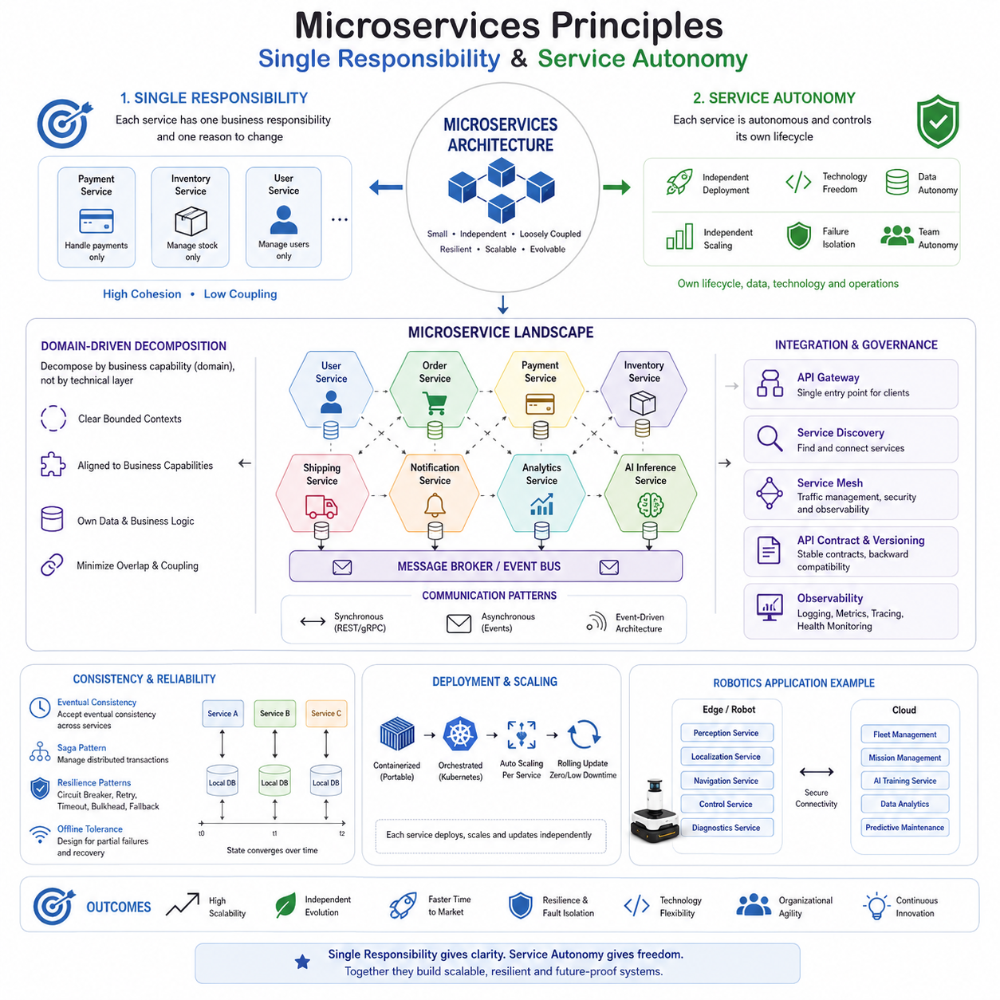
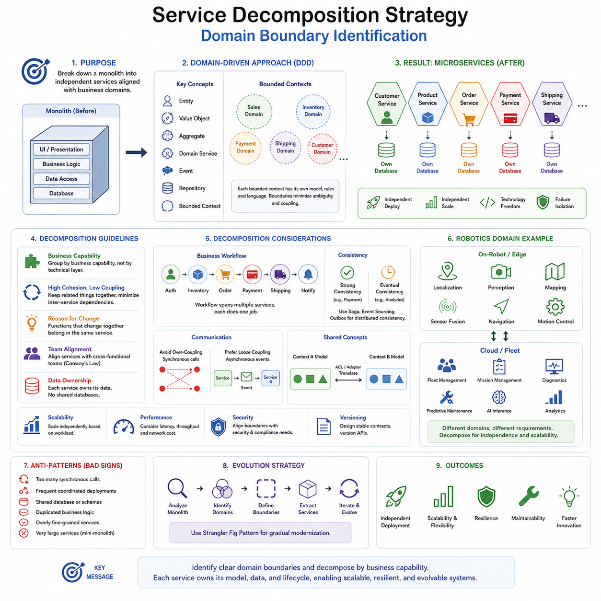
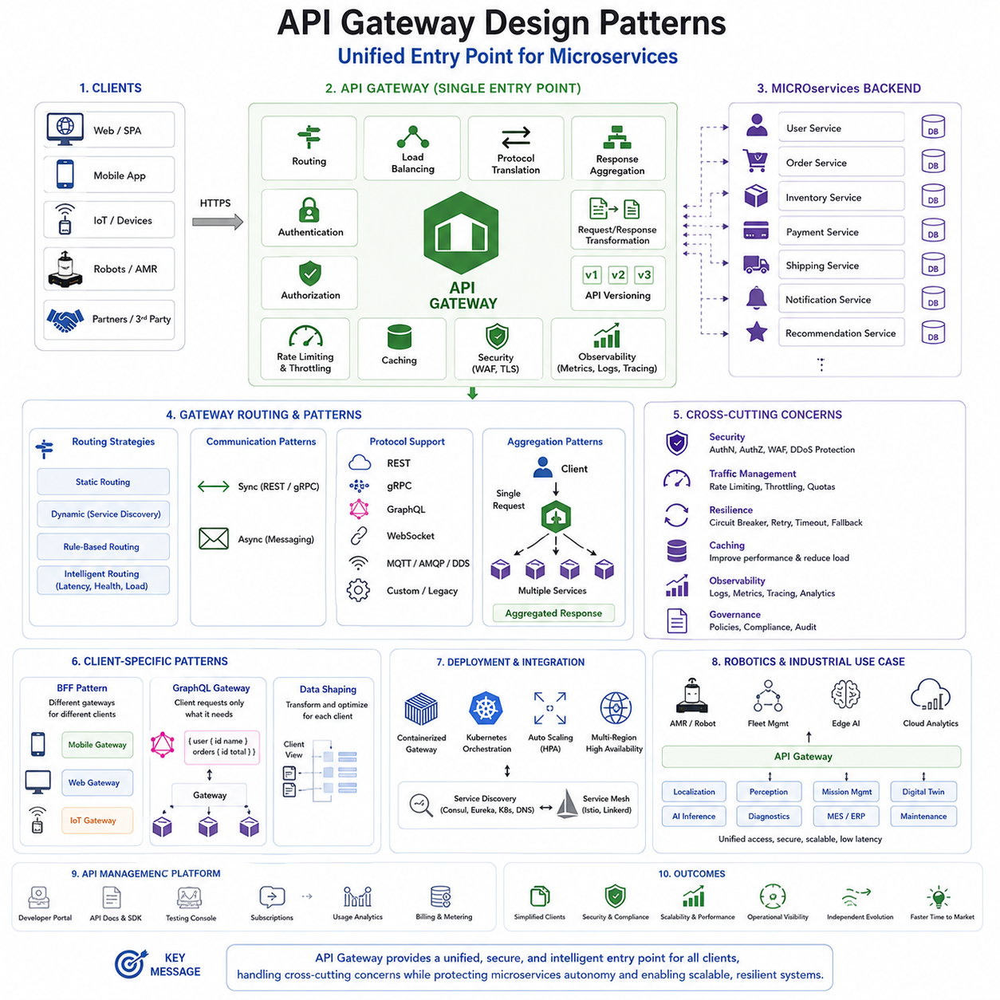
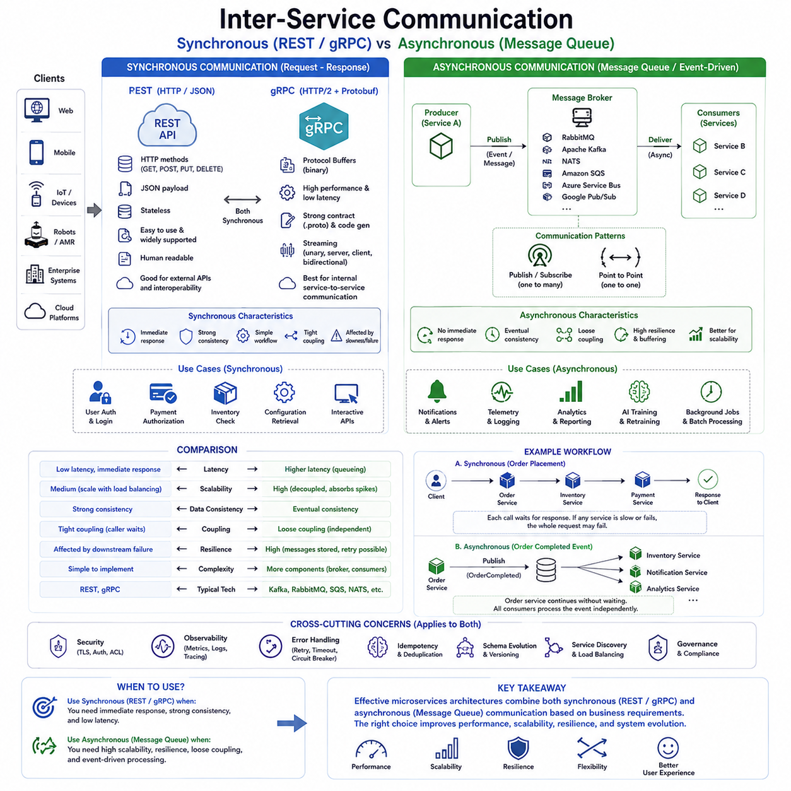
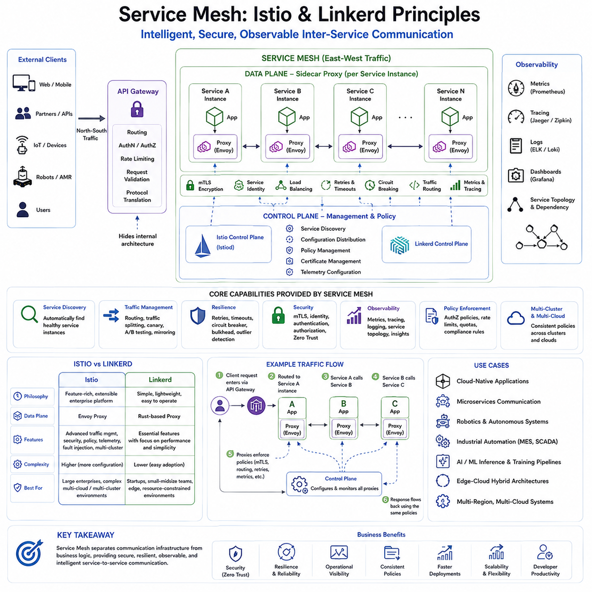
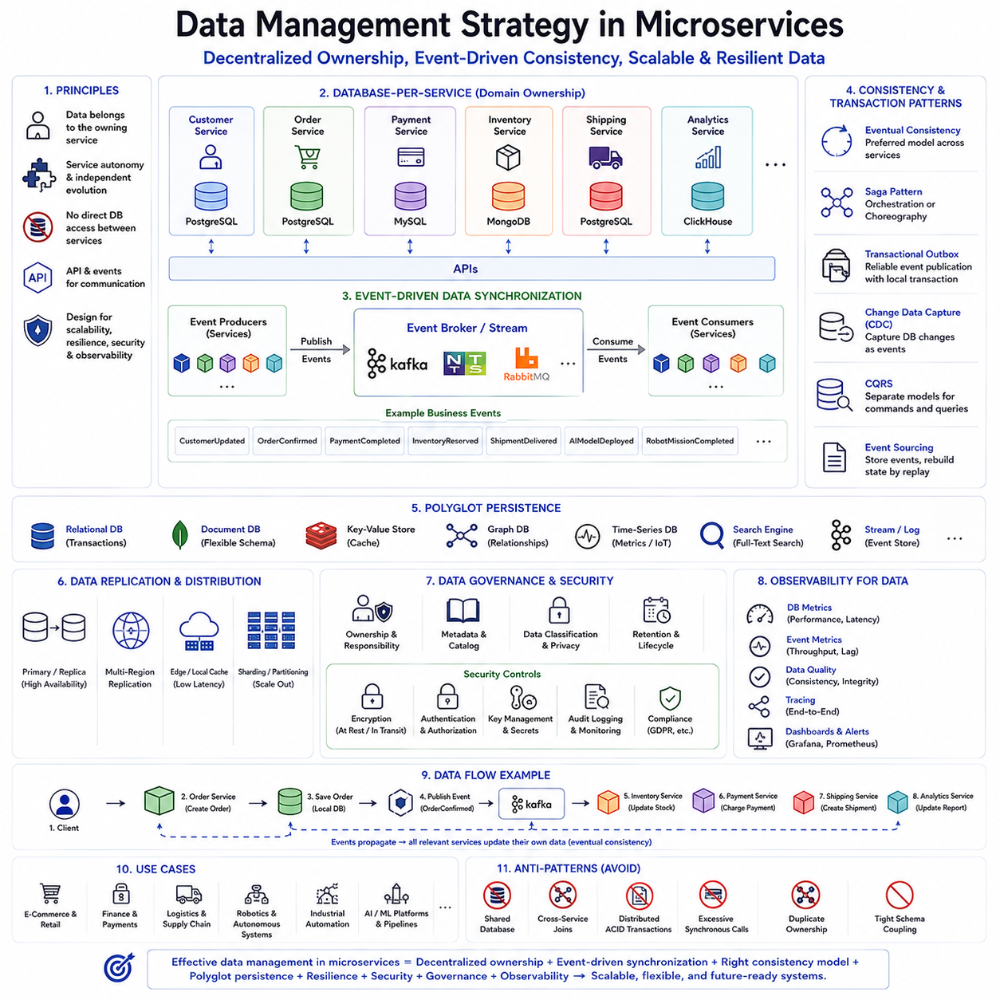
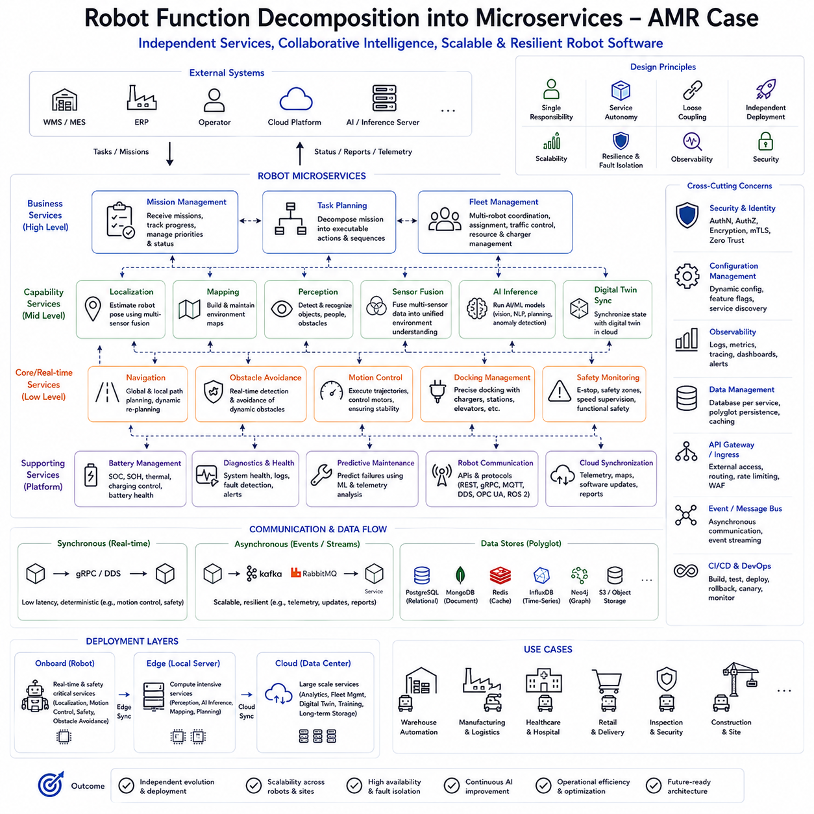
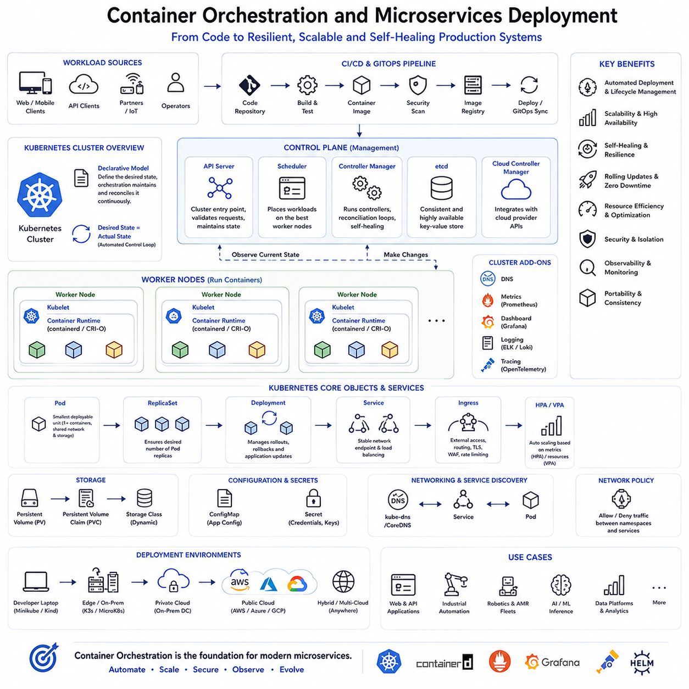
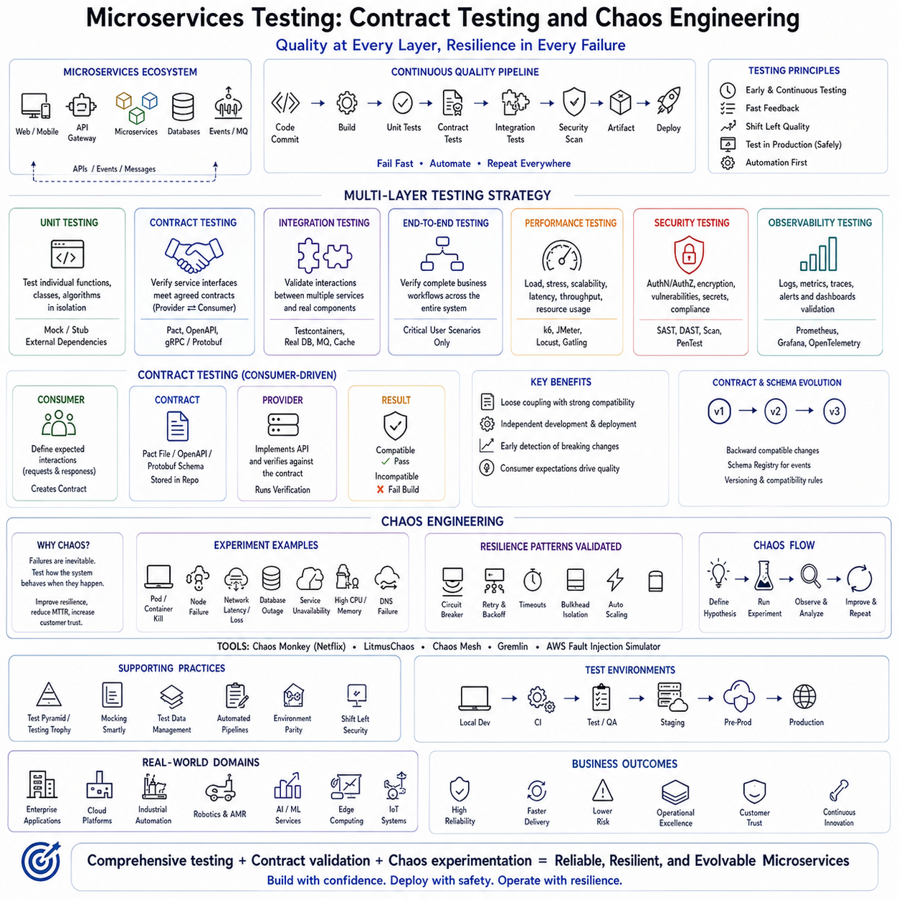
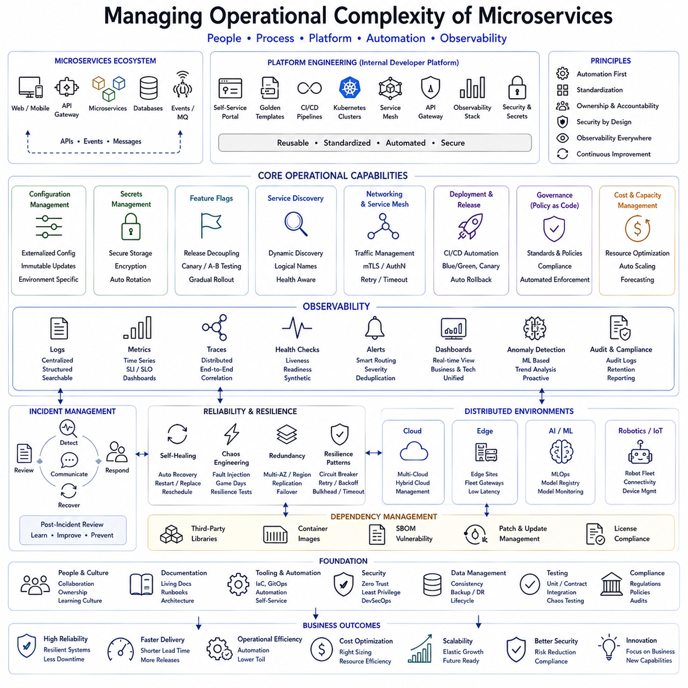

**Volume 1 Software Architecture Fundamentals**

# 04. Microservices Architecture

## 04.01 Microservices Principles: Single Responsibility / Autonomy

{width="7.268055555555556in" height="7.268055555555556in"}

마이크로서비스 아키텍처(Microservices Architecture)는 현대 소프트웨어 아키텍처(Software Architecture)의 가장 중요한 발전 중 하나로 평가된다. 기존의 모놀리식 아키텍처(Monolithic Architecture)가 모든 기능을 하나의 애플리케이션(Application) 안에 포함하는 방식이었다면, 마이크로서비스는 시스템을 독립적인 여러 서비스(Service)로 분리하여 각각이 하나의 명확한 비즈니스 기능(Business Capability)을 담당하도록 설계한다. 이러한 접근 방식은 클라우드 네이티브(Cloud-Native), 분산 시스템(Distributed System), 산업용 사물인터넷(Industrial Internet of Things, IIoT), 피지컬 AI(Physical AI), 로보틱스(Robotics) 플랫폼의 핵심 아키텍처로 자리 잡고 있다.

마이크로서비스의 핵심 원칙은 **단일 책임(Single Responsibility)** 과 **서비스 자율성(Service Autonomy)** 이다. 이 두 원칙은 서비스를 어떻게 정의하고 분리하며, 어떻게 운영하고 발전시킬 것인지를 결정하는 가장 중요한 기준이다. 컨테이너(Container), 쿠버네티스(Kubernetes), 서비스 메시(Service Mesh), API 게이트웨이(API Gateway)와 같은 기술은 이러한 원칙을 구현하기 위한 도구일 뿐이며, 마이크로서비스의 본질은 아니다. 진정한 마이크로서비스는 하나의 명확한 책임만 수행하고 다른 서비스와 독립적으로 운영될 수 있어야 한다.

단일 책임 원칙(Single Responsibility Principle)은 객체지향(Object-Oriented Programming)의 클래스(Class)에만 적용되는 개념이 아니라 서비스 전체에도 동일하게 적용된다. 하나의 서비스는 하나의 비즈니스 이유(Business Reason)에 의해서만 변경되어야 하며, 여러 업무를 동시에 담당해서는 안 된다. 즉 서비스가 변경되는 원인이 하나여야 유지보수(Maintainability)와 확장성(Scalability)이 크게 향상된다.

예를 들어 결제 서비스(Payment Service)는 결제 승인(Payment Authorization), 결제 처리(Payment Processing), 거래 기록(Transaction History)만 담당해야 한다. 고객 관리(Customer Management), 재고 관리(Inventory Management), 배송 관리(Shipping Management)와 같은 기능까지 포함해서는 안 된다. 마찬가지로 재고 서비스(Inventory Service)는 상품 수량(Product Quantity), 재고 예약(Stock Reservation), 입출고 관리만 담당하며 고객 정보나 회계 처리에는 관여하지 않는다. 이러한 명확한 경계(Boundary)가 서비스 간 결합도(Coupling)를 크게 낮춘다.

마이크로서비스는 기술적인 계층(Layer) 기준이 아니라 비즈니스 기능(Business Capability) 기준으로 서비스를 분리한다. 전통적인 계층형 구조(Layered Architecture)는 사용자 인터페이스(User Interface), 비즈니스 로직(Business Logic), 데이터베이스(Database)를 중심으로 분리하지만, 마이크로서비스는 사용자 관리(User Management), 인증(Authentication), 결제(Payment), 배송(Logistics), 로봇 내비게이션(Navigation), 센서 인식(Perception), Fleet 관리(Fleet Management)와 같이 실제 업무 영역(Domain)을 중심으로 구성한다.

좋은 마이크로서비스는 높은 응집도(High Cohesion)와 낮은 결합도(Low Coupling)를 동시에 가져야 한다. 응집도는 하나의 서비스 내부 기능들이 동일한 목적을 위해 긴밀하게 협력하는 정도를 의미하며, 결합도는 다른 서비스에 의존하는 정도를 의미한다. 내부 응집도는 높고 외부 의존성은 낮을수록 서비스는 독립적으로 진화(Evolution)할 수 있다.

서비스 자율성(Service Autonomy)은 마이크로서비스의 두 번째 핵심 원칙이다. 자율성이란 서비스가 자신의 구현 방식(Implementation), 배포(Deployment), 실행 환경(Runtime), 데이터베이스(Database), 운영 정책(Operation Policy)을 스스로 결정할 수 있음을 의미한다. 다른 서비스는 내부 구현을 알 필요가 없으며, 오직 공개된 인터페이스(Interface)를 통해서만 통신한다.

독립적인 배포(Independent Deployment)는 자율성의 가장 대표적인 특징이다. 하나의 서비스를 수정하거나 업데이트(Update)하더라도 전체 시스템을 다시 배포할 필요가 없다. 필요한 서비스만 새로운 버전으로 교체하면 되므로 지속적 배포(Continuous Deployment)와 지속적 통합(Continuous Integration)이 매우 쉬워진다. 이는 배포 위험(Risk)을 줄이고 개발 속도를 크게 향상시킨다.

서비스 자율성은 기술 선택(Technology Choice)의 자유도도 제공한다. 고성능 영상처리(Image Processing)는 C++로 구현하고, 웹 서비스(Web Service)는 Go 언어나 Java를 사용하며, 인공지능 추론(AI Inference)은 Python과 TensorRT를 사용할 수 있다. 서비스 간에는 REST, gRPC, 메시지 큐(Message Queue)와 같은 표준 인터페이스만 사용하므로 내부 구현 언어는 서로 달라도 문제가 발생하지 않는다.

데이터베이스 자율성(Database Autonomy) 역시 중요한 원칙이다. 각 서비스는 자신의 데이터(Data)를 직접 관리해야 하며, 여러 서비스가 하나의 데이터베이스를 공유해서는 안 된다. 데이터베이스를 공유하면 스키마(Schema) 변경이 여러 서비스에 동시에 영향을 미쳐 강한 결합도가 발생한다. 따라서 각 서비스는 자신의 데이터 저장 방식(Storage Engine), 인덱스(Index), 백업(Backup), 복제(Replication)를 독립적으로 관리해야 한다.

이러한 데이터 독립성은 분산 데이터 일관성(Distributed Data Consistency)이라는 새로운 문제를 만든다. 여러 서비스가 하나의 트랜잭션(Transaction)을 공유할 수 없기 때문에 현대 마이크로서비스는 대부분 최종 일관성(Eventual Consistency)을 채택한다. 여러 서비스가 함께 수행하는 업무는 사가 패턴(Saga Pattern)과 같은 분산 트랜잭션 기법을 이용하여 처리한다.

서비스 자율성은 실행 환경(Runtime Environment)의 독립성도 포함한다. 대부분의 서비스는 컨테이너(Container) 안에서 실행되며, 컨테이너는 실행 파일(Executable), 라이브러리(Library), 운영체제(OS) 의존성, 설정(Configuration)을 하나의 배포 단위로 묶는다. 쿠버네티스(Kubernetes)는 이러한 컨테이너를 자동으로 배포하고 확장하며 장애가 발생하면 자동 복구(Self-Healing)를 수행한다.

독립적인 서비스는 독립적으로 확장(Horizontal Scaling)될 수 있다. 예를 들어 영상 인식(Image Recognition) 서비스는 GPU 서버(GPU Server)를 여러 대 사용해야 할 수도 있지만, 사용자 인증(Authentication) 서비스는 한두 개의 인스턴스(Instance)만으로 충분할 수 있다. 필요한 서비스만 확장할 수 있기 때문에 인프라(Infrastructure) 비용을 크게 절감할 수 있다.

장애 격리(Failure Isolation)는 마이크로서비스의 또 다른 중요한 장점이다. 모놀리식 시스템에서는 하나의 오류가 전체 시스템 장애(System Failure)로 이어질 가능성이 높지만, 마이크로서비스에서는 문제가 발생한 서비스만 영향을 받는다. 추천 시스템(Recommendation System)이 중단되더라도 결제(Payment), 인증(Authentication), 주문(Order) 서비스는 계속 동작할 수 있다.

이를 위해 회로 차단기(Circuit Breaker), 재시도(Retry), 타임아웃(Timeout), 벌크헤드(Bulkhead), 폴백(Fallback)과 같은 장애 허용(Fault Tolerance) 패턴이 함께 사용된다. 이러한 기술은 장애가 다른 서비스로 전파되는 것을 방지하여 전체 시스템의 안정성(Reliability)을 크게 높인다.

조직 구조(Organization Structure) 역시 마이크로서비스와 밀접한 관련이 있다. 하나의 서비스는 일반적으로 하나의 개발팀(Development Team)이 전담하며, 설계(Design), 구현(Implementation), 테스트(Test), 배포(Deployment), 운영(Operation)을 모두 책임진다. 이는 콘웨이의 법칙(Conway\'s Law)이 설명하는 것처럼 소프트웨어 구조가 조직 구조를 반영하기 때문이다.

도메인 주도 설계(Domain-Driven Design, DDD)는 서비스 경계를 결정하는 가장 대표적인 방법이다. 제한된 컨텍스트(Bounded Context)는 하나의 비즈니스 영역을 의미하며, 일반적으로 하나의 마이크로서비스가 하나의 제한된 컨텍스트를 담당한다. 이를 통해 책임이 명확해지고 중복 기능이 줄어든다.

서비스 간 통신은 API 계약(API Contract)을 기반으로 수행된다. 각 서비스는 내부 구현을 외부에 공개하지 않으며, 안정적인 인터페이스만 제공한다. 서비스들이 서로 다른 시점에 배포될 수 있기 때문에 API 버전 관리(API Versioning)와 계약 테스트(Contract Testing)가 매우 중요하다.

비동기 통신(Asynchronous Communication)은 서비스 간 의존성을 더욱 줄여준다. 서비스는 직접 다른 서비스를 호출하기보다 이벤트(Event)를 발행(Publish)하고 필요한 서비스가 이를 구독(Subscribe)하여 처리한다. 이러한 이벤트 기반 아키텍처(Event-Driven Architecture)는 확장성(Scalability)과 장애 복원력(Resilience)을 동시에 향상시킨다.

서비스 수가 증가할수록 관찰 가능성(Observability)의 중요성이 커진다. 중앙 로그(Centralized Logging), 메트릭(Metrics), 분산 추적(Distributed Tracing), 상태 모니터링(Health Monitoring)을 이용하여 수십 또는 수백 개의 서비스가 어떻게 동작하는지 실시간으로 확인할 수 있어야 한다.

보안(Security) 역시 모든 서비스가 독립적으로 수행해야 한다. 각 서비스는 사용자 인증(Authentication), 권한 부여(Authorization), 입력 검증(Input Validation), 암호화(Encryption)를 자체적으로 수행하며, 제로 트러스트(Zero Trust) 원칙에 따라 내부 서비스라 하더라도 기본적으로 신뢰하지 않는다.

로보틱스(Robotics) 분야는 마이크로서비스가 가장 효과적으로 적용되는 분야 중 하나이다. 자율주행 로봇(Autonomous Mobile Robot, AMR)은 위치추정(Localization), 지도 작성(Mapping), 센서 인식(Perception), 경로 계획(Path Planning), 미션 관리(Mission Management), Fleet 관리(Fleet Management), 진단(Diagnostics), 예지보전(Predictive Maintenance), 인공지능 추론(AI Inference) 등 매우 다양한 기능을 포함한다. 각각은 독립적인 서비스로 분리될 수 있으며, 서로 다른 하드웨어(Hardware)와 운영 환경에서 실행될 수 있다.

피지컬 AI(Physical AI) 시스템에서는 이러한 분리가 더욱 중요하다. 실시간 제어(Real-Time Control)는 안전성이 가장 중요하므로 안정적으로 유지되어야 하지만, AI 모델(Model)은 지속적으로 재학습(Retraining), 최적화(Optimization), 양자화(Quantization)가 이루어진다. AI 추론 서비스를 제어 서비스와 분리하면 새로운 AI 모델을 빠르게 적용하면서도 안전 제어에는 영향을 주지 않을 수 있다.

엣지-클라우드 하이브리드 아키텍처(Edge-Cloud Hybrid Architecture)는 서비스 자율성을 더욱 효과적으로 활용한다. 실시간 제어와 센서 처리는 엣지 컴퓨팅(Edge Computing)에서 수행하고, 대규모 AI 학습(Large-Scale AI Training), 장기 데이터 분석(Long-Term Analytics), Fleet 최적화(Fleet Optimization)는 클라우드(Cloud)에서 수행할 수 있다. 서비스는 필요에 따라 엣지와 클라우드 사이를 자유롭게 이동하면서도 동일한 인터페이스를 유지한다.

또한 마이크로서비스는 지속적인 실험(Continuous Experimentation)을 가능하게 한다. 새로운 알고리즘(Algorithm), AI 모델(Model), 최적화 기법(Optimization Strategy)을 특정 서비스에만 적용하여 카나리 배포(Canary Deployment), 블루-그린 배포(Blue-Green Deployment), A/B 테스트(A/B Testing)를 수행할 수 있다. 이는 시스템 전체의 안정성을 유지하면서 혁신 속도를 높이는 중요한 방법이다.

반면 마이크로서비스는 운영 복잡성(Operational Complexity)을 증가시키는 단점도 가진다. 네트워크 통신(Network Communication)이 많아지고, 부분 장애(Partial Failure)가 빈번하게 발생하며, 데이터 일관성(Data Consistency)을 유지하기 어려워지고, 디버깅(Debugging)과 운영(Operation)이 복잡해진다. 따라서 모든 시스템에 무조건 적용하기보다는 규모와 요구사항을 충분히 고려하여 선택해야 한다.

결국 성공적인 마이크로서비스 아키텍처는 특정 기술보다도 아키텍처 원칙(Architectural Principles)에 의해 결정된다. **단일 책임(Single Responsibility)** 은 하나의 서비스가 하나의 비즈니스 기능만 담당하도록 하며, **서비스 자율성(Service Autonomy)** 은 그 기능이 독립적으로 개발되고 배포되며 확장될 수 있도록 보장한다. 이 두 원칙이 결합될 때 시스템은 높은 확장성(Scalability), 유지보수성(Maintainability), 복원력(Resilience), 그리고 지속적인 진화(Evolution)가 가능한 현대적인 클라우드 네이티브 및 피지컬 AI 소프트웨어 아키텍처의 기반이 된다.

## 04.02 Service Decomposition Strategy: Domain Boundary Identification

{width="7.268055555555556in" height="7.268055555555556in"}

서비스 분해 전략(Service Decomposition Strategy)은 마이크로서비스 아키텍처(Microservices Architecture)에서 가장 중요한 설계 과정 중 하나이다. 전체 시스템을 어떤 기준으로 여러 개의 독립적인 서비스(Service)로 나눌 것인가는 시스템의 확장성(Scalability), 유지보수성(Maintainability), 복원력(Resilience), 그리고 장기적인 발전 가능성을 결정한다. 컨테이너(Container), 쿠버네티스(Kubernetes), 서비스 메시(Service Mesh)와 같은 기술은 이러한 구조를 실행하기 위한 도구일 뿐이며, 근본적인 성공 여부는 올바른 서비스 분해(Service Decomposition)에 달려 있다.

서비스를 잘못 분해하면 강한 결합도(Tight Coupling), 기능 중복(Duplication), 분산 모놀리스(Distributed Monolith), 복잡한 운영(Operation Complexity)과 같은 문제가 발생한다. 반대로 적절하게 분해하면 각 서비스는 독립적으로 개발(Development), 배포(Deployment), 확장(Scaling), 운영(Operation)이 가능하며, 시스템 전체의 변경 영향도(Change Impact)를 최소화할 수 있다.

서비스 분해의 가장 중요한 목적은 하나의 명확한 비즈니스 기능(Business Capability)을 수행하는 독립적인 서비스를 식별하는 것이다. 전통적인 계층형 아키텍처(Layered Architecture)처럼 사용자 인터페이스(User Interface), 비즈니스 로직(Business Logic), 데이터 접근(Data Access)으로 나누는 것이 아니라, 실제 업무(Domain)를 중심으로 서비스를 구성하는 것이 핵심이다.

도메인(Domain)은 특정 업무 영역(Business Area)에 대한 지식(Knowledge), 책임(Responsibility), 규칙(Rule), 용어(Terminology)를 포함하는 개념이다. 기업은 고객(Customer), 주문(Order), 결제(Payment), 물류(Logistics), 생산(Manufacturing), 유지보수(Maintenance)와 같이 여러 도메인으로 구성되어 있으며, 이러한 도메인은 자연스럽게 서비스 경계(Service Boundary)의 기준이 된다. 즉 소프트웨어가 비즈니스 구조를 따라가도록 설계하는 것이다.

도메인 중심 설계(Domain-Driven Design, DDD)는 서비스 경계를 결정하는 대표적인 방법론(Methodology)이다. DDD는 개발자와 도메인 전문가(Domain Expert)가 함께 업무를 분석하여 실제 비즈니스 모델(Business Model)을 소프트웨어 구조에 반영하도록 한다. 이를 통해 엔터티(Entity), 값 객체(Value Object), 애그리게이트(Aggregate), 도메인 서비스(Domain Service), 이벤트(Event), 리포지토리(Repository) 등의 개념을 정의한다.

DDD에서 가장 중요한 개념 중 하나는 제한된 컨텍스트(Bounded Context)이다. 제한된 컨텍스트는 특정 도메인 모델(Domain Model)이 일관성 있게 유지되는 범위를 의미한다. 동일한 "고객(Customer)"이라는 개념이라도 판매(Sales), 회계(Finance), 유지보수(Service), 보안(Security)에서는 서로 다른 의미와 규칙을 가질 수 있다. 따라서 하나의 공통 모델을 강제로 사용하는 것이 아니라 각각의 컨텍스트가 독립적인 모델을 갖도록 한다.

제한된 컨텍스트는 자연스럽게 하나의 마이크로서비스(Microservice)가 된다. 각 서비스는 자신의 비즈니스 규칙(Business Rule), 데이터(Data), API, 운영 정책(Operation Policy)을 독립적으로 관리하며 다른 서비스와 최소한의 의존성만 가진다. 이러한 구조는 높은 응집도(High Cohesion)와 낮은 결합도(Low Coupling)를 동시에 달성하도록 돕는다.

비즈니스 기능 중심 분해(Business Capability Decomposition)는 기술 중심 분해(Technical Decomposition)와 근본적으로 다르다. 기존의 모놀리식(Monolithic) 구조에서는 사용자 인터페이스, 서비스 계층(Service Layer), 데이터베이스(Database)와 같이 기술 계층별로 나누었다. 반면 마이크로서비스에서는 고객 관리(Customer Management), 주문(Order Management), 재고(Inventory), 결제(Payment), 배송(Shipping)처럼 하나의 업무를 처음부터 끝까지 담당하는 수직 구조(Vertical Slice)를 만든다.

예를 들어 전자상거래(E-Commerce) 시스템에서는 고객 서비스(Customer Service), 상품 서비스(Product Service), 주문 서비스(Order Service), 결제 서비스(Payment Service), 배송 서비스(Shipping Service), 알림 서비스(Notification Service), 추천 서비스(Recommendation Service), 분석 서비스(Analytics Service) 등으로 분리할 수 있다. 각각은 자신의 데이터베이스(Database), API, 운영 환경(Runtime Environment), 배포 파이프라인(Deployment Pipeline)을 독립적으로 가진다.

서비스의 크기(Service Granularity)를 결정하는 것도 매우 중요하다. 서비스가 너무 크면 작은 모놀리스(Mini Monolith)가 되어 독립성이 사라지고, 반대로 너무 작으면 서비스 간 통신(Inter-Service Communication)이 지나치게 많아져 성능 저하와 운영 복잡성이 증가한다. 따라서 적절한 크기의 서비스를 정의하는 것이 핵심 설계 과제가 된다.

서비스 경계를 결정하는 가장 좋은 기준 중 하나는 변경 이유(Reason for Change)이다. 항상 함께 변경되는 기능들은 동일한 서비스에 포함하는 것이 좋으며, 서로 독립적으로 변경되는 기능은 별도의 서비스로 분리하는 것이 바람직하다. 이는 서비스 수준의 단일 책임 원칙(Single Responsibility Principle)을 적용한 것이다.

업무 프로세스(Business Workflow) 역시 서비스 분해의 중요한 기준이다. 하나의 주문(Order) 처리는 인증(Authentication), 재고 확인(Inventory Check), 결제(Payment), 배송 준비(Shipping Preparation), 알림(Notification), 통계 분석(Analytics)까지 여러 서비스를 거친다. 그러나 각각의 서비스는 자신의 역할만 수행하며 다른 서비스의 내부 기능까지 담당하지 않는다.

조직 구조(Organization Structure)는 서비스 구조에도 큰 영향을 준다. 콘웨이의 법칙(Conway\'s Law)에 따르면 소프트웨어 구조는 조직의 의사소통 구조를 반영한다. 따라서 많은 기업들은 고객팀(Customer Team), 결제팀(Payment Team), 물류팀(Logistics Team)처럼 비즈니스 기능 중심의 크로스 펑셔널 팀(Cross-Functional Team)을 구성하여 하나의 서비스 전체를 책임지도록 운영한다.

데이터 소유권(Data Ownership)은 올바른 서비스 분해의 핵심 원칙이다. 각 서비스는 자신의 데이터베이스(Database)를 독립적으로 관리해야 하며, 여러 서비스가 하나의 데이터베이스를 공유해서는 안 된다. 데이터베이스 공유는 스키마(Schema) 변경 시 여러 서비스에 동시에 영향을 주기 때문에 서비스 자율성(Service Autonomy)을 크게 저해한다.

서비스가 독립적인 데이터베이스를 사용하면 분산 데이터 일관성(Distributed Data Consistency) 문제가 발생한다. 여러 서비스가 하나의 ACID 트랜잭션(Transaction)을 공유할 수 없기 때문에 대부분의 마이크로서비스 시스템은 최종 일관성(Eventual Consistency)을 채택한다. 이를 위해 사가 패턴(Saga Pattern), 이벤트 소싱(Event Sourcing), 트랜잭셔널 아웃박스(Transactional Outbox) 등의 기법을 활용한다.

서비스 간 통신 방식도 서비스 경계를 판단하는 중요한 요소이다. 지나치게 많은 동기식(Synchronous) 호출은 서비스가 서로 강하게 의존하고 있다는 신호일 수 있다. 따라서 가능하면 이벤트(Event)를 발행(Publish)하고 필요한 서비스가 이를 구독(Subscribe)하는 비동기 통신(Asynchronous Communication)을 활용하여 시간적 결합도(Temporal Coupling)를 줄이는 것이 좋다.

공통 개념(Common Concept)을 관리하는 방법도 중요하다. 모든 서비스가 하나의 공통 데이터 모델(Common Data Model)을 사용하는 대신, 각 서비스는 자신의 모델을 유지한다. 서로 다른 도메인 간 데이터 교환은 안티 코럽션 레이어(Anti-Corruption Layer), 어댑터(Adapter), API 계약(API Contract), 이벤트 변환(Event Transformation)을 이용하여 수행한다.

트랜잭션(Transaction)의 일관성 요구사항도 서비스 분해에 영향을 준다. 금융(Finance), 의료(Healthcare), 안전(Safety)과 같이 강한 일관성이 필요한 영역은 하나의 서비스 내부에서 처리하는 것이 적합한 경우가 많다. 반면 통계(Analytics), 추천(Recommendation), 알림(Notification)처럼 약간의 지연을 허용할 수 있는 기능은 독립적인 서비스로 쉽게 분리할 수 있다.

서비스는 서로 다른 확장성 요구사항(Scalability Requirement)을 가진다. 영상 처리(Image Processing)는 GPU 자원이 많이 필요하지만, 설정 관리(Configuration Management)는 거의 부하가 발생하지 않는다. 이러한 특성이 다른 기능을 분리하면 필요한 서비스만 수평 확장(Horizontal Scaling)할 수 있어 인프라 비용(Infrastructure Cost)을 크게 절감할 수 있다.

성능(Performance) 역시 고려해야 한다. 매우 짧은 지연시간(Low Latency)이 필요한 기능을 지나치게 잘게 나누면 네트워크(Network) 통신이 증가하여 오히려 성능이 저하될 수 있다. 따라서 서비스 분해는 모듈성(Modularity)과 통신 비용(Communication Cost) 사이에서 균형을 찾아야 한다.

보안(Security) 경계도 서비스 경계와 일치하는 경우가 많다. 인증(Authentication), 권한 관리(Authorization), 감사(Auditing), 암호화(Encryption), 규제 준수(Compliance)는 도메인마다 요구사항이 다르므로 독립적인 서비스로 관리하는 것이 효과적이다. 이는 보안 사고(Security Incident)가 발생했을 때 영향을 최소화하는 데에도 도움이 된다.

서비스가 독립적으로 배포되기 때문에 버전 관리(Versioning)는 필수 요소이다. API 버전 관리(API Versioning), 스키마 진화(Schema Evolution), 계약 테스트(Contract Testing), 하위 호환성(Backward Compatibility)을 유지해야 여러 버전의 서비스가 동시에 안정적으로 운영될 수 있다.

기존 모놀리식 시스템을 현대화(Modenization)할 때도 서비스 분해 전략이 사용된다. 대부분의 기업은 기존 시스템을 한 번에 교체하지 않고, 독립적인 업무 영역부터 하나씩 마이크로서비스로 분리한다. 이를 스트랭글러 피그 패턴(Strangler Fig Pattern)이라고 하며, 점진적으로 모놀리스를 대체하는 대표적인 현대화 전략이다.

로보틱스(Robotics)는 도메인 기반 서비스 분해가 특히 효과적인 분야이다. 자율주행 이동로봇(Autonomous Mobile Robot, AMR)은 위치추정(Localization), 지도 작성(Mapping), 센서 인식(Perception), 센서 융합(Sensor Fusion), 경로 계획(Path Planning), 모션 제어(Motion Control), Fleet 관리(Fleet Management), 진단(Diagnostics), 미션 관리(Mission Management), 예지보전(Predictive Maintenance), 디지털 트윈(Digital Twin), 클라우드 동기화(Cloud Synchronization), AI 추론(AI Inference) 등 매우 다양한 기능으로 구성된다.

예를 들어 위치추정 서비스(Localization Service)는 GNSS, LiDAR, 카메라(Camera), IMU, 엔코더(Encoder)를 이용하여 현재 위치를 계산하는 것만 담당한다. 센서 인식 서비스(Perception Service)는 객체(Object), 장애물(Obstacle), 사람(Human)을 인식하고, 내비게이션 서비스(Navigation Service)는 최적 경로를 생성하며, Fleet 관리 서비스(Fleet Management Service)는 여러 대의 로봇을 동시에 관리한다. 각각은 독립적인 서비스로 운영될 수 있다.

산업용 로봇(Industrial Robot)에서도 동일한 원칙이 적용된다. 검사 로봇(Inspection Robot)은 미션 오케스트레이션(Mission Orchestration), 로봇 이동(Robot Navigation), 검사 계획(Inspection Planning), CAD 정렬(CAD Alignment), 비전 AI(Vision AI), 결함 분류(Defect Classification), 리포트 생성(Report Generation), 디지털 트윈(Digital Twin), 생산 일정 관리(Production Scheduling), 설비 진단(Equipment Diagnostics) 등을 각각 독립적인 도메인으로 구성할 수 있다.

피지컬 AI(Physical AI)에서는 서비스 경계가 더욱 중요하다. AI 모델(Model)은 지속적으로 재학습(Retraining), 최적화(Optimization), 양자화(Quantization)가 이루어지는 반면, 안전 제어(Safety Control)는 매우 안정적으로 유지되어야 한다. 따라서 AI 추론 서비스(AI Inference Service)와 실시간 제어 서비스(Real-Time Control Service)를 분리하면 AI를 빠르게 개선하면서도 안전성을 유지할 수 있다.

엣지-클라우드 하이브리드 아키텍처(Edge-Cloud Hybrid Architecture)도 서비스 분해를 기반으로 한다. 위치추정(Localization), 장애물 회피(Obstacle Avoidance), 모션 제어(Motion Control)는 엣지 컴퓨팅(Edge Computing)에서 수행하고, AI 학습(AI Training), Fleet 분석(Fleet Analytics), 시뮬레이션(Simulation), 디지털 트윈(Digital Twin)은 클라우드(Cloud)에서 수행할 수 있다. 서비스 경계가 명확하기 때문에 실행 위치만 변경해도 동일한 인터페이스를 유지할 수 있다.

관찰 가능성(Observability) 역시 서비스 분해의 중요한 요소이다. 모든 서비스는 상태 확인(Health Check), 메트릭(Metrics), 구조화 로그(Structured Logging), 분산 추적(Distributed Tracing), 운영 텔레메트리(Operational Telemetry)를 독립적으로 제공해야 한다. 이를 통해 장애 발생 시 특정 서비스만 빠르게 분석하고 복구할 수 있다.

서비스 분해는 한 번으로 끝나는 작업이 아니다. 비즈니스 환경(Business Environment)은 지속적으로 변화하므로 서비스도 필요에 따라 분리(Split), 통합(Merge), 경계 조정(Boundary Adjustment)을 반복해야 한다. 진화형 아키텍처(Evolutionary Architecture)는 이러한 변화를 지속적으로 수용하면서 시스템 전체를 안정적으로 발전시키는 것을 목표로 한다.

잘못된 서비스 분해의 대표적인 징후(Anti-Pattern)는 지나치게 많은 동기 호출(Synchronous Call), 빈번한 공동 배포(Coordinated Deployment), 공유 데이터베이스(Shared Database), 중복된 비즈니스 로직(Duplicated Business Logic), 과도한 서비스 간 통신(Excessive Communication), 그리고 너무 큰 서비스(Big Service)이다. 이러한 문제는 서비스 경계를 재검토해야 한다는 신호가 된다.

결국 서비스 분해 전략(Service Decomposition Strategy)은 단순한 기술적 설계가 아니라 비즈니스 이해(Business Understanding), 조직 구조(Organization Structure), 소프트웨어 공학(Software Engineering), 운영(Operation), 장기적인 유지보수(Long-Term Maintainability)를 함께 고려하는 전략적 아키텍처 설계 활동이다. 도메인 경계 식별(Domain Boundary Identification)을 기반으로 서비스를 설계하면 시스템은 독립적으로 진화(Evolution)하고, 높은 확장성(Scalability), 유연성(Flexibility), 복원력(Resilience)을 갖춘 현대적인 클라우드 네이티브(Cloud-Native), 로보틱스(Robotics), 산업 자동화(Industrial Automation), 그리고 피지컬 AI(Physical AI) 플랫폼으로 발전할 수 있다.

## 04.03 API Gateway Design Patterns

{width="7.268055555555556in" height="7.268055555555556in"}

API 게이트웨이(API Gateway)는 현대의 마이크로서비스 아키텍처(Microservices Architecture)에서 가장 중요한 핵심 구성 요소 중 하나이다. 시스템이 모놀리식(Monolithic) 구조에서 마이크로서비스 구조로 발전하면서 서비스(Service)의 개수는 수십 개에서 수백 개까지 증가하게 되었다. 만약 클라이언트(Client)가 이러한 모든 서비스를 직접 호출해야 한다면 통신 구조가 매우 복잡해지고, 내부 시스템 구조가 외부에 노출되며, 인증(Authentication), 보안(Security), 오류 처리(Error Handling) 등의 공통 기능이 여러 클라이언트에 중복 구현되는 문제가 발생한다.

API 게이트웨이는 이러한 문제를 해결하기 위해 모든 외부 요청(Request)의 단일 진입점(Single Entry Point) 역할을 수행한다. 웹(Web), 모바일(Mobile), 로봇(Robot), 산업 장비(Industrial Equipment), 클라우드(Cloud) 등 모든 외부 클라이언트는 먼저 API 게이트웨이에 접속하고, 게이트웨이는 요청을 적절한 내부 서비스로 전달한다. 이를 통해 내부 서비스는 자신의 비즈니스 로직(Business Logic)에만 집중할 수 있으며, 클라이언트는 시스템 내부 구조를 알 필요가 없어진다.

API 게이트웨이의 가장 중요한 목적은 추상화(Abstraction)이다. 클라이언트는 서비스의 위치(Location), 배포 구조(Deployment Topology), 통신 방식(Communication Protocol), 구현 언어(Programming Language)를 알 필요 없이 항상 동일한 API를 사용할 수 있다. 실제로 하나의 요청이 하나의 서비스에서 처리되는지, 여러 서비스가 협력하여 처리되는지는 모두 게이트웨이가 내부적으로 관리한다.

현실의 마이크로서비스에서는 하나의 화면이나 하나의 기능을 구현하기 위해 여러 서비스의 정보가 동시에 필요한 경우가 많다. 예를 들어 쇼핑 애플리케이션(E-Commerce Application)은 고객 정보(Customer Information), 주문 내역(Order History), 재고 상태(Inventory), 가격(Pricing), 결제(Payment), 배송(Shipping), 추천(Recommendation) 정보를 동시에 가져와야 한다. API 게이트웨이는 이러한 여러 서비스의 결과를 하나로 통합(Response Aggregation)하여 클라이언트에게 제공함으로써 클라이언트의 복잡성을 크게 줄인다.

요청 라우팅(Request Routing)은 API 게이트웨이의 가장 기본적인 기능이다. 게이트웨이는 URL, HTTP 메서드(Method), 요청 헤더(Header), 인증 정보(Authentication Context), API 버전(API Version) 등을 분석하여 어떤 서비스가 요청을 처리해야 하는지 결정한다. 이후 적절한 서비스로 요청을 전달하고 응답을 다시 클라이언트에게 반환한다.

라우팅 방식에는 다양한 전략이 존재한다. 정적 라우팅(Static Routing)은 미리 정의된 URL과 서비스를 연결하는 방식이며, 동적 라우팅(Dynamic Routing)은 서비스 디스커버리(Service Discovery)를 이용하여 현재 실행 중인 서비스 위치를 자동으로 찾는다. 또한 규칙 기반 라우팅(Rule-Based Routing)은 사용자 유형(User Type), 지역(Region), 장치(Device), 서비스 버전(Version) 등에 따라 서로 다른 서비스로 요청을 전달할 수 있다.

로드 밸런싱(Load Balancing)은 API 게이트웨이와 함께 동작하는 중요한 기능이다. 하나의 서비스가 여러 개의 인스턴스(Instance)로 실행될 경우 게이트웨이는 요청을 각 인스턴스에 적절하게 분산한다. 이를 위해 라운드 로빈(Round Robin), 최소 연결(Least Connections), 가중치 기반(Weighted Distribution), 일관성 해시(Consistent Hashing), 지연시간 기반(Latency-Aware Routing) 등의 다양한 알고리즘을 사용할 수 있다.

프로토콜 변환(Protocol Translation)은 API 게이트웨이의 또 다른 중요한 역할이다. 외부 클라이언트는 일반적으로 REST API를 사용하지만, 내부 서비스는 gRPC, GraphQL, MQTT, WebSocket, DDS(Data Distribution Service), AMQP와 같은 다양한 통신 방식을 사용할 수 있다. API 게이트웨이는 서로 다른 프로토콜을 자동으로 변환하여 클라이언트와 내부 서비스가 서로 다른 기술을 사용하더라도 문제없이 통신할 수 있도록 지원한다.

응답 통합(Response Aggregation)은 API 게이트웨이의 대표적인 장점이다. 클라이언트가 여러 서비스를 각각 호출하는 대신 게이트웨이가 내부적으로 여러 서비스를 호출하고 결과를 하나의 응답으로 합쳐 전달한다. 특히 모바일 애플리케이션(Mobile Application)이나 네트워크 대역폭(Bandwidth)이 제한된 환경에서는 네트워크 요청 수를 줄여 성능을 크게 향상시킬 수 있다.

인증(Authentication)은 대부분 API 게이트웨이에서 중앙 집중적으로 수행된다. OAuth 2.0, OpenID Connect, JWT(JSON Web Token), API Key, 클라이언트 인증서(Client Certificate), 상호 TLS(Mutual TLS) 등을 이용하여 사용자의 신원을 확인한다. 내부 서비스는 이미 인증된 사용자 정보를 전달받기 때문에 동일한 인증 로직을 반복해서 구현할 필요가 없다.

권한 관리(Authorization)는 인증 이후 사용자가 어떤 기능을 수행할 수 있는지를 결정한다. 역할(Role), 조직(Organization), 소유권(Ownership), 서비스 등급(Service Tier), 지역 제한(Geographic Restriction) 등을 기준으로 세부 권한을 제어할 수 있다. 이를 API 게이트웨이에서 통합 관리하면 전체 시스템의 보안 정책(Security Policy)을 일관되게 유지할 수 있다.

API 버전 관리(API Versioning)는 서비스의 지속적인 발전을 가능하게 한다. 백엔드 서비스(Backend Service)는 시간이 지나면서 새로운 기능이 추가되고 인터페이스가 변경된다. API 게이트웨이는 URL, HTTP Header, Content Negotiation 등을 이용하여 여러 버전의 API를 동시에 제공할 수 있으며, 기존 클라이언트는 수정 없이 계속 사용할 수 있다.

트래픽 관리(Traffic Management)는 대규모 시스템에서 필수적인 기능이다. 속도 제한(Rate Limiting)은 특정 사용자가 과도한 요청을 보내는 것을 방지하고, 스로틀링(Throttling)은 순간적인 트래픽 증가를 제어한다. 또한 사용자의 서비스 등급에 따라 요청량을 제한하는 할당량 관리(Quota Management)를 수행하여 시스템 안정성을 유지한다.

캐싱(Caching)은 API 게이트웨이의 성능을 크게 향상시키는 기술이다. 자주 요청되는 상품 목록(Product Catalog), 환경 설정(Configuration), 지역 정보(Geographic Information), 참조 데이터(Reference Data) 등을 일정 시간 동안 저장하여 백엔드 서비스 호출을 줄인다. 이를 통해 응답 속도(Response Time)를 개선하고 서버 부하(Server Load)를 감소시킬 수 있다.

API 게이트웨이는 보안(Security)의 첫 번째 방어선 역할도 수행한다. 입력 데이터(Input Validation)를 검사하고, SQL Injection, Cross-Site Scripting(XSS), 요청 위조(Request Smuggling), 봇 공격(Bot Traffic), DDoS(Distributed Denial of Service) 공격 등을 차단한다. 또한 TLS(Transport Layer Security)를 이용하여 모든 통신을 암호화하고 내부 서비스와도 안전한 연결을 유지한다.

관찰 가능성(Observability)은 API 게이트웨이의 매우 중요한 역할이다. 모든 요청(Request), 응답(Response), 지연시간(Latency), 오류(Error), 인증(Authentication), 캐시(Cache), 라우팅(Routing) 정보를 기록한다. 또한 구조화 로그(Structured Logging), 메트릭(Metrics), 분산 추적(Distributed Tracing)을 통해 전체 시스템의 동작 상태를 실시간으로 분석할 수 있다.

장애 허용(Fault Tolerance)을 위한 다양한 기능도 제공된다. 회로 차단기(Circuit Breaker)는 장애가 발생한 서비스로 요청이 계속 전달되는 것을 방지하며, 재시도(Retry)는 일시적인 오류를 자동으로 복구한다. 타임아웃(Timeout)은 응답이 없는 서비스를 무한정 기다리지 않도록 하고, 폴백(Fallback)은 서비스 장애 시 제한된 기능을 제공하여 시스템 전체의 중단을 방지한다.

요청 변환(Request Transformation)과 응답 변환(Response Transformation)도 API 게이트웨이가 수행하는 중요한 기능이다. 요청 데이터 형식을 수정하거나 필드를 추가하고, 응답 데이터를 클라이언트 요구사항에 맞게 변경할 수 있다. 이를 통해 백엔드 서비스를 수정하지 않고도 다양한 클라이언트를 지원할 수 있다.

백엔드 포 프론트엔드(Backend for Frontend, BFF)는 API 게이트웨이의 확장된 설계 패턴이다. 모바일(Mobile), 웹(Web), IoT(Internet of Things), 산업용 로봇(Industrial Robot)은 필요한 데이터와 통신 방식이 서로 다르므로 각각 전용 게이트웨이를 제공하여 최적화된 API를 제공할 수 있다.

그래프QL(GraphQL) 게이트웨이는 클라이언트가 필요한 데이터만 직접 요청할 수 있도록 지원한다. 기존 REST API처럼 여러 개의 API를 호출할 필요 없이 하나의 요청(Query)만으로 필요한 데이터만 가져올 수 있기 때문에 과도한 데이터 전송(Over-Fetching)과 부족한 데이터 요청(Under-Fetching)을 줄일 수 있다.

서비스 디스커버리(Service Discovery)와의 연동도 중요하다. 쿠버네티스(Kubernetes), Consul, Eureka 등의 서비스 레지스트리(Service Registry)를 이용하면 API 게이트웨이는 현재 실행 중인 서비스 위치를 자동으로 찾는다. 서비스가 확장되거나 새로운 서버로 이동해도 게이트웨이는 자동으로 라우팅 정보를 갱신한다.

서비스 메시(Service Mesh)와 API 게이트웨이는 서로 다른 역할을 수행한다. API 게이트웨이는 외부 클라이언트와 내부 시스템 사이의 북-사우스 트래픽(North-South Traffic)을 관리하는 반면, 서비스 메시는 내부 서비스 간의 이스트-웨스트 트래픽(East-West Traffic)을 관리한다. 두 기술을 함께 사용하면 외부와 내부의 모든 통신을 효율적으로 관리할 수 있다.

클라우드 네이티브(Cloud-Native) 환경에서는 API 게이트웨이도 컨테이너(Container) 형태로 실행된다. 쿠버네티스(Kubernetes)의 HPA(Horizontal Pod Autoscaler)를 이용하여 트래픽에 따라 자동으로 확장되며, 여러 개의 게이트웨이 인스턴스를 운영하여 높은 가용성(High Availability)을 제공한다.

API 관리(API Management) 플랫폼은 API 게이트웨이 기능을 더욱 확장한다. 개발자 포털(Developer Portal), API 문서(API Documentation), SDK 생성, 테스트 환경(Test Environment), 구독 관리(Subscription Management), 사용량 분석(Analytics), 과금(Billing) 기능 등을 제공하여 API를 하나의 서비스 제품(Product)처럼 운영할 수 있도록 지원한다.

로보틱스(Robotics) 분야에서는 API 게이트웨이가 다양한 시스템을 연결하는 중심 역할을 수행한다. 자율주행 이동로봇(Autonomous Mobile Robot, AMR)은 Fleet 관리(Fleet Management), 위치추정(Localization), 센서 인식(Perception), 미션 관리(Mission Management), 디지털 트윈(Digital Twin), AI 추론(AI Inference), ERP(Enterprise Resource Planning), MES(Manufacturing Execution System) 등 다양한 시스템과 통신한다. API 게이트웨이는 이러한 복잡한 연결을 하나의 통합 인터페이스(Unified Interface)로 제공한다.

예를 들어 산업용 검사 로봇(Industrial Inspection Robot)에서는 생산 시스템이 검사 요청을 보내면 API 게이트웨이는 사용자 인증(Authentication)을 수행하고, Fleet 관리 서비스에서 사용 가능한 로봇을 조회하며, 미션 오케스트레이션(Mission Orchestration), AI 비전 분석(AI Vision Analysis), 검사 결과(Inspection Result)를 통합하여 하나의 응답으로 반환한다. 외부에서는 하나의 API만 호출하지만 내부에서는 여러 서비스가 협력하여 작업을 수행한다.

엣지-클라우드 하이브리드(Edge-Cloud Hybrid) 환경에서도 API 게이트웨이는 중요한 역할을 한다. 실시간 제어(Real-Time Control), 위치추정(Localization), 장애물 회피(Obstacle Avoidance)는 엣지 컴퓨팅(Edge Computing)으로 연결하고, Fleet 분석(Fleet Analytics), AI 모델 관리(Model Management), 디지털 트윈(Digital Twin), 장기 데이터 저장(Long-Term Storage)은 클라우드(Cloud) 서비스와 연결한다. 사용자는 내부 실행 위치를 알 필요 없이 동일한 API를 사용할 수 있다.

피지컬 AI(Physical AI) 시스템에서는 실시간 제어와 AI 추론(AI Inference)이 동시에 존재한다. API 게이트웨이는 지연시간이 중요한 요청은 엣지 AI 서버(Edge AI Server)로 전달하고, 대규모 AI 추론이나 학습 요청은 GPU 클러스터(GPU Cluster)가 있는 클라우드로 전달한다. 이러한 정책 기반 라우팅(Policy-Based Routing)을 통해 최적의 컴퓨팅 자원을 사용할 수 있다.

API 게이트웨이에는 다양한 배치 구조가 존재한다. 중앙 집중형(Centralized Gateway)은 하나의 게이트웨이가 모든 요청을 처리하며 관리가 쉽다. 분산형(Distributed Gateway)은 여러 지역에 게이트웨이를 배치하여 응답 시간을 줄인다. 계층형(Hierarchical Gateway)은 전역 게이트웨이(Global Gateway)와 도메인별 게이트웨이(Domain Gateway)를 함께 운영하여 대규모 시스템의 확장성을 높인다.

반면 API 게이트웨이는 모든 요청이 집중되는 구조이므로 성능 병목(Bottleneck)이 발생할 수 있다. 따라서 다중 인스턴스(Multiple Instances), 자동 장애 조치(Failover), 지역 분산(Geo Distribution), 자동 확장(Auto Scaling)을 함께 적용해야 한다. 또한 API 게이트웨이에 비즈니스 로직(Business Logic)을 과도하게 구현해서는 안 되며, 게이트웨이는 통신과 정책 관리에 집중하고 실제 업무 처리는 각 마이크로서비스가 담당해야 한다.

결국 API 게이트웨이(API Gateway)는 외부 클라이언트와 내부 마이크로서비스를 연결하는 지능형 통신 허브(Intelligent Communication Hub)이다. 인증(Authentication), 권한 관리(Authorization), 라우팅(Routing), 프로토콜 변환(Protocol Translation), 응답 통합(Response Aggregation), 보안(Security), 관찰 가능성(Observability), 트래픽 제어(Traffic Control)와 같은 공통 기능을 중앙에서 처리하면서도 각 서비스의 독립성과 자율성(Service Autonomy)을 유지하도록 지원한다. 이러한 설계는 클라우드 네이티브(Cloud-Native), 엔터프라이즈 시스템(Enterprise System), 산업 자동화(Industrial Automation), 로보틱스(Robotics), 분산 AI(Distributed AI), 그리고 미래의 피지컬 AI(Physical AI) 플랫폼에서 안정적이고 확장 가능한 소프트웨어 아키텍처를 구현하는 핵심 기반이 된다.

## 04.04 Inter-Service Communication: Sync (REST/gRPC) vs. Async (MQ)

{width="7.268055555555556in" height="7.268055555555556in"}

서비스 간 통신(Inter-Service Communication)은 마이크로서비스 아키텍처(Microservices Architecture)의 핵심 기반이다. 마이크로서비스는 기능을 여러 개의 독립적인 서비스(Service)로 분리하지만, 실제 비즈니스 업무(Business Workflow)는 여러 서비스가 협력하여 수행해야 한다. 따라서 서비스들이 서로 안정적이고 효율적으로 정보를 교환할 수 있는 통신 방식은 전체 시스템의 성능(Performance), 확장성(Scalability), 복원력(Resilience), 유지보수성(Maintainability)을 결정하는 중요한 요소가 된다.

현대의 마이크로서비스는 크게 **동기식 통신(Synchronous Communication)** 과 **비동기식 통신(Asynchronous Communication)** 두 가지 방식을 사용한다. 동기식 통신은 요청(Request)을 보낸 서비스가 상대 서비스의 응답(Response)이 올 때까지 기다리는 방식이며, 비동기식 통신은 메시지(Message)를 전달한 후 즉시 다음 작업을 수행하고 응답을 기다리지 않는 방식이다. 대부분의 실제 시스템은 두 가지 방식을 적절히 조합한 하이브리드(Hybrid) 구조를 사용한다.

동기식 통신에서는 가장 많이 사용되는 기술이 REST(Representational State Transfer)와 gRPC이다. 두 방식 모두 요청(Request)-응답(Response) 구조를 사용하지만 구현 방식과 성능 특성은 상당히 다르다. REST는 웹(Web)과 클라우드(Cloud) 환경에서 가장 널리 사용되는 표준이며, gRPC는 내부 서비스 간 고성능 통신을 위해 설계된 현대적인 원격 호출(Remote Procedure Call) 기술이다.

REST는 HTTP(Hypertext Transfer Protocol)를 기반으로 하는 아키텍처 스타일(Architecture Style)이다. 모든 자원(Resource)은 URL(Uniform Resource Locator)로 표현되며, GET, POST, PUT, PATCH, DELETE와 같은 HTTP 메서드(Method)를 이용하여 데이터를 조회하거나 수정한다. 대부분 JSON(JavaScript Object Notation)을 사용하여 데이터를 교환하므로 사람이 읽기 쉽고 거의 모든 프로그래밍 언어에서 쉽게 사용할 수 있다.

REST의 가장 큰 특징은 무상태성(Statelessness)이다. 서버(Server)는 이전 요청(Request)의 상태를 저장하지 않으며, 모든 요청은 독립적으로 처리된다. 따라서 어느 서버가 요청을 처리하더라도 동일한 결과를 얻을 수 있어 수평 확장(Horizontal Scaling)이 매우 쉽다. 여러 서버에 요청을 분산시키는 로드 밸런싱(Load Balancing)과도 매우 잘 어울린다.

REST는 풍부한 개발 생태계(Ecosystem)를 가지고 있다. 거의 모든 언어에서 HTTP 라이브러리(Library), API 프레임워크(Framework), 테스트 도구(Test Tool), API 문서 생성(OpenAPI), 인증(Authentication) 라이브러리를 제공한다. JSON 데이터는 사람이 직접 확인할 수 있기 때문에 디버깅(Debugging)과 시스템 통합(System Integration)이 매우 편리하다.

그러나 REST는 성능 측면에서 한계도 존재한다. JSON은 사람이 읽기 쉽지만 데이터 크기가 크고 직렬화(Serialization) 및 역직렬화(Deserialization)에 CPU 자원을 많이 사용한다. 또한 HTTP/1.1 기반에서는 요청 하나에 응답 하나만 처리하는 구조이므로 대량의 서비스 간 통신에서는 효율성이 떨어질 수 있다.

gRPC는 이러한 REST의 한계를 해결하기 위해 개발되었다. gRPC는 HTTP/2와 프로토콜 버퍼(Protocol Buffers)를 기반으로 동작한다. JSON 대신 이진(Binary) 형태의 Protocol Buffers를 사용하기 때문에 데이터 크기가 훨씬 작고 직렬화 속도도 매우 빠르다. 따라서 내부 서비스 간 대량의 통신에서는 REST보다 훨씬 높은 성능을 제공한다.

HTTP/2는 하나의 연결(Connection)에서 여러 개의 요청(Request)을 동시에 처리하는 멀티플렉싱(Multiplexing)을 지원한다. 또한 헤더 압축(Header Compression), 지속 연결(Persistent Connection), 양방향 스트리밍(Bidirectional Streaming)을 제공하므로 지연시간(Latency)이 줄어들고 전체 처리량(Throughput)이 크게 향상된다.

gRPC는 강력한 인터페이스 정의(Interface Definition)를 제공한다. 서비스는 Protocol Buffers(.proto) 파일을 이용하여 메시지(Message), 함수(Method), 데이터 타입(Data Type)을 명확하게 정의한다. 이후 자동 코드 생성(Code Generation)을 통해 여러 언어의 클라이언트(Client)와 서버(Server) 코드를 자동으로 생성할 수 있으므로 개발 생산성(Productivity)과 안정성(Reliability)이 향상된다.

gRPC의 또 다른 장점은 스트리밍(Streaming) 기능이다. 일반적인 요청-응답(Unary RPC)뿐 아니라 서버 스트리밍(Server Streaming), 클라이언트 스트리밍(Client Streaming), 양방향 스트리밍(Bidirectional Streaming)을 지원한다. 이는 실시간 센서 데이터(Sensor Data), AI 추론(AI Inference), 로봇 제어(Robot Control), 영상 처리(Video Processing)와 같이 지속적인 데이터 전송이 필요한 분야에서 매우 유용하다.

반면 gRPC는 REST보다 사용이 복잡하다. Protocol Buffers는 사람이 직접 읽을 수 없는 이진(Binary) 데이터이므로 디버깅이 어렵고, 일반 웹 브라우저(Browser)에서는 직접 호출하기 어렵다. 따라서 외부 공개 API(Public API)는 REST를 사용하고, 내부 마이크로서비스 간 통신에는 gRPC를 사용하는 경우가 많다.

동기식 통신의 가장 큰 장점은 즉각적인 응답(Immediate Response)을 받을 수 있다는 것이다. 요청을 보낸 서비스는 성공(Success) 또는 실패(Failure)를 즉시 확인할 수 있으며, 순차적인 비즈니스 프로세스(Business Process)를 구현하기 쉽다. 사용자 인증(Authentication), 결제 승인(Payment Authorization), 재고 확인(Inventory Check), 로그인(Login)과 같은 실시간 업무에 적합하다.

그러나 동기식 통신은 강한 의존성(Tight Coupling)을 가진다. 요청을 받은 서비스가 느려지거나 장애가 발생하면 요청을 보낸 서비스도 함께 대기해야 한다. 이러한 문제는 장애 전파(Cascading Failure)를 일으킬 수 있으며, 서비스가 많아질수록 전체 시스템의 응답 속도(Response Time)가 급격히 느려질 수 있다.

이러한 문제를 해결하기 위해 회로 차단기(Circuit Breaker), 재시도(Retry), 타임아웃(Timeout), 폴백(Fallback), 벌크헤드(Bulkhead)와 같은 장애 허용(Fault Tolerance) 패턴이 함께 사용된다. 이러한 기술은 장애가 다른 서비스로 확산되는 것을 방지하여 전체 시스템의 안정성을 높인다.

비동기식 통신(Asynchronous Communication)은 이러한 의존성을 줄이기 위해 사용된다. 서비스는 직접 다른 서비스를 호출하는 대신 메시지(Message)를 메시지 브로커(Message Broker) 또는 메시지 큐(Message Queue)에 전달하고 즉시 다음 작업을 수행한다. 메시지를 받은 서비스는 자신이 준비되었을 때 메시지를 처리하므로 시간적 결합도(Temporal Coupling)가 크게 감소한다.

메시지 큐(Message Queue)는 생산자(Producer)와 소비자(Consumer)를 완전히 분리한다. 생산자는 누가 메시지를 처리하는지 알 필요가 없으며, 소비자 역시 생산자가 언제 메시지를 생성했는지 신경 쓸 필요가 없다. 이러한 구조는 서비스 간의 독립성(Service Autonomy)을 크게 향상시킨다.

대표적인 메시지 브로커(Message Broker)에는 RabbitMQ, Apache Kafka, NATS, ActiveMQ, Amazon SQS, Azure Service Bus, Google Pub/Sub 등이 있다. RabbitMQ는 기업용 메시징(Enterprise Messaging)에 많이 사용되며, Kafka는 대규모 이벤트 스트리밍(Event Streaming)과 AI 데이터 파이프라인(Data Pipeline)에 적합하다. NATS는 매우 낮은 지연시간(Low Latency)을 제공하는 클라우드 네이티브(Cloud-Native) 메시징 시스템이다.

발행-구독(Publish-Subscribe) 모델은 하나의 이벤트(Event)를 여러 서비스가 동시에 사용할 수 있도록 한다. 예를 들어 주문(Order)이 완료되면 재고 서비스(Inventory Service)는 재고를 수정하고, 알림 서비스(Notification Service)는 고객에게 메시지를 보내며, 분석 서비스(Analytics Service)는 통계를 저장하고, 추천 서비스(Recommendation Service)는 AI 모델을 업데이트한다. 서로 직접 통신하지 않아도 동일한 이벤트를 공유할 수 있다.

점대점(Point-to-Point) 메시징은 작업(Task)을 큐(Queue)에 저장하고 여러 작업자(Worker)가 이를 처리하는 방식이다. AI 추론(AI Inference), 이미지 처리(Image Processing), 문서 생성(Document Generation), 검사 작업(Inspection Task), 물류 피킹(Picking) 등 시간이 오래 걸리는 작업에 매우 적합하다.

비동기 통신은 자연스럽게 이벤트 기반 아키텍처(Event-Driven Architecture)를 만든다. 서비스는 다른 서비스를 호출하는 대신 CustomerRegistered, PaymentCompleted, RobotArrived, InspectionFinished, BatteryLow, AIInferenceCompleted와 같은 이벤트(Event)를 발행(Publish)하고, 필요한 서비스만 이를 구독(Subscribe)하여 처리한다.

비동기 구조는 시스템의 복원력(Resilience)을 크게 향상시킨다. 특정 서비스에 장애가 발생하더라도 메시지는 큐(Queue)에 안전하게 저장되어 있으므로 서비스가 복구된 후 다시 처리할 수 있다. 또한 순간적으로 많은 요청이 발생해도 메시지가 큐에 저장되므로 부하(Workload)를 완충(Buffering)하는 효과도 얻을 수 있다.

메시지 시스템은 다양한 신뢰성(Reliability) 기능을 제공한다. 영속 큐(Persistent Queue)는 서버가 재시작되어도 메시지를 유지하며, 확인 응답(Acknowledgement)은 메시지가 정상 처리되었는지를 확인한다. 데드 레터 큐(Dead Letter Queue)는 반복적으로 실패하는 메시지를 별도로 저장하여 분석할 수 있도록 한다.

분산 시스템에서는 정확히 한 번 처리(Exactly Once Processing)를 보장하기 어렵다. 네트워크(Network) 오류나 시스템 재시작으로 동일한 메시지가 여러 번 전달될 수 있기 때문이다. 따라서 대부분의 시스템은 최소 한 번 전달(At Least Once Delivery)을 사용하고, 동일한 메시지가 여러 번 처리되어도 결과가 변하지 않는 멱등성(Idempotency)을 구현한다.

데이터 일관성(Data Consistency)도 두 방식에서 차이가 있다. 동기식 통신은 즉시 처리되므로 강한 일관성(Strong Consistency)을 구현하기 쉽다. 반면 비동기식 통신은 최종 일관성(Eventual Consistency)을 기반으로 하며, 시간이 지나면서 모든 서비스의 데이터가 동일한 상태로 수렴한다. 이를 위해 사가 패턴(Saga Pattern), 이벤트 소싱(Event Sourcing), 트랜잭셔널 아웃박스(Transactional Outbox) 등의 기술이 함께 사용된다.

지연시간(Latency) 특성도 서로 다르다. 동기식 통신은 서비스가 정상이라면 매우 빠른 응답을 제공하지만, 서비스 장애나 네트워크 지연이 발생하면 전체 응답 시간이 증가한다. 반면 비동기 통신은 메시지가 큐를 거치므로 약간의 지연은 있지만, 대량의 작업에서도 전체 시스템의 처리량(Throughput)은 안정적으로 유지된다.

로보틱스(Robotics)는 두 가지 통신 방식을 함께 사용하는 대표적인 분야이다. 모션 제어(Motion Control), 위치추정(Localization), 장애물 회피(Obstacle Avoidance), 안전 제어(Safety Control)는 수 밀리초(ms) 수준의 응답이 필요하므로 gRPC, DDS(Data Distribution Service), 공유 메모리(Shared Memory)와 같은 동기식 통신이 적합하다.

반대로 텔레메트리(Telemetry), 미션 결과(Mission Report), 예지보전(Predictive Maintenance), 디지털 트윈(Digital Twin), Fleet 분석(Fleet Analytics), AI 재학습(AI Retraining), 운영 로그(Operation Log)는 즉시 응답이 필요하지 않으므로 Kafka, RabbitMQ와 같은 메시지 큐(Message Queue)를 이용한 비동기 통신이 적합하다.

산업 자동화(Industrial Automation)에서도 동일한 원칙이 적용된다. 생산 지시(Production Order) 확인이나 장비 제어(Equipment Control)는 동기식 통신으로 처리하지만, 생산 데이터(Production Data), 품질 검사(Quality Inspection), 설비 상태(Equipment Status), 유지보수 알림(Maintenance Alert)은 비동기 이벤트(Event)로 전달하는 것이 일반적이다.

피지컬 AI(Physical AI) 시스템은 하이브리드 통신 구조를 가장 잘 보여준다. 장애물 인식(Obstacle Detection), 물체 파지(Grasp Planning), 경로 생성(Path Planning)은 즉각적인 AI 추론(AI Inference)이 필요하므로 동기식 호출을 사용한다. 반면 AI 모델 학습(AI Training), 데이터 수집(Data Collection), 사용자 행동(User Interaction), 환경 기록(Environment Logging)은 이벤트 기반(Event-Driven) 비동기 처리로 수행된다.

실제의 대규모 시스템은 순수한 REST만 사용하거나 순수한 메시지 큐만 사용하는 경우는 거의 없다. 인증(Authentication), 사용자 조회(User Query), 설정(Configuration), 서비스 검색(Service Discovery)처럼 즉각적인 응답이 필요한 기능은 REST 또는 gRPC를 사용하고, 알림(Notification), 로그(Logging), 분석(Analytics), AI 학습(Training), 모니터링(Monitoring), 데이터 동기화(Data Synchronization)는 메시지 큐(Message Queue)를 이용하는 것이 일반적인 설계 방식이다.

두 가지 방식을 결합한 다양한 아키텍처 패턴도 존재한다. CQRS(Command Query Responsibility Segregation)는 명령(Command)은 동기식으로 처리하고 이벤트(Event)는 비동기식으로 전달한다. 이벤트 기반 상태 전달(Event-Carried State Transfer)은 필요한 데이터를 이벤트에 포함하여 동기 호출을 줄이며, 요청-응답 메시징(Request-Reply Messaging)은 메시지 큐를 이용하면서도 최종 결과를 다시 전달하는 구조를 제공한다.

서비스 간 통신에서는 관찰 가능성(Observability)도 매우 중요하다. 분산 추적(Distributed Tracing)은 REST, gRPC, 메시지 큐를 모두 하나의 요청 흐름(Request Flow)으로 연결하여 분석할 수 있도록 한다. 또한 메트릭(Metrics), 큐 길이(Queue Depth), 소비자 지연(Consumer Lag), 처리량(Throughput), 오류율(Error Rate)을 지속적으로 모니터링하여 시스템 상태를 파악한다.

보안(Security)은 통신 방식에 따라 구현 방법이 다르다. REST와 gRPC는 TLS(Transport Layer Security), JWT(JSON Web Token), OAuth 2.0, API Gateway, 서비스 메시(Service Mesh)를 이용하여 보안을 유지한다. 메시지 큐는 접근 제어(Access Control), 암호화(Encryption), 토픽 권한(Topic Authorization), 메시지 무결성(Message Integrity) 등을 통해 안전한 비동기 통신을 보장한다.

결국 서비스 간 통신 방식은 특정 기술의 우수성만으로 결정해서는 안 된다. REST는 높은 호환성(Interoperability)과 쉬운 통합을 제공하고, gRPC는 뛰어난 성능(Performance)과 스트리밍 기능을 제공하며, 메시지 큐(Message Queue)는 높은 확장성(Scalability), 복원력(Resilience), 이벤트 기반(Event-Driven) 구조를 가능하게 한다. 성공적인 마이크로서비스 아키텍처는 업무 특성(Business Requirement), 응답시간(Latency), 데이터 일관성(Consistency), 확장성, 장애 허용(Fault Tolerance) 등을 종합적으로 고려하여 **REST, gRPC, 메시지 큐를 적절히 조합한 하이브리드(Hybrid) 통신 구조**를 설계하는 것이 가장 바람직하다. 이는 클라우드 네이티브(Cloud-Native), 분산 AI(Distributed AI), 산업 자동화(Industrial Automation), 로보틱스(Robotics), 그리고 미래의 피지컬 AI(Physical AI) 플랫폼을 위한 핵심 통신 아키텍처가 될 것이다.

## 04.05 Service Mesh: Istio / Linkerd Principles

{width="7.268055555555556in" height="7.268055555555556in"}

서비스 메시(Service Mesh)는 현대 마이크로서비스 아키텍처(Microservices Architecture)에서 서비스(Service) 간 통신을 전담하는 전용 인프라(Infrastructure) 계층이다. 시스템이 수십 개에서 수백 개의 서비스로 확장되면 내부 서비스 간 통신(East-West Traffic)은 매우 복잡해진다. 서비스 검색(Service Discovery), 보안(Security), 트래픽 제어(Traffic Management), 장애 복구(Fault Tolerance), 관찰 가능성(Observability), 정책 관리(Policy Enforcement) 등을 모든 서비스가 직접 구현하는 것은 비효율적이다. 서비스 메시는 이러한 공통 기능을 애플리케이션에서 분리하여 인프라 계층에서 일괄적으로 관리하도록 설계되었다.

API 게이트웨이(API Gateway)가 외부 클라이언트(Client)와 내부 서비스 간의 북-사우스 트래픽(North-South Traffic)을 관리한다면, 서비스 메시는 내부 서비스들 사이의 이스트-웨스트 트래픽(East-West Traffic)을 담당한다. 즉 API 게이트웨이는 외부 진입점(Entry Point)을 제공하고, 서비스 메시는 내부 서비스 간의 안전하고 효율적인 통신을 담당하는 역할을 수행한다. 두 기술은 경쟁 관계가 아니라 서로를 보완하는 관계이다.

서비스 메시의 핵심 철학은 **비즈니스 로직(Business Logic)** 과 **통신 인프라(Communication Infrastructure)** 를 분리하는 것이다. 각 마이크로서비스는 업무 규칙(Business Rule), 도메인 모델(Domain Model), 데이터 처리(Data Processing)에만 집중하고, 네트워크 연결(Network Connection), 암호화(Encryption), 인증(Authentication), 재시도(Retry), 로드 밸런싱(Load Balancing), 모니터링(Monitoring) 등은 서비스 메시가 담당한다. 이를 통해 중복 코드(Duplicated Code)를 줄이고 전체 시스템의 일관성을 높일 수 있다.

서비스 메시는 크게 **데이터 플레인(Data Plane)** 과 **컨트롤 플레인(Control Plane)** 으로 구성된다. 데이터 플레인은 실제 네트워크 트래픽(Network Traffic)을 처리하는 계층이며, 모든 요청(Request)과 응답(Response)을 가로채어 라우팅(Routing), 암호화(Encryption), 인증(Authentication), 로드 밸런싱(Load Balancing), 모니터링(Monitoring)을 수행한다. 컨트롤 플레인은 이러한 데이터 플레인을 중앙에서 관리하며 정책(Policy), 인증서(Certificate), 라우팅 규칙(Routing Rule), 보안 설정(Security Configuration)을 배포한다.

서비스 메시의 데이터 플레인은 일반적으로 **사이드카 프록시(Sidecar Proxy)** 구조를 사용한다. 각 애플리케이션 컨테이너(Container) 옆에 프록시(Proxy) 컨테이너를 하나씩 배치하여 모든 네트워크 통신이 반드시 프록시를 거치도록 만든다. 애플리케이션은 자신의 프록시와만 통신하고, 프록시들이 서로 통신함으로써 전체 서비스 메시를 구성한다. 애플리케이션은 프록시의 존재를 인식하지 못하므로 기존 코드 수정 없이 다양한 기능을 사용할 수 있다.

사이드카 구조는 매우 큰 장점을 가진다. Java, C++, Python, Go, Rust, Node.js 등 어떤 언어로 서비스를 구현하더라도 모든 네트워크 동작은 동일한 프록시가 수행하므로 일관된 통신 정책을 유지할 수 있다. 개발자는 언어별 네트워크 라이브러리를 따로 구현할 필요가 없으며, 운영자는 모든 서비스를 동일한 방식으로 관리할 수 있다.

컨트롤 플레인은 전체 서비스 메시를 지속적으로 관리한다. 서비스가 새로 생성되거나 종료되고, 확장(Horizontal Scaling)되거나 다른 서버(Node)로 이동하면 컨트롤 플레인은 자동으로 새로운 설정(Configuration)을 모든 프록시에 전달한다. 서비스는 이러한 변화를 인식하지 못한 채 계속 정상적으로 동작하며, 운영자는 서비스 중단 없이 정책을 변경할 수 있다.

서비스 검색(Service Discovery)은 서비스 메시의 기본 기능 중 하나이다. 쿠버네티스(Kubernetes) 환경에서는 컨테이너(Container)가 지속적으로 생성되고 삭제되므로 고정 IP를 사용할 수 없다. 서비스 메시는 쿠버네티스 API와 연동하여 현재 실행 중인 서비스 목록을 자동으로 관리하고, 요청을 정상 동작 중인 서비스로 자동 전달한다.

트래픽 관리(Traffic Management)는 서비스 메시의 가장 강력한 기능이다. 단순히 요청을 전달하는 것이 아니라 다양한 정책에 따라 트래픽을 제어한다. 예를 들어 일부 사용자만 새로운 버전으로 연결하는 카나리 배포(Canary Deployment), 기존 버전과 새로운 버전을 동시에 운영하는 블루-그린 배포(Blue-Green Deployment), A/B 테스트(A/B Testing), 트래픽 분할(Traffic Splitting) 등을 애플리케이션 수정 없이 수행할 수 있다.

서비스 메시는 다양한 조건에 따라 요청을 라우팅(Routing)할 수 있다. HTTP 헤더(Header), URL(Path), 사용자(User), 지역(Region), API 버전(Version), 지연시간(Latency), 서비스 상태(Health Status) 등을 기준으로 서로 다른 서비스 인스턴스(Instance)로 요청을 전달할 수 있다. 이를 통해 매우 정교한 운영 정책을 구현할 수 있다.

로드 밸런싱(Load Balancing)도 기존 네트워크 장비보다 훨씬 지능적으로 수행된다. 단순한 라운드 로빈(Round Robin) 방식뿐 아니라 응답 속도(Latency), 연결 수(Connection Count), CPU 사용률(Resource Utilization), 오류율(Error Rate), 지역(Locality) 등을 종합적으로 분석하여 가장 적절한 서비스 인스턴스로 요청을 전달한다.

서비스 메시는 장애 허용(Fault Tolerance)을 기본적으로 제공한다. 분산 시스템에서는 네트워크 장애(Network Failure), 서버 장애(Server Failure), 과부하(Overload), 소프트웨어 오류(Software Defect)가 언제든 발생할 수 있다. 서비스 메시는 이러한 상황에서도 전체 시스템이 안정적으로 동작하도록 다양한 복원력(Resilience) 기능을 제공한다.

대표적인 기능이 회로 차단기(Circuit Breaker)이다. 특정 서비스에서 오류가 반복되면 서비스 메시는 해당 서비스로의 요청을 일시적으로 차단하여 장애가 다른 서비스로 확산되는 것을 방지한다. 서비스가 복구되면 점진적으로 트래픽을 다시 전달하여 안정성을 확보한다.

타임아웃(Timeout)과 재시도(Retry) 역시 서비스 메시가 자동으로 처리한다. 응답이 일정 시간 이상 지연되면 요청을 중단하고, 일시적인 오류라면 자동으로 다시 요청한다. 이러한 기능은 애플리케이션 코드에 직접 구현하지 않아도 된다.

보안(Security)은 서비스 메시가 가장 크게 발전시킨 영역 중 하나이다. 기존 시스템에서는 모든 서비스가 TLS 설정, 인증(Authentication), 인증서(Certificate) 관리 등을 직접 구현해야 했다. 서비스 메시는 이를 자동화하여 모든 서비스 간 통신을 기본적으로 암호화한다.

서비스 메시는 상호 TLS(Mutual TLS, mTLS)를 기본 기능으로 제공한다. 일반적인 TLS는 서버만 인증하지만, mTLS는 서버와 클라이언트가 서로를 동시에 인증한다. 모든 서비스는 고유한 디지털 인증서(Digital Certificate)를 가지며, 컨트롤 플레인이 인증서를 자동 생성, 배포, 갱신(Rotation), 폐기(Revocation)까지 관리한다.

서비스 식별(Service Identity)은 제로 트러스트(Zero Trust) 보안의 핵심이다. 서비스 메시는 IP 주소(IP Address)가 아니라 서비스 자체의 신원(Identity)을 기반으로 통신을 허용한다. 따라서 동일한 네트워크 안에 있더라도 허가되지 않은 서비스는 다른 서비스에 접근할 수 없다.

권한 관리(Authorization Policy)도 중앙에서 수행된다. 어떤 서비스가 어떤 서비스와 통신할 수 있는지, 어떤 API를 사용할 수 있는지, 어떤 네임스페이스(Namespace)에서만 접근 가능한지를 정책으로 정의할 수 있다. 이를 통해 전체 시스템의 보안 정책을 일관되게 유지할 수 있다.

관찰 가능성(Observability)은 서비스 메시의 또 다른 핵심 기능이다. 모든 요청과 응답이 프록시를 통과하므로 서비스 메시는 응답 시간(Response Time), 처리량(Throughput), 오류율(Error Rate), 재시도 횟수(Retry Count), 대역폭(Bandwidth), 서비스 의존성(Service Dependency) 등을 자동으로 수집한다. 애플리케이션을 수정하지 않고도 운영 데이터를 얻을 수 있다는 것이 큰 장점이다.

분산 추적(Distributed Tracing)은 복잡한 마이크로서비스 환경에서 필수적인 기능이다. 하나의 요청(Request)이 수십 개의 서비스를 거쳐 처리될 경우 서비스 메시는 추적 정보(Correlation ID)를 자동으로 전달하여 전체 호출 흐름(Call Flow)을 한눈에 분석할 수 있도록 한다. Jaeger, Zipkin, OpenTelemetry 등의 시스템과 쉽게 연동된다.

메트릭(Metrics)은 Prometheus와 같은 모니터링 시스템으로 자동 전달된다. Grafana를 이용하면 응답 속도(Latency), 요청 수(Request Rate), 오류율(Error Rate), 서비스 가용성(Availability) 등을 실시간 대시보드(Dashboard)에서 확인할 수 있다.

서비스 메시는 네트워크뿐 아니라 운영 정책(Operational Policy)도 관리한다. 품질(Quality of Service), 감사(Audit), 규정 준수(Compliance), 테넌트 격리(Tenant Isolation), 통신 표준(Communication Standard) 등을 중앙 정책으로 정의하여 모든 서비스에 동일하게 적용할 수 있다.

현재 가장 많이 사용되는 서비스 메시 구현체는 **이스티오(Istio)** 와 **링커드(Linkerd)** 이다. 두 제품 모두 서비스 메시를 구현하지만 설계 철학과 기능 수준은 상당히 다르다.

이스티오(Istio)는 Google, IBM, Lyft가 공동 개발한 가장 대표적인 서비스 메시 플랫폼이다. 트래픽 관리(Traffic Management), 보안(Security), 정책 관리(Policy Enforcement), 다중 클러스터(Multi-Cluster), 다중 클라우드(Multi-Cloud), 게이트웨이(Gateway), 관찰 가능성(Observability) 등 매우 다양한 기능을 제공한다. 대규모 엔터프라이즈(Enterprise) 환경에 적합하다.

이스티오는 데이터 플레인으로 **엔보이 프록시(Envoy Proxy)** 를 사용한다. Envoy는 HTTP, HTTP/2, gRPC, WebSocket, TCP, TLS 등 다양한 프로토콜을 지원하며, 고성능 프록시(High Performance Proxy)로 널리 사용된다. 컨트롤 플레인은 수천 개의 Envoy 프록시를 중앙에서 자동으로 관리한다.

이스티오는 매우 강력한 트래픽 관리 기능을 제공한다. Virtual Service는 라우팅 정책을 정의하고, Destination Rule은 로드 밸런싱과 장애 처리 정책을 설정한다. Gateway는 외부 연결을 담당하며, Authorization Policy는 제로 트러스트 보안을 구현한다. 카나리 배포, 블루-그린 배포, A/B 테스트, 트래픽 미러링(Traffic Mirroring) 등을 선언적(Declarative) 방식으로 설정할 수 있다.

이스티오는 장애 주입(Fault Injection) 기능도 제공한다. 인위적으로 지연시간(Latency), 오류(Error), 네트워크 장애(Network Failure)를 발생시켜 실제 장애 상황에서 시스템이 정상적으로 복구되는지를 검증할 수 있다. 이는 카오스 엔지니어링(Chaos Engineering)의 핵심 기능 중 하나이다.

반면 **링커드(Linkerd)** 는 단순성과 경량화(Lightweight)를 목표로 설계되었다. Istio처럼 모든 기능을 제공하기보다 설치가 쉽고 운영 부담이 적으며 성능이 우수한 서비스 메시를 제공하는 데 집중한다.

Linkerd는 Rust 기반의 경량 프록시를 사용하여 메모리 사용량(Memory Usage)과 CPU 사용량(Resource Consumption)이 매우 낮다. Kubernetes 환경에서 빠르게 적용할 수 있으며, 엣지 컴퓨팅(Edge Computing)이나 리소스(Resource)가 제한된 환경에도 적합하다.

Linkerd 역시 상호 TLS(mTLS), 서비스 검색(Service Discovery), 로드 밸런싱(Load Balancing), 재시도(Retry), 관찰 가능성(Observability), 트래픽 관리(Traffic Management)를 기본적으로 제공한다. 그러나 Istio보다 설정이 단순하여 운영 복잡성(Operational Complexity)이 낮다.

Istio와 Linkerd의 차이는 기능(Function)과 복잡성(Complexity)의 차이라고 볼 수 있다. Istio는 대기업(Enterprise), 멀티 클러스터(Multi-Cluster), 멀티 클라우드(Multi-Cloud), 복잡한 정책 관리가 필요한 환경에 적합하다. Linkerd는 빠른 도입(Quick Adoption), 단순한 운영(Simple Operation), 낮은 리소스 사용(Resource Efficiency)이 필요한 조직에 적합하다.

어느 제품이 더 우수한 것이 아니라 조직의 요구사항(Requirement)에 따라 선택해야 한다. 매우 복잡한 글로벌 시스템(Global System)이라면 Istio가 적합할 수 있으며, 운영 인력이 적고 단순한 Kubernetes 환경이라면 Linkerd가 더 효율적일 수 있다.

로보틱스(Robotics) 분야에서도 서비스 메시는 점점 중요해지고 있다. 자율주행 이동로봇(Autonomous Mobile Robot, AMR)은 위치추정(Localization), 센서 인식(Perception), 경로 계획(Navigation), Fleet 관리(Fleet Management), AI 추론(AI Inference), 디지털 트윈(Digital Twin), 클라우드 분석(Cloud Analytics), MES(Manufacturing Execution System), ERP(Enterprise Resource Planning) 등 수많은 서비스와 지속적으로 통신한다. 이러한 통신을 개별적으로 구현하는 것은 매우 어렵기 때문에 서비스 메시가 효과적인 해결책이 된다.

클라우드 로보틱스(Cloud Robotics)에서는 Fleet 관리(Fleet Management), 로봇 오케스트레이션(Robot Orchestration), 엣지 AI(Edge AI), 디지털 트윈(Digital Twin), AI 모델(Model Management), 운영 모니터링(Operation Monitoring) 등을 서비스 메시가 안전하게 연결한다. 모든 통신은 자동 암호화되고, 인증(Authentication)과 권한 관리(Authorization)가 일관되게 적용된다.

산업 자동화(Industrial Automation)에서도 서비스 메시는 MES, 품질 검사(Quality Inspection), 생산 계획(Production Scheduling), 예지보전(Predictive Maintenance), 디지털 트윈(Digital Twin), ERP 시스템을 안전하게 연결한다. 중앙 정책 관리(Central Policy Management)를 통해 산업 환경에서 요구되는 높은 수준의 보안과 운영 일관성을 제공할 수 있다.

피지컬 AI(Physical AI) 시스템에서는 AI 추론(AI Inference), 파운데이션 모델(Foundation Model), 시뮬레이션(Simulation), 지속적 학습(Continuous Learning), 센서 융합(Sensor Fusion), 로봇 제어(Robot Control), 클라우드 AI 플랫폼(Cloud AI Platform) 간의 통신을 서비스 메시가 담당한다. 이를 통해 서로 다른 컴퓨팅 환경에서도 일관된 보안과 운영 정책을 유지할 수 있다.

물론 서비스 메시도 단점이 있다. 사이드카 프록시(Sidecar Proxy)는 CPU와 메모리 자원을 추가로 사용하며, 컨트롤 플레인은 별도의 운영 지식이 필요하다. 또한 설정(Configuration)이 복잡해질 수 있으므로 작은 규모의 시스템에서는 오히려 관리 부담이 증가할 수도 있다.

따라서 서비스 메시는 단순히 최신 기술이기 때문에 도입하는 것이 아니라, 서비스 수(Service Count), 통신 복잡성(Communication Complexity), 보안 요구(Security Requirement), 운영 규모(Operation Scale)를 충분히 고려하여 선택해야 한다. 서비스가 적은 소규모 시스템에서는 효과가 제한적일 수 있지만, 수백 개 이상의 마이크로서비스를 운영하는 대규모 클라우드 네이티브(Cloud-Native) 환경에서는 매우 큰 가치를 제공한다.

결국 서비스 메시(Service Mesh)는 서비스 간 통신을 애플리케이션이 아닌 인프라 계층(Infrastructure Layer)으로 이동시키는 아키텍처이다. 네트워크(Network), 보안(Security), 복원력(Resilience), 관찰 가능성(Observability), 정책 관리(Policy Enforcement)를 중앙에서 처리함으로써 개발자는 비즈니스 로직에만 집중할 수 있다. Istio와 Linkerd는 이러한 철학을 구현하는 대표적인 플랫폼이며, 앞으로 클라우드 네이티브(Cloud-Native), 엔터프라이즈(Enterprise), 산업 자동화(Industrial Automation), 로보틱스(Robotics), 분산 AI(Distributed AI), 그리고 피지컬 AI(Physical AI) 시스템에서 서비스 메시는 핵심 인프라 기술로 자리잡을 것이다.

## 04.06 Data Management Strategy in Microservices

{width="7.268055555555556in" height="7.268055555555556in"}

마이크로서비스(Microservices) 환경에서 데이터 관리(Data Management)는 가장 중요한 아키텍처 요소 중 하나이다. 데이터(Data)는 모든 비즈니스 기능(Business Capability), 운영(Operation), 분석(Analytics), 의사결정(Decision Making)의 기반이 되며, 서비스가 독립적으로 동작하면서도 전체 시스템의 일관성을 유지할 수 있도록 설계되어야 한다. 모놀리식(Monolithic) 시스템에서는 하나의 중앙 데이터베이스(Centralized Database)를 공유하는 것이 일반적이었지만, 마이크로서비스에서는 서비스의 독립성과 자율성을 보장하기 위해 데이터 관리 전략 자체가 근본적으로 달라진다.

마이크로서비스 데이터 관리의 가장 중요한 목표는 **서비스 자율성(Service Autonomy)** 을 유지하면서도 데이터의 정확성(Accuracy), 일관성(Consistency), 가용성(Availability), 보안(Security), 확장성(Scalability)을 확보하는 것이다. 각 서비스는 자신이 담당하는 업무를 수행하는 데 필요한 데이터를 직접 관리해야 하며, 다른 서비스가 자신의 데이터 저장소(Persistence Layer)에 직접 접근하지 못하도록 해야 한다. 이러한 원칙은 서비스의 독립적인 개발(Development), 배포(Deployment), 유지보수(Maintenance), 기술 변경(Technology Evolution)을 가능하게 한다.

기존 모놀리식 시스템은 하나의 관계형 데이터베이스(Relational Database)를 여러 모듈(Module)이 함께 사용하는 구조였다. 사용자(User), 주문(Order), 결제(Payment), 재고(Inventory), 물류(Logistics), 회계(Accounting), 분석(Analytics) 등이 동일한 데이터베이스를 공유하였다. 이러한 구조는 ACID 트랜잭션(Transaction)을 쉽게 사용할 수 있다는 장점이 있었지만, 데이터베이스 스키마(Schema) 변경이 전체 시스템에 영향을 주고, 여러 팀이 동시에 같은 데이터베이스를 수정해야 하는 강한 결합도(Tight Coupling)를 발생시켰다.

마이크로서비스는 이러한 공유 데이터베이스(Shared Database) 방식을 사용하지 않는다. 각각의 서비스는 자신의 데이터를 독점적으로 소유하며, 다른 서비스는 직접 데이터베이스를 조회하거나 수정해서는 안 된다. 필요한 정보는 반드시 API(Application Programming Interface) 또는 이벤트(Event)를 통해서만 전달받는다. 이는 서비스 간의 숨겨진 의존성(Hidden Dependency)을 제거하고 독립적인 발전(Evolution)을 가능하게 한다.

가장 대표적인 데이터 관리 전략은 **서비스별 데이터베이스(Database-per-Service)** 패턴이다. 모든 서비스는 독립적인 데이터베이스(Database)를 가지며, 자신이 관리하는 비즈니스 데이터만 저장한다. 예를 들어 고객 서비스(Customer Service)는 고객 정보를, 주문 서비스(Order Service)는 주문 정보를, 결제 서비스(Payment Service)는 결제 정보를, 재고 서비스(Inventory Service)는 재고 정보를 각각 별도의 데이터베이스에서 관리한다.

서비스별 데이터베이스 전략은 기술 다양성(Polyglot Persistence)도 가능하게 한다. 모든 서비스가 동일한 데이터베이스를 사용할 필요는 없다. 결제 서비스는 PostgreSQL이나 MySQL과 같은 관계형 데이터베이스를 사용할 수 있고, 문서(Document) 중심 서비스는 MongoDB, 캐시는 Redis, 그래프(Graph) 데이터는 Neo4j, 시계열(Time-Series) 데이터는 InfluxDB, 검색(Search)은 Elasticsearch 또는 OpenSearch를 사용할 수 있다. 업무 특성에 맞는 저장 기술(Storage Technology)을 자유롭게 선택할 수 있다는 것이 큰 장점이다.

데이터 소유권(Data Ownership)은 마이크로서비스 데이터 관리의 핵심 원칙이다. 데이터는 해당 비즈니스 기능(Business Capability)을 담당하는 서비스가 소유하고 관리해야 한다. 고객 정보(Customer Information)는 고객 서비스(Customer Service), 상품 정보(Product Information)는 상품 서비스(Product Service), 주문 데이터(Order Data)는 주문 서비스(Order Service), AI 모델(Model Metadata)은 AI 모델 관리 서비스(Model Management Service)가 책임진다.

명확한 데이터 소유권은 책임(Responsibility)을 분명하게 만든다. 여러 서비스가 동일한 데이터를 동시에 관리하면 서로 다른 검증 규칙(Validation Rule), 서로 다른 비즈니스 정책(Business Policy), 중복된 로직(Duplicated Logic)이 발생하여 데이터 품질(Data Quality)이 저하된다. 따라서 하나의 데이터는 반드시 하나의 서비스만이 최종 책임을 가져야 한다.

다른 서비스의 데이터를 사용할 때는 API를 이용하는 것이 기본 원칙이다. 서비스는 직접 데이터베이스를 조회하지 않고 API를 호출하여 필요한 정보를 가져온다. 이를 통해 내부 스키마(Schema), 인덱스(Index), 저장 방식(Storage Method)이 변경되더라도 외부 서비스에는 영향을 주지 않는다.

그러나 API 기반 데이터 접근은 네트워크(Network) 호출이 증가하고 지연시간(Latency)이 발생하며, 상대 서비스의 장애가 자신의 서비스에도 영향을 줄 수 있다. 따라서 모든 데이터를 실시간으로 조회하기보다는 필요한 경우 데이터를 복제(Replication)하여 사용하는 전략도 함께 사용된다.

마이크로서비스에서는 데이터 중복(Data Duplication)을 반드시 나쁜 것으로 보지 않는다. 동일한 데이터를 여러 서비스가 필요한 형태로 저장하는 것이 오히려 성능(Performance), 독립성(Autonomy), 확장성(Scalability)을 높이는 경우가 많다. 단, 복제된 데이터는 이벤트(Event)를 통해 지속적으로 동기화(Synchronization)되어야 한다.

이러한 구조에서는 강한 일관성(Strong Consistency) 대신 **최종 일관성(Eventual Consistency)** 이 기본 원칙이 된다. 모든 서비스가 즉시 동일한 데이터를 가지는 것은 아니지만, 일정 시간이 지나면 모든 서비스가 동일한 상태로 수렴하도록 설계한다. 이는 분산 시스템(Distributed System)에서 가장 일반적으로 사용하는 데이터 일관성 모델이다.

이벤트(Event)는 데이터 동기화의 핵심 수단이다. 고객 정보가 변경되면 CustomerUpdated 이벤트가 발생하고, 이를 구독(Subscribe)하는 다른 서비스들이 자신의 데이터를 갱신한다. 주문 완료(OrderConfirmed), 결제 완료(PaymentCompleted), 배송 완료(ShipmentDelivered), AI 모델 배포(AIModelDeployed), 로봇 임무 완료(RobotMissionCompleted) 등도 모두 이벤트를 통해 전달된다.

비즈니스 이벤트(Business Event)는 단순한 데이터 변경이 아니라 실제 업무의 의미 있는 상태 변화(State Transition)를 표현한다. 이벤트 이름은 CustomerRegistered, PaymentAuthorized, InventoryReserved, RobotMissionStarted, InspectionCompleted와 같이 비즈니스 용어(Business Language)를 사용해야 하며, 데이터베이스 변경 내용이 아닌 업무 관점에서 정의되어야 한다.

이벤트 기반(Event-Driven) 구조는 매우 높은 확장성(Scalability)을 제공한다. 새로운 서비스가 추가되더라도 기존 서비스를 수정할 필요 없이 필요한 이벤트만 구독하면 된다. 예를 들어 AI 분석 서비스, 디지털 트윈(Digital Twin), 모니터링(Monitoring), 통계(Analytics) 서비스는 기존 이벤트를 그대로 활용하여 새로운 기능을 쉽게 추가할 수 있다.

분산 트랜잭션(Distributed Transaction)은 기존 데이터베이스처럼 하나의 ACID 트랜잭션으로 처리하기 어렵다. 따라서 대부분의 마이크로서비스는 **사가 패턴(Saga Pattern)** 을 사용한다. 각 서비스는 자신의 데이터만 변경하고, 이후 필요한 보상 작업(Compensation Transaction)을 수행하여 전체 업무를 완료한다.

사가 오케스트레이션(Saga Orchestration)은 중앙의 오케스트레이터(Orchestrator)가 전체 작업 순서를 관리하는 방식이며, 사가 코레오그래피(Saga Choreography)는 서비스들이 이벤트(Event)를 주고받으며 스스로 다음 작업을 수행하는 방식이다. 두 방식 모두 서비스 독립성을 유지하면서 복잡한 업무 프로세스를 처리할 수 있다.

트랜잭셔널 아웃박스(Transactional Outbox) 패턴은 데이터 저장과 이벤트 발행(Event Publishing)의 신뢰성을 보장하기 위한 방법이다. 데이터베이스 업데이트와 이벤트 저장을 하나의 트랜잭션으로 수행한 후 별도의 프로세스가 이벤트를 안전하게 전달한다. 이를 통해 데이터는 저장되었지만 이벤트가 전달되지 않는 문제를 방지할 수 있다.

변경 데이터 캡처(Change Data Capture, CDC)는 데이터베이스 변경 로그(Transaction Log)를 감시하여 자동으로 이벤트를 생성하는 기술이다. 기존 레거시(Legacy) 시스템을 이벤트 기반 구조로 전환할 때 매우 효과적으로 사용된다.

CQRS(Command Query Responsibility Segregation)는 명령(Command)과 조회(Query)를 분리하는 데이터 관리 전략이다. 쓰기 모델(Write Model)은 트랜잭션을 최적화하고, 읽기 모델(Read Model)은 조회 성능을 최적화한다. 읽기 모델은 이벤트(Event)를 통해 지속적으로 최신 상태로 유지된다.

이벤트 소싱(Event Sourcing)은 현재 상태(Current State)가 아니라 모든 이벤트(Event)를 저장하는 방식이다. 시스템 상태는 이벤트를 처음부터 순차적으로 재생(Replaying)하여 계산한다. 이 방식은 완전한 감사(Audit), 이력 추적(History Tracking), 디버깅(Debugging), 시간 기반 분석(Time Analysis)이 가능하지만 구현 복잡성이 매우 높다.

캐싱(Caching)은 분산 데이터 관리에서 중요한 성능 최적화 기법이다. Redis와 같은 분산 캐시(Distributed Cache)를 사용하여 자주 사용하는 설정(Configuration), 상품 목록(Product Catalog), 사용자 환경설정(User Preference), AI 모델 정보(Model Metadata) 등을 저장하면 데이터베이스(Database)의 부하를 크게 줄일 수 있다.

데이터 분할(Data Partitioning)은 시스템이 커질수록 중요해진다. 수평 분할(Horizontal Partitioning)은 데이터를 여러 데이터베이스에 나누어 저장하며, 수직 분할(Vertical Partitioning)은 업무 영역(Domain)에 따라 데이터를 분리한다. 샤딩(Sharding)은 매우 큰 데이터베이스를 여러 서버로 분산시키는 대표적인 기술이다.

데이터 복제(Data Replication)는 가용성(Availability)과 성능을 높인다. Primary-Replica 구조는 읽기(Read)를 여러 서버에서 처리하고, 다중 지역(Multi-Region) 복제는 글로벌(Global) 서비스의 응답 속도를 향상시킨다. 엣지 컴퓨팅(Edge Computing)에서는 자주 사용하는 데이터를 엣지 서버(Edge Server)에 복제하여 지연시간을 줄일 수 있다.

데이터 거버넌스(Data Governance)는 데이터베이스 관리 이상의 의미를 가진다. 데이터 소유권(Ownership), 메타데이터(Metadata), 보존 정책(Retention Policy), 백업(Backup), 재해 복구(Disaster Recovery), 데이터 분류(Classification), 규정 준수(Compliance) 등을 조직 전체에서 일관성 있게 관리해야 한다.

보안(Security)은 모든 서비스가 독립적으로 관리해야 한다. 저장 데이터 암호화(Encryption at Rest), 전송 암호화(Encryption in Transit), 인증(Authentication), 권한 관리(Authorization), 감사 로그(Audit Logging), 키 관리(Key Management), 개인정보 마스킹(Data Masking), 토큰화(Tokenization) 등을 서비스별로 적용해야 한다.

개인정보 보호(Privacy)도 중요한 고려사항이다. 개인정보(PII)는 최소한으로 복제해야 하며, 삭제 요청(Right to Erasure), 사용자 동의(Consent Management), 접근 기록(Audit Trail), 지역별 데이터 저장(Data Residency) 등의 규제를 만족해야 한다. 이러한 요구사항은 데이터 저장 위치와 동기화 전략에도 영향을 준다.

관찰 가능성(Observability)은 데이터 관리에서도 매우 중요하다. 데이터베이스 성능(Database Performance), 복제 지연(Replication Lag), 이벤트 처리율(Event Delivery Rate), 캐시 적중률(Cache Hit Ratio), 저장 용량(Storage Utilization), 트랜잭션 처리량(Transaction Throughput) 등을 지속적으로 모니터링해야 안정적인 운영이 가능하다.

클라우드 네이티브(Cloud-Native) 환경에서는 관리형 데이터베이스(Managed Database)를 적극 활용한다. 백업(Backup), 복제(Replication), 자동 확장(Auto Scaling), 보안 업데이트(Security Update), 장애 복구(Failover)를 클라우드 서비스가 자동으로 수행하며, Kubernetes Operator를 이용하여 상태 저장 서비스(Stateful Service)를 관리할 수 있다.

로보틱스(Robotics)는 마이크로서비스 데이터 관리의 좋은 사례이다. 위치추정(Localization)은 지도(Map)를 관리하고, 센서 인식(Perception)은 객체 모델(Object Model)을 관리하며, Fleet 관리(Fleet Management)는 로봇 상태(Robot Status)를 관리한다. AI 추론(AI Inference), 디지털 트윈(Digital Twin), 미션 관리(Mission Management)는 각각 독립적인 데이터 저장소를 운영하면서 이벤트를 통해 데이터를 공유한다.

산업 자동화(Industrial Automation)에서도 생산 관리(MES), 품질 검사(Quality Inspection), 설비 진단(Equipment Diagnostics), 예지보전(Predictive Maintenance), ERP 시스템은 모두 독립적인 데이터베이스를 운영한다. 이벤트 기반(Event-Driven) 동기화를 통해 전체 생산 프로세스를 연결하면서도 각 시스템의 독립성을 유지한다.

피지컬 AI(Physical AI)는 더욱 다양한 데이터 계층을 가진다. 파운데이션 모델(Foundation Model), 센서 융합(Sensor Fusion), 시뮬레이션(Simulation), 강화학습(Reinforcement Learning), 디지털 트윈(Digital Twin), AI 추론(AI Inference), 엣지 컴퓨팅(Edge Computing)은 각각 서로 다른 저장 기술을 사용하면서도 이벤트(Event)를 통해 협력한다.

AI 시스템에서는 추가적인 데이터 관리 전략이 필요하다. 학습 데이터셋(Training Dataset), 특징 저장소(Feature Store), 모델 레지스트리(Model Registry), 실험 관리(Experiment Tracking), 지속적 학습(Continuous Learning) 등 AI 전용 데이터 계층이 일반 업무 데이터와 함께 운영된다. 이러한 데이터 역시 독립적인 서비스로 관리되며 이벤트 기반으로 연결된다.

피해야 할 대표적인 안티패턴(Anti-Pattern)도 존재한다. 공유 데이터베이스(Shared Database), 서비스 간 직접 조회(Cross-Service Query), 분산 ACID 트랜잭션(Distributed ACID Transaction), 과도한 동기식 API 호출(Excessive Synchronous Call), 중복된 데이터 소유권(Duplicate Ownership), 강한 스키마 결합(Tight Schema Coupling)은 모두 서비스 독립성과 확장성을 저해하는 설계이다.

결국 마이크로서비스 데이터 관리(Data Management)는 단순히 데이터베이스를 선택하는 문제가 아니라 정보 아키텍처(Information Architecture)를 설계하는 과정이다. **서비스별 데이터베이스(Database-per-Service)**, **데이터 소유권(Data Ownership)**, **기술 다양성(Polyglot Persistence)**, **이벤트 기반 동기화(Event-Driven Synchronization)**, **최종 일관성(Eventual Consistency)**, **사가 패턴(Saga Pattern)**, 그리고 **강력한 데이터 거버넌스(Data Governance)** 를 함께 적용해야 한다. 이러한 전략은 클라우드 네이티브(Cloud-Native), 엔터프라이즈 시스템(Enterprise System), 산업 자동화(Industrial Automation), 로보틱스(Robotics), 분산 AI(Distributed AI), 그리고 미래의 피지컬 AI(Physical AI) 플랫폼에서 높은 확장성, 안정성, 유연성, 유지보수성을 제공하는 핵심 기반이 된다.

## 04.07 Robot Function Decomposition into Microservices: AMR Case

{width="7.268055555555556in" height="7.268055555555556in"}

자율주행 이동로봇(Autonomous Mobile Robot, AMR)은 단순한 이동 장비를 넘어 인공지능(AI), 로보틱스(Robotics), 클라우드 네이티브(Cloud-Native), 엣지 컴퓨팅(Edge Computing), 산업 자동화(Industrial Automation)가 결합된 복합적인 사이버-물리 시스템(Cyber-Physical System)으로 발전하고 있다. 현대의 AMR은 센서 인식(Perception), 위치추정(Localization), 지도 작성(Mapping), 경로 계획(Navigation), 모션 제어(Motion Control), Fleet 관리(Fleet Management), AI 추론(AI Inference), 디지털 트윈(Digital Twin), 클라우드 연동(Cloud Synchronization) 등 수많은 기능을 동시에 수행한다. 이러한 복잡성을 효과적으로 관리하기 위해 마이크로서비스 아키텍처(Microservices Architecture)가 중요한 설계 방식으로 활용되고 있다.

로봇 소프트웨어(Robot Software)를 마이크로서비스로 분해(Function Decomposition)하는 목적은 각각의 기능(Function)을 독립적인 서비스(Service)로 나누어 개발, 배포, 확장, 유지보수를 독립적으로 수행할 수 있도록 하는 것이다. 각 서비스는 하나의 명확한 책임(Single Responsibility)만 수행하며, 표준 인터페이스(Standard Interface)를 통해 다른 서비스와 협력한다. 이를 통해 지속적인 기능 개선과 AI 모델 업데이트를 수행하면서도 전체 시스템의 안정성을 유지할 수 있다.

로봇 기능 분해는 일반적인 엔터프라이즈 마이크로서비스와 유사한 원칙을 따르지만, 실시간성(Real-Time), 결정성(Deterministic Execution), 기능 안전(Function Safety), 센서 융합(Sensor Fusion), 하드웨어 추상화(Hardware Abstraction)와 같은 로보틱스 특성을 함께 고려해야 한다. 따라서 단순히 소프트웨어 모듈(Module) 단위가 아니라 실제 로봇의 운영 기능(Operation Capability)을 기준으로 서비스를 정의하는 것이 중요하다.

현대의 AMR은 하나의 프로그램이 아니라 분산 소프트웨어 플랫폼(Distributed Software Platform)으로 이해할 수 있다. 로봇 내부 컴퓨팅(Onboard Computing), 엣지 서버(Edge Server), 클라우드(Cloud), Fleet 관리 시스템(Fleet Management System), MES(Manufacturing Execution System), ERP(Enterprise Resource Planning), 디지털 트윈(Digital Twin), AI 서버(AI Server) 등이 지속적으로 데이터를 교환하며 하나의 통합 시스템을 구성한다. 각각의 통신 대상은 독립적인 마이크로서비스로 설계될 수 있다.

미션 관리(Mission Management)는 가장 상위 수준의 서비스이다. MES, WMS(Warehouse Management System), 병원(Hospital), 공장(Factory), 운영자(Operator) 등으로부터 작업(Task)을 받아 이를 로봇이 수행할 수 있는 미션(Mission)으로 변환한다. 미션 관리 서비스는 우선순위(Priority), 일정(Schedule), 진행 상태(Progress), 완료 여부(Completion)를 관리하지만 직접 로봇을 제어하지는 않는다.

작업 계획(Task Planning)은 미션을 실제 실행 가능한 작업 순서(Action Sequence)로 변환한다. 이동(Navigation), 도킹(Docking), 검사(Inspection), 충전(Charging), 엘리베이터(Elevator) 이용, 자동문(Door) 제어 등 다양한 작업을 하나의 실행 계획(Execution Plan)으로 구성한다. 또한 이동 거리(Distance), 배터리(Battery), 작업 시간(Time), Fleet 상태를 고려하여 최적의 계획을 생성한다.

Fleet 관리(Fleet Management)는 여러 대의 로봇을 동시에 운영하는 경우 반드시 필요한 서비스이다. 작업 할당(Task Allocation), 충전 스케줄(Charging Schedule), 교통 제어(Traffic Control), 충돌 방지(Collision Avoidance), 자원 분배(Resource Allocation), 작업 부하 균형(Load Balancing)을 담당한다. 개별 로봇은 독립적으로 움직이지만 Fleet 관리 서비스는 전체 시스템의 효율성을 최적화한다.

위치추정(Localization)은 로봇에서 가장 중요한 핵심 서비스 중 하나이다. LiDAR, 카메라(Camera), IMU(Inertial Measurement Unit), 휠 엔코더(Wheel Encoder), GNSS(Global Navigation Satellite System), UWB(Ultra-Wideband), 비전 마커(Visual Marker) 등을 이용하여 현재 위치(Pose)를 지속적으로 계산한다. 계산된 위치 정보는 내비게이션(Navigation), 지도(Map), 디지털 트윈(Digital Twin), 미션 관리(Mission Management)에 제공된다.

지도 작성(Mapping)은 주변 환경(Environment)을 표현하는 서비스를 담당한다. 점유 지도(Occupancy Grid), 포인트 클라우드(Point Cloud), 의미 지도(Semantic Map), 벡터 지도(Vector Map), 토폴로지 지도(Topological Map), 3차원 지도(3D Map) 등을 생성하고 지속적으로 갱신한다. 이 지도는 내비게이션(Navigation), 장애물 회피(Obstacle Avoidance), 디지털 트윈(Digital Twin), 시뮬레이션(Simulation)에서 함께 사용된다.

센서 인식(Perception)은 다양한 센서(Sensor)의 원시 데이터(Raw Data)를 분석하여 의미 있는 정보를 생성하는 서비스이다. RGB 카메라(RGB Camera), Depth 카메라, LiDAR, Radar, 초음파(Ultrasonic), 열화상 카메라(Thermal Camera), 이벤트 카메라(Event Camera) 등을 이용하여 사람(Human), 차량(Vehicle), 팔레트(Pallet), 장애물(Obstacle), 문(Door), 충전기(Charging Station) 등을 인식한다.

최근 센서 인식은 대부분 AI 추론(AI Inference)을 기반으로 한다. 객체 검출(Object Detection), 의미 분할(Semantic Segmentation), 자세 추정(Pose Estimation), 이상 탐지(Anomaly Detection), OCR(Optical Character Recognition), 장면 이해(Scene Understanding) 등이 모두 AI 모델을 사용한다. AI 추론을 별도의 서비스로 분리하면 새로운 모델(Model)을 빠르게 교체하면서도 안전 제어(Safety Control)는 영향을 받지 않는다.

센서 융합(Sensor Fusion)은 여러 센서의 정보를 하나로 통합하는 서비스이다. 카메라는 의미 정보를 잘 제공하지만 조명(Lighting)에 영향을 받고, LiDAR는 거리 측정에는 강하지만 객체 의미를 알기 어렵다. IMU는 빠르지만 드리프트(Drift)가 발생하며, GNSS는 실외에서는 정확하지만 실내에서는 사용할 수 없다. 센서 융합은 이러한 장단점을 보완하여 더욱 정확한 환경 정보를 생성한다.

내비게이션(Navigation)은 로봇이 목적지까지 이동하기 위한 경로(Path)를 생성하는 서비스이다. 전역 경로 계획(Global Path Planning)은 전체 경로를 계산하고, 지역 경로 계획(Local Path Planning)은 실시간 장애물을 피하면서 이동 경로를 수정한다. 거리(Distance), 시간(Time), 에너지(Energy), 안전성(Safety)을 동시에 고려하여 최적의 경로를 생성한다.

모션 제어(Motion Control)는 실제 모터(Motor)를 제어하는 가장 실시간성이 높은 서비스이다. 속도(Velocity), 조향각(Steering Angle), 가속도(Acceleration), 감속(Deceleration), 제동(Braking), 바퀴 동기화(Wheel Synchronization)를 수행한다. 일반적으로 실시간 운영체제(Real-Time Operating System)에서 동작하며 AI 서비스와는 독립적으로 운영된다.

장애물 회피(Obstacle Avoidance)는 내비게이션과 별도로 독립적인 서비스로 운영된다. 사람(Human), 지게차(Forklift), 다른 AMR, 예상하지 못한 장애물(Unexpected Obstacle)이 나타나면 즉시 반응해야 하므로 매우 짧은 응답시간(Low Latency)이 요구된다. 따라서 안전성을 위해 독립적인 실시간 처리 구조를 가진다.

도킹 관리(Docking Management)는 충전기(Charging Station), 컨베이어(Conveyor), 검사 장비(Inspection Station), 로봇팔(Robot Arm), 엘리베이터(Elevator)와 정밀하게 연결하는 기능을 담당한다. 최종 위치 보정(Final Alignment), 비전 서보(Visual Servoing), 접촉 확인(Contact Verification), 통신 확인(Communication Handshake), 충전 시작(Charging Initiation) 등을 수행한다.

안전 모니터링(Safety Monitoring)은 모든 서비스보다 높은 우선순위를 가진다. 비상정지(Emergency Stop), 안전 LiDAR(Safety LiDAR), 보호 영역(Protective Field), 충돌 감지(Collision Detection), 속도 감시(Speed Supervision), PLC(Programmable Logic Controller) 연동 등을 수행하며 다른 모든 서비스를 지속적으로 감시한다.

배터리 관리(Battery Management)는 배터리 잔량(State of Charge), 건강 상태(State of Health), 셀 밸런싱(Cell Balancing), 온도(Thermal Condition), 충전 사이클(Charging Cycle)을 관리한다. 또한 Fleet 관리와 연계하여 최적의 충전 시점을 결정하고 배터리 수명을 최대화하도록 운영한다.

진단 및 상태 모니터링(Diagnostics & Health Monitoring)은 CPU, GPU, 메모리(Memory), 저장장치(Storage), 네트워크(Network), 모터(Motor), 센서(Sensor), 배터리(Battery) 등의 상태를 지속적으로 확인한다. 장애(Fault)를 감지하면 즉시 알림(Alert)을 발생시키고 운영자에게 보고한다.

예지보전(Predictive Maintenance)은 AI와 머신러닝(Machine Learning)을 이용하여 고장을 미리 예측하는 서비스이다. 진동(Vibration), 온도(Temperature), 전류(Current), 엔코더(Encoder), 배터리(Battery) 등의 장기 데이터를 분석하여 부품 교체 시기와 유지보수 시점을 예측한다.

로봇 통신(Robot Communication)은 로봇과 외부 시스템 간 연결을 담당한다. REST API, gRPC, MQTT, DDS(Data Distribution Service), OPC UA, ROS 2, WebSocket 등의 다양한 통신 프로토콜을 관리하며 MES, ERP, WMS, 클라우드, 디지털 트윈과의 연계를 수행한다.

디지털 트윈 동기화(Digital Twin Synchronization)는 실제 로봇의 상태를 가상 공간(Virtual Space)에 실시간으로 반영한다. 위치(Position), 배터리(Battery), 센서(Sensor), 작업 상태(Mission Status), AI 모델(Model Version), 유지보수 정보(Maintenance Data)를 지속적으로 동기화하여 원격 모니터링과 시뮬레이션에 활용한다.

AI 추론(AI Inference)은 별도의 독립 서비스로 운영하는 것이 일반적이다. 객체 인식(Object Detection), 대규모 언어 모델(Large Language Model), 멀티모달 AI(Multimodal AI), 강화학습 정책(Reinforcement Learning Policy), 이상 탐지(Anomaly Detection) 등이 포함된다. AI 모델은 자주 변경되므로 제어 시스템과 분리하는 것이 안전성과 유지보수성 측면에서 유리하다.

모델 관리(Model Management)는 AI 모델의 전체 생명주기(Lifecycle)를 관리한다. 모델 버전(Model Version), 성능 평가(Performance Evaluation), 배포(Deployment), 롤백(Rollback), 메타데이터(Metadata), 하드웨어 최적화(Hardware Optimization)를 관리하여 다양한 로봇에서 서로 다른 모델을 안정적으로 운영할 수 있도록 한다.

클라우드 동기화(Cloud Synchronization)는 로봇과 클라우드 간 데이터를 지속적으로 교환한다. 텔레메트리(Telemetry), AI 학습 데이터(Training Data), 운영 보고서(Operation Report), 유지보수 기록(Maintenance History), 지도(Map), Fleet 분석(Fleet Analytics) 등을 전송한다. 대용량 센서 데이터는 엣지 컴퓨팅(Edge Computing)에서 전처리한 후 클라우드로 전송하여 네트워크 부하를 줄인다.

엣지 컴퓨팅(Edge Computing)은 기능을 실행 위치에 따라 분리하는 중요한 개념이다. 위치추정(Localization), 장애물 회피(Obstacle Avoidance), 모션 제어(Motion Control), 안전 모니터링(Safety Monitoring)은 로봇 내부 또는 엣지 컴퓨터에서 수행하고, AI 학습(AI Training), Fleet 최적화(Fleet Optimization), 디지털 트윈 시뮬레이션(Digital Twin Simulation), 장기 분석(Long-Term Analytics)은 클라우드에서 수행한다.

서비스 간 통신(Inter-Service Communication)은 하이브리드 구조(Hybrid Architecture)를 사용한다. 실시간 제어는 DDS, 공유 메모리(Shared Memory), gRPC와 같은 동기식 통신(Synchronous Communication)을 사용하고, 텔레메트리(Telemetry), 진단(Diagnostics), 유지보수(Maintenance), 디지털 트윈(Digital Twin), AI 학습 데이터는 Kafka, RabbitMQ, MQTT와 같은 비동기 통신(Asynchronous Communication)을 사용한다.

관찰 가능성(Observability)은 로봇 운영에서 매우 중요하다. 모든 서비스는 로그(Log), 메트릭(Metrics), 지연시간(Latency), CPU 사용률(Resource Utilization), 장애 정보(Fault Information), 분산 추적(Distributed Tracing)을 제공해야 한다. 이를 통해 Fleet 운영자는 전체 로봇의 상태를 실시간으로 파악하고 문제를 빠르게 분석할 수 있다.

보안(Security)도 독립적인 서비스로 관리된다. 인증(Authentication), 권한 관리(Authorization), 암호화(Encryption), 인증서(Certificate), 보안 부팅(Secure Boot), API 보호(API Protection), 제로 트러스트(Zero Trust) 정책 등을 통해 로봇과 클라우드, 엣지 서버 간의 통신을 안전하게 유지한다.

컨테이너(Container)는 각 서비스를 독립적으로 배포하는 기반 기술이다. 위치추정, AI 추론, 통신, 진단 등의 서비스는 각각 독립된 컨테이너에서 실행되며, Kubernetes와 같은 오케스트레이션(Orchestration) 플랫폼을 이용하여 자동 배포, 장애 복구(Self-Healing), 롤링 업데이트(Rolling Update)를 수행할 수 있다.

지속적 통합 및 배포(Continuous Integration & Continuous Deployment, CI/CD)는 각 서비스를 독립적으로 테스트하고 배포할 수 있게 한다. 새로운 AI 모델이나 내비게이션 알고리즘을 추가할 때 전체 시스템을 다시 배포할 필요 없이 해당 서비스만 업데이트할 수 있어 운영 위험(Risk)을 크게 줄일 수 있다.

하드웨어 추상화(Hardware Abstraction)도 마이크로서비스의 중요한 장점이다. 센서 드라이버(Sensor Driver), 모터 제어기(Motor Controller), 통신 장치(Communication Device)를 별도의 서비스로 분리하면 새로운 하드웨어를 적용할 때 해당 서비스만 수정하면 되므로 전체 시스템을 변경할 필요가 없다.

조직 구조(Organization Structure) 측면에서도 장점이 있다. 위치추정 팀(Localization Team), AI 팀(AI Team), 내비게이션 팀(Navigation Team), Fleet 팀(Fleet Team), 클라우드 팀(Cloud Team)이 각각 독립적으로 개발할 수 있으므로 병렬 개발(Parallel Development)이 가능하고 개발 생산성(Productivity)이 향상된다.

장애 격리(Failure Isolation)는 마이크로서비스의 가장 큰 장점 중 하나이다. AI 추론 서비스에 문제가 발생하더라도 모션 제어(Motion Control)는 계속 동작해야 하며, 클라우드 연결이 끊어져도 로봇은 안전하게 자율주행을 계속 수행해야 한다. 서비스를 독립적으로 분리하면 이러한 요구사항을 효과적으로 만족할 수 있다.

하지만 서비스를 지나치게 크게 만들면 분산 모놀리스(Distributed Monolith)가 되고, 반대로 너무 작게 나누면 서비스 간 통신이 증가하여 지연시간(Latency)과 운영 복잡성(Operational Complexity)이 높아진다. 따라서 기능(Function), 실시간성(Real-Time Requirement), 안전성(Safety Requirement), 조직 구조(Organization Structure), 유지보수성(Maintainability)을 종합적으로 고려하여 적절한 크기의 서비스를 설계해야 한다.

결국 자율주행 이동로봇(Autonomous Mobile Robot, AMR)은 마이크로서비스 아키텍처를 적용하기에 가장 적합한 시스템 중 하나이다. **미션 관리(Mission Management)**, **작업 계획(Task Planning)**, **Fleet 관리(Fleet Management)**, **위치추정(Localization)**, **지도 작성(Mapping)**, **센서 인식(Perception)**, **센서 융합(Sensor Fusion)**, **내비게이션(Navigation)**, **모션 제어(Motion Control)**, **장애물 회피(Obstacle Avoidance)**, **도킹 관리(Docking Management)**, **안전 모니터링(Safety Monitoring)**, **배터리 관리(Battery Management)**, **진단(Diagnostics)**, **예지보전(Predictive Maintenance)**, **AI 추론(AI Inference)**, **디지털 트윈(Digital Twin)**, **클라우드 동기화(Cloud Synchronization)** 등을 각각 독립적인 서비스로 구성하면 시스템은 높은 확장성(Scalability), 유지보수성(Maintainability), 복원력(Resilience), 관찰 가능성(Observability), 그리고 지속적인 AI 진화(Continuous AI Evolution)를 지원할 수 있다. 이러한 구조는 차세대 클라우드 로보틱스(Cloud Robotics), 산업 자동화(Industrial Automation), 분산 AI(Distributed AI), 그리고 피지컬 AI(Physical AI) 플랫폼을 위한 핵심 소프트웨어 아키텍처가 될 것이다.

## 04.08 Container Orchestration and Microservices Deployment

{width="7.268055555555556in" height="7.268055555555556in"}

컨테이너 오케스트레이션(Container Orchestration)은 현대 마이크로서비스 아키텍처(Microservices Architecture)를 운영하기 위한 핵심 기반 기술이다. 마이크로서비스는 수십 개에서 수백 개의 독립적인 서비스(Service)로 구성되므로 단순히 컨테이너(Container)를 실행하는 것만으로는 안정적인 운영이 어렵다. 서비스의 배포(Deployment), 스케줄링(Scheduling), 확장(Scaling), 장애 복구(Self-Healing), 모니터링(Monitoring), 업데이트(Update)를 자동으로 수행하는 플랫폼이 필요하며, 이를 담당하는 것이 컨테이너 오케스트레이션이다.

기존의 애플리케이션(Application)은 서버(Server)나 가상 머신(Virtual Machine)에 직접 설치하는 방식이 일반적이었다. 운영자는 운영체제(Operating System), 라이브러리(Library), 환경 설정(Configuration), 네트워크(Network), 보안(Security)을 서버마다 개별적으로 관리해야 했다. 서비스가 증가할수록 이러한 수작업 운영은 복잡성과 관리 비용이 급격히 증가하였다.

컨테이너(Container)는 이러한 문제를 해결하기 위해 등장하였다. 컨테이너는 애플리케이션 실행에 필요한 프로그램(Binary), 라이브러리(Library), 런타임(Runtime), 환경 변수(Environment Variable), 설정(Configuration)을 하나의 패키지로 묶는다. 따라서 개발 환경(Development), 테스트(Test), 운영(Production), 엣지 컴퓨팅(Edge Computing), 클라우드(Cloud) 어디에서나 동일한 실행 환경을 제공할 수 있다.

컨테이너는 가상 머신과 달리 운영체제 커널(Kernel)을 공유하기 때문에 매우 가볍다. 시작 시간(Start-up Time)이 짧고 메모리(Memory) 사용량이 적으며 CPU 효율도 높다. 이러한 특성 때문에 마이크로서비스를 실행하는 기본 단위로 가장 널리 사용되고 있다.

그러나 컨테이너만으로는 대규모 시스템을 운영하기 어렵다. 수백 개의 컨테이너를 어느 서버(Node)에 배치할 것인지, 장애가 발생하면 어떻게 복구할 것인지, 새로운 버전으로 어떻게 교체할 것인지, 트래픽(Traffic)을 어떻게 분산할 것인지 등을 자동으로 관리해야 한다. 이러한 역할을 수행하는 것이 컨테이너 오케스트레이션(Container Orchestration) 플랫폼이다.

컨테이너 오케스트레이션은 애플리케이션의 전체 생명주기(Lifecycle)를 자동으로 관리하는 시스템이다. 운영자는 원하는 상태(Desired State)만 정의하면 오케스트레이션 플랫폼이 실제 상태(Current State)를 지속적으로 감시하면서 원하는 상태와 다를 경우 자동으로 수정한다. 이를 선언적 인프라(Declarative Infrastructure)라고 한다.

선언적 방식에서는 "어떻게 실행할 것인가"가 아니라 "어떤 상태를 유지할 것인가"를 정의한다. 예를 들어 서비스 인스턴스(Service Instance)를 5개 유지하고, CPU 2개와 메모리 4GB를 사용하며, 장애 발생 시 자동 복구하도록 정의하면 플랫폼이 이를 지속적으로 유지한다.

현재 가장 대표적인 컨테이너 오케스트레이션 플랫폼은 **쿠버네티스(Kubernetes)** 이다. Kubernetes는 Google이 대규모 분산 시스템 운영 경험을 바탕으로 개발한 플랫폼이며, 현재 클라우드 네이티브(Cloud-Native) 환경의 사실상 표준(Standard)으로 자리잡았다.

Kubernetes는 크게 **컨트롤 플레인(Control Plane)** 과 **워커 노드(Worker Node)** 로 구성된다. 컨트롤 플레인은 클러스터(Cluster) 전체를 관리하고, 워커 노드는 실제 애플리케이션 컨테이너를 실행한다. 이러한 구조를 통해 중앙 집중식 관리와 분산 실행을 동시에 실현한다.

API 서버(API Server)는 Kubernetes의 중앙 진입점이다. 사용자의 모든 요청(Request), 배포(Deployment), 설정(Configuration), 스케일링(Scaling), 정책 변경(Policy Update)은 API Server를 통해 수행된다. API Server는 모든 요청을 검증하고 클러스터 상태를 일관되게 유지한다.

스케줄러(Scheduler)는 새로운 컨테이너를 어느 노드(Node)에 배치할 것인지를 결정한다. CPU, 메모리, GPU, 저장공간(Storage), 네트워크(Network), 지역(Locality), 하드웨어 특성(Hardware Label) 등을 종합적으로 고려하여 가장 적합한 노드를 선택한다.

컨트롤러 매니저(Controller Manager)는 Kubernetes의 자동 복구(Self-Healing)를 담당한다. 컨테이너가 종료되거나 서버가 장애를 일으키면 새로운 컨테이너를 자동 생성하고, 노드 장애가 발생하면 다른 노드로 서비스를 자동 이동시킨다. 사용자의 개입 없이 시스템이 스스로 복구된다.

워커 노드(Worker Node)는 실제 애플리케이션을 실행하는 서버이다. 각 워커 노드에는 kubelet이라는 에이전트(Agent)가 설치되어 있으며, API Server와 통신하면서 컨테이너를 생성하고 상태를 지속적으로 보고한다.

Kubernetes에서 가장 작은 실행 단위는 **파드(Pod)** 이다. Pod는 하나 이상의 컨테이너(Container)를 포함하는 실행 단위이며, 네트워크(Network), 저장소(Storage), 생명주기(Lifecycle)를 함께 공유한다. 대부분의 마이크로서비스는 하나의 컨테이너를 가진 Pod로 실행되며, 사이드카 프록시(Sidecar Proxy)와 같은 구조에서는 여러 컨테이너가 함께 실행되기도 한다.

Kubernetes는 변경 가능한 서버 대신 **불변 인프라(Immutable Infrastructure)** 개념을 사용한다. 실행 중인 컨테이너를 수정하는 것이 아니라 새로운 이미지(Image)를 생성하여 기존 Pod를 새로운 Pod로 교체한다. 이를 통해 환경 차이(Configuration Drift)를 방지하고 안정적인 배포를 수행할 수 있다.

레플리카셋(ReplicaSet)은 항상 원하는 개수의 Pod를 유지한다. 예를 들어 10개의 Pod를 유지하도록 설정하였다면 장애가 발생하여 8개만 남더라도 Kubernetes는 즉시 2개의 새로운 Pod를 생성하여 항상 10개를 유지한다.

디플로이먼트(Deployment)는 상태가 없는 서비스(Stateless Service)를 관리하는 가장 일반적인 Kubernetes 객체이다. Deployment는 ReplicaSet을 관리하면서 버전 관리(Version Management), 롤링 업데이트(Rolling Update), 롤백(Rollback), 자동 복구(Self-Healing)를 함께 제공한다.

롤링 업데이트(Rolling Update)는 서비스 중단 없이 새로운 버전으로 교체하는 기능이다. 기존 Pod를 한 번에 모두 종료하지 않고 일부만 새로운 버전으로 교체하면서 점진적으로 업데이트를 수행한다. 따라서 사용자는 서비스 중단 없이 새로운 기능을 사용할 수 있다.

롤백(Rollback)은 새로운 버전에 문제가 발생했을 때 이전 버전으로 즉시 복원하는 기능이다. 운영자는 복잡한 복구 작업 없이 안정적인 이전 버전으로 빠르게 되돌릴 수 있으므로 운영 위험(Risk)을 크게 줄일 수 있다.

서비스(Service)는 Pod의 주소(IP Address)를 추상화하는 역할을 한다. Pod는 재시작될 때마다 IP가 변경될 수 있기 때문에 직접 Pod와 통신하면 안 된다. Service는 항상 동일한 가상 주소(Virtual IP)를 제공하여 내부 서비스 간 통신을 안정적으로 유지한다.

서비스 검색(Service Discovery)은 Kubernetes의 핵심 기능이다. 애플리케이션은 실제 IP 주소 대신 서비스 이름(Service Name)만 사용하면 된다. Kubernetes의 DNS(Domain Name System)가 자동으로 서비스 위치를 관리하므로 인프라 변경과 관계없이 동일한 이름으로 통신할 수 있다.

Ingress는 외부 클라이언트(Client)가 Kubernetes 내부 서비스에 접근하기 위한 진입점이다. HTTPS(TLS), 인증(Authentication), 라우팅(Routing), 속도 제한(Rate Limiting), 웹 방화벽(Web Application Firewall), API Gateway 기능 등을 함께 제공하여 외부 접근을 안전하게 관리한다.

컨테이너는 기본적으로 일시적(Ephemeral)이므로 내부 파일은 삭제될 수 있다. 따라서 데이터베이스(Database), AI 모델(Model), 지도(Map), 로그(Log)와 같은 데이터는 영구 저장소(Persistent Storage)에 저장해야 한다. Kubernetes는 Persistent Volume(PV)과 Persistent Volume Claim(PVC)을 이용하여 저장소를 컨테이너와 분리한다.

설정 관리(Configuration Management)는 ConfigMap과 Secret을 이용한다. ConfigMap은 일반적인 설정(Configuration)을 저장하며, Secret은 비밀번호(Password), 인증서(Certificate), API Key, 암호화 키(Encryption Key)와 같은 민감한 정보를 안전하게 관리한다. 애플리케이션 이미지(Image)를 다시 만들지 않고도 설정을 변경할 수 있다.

Kubernetes는 애플리케이션 상태를 지속적으로 확인한다. Liveness Probe는 프로그램이 살아 있는지를 확인하고, Readiness Probe는 외부 요청을 받을 준비가 되었는지를 확인하며, Startup Probe는 초기 실행이 완료되었는지를 확인한다. 문제가 발견되면 자동으로 재시작하거나 트래픽을 차단한다.

자동 복구(Self-Healing)는 Kubernetes의 가장 중요한 특징이다. 컨테이너가 비정상 종료되면 자동으로 재시작하고, 노드가 장애를 일으키면 다른 서버에서 서비스를 다시 실행한다. 운영자는 장애를 일일이 처리하지 않아도 시스템이 스스로 정상 상태를 유지한다.

오토스케일링(Auto Scaling)은 부하(Workload)에 따라 자동으로 서비스 수를 조절한다. Horizontal Pod Autoscaler(HPA)는 CPU, 메모리, GPU 사용량, 응답시간(Response Time), 사용자 정의 메트릭(Custom Metric)을 기준으로 Pod 수를 자동으로 증가시키거나 감소시킨다.

리소스 관리(Resource Management)는 하나의 서비스가 전체 서버 자원을 독점하지 못하도록 한다. CPU, 메모리, GPU, 저장공간(Storage)에 대한 요청(Request)과 제한(Limit)을 설정하여 공정하게 자원을 사용할 수 있도록 한다.

네임스페이스(Namespace)는 하나의 Kubernetes 클러스터를 여러 개의 논리적인 공간(Logical Space)으로 나누는 기능이다. 개발(Development), 테스트(Test), 운영(Production), AI, 로보틱스(Robotics), 산업 자동화(Industrial Automation) 등을 각각 독립적으로 운영할 수 있다.

RBAC(Role-Based Access Control)는 사용자(User), 서비스(Service Account), 자동화 도구(Automation Tool)가 수행할 수 있는 작업을 세밀하게 제어한다. 최소 권한 원칙(Least Privilege Principle)을 적용하여 보안을 강화한다.

네트워크 정책(Network Policy)은 어떤 서비스가 어떤 서비스와 통신할 수 있는지를 정의한다. 기본적으로 모든 통신을 허용하는 대신 필요한 서비스만 통신을 허용하여 제로 트러스트(Zero Trust) 네트워크를 구현할 수 있다.

관찰 가능성(Observability)은 Kubernetes 운영에서 매우 중요하다. Prometheus는 메트릭(Metrics)을 수집하고, Grafana는 이를 시각화한다. OpenTelemetry는 로그(Log), 메트릭(Metrics), 분산 추적(Distributed Tracing)을 통합하여 시스템 전체를 모니터링할 수 있도록 지원한다.

서비스 메시(Service Mesh)는 Kubernetes와 함께 자주 사용된다. Kubernetes는 배포와 운영을 담당하고, Istio나 Linkerd와 같은 서비스 메시는 서비스 간 통신, 암호화(mTLS), 트래픽 제어(Traffic Management), 재시도(Retry), 회로 차단기(Circuit Breaker), 관찰 가능성(Observability)을 담당한다.

CI/CD(Continuous Integration & Continuous Deployment)는 Kubernetes와 함께 자동 배포를 구현한다. 소스 코드(Source Code)가 변경되면 자동으로 빌드(Build), 테스트(Test), 컨테이너 이미지 생성(Image Build), 보안 검사(Security Scan), 배포(Deployment)까지 수행하여 빠르고 안정적인 소프트웨어 업데이트를 가능하게 한다.

GitOps는 운영 환경까지 Git 저장소(Git Repository)를 중심으로 관리하는 방식이다. Kubernetes의 원하는 상태(Desired State)를 Git에 저장하고, 클러스터는 Git의 내용을 지속적으로 반영한다. 모든 변경 사항이 버전 관리(Version Control)되므로 추적(Audit), 복원(Rollback), 협업(Collaboration)이 쉬워진다.

클라우드 네이티브에서는 카나리 배포(Canary Deployment), 블루-그린 배포(Blue-Green Deployment), 기능 플래그(Feature Flag), 점진적 배포(Progressive Delivery)를 적극 활용한다. 새로운 기능을 일부 사용자에게만 먼저 제공한 후 문제가 없으면 전체 사용자에게 확대하여 운영 위험을 최소화한다.

엣지 컴퓨팅(Edge Computing)에서는 K3s, MicroK8s와 같은 경량 Kubernetes를 많이 사용한다. 로봇(Robot), 산업용 PC(Industrial PC), 공장(Factory), 병원(Hospital), 물류센터(Logistics Center)에서도 Kubernetes 기반의 컨테이너 오케스트레이션을 적용하여 엣지와 클라우드를 통합 운영할 수 있다.

자율주행 이동로봇(Autonomous Mobile Robot, AMR)은 컨테이너 오케스트레이션의 대표적인 활용 사례이다. 위치추정(Localization), 센서 인식(Perception), 내비게이션(Navigation), Fleet 관리(Fleet Management), AI 추론(AI Inference), 디지털 트윈(Digital Twin), 진단(Diagnostics), 클라우드 연동(Cloud Synchronization)을 각각 독립된 컨테이너로 운영할 수 있다. 실시간 제어는 로봇 내부에서 수행하고 AI 분석과 장기 데이터 처리는 엣지 또는 클라우드에서 수행함으로써 최적의 성능을 얻을 수 있다.

대규모 Fleet 운영에서는 Kubernetes의 장점이 더욱 커진다. 수백 대의 로봇에 새로운 AI 모델을 롤링 업데이트로 배포하고, 문제가 발생하면 즉시 롤백할 수 있다. 또한 작업량이 증가하면 AI 추론 서비스만 자동 확장하고, 야간에는 리소스를 줄여 운영 비용을 절감할 수 있다.

산업 자동화(Industrial Automation)에서도 MES, 품질 검사(Quality Inspection), AI 비전(AI Vision), 디지털 트윈(Digital Twin), ERP 연동 서비스 등을 독립적인 컨테이너로 운영하여 시스템 확장성과 유지보수성을 크게 향상시킬 수 있다.

AI 플랫폼 역시 Kubernetes를 중심으로 운영된다. 대규모 언어 모델(Large Language Model), 컴퓨터 비전(Computer Vision), 강화학습(Reinforcement Learning), 특징 저장소(Feature Store), 벡터 데이터베이스(Vector Database), 모델 레지스트리(Model Registry) 등을 각각 독립적으로 배포하고 GPU 스케줄링(GPU Scheduling)을 통해 자원을 효율적으로 활용한다.

물론 Kubernetes는 학습 곡선(Learning Curve)이 높고 운영 복잡성(Operational Complexity)이 존재한다. 네트워크(Network), 저장소(Storage), 보안(Security), 모니터링(Monitoring), 선언적 설정(Declarative Configuration)에 대한 이해가 필요하므로 조직의 규모와 운영 역량을 충분히 고려하여 도입해야 한다.

결국 컨테이너 오케스트레이션(Container Orchestration)은 현대 마이크로서비스 아키텍처의 운영 기반이다. 컨테이너(Container)는 일관된 실행 환경을 제공하고, Kubernetes와 같은 오케스트레이션 플랫폼은 **배포(Deployment)**, **스케줄링(Scheduling)**, **자동 복구(Self-Healing)**, **자동 확장(Auto Scaling)**, **네트워크(Networking)**, **보안(Security)**, **관찰 가능성(Observability)**, **CI/CD**, **GitOps**를 통합적으로 제공한다. 이러한 기술은 엔터프라이즈 시스템(Enterprise System), 클라우드 네이티브(Cloud-Native), 산업 자동화(Industrial Automation), 로보틱스(Robotics), 분산 AI(Distributed AI), 그리고 차세대 피지컬 AI(Physical AI) 플랫폼을 안정적이고 지속적으로 운영하기 위한 핵심 인프라가 된다.

## 04.09 Microservices Testing: Contract Testing / Chaos Engineering

{width="7.268055555555556in" height="7.268055555555556in"}

마이크로서비스(Microservices) 환경에서는 테스트(Testing)가 기존 모놀리식(Monolithic) 시스템보다 훨씬 중요한 의미를 가진다. 하나의 애플리케이션(Application)이 수십 개에서 수백 개의 독립적인 서비스(Service)로 분리되면서 API(Application Programming Interface), 메시지 큐(Message Queue), 이벤트(Event), 서비스 메시(Service Mesh), 클라우드(Cloud) 등을 통해 지속적으로 통신하기 때문이다. 하나의 서비스 변경이 다른 서비스에 영향을 줄 수 있으므로 전체 시스템의 안정성과 호환성을 보장하기 위해 체계적인 테스트 전략이 반드시 필요하다.

모놀리식 시스템에서는 하나의 프로세스(Process) 내부에서 대부분의 기능이 동작하지만, 마이크로서비스에서는 여러 서버(Server), 컨테이너(Container), 데이터베이스(Database), 클라우드(Cloud), 엣지 컴퓨팅(Edge Computing)에 분산되어 실행된다. 따라서 단순히 프로그램이 정상적으로 동작하는지만 확인하는 것이 아니라 서비스 간 통신(Communication), 데이터 일관성(Data Consistency), 장애 복구(Fault Recovery), 배포 안정성(Deployment Stability), 운영 상태(Operational Health)까지 검증해야 한다.

현대 소프트웨어 개발에서는 품질(Quality)을 마지막 단계에서 확인하는 것이 아니라 개발 과정 전체에서 지속적으로 확보하는 것이 중요하다. 이를 지속적인 품질 관리(Continuous Quality)라고 한다. 코드(Code)가 변경될 때마다 자동으로 테스트가 수행되어야 하며, 문제가 발견되면 운영 환경(Production Environment)에 배포되기 전에 수정되어야 한다.

마이크로서비스 테스트는 하나의 테스트만으로 충분하지 않다. 일반적으로 단위 테스트(Unit Testing), 계약 테스트(Contract Testing), 통합 테스트(Integration Testing), 종단 간 테스트(End-to-End Testing), 성능 테스트(Performance Testing), 보안 테스트(Security Testing), 복원력 테스트(Resilience Testing) 등 여러 계층(Layer)의 테스트를 함께 수행하여 전체 시스템의 품질을 확보한다.

단위 테스트(Unit Testing)는 가장 기본적인 테스트이다. 하나의 함수(Function), 클래스(Class), 알고리즘(Algorithm), 비즈니스 로직(Business Logic)을 독립적으로 검증한다. 데이터베이스(Database), 외부 API, 메시지 브로커(Message Broker)는 모의 객체(Mock Object)로 대체하여 매우 빠르게 실행된다. 수천 개의 단위 테스트를 코드 변경마다 수행함으로써 대부분의 프로그래밍 오류를 조기에 발견할 수 있다.

그러나 단위 테스트는 서비스 간 통신을 검증하지 못한다. 각각의 서비스가 독립적으로 정상 동작하더라도 API 형식이 변경되면 다른 서비스와의 통신이 실패할 수 있다. 이러한 문제를 해결하기 위해 등장한 것이 **계약 테스트(Contract Testing)** 이다.

계약 테스트는 서비스 간 인터페이스(Interface)가 약속한 대로 유지되는지를 검증하는 테스트이다. 서비스 제공자(Service Provider)와 서비스 소비자(Service Consumer)는 동일한 계약(Contract)을 기준으로 개발되며, API 변경 시 계약을 위반하지 않는지를 자동으로 확인한다. 이를 통해 독립적인 개발과 배포를 유지하면서도 서비스 간 호환성을 보장할 수 있다.

API는 서비스 간 계약의 핵심이다. 요청(Request), 응답(Response), 데이터 형식(Data Schema), 상태 코드(Status Code), 인증(Authentication), 오류 처리(Error Handling) 등이 계약에 포함된다. 계약 테스트는 내부 구현이 아니라 이러한 외부 인터페이스가 변경되지 않았는지를 검증한다.

가장 많이 사용되는 방식은 **소비자 중심 계약 테스트(Consumer-Driven Contract Testing)** 이다. API를 사용하는 소비자(Consumer)가 자신이 기대하는 요청과 응답을 정의하면, 서비스 제공자(Provider)는 이를 자동으로 검증한다. 이를 통해 서비스 제공자가 소비자의 요구사항을 항상 만족하는지 확인할 수 있다.

대표적인 계약 테스트 도구는 Pact이다. 소비자는 자신의 API 사용 방식에 대한 계약 파일(Contract File)을 생성하고, 제공자는 CI/CD 파이프라인에서 해당 계약을 자동 검증한다. 계약을 만족하지 못하면 배포가 중단되므로 운영 환경에서 발생할 수 있는 API 호환성 문제를 사전에 방지할 수 있다.

REST API에서는 OpenAPI(OpenAPI Specification)를 이용하여 계약을 정의할 수 있다. OpenAPI는 API 구조, 요청 형식, 응답 모델, 인증 방식 등을 표준 문서로 관리하며, 구현 코드가 문서와 일치하는지를 자동으로 검증할 수 있다.

gRPC에서는 Protocol Buffers(Protobuf)가 계약 역할을 수행한다. 인터페이스가 강한 타입(Strongly Typed)으로 정의되므로 컴파일 단계에서 많은 오류를 방지할 수 있으며, 런타임에서도 버전 호환성을 검증하여 안정적인 서비스 통신을 지원한다.

이벤트 기반(Event-Driven) 시스템에서도 계약은 매우 중요하다. 이벤트(Event)의 데이터 구조(Schema)가 변경되면 이를 구독하는 서비스가 정상적으로 동작하지 않을 수 있다. 따라서 Schema Registry를 이용하여 이벤트 스키마(Event Schema)의 버전을 관리하고, 이전 버전과의 호환성(Backward Compatibility)을 유지해야 한다.

통합 테스트(Integration Testing)는 여러 서비스가 실제로 함께 동작하는지를 확인한다. 실제 데이터베이스(Database), 메시지 브로커(Message Broker), 캐시(Cache), 인증 서버(Authentication Server) 등을 함께 실행하여 서비스 간의 실제 협업(Collaboration)을 검증한다. 단위 테스트에서는 발견되지 않는 설정(Configuration) 오류나 네트워크(Network) 문제를 확인할 수 있다.

그러나 모든 서비스를 항상 함께 실행하여 테스트하는 것은 현실적으로 어렵다. 수백 개의 마이크로서비스를 가진 시스템에서는 테스트 시간이 매우 길어지고 운영 비용도 증가한다. 따라서 중요한 서비스와 핵심 업무 흐름(Business Workflow)을 중심으로 통합 테스트를 수행하는 것이 일반적이다.

종단 간 테스트(End-to-End Testing)는 사용자의 실제 업무 시나리오를 그대로 검증한다. 로그인(Login), 주문(Order), 결제(Payment), 배송(Delivery), 로봇 미션(Robot Mission), AI 추론(AI Inference), 디지털 트윈(Digital Twin) 동기화와 같이 여러 서비스를 거치는 전체 업무 과정을 테스트한다.

하지만 End-to-End 테스트는 유지보수가 어렵고 실행 시간이 길다. 따라서 모든 기능을 End-to-End 테스트로 검증하기보다는 핵심 업무 프로세스(Core Business Workflow)에만 적용하는 것이 바람직하다.

테스트 피라미드(Testing Pyramid)는 테스트 전략을 설명하는 대표적인 모델이다. 가장 많은 단위 테스트(Unit Test)를 수행하고, 그보다 적은 통합 테스트(Integration Test), 가장 적은 End-to-End 테스트를 수행하는 것이 이상적인 구조이다. 이렇게 하면 테스트 속도와 유지보수성을 동시에 확보할 수 있다.

최근에는 API 중심 구조가 증가하면서 테스트 트로피(Testing Trophy) 개념도 많이 사용된다. 이는 통합 테스트의 비중을 조금 더 높여 API 기반 서비스 간 협업을 중점적으로 검증하는 접근 방식이다.

모킹(Mocking)은 외부 서비스를 가상(Mock)으로 대체하는 기술이다. 데이터베이스, 결제 시스템(Payment Gateway), 클라우드 서비스, AI 서버 등을 가짜 객체(Mock Object)로 대체하여 테스트를 빠르고 안정적으로 수행할 수 있다. 그러나 실제 환경과 차이가 있을 수 있으므로 실제 인프라를 사용하는 테스트도 반드시 함께 수행해야 한다.

테스트 컨테이너(Test Containers)는 실제 데이터베이스, Kafka, Redis, Elasticsearch 등을 테스트 시점에 자동으로 실행하는 기술이다. 테스트가 끝나면 자동으로 삭제되므로 실제 운영 환경과 유사한 조건에서 반복 가능한 테스트를 수행할 수 있다.

지속적 통합(Continuous Integration, CI)은 코드가 변경될 때마다 자동으로 빌드(Build), 정적 분석(Static Analysis), 단위 테스트(Unit Test), 계약 테스트(Contract Test), 통합 테스트(Integration Test), 보안 검사(Security Scan)를 수행한다. 문제가 발생하면 즉시 개발자에게 알려 품질을 유지한다.

지속적 배포(Continuous Deployment, CD)는 테스트를 통과한 소프트웨어를 개발(Development), 스테이징(Staging), 운영(Production) 환경으로 자동 배포한다. 또한 카나리 배포(Canary Deployment)나 점진적 배포(Progressive Deployment)를 수행하여 새로운 버전의 안정성을 확인한 후 전체 사용자에게 적용한다.

성능 테스트(Performance Testing)는 응답 시간(Response Time), 처리량(Throughput), CPU 사용률(CPU Usage), 메모리 사용량(Memory Usage), 동시 사용자 수(Concurrency)를 평가한다. 부하 테스트(Load Testing)는 정상 부하를 검증하고, 스트레스 테스트(Stress Testing)는 한계를 초과하는 상황에서 시스템이 어떻게 동작하는지를 확인한다.

확장성 테스트(Scalability Testing)는 자동 확장(Auto Scaling)이 정상적으로 동작하는지를 확인한다. 사용자가 증가하면 서비스 인스턴스(Service Instance)가 자동으로 증가하고, 부하가 감소하면 다시 줄어드는지 검증한다. 잘못된 설정은 자원 낭비(Resource Waste)나 성능 저하를 초래할 수 있다.

보안 테스트(Security Testing)는 인증(Authentication), 권한 관리(Authorization), 암호화(Encryption), 인증서(Certificate), 취약점(Vulnerability), 비밀 정보(Secret), API 보안 등을 점검한다. 정적 보안 분석(SAST), 동적 보안 분석(DAST), 컨테이너 취약점(Container Vulnerability), 의존성 분석(Dependency Scan) 등이 함께 수행된다.

관찰 가능성 테스트(Observability Testing)는 로그(Log), 메트릭(Metrics), 분산 추적(Distributed Tracing), 헬스 체크(Health Check), 알람(Alert)이 정상적으로 동작하는지를 확인한다. 애플리케이션이 정상적으로 실행되더라도 운영 상태를 확인할 수 없다면 장애 분석이 매우 어려워진다.

기능 테스트만으로는 분산 시스템의 안정성을 완전히 보장할 수 없다. 실제 운영 환경에서는 네트워크(Network), 데이터베이스(Database), 클라우드 서비스(Cloud Service), 메시지 브로커(Message Broker), 하드웨어(Hardware)가 언제든 장애를 일으킬 수 있기 때문이다. 이러한 상황을 검증하기 위해 **카오스 엔지니어링(Chaos Engineering)** 이 사용된다.

카오스 엔지니어링은 의도적으로 장애(Failure)를 발생시켜 시스템의 복원력(Resilience)과 장애 대응 능력(Fault Tolerance)을 검증하는 방법이다. 장애는 반드시 발생한다는 전제 아래, 실제 운영 환경과 유사한 조건에서 시스템이 얼마나 안정적으로 동작하는지를 확인한다.

기존 테스트가 정상적인 상황에서의 올바른 동작을 검증한다면, 카오스 엔지니어링은 비정상적인 상황에서도 서비스가 계속 운영될 수 있는지를 검증한다. 두 방법은 서로 경쟁 관계가 아니라 상호 보완적인 관계이다.

카오스 엔지니어링에서는 네트워크 지연(Network Latency), 패킷 손실(Packet Loss), 데이터베이스 장애(Database Failure), 컨테이너 종료(Container Crash), 노드 장애(Node Failure), 디스크 오류(Disk Failure), DNS 장애, 인증 실패(Authentication Failure) 등을 의도적으로 발생시킨다. 이러한 상황에서도 서비스가 정상적으로 복구되는지를 관찰한다.

가장 유명한 사례는 Netflix의 **Chaos Monkey** 이다. Chaos Monkey는 운영 중인 서버를 무작위(Random)로 종료하여 시스템이 자동으로 복구되는지를 확인한다. 이를 통해 Netflix는 장애를 견디는 분산 시스템을 구축하였다.

현대의 카오스 엔지니어링은 단순히 장애를 발생시키는 것이 아니라 정상 상태(Steady State)를 정의하고, 장애 발생 후에도 시스템이 허용 가능한 수준으로 동작한다는 가설(Hypothesis)을 검증하는 실험(Experiment) 방식으로 수행된다.

카오스 실험에서는 회로 차단기(Circuit Breaker), 재시도(Retry), 타임아웃(Timeout), 벌크헤드(Bulkhead), 로드 밸런서(Load Balancer), 자동 확장(Auto Scaling) 등이 예상대로 동작하는지를 함께 검증한다.

인프라(Infrastructure)의 이중화(Redundancy)도 중요한 검증 대상이다. 멀티 리전(Multi-Region), 데이터베이스 복제(Database Replication), 메시지 브로커(Message Broker), Kubernetes 자동 복구(Self-Healing)가 실제 장애 상황에서도 정상적으로 동작해야 한다.

데이터 일관성(Data Consistency) 역시 검증 대상이다. 이벤트 기반(Event-Driven) 시스템에서는 최종 일관성(Eventual Consistency)이 유지되는지, Saga Pattern의 보상 트랜잭션(Compensation Transaction)이 정상 수행되는지, Transactional Outbox가 이벤트를 안전하게 전달하는지를 확인해야 한다.

카오스 엔지니어링에서는 관찰 가능성(Observability)이 필수이다. 분산 추적(Distributed Tracing), 메트릭(Metrics), 로그(Log), 대시보드(Dashboard)를 통해 장애 발생과 복구 과정을 실시간으로 분석해야 실험 결과를 정확하게 평가할 수 있다.

대표적인 카오스 엔지니어링 도구로는 LitmusChaos, Chaos Mesh, Gremlin 등이 있다. 특히 Kubernetes 환경에서는 Pod 종료, 노드 장애, 네트워크 지연, CPU 과부하 등을 선언적 방식으로 손쉽게 실험할 수 있다.

게임 데이(Game Day)는 운영팀, 개발팀, 인프라팀이 함께 참여하여 실제 장애 상황을 시뮬레이션하는 훈련이다. 기술뿐 아니라 대응 절차(Response Procedure), 의사소통(Communication), 운영 문서(Operation Manual)의 완성도까지 함께 검증할 수 있다.

로보틱스(Robotics)에서는 이러한 테스트가 더욱 중요하다. 위치추정(Localization), 센서 인식(Perception), 내비게이션(Navigation), Fleet 관리(Fleet Management), AI 추론(AI Inference)은 각각 독립적으로 테스트되며, 실제 로봇이 안전하게 동작하는지도 함께 검증해야 한다.

클라우드 로보틱스(Cloud Robotics)에서는 계약 테스트를 통해 Fleet 관리 시스템, 디지털 트윈(Digital Twin), MES, ERP, AI 서버와의 API 호환성을 유지한다. 소프트웨어 업데이트 이후에도 기존 로봇이 정상적으로 동작하도록 보장하는 핵심 기술이다.

카오스 엔지니어링은 로봇에도 적용된다. LiDAR를 끄거나, GNSS 정확도를 낮추거나, Wi-Fi 연결을 끊거나, AI 서버를 중단시키는 상황을 만들어도 로봇이 안전하게 정지하거나 정상적으로 임무를 계속 수행하는지를 검증한다.

AI 시스템은 일반 소프트웨어보다 더 많은 테스트가 필요하다. 정확도(Accuracy), 강건성(Robustness), 공정성(Fairness), 적대적 공격(Adversarial Attack), 모델 드리프트(Model Drift), 추론 속도(Inference Latency), 하드웨어 최적화(Hardware Optimization), 지속적 학습(Continuous Learning)까지 함께 평가해야 한다.

산업 자동화(Industrial Automation)에서도 MES, 품질 검사(Quality Inspection), 예지보전(Predictive Maintenance), 디지털 트윈(Digital Twin), AI 분석(AI Analytics) 등이 지속적으로 테스트되어야 한다. 공장에서는 짧은 장애도 큰 손실로 이어질 수 있기 때문에 높은 수준의 신뢰성이 요구된다.

피해야 할 대표적인 안티패턴(Anti-Pattern)도 존재한다. 수작업 테스트(Manual Testing)에 지나치게 의존하거나, End-to-End 테스트만 수행하거나, 계약 테스트를 생략하거나, Mock만 사용하여 실제 통합 테스트를 하지 않거나, 카오스 테스트를 전혀 수행하지 않는 것은 모두 장기적으로 시스템 안정성을 저하시킨다.

결국 마이크로서비스 테스트(Microservices Testing)는 단순히 버그를 찾는 과정이 아니라 분산 시스템의 신뢰성을 확보하는 전체적인 품질 전략이다. **단위 테스트(Unit Testing)**, **계약 테스트(Contract Testing)**, **통합 테스트(Integration Testing)**, **종단 간 테스트(End-to-End Testing)**, **성능 테스트(Performance Testing)**, **보안 테스트(Security Testing)**, **관찰 가능성 테스트(Observability Testing)**, 그리고 **카오스 엔지니어링(Chaos Engineering)** 을 지속적 통합 및 배포(CI/CD)와 함께 적용해야 한다. 이러한 접근 방식은 엔터프라이즈 시스템(Enterprise System), 클라우드 네이티브(Cloud-Native), 산업 자동화(Industrial Automation), 자율주행 이동로봇(Autonomous Mobile Robot, AMR), 분산 AI(Distributed AI), 그리고 차세대 피지컬 AI(Physical AI) 시스템의 안정성, 확장성, 유지보수성, 복원력을 보장하는 핵심 기반이 된다.

## 04.10 Managing Operational Complexity of Microservices

{width="7.268055555555556in" height="7.268055555555556in"}

마이크로서비스(Microservices)를 대규모로 도입하면 운영 복잡성(Operational Complexity)은 가장 중요한 엔지니어링 과제 중 하나가 된다. 서비스를 여러 개로 분리하면 확장성(Scalability), 유연성(Flexibility), 독립 배포(Independent Deployment)는 향상되지만, 동시에 수백 개 이상의 서비스(Service)를 여러 클라우드(Cloud), 쿠버네티스(Kubernetes), 엣지 컴퓨팅(Edge Computing), 데이터센터(Data Center)에서 동시에 운영해야 하는 새로운 문제가 발생한다. 따라서 운영 복잡성을 효과적으로 관리하기 위한 체계적인 운영 전략이 반드시 필요하다.

운영 복잡성은 구현 복잡성과는 다른 개념이다. 개별 서비스는 단순하고 이해하기 쉬워지지만, 서비스 간의 상호작용(Interaction)은 훨씬 복잡해진다. 각각의 서비스는 독립적인 배포(Deployment), 모니터링(Monitoring), 보안(Security), 네트워크(Network), 설정(Configuration), 데이터(Data), 스케일링(Scaling), 버전 관리(Version Management), 운영 책임(Operation Ownership)을 가져야 하므로 전체 시스템 차원의 운영 부담은 오히려 증가한다.

이러한 복잡성을 해결하는 가장 중요한 원칙은 **자동화(Automation)** 이다. 대규모 분산 시스템에서는 수작업(Manual Operation)으로 배포, 설정 변경, 장애 복구, 모니터링, 확장을 수행하는 것은 현실적으로 불가능하다. 반복적으로 수행되는 운영 작업은 모두 자동화되어야 하며, 쿠버네티스(Kubernetes), CI/CD, 서비스 메시(Service Mesh), 인프라 자동화(Infrastructure Automation)가 이를 지원한다.

최근에는 플랫폼 엔지니어링(Platform Engineering)이 중요한 역할을 담당한다. 모든 개발팀이 각각 인프라(Infrastructure)를 구축하는 대신 플랫폼 팀(Platform Team)이 공통 플랫폼을 구축한다. 이 플랫폼은 배포 파이프라인(Deployment Pipeline), Kubernetes, API Gateway, 서비스 메시(Service Mesh), 모니터링(Monitoring), 로깅(Logging), 보안(Security), 인증(Authentication), 시크릿 관리(Secret Management)를 공통 서비스로 제공한다.

내부 개발자 플랫폼(Internal Developer Platform, IDP)은 플랫폼 엔지니어링의 대표적인 구현 형태이다. 개발자는 데이터베이스(Database), 메시지 브로커(Message Broker), AI 추론 환경(AI Inference Environment), 스토리지(Storage), Kubernetes 클러스터 등을 직접 구축하지 않고 셀프 서비스(Self-Service) 방식으로 사용할 수 있다. 이를 통해 개발 속도와 운영 일관성을 동시에 향상시킬 수 있다.

표준화(Standardization)는 운영 복잡성을 줄이는 핵심 전략이다. 모든 서비스는 API 설계(API Design), 로그 형식(Log Format), 모니터링(Monitoring), 인증(Authentication), 헬스 체크(Health Check), 배포(Deployment), 컨테이너(Container), 네이밍 규칙(Naming Convention)을 동일한 기준으로 작성해야 한다. 이렇게 하면 새로운 서비스도 쉽게 이해하고 운영할 수 있으며 조직 전체의 인지 부하(Cognitive Load)를 줄일 수 있다.

설정 관리(Configuration Management)는 초기부터 매우 중요한 운영 요소이다. 수백 개의 서비스는 데이터베이스 주소(Database Connection), API Endpoint, 인증(Authentication), Feature Flag, 리소스(Resource), AI 모델(Model), 로봇 설정(Robot Configuration) 등 수천 개의 설정을 가진다. 이러한 정보를 프로그램 안에 직접 작성하면 유지보수가 불가능하므로 외부 설정(Externalized Configuration)으로 관리해야 한다.

설정은 가능한 한 불변(Immutable)으로 유지하는 것이 좋다. 실행 중인 서비스를 직접 수정하는 대신 설정 저장소(Configuration Repository)를 변경하고 새로운 컨테이너(Container)를 생성하여 교체한다. 이러한 방식은 설정 불일치(Configuration Drift)를 방지하고 재현 가능한 운영 환경을 제공한다.

시크릿 관리(Secrets Management)는 일반 설정보다 더욱 중요하다. 비밀번호(Password), 인증서(Certificate), API Key, 암호화 키(Encryption Key), 클라우드 인증 정보(Cloud Credential), 산업용 장비 인증 정보는 소스 코드(Source Code)에 저장해서는 안 된다. Vault와 같은 시크릿 관리 시스템은 이러한 민감한 정보를 안전하게 저장하고 자동으로 갱신(Rotation)할 수 있도록 지원한다.

기능 플래그(Feature Flag)는 소프트웨어 배포와 기능 활성화를 분리하는 기술이다. 새로운 기능을 운영 환경에 미리 배포한 후 필요할 때만 활성화할 수 있다. 이를 통해 카나리 배포(Canary Deployment), A/B 테스트(A/B Testing), 점진적 배포(Progressive Delivery), 즉시 롤백(Rollback)이 가능해져 운영 위험을 크게 줄일 수 있다.

서비스 검색(Service Discovery)은 동적인 클라우드 환경에서 필수적인 기술이다. 컨테이너(Container)는 계속 생성되고 삭제되며 IP 주소(IP Address)가 지속적으로 변경된다. 서비스 검색은 서비스 이름(Service Name)만으로 통신할 수 있도록 하여 네트워크 주소를 자동으로 관리한다.

서비스 메시(Service Mesh)는 서비스 간 통신을 중앙에서 관리한다. 재시도(Retry), 타임아웃(Timeout), 로드 밸런싱(Load Balancing), 암호화(mTLS), 인증(Authentication), 관찰 가능성(Observability), 회로 차단기(Circuit Breaker)를 애플리케이션이 아닌 인프라에서 처리함으로써 운영 복잡성을 크게 감소시킨다.

관찰 가능성(Observability)은 운영 복잡성을 관리하는 핵심 요소이다. 수백 개의 서비스에서 어떤 문제가 발생했는지를 알기 위해서는 로그(Log), 메트릭(Metrics), 분산 추적(Distributed Tracing), 헬스 체크(Health Check), 대시보드(Dashboard), 알림(Alert)이 모두 통합되어야 한다.

로그(Logging)는 반드시 구조화 로그(Structured Logging)를 사용해야 한다. 단순한 문자열 대신 시간(Time), 서비스 이름(Service Name), 요청 ID(Correlation ID), 사용자(User), 실행 시간(Duration), 오류(Error), 리소스 사용량(Resource Usage)을 포함하는 구조화 데이터를 저장하면 중앙 로그 시스템에서 효율적으로 검색하고 분석할 수 있다.

메트릭(Metrics)은 시스템의 상태를 수치로 표현한다. CPU 사용률(CPU Usage), 메모리(Memory), 응답시간(Response Time), 처리량(Throughput), AI 추론 속도(Inference Latency), 로봇 미션 성공률(Mission Success Rate), 배터리 사용량(Battery Utilization), 생산량(Production Throughput) 등을 지속적으로 측정하여 시스템 상태를 확인한다.

분산 추적(Distributed Tracing)은 하나의 요청(Request)이 여러 서비스를 거치는 과정을 추적하는 기술이다. API Gateway, 인증 서비스(Authentication Service), 비즈니스 서비스(Business Service), 데이터베이스(Database), AI 서버(AI Server), 로봇 제어기(Robot Controller)를 하나의 흐름으로 연결하여 병목(Bottleneck)이나 장애(Failure)를 쉽게 찾을 수 있다.

헬스 체크(Health Check)는 서비스가 실행 중인지뿐 아니라 실제 요청을 처리할 준비가 되었는지도 확인해야 한다. Liveness는 프로세스가 살아 있는지를 확인하고, Readiness는 실제 서비스가 정상적으로 요청을 처리할 수 있는지를 확인한다.

알림(Alert)은 무조건 많이 보내는 것이 좋은 것이 아니다. 너무 많은 알림은 경고 피로(Alert Fatigue)를 유발하여 중요한 장애를 놓칠 수 있다. 따라서 실제 운영에 영향을 주는 문제만 우선순위(Priority)를 고려하여 알림을 발생시키는 것이 중요하다.

운영 대시보드(Operational Dashboard)는 전체 시스템의 상태를 한눈에 보여준다. CPU, 메모리, 응답시간, 배포 상태, Fleet 운영 현황, AI 추론 성능, 클라우드 자원 사용량 등을 실시간으로 시각화하여 운영자가 빠르게 의사결정을 할 수 있도록 지원한다.

인시던트 관리(Incident Management)는 장애가 발생했을 때의 대응 절차를 의미한다. 장애 탐지(Detection), 분류(Classification), 대응(Response), 복구(Recovery), 보고(Reporting), 사후 분석(Postmortem)까지 체계적인 절차를 마련해야 장애 복구 시간을 최소화할 수 있다.

사후 분석(Post-Incident Review)은 장애의 원인을 개인이 아니라 시스템 관점(System Perspective)에서 분석하는 과정이다. 운영 절차(Operation Procedure), 자동화 부족(Automation Gap), 문서(Document), 모니터링(Monitoring), 아키텍처(Architecture)를 개선하여 동일한 장애가 반복되지 않도록 한다.

운영 책임(Operation Ownership)은 명확해야 한다. 각각의 서비스는 반드시 담당 팀(Owner Team)이 존재해야 하며, 개발(Development), 배포(Deployment), 모니터링(Monitoring), 성능 최적화(Performance Optimization), 장애 대응(Incident Response), 보안(Security), 유지보수(Maintenance)를 책임져야 한다.

문서화(Document Management)는 운영의 중요한 자산이다. API 명세(API Specification), 장애 대응 절차(Runbook), 배포 방법(Deployment Guide), 시스템 구조(Architecture), AI 모델 버전(Model Version), 로봇 하드웨어 호환성(Hardware Compatibility)은 지속적으로 최신 상태를 유지해야 한다.

의존성 관리(Dependency Management)는 오픈소스(Open Source), 운영체제(OS), AI 프레임워크(AI Framework), ROS 2, 클라우드 서비스(Cloud Service), 컨테이너(Container) 등 모든 외부 소프트웨어를 관리하는 작업이다. 보안 취약점(Security Vulnerability)이 발견되면 영향을 받는 서비스를 즉시 확인하고 업데이트해야 한다.

소프트웨어 자재 명세서(Software Bill of Materials, SBOM)는 시스템이 사용하는 모든 라이브러리(Library), 패키지(Package), 컨테이너(Container)를 목록으로 관리한다. 새로운 보안 취약점이 발견되었을 때 영향을 받는 시스템을 빠르게 확인할 수 있어 공급망 보안(Supply Chain Security)에 매우 중요하다.

거버넌스(Governance)는 여러 팀이 독립적으로 개발하더라도 조직 전체의 품질을 유지하는 역할을 한다. API 표준(API Standard), 보안(Security), 테스트(Test), 문서(Document), AI 거버넌스(AI Governance), 개인정보 보호(Data Privacy) 등을 조직 차원의 규칙으로 관리한다.

정책 코드화(Policy-as-Code)는 이러한 거버넌스를 자동화한다. Kubernetes 정책, 보안 규칙(Security Policy), 리소스(Resource), AI 모델 승인(Model Approval), 로봇 안전 규정(Robot Safety Requirement)을 코드(Code)로 관리하여 자동으로 검사하고 적용한다.

지속적 전달(Continuous Delivery)은 작은 변경(Small Change)을 자주 배포하는 것을 목표로 한다. 작은 배포는 장애 원인을 쉽게 찾을 수 있으며 문제가 발생해도 빠르게 롤백할 수 있다. 카나리 배포(Canary Deployment), 블루-그린 배포(Blue-Green Deployment), Shadow Deployment 등이 이러한 전략을 지원한다.

자동 확장(Auto Scaling)이 가능하더라도 용량 계획(Capacity Planning)은 여전히 중요하다. 데이터베이스(Database), GPU, 네트워크(Network), 저장장치(Storage), 로봇 통신 대역폭(Bandwidth)은 장기적인 수요를 예측하여 준비해야 한다.

비용 관리(Cost Management)도 운영의 중요한 요소이다. 수백 개의 서비스가 각각 적은 자원을 사용하더라도 전체적으로는 매우 큰 비용이 발생할 수 있다. 따라서 CPU, 메모리, GPU, 스토리지(Storage), 클라우드 리소스(Resource)를 지속적으로 최적화하여 운영 비용을 절감해야 한다.

엣지 컴퓨팅(Edge Computing)은 운영 복잡성을 더욱 증가시킨다. 클라우드뿐 아니라 공장, 병원, 물류센터, 로봇 내부 등 다양한 위치에서 동일한 서비스를 운영해야 하므로 소프트웨어 배포, 설정, AI 모델(Model), 보안(Security), 모니터링(Monitoring)을 중앙에서 통합 관리해야 한다.

AI 시스템은 MLOps(Machine Learning Operations)를 추가적으로 필요로 한다. 모델 드리프트(Model Drift), 데이터 드리프트(Data Drift), 추론 성능(Inference Performance), 재학습(Retraining), 버전 관리(Version Management), 설명 가능성(Explainability), 공정성(Fairness) 등을 지속적으로 관리해야 하므로 기존 DevOps가 DevSecOps와 MLOps로 확장된다.

자율주행 이동로봇(Autonomous Mobile Robot, AMR)은 운영 복잡성 관리의 대표적인 사례이다. 위치추정(Localization), 센서 인식(Perception), 내비게이션(Navigation), Fleet 관리(Fleet Management), AI 추론(AI Inference), 디지털 트윈(Digital Twin), 진단(Diagnostics), 클라우드 동기화(Cloud Synchronization)가 각각 독립적으로 운영된다. 소프트웨어 업데이트는 생산을 멈추지 않고 수행되어야 하며, AI 모델은 제어 시스템과 독립적으로 관리되어야 한다.

산업 자동화(Industrial Automation)에서도 MES, AI 품질 검사(AI Quality Inspection), 예지보전(Predictive Maintenance), 디지털 트윈(Digital Twin), ERP, 물류 자동화(Logistics Automation)가 지속적으로 연결된다. 생산 중단(Downtime)은 큰 비용으로 이어지므로 운영 자동화와 안정성 확보가 매우 중요한 경쟁력이 된다.

운영 복잡성을 증가시키는 대표적인 안티패턴(Anti-Pattern)도 존재한다. 팀마다 서로 다른 배포 방식(Deployment Method), 로깅(Logging), 인증(Authentication), API 설계(API Design), 모니터링(Monitoring)을 사용하는 것은 운영 비용을 크게 증가시킨다. 또한 수작업 운영, 문서 부족, 책임 불명확, 표준 없는 기술 도입도 운영 복잡성을 악화시키는 주요 원인이다.

결국 마이크로서비스(Microservices)의 운영 복잡성은 단점이라기보다 대규모 분산 시스템(Distributed System)이 가지는 자연스러운 특성이다. 이를 효과적으로 관리하기 위해서는 **자동화(Automation)**, **플랫폼 엔지니어링(Platform Engineering)**, **표준화(Standardization)**, **관찰 가능성(Observability)**, **거버넌스(Governance)**, **CI/CD**, **DevSecOps**, **MLOps**, **정책 코드화(Policy-as-Code)** 를 조직 차원에서 함께 구축해야 한다. 이러한 운영 체계는 클라우드 네이티브(Cloud-Native), 엔터프라이즈 시스템(Enterprise System), 산업 자동화(Industrial Automation), 자율주행 이동로봇(Autonomous Mobile Robot, AMR), 분산 AI(Distributed AI), 그리고 차세대 피지컬 AI(Physical AI) 플랫폼을 장기간 안정적으로 운영하기 위한 핵심 기반이 된다.
