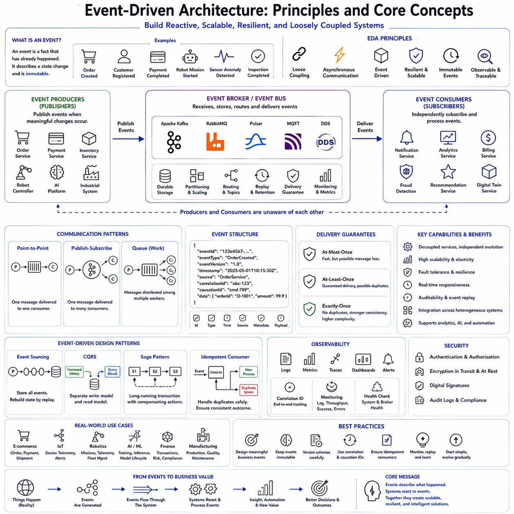
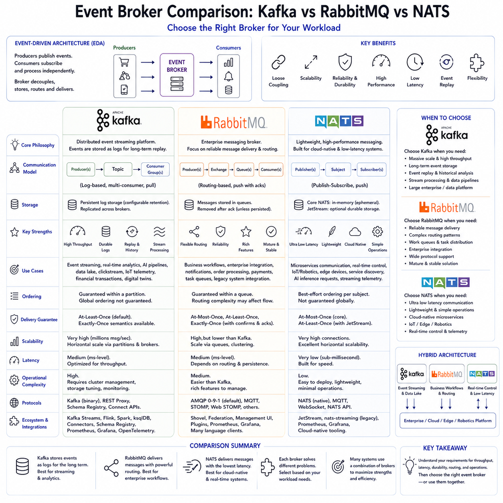
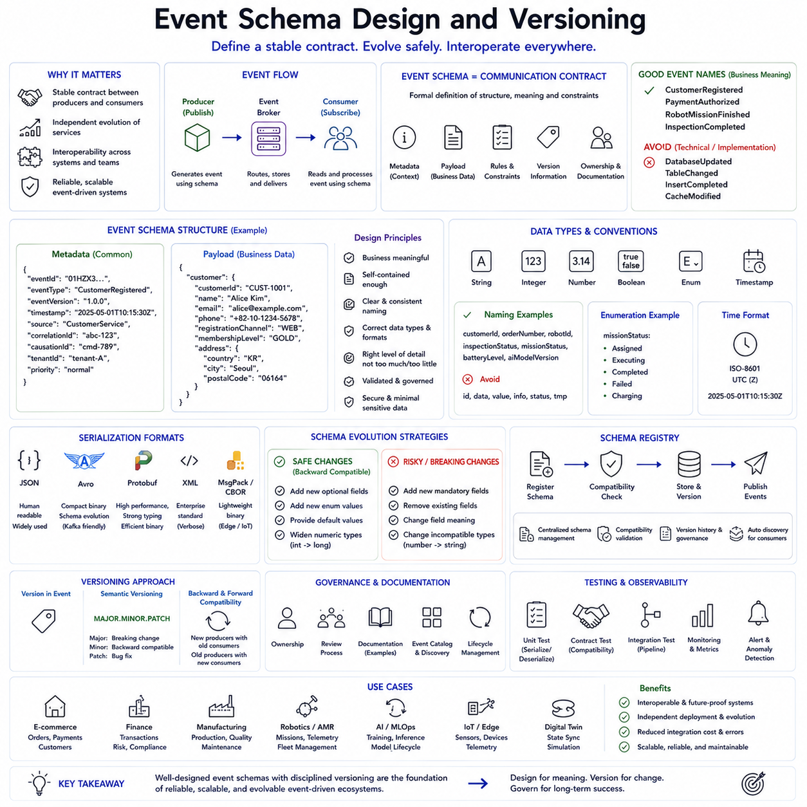
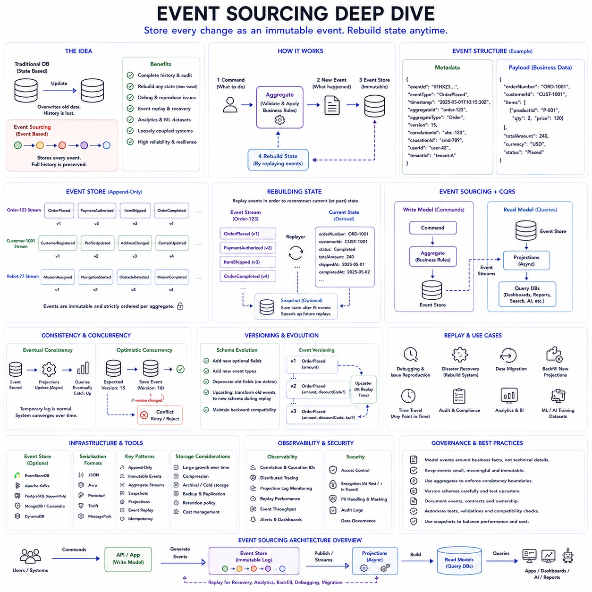
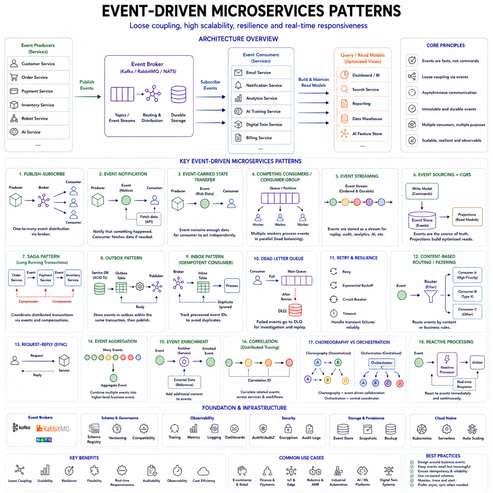
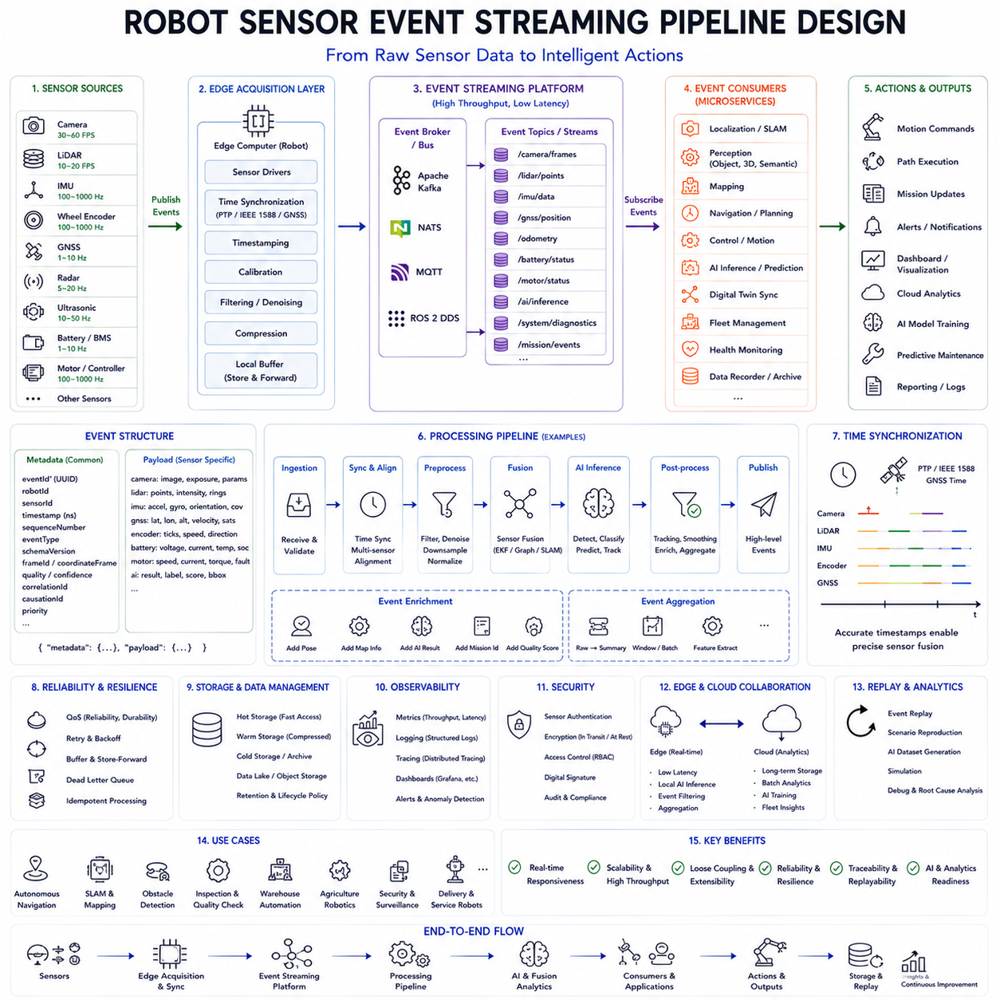
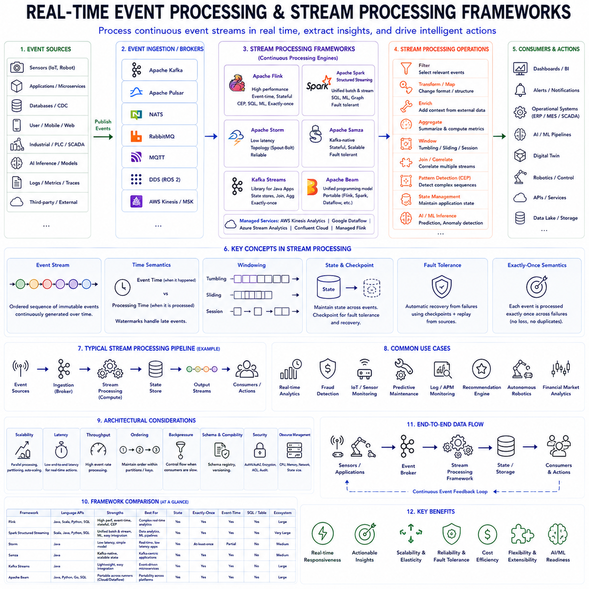
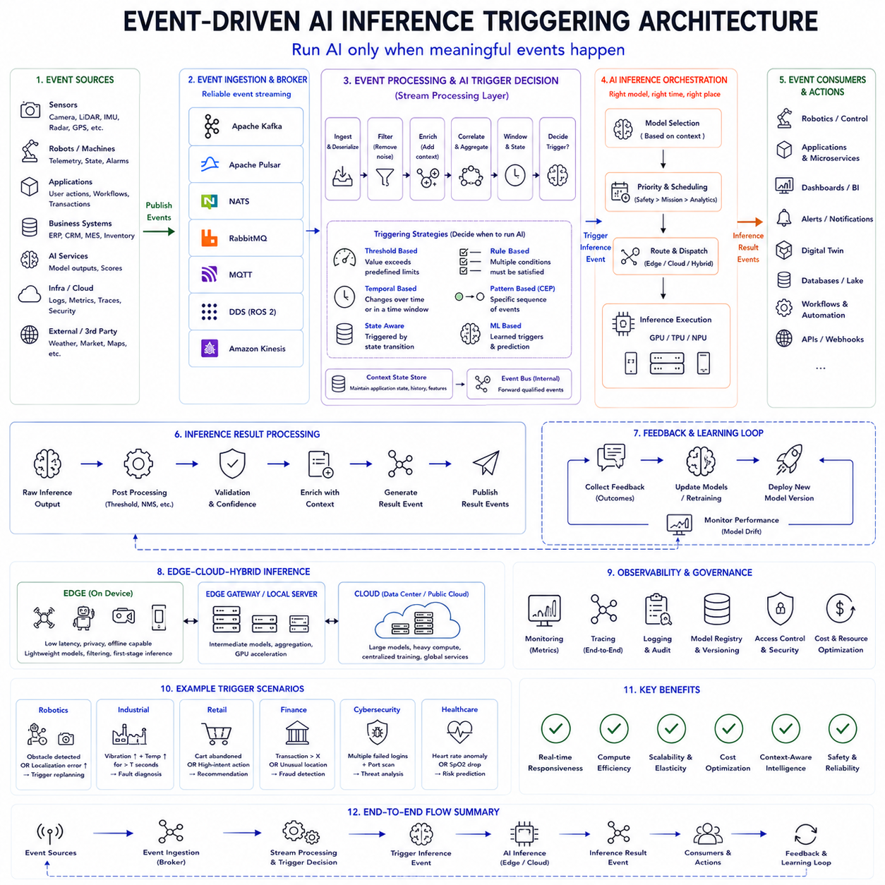
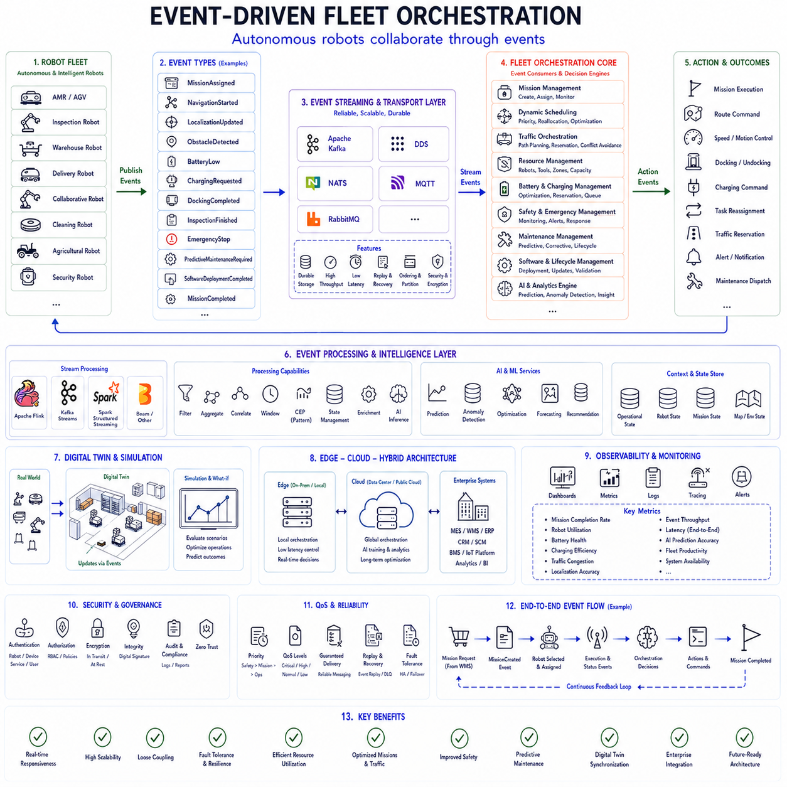
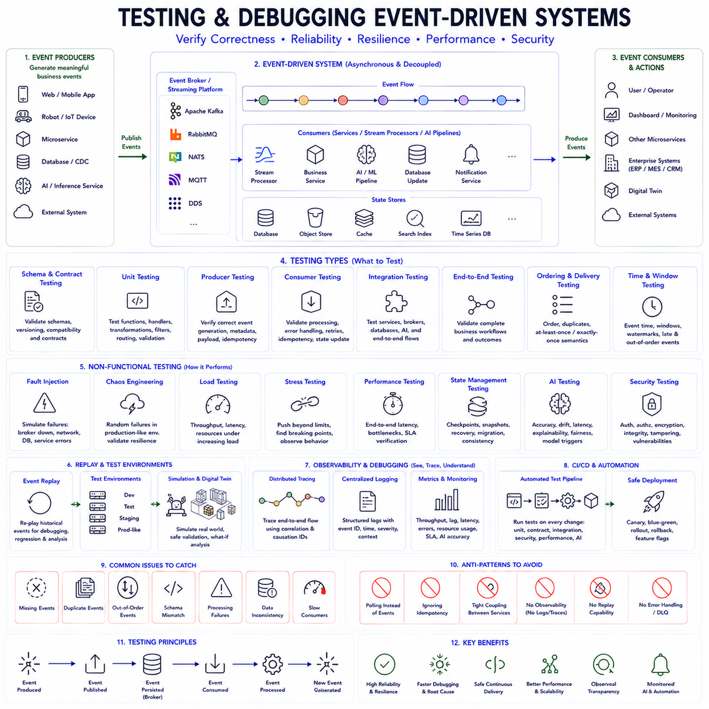

**Volume 1 Software Architecture Fundamentals**

# 05. Event-Driven Architecture

## 05.01 Event-Driven Architecture Principles and Core Concepts

{width="7.268055555555556in" height="7.268055555555556in"}

Event-Driven Architecture (EDA) has become one of the foundational architectural paradigms supporting modern cloud-native software, distributed systems, microservices, industrial automation, Internet of Things (IoT), robotics, artificial intelligence, financial platforms, and large-scale enterprise applications. Unlike traditional request-response architectures that depend primarily on synchronous communication between software components, Event-Driven Architecture organizes distributed systems around the continuous production, distribution, processing, and consumption of events that describe meaningful changes occurring throughout the operational environment. This architectural approach enables loosely coupled, scalable, resilient, and highly responsive software ecosystems capable of adapting naturally to continuously changing operational conditions.

An event represents the occurrence of something meaningful that has happened within a system. It is not a command requesting another component to perform an action, nor is it merely a message transporting arbitrary data. Instead, an event describes a completed fact that cannot be changed. Examples include customer registration, payment completion, robot mission initiation, product shipment, sensor anomaly detection, AI model deployment, machine failure, warehouse inventory update, industrial inspection completion, battery charging completion, and autonomous navigation success. Every event records a state transition that has already occurred and may influence other independent services throughout the distributed ecosystem.

The fundamental philosophy of Event-Driven Architecture is that software components should react to events rather than directly invoking one another whenever possible. Instead of tightly coupling services through synchronous API calls, producers publish events describing completed business activities while consumers independently subscribe to events relevant to their responsibilities. Producers remain unaware of which consumers process their events, while consumers remain independent from producer implementation details. This loose coupling substantially improves scalability, maintainability, organizational agility, and independent software evolution.

Traditional synchronous architectures frequently create strong dependencies among distributed services. One application invokes another through remote procedure calls, waits for responses, handles communication failures, retries unsuccessful requests, manages timeouts, and propagates errors across dependency chains. As distributed systems expand, these synchronous interactions generate increasingly complex dependency networks vulnerable to cascading failures, latency accumulation, deployment coordination challenges, and operational fragility.

Event-Driven Architecture addresses these limitations by introducing asynchronous communication as the primary interaction mechanism. Producers publish events without waiting for consumers to process them immediately. Event brokers temporarily store published events while independently delivering them to interested subscribers. Consumers process events according to their own computational capacity, operational priorities, and business responsibilities without blocking producers. Asynchronous processing significantly improves throughput while reducing latency sensitivity and operational coupling.

Events should describe business facts rather than technical implementation details. Effective event names represent meaningful domain concepts understandable by business stakeholders as well as software engineers. CustomerRegistered, PaymentAuthorized, InventoryReserved, RobotMissionCompleted, InspectionPassed, EquipmentFailureDetected, AIModelUpdated, DigitalTwinSynchronized, AutonomousNavigationStarted, and BatteryChargingCompleted communicate business significance rather than internal database modifications or software implementation mechanisms. Domain-oriented events improve architectural clarity while aligning software communication with organizational language.

Events are inherently immutable. Once an event has been published, its contents should never change because it records historical reality rather than current system state. If circumstances evolve, additional events describe subsequent state transitions rather than modifying previous historical records. Immutability simplifies distributed synchronization, auditing, historical analysis, event replay, debugging, regulatory compliance, and fault recovery while eliminating numerous consistency challenges associated with mutable distributed data.

The distinction between commands and events represents one of the most important conceptual principles within Event-Driven Architecture. Commands express intentions requesting another component to perform an action. Commands expect recipients to decide whether requested operations should succeed or fail. Events, however, communicate completed outcomes describing actions that have already occurred successfully. A command might request payment authorization, while a subsequent event announces payment authorization completion. Commands therefore influence future behavior whereas events describe historical facts.

Publishers generate events whenever meaningful operational changes occur. Publishers own business capabilities producing authoritative domain information while remaining completely unaware of downstream consumers. Payment services publish payment events. Inventory systems publish inventory changes. Robot controllers publish mission updates. AI platforms publish inference completion events. Industrial inspection systems publish quality verification events. This separation enables independent producer evolution without requiring coordination with every downstream consumer.

Subscribers consume events according to individual business responsibilities. Multiple independent subscribers may process identical events simultaneously while performing entirely different activities. Customer registration events may trigger billing initialization, marketing automation, fraud analysis, recommendation generation, identity verification, welcome notification, analytics reporting, digital twin updates, and machine learning feature generation. Publishers require no knowledge regarding subscriber existence or processing behavior.

Event brokers form the communication backbone connecting publishers and subscribers. Rather than producers transmitting events directly toward individual consumers, brokers receive published events, store them temporarily or permanently, distribute them to authorized subscribers, guarantee delivery according to configured quality-of-service policies, and manage communication independently from application logic. This centralized communication infrastructure significantly simplifies distributed application architecture while supporting scalability and operational resilience.

Several messaging patterns exist within Event-Driven Architecture depending upon communication requirements. Point-to-point messaging delivers each message to exactly one consumer. Publish-subscribe messaging distributes identical events to multiple independent subscribers. Event streaming continuously records ordered event sequences enabling historical replay, real-time analytics, distributed synchronization, and state reconstruction. Queue-based messaging balances workloads among multiple processing instances while maximizing computational throughput.

Topics organize related events according to business domains or operational responsibilities. Rather than distributing every event universally, brokers classify events into logical communication channels. Payment topics contain payment-related events. Robotics topics distribute robot telemetry and mission updates. AI topics publish model lifecycle events. Manufacturing topics communicate production activities. Consumers subscribe selectively to relevant topics while ignoring unrelated operational information.

Message queues provide temporary storage buffering communication between producers and consumers operating at different processing rates. Fast producers may continue publishing events despite slower consumers because queues absorb temporary workload imbalances. Queue-based architectures improve system resilience while supporting asynchronous workload distribution, fault tolerance, and computational scalability.

Event streaming platforms extend conventional messaging by preserving complete ordered histories of published events. Rather than immediately discarding processed messages, streaming systems retain event sequences for configurable durations enabling historical replay, time-travel debugging, retrospective analytics, machine learning training, digital twin synchronization, regulatory auditing, and distributed state reconstruction. Event streams therefore become permanent operational records rather than transient communication mechanisms.

Apache Kafka represents one of the most influential event streaming platforms supporting modern distributed architectures. Kafka partitions event streams across distributed brokers while preserving ordering within partitions, enabling horizontal scalability, high throughput, durable storage, and independent consumer processing. Numerous enterprise platforms utilize Kafka for operational telemetry, financial transactions, industrial monitoring, IoT communication, AI pipelines, robotics coordination, and cloud-native integration.

RabbitMQ emphasizes flexible message routing supporting numerous messaging protocols and delivery guarantees. Exchange mechanisms distribute messages according to routing keys, topic patterns, direct mappings, broadcast semantics, or custom routing logic. RabbitMQ therefore supports diverse enterprise integration requirements emphasizing reliable asynchronous messaging.

Apache Pulsar combines messaging and streaming capabilities through distributed storage architecture separating computational brokers from persistent storage layers. Pulsar supports multi-tenancy, geo-replication, high availability, stream processing, messaging, and large-scale cloud-native event distribution while maintaining operational flexibility across heterogeneous deployment environments.

MQTT has become widely adopted within Internet of Things and robotics ecosystems due to its lightweight publish-subscribe communication model optimized for constrained devices and unreliable network environments. Embedded sensors, industrial controllers, autonomous robots, edge gateways, and mobile devices efficiently exchange telemetry through MQTT brokers despite limited computational resources or intermittent connectivity.

DDS, Data Distribution Service, occupies a unique position within real-time distributed systems including robotics, aerospace, autonomous vehicles, industrial automation, and defense applications. DDS provides decentralized publish-subscribe communication emphasizing deterministic latency, configurable Quality of Service policies, peer discovery, reliable multicast, and real-time performance. Robot Operating System 2 utilizes DDS as its underlying communication middleware supporting autonomous robotics applications.

Event schemas define standardized structures describing event payloads consistently throughout distributed ecosystems. Schemas specify event names, timestamps, identifiers, metadata, payload structures, version information, business attributes, source systems, correlation identifiers, and operational context. Standardized schemas simplify interoperability while supporting independent producer and consumer evolution.

Schema evolution requires careful management because distributed services upgrade independently. New event fields should remain optional whenever possible. Existing fields should avoid incompatible modifications. Deprecated attributes require gradual retirement supporting backward compatibility throughout software migration. Schema registries automate compatibility validation while preventing disruptive interface evolution.

Metadata significantly enriches event usefulness. Event identifiers uniquely distinguish individual occurrences. Correlation identifiers connect related events belonging to identical business workflows. Causation identifiers describe immediate triggering relationships among sequential events. Timestamps record occurrence times independently from processing times. Source identifiers identify originating services. Together these metadata elements substantially improve distributed observability, debugging, tracing, and operational analytics.

Ordering represents another important architectural consideration. Some business workflows require strict event ordering while others tolerate out-of-order processing. Distributed architectures generally preserve ordering only within limited scopes such as Kafka partitions, individual message queues, robotics mission streams, industrial production lines, or specific entity identifiers. Global ordering across entire distributed ecosystems remains operationally expensive and frequently unnecessary.

Delivery guarantees influence system behavior significantly. At-most-once delivery prioritizes performance while tolerating occasional message loss. At-least-once delivery guarantees eventual message arrival but may introduce duplicate processing requiring idempotent consumers. Exactly-once semantics attempt eliminating duplicates entirely but substantially increase implementation complexity. Most production architectures adopt at-least-once delivery combined with idempotent application processing.

Idempotency enables consumers to process identical events repeatedly without producing inconsistent outcomes. Duplicate event delivery naturally occurs within distributed systems due to retries, network failures, broker recovery, or infrastructure redundancy. Consumers therefore identify previously processed events using unique identifiers while avoiding repeated business actions. Idempotent processing substantially improves reliability throughout fault-tolerant event-driven ecosystems.

Eventual consistency replaces immediate transactional consistency throughout most event-driven systems. Independent services maintain locally authoritative data while asynchronously synchronizing through event propagation. Temporary inconsistencies naturally emerge following distributed updates but gradually disappear as events propagate successfully across dependent services. Eventual consistency enables scalability while avoiding tightly coupled distributed transactions.

Event sourcing extends event-driven principles further by storing complete event histories rather than only current application state. System state reconstructs dynamically through sequential event replay. Every business change becomes permanently recorded, enabling historical auditing, temporal analysis, debugging, rollback simulation, digital twin synchronization, regulatory compliance, and machine learning dataset generation. Although event sourcing introduces additional implementation complexity, it provides unparalleled historical visibility.

Command Query Responsibility Segregation frequently complements Event-Driven Architecture. Commands modify operational state while generating events describing completed changes. Query models independently consume events constructing optimized read models tailored toward reporting, dashboards, analytics, search engines, digital twins, recommendation systems, and operational visualization. Independent read optimization substantially improves scalability without affecting transactional workloads.

Saga orchestration also integrates naturally with Event-Driven Architecture. Long-running distributed business processes spanning multiple services exchange events coordinating sequential activities while avoiding distributed ACID transactions. Compensation events reverse partially completed operations whenever failures occur, maintaining business consistency through loosely coupled event coordination rather than centralized transactional locking.

Observability becomes indispensable because asynchronous communication complicates operational debugging. Distributed tracing reconstructs complete event propagation paths across numerous publishers, brokers, consumers, databases, AI services, robotics controllers, cloud platforms, and industrial systems. Correlation identifiers connect logically related events despite asynchronous execution while metrics quantify broker throughput, consumer latency, queue depth, retry frequency, and processing performance.

Security considerations extend throughout event-driven ecosystems. Authentication verifies publisher identities while authorization controls topic access. Message encryption protects sensitive business information during transmission and storage. Digital signatures validate event authenticity. Audit logging preserves complete communication histories supporting compliance requirements throughout financial, healthcare, industrial, and governmental environments.

Cloud-native infrastructure substantially enhances Event-Driven Architecture through elastic scaling, managed messaging services, serverless computing, container orchestration, and distributed event routing. Cloud providers offer managed Kafka, Event Hubs, Pub/Sub services, EventBridge, Service Bus, and event routing platforms simplifying operational management while supporting global scalability and high availability.

Serverless computing naturally complements event-driven systems because functions activate only when relevant events occur. Instead of continuously executing idle application servers, serverless platforms dynamically allocate computational resources responding to incoming events. Event-driven serverless architectures significantly reduce operational costs while simplifying infrastructure management for intermittent workloads.

Industrial automation increasingly relies upon Event-Driven Architecture connecting programmable logic controllers, manufacturing execution systems, quality inspection platforms, predictive maintenance engines, warehouse automation, digital twins, enterprise planning systems, and cloud analytics. Sensor measurements, equipment failures, production milestones, maintenance alerts, robotic operations, and inspection results propagate continuously through event streams enabling real-time operational awareness and adaptive manufacturing.

Robotics platforms particularly benefit from event-driven communication because autonomous systems continuously generate large volumes of operational events. Localization updates, obstacle detection, navigation milestones, mission assignments, charging status, battery health, AI inference results, fleet coordination, diagnostics, predictive maintenance, and digital twin synchronization naturally become event streams consumed by numerous independent services. Event-driven communication enables robots, edge servers, cloud platforms, and fleet management systems to cooperate asynchronously while maintaining operational resilience despite unreliable wireless connectivity.

Artificial Intelligence workflows similarly adopt event-driven architectures. Data ingestion events initiate preprocessing pipelines. Training completion events trigger model validation. Successful validation publishes deployment events. Inference completion generates downstream business workflows. Model drift detection initiates retraining. Feature engineering pipelines consume operational telemetry while digital twins continuously synchronize AI state through event propagation. Asynchronous AI orchestration substantially improves scalability while supporting continuous machine learning operations.

Several anti-patterns should be avoided when adopting Event-Driven Architecture. Using events as remote procedure calls recreates synchronous coupling despite asynchronous messaging. Publishing excessively fine-grained technical events increases communication complexity while obscuring business meaning. Sharing mutable event payloads violates immutability principles. Ignoring schema governance creates compatibility failures. Excessive event chaining complicates operational reasoning while increasing latency. Treating event brokers as centralized business logic engines undermines service autonomy.

Successful Event-Driven Architecture therefore requires thoughtful domain modeling, carefully designed business events, standardized schemas, reliable messaging infrastructure, comprehensive observability, resilient consumer implementations, secure communication, automated governance, and organizational understanding of asynchronous distributed computing principles. Event-driven communication should complement rather than replace synchronous interactions, with architects selecting appropriate communication models according to business requirements, latency constraints, consistency expectations, and operational complexity.

Ultimately, Event-Driven Architecture represents a fundamental shift from request-centric software toward continuously evolving reactive systems capable of responding intelligently to changing operational conditions. By organizing distributed software around immutable business events, asynchronous communication, loose coupling, durable messaging, scalable event streaming, independent service evolution, and resilient operational behavior, Event-Driven Architecture provides the architectural foundation supporting cloud-native enterprises, financial technology, industrial automation, distributed artificial intelligence, Internet of Things ecosystems, Autonomous Mobile Robots, edge-cloud computing, digital twins, and future generations of Physical AI systems requiring scalable, adaptive, observable, and continuously evolving intelligent software platforms.

## 05.02 Event Broker Comparison: Kafka / RabbitMQ / NATS

{width="7.268055555555556in" height="7.268055555555556in"}

Event brokers form the communication backbone of modern Event-Driven Architecture (EDA), enabling distributed applications to exchange information asynchronously while remaining loosely coupled. As organizations increasingly adopt microservices, cloud-native computing, industrial automation, robotics, Internet of Things (IoT), artificial intelligence, financial technology, and edge computing, selecting an appropriate event broker becomes one of the most important architectural decisions. The event broker influences system scalability, latency, reliability, operational complexity, storage strategy, communication patterns, fault tolerance, deployment flexibility, and long-term maintainability. Among the numerous event messaging platforms available today, Apache Kafka, RabbitMQ, and NATS have emerged as three of the most widely adopted technologies, each optimized for different architectural objectives and operational environments.

Although Kafka, RabbitMQ, and NATS all support asynchronous communication, they are fundamentally different systems rather than interchangeable messaging products. Each was designed to solve different classes of distributed communication problems. Kafka emphasizes durable event streaming and large-scale distributed data processing. RabbitMQ focuses on reliable enterprise messaging with flexible routing capabilities. NATS prioritizes ultra-low latency, lightweight communication, and cloud-native simplicity. Understanding these design philosophies is essential before selecting a broker for production systems.

The primary responsibility of an event broker is to decouple producers from consumers. Producers publish messages without knowledge of downstream consumers, while consumers independently subscribe to relevant communication channels. The broker manages message routing, buffering, delivery guarantees, ordering, retry behavior, scaling, persistence, and failure recovery. By separating communication infrastructure from application logic, event brokers significantly improve software flexibility and organizational scalability.

Apache Kafka was originally developed at LinkedIn to process enormous volumes of operational event streams generated by large-scale internet platforms. Unlike traditional message queues designed primarily for transient communication, Kafka treats events as continuously growing distributed logs. Rather than immediately removing messages after consumption, Kafka stores events persistently for configurable retention periods, allowing multiple independent consumers to process identical event streams at different times and different speeds. This architectural distinction fundamentally differentiates Kafka from conventional messaging systems.

Kafka organizes information into Topics containing multiple Partitions distributed across numerous brokers. Producers publish events into topics, while consumers independently read ordered event sequences from assigned partitions. Ordering is guaranteed within individual partitions, enabling deterministic processing for related business entities while simultaneously achieving horizontal scalability across distributed infrastructure. This partitioned architecture allows Kafka clusters to process millions of messages per second while supporting petabyte-scale event storage.

Durability represents one of Kafka\'s strongest capabilities. Every event becomes permanently stored within distributed replicated logs before acknowledgment. Even after successful consumption, events remain available for replay, historical analytics, machine learning, digital twins, regulatory auditing, debugging, disaster recovery, and distributed synchronization. Organizations frequently retain event histories for days, weeks, months, or even permanently depending upon business requirements.

Kafka therefore excels in data-intensive environments emphasizing event streaming, real-time analytics, AI training pipelines, financial transaction histories, industrial telemetry, clickstream analysis, recommendation systems, cybersecurity monitoring, digital twin synchronization, and large-scale enterprise integration. Rather than simply transporting messages between applications, Kafka frequently becomes the organization\'s central nervous system for operational information.

Kafka also integrates naturally with stream processing frameworks such as Kafka Streams, Apache Flink, Apache Spark Streaming, and Apache Beam. Continuous event processing pipelines perform filtering, aggregation, enrichment, anomaly detection, AI feature generation, predictive analytics, and complex event processing while consuming streaming data directly from Kafka topics. Consequently, Kafka supports both messaging and real-time distributed computation within unified event ecosystems.

Despite its impressive scalability, Kafka introduces considerable operational complexity. Cluster management involves brokers, ZooKeeper or KRaft metadata management, partition balancing, replication strategies, storage optimization, consumer group coordination, retention policies, monitoring, capacity planning, and operational tuning. Engineering teams require substantial distributed systems expertise to operate large Kafka clusters reliably. Modern managed cloud services reduce this burden but architectural complexity remains greater than simpler messaging platforms.

RabbitMQ originated within the Advanced Message Queuing Protocol ecosystem emphasizing enterprise messaging reliability rather than large-scale streaming. RabbitMQ employs exchanges, bindings, queues, and routing keys to implement sophisticated message distribution patterns supporting diverse business communication requirements. Unlike Kafka\'s append-only log architecture, RabbitMQ primarily treats messages as transient communication units moving through routing infrastructure toward destination queues.

RabbitMQ provides exceptional routing flexibility through multiple exchange types. Direct exchanges perform exact routing key matching. Topic exchanges support wildcard pattern matching across hierarchical routing structures. Fanout exchanges broadcast messages toward every connected queue regardless of routing information. Headers exchanges perform attribute-based routing according to message metadata. These routing mechanisms enable complex enterprise integration scenarios difficult to implement efficiently within simpler messaging architectures.

Enterprise application integration frequently benefits from RabbitMQ\'s mature messaging semantics. Payment processing, order fulfillment, notification delivery, workflow orchestration, inventory updates, healthcare systems, telecommunications infrastructure, financial transactions, and business process automation often require reliable point-to-point messaging combined with sophisticated routing logic. RabbitMQ has therefore become widely adopted throughout traditional enterprise software environments emphasizing guaranteed message delivery.

RabbitMQ supports multiple messaging protocols including AMQP, MQTT, STOMP, and additional protocol adapters. This protocol flexibility enables heterogeneous enterprise systems, industrial equipment, IoT devices, cloud applications, mobile platforms, and legacy software to communicate through common messaging infrastructure despite technological diversity. Organizations integrating numerous existing systems frequently value RabbitMQ\'s interoperability capabilities.

Reliable delivery mechanisms represent another RabbitMQ strength. Publisher confirms verify successful broker receipt. Consumer acknowledgments confirm successful processing before queue removal. Dead-letter queues isolate problematic messages requiring later analysis. Message expiration policies remove obsolete information automatically. Priority queues support differentiated processing according to business urgency. Together these mechanisms provide comprehensive enterprise messaging reliability.

RabbitMQ generally emphasizes lower throughput than Kafka while providing more sophisticated routing behavior and operational simplicity. Although RabbitMQ scales horizontally, it typically processes fewer messages than Kafka under extreme workloads. However, numerous enterprise applications prioritize routing flexibility, delivery guarantees, and operational simplicity over maximum throughput, making RabbitMQ highly appropriate despite comparatively lower streaming capacity.

NATS represents a substantially different architectural philosophy emphasizing simplicity, speed, cloud-native deployment, and operational minimalism. Originally designed for cloud-native distributed systems, NATS minimizes infrastructure overhead while providing extremely low-latency publish-subscribe communication suitable for modern microservices, edge computing, robotics, artificial intelligence, and Kubernetes-native environments.

Unlike Kafka\'s durable event logs or RabbitMQ\'s sophisticated routing infrastructure, core NATS focuses upon lightweight messaging with minimal computational overhead. Publishers transmit messages toward logical subjects while subscribers receive matching communications immediately. The broker performs minimal processing, maximizing throughput and minimizing communication latency. Under optimal conditions, NATS frequently achieves sub-millisecond messaging performance.

Cloud-native architectures particularly benefit from NATS because distributed microservices often require rapid communication rather than persistent historical storage. Service discovery, distributed coordination, health monitoring, configuration updates, robotics telemetry, AI inference requests, edge synchronization, infrastructure control, and real-time operational signaling emphasize responsiveness over long-term event retention. NATS therefore aligns naturally with contemporary cloud-native operational requirements.

JetStream significantly extends NATS capabilities by introducing durable message persistence, stream replay, consumer acknowledgments, message retention policies, replication, flow control, and distributed fault tolerance. Traditional NATS prioritized ephemeral messaging while JetStream enables more durable event-driven architectures approaching functionality traditionally associated with enterprise messaging systems. Consequently, NATS now supports both transient communication and durable event processing within unified infrastructure.

Operational simplicity distinguishes NATS from larger messaging platforms. Configuration remains lightweight. Cluster deployment requires relatively little infrastructure expertise. Resource consumption stays minimal even within constrained environments. Embedded devices, edge gateways, industrial controllers, robotics platforms, autonomous vehicles, IoT deployments, and lightweight Kubernetes clusters therefore adopt NATS extensively where computational efficiency becomes essential.

Robotics provides particularly compelling examples of NATS adoption. Autonomous Mobile Robots continuously exchange localization updates, battery status, mission assignments, AI inference requests, obstacle detections, fleet coordination messages, diagnostics, and sensor telemetry requiring deterministic low-latency communication. Unlike financial transaction histories requiring permanent retention, many robotics communication patterns emphasize immediate operational responsiveness. NATS therefore frequently complements robotics middleware including ROS 2 and DDS while supporting cloud-edge synchronization.

Comparing communication models reveals important architectural distinctions. Kafka fundamentally operates as distributed event streaming infrastructure preserving complete event histories. RabbitMQ functions primarily as enterprise message routing middleware emphasizing reliable delivery and routing flexibility. NATS operates as lightweight cloud-native messaging infrastructure prioritizing latency, simplicity, and operational responsiveness. Although functional overlap exists, these design philosophies influence every architectural characteristic.

Storage strategies further differentiate these technologies. Kafka persistently stores every published event according to configurable retention policies. RabbitMQ generally removes messages following successful acknowledgment unless additional persistence mechanisms are configured. NATS originally emphasized transient messaging, while JetStream now supports configurable durable persistence where operational requirements justify historical retention.

Consumer interaction also differs substantially. Kafka consumers independently track offsets describing processing progress within event streams. Multiple consumer groups process identical historical events without interfering with one another. RabbitMQ consumers receive messages from queues where acknowledgments typically remove successfully processed messages. NATS subscribers receive live messages immediately while JetStream additionally enables durable replay according to configured stream retention.

Ordering guarantees similarly reflect architectural priorities. Kafka preserves strict ordering within individual partitions, making it highly appropriate for financial transactions, industrial production records, AI training datasets, and digital twin synchronization requiring deterministic event sequencing. RabbitMQ generally preserves queue ordering under normal processing conditions but complex routing patterns may influence overall message flow. NATS prioritizes rapid communication rather than globally deterministic ordering across distributed subjects.

Scalability characteristics vary considerably. Kafka scales exceptionally well toward extremely high throughput through partitioned distributed logs spanning numerous brokers. RabbitMQ scales effectively for enterprise messaging workloads but typically targets moderate throughput emphasizing routing sophistication rather than streaming capacity. NATS achieves impressive horizontal scalability through lightweight architecture supporting enormous numbers of simultaneous client connections while maintaining extremely low communication latency.

Latency represents another major distinction. Kafka introduces slightly higher latency due to durable storage, replication, batching, and distributed coordination optimizing throughput. RabbitMQ balances latency against routing complexity and delivery reliability. NATS minimizes processing overhead, frequently achieving the lowest communication latency among the three platforms. Applications emphasizing real-time responsiveness often prefer NATS despite reduced historical persistence.

Operational complexity influences long-term maintainability significantly. Kafka requires substantial expertise involving distributed storage, partition balancing, consumer coordination, replication, monitoring, and capacity management. RabbitMQ generally remains easier to operate while supporting sophisticated messaging semantics. NATS emphasizes operational simplicity through lightweight deployment and minimal administrative requirements, particularly attractive for smaller engineering organizations or edge environments.

Fault tolerance mechanisms differ according to architectural objectives. Kafka replicates partitions across multiple brokers preserving durable event histories despite infrastructure failures. RabbitMQ supports mirrored queues and quorum queues ensuring reliable enterprise messaging under hardware failures. NATS clusters distribute communication across multiple servers while JetStream replicates persistent streams according to configured durability policies. All three platforms support high availability but implement resilience through distinct architectural mechanisms.

Cloud-native deployment has become common across all three technologies. Kubernetes Operators automate cluster lifecycle management, scaling, monitoring, upgrades, backups, and recovery. Managed cloud offerings further simplify operations through infrastructure automation. Nevertheless, Kafka generally requires greater computational resources than RabbitMQ or NATS due to durable storage architecture and distributed log management.

Security capabilities continue evolving throughout all three platforms. Authentication, authorization, Transport Layer Security encryption, certificate management, access control lists, identity federation, audit logging, multi-tenancy, and role-based permissions protect communication infrastructure. Enterprise deployments typically integrate messaging platforms with centralized identity providers while enforcing Zero Trust communication principles.

Observability also plays an essential operational role. Metrics describing throughput, latency, queue depth, consumer lag, replication health, broker utilization, connection counts, partition distribution, message rates, retry behavior, and storage consumption support proactive infrastructure management. Prometheus, Grafana, OpenTelemetry, distributed tracing, centralized logging, and cloud monitoring platforms commonly integrate with all three messaging systems.

Artificial Intelligence increasingly influences event broker selection. AI training pipelines generate enormous event volumes favoring Kafka\'s streaming architecture. AI inference services frequently require low-latency communication aligning naturally with NATS. Enterprise AI workflow orchestration involving approvals, notifications, document processing, and human collaboration frequently benefits from RabbitMQ\'s routing flexibility. Consequently, modern AI platforms frequently combine multiple messaging technologies according to workload characteristics.

Industrial automation similarly demonstrates differentiated adoption patterns. Manufacturing telemetry, predictive maintenance analytics, sensor histories, quality inspection records, and digital twins frequently employ Kafka. Workflow coordination among enterprise systems often utilizes RabbitMQ. Edge controllers, industrial gateways, autonomous robots, inspection devices, and local control networks increasingly deploy NATS emphasizing lightweight operational responsiveness.

Hybrid architectures have therefore become increasingly common. Organizations rarely require one universal messaging platform satisfying every communication requirement optimally. Kafka manages enterprise event streaming and long-term operational history. RabbitMQ coordinates business workflows requiring sophisticated routing. NATS supports cloud-native microservices, robotics communication, and low-latency edge computing. Carefully selecting messaging infrastructure according to workload characteristics produces more efficient distributed architectures than attempting universal standardization.

Several anti-patterns should nevertheless be avoided regardless of technology selection. Deploying Kafka solely for lightweight request-response messaging unnecessarily increases operational complexity. Using RabbitMQ as large-scale streaming infrastructure exceeds intended architectural objectives. Employing transient NATS messaging where permanent regulatory event histories are required creates compliance risks. Selecting messaging platforms based exclusively upon popularity rather than workload characteristics frequently produces avoidable operational inefficiencies.

Architectural decisions should therefore prioritize business requirements before technology preferences. Organizations should evaluate throughput expectations, latency requirements, persistence duration, ordering constraints, routing complexity, operational expertise, cloud-native maturity, infrastructure scale, regulatory obligations, edge computing requirements, AI workloads, robotics integration, industrial automation needs, disaster recovery objectives, and long-term maintainability before selecting messaging infrastructure.

Ultimately, Kafka, RabbitMQ, and NATS represent complementary rather than competing technologies within modern Event-Driven Architecture. Kafka provides durable distributed event streaming supporting large-scale analytics, AI, digital twins, and enterprise integration. RabbitMQ delivers reliable enterprise messaging with sophisticated routing suitable for business workflows and heterogeneous system integration. NATS offers lightweight, ultra-low-latency cloud-native messaging ideal for microservices, robotics, edge computing, and real-time operational coordination. Understanding the architectural philosophy behind each platform enables engineers to construct distributed software ecosystems that maximize scalability, resilience, maintainability, operational efficiency, and long-term technological adaptability across cloud-native enterprises, industrial automation platforms, Autonomous Mobile Robot fleets, distributed artificial intelligence systems, Internet of Things infrastructures, and future Physical AI ecosystems.

## 05.03 Event Schema Design and Versioning

{width="7.268055555555556in" height="7.268055555555556in"}

Event Schema Design and Versioning represent two of the most fundamental disciplines in Event-Driven Architecture (EDA). While messaging infrastructure such as Apache Kafka, RabbitMQ, NATS, MQTT, DDS, and cloud-native event platforms provide reliable communication mechanisms, long-term interoperability depends primarily on the quality, consistency, and evolution of event schemas. In distributed systems where hundreds of independently developed services exchange millions of events every day, poorly designed event schemas quickly become sources of incompatibility, operational failures, integration complexity, and maintenance difficulties. Well-designed schemas, combined with disciplined versioning strategies, allow distributed systems to evolve continuously while preserving compatibility across independently deployed applications.

An event schema formally defines the structure, meaning, organization, and constraints of an event. It specifies exactly how producers publish events and how consumers interpret them. Rather than treating events as arbitrary collections of fields, schemas establish standardized contracts describing event names, identifiers, timestamps, metadata, payload structures, data types, optional attributes, mandatory attributes, validation rules, semantic meanings, version information, and ownership responsibilities. Every participant within the distributed ecosystem therefore shares identical expectations regarding event interpretation.

An event schema should be viewed as a communication contract rather than a software implementation detail. Producers own the responsibility for generating events conforming to established schemas, while consumers rely upon schema stability to process incoming information correctly. Neither side should depend upon internal implementation details of the other. This separation enables independent service evolution while preserving interoperability throughout large distributed organizations.

The primary objective of schema design is semantic clarity. Events should communicate meaningful business facts instead of exposing technical implementation details. Business-oriented event names such as CustomerRegistered, OrderConfirmed, PaymentAuthorized, InventoryReserved, InspectionCompleted, RobotMissionFinished, AutonomousNavigationStarted, BatteryChargingCompleted, AIInferenceGenerated, or DigitalTwinUpdated describe operational events understandable by both engineers and business stakeholders. Technical event names such as DatabaseUpdated, TableChanged, InsertCompleted, or CacheModified fail to communicate business intent and often create unnecessary coupling to internal implementation.

An event schema generally consists of two major sections: metadata and payload. Metadata provides contextual information supporting event management, routing, tracing, security, monitoring, and interoperability. Payload contains business-specific information describing the actual event. Separating metadata from payload significantly improves architectural consistency while simplifying distributed processing.

Metadata frequently includes globally unique event identifiers enabling duplicate detection and idempotent processing. Timestamps record precisely when events occurred rather than when they were processed. Event types identify business semantics. Schema versions indicate structural definitions. Source identifiers identify originating services. Correlation identifiers associate related events belonging to identical business workflows. Causation identifiers establish relationships among sequential events triggered by previous events. Tenant identifiers support multi-tenant systems. Geographic information, security classifications, and processing priorities may additionally appear depending upon organizational requirements.

The payload should contain only information directly relevant to the business event being communicated. Excessively large payloads increase network overhead, storage consumption, serialization latency, and long-term maintenance complexity. Conversely, overly minimal payloads frequently require consumers to perform additional synchronous API requests, reducing the advantages of asynchronous event-driven communication. Effective schema design therefore balances completeness against efficiency by including sufficient business information without unnecessary redundancy.

Self-contained events represent an important architectural objective. Whenever practical, consumers should obtain all information necessary for independent processing directly from received events. Requiring frequent synchronous lookups against producer services recreates tight coupling while reducing resilience. Nevertheless, complete duplication of all business information should also be avoided because excessive redundancy increases storage costs, synchronization complexity, and maintenance burdens.

Field naming conventions significantly influence long-term maintainability. Names should remain descriptive, stable, consistent, and business-oriented. Abbreviations should generally be avoided unless universally recognized throughout the organization. Naming consistency across all schemas improves readability while reducing developer confusion. Timestamp, CustomerId, OrderNumber, RobotId, InspectionResult, NavigationStatus, BatteryLevel, and AIModelVersion communicate meaning far more effectively than generic names such as Time, ID, Data, Status, or Value.

Data typing deserves careful consideration because distributed interoperability depends upon unambiguous interpretation. Numeric precision, integer sizes, floating-point representation, Boolean values, enumerations, timestamps, durations, geographical coordinates, measurement units, and textual encodings should remain explicitly defined. Time values should generally utilize internationally standardized formats such as ISO-8601 represented in Coordinated Universal Time, avoiding regional ambiguities associated with local time zones.

Enumerations require particularly disciplined governance. Rather than allowing arbitrary textual values, schemas should define controlled vocabularies describing acceptable operational states. InspectionStatus might include Passed, Failed, PendingReview, or Cancelled. RobotMissionStatus may include Assigned, Executing, Completed, Suspended, Failed, or Charging. Controlled enumerations simplify validation while preventing inconsistent semantic interpretation across independently developed services.

Optional and mandatory fields require careful balancing. Mandatory attributes guarantee essential information availability while simplifying consumer implementations. Optional attributes enable gradual schema evolution without immediately breaking existing consumers. Excessively many mandatory fields reduce flexibility, whereas excessive optionality weakens schema consistency. Architects should carefully distinguish genuinely required business information from supplementary metadata.

Nested object structures improve logical organization whenever events naturally contain hierarchical information. Customer events may contain nested address objects. Robot events may include sensor collections. AI inference events may organize prediction metadata separately from inference results. However, excessive nesting complicates serialization, validation, querying, and schema evolution. Moderate structural depth generally improves readability while avoiding unnecessary complexity.

Normalization and denormalization require strategic architectural decisions. Traditional relational database normalization minimizes redundancy through references among entities. Event-driven architectures frequently prefer selective denormalization because self-contained events reduce downstream dependencies. Rather than transmitting only CustomerId requiring subsequent lookups, CustomerRegistered events may additionally include customer names, regions, account categories, and registration channels supporting immediate downstream processing.

Schema validation prevents malformed events from entering distributed ecosystems. Validation rules verify mandatory fields, acceptable ranges, enumeration values, timestamp formats, identifier syntax, numerical constraints, string lengths, regular expression patterns, measurement units, geographical coordinate ranges, and business consistency. Validation may occur during producer generation, broker admission, consumer processing, or multiple stages throughout event lifecycles depending upon architectural requirements.

Several serialization technologies support schema implementation. JSON remains widely adopted because of readability, broad language support, and developer familiarity. XML provides extensive enterprise integration capabilities but introduces greater verbosity. Apache Avro offers compact binary serialization combined with strong schema evolution support, making it particularly suitable for Kafka ecosystems. Protocol Buffers emphasize performance, strong typing, backward compatibility, and efficient binary encoding. Apache Thrift similarly supports efficient cross-language communication. MessagePack and CBOR provide lightweight binary alternatives suitable for constrained environments.

Serialization format selection depends upon interoperability, performance, storage efficiency, language diversity, operational tooling, cloud-native compatibility, AI integration, robotics requirements, and organizational standards. Human-readable formats simplify debugging while binary formats generally improve computational efficiency and network utilization. Modern distributed systems frequently combine multiple serialization technologies according to communication context.

Schema evolution represents one of the greatest long-term challenges within Event-Driven Architecture. Unlike monolithic software where every component upgrades simultaneously, distributed systems evolve independently across numerous development teams, deployment schedules, cloud environments, industrial sites, robotics fleets, and edge computing platforms. Producers and consumers therefore frequently operate different software versions simultaneously for extended periods. Schema evolution strategies must preserve compatibility throughout these asynchronous upgrade processes.

Backward compatibility allows newer producers to communicate successfully with older consumers. Forward compatibility enables newer consumers to process events generated by older producers. Full compatibility preserves communication regardless of upgrade direction. Successful distributed architectures generally strive for both backward and forward compatibility whenever practical.

Adding new optional fields usually represents the safest evolution strategy because existing consumers simply ignore unfamiliar attributes while newer consumers utilize additional information when available. Introducing new mandatory fields, however, frequently breaks older producers unable to generate required information. Consequently, architects generally introduce new business capabilities through optional fields before gradually promoting stronger validation after sufficient ecosystem migration.

Removing existing fields requires exceptional caution. Consumers may continue depending upon historical attributes long after producers consider them obsolete. Safe field retirement generally follows extended deprecation periods during which documentation, monitoring, migration guidance, consumer adoption metrics, and communication plans collectively support gradual ecosystem evolution before permanent removal.

Changing field meanings represents one of the most dangerous compatibility violations. Reusing existing attributes for entirely different business semantics creates subtle operational failures difficult to detect through ordinary testing. If business meaning changes substantially, introducing new fields while deprecating previous attributes generally provides safer migration than modifying existing semantics.

Data type modifications also require careful planning. Expanding integer precision typically preserves compatibility, whereas converting numeric values into textual representations or altering timestamp formats frequently disrupts existing consumers. Explicit migration strategies should accompany all potentially incompatible type changes.

Version numbering strategies vary across organizations. Some systems include explicit schema versions within metadata, while others rely upon schema registries managing evolution independently. Semantic versioning frequently distinguishes major incompatible changes from minor backward-compatible enhancements. However, excessive version proliferation complicates operational management. Organizations should therefore minimize incompatible schema revisions whenever possible.

Schema registries have become essential infrastructure within large event-driven ecosystems. Platforms such as Confluent Schema Registry, Apicurio Registry, AWS Glue Schema Registry, and Azure Schema Registry centrally manage schema definitions, compatibility validation, version history, ownership metadata, governance policies, documentation, and deployment integration. Producers register schemas before publishing events, while consumers automatically retrieve appropriate schema definitions during deserialization.

Compatibility validation performed by schema registries prevents incompatible schema changes from entering production environments. Proposed modifications undergo automated analysis comparing new definitions against historical versions according to configured compatibility policies. Violations immediately block deployment pipelines, protecting distributed systems from accidental interoperability failures.

Consumer-driven schema evolution emphasizes downstream requirements during producer modifications. Rather than producers changing schemas unilaterally, consumer expectations influence compatibility decisions. Contract testing complements schema validation by verifying actual behavioral compatibility beyond structural definitions alone.

Documentation remains indispensable throughout schema lifecycle management. Every event should include clear business descriptions explaining semantic meaning, triggering conditions, producer ownership, consumer expectations, field definitions, acceptable values, measurement units, validation rules, example payloads, version history, migration guidance, and operational considerations. Comprehensive documentation substantially reduces onboarding time while improving organizational consistency.

Governance establishes organizational discipline supporting long-term schema quality. Architecture review boards, API governance committees, domain ownership teams, platform engineering organizations, and event catalog management collectively ensure naming consistency, compatibility preservation, documentation completeness, ownership accountability, lifecycle management, and operational standardization across enterprise ecosystems.

Domain-Driven Design significantly influences schema organization. Events should align naturally with bounded contexts representing coherent business domains rather than technical infrastructure boundaries. Customer events belong within customer domains. Payment events remain payment responsibilities. Robotics events originate from robotics contexts. AI inference events belong within machine learning domains. Domain alignment preserves organizational autonomy while simplifying long-term evolution.

Event catalogs provide centralized inventories describing available business events throughout organizations. Engineers discover reusable schemas rather than creating redundant event definitions independently. Event catalogs document producers, consumers, ownership teams, versions, dependencies, business purposes, sample payloads, operational metrics, and lifecycle status, promoting architectural consistency across large enterprises.

Observability extends naturally into schema management. Monitoring systems track schema adoption, version distribution, compatibility violations, serialization failures, validation errors, deprecated field usage, consumer migration progress, and event processing anomalies. Operational visibility enables proactive schema governance while reducing integration risks.

Testing becomes increasingly important as schemas evolve. Unit tests validate serialization and deserialization. Contract tests verify producer-consumer compatibility. Integration tests evaluate complete event processing pipelines. Regression tests ensure historical compatibility across multiple schema versions. Continuous Integration pipelines automatically execute schema validation alongside software builds, preventing incompatible changes from reaching production environments.

Security considerations influence schema design as well. Sensitive personally identifiable information, financial records, healthcare data, authentication credentials, industrial secrets, AI model parameters, and robotics control information require careful handling. Event schemas should minimize unnecessary exposure while supporting encryption, tokenization, field masking, access control, regulatory compliance, and Zero Trust communication principles.

Artificial Intelligence platforms increasingly depend upon disciplined schema management. Feature engineering pipelines consume operational events generated across enterprise systems. Model training requires historically consistent datasets. Online inference services exchange prediction requests and responses through standardized event schemas. Model lifecycle management generates deployment, validation, monitoring, drift detection, retraining, and rollback events requiring stable interoperability throughout MLOps workflows.

Industrial automation similarly emphasizes standardized event schemas. Manufacturing execution systems, industrial robots, quality inspection platforms, programmable logic controllers, predictive maintenance engines, digital twins, warehouse management systems, and enterprise resource planning platforms exchange operational events continuously. Standardized schemas preserve interoperability despite heterogeneous equipment vendors, communication protocols, deployment schedules, and software generations.

Robotics platforms provide particularly compelling schema design challenges because autonomous systems generate diverse operational events including localization updates, sensor observations, obstacle detections, mission assignments, navigation progress, battery telemetry, hardware diagnostics, fleet coordination, AI inference, predictive maintenance, environmental mapping, and digital twin synchronization. Carefully designed schemas enable cloud-edge interoperability while supporting long-term fleet evolution across independently updated robots, edge servers, and cloud platforms.

Several anti-patterns should be carefully avoided. Embedding implementation-specific database structures directly within event payloads tightly couples producers and consumers. Frequently renaming fields unnecessarily complicates long-term compatibility. Introducing mandatory attributes without migration planning disrupts independent deployments. Publishing excessively large payloads wastes computational resources. Ignoring schema documentation creates organizational confusion. Failing to validate compatibility permits subtle production failures. Treating schemas as temporary implementation details rather than long-term architectural contracts undermines distributed system maintainability.

Successful schema design therefore balances stability with adaptability. Schemas should remain sufficiently stable supporting long-lived interoperability while evolving carefully to accommodate changing business requirements. Strong governance should preserve consistency without preventing innovation. Versioning should enable independent deployment rather than forcing synchronized upgrades. Metadata should support observability without overwhelming payload simplicity. Event definitions should prioritize business meaning rather than technical implementation convenience.

Ultimately, Event Schema Design and Versioning establish the communication language through which distributed software ecosystems collaborate. Regardless of messaging technology, cloud infrastructure, robotics platform, artificial intelligence framework, industrial automation environment, or enterprise architecture, long-term success depends upon consistent semantic modeling, disciplined schema governance, compatibility-aware evolution, comprehensive documentation, automated validation, and organizational ownership. Well-designed event schemas enable microservices, cloud-native platforms, Autonomous Mobile Robots, digital twins, distributed AI, edge computing, industrial automation, Internet of Things ecosystems, and future Physical AI infrastructures to evolve independently while maintaining reliable, scalable, interoperable, and resilient communication across many years of continuous technological advancement.

## 05.04 Event Sourcing Deep Dive

{width="7.268055555555556in" height="7.268055555555556in"}

Event Sourcing is one of the most influential architectural patterns in modern Event-Driven Architecture (EDA), particularly for systems that require complete historical traceability, auditability, temporal analysis, high reliability, distributed consistency, and long-term business intelligence. Unlike traditional data persistence models that store only the latest state of an application, Event Sourcing stores every business event that has ever occurred. The current system state is not treated as the primary source of truth. Instead, it is reconstructed at any time by replaying the complete sequence of historical events. This fundamental shift transforms the way software systems manage data, recover from failures, synchronize distributed services, support machine learning pipelines, and analyze operational behavior.

Traditional database systems typically overwrite previous information whenever data changes. For example, when a customer\'s address changes, the database updates the address field and permanently replaces the previous value. Although this approach is simple and efficient for transactional systems, it permanently loses valuable historical information unless additional auditing mechanisms are implemented. Event Sourcing addresses this limitation by treating every state transition as an immutable event that becomes part of the permanent historical record. Rather than storing only the final address, the system stores CustomerRegistered, AddressChanged, ContactInformationUpdated, and every subsequent modification, preserving the complete business history indefinitely.

The fundamental principle of Event Sourcing is that events become the authoritative representation of business reality. Current application state is merely a derived projection calculated by replaying those events. If the complete event history is preserved, any historical state can be reconstructed exactly as it existed at any previous moment. Consequently, data becomes fully explainable because every current value can be traced back through the exact sequence of business decisions that produced it.

An event within Event Sourcing represents an immutable business fact describing something that has already happened. Events are never modified, deleted, or overwritten. If business circumstances change, additional events describe the new reality instead of altering previous historical records. This immutability significantly simplifies auditing, debugging, regulatory compliance, distributed synchronization, and historical analysis because past events remain permanent records of business activity.

Every event generally contains both metadata and business payload. Metadata includes globally unique event identifiers, timestamps, aggregate identifiers, version information, correlation identifiers, causation identifiers, producer information, user identities, tenant identifiers, security classifications, and processing context. The payload contains business-specific information describing the completed operation. Together these components provide complete operational traceability throughout distributed software ecosystems.

The Event Store serves as the primary database within Event Sourcing systems. Unlike relational databases organized around tables representing current entities, an Event Store organizes immutable event streams associated with business aggregates. Each aggregate maintains an ordered sequence of events describing its complete lifecycle. Customer streams contain registration, profile updates, purchases, account changes, and account closure events. Robot streams contain mission assignments, localization updates, battery charging, maintenance activities, and mission completion events. Industrial equipment streams contain installation, inspections, repairs, failures, upgrades, and retirement events.

Aggregates represent consistency boundaries within Domain-Driven Design. Every aggregate owns a logically consistent collection of related business events. Event ordering remains deterministic within each aggregate stream while avoiding unnecessary global coordination across unrelated business entities. This localized consistency significantly improves scalability while preserving transactional integrity where genuinely required.

Whenever applications receive commands requesting business operations, aggregates validate business rules before generating corresponding events. Commands represent requested intentions, whereas events represent completed facts. For example, an order aggregate receiving a PlaceOrder command validates inventory availability, customer eligibility, payment authorization, and business constraints. Upon successful validation, it generates an OrderPlaced event recorded permanently within the Event Store. Current order state subsequently becomes a projection derived from replaying all associated order events.

State reconstruction forms one of Event Sourcing\'s defining characteristics. Rather than reading current values directly from relational tables, applications sequentially replay historical events beginning from aggregate creation until the desired point in time. Every event modifies in-memory aggregate state according to deterministic business logic. The resulting reconstructed state precisely represents aggregate status following complete event application.

Although replaying complete histories provides perfect accuracy, long event streams eventually introduce computational overhead. Aggregates experiencing millions of events may require significant processing time before becoming operational. Snapshot mechanisms therefore periodically capture fully reconstructed aggregate state after processing specified event counts. Future reconstruction begins from the latest snapshot rather than replaying the complete historical stream, dramatically improving application performance while preserving Event Sourcing semantics.

Snapshots remain optimization mechanisms rather than authoritative data sources. The Event Store continues serving as the ultimate source of truth because snapshots may always be regenerated through complete event replay whenever necessary. Consequently, snapshot corruption never threatens permanent data integrity because immutable historical events remain preserved independently.

Temporal querying becomes remarkably powerful within Event Sourcing systems. Since every historical event remains permanently available, applications reconstruct aggregate state corresponding to any previous timestamp. Organizations analyze customer behavior before specific policy changes, investigate financial transactions during historical reporting periods, reconstruct industrial production status preceding equipment failures, examine AI model behavior before deployment updates, or reproduce robotics mission execution exactly as originally performed. Time effectively becomes another navigable system dimension rather than inaccessible historical information.

Auditability naturally emerges from Event Sourcing architecture. Regulatory compliance frequently requires complete documentation describing who performed specific actions, when operations occurred, why business decisions happened, and how current system state evolved. Traditional systems often require supplementary audit logging infrastructure. Event Sourcing inherently provides comprehensive audit trails because every state transition already exists within immutable historical event streams.

Debugging distributed systems similarly benefits enormously from complete event histories. Rather than investigating incomplete log files or reconstructed assumptions, engineers replay exact historical event sequences reproducing production behavior within development environments. Rare concurrency problems, race conditions, distributed synchronization failures, AI inference anomalies, robotics navigation errors, and industrial process deviations become reproducible through deterministic event replay.

Machine learning applications increasingly leverage Event Sourcing because historical business events provide exceptionally valuable training datasets. Customer interactions, financial transactions, industrial telemetry, robot missions, predictive maintenance histories, digital twin synchronization, autonomous navigation experiences, AI inference results, and operational workflows all become naturally preserved chronological datasets supporting supervised learning, reinforcement learning, anomaly detection, predictive analytics, and continual learning systems.

Event replay extends beyond debugging into operational recovery and infrastructure migration. Catastrophic infrastructure failures no longer require complex database reconstruction procedures because complete application state regenerates through replaying preserved event histories. New read models, analytics pipelines, AI features, recommendation systems, search indexes, reporting databases, digital twins, and data warehouses similarly initialize by replaying existing events without disrupting production operations.

Projection mechanisms transform event streams into optimized read models tailored toward specific application requirements. While Event Stores preserve normalized chronological histories, projections maintain denormalized representations supporting dashboards, reporting systems, search engines, recommendation algorithms, inventory views, robotics fleet visualization, manufacturing monitoring, AI feature stores, and customer portals. Multiple projections simultaneously consume identical event streams while independently optimizing different query patterns.

Command Query Responsibility Segregation (CQRS) frequently complements Event Sourcing because command processing naturally generates immutable events while projections independently construct specialized query models. Commands modify business state through aggregates. Events record completed outcomes. Read models consume events building optimized representations for diverse application interfaces. This separation significantly improves scalability while simplifying complex query optimization.

Eventual consistency naturally characterizes Event Sourcing systems because projections update asynchronously following successful event persistence. Immediately after recording new events, read models may temporarily lag behind write models until event propagation completes. Although temporary inconsistencies emerge naturally, distributed systems eventually converge toward consistent representations once all projections process corresponding event streams.

Concurrency management introduces additional considerations. Multiple users may simultaneously issue commands affecting identical aggregates. Optimistic concurrency control therefore associates expected version numbers with aggregate updates. Commands succeed only if aggregate versions remain unchanged since command generation. Conflicting updates require retry or conflict resolution rather than silently overwriting concurrent business decisions.

Versioning within Event Sourcing encompasses both event schemas and business evolution. Historical events cannot be modified because they represent immutable facts. Nevertheless, business understanding evolves continuously throughout software lifecycles. Event upcasting addresses this challenge by transforming historical event versions into newer logical representations during replay without altering permanently stored historical data. Upcasters preserve long-term compatibility while allowing business models to evolve safely.

Schema evolution requires particularly careful planning because decades of historical events may remain operationally valuable. New optional fields generally preserve compatibility, whereas removing historical attributes or fundamentally changing semantic meanings complicates replay. Organizations therefore establish disciplined schema governance, compatibility validation, documentation standards, and automated migration testing supporting long-term historical preservation.

Event Stores themselves require specialized infrastructure optimized for append-only sequential writes rather than relational updates. Numerous implementation approaches exist. EventStoreDB provides purpose-built Event Sourcing capabilities including optimistic concurrency, stream management, projections, subscriptions, and event replay. Apache Kafka frequently serves as distributed event storage within cloud-native environments emphasizing streaming integration. Relational databases may implement append-only event tables supporting simpler deployments. NoSQL databases similarly provide scalable event persistence where operational characteristics align appropriately.

Storage growth naturally becomes significant because every historical event remains permanently preserved. Organizations therefore establish retention policies, archival strategies, compression mechanisms, cold storage tiers, backup procedures, disaster recovery plans, and lifecycle management balancing operational accessibility against long-term storage costs. Since storage prices continue decreasing while analytical value increases, many organizations retain complete event histories indefinitely.

Observability integrates deeply with Event Sourcing architecture. Correlation identifiers connect related business workflows across distributed services. Causation identifiers reconstruct event dependency graphs. Distributed tracing visualizes event propagation through publishers, brokers, projections, AI services, robotics controllers, cloud infrastructure, and industrial automation platforms. Monitoring systems measure replay performance, projection lag, subscription health, storage growth, event throughput, snapshot frequency, and aggregate reconstruction latency.

Security considerations become especially important because immutable event histories frequently contain sensitive business information. Personally identifiable information, financial records, industrial secrets, healthcare data, robotics telemetry, AI model outputs, and operational metadata require encryption, access control, field masking, tokenization, digital signatures, audit logging, and regulatory compliance throughout complete event lifecycles. Since events cannot simply be deleted without affecting historical integrity, privacy regulations require carefully designed data minimization strategies and cryptographic protection mechanisms.

Distributed microservices particularly benefit from Event Sourcing because independently evolving services synchronize naturally through immutable event streams. Rather than coordinating complex distributed transactions, services publish authoritative business events while downstream consumers independently update local models. Event-driven synchronization substantially reduces coupling while improving scalability and operational resilience.

Financial systems frequently adopt Event Sourcing because regulatory auditing, transaction traceability, fraud investigation, dispute resolution, and historical reconstruction represent critical operational requirements. Every account modification, transfer, authorization, settlement, adjustment, reversal, and reconciliation remains permanently preserved. Current account balances become projections derived from complete financial histories rather than isolated database values.

Industrial automation similarly benefits through permanent operational histories. Manufacturing execution systems preserve production milestones, equipment maintenance, quality inspections, sensor anomalies, predictive maintenance alerts, process adjustments, machine failures, operator interventions, and digital twin synchronization events. Engineers subsequently analyze complete production histories supporting root cause analysis, optimization, regulatory reporting, and predictive analytics.

Robotics platforms present particularly compelling Event Sourcing applications. Autonomous Mobile Robots continuously generate localization updates, navigation decisions, obstacle detections, battery telemetry, mission assignments, charging activities, fleet coordination, sensor observations, AI inference results, predictive maintenance events, and environmental mapping updates. Permanent event histories enable exact mission replay, safety certification, incident investigation, AI dataset generation, digital twin synchronization, autonomous behavior analysis, and continuous robotics improvement. Instead of merely storing current robot positions, organizations preserve complete operational lifecycles spanning entire robot fleets.

Artificial Intelligence platforms increasingly integrate Event Sourcing throughout MLOps workflows. Data ingestion, feature generation, model training, validation, deployment, inference, drift detection, retraining, rollback, human feedback, and performance monitoring all become immutable event streams supporting reproducibility, explainability, compliance, and continual learning. Historical AI behavior remains fully reconstructable despite continuous model evolution.

Despite numerous advantages, Event Sourcing introduces considerable architectural complexity. Engineers must understand event modeling, domain-driven design, eventual consistency, asynchronous projections, optimistic concurrency, snapshot management, schema evolution, event replay, distributed observability, operational monitoring, and long-term governance. Small CRUD applications rarely justify this additional complexity unless historical traceability, auditing, temporal analysis, or distributed synchronization provide substantial business value.

Several anti-patterns should therefore be avoided. Treating ordinary database updates as artificial events provides little architectural benefit. Designing events around technical implementation details rather than business semantics reduces maintainability. Frequently modifying historical events violates immutability principles. Neglecting snapshot optimization eventually degrades reconstruction performance. Ignoring schema versioning complicates long-term replay. Using Event Sourcing where historical traceability offers little business value unnecessarily increases implementation complexity.

Successful Event Sourcing therefore requires disciplined domain modeling, immutable business events, append-only persistence, optimized snapshots, carefully governed schema evolution, comprehensive observability, projection management, strong documentation, automated testing, and organizational understanding of event-driven principles. Event Stores should preserve authoritative business history while projections satisfy operational query requirements. Event replay should support recovery, analytics, AI training, debugging, and historical reconstruction without disrupting production systems.

Ultimately, Event Sourcing fundamentally redefines how software systems understand data persistence. Rather than treating databases as repositories of current state, Event Sourcing preserves complete histories of business evolution through immutable chronological events. Current application state becomes only one possible interpretation derived from permanent historical facts. This architectural perspective provides exceptional auditability, explainability, temporal querying, distributed synchronization, AI data generation, digital twin support, regulatory compliance, and operational resilience. When combined with Event-Driven Architecture, CQRS, cloud-native infrastructure, distributed microservices, industrial automation, robotics, Autonomous Mobile Robot fleets, edge computing, digital twins, and future Physical AI platforms, Event Sourcing establishes one of the most powerful architectural foundations for building scalable, transparent, intelligent, and continuously evolving distributed software ecosystems.

## 05.05 Event-Driven Microservices Patterns

{width="7.268055555555556in" height="7.268055555555556in"}

Event-Driven Microservices represent the convergence of two of the most influential software architecture paradigms in modern distributed computing: Microservices Architecture and Event-Driven Architecture (EDA). Microservices decompose complex applications into independently deployable services organized around business capabilities, while Event-Driven Architecture enables those services to communicate asynchronously through immutable business events rather than tightly coupled synchronous requests. When these two architectural approaches are combined, organizations obtain software ecosystems that are highly scalable, resilient, flexible, loosely coupled, and capable of evolving continuously without requiring coordinated deployments across the entire system. Today, Event-Driven Microservices have become a foundational architecture for cloud-native applications, financial technology, industrial automation, robotics, Internet of Things (IoT), artificial intelligence, healthcare platforms, telecommunications, and large-scale enterprise systems.

Traditional microservices often begin with synchronous REST or gRPC communication. One service directly invokes another, waits for a response, and proceeds only after receiving the required information. While this communication model remains appropriate for many real-time interactions, it gradually introduces dependency chains that reduce resilience as distributed systems expand. Service availability becomes increasingly interconnected. A failure or slowdown in one service propagates upstream, creating cascading failures throughout the application ecosystem. Deployment coordination also becomes more complicated because interface compatibility must be maintained across tightly coupled service interactions.

Event-Driven Microservices address these limitations by replacing many synchronous interactions with asynchronous event communication. Instead of directly requesting another service to perform work, a service publishes an event describing a completed business action. Other services independently subscribe to relevant events and react according to their own responsibilities. Publishers remain completely unaware of consumer implementations, while consumers remain independent of publisher internals. This loose coupling fundamentally changes the scalability, maintainability, and operational characteristics of distributed software.

The central philosophy behind Event-Driven Microservices is that services should own business capabilities rather than technical functions. Each service becomes the authoritative owner of specific domain information and publishes events whenever meaningful business state changes occur. Customer services publish customer lifecycle events. Payment services publish payment authorization events. Inventory services publish stock movement events. Robot controllers publish mission events. AI inference services publish prediction completion events. Manufacturing systems publish production milestones. Every service contributes authoritative business facts into a shared event ecosystem without requiring direct coordination with downstream consumers.

Business events represent immutable facts rather than requests or commands. Events communicate what has already happened instead of requesting future actions. CustomerRegistered, PaymentAuthorized, InventoryReserved, InspectionCompleted, RobotMissionAssigned, AutonomousNavigationCompleted, AIInferenceGenerated, DigitalTwinUpdated, PredictiveMaintenanceTriggered, and BatteryChargingFinished describe completed business outcomes. This distinction significantly simplifies service autonomy because publishers never require knowledge regarding how consumers utilize published events.

The Publish-Subscribe Pattern represents the foundational communication model within Event-Driven Microservices. Publishers transmit events toward brokers rather than individual services. Subscribers independently express interest in selected event categories while brokers distribute relevant events automatically. Multiple independent subscribers may process identical events simultaneously without affecting one another. A customer registration event might initiate identity verification, marketing automation, recommendation generation, fraud detection, analytics, notification delivery, AI feature generation, and digital twin synchronization concurrently.

Publish-Subscribe communication dramatically reduces coupling compared with traditional request-response interactions. Producers neither know nor care how many subscribers exist. New services integrate simply by subscribing to existing business events without modifying producer implementations. Consequently, organizational agility improves substantially because independent teams evolve software without centralized coordination.

The Event Notification Pattern provides one of the simplest event-driven communication strategies. Events merely inform interested services that something meaningful has occurred without containing complete business information. Consumers subsequently retrieve detailed data directly from authoritative services if required. Notification events remain lightweight while minimizing duplicated information. However, excessive notification usage may inadvertently recreate synchronous dependencies because consumers repeatedly perform follow-up API requests.

The Event-Carried State Transfer Pattern addresses notification limitations by embedding sufficient business information directly within event payloads. Consumers receive all information necessary for independent processing without additional synchronous communication. CustomerRegistered events may include customer identity, region, account category, and registration channel. RobotMissionCompleted events may include mission duration, battery utilization, navigation statistics, and inspection results. Self-contained events improve resilience while reducing communication latency and dependency chains.

Choosing between Event Notification and Event-Carried State Transfer requires balancing payload size against service autonomy. Minimal events reduce communication overhead but increase downstream dependencies. Rich events improve consumer independence while introducing additional storage and network utilization. Most mature architectures selectively apply both patterns according to business requirements rather than universally adopting either extreme.

The Competing Consumers Pattern improves horizontal scalability by distributing identical workloads across multiple service instances. Rather than every consumer processing every message, numerous worker instances compete for available events from shared queues. Each event is processed by exactly one consumer while workload automatically balances across available computational resources. Image processing, AI inference, document generation, payment validation, manufacturing inspection, robotics telemetry processing, and large-scale notification systems frequently employ competing consumer architectures.

Consumer Groups extend competing consumer concepts within event streaming platforms such as Apache Kafka. Multiple instances belonging to identical consumer groups collectively process partitioned event streams while preserving ordering guarantees within partitions. Independent consumer groups simultaneously process identical historical events for entirely different business purposes. Analytics, AI training, digital twins, operational monitoring, and billing systems may independently consume identical business events without interfering with one another.

The Event Streaming Pattern transforms communication infrastructure into continuously evolving distributed logs preserving complete business histories. Rather than transient messaging, event streams permanently record chronological operational activity supporting replay, auditing, analytics, machine learning, debugging, digital twins, regulatory compliance, and historical reconstruction. Kafka exemplifies this architectural approach by treating events as durable append-only logs rather than disposable messages.

The Event Sourcing Pattern extends event streaming further by treating immutable events as the authoritative system of record. Current application state derives entirely from replaying historical event sequences. Every business decision remains permanently preserved, enabling temporal analysis, auditability, disaster recovery, AI dataset generation, and precise historical reconstruction. Event Sourcing frequently integrates with CQRS separating command processing from optimized query projections.

The CQRS Pattern complements Event-Driven Microservices by separating write models responsible for generating events from read models optimized for querying application state. Commands validate business rules before generating immutable events. Independent projections subsequently consume events constructing specialized read databases supporting dashboards, reporting, search engines, recommendation systems, robotics fleet monitoring, industrial visualization, AI feature stores, and customer interfaces. Read optimization therefore evolves independently from transactional processing.

The Saga Pattern addresses distributed transaction management across multiple autonomous microservices. Traditional ACID transactions become impractical across independently managed databases spanning distributed services. Sagas instead coordinate long-running business workflows through sequences of local transactions communicating via events. If failures occur during workflow execution, compensation events reverse previously completed operations while maintaining overall business consistency without centralized locking.

Two primary Saga coordination strategies exist. Choreography relies exclusively upon event exchanges among participating services. Every service independently reacts to relevant business events without centralized workflow control. Orchestration introduces dedicated coordinators managing workflow progression while issuing commands and interpreting resulting events. Choreography maximizes service autonomy whereas orchestration improves centralized visibility for highly complex business processes.

The Outbox Pattern solves reliability challenges arising when applications simultaneously update databases and publish events. Without coordination, database transactions may succeed while event publication fails, or vice versa, producing inconsistent distributed state. The Outbox Pattern stores pending events within transactional database tables alongside business updates. Background publishers subsequently transfer committed outbox events toward messaging infrastructure, guaranteeing eventual event delivery without distributed transactions.

The Inbox Pattern complements the Outbox Pattern by preventing duplicate event processing. Distributed messaging naturally introduces occasional duplicate deliveries due to retries, failover, broker recovery, or network failures. Consumers maintain inbox records identifying previously processed event identifiers. Duplicate events become safely ignored, ensuring idempotent business behavior despite at-least-once messaging semantics.

Idempotent Consumers represent another essential Event-Driven Microservices pattern. Consumers should safely process identical events multiple times without producing inconsistent business outcomes. Financial transactions, inventory updates, robotics commands, AI workflow triggers, manufacturing operations, and healthcare records particularly require idempotent processing because duplicate execution may produce severe operational consequences.

Dead Letter Queue Patterns isolate problematic events that repeatedly fail processing. Rather than blocking entire processing pipelines, invalid messages automatically move toward dedicated dead-letter queues supporting manual investigation, debugging, correction, replay, or archival. Operational resilience improves significantly because isolated failures no longer interrupt healthy event processing throughout remaining services.

Retry Patterns improve fault tolerance by automatically reattempting transient communication failures. Immediate retries address temporary network interruptions. Exponential backoff gradually increases retry intervals reducing infrastructure overload during widespread failures. Circuit breakers temporarily suspend repeated communication attempts whenever dependent services become unavailable. Together these resilience patterns substantially improve operational reliability throughout distributed microservice ecosystems.

Event Filtering Patterns reduce unnecessary communication by allowing consumers to subscribe only to business events relevant to their responsibilities. Rather than receiving every organizational event, AI services subscribe exclusively to inference requests. Robotics controllers receive mission events. Billing systems consume financial events. Industrial analytics process equipment telemetry. Efficient filtering minimizes computational overhead while simplifying application logic.

Content-Based Routing extends filtering by examining event payload contents before determining delivery destinations. Events satisfying specified business conditions automatically route toward specialized processing pipelines. High-priority manufacturing defects, AI confidence thresholds, robotics safety alerts, predictive maintenance warnings, cybersecurity anomalies, and financial fraud indicators frequently utilize content-aware routing strategies supporting intelligent workflow automation.

Request-Reply Patterns remain valuable despite event-driven architectures emphasizing asynchronous communication. Certain business interactions require immediate responses unavailable through eventual event processing alone. Rather than abandoning events entirely, modern architectures frequently combine asynchronous event publication with temporary reply channels supporting interactive user experiences while preserving loose coupling internally.

Hybrid Communication Patterns therefore characterize most production Event-Driven Microservices ecosystems. Latency-sensitive operations utilize synchronous REST or gRPC communication. Long-running workflows, business integration, AI processing, robotics telemetry, industrial monitoring, notifications, analytics, and distributed synchronization employ asynchronous event communication. Architects select communication models according to operational requirements rather than ideological preference.

Event Aggregation Patterns consolidate numerous fine-grained operational events into higher-level business summaries. Manufacturing systems aggregate sensor telemetry into production efficiency reports. Robotics fleets combine localization updates into mission summaries. AI inference platforms aggregate prediction events into performance analytics. Financial systems summarize transaction streams into daily settlement reports. Aggregation reduces downstream processing complexity while preserving business visibility.

Event Enrichment Patterns supplement incoming events with additional contextual information before downstream distribution. Customer events acquire loyalty information. Robotics telemetry incorporates environmental conditions. Manufacturing inspection events append equipment metadata. AI inference events include model versions and confidence metrics. Enrichment improves consumer usefulness while avoiding repeated external lookups.

Correlation Patterns connect related events belonging to identical business workflows. Correlation identifiers associate customer orders, payment authorization, inventory reservation, shipment initiation, delivery confirmation, invoice generation, and customer notification events into coherent business processes despite asynchronous execution across numerous independent services. Distributed tracing platforms visualize correlated workflows supporting observability and debugging.

Event Choreography Patterns naturally support highly decentralized organizations. Services independently determine reactions based solely upon received business events. Marketing systems respond to customer registration. Billing responds to subscriptions. AI responds to operational telemetry. Digital twins respond to equipment changes. New services integrate by subscribing to existing events without requiring modifications throughout established software ecosystems.

Reactive Processing Patterns emphasize continuous adaptation rather than scheduled batch execution. Systems immediately respond whenever meaningful business events occur. Manufacturing adjusts production dynamically following equipment telemetry. AI retraining begins automatically after model drift detection. Robotics fleets reassign missions following navigation failures. Supply chains reorder inventory after stock depletion. Reactive architectures significantly improve operational responsiveness.

Cloud-native infrastructure naturally strengthens Event-Driven Microservices through managed event brokers, Kubernetes orchestration, serverless computing, autoscaling, distributed observability, infrastructure automation, and elastic resource allocation. Event consumers automatically scale according to queue depth. Serverless functions activate only when relevant events arrive. Infrastructure utilization therefore closely follows actual business activity rather than static provisioning assumptions.

Artificial Intelligence increasingly integrates deeply into Event-Driven Microservices. Data ingestion events trigger preprocessing pipelines. Training completion generates validation workflows. Successful validation publishes deployment events. Online inference produces recommendation events. Model drift detection initiates retraining pipelines. Human feedback generates reinforcement learning events. AI systems therefore evolve continuously through interconnected event-driven operational lifecycles.

Industrial automation provides compelling Event-Driven Microservices applications. Manufacturing execution systems publish production milestones. Industrial robots emit operational telemetry. Predictive maintenance engines generate maintenance recommendations. Quality inspection systems report inspection outcomes. Enterprise planning platforms consume manufacturing events updating inventory, logistics, procurement, and production scheduling automatically through asynchronous integration.

Robotics platforms particularly benefit from Event-Driven Microservices because autonomous systems naturally generate continuous operational events. Localization updates, obstacle detection, mission assignment, charging status, battery health, AI inference, digital twin synchronization, predictive maintenance alerts, fleet coordination, environmental mapping, and safety monitoring become independent event streams processed asynchronously by specialized services. Edge servers, cloud infrastructure, fleet management platforms, and onboard robotics software therefore evolve independently while maintaining coordinated operational behavior.

Observability becomes indispensable within Event-Driven Microservices because asynchronous communication complicates operational visibility. Distributed tracing reconstructs complete event propagation paths across publishers, brokers, consumers, AI services, robotics controllers, databases, cloud infrastructure, and industrial automation platforms. Metrics quantify processing latency, consumer lag, throughput, retry frequency, dead-letter queue utilization, event rates, and projection delays. Structured logging, centralized monitoring, OpenTelemetry instrumentation, Prometheus metrics, and Grafana dashboards collectively provide comprehensive operational intelligence.

Security patterns similarly extend throughout event-driven ecosystems. Publishers authenticate before event publication. Consumers receive authorization only for permitted event categories. Event payloads employ encryption protecting sensitive information during transmission and storage. Digital signatures verify authenticity. Access control policies enforce Zero Trust communication principles. Audit logs preserve immutable communication histories supporting regulatory compliance throughout financial, healthcare, industrial, governmental, and defense applications.

Several anti-patterns should be carefully avoided. Replacing every synchronous interaction with asynchronous events unnecessarily complicates simple workflows. Publishing implementation-specific technical events instead of business events creates architectural coupling. Excessively granular events overwhelm communication infrastructure. Ignoring schema governance undermines interoperability. Using events as remote procedure calls recreates synchronous dependencies. Allowing consumers to depend upon producer databases violates service autonomy. Neglecting idempotency introduces duplicate processing errors. Excessive event chaining complicates debugging while increasing operational latency.

Successful Event-Driven Microservices therefore require disciplined domain modeling, well-designed business events, standardized schemas, reliable messaging infrastructure, resilient consumer implementations, comprehensive observability, automated governance, security integration, platform engineering, and organizational understanding of asynchronous distributed computing. Architects should carefully balance synchronous and asynchronous communication according to business latency requirements, consistency expectations, operational complexity, and organizational maturity rather than applying event-driven communication indiscriminately.

Ultimately, Event-Driven Microservices represent one of the most powerful architectural foundations for modern distributed software systems. By combining independently deployable business services with asynchronous immutable event communication, organizations achieve scalable, resilient, observable, maintainable, and continuously evolving software ecosystems. Whether supporting cloud-native enterprises, financial technology platforms, industrial automation, Autonomous Mobile Robot fleets, distributed artificial intelligence, digital twins, Internet of Things infrastructures, edge-cloud computing, or future Physical AI environments, Event-Driven Microservices provide the architectural flexibility necessary to build intelligent systems capable of adapting continuously to changing operational requirements while preserving reliability, autonomy, interoperability, and long-term technological sustainability.

## 05.06 Robot Sensor Event Streaming Pipeline Design

{width="7.268055555555556in" height="7.268055555555556in"}

Robot Sensor Event Streaming Pipeline Design is one of the most important architectural foundations for modern autonomous robotic systems, especially Autonomous Mobile Robots (AMRs), Autonomous Guided Vehicles (AGVs), humanoid robots, industrial robots, service robots, collaborative robots, inspection robots, agricultural robots, defense robots, and future Physical AI platforms. Unlike conventional software systems that process relatively infrequent business transactions, autonomous robots continuously generate enormous volumes of heterogeneous sensor information that must be acquired, synchronized, processed, distributed, analyzed, stored, and acted upon within extremely strict real-time constraints. An effective event streaming pipeline transforms raw sensor observations into reliable, synchronized, meaningful, and actionable information that supports autonomous perception, localization, planning, control, artificial intelligence inference, digital twin synchronization, fleet management, cloud analytics, and long-term machine learning.

Modern robots simultaneously operate dozens of sensors with significantly different update rates, communication protocols, precision levels, computational requirements, and reliability characteristics. Cameras may generate thirty or sixty images every second. High-resolution LiDAR sensors may publish point clouds at ten or twenty frames per second. Inertial Measurement Units continuously stream acceleration and angular velocity measurements at hundreds or even thousands of Hertz. Wheel encoders generate odometry updates at extremely high frequencies. GNSS receivers provide positioning data several times per second, while battery management systems, motor controllers, environmental sensors, radar systems, ultrasonic sensors, force sensors, tactile sensors, thermal cameras, microphones, and AI inference engines all produce independent streams of operational events. Integrating these heterogeneous data streams into a coherent perception pipeline requires disciplined event streaming architecture.

The primary objective of a Robot Sensor Event Streaming Pipeline is to decouple sensor acquisition from downstream processing. Sensors should never communicate directly with every consumer application because such architectures rapidly become tightly coupled, difficult to maintain, and computationally inefficient. Instead, every sensor publishes standardized events into an event streaming infrastructure where independent downstream consumers subscribe only to the information required for their responsibilities. Localization systems consume IMU, GNSS, wheel encoder, and LiDAR events. Obstacle detection consumes camera, LiDAR, radar, and ultrasonic data. Artificial intelligence models subscribe to synchronized perception streams. Fleet management systems consume robot health and mission events. Digital twins subscribe to operational state updates. Each consumer therefore evolves independently without modifying sensor acquisition software.

Sensor events represent immutable observations describing physical reality at specific moments in time. Every event corresponds to an actual measurement produced by hardware rather than an interpreted application state. CameraFrameCaptured, LiDARScanCompleted, IMUUpdated, WheelEncoderIncremented, GNSSPositionReceived, BatteryStatusUpdated, MotorCurrentMeasured, ObstacleDetected, AIInferenceCompleted, RobotPoseEstimated, MapUpdated, ChargingStarted, InspectionFinished, and MissionCompleted all describe completed physical or computational observations. Maintaining immutability preserves traceability, replay capability, debugging accuracy, and machine learning dataset consistency.

A well-designed sensor event generally contains both metadata and payload. Metadata provides information required for synchronization, routing, monitoring, security, traceability, and distributed processing. Payload contains the actual measurement data generated by the sensor. Separating metadata from payload enables consistent event management while allowing different sensor types to coexist within unified streaming infrastructure.

Metadata typically includes globally unique event identifiers, robot identifiers, sensor identifiers, timestamps, sequence numbers, event types, schema versions, synchronization domains, quality indicators, confidence scores, calibration versions, coordinate frame identifiers, software versions, processing pipeline identifiers, hardware identifiers, and communication priorities. Correlation identifiers associate multiple synchronized observations belonging to identical sensing cycles. Causation identifiers identify computational dependencies between derived events and their originating measurements. Such metadata enables distributed debugging, sensor fusion, replay, digital twin synchronization, and operational monitoring across complex robotic systems.

The payload contains sensor-specific measurement information. Camera events include image frames, intrinsic parameters, exposure settings, timestamps, and compression formats. LiDAR events contain point clouds, intensity values, ring identifiers, scan angles, and return characteristics. IMU events provide linear acceleration, angular velocity, orientation estimates, covariance matrices, and temperature measurements. GNSS events contain latitude, longitude, altitude, velocity, satellite visibility, dilution of precision, and fix quality. Motor events include rotational speed, current consumption, voltage, torque estimation, controller status, and fault indicators. Every payload remains specialized while preserving standardized metadata structures across all event categories.

Time synchronization represents one of the most critical design challenges within robot event streaming pipelines. Autonomous decision making depends upon accurately associating observations generated by multiple sensors operating at different frequencies. A camera frame captured twenty milliseconds before a LiDAR scan may represent a significantly different physical environment if the robot moves rapidly. Therefore, every event must include highly accurate timestamps synchronized through common timing infrastructure.

Precision Time Protocol (PTP), IEEE 1588, Global Navigation Satellite System timing, hardware trigger synchronization, deterministic Ethernet, and dedicated timing distribution hardware frequently provide sub-microsecond synchronization accuracy across robotics platforms. High-performance inspection robots often synchronize multiple cameras, LiDAR sensors, IMUs, GNSS receivers, and industrial measurement devices through centralized timing systems ensuring deterministic sensor alignment. Software timestamping alone generally proves insufficient for high-precision robotics requiring accurate sensor fusion.

Timestamp quality significantly influences downstream perception accuracy. Sensor fusion algorithms assume observations correspond to identical physical moments. Localization, simultaneous localization and mapping, obstacle detection, motion estimation, and digital twin synchronization all depend upon precise temporal alignment. Consequently, timestamp accuracy frequently becomes more important than individual sensor precision.

Event serialization also deserves careful architectural consideration. Human-readable formats such as JSON simplify debugging and interoperability but increase bandwidth consumption and serialization overhead. Binary serialization technologies including Protocol Buffers, FlatBuffers, Apache Avro, MessagePack, CBOR, Cap\'n Proto, and DDS Common Data Representation reduce network utilization while improving computational efficiency. High-frequency robotics applications frequently prefer binary serialization due to stringent real-time performance requirements.

Communication middleware strongly influences pipeline architecture. Robot Operating System 2 commonly utilizes DDS providing decentralized publish-subscribe communication with configurable Quality of Service policies. Apache Kafka supports durable event streaming, historical replay, AI training datasets, and cloud analytics. NATS emphasizes extremely low-latency cloud-native communication. MQTT remains popular for lightweight IoT integration. RabbitMQ supports enterprise messaging workflows. Modern robotics ecosystems frequently combine multiple middleware technologies according to operational requirements rather than relying upon a single communication platform.

Quality of Service policies become essential when different sensor streams exhibit distinct reliability requirements. Critical safety events require guaranteed delivery with reliable communication semantics. High-frequency camera frames may tolerate occasional packet loss because subsequent frames rapidly replace previous observations. Battery warnings, emergency stop signals, localization updates, obstacle detections, AI safety alerts, and collision avoidance messages demand substantially higher delivery guarantees than routine telemetry streams. Configurable Quality of Service enables communication infrastructure to optimize reliability according to business importance.

Sensor fusion pipelines consume multiple synchronized event streams combining complementary measurements into unified environmental understanding. Extended Kalman Filters, Unscented Kalman Filters, particle filters, graph optimization, factor graph estimation, visual-inertial odometry, LiDAR-Inertial Odometry, simultaneous localization and mapping, and AI perception models continuously integrate camera, LiDAR, IMU, GNSS, encoder, radar, and ultrasonic events producing robust robot pose estimation and environmental representation. Event streaming infrastructure provides synchronized input supporting these computational pipelines.

Artificial Intelligence increasingly occupies central positions within robotics event streaming architectures. Camera events trigger object detection models. LiDAR events initiate three-dimensional semantic segmentation. Audio events activate speech recognition. Thermal images support anomaly detection. Robot state events feed reinforcement learning policies. Prediction results themselves become new event streams consumed by planning, navigation, manipulation, inspection, safety monitoring, and cloud analytics. AI therefore participates simultaneously as event consumer and event producer.

Edge computing significantly improves robotics event streaming efficiency. Rather than transmitting raw sensor data continuously toward cloud infrastructure, edge computers perform local filtering, compression, feature extraction, object detection, localization, obstacle recognition, semantic segmentation, AI inference, and event aggregation before publishing higher-level operational events. Bandwidth requirements decrease dramatically while maintaining real-time responsiveness essential for autonomous operation.

Event filtering reduces unnecessary communication by allowing consumers to subscribe selectively according to robot identifiers, sensor categories, event priorities, geographic regions, operational modes, mission identifiers, or AI confidence thresholds. Fleet management consumes health telemetry while ignoring raw image streams. Localization consumes IMU and encoder events without processing battery telemetry. AI training pipelines archive camera and LiDAR observations. Efficient filtering minimizes computational overhead throughout distributed robotic ecosystems.

Event aggregation further optimizes communication efficiency. Rather than transmitting every low-level encoder increment toward cloud platforms, onboard processors aggregate numerous measurements into summarized odometry events. Hundreds of battery voltage samples become battery health reports. Thousands of IMU updates produce motion summaries. Camera detections combine into object tracking events. Aggregated events reduce network utilization while preserving operational significance.

Event enrichment enhances raw sensor observations through contextual information. Localization estimates augment camera frames with robot pose. Digital maps annotate LiDAR point clouds with semantic regions. AI inference appends object classifications, confidence scores, and tracking identifiers to perception events. Mission planners enrich navigation events with task identifiers and operational priorities. Enrichment transforms isolated measurements into operationally meaningful information supporting downstream decision making.

Hierarchical event processing frequently improves architectural scalability. Raw sensor events remain localized within robot edge computers. Intermediate perception events summarize processed observations. High-level semantic events describe operational situations. Fleet management consumes mission progress rather than individual sensor measurements. Enterprise analytics receive production summaries instead of continuous telemetry. Such hierarchical pipelines substantially reduce communication overhead while preserving actionable information.

Event buffering accommodates temporary network disruptions and computational overload. High-speed local storage temporarily retains sensor streams whenever communication links become unavailable. Upon network restoration, buffered events synchronize automatically with cloud infrastructure preserving complete operational histories. Autonomous robots operating in mines, tunnels, warehouses, remote agricultural fields, disaster environments, or military operations particularly benefit from resilient buffering strategies supporting intermittent connectivity.

Replay capability represents another major advantage of event streaming architecture. Historical sensor events reconstruct complete operational scenarios supporting debugging, accident investigation, AI dataset generation, algorithm comparison, digital twin synchronization, simulation, predictive maintenance, and operator training. Engineers repeatedly evaluate improved localization algorithms using identical historical sensor streams without requiring repeated physical experimentation.

Storage architecture requires careful balancing between operational accessibility and long-term cost. High-frequency raw sensor streams consume enormous storage capacity. Organizations therefore establish hierarchical retention strategies preserving full-resolution recent observations while compressing, aggregating, or archiving historical information. Cloud object storage, distributed file systems, edge solid-state drives, data lakes, and event streaming platforms collectively support long-term robotics data management.

Observability becomes indispensable within robotics event streaming systems. Monitoring infrastructure continuously measures sensor frequencies, communication latency, synchronization accuracy, packet loss, consumer lag, serialization performance, buffer utilization, bandwidth consumption, CPU utilization, GPU utilization, event throughput, processing latency, AI inference duration, and storage growth. OpenTelemetry, Prometheus, Grafana, distributed tracing, centralized logging, and robotics-specific diagnostics collectively provide operational visibility supporting proactive maintenance and performance optimization.

Security considerations extend throughout event streaming pipelines. Sensor authentication prevents unauthorized devices from injecting fraudulent observations. Encryption protects sensitive operational telemetry during transmission and storage. Digital signatures verify event authenticity. Role-based authorization restricts event access according to operational responsibilities. Industrial robots, autonomous vehicles, healthcare robots, military platforms, and critical infrastructure deployments require particularly strong cybersecurity because manipulated sensor events directly influence physical system behavior.

Digital Twin integration naturally complements sensor event streaming. Every operational event updates virtual representations reflecting physical robot state. Robot position, battery status, mission progress, component temperatures, maintenance history, AI predictions, localization quality, sensor health, and environmental observations synchronize continuously between physical robots and virtual models. Digital twins therefore become living computational representations maintained through continuous event streams.

Fleet management platforms similarly depend upon event streaming architecture. Individual robots publish mission updates, localization estimates, obstacle detections, charging requests, battery telemetry, maintenance warnings, software deployment status, communication quality, and operational diagnostics. Fleet coordinators consume these events optimizing mission allocation, charging schedules, traffic management, predictive maintenance, and overall fleet efficiency without directly polling individual robots continuously.

Industrial automation demonstrates additional benefits. Inspection robots stream measurement events toward manufacturing execution systems. Autonomous forklifts publish logistics events supporting warehouse optimization. Agricultural robots transmit crop observations enabling precision farming analytics. Construction robots generate progress events synchronizing digital project management systems. Healthcare robots publish patient interaction events supporting clinical workflow coordination. Every robotics domain benefits from standardized event streaming principles despite differing operational objectives.

Artificial Intelligence training pipelines increasingly rely upon robotics event streams. Historical camera images, LiDAR scans, localization estimates, control actions, obstacle detections, semantic maps, operator interventions, mission outcomes, and environmental observations collectively form extraordinarily valuable supervised and reinforcement learning datasets. Continual learning architectures automatically incorporate newly collected event streams improving perception, planning, navigation, manipulation, and decision-making models throughout operational lifecycles.

Several anti-patterns should be carefully avoided. Transmitting raw sensor data indiscriminately toward every consumer wastes bandwidth and computational resources. Ignoring timestamp synchronization severely degrades sensor fusion accuracy. Mixing metadata with payload complicates interoperability. Excessively large event payloads reduce communication efficiency. Neglecting schema governance creates long-term compatibility problems. Publishing implementation-specific rather than semantically meaningful events reduces maintainability. Omitting replay capability limits debugging and AI development. Treating event streams as ordinary log files rather than structured operational information undermines architectural value.

Successful Robot Sensor Event Streaming Pipeline Design therefore requires disciplined standardization across event schemas, metadata organization, timestamp synchronization, serialization technologies, Quality of Service configuration, communication middleware, security architecture, observability infrastructure, storage strategies, edge computing, AI integration, fleet management, digital twin synchronization, and long-term governance. Every component must contribute toward deterministic, scalable, resilient, and maintainable distributed robotic intelligence.

Ultimately, Robot Sensor Event Streaming Pipelines establish the nervous system of modern autonomous robotics. They continuously transform heterogeneous physical sensor observations into synchronized digital event streams supporting perception, localization, mapping, planning, control, machine learning, digital twins, fleet coordination, cloud analytics, predictive maintenance, and future Physical AI ecosystems. By combining event-driven communication, cloud-native infrastructure, edge intelligence, distributed artificial intelligence, standardized event schemas, precise synchronization, scalable messaging infrastructure, and autonomous software architecture, Robot Sensor Event Streaming Pipelines provide the essential foundation for building intelligent robotic platforms capable of operating safely, efficiently, transparently, and continuously across industrial facilities, warehouses, cities, agricultural environments, healthcare institutions, defense operations, and next-generation autonomous cyber-physical systems.

## 05.07 Real-Time Event Processing: Stream Processing Frameworks

{width="7.268055555555556in" height="7.268055555555556in"}

Real-Time Event Processing and Stream Processing Frameworks have become indispensable technologies for modern cloud-native computing, Event-Driven Architecture (EDA), microservices, industrial automation, robotics, Internet of Things (IoT), financial technology, telecommunications, cybersecurity, digital twins, and Artificial Intelligence (AI). Unlike traditional batch processing systems that periodically analyze accumulated data, real-time stream processing continuously analyzes events as soon as they arrive, enabling systems to react immediately to changing operational conditions. This capability forms the computational foundation for autonomous decision making, intelligent monitoring, predictive analytics, adaptive control, and future Physical AI platforms.

Modern digital systems generate continuous streams of operational events rather than isolated transactions. Autonomous robots continuously publish localization updates, sensor observations, navigation decisions, obstacle detections, battery telemetry, and AI inference results. Manufacturing facilities generate machine telemetry, production milestones, quality inspection results, and predictive maintenance alerts. Financial institutions process payment transactions, fraud indicators, market quotations, and customer interactions. Cloud infrastructure continuously produces logs, metrics, traces, and security events. Processing these continuously evolving information streams requires computational models fundamentally different from conventional database-oriented applications.

Traditional batch processing assumes that data is collected over a period of time before analysis begins. Reports may execute hourly, daily, or weekly after operational activity has already occurred. Although batch processing remains effective for historical reporting, accounting, archival analytics, and long-term business intelligence, it cannot satisfy applications requiring immediate operational awareness. Autonomous vehicles cannot wait several minutes before detecting pedestrians. Fraud detection systems cannot postpone identifying suspicious transactions until the following day. Industrial robots cannot delay collision avoidance while waiting for scheduled analytics jobs. Consequently, real-time stream processing has become essential wherever immediate action determines operational success.

Real-time event processing treats every arriving event as an opportunity for immediate computation. Rather than storing information first and analyzing it later, streaming systems continuously execute computations over flowing event streams. Each new event incrementally updates application state, triggers business logic, generates derived events, updates machine learning models, refreshes digital twins, and initiates downstream workflows. Processing therefore becomes continuous rather than periodic.

An event stream represents an ordered sequence of immutable events generated over time. Events originate from sensors, business applications, AI inference engines, cloud infrastructure, industrial controllers, user interactions, mobile devices, robotics platforms, databases, or external information providers. Stream processing frameworks consume these event sequences while performing filtering, transformation, enrichment, aggregation, correlation, anomaly detection, prediction, and distributed computation before producing new event streams consumed by downstream systems.

The fundamental processing model within stream processing differs significantly from traditional request-response architectures. Applications no longer execute only when users initiate requests. Instead, computational pipelines remain continuously active, automatically responding whenever relevant events arrive. This reactive execution model dramatically improves responsiveness while enabling intelligent automation throughout distributed software ecosystems.

A typical real-time event processing pipeline begins with event producers generating continuous operational observations. These events flow into messaging infrastructure such as Apache Kafka, Apache Pulsar, RabbitMQ, NATS, MQTT, DDS, or cloud-native event brokers. Stream processing frameworks consume incoming events, perform distributed computations, generate derived insights, and publish transformed events toward additional consumers including dashboards, AI services, digital twins, robotics controllers, analytics platforms, enterprise systems, and cloud storage.

Several fundamental processing operations appear repeatedly throughout streaming applications. Filtering removes irrelevant events while preserving meaningful information. Mapping transforms one event format into another. Enrichment combines incoming events with reference information obtained from external databases or cached knowledge. Aggregation summarizes multiple events into higher-level operational statistics. Windowing organizes events according to temporal boundaries. Joining correlates multiple independent event streams. Pattern detection identifies meaningful operational sequences. State management preserves historical context enabling complex temporal reasoning across continuous event streams.

Filtering represents the simplest stream processing operation. Applications evaluate incoming events against specified conditions while discarding irrelevant information. Robotics systems process only obstacle detection events exceeding predefined confidence thresholds. Financial systems analyze only transactions exceeding specified monetary values. Manufacturing analytics monitor only machines reporting abnormal vibration levels. Filtering significantly reduces computational workload while focusing downstream processing upon operationally significant information.

Transformation converts event structures into standardized representations suitable for downstream consumers. Sensor-specific binary observations become normalized measurement events. Enterprise integration platforms translate heterogeneous industrial protocols into unified business schemas. AI inference services convert prediction outputs into operational recommendation events. Consistent transformation simplifies interoperability across diverse distributed systems.

Enrichment improves event usefulness by incorporating additional contextual information. Customer transactions receive geographic classifications. Robot localization events acquire facility map information. Manufacturing telemetry includes equipment metadata. AI inference results incorporate model versions, confidence metrics, and operational priorities. Contextual enrichment enables more sophisticated downstream decision making without requiring repeated external database lookups.

Aggregation summarizes multiple low-level events into operationally meaningful information. Thousands of sensor observations become hourly production statistics. Continuous robot localization updates produce mission summaries. Numerous financial transactions generate regional business metrics. AI inference streams produce performance dashboards. Aggregation significantly reduces storage requirements while improving human interpretability.

Window processing forms one of the defining capabilities of stream processing frameworks. Since event streams never naturally terminate, computations require temporal boundaries defining which events belong together. Tumbling windows partition event streams into non-overlapping intervals. Sliding windows overlap partially while continuously advancing. Session windows group events separated by inactivity gaps. Global windows encompass complete event histories. Appropriate window selection significantly influences computational correctness and business semantics.

Event time and processing time require careful distinction. Event time represents when observations actually occurred within physical systems. Processing time indicates when computational infrastructure receives and analyzes corresponding events. Network latency, intermittent connectivity, distributed buffering, robotics communication delays, industrial gateway synchronization, and cloud infrastructure variability frequently produce out-of-order event arrival. Modern stream processing frameworks therefore emphasize event-time semantics rather than processing-time assumptions, preserving computational correctness despite communication irregularities.

Watermarks address challenges associated with delayed event arrival. Stream processing systems estimate progress through event time while allowing configurable delays accommodating late-arriving information. Once watermark thresholds pass specified timestamps, frameworks finalize window computations assuming additional delayed events become increasingly unlikely. Watermark configuration balances computational latency against analytical completeness according to operational requirements.

State management represents another foundational capability. Many streaming computations require remembering historical information rather than processing events independently. Fraud detection compares current transactions against historical customer behavior. Robot localization integrates previous motion estimates with current sensor observations. Manufacturing analytics calculate rolling equipment performance. AI feature generation accumulates historical behavioral statistics. Stream processing frameworks therefore maintain distributed application state supporting continuous computation across evolving event streams.

Fault tolerance becomes particularly important because real-time systems frequently operate continuously for months or years. Frameworks periodically capture application state through checkpoint mechanisms enabling recovery following infrastructure failures. Upon restart, processing resumes from previously captured checkpoints while replaying unprocessed events from messaging infrastructure. This recovery model preserves computational correctness despite hardware failures, software crashes, network interruptions, or cloud infrastructure maintenance.

Exactly-once processing semantics represent one of the most advanced capabilities offered by mature stream processing frameworks. Distributed systems naturally encounter retries, duplicate messages, partial failures, and infrastructure restarts. Exactly-once guarantees ensure every event influences computational state precisely once despite underlying operational failures. Achieving these guarantees requires coordinated checkpointing, transactional state management, deterministic replay, and idempotent output generation.

Apache Flink has emerged as one of the most powerful distributed stream processing frameworks. Flink was designed primarily for event-time processing, low-latency computation, sophisticated state management, and fault-tolerant continuous analytics. Native support for event-time semantics, watermarks, large distributed state, incremental checkpointing, complex event processing, SQL integration, machine learning pipelines, and stream-first architecture make Flink particularly attractive for demanding real-time applications.

Flink supports both streaming and batch processing through unified execution architecture. Developers construct computational pipelines using Java, Scala, Python, SQL, or Table APIs. Stateful operators preserve historical context while distributed execution scales horizontally across cloud-native clusters. Large financial institutions, industrial automation platforms, AI infrastructure, telecommunications providers, logistics systems, and autonomous robotics increasingly deploy Flink for mission-critical stream processing.

Apache Spark Structured Streaming extends the widely adopted Apache Spark ecosystem into continuous processing environments. Rather than implementing fundamentally separate streaming engines, Structured Streaming treats unbounded event streams as continuously growing relational tables supporting SQL queries, DataFrame transformations, machine learning integration, graph analytics, and unified batch-stream processing. Organizations already invested heavily within Spark ecosystems frequently adopt Structured Streaming due to shared programming models and extensive analytical capabilities.

Apache Storm historically pioneered distributed stream processing through topology-based computational graphs. Streams traverse networks of spouts producing events and bolts performing transformations. Although newer frameworks now dominate many production environments, Storm established numerous foundational concepts subsequently influencing modern stream processing architectures. Storm remains suitable for lightweight low-latency pipelines requiring relatively straightforward computational logic.

Apache Samza originated within LinkedIn emphasizing scalable stateful stream processing tightly integrated with Apache Kafka. Local state storage, partition-aware computation, distributed fault tolerance, and efficient event consumption support enterprise-scale streaming applications. Samza particularly suits organizations adopting Kafka-centered event architectures emphasizing scalable business event processing.

Kafka Streams differs from standalone distributed frameworks by embedding stream processing directly into ordinary Java applications. Rather than deploying dedicated processing clusters, developers integrate stream transformations within microservices consuming Kafka topics. Kafka Streams automatically manages partition assignment, state stores, fault recovery, joins, aggregations, windowing, and exactly-once processing while preserving familiar application deployment models. This lightweight architecture suits event-driven microservices requiring moderate stream processing complexity.

Apache Beam introduces a unified programming model independent of specific execution engines. Developers express stream processing pipelines using Beam abstractions subsequently executed by Flink, Spark, Google Cloud Dataflow, or other compatible runners. Beam therefore separates application logic from underlying infrastructure while supporting portability across cloud providers and execution environments.

Cloud-native platforms increasingly provide fully managed stream processing services eliminating infrastructure management responsibilities. Amazon Kinesis Data Analytics, Google Cloud Dataflow, Azure Stream Analytics, Confluent Cloud, and managed Apache Flink services automatically provision computational resources, monitor infrastructure health, perform scaling, and simplify operational maintenance. Organizations consequently focus primarily upon business logic rather than distributed systems administration.

Complex Event Processing extends ordinary stream analytics by detecting sophisticated temporal patterns spanning multiple correlated events. Rather than evaluating isolated observations independently, CEP engines recognize ordered event sequences representing meaningful operational situations. Manufacturing systems identify progressive equipment degradation. Financial platforms detect coordinated fraud attempts. Cybersecurity systems recognize multistage attacks. Robotics platforms identify navigation anomalies through combinations of localization uncertainty, obstacle density, battery conditions, and actuator diagnostics.

Artificial Intelligence increasingly integrates deeply with stream processing. Incoming sensor streams trigger object detection, speech recognition, anomaly detection, predictive maintenance, reinforcement learning, recommendation generation, semantic segmentation, predictive analytics, and adaptive control. AI inference itself produces new event streams consumed by downstream planning systems, digital twins, enterprise analytics, robotics controllers, and operational dashboards. Continuous learning architectures additionally incorporate streaming feedback supporting online model adaptation throughout operational lifecycles.

Robotics provides particularly compelling stream processing applications. Cameras continuously publish image streams. LiDAR sensors generate point clouds. IMUs produce inertial observations. Localization algorithms estimate robot pose. Mapping systems update environmental representations. Navigation planners calculate trajectories. Safety systems monitor collision risks. Fleet coordinators optimize mission allocation. Every subsystem continuously exchanges event streams requiring deterministic low-latency distributed computation. Stream processing frameworks coordinate these computational pipelines while supporting scalability across edge devices and cloud infrastructure.

Industrial automation similarly depends heavily upon real-time stream processing. Production lines continuously generate equipment telemetry, quality measurements, process variables, operator actions, maintenance observations, and environmental conditions. Stream processing frameworks identify anomalies immediately, optimize manufacturing parameters, predict equipment failures, synchronize digital twins, coordinate autonomous robots, trigger maintenance workflows, and provide live operational visibility throughout industrial facilities.

Digital twins rely upon continuous stream processing to maintain synchronized virtual representations of physical assets. Sensor events update geometric positions, equipment temperatures, battery conditions, production metrics, maintenance histories, AI predictions, operational states, and environmental conditions. Continuous event processing therefore transforms digital twins from static engineering models into living computational mirrors reflecting real-world operations in real time.

Edge computing significantly complements stream processing by relocating computational intelligence nearer data sources. Autonomous robots, industrial gateways, manufacturing equipment, surveillance systems, healthcare devices, and autonomous vehicles perform initial stream processing locally before transmitting higher-level events toward cloud infrastructure. Edge processing reduces communication latency, conserves bandwidth, improves operational resilience, and supports autonomous operation during intermittent connectivity.

Observability remains essential because distributed stream processing systems execute continuously across numerous computational nodes. Monitoring platforms measure event throughput, processing latency, watermark progression, checkpoint duration, state size, consumer lag, operator utilization, memory consumption, CPU usage, network traffic, serialization performance, error frequencies, and recovery durations. Distributed tracing reconstructs complete event lifecycles spanning producers, messaging infrastructure, processing frameworks, AI services, databases, robotics controllers, and cloud applications.

Security extends throughout streaming infrastructure. Authentication verifies producer and consumer identities. Authorization restricts stream access according to organizational responsibilities. Encryption protects events during transmission and storage. Digital signatures preserve event authenticity. Audit logging documents processing histories supporting regulatory compliance throughout finance, healthcare, manufacturing, government, and critical infrastructure deployments.

Several architectural challenges require careful consideration. Large distributed application state consumes substantial memory resources. Late-arriving events complicate window semantics. Out-of-order delivery requires watermark configuration. Exactly-once guarantees introduce computational overhead. High-throughput workloads require partition balancing. Stream joins demand synchronized event timing. Stateful recovery depends upon efficient checkpoint management. Consequently, successful stream processing requires disciplined architectural planning rather than simply deploying processing frameworks.

Several anti-patterns should also be avoided. Treating streaming frameworks as ordinary message queues limits their computational potential. Ignoring event-time semantics produces inaccurate analytical results. Excessively large processing windows increase latency. Maintaining unnecessary application state wastes computational resources. Performing blocking external database lookups inside high-frequency operators reduces throughput. Mixing unrelated business responsibilities within identical pipelines complicates maintenance. Neglecting schema evolution introduces interoperability failures. Processing raw sensor streams indiscriminately without filtering overwhelms downstream systems.

Successful Real-Time Event Processing therefore combines disciplined event modeling, standardized schemas, reliable messaging infrastructure, scalable stream processing frameworks, efficient state management, event-time correctness, fault tolerance, observability, security, AI integration, cloud-native deployment, edge computing, and organizational governance. Computational pipelines should remain modular, reusable, loosely coupled, and independently scalable while preserving deterministic operational behavior under continuously evolving workloads.

Ultimately, Real-Time Event Processing and Stream Processing Frameworks establish the computational intelligence layer of modern Event-Driven Architecture. They continuously transform raw event streams into actionable knowledge through filtering, enrichment, aggregation, pattern detection, machine learning, predictive analytics, and distributed decision making. Whether supporting financial markets, industrial automation, Autonomous Mobile Robots, cloud-native microservices, cybersecurity platforms, IoT ecosystems, digital twins, distributed Artificial Intelligence, or future Physical AI infrastructures, stream processing enables software systems to perceive, understand, predict, and react to continuously changing operational environments with unprecedented speed, scalability, resilience, and intelligence.

## 05.08 Event-Driven AI Inference Triggering

{width="7.268055555555556in" height="7.268055555555556in"}

Event-Driven AI Inference Triggering is an architectural approach in which Artificial Intelligence (AI) inference is initiated automatically by meaningful operational events rather than by fixed schedules or direct synchronous requests. Instead of continuously polling data sources or repeatedly executing inference at predefined intervals, AI models are activated only when specific business, operational, environmental, or sensor events occur. This event-centric approach significantly improves computational efficiency, scalability, responsiveness, and resource utilization while enabling intelligent autonomous systems to react immediately to dynamic real-world conditions. Event-driven inference has become a foundational design principle for modern cloud-native AI platforms, edge intelligence, robotics, industrial automation, Internet of Things (IoT), digital twins, autonomous vehicles, cybersecurity, healthcare, finance, and future Physical AI ecosystems.

Traditional AI deployment frequently follows request-response or scheduled execution models. A client explicitly calls an inference service through REST or gRPC, waits for prediction results, and continues processing after receiving a response. Alternatively, batch inference periodically analyzes accumulated datasets according to hourly, daily, or weekly schedules. While these approaches remain appropriate for numerous business scenarios, they become increasingly inefficient when intelligent systems must continuously monitor rapidly changing environments. Repeated polling wastes computational resources, introduces unnecessary latency, and limits scalability as system complexity grows.

Event-Driven AI Inference replaces continuous polling with reactive computation. AI models remain idle until relevant events indicate that intelligent analysis has become necessary. Camera image arrival triggers object detection. Battery degradation events initiate predictive maintenance models. Customer behavior changes activate recommendation engines. Financial transaction events invoke fraud detection. Robot obstacle detection launches path replanning models. Industrial vibration anomalies trigger fault diagnosis. AI computation therefore becomes demand-driven rather than schedule-driven.

The central philosophy of Event-Driven AI is that inference should respond only to meaningful changes in system state. Not every incoming measurement requires expensive neural network execution. Instead, lightweight event filtering determines whether current operational conditions justify AI activation. This selective execution dramatically reduces computational cost while preserving real-time responsiveness where intelligent decision making truly matters.

Events triggering AI inference originate from numerous heterogeneous sources. Physical sensors continuously publish observations from cameras, LiDAR systems, radar, inertial measurement units, microphones, thermal cameras, force sensors, GPS receivers, industrial controllers, and biomedical devices. Enterprise applications generate customer interactions, financial transactions, inventory updates, production milestones, cybersecurity alerts, maintenance records, and workflow transitions. Cloud infrastructure contributes logs, metrics, traces, resource utilization statistics, and security events. Existing AI services produce prediction outputs triggering downstream reasoning pipelines. Every operational domain therefore contributes potential inference triggers within distributed intelligent ecosystems.

An event triggering inference should represent a semantically meaningful operational occurrence rather than arbitrary technical activity. RobotEnteredInspectionZone, ObjectDetected, CustomerPurchaseCompleted, TemperatureExceededThreshold, MachineVibrationIncreased, BatteryHealthDegraded, NetworkIntrusionDetected, DigitalTwinSynchronizationRequested, MissionCompleted, OperatorRequestedInspection, or AIConfidenceBelowThreshold clearly communicate business significance. Conversely, implementation-specific events describing internal database updates or temporary cache modifications rarely represent appropriate AI triggers because they unnecessarily couple inference pipelines to underlying software implementations.

Every inference-triggering event generally contains standardized metadata together with domain-specific payload information. Metadata includes globally unique event identifiers, timestamps, robot identifiers, facility identifiers, model identifiers, inference priorities, schema versions, correlation identifiers, causation identifiers, security classifications, and traceability information. Payloads contain contextual measurements required by AI models, including sensor observations, operational parameters, environmental conditions, historical summaries, user interactions, or business attributes relevant to prediction tasks.

Inference triggering frequently begins with event filtering. Continuous sensor streams generate enormous numbers of operational observations, but only small subsets genuinely require AI computation. Rule-based filters eliminate irrelevant events before expensive model execution. For example, computer vision inference activates only when motion detection identifies significant environmental changes. Predictive maintenance models execute only when vibration measurements exceed statistical thresholds. Speech recognition activates after voice activity detection identifies human speech. Lightweight preprocessing therefore conserves GPU resources while maintaining operational responsiveness.

Threshold-based triggering represents one of the simplest inference activation strategies. Numerical sensor values exceeding predefined operational boundaries generate inference requests. Temperature, vibration, pressure, battery voltage, motor current, communication latency, cybersecurity risk scores, localization uncertainty, or AI confidence values naturally support threshold-based activation. Although straightforward to implement, static thresholds may require adaptive calibration because operational environments evolve continuously.

Rule-based triggering extends threshold logic by combining multiple operational conditions. Industrial inspection begins only when robots reach predefined inspection locations, environmental illumination satisfies imaging requirements, robot velocity remains below acceptable limits, and safety conditions confirm operator clearance. Financial fraud analysis activates when transaction values exceed historical norms while geographic locations simultaneously change unexpectedly. Multiple contextual conditions collectively improve inference precision while reducing unnecessary model execution.

Temporal triggering incorporates historical context into inference activation decisions. Rather than evaluating isolated observations independently, systems examine evolving event sequences occurring over specified time windows. Progressive equipment degradation triggers predictive maintenance after sustained vibration increases rather than isolated measurement spikes. Autonomous robots initiate localization correction following continuous uncertainty accumulation. Human activity recognition analyzes movement sequences spanning multiple sensor observations rather than single instantaneous measurements.

Pattern-based triggering relies upon Complex Event Processing engines recognizing meaningful operational sequences preceding AI execution. Manufacturing systems identify combinations of temperature increases, motor current fluctuations, and vibration anomalies before invoking fault diagnosis models. Cybersecurity platforms recognize coordinated login attempts, privilege escalations, and network scanning behaviors before initiating threat classification. Pattern recognition significantly improves inference relevance while minimizing false activations.

State-aware triggering evaluates accumulated application state rather than isolated events. Stream processing frameworks maintain distributed operational context describing robot missions, production workflows, customer sessions, equipment lifecycles, AI confidence histories, or digital twin states. AI inference activates only when state transitions satisfy business conditions requiring intelligent analysis. Stateful triggering therefore supports substantially richer operational reasoning than stateless event evaluation.

Event-driven inference frequently integrates tightly with stream processing frameworks. Apache Flink, Kafka Streams, Spark Structured Streaming, Apache Beam, managed cloud analytics platforms, and robotics middleware continuously consume operational event streams while applying filtering, aggregation, correlation, enrichment, and window processing before AI activation. Stream processors therefore become intelligent orchestration layers determining precisely when inference should occur according to continuously evolving operational conditions.

Edge computing significantly enhances Event-Driven AI Inference. Rather than transmitting every sensor observation toward centralized cloud infrastructure, edge devices perform preliminary event analysis locally. Lightweight models identify candidate situations requiring deeper AI reasoning. Full neural networks execute only when necessary. Camera frames containing no meaningful activity never consume GPU inference resources. Industrial gateways analyze equipment telemetry locally before escalating abnormal observations toward cloud analytics. Autonomous robots execute navigation intelligence onboard while synchronizing summarized events with fleet management platforms. Edge intelligence substantially reduces communication bandwidth while preserving real-time responsiveness.

Multi-stage inference pipelines represent another important architectural pattern. Initial lightweight classifiers evaluate incoming events rapidly using computationally inexpensive models. Only uncertain or high-priority situations trigger larger foundation models, transformer architectures, multimodal reasoning systems, or cloud-hosted large language models. This hierarchical inference strategy balances computational efficiency with analytical sophistication. Mobile robots frequently combine embedded edge inference using compact models with cloud-based high-capacity reasoning whenever operational complexity exceeds onboard computational capabilities.

Artificial Intelligence itself frequently generates new events triggering downstream inference pipelines. Object detection produces semantic object events consumed by tracking systems. Tracking systems generate trajectory events consumed by behavioral prediction models. Prediction outputs activate navigation planners. Navigation decisions trigger control optimization. Human activity recognition initiates safety monitoring. Digital twin updates activate simulation engines. Consequently, AI systems simultaneously operate as event consumers and event producers within distributed intelligent ecosystems.

Inference orchestration coordinates multiple specialized AI models collaborating through event exchanges. Computer vision, speech recognition, natural language understanding, localization, sensor fusion, anomaly detection, predictive maintenance, planning, reinforcement learning, and large language models may all participate within identical operational workflows. Rather than executing monolithic AI pipelines, orchestrators activate specialized models according to current operational requirements while preserving modularity, scalability, and independent model evolution.

Model selection itself may become event-driven. Operational context determines which AI model best satisfies current requirements. Indoor robots employ warehouse localization models. Outdoor robots activate GNSS-assisted navigation. Manufacturing inspection selects defect-specific computer vision models according to product categories. Medical imaging platforms dynamically select specialized diagnostic models based upon anatomical regions. Context-aware model routing significantly improves prediction accuracy while optimizing computational efficiency.

Priority-aware inference scheduling becomes increasingly important whenever computational demand exceeds available accelerator capacity. Safety-critical inference receives highest priority. Collision avoidance, emergency stop verification, healthcare monitoring, industrial safety inspection, cybersecurity intrusion detection, and autonomous driving perception execute immediately. Lower-priority analytics, recommendation generation, historical reporting, AI retraining preparation, and background optimization execute opportunistically whenever computational resources become available. Intelligent scheduling maximizes operational safety while improving overall infrastructure utilization.

Distributed GPU scheduling further extends event-driven inference across heterogeneous computational infrastructure. Lightweight models execute on embedded accelerators such as NVIDIA Jetson platforms. Intermediate workloads utilize edge GPU servers. Large multimodal foundation models execute within centralized cloud clusters. Event routing dynamically selects computational locations according to latency requirements, model complexity, network conditions, energy availability, operational priorities, and hardware capabilities. Hybrid edge-cloud inference architectures therefore provide flexible scalability supporting diverse robotics and industrial applications.

Digital Twin integration benefits significantly from event-driven inference. Sensor events continuously update virtual representations describing robot position, equipment health, environmental conditions, AI predictions, operational risks, and maintenance histories. Digital twins subsequently generate simulation events evaluating future operational scenarios. Simulation outcomes activate optimization models recommending improved operational strategies. Continuous bidirectional event exchange therefore enables proactive rather than reactive decision making.

Robotics provides particularly compelling applications of Event-Driven AI Inference Triggering. Camera frame arrival activates object detection. LiDAR observations initiate obstacle segmentation. Localization uncertainty triggers simultaneous localization and mapping refinement. Battery degradation activates predictive maintenance. Human proximity events invoke collaborative safety monitoring. Mission completion generates quality inspection analysis. Environmental changes initiate adaptive navigation planning. Every AI subsystem executes precisely when operational circumstances require intelligent reasoning rather than continuously consuming computational resources.

Autonomous Mobile Robots frequently employ hierarchical event-driven perception architectures. Low-level sensor events undergo preprocessing and synchronization. Intermediate perception modules generate semantic observations identifying objects, free space, traversability, and environmental changes. High-level reasoning models activate only after meaningful semantic events emerge. Mission planners consume reasoning outputs generating navigation decisions subsequently executed by motion controllers. Layered event pipelines therefore balance responsiveness, computational efficiency, and architectural modularity.

Industrial automation similarly leverages event-driven inference extensively. Machine telemetry activates predictive maintenance. Quality inspection cameras trigger defect detection. Production milestones invoke optimization algorithms. Equipment failures initiate root cause analysis. Energy consumption anomalies activate optimization models. Supply chain disruptions trigger inventory prediction. Manufacturing execution systems continuously coordinate distributed AI models through operational event exchanges improving productivity, quality, efficiency, and equipment reliability.

Healthcare systems increasingly adopt event-driven inference architectures. Wearable sensors continuously monitor physiological signals. Significant heart rate changes activate arrhythmia detection. Oxygen saturation anomalies trigger respiratory analysis. Medical imaging availability initiates diagnostic inference. Clinical workflow events activate decision support systems. Patient deterioration events generate emergency alerts. Event-driven healthcare intelligence therefore improves clinical responsiveness while conserving computational resources.

Cybersecurity represents another major application domain. Network telemetry continuously generates security events. Suspicious authentication attempts activate anomaly detection. Malware indicators trigger behavioral analysis. Privilege escalation initiates threat classification. Coordinated attack patterns invoke advanced AI reasoning. Continuous event-driven security intelligence significantly improves organizational resilience against evolving cyber threats.

Financial technology platforms similarly rely upon event-triggered inference. Payment transactions activate fraud detection. Market volatility triggers portfolio optimization. Customer interactions initiate recommendation engines. Credit application events invoke risk assessment. Regulatory reporting activates compliance analysis. Event-driven AI therefore enables financial institutions to respond immediately to changing economic conditions while minimizing unnecessary computational expenditure.

Machine learning operations increasingly incorporate event-driven lifecycle management. Data ingestion events initiate feature engineering. Training completion triggers validation workflows. Successful validation generates deployment events. Performance degradation activates retraining pipelines. Model drift initiates dataset refresh procedures. Human feedback generates reinforcement learning updates. Entire MLOps ecosystems therefore evolve continuously through interconnected event-driven workflows.

Observability remains essential because distributed inference pipelines span sensors, messaging infrastructure, stream processors, AI accelerators, cloud services, robotics controllers, digital twins, and enterprise applications. Monitoring platforms measure event throughput, inference latency, GPU utilization, model selection frequency, prediction confidence, queue depth, event processing delays, network bandwidth, edge resource consumption, checkpoint duration, and operational accuracy. Distributed tracing reconstructs complete inference lifecycles from initial triggering events through final business decisions supporting debugging, optimization, auditing, and regulatory compliance.

Security considerations extend throughout event-driven AI architectures. Event authenticity must be verified before initiating inference. Sensor spoofing, adversarial inputs, fraudulent business events, malicious command injection, and unauthorized model invocation require authentication, authorization, encryption, digital signatures, access control, audit logging, and zero-trust communication principles. Safety-critical robotics, industrial automation, healthcare, finance, and government applications demand particularly rigorous security architectures because manipulated events directly influence autonomous AI decisions.

Several architectural challenges require careful consideration. Excessively sensitive triggering criteria generate unnecessary inference workloads. Overly conservative filtering delays important operational responses. Distributed event ordering complicates temporal reasoning. High-frequency sensor streams risk overwhelming messaging infrastructure. GPU scheduling requires careful resource allocation. Model version management complicates reproducibility. Event schema evolution influences long-term interoperability. Consequently, successful architectures balance responsiveness, computational efficiency, reliability, explainability, and operational maintainability.

Several anti-patterns should also be avoided. Triggering expensive AI inference for every arriving event wastes computational resources. Using implementation-specific technical events rather than business semantics tightly couples AI pipelines to software internals. Ignoring event prioritization causes safety-critical workloads to compete with background analytics. Performing synchronous blocking inference inside high-frequency processing loops increases latency. Failing to preserve inference traceability complicates debugging and regulatory compliance. Neglecting model lifecycle events limits long-term AI governance. Treating edge and cloud inference identically ignores significant operational differences between distributed computing environments.

Successful Event-Driven AI Inference Triggering therefore requires disciplined event modeling, standardized schemas, semantic event design, intelligent filtering, stream processing integration, hierarchical inference pipelines, edge-cloud orchestration, distributed GPU scheduling, model lifecycle management, observability, security, digital twin synchronization, and organizational AI governance. Inference should execute only when operational events genuinely justify intelligent reasoning, allowing computational resources to focus upon situations requiring meaningful decision making rather than continuously analyzing unchanged environments.

Ultimately, Event-Driven AI Inference Triggering establishes the intelligent decision-making mechanism within modern Event-Driven Architecture. By allowing meaningful operational events to activate specialized AI models precisely when required, organizations achieve highly responsive, computationally efficient, scalable, explainable, and autonomous intelligent systems. Whether supporting cloud-native microservices, industrial automation, Autonomous Mobile Robot fleets, edge intelligence, digital twins, distributed Artificial Intelligence, Internet of Things ecosystems, healthcare platforms, financial technology, cybersecurity operations, or future Physical AI environments, Event-Driven AI Inference Triggering provides the architectural foundation for building continuously adaptive software systems capable of perceiving environmental change, reasoning intelligently, and responding autonomously in real time.

## 05.09 Event-Driven Fleet Orchestration

{width="7.268055555555556in" height="7.268055555555556in"}

Event-Driven Fleet Orchestration is an advanced architectural paradigm that coordinates multiple autonomous robots through asynchronous event communication rather than centralized command-and-control mechanisms or continuous polling. As modern robotic deployments grow from a few independent robots to hundreds or even thousands of Autonomous Mobile Robots (AMRs), Automated Guided Vehicles (AGVs), inspection robots, warehouse robots, collaborative robots, delivery robots, agricultural robots, defense robots, and future Physical AI platforms, fleet management becomes significantly more complex than controlling individual machines. Event-Driven Fleet Orchestration addresses this complexity by enabling distributed, loosely coupled, scalable, resilient, and intelligent coordination through continuous streams of operational events exchanged among robots, orchestration services, cloud platforms, edge infrastructure, digital twins, and Artificial Intelligence systems.

Traditional fleet management systems often rely on centralized polling architectures in which a fleet management server repeatedly queries every robot for status updates, mission progress, battery condition, localization information, fault reports, and operational telemetry. Although this approach remains practical for small deployments, communication overhead increases rapidly as fleet size expands. Continuous polling generates unnecessary network traffic, increases processing latency, reduces scalability, and introduces single points of failure. Furthermore, robots remain passive participants waiting for external requests instead of proactively communicating meaningful operational changes.

Event-Driven Fleet Orchestration fundamentally changes this communication model. Every robot continuously publishes meaningful operational events whenever important state transitions occur. Rather than periodically requesting robot information, orchestration services subscribe to event streams describing robot activities in real time. MissionAssigned, NavigationStarted, LocalizationUpdated, ObstacleDetected, ChargingRequested, BatteryLow, DockingCompleted, InspectionFinished, HumanDetected, EmergencyStopActivated, PredictiveMaintenanceRequired, SoftwareDeploymentCompleted, AIInferenceGenerated, and MissionCompleted become primary communication mechanisms throughout the distributed robotic ecosystem.

The central philosophy behind Event-Driven Fleet Orchestration is that autonomous systems should communicate through meaningful business and operational events rather than synchronous procedural commands whenever possible. Robots become autonomous event producers responsible for accurately reporting operational conditions. Fleet orchestration services become intelligent event consumers that coordinate distributed decision making based upon continuously evolving situational awareness rather than periodic snapshots. This architecture dramatically improves responsiveness, scalability, fault tolerance, and organizational flexibility.

Fleet orchestration extends well beyond simple task assignment. Modern orchestration coordinates mission scheduling, robot allocation, traffic management, battery optimization, charging coordination, localization synchronization, safety monitoring, predictive maintenance, software deployment, digital twin synchronization, AI workload distribution, edge-cloud resource management, warehouse optimization, industrial process integration, and enterprise workflow automation. Every orchestration decision depends upon continuously changing operational information distributed throughout the robotic ecosystem.

Events exchanged within fleet orchestration should always represent semantically meaningful operational facts rather than implementation-specific software activities. RobotArrivedAtDestination, ChargingStationReserved, TrafficIntersectionBlocked, BatteryHealthDegraded, InspectionResultGenerated, EmergencyOperatorRequested, WarehouseZoneClosed, ProductionCompleted, RobotUnavailable, FleetCapacityExceeded, and CollisionRiskDetected clearly communicate operational significance. Internal implementation events such as DatabaseUpdated or CacheRefreshed generally remain inappropriate because they unnecessarily couple orchestration logic to underlying software infrastructure.

Every fleet event generally contains standardized metadata together with domain-specific payload information. Metadata includes globally unique event identifiers, timestamps, robot identifiers, fleet identifiers, mission identifiers, event priorities, correlation identifiers, causation identifiers, software versions, schema versions, operational domains, security classifications, and traceability information. Payloads describe robot positions, battery status, mission progress, localization uncertainty, obstacle information, inspection results, environmental observations, AI predictions, operational diagnostics, and resource availability. Standardized metadata enables interoperability across heterogeneous robotic platforms while simplifying distributed monitoring and debugging.

Mission lifecycle management represents one of the most important responsibilities of fleet orchestration. Customer requests, production schedules, warehouse operations, industrial workflows, healthcare procedures, logistics demands, inspection plans, agricultural operations, or security patrol schedules generate mission creation events. Mission planners evaluate available robots, operational priorities, battery levels, geographical proximity, equipment capabilities, and workload distribution before assigning appropriate robots. Assignment itself generates MissionAssigned events consumed by selected robots initiating autonomous execution. Throughout mission execution, robots continuously publish progress events allowing orchestration services to maintain complete situational awareness without repeatedly requesting status updates.

Dynamic mission allocation distinguishes Event-Driven Fleet Orchestration from static scheduling systems. Operational conditions continuously evolve as robots encounter unexpected obstacles, traffic congestion, equipment failures, battery depletion, changing customer priorities, or environmental hazards. Event-driven orchestration reacts immediately whenever operational events indicate that mission reassignment improves overall fleet efficiency. Mission priorities, estimated completion times, available computational resources, and environmental constraints continuously influence scheduling decisions through ongoing event analysis.

Traffic orchestration provides another critical capability within dense robotic environments. Multiple autonomous robots frequently share intersections, corridors, elevators, loading stations, inspection areas, warehouse aisles, production lines, and charging infrastructure. Every robot continuously publishes localization updates, planned trajectories, velocity information, obstacle observations, and reservation requests. Fleet orchestration analyzes these event streams detecting potential conflicts before collisions occur. Reservation events allocate shared resources safely while traffic optimization algorithms continuously adjust routes minimizing congestion and improving operational throughput.

Battery management naturally benefits from event-driven coordination. Robots publish battery level, charging status, energy consumption, estimated remaining operating time, battery health, charging requests, and charging completion events. Fleet orchestration dynamically schedules charging activities preventing simultaneous charging congestion while maintaining sufficient operational capacity throughout facilities. Predictive battery analytics anticipate future charging requirements allowing proactive mission planning rather than reactive operational interruptions.

Charging infrastructure similarly participates as active event producers. Charging stations publish availability, reservation confirmation, charging progress, maintenance requirements, energy pricing, operational faults, and occupancy status. Robots subscribe to relevant charging events selecting optimal stations according to distance, queue length, charging capability, battery urgency, operational priorities, and energy optimization strategies. Distributed event communication therefore coordinates charging resources without centralized polling.

Localization coordination becomes increasingly important within large robotic fleets operating across extensive industrial facilities. Individual robots continuously publish pose estimates, localization confidence, map updates, environmental observations, simultaneous localization and mapping refinements, GNSS corrections, and landmark detections. Fleet orchestration aggregates these observations constructing globally consistent environmental awareness supporting traffic optimization, digital twin synchronization, cooperative localization, and facility monitoring.

Cooperative perception represents an emerging application of event-driven fleet coordination. Robots share sensor observations describing obstacles, dynamic objects, environmental hazards, temporary construction zones, human activity, weather conditions, and navigation constraints. Individual robots therefore benefit from observations generated by neighboring fleet members without independently sensing identical environments repeatedly. Shared perception significantly improves operational safety while reducing redundant sensing effort.

Artificial Intelligence increasingly occupies central roles within fleet orchestration. Machine learning models continuously analyze fleet telemetry predicting mission completion times, battery degradation, equipment failures, traffic congestion, warehouse throughput, maintenance requirements, operator demand, energy consumption, localization reliability, and operational risks. AI-generated predictions become additional event streams consumed by scheduling algorithms, maintenance planners, charging coordinators, enterprise systems, and digital twins. AI therefore operates simultaneously as event consumer and event producer within intelligent fleet ecosystems.

Predictive maintenance exemplifies event-driven AI integration. Robots continuously publish motor temperatures, battery impedance, wheel vibration, actuator currents, localization drift, communication quality, CPU utilization, GPU health, and diagnostic telemetry. Stream processing frameworks aggregate historical trends while AI models predict future equipment degradation. PredictiveMaintenanceRecommended events trigger maintenance scheduling before failures disrupt operational workflows. Maintenance itself subsequently generates completion events updating fleet availability and enterprise asset management systems.

Digital Twin integration forms another essential architectural component. Every robot continuously synchronizes operational state with corresponding virtual representations. Localization events update digital positions. Mission events synchronize workflow progress. Sensor events refresh environmental conditions. Battery events reflect energy status. AI predictions enrich operational analytics. Maintenance events preserve lifecycle histories. Digital twins subsequently execute simulations evaluating scheduling alternatives, traffic optimization, facility redesign, charging strategies, AI planning, and operational risk scenarios before recommending optimized fleet actions through new orchestration events.

Event streaming infrastructure provides communication foundations supporting fleet orchestration. Apache Kafka enables durable event persistence, historical replay, AI training datasets, and enterprise integration. DDS provides deterministic low-latency communication suitable for robotics control. NATS emphasizes cloud-native scalability. MQTT supports lightweight IoT integration. RabbitMQ manages enterprise workflows. Hybrid deployments frequently combine multiple messaging technologies according to latency requirements, reliability expectations, and operational complexity. Event brokers remain communication intermediaries rather than centralized decision makers.

Quality of Service policies become particularly important because fleet events exhibit varying operational importance. Emergency stop notifications, collision warnings, safety alarms, human proximity alerts, localization failures, and cybersecurity incidents require guaranteed low-latency delivery. Routine battery updates, environmental telemetry, performance metrics, software diagnostics, and historical analytics tolerate lower communication priorities. Adaptive Quality of Service therefore optimizes bandwidth utilization while preserving deterministic safety behavior.

Stream processing frameworks continuously analyze incoming fleet event streams. Apache Flink, Kafka Streams, Spark Structured Streaming, Apache Beam, managed cloud analytics services, and robotics middleware perform filtering, aggregation, window processing, correlation, anomaly detection, pattern recognition, and distributed state management. Rather than merely forwarding events, orchestration platforms derive operational intelligence identifying congestion, idle resources, mission bottlenecks, abnormal robot behavior, energy inefficiencies, cybersecurity threats, and optimization opportunities in real time.

Complex Event Processing extends orchestration intelligence by recognizing temporal patterns spanning multiple correlated events. Repeated localization uncertainty followed by obstacle detections and navigation delays may indicate map inconsistency requiring remapping operations. Simultaneous battery degradation across multiple robots suggests charging infrastructure problems. Coordinated traffic congestion throughout warehouse intersections triggers alternative routing strategies. CEP therefore transforms independent operational observations into higher-level situational awareness supporting autonomous decision making.

Hierarchical orchestration architectures improve scalability across large robotic deployments. Individual robots perform local autonomy including perception, localization, navigation, obstacle avoidance, and immediate safety reactions. Edge orchestration coordinates regional robot groups sharing local resources. Central fleet orchestration optimizes facility-wide scheduling, enterprise integration, AI analytics, digital twins, and cloud coordination. Multi-level orchestration minimizes communication latency while preserving global operational optimization.

Edge computing significantly enhances fleet orchestration efficiency. Local edge servers coordinate nearby robots requiring rapid collaborative decision making while cloud infrastructure performs long-term optimization, AI model training, enterprise analytics, historical reporting, and global scheduling. Hybrid edge-cloud orchestration balances real-time responsiveness against computational scalability while supporting intermittent network connectivity and geographically distributed operations.

Enterprise integration extends event-driven orchestration beyond robotics infrastructure. Manufacturing Execution Systems publish production priorities influencing mission scheduling. Warehouse Management Systems generate logistics requests. Enterprise Resource Planning systems coordinate inventory movements. Customer Relationship Management platforms initiate service requests. Building Management Systems report environmental conditions. Supply chain platforms generate transportation events. Standardized event communication therefore integrates autonomous robotics seamlessly into broader organizational workflows.

Software lifecycle management similarly benefits from event-driven coordination. SoftwareDeploymentAvailable events notify robots regarding new application versions. Individual robots schedule updates according to mission completion, battery availability, network quality, and operational priorities. Deployment progress, validation results, rollback events, compatibility verification, and security confirmation all propagate through standardized event streams. Fleet-wide software evolution therefore occurs gradually without centralized maintenance windows.

Cybersecurity monitoring increasingly depends upon event-driven orchestration. Authentication failures, communication anomalies, unauthorized command attempts, sensor inconsistencies, abnormal robot behavior, firmware integrity violations, network scanning, GPS spoofing, and AI confidence degradation generate security events consumed by cybersecurity analytics. Automated responses isolate compromised robots while preserving continued fleet operation. Zero Trust communication principles authenticate every event before influencing operational decisions.

Observability becomes indispensable because event-driven orchestration spans robots, edge servers, cloud infrastructure, AI services, messaging platforms, enterprise systems, digital twins, databases, and operational dashboards. Monitoring platforms continuously measure event throughput, communication latency, robot utilization, mission completion rates, charging efficiency, battery health, localization accuracy, congestion frequency, scheduling effectiveness, AI prediction accuracy, software deployment success, and overall fleet productivity. Distributed tracing reconstructs complete operational workflows from mission generation through robot execution and enterprise integration, supporting debugging, optimization, auditing, and regulatory compliance.

Security considerations extend throughout orchestration architecture. Every robot authenticates before publishing events. Communication channels employ encryption preserving confidentiality. Digital signatures verify event authenticity. Role-based authorization restricts orchestration commands according to organizational responsibilities. Audit logging preserves complete operational histories supporting regulatory compliance throughout industrial automation, healthcare, defense, logistics, and critical infrastructure deployments. Secure event governance becomes particularly important because orchestration events directly influence autonomous physical system behavior.

Several architectural challenges require careful consideration. Excessively centralized orchestration reduces scalability while creating operational bottlenecks. Overly decentralized coordination complicates global optimization. High-frequency telemetry risks overwhelming communication infrastructure. Inconsistent event schemas hinder interoperability. Poor Quality of Service configuration compromises safety-critical communication. Delayed event processing reduces scheduling effectiveness. Consequently, successful fleet orchestration requires disciplined architectural balance between local autonomy and centralized intelligence.

Several anti-patterns should also be avoided. Polling robots continuously instead of subscribing to operational events wastes bandwidth and computational resources. Publishing implementation-specific technical events couples orchestration to software internals. Allowing direct database sharing between fleet services violates service autonomy. Treating every telemetry update as equally important overwhelms communication infrastructure. Ignoring event prioritization compromises safety. Embedding business logic directly into messaging brokers reduces architectural flexibility. Failing to preserve historical event streams limits AI training, debugging, and operational analysis.

Successful Event-Driven Fleet Orchestration therefore requires standardized event schemas, semantic business events, reliable messaging infrastructure, hierarchical coordination, stream processing integration, AI-assisted optimization, edge-cloud orchestration, digital twin synchronization, predictive maintenance, comprehensive observability, cybersecurity, Quality of Service management, and disciplined organizational governance. Every robot should function simultaneously as an autonomous intelligent system and as a collaborative participant contributing operational knowledge through continuous event communication.

Ultimately, Event-Driven Fleet Orchestration establishes the collaborative intelligence layer for modern autonomous robotic ecosystems. By replacing centralized polling and tightly coupled command architectures with asynchronous event communication, distributed decision making, AI-assisted optimization, stream processing, and digital twin synchronization, organizations create robotic fleets capable of operating collaboratively, adaptively, safely, and efficiently at unprecedented scale. Whether deployed within warehouses, manufacturing facilities, hospitals, airports, agricultural environments, logistics centers, smart cities, defense operations, or future Physical AI infrastructures, Event-Driven Fleet Orchestration provides the architectural foundation enabling hundreds or thousands of autonomous robots to coordinate continuously, respond intelligently to changing operational conditions, integrate seamlessly with enterprise systems, and evolve independently while preserving reliability, scalability, explainability, and long-term operational sustainability.

## 05.10 Testing and Debugging Event-Driven Systems

{width="7.268055555555556in" height="7.268055555555556in"}

Testing and Debugging Event-Driven Systems represent one of the most challenging disciplines in modern distributed software engineering. Unlike traditional monolithic applications, where execution follows relatively predictable request-response sequences, event-driven architectures consist of numerous independent services communicating asynchronously through events, message brokers, streaming platforms, distributed state stores, and cloud-native infrastructure. The resulting execution flow becomes inherently non-linear, decentralized, concurrent, and eventually consistent. Consequently, testing and debugging require fundamentally different methodologies emphasizing observability, deterministic replay, event traceability, distributed verification, fault injection, temporal analysis, and comprehensive automation. These capabilities have become indispensable for cloud-native applications, Event-Driven Architecture (EDA), microservices, robotics, industrial automation, digital twins, Internet of Things (IoT), financial technology, cybersecurity, healthcare, and future Physical AI platforms.

Traditional software testing assumes that application behavior follows explicit function calls or synchronous API requests. Developers invoke an interface, observe immediate outputs, and compare actual behavior against expected results. Event-driven systems operate differently. A single business event may trigger dozens of independent services executing asynchronously across multiple computational nodes, each producing additional events that propagate throughout distributed infrastructure. A simple customer registration event might activate identity verification, fraud detection, notification delivery, recommendation generation, analytics, billing initialization, customer relationship management, digital twin synchronization, AI feature generation, and machine learning pipelines simultaneously. Verifying such distributed behavior requires observing complete event propagation rather than isolated application outputs.

The primary objective of testing event-driven systems is to verify that meaningful business events consistently produce correct downstream behavior under both normal and abnormal operational conditions. Successful testing therefore extends beyond validating individual services. Entire event ecosystems---including producers, brokers, consumers, stream processors, AI pipelines, databases, orchestration engines, cloud infrastructure, and external integrations---must collectively satisfy functional correctness, reliability, scalability, consistency, security, fault tolerance, and performance expectations.

Testing should begin by validating event schemas. Every event exchanged throughout distributed systems represents contractual communication between independent producers and consumers. Schema definitions specify field names, data types, optional attributes, version identifiers, semantic meaning, validation rules, and compatibility requirements. Incorrect schemas immediately propagate failures throughout distributed architectures because numerous downstream services depend upon identical event definitions. Schema validation therefore becomes one of the earliest and most important testing activities.

Schema evolution introduces additional complexity because distributed systems evolve continuously while maintaining compatibility with previously deployed services. New optional fields should not break existing consumers. Deprecated fields should remain available until migration completes. Renamed attributes require carefully managed version transitions. Event version testing verifies forward compatibility, backward compatibility, and coexistence of multiple schema generations throughout long-lived production environments. Schema registries significantly simplify compatibility management by automatically validating event evolution according to organizational governance policies.

Unit testing remains the foundational testing activity even within event-driven architectures. Individual event handlers, transformation functions, routing logic, filtering rules, enrichment modules, state management components, serialization routines, and validation functions should all undergo isolated verification using deterministic inputs and expected outputs. Mock event objects replace external infrastructure allowing developers to validate business logic independently from messaging systems or cloud services.

Producer testing verifies that event publishers generate semantically correct business events whenever appropriate operational conditions occur. Producers should emit complete metadata, accurate timestamps, unique identifiers, proper correlation identifiers, correct schema versions, valid payload structures, and appropriate priorities. Producers must avoid publishing duplicate events, incomplete payloads, implementation-specific internal information, or inconsistent business semantics. Every published event should accurately represent an immutable business fact rather than temporary implementation details.

Consumer testing verifies that downstream services correctly process incoming events under all expected operational scenarios. Consumers should deserialize messages successfully, validate schemas, reject malformed events gracefully, preserve idempotency, update business state correctly, publish derived events when appropriate, and recover safely following temporary failures. Since distributed messaging occasionally delivers duplicate events, consumer testing must explicitly validate duplicate processing behavior ensuring repeated event delivery never produces inconsistent business outcomes.

Contract testing has become particularly important for loosely coupled event-driven architectures. Rather than validating implementation details, contract tests verify communication agreements between event producers and consumers. Producers guarantee event structure and semantics while consumers verify their expectations remain satisfied. Contract testing enables independent team autonomy because services evolve separately while preserving interoperability through automated communication validation. Consumer-driven contract testing further empowers downstream services to define expected event behavior while preventing incompatible producer modifications.

Integration testing validates cooperation among multiple distributed services connected through messaging infrastructure. Event producers publish messages toward brokers such as Apache Kafka, RabbitMQ, NATS, MQTT, DDS, or cloud-native event platforms. Consumers process incoming events updating databases, invoking AI models, triggering workflows, generating notifications, or producing additional events. Integration testing verifies end-to-end event propagation ensuring distributed communication behaves correctly across realistic deployment environments.

End-to-end testing extends integration testing further by evaluating complete business workflows spanning entire distributed ecosystems. Customer orders, manufacturing operations, autonomous robot missions, financial transactions, predictive maintenance processes, warehouse logistics, healthcare workflows, or cybersecurity incident responses execute across numerous independently deployed services. End-to-end tests verify that initial triggering events ultimately produce correct business outcomes regardless of intermediate processing complexity.

Event ordering represents a particularly important testing concern because distributed systems frequently process messages concurrently. Some business workflows require strict ordering while others tolerate independent parallel execution. Manufacturing systems must process production events sequentially. Financial transactions frequently require chronological consistency. Robot navigation commands depend upon deterministic execution sequences. Conversely, independent analytics, notifications, AI feature generation, and historical reporting may execute asynchronously without ordering constraints. Testing therefore validates both ordering-sensitive and ordering-independent processing scenarios according to business semantics.

Exactly-once, at-least-once, and at-most-once delivery semantics require specialized testing strategies. Messaging infrastructure naturally introduces retries, duplicate delivery, delayed communication, or temporary failures. Consumer implementations should remain idempotent ensuring repeated processing produces identical business outcomes. Duplicate event testing intentionally delivers identical events multiple times verifying operational correctness despite underlying messaging behavior. Reliability testing therefore extends beyond successful communication toward consistent distributed state management.

Fault injection forms one of the defining characteristics of modern event-driven testing. Distributed systems inevitably encounter broker failures, network interruptions, cloud outages, database unavailability, AI service failures, delayed communication, corrupted messages, storage limitations, or hardware faults. Testing intentionally introduces such failures verifying resilience mechanisms including retries, circuit breakers, dead-letter queues, checkpoint recovery, replay, failover, graceful degradation, and autonomous recovery. Controlled fault injection significantly improves production reliability by exposing weaknesses before operational deployment.

Chaos Engineering extends fault injection into continuously operating production-like environments. Rather than assuming distributed infrastructure remains permanently healthy, Chaos Engineering deliberately introduces realistic failures evaluating overall system resilience. Event brokers restart unexpectedly. Consumer instances terminate randomly. Network partitions isolate computational clusters. Cloud resources become temporarily unavailable. Storage devices fail. AI inference services experience latency spikes. Autonomous robotics systems lose communication. Successful event-driven architectures continue operating safely despite such disruptions through redundancy, resilience patterns, and autonomous recovery mechanisms.

Replay testing leverages one of the greatest advantages of event-driven systems. Since durable messaging platforms preserve historical event streams, engineers replay identical operational scenarios repeatedly while evaluating alternative software implementations. Historical robot telemetry supports localization algorithm comparison. Financial transaction replay validates fraud detection improvements. Manufacturing event histories evaluate predictive maintenance models. Digital twin synchronization replays operational scenarios supporting debugging, optimization, simulation, AI training, and regulatory auditing. Replay capability dramatically improves debugging precision because identical inputs consistently reproduce complex distributed behavior.

Time-dependent testing introduces additional complexity because event-driven systems frequently depend upon timestamps, event windows, session boundaries, scheduling policies, expiration logic, delayed processing, and watermark progression. Stream processing frameworks perform computations according to event time rather than processing time. Late-arriving events, out-of-order delivery, clock synchronization errors, and distributed buffering influence analytical correctness. Testing therefore evaluates window behavior, watermark handling, event-time semantics, and temporal consistency under realistic operational conditions.

State management testing becomes essential because many event processing applications preserve historical context rather than processing isolated events independently. Fraud detection compares current behavior against historical customer profiles. Robot localization integrates previous sensor observations. Manufacturing analytics accumulate equipment performance histories. AI feature generation maintains behavioral statistics. Stream processors preserve distributed state supporting continuous computation. Testing validates checkpoint recovery, state persistence, snapshot restoration, partition reassignment, migration, and distributed consistency following infrastructure failures.

Concurrency testing examines simultaneous event processing across multiple consumers, processing nodes, and computational threads. Distributed systems naturally execute numerous workflows concurrently creating opportunities for race conditions, inconsistent state updates, resource contention, duplicate processing, deadlocks, or ordering violations. Controlled concurrent workload generation identifies synchronization defects before production deployment. High-throughput robotics fleets, industrial automation, financial exchanges, cloud-native AI platforms, and telecommunications particularly benefit from comprehensive concurrency validation.

Load testing evaluates system behavior under sustained operational demand. Event producers generate increasing throughput while monitoring infrastructure measures latency, consumer lag, throughput, resource utilization, queue depth, memory consumption, CPU utilization, GPU utilization, storage growth, network bandwidth, checkpoint duration, and recovery performance. Load testing identifies scaling limitations while validating horizontal expansion capabilities characteristic of cloud-native architectures.

Stress testing extends load testing beyond expected operational capacity until failures occur. Messaging infrastructure, stream processors, AI accelerators, databases, robotics controllers, edge servers, and cloud services intentionally experience overload conditions. Engineers observe failure behavior evaluating graceful degradation, admission control, backpressure mechanisms, queue management, resource prioritization, and autonomous recovery. Understanding operational limits significantly improves production planning while preventing catastrophic system failures.

Performance benchmarking measures latency throughout complete event lifecycles. Time intervals include event publication, broker persistence, consumer scheduling, stream processing, AI inference, database updates, orchestration decisions, digital twin synchronization, enterprise integration, and notification delivery. Distributed tracing reconstructs complete execution paths identifying bottlenecks affecting operational responsiveness. Latency optimization becomes particularly important for autonomous robots, industrial safety systems, financial trading, cybersecurity monitoring, and healthcare applications requiring deterministic real-time behavior.

Security testing validates authentication, authorization, encryption, integrity verification, digital signatures, schema validation, access control, audit logging, and zero-trust communication throughout distributed event ecosystems. Malformed events, unauthorized producers, replay attacks, message tampering, injection attempts, privilege escalation, adversarial AI inputs, and compromised infrastructure should never influence operational decision making. Penetration testing, vulnerability assessment, and automated security validation ensure event-driven systems remain resilient against evolving cybersecurity threats.

Artificial Intelligence introduces additional testing dimensions because inference outputs depend probabilistically upon learned models rather than deterministic algorithms. AI testing therefore validates prediction accuracy, confidence calibration, model drift detection, inference latency, feature consistency, training-serving equivalence, fairness, robustness, explainability, and reproducibility. Event-driven AI pipelines additionally require testing trigger conditions, model selection logic, inference orchestration, GPU scheduling, and downstream event generation. AI observability complements traditional software testing by monitoring prediction quality continuously throughout production operation.

Robotics event-driven systems require particularly comprehensive testing because software decisions directly influence physical machines operating within dynamic environments. Sensor events trigger localization, obstacle detection, planning, navigation, manipulation, fleet coordination, predictive maintenance, digital twin synchronization, and safety monitoring. Testing therefore extends beyond software correctness toward physical safety verification. Simulated sensor streams, digital twins, hardware-in-the-loop testing, software-in-the-loop validation, and autonomous mission replay collectively evaluate complete robotic behavior before deployment within operational facilities.

Digital twins significantly improve testing capabilities by providing realistic virtual environments reproducing physical operational conditions. Historical event streams drive simulations evaluating software modifications without disrupting production systems. Warehouse robot fleets, manufacturing facilities, logistics operations, healthcare workflows, agricultural automation, and smart city infrastructure all benefit from digital twin validation before introducing architectural changes into live environments. Continuous synchronization between physical and virtual systems further supports debugging, optimization, predictive analytics, and AI development.

Observability represents perhaps the single most important capability supporting debugging of distributed event-driven systems. Since asynchronous architectures eliminate straightforward execution paths, developers require comprehensive operational visibility reconstructing complete event lifecycles. Structured logging records detailed operational information using consistent correlation identifiers. Distributed tracing connects event propagation across numerous independent services. Metrics quantify throughput, latency, error frequency, resource utilization, checkpoint duration, queue depth, consumer lag, AI inference performance, and stream processing efficiency. Dashboards aggregate operational intelligence supporting proactive diagnosis before user-visible failures emerge.

Correlation identifiers become indispensable debugging tools because single business workflows frequently generate hundreds of related events traversing multiple computational services. Every downstream event inherits original correlation identifiers allowing engineers to reconstruct complete execution histories regardless of distributed infrastructure complexity. Causation identifiers further distinguish direct parent-child relationships among generated events supporting detailed dependency analysis throughout event processing pipelines.

Centralized logging complements distributed tracing by collecting structured operational records from producers, brokers, consumers, stream processors, AI services, databases, robotics controllers, cloud infrastructure, and enterprise applications. Searchable log aggregation platforms enable engineers to identify failures, compare historical executions, investigate intermittent defects, and correlate operational anomalies across independently deployed services. Structured logs containing timestamps, event identifiers, robot identifiers, mission identifiers, trace identifiers, severity levels, and contextual metadata substantially improve debugging efficiency.

Metrics-driven monitoring continuously evaluates operational health. Event throughput, consumer lag, broker availability, checkpoint success, processing latency, retry frequency, dead-letter queue utilization, replay activity, state size, GPU utilization, AI accuracy, battery health, robot availability, mission completion rates, and infrastructure resource consumption collectively describe overall system behavior. Threshold-based alerting automatically notifies operators whenever operational conditions deviate from expected behavior enabling proactive intervention before service degradation escalates.

Continuous Integration and Continuous Deployment pipelines should automatically execute comprehensive testing suites whenever software modifications occur. Unit tests, contract tests, integration tests, replay validation, security analysis, performance benchmarks, schema compatibility verification, infrastructure validation, AI regression testing, and deployment verification collectively prevent defective software from reaching production environments. Automated testing therefore becomes an essential organizational capability supporting continuous software evolution without compromising distributed system reliability.

Several anti-patterns should be carefully avoided during testing and debugging. Relying exclusively upon unit testing ignores distributed behavior. Ignoring duplicate event delivery compromises reliability. Testing only successful workflows neglects resilience validation. Omitting replay capabilities complicates debugging. Using inconsistent event schemas undermines interoperability. Neglecting observability leaves asynchronous failures invisible. Treating AI predictions as deterministic outputs produces unrealistic expectations. Failing to preserve correlation identifiers severely limits distributed debugging effectiveness. Performing manual production debugging without comprehensive telemetry increases operational risk while prolonging incident resolution.

Successful Testing and Debugging of Event-Driven Systems therefore require disciplined architectural practices integrating automated testing, schema governance, contract validation, distributed observability, replay infrastructure, fault injection, chaos engineering, performance benchmarking, AI validation, security assessment, digital twins, cloud-native automation, and continuous operational monitoring. Verification must encompass not only individual software components but complete distributed ecosystems operating under realistic production conditions.

Ultimately, Testing and Debugging Event-Driven Systems establish the quality assurance foundation supporting reliable distributed software architectures. By combining deterministic replay, event traceability, comprehensive observability, distributed testing methodologies, fault injection, stream processing validation, AI verification, cloud-native automation, and continuous monitoring, organizations build event-driven ecosystems capable of evolving rapidly while maintaining correctness, resilience, security, scalability, and operational trustworthiness. Whether supporting financial technology, industrial automation, Autonomous Mobile Robot fleets, healthcare platforms, cybersecurity infrastructure, digital twins, cloud-native microservices, distributed Artificial Intelligence, or future Physical AI environments, comprehensive testing and debugging ensure that complex asynchronous systems remain dependable, explainable, maintainable, and safe throughout their entire operational lifecycle.
