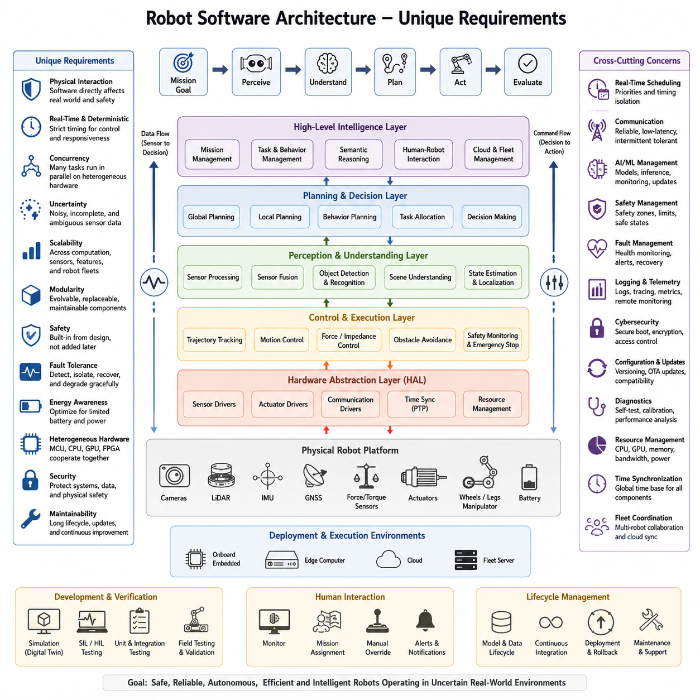
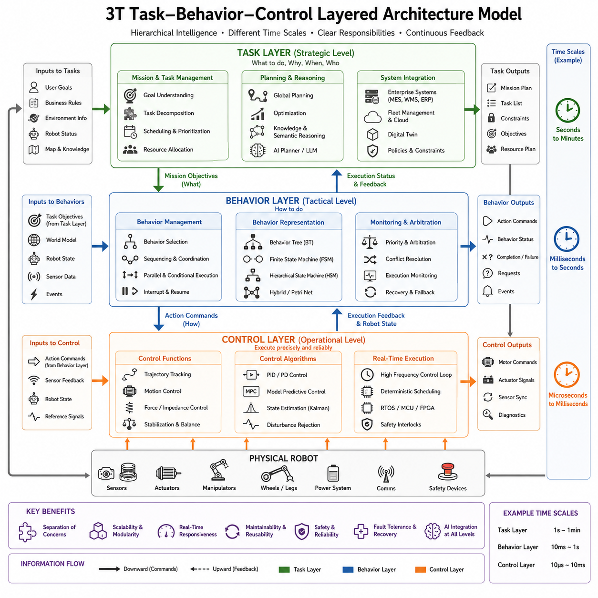
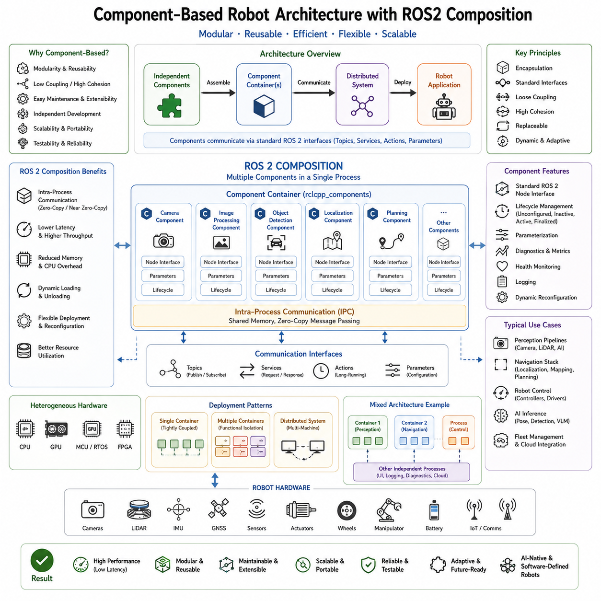
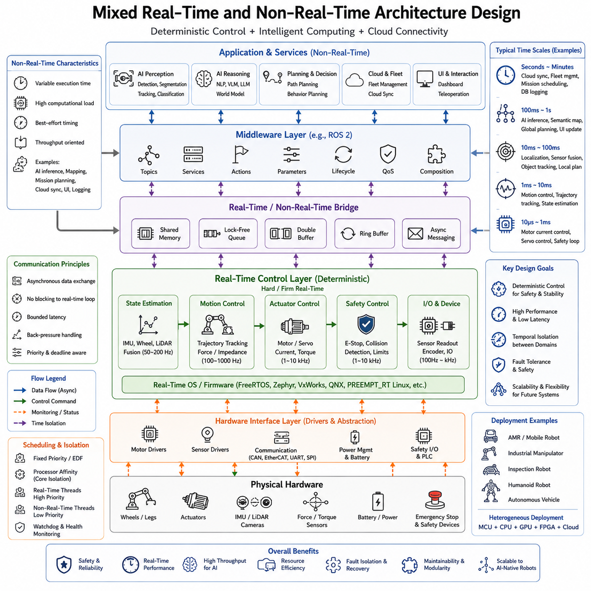
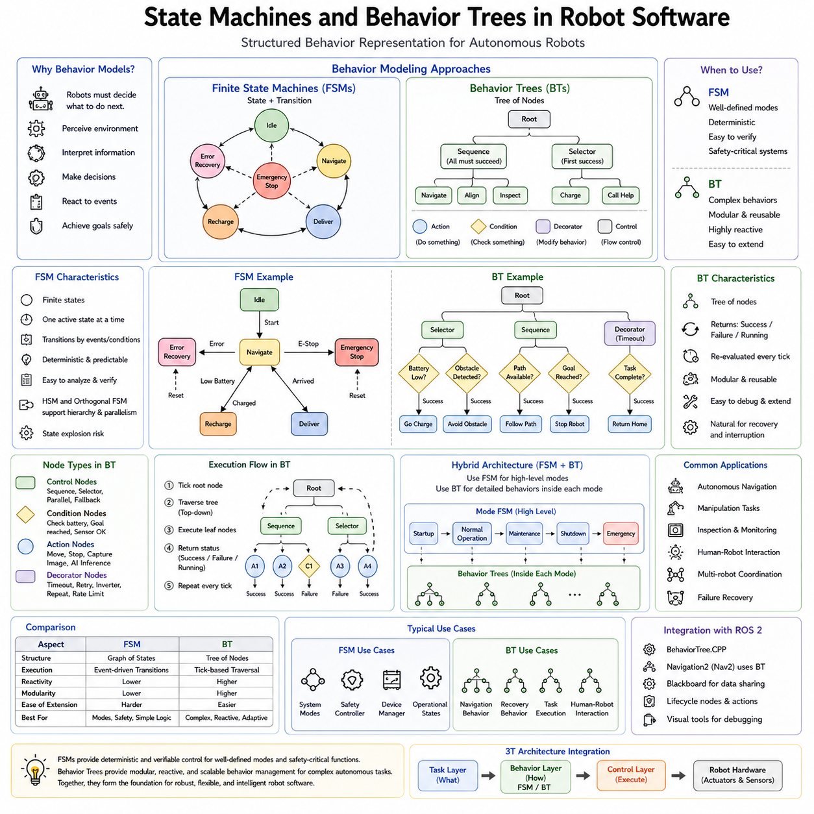
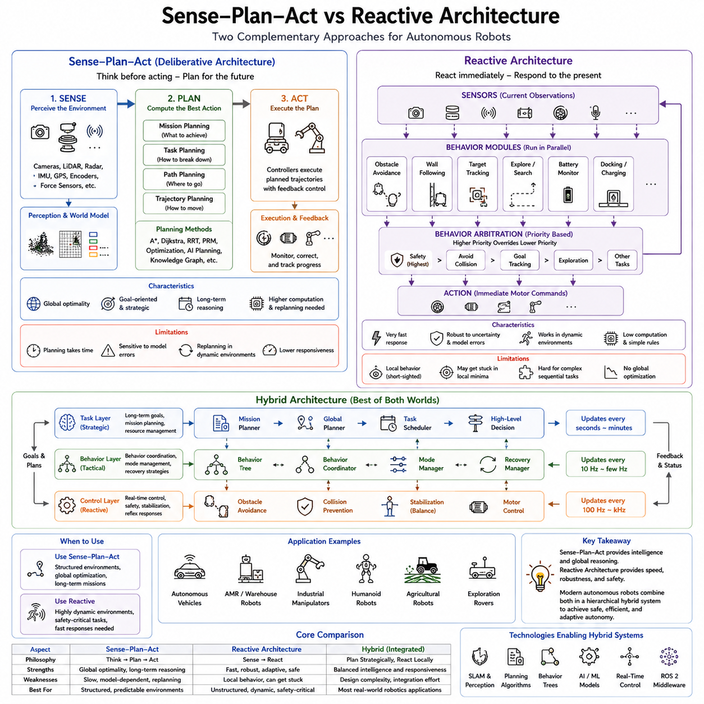
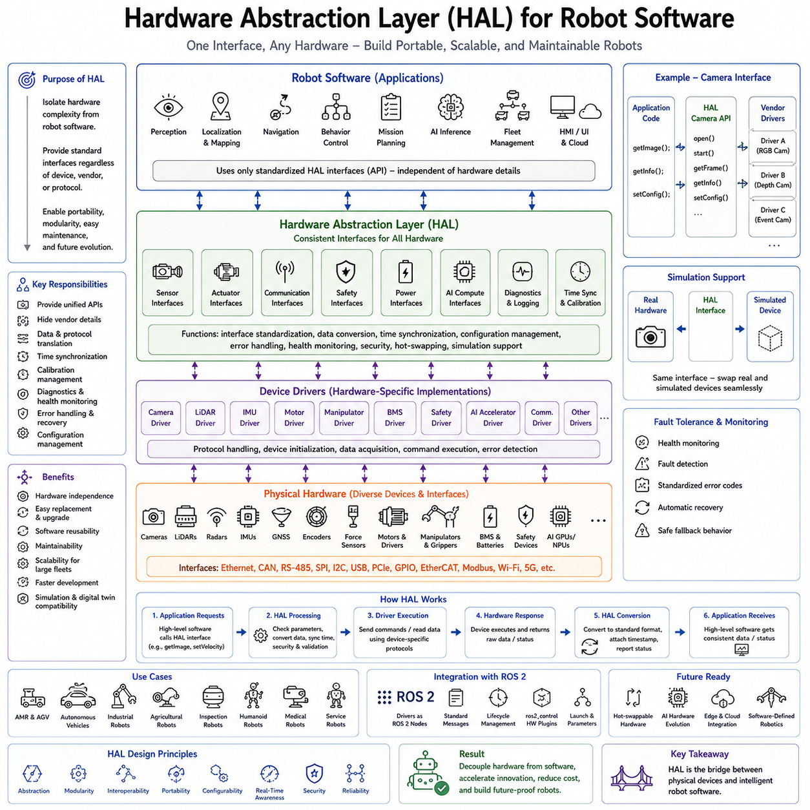
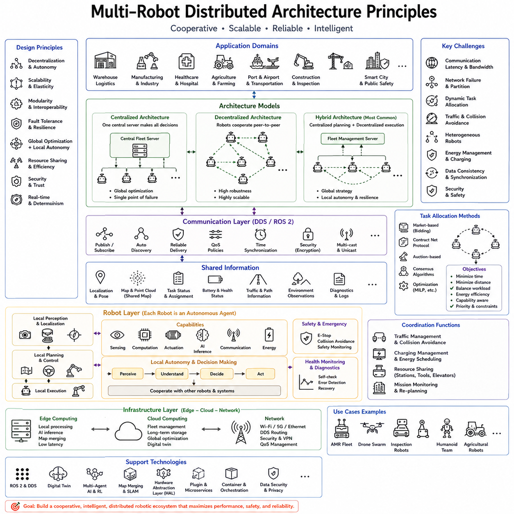
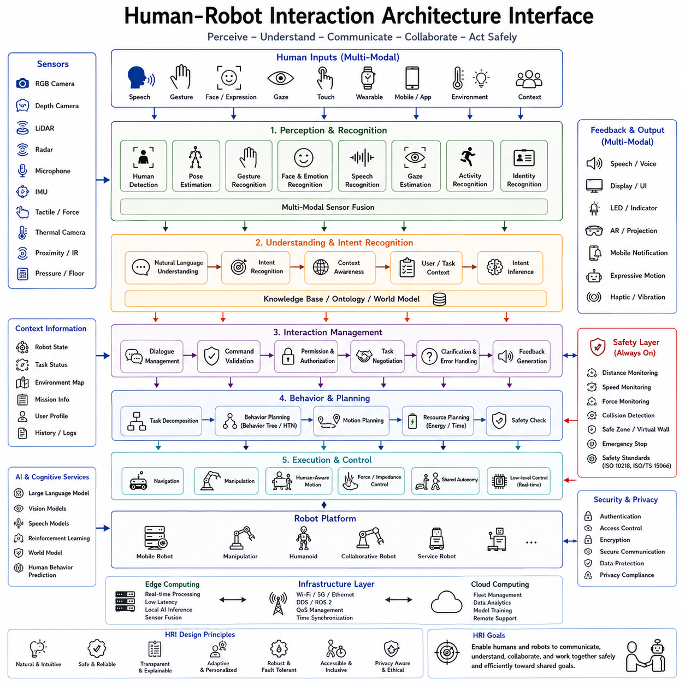
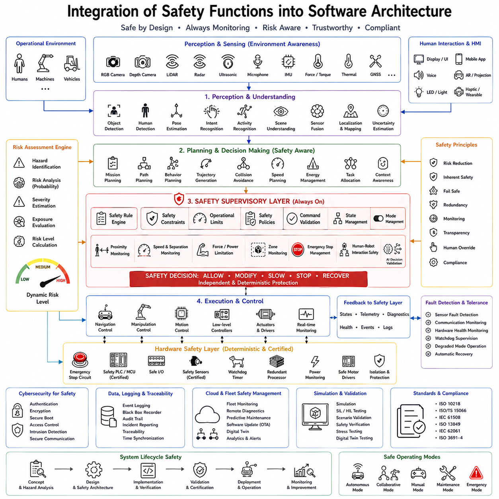

**Volume 1 Software Architecture Fundamentals**

# 06. Robotics Software Architecture

## 06.01 Unique Requirements of Robot Software Architecture

{width="7.268055555555556in" height="7.268055555555556in"}

Traditional software architecture was primarily designed for information systems, enterprise applications, web services, and cloud platforms whose primary responsibility was the manipulation of digital information. Robot software architecture, however, extends far beyond digital computation because every software decision eventually influences a physical machine operating in an unpredictable environment. Unlike conventional software, robot software continuously receives sensory information from the physical world, reasons about uncertain situations, makes autonomous decisions, and issues commands that immediately affect motors, actuators, manipulators, and mobile platforms. Consequently, robot software architecture must simultaneously satisfy computational efficiency, physical safety, deterministic timing, environmental adaptability, and long-term maintainability. These characteristics fundamentally distinguish robotics software from nearly every other category of software engineering.

The defining characteristic of robot software is its permanent interaction with the physical world. Enterprise software may process thousands of database transactions every second without directly influencing human safety, while robot software controls moving mechanical systems capable of transporting heavy payloads, operating industrial equipment, or interacting with humans in shared workspaces. Every software defect therefore possesses the potential to become a physical failure. An incorrect control command may cause a robot arm to collide with equipment, an autonomous mobile robot to strike an obstacle, or a medical robot to produce hazardous motion. Because software errors can propagate into physical damage, architecture must be designed under the assumption that failures will eventually occur and appropriate mechanisms must already exist to detect, isolate, recover from, or safely stop the system.

Robot software architecture must also accommodate continuous perception rather than discrete user requests. Most enterprise systems respond only after receiving a transaction from a user or another application. Robots instead operate within continuous perception loops where cameras, LiDARs, radars, depth sensors, IMUs, GNSS receivers, force sensors, tactile sensors, encoders, microphones, and numerous additional devices constantly generate new observations. These heterogeneous data streams differ significantly in sampling frequency, bandwidth, latency, synchronization accuracy, and reliability. The software architecture therefore requires carefully designed sensor pipelines capable of acquiring, timestamping, synchronizing, filtering, fusing, and distributing information throughout the system without introducing unacceptable delays.

Timing requirements represent another major distinction. Conventional software generally emphasizes throughput and scalability, whereas robot software must satisfy deterministic response times. Control algorithms frequently execute at frequencies ranging from hundreds of Hertz to several kilohertz. Motor controllers often require update periods measured in microseconds or milliseconds, while perception algorithms may process images at thirty to sixty frames per second, and planning modules may update trajectories several times per second. The architecture must therefore integrate hard real-time control, soft real-time perception, asynchronous planning, logging, visualization, cloud communication, and operator interfaces without allowing non-critical workloads to interfere with deterministic execution.

Concurrency is another unavoidable property of robotics software. A modern autonomous robot simultaneously performs localization, mapping, perception, object detection, semantic understanding, path planning, motion control, obstacle avoidance, battery management, diagnostics, communication, cybersecurity monitoring, user interaction, and cloud synchronization. These functions execute concurrently on heterogeneous computing hardware including microcontrollers, CPUs, GPUs, FPGAs, AI accelerators, and distributed edge devices. The architecture must define clear communication mechanisms, resource ownership, synchronization strategies, scheduling priorities, and isolation boundaries to prevent race conditions, deadlocks, resource starvation, and unpredictable execution behavior.

Another unique architectural requirement originates from uncertainty. Unlike business software operating within relatively controlled databases, robots perceive incomplete, noisy, ambiguous, and sometimes contradictory information. Cameras may experience poor illumination, LiDAR measurements may contain reflections, GNSS signals may become unavailable, wireless communication may be interrupted, and moving obstacles may behave unpredictably. Consequently, robot software architecture must incorporate probabilistic reasoning, confidence estimation, sensor redundancy, uncertainty propagation, and fault detection mechanisms throughout the entire processing pipeline. Instead of assuming perfect information, the architecture assumes that every observation contains some degree of uncertainty.

Scalability within robot software differs substantially from scalability in cloud computing. Cloud applications typically scale by adding computational resources to process larger numbers of requests. Robots must scale across multiple dimensions simultaneously. Computational workloads increase as perception models become more sophisticated. Sensor bandwidth expands as higher resolution devices are introduced. Fleet size grows from individual robots to hundreds or thousands of coordinated autonomous systems. Mission complexity increases through collaborative behaviors involving multiple heterogeneous robots. Architecture must therefore support computational scalability, communication scalability, functional scalability, and organizational scalability while preserving deterministic behavior for safety-critical components.

Modularity becomes especially important because robotic platforms evolve continuously throughout their operational lifetime. Sensors may be replaced, actuators upgraded, AI models retrained, navigation algorithms improved, communication technologies modernized, or entirely new manipulation capabilities introduced. Hardware abstraction layers, standardized interfaces, middleware services, message definitions, and component-based software organization enable these changes without requiring complete redesign of the overall system. Loose coupling and high cohesion therefore become essential architectural principles that facilitate long-term maintainability.

Robot software architecture must also integrate multiple abstraction layers operating at different temporal and functional scales. Low-level embedded controllers directly regulate electrical currents and actuator torque. Mid-level controllers coordinate joint motion, vehicle kinematics, localization, mapping, perception, and navigation. High-level reasoning systems perform mission planning, semantic understanding, human interaction, cloud connectivity, and AI-based decision making. Although these layers operate independently, they must cooperate through carefully designed interfaces that preserve abstraction while minimizing latency and communication overhead.

Safety requirements occupy a far more central architectural position than in most software domains. Functional safety cannot simply be added after implementation. Instead, safety mechanisms must influence architectural decisions from the earliest design stages. Emergency stop handling, watchdog monitoring, heartbeat supervision, redundant sensing, collision avoidance, speed limitation, safety zones, fault isolation, graceful degradation, and safe-state transitions should all be considered architectural capabilities rather than isolated application features. Every critical software component should define both its normal operating behavior and its behavior during abnormal conditions.

Fault tolerance likewise becomes an architectural necessity. Components inevitably fail because sensors become disconnected, communication networks experience packet loss, processors overheat, batteries become depleted, localization confidence decreases, or AI inference services exceed acceptable latency. Robot software architecture should therefore support redundancy, health monitoring, component restart, fallback algorithms, degraded operating modes, distributed supervision, and automatic recovery whenever possible. The objective is not merely preventing failures but ensuring that failures remain localized and predictable.

Energy awareness represents another characteristic that distinguishes robotics software from server-based applications. Robots possess finite battery capacity that directly influences mission duration, computational capability, thermal limits, and operational availability. Architecture should therefore support adaptive workload scheduling, power-aware AI inference, dynamic sensor activation, intelligent compute allocation, and mission optimization based upon remaining energy reserves. Computational efficiency becomes not only an optimization objective but also a functional requirement affecting operational success.

Thermal management similarly influences software architecture because embedded AI computers frequently operate under strict temperature constraints. Intensive GPU inference, continuous sensor processing, and high-performance mapping algorithms generate substantial heat that may reduce processor frequency through thermal throttling. Architectural strategies including workload distribution, edge-cloud partitioning, asynchronous inference scheduling, dynamic model selection, and adaptive resource allocation help maintain acceptable thermal conditions while preserving application performance.

Communication architecture must also accommodate highly heterogeneous networking environments. Robots may transition between Ethernet, Wi-Fi, 5G, LTE, private industrial wireless networks, satellite communication, or complete communication loss. Consequently, robot software cannot assume continuous network connectivity. Local autonomy, intermittent synchronization, delayed message delivery, store-and-forward communication, eventual consistency, and resilient edge operation become essential architectural principles. A robot should remain operational even when disconnected from centralized infrastructure.

Modern robots increasingly incorporate artificial intelligence as a primary architectural element rather than an isolated application. Deep neural networks perform perception, language understanding, manipulation planning, anomaly detection, predictive maintenance, and autonomous reasoning. AI components introduce additional architectural requirements including model lifecycle management, inference scheduling, hardware acceleration, uncertainty estimation, dataset versioning, model rollback, online monitoring, explainability, and continuous deployment. Traditional software modules and AI models must coexist within a unified architecture despite fundamentally different execution characteristics.

Hardware heterogeneity further differentiates robot software architecture. Embedded microcontrollers execute deterministic control loops, Linux computers perform high-level coordination, GPUs accelerate deep learning inference, DSPs process sensor signals, and cloud servers perform large-scale analytics or fleet optimization. The architecture must distribute functionality according to computational characteristics while minimizing communication latency and preserving deterministic behavior where required. Proper partitioning between embedded systems, edge computing, and cloud infrastructure significantly influences overall system performance.

Robotic systems also require precise temporal synchronization across distributed sensing devices. Cameras, LiDARs, IMUs, GNSS receivers, wheel encoders, radar sensors, and external measurement systems frequently operate with independent clocks. Accurate sensor fusion requires timestamp consistency through protocols such as Precision Time Protocol or hardware-trigger synchronization. Architectural support for unified timing enables reliable localization, perception, mapping, and sensor fusion under dynamic operating conditions.

Verification and validation requirements are substantially more demanding because robot behavior emerges from interactions among software, hardware, environment, and human operators. Testing must therefore progress through multiple stages including unit testing, integration testing, software-in-the-loop simulation, hardware-in-the-loop validation, digital twin experimentation, field testing, stress testing, fault injection, long-duration endurance evaluation, and safety certification. The architecture should facilitate observability by providing comprehensive logging, tracing, telemetry, replay capability, diagnostics, and performance measurement throughout every subsystem.

Human-robot interaction introduces additional architectural complexity. Operators require intuitive interfaces for monitoring robot health, assigning missions, visualizing sensor data, overriding autonomous behavior, responding to alarms, and analyzing historical performance. Architecture should separate presentation logic from autonomy while maintaining secure, reliable, and low-latency communication between operators and robotic platforms. Multiple users with different authorization levels may simultaneously interact with robots through local interfaces, web dashboards, mobile applications, or fleet management systems.

Cybersecurity has become inseparable from robot architecture because robots increasingly operate as network-connected cyber-physical systems. Secure boot, encrypted communication, authenticated software updates, hardware identity, access control, intrusion detection, runtime integrity verification, certificate management, and zero-trust communication should be integrated throughout the architecture. Security mechanisms must protect not only digital assets but also physical safety by preventing unauthorized control of autonomous machines.

Maintainability remains one of the most important long-term architectural objectives. Industrial robots often remain operational for ten years or longer while continuously receiving software updates, hardware replacements, AI model improvements, and new functional capabilities. Well-defined interfaces, standardized middleware, modular component design, configuration management, version compatibility, continuous integration, automated testing, and documentation collectively reduce lifecycle costs while improving reliability and upgrade flexibility.

Finally, robot software architecture should be viewed not merely as the organization of software modules but as the complete structural foundation of an intelligent cyber-physical system. It must integrate computation, communication, perception, control, artificial intelligence, safety, reliability, maintainability, scalability, cybersecurity, and human interaction into a coherent engineering framework capable of operating continuously within uncertain physical environments. Unlike conventional software architecture, which primarily manages information flow, robot software architecture governs both information flow and physical behavior simultaneously. This dual responsibility makes robotics software architecture one of the most demanding disciplines within modern software engineering and establishes the foundation upon which autonomous mobile robots, industrial manipulators, humanoids, service robots, collaborative robots, and future Physical AI systems are built.

## 06.02 3T Task-Behavior-Control Layered Architecture Model

{width="7.268055555555556in" height="7.268055555555556in"}

The rapid evolution of autonomous robots has significantly increased the complexity of robot software. Modern robots no longer execute simple repetitive motions but instead perceive dynamic environments, interpret semantic information, plan missions, coordinate multiple subsystems, interact with humans, and continuously adapt their behavior according to changing situations. As robotic systems become increasingly intelligent, software architecture must provide a clear separation of responsibilities while maintaining efficient communication between decision-making, behavioral coordination, and low-level control. One of the most influential architectural approaches developed to address these challenges is the **3T (Task-Behavior-Control) Layered Architecture Model**, which organizes robot intelligence into three hierarchical layers that operate at different temporal and functional levels.

The 3T architecture was originally proposed to bridge the gap between high-level symbolic reasoning and low-level reactive control. Earlier robot architectures often relied exclusively on centralized planning or purely reactive behaviors. Deliberative architectures generated complete plans before execution but struggled to respond to unexpected environmental changes. Reactive architectures responded quickly to sensor inputs but lacked long-term planning and mission-level reasoning. The 3T model integrates the advantages of both approaches by introducing an intermediate behavioral layer that connects strategic mission planning with real-time control. This layered organization enables robots to remain both goal-oriented and highly responsive.

The highest layer of the architecture is the **Task Layer**, which represents the deliberative intelligence of the robotic system. This layer focuses on mission planning, task decomposition, global reasoning, resource allocation, and long-term decision making. Instead of directly controlling motors or processing raw sensor data, the Task Layer interprets user objectives and converts them into executable missions. It reasons about priorities, constraints, available resources, environmental knowledge, operational policies, and overall mission objectives.

The Task Layer typically operates on time scales measured in seconds or even minutes because strategic decisions rarely require millisecond responsiveness. Examples include assigning warehouse delivery missions to autonomous mobile robots, determining the inspection order of industrial equipment, planning cleaning routes for service robots, scheduling collaborative robot operations in manufacturing cells, or allocating inspection tasks across an entire robot fleet. These planning activities involve optimization algorithms, symbolic reasoning, knowledge graphs, semantic maps, AI planners, scheduling engines, and mission management software.

Within this layer, robot software frequently interacts with enterprise systems such as Manufacturing Execution Systems (MES), Warehouse Management Systems (WMS), Enterprise Resource Planning (ERP), fleet management platforms, cloud orchestration systems, and digital twins. The Task Layer therefore represents the primary interface between business objectives and robotic execution. Rather than controlling individual movements, it answers questions such as what should be done, why it should be done, when execution should begin, and which robot should perform each mission.

Once strategic objectives have been determined, responsibility shifts to the **Behavior Layer**, which forms the core of the 3T architecture. This layer acts as an intelligent coordinator that translates abstract missions into concrete robot behaviors. It determines how individual actions should be organized, sequenced, monitored, interrupted, resumed, or modified according to changing environmental conditions.

Unlike the Task Layer, which reasons symbolically, the Behavior Layer reasons operationally. It continuously observes both internal robot states and external environmental conditions while coordinating multiple behavioral modules. This layer often employs Finite State Machines (FSM), Hierarchical State Machines (HSM), Behavior Trees (BT), Hybrid Automata, Petri Nets, or AI-based policy managers to represent complex execution logic.

Behavior management becomes particularly important because robots rarely perform isolated actions. A simple warehouse delivery mission may require localization, obstacle avoidance, elevator usage, door communication, battery monitoring, docking, payload handling, confirmation with cloud services, and return navigation. The Behavior Layer coordinates these activities while responding dynamically to unforeseen events such as blocked pathways, temporary communication failures, moving obstacles, or emergency stop requests.

Behavior arbitration is another critical responsibility. Multiple behaviors may compete simultaneously for control of the robot. Obstacle avoidance may conflict with trajectory tracking. Emergency stop may override manipulation tasks. Battery charging may interrupt normal operations. Human safety behaviors may temporarily suspend autonomous navigation. The Behavior Layer continuously prioritizes these competing objectives while maintaining system stability and mission continuity.

Behavior execution also requires continuous monitoring of execution progress. Each behavior reports its operational status, including initialization, execution, completion, failure, timeout, interruption, recovery, or cancellation. These execution states allow higher-level mission planners to make informed decisions regarding replanning, task reassignment, or mission termination.

The lowest layer is the **Control Layer**, which directly interacts with robot hardware and physical processes. This layer is responsible for deterministic real-time execution of motion commands, actuator control, sensor acquisition, trajectory tracking, force regulation, stabilization, motor synchronization, and feedback control. Unlike higher layers that operate with symbolic information, the Control Layer processes continuous numerical signals and executes control algorithms with strict timing requirements.

Control loops typically execute at frequencies ranging from hundreds to several thousands of Hertz. Motion controllers continuously compute actuator commands using sensor feedback from encoders, IMUs, force sensors, torque sensors, wheel odometry, joint position sensors, and various hardware interfaces. Algorithms such as PID control, Model Predictive Control (MPC), impedance control, adaptive control, feedforward compensation, disturbance rejection, and state estimation are commonly implemented within this layer.

Deterministic execution is absolutely essential because even small timing variations may produce unstable robot behavior. Consequently, the Control Layer frequently operates on real-time operating systems, embedded microcontrollers, FPGA-based controllers, or PREEMPT_RT Linux environments. Hardware interrupts, deterministic scheduling, real-time communication buses, and synchronized clocks ensure consistent execution timing.

Although the three layers perform different responsibilities, they must cooperate continuously through well-defined interfaces. The Task Layer generates high-level objectives and delegates them to the Behavior Layer. The Behavior Layer transforms those objectives into coordinated behavioral sequences while monitoring execution. The Control Layer executes low-level commands and provides continuous feedback regarding robot state, actuator performance, and environmental interaction. Information flows upward while commands flow downward, establishing a bidirectional control hierarchy.

One of the greatest strengths of the 3T architecture lies in temporal separation. Strategic planning, behavioral coordination, and motor control naturally require different execution frequencies. Separating these activities prevents computationally expensive planning algorithms from interfering with deterministic control loops while allowing each layer to optimize independently according to its timing requirements.

Functional separation also significantly improves software maintainability. Modifications to mission planning algorithms rarely affect motor controllers. Improvements in obstacle avoidance do not require redesigning enterprise task schedulers. New robotic hardware can often be integrated by replacing components within the Control Layer while preserving higher-level mission logic. This modularity substantially reduces lifecycle maintenance costs and accelerates system evolution.

The architecture also supports heterogeneous computing platforms. High-level AI planning may execute on cloud servers or powerful edge GPUs. Behavioral coordination typically runs on Linux-based robot computers using middleware such as ROS2. Deterministic control executes on embedded controllers, real-time processors, or motor control units. This computational partitioning enables efficient utilization of specialized hardware while minimizing unnecessary communication latency.

Modern implementations increasingly integrate artificial intelligence within all three layers. At the Task Layer, Large Language Models (LLMs), Large Action Models (LAMs), knowledge graphs, semantic planners, and reinforcement learning systems assist mission planning and decision making. Within the Behavior Layer, AI policies, learned behavior arbitration, adaptive task sequencing, and online optimization improve execution flexibility. At the Control Layer, neural network controllers, adaptive parameter estimation, learned dynamics compensation, and AI-assisted fault detection enhance low-level control performance without compromising deterministic safety mechanisms.

Behavior Trees have become particularly popular within the Behavior Layer because they provide modularity, reusability, readability, and hierarchical organization. Unlike finite state machines that become increasingly complex as transitions multiply, Behavior Trees naturally represent fallback strategies, parallel execution, conditional evaluation, and recovery behaviors. Consequently, many modern autonomous mobile robots, industrial inspection robots, service robots, and humanoids employ Behavior Trees as the central execution engine of the intermediate layer.

The 3T architecture is especially valuable for autonomous mobile robots operating in dynamic environments. Consider an industrial inspection robot assigned to inspect multiple production stations. The Task Layer determines the inspection schedule based on production priorities. The Behavior Layer coordinates navigation, localization, docking, safety monitoring, sensor activation, image acquisition, AI inference, report generation, and communication with cloud systems. The Control Layer executes wheel control, steering commands, obstacle avoidance trajectories, actuator movements, and sensor synchronization in real time. Each layer focuses exclusively on responsibilities appropriate to its level of abstraction.

Similarly, warehouse logistics robots benefit from the separation of concerns provided by the architecture. Fleet optimization algorithms assign transportation tasks at the Task Layer. Behavioral modules coordinate navigation, elevator usage, automatic door interaction, charging decisions, and collision avoidance. Motor controllers execute precise wheel velocity commands while continuously compensating for disturbances and wheel slip.

Industrial manipulators also demonstrate the effectiveness of this model. Production management software defines assembly objectives at the Task Layer. Behavioral coordination manages grasping, tool changes, safety verification, visual inspection, and force-controlled assembly sequences. Servo controllers regulate joint positions, velocities, torque outputs, and force feedback with deterministic timing at the Control Layer.

Humanoid robots further illustrate the importance of layered intelligence because they simultaneously perform locomotion, manipulation, language interaction, perception, social communication, balance control, and whole-body coordination. High-level conversational objectives originate within the Task Layer, interaction behaviors are coordinated by the Behavior Layer, and balance, gait generation, and joint stabilization execute within the Control Layer. The separation prevents conversational reasoning from interfering with dynamic balance control, which requires millisecond-level responsiveness.

Fault tolerance is naturally supported within the layered architecture. The Control Layer continuously monitors actuator health, sensor status, communication integrity, and execution timing. When abnormalities occur, diagnostic information is propagated upward to the Behavior Layer, which determines appropriate recovery strategies such as retrying operations, selecting alternative behaviors, entering degraded operating modes, or requesting human intervention. If mission objectives can no longer be achieved safely, the Task Layer may terminate or replan the mission while maintaining overall operational consistency.

Safety mechanisms also benefit from the hierarchical organization. Immediate emergency responses, including emergency stop activation, collision prevention, torque limitation, and speed restriction, remain within the Control Layer to guarantee deterministic response. Operational safety policies, such as safe navigation around humans, restricted-area enforcement, and collaborative operation management, reside within the Behavior Layer. Organizational safety policies, including mission authorization, access control, scheduling restrictions, and regulatory compliance, are managed by the Task Layer. This distribution ensures that safety decisions occur at the most appropriate level while avoiding unnecessary delays.

Communication between layers should remain asynchronous whenever possible to minimize blocking behavior and improve robustness. Message-oriented middleware, publish-subscribe communication, event-driven coordination, shared world models, and service-oriented interfaces enable each layer to evolve independently without creating excessive coupling. Standardized interfaces also simplify testing, simulation, hardware replacement, and future architectural evolution.

Simulation and verification become significantly easier because each layer can be validated independently before full system integration. Mission planning algorithms may be tested through software simulation, behavioral logic through digital twins and scenario replay, and control algorithms through hardware-in-the-loop testing. Layer-specific verification reduces debugging complexity while improving confidence in overall system reliability.

Scalability represents another major advantage of the architecture. As robotic capabilities expand, additional planning modules, behavioral components, or control algorithms can be integrated without requiring complete redesign. New AI perception modules, collaborative behaviors, cloud orchestration services, fleet intelligence, digital twin synchronization, or predictive maintenance systems can be incorporated into the appropriate layer while preserving existing functionality.

The emergence of Physical AI further reinforces the relevance of the 3T architecture. Future robots increasingly integrate foundation models, world models, vision-language-action systems, semantic reasoning engines, and lifelong learning capabilities. These advanced AI systems naturally align with the Task Layer for high-level reasoning, the Behavior Layer for adaptive execution, and the Control Layer for deterministic physical interaction. Rather than replacing the layered model, AI extends its capabilities by improving decision quality, behavioral flexibility, and control precision while preserving architectural clarity.

Ultimately, the 3T Task-Behavior-Control Layered Architecture Model remains one of the most effective organizational frameworks for intelligent robotic software because it balances deliberative reasoning, adaptive behavioral coordination, and deterministic real-time control within a coherent hierarchical structure. By clearly separating strategic mission management, operational behavior execution, and hardware-level control, the architecture enables robotic systems to achieve scalability, maintainability, safety, responsiveness, and long-term extensibility. As autonomous robots continue evolving toward AI-native Physical Intelligence systems, the 3T architecture provides a robust architectural foundation capable of supporting increasingly complex autonomous behaviors while maintaining predictable, safe, and reliable interaction with the physical world.

## 06.03 Component-Based Robot Architecture: ROS2 Composition

{width="7.268055555555556in" height="7.268055555555556in"}

As robotic systems continue to increase in complexity, traditional monolithic software architectures become increasingly difficult to maintain, extend, test, and optimize. Modern robots simultaneously perform perception, localization, mapping, planning, control, artificial intelligence inference, communication, diagnostics, cloud connectivity, and human interaction. Developing these diverse functions within a single executable rapidly leads to tightly coupled software, excessive dependencies, inefficient resource utilization, and reduced maintainability. To overcome these limitations, modern robotics has increasingly adopted **Component-Based Software Architecture (CBSA)**, in which complex robot functionality is decomposed into reusable, independent software components. Within the ROS2 ecosystem, this architectural philosophy is realized through **ROS2 Composition**, a mechanism that enables multiple software components to execute efficiently within a common runtime while preserving modularity and isolation.

Component-Based Architecture is founded on the principle that every major robotic capability should exist as an independent software module with clearly defined interfaces, explicit responsibilities, and minimal coupling to other modules. Each component encapsulates its own internal implementation while exposing standardized communication interfaces through topics, services, actions, or parameters. Other components interact only through these public interfaces rather than relying upon implementation details. This separation significantly improves software maintainability while allowing individual components to evolve independently.

The concept resembles modular hardware engineering. Just as electrical engineers replace individual sensors or controllers without redesigning an entire robot, software engineers should replace perception algorithms, localization systems, planning modules, or AI inference engines without affecting unrelated parts of the software stack. Component-based architecture therefore treats software functionality as interchangeable building blocks rather than permanently interconnected code.

ROS2 was specifically designed to support highly modular robotics software. Unlike earlier monolithic robotics frameworks, ROS2 introduces composition mechanisms that enable multiple nodes to coexist within a single process while maintaining logical independence. This capability provides significant performance improvements compared to launching every node as an independent operating system process.

In classical ROS architectures, each node executes as an individual process with its own memory space, communication buffers, scheduling context, and operating system overhead. While this model provides excellent fault isolation, it also introduces communication latency due to serialization, deserialization, inter-process communication, context switching, and duplicated memory allocations. As robots become increasingly dependent upon high-bandwidth sensors such as multiple cameras, LiDARs, depth sensors, and AI inference pipelines, these communication costs become substantial.

ROS2 Composition addresses these challenges by allowing multiple components to execute inside a common executable process known as a **Component Container**. Although components remain logically independent, they share memory resources and communicate through highly optimized intra-process communication mechanisms. Data can often be transferred without repeated serialization or memory copying, substantially reducing CPU utilization and communication latency.

At the center of ROS2 Composition lies the concept of the **Component** itself. A component is a dynamically loadable software module that inherits from the standard ROS2 node interface while exposing additional metadata required for runtime loading. Instead of compiling every node into a fixed executable, developers compile reusable shared libraries that may later be loaded into various runtime environments depending on application requirements.

Dynamic loading introduces tremendous flexibility. The same localization component may operate within simulation, laboratory testing, industrial deployment, or cloud-assisted environments without recompilation. Components become reusable software assets that can be assembled into different robot configurations according to mission requirements.

A Component Container serves as the runtime environment responsible for loading, executing, monitoring, and unloading multiple components. Containers may host only a few tightly coupled modules or dozens of interacting components depending upon computational resources and system architecture. Developers may create multiple containers to separate safety-critical modules from AI inference workloads or to distribute computation across heterogeneous processors.

This organization introduces an additional architectural level between individual nodes and complete robotic systems. Rather than viewing software only as collections of processes, ROS2 Composition organizes systems into reusable components grouped within containers that collectively form distributed robotic applications.

One of the most significant advantages of composition is **Intra-Process Communication (IPC)** optimization. Traditional inter-process communication requires message serialization before transmission and deserialization upon reception. Large sensor messages, particularly high-resolution images or point clouds, consume considerable computational resources during this process.

Within a composed container, publishers and subscribers often exchange shared pointers directly without serializing data. This technique, commonly referred to as zero-copy or near zero-copy communication depending on middleware implementation, dramatically reduces memory bandwidth, processor utilization, and communication latency. Real-time perception pipelines therefore achieve significantly higher throughput than equivalent multi-process implementations.

For example, consider a perception pipeline consisting of camera acquisition, image rectification, object detection, semantic segmentation, tracking, and visualization. In traditional process-based execution, each stage repeatedly serializes and copies large image buffers. Under ROS2 Composition, these modules may execute inside one container while exchanging image references through optimized memory mechanisms, reducing latency while preserving modular organization.

Component-based architecture also improves resource utilization. Individual operating system processes require separate memory allocations, scheduling structures, synchronization objects, communication buffers, and runtime environments. Large robotic systems may contain hundreds of nodes, producing considerable operating system overhead. Composition reduces duplicated infrastructure by allowing components to share common runtime resources while maintaining independent execution logic.

Another major advantage involves startup flexibility. Instead of statically determining which software modules belong to each executable during compilation, components may be loaded dynamically at runtime according to mission requirements. Inspection robots may activate additional AI analysis components only when approaching inspection targets. Service robots may dynamically load speech processing modules when interacting with humans. Autonomous vehicles may enable computationally intensive mapping modules only during exploration phases.

Dynamic composition also supports adaptive system reconfiguration. Future AI-native robots will increasingly modify software configurations while operating. Components may be replaced with newer AI models, upgraded perception algorithms, alternative localization systems, or mission-specific planners without restarting the complete robotic application. This capability aligns closely with Software-Defined Robotics and continuous deployment architectures.

ROS2 Composition integrates naturally with object-oriented software engineering principles. Each component encapsulates its internal data structures, algorithms, configuration parameters, lifecycle states, and communication interfaces. Public APIs define interactions with external components while implementation details remain hidden. This encapsulation simplifies maintenance because modifications inside one component rarely propagate throughout the remainder of the system.

Loose coupling represents another essential design objective. Components should communicate only through standardized ROS interfaces rather than directly invoking one another\'s internal functions. Topics provide asynchronous data streams, services support request-response interactions, actions enable long-running operations, and parameters allow runtime configuration. These communication abstractions prevent unnecessary dependencies while improving software portability.

High cohesion is equally important. Every component should perform one clearly defined responsibility. A localization component estimates robot pose. A mapping component constructs environmental maps. A planning component computes trajectories. A motor controller regulates actuator commands. Components performing unrelated responsibilities should generally remain separate because single-purpose modules are easier to understand, verify, optimize, and reuse.

Component granularity requires careful architectural consideration. Components that are excessively large resemble monolithic applications and reduce reuse. Components that are excessively small produce unnecessary communication overhead and management complexity. Appropriate granularity usually corresponds to stable functional boundaries such as perception, localization, mapping, planning, navigation, diagnostics, or hardware abstraction.

Hardware abstraction naturally benefits from component-based organization. Device drivers, sensor interfaces, actuator controllers, communication gateways, GNSS receivers, LiDAR interfaces, cameras, IMUs, force sensors, battery management systems, and industrial fieldbus interfaces each become independent hardware abstraction components. Higher-level software remains completely independent of specific hardware implementations because interaction occurs exclusively through standardized interfaces.

Component-based design also facilitates heterogeneous computing. Computationally intensive AI inference components may execute on GPU-equipped edge computers while deterministic control components execute on embedded microcontrollers or real-time processors. Middleware transparently manages communication across distributed hardware while preserving consistent software interfaces. This architectural flexibility allows developers to optimize computational placement according to latency, bandwidth, thermal constraints, power consumption, and hardware availability.

ROS2 Lifecycle Nodes integrate effectively with component-based architecture by introducing managed execution states. Components transition through well-defined lifecycle phases including unconfigured, inactive, active, finalized, and shutdown states. This explicit lifecycle management enables deterministic startup sequences, controlled activation, safe shutdown procedures, and fault recovery. Safety-critical robotic systems particularly benefit because hardware initialization, sensor calibration, and communication establishment occur under controlled conditions.

Fault isolation remains an important architectural consideration. While composition improves communication efficiency, multiple components executing inside one process also share process-level failure risks. A fatal software error within one component may terminate the entire container. Consequently, architects frequently separate safety-critical controllers, AI inference modules, visualization software, and experimental algorithms into different containers based upon reliability requirements. This hybrid deployment strategy balances communication efficiency with fault containment.

Modern robotic systems therefore often employ mixed architectures combining both composed and independent processes. High-bandwidth perception pipelines execute within composed containers to minimize latency. Safety controllers execute separately for maximum reliability. User interfaces operate independently to avoid influencing real-time computation. Cloud communication modules remain isolated because network failures should never compromise deterministic robot control.

Testing and verification become significantly simpler under component-based architecture. Individual components may undergo unit testing independently before integration. Mock communication interfaces replace physical hardware during automated testing. Simulation environments substitute sensor components without modifying higher-level algorithms. Hardware-in-the-loop validation focuses exclusively on low-level control components while perception algorithms execute using recorded sensor datasets. This modular verification process substantially improves software quality while reducing debugging complexity.

Continuous Integration and Continuous Deployment workflows also benefit. Independent components compile separately, maintain individual version histories, and undergo isolated regression testing. Software updates affect only modified components rather than rebuilding complete robotic applications. Package managers distribute reusable binary components across multiple robot platforms while maintaining consistent dependency management.

Large industrial robotics projects frequently involve multiple development teams working simultaneously. Component-based architecture naturally supports parallel software development because perception engineers, navigation specialists, AI researchers, cloud developers, safety engineers, and hardware teams may develop independent components concurrently while interacting through stable interface definitions. Clear interface contracts reduce integration conflicts and accelerate collaborative development.

Artificial Intelligence introduces additional motivations for component-based robotics architecture. AI models evolve much faster than traditional software. Object detection networks, foundation models, language models, semantic mapping systems, reinforcement learning policies, and visual localization algorithms are continuously retrained and updated. Encapsulating each AI capability within independent components allows model replacement without modifying surrounding software infrastructure.

ROS2 Composition also supports runtime parameterization. Each component exposes configurable parameters controlling algorithm behavior, hardware interfaces, calibration values, operational limits, AI thresholds, communication settings, and diagnostic options. Runtime parameter modification enables adaptive behavior without recompilation while supporting automated configuration management across large robot fleets.

Observability becomes another architectural strength. Every component independently publishes diagnostic information, performance metrics, execution timing, resource utilization, health status, and operational events. Fleet management systems aggregate these distributed telemetry streams to monitor entire robot populations. Performance bottlenecks become easier to identify because each component reports independent operational statistics.

Cybersecurity considerations similarly benefit from component isolation. Authentication, authorization, encrypted communication, certificate management, secure parameter storage, and access control policies may be implemented independently for sensitive components. Security boundaries align naturally with functional boundaries, reducing attack surfaces while improving maintainability.

Component reuse extends beyond individual robots. Common localization components may operate across autonomous mobile robots, warehouse systems, agricultural robots, outdoor inspection platforms, quadrupeds, humanoids, and collaborative manipulators. Hardware-specific drivers remain isolated while higher-level navigation, perception, planning, and AI components remain platform independent. This software reuse dramatically reduces development effort for new robotic platforms.

The architecture further supports simulation-to-real transfer. During simulation, hardware interface components communicate with virtual sensors and simulated actuators. During physical deployment, only hardware abstraction components change while perception, planning, behavior coordination, navigation, AI inference, and mission management components remain identical. This separation substantially accelerates validation while reducing deployment risks.

Future Software-Defined Robots will increasingly depend upon component-based architectures. Runtime software updates, over-the-air deployment, AI model replacement, adaptive mission configuration, cloud-assisted optimization, and autonomous software evolution all require modular software structures capable of dynamic reconfiguration. ROS2 Composition provides the underlying execution model supporting these capabilities while preserving deterministic communication and efficient resource utilization.

The emergence of Physical AI further amplifies the importance of component-based software engineering. Foundation models, Vision-Language-Action systems, world models, semantic planners, multimodal perception pipelines, digital twins, fleet intelligence, and distributed AI services naturally become independent reusable components integrated through standardized middleware interfaces. Their computational demands vary significantly, making dynamic composition essential for efficient execution across CPUs, GPUs, edge computers, and cloud infrastructure.

Ultimately, Component-Based Robot Architecture implemented through ROS2 Composition represents one of the most important advances in modern robotics software engineering. By combining modular software organization, standardized communication interfaces, efficient intra-process messaging, dynamic runtime composition, hardware abstraction, lifecycle management, and scalable deployment strategies, ROS2 Composition enables developers to build robotic systems that are maintainable, reusable, scalable, high-performance, and adaptable to rapidly evolving AI technologies. As autonomous robots continue growing in functional complexity, component-based architecture will remain a foundational principle supporting the next generation of intelligent, AI-native, and software-defined robotic systems.

## 06.04 Mixed Real-Time and Non-Real-Time Architecture Design

{width="7.268055555555556in" height="7.268055555555556in"}

Modern robotic systems have evolved into highly sophisticated cyber-physical platforms that simultaneously execute deterministic control algorithms, computationally intensive artificial intelligence, distributed communication, cloud connectivity, human interaction, and long-term mission planning. These diverse functions possess fundamentally different timing requirements and computational characteristics. While low-level motor control may require deterministic execution every few hundred microseconds, AI perception algorithms often tolerate processing delays measured in tens of milliseconds, and cloud synchronization or mission scheduling may operate at intervals of several seconds or even minutes. Designing a single software architecture capable of supporting these vastly different execution models represents one of the most challenging problems in robotics software engineering. Consequently, modern robotic platforms increasingly adopt **Mixed Real-Time and Non-Real-Time Architecture**, an architectural paradigm that combines deterministic control systems with general-purpose computing while preserving both safety and computational efficiency.

The distinction between real-time and non-real-time computing extends beyond execution speed. Real-time systems are characterized not merely by fast execution but by predictable timing. A computation that consistently completes within one millisecond is often preferable to another that usually completes in one hundred microseconds but occasionally requires five milliseconds. Deterministic behavior is therefore considerably more important than average execution speed. Robot control algorithms depend upon consistent update intervals because irregular timing introduces instability, degraded tracking accuracy, oscillation, or even unsafe physical behavior.

Real-time systems are generally classified into hard real-time, firm real-time, and soft real-time categories. Hard real-time tasks possess absolute deadlines that must never be violated. Missing even a single deadline may produce catastrophic system failure. Examples include motor current regulation, actuator synchronization, braking control, collision avoidance safety circuits, emergency stop processing, and certain industrial motion controllers. These tasks frequently execute within embedded microcontrollers, programmable logic controllers, FPGA-based controllers, or real-time operating systems specifically designed to guarantee deterministic scheduling.

Firm real-time tasks tolerate occasional missed deadlines but discard computations that arrive too late to remain useful. Localization updates, obstacle tracking, sensor fusion, trajectory generation, and visual servoing frequently belong to this category. Missing isolated updates may slightly reduce performance without causing immediate system failure, provided the next computation arrives on schedule.

Soft real-time tasks possess timing objectives rather than absolute deadlines. Delayed execution may reduce system responsiveness but rarely causes catastrophic failure. Examples include AI object detection, semantic mapping, natural language processing, cloud synchronization, fleet coordination, telemetry, diagnostics, user interface updates, and mission planning. These applications benefit from low latency but generally prioritize computational throughput over deterministic timing.

A modern autonomous robot simultaneously executes applications belonging to all three timing categories. Consequently, attempting to implement every function under a single execution model inevitably produces either unnecessary computational restrictions or unacceptable timing uncertainty. Mixed real-time architecture resolves this conflict by separating software according to temporal requirements rather than functional domains alone.

The lowest architectural layer typically consists of deterministic control systems responsible for direct interaction with physical hardware. Motion controllers continuously regulate wheel velocities, joint positions, actuator torque, steering angles, balance stabilization, and sensor sampling. These controllers execute within precisely scheduled loops operating at frequencies ranging from several hundred Hertz to several kilohertz. Their execution timing remains strictly deterministic regardless of AI workload, network activity, visualization software, or user interaction.

Embedded controllers frequently employ real-time operating systems such as FreeRTOS, Zephyr, VxWorks, QNX, or PREEMPT_RT Linux to achieve deterministic scheduling. Priority-based preemption, bounded interrupt latency, predictable memory allocation, lock-free communication mechanisms, and static resource management collectively ensure timing guarantees essential for safe robot operation.

Above the deterministic control layer resides the robot middleware layer responsible for coordinating communication among higher-level software components. Middleware platforms such as ROS2 provide publish-subscribe messaging, service invocation, action interfaces, parameter management, lifecycle control, and distributed communication while supporting both real-time and non-real-time software modules. Careful middleware configuration ensures that deterministic control traffic remains isolated from computationally intensive background activities.

High-level perception, planning, and artificial intelligence generally execute within non-real-time environments running standard Linux distributions. These applications perform computationally expensive operations including deep neural network inference, semantic scene understanding, object recognition, simultaneous localization and mapping, reinforcement learning, language processing, cloud communication, digital twin synchronization, and mission optimization. Although these workloads require substantial computational resources, they rarely require strict microsecond-level timing guarantees.

Separating deterministic control from computationally intensive AI provides numerous architectural advantages. Deep neural network inference may consume hundreds of milliseconds depending upon model complexity and hardware acceleration. If motor controllers were forced to share scheduling resources directly with AI inference engines, unpredictable execution delays could compromise robot stability. By isolating deterministic controllers within dedicated real-time environments, AI workloads remain unable to interfere with safety-critical execution.

Time-scale separation naturally emerges throughout mixed real-time architectures. Motor current regulation often executes at frequencies exceeding ten kilohertz. Joint position control may execute at one kilohertz. Sensor fusion and localization typically operate between fifty and two hundred Hertz. Motion planning commonly updates several times per second. AI perception processes camera images between ten and sixty frames per second. Fleet coordination, mission scheduling, cloud synchronization, and database logging frequently execute at intervals measured in seconds or minutes. Assigning each subsystem to an execution environment matching its timing characteristics significantly improves both computational efficiency and system stability.

Communication between real-time and non-real-time domains represents one of the most important architectural challenges. Bidirectional information exchange must occur without allowing nondeterministic software to delay deterministic control loops. Various communication mechanisms address this requirement, including shared memory, lock-free queues, double buffering, ring buffers, publish-subscribe middleware, real-time message passing, and asynchronous event channels. Proper interface design minimizes blocking behavior while preserving deterministic execution.

Shared memory offers extremely low communication latency because data remain within a common address space. However, synchronization mechanisms must avoid unpredictable locking delays. Lock-free algorithms employing atomic operations frequently replace conventional mutexes within real-time software because they guarantee bounded execution time while preventing priority inversion.

Double buffering provides another widely adopted technique. One memory buffer stores newly acquired sensor data while another simultaneously serves computational algorithms. After processing completes, buffer pointers are exchanged atomically without copying large datasets. This strategy allows perception pipelines to process continuous sensor streams without interrupting deterministic acquisition tasks.

Ring buffers support high-frequency streaming applications such as camera acquisition, LiDAR processing, inertial sensing, and telemetry logging. Producers continuously insert new data while consumers retrieve information independently. Proper buffer sizing accommodates temporary computational overload without losing critical information.

Asynchronous message passing represents another common architectural approach. Real-time controllers publish state estimates, actuator feedback, and diagnostic information without waiting for receivers. Non-real-time software subscribes to these data streams independently. Because publishers never block, deterministic execution remains unaffected regardless of subscriber performance.

Scheduling strategy significantly influences mixed real-time performance. Fixed-priority scheduling assigns higher execution priority to deterministic control loops while lower-priority background tasks execute only when computational resources become available. Earliest Deadline First scheduling dynamically prioritizes tasks according to timing requirements. Many industrial systems combine multiple scheduling policies across heterogeneous processors to maximize both responsiveness and computational utilization.

Processor affinity provides additional timing isolation. Safety-critical control threads may execute exclusively on dedicated processor cores while AI inference, visualization, cloud communication, and user interfaces occupy separate cores. Modern multicore processors therefore enable strong temporal isolation without requiring physically separate computers.

Hardware heterogeneity further enhances mixed real-time architectures. Embedded microcontrollers execute deterministic motor control. Industrial PLCs supervise safety functions. Edge CPUs coordinate middleware and robot behaviors. GPUs accelerate neural network inference. FPGAs perform sensor preprocessing and high-speed signal processing. Cloud servers optimize fleet operations and long-term planning. Distributing computation according to hardware specialization improves overall efficiency while preserving deterministic control.

Artificial intelligence introduces particularly demanding architectural considerations because AI workloads possess highly variable execution times. Deep neural networks frequently exhibit input-dependent computational complexity influenced by image content, object count, network architecture, hardware scheduling, and memory bandwidth. Consequently, AI inference should rarely execute directly within deterministic control loops. Instead, inference services produce perception outputs asynchronously while control systems consume the latest available validated information.

Perception pipelines illustrate this architectural separation effectively. Cameras continuously capture images using deterministic acquisition timing. Image processing components asynchronously perform distortion correction, color conversion, feature extraction, neural network inference, semantic segmentation, and object tracking. Control algorithms subsequently utilize the most recent validated perception results without waiting for inference completion. This pipeline maintains deterministic control while supporting computationally intensive AI.

Sensor fusion similarly benefits from mixed timing models. High-frequency IMU measurements update continuously within deterministic estimation algorithms while slower camera-based visual odometry and LiDAR localization periodically refine accumulated estimates. State estimation frameworks integrate these heterogeneous data streams according to measurement availability rather than forcing uniform execution timing across all sensors.

Safety architecture remains fundamentally dependent upon temporal isolation. Emergency stop processing, collision detection, braking controllers, speed limit enforcement, watchdog supervision, hardware interlocks, and redundant monitoring systems must operate independently of high-level software. Even complete failure of AI perception, cloud communication, or mission planning must never prevent immediate execution of emergency safety mechanisms.

Watchdog systems frequently supervise communication between deterministic and nondeterministic domains. If expected messages fail to arrive within predefined intervals, watchdog controllers automatically transition the robot into safe operational states. Such fail-safe mechanisms prevent communication failures from producing hazardous physical behavior.

Mixed real-time architecture also simplifies fault containment. Failures within visualization software, cloud connectivity, language processing, or AI inference rarely propagate into deterministic controllers because execution environments remain isolated. Recovery procedures may restart failed non-real-time applications without interrupting fundamental robot control.

Energy management becomes increasingly important within heterogeneous architectures. High-performance GPU inference substantially increases power consumption and thermal generation. Dynamic workload scheduling allows robots to activate computationally intensive AI only when operationally necessary while maintaining continuous deterministic control using comparatively energy-efficient embedded processors.

Thermal management similarly benefits from architectural partitioning. When GPU temperature approaches operational limits, AI inference frequency may decrease while deterministic controllers continue operating unaffected. Such graceful degradation maintains safe operation even under constrained computational resources.

ROS2 supports mixed real-time architectures through careful separation of executors, callback groups, Quality of Service policies, intra-process communication, lifecycle management, and composition mechanisms. Real-time nodes frequently employ dedicated executors with static memory allocation and deterministic callback scheduling. Non-real-time nodes execute independently using multithreaded executors optimized for throughput rather than deterministic latency.

Quality of Service configuration plays a particularly important role. Control messages often require reliable delivery with bounded latency, whereas sensor streams may prioritize low latency over guaranteed delivery. AI perception outputs frequently utilize best-effort communication because newer information rapidly supersedes delayed messages. Appropriate QoS selection therefore aligns communication behavior with application requirements.

Containerization introduces additional deployment flexibility. Real-time software frequently executes outside conventional container environments to minimize scheduling overhead, whereas AI services, databases, cloud gateways, monitoring tools, and web interfaces readily operate within Docker or Kubernetes infrastructures. Hybrid deployment strategies combine deterministic embedded software with cloud-native application management.

Simulation and testing become considerably more manageable under mixed real-time architecture. Deterministic controllers undergo hardware-in-the-loop validation while AI perception executes using prerecorded sensor datasets. Software-in-the-loop simulation evaluates planning algorithms independently of physical hardware. Digital twins reproduce large-scale mission behavior without requiring complete real-time execution. Layered verification improves software quality while reducing debugging complexity.

Industrial robotics provides numerous practical examples of mixed real-time architecture. Collaborative manipulators execute joint control loops within dedicated servo controllers while vision systems perform object recognition on GPU-equipped industrial computers. Autonomous warehouse robots regulate wheel motion using embedded motor controllers while fleet management software optimizes transportation assignments through cloud infrastructure. Inspection robots synchronize cameras and lighting deterministically while AI defect detection executes asynchronously using edge GPUs. Autonomous agricultural machinery combines deterministic steering controllers with AI-based crop recognition and cloud-assisted field management.

Humanoid robots represent perhaps the most demanding application of mixed real-time architecture. Whole-body balance control, force regulation, and gait stabilization require deterministic execution measured in microseconds or milliseconds. Simultaneously, perception, language understanding, multimodal reasoning, manipulation planning, world modeling, and conversational AI execute within nondeterministic computing environments. Architectural separation enables sophisticated intelligence without compromising physical stability.

The emergence of Physical AI further increases the importance of mixed real-time design. Foundation models, Vision-Language-Action architectures, world models, semantic reasoning engines, and lifelong learning systems introduce unprecedented computational complexity while deterministic motor control remains fundamentally unchanged. Future robots will therefore increasingly employ heterogeneous architectures integrating real-time embedded controllers, high-performance AI accelerators, edge computing platforms, distributed cloud infrastructure, and adaptive middleware.

Software-defined robotics also depends heavily upon mixed timing architectures. Runtime software updates, dynamic AI model replacement, adaptive computational scheduling, cloud-assisted optimization, and over-the-air deployment require flexible non-real-time software while preserving deterministic safety functions that remain continuously operational throughout system reconfiguration.

Ultimately, Mixed Real-Time and Non-Real-Time Architecture Design represents one of the foundational principles of modern robotics software engineering. By separating deterministic control from computationally intensive intelligence while maintaining carefully designed communication interfaces, temporal isolation, fault containment, and hardware specialization, this architecture enables robotic systems to achieve both strict safety guarantees and advanced autonomous intelligence. As robotics continues evolving toward AI-native cyber-physical systems operating in increasingly dynamic environments, mixed real-time architectures will remain indispensable for integrating precision control, artificial intelligence, distributed computing, and long-term operational reliability into a unified and scalable software framework.

## 06.05 State Machines and Behavior Trees in Robot Software

{width="7.268055555555556in" height="7.268055555555556in"}

As robotic systems become increasingly autonomous, their software must manage not only individual control algorithms but also the complex sequencing of behaviors required to accomplish meaningful tasks. Modern robots continuously perceive their environments, interpret sensor information, make decisions, react to unexpected events, coordinate multiple subsystems, and recover from failures while maintaining safe and predictable operation. These activities require more than mathematical control algorithms; they require structured mechanisms for representing robot behavior and controlling execution flow. Among the numerous behavioral modeling techniques developed in robotics, **Finite State Machines (FSMs)** and **Behavior Trees (BTs)** have emerged as the two most influential architectural approaches for organizing robot decision logic. Each provides a systematic framework for representing robot behaviors, coordinating execution, and managing interactions among perception, planning, and control modules.

Behavior representation has always been one of the central challenges in robotics software engineering. While perception algorithms identify objects and localization algorithms estimate robot position, neither determines how the robot should respond when multiple events occur simultaneously. A mobile robot navigating through a warehouse, for example, must determine whether to continue moving toward its destination, avoid an obstacle, recharge its battery, wait for an automatic door to open, recover from localization failure, or respond to an emergency stop request. Such decisions require explicit behavioral models capable of coordinating multiple activities while maintaining predictable execution.

Early robotic systems relied primarily upon procedural software in which execution followed predefined sequences of conditional statements. Although sufficient for simple automation, procedural approaches rapidly became difficult to maintain as robot complexity increased. Large collections of nested conditions produced software that was difficult to understand, extend, verify, and debug. Researchers therefore began investigating formal behavior representation techniques capable of describing robot activities more systematically.

One of the earliest and most widely adopted approaches was the **Finite State Machine**. An FSM models robot behavior as a finite collection of discrete states connected through well-defined transitions. At any instant, the robot occupies exactly one active state. Events, sensor conditions, timers, operator commands, or internal decisions trigger transitions from one state to another. Because every possible transition is explicitly defined, FSMs provide highly deterministic and easily understandable behavioral models.

The simplicity of FSMs makes them attractive for many robotic applications. Consider an autonomous delivery robot operating inside a warehouse. The robot may occupy states such as Idle, Navigate, Dock, Load Cargo, Deliver, Recharge, Error Recovery, and Emergency Stop. Each state defines the robot\'s current activity, while transitions specify conditions under which execution moves between states. If battery level falls below a predefined threshold, navigation transitions to charging. If docking succeeds, cargo loading begins. If an emergency stop signal arrives, every operational state immediately transitions to the emergency state.

State transitions represent the fundamental mechanism governing FSM execution. Transitions may depend upon sensor observations, completed actions, timeout conditions, communication messages, operator input, hardware faults, AI predictions, or combinations of multiple events. Guard conditions prevent invalid transitions by ensuring that predefined logical requirements are satisfied before execution proceeds. This explicit representation significantly simplifies behavioral analysis because every possible execution path can be inspected systematically.

Determinism constitutes one of the primary advantages of finite state machines. Because transitions are explicitly defined, engineers can reason precisely about robot behavior under all expected operating conditions. Formal verification techniques further allow safety-critical FSMs to be analyzed mathematically for unreachable states, deadlocks, transition completeness, deterministic execution, and logical consistency. Consequently, industrial automation, embedded control systems, and safety-certified robotics frequently employ FSMs for mission-critical behavioral control.

Hierarchical Finite State Machines extend the traditional FSM model by allowing complex states to contain nested substates. Rather than representing every behavioral detail within one enormous state machine, hierarchy decomposes behavior into multiple abstraction levels. A high-level Navigation state, for example, may internally contain Plan Route, Follow Path, Avoid Obstacle, Replan, and Goal Arrival substates. This hierarchical organization substantially reduces visual complexity while improving software maintainability.

Orthogonal state machines introduce parallel execution by allowing multiple independent state regions to operate simultaneously. A robot may independently manage locomotion, communication, battery monitoring, manipulator operation, and perception while synchronizing selected events across these parallel state machines. Such concurrency significantly expands modeling capability but also increases synchronization complexity.

Despite their strengths, finite state machines exhibit important limitations as robotic systems grow more sophisticated. The number of transitions often increases exponentially as additional states and interactions are introduced. This phenomenon, commonly known as state explosion, rapidly transforms otherwise elegant behavioral models into difficult-to-maintain diagrams containing hundreds or thousands of transitions. Adding new behaviors frequently requires modifying existing transitions throughout the state machine, increasing maintenance effort while introducing opportunities for regression errors.

Reactive robotics further complicates FSM design because robots frequently require dynamic interruption and recovery. While navigating toward a destination, a robot may temporarily avoid obstacles, communicate with elevators, recharge its battery, yield to pedestrians, perform visual inspection, resume navigation, and eventually complete its original mission. Representing such highly dynamic execution through conventional FSM transitions often produces extremely complicated transition networks.

These limitations motivated the development of more modular behavioral modeling techniques, among which **Behavior Trees** have become the dominant solution in modern robotics. Originally developed within the computer gaming industry to organize non-player character behaviors, Behavior Trees were later adopted by robotics researchers because of their flexibility, readability, modularity, and scalability.

Unlike FSMs, which model behavior primarily through explicit state transitions, Behavior Trees organize execution as a hierarchical tree composed of reusable nodes. Execution begins at the tree root and proceeds downward through parent-child relationships. Each node returns one of three execution statuses: Success, Failure, or Running. Parent nodes determine overall execution flow according to these returned statuses.

Behavior Trees distinguish several categories of nodes. Control nodes govern execution order, decorator nodes modify execution behavior, condition nodes evaluate logical expressions, and action nodes perform actual robot operations. By combining these simple building blocks, engineers create highly expressive behavioral models capable of representing complex autonomous missions while maintaining structural clarity.

Sequence nodes execute children sequentially from left to right. If every child succeeds, the sequence itself succeeds. If any child fails, execution immediately terminates with failure. Sequence nodes therefore represent ordered task execution such as Navigate to Target, Align Robot, Activate Camera, Capture Images, Run Inspection, Generate Report, and Return Home.

Selector nodes implement fallback behavior. Children are evaluated sequentially until one succeeds. If every child fails, the selector also fails. This structure naturally represents recovery strategies. A localization selector may first attempt visual localization, then LiDAR localization, then GNSS positioning, and finally operator assistance. Only if every alternative fails does the overall localization behavior report failure.

Parallel nodes execute multiple children simultaneously according to configurable success policies. For example, obstacle monitoring, battery supervision, network communication, and environmental perception may execute concurrently while navigation continues independently. Parallel execution significantly improves behavioral flexibility compared to conventional FSMs.

Decorator nodes modify execution without introducing additional functional behaviors. Common decorators include timeout control, retry mechanisms, inversion of logical results, execution limiting, repetition, conditional execution, and rate limiting. These reusable execution modifiers eliminate the need to repeatedly implement identical behavioral patterns throughout the software.

Condition nodes evaluate logical predicates without modifying the environment. Battery sufficient, Target Visible, Localization Valid, Communication Connected, Goal Reached, and Safety Zone Clear represent typical condition nodes. Action nodes perform physical operations including Move Forward, Stop Robot, Capture Image, Open Gripper, Compute Path, Execute AI Inference, or Publish Status Message.

One of the most important characteristics of Behavior Trees is continuous reevaluation. Rather than committing permanently to previously selected execution paths, Behavior Trees repeatedly evaluate conditions during every execution cycle. If environmental conditions change, execution naturally adapts by selecting different branches without requiring explicit transition definitions. This property significantly enhances robot responsiveness within dynamic environments.

Behavior modularity represents another major advantage. Individual subtrees encapsulate reusable behavioral capabilities such as navigation, manipulation, inspection, charging, docking, localization recovery, or obstacle avoidance. These modules may be combined across multiple robotic applications without modifying internal implementation. Software reuse therefore increases substantially compared to monolithic FSM designs.

Behavior Trees also simplify debugging because execution naturally follows hierarchical structures that are easy to visualize. Modern robotics development environments display currently executing nodes, completed actions, failed branches, timing statistics, and execution history in real time. Engineers therefore understand robot decision processes more easily than when interpreting complex transition networks.

ROS2 has greatly accelerated Behavior Tree adoption through frameworks such as **BehaviorTree.CPP**, **Nav2 Behavior Trees**, and numerous open-source behavior orchestration libraries. The Navigation2 framework, one of the most widely used autonomous navigation systems in ROS2, employs Behavior Trees to coordinate path planning, controller selection, obstacle avoidance, recovery behaviors, replanning, and mission execution. Developers customize robot behavior primarily by modifying behavior trees rather than rewriting navigation software.

Behavior Trees integrate naturally with the Task-Behavior-Control layered architecture introduced previously. High-level mission planners assign objectives, Behavior Trees coordinate operational execution, and deterministic controllers execute physical motion. This separation preserves architectural modularity while allowing complex behavioral adaptation without compromising real-time control.

Artificial intelligence further enhances Behavior Tree capabilities. Machine learning algorithms increasingly determine subtree selection, optimize execution ordering, estimate action success probabilities, predict environmental changes, and personalize robot behaviors according to previous experience. Rather than replacing Behavior Trees, AI augments decision quality while preserving interpretable execution structure.

Hybrid architectures combining FSMs and Behavior Trees have become increasingly common. Finite State Machines manage high-level operational modes such as Startup, Normal Operation, Maintenance, Fault Recovery, and Shutdown because these modes possess clearly defined transitions and strict operational constraints. Within each state, Behavior Trees coordinate detailed operational behaviors such as navigation, inspection, manipulation, communication, and recovery. This combination exploits the strengths of both approaches while minimizing their respective weaknesses.

Safety-critical systems frequently continue relying upon FSMs for certified operational states because deterministic transition analysis supports regulatory verification. Meanwhile, adaptive operational intelligence, AI-assisted autonomy, mission coordination, and complex behavioral sequencing increasingly utilize Behavior Trees due to their flexibility and scalability. Consequently, industrial robots, autonomous mobile robots, collaborative robots, humanoids, quadrupeds, agricultural robots, service robots, and autonomous vehicles often implement hybrid behavioral architectures.

Mission interruption and recovery illustrate the superiority of Behavior Trees for dynamic environments. Suppose an inspection robot navigates toward an inspection station. During execution, battery level becomes critically low. Rather than requiring dozens of explicit FSM transitions, the Behavior Tree automatically interrupts inspection, navigates toward a charging station, recharges, resumes navigation, and continues inspection using reusable behavioral modules. Such adaptive execution significantly reduces software complexity.

Failure recovery similarly benefits from Behavior Trees. Navigation failure may trigger recovery behaviors including costmap clearing, localization reset, alternative path planning, reverse motion, obstacle negotiation, or operator notification. Recovery branches remain isolated within dedicated subtrees that may be reused across multiple missions without modifying primary execution logic.

Behavior representation also plays an essential role in Human-Robot Interaction. Social robots continuously evaluate user presence, speech commands, facial expressions, conversational context, gesture recognition, and safety constraints while selecting appropriate interaction behaviors. Behavior Trees naturally coordinate these concurrent perception and communication activities while maintaining structured execution.

Testing behavioral software requires specialized methodologies. Unit testing verifies individual action nodes, condition evaluation, and decorators independently. Integration testing validates interactions among multiple behavioral modules. Scenario testing reproduces realistic mission execution under diverse environmental conditions. Simulation platforms evaluate complete behavior trees before deployment to physical robots. Formal verification techniques continue supporting safety-critical FSM components.

Performance optimization focuses on minimizing unnecessary condition evaluation, reducing subtree execution overhead, limiting computational complexity, and ensuring predictable execution timing. Large Behavior Trees frequently employ lazy evaluation, event-triggered execution, subtree caching, blackboard optimization, and asynchronous actions to improve runtime efficiency.

The concept of the **Blackboard** forms another important component of many Behavior Tree implementations. The blackboard functions as shared memory where behavior nodes exchange information including robot pose, sensor observations, target locations, AI predictions, environmental models, mission parameters, and execution status. Shared information eliminates unnecessary communication while maintaining loose coupling among behavior modules.

As robots evolve toward Physical AI systems, behavior representation continues expanding beyond manually designed execution structures. Large Language Models, Vision-Language-Action architectures, world models, and foundation models increasingly generate behavioral plans dynamically according to natural language instructions and environmental understanding. Nevertheless, deterministic execution frameworks remain necessary to translate abstract AI reasoning into predictable physical actions. Behavior Trees therefore provide an ideal execution substrate for AI-generated robot behaviors because they preserve modularity, interpretability, safety, and execution monitoring.

Future robotics software will likely combine symbolic planning, Behavior Trees, reinforcement learning policies, probabilistic reasoning, and foundation models within unified behavioral architectures. High-level AI systems will determine objectives, Behavior Trees will coordinate structured execution, and deterministic controllers will guarantee safe physical interaction. Rather than competing technologies, these approaches complement one another across different abstraction levels.

Ultimately, State Machines and Behavior Trees represent two of the most important behavioral modeling techniques in modern robotics software engineering. Finite State Machines provide deterministic, analyzable, and safety-oriented execution suitable for well-defined operational modes and certified control systems. Behavior Trees offer modular, scalable, reusable, and adaptive behavioral coordination ideally suited for intelligent autonomous robots operating within dynamic environments. Together they form the behavioral foundation upon which contemporary mobile robots, industrial manipulators, collaborative robots, humanoids, autonomous vehicles, and future AI-native Physical Intelligence systems organize perception, planning, decision making, recovery, and interaction into coherent, maintainable, and reliable software architectures.

## 06.06 Sense-Plan-Act vs. Reactive Architecture

{width="7.268055555555556in" height="7.268055555555556in"}

The history of autonomous robotics has been shaped by one fundamental question: how should a robot decide what to do next? Every autonomous robot continuously receives sensory information, interprets environmental conditions, evaluates possible actions, and executes physical behaviors. The architectural organization of this decision-making process directly influences robot intelligence, responsiveness, computational complexity, safety, and adaptability. Throughout the evolution of robotics, two fundamentally different architectural philosophies have emerged to address this challenge. The first is the **Sense-Plan-Act (SPA) Architecture**, which emphasizes deliberate reasoning and structured planning before action. The second is the **Reactive Architecture**, which emphasizes immediate responses to environmental stimuli without relying on extensive internal planning. Although these approaches appear to represent opposite philosophies, modern robotics increasingly combines their strengths into hybrid intelligent architectures capable of both strategic reasoning and rapid environmental adaptation.

The earliest generations of autonomous robots primarily adopted deliberative reasoning models inspired by classical artificial intelligence. Researchers believed that intelligent behavior required robots to construct complete internal models of the surrounding environment, analyze every possible alternative, generate optimal plans, and then execute carefully designed action sequences. This reasoning process became known as the Sense-Plan-Act paradigm because robot operation naturally followed three sequential stages: sensing the environment, planning an appropriate response, and finally executing physical actions.

Within the Sense stage, robots acquire information about the external world using multiple sensing modalities. Cameras capture visual information, LiDAR measures geometric structures, radar estimates object motion, ultrasonic sensors detect nearby obstacles, GNSS determines global position, inertial measurement units estimate orientation, force sensors monitor physical interaction, wheel encoders estimate odometry, and numerous additional sensors contribute complementary observations. Raw sensor measurements typically contain noise, uncertainty, missing information, and measurement errors. Consequently, substantial preprocessing occurs before higher-level reasoning begins.

Perception algorithms transform raw sensor data into meaningful environmental representations. Object detection identifies vehicles, pedestrians, equipment, or obstacles. Semantic segmentation classifies regions according to environmental categories. Simultaneous Localization and Mapping constructs spatial maps while estimating robot position. Sensor fusion combines heterogeneous measurements into consistent environmental models. World modeling integrates dynamic observations into coherent internal representations that describe both static infrastructure and moving objects.

The Plan stage represents the intellectual core of the Sense-Plan-Act architecture. Based upon the internal world model constructed during perception, planning algorithms determine the sequence of actions required to accomplish mission objectives. Planning may occur at multiple abstraction levels simultaneously. Mission planners allocate long-term objectives, task planners decompose complex activities into executable subtasks, path planners generate collision-free routes, trajectory planners compute dynamically feasible motions, and motion planners determine actuator-level commands satisfying physical constraints.

Planning algorithms employ diverse computational techniques depending upon application requirements. Graph search algorithms including Dijkstra and A\* compute shortest paths through known environments. Sampling-based planners such as Rapidly-exploring Random Trees and Probabilistic Roadmaps efficiently explore high-dimensional configuration spaces. Optimization-based planners minimize energy consumption, travel time, or collision risk while satisfying kinematic and dynamic constraints. Artificial intelligence planners incorporate symbolic reasoning, knowledge graphs, semantic maps, temporal constraints, and logical inference into long-term mission planning.

The final Act stage executes planned behaviors through deterministic control systems. Motion controllers regulate actuator commands according to generated trajectories while continuously monitoring execution progress. Feedback control algorithms compensate for disturbances, sensor noise, wheel slip, environmental uncertainty, and actuator imperfections. During execution, sensors continue monitoring robot state, allowing deviations between planned and actual behavior to be detected and corrected.

The sequential organization of Sense-Plan-Act offers numerous advantages. Since planning occurs before execution, robot actions typically exhibit globally consistent behavior aligned with long-term mission objectives. Planning algorithms evaluate multiple alternatives before selecting optimal solutions, often producing highly efficient paths, reduced energy consumption, minimized travel distance, and improved mission completion times. Symbolic reasoning also enables robots to perform sophisticated cognitive tasks involving scheduling, resource allocation, semantic understanding, and long-term strategic decision making.

Complex industrial automation frequently benefits from deliberative planning. Warehouse logistics systems optimize transportation routes across entire facilities. Manufacturing robots schedule production tasks according to resource availability. Agricultural robots generate efficient coverage paths across large fields. Planetary exploration rovers carefully evaluate terrain traversability before executing costly movements. In such structured environments, deliberate planning significantly improves operational efficiency.

However, purely deliberative architectures possess important limitations. Planning requires computational time, particularly within large or highly dynamic environments. During planning, environmental conditions may already begin changing. Moving obstacles, pedestrians, vehicles, unexpected equipment, communication failures, or sensor disturbances may invalidate previously generated plans before execution completes. Frequent replanning therefore becomes necessary, increasing computational overhead while reducing responsiveness.

The dependence upon complete environmental models also creates challenges. Real-world environments rarely provide perfect information. Sensor occlusions, measurement uncertainty, changing illumination, communication delays, dynamic obstacles, and incomplete observations continuously degrade world model accuracy. Consequently, robots relying exclusively upon internal models may make incorrect decisions when environmental representations diverge from physical reality.

These challenges motivated an alternative architectural philosophy emphasizing direct interaction with the environment rather than extensive internal reasoning. This philosophy became known as **Reactive Architecture** because robot behavior emerges through immediate reactions to current sensory observations instead of detailed planning over comprehensive world models.

Reactive robotics gained widespread attention through Rodney Brooks\' **Subsumption Architecture**, which argued that intelligent behavior need not require complete symbolic world representations. Instead, complex robot behavior could emerge from multiple simple behavioral modules operating simultaneously and responding directly to environmental stimuli. Rather than constructing detailed internal maps before acting, robots continuously sensed the environment and generated immediate motor responses according to current conditions.

Within reactive architectures, perception and action become tightly coupled. Sensor observations directly trigger behavioral responses through predefined behavioral rules, neural networks, fuzzy controllers, reinforcement learning policies, or behavior arbitration mechanisms. If an obstacle appears, avoidance immediately begins. If battery level decreases below a threshold, charging behavior activates. If a target becomes visible, tracking commences without requiring comprehensive mission replanning.

Behavior-based robotics decomposes intelligence into multiple concurrent behavioral modules. Obstacle avoidance, wall following, target tracking, collision prevention, exploration, charging, docking, and communication each operate independently while competing for robot control according to behavioral priorities. Arbitration mechanisms determine which behaviors dominate under current environmental conditions. Higher-priority safety behaviors may immediately override lower-priority navigation objectives whenever necessary.

Reactive architectures demonstrate exceptional responsiveness because decision latency remains extremely low. Behavioral rules operate directly upon sensor observations without requiring computationally expensive global planning. Consequently, robots respond naturally to rapidly changing environments where immediate reactions prove more valuable than globally optimized plans.

Mobile robots operating among pedestrians illustrate the advantages of reactive behavior. Human movement remains highly unpredictable. Attempting to generate complete long-term motion plans becomes impractical because pedestrian trajectories continuously change. Instead, reactive obstacle avoidance combined with short-term local planning enables robots to navigate safely despite environmental uncertainty.

Industrial safety systems similarly depend upon reactive behavior. Emergency stop activation, collision detection, force limitation, speed reduction, and protective separation monitoring require deterministic immediate responses independent of mission planning. Waiting for deliberative reasoning before preventing hazardous collisions would produce unacceptable safety risks.

Reactive architectures also exhibit remarkable robustness. Since behavior depends primarily upon current sensor observations rather than extensive internal models, moderate mapping errors or localization uncertainty often exert limited influence upon immediate behavioral responses. Robots naturally adapt to unexpected environmental changes without requiring complete replanning.

Despite these advantages, purely reactive systems possess important limitations. Immediate responses frequently optimize local behavior while neglecting long-term mission objectives. Robots may repeatedly avoid obstacles without making meaningful progress toward destinations. Local minima frequently trap robots within environmental configurations where reactive behaviors cannot discover globally successful solutions. Without strategic planning, robots often struggle with tasks requiring long temporal reasoning, resource scheduling, symbolic manipulation, or complex sequential objectives.

Navigation through maze-like environments illustrates this limitation clearly. A purely reactive robot following obstacle avoidance rules may endlessly circulate around obstacles despite the existence of feasible routes toward the goal. Deliberative planning, by contrast, analyzes global map structure to identify successful navigation strategies.

Reactive systems also experience difficulty coordinating complex multi-stage missions. Industrial inspection may require visiting multiple stations according to optimized schedules while coordinating battery management, elevator usage, cloud communication, data acquisition, and maintenance activities. Such objectives require reasoning beyond immediate sensory reactions.

The complementary strengths and weaknesses of Sense-Plan-Act and Reactive architectures gradually led robotics researchers toward integrated hybrid systems. Modern autonomous robots rarely employ either architecture exclusively. Instead, they combine deliberative planning for strategic decision making with reactive behaviors for immediate environmental adaptation.

Hybrid architectures typically organize software into multiple hierarchical layers. High-level planners generate long-term mission objectives, task sequences, and global navigation strategies. Intermediate behavior coordinators supervise execution while monitoring environmental conditions. Low-level reactive controllers continuously perform obstacle avoidance, stabilization, collision prevention, and emergency safety responses. This layered organization combines strategic intelligence with rapid responsiveness.

The previously discussed 3T Task-Behavior-Control architecture exemplifies this hybrid philosophy. Task layers perform deliberative planning, Behavior layers coordinate adaptive execution, and Control layers implement deterministic reactive control. Each layer operates according to appropriate temporal and computational requirements while maintaining clearly defined interfaces.

Navigation provides perhaps the clearest demonstration of hybrid operation. Global planners compute efficient routes toward distant destinations using known environmental maps. Local planners react continuously to dynamic obstacles, temporary pathway blockages, pedestrian movement, and unexpected environmental changes. If local avoidance repeatedly fails, high-level planners generate revised global routes. Thus planning and reaction cooperate continuously rather than competing.

Artificial intelligence further strengthens hybrid architectures. Deep learning perception systems provide semantic understanding supporting long-term planning while reinforcement learning policies generate reactive control behaviors directly from sensory observations. Large Language Models interpret high-level user instructions, world models predict future environmental evolution, and deterministic controllers execute physically safe motions. Multiple AI paradigms therefore contribute across different architectural layers.

Autonomous vehicles illustrate sophisticated hybrid architecture implementation. Global route planning determines destination sequences across city-scale road networks. Behavioral planners coordinate lane changes, intersections, traffic regulations, and overtaking maneuvers. Reactive controllers immediately respond to pedestrians, cyclists, unexpected vehicles, or emergency situations. Safety systems continuously override planning whenever imminent collision risks appear. Each architectural level contributes complementary decision-making capabilities.

Warehouse automation similarly employs hybrid intelligence. Fleet management software optimizes transportation assignments across hundreds of robots. Individual robots generate efficient navigation plans toward assigned destinations. Local obstacle avoidance responds immediately to forklifts, workers, or temporary obstructions. Battery management reactively interrupts missions when necessary while strategic schedulers reassign incomplete tasks to alternative robots.

Humanoid robots require even richer architectural integration. Language understanding, symbolic reasoning, and social interaction rely upon deliberative planning. Balance control, locomotion stabilization, reflexive grasp adjustment, collision avoidance, and force regulation depend upon reactive control. Conversation, perception, manipulation, and whole-body coordination therefore operate simultaneously across multiple architectural levels.

Physical AI further expands the integration between planning and reaction. Foundation models construct semantic world understanding supporting high-level reasoning. Vision-Language-Action systems translate natural language into behavioral objectives. World models simulate future environmental evolution for predictive planning. Reinforcement learning policies provide adaptive reactive control. Behavior Trees coordinate execution. Deterministic controllers ensure safe physical interaction. Intelligence therefore becomes distributed across complementary architectural components rather than centralized within one reasoning mechanism.

Temporal separation plays a critical role within hybrid architectures. Deliberative planning may execute every several seconds or minutes depending upon mission complexity. Reactive obstacle avoidance updates at frequencies exceeding fifty Hertz. Motor controllers operate above one kilohertz. Safety circuits respond within microseconds. Assigning appropriate update frequencies to different architectural layers significantly improves computational efficiency while preserving deterministic safety.

Communication between planning and reactive modules requires carefully designed interfaces. Reactive behaviors continuously report environmental changes upward while planners provide updated objectives downward. Blackboard systems, publish-subscribe middleware, shared world models, behavior trees, and event-driven messaging facilitate this bidirectional information exchange while minimizing coupling.

Failure recovery further demonstrates hybrid advantages. If global planning fails due to localization uncertainty, reactive exploration behaviors temporarily gather additional environmental information until planning resumes successfully. Conversely, repeated reactive navigation failures may trigger high-level replanning that selects alternative routes or modifies mission objectives. Cooperation between strategic and reactive intelligence substantially improves overall robustness.

Testing hybrid architectures requires multilayer verification. Deliberative planners undergo scenario-based simulation evaluating mission optimization. Reactive controllers undergo deterministic hardware-in-the-loop validation ensuring timing correctness. Integrated system testing verifies interaction among planning, perception, behavior coordination, and control. Digital twins increasingly reproduce complete robot operation under realistic environmental conditions before physical deployment.

ROS2 naturally supports hybrid architecture implementation. Navigation2 combines global planning, local planning, Behavior Trees, controller servers, recovery behaviors, lifecycle management, and middleware communication within one integrated navigation framework. Developers configure planning algorithms, reactive controllers, and behavioral coordination independently while preserving standardized communication interfaces.

Future robotics will likely strengthen rather than replace this architectural integration. Foundation models will enhance planning quality through semantic reasoning. Reinforcement learning will improve reactive adaptation. World models will predict environmental evolution. Behavior Trees will coordinate execution. Deterministic controllers will preserve safety. Each architectural paradigm addresses distinct computational requirements that remain essential even as AI capabilities continue advancing.

Ultimately, Sense-Plan-Act and Reactive Architecture represent two complementary perspectives on autonomous intelligence rather than mutually exclusive alternatives. Sense-Plan-Act provides structured reasoning, global optimization, symbolic planning, and long-term mission coordination. Reactive Architecture provides immediate responsiveness, robustness, environmental adaptation, and deterministic safety. Modern robotics successfully combines these complementary strengths through layered hybrid architectures capable of strategic deliberation, adaptive behavior, and real-time physical interaction. As robots evolve toward increasingly capable AI-native cyber-physical systems operating within complex dynamic environments, the integration of planning and reactive intelligence will remain one of the fundamental architectural principles enabling safe, efficient, and truly autonomous robotic behavior.

## 06.07 Hardware Abstraction Layer for Robot Software

{width="7.268055555555556in" height="7.268055555555556in"}

Modern robotic systems integrate a remarkably diverse collection of hardware components including sensors, actuators, communication interfaces, embedded controllers, edge computers, artificial intelligence accelerators, industrial networks, and cloud gateways. Cameras, LiDARs, radars, inertial measurement units, GNSS receivers, force sensors, motor drivers, robotic manipulators, battery management systems, safety controllers, and wireless communication modules all operate according to different electrical interfaces, communication protocols, timing characteristics, and software development kits. Without a systematic architectural approach, software quickly becomes tightly coupled to specific hardware implementations, making robot maintenance, platform migration, product upgrades, and large-scale deployment extremely difficult. To address these challenges, modern robotics adopts the **Hardware Abstraction Layer (HAL)**, a foundational architectural component that separates hardware-specific implementation details from higher-level robot software. Hardware abstraction enables software portability, modularity, scalability, maintainability, and long-term system evolution while significantly reducing engineering complexity.

The fundamental objective of the Hardware Abstraction Layer is to provide a consistent software interface regardless of the underlying physical hardware. High-level applications should request services such as obtaining camera images, commanding motor velocity, reading battery status, acquiring localization information, or controlling robotic manipulators without knowing the manufacturer, communication protocol, electrical interface, or operating characteristics of the actual devices. HAL therefore functions as an intermediary between hardware resources and robot software, translating standardized software requests into device-specific operations while converting raw hardware data into uniform software representations.

The importance of abstraction becomes immediately apparent when considering hardware diversity across modern robotic platforms. A warehouse robot may employ one LiDAR vendor during prototype development and another during mass production. Agricultural robots operating outdoors may require different GNSS receivers than indoor inspection robots. Industrial manipulators from different manufacturers expose proprietary programming interfaces despite providing similar functional capabilities. If navigation software directly depends upon each manufacturer\'s API, changing hardware requires extensive software modification throughout the entire robotics application. Hardware abstraction eliminates this dependency by isolating vendor-specific implementations inside dedicated abstraction modules.

The Hardware Abstraction Layer follows one of the most fundamental principles of software engineering: **program to interfaces rather than implementations**. High-level software communicates only with abstract interfaces defining required functionality. Individual hardware drivers implement these interfaces according to the capabilities of specific devices. Consequently, replacing hardware usually requires modifying only the corresponding driver implementation while leaving perception, planning, navigation, artificial intelligence, mission management, and user interface software unchanged.

This separation significantly improves software maintainability. As hardware evolves over the operational lifetime of robotic products, software investment remains protected because application logic remains independent of specific devices. New sensors, improved actuators, upgraded communication modules, or next-generation AI accelerators integrate through additional HAL implementations without disrupting existing software architecture.

Hardware abstraction naturally introduces multiple architectural layers. The lowest layer consists of physical devices connected through electrical interfaces such as Ethernet, CAN, RS-485, SPI, I2C, USB, PCIe, GPIO, industrial fieldbus systems, or wireless communication links. Device drivers communicate directly with hardware according to manufacturer specifications, implementing initialization procedures, configuration management, communication protocols, error detection, timing synchronization, and data acquisition.

Above device drivers resides the Hardware Abstraction Layer itself. Rather than exposing manufacturer-specific APIs, HAL presents standardized software interfaces representing functional capabilities. Camera interfaces publish synchronized image streams independent of camera vendor. Motor interfaces accept velocity, position, or torque commands regardless of actuator implementation. Localization interfaces provide standardized robot pose estimates independent of GNSS receivers, visual localization systems, or SLAM algorithms. Battery interfaces consistently report remaining energy, charging state, health status, and operational limits despite differing battery management hardware.

Application software occupies higher architectural layers including perception, localization, mapping, navigation, behavior coordination, mission planning, artificial intelligence inference, diagnostics, cloud communication, fleet management, and human-machine interfaces. These components interact exclusively with standardized HAL interfaces rather than hardware-specific implementations. Consequently, software functionality remains independent of underlying hardware technologies.

Sensor abstraction represents one of the most important HAL responsibilities. Modern robots employ numerous sensing modalities including cameras, LiDARs, radars, ultrasonic sensors, IMUs, GNSS receivers, encoders, force sensors, tactile arrays, microphones, thermal cameras, environmental sensors, and industrial inspection devices. Each sensor family differs significantly regarding communication protocols, sampling frequencies, calibration procedures, synchronization requirements, data formats, and configuration mechanisms.

HAL transforms these heterogeneous devices into unified software interfaces. Camera abstraction consistently provides timestamped image frames regardless of sensor manufacturer. LiDAR abstraction publishes standardized point cloud representations independent of scanning technology. IMU abstraction delivers synchronized acceleration, angular velocity, and orientation estimates despite underlying sensor differences. Application developers therefore concentrate upon perception algorithms rather than hardware communication details.

Timestamp management forms another critical abstraction responsibility. Sensor synchronization significantly influences localization accuracy, sensor fusion quality, perception reliability, and motion estimation performance. Hardware devices often employ independent internal clocks with varying precision. HAL establishes unified timestamp management through Precision Time Protocol, hardware triggering, synchronized acquisition, clock translation, or software compensation mechanisms. Higher-level software consequently receives temporally consistent sensor information regardless of individual hardware timing characteristics.

Calibration abstraction similarly simplifies robot software. Camera intrinsic parameters, LiDAR alignment, IMU biases, encoder scaling, manipulator kinematics, GNSS antenna offsets, and extrinsic transformations between sensors remain stored within hardware abstraction modules rather than application software. Perception algorithms therefore consume calibrated observations without repeatedly implementing device-specific correction procedures.

Actuator abstraction represents an equally important architectural capability. Robot mobility systems include differential drives, Ackermann steering, omnidirectional platforms, mecanum wheels, tracked vehicles, articulated manipulators, quadrupeds, humanoid joints, collaborative robots, hydraulic systems, and industrial servo mechanisms. Although physical implementations differ substantially, higher-level planning software generally requires only abstract motion commands rather than low-level motor control details.

Motor abstraction therefore provides standardized interfaces supporting velocity control, position control, torque control, acceleration limits, braking commands, emergency stopping, feedback monitoring, and diagnostic reporting. Individual motor drivers convert these abstract commands into hardware-specific communication protocols including CANopen, EtherCAT, Modbus, proprietary Ethernet protocols, industrial fieldbus systems, or embedded controller interfaces.

Manipulator abstraction extends similar concepts toward robotic arms and end-effectors. Pick-and-place applications issue high-level commands such as move to pose, open gripper, close gripper, execute trajectory, or apply force without depending upon robot manufacturer programming languages. Whether the manipulator originates from Universal Robots, ABB, FANUC, KUKA, Doosan, Franka, or custom hardware becomes largely transparent above the abstraction layer.

Communication abstraction further enhances hardware independence. Industrial robots increasingly integrate Ethernet, Wi-Fi, Bluetooth, CAN, EtherCAT, OPC UA, Modbus TCP, DDS, MQTT, serial communication, 5G networks, and cloud connectivity. Rather than embedding protocol-specific logic throughout application software, HAL encapsulates communication mechanisms behind standardized messaging interfaces. Network upgrades therefore require minimal software modification.

Safety abstraction deserves particular attention because safety hardware often differs substantially across manufacturers while supporting similar operational objectives. Emergency stop circuits, safety laser scanners, safety PLCs, protective light curtains, collision sensors, speed monitoring systems, and redundant controllers expose different proprietary interfaces. HAL standardizes safety state reporting, emergency commands, fault acknowledgment, operational mode transitions, and diagnostic information while preserving certification requirements.

Power management also benefits significantly from hardware abstraction. Modern robots employ diverse battery chemistries including lithium iron phosphate, lithium-ion, lead-acid, and hybrid energy storage systems. Battery management hardware reports voltage, current, temperature, state of charge, state of health, remaining runtime, charging status, fault conditions, and thermal limits using proprietary communication formats. HAL converts these vendor-specific data into standardized battery information accessible throughout robot software.

Artificial intelligence hardware introduces additional abstraction requirements. Contemporary robots increasingly utilize heterogeneous computing platforms including CPUs, GPUs, NPUs, TPUs, FPGAs, dedicated AI accelerators, edge computing devices, and cloud inference services. AI software should execute independently of specific computational hardware whenever possible. HAL therefore abstracts hardware acceleration capabilities through unified inference interfaces supporting dynamic hardware selection according to computational availability, thermal constraints, power consumption, latency requirements, and operational policies.

Hardware abstraction also facilitates simulation. During software development, physical devices frequently remain unavailable or impractical to operate continuously. HAL enables seamless substitution of simulated devices for physical hardware. Simulated cameras generate virtual images, simulated LiDARs produce synthetic point clouds, simulated motors execute motion models, and simulated sensors reproduce realistic environmental measurements. Since application software interacts exclusively through abstract interfaces, simulation and physical deployment require minimal software modification.

Digital twin technologies extend this capability by combining simulated and physical hardware simultaneously. Some sensors may operate physically while others remain simulated. Hardware abstraction transparently manages this mixed execution environment, enabling incremental system validation, hardware-in-the-loop testing, and progressive deployment.

Fault tolerance constitutes another major advantage of hardware abstraction. Device failures become isolated within abstraction modules, preventing error propagation throughout application software. HAL continuously monitors hardware health, communication integrity, sensor availability, calibration status, thermal conditions, power supply, and operational diagnostics. Standardized fault reporting allows higher-level behavior coordination to activate recovery procedures independent of device manufacturers.

Hot-swappable hardware further benefits from abstraction. Future modular robots will increasingly replace sensors, batteries, AI modules, communication devices, or inspection payloads during operation. HAL supports dynamic hardware discovery, automatic driver loading, capability negotiation, and runtime reconfiguration without requiring application restart. Such flexibility aligns closely with software-defined robotics and adaptive robotic platforms.

ROS2 naturally incorporates many hardware abstraction concepts through its node-based architecture. Individual drivers publish standardized sensor messages, actuator interfaces expose common command structures, lifecycle nodes manage hardware initialization, and controller frameworks separate hardware implementations from control algorithms. Packages such as ros2_control provide standardized hardware interfaces enabling identical controllers to operate diverse robotic mechanisms through interchangeable hardware plugins.

The ros2_control framework illustrates hardware abstraction particularly well. Controllers generate abstract position, velocity, effort, or trajectory commands without depending upon specific motor manufacturers. Hardware interface plugins translate controller outputs into device-specific communication protocols. Consequently, replacing motor drivers frequently requires only changing hardware plugins while retaining identical controller software.

Plugin architectures further improve HAL flexibility. Instead of statically linking hardware implementations during compilation, plugins dynamically load appropriate device drivers during runtime. Configuration files specify selected hardware modules according to deployed robot platforms. One software distribution therefore supports multiple hardware configurations without recompilation, greatly simplifying product maintenance across robot families.

Configuration management becomes critically important as hardware diversity increases. Hardware abstraction commonly employs structured configuration files describing device addresses, calibration parameters, communication interfaces, synchronization settings, operational limits, safety constraints, and diagnostic options. Separating configuration from source code enables field deployment without software modification while simplifying manufacturing customization.

Large robotic fleets particularly benefit from standardized hardware abstraction. Hundreds or thousands of robots may employ slightly different hardware revisions accumulated throughout years of production. HAL enables fleet management software to operate uniformly despite underlying hardware variation. Maintenance teams replace failed components with equivalent alternatives without requiring software redevelopment.

Cybersecurity also benefits from abstraction. Secure communication, authentication, encrypted firmware updates, hardware identity management, trusted platform modules, secure boot, certificate management, and access control mechanisms integrate within HAL rather than application software. Centralized security management simplifies compliance while reducing duplicated implementation effort.

Performance optimization requires careful HAL design because abstraction inevitably introduces additional software layers. Efficient implementations minimize unnecessary memory copying, avoid excessive virtual function overhead, employ zero-copy communication where appropriate, support asynchronous I/O, utilize hardware interrupts efficiently, and maintain deterministic execution for real-time components. Well-designed abstraction layers provide flexibility without sacrificing computational performance.

Real-time considerations significantly influence hardware abstraction architecture. Motor controllers, safety systems, encoder acquisition, and deterministic communication require bounded execution latency. HAL therefore separates deterministic real-time interfaces from non-real-time management functions such as diagnostics, configuration, logging, firmware updates, and maintenance utilities. Mixed real-time architecture integrates naturally with hardware abstraction by assigning appropriate execution environments according to timing requirements.

Industrial robotics demonstrates numerous practical examples of HAL benefits. Autonomous Mobile Robots replace LiDAR vendors while preserving navigation software. Agricultural robots switch GNSS receivers according to regional availability without modifying localization algorithms. Inspection robots integrate multiple camera manufacturers using identical vision software. Collaborative robots support interchangeable grippers, force sensors, and vision systems through standardized hardware interfaces. Medical robots accommodate evolving imaging equipment without redesigning control software.

Future Physical AI systems will depend even more heavily upon hardware abstraction because computational hardware will evolve far more rapidly than application software. AI accelerators, multimodal sensors, tactile skins, event cameras, quantum positioning systems, neuromorphic processors, distributed edge computing platforms, and future robotic hardware technologies will continue emerging throughout coming decades. Without robust abstraction layers, robotics software would require continual redevelopment following every hardware innovation.

Hardware abstraction also enables reusable robotics software ecosystems. Navigation, perception, manipulation, behavior coordination, mission planning, fleet management, cloud integration, and artificial intelligence modules become portable across diverse robotic platforms ranging from warehouse robots and autonomous vehicles to agricultural systems, humanoids, inspection robots, collaborative manipulators, and service robots. Standardized hardware interfaces therefore accelerate innovation while reducing engineering cost.

Ultimately, the Hardware Abstraction Layer represents one of the most fundamental architectural principles in modern robotics software engineering. By separating hardware-specific implementation from application logic through standardized interfaces, modular drivers, portable communication mechanisms, synchronized sensor management, configurable hardware plugins, and reusable software abstractions, HAL enables robotic systems to evolve continuously while preserving software investment. As robotics advances toward AI-native, software-defined, and highly modular autonomous systems operating across increasingly diverse hardware platforms, Hardware Abstraction Layers will remain indispensable for achieving portability, scalability, maintainability, interoperability, and long-term technological sustainability.

## 06.08 Multi-Robot Distributed Architecture Principles

{width="7.268055555555556in" height="7.268055555555556in"}

The rapid evolution of autonomous robotics has shifted the focus of robot software architecture from controlling individual robots toward coordinating large groups of intelligent robotic systems operating as cooperative distributed networks. Modern industrial facilities, warehouses, hospitals, agricultural environments, ports, airports, construction sites, and smart cities increasingly deploy dozens, hundreds, or even thousands of autonomous robots that must cooperate to accomplish shared objectives. Instead of functioning as isolated machines, these robots continuously exchange information, negotiate responsibilities, coordinate movements, share environmental knowledge, and collectively optimize mission execution. This transformation has made **Multi-Robot Distributed Architecture** one of the most important architectural paradigms in modern robotics software engineering. Distributed architectures provide the scalability, reliability, flexibility, and computational efficiency necessary for future AI-native robotic ecosystems operating across highly dynamic environments.

Traditional robotic systems generally assumed that one robot executed one mission using one onboard computer. All perception, localization, planning, control, communication, and decision making occurred within a single integrated software stack. While this architecture remains effective for many applications, it becomes increasingly limited as operational complexity grows. A single robot possesses finite sensing capability, computational resources, battery capacity, communication bandwidth, and physical workspace. Large-scale industrial operations require multiple robots working simultaneously to increase productivity, improve fault tolerance, reduce mission completion time, and maximize resource utilization.

The transition from single-robot systems to distributed robotic fleets introduces fundamentally different software engineering challenges. Individual robots must cooperate without sacrificing autonomy. Shared resources must be allocated efficiently. Communication delays, network failures, hardware diversity, environmental uncertainty, and dynamic task allocation all become central architectural concerns. Consequently, distributed robot software must be designed according to principles substantially different from conventional centralized robotic applications.

The primary objective of distributed architecture is to divide complex robotic operations into multiple cooperating computational and physical agents. Each robot performs local sensing, local control, and local decision making while simultaneously contributing to global mission objectives through coordinated communication and information sharing. Instead of concentrating all intelligence within one centralized controller, distributed systems distribute computation, perception, planning, and execution across the entire robotic fleet.

One of the defining characteristics of distributed robotics is **decentralization**. In decentralized systems, no single robot possesses complete authority over every operational decision. Individual robots maintain local autonomy while coordinating with neighboring robots or supervisory management systems. Decentralization significantly improves robustness because failure of one robot does not necessarily compromise the remainder of the system. The fleet continues operating even when individual agents experience hardware faults, communication failures, or temporary environmental isolation.

Centralized architecture represents the simplest multi-robot coordination model. A central fleet management server continuously receives status information from every robot, computes global task assignments, optimizes traffic flow, schedules charging operations, resolves resource conflicts, and distributes execution commands. Each robot primarily executes locally while relying upon centralized planning and coordination.

Centralized systems offer several advantages. Since complete fleet information resides within one management system, global optimization algorithms can generate highly efficient task allocations, minimize travel distance, balance workload, optimize battery utilization, and maximize overall productivity. Warehouse logistics systems frequently employ centralized scheduling because inventory management, transportation priorities, and production scheduling naturally depend upon facility-wide information.

However, centralized architectures also introduce several limitations. The central server becomes a computational bottleneck as fleet size increases. Communication infrastructure must support continuous bidirectional data exchange with every robot. Network latency directly influences coordination quality. Most importantly, the central controller becomes a single point of failure. Complete loss of the central management system may disable the entire robotic fleet unless appropriate redundancy mechanisms exist.

Distributed architectures eliminate many of these limitations by allowing robots to coordinate directly with one another. Instead of relying exclusively upon centralized planning, robots exchange information through peer-to-peer communication while making cooperative decisions locally. Distributed coordination naturally improves scalability because computational workload increases proportionally with fleet size rather than accumulating within one server.

Hybrid architectures combine centralized optimization with decentralized execution. Strategic planning, fleet scheduling, mission allocation, digital twin synchronization, and enterprise integration remain centralized. Local navigation, obstacle avoidance, sensor processing, behavior coordination, emergency responses, and short-term decision making execute independently within individual robots. Hybrid architecture has become the dominant approach for modern industrial robotics because it combines global optimization with local robustness.

Communication forms the foundation of every distributed robotic architecture. Robots continuously exchange localization estimates, environmental observations, task status, battery information, diagnostic reports, obstacle maps, traffic conditions, resource availability, and mission progress. Communication quality directly influences coordination effectiveness, mission reliability, and operational safety.

Publish-subscribe communication models have become particularly important within distributed robotics. Rather than establishing direct point-to-point communication among every software component, robots publish information to shared communication channels while interested subscribers receive relevant updates asynchronously. This architecture significantly reduces coupling among distributed software components while supporting scalable communication across large robotic fleets.

The Data Distribution Service (DDS), which underlies ROS2 communication, naturally supports distributed robotic systems. DDS automatically discovers participating robots, manages communication quality, distributes information efficiently, supports multicast communication, and provides configurable Quality of Service policies appropriate for diverse robotic applications. Consequently, distributed ROS2 systems scale naturally across multiple computers and multiple robots.

Quality of Service configuration becomes especially important in distributed architectures. Safety messages require reliable low-latency delivery. Video streams may prioritize bandwidth efficiency. Localization updates require consistent timing. Diagnostic messages tolerate occasional delays. Appropriate QoS policies ensure communication resources remain allocated according to operational priorities.

Task allocation represents one of the most extensively studied problems in distributed robotics. Given multiple robots and multiple tasks, the system must determine which robot should perform each assignment. Efficient task allocation minimizes mission completion time while balancing workload, reducing energy consumption, avoiding traffic congestion, and respecting operational constraints.

Numerous task allocation algorithms have been developed. Market-based methods treat robots as autonomous economic agents competing through bidding mechanisms. Contract Net Protocol allows robots to announce available tasks while neighboring robots submit proposals based upon current capabilities. Auction algorithms dynamically assign work according to estimated execution cost. Consensus algorithms enable robots to negotiate cooperative decisions without centralized control. Optimization algorithms compute globally optimal assignments using mathematical programming techniques.

Task allocation frequently considers multiple optimization criteria simultaneously. Travel distance, remaining battery capacity, robot capabilities, payload limitations, maintenance schedules, environmental accessibility, communication quality, mission urgency, and operational priorities all influence assignment decisions. Multi-objective optimization therefore plays an increasingly important role within intelligent fleet management.

Shared world models significantly enhance distributed cooperation. Rather than each robot independently constructing isolated environmental representations, distributed mapping systems continuously merge sensor observations into common global maps. LiDAR measurements, camera observations, semantic information, dynamic obstacle tracking, and localization estimates collectively contribute toward shared environmental understanding. Every robot therefore benefits from observations acquired throughout the fleet.

Collaborative Simultaneous Localization and Mapping exemplifies this principle. Individual robots independently estimate local maps while periodically exchanging observations. Map merging algorithms identify overlapping regions, estimate relative robot positions, and construct unified global environmental models. Collaborative mapping significantly improves localization accuracy while accelerating exploration of unknown environments.

Distributed perception similarly enhances robotic intelligence. Cameras installed upon multiple robots observe different viewpoints simultaneously. Object recognition algorithms combine distributed observations to improve detection accuracy. Multi-robot tracking systems follow moving objects across extensive operational environments. Distributed sensor fusion therefore creates richer environmental understanding than any individual robot could achieve independently.

Localization coordination also benefits from information sharing. Robots exchange relative observations, GNSS measurements, landmark detections, visual features, and map alignment information. Cooperative localization algorithms reduce accumulated estimation uncertainty while maintaining accurate positioning despite individual sensor limitations.

Traffic management constitutes another essential component of distributed robotic architecture. Large robotic fleets frequently share narrow corridors, intersections, charging stations, elevators, loading docks, inspection zones, and constrained workspaces. Without coordinated traffic control, robots may block one another, create deadlocks, reduce productivity, or compromise operational safety.

Centralized traffic managers compute globally consistent movement schedules preventing collisions and congestion. Alternatively, distributed traffic negotiation allows neighboring robots to resolve conflicts locally through reservation systems, virtual traffic signals, priority negotiation, reciprocal avoidance algorithms, or behavior arbitration. Hybrid traffic management frequently combines centralized route planning with local collision avoidance.

Charging coordination becomes increasingly important as fleet size grows. Large robot populations continuously compete for limited charging infrastructure. Intelligent charging schedulers allocate charging resources according to battery levels, mission priorities, estimated future workload, and charging station availability. Predictive energy management minimizes operational interruptions while preventing simultaneous charging congestion.

Fault tolerance represents one of the greatest advantages of distributed robotics. Individual robot failures rarely terminate fleet operation because remaining robots dynamically redistribute incomplete missions. Distributed monitoring continuously evaluates hardware health, communication status, localization confidence, battery condition, and operational performance. Automatic task reassignment maintains productivity despite partial system failures.

Redundancy extends beyond physical robots into computational infrastructure. Multiple fleet management servers may operate simultaneously using distributed consensus protocols. Edge computing nodes replicate critical operational data. Distributed databases preserve mission information despite network disruptions. Cloud synchronization further protects operational continuity through geographically distributed infrastructure.

Distributed computing also improves computational scalability. Computationally intensive AI workloads including object recognition, semantic mapping, optimization, reinforcement learning, digital twin simulation, and predictive maintenance may execute across multiple edge computers or cloud resources. Robots dynamically distribute workloads according to available computational capacity, communication latency, and energy constraints.

Edge computing has become particularly important for distributed robotic systems. Rather than transmitting every sensor observation to distant cloud servers, nearby edge computers perform AI inference, map processing, data fusion, fleet coordination, and mission optimization while maintaining low communication latency. Cloud infrastructure subsequently performs long-term learning, historical analysis, digital twin synchronization, and enterprise integration.

Cloud robotics further extends distributed architecture beyond physical robot fleets. Robots continuously exchange operational knowledge through cloud-based knowledge repositories. Successful navigation experiences, learned manipulation strategies, semantic maps, object recognition models, failure recovery procedures, and software updates become available throughout entire robot populations. Collective learning therefore accelerates autonomous capability development.

Cybersecurity becomes critically important within distributed systems because communication networks expose expanded attack surfaces. Authentication, encrypted communication, certificate management, secure discovery, access control, trusted execution environments, secure boot, and continuous security monitoring protect distributed robotic infrastructure from unauthorized access or malicious interference.

Time synchronization significantly influences distributed coordination quality. Cooperative localization, sensor fusion, distributed perception, synchronized manipulation, and collaborative inspection all require consistent timestamps across multiple robots. Precision Time Protocol, Network Time Protocol, hardware synchronization, and deterministic communication protocols maintain temporal consistency throughout distributed systems.

Software architecture must also address heterogeneous robot capabilities. Large fleets frequently include robots possessing different payload capacities, mobility systems, sensor configurations, computational resources, manipulators, inspection equipment, or operational specializations. Distributed coordination algorithms therefore consider robot capabilities when assigning missions rather than assuming homogeneous hardware.

ROS2 provides numerous capabilities supporting distributed robotic architectures. DDS communication, lifecycle management, composition, namespace isolation, parameter management, service discovery, Quality of Service configuration, and standardized messaging collectively simplify multi-robot software development. Individual robots execute independent ROS2 systems while communicating through shared distributed middleware infrastructure.

Namespaces play a particularly important role. Each robot maintains isolated software components using unique namespaces while sharing selected topics through fleet communication channels. This organization prevents naming conflicts while preserving standardized software architectures across identical robot platforms.

Containerization and microservice architectures increasingly complement distributed robotics. Fleet management, AI inference services, mapping servers, digital twin synchronization, mission scheduling, monitoring dashboards, databases, and cloud gateways execute independently as scalable software services. Individual services scale horizontally according to operational demand without affecting robot software itself.

Digital twins have become central components of advanced distributed robotic architectures. Virtual fleet representations continuously synchronize with physical robot states, enabling predictive maintenance, traffic optimization, mission simulation, software validation, energy forecasting, and operational analytics. Digital twins therefore bridge physical robot fleets with enterprise management systems.

Artificial Intelligence increasingly transforms distributed robotic coordination. Multi-agent reinforcement learning enables robots to learn cooperative strategies through shared experience. Graph neural networks model robot interaction networks. Foundation models support semantic task allocation. Large Language Models facilitate human-fleet interaction through natural language mission specification. World models predict cooperative system evolution under changing environmental conditions.

Swarm robotics represents the most decentralized form of distributed architecture. Large populations of relatively simple robots cooperate through local interactions rather than centralized control. Inspired by biological systems including ants, bees, birds, and fish, swarm algorithms generate sophisticated collective behavior through simple distributed behavioral rules. Although individual robots remain computationally limited, collective intelligence emerges from large-scale interaction.

Industrial applications increasingly combine swarm concepts with structured fleet management. Hundreds of warehouse robots coordinate transportation autonomously while enterprise software manages inventory. Agricultural robots collectively monitor crops, distribute harvesting responsibilities, and share environmental information. Inspection robots simultaneously evaluate large industrial facilities while exchanging defect information through distributed perception systems.

Future Physical AI systems will depend heavily upon distributed architectures. Humanoid assistants, autonomous vehicles, drones, mobile manipulators, industrial robots, inspection platforms, and cloud AI services will increasingly operate as interconnected intelligent ecosystems rather than isolated machines. Foundation models may coordinate fleet-level reasoning while edge AI provides local intelligence and deterministic controllers ensure safe physical interaction.

Software-defined robotics further reinforces distributed architecture principles. Runtime software updates, dynamic AI model deployment, cloud-assisted optimization, distributed digital twins, predictive maintenance, collaborative learning, and adaptive fleet reconfiguration all require scalable distributed software infrastructure. Modular distributed architectures therefore become essential for long-term robotic evolution.

Ultimately, Multi-Robot Distributed Architecture represents one of the foundational principles supporting the future of autonomous robotics. By distributing computation, perception, communication, planning, task allocation, fault tolerance, artificial intelligence, and operational coordination across multiple cooperating robots and computing resources, distributed architecture enables robotic systems to achieve scalability, robustness, flexibility, efficiency, and collective intelligence far beyond the capabilities of individual autonomous machines. As robotics continues progressing toward large-scale AI-native ecosystems integrating edge computing, cloud intelligence, Physical AI, and collaborative autonomous systems, distributed architecture will remain the essential software foundation enabling intelligent cooperation across the next generation of robotic platforms.

## 06.09 Human-Robot Interaction Architecture Interface

{width="7.268055555555556in" height="7.268055555555556in"}

Human-Robot Interaction (HRI) has become one of the most significant research and engineering domains in modern robotics as autonomous systems increasingly operate alongside humans in industrial facilities, hospitals, warehouses, offices, homes, public spaces, and outdoor environments. Unlike traditional industrial robots that operated inside isolated safety cages with minimal human contact, contemporary collaborative robots, autonomous mobile robots, service robots, medical robots, and humanoid platforms must continuously communicate, cooperate, and interact with people in natural, intuitive, and safe ways. Consequently, Human-Robot Interaction is no longer considered merely a user interface component but has evolved into a comprehensive software architecture that integrates perception, cognition, communication, decision making, behavior planning, safety management, artificial intelligence, and real-time control into a unified interaction framework. The Human-Robot Interaction Architecture Interface defines how humans and robots exchange information, establish mutual understanding, coordinate shared tasks, and maintain safe collaboration throughout dynamic operational environments.

The primary objective of Human-Robot Interaction architecture is to establish an effective communication channel between human users and autonomous robotic systems. Unlike conventional software interfaces where users interact through keyboards or graphical applications, robotic interaction occurs simultaneously through speech, gestures, body movement, facial expressions, touch, visual displays, wearable devices, mobile applications, environmental sensors, and increasingly through multimodal artificial intelligence systems capable of interpreting complex human intentions. An effective HRI architecture must therefore integrate multiple communication modalities while providing consistent behavioral responses independent of individual input methods.

Human interaction begins with perception. Before meaningful collaboration becomes possible, robots must first perceive the presence of nearby humans and continuously monitor their activities. Human perception utilizes numerous sensing technologies including RGB cameras, depth cameras, stereo vision systems, LiDAR, radar, thermal imaging, microphones, inertial sensors, wearable devices, force sensors, tactile sensors, pressure-sensitive flooring, proximity sensors, and environmental monitoring systems. Each sensing modality contributes complementary information describing human position, movement, posture, identity, intention, physiological condition, and environmental context.

Visual perception remains the dominant sensing modality within Human-Robot Interaction. Cameras continuously observe surrounding environments while computer vision algorithms detect human bodies, estimate skeletal pose, recognize gestures, identify facial expressions, estimate gaze direction, monitor hand movement, classify activities, and detect safety hazards. Modern deep learning models provide highly accurate human detection under varying illumination conditions while estimating complex three-dimensional body configurations suitable for collaborative manipulation and social interaction.

Depth sensing significantly improves interaction quality by providing accurate spatial information independent of visual appearance. Structured light cameras, time-of-flight sensors, stereo vision, and depth-enhanced perception enable robots to estimate human distance, body orientation, arm position, and workspace occupancy. Accurate three-dimensional perception allows safe navigation among moving people while supporting collaborative manipulation tasks requiring precise spatial coordination.

Speech recognition has become another fundamental component of modern HRI architecture. Advances in deep learning, transformer-based language processing, and large speech recognition models allow robots to understand natural spoken commands across diverse operating environments. Rather than relying upon predefined command vocabularies, contemporary robots increasingly interpret conversational language, contextual references, follow-up questions, clarification requests, and multi-turn dialogue.

Natural Language Processing transforms recognized speech into structured semantic representations suitable for robotic reasoning. Language understanding identifies user intent, extracts relevant parameters, resolves ambiguities, interprets temporal references, recognizes object names, and establishes contextual meaning. For example, the spoken instruction "Please bring me the red toolbox from the maintenance room after charging yourself" requires semantic understanding involving task sequencing, object identification, navigation planning, resource management, and temporal reasoning before execution can begin.

Large Language Models have significantly expanded robotic communication capabilities. Instead of merely recognizing isolated commands, robots increasingly participate in natural conversations, explain operational status, answer questions, clarify uncertainties, summarize completed missions, generate procedural guidance, and adapt communication according to individual user preferences. Language models therefore function as cognitive interfaces translating between natural human communication and structured robotic planning systems.

Gesture recognition provides an additional communication modality particularly valuable in noisy industrial environments where speech recognition becomes difficult. Vision-based hand tracking, body pose estimation, wearable inertial sensors, and radar-based motion analysis identify pointing gestures, stop commands, directional guidance, object selection, collaborative manipulation cues, and emergency intervention signals. Gesture interfaces often complement spoken language, allowing multimodal communication that improves interaction robustness.

Facial expression recognition further enriches social interaction. Robots increasingly estimate emotional states including happiness, confusion, frustration, fatigue, surprise, or discomfort using visual facial analysis combined with contextual reasoning. Although emotion recognition remains inherently uncertain, integrating facial cues with speech, body posture, physiological sensing, and task context improves interaction personalization while enabling robots to adjust communication strategies according to perceived user conditions.

Human identification represents another important architectural capability. Face recognition, voice biometrics, wearable authentication devices, RFID badges, mobile device pairing, access control systems, and enterprise identity management allow robots to distinguish authorized operators, maintenance personnel, visitors, supervisors, and collaborative workers. Personalized interaction becomes possible once user identity has been established. Robots recall individual preferences, authorization levels, task histories, communication styles, language preferences, accessibility requirements, and operational permissions while maintaining appropriate security controls.

Multimodal fusion forms one of the defining characteristics of advanced Human-Robot Interaction architecture. Rather than relying upon one sensing modality alone, robots integrate speech, vision, gesture, touch, localization, environmental context, historical interaction, physiological sensing, and task status into unified human understanding. Multimodal fusion significantly improves robustness because uncertainty within one communication channel may be compensated through complementary observations from others.

Context awareness substantially influences interaction quality. Identical human commands may require different interpretations depending upon environmental conditions, mission status, user identity, safety constraints, robot operational mode, and collaborative task progress. For example, the instruction "Stop" spoken during navigation differs fundamentally from "Stop" spoken during conversational explanation. HRI architecture therefore maintains contextual knowledge continuously throughout interaction rather than processing individual commands independently.

Intent recognition extends beyond direct command interpretation by estimating underlying human objectives. Rather than reacting solely to explicit instructions, intelligent robots increasingly infer probable user intentions through behavioral observation, historical interaction patterns, environmental context, gaze direction, movement prediction, and task progression. Anticipatory interaction reduces communication burden while improving collaboration efficiency.

Following perception and understanding, HRI architecture enters the interaction management stage. Interaction management coordinates dialogue flow, command validation, clarification requests, error recovery, task negotiation, permission handling, feedback generation, and behavioral adaptation. Rather than immediately executing every recognized command, robots evaluate command feasibility, operational safety, authorization requirements, environmental constraints, and mission priorities before responding appropriately.

Dialogue management coordinates conversational interaction across multiple communication turns. Robots maintain conversational context, resolve references, remember previous topics, answer clarification questions, request additional information when necessary, and manage interruptions gracefully. Modern dialogue systems increasingly integrate symbolic reasoning with large language models to combine conversational flexibility with reliable task execution.

Behavior planning transforms human intentions into executable robotic actions. High-level interaction objectives become structured mission plans coordinated through Behavior Trees, task planners, mission managers, or workflow engines. For example, a request to inspect a manufacturing cell may require navigation, localization, equipment verification, image acquisition, AI inspection, report generation, and user notification. Interaction architecture therefore connects natural communication with deterministic robotic execution.

Feedback represents one of the most essential components of successful Human-Robot Interaction. Humans naturally expect confirmation that robots have understood commands correctly and are progressing toward requested objectives. Feedback may include spoken responses, graphical displays, projected visual information, indicator lights, augmented reality overlays, mobile notifications, wearable alerts, or expressive robotic motion. Continuous feedback significantly improves user confidence while reducing misunderstanding.

Explainable Artificial Intelligence has become increasingly important within HRI architecture. Rather than simply performing actions, robots increasingly explain why particular decisions were made, which environmental observations influenced planning, why requested actions cannot safely execute, and what alternative solutions remain available. Explainability substantially improves user trust, regulatory acceptance, debugging efficiency, and collaborative decision making.

Trust constitutes one of the most fundamental human factors influencing robotic adoption. Human operators must develop appropriate confidence in robotic capabilities without becoming either excessively skeptical or dangerously overconfident. HRI architecture therefore carefully manages transparency, predictability, consistent behavior, understandable communication, safety assurance, and reliable performance to establish calibrated trust throughout long-term operation.

Safety remains the highest priority within every Human-Robot Interaction architecture. Collaborative robots operating near humans continuously monitor separation distance, relative velocity, force interaction, workspace occupancy, human posture, environmental hazards, emergency stop devices, protective zones, and operational risk levels. Safety monitoring executes independently from conversational or AI processing to ensure deterministic protective responses.

International safety standards including ISO 10218 and ISO/TS 15066 define collaborative robot safety principles supporting power and force limitation, speed and separation monitoring, safety-rated monitored stop, hand-guided operation, and collaborative workspace protection. HRI architecture integrates these safety mechanisms directly into interaction management, ensuring that communication never overrides fundamental protective behaviors.

Physical interaction introduces additional architectural complexity. Collaborative manipulation, object handover, assistive robotics, rehabilitation systems, wearable exoskeletons, and humanoid assistance require continuous force sensing, impedance control, compliance regulation, tactile feedback, grasp adaptation, and shared control strategies. Rather than commanding rigid robot motion, physical HRI emphasizes adaptive behavior responding naturally to human movement and applied forces.

Shared autonomy represents another important interaction paradigm. Instead of assigning complete control either to humans or robots, shared autonomy dynamically allocates responsibility according to task complexity, environmental uncertainty, user expertise, sensor confidence, and operational safety. Teleoperation augmented with autonomous assistance, semi-autonomous navigation, collaborative manipulation, and supervisory control all exemplify shared autonomy architectures.

User interface technologies continue expanding beyond conventional graphical displays. Tablets, wearable devices, augmented reality glasses, virtual reality environments, digital twins, voice assistants, gesture interfaces, projected interfaces, smartphone applications, haptic controllers, and spatial computing platforms increasingly function as complementary HRI components. Effective architecture integrates these diverse interfaces through unified interaction services rather than isolated communication channels.

Cloud connectivity extends Human-Robot Interaction beyond local physical environments. Remote monitoring, fleet supervision, software updates, mission scheduling, operational analytics, telepresence, remote expert assistance, predictive maintenance, and cloud-based conversational intelligence allow geographically distributed collaboration between human operators and robotic systems. Edge computing simultaneously preserves low-latency local interaction while cloud services provide computationally intensive reasoning.

ROS2 naturally supports Human-Robot Interaction through distributed communication architecture. Vision systems, speech recognition modules, dialogue managers, navigation systems, manipulation controllers, digital twins, mobile applications, cloud services, and operator interfaces exchange information using standardized publish-subscribe communication. Behavior Trees frequently coordinate interaction workflows while lifecycle management controls interface initialization and fault recovery.

Artificial intelligence increasingly transforms every component of Human-Robot Interaction. Computer vision models recognize human activities. Speech models transcribe conversations. Language models interpret intent. Reinforcement learning optimizes interaction strategies. World models predict human behavior. Foundation models integrate multimodal understanding. Graph neural networks represent social relationships. Together these technologies produce increasingly natural collaborative behavior while preserving deterministic execution through structured robot software architecture.

Human digital twins may eventually become important interaction components. Robots maintain continuously updated computational models describing user preferences, physical capabilities, cognitive workload, operational responsibilities, interaction history, accessibility requirements, and collaborative performance. Personalized assistance therefore adapts continuously according to evolving user characteristics while respecting privacy and ethical constraints.

Accessibility represents another major architectural consideration. Robots should communicate effectively with users possessing diverse physical abilities, languages, sensory limitations, cognitive characteristics, and technological experience. Multimodal interaction naturally supports accessibility by allowing users to choose among speech, touch, gesture, visual displays, wearable interfaces, or remote communication according to individual needs.

Cybersecurity and privacy become increasingly critical as robots collect large quantities of human-related information. Facial images, voice recordings, interaction history, operational preferences, medical information, industrial knowledge, location tracking, and behavioral analytics require careful protection through encryption, authentication, access control, secure storage, privacy-preserving AI, and regulatory compliance. HRI architecture must therefore integrate cybersecurity directly into interaction services rather than treating it as an independent infrastructure concern.

Future Human-Robot Interaction will increasingly evolve toward Physical AI systems combining perception, reasoning, communication, manipulation, and social intelligence into unified cognitive architectures. Vision-Language-Action models will translate natural language directly into robotic behavior. Foundation models will provide semantic world understanding. Large Language Models will support conversational reasoning. World models will predict human intentions and environmental evolution. Multimodal AI will integrate vision, speech, touch, and contextual knowledge into comprehensive interaction intelligence. Deterministic robot controllers, behavior trees, safety supervisors, and real-time control systems will continue ensuring predictable physical execution despite increasingly sophisticated cognitive capabilities.

Ultimately, Human-Robot Interaction Architecture Interface represents one of the foundational architectural disciplines enabling intelligent collaboration between humans and autonomous robotic systems. By integrating multimodal perception, natural language understanding, gesture recognition, contextual reasoning, dialogue management, behavior planning, explainable artificial intelligence, shared autonomy, safety supervision, cloud connectivity, and real-time control within a unified software architecture, HRI establishes the communication bridge through which humans and robots cooperate effectively, safely, and naturally. As robotics progresses toward AI-native collaborative ecosystems populated by humanoids, service robots, industrial assistants, autonomous mobile robots, and Physical AI platforms, Human-Robot Interaction architecture will remain an essential software foundation supporting trustworthy, adaptive, and intelligent collaboration between people and machines.

## 06.10 Integration of Safety Functions into SW Architecture

{width="7.268055555555556in" height="7.268055555555556in"}

As autonomous robots become increasingly integrated into factories, hospitals, warehouses, public spaces, agricultural environments, construction sites, logistics centers, and human-centered workplaces, safety has evolved from being a standalone hardware feature into a comprehensive software architecture concern. Traditional industrial robots operated inside fenced work cells where physical separation alone provided adequate protection. Modern collaborative robots, autonomous mobile robots, service robots, humanoids, autonomous vehicles, and intelligent inspection systems now share workspaces with humans while continuously making autonomous decisions. Consequently, safety can no longer rely solely on emergency stop circuits, protective barriers, or hardware interlocks. Instead, safety must be deeply integrated throughout the entire robot software architecture, influencing perception, planning, communication, behavior coordination, artificial intelligence, real-time control, cloud services, and system management. The integration of safety functions into software architecture establishes a comprehensive framework that continuously monitors operational conditions, evaluates risk, supervises system behavior, and guarantees safe operation throughout the robot\'s entire lifecycle.

The primary objective of safety-integrated software architecture is to ensure that every software component contributes to maintaining an acceptable level of operational risk. Safety should not be viewed as an isolated subsystem activated only during emergencies. Instead, safety must become a continuous supervisory layer that observes every decision generated by perception modules, planning algorithms, artificial intelligence models, navigation systems, manipulation controllers, communication services, and user interfaces. Every software action should therefore be evaluated not only according to mission objectives but also according to safety constraints before execution.

Modern robot software architectures commonly separate functional behavior from safety supervision. Functional software focuses on accomplishing assigned missions efficiently, while independent safety components continuously verify whether those actions remain within predefined operational boundaries. This architectural separation follows the principle of independent supervision, ensuring that failures within mission software cannot directly compromise safety mechanisms. Even if navigation software generates an unsafe trajectory or an AI model produces an incorrect decision, the safety supervisor remains capable of preventing hazardous execution.

Safety supervision naturally spans multiple architectural layers. At the hardware level, emergency stop circuits, safety programmable logic controllers, redundant processors, watchdog timers, power monitoring, safe motor controllers, and certified safety sensors provide deterministic protective capabilities. Above these hardware mechanisms, software continuously monitors sensor health, actuator status, communication integrity, localization confidence, computational performance, battery conditions, environmental hazards, and operational state transitions. Higher architectural layers incorporate risk assessment, behavioral validation, mission supervision, operator authorization, cybersecurity monitoring, and regulatory compliance.

Risk assessment forms one of the foundational principles of software-integrated safety. Before any robotic action is executed, the software continuously estimates the probability and severity of potential hazards. Risk evaluation considers numerous factors including robot speed, payload mass, stopping distance, human proximity, environmental complexity, sensor confidence, communication quality, actuator status, battery condition, terrain characteristics, weather conditions, and operational context. Safety decisions therefore become dynamic rather than static, adapting continuously to changing environmental conditions.

Hazard identification begins during perception. Modern robots continuously monitor their surroundings using cameras, LiDARs, radars, ultrasonic sensors, depth cameras, thermal sensors, force sensors, tactile arrays, inertial measurement units, GNSS receivers, and proximity sensors. Safety-oriented perception extends beyond obstacle detection by recognizing human presence, estimating human intention, monitoring safety zones, identifying dangerous equipment, detecting floor conditions, recognizing emergency situations, and evaluating environmental accessibility. Multiple sensing modalities are fused to increase reliability while reducing false detections.

Sensor redundancy significantly enhances safety. Multiple independent sensing technologies often observe the same operational environment simultaneously. For example, collaborative robots may combine LiDAR, depth cameras, safety laser scanners, and force sensors to monitor nearby humans. If one sensing modality temporarily fails or produces uncertain observations, complementary sensors continue providing reliable environmental awareness. Redundant perception therefore improves fault tolerance while reducing single points of failure.

Localization confidence also directly influences operational safety. Robots continuously estimate not only their position but also the uncertainty associated with localization. If confidence decreases due to poor GNSS reception, degraded visual features, LiDAR occlusion, sensor malfunction, or map inconsistency, software safety supervisors automatically reduce vehicle speed, increase safety margins, activate alternative localization methods, or request operator intervention. Safe behavior therefore adapts dynamically according to localization quality.

Safety constraints must also influence planning algorithms. Navigation software should generate trajectories satisfying both mission efficiency and safety requirements simultaneously. Planned routes consider human traffic density, obstacle clearance, vehicle dynamics, emergency stopping distance, speed limits, operational zones, restricted areas, battery limitations, environmental hazards, and regulatory requirements. Safe trajectory generation therefore becomes an optimization problem balancing productivity with risk minimization.

Behavior Trees naturally support safety integration through dedicated supervisory nodes. Safety conditions continuously evaluate robot state before permitting execution of lower-level behaviors. Emergency stop requests, localization failures, communication interruptions, sensor faults, battery depletion, collision risk, and operator commands automatically interrupt mission execution while activating predefined recovery behaviors. Safety conditions therefore remain continuously active regardless of current mission progress.

State machines similarly provide structured safety management by defining explicit operational modes. Typical robotic systems transition among initialization, standby, autonomous operation, manual control, collaborative mode, degraded operation, recovery mode, emergency stop, maintenance mode, and shutdown. Each operational state defines permitted behaviors, communication policies, motion limits, user permissions, and recovery procedures. Controlled state transitions prevent unsafe combinations of operational activities.

Real-time control represents one of the most safety-critical software components. Motor controllers continuously monitor commanded velocity, acceleration, torque, current consumption, actuator temperature, encoder consistency, communication latency, and feedback integrity. Safety supervision immediately overrides motion commands whenever operational limits are exceeded. Deterministic execution remains essential because unpredictable response times may compromise physical safety during rapidly evolving situations.

Speed and Separation Monitoring has become one of the defining safety functions within collaborative robotics. Robots continuously estimate human distance while dynamically adjusting operating speed according to separation requirements. As humans approach collaborative workspaces, robot velocity decreases progressively until complete stopping occurs if minimum separation distances are violated. Dynamic speed adaptation maximizes productivity while preserving acceptable risk levels.

Power and Force Limitation represents another fundamental collaborative safety mechanism. Instead of relying solely upon physical separation, collaborative manipulators continuously monitor joint torque, contact force, motor current, mechanical impedance, and collision energy. Physical interaction remains acceptable provided contact forces remain below medically established injury thresholds. Software therefore continuously regulates actuator behavior according to biomechanical safety models.

Safety-rated monitored stop enables robots to suspend motion while maintaining power and operational readiness. Human operators may safely enter collaborative workspaces while the robot continuously monitors environmental conditions. Once safe conditions are restored, automatic operation resumes without complete system restart. Software architecture coordinates these transitions while preserving mission continuity and operator awareness.

Emergency stop remains the final protective mechanism within every robotic architecture. Emergency stop commands immediately override all mission execution regardless of current operational state. Hardware emergency circuits guarantee deterministic power removal while software simultaneously records diagnostic information, preserves operational logs, notifies supervisory systems, activates warning indicators, and initiates controlled recovery procedures. Integration between hardware and software ensures comprehensive incident management.

Fault detection constitutes another major responsibility of safety-integrated software. Continuous diagnostic monitoring evaluates sensor availability, communication quality, actuator health, processor utilization, memory integrity, storage capacity, network connectivity, AI inference performance, localization confidence, thermal conditions, battery health, and software exceptions. Rather than waiting for catastrophic failures, predictive diagnostics identify gradual degradation before hazardous conditions develop.

Fault tolerance extends diagnostic capabilities by enabling continued operation despite component failures. Redundant sensors, backup localization algorithms, alternative communication channels, replicated computing nodes, secondary controllers, and degraded operating modes allow robotic systems to maintain essential functionality while reducing operational capability. Safe degradation frequently proves preferable to immediate system shutdown within critical industrial operations.

Watchdog supervision further improves software reliability. Independent watchdog processes continuously monitor software execution timing, communication heartbeat signals, task responsiveness, and computational health. If primary control software becomes unresponsive due to deadlock, excessive computation, memory corruption, or unexpected failure, watchdog systems automatically trigger recovery procedures or transition toward safe operational states.

Cybersecurity increasingly contributes directly to robotic safety. Unauthorized access, malicious software modification, communication spoofing, denial-of-service attacks, compromised AI models, and manipulated sensor data all represent potential physical safety hazards. Secure authentication, encrypted communication, certificate management, secure boot, trusted execution environments, firmware verification, access control, and intrusion detection therefore become essential architectural safety functions rather than optional security enhancements.

Artificial intelligence introduces unique safety challenges because machine learning models inherently produce probabilistic rather than deterministic outputs. AI perception systems may misclassify objects, language models may misunderstand instructions, reinforcement learning policies may encounter unfamiliar situations, and foundation models may generate unexpected behavior. Consequently, AI decisions should never directly control safety-critical functions without deterministic supervisory validation.

AI safety architecture commonly separates intelligent reasoning from certified execution. Perception models estimate environmental understanding while deterministic safety supervisors independently validate resulting actions before execution. If AI recommendations violate predefined safety constraints, supervisory software rejects unsafe decisions while selecting alternative behaviors. This layered architecture combines AI flexibility with deterministic protection.

Explainable Artificial Intelligence significantly enhances operational safety by providing understandable reasoning supporting autonomous decisions. Operators can verify why robots selected particular actions, rejected alternative plans, reduced operating speed, requested human intervention, or activated recovery procedures. Transparent reasoning improves trust while facilitating debugging, incident investigation, regulatory compliance, and operational training.

Human-Robot Interaction architecture integrates closely with safety supervision. Robots continuously monitor human location, posture, intention, authorization level, physiological condition, interaction history, and communication context. Safety policies dynamically adapt according to user expertise, operational role, collaborative task, environmental conditions, and current mission state. Authorized maintenance personnel, for example, may safely operate robots under conditions inappropriate for untrained visitors.

User interfaces contribute significantly toward operational safety by communicating robot intentions clearly. Visual displays, voice synthesis, warning lights, projected pathways, augmented reality overlays, wearable notifications, mobile applications, and expressive robot motion all inform nearby personnel regarding current operational state, intended movement, detected hazards, and emergency conditions. Clear communication reduces misunderstanding while improving situational awareness.

Cloud-connected robotic systems require distributed safety management. Local controllers always retain immediate responsibility for deterministic physical protection, while cloud infrastructure performs long-term analytics, predictive maintenance, fleet coordination, software updates, and digital twin synchronization. Safety-critical decisions should never depend exclusively upon remote communication because network latency and connectivity remain inherently uncertain.

Fleet management introduces additional safety considerations. Multiple robots operating simultaneously require coordinated traffic management, collision avoidance, charging supervision, resource allocation, emergency evacuation planning, and shared workspace protection. Fleet-level safety supervisors continuously monitor collective system behavior while resolving potential conflicts before hazardous interactions occur.

Digital twins increasingly support safety validation throughout robotic system development. Virtual environments simulate hardware failures, communication interruptions, sensor degradation, environmental hazards, human interaction scenarios, emergency procedures, and rare operational events difficult to reproduce physically. Safety algorithms therefore undergo extensive validation before deployment into operational systems.

Simulation similarly supports software verification by evaluating safety functions under thousands of operating conditions. Hardware-in-the-loop testing integrates real controllers with simulated environments, enabling deterministic validation of emergency stopping, collision avoidance, localization recovery, fault detection, degraded operation, and communication failures without risking physical equipment or human safety.

International safety standards strongly influence robot software architecture. ISO 10218 defines industrial robot safety requirements. ISO/TS 15066 specifies collaborative robot safety principles. IEC 61508 establishes functional safety methodologies. ISO 13849 addresses safety-related control systems. IEC 62061 defines machine safety functional requirements. Autonomous mobile robots increasingly reference ISO 3691-4, while autonomous vehicles employ additional automotive functional safety standards. Modern software architectures integrate these regulatory requirements throughout design rather than addressing compliance after implementation.

Safety lifecycle management extends beyond deployment. Operational logs, diagnostic records, incident reporting, software updates, configuration management, cybersecurity patches, AI model validation, predictive maintenance, operator training, and continuous performance monitoring all contribute toward maintaining acceptable long-term safety. Architecture therefore supports traceability, reproducibility, auditing, and regulatory documentation throughout system operation.

Future Physical AI systems will require even deeper integration between cognition and safety. Foundation models will provide semantic environmental understanding, Vision-Language-Action models will generate intelligent behavior, world models will predict future environmental evolution, reinforcement learning will optimize adaptive strategies, and multimodal reasoning will interpret complex human intentions. Despite these advances, deterministic safety supervisors, certified real-time controllers, hardware redundancy, and formally verified protective mechanisms will continue governing physical execution. Intelligent reasoning will remain subordinate to certified safety constraints whenever uncertainty arises.

Software-defined robotics will further strengthen safety integration by supporting secure over-the-air software updates, continuous cybersecurity improvement, distributed digital twin validation, runtime policy adaptation, AI model certification, predictive diagnostics, fleet-wide safety analytics, and cloud-assisted regulatory compliance. Safety architecture will therefore evolve continuously alongside operational experience rather than remaining static after initial deployment.

Ultimately, the integration of safety functions into software architecture represents one of the most fundamental principles governing modern autonomous robotics. Rather than existing as isolated emergency mechanisms, safety functions become pervasive architectural services continuously supervising perception, localization, planning, artificial intelligence, communication, behavior coordination, real-time control, cloud connectivity, fleet management, and human interaction. By combining deterministic safety supervision, continuous risk assessment, fault tolerance, redundant sensing, cybersecurity, explainable AI, international safety standards, and adaptive operational policies within a unified architectural framework, modern robot software achieves the robustness, trustworthiness, regulatory compliance, and operational reliability required for safe collaboration between autonomous machines and human society. As robotics advances toward AI-native ecosystems populated by collaborative robots, autonomous vehicles, humanoids, industrial assistants, and Physical AI platforms, integrated software safety architecture will remain the indispensable foundation enabling intelligent autonomy without compromising human safety or system reliability.
