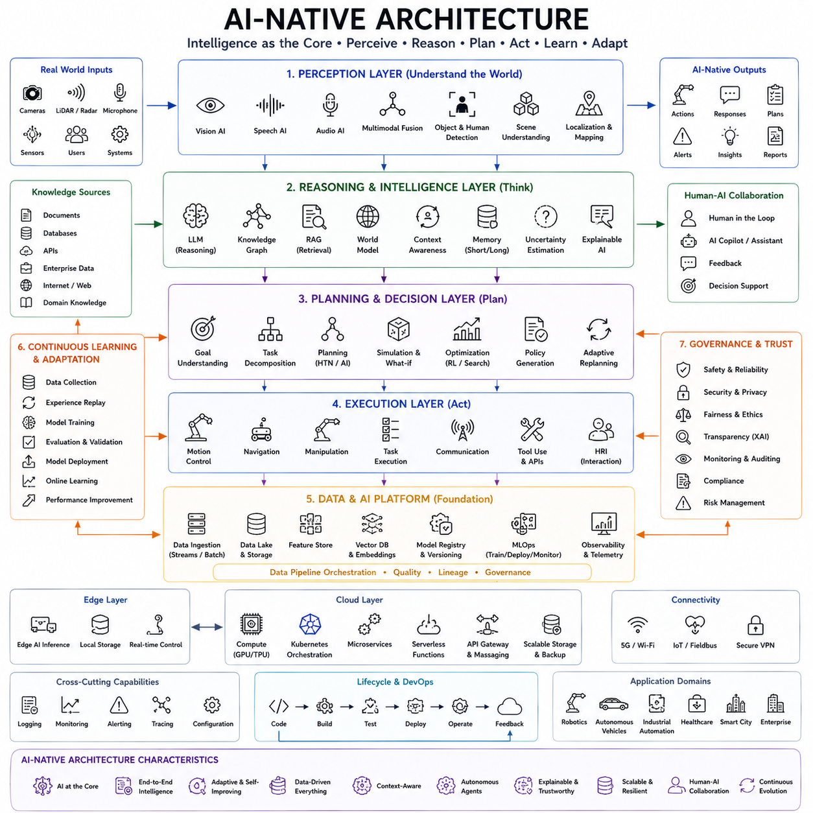
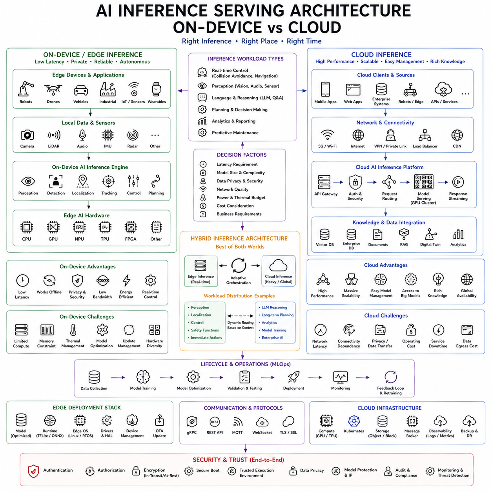
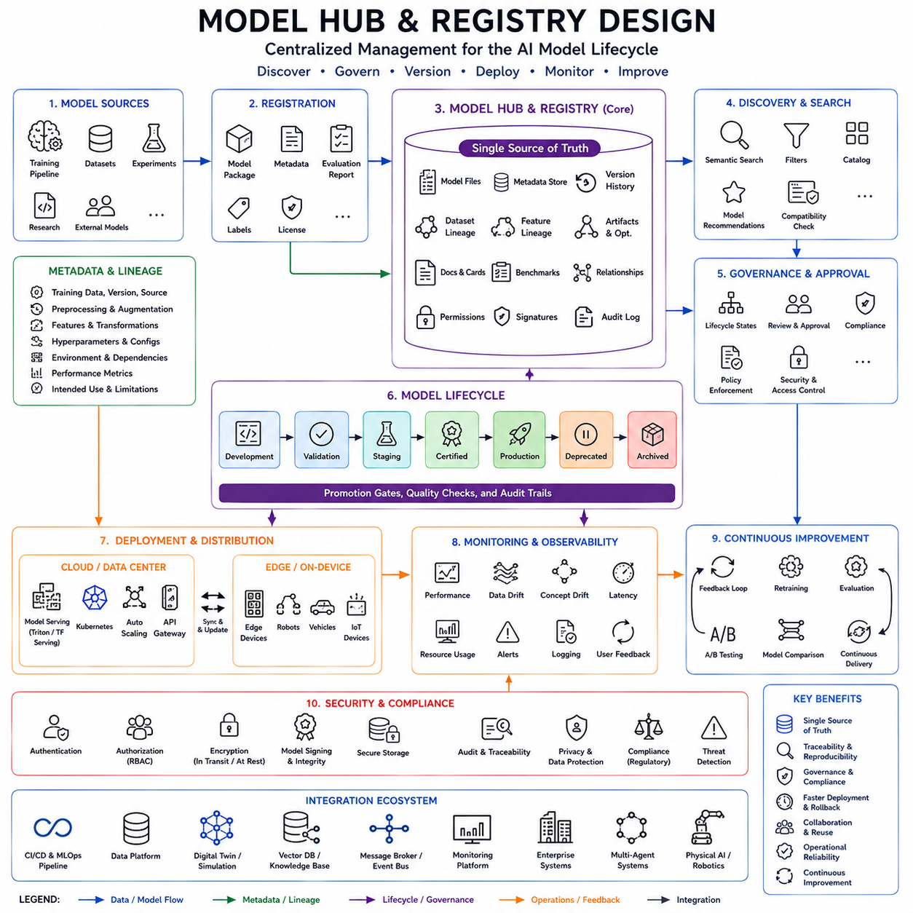
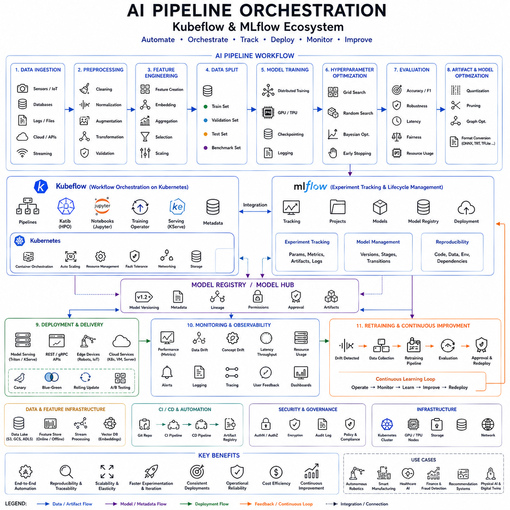
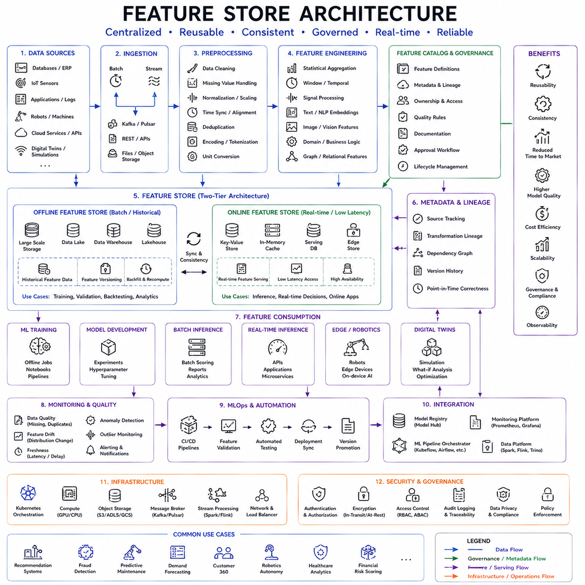
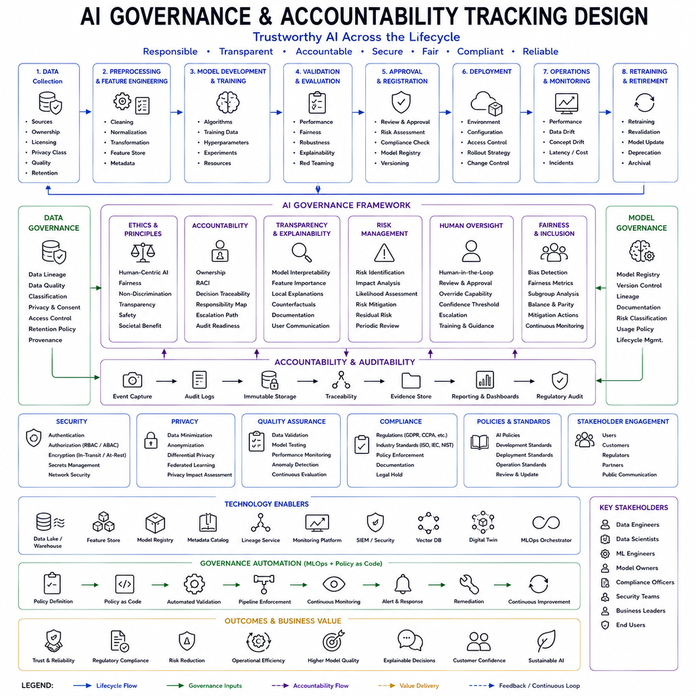
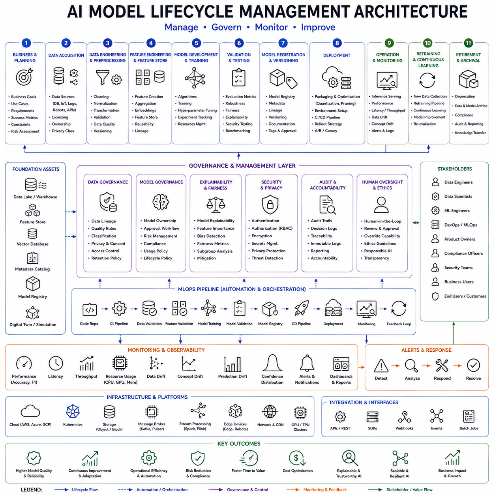
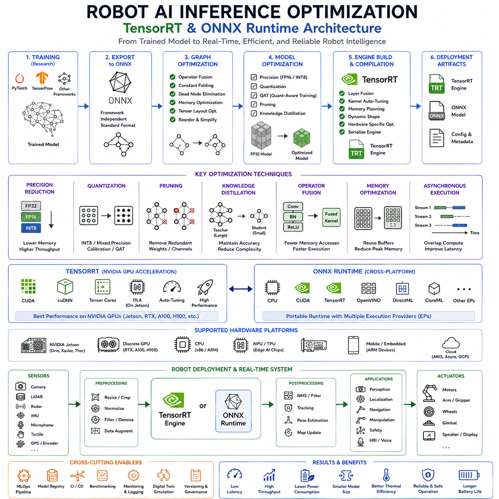
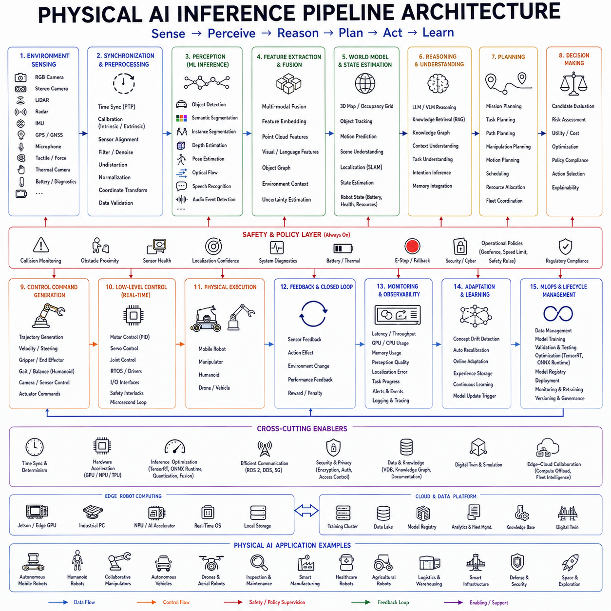
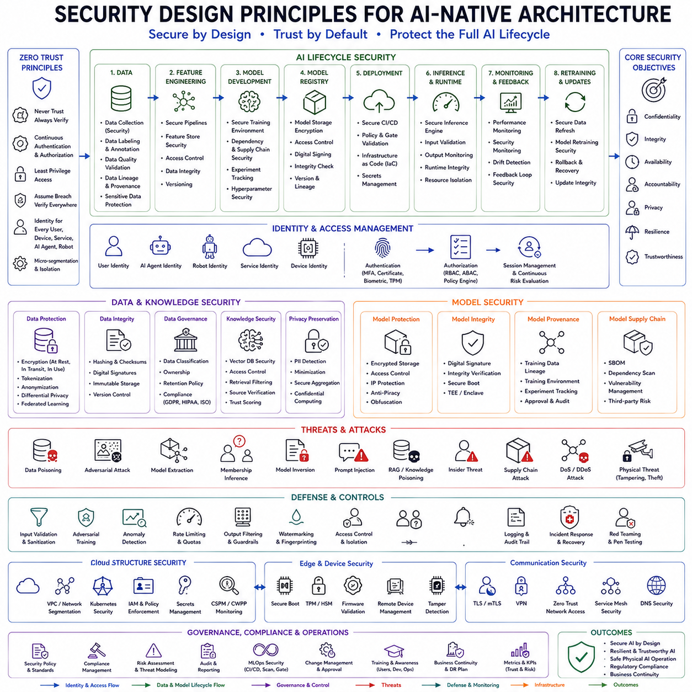

**Volume 1 Software Architecture Fundamentals**

# 07. AI-Native Architecture

## 07.01 Definition and Characteristics of AI-Native Architecture

{width="7.268055555555556in" height="7.268055555555556in"}

Artificial Intelligence has evolved from being an auxiliary analytical tool into the central driving force behind modern software systems. Traditional software architectures were designed around deterministic algorithms, predefined business logic, and explicitly programmed decision-making processes. Artificial intelligence was generally incorporated as an optional module responsible for classification, prediction, optimization, or recommendation, while the remaining system architecture remained fundamentally rule-based. As foundation models, large language models, multimodal learning, reinforcement learning, world models, and autonomous reasoning systems continue to mature, software architecture itself is undergoing a fundamental transformation. This new paradigm is known as **AI-Native Architecture**, an architectural philosophy in which artificial intelligence is no longer an isolated component but becomes the primary computational engine responsible for perception, reasoning, planning, adaptation, optimization, and continuous learning throughout the entire software ecosystem.

AI-Native Architecture represents far more than simply embedding AI models inside existing applications. Instead, every architectural layer is designed under the assumption that intelligent models continuously participate in system operation. Data flows, service interactions, resource allocation, software orchestration, decision making, human interfaces, security mechanisms, and operational monitoring are all constructed around AI-driven processes. Consequently, artificial intelligence becomes the operating principle of the architecture rather than an application feature.

The emergence of AI-Native Architecture parallels earlier transitions in computing history. Mainframe computing evolved into client-server architectures. Client-server systems gradually transformed into web-native systems, followed by cloud-native architectures emphasizing elasticity, microservices, containers, distributed orchestration, and continuous deployment. AI-Native Architecture represents the next major evolutionary stage. While cloud-native systems optimize computational infrastructure, AI-native systems optimize intelligence itself. Infrastructure becomes increasingly autonomous because software continuously interprets operational conditions, predicts future behavior, adapts execution strategies, and improves performance through learning.

The defining characteristic of AI-Native systems is that intelligence permeates every architectural layer. Perception layers interpret raw sensor observations using deep neural networks rather than handcrafted feature extraction. Decision layers employ reasoning models rather than static decision trees. Planning modules dynamically generate execution strategies according to changing operational objectives. Resource management predicts computational demand instead of relying upon fixed allocation policies. Security mechanisms identify abnormal behavior through intelligent anomaly detection. Monitoring systems interpret telemetry using predictive analytics rather than threshold-based alarms. Consequently, the architecture continuously evolves according to operational experience.

Traditional software generally follows deterministic execution. Given identical inputs, the system always produces identical outputs according to explicitly programmed rules. AI-Native Architecture introduces probabilistic reasoning while preserving deterministic execution where required. Foundation models generate semantic understanding, reinforcement learning optimizes adaptive behavior, probabilistic inference estimates uncertainty, and deterministic controllers enforce physical safety. The architecture therefore combines statistical intelligence with predictable execution, allowing autonomous adaptation without sacrificing reliability.

Data becomes the most important architectural resource within AI-Native systems. Traditional software primarily manipulates structured databases according to predefined schemas. AI-native architectures instead treat every operational event as valuable learning information. Sensor observations, operational telemetry, user interactions, maintenance records, environmental changes, system failures, mission execution logs, simulation outputs, and cloud analytics continuously contribute toward expanding organizational knowledge. Data pipelines therefore become architectural foundations supporting both immediate operational decisions and long-term learning.

Continuous learning represents another defining property of AI-Native Architecture. Conventional software typically changes only through periodic software updates performed by development teams. AI-native systems continuously improve through operational feedback. Newly collected data refines perception models, planning policies, optimization strategies, dialogue systems, anomaly detectors, and predictive maintenance algorithms. Although safety-critical components often require controlled validation before deployment, the overall architecture evolves continuously through iterative learning rather than static software releases.

Model-centric design replaces algorithm-centric development. Traditional software engineering primarily focuses on implementing procedural logic. AI-Native Architecture instead organizes software around trained models representing learned knowledge. Perception models interpret images, language models understand human communication, planning models predict future outcomes, recommendation models optimize resource allocation, and reasoning models coordinate complex decision making. Software increasingly orchestrates specialized models rather than implementing every decision procedurally.

Modern AI-native systems typically contain multiple cooperating models instead of one monolithic intelligence. Vision models process images, speech models recognize spoken language, multimodal models integrate heterogeneous sensory information, language models perform reasoning, world models predict environmental evolution, reinforcement learning policies optimize behavior, and anomaly detection models supervise operational safety. Model orchestration therefore becomes an essential architectural responsibility, coordinating specialized intelligence according to task requirements.

Agent-based architecture naturally complements AI-Native design. Intelligent software agents independently perceive environmental conditions, establish goals, generate plans, execute actions, evaluate outcomes, and coordinate with neighboring agents. Rather than following centralized procedural workflows, autonomous agents collaborate dynamically while exchanging information through structured communication protocols. Multi-agent systems therefore provide scalability, robustness, and distributed intelligence suitable for complex robotic ecosystems.

Reasoning represents one of the most distinguishing characteristics separating AI-native systems from conventional automation. Instead of executing predefined workflows, reasoning engines evaluate context, interpret objectives, resolve ambiguity, compare alternatives, estimate uncertainty, and justify decisions before generating execution plans. Large Language Models increasingly function as general reasoning engines capable of integrating symbolic knowledge, operational context, semantic understanding, and human instructions into coherent decision-making processes.

Planning also undergoes significant transformation within AI-Native Architecture. Traditional planners rely upon predefined algorithms optimized for specific environments. AI-native planners combine symbolic planning, reinforcement learning, graph optimization, world modeling, and foundation model reasoning to generate adaptive strategies appropriate for dynamic environments. Plans evolve continuously as environmental observations change, enabling robust operation despite uncertainty.

World models represent another foundational architectural concept. Instead of reacting only to immediate observations, AI-native systems maintain predictive internal representations describing environmental dynamics, object relationships, causal interactions, temporal evolution, and future operational states. World models enable robots and intelligent systems to simulate possible future outcomes before selecting physical actions. Predictive reasoning therefore significantly improves decision quality while reducing operational risk.

Context awareness permeates every architectural component. AI-native systems continuously interpret user identity, operational environment, historical activity, organizational objectives, resource availability, safety conditions, communication quality, and mission status before generating responses. Identical requests may therefore produce different behaviors depending upon contextual interpretation. Context becomes an active computational resource rather than passive metadata.

Memory architecture similarly expands beyond traditional databases. AI-native systems integrate multiple forms of memory including short-term conversational memory, operational session memory, semantic knowledge bases, episodic mission history, long-term organizational knowledge, vector databases, retrieval-augmented generation repositories, and learned neural representations. Different memory systems support different reasoning processes while collectively preserving organizational intelligence across extended operational lifecycles.

Retrieval-Augmented Generation significantly enhances AI-native architectures by combining language model reasoning with external knowledge repositories. Rather than relying exclusively upon model parameters learned during training, systems retrieve relevant operational documents, technical manuals, maintenance procedures, engineering specifications, enterprise knowledge, regulatory information, and historical mission data before generating responses. Retrieval therefore improves factual accuracy while maintaining continuously updated organizational knowledge.

Human-AI collaboration becomes an integral architectural principle. AI-native systems rarely replace human expertise entirely. Instead, artificial intelligence augments human decision making by generating recommendations, summarizing information, predicting outcomes, identifying anomalies, optimizing workflows, and automating repetitive reasoning tasks. Human supervisors maintain strategic oversight while AI continuously supports operational execution.

Explainability becomes increasingly important because AI-native architectures perform complex autonomous reasoning difficult to verify through conventional debugging. Systems therefore generate transparent explanations describing underlying reasoning processes, supporting evidence, uncertainty estimates, alternative solutions, confidence levels, and decision rationale. Explainable AI strengthens trust, regulatory compliance, operational safety, and collaborative human oversight.

Trustworthy AI constitutes another essential architectural objective. AI-native systems continuously evaluate model uncertainty, detect out-of-distribution observations, identify adversarial conditions, monitor fairness, preserve privacy, ensure accountability, and maintain regulatory compliance. Intelligent reasoning therefore remains bounded by explicitly defined ethical, legal, operational, and safety constraints.

Security architecture also evolves significantly. AI models themselves become valuable organizational assets requiring protection against model theft, prompt injection, adversarial attacks, data poisoning, unauthorized inference, privacy leakage, and malicious manipulation. AI-native cybersecurity therefore integrates model validation, secure inference environments, encrypted embeddings, access control, secure APIs, trusted execution environments, and continuous behavioral monitoring throughout the architectural stack.

Cloud-native technologies provide the computational foundation supporting AI-native architectures. Containers, Kubernetes orchestration, serverless computing, distributed microservices, GPU clusters, scalable storage, message brokers, event-driven workflows, vector databases, and model-serving infrastructure collectively enable elastic deployment of computationally intensive AI services. Cloud-native infrastructure therefore becomes the execution substrate upon which AI-native intelligence operates.

Edge AI further extends architectural capabilities by moving intelligent inference closer to physical environments. Rather than transmitting every observation to cloud servers, robots, autonomous vehicles, industrial equipment, and IoT devices execute optimized AI models locally while synchronizing selected information with cloud infrastructure. Edge-cloud collaboration balances computational efficiency, latency, bandwidth utilization, operational resilience, and privacy protection.

Microservice architecture aligns naturally with AI-native development. Independent perception services, reasoning engines, language processing modules, planning systems, optimization components, retrieval services, monitoring agents, safety supervisors, digital twins, and analytics platforms communicate through standardized APIs while scaling independently according to computational demand. Modular architecture therefore supports rapid evolution of individual AI capabilities without disrupting overall system stability.

Observability becomes substantially more sophisticated within AI-native systems. Traditional software primarily monitors CPU utilization, memory consumption, network traffic, and application logs. AI-native observability additionally tracks model confidence, inference latency, embedding quality, retrieval effectiveness, reasoning consistency, hallucination frequency, concept drift, prediction accuracy, dataset quality, and learning performance. Monitoring therefore evaluates intelligence itself rather than infrastructure alone.

MLOps extends DevOps principles toward continuous AI lifecycle management. Model training, validation, deployment, monitoring, rollback, experimentation, version management, feature engineering, dataset governance, and automated retraining become integrated architectural services. AI models therefore evolve systematically according to software engineering best practices rather than isolated research workflows.

Digital twins further strengthen AI-native architecture by providing continuously synchronized virtual representations of physical systems. Operational data updates virtual environments in real time while AI analyzes future scenarios, predicts failures, optimizes workflows, validates software updates, and evaluates alternative operational strategies before physical implementation. Digital twins therefore become intelligent simulation environments supporting predictive decision making.

AI-native robotics represents one of the most compelling applications of this architectural paradigm. Autonomous robots continuously integrate perception models, localization algorithms, world models, behavior trees, reinforcement learning policies, language understanding, mission planning, digital twins, cloud knowledge, edge inference, and safety supervision into unified intelligent systems. Instead of following fixed procedural workflows, robots dynamically adapt behavior according to changing environments while continuously learning from operational experience.

Physical AI further extends AI-native architecture by integrating cognition with physical embodiment. Vision-Language-Action models interpret human instructions, perceive environmental context, generate behavioral objectives, and coordinate robotic actions through structured execution frameworks. Deterministic controllers, hardware abstraction layers, real-time operating systems, safety supervisors, and certified control loops continue governing physical execution while AI provides semantic reasoning, adaptive planning, and contextual understanding.

Enterprise software increasingly adopts AI-native architectural principles as well. Intelligent assistants coordinate organizational workflows, retrieve corporate knowledge, automate documentation, optimize resource allocation, monitor cybersecurity, predict equipment failures, summarize meetings, generate engineering reports, support software development, and orchestrate distributed decision making across complex organizations. AI therefore evolves from application functionality into enterprise infrastructure.

Future AI-native architectures will likely incorporate continuously evolving foundation models, autonomous software agents, lifelong learning, distributed reasoning, multimodal world understanding, quantum-enhanced optimization, federated learning, edge intelligence, cloud collaboration, and self-improving software ecosystems. Architectural boundaries between perception, reasoning, planning, execution, monitoring, and learning will become increasingly integrated as intelligence permeates every operational layer.

Nevertheless, deterministic software engineering principles remain indispensable. Safety-critical execution, regulatory compliance, cybersecurity enforcement, hardware control, communication integrity, and real-time scheduling continue requiring formally validated software components. AI-native architecture therefore does not eliminate traditional engineering disciplines but rather augments them through intelligent reasoning while preserving deterministic execution wherever operational reliability demands certainty.

Ultimately, AI-Native Architecture represents a fundamental transformation in software engineering philosophy. Instead of treating artificial intelligence as an optional computational feature, the architecture itself is constructed around continuously operating intelligent models capable of perception, reasoning, planning, learning, adaptation, prediction, collaboration, and autonomous optimization. By integrating foundation models, multimodal perception, agent-based coordination, world models, retrieval-augmented reasoning, continuous learning, edge-cloud collaboration, digital twins, explainable AI, trustworthy intelligence, and deterministic execution into one unified architectural framework, AI-Native Architecture establishes the technological foundation for the next generation of autonomous robots, intelligent enterprises, cyber-physical systems, and Physical AI ecosystems. As computing continues evolving toward increasingly autonomous and intelligent software platforms, AI-native architectural principles will define how future systems perceive the world, make decisions, interact with humans, and continuously improve throughout their operational lifetime.

## 07.02 AI Inference Serving Architecture: On-Device vs. Cloud

{width="7.268055555555556in" height="7.268055555555556in"}

Artificial Intelligence has become the computational foundation of modern intelligent systems, and the deployment of AI models has evolved into one of the most important architectural decisions in software engineering. While early AI systems primarily executed inference inside centralized cloud servers, the rapid expansion of autonomous robots, intelligent vehicles, industrial automation, Internet of Things devices, smart manufacturing, healthcare systems, and edge computing has fundamentally changed how AI models are deployed and executed. Instead of assuming that every inference request is processed remotely, modern AI systems distribute inference workloads across heterogeneous computing resources including embedded processors, edge AI accelerators, local servers, enterprise data centers, and public cloud infrastructure. This evolution has led to the development of **AI Inference Serving Architecture**, a software architecture responsible for determining where, when, and how artificial intelligence models are executed while balancing latency, computational performance, energy consumption, privacy, scalability, reliability, operational cost, and application requirements. One of the most fundamental architectural decisions within this domain is the choice between **On-Device AI Inference** and **Cloud AI Inference**, as well as the increasingly important hybrid architectures that combine the strengths of both approaches.

Artificial intelligence inference refers to the operational stage in which trained machine learning models generate predictions, classifications, decisions, language understanding, planning results, or control actions from incoming data. Unlike model training, which requires enormous computational resources and large datasets, inference focuses on executing previously trained models efficiently under real operational conditions. The quality of inference architecture therefore directly influences system responsiveness, user experience, robot autonomy, operational safety, and overall business performance.

Traditional cloud-centric AI architectures assume that input data generated by sensors or users is transmitted through communication networks toward centralized inference servers. Cloud servers execute deep neural networks using high-performance GPUs, tensor accelerators, or large AI clusters before returning inference results to client applications. This architecture became highly successful because cloud computing provides virtually unlimited computational capacity, centralized resource management, simplified software maintenance, and efficient utilization of expensive AI hardware. Large foundation models containing billions of parameters naturally benefit from centralized execution because individual edge devices generally lack sufficient computational resources.

Cloud inference architectures typically consist of multiple software layers. Client applications generate inference requests using images, audio streams, text, sensor observations, telemetry, or structured operational data. Request management services authenticate clients, validate requests, balance computational workloads, and distribute inference jobs across available model-serving infrastructure. Dedicated inference servers host optimized AI models using frameworks such as TensorRT, ONNX Runtime, OpenVINO, PyTorch Serve, Triton Inference Server, or custom deployment environments. Results are subsequently returned through REST APIs, gRPC interfaces, message brokers, or streaming communication services.

Cloud inference provides several significant advantages. Computational scalability remains perhaps the most important benefit. As user demand increases, cloud infrastructure dynamically allocates additional GPU resources, automatically scaling inference capacity according to workload. Organizations therefore avoid purchasing dedicated hardware for peak demand while maintaining efficient utilization throughout varying operational conditions.

Cloud architecture also simplifies model management. Rather than updating software individually across thousands of distributed devices, developers deploy improved models only once inside centralized infrastructure. Every connected client immediately benefits from updated capabilities without manual intervention. Continuous integration, continuous deployment, MLOps pipelines, model version management, A/B testing, rollback procedures, and operational monitoring therefore become considerably easier under centralized deployment.

Large Language Models further strengthen cloud inference because state-of-the-art reasoning models frequently contain hundreds of billions of parameters requiring multiple high-performance GPUs operating simultaneously. Such computational requirements exceed the capabilities of current embedded processors and mobile devices. Cloud clusters therefore remain essential for executing sophisticated foundation models supporting conversational AI, code generation, multimodal reasoning, scientific analysis, enterprise intelligence, and complex planning.

Cloud inference additionally enables centralized knowledge integration. Retrieval-Augmented Generation systems access continuously updated enterprise databases, technical documentation, digital twins, historical operational records, maintenance procedures, engineering specifications, and organizational knowledge repositories unavailable within isolated embedded devices. Consequently, cloud AI frequently produces more informed and contextually accurate responses than standalone local inference.

Despite these advantages, cloud inference introduces several architectural limitations. Communication latency becomes particularly significant within robotics and autonomous systems requiring real-time decision making. Every inference request requires network transmission, cloud processing, and response delivery before physical actions may begin. Even small communication delays become unacceptable for collision avoidance, motor control, manipulation, emergency stopping, or high-speed navigation where response times must remain deterministic.

Network reliability similarly affects cloud-dependent systems. Communication interruptions, bandwidth limitations, unstable wireless connectivity, remote operating environments, underground facilities, disaster response scenarios, military operations, offshore platforms, agricultural environments, and mobile robotics frequently experience unreliable network access. Exclusive dependence upon cloud inference therefore compromises operational availability whenever connectivity deteriorates.

Privacy and data sovereignty present additional architectural concerns. Medical imaging, industrial inspection data, manufacturing processes, financial information, surveillance imagery, personal conversations, defense applications, and confidential enterprise knowledge may not be transmitted to external cloud infrastructure due to regulatory requirements, intellectual property protection, organizational policy, or national security considerations. Local inference therefore becomes essential whenever sensitive information must remain within controlled environments.

Operational cost also influences inference architecture. Continuous cloud inference generates recurring expenses including GPU utilization, network bandwidth, API usage, cloud storage, model serving, monitoring, logging, and data transfer. High-volume industrial deployments containing thousands of continuously operating devices may experience significant operational expenditures exceeding the cost of local hardware over long deployment periods.

These limitations have accelerated the adoption of **On-Device AI Inference**, where models execute directly upon embedded processors, edge computers, autonomous robots, industrial controllers, smartphones, wearable devices, autonomous vehicles, drones, medical equipment, or intelligent sensors. Instead of transmitting raw data toward remote servers, inference occurs locally near data generation, enabling immediate autonomous response.

On-device inference fundamentally transforms software architecture by relocating intelligence from centralized cloud infrastructure toward distributed computing nodes. AI becomes an integral component of physical systems rather than a remote computational service. Robots interpret sensor observations locally, autonomous vehicles perform perception onboard, industrial inspection systems analyze images directly beside production equipment, and wearable devices continuously monitor physiological conditions without requiring permanent cloud connectivity.

Edge AI hardware has evolved rapidly to support local inference. Modern embedded computing platforms integrate GPUs, Neural Processing Units, Tensor Processing Units, dedicated AI accelerators, vector processors, FPGA-based inference engines, and specialized neural computation hardware optimized specifically for low-power deep learning execution. NVIDIA Jetson platforms, Intel edge processors, Qualcomm AI engines, AMD adaptive computing devices, Apple Neural Engines, Google Edge TPU, and numerous industrial AI accelerators enable increasingly sophisticated local intelligence.

Software optimization becomes particularly important within on-device inference. Large training models frequently require compression before embedded deployment. Quantization reduces numerical precision while preserving inference accuracy. Pruning removes unnecessary neural connections. Knowledge distillation transfers intelligence from large teacher models toward smaller student networks. Operator fusion, graph optimization, layer reordering, kernel specialization, and hardware-specific acceleration further improve computational efficiency.

Model optimization frameworks such as TensorRT, ONNX Runtime, OpenVINO, TensorFlow Lite, Core ML, TVM, and vendor-specific inference toolchains transform general deep learning models into hardware-optimized execution graphs suitable for embedded deployment. Efficient optimization often determines whether real-time inference becomes feasible within constrained computational environments.

Latency represents one of the greatest advantages of on-device inference. Since sensor data remains local, communication delays disappear almost entirely. Cameras, LiDARs, microphones, force sensors, radar systems, and other sensing modalities directly provide observations to local AI models. Results become available within milliseconds, supporting deterministic robotic control, collision avoidance, autonomous navigation, industrial automation, and medical intervention.

Energy efficiency also benefits from local processing. Although AI computation consumes electrical power, transmitting high-bandwidth sensor data continuously through wireless networks often requires comparable or greater energy expenditure. Intelligent edge processing frequently analyzes data locally while transmitting only summarized results, significantly reducing communication bandwidth and extending battery lifetime within mobile systems.

Privacy naturally improves because sensitive information never leaves local devices. Medical robots process patient information internally. Industrial inspection systems analyze proprietary manufacturing data onsite. Smart home devices recognize voice commands locally. Autonomous vehicles interpret environmental observations without external transmission. Local inference therefore simplifies regulatory compliance while strengthening user trust.

Autonomous operation represents another defining advantage of on-device inference. Robots continue functioning during communication outages because essential intelligence remains locally available. Mission execution, navigation, obstacle avoidance, manipulation, safety supervision, localization, speech recognition, and behavioral coordination continue independently despite temporary network isolation. Operational resilience therefore increases substantially.

Nevertheless, on-device inference also presents architectural challenges. Embedded hardware inevitably possesses limited computational capacity compared with cloud GPU clusters. Extremely large language models, foundation models, multimodal reasoning systems, and computationally intensive scientific simulations frequently exceed available memory, processing power, or thermal limits. Engineers must therefore carefully balance model complexity against available hardware resources.

Memory constraints strongly influence embedded deployment. Large neural networks require considerable storage for parameters, activation tensors, intermediate computations, and runtime buffers. Embedded devices frequently provide only limited DRAM compared with cloud servers containing hundreds of gigabytes of GPU memory. Efficient memory management therefore becomes essential for successful deployment.

Thermal management also influences sustained inference performance. Continuous AI computation generates heat, particularly within fanless industrial systems, autonomous mobile robots, drones, wearable devices, and battery-powered platforms. Dynamic frequency scaling, workload scheduling, computational throttling, and adaptive resource management prevent overheating while maintaining acceptable inference responsiveness.

Hardware heterogeneity further complicates software architecture. Different embedded devices provide varying computational capabilities, AI accelerators, instruction sets, operating systems, memory capacities, and optimization toolchains. AI deployment frameworks therefore require hardware abstraction layers supporting portable inference across diverse computational platforms.

Because neither cloud inference nor local inference alone satisfies every operational requirement, modern intelligent systems increasingly adopt **Hybrid AI Inference Architecture**. Hybrid systems dynamically distribute AI workloads according to latency requirements, computational complexity, communication quality, privacy constraints, operational context, and available resources. Rather than choosing one execution environment exclusively, hybrid architecture executes each inference task at its most appropriate computational location.

Hybrid inference commonly separates safety-critical and computationally intensive workloads. Real-time perception, localization, collision avoidance, emergency detection, motor control, speech wake-word recognition, gesture interpretation, and navigation execute locally. Long-term reasoning, semantic planning, enterprise analytics, digital twin synchronization, predictive maintenance, report generation, foundation model reasoning, and organizational knowledge retrieval execute within cloud infrastructure.

Modern robotics illustrates hybrid inference particularly well. Cameras continuously stream images into local object detection models executing upon edge GPUs. Local navigation algorithms interpret perception results while generating immediate motion commands. Simultaneously, cloud services analyze accumulated operational data, optimize fleet scheduling, perform predictive maintenance, retrain AI models, synchronize digital twins, and generate enterprise reports. Both local and cloud intelligence cooperate seamlessly through coordinated software architecture.

Adaptive inference scheduling further improves hybrid architectures. Software continuously evaluates network latency, available bandwidth, GPU utilization, battery capacity, thermal conditions, mission urgency, privacy requirements, and computational demand before selecting appropriate execution environments. During reliable high-bandwidth connectivity, larger cloud models provide sophisticated reasoning. During communication degradation, optimized local models preserve autonomous operation.

Model cascading represents another increasingly important architectural technique. Small local models initially process incoming data while estimating prediction confidence. High-confidence decisions execute immediately without cloud involvement. Low-confidence observations requiring deeper reasoning are transmitted toward larger cloud models for comprehensive analysis. Cascaded inference therefore balances computational efficiency with prediction quality.

Hierarchical AI architecture similarly distributes intelligence across computational layers. Embedded microcontrollers perform deterministic control. Edge GPUs execute perception and navigation. Local servers coordinate robotic fleets. Cloud infrastructure hosts foundation models and enterprise analytics. Each architectural layer contributes specialized intelligence appropriate for its computational capabilities and operational responsibilities.

AI inference serving itself requires sophisticated software infrastructure. Model registries maintain version-controlled AI assets. Inference gateways authenticate requests. Load balancers distribute computational workloads. Autoscaling services allocate GPU resources dynamically. Monitoring systems evaluate latency, throughput, confidence, accuracy, utilization, and operational reliability. Logging infrastructure records inference history supporting debugging, compliance, and continuous improvement.

MLOps plays an essential role throughout inference architecture. Continuous deployment pipelines automatically package optimized models, validate performance, distribute updates, monitor production behavior, detect concept drift, manage model rollback, compare experimental versions, and coordinate synchronized deployment across cloud and edge infrastructure. AI inference therefore evolves continuously while maintaining operational stability.

Observability extends beyond infrastructure monitoring toward intelligent system evaluation. Engineers monitor inference latency, GPU utilization, model confidence distributions, retrieval quality, hallucination frequency, prediction accuracy, communication performance, thermal conditions, battery consumption, edge-cloud synchronization, and user interaction quality. Comprehensive observability ensures reliable long-term AI operation.

Security remains fundamental throughout inference serving architecture. Secure model storage, encrypted communication, authenticated inference requests, confidential computation, trusted execution environments, secure boot, runtime attestation, access control, watermarking, and intellectual property protection collectively defend valuable AI assets against unauthorized access or manipulation. Edge devices additionally require physical tamper resistance because deployment frequently occurs within uncontrolled operational environments.

Digital twins increasingly support inference optimization. Virtual system replicas simulate computational workloads, communication delays, thermal behavior, hardware failures, and deployment strategies before physical implementation. AI architects evaluate different model partitioning strategies, hardware configurations, edge-cloud allocations, and scheduling policies using simulation prior to operational deployment.

Future AI inference architecture will become increasingly distributed, adaptive, and autonomous. Foundation models will execute cooperatively across heterogeneous hardware. Mixture-of-experts architectures will activate only necessary computational modules. Federated inference will preserve privacy while sharing intelligence. Edge devices will execute progressively larger multimodal models. Cloud infrastructure will coordinate organizational reasoning across globally distributed AI ecosystems. Autonomous orchestration systems will dynamically optimize inference placement according to continuously changing operational conditions.

Physical AI represents perhaps the most demanding application domain for inference serving architecture. Autonomous robots require deterministic local perception, manipulation, navigation, safety supervision, and motor control while simultaneously benefiting from cloud-based semantic reasoning, world models, fleet intelligence, enterprise integration, and continuous learning. Successful Physical AI therefore depends fundamentally upon hybrid inference architectures capable of balancing computational performance, latency, privacy, scalability, energy efficiency, and operational resilience.

Ultimately, AI Inference Serving Architecture represents one of the foundational disciplines enabling intelligent software systems. Rather than focusing solely upon model accuracy, modern AI architecture determines how intelligence itself is distributed across embedded devices, edge computing platforms, enterprise servers, and cloud infrastructure. By integrating on-device inference, cloud inference, hybrid execution, adaptive scheduling, model optimization, edge-cloud collaboration, continuous monitoring, MLOps, security, digital twins, and intelligent orchestration into one unified architectural framework, AI inference serving establishes the computational foundation upon which AI-native software, autonomous robotics, intelligent manufacturing, cyber-physical systems, and future Physical AI ecosystems will operate. As artificial intelligence continues becoming the central computational resource of modern society, inference architecture will increasingly define the efficiency, autonomy, safety, scalability, and intelligence of next-generation software systems.

## 07.03 Model Hub and Registry Design

{width="7.268055555555556in" height="7.268055555555556in"}

As Artificial Intelligence becomes the computational foundation of modern software systems, the management of AI models has emerged as one of the most critical architectural challenges in AI-native platforms. Traditional software systems primarily manage source code, executable binaries, configuration files, and deployment packages through conventional version control and software repositories. AI-native systems, however, introduce an entirely new class of software assets: trained machine learning models. These models continuously evolve through retraining, optimization, quantization, fine-tuning, reinforcement learning, and domain adaptation. Consequently, organizations require an architectural framework capable of storing, organizing, versioning, validating, distributing, monitoring, securing, and governing AI models throughout their entire operational lifecycle. This architectural framework is commonly referred to as the **Model Hub and Registry**, serving as the central intelligence repository within modern AI ecosystems.

A Model Hub is considerably more than a storage repository for neural network files. It functions as an intelligent software platform that manages the complete lifecycle of AI assets. Every trained model, optimization artifact, metadata description, evaluation report, deployment configuration, hardware compatibility profile, security signature, documentation package, and operational history becomes part of a unified management system. The registry therefore transforms AI models into managed enterprise resources rather than isolated research artifacts.

The emergence of Model Hub architecture parallels earlier developments in software engineering. Source code repositories such as Git transformed collaborative software development by introducing version control, branching strategies, traceability, and collaborative workflows. Container registries later provided standardized management for deployment images within cloud-native systems. AI-native architectures extend these principles toward machine learning by introducing dedicated repositories specifically designed for intelligent models and their associated metadata.

The primary objective of a Model Registry is to establish a single authoritative source of truth for every AI model deployed across an organization. Instead of distributing independent model files across development environments, cloud infrastructure, embedded devices, research laboratories, and operational systems, all approved models originate from one centrally governed repository. Every deployment therefore references identifiable model versions, ensuring reproducibility, traceability, compliance, and operational consistency.

Model registration begins immediately after successful model training. Once a model satisfies predefined performance criteria, the training pipeline automatically generates a registration package containing the trained neural network, optimizer configuration, training metadata, dataset references, feature definitions, hyperparameters, evaluation metrics, model architecture description, hardware compatibility information, software dependencies, licensing information, and documentation. The complete package becomes a managed asset within the registry.

Metadata plays an especially important role in Model Hub architecture. The model file itself represents only one component of organizational knowledge. Metadata describes model origin, training datasets, feature engineering procedures, preprocessing pipelines, optimization methods, evaluation environments, benchmark results, intended applications, deployment history, supported hardware platforms, security classifications, ownership, regulatory compliance status, and operational limitations. Rich metadata enables intelligent search, governance, auditing, and automated deployment.

Version management represents one of the defining capabilities of a mature Model Registry. AI models continuously evolve through retraining, architecture improvements, parameter optimization, quantization, pruning, domain adaptation, reinforcement learning, transfer learning, and fine-tuning. Every modification produces a distinct model version while preserving historical releases. Version control enables developers to reproduce previous experiments, compare model performance across iterations, perform controlled rollbacks, investigate operational incidents, and satisfy regulatory auditing requirements.

Unlike traditional software versioning, AI model versions frequently differ not only in implementation but also in learned knowledge. Two models built using identical architectures may produce different predictions because they were trained using different datasets, random initialization, optimization parameters, or training procedures. Model Registry architecture therefore tracks data lineage alongside software lineage, ensuring complete reproducibility throughout the AI lifecycle.

Dataset lineage constitutes another fundamental architectural component. Every registered model references the exact datasets used during training, validation, testing, and benchmarking. Data versions, preprocessing operations, feature extraction methods, annotation procedures, augmentation techniques, filtering criteria, and labeling standards remain permanently associated with corresponding model versions. This traceability allows organizations to understand precisely how learned knowledge originated while supporting future retraining and regulatory compliance.

Feature lineage similarly records how raw information becomes machine learning features. Data normalization, tokenization, embedding generation, image preprocessing, sensor calibration, coordinate transformations, categorical encoding, statistical aggregation, and feature selection all influence model behavior. Registry systems therefore preserve feature engineering pipelines alongside trained models to ensure consistent inference behavior across deployment environments.

Model evaluation forms another essential registry responsibility. Before models become eligible for operational deployment, comprehensive validation verifies prediction accuracy, robustness, fairness, explainability, computational performance, latency, memory utilization, energy consumption, security resilience, privacy compliance, and hardware compatibility. Evaluation reports become permanent registry artifacts supporting deployment approval and future comparison.

Benchmark management enables objective comparison among competing AI models. Multiple candidate architectures may solve identical perception, language understanding, anomaly detection, planning, recommendation, localization, or optimization tasks. Registry systems maintain standardized benchmark datasets, evaluation protocols, performance metrics, confusion matrices, latency measurements, resource utilization statistics, and deployment recommendations. Engineers therefore select models according to objective operational requirements rather than subjective preference.

Model approval workflows ensure governance throughout enterprise AI deployment. Experimental models initially remain available only for research environments. Following technical review, validation testing, security analysis, regulatory verification, ethical assessment, and performance benchmarking, designated reviewers approve selected models for production deployment. Approval states frequently include development, validation, staging, certified, production, deprecated, archived, and retired lifecycle phases.

Model promotion represents an important governance process. Rather than directly deploying experimental models into operational environments, AI assets gradually progress through increasingly demanding validation stages. Successful laboratory evaluation precedes integration testing, simulation, staging deployment, pilot operation, and eventually full production release. Registry systems coordinate these promotion workflows while maintaining complete audit trails documenting every approval decision.

Model discovery significantly improves organizational productivity. Large enterprises frequently maintain hundreds or thousands of AI models addressing diverse applications including computer vision, speech recognition, language processing, predictive maintenance, robotics, cybersecurity, industrial inspection, recommendation systems, digital twins, and autonomous planning. Advanced search capabilities allow engineers to locate appropriate models using semantic search, metadata filtering, capability classification, hardware compatibility, operational domain, accuracy requirements, or regulatory status.

Model categorization organizes AI assets according to application domains, neural architectures, deployment targets, supported hardware, organizational ownership, business functions, security classifications, geographic restrictions, and lifecycle status. Structured categorization simplifies governance while supporting automated deployment and operational monitoring across large organizations.

Foundation models introduce additional architectural considerations. Large Language Models, Vision-Language Models, multimodal foundation models, world models, and Vision-Language-Action architectures frequently serve numerous downstream applications simultaneously. Registry architecture therefore distinguishes between base foundation models and specialized fine-tuned derivatives while preserving inheritance relationships throughout model families.

Fine-tuning management becomes increasingly important within enterprise AI systems. Organizations frequently adapt general foundation models toward specialized industrial domains including manufacturing, healthcare, logistics, finance, robotics, agriculture, or engineering. Registry systems maintain relationships connecting domain-specific derivatives with their original foundation models, preserving traceability while simplifying update management and knowledge transfer.

Model optimization artifacts similarly require centralized management. AI deployment often generates multiple optimized variants from one original training model. Floating-point models become quantized INT8 versions, TensorRT execution engines, ONNX representations, TensorFlow Lite deployments, FPGA bitstreams, Core ML packages, OpenVINO optimizations, or hardware-specific inference binaries. Registry architecture associates every deployment artifact with its original source model while documenting hardware compatibility and optimization history.

Hardware compatibility management becomes particularly important within robotics and edge computing. AI models frequently execute across heterogeneous platforms including embedded GPUs, NPUs, TPUs, CPUs, FPGAs, industrial edge computers, cloud GPU clusters, autonomous vehicles, wearable devices, smartphones, and microcontrollers. Registry metadata therefore specifies supported processors, memory requirements, operating systems, runtime environments, inference frameworks, thermal limitations, power consumption, and expected latency across different hardware configurations.

Model deployment integrates directly with modern MLOps pipelines. Continuous Integration and Continuous Deployment workflows automatically retrieve approved models from the registry, package deployment artifacts, execute validation tests, update inference servers, synchronize edge devices, monitor production performance, and manage deployment rollback whenever operational anomalies arise. Registry architecture therefore serves as the authoritative deployment source throughout distributed AI infrastructure.

Edge AI introduces additional deployment complexity. Thousands of robots, industrial machines, autonomous vehicles, drones, IoT gateways, and embedded controllers may require synchronized model updates while operating across geographically distributed environments with intermittent connectivity. Registry systems coordinate secure distribution, incremental updates, version synchronization, rollback strategies, and deployment verification while minimizing communication bandwidth and operational disruption.

Model serving platforms naturally integrate with registry architecture. Inference servers dynamically retrieve approved models from centralized repositories during deployment initialization. Triton Inference Server, TensorRT deployment pipelines, ONNX Runtime environments, OpenVINO services, custom inference engines, Kubernetes orchestration systems, and cloud model serving platforms therefore remain synchronized with registry governance while supporting automated scalability and version consistency.

Model monitoring extends registry functionality into operational environments. Performance metrics including prediction accuracy, latency, throughput, confidence distributions, resource utilization, concept drift, data drift, hallucination frequency, anomaly detection rates, user feedback, and operational reliability continuously return toward centralized monitoring infrastructure. Registry systems associate operational observations with corresponding model versions, enabling evidence-based improvement throughout model lifecycles.

Concept drift detection represents another essential capability. Real-world environments evolve continuously as operational conditions, sensor characteristics, customer behavior, environmental appearance, manufacturing processes, language usage, or market conditions gradually change. Registry-integrated monitoring identifies decreasing model performance while triggering retraining workflows, validation procedures, and controlled redeployment whenever updated intelligence becomes necessary.

A/B testing enables controlled comparison between competing AI models within operational environments. Registry architecture coordinates simultaneous deployment of multiple candidate versions while collecting comparative performance metrics under identical operational conditions. Statistical evaluation identifies superior models before organization-wide deployment, reducing operational risk while encouraging continuous improvement.

Rollback capability provides operational resilience whenever newly deployed models exhibit unexpected behavior. Registry systems preserve previous production releases, allowing automated restoration following degraded performance, excessive latency, safety concerns, customer dissatisfaction, hardware incompatibility, or regulatory issues. Controlled rollback significantly reduces operational downtime while supporting rapid recovery.

Security architecture forms an essential component of every Model Hub. AI models represent valuable intellectual property requiring protection against unauthorized access, model theft, tampering, reverse engineering, adversarial modification, data poisoning, and supply chain attacks. Registry systems therefore implement authentication, authorization, encryption, digital signatures, integrity verification, secure artifact storage, trusted execution environments, and comprehensive audit logging.

Model signing ensures deployment integrity. Every approved model receives cryptographic signatures verifying authenticity and preventing unauthorized modification. Inference systems validate signatures before loading deployment artifacts, protecting operational environments from compromised or counterfeit models.

Access control governs organizational collaboration. Researchers, machine learning engineers, software developers, deployment operators, cybersecurity teams, compliance officers, and business stakeholders frequently require different permissions regarding model registration, modification, approval, deployment, monitoring, or retirement. Fine-grained authorization therefore protects organizational assets while supporting collaborative development.

Regulatory compliance increasingly influences registry design. Healthcare, automotive, aerospace, financial services, defense, industrial automation, and critical infrastructure frequently require traceability documenting training procedures, validation evidence, deployment history, operational incidents, approval decisions, and software changes. Registry architecture therefore maintains comprehensive audit trails supporting certification, legal accountability, and organizational governance.

Explainability metadata further strengthens trustworthy AI deployment. Registry systems preserve feature importance analyses, attention visualizations, saliency maps, confidence calibration results, reasoning summaries, uncertainty estimates, fairness assessments, and known operational limitations alongside deployed models. Engineers therefore understand not only model performance but also underlying reasoning behavior.

Digital twins naturally complement Model Hub architecture. Virtual environments evaluate candidate models under simulated operational scenarios before physical deployment. Industrial robots, autonomous vehicles, warehouse automation systems, drones, and manufacturing equipment therefore receive thoroughly validated models whose expected behavior has already been analyzed within realistic digital environments.

Multi-agent AI systems introduce additional registry complexity. Rather than managing isolated models independently, registry architecture increasingly governs collections of cooperating agents including perception agents, planning agents, reasoning agents, language assistants, optimization agents, safety supervisors, digital twin coordinators, and orchestration controllers. Relationships among these intelligent components become managed architectural knowledge supporting coordinated deployment and lifecycle management.

Cloud-native infrastructure provides the computational foundation supporting modern Model Hubs. Object storage systems maintain model artifacts. Relational databases manage structured metadata. Vector databases support semantic model search. Kubernetes orchestrates scalable deployment services. Message brokers coordinate asynchronous workflows. Event-driven architectures automate lifecycle transitions. Observability platforms monitor registry health while backup systems preserve organizational intelligence.

Future AI ecosystems will increasingly depend upon globally distributed Model Hubs supporting federated learning, collaborative research, autonomous robotics, enterprise knowledge sharing, edge-cloud synchronization, foundation model inheritance, multimodal intelligence, lifelong learning, and Physical AI deployment. Registry systems will evolve from passive storage repositories into intelligent orchestration platforms coordinating every aspect of organizational AI lifecycle management.

Within AI-native robotics, Model Hubs become especially critical because robots continuously execute numerous specialized AI models simultaneously. Computer vision, localization, semantic mapping, obstacle detection, speech recognition, language understanding, world modeling, behavior generation, manipulation planning, predictive maintenance, digital twin synchronization, and fleet coordination all depend upon independently evolving AI assets. Centralized registry architecture ensures that every robot executes validated, compatible, secure, and appropriately optimized intelligence throughout continuously changing operational environments.

Ultimately, **Model Hub and Registry Design** represents one of the foundational architectural disciplines enabling scalable, trustworthy, and governable artificial intelligence. Rather than merely storing trained neural networks, Model Hubs manage the complete lifecycle of intelligent software assets including registration, metadata management, version control, dataset lineage, feature governance, validation, optimization, deployment, monitoring, rollback, security, compliance, digital twin integration, and continuous improvement. By combining centralized governance with cloud-native infrastructure, MLOps automation, edge deployment, AI security, explainable intelligence, and lifecycle orchestration into one unified architectural framework, Model Hub architecture establishes the organizational backbone upon which AI-native enterprises, autonomous robotics, intelligent manufacturing, cyber-physical systems, and future Physical AI ecosystems will continuously evolve.

## 07.04 AI Pipeline Orchestration: Kubeflow / MLflow

{width="7.268055555555556in" height="7.268055555555556in"}

Artificial Intelligence has evolved from isolated machine learning experiments into mission-critical software infrastructure supporting enterprise applications, autonomous robotics, intelligent manufacturing, healthcare, finance, cybersecurity, logistics, and Physical AI systems. As organizations increasingly develop hundreds or even thousands of machine learning models simultaneously, the challenge is no longer limited to training accurate models. Instead, the primary engineering challenge becomes managing the complete lifecycle of AI development, including data preparation, feature engineering, model training, validation, optimization, deployment, monitoring, retraining, governance, and continuous improvement. These activities must be coordinated across distributed computing environments while maintaining reproducibility, scalability, automation, traceability, and operational reliability. This requirement has led to the emergence of **AI Pipeline Orchestration**, an architectural discipline responsible for organizing every stage of the machine learning lifecycle into automated, repeatable, and scalable workflows. Among the most influential platforms supporting this paradigm are **Kubeflow** and **MLflow**, which together represent the foundation of modern AI-native software engineering.

AI Pipeline Orchestration refers to the systematic coordination of machine learning workflows from raw data acquisition to production deployment. Rather than executing isolated scripts manually, AI engineering teams construct interconnected computational pipelines where every processing stage automatically triggers subsequent operations according to predefined dependencies. Data ingestion activates preprocessing, preprocessing initiates feature engineering, feature generation launches model training, training triggers evaluation, successful validation initiates deployment, deployment activates monitoring, and monitoring continuously determines whether retraining becomes necessary. This workflow-oriented architecture transforms machine learning from experimental research into reliable software engineering.

Traditional machine learning development often relies upon manually executed notebooks, independent Python scripts, locally stored datasets, experimental model files, and ad hoc deployment procedures. Although suitable for small research projects, such practices become unsustainable within enterprise environments where multiple teams collaborate simultaneously across numerous AI applications. Manual processes frequently introduce inconsistencies, missing documentation, duplicated effort, configuration errors, and reproducibility challenges. AI Pipeline Orchestration addresses these limitations by formalizing machine learning operations into standardized computational workflows.

The architectural philosophy behind AI Pipeline Orchestration closely resembles manufacturing assembly lines. Every processing stage performs specialized responsibilities while passing standardized outputs toward subsequent stages. Individual components remain modular, independently replaceable, reusable across projects, and automatically coordinated through workflow management systems. Consequently, AI development becomes predictable, scalable, and continuously repeatable regardless of project complexity.

The machine learning lifecycle generally begins with **data ingestion**. Modern AI systems continuously collect information from sensors, enterprise databases, cloud services, industrial equipment, robots, IoT devices, manufacturing systems, user interactions, digital twins, simulation platforms, and external data providers. Raw information frequently arrives in heterogeneous formats including structured tables, time-series telemetry, images, videos, audio streams, documents, point clouds, sensor measurements, and event logs. Pipeline orchestration coordinates automated collection while maintaining data integrity, version control, scheduling, and security.

Following ingestion, data preprocessing prepares raw information for machine learning. Missing values are identified and corrected, corrupted records removed, inconsistent formatting standardized, duplicate entries eliminated, coordinate systems normalized, timestamps synchronized, images resized, documents tokenized, sensor calibration applied, and categorical variables encoded. Preprocessing ensures that downstream machine learning algorithms receive consistent and high-quality inputs regardless of original data sources.

Feature engineering transforms preprocessed information into meaningful numerical representations suitable for model training. Statistical aggregation, embedding generation, signal filtering, dimensionality reduction, normalization, feature selection, temporal aggregation, semantic encoding, and multimodal fusion collectively improve learning efficiency while reducing computational complexity. Pipeline orchestration guarantees that identical feature transformations remain consistently applied during both training and production inference.

Dataset partitioning subsequently divides information into training, validation, testing, and benchmarking subsets. Proper separation prevents information leakage while enabling objective performance evaluation. Pipeline orchestration records dataset versions, sampling strategies, partition ratios, random seeds, and selection criteria, ensuring complete experimental reproducibility across future retraining activities.

Model training represents the computational core of AI pipelines. Machine learning frameworks execute optimization algorithms using prepared datasets while adjusting millions or even billions of neural network parameters. Distributed GPU clusters frequently accelerate training through data parallelism, model parallelism, gradient synchronization, and large-scale optimization techniques. Pipeline orchestration automatically provisions computational resources, schedules training jobs, monitors execution, captures logs, records hyperparameters, and manages hardware allocation.

Hyperparameter optimization significantly improves model performance through systematic exploration of architectural configurations. Learning rates, batch sizes, optimizer selection, network depth, activation functions, regularization parameters, dropout probabilities, augmentation policies, embedding dimensions, and scheduling strategies collectively influence training quality. Automated search algorithms including grid search, random search, Bayesian optimization, evolutionary computation, and population-based training evaluate multiple configurations concurrently while pipeline orchestration manages computational experiments efficiently.

Following training, evaluation determines whether generated models satisfy operational requirements. Performance metrics extend far beyond prediction accuracy alone. Precision, recall, F1-score, confusion matrices, ROC curves, calibration quality, robustness, explainability, latency, throughput, memory consumption, energy efficiency, fairness, uncertainty estimation, security resilience, and hardware compatibility all contribute toward deployment decisions. Automated evaluation pipelines ensure objective comparison across multiple candidate models.

Benchmarking further strengthens model validation by comparing new architectures against previously approved production models. Standardized datasets, evaluation protocols, hardware configurations, and operational metrics allow organizations to determine whether newly trained models genuinely improve existing capabilities. Pipeline orchestration therefore prevents performance regression while encouraging continuous optimization.

Once models satisfy predefined acceptance criteria, artifact generation prepares deployment packages. Original training checkpoints become optimized inference representations through quantization, pruning, graph optimization, TensorRT conversion, ONNX export, TensorFlow Lite generation, OpenVINO optimization, Core ML conversion, or FPGA compilation depending upon target deployment platforms. Pipeline orchestration automatically generates multiple optimized deployment variants while preserving traceability between original training models and optimized artifacts.

Model registration subsequently stores validated artifacts inside centralized Model Registries together with metadata describing training history, datasets, feature definitions, evaluation reports, hardware compatibility, ownership, licensing, governance status, and deployment eligibility. Integration between orchestration systems and Model Hubs establishes complete lifecycle traceability throughout organizational AI infrastructure.

Deployment automation represents another fundamental responsibility of AI Pipeline Orchestration. Approved models automatically propagate toward inference servers, edge devices, robotic platforms, cloud services, Kubernetes clusters, industrial controllers, autonomous vehicles, or mobile applications according to organizational deployment policies. Canary deployment, blue-green deployment, rolling updates, staged rollout, and A/B testing strategies minimize operational risk while enabling continuous delivery.

Production monitoring continuously evaluates deployed AI behavior. Inference latency, throughput, GPU utilization, confidence distributions, prediction quality, resource consumption, communication performance, concept drift, data drift, hallucination frequency, hardware temperature, memory usage, user feedback, and operational incidents collectively determine ongoing model health. Monitoring pipelines automatically collect telemetry while associating observations with corresponding model versions.

Concept drift detection plays an especially important role within long-term AI operation. Real-world environments continuously evolve as customer behavior changes, industrial processes mature, sensor characteristics drift, weather conditions vary, language usage develops, manufacturing equipment ages, or operational policies change. Monitoring systems detect decreasing prediction quality and automatically initiate retraining workflows whenever model knowledge becomes outdated.

Retraining pipelines complete the continuous learning lifecycle. Newly collected operational data enters preprocessing, feature engineering, training, evaluation, validation, optimization, deployment, and monitoring pipelines automatically. AI systems therefore improve continuously through operational experience rather than remaining static following initial deployment.

The architectural complexity of these interconnected workflows necessitates dedicated orchestration platforms. **Kubeflow** represents one of the most comprehensive open-source solutions specifically designed for machine learning workflows operating upon Kubernetes infrastructure. Rather than functioning as a standalone AI framework, Kubeflow provides workflow orchestration, distributed training, notebook management, hyperparameter optimization, metadata tracking, model serving, pipeline automation, and resource scheduling through cloud-native architectural principles.

Kubeflow Pipelines constitute the workflow engine at the center of Kubeflow architecture. Machine learning processes become directed acyclic graphs where individual computational components execute according to dependency relationships. Data preparation, feature engineering, training, validation, optimization, deployment, and monitoring each operate as reusable pipeline components connected through explicitly defined data flows. Component reuse significantly reduces engineering effort while improving standardization across multiple AI projects.

Kubernetes provides the computational foundation supporting Kubeflow. Every pipeline component executes within isolated containers orchestrated dynamically across distributed computing clusters. Automatic scheduling, fault recovery, resource isolation, autoscaling, service discovery, persistent storage, networking, and container lifecycle management collectively enable reliable large-scale AI execution.

Distributed training becomes particularly efficient under Kubeflow. Large GPU clusters execute synchronized machine learning workloads using TensorFlow, PyTorch, JAX, MXNet, or custom frameworks while Kubeflow coordinates worker allocation, parameter synchronization, checkpoint management, fault recovery, and resource optimization. Researchers therefore concentrate upon model development rather than infrastructure management.

Katib extends Kubeflow through automated hyperparameter optimization. Bayesian optimization, random search, grid search, evolutionary algorithms, and neural architecture search execute systematically across distributed computational resources. Katib automatically compares experimental results while identifying optimal model configurations according to predefined evaluation objectives.

Kubeflow Notebooks provide managed interactive development environments integrated directly with enterprise Kubernetes infrastructure. Data scientists access scalable Jupyter environments while benefiting from centralized authentication, GPU allocation, persistent storage, collaborative development, and secure organizational governance.

Kubeflow Metadata records relationships among datasets, experiments, pipelines, execution logs, model artifacts, parameters, metrics, and deployment history. Comprehensive metadata enables reproducibility, auditing, debugging, experiment comparison, and regulatory compliance across complex machine learning environments.

Kubeflow Model Serving supports scalable deployment of trained models using Kubernetes-native infrastructure. Dynamic autoscaling, traffic routing, load balancing, GPU scheduling, version management, and secure inference collectively provide production-grade AI serving suitable for enterprise applications.

While Kubeflow emphasizes workflow orchestration and cloud-native infrastructure, **MLflow** focuses primarily upon experiment management, model lifecycle tracking, reproducibility, and deployment governance. MLflow provides a unified platform supporting every stage of machine learning experimentation while remaining framework independent.

MLflow Tracking records every machine learning experiment automatically. Hyperparameters, training metrics, evaluation results, model artifacts, execution environments, software dependencies, source code versions, datasets, and runtime logs become permanently associated with each experimental run. Researchers therefore compare experiments objectively while reproducing previous results whenever necessary.

Experiment tracking addresses one of the greatest challenges within practical machine learning. Hundreds of experimental configurations frequently differ only slightly regarding optimization parameters, architectures, feature engineering methods, or datasets. Without systematic tracking, organizations quickly lose understanding regarding which experimental decisions produced successful operational models. MLflow establishes complete experimental traceability.

MLflow Projects standardize reproducible execution by packaging machine learning code together with dependencies, configuration files, runtime environments, and execution parameters. Independent teams therefore reproduce experiments consistently across laptops, servers, cloud infrastructure, and continuous integration pipelines without manual configuration differences.

MLflow Models define standardized packaging formats supporting multiple deployment targets. Models trained using TensorFlow, PyTorch, Scikit-learn, XGBoost, LightGBM, Hugging Face Transformers, or custom frameworks become portable deployment artifacts executable through common interfaces. Standardization simplifies interoperability across heterogeneous production environments.

MLflow Model Registry complements organizational governance by managing model versions, lifecycle states, approval workflows, deployment eligibility, metadata, documentation, ownership, and operational history. Lifecycle stages typically include development, staging, production, archived, and deprecated states supporting controlled enterprise deployment.

One of MLflow\'s greatest strengths lies in framework independence. Unlike workflow platforms tightly integrated with specific machine learning frameworks, MLflow supports virtually every major AI library through standardized APIs. Organizations therefore maintain architectural flexibility while adopting diverse machine learning technologies according to evolving requirements.

Kubeflow and MLflow frequently operate together rather than competing directly. Kubeflow orchestrates computational workflows while MLflow manages experiments and model lifecycles. Training pipelines executed by Kubeflow automatically record experimental metadata inside MLflow. Validated models subsequently enter centralized Model Registries before deployment toward cloud inference platforms, edge AI devices, robotic fleets, or enterprise applications.

Modern MLOps architecture naturally integrates Kubeflow, MLflow, Model Registries, Kubernetes, Git repositories, CI/CD systems, data lakes, feature stores, monitoring platforms, vector databases, digital twins, and inference servers into one unified AI ecosystem. Every component specializes in particular lifecycle responsibilities while exchanging standardized metadata and deployment artifacts through automated orchestration.

AI-native robotics particularly benefits from orchestration architecture because autonomous systems simultaneously manage perception models, localization networks, semantic mapping, speech recognition, world models, behavior generation, reinforcement learning policies, predictive maintenance, digital twins, and fleet intelligence. Pipeline orchestration coordinates continuous retraining, validation, optimization, deployment, rollback, and monitoring without interrupting operational autonomy.

Edge-cloud collaboration further extends orchestration complexity. Local robots execute optimized inference models while cloud infrastructure performs large-scale retraining, fleet analytics, digital twin synchronization, foundation model adaptation, organizational learning, and global optimization. Pipeline orchestration coordinates data movement, model synchronization, deployment scheduling, and continuous improvement across distributed computational environments.

Security and governance remain essential architectural responsibilities throughout orchestration pipelines. Authentication, authorization, encrypted artifact storage, digital signatures, secure container execution, supply-chain verification, audit logging, policy enforcement, regulatory compliance, and model provenance collectively protect organizational AI assets throughout their operational lifecycle.

Future AI Pipeline Orchestration will increasingly incorporate autonomous workflow generation, agent-based coordination, self-optimizing resource allocation, foundation model integration, multimodal data processing, federated learning, digital twin simulation, distributed reasoning, lifelong learning, and Physical AI deployment. Intelligent orchestration systems will dynamically adapt workflows according to computational availability, operational priorities, model performance, regulatory requirements, and organizational objectives without requiring extensive manual intervention.

Ultimately, **AI Pipeline Orchestration** establishes the operational backbone of AI-native software engineering by transforming isolated machine learning activities into automated, scalable, reproducible, and continuously improving software workflows. **Kubeflow** provides cloud-native workflow orchestration built upon Kubernetes, enabling distributed execution, automated pipelines, hyperparameter optimization, scalable model serving, and enterprise resource management. **MLflow** complements this architecture through experiment tracking, model lifecycle management, reproducibility, governance, and deployment coordination. Together, these platforms integrate data engineering, machine learning, software engineering, cloud infrastructure, MLOps, Model Hubs, continuous monitoring, digital twins, and AI-native operations into a unified architectural ecosystem supporting intelligent enterprises, autonomous robotics, cyber-physical systems, smart manufacturing, and the future generation of Physical AI platforms.

## 07.05 Feature Store Architecture

{width="7.268055555555556in" height="7.268055555555556in"}

As Artificial Intelligence systems evolve from isolated machine learning experiments into enterprise-scale AI-native platforms, the management of machine learning features has become one of the most important architectural challenges. Traditional software systems primarily manage structured data stored inside relational databases, object storage, or transactional systems. Machine learning, however, introduces an intermediate computational layer between raw data and trained models. This intermediate representation is known as a **feature**, a numerical or semantic representation extracted from raw information that enables machine learning algorithms to recognize patterns, make predictions, perform reasoning, or generate autonomous decisions. As organizations build hundreds or thousands of AI models across different applications, manually generating and managing features becomes increasingly inefficient, inconsistent, and difficult to reproduce. These challenges have led to the emergence of **Feature Store Architecture**, a centralized software platform responsible for creating, storing, sharing, governing, serving, monitoring, and versioning machine learning features throughout the complete AI lifecycle.

A Feature Store is far more than a database containing numerical values. It serves as the organizational knowledge layer that bridges raw enterprise data and intelligent machine learning models. Every feature represents accumulated engineering knowledge describing how meaningful information should be extracted from raw observations. Instead of repeatedly implementing feature engineering logic within every machine learning project, organizations centralize feature definitions inside reusable repositories where data scientists, software engineers, AI researchers, and production systems consistently access identical feature representations.

The importance of Feature Store Architecture increases dramatically as AI-native systems become increasingly distributed. Autonomous robots, intelligent manufacturing platforms, healthcare systems, recommendation engines, financial analytics, cybersecurity monitoring, predictive maintenance, digital twins, and Physical AI all depend upon high-quality features generated from continuously evolving operational data. Without centralized feature management, different development teams frequently create inconsistent feature definitions, resulting in duplicated engineering effort, degraded prediction quality, reduced reproducibility, and operational instability.

Machine learning features represent processed information rather than raw observations. Images become embedding vectors, sensor measurements become statistical descriptors, time-series telemetry becomes temporal features, customer activity becomes behavioral indicators, text documents become semantic embeddings, point clouds become geometric representations, and robot trajectories become motion descriptors. Feature engineering therefore transforms heterogeneous real-world information into standardized numerical representations suitable for artificial intelligence.

The Feature Store establishes a single authoritative source of truth for every reusable machine learning feature within an organization. Rather than allowing individual projects to independently implement similar feature extraction pipelines, centralized governance ensures that all models use identical feature definitions. This consistency significantly improves prediction reliability while reducing engineering complexity across enterprise AI ecosystems.

The architectural philosophy behind Feature Stores resembles the role played by software libraries in conventional software engineering. Instead of repeatedly writing identical code, developers reuse standardized software components. Likewise, Feature Stores enable machine learning engineers to reuse validated feature definitions across multiple AI models, ensuring consistency while accelerating development.

The machine learning lifecycle begins with raw data collection. Enterprise databases, IoT sensors, manufacturing systems, autonomous robots, industrial controllers, cloud applications, ERP systems, CRM platforms, digital twins, simulation environments, and user interaction logs continuously generate enormous quantities of heterogeneous information. Raw data frequently contains inconsistencies, missing values, duplicated observations, synchronization errors, measurement noise, corrupted records, incompatible units, and varying sampling frequencies. Feature Store Architecture integrates closely with upstream data engineering pipelines responsible for transforming raw information into reliable analytical assets.

Data ingestion pipelines continuously collect information from batch processing systems, event streams, message brokers, REST APIs, industrial communication protocols, relational databases, object storage, distributed file systems, and edge computing platforms. Modern Feature Stores support both offline historical ingestion and online real-time streaming, enabling AI systems to operate across diverse operational environments.

Following ingestion, preprocessing standardizes incoming information. Data cleaning removes corrupted observations, missing values are interpolated, timestamps synchronized, measurement units normalized, coordinate systems transformed, duplicate records eliminated, categorical variables encoded, textual information tokenized, images resized, and sensor calibration applied. Standardized preprocessing ensures consistent downstream feature generation regardless of original data sources.

Feature engineering subsequently extracts meaningful machine learning representations. Statistical aggregation computes averages, variances, maxima, minima, percentiles, temporal trends, moving windows, cumulative statistics, and distribution characteristics. Signal processing generates frequency-domain descriptors, spectral coefficients, filtering outputs, wavelet decompositions, and vibration signatures. Natural language processing produces semantic embeddings, contextual representations, attention vectors, and linguistic features. Computer vision algorithms generate visual embeddings, geometric descriptors, object attributes, segmentation masks, keypoints, and latent representations. Robotics applications derive localization confidence, obstacle density, trajectory smoothness, semantic map characteristics, environmental complexity, and motion behavior descriptors.

Feature computation frequently requires considerable computational effort. Recalculating identical features independently for every machine learning experiment wastes organizational resources while introducing unnecessary inconsistencies. Feature Stores therefore cache previously computed feature values together with corresponding metadata, allowing efficient reuse across multiple AI applications.

Feature reuse represents one of the greatest architectural advantages of centralized Feature Stores. Customer transaction frequency may support fraud detection, recommendation systems, credit scoring, marketing optimization, customer segmentation, and business forecasting simultaneously. Robot localization confidence contributes toward navigation, predictive maintenance, safety monitoring, digital twins, mission planning, and fleet optimization. Centralized feature reuse significantly reduces engineering duplication while strengthening organizational knowledge sharing.

Feature consistency forms another essential architectural objective. Machine learning frequently suffers from **training-serving skew**, a situation where features generated during model training differ from those computed during production inference. Even minor implementation differences in preprocessing, normalization, aggregation windows, categorical encoding, or missing value handling may substantially degrade prediction quality. Feature Stores eliminate this problem by ensuring identical feature transformation logic executes consistently across both offline training and online serving environments.

Offline Feature Stores primarily support model development. Historical feature datasets generated from archived operational information allow data scientists to train, validate, benchmark, and compare machine learning models using large-scale computational resources. Offline storage frequently utilizes distributed object stores, analytical databases, cloud data warehouses, or lakehouse architectures optimized for batch analytics.

Online Feature Stores support real-time AI inference. Instead of processing massive historical datasets, online serving retrieves only the latest feature values required for immediate prediction. Low-latency databases, in-memory caches, key-value stores, distributed NoSQL systems, and edge computing platforms frequently provide online serving infrastructure capable of responding within milliseconds.

Maintaining consistency between offline and online stores represents one of the most challenging architectural responsibilities. Every feature generated historically must remain compatible with corresponding real-time computations. Automated synchronization pipelines continuously propagate validated feature definitions while ensuring semantic equivalence across both operational environments.

Feature versioning extends governance capabilities throughout evolving AI ecosystems. Feature engineering logic frequently changes due to improved algorithms, corrected preprocessing procedures, updated business definitions, revised sensor calibration, expanded datasets, or modified operational objectives. Every modification generates new feature versions while preserving historical implementations supporting reproducibility and model traceability.

Metadata management significantly enhances Feature Store intelligence. Every feature includes descriptive information regarding data sources, engineering logic, computational dependencies, ownership, business purpose, statistical characteristics, update frequency, supported models, security classification, regulatory status, validation history, quality metrics, documentation, and lifecycle stage. Rich metadata enables intelligent search, governance, auditing, and automated dependency analysis.

Feature lineage documents the complete computational history describing how every feature originates from raw data. Source systems, preprocessing operations, aggregation procedures, transformations, intermediate computations, dependencies, software versions, and execution timestamps remain permanently associated with feature definitions. Lineage supports reproducibility, debugging, regulatory compliance, and organizational transparency.

Dependency management becomes increasingly important as feature complexity grows. High-level semantic features frequently depend upon numerous lower-level statistical computations, sensor calibrations, external data sources, embeddings, or intermediate representations. Feature Store Architecture maintains dependency graphs ensuring correct execution ordering while preventing inconsistent updates.

Feature discovery significantly improves enterprise productivity. Organizations frequently maintain thousands of reusable features supporting numerous AI applications. Advanced search interfaces allow engineers to locate existing features according to semantic meaning, operational domain, supported models, statistical properties, data sources, hardware compatibility, update frequency, ownership, or documentation. Feature discovery minimizes redundant engineering while encouraging organizational collaboration.

Feature quality monitoring ensures reliable machine learning operation. Statistical distributions, missing value frequencies, update delays, feature drift, anomaly rates, cardinality changes, temporal stability, numerical ranges, outlier frequency, and dependency consistency continuously evaluate feature health. Monitoring systems automatically detect degraded feature quality before negatively affecting downstream AI predictions.

Feature drift detection represents another critical architectural capability. Environmental conditions, customer behavior, manufacturing processes, sensor characteristics, communication networks, weather patterns, operational policies, and user interactions evolve continuously throughout real-world deployment. Monitoring systems identify changing feature distributions while triggering alerts, retraining workflows, recalibration procedures, or engineering review whenever statistical deviations exceed acceptable thresholds.

Point-in-time correctness constitutes an especially important concept within Feature Store design. Historical training data must reflect only information available at the prediction timestamp. Using future information accidentally introduces data leakage, producing unrealistic training performance while degrading production reliability. Feature Stores therefore preserve temporal consistency by reconstructing historical feature values exactly as they existed during corresponding operational periods.

Streaming Feature Stores extend architectural capabilities toward real-time event processing. Modern AI applications frequently require immediate feature updates derived from continuous sensor streams, financial transactions, industrial telemetry, robotic perception, cybersecurity events, or user interactions. Event-driven architectures process streaming information through distributed messaging systems while incrementally updating online feature values with minimal latency.

Feature Stores integrate naturally with Model Hubs and Model Registries. Every trained AI model references specific feature versions used during development, ensuring complete traceability throughout the AI lifecycle. Future retraining automatically retrieves identical feature definitions while deployment pipelines guarantee consistent inference behavior across production environments.

MLOps pipelines further strengthen Feature Store Architecture by automating feature generation, validation, version management, quality monitoring, deployment synchronization, dependency analysis, documentation, governance, and lifecycle management. Continuous integration pipelines validate feature definitions before deployment, preventing operational inconsistencies while maintaining organizational standards.

Cloud-native infrastructure provides the computational foundation supporting modern Feature Stores. Kubernetes orchestrates distributed processing services. Object storage preserves historical datasets. Analytical warehouses support batch feature computation. Stream processing platforms manage event-driven updates. In-memory databases provide low-latency online serving. Message brokers coordinate asynchronous workflows. Autoscaling infrastructure dynamically allocates computational resources according to operational demand.

Feature Stores naturally support edge-cloud collaboration. Autonomous robots generate sensor-derived features locally while cloud infrastructure computes large-scale statistical summaries, semantic embeddings, fleet-wide analytics, predictive maintenance indicators, and organizational intelligence. Synchronization mechanisms propagate validated feature definitions between cloud platforms and distributed edge devices while preserving operational consistency.

Artificial Intelligence foundation models introduce additional architectural opportunities. Instead of engineering every feature manually, large pretrained models increasingly generate generalized embeddings representing images, language, audio, video, robotics observations, and multimodal information. Feature Stores therefore evolve beyond handcrafted statistical descriptors toward repositories containing reusable semantic representations generated by foundation models.

Vector databases increasingly complement Feature Store Architecture by storing high-dimensional embeddings supporting semantic retrieval, Retrieval-Augmented Generation, recommendation systems, similarity search, multimodal reasoning, robotics perception, and knowledge discovery. Traditional scalar features and learned vector representations coexist within unified feature management platforms supporting increasingly sophisticated AI applications.

Digital twins further enhance Feature Store Architecture by generating synthetic operational features unavailable from physical environments alone. Simulated robot trajectories, manufacturing scenarios, environmental variations, equipment failures, weather conditions, traffic patterns, and operational experiments continuously enrich organizational feature repositories while supporting predictive analytics and reinforcement learning.

Robotics particularly benefits from centralized Feature Stores because autonomous systems simultaneously utilize perception features, localization features, navigation descriptors, semantic map representations, obstacle characteristics, actuator health indicators, battery diagnostics, environmental context, mission history, operator interactions, and fleet intelligence. Consistent feature sharing enables coordinated learning across multiple robotic platforms while simplifying deployment throughout distributed autonomous fleets.

Cybersecurity also becomes increasingly important within Feature Store Architecture. Features frequently encode sensitive operational information derived from industrial systems, financial transactions, healthcare records, enterprise knowledge, defense applications, or personal user behavior. Authentication, authorization, encryption, secure storage, access auditing, privacy preservation, confidential computing, and regulatory compliance therefore remain fundamental architectural responsibilities.

Feature governance ensures organizational consistency through standardized engineering practices. Naming conventions, documentation requirements, ownership policies, validation procedures, lifecycle management, approval workflows, security classifications, quality standards, retention policies, and compliance requirements collectively transform feature engineering into an organized enterprise discipline rather than isolated technical implementation.

Future Feature Store Architecture will become increasingly autonomous, semantic, distributed, and intelligent. AI agents will automatically generate candidate features, evaluate predictive relevance, detect redundant representations, optimize computational efficiency, recommend feature reuse, monitor operational quality, and initiate retraining whenever feature distributions evolve significantly. Foundation models, multimodal embeddings, graph representations, world models, federated learning, lifelong learning, and Physical AI will further expand the role of Feature Stores beyond traditional numerical engineering toward comprehensive organizational knowledge management.

Within AI-native enterprises, Feature Stores will increasingly serve as the shared intelligence layer connecting data engineering, machine learning, digital twins, robotics, cloud infrastructure, edge computing, Model Hubs, MLOps pipelines, retrieval systems, vector databases, and autonomous AI agents. Rather than existing as isolated machine learning infrastructure, Feature Store Architecture will become the semantic memory system supporting continuous organizational learning across every intelligent application.

Ultimately, **Feature Store Architecture** represents one of the foundational architectural disciplines enabling scalable, reproducible, and trustworthy Artificial Intelligence. By centralizing feature engineering, ensuring consistency between training and serving, supporting offline analytics and online inference, preserving feature lineage, enabling reuse, automating governance, integrating cloud-native infrastructure, synchronizing edge and cloud intelligence, supporting foundation model embeddings, and coordinating continuous feature evolution through MLOps, Feature Stores establish the semantic bridge connecting raw enterprise data with intelligent AI models. As AI-native software ecosystems continue evolving toward increasingly autonomous, distributed, multimodal, and Physical AI platforms, Feature Store Architecture will remain an indispensable component supporting reliable, efficient, explainable, and continuously improving machine learning systems across every domain of intelligent computing.

## 07.06 AI Governance and Accountability Tracking Design

{width="7.268055555555556in" height="7.268055555555556in"}

Artificial Intelligence has evolved from a research discipline into a critical component of enterprise software, industrial automation, healthcare, finance, autonomous robotics, government services, cybersecurity, and Physical AI systems. As AI models increasingly participate in high-impact decision making, organizations must ensure that intelligent systems operate responsibly, transparently, securely, fairly, and consistently throughout their operational lifecycle. Unlike traditional software, whose behavior is explicitly defined through deterministic programming logic, AI systems derive their behavior from training data, optimization algorithms, learned representations, and continuously evolving operational environments. Consequently, governance can no longer focus solely on software source code. Instead, organizations must govern the complete ecosystem of datasets, feature engineering pipelines, training procedures, foundation models, inference services, deployment environments, human oversight mechanisms, operational monitoring, regulatory compliance, and organizational accountability. These requirements have led to the development of **AI Governance and Accountability Tracking Design**, an architectural discipline responsible for ensuring that artificial intelligence remains trustworthy, explainable, auditable, controllable, and compliant throughout its entire lifecycle.

AI Governance refers to the collection of organizational policies, technical controls, operational procedures, architectural mechanisms, regulatory frameworks, and lifecycle management processes that guide the responsible development, deployment, operation, monitoring, and retirement of artificial intelligence systems. Governance ensures that AI remains aligned with organizational objectives, ethical principles, legal requirements, industry standards, customer expectations, and societal values while minimizing operational risks.

Accountability represents one of the central principles within AI governance. Every significant AI decision should be attributable to identifiable models, datasets, software versions, deployment environments, approval processes, and responsible organizational stakeholders. Rather than allowing AI systems to function as opaque black boxes, accountability establishes complete traceability connecting every operational decision to its technical and organizational origins.

Modern AI governance extends far beyond regulatory compliance. While legal frameworks establish minimum operational requirements, effective governance also improves software quality, organizational trust, operational reliability, cybersecurity, model reproducibility, business continuity, customer confidence, and continuous improvement. Governance therefore becomes an architectural capability integrated directly into AI-native software systems rather than an external administrative process.

The AI lifecycle provides the structural foundation supporting governance architecture. Every phase including data collection, preprocessing, feature engineering, model development, validation, optimization, deployment, monitoring, retraining, retirement, and archival requires dedicated governance mechanisms. Governance therefore accompanies AI throughout its entire operational existence rather than evaluating systems only after deployment.

Governance begins with **data governance**, because machine learning models fundamentally depend upon data quality. Every dataset must possess documented ownership, collection procedures, licensing status, privacy classification, regulatory restrictions, update frequency, retention policies, quality metrics, annotation standards, preprocessing history, and access permissions. Poor governance at the data level inevitably propagates throughout downstream AI models regardless of algorithmic sophistication.

Data lineage constitutes one of the most important governance capabilities. Organizations must understand precisely where every training example originated, how data was collected, which preprocessing operations were applied, what filtering procedures removed observations, how annotations were generated, and which dataset versions contributed to model training. Complete lineage enables reproducibility, auditing, regulatory compliance, and root cause analysis whenever operational problems arise.

Feature governance similarly manages engineered representations derived from raw information. Feature definitions, computational dependencies, statistical properties, ownership, validation status, update schedules, documentation, quality metrics, and reuse policies become centrally governed organizational assets. Consistent feature governance eliminates duplication while ensuring identical feature engineering logic across training and production environments.

Model governance extends governance principles toward machine learning artifacts themselves. Every trained model receives unique identifiers together with metadata describing architecture, hyperparameters, optimization procedures, training datasets, evaluation metrics, computational resources, supported deployment targets, hardware compatibility, operational limitations, licensing, ownership, approval status, and deployment history. Model governance transforms trained neural networks into managed enterprise software assets.

Foundation models introduce additional governance complexity because numerous downstream applications frequently depend upon shared pretrained models. Organizations must therefore govern relationships among original foundation models, fine-tuned derivatives, domain adaptations, prompt templates, retrieval knowledge bases, safety filters, and deployment policies while maintaining traceability throughout increasingly complex AI ecosystems.

Model versioning represents another essential governance mechanism. Artificial intelligence evolves continuously through retraining, fine-tuning, optimization, quantization, pruning, reinforcement learning, and domain adaptation. Every modification generates new model versions while preserving historical releases supporting rollback, auditing, regulatory compliance, scientific reproducibility, and operational investigations.

Approval workflows establish organizational control over AI deployment. Experimental models remain isolated within research environments until successfully completing technical validation, performance benchmarking, explainability analysis, fairness evaluation, cybersecurity assessment, regulatory review, ethical approval, and business acceptance. Only approved models become eligible for production deployment. Governance architecture therefore separates research experimentation from operational intelligence.

Human oversight remains a defining principle of responsible AI governance. Rather than replacing organizational accountability with autonomous algorithms, governance establishes appropriate human supervision according to application criticality. High-risk domains including healthcare, autonomous driving, industrial robotics, defense, aviation, finance, and public administration frequently require explicit human review before executing irreversible or safety-critical decisions.

Human-in-the-loop architectures integrate manual decision points into otherwise automated AI workflows. AI systems generate recommendations, confidence estimates, explanations, supporting evidence, and alternative solutions while human experts retain ultimate authority regarding critical operational decisions. Governance architecture records both AI recommendations and corresponding human actions, preserving complete accountability.

Confidence estimation strengthens governance by enabling uncertainty-aware decision making. Rather than presenting every prediction as equally reliable, AI models estimate prediction confidence, uncertainty distributions, calibration quality, and risk indicators. Low-confidence situations automatically trigger additional validation, human review, fallback algorithms, or conservative operational behavior, reducing deployment risk within uncertain environments.

Explainability constitutes another foundational governance capability. Modern AI systems frequently employ deep neural networks whose internal reasoning remains difficult to interpret directly. Governance architecture therefore integrates explainable AI techniques including feature importance analysis, saliency visualization, attention mapping, counterfactual reasoning, local explanation algorithms, surrogate models, confidence calibration, and uncertainty estimation. These explanations enable engineers, regulators, operators, auditors, and customers to understand why AI produced particular outcomes.

Transparency extends beyond algorithmic explanation toward organizational visibility. Governance systems document development procedures, validation methodologies, deployment decisions, monitoring strategies, retraining schedules, security controls, and lifecycle management policies. Transparent documentation strengthens stakeholder confidence while simplifying compliance verification.

Fairness monitoring addresses potential biases introduced through training data, feature engineering, optimization procedures, historical decision patterns, or operational deployment conditions. Governance architecture continuously evaluates demographic parity, equal opportunity, calibration consistency, subgroup performance, disparate impact, representation balance, and statistical fairness metrics while identifying unintended discriminatory behavior requiring corrective action.

Privacy governance ensures responsible handling of sensitive information throughout AI lifecycles. Personal data, healthcare records, industrial intellectual property, financial transactions, operational telemetry, customer interactions, surveillance imagery, and organizational knowledge require controlled access, encryption, anonymization, retention management, regulatory compliance, and secure deletion procedures. Governance architecture therefore integrates privacy-preserving technologies including differential privacy, federated learning, confidential computing, secure multiparty computation, and data minimization.

Cybersecurity forms another essential governance pillar. AI assets including datasets, trained models, feature stores, inference services, vector databases, retrieval systems, prompt templates, digital twins, orchestration pipelines, and deployment infrastructure require comprehensive protection against unauthorized access, model theft, adversarial attacks, prompt injection, data poisoning, supply chain compromise, model inversion, membership inference, and infrastructure exploitation.

Authentication and authorization mechanisms ensure that only approved personnel modify models, datasets, deployment pipelines, governance policies, or production infrastructure. Role-based access control, attribute-based authorization, digital certificates, multi-factor authentication, secure identities, and audit logging collectively establish controlled organizational collaboration while preserving accountability.

Audit trails represent one of the defining architectural features of AI governance systems. Every significant operational activity including dataset modification, feature engineering, model training, parameter adjustment, deployment approval, inference request, operational decision, retraining event, rollback operation, user interaction, security incident, and governance policy change becomes permanently recorded. Comprehensive audit histories enable forensic analysis, regulatory reporting, organizational learning, and legal accountability.

Operational monitoring continuously evaluates deployed AI behavior. Prediction distributions, confidence values, latency, throughput, resource utilization, concept drift, feature drift, hallucination frequency, retrieval quality, hardware health, communication reliability, energy consumption, customer feedback, and operational incidents collectively determine ongoing AI trustworthiness. Governance dashboards transform technical telemetry into organizational decision support.

Concept drift monitoring becomes particularly important because real-world environments evolve continuously. Customer behavior changes, manufacturing processes improve, sensors degrade, weather conditions fluctuate, language evolves, regulations change, and operational priorities shift over time. Governance architecture automatically detects decreasing model relevance while initiating retraining workflows, engineering review, or deployment restrictions whenever necessary.

Incident management provides structured organizational responses whenever AI systems exhibit unexpected behavior. Governance architecture classifies incidents according to severity, business impact, safety implications, cybersecurity risks, regulatory consequences, customer effects, and operational urgency. Standardized response procedures coordinate investigation, mitigation, rollback, communication, documentation, and continuous improvement following operational events.

Risk management integrates governance throughout organizational decision making. Every AI application receives structured risk assessments considering potential safety hazards, financial consequences, operational dependencies, cybersecurity exposure, ethical implications, privacy concerns, regulatory requirements, and reputational impact. Governance policies subsequently determine required validation depth, monitoring intensity, human oversight levels, deployment restrictions, and approval authority according to identified risks.

Lifecycle governance extends beyond deployment toward long-term operational management. AI systems periodically require retraining, recalibration, software updates, security patches, dataset expansion, feature improvements, hardware migration, infrastructure modernization, or retirement. Governance architecture coordinates these transitions while preserving operational continuity, traceability, documentation, and organizational accountability.

Model retirement represents an often overlooked governance responsibility. Obsolete models eventually become deprecated due to improved algorithms, changing operational requirements, evolving regulations, hardware replacement, or declining performance. Retirement procedures archive artifacts, preserve historical documentation, revoke deployment authorization, update dependencies, and maintain reproducibility while preventing unintended future reuse.

Digital twins significantly strengthen governance by providing safe simulation environments where candidate AI models undergo extensive evaluation before physical deployment. Autonomous robots, industrial systems, healthcare applications, transportation platforms, and cyber-physical infrastructure benefit from virtual validation covering safety scenarios, edge cases, operational failures, environmental variability, adversarial conditions, and long-term reliability without risking physical assets or human safety.

MLOps naturally integrates governance throughout AI development pipelines. Continuous integration automatically validates governance policies during model registration, feature engineering, security analysis, explainability evaluation, documentation generation, approval workflows, deployment packaging, operational monitoring, and rollback procedures. Governance therefore becomes an automated engineering capability embedded directly into software delivery pipelines.

Cloud-native infrastructure provides scalable implementation platforms supporting governance architecture. Kubernetes orchestrates distributed services. Model Registries preserve lifecycle history. Feature Stores maintain engineering consistency. Metadata repositories capture organizational knowledge. Object storage archives artifacts. Vector databases govern semantic representations. Monitoring platforms aggregate operational telemetry. Message brokers coordinate asynchronous governance workflows. Event-driven architectures automate policy enforcement.

AI-native robotics presents particularly demanding governance requirements because intelligent systems interact directly with physical environments. Autonomous navigation, manipulation, collaborative robotics, industrial automation, medical robotics, agricultural machines, inspection systems, and Physical AI continuously influence human safety, infrastructure, equipment, and operational productivity. Governance therefore extends beyond software correctness toward physical accountability, mission traceability, safety supervision, and autonomous decision auditing.

Multi-agent AI systems further expand governance complexity. Rather than evaluating isolated models independently, governance increasingly manages interacting perception agents, planning agents, reasoning systems, language assistants, optimization modules, safety supervisors, digital twin coordinators, retrieval systems, orchestration controllers, and autonomous software agents. Collective behavior becomes subject to governance alongside individual component performance.

International AI regulation increasingly influences governance architecture. Organizations operating globally frequently satisfy multiple legal frameworks addressing privacy, cybersecurity, algorithmic transparency, accountability, consumer protection, healthcare regulation, financial compliance, autonomous systems, industrial safety, and responsible AI. Governance architecture therefore incorporates configurable policy frameworks supporting jurisdiction-specific operational requirements while maintaining consistent technical foundations.

Future AI governance will evolve toward increasingly autonomous organizational intelligence. AI agents will continuously monitor operational behavior, evaluate policy compliance, recommend governance improvements, detect emerging risks, explain complex reasoning processes, coordinate incident response, optimize resource allocation, automate documentation, validate regulatory requirements, and support executive decision making. Governance itself will increasingly leverage artificial intelligence while maintaining human accountability over critical organizational decisions.

Physical AI introduces perhaps the most comprehensive governance challenges because intelligent software directly controls physical systems operating within dynamic real-world environments. Autonomous robots, intelligent vehicles, smart factories, healthcare devices, infrastructure management systems, and collaborative robotic platforms require integrated governance spanning software, hardware, communications, safety engineering, cybersecurity, ethics, regulatory compliance, operational monitoring, digital twins, lifecycle management, and organizational responsibility. Accountability therefore extends from individual software predictions toward complete cyber-physical system behavior.

Ultimately, **AI Governance and Accountability Tracking Design** represents one of the foundational architectural disciplines supporting trustworthy Artificial Intelligence. Rather than treating governance as administrative documentation separate from technical implementation, modern AI-native architecture integrates governance directly into datasets, feature engineering, model development, approval workflows, deployment pipelines, operational monitoring, human oversight, cybersecurity, explainability, lifecycle management, audit trails, digital twins, MLOps, cloud-native infrastructure, and Physical AI systems. By combining technical traceability with organizational accountability, governance architecture ensures that artificial intelligence remains transparent, reproducible, secure, explainable, fair, compliant, and continuously trustworthy throughout its complete operational lifecycle. As AI increasingly becomes the decision-making foundation of enterprises, autonomous robotics, intelligent manufacturing, healthcare, finance, government services, and future Physical AI ecosystems, governance architecture will serve as the essential framework ensuring that intelligent systems remain aligned with both technological excellence and responsible organizational stewardship.

## 07.07 AI Model Lifecycle Management Architecture

{width="7.268055555555556in" height="7.268055555555556in"}

Artificial Intelligence has rapidly evolved from isolated research prototypes into mission-critical software infrastructure supporting enterprise applications, autonomous robotics, healthcare, finance, intelligent manufacturing, transportation, cybersecurity, and Physical AI systems. Unlike conventional software, which is primarily maintained through source code revisions and application releases, AI systems continuously evolve because their intelligence is derived from data, learning algorithms, feature engineering, model architectures, operational environments, and user interactions. Consequently, AI models are no longer static software artifacts but living digital assets whose performance, reliability, and usefulness continuously change throughout their operational existence. Managing these evolving assets requires a comprehensive architectural framework known as **AI Model Lifecycle Management Architecture**, which governs every phase of an AI model\'s existence from initial conception through retirement while ensuring reproducibility, traceability, scalability, governance, operational reliability, and continuous improvement.

The concept of lifecycle management recognizes that a machine learning model does not begin with training nor end with deployment. Instead, every AI model progresses through a sequence of interconnected phases including business requirement analysis, data acquisition, feature engineering, model development, validation, optimization, deployment, monitoring, retraining, governance, maintenance, version evolution, retirement, and archival. Each phase introduces specific engineering challenges requiring dedicated architectural support. AI Model Lifecycle Management integrates these stages into one coordinated software ecosystem where every transition is automated, traceable, and continuously monitored.

Modern AI-native organizations frequently operate hundreds or even thousands of machine learning models simultaneously. Individual models support perception, language understanding, anomaly detection, recommendation systems, predictive maintenance, robotics navigation, semantic mapping, multimodal reasoning, digital twins, autonomous planning, cybersecurity analytics, financial forecasting, industrial inspection, and enterprise decision support. Without structured lifecycle management, organizations rapidly lose visibility regarding model ownership, deployment status, operational performance, security posture, regulatory compliance, and maintenance responsibilities. Lifecycle architecture therefore transforms AI development from isolated experimentation into disciplined software engineering.

The lifecycle begins with **business problem definition**. Artificial intelligence should always address clearly identified operational objectives rather than existing solely because advanced algorithms are available. Organizations first define measurable business outcomes, operational constraints, performance expectations, regulatory requirements, safety considerations, computational limitations, deployment environments, and user expectations. Well-defined objectives guide every subsequent engineering decision while providing measurable success criteria throughout operational deployment.

Following problem definition, **data acquisition** establishes the informational foundation supporting machine learning. AI models derive knowledge from structured databases, industrial sensors, autonomous robots, IoT devices, enterprise systems, digital twins, simulation platforms, customer interactions, historical operational records, documents, images, audio, video, telemetry, and external information sources. Data quality fundamentally determines model capability, making robust acquisition strategies essential architectural components.

Data engineering subsequently transforms raw information into reliable analytical assets. Missing values undergo interpolation, inconsistent records become standardized, duplicate observations are eliminated, timestamps synchronized, sensor calibration applied, coordinate systems unified, corrupted entries removed, and data quality metrics continuously evaluated. Modern lifecycle architecture integrates automated validation pipelines preventing poor-quality information from entering downstream model development processes.

Feature engineering converts cleaned information into meaningful machine learning representations. Statistical aggregation, normalization, dimensionality reduction, embeddings, temporal features, semantic representations, signal processing, multimodal fusion, and domain-specific transformations collectively improve learning efficiency while preserving operational relevance. Feature Stores frequently centralize reusable feature definitions, ensuring consistency across multiple AI models throughout organizational ecosystems.

Dataset preparation divides information into training, validation, testing, benchmarking, and production reference datasets. Careful partitioning prevents information leakage while enabling objective performance evaluation. Lifecycle management records dataset versions, sampling strategies, preprocessing configurations, annotation procedures, augmentation policies, and temporal boundaries supporting complete experimental reproducibility throughout future retraining activities.

Model development represents the core engineering phase where machine learning algorithms learn statistical relationships from prepared datasets. Neural networks, gradient boosting systems, probabilistic models, reinforcement learning agents, graph neural networks, transformer architectures, world models, multimodal foundation models, and hybrid AI systems each require specialized development environments supporting distributed training, resource scheduling, experiment management, and computational optimization.

Hyperparameter optimization significantly influences model quality. Learning rates, optimizer selection, network depth, activation functions, regularization parameters, embedding dimensions, attention mechanisms, batch sizes, dropout strategies, augmentation policies, and scheduling algorithms collectively determine learning behavior. Automated optimization frameworks systematically explore alternative configurations while lifecycle management records every experimental outcome for future comparison.

Experiment tracking forms an indispensable architectural capability. Large-scale AI development frequently involves hundreds or thousands of experimental variations differing only slightly regarding architectures, datasets, optimization parameters, or feature engineering techniques. Lifecycle management systems preserve hyperparameters, software versions, hardware environments, execution logs, metrics, datasets, source code references, random seeds, and generated artifacts associated with every experimental run. Complete experimental traceability supports reproducibility, collaboration, debugging, scientific rigor, and regulatory auditing.

Model evaluation extends beyond traditional accuracy measurement. Modern AI systems require comprehensive assessment covering precision, recall, F1-score, robustness, calibration quality, explainability, fairness, uncertainty estimation, inference latency, throughput, memory utilization, energy efficiency, security resilience, hardware compatibility, and operational reliability. Lifecycle architecture automatically executes standardized evaluation pipelines ensuring objective comparison among competing model candidates.

Benchmarking compares newly developed models against previously approved production systems using standardized datasets, hardware configurations, computational environments, operational scenarios, and evaluation protocols. Benchmark management prevents performance regression while encouraging continuous innovation supported by objective quantitative evidence.

Successful models proceed toward optimization for deployment. Training models frequently require conversion into inference-efficient representations through quantization, pruning, graph optimization, TensorRT compilation, ONNX transformation, TensorFlow Lite generation, OpenVINO optimization, Core ML packaging, FPGA synthesis, or hardware-specific acceleration. Lifecycle management preserves traceability linking optimized deployment artifacts with corresponding original training models.

Model registration establishes centralized organizational governance. Approved models become managed assets within Model Registries together with metadata describing architectures, datasets, feature definitions, evaluation reports, deployment eligibility, ownership, licensing, security classification, regulatory status, hardware compatibility, operational limitations, documentation, and lifecycle stage. Registration transforms AI models from isolated experimental files into enterprise software components.

Version management represents one of the defining characteristics of AI lifecycle architecture. Unlike conventional software where code modifications primarily determine new versions, AI models evolve through retraining, fine-tuning, dataset expansion, reinforcement learning, optimization improvements, feature engineering modifications, prompt refinement, safety alignment, domain adaptation, and knowledge updates. Every modification generates distinct model versions while preserving historical artifacts supporting rollback, auditing, and reproducibility.

Approval workflows govern progression from research toward production deployment. Candidate models undergo technical validation, governance review, explainability assessment, fairness analysis, cybersecurity evaluation, regulatory verification, operational testing, documentation review, and business acceptance before receiving deployment authorization. Controlled promotion significantly reduces operational risk while maintaining organizational accountability.

Deployment architecture distributes approved models across cloud infrastructure, edge computing platforms, embedded processors, autonomous robots, industrial equipment, mobile devices, enterprise applications, digital twins, and hybrid computing environments. Lifecycle management coordinates deployment scheduling, compatibility verification, dependency resolution, configuration management, rollback preparation, traffic routing, and release orchestration across heterogeneous computational ecosystems.

Production inference introduces operational responsibilities extending far beyond successful deployment. AI systems continuously generate predictions, recommendations, classifications, semantic understanding, planning decisions, robotic behaviors, anomaly alerts, optimization strategies, and conversational responses. Lifecycle architecture therefore integrates monitoring infrastructure evaluating every deployed model throughout operational service.

Operational monitoring continuously observes prediction accuracy, inference latency, throughput, GPU utilization, confidence distributions, calibration quality, hallucination frequency, feature quality, concept drift, data drift, hardware health, communication reliability, energy consumption, customer satisfaction, business impact, and operational incidents. Monitoring transforms AI deployment into continuously observable software infrastructure supporting proactive maintenance.

Concept drift detection becomes increasingly important because real-world environments continuously evolve. Customer behavior changes, manufacturing processes improve, sensor characteristics degrade, weather conditions fluctuate, regulations evolve, operational priorities shift, language develops, and environmental appearances change over time. Lifecycle management automatically identifies declining model relevance while initiating engineering review or retraining workflows before significant operational degradation occurs.

Data drift similarly influences model performance. Statistical properties of incoming production data gradually diverge from historical training distributions, potentially reducing prediction accuracy despite unchanged underlying algorithms. Continuous statistical monitoring identifies distribution shifts while recommending feature recalibration, dataset expansion, or model redevelopment.

Retraining constitutes one of the defining characteristics distinguishing AI systems from conventional software. Newly collected operational data enters automated pipelines performing validation, preprocessing, feature engineering, training, evaluation, optimization, governance review, deployment preparation, and production release. Lifecycle management therefore enables continuous organizational learning while preserving operational stability through controlled evolution.

Continuous Learning extends retraining toward adaptive intelligence. Rather than updating models only periodically, future AI systems increasingly incorporate streaming operational experience into continuously evolving knowledge representations. Lifecycle architecture coordinates safe adaptation while preventing catastrophic forgetting, performance instability, or regulatory noncompliance.

Model monitoring naturally integrates with governance architecture. Every operational prediction becomes associated with corresponding model versions, datasets, feature definitions, inference environments, confidence estimates, user interactions, and approval records. Complete traceability supports accountability, auditing, compliance verification, incident investigation, and organizational transparency.

Explainability remains essential throughout operational lifecycles. Engineers, operators, regulators, business leaders, and customers increasingly require understandable reasoning supporting AI-generated recommendations. Lifecycle management therefore preserves explainability artifacts including feature importance, attention visualizations, uncertainty estimates, confidence calibration, local explanations, counterfactual analyses, and decision rationale throughout model evolution.

Security management protects AI assets throughout their complete lifecycle. Training datasets, feature stores, Model Registries, inference services, vector databases, orchestration pipelines, deployment artifacts, digital twins, prompt templates, and operational telemetry require authentication, authorization, encryption, integrity verification, digital signatures, secure storage, confidential computing, supply-chain protection, and continuous cybersecurity monitoring.

Governance frameworks integrate organizational accountability throughout every lifecycle phase. Data governance manages datasets. Feature governance standardizes engineering logic. Model governance supervises development and deployment. Operational governance monitors production systems. Regulatory governance ensures legal compliance. Ethical governance evaluates fairness, transparency, human oversight, and responsible AI principles. Lifecycle architecture unifies these governance domains into one coordinated management framework.

Human oversight remains essential within responsible AI lifecycle management. High-impact domains including healthcare, industrial robotics, autonomous vehicles, defense systems, finance, and public infrastructure frequently require human review before executing safety-critical or irreversible actions. Human-in-the-loop architectures integrate manual supervision while recording both AI recommendations and corresponding human decisions supporting complete accountability.

Digital twins significantly strengthen lifecycle management by enabling realistic simulation before physical deployment. Candidate AI models undergo comprehensive validation within virtual environments covering operational variability, hardware failures, safety scenarios, adversarial conditions, environmental complexity, and long-term mission execution. Digital twin evaluation reduces deployment risk while accelerating engineering innovation.

Cloud-native architecture provides scalable implementation infrastructure supporting lifecycle management. Kubernetes orchestrates distributed workloads. Object storage preserves datasets. Model Registries govern artifacts. Feature Stores manage reusable representations. Vector databases support semantic knowledge. MLOps pipelines automate development. Message brokers coordinate workflows. Monitoring platforms aggregate operational telemetry. Autoscaling infrastructure dynamically allocates computational resources according to evolving organizational demand.

MLOps integrates lifecycle management into automated software engineering. Continuous Integration validates source code, datasets, feature definitions, security policies, governance requirements, and documentation before training begins. Continuous Delivery packages validated models for deployment. Continuous Monitoring evaluates operational performance while Continuous Retraining maintains long-term intelligence. MLOps therefore operationalizes the complete AI lifecycle through standardized engineering practices.

Edge-cloud collaboration introduces additional lifecycle complexity. Edge devices execute optimized inference models supporting autonomous operation with minimal latency. Cloud infrastructure performs computationally intensive retraining, foundation model adaptation, fleet-wide optimization, enterprise analytics, digital twin synchronization, organizational learning, and governance coordination. Lifecycle architecture synchronizes model evolution across distributed computational environments while maintaining version consistency and operational reliability.

Foundation models fundamentally reshape lifecycle management because downstream applications increasingly inherit capabilities from shared pretrained intelligence. Organizations manage relationships among foundation models, domain adaptations, instruction tuning, safety alignment, prompt engineering, retrieval systems, multimodal extensions, and specialized deployment variants while preserving complete lineage throughout complex model ecosystems.

Multi-agent AI further expands lifecycle scope. Rather than managing isolated models independently, lifecycle architecture coordinates collections of interacting perception agents, planning systems, reasoning modules, language assistants, optimization engines, retrieval components, orchestration controllers, safety supervisors, digital twin coordinators, and autonomous software agents. Collective intelligence therefore becomes subject to lifecycle governance alongside individual models.

Physical AI introduces perhaps the most demanding lifecycle requirements because AI models directly control physical systems operating within dynamic environments. Autonomous robots, industrial automation, collaborative manipulation, intelligent vehicles, healthcare devices, agricultural platforms, inspection systems, and smart infrastructure require lifecycle management extending beyond software artifacts toward hardware integration, communication reliability, safety engineering, operational accountability, cybersecurity, maintenance scheduling, regulatory compliance, and mission continuity.

Future AI Model Lifecycle Management will become increasingly autonomous through intelligent orchestration systems capable of monitoring model health, detecting performance degradation, recommending retraining, generating documentation, evaluating governance compliance, optimizing computational resources, coordinating distributed deployments, validating safety constraints, managing foundation model evolution, and supporting executive decision making through continuously updated organizational intelligence.

Ultimately, **AI Model Lifecycle Management Architecture** represents one of the foundational engineering disciplines enabling scalable, trustworthy, maintainable, and continuously improving artificial intelligence. Rather than viewing AI models as isolated computational artifacts, lifecycle architecture treats them as evolving enterprise assets whose value depends upon coordinated management throughout every phase of existence. By integrating data engineering, feature management, experiment tracking, model development, validation, governance, deployment, monitoring, retraining, security, explainability, digital twins, MLOps, cloud-native infrastructure, edge computing, foundation models, and Physical AI into one unified architectural ecosystem, AI Model Lifecycle Management establishes the operational backbone supporting next-generation AI-native enterprises, autonomous robotics, intelligent manufacturing, cyber-physical systems, and future Physical AI platforms. As artificial intelligence increasingly becomes the primary decision-making engine across society, lifecycle architecture will ensure that intelligent systems remain reliable, explainable, secure, adaptable, accountable, and continuously aligned with both technological progress and organizational objectives.

## 07.08 Robot AI Inference Optimization: TensorRT / ONNX Runtime

{width="7.268055555555556in" height="7.268055555555556in"}

Artificial Intelligence has become the computational core of modern robotic systems, enabling autonomous perception, localization, navigation, manipulation, decision making, human-robot interaction, predictive maintenance, and collaborative operations. Unlike cloud-based AI services that often prioritize model accuracy over execution speed, robotic systems operate under strict real-time constraints where every millisecond directly influences safety, responsiveness, stability, and operational efficiency. Autonomous Mobile Robots, humanoid robots, collaborative manipulators, industrial inspection robots, medical robots, agricultural robots, logistics systems, and Physical AI platforms continuously process sensor data while simultaneously controlling physical actuators. Consequently, the optimization of AI inference has become one of the most critical architectural disciplines in robotics software engineering. This discipline, known as **Robot AI Inference Optimization**, focuses on transforming trained machine learning models into highly efficient execution engines capable of delivering low latency, high throughput, deterministic execution, and minimal power consumption across heterogeneous hardware platforms. Among the most influential technologies supporting this optimization are **TensorRT** and **ONNX Runtime**, which have become foundational components of modern AI-native robotic software architectures.

AI inference represents the operational phase of machine learning in which trained models generate predictions using previously unseen input data. During deployment, robots continuously receive information from cameras, LiDAR sensors, radar systems, IMUs, microphones, force sensors, tactile arrays, GPS receivers, encoders, thermal cameras, and numerous additional sensing devices. Neural networks transform these inputs into semantic understanding, object recognition, trajectory estimation, environmental mapping, speech understanding, anomaly detection, manipulation commands, safety evaluations, and autonomous behaviors. Unlike model training, which may require hours or days using powerful GPU clusters, inference must execute repeatedly within milliseconds while satisfying deterministic real-time requirements.

Robotic inference differs fundamentally from conventional cloud AI deployment. Cloud applications generally benefit from abundant computational resources, elastic scalability, centralized infrastructure, and relatively relaxed latency constraints. Robots, however, execute AI workloads using embedded computers operating under strict limitations regarding computational power, electrical energy, thermal dissipation, physical size, environmental robustness, communication bandwidth, and operational reliability. Every optimization directly influences mission performance, battery life, and system responsiveness.

Inference optimization therefore becomes a multidisciplinary engineering process involving software architecture, numerical optimization, compiler technology, hardware acceleration, operating system scheduling, memory management, parallel computing, model compression, graph optimization, runtime execution, and hardware-specific deployment. The objective is not merely faster execution but optimal utilization of available computational resources while preserving prediction accuracy and operational stability.

The optimization lifecycle begins immediately after machine learning model development. Deep learning frameworks such as PyTorch, TensorFlow, JAX, PaddlePaddle, or MXNet generate trained neural network checkpoints optimized primarily for flexibility during research rather than deployment efficiency. These frameworks retain computational graphs supporting automatic differentiation, debugging, experimentation, and training operations unnecessary during production inference. Consequently, deployment requires specialized optimization pipelines transforming research models into production-ready inference engines.

Model export constitutes the first optimization phase. Trained neural networks are converted into framework-independent representations supporting interoperability across heterogeneous execution environments. The **Open Neural Network Exchange (ONNX)** format has become the dominant standard for representing portable neural network architectures. ONNX describes computational graphs, operators, tensors, parameters, input specifications, output definitions, dynamic dimensions, and metadata independently of original training frameworks. This standardization enables organizations to train models using one framework while deploying them across multiple hardware platforms using common runtime infrastructure.

ONNX significantly improves architectural flexibility because organizations avoid dependency upon individual deep learning frameworks during deployment. PyTorch, TensorFlow, Scikit-learn, XGBoost, LightGBM, and numerous additional frameworks export models into standardized ONNX representations. Consequently, deployment environments remain independent from research toolchains while simplifying lifecycle management, governance, testing, and operational maintenance.

Following export, graph optimization analyzes computational structures within neural networks. Redundant operations become eliminated, consecutive mathematical transformations are fused, constant expressions precomputed, unnecessary tensor conversions removed, operator execution reordered, memory allocations optimized, and computational dependencies simplified. Graph optimization substantially reduces inference latency without modifying learned model behavior.

Operator fusion represents one of the most effective optimization strategies. Rather than executing convolution, normalization, activation, and scaling as separate computational operations requiring repeated memory transfers, optimized inference engines combine multiple operators into single hardware-efficient kernels. Fusion minimizes memory bandwidth requirements while increasing computational throughput across GPUs, CPUs, NPUs, and specialized accelerators.

Constant folding further improves efficiency by evaluating static computations during compilation rather than runtime. Tensor initializations, fixed arithmetic expressions, constant reshaping operations, lookup tables, and deterministic transformations become precomputed before deployment, reducing unnecessary execution during production inference.

Memory optimization plays an equally important role. Large neural networks frequently allocate intermediate tensors consuming significant GPU memory despite existing only temporarily during computation. Intelligent memory reuse strategies recycle tensor buffers throughout execution while minimizing peak memory consumption. Reduced memory requirements enable deployment upon smaller embedded devices supporting constrained computational resources.

Tensor layout optimization improves hardware utilization by reorganizing multidimensional data structures according to preferred memory access patterns. Different processors execute matrix operations more efficiently using specific tensor formats optimized for cache locality, vector instructions, memory alignment, or specialized acceleration units. Runtime optimization automatically transforms tensor layouts while preserving computational correctness.

Precision optimization provides another powerful performance enhancement technique. During training, neural networks typically employ 32-bit floating-point arithmetic supporting numerical stability and gradient computation. Production inference, however, frequently tolerates reduced numerical precision while maintaining nearly identical prediction quality. Half precision floating point, mixed precision computation, Brain Floating Point, and integer arithmetic substantially reduce computational complexity, memory consumption, energy usage, and inference latency.

**FP16** optimization represents one of the most widely adopted acceleration strategies. Half-precision arithmetic reduces memory requirements by fifty percent while doubling arithmetic throughput on hardware supporting native half-precision execution. Modern NVIDIA GPUs, embedded AI processors, and dedicated inference accelerators frequently deliver significant performance improvements through FP16 inference while maintaining negligible accuracy degradation.

Further optimization becomes possible through **INT8 quantization**, where floating-point values become represented using eight-bit integers. Quantization dramatically reduces memory bandwidth, storage requirements, and arithmetic complexity while enabling specialized integer acceleration hardware. Calibration procedures determine appropriate scaling factors ensuring quantized models preserve prediction quality despite reduced numerical precision.

Quantization-aware training further improves deployment quality by incorporating quantization effects directly into the training process. Rather than applying quantization after training completes, optimization algorithms learn robust parameter distributions accommodating reduced numerical precision throughout optimization. Quantization-aware models frequently outperform post-training quantized equivalents while maintaining comparable deployment efficiency.

Pruning represents another important optimization methodology. Large neural networks frequently contain redundant parameters contributing minimally toward predictive performance. Structured pruning removes entire filters, channels, attention heads, neurons, or computational branches, while unstructured pruning eliminates individual weights according to importance metrics. Smaller networks execute faster while consuming less memory and electrical power.

Knowledge distillation provides an alternative compression strategy. Large teacher models transfer learned knowledge toward compact student networks optimized specifically for embedded deployment. Student models approximate teacher behavior while requiring substantially fewer computational resources, making distillation particularly valuable for edge robotics operating under strict power constraints.

Among deployment optimization technologies, **TensorRT** has become one of the most influential inference optimization platforms for NVIDIA GPU hardware. TensorRT functions as a high-performance deep learning inference compiler specifically designed to maximize execution efficiency across NVIDIA GPUs ranging from embedded Jetson systems to enterprise data center accelerators.

TensorRT analyzes computational graphs before deployment, performing aggressive optimization tailored toward specific GPU architectures. Layer fusion, kernel selection, tensor optimization, memory planning, precision calibration, dynamic shape optimization, execution scheduling, and hardware-specific acceleration collectively produce optimized inference engines significantly outperforming generic framework execution.

Kernel auto-tuning represents one of TensorRT\'s distinguishing capabilities. Multiple implementation alternatives frequently exist for identical neural network operations. TensorRT benchmarks candidate implementations upon target hardware while automatically selecting the fastest execution strategy according to tensor dimensions, precision modes, memory availability, and GPU architecture. Auto-tuning therefore generates deployment engines specifically optimized for individual hardware platforms.

TensorRT engines become serialized deployment artifacts containing optimized computational graphs, execution kernels, calibration information, memory allocation strategies, and hardware-specific optimizations. Engine serialization significantly reduces deployment initialization time while preserving optimization results throughout operational lifecycles.

Dynamic shape optimization enables efficient handling of varying input dimensions without requiring multiple separately optimized models. Robotic perception frequently processes images, point clouds, or sensor streams exhibiting varying resolutions according to operational requirements. TensorRT efficiently supports configurable optimization profiles accommodating dynamic workloads while preserving high execution performance.

TensorRT integrates tightly with NVIDIA CUDA, cuDNN, Tensor Cores, Deep Learning Accelerator hardware, memory management systems, asynchronous execution, CUDA streams, and GPU scheduling infrastructure. This deep integration enables near-optimal hardware utilization unavailable through generic inference frameworks.

Embedded robotics particularly benefits from TensorRT because NVIDIA Jetson platforms including Orin NX, AGX Orin, Thor, Xavier, and future embedded accelerators incorporate hardware specifically designed for TensorRT execution. AI-native robotic systems therefore achieve substantial improvements regarding inference speed, energy efficiency, battery lifetime, thermal management, and mission duration.

While TensorRT specializes in NVIDIA hardware, **ONNX Runtime** provides hardware-independent inference infrastructure supporting diverse computational platforms. ONNX Runtime executes standardized ONNX models across CPUs, GPUs, NPUs, FPGAs, cloud infrastructure, embedded processors, industrial computers, mobile devices, and heterogeneous edge computing environments through modular execution providers.

Execution Providers constitute the architectural foundation of ONNX Runtime. Rather than implementing hardware acceleration internally, ONNX Runtime delegates computational operations toward specialized execution backends supporting CUDA, TensorRT, DirectML, OpenVINO, ROCm, CoreML, Qualcomm accelerators, Arm processors, XNNPACK, and numerous additional hardware ecosystems. This modular architecture enables identical ONNX models to execute efficiently across heterogeneous deployment environments.

Cross-platform portability represents one of ONNX Runtime\'s greatest architectural advantages. Organizations developing robotic software frequently deploy identical AI models across development workstations, industrial edge computers, simulation servers, cloud infrastructure, embedded robots, and manufacturing equipment. ONNX Runtime minimizes deployment complexity by providing unified execution interfaces regardless of underlying hardware.

Graph optimization within ONNX Runtime includes constant folding, operator fusion, dead node elimination, memory optimization, execution scheduling, tensor reuse, and computational simplification similar to TensorRT while maintaining broader hardware compatibility. Optimization levels may be configured according to deployment objectives balancing compilation time, runtime efficiency, and hardware independence.

Thread scheduling significantly influences CPU inference performance. ONNX Runtime intelligently coordinates parallel execution across multiple processor cores while minimizing synchronization overhead, cache contention, memory bandwidth bottlenecks, and unnecessary context switching. Efficient thread management substantially improves robotic inference executed upon multicore industrial computers.

Memory allocation strategies similarly influence inference latency. ONNX Runtime employs sophisticated memory planners reducing dynamic allocation overhead through reusable memory arenas, tensor pooling, preallocation, cache optimization, and execution-aware memory scheduling. Predictable memory behavior becomes particularly important for deterministic robotic control systems.

Edge computing environments frequently utilize hybrid deployment architectures combining TensorRT and ONNX Runtime simultaneously. Computationally intensive perception models execute through TensorRT upon NVIDIA GPUs, while lightweight planning, anomaly detection, classical machine learning, or business logic execute through ONNX Runtime upon CPUs. Hybrid runtime architectures maximize overall system efficiency while balancing computational resources appropriately.

Robotic systems commonly execute multiple AI models concurrently. Object detection, semantic segmentation, localization, speech recognition, obstacle classification, gesture recognition, predictive maintenance, world modeling, path planning, and multimodal reasoning frequently operate simultaneously using shared computational hardware. Runtime optimization therefore extends beyond individual models toward holistic scheduling of entire AI workloads.

Inference orchestration coordinates concurrent execution according to task priority, latency requirements, safety constraints, sensor update frequencies, actuator deadlines, hardware availability, and mission objectives. High-priority safety models receive immediate computational access while lower-priority analytics execute opportunistically using remaining computational resources. Effective orchestration significantly improves overall robotic responsiveness.

Pipeline parallelism further enhances performance by executing independent inference stages simultaneously. Image acquisition, preprocessing, inference, postprocessing, localization, planning, and actuator control operate as overlapping computational pipelines rather than sequential blocking operations. Pipeline optimization minimizes end-to-end latency while maximizing hardware utilization.

Asynchronous execution represents another essential optimization principle. Rather than waiting for every inference operation to complete before continuing execution, robotic software schedules independent computations concurrently using asynchronous programming models, CUDA streams, multithreading, and event-driven architectures. Asynchronous execution substantially improves responsiveness within complex autonomous systems.

Batch processing improves throughput within cloud inference but requires careful consideration for robotics. Large batches maximize GPU utilization but increase latency. Autonomous robots generally prioritize deterministic low-latency inference over maximum throughput, frequently employing batch size one while optimizing execution through hardware acceleration instead of large computational batches.

Power optimization becomes particularly important for battery-powered robots. Every computational operation consumes electrical energy directly influencing operational duration, thermal behavior, battery health, and mission capability. Precision reduction, hardware acceleration, efficient memory utilization, asynchronous execution, workload scheduling, dynamic frequency scaling, and selective inference collectively minimize energy consumption without sacrificing operational performance.

Thermal management naturally accompanies computational optimization. Embedded AI processors operating continuously under heavy inference workloads generate substantial heat potentially reducing performance through thermal throttling. Efficient inference optimization lowers processor utilization, decreases heat generation, improves cooling efficiency, extends hardware lifetime, and enhances long-duration robotic operation.

Real-time operating systems introduce additional optimization considerations. AI inference must coexist with deterministic motor control, communication protocols, sensor synchronization, localization updates, safety supervision, and hardware interrupts. Mixed real-time software architectures isolate latency-sensitive control loops from computationally intensive AI workloads while preserving predictable robotic behavior.

Digital twins provide valuable environments supporting inference optimization. Engineers evaluate latency, throughput, computational utilization, thermal characteristics, scheduling strategies, workload distribution, and optimization techniques under realistic operational conditions before deployment upon physical robots. Simulation therefore accelerates optimization while reducing engineering risk.

MLOps naturally integrates optimization throughout AI model lifecycles. Continuous integration pipelines automatically export trained models into ONNX, validate numerical equivalence, optimize inference graphs, generate TensorRT engines, benchmark execution performance, evaluate accuracy preservation, package deployment artifacts, and publish optimized models into centralized registries supporting automated deployment.

Foundation models introduce additional optimization challenges because transformer architectures frequently require billions of parameters exceeding embedded hardware capabilities. Quantization, pruning, low-rank adaptation, knowledge distillation, speculative decoding, retrieval augmentation, memory optimization, and distributed inference collectively enable deployment of advanced language and multimodal models within robotic environments.

Future robotic inference optimization will increasingly incorporate compiler-driven optimization, AI-generated scheduling strategies, hardware-software co-design, adaptive precision selection, autonomous runtime orchestration, heterogeneous accelerator coordination, edge-cloud collaborative execution, neuromorphic computing, photonic processors, and dedicated Physical AI acceleration hardware. Runtime systems will dynamically optimize computational execution according to changing mission objectives, environmental conditions, battery availability, hardware health, communication quality, and operational priorities without requiring manual engineering intervention.

Ultimately, **Robot AI Inference Optimization** represents one of the foundational architectural disciplines enabling practical AI-native robotics. Rather than treating deployment as the final stage following machine learning development, inference optimization transforms trained neural networks into highly efficient computational engines capable of satisfying strict real-time robotic requirements. By integrating ONNX standardization, graph optimization, precision reduction, quantization, pruning, TensorRT acceleration, ONNX Runtime portability, heterogeneous hardware support, asynchronous execution, runtime scheduling, MLOps automation, cloud-edge collaboration, and Physical AI deployment into one unified optimization ecosystem, modern robotic software achieves the performance, efficiency, scalability, and reliability necessary for next-generation autonomous systems operating safely within complex real-world environments. As AI increasingly becomes the primary computational intelligence of physical machines, inference optimization will remain an indispensable architectural foundation supporting intelligent, responsive, energy-efficient, and trustworthy robotic platforms.

## 07.09 Physical AI Inference Pipeline Architecture

{width="7.268055555555556in" height="7.268055555555556in"}

Physical Artificial Intelligence represents the next evolutionary stage of intelligent computing, where AI systems no longer exist solely inside digital environments but continuously perceive, understand, reason about, and interact with the physical world. Unlike traditional AI applications that process static datasets or respond to isolated user requests, Physical AI must interpret dynamic environments, make autonomous decisions under uncertainty, coordinate multiple sensing modalities, control physical actuators, and continuously adapt to changing environmental conditions. Autonomous mobile robots, humanoid robots, collaborative manipulators, autonomous vehicles, intelligent drones, industrial inspection systems, healthcare robots, agricultural machines, and smart infrastructure all depend upon sophisticated inference pipelines capable of transforming raw sensory observations into safe, reliable, and intelligent physical actions. These requirements have led to the development of the **Physical AI Inference Pipeline Architecture**, a comprehensive software architecture that integrates perception, reasoning, planning, decision making, safety supervision, motion generation, and continuous feedback into a unified real-time computational pipeline.

Unlike conventional cloud-based AI services, Physical AI operates under strict temporal and environmental constraints. Every perception cycle influences physical movement, every decision changes the surrounding environment, and every control command directly affects safety, efficiency, productivity, and human interaction. Consequently, inference pipelines must satisfy deterministic execution, extremely low latency, continuous synchronization, fault tolerance, hardware awareness, and predictable behavior while processing enormous quantities of multimodal sensor information.

The Physical AI inference pipeline begins with **environment sensing**, which provides the system with continuous awareness of the surrounding world. Modern intelligent robots simultaneously receive information from RGB cameras, stereo vision systems, depth cameras, LiDAR sensors, radar systems, ultrasonic sensors, IMUs, GNSS receivers, wheel encoders, tactile sensors, force sensors, microphones, thermal cameras, event cameras, environmental sensors, battery monitoring systems, and internal diagnostics. Each sensing modality captures complementary information regarding geometry, appearance, motion, localization, environmental conditions, human interaction, and robot health.

Sensor diversity significantly improves environmental understanding because no individual sensor remains reliable under every operational condition. Cameras provide rich semantic information but suffer under poor illumination. LiDAR accurately measures geometry but cannot recognize object appearance. Radar penetrates dust, fog, and rain but provides relatively sparse spatial resolution. IMUs measure motion dynamics independently of external visibility. Sensor fusion therefore becomes an essential architectural component enabling robust perception under continuously changing environmental conditions.

Raw sensor observations require precise temporal synchronization before meaningful interpretation becomes possible. Every sensing device operates at different sampling frequencies, communication latencies, and timing characteristics. Hardware timestamping, Precision Time Protocol synchronization, trigger distribution systems, clock calibration, sensor alignment, and deterministic communication collectively ensure that multimodal observations correspond to identical physical moments. Without synchronization, perception quality rapidly degrades because AI models receive inconsistent representations of dynamic environments.

Following synchronization, the pipeline performs **sensor preprocessing**. Image resizing, lens distortion correction, color normalization, exposure compensation, denoising, point cloud filtering, radar signal conditioning, IMU bias estimation, encoder calibration, coordinate transformation, missing data interpolation, and communication error correction collectively improve input quality before artificial intelligence processing begins. Preprocessing standardizes heterogeneous sensor outputs into consistent computational representations suitable for downstream inference.

Calibration represents another foundational preprocessing activity. Intrinsic calibration determines sensor-specific optical or measurement characteristics, while extrinsic calibration establishes precise spatial relationships among multiple sensing devices. Continuous online calibration compensates for mechanical vibration, temperature variation, hardware aging, accidental impacts, and environmental changes, preserving long-term perception accuracy throughout robotic operation.

The perception stage constitutes the first major AI inference layer. Deep neural networks transform synchronized sensor observations into semantic understanding of the surrounding environment. Object detection identifies vehicles, pedestrians, obstacles, tools, infrastructure, packages, machinery, and operational assets. Semantic segmentation classifies every pixel according to environmental categories. Instance segmentation separates individual objects. Pose estimation identifies human body configurations. Optical flow estimates motion. Depth estimation reconstructs three-dimensional geometry. Speech recognition interprets spoken commands. Audio event detection recognizes operational sounds. Each perception model contributes complementary understanding supporting higher-level reasoning.

Multimodal perception increasingly replaces isolated sensor processing. Vision-language models integrate camera observations with textual knowledge. Camera-LiDAR fusion combines semantic recognition with geometric precision. Radar-camera fusion improves perception under adverse weather conditions. Audio-visual reasoning enhances human interaction. Thermal-visible fusion supports inspection and safety monitoring. Multimodal foundation models generate unified environmental representations supporting increasingly sophisticated autonomous behavior.

Feature extraction transforms perception outputs into compact semantic representations suitable for downstream reasoning. Visual embeddings, geometric descriptors, semantic tokens, occupancy grids, object graphs, environmental context vectors, temporal motion representations, human intention estimates, and robot state embeddings collectively summarize enormous sensor datasets while preserving operationally relevant information.

The Physical AI pipeline subsequently constructs a continuously updated **world model**, representing the robot\'s internal understanding of external reality. Unlike isolated perception outputs, world models integrate historical observations, current sensor information, predicted environmental evolution, semantic knowledge, object relationships, uncertainty estimates, dynamic obstacles, static infrastructure, mission objectives, and robot capabilities into one coherent environmental representation.

World modeling extends beyond simple mapping by incorporating predictive reasoning. Instead of representing only current environmental conditions, modern world models estimate future object motion, human behavior, vehicle trajectories, environmental changes, weather influence, task progression, equipment availability, and operational uncertainty. Predictive world models enable proactive decision making rather than reactive behavior.

Localization continuously estimates the robot\'s precise position within its environment. Simultaneous Localization and Mapping, visual odometry, LiDAR localization, GNSS positioning, inertial navigation, wheel odometry, landmark recognition, semantic localization, and map matching collectively provide robust position estimation across indoor, outdoor, structured, and unstructured operational environments. Localization confidence accompanies every position estimate, enabling downstream decision systems to account for uncertainty.

State estimation expands localization by representing the complete internal condition of the robotic system. Vehicle velocity, acceleration, joint positions, actuator status, battery condition, computational resource utilization, communication quality, sensor health, mission progress, safety status, and hardware diagnostics collectively define the robot\'s operational state. Continuous state estimation enables intelligent adaptation under changing operational conditions.

Following perception and world modeling, the pipeline enters the **reasoning layer**, where higher-level artificial intelligence interprets environmental understanding according to mission objectives. Large language models, vision-language models, symbolic reasoning systems, knowledge graphs, retrieval-augmented generation, multimodal transformers, world models, graph neural networks, and foundation models collectively analyze contextual information, infer hidden relationships, retrieve organizational knowledge, interpret human instructions, and generate candidate strategies.

Reasoning differs fundamentally from perception because it extends beyond observation toward understanding. Instead of identifying objects individually, reasoning determines how observed entities relate to mission objectives, operational constraints, organizational policies, historical experience, safety requirements, and expected future developments. Context-aware reasoning transforms perception into actionable intelligence.

Memory systems significantly strengthen Physical AI reasoning. Episodic memory stores previous operational experiences. Semantic memory preserves organizational knowledge. Procedural memory records learned behaviors. Spatial memory maintains environmental understanding. Working memory temporarily stores active reasoning context. Long-term memory enables continuous learning across extended operational lifecycles. Memory integration allows robots to accumulate operational experience rather than repeatedly solving identical problems from scratch.

Knowledge retrieval complements reasoning by accessing external organizational information unavailable within model parameters alone. Vector databases, knowledge graphs, technical documentation, maintenance records, operational procedures, engineering manuals, digital twins, regulatory guidelines, historical mission archives, and enterprise databases collectively enrich real-time reasoning through Retrieval-Augmented Generation architectures.

The planning layer transforms reasoning outcomes into executable operational strategies. Mission planning decomposes organizational objectives into sequential subtasks. Task planning allocates available resources. Motion planning generates collision-free trajectories. Manipulation planning coordinates robotic arms. Scheduling optimizes execution order. Fleet coordination synchronizes multiple robots. Resource optimization balances computational, electrical, and operational constraints simultaneously.

Modern planning increasingly incorporates AI-based optimization rather than purely deterministic algorithms. Reinforcement learning, diffusion models, sampling-based optimization, graph search, model predictive control, hierarchical planning, behavior trees, and hybrid symbolic-neural architectures collectively generate robust plans accommodating uncertainty, environmental complexity, dynamic obstacles, and changing operational objectives.

Decision making evaluates alternative plans according to mission success probability, safety constraints, computational cost, energy efficiency, execution time, regulatory requirements, human preferences, and operational risk. Utility functions, probabilistic reasoning, Bayesian inference, optimization algorithms, reinforcement learning policies, and multi-objective decision frameworks collectively select optimal actions while preserving explainability and organizational accountability.

Safety supervision operates continuously throughout every inference stage rather than existing as an isolated subsystem. Safety monitors independently evaluate perception reliability, localization confidence, obstacle proximity, actuator health, communication quality, environmental hazards, human presence, system diagnostics, battery condition, computational overload, cybersecurity threats, and regulatory constraints. Whenever unsafe conditions arise, safety supervisors override normal decision pipelines while initiating emergency behaviors preserving human safety and equipment integrity.

Policy enforcement integrates organizational governance into inference pipelines. Operational boundaries, geographic restrictions, speed limitations, human interaction rules, cybersecurity policies, ethical guidelines, regulatory requirements, maintenance schedules, access permissions, and mission constraints collectively influence permissible robot behavior. Policy-aware inference ensures intelligent autonomy remains aligned with organizational objectives and legal obligations.

Following decision approval, the pipeline generates executable control commands. Motion generation computes velocity profiles, steering angles, manipulator trajectories, gripper commands, balance control, walking gaits, camera orientations, and actuator synchronization according to robot-specific kinematic and dynamic models. Real-time controllers subsequently execute generated commands while continuously monitoring physical response.

Low-level control systems operate independently from computationally intensive AI reasoning. Real-time operating systems execute deterministic motor controllers, servo loops, communication protocols, hardware drivers, safety interlocks, and synchronization mechanisms with microsecond precision. AI inference therefore provides high-level intelligence while dedicated control systems guarantee stable physical behavior.

Continuous feedback closes the Physical AI inference loop. Every executed action generates new sensor observations reflecting environmental changes caused by previous decisions. Updated information immediately enters the perception pipeline, enabling continuous adaptation throughout dynamic operational environments. Feedback transforms isolated inference into persistent autonomous interaction with the physical world.

Monitoring infrastructure continuously evaluates inference quality throughout operational deployment. Latency, throughput, confidence distributions, sensor health, GPU utilization, memory consumption, communication delays, localization accuracy, perception reliability, battery efficiency, actuator response, mission progress, environmental complexity, and operational incidents collectively determine system health. Continuous monitoring supports predictive maintenance, performance optimization, governance compliance, and operational reliability.

Concept drift detection identifies evolving environmental conditions reducing model effectiveness. Changing weather, seasonal variation, lighting conditions, equipment aging, sensor degradation, infrastructure modification, operational policy updates, human behavior changes, and evolving industrial processes gradually alter inference requirements. Drift monitoring initiates retraining workflows whenever operational performance decreases beyond acceptable thresholds.

Edge computing provides the primary computational environment supporting Physical AI inference because perception and control require extremely low latency. Embedded GPU platforms, AI accelerators, industrial computers, NPUs, TPUs, and heterogeneous processing architectures execute optimized inference locally while minimizing dependence upon unreliable communication networks.

Cloud infrastructure complements edge intelligence through computationally intensive services including large-scale model training, foundation model adaptation, fleet analytics, digital twin simulation, organizational learning, knowledge synchronization, long-term storage, governance management, and enterprise-wide optimization. Hybrid edge-cloud architectures balance real-time responsiveness with virtually unlimited computational scalability.

Inference optimization remains essential throughout Physical AI pipelines. TensorRT, ONNX Runtime, graph optimization, quantization, mixed precision execution, operator fusion, asynchronous scheduling, hardware acceleration, model pruning, knowledge distillation, pipeline parallelism, memory optimization, and workload orchestration collectively enable complex AI models to execute within strict robotic timing constraints.

Digital twins significantly strengthen inference pipeline development. Virtual environments simulate sensors, actuators, environmental dynamics, human interaction, equipment behavior, weather variation, communication latency, and operational uncertainty. Engineers evaluate perception, reasoning, planning, control, and safety pipelines extensively before deployment upon physical robotic systems, substantially reducing engineering risk.

MLOps integrates inference pipelines into continuous development lifecycles. Training pipelines generate updated models. Validation systems verify accuracy. Optimization frameworks produce deployment artifacts. Model registries preserve version history. Continuous integration validates software quality. Deployment automation distributes optimized models. Monitoring infrastructure observes operational performance. Continuous retraining maintains long-term intelligence. MLOps therefore transforms Physical AI into continuously evolving software ecosystems.

Foundation models increasingly influence Physical AI inference architecture. Vision-language models interpret complex visual scenes. Large language models understand natural language instructions. World models predict environmental evolution. Multimodal transformers integrate heterogeneous sensor information. Diffusion models generate manipulation trajectories. Foundation models therefore become general reasoning engines coordinating specialized robotic capabilities throughout unified inference pipelines.

Multi-agent Physical AI further extends inference complexity. Autonomous fleets consist of cooperating perception agents, navigation agents, manipulation agents, communication agents, safety supervisors, planning systems, digital twins, cloud coordinators, and organizational intelligence services. Distributed inference pipelines coordinate collective behavior while maintaining local autonomy and global mission optimization.

Future Physical AI inference pipelines will become increasingly adaptive, self-optimizing, and autonomous. Runtime systems will dynamically allocate computational resources according to environmental complexity, battery availability, hardware health, communication quality, mission priorities, and organizational objectives. AI agents will optimize scheduling, recalibrate sensors, select inference precision, coordinate heterogeneous accelerators, initiate retraining, update knowledge representations, and continuously improve operational intelligence without manual intervention.

Ultimately, **Physical AI Inference Pipeline Architecture** represents one of the foundational software architectures enabling intelligent physical systems. Rather than treating perception, reasoning, planning, safety, control, optimization, and learning as independent software modules, the inference pipeline integrates every computational capability into one continuous real-time intelligence loop connecting environmental sensing with autonomous physical action. By combining multimodal perception, world modeling, semantic reasoning, memory systems, knowledge retrieval, AI planning, safety supervision, real-time control, continuous monitoring, MLOps automation, edge-cloud collaboration, foundation models, digital twins, and continuous learning into one unified architectural framework, Physical AI inference pipelines establish the computational nervous system supporting next-generation autonomous robots, intelligent factories, collaborative machines, cyber-physical infrastructure, and future AI-native societies where intelligent software seamlessly interacts with the physical world.

## 07.10 Security Design Principles for AI-Native Architecture

{width="7.268055555555556in" height="7.268055555555556in"}

Artificial Intelligence is rapidly transforming from an application-level capability into the computational foundation of modern software systems. AI-native architecture no longer treats machine learning as an isolated service added to conventional software but instead integrates intelligent reasoning, perception, planning, prediction, and autonomous decision-making directly into the core architecture of enterprise platforms, robotics, industrial automation, healthcare, finance, cybersecurity, transportation, and Physical AI. As AI becomes increasingly responsible for mission-critical decisions, software security expands beyond traditional network protection and application hardening. Modern AI systems must secure datasets, feature engineering pipelines, model repositories, inference engines, knowledge bases, vector databases, retrieval mechanisms, digital twins, autonomous agents, cloud infrastructure, edge devices, and physical robotic platforms simultaneously. These requirements have led to the development of **Security Design Principles for AI-Native Architecture**, a comprehensive architectural discipline that integrates cybersecurity into every phase of the AI lifecycle while ensuring confidentiality, integrity, availability, accountability, resilience, privacy, and trustworthy autonomous operation.

Unlike traditional software systems whose behavior is explicitly determined by source code, AI-native systems continuously evolve through learning, retraining, adaptation, knowledge acquisition, and interaction with changing environments. Security therefore becomes a continuously evolving capability rather than a fixed deployment configuration. Every modification to datasets, models, prompts, retrieval knowledge, or operational policies may influence system behavior. AI-native security consequently adopts lifecycle-oriented protection rather than isolated perimeter defense.

Security begins with the architectural assumption that no component should automatically be trusted. Modern AI-native systems increasingly adopt **Zero Trust Architecture**, where every user, device, application, AI agent, service, sensor, communication channel, and computational resource must continuously authenticate, authorize, and validate every interaction regardless of network location. Trust is continuously evaluated rather than permanently granted.

Identity management forms the first architectural layer supporting AI security. Every human operator, AI agent, robot, cloud service, edge device, digital twin, orchestration platform, and external application receives cryptographically verifiable digital identities. Secure identity management enables precise access control, accountability, auditability, and organizational governance throughout distributed AI ecosystems.

Authentication ensures that every participant proves its identity before interacting with protected resources. Passwords alone are no longer sufficient for mission-critical AI systems. Multi-factor authentication, hardware security modules, digital certificates, cryptographic tokens, biometric verification, secure enclaves, trusted platform modules, and hardware-backed identities collectively strengthen authentication while reducing unauthorized access risks.

Authorization determines what authenticated entities are permitted to perform. Role-Based Access Control assigns permissions according to organizational responsibilities, while Attribute-Based Access Control evaluates dynamic contextual information including device health, operational location, mission status, time constraints, security posture, organizational policies, and environmental conditions. AI-native architecture frequently combines both approaches to achieve flexible yet secure resource management.

Least privilege represents one of the most important security principles. Every AI service receives only the minimum permissions required for its operational responsibilities. Training pipelines cannot modify production models unless explicitly authorized. Inference services cannot access confidential training datasets unnecessarily. Robotic perception modules cannot control actuators directly unless coordinated through approved planning systems. Restricting privileges substantially limits potential damage following security compromise.

Data security constitutes the next foundational architectural layer because artificial intelligence fundamentally depends upon information quality and confidentiality. Training datasets, operational telemetry, customer information, healthcare records, industrial intellectual property, robot sensor streams, engineering documentation, financial transactions, and organizational knowledge all require comprehensive protection throughout storage, transmission, processing, and archival.

Encryption protects sensitive information both at rest and in transit. Modern AI-native systems employ strong cryptographic algorithms for database storage, cloud object repositories, feature stores, model registries, vector databases, communication channels, backup archives, and edge devices. Secure communication protocols prevent interception while preserving confidentiality across distributed computational environments.

Key management becomes increasingly important as AI ecosystems expand. Encryption remains effective only when cryptographic keys receive equivalent protection. Hardware Security Modules, cloud key management services, secure enclaves, trusted execution environments, key rotation policies, access auditing, and automated lifecycle management collectively ensure secure cryptographic infrastructure.

Privacy preservation extends beyond encryption toward responsible information usage. Personally identifiable information, healthcare data, financial records, behavioral analytics, industrial trade secrets, and government information require anonymization, pseudonymization, differential privacy, federated learning, secure multiparty computation, confidential computing, and privacy-preserving analytics. AI-native architecture therefore integrates privacy mechanisms directly into machine learning pipelines rather than treating privacy as an external compliance requirement.

Data lineage significantly strengthens security by documenting the complete origin and transformation history of every dataset. Organizations maintain detailed records describing collection procedures, preprocessing operations, annotation processes, quality validation, ownership, regulatory classification, licensing status, retention policies, and downstream AI usage. Lineage enables rapid investigation whenever data integrity becomes questionable.

Data integrity ensures that information remains accurate, complete, and unmodified throughout its operational lifecycle. Cryptographic hashing, digital signatures, immutable storage, blockchain-inspired audit mechanisms, version control, integrity verification, redundancy, and continuous monitoring collectively detect unauthorized modifications before corrupted information influences AI decision making.

Model security introduces challenges unique to artificial intelligence. Trained models represent valuable intellectual property requiring protection against theft, reverse engineering, unauthorized modification, piracy, and malicious tampering. Model repositories therefore incorporate authentication, authorization, digital signing, integrity validation, version governance, secure distribution, encrypted storage, and deployment verification throughout model lifecycles.

Model provenance documents every stage of model evolution. Training datasets, feature definitions, software versions, optimization parameters, hardware environments, experiment histories, validation procedures, deployment approvals, and operational updates remain permanently associated with corresponding model versions. Provenance supports reproducibility, accountability, governance, forensic analysis, and regulatory compliance.

Model integrity verification ensures deployed AI engines exactly match approved organizational artifacts. Digital signatures, cryptographic fingerprints, secure boot mechanisms, hardware root-of-trust technologies, trusted execution environments, and continuous integrity monitoring prevent unauthorized model replacement or manipulation within production environments.

Supply chain security has become increasingly important because modern AI systems incorporate numerous external dependencies including pretrained foundation models, open-source software libraries, third-party datasets, optimization toolkits, container images, operating systems, firmware, drivers, and cloud services. Every dependency introduces potential vulnerabilities requiring systematic verification before integration.

Software Bill of Materials management provides detailed inventories describing every software component incorporated within AI deployments. Automated vulnerability scanning continuously identifies outdated libraries, security advisories, licensing conflicts, unsupported dependencies, and supply chain risks requiring engineering attention before deployment.

Model supply chains similarly require verification. Organizations increasingly adopt pretrained foundation models obtained from external providers. Before operational deployment, these models undergo comprehensive evaluation covering licensing, cybersecurity, ethical alignment, operational limitations, bias assessment, explainability, safety filtering, governance compliance, and performance benchmarking.

AI introduces several attack categories unavailable within conventional software engineering. **Data poisoning attacks** attempt to manipulate training datasets by inserting malicious examples influencing future model behavior. Poisoned data may introduce hidden vulnerabilities, targeted misclassification, biased predictions, degraded accuracy, or operational instability. Secure dataset governance, provenance verification, anomaly detection, statistical validation, and human review collectively reduce poisoning risks.

**Adversarial attacks** manipulate model inputs rather than training data. Carefully crafted perturbations may cause neural networks to misclassify objects despite appearing visually identical to human observers. Autonomous vehicles, medical imaging, facial recognition, industrial inspection, and robotic perception remain particularly vulnerable because incorrect perception directly influences physical behavior. Robust training, adversarial testing, ensemble methods, uncertainty estimation, and sensor fusion strengthen resilience against adversarial manipulation.

**Model extraction attacks** attempt to reconstruct proprietary neural networks through repeated inference queries. Attackers systematically observe model outputs while approximating internal decision boundaries. Rate limiting, confidence masking, query monitoring, watermarking, differential privacy, response randomization, and anomaly detection collectively reduce extraction risks while preserving legitimate operational functionality.

**Membership inference attacks** attempt to determine whether particular records participated during model training. Sensitive healthcare, financial, industrial, or personal datasets become vulnerable when attackers infer training membership through statistical analysis of prediction confidence. Privacy-preserving learning techniques significantly reduce membership leakage while supporting regulatory compliance.

**Model inversion attacks** reconstruct sensitive training information by exploiting neural network outputs. Defensive strategies include differential privacy, output limitation, confidence calibration, secure aggregation, access control, and carefully designed inference interfaces preventing excessive information disclosure.

Large Language Models introduce additional security considerations beyond conventional machine learning. **Prompt injection attacks** attempt to manipulate language model behavior through malicious instructions embedded within user input, retrieved documents, external websites, emails, or operational data. Secure prompt engineering, input validation, instruction isolation, contextual separation, retrieval filtering, output verification, and policy enforcement collectively strengthen language model security.

Retrieval-Augmented Generation systems require protection because external knowledge directly influences generated responses. Malicious documents inserted into knowledge bases may manipulate reasoning processes or reveal confidential organizational information. Secure document validation, knowledge governance, access control, source verification, trust scoring, retrieval filtering, and semantic monitoring preserve trustworthy knowledge retrieval.

Vector database security has therefore become increasingly important. Semantic embeddings represent organizational knowledge supporting AI reasoning. Access permissions, encryption, namespace isolation, retrieval auditing, query validation, embedding integrity verification, and governance policies ensure vector representations remain protected throughout operational lifecycles.

AI agents introduce additional architectural complexity because autonomous software increasingly performs planning, reasoning, tool invocation, code execution, internet browsing, enterprise workflow automation, robotic coordination, and business decision support. Every agent receives carefully constrained operational permissions preventing unrestricted access to organizational infrastructure. Sandboxing, resource isolation, execution limits, approval workflows, monitoring, and human oversight collectively ensure responsible autonomous behavior.

Human oversight remains an essential security principle for high-impact applications. Autonomous systems operating healthcare devices, industrial robots, transportation infrastructure, defense platforms, financial systems, or public services frequently require human approval before executing irreversible or safety-critical actions. Human-in-the-loop architectures preserve organizational accountability while reducing operational risk.

Runtime monitoring continuously evaluates AI behavior throughout deployment. Prediction confidence, latency, throughput, resource utilization, anomaly frequency, concept drift, feature drift, hallucination occurrence, communication quality, hardware health, cybersecurity events, authentication failures, and policy violations collectively provide operational visibility supporting rapid incident detection.

Security Information and Event Management platforms aggregate logs generated throughout distributed AI infrastructure. Authentication events, inference requests, model deployments, dataset modifications, feature updates, orchestration workflows, robotic missions, cloud infrastructure, edge devices, and communication networks collectively contribute toward centralized situational awareness supporting automated threat detection and forensic investigation.

Incident response architecture coordinates organizational actions following cybersecurity events. Threat detection triggers automated containment procedures, workload isolation, credential revocation, model rollback, communication restrictions, forensic evidence preservation, governance notification, operational recovery, and post-incident analysis. Structured response significantly reduces operational disruption following successful attacks.

Resilience extends beyond prevention toward graceful degradation under adverse conditions. AI-native systems continue providing essential functionality despite hardware failures, communication interruptions, sensor degradation, computational overload, partial infrastructure loss, or cybersecurity incidents. Redundant inference services, backup communication channels, failover controllers, safety supervisors, deterministic control systems, and emergency operational modes collectively preserve mission continuity.

Cloud-native infrastructure introduces additional security requirements. Kubernetes clusters require secure container images, admission controllers, network segmentation, service meshes, runtime protection, secrets management, workload isolation, image signing, vulnerability scanning, and continuous compliance monitoring. Infrastructure-as-Code enables consistent security configuration across distributed deployments.

Edge computing environments require equally comprehensive protection. Autonomous robots, industrial controllers, embedded GPUs, IoT gateways, mobile devices, and field-deployed sensing systems operate within physically accessible environments where hardware theft, tampering, and unauthorized maintenance become realistic threats. Secure boot, encrypted storage, trusted platform modules, hardware attestation, remote device management, firmware validation, and tamper detection strengthen edge security.

Digital twins contribute significantly toward AI security by providing safe simulation environments supporting penetration testing, adversarial evaluation, red-team exercises, operational stress testing, cybersecurity validation, resilience assessment, and recovery planning without risking physical infrastructure or production systems.

MLOps integrates cybersecurity throughout AI development lifecycles. Continuous integration validates software dependencies, security policies, cryptographic signatures, governance compliance, infrastructure configuration, container images, model integrity, documentation, and vulnerability status before deployment proceeds. Security therefore becomes automated engineering practice rather than manual post-development inspection.

Governance and security naturally reinforce each other. Governance establishes organizational policies governing data usage, model approval, human oversight, audit trails, regulatory compliance, and operational accountability. Security enforces these policies through authentication, authorization, encryption, monitoring, incident response, and technical safeguards. Together they create trustworthy AI ecosystems balancing innovation with responsible operational control.

Physical AI introduces perhaps the most demanding security challenges because cyber attacks directly influence physical behavior. Autonomous robots, intelligent factories, collaborative manipulators, healthcare systems, autonomous vehicles, agricultural machinery, warehouse automation, inspection platforms, and infrastructure management systems require integrated protection spanning software, hardware, communications, sensors, actuators, cloud services, edge devices, digital twins, safety engineering, and human interaction. Cybersecurity therefore becomes inseparable from physical safety.

Future AI-native security will increasingly incorporate intelligent autonomous defense. AI-powered security agents will continuously monitor infrastructure, detect abnormal behavior, predict emerging threats, evaluate model integrity, recommend remediation, coordinate incident response, optimize access policies, validate compliance, and strengthen organizational resilience through adaptive learning. Defensive AI will increasingly collaborate with human security professionals while preserving human authority over critical security decisions.

Ultimately, **Security Design Principles for AI-Native Architecture** establish the foundation upon which trustworthy artificial intelligence systems are built. Rather than treating cybersecurity as an isolated infrastructure concern, AI-native architecture integrates security directly into data engineering, feature management, model development, inference pipelines, knowledge retrieval, autonomous agents, cloud infrastructure, edge computing, governance, MLOps, digital twins, and Physical AI. By combining Zero Trust principles, identity management, encryption, privacy preservation, model protection, adversarial resilience, supply chain security, runtime monitoring, governance integration, continuous auditing, incident response, and human oversight into one comprehensive architectural framework, AI-native systems achieve the confidentiality, integrity, availability, accountability, resilience, and trustworthiness required for intelligent autonomous operation across increasingly complex cyber-physical environments. As AI continues becoming the decision-making foundation of modern society, security architecture will remain the indispensable discipline ensuring that intelligent systems operate safely, responsibly, and reliably throughout their complete operational lifecycle.
