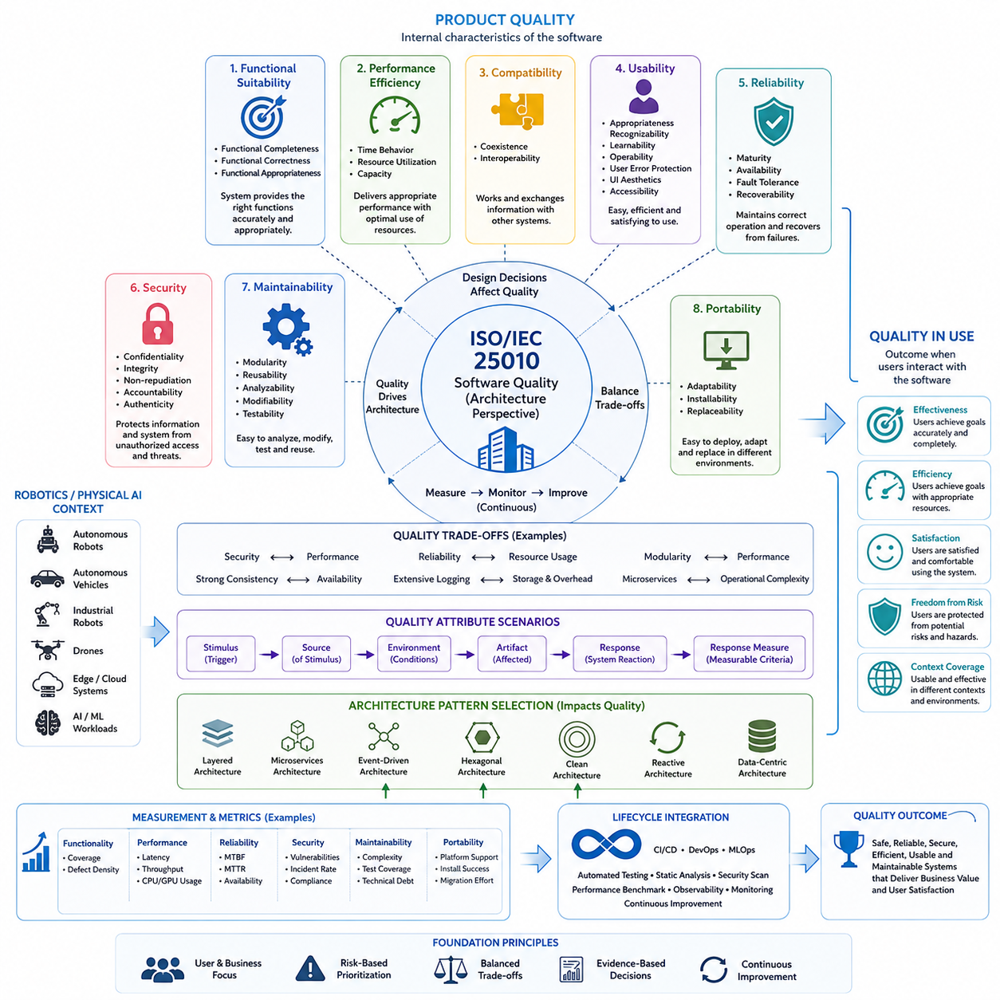
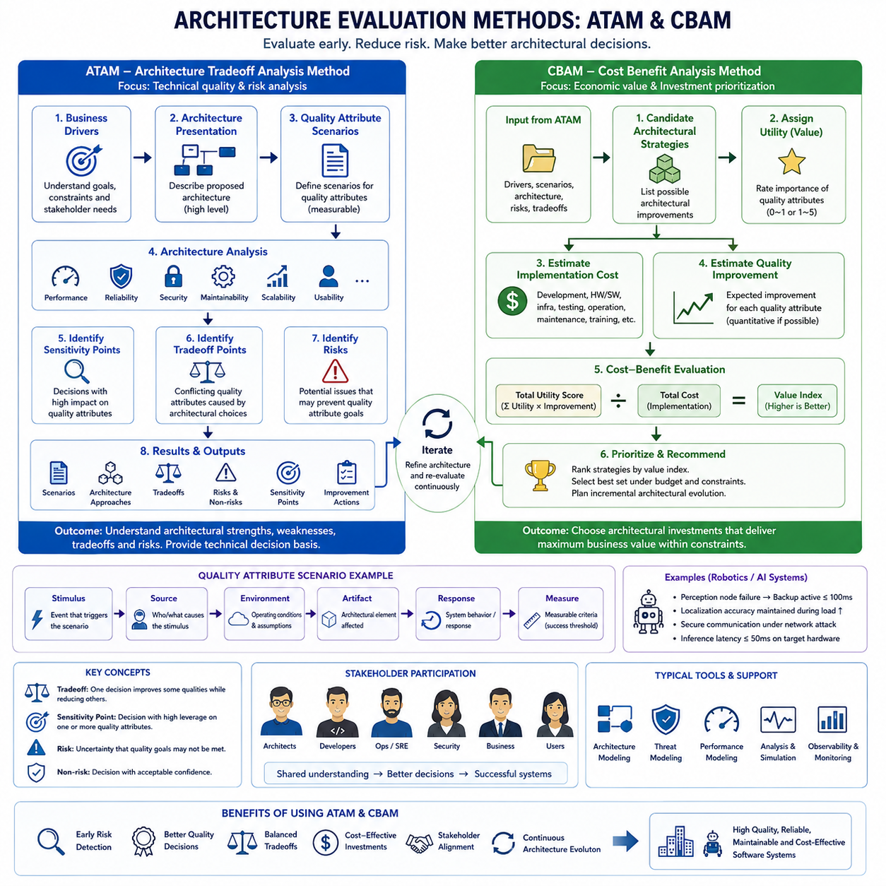
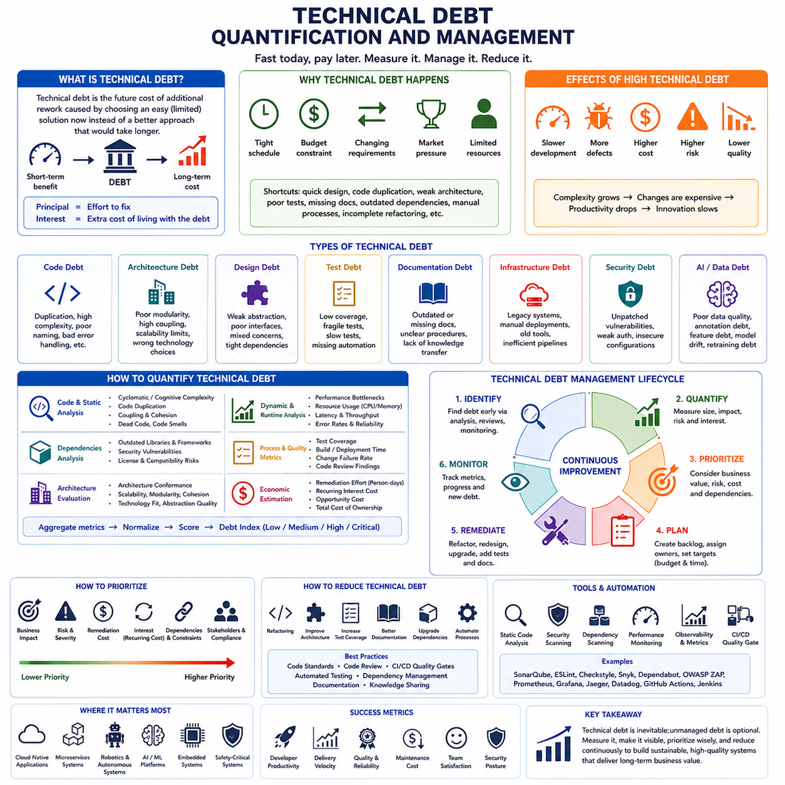
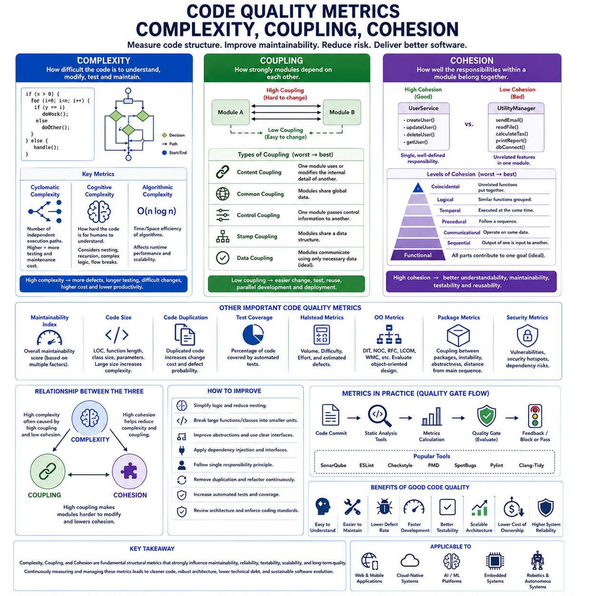
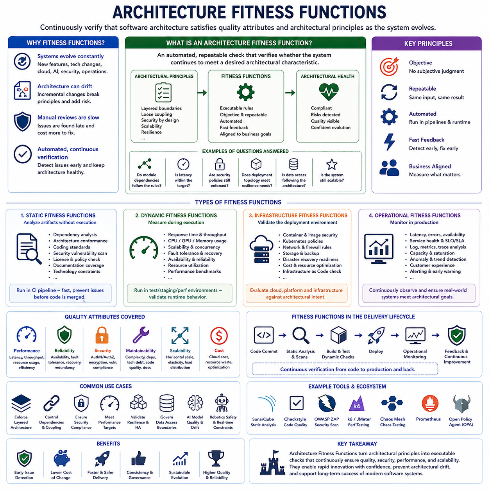
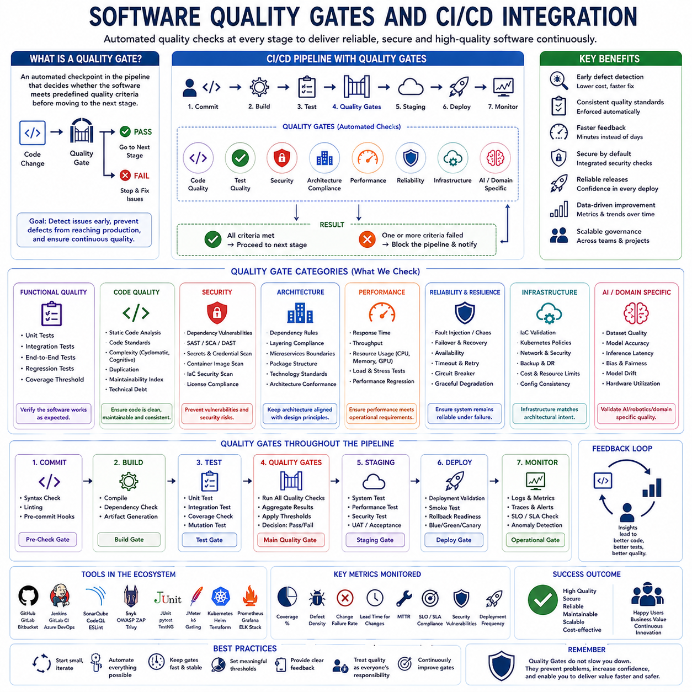
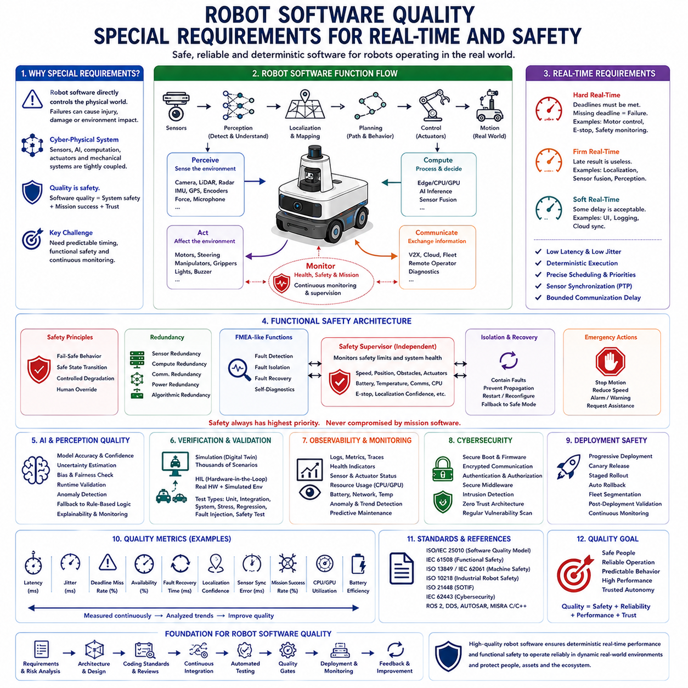
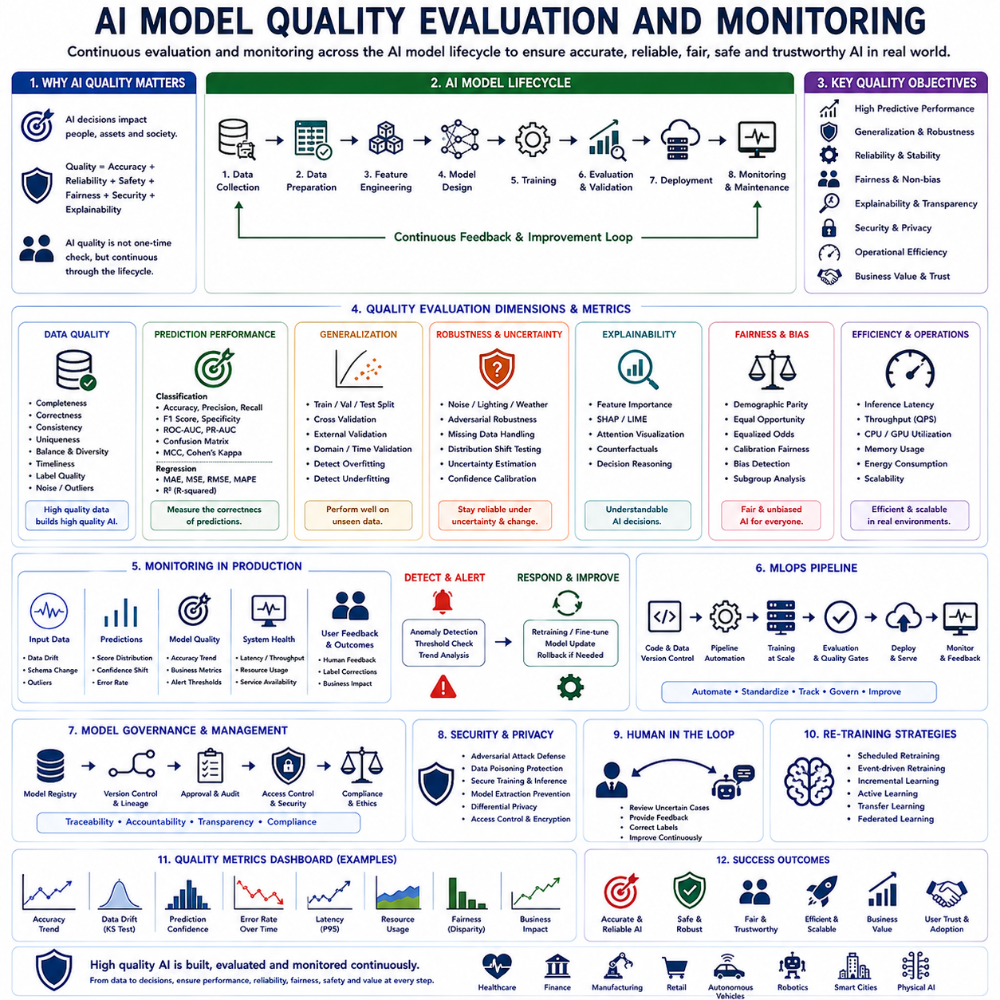
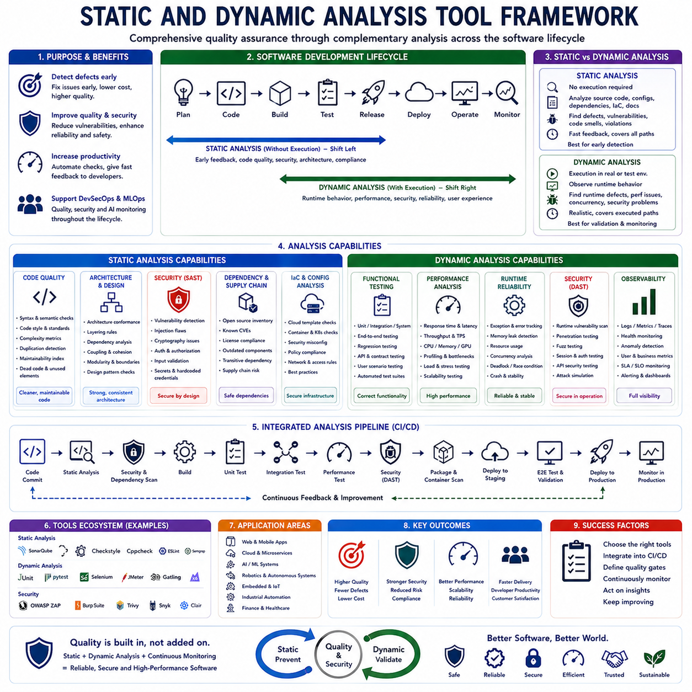
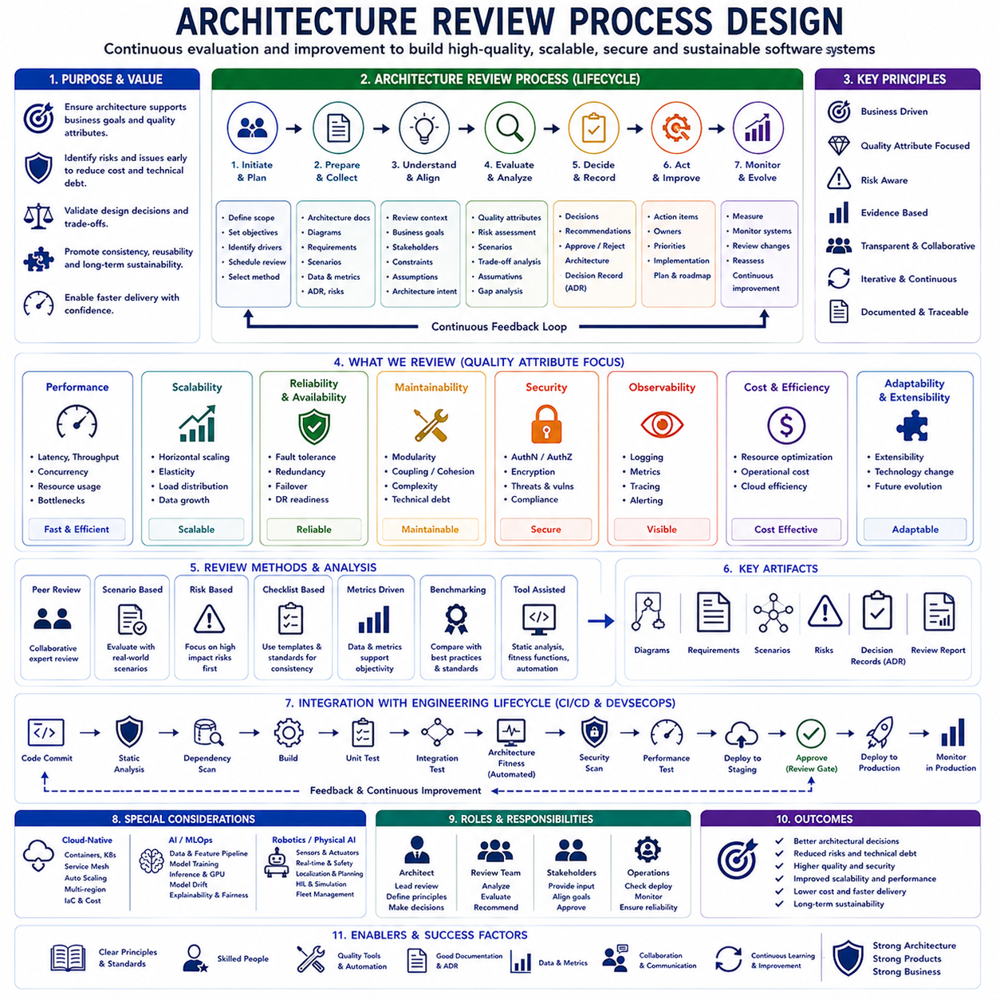

**Volume 1 Software Architecture Fundamentals**

# 08. Software Quality and Architecture Evaluation

## 08.01 Software Quality Attributes: ISO 25010 Perspective

{width="7.268055555555556in" height="7.268055555555556in"}

Software quality has evolved from a narrow focus on functional correctness into a comprehensive discipline that evaluates whether a software system continuously satisfies business objectives, user expectations, operational constraints, security requirements, and long-term maintainability. Modern software architecture recognizes that quality cannot be added after implementation. Instead, quality attributes must be incorporated from the earliest architectural decisions because every design choice affects the long-term behavior of the system. The ISO/IEC 25010 software quality model provides one of the world\'s most widely accepted frameworks for defining, evaluating, and improving software quality. It enables architects, developers, testers, project managers, and system owners to communicate using a common vocabulary when discussing software excellence. Within modern cloud-native systems, AI platforms, distributed robotics, embedded software, autonomous vehicles, and Physical AI systems, ISO 25010 has become an essential architectural reference because it transforms abstract concepts such as reliability, maintainability, and usability into measurable engineering objectives. This chapter belongs to the Software Quality and Architecture Evaluation section of Volume 23 and focuses on understanding software quality from the architectural perspective rather than viewing quality solely as a testing activity.

The ISO/IEC 25010 standard defines software quality through two complementary perspectives. The first is Product Quality, which evaluates the characteristics of the software system itself. The second is Quality in Use, which evaluates how effectively users achieve their goals while interacting with the software under realistic operating conditions. Product Quality concentrates on internal engineering characteristics such as maintainability, security, performance efficiency, reliability, compatibility, portability, and functional suitability. Quality in Use focuses on user-oriented outcomes including effectiveness, efficiency, satisfaction, freedom from risk, and context coverage. These two viewpoints are tightly connected because improvements in internal architectural quality often result in better user experiences, although trade-offs sometimes occur. For example, increasing encryption levels may improve security while introducing additional computational latency. Architecture therefore becomes the discipline of balancing competing quality attributes instead of maximizing only one characteristic.

Functional suitability represents the foundation of software quality because software must first accomplish the tasks it was designed to perform. ISO 25010 describes functional suitability through functional completeness, functional correctness, and functional appropriateness. Functional completeness ensures that all required capabilities are implemented. Functional correctness guarantees that every implemented function produces accurate results under expected operating conditions. Functional appropriateness evaluates whether implemented functions efficiently support user objectives without unnecessary complexity. In robotics software, functional suitability includes accurate localization, obstacle avoidance, trajectory planning, manipulation control, fleet coordination, sensor synchronization, AI inference, and diagnostic services. A robot may possess sophisticated algorithms, but if it cannot consistently complete assigned missions, the software cannot be considered functionally suitable regardless of other quality characteristics.

Performance efficiency has become one of the most critical architectural qualities in modern distributed systems and autonomous robots. ISO 25010 defines performance efficiency through time behavior, resource utilization, and capacity. Time behavior measures response time, latency, throughput, scheduling delay, and deterministic execution. Resource utilization evaluates CPU usage, GPU utilization, memory consumption, storage efficiency, network bandwidth, and energy consumption. Capacity measures the maximum workload that the software can process while maintaining acceptable performance. In autonomous robotics, performance efficiency directly influences safety because delayed perception or planning may produce hazardous behavior. Modern architectures therefore employ asynchronous execution, hardware acceleration, GPU inference optimization, zero-copy communication, parallel pipelines, and efficient scheduling algorithms to satisfy strict performance constraints.

Compatibility refers to the ability of software to coexist and interoperate with other systems operating in shared environments. ISO 25010 separates compatibility into coexistence and interoperability. Coexistence evaluates whether multiple software systems can share hardware resources without interfering with each other. Interoperability measures the ability to exchange information and correctly interpret exchanged data. Modern robotic platforms depend heavily on interoperability because navigation systems, perception modules, cloud services, databases, AI inference engines, simulation platforms, and fleet managers continuously exchange information. Standards such as DDS, ROS 2 interfaces, REST APIs, gRPC, MQTT, OPC UA, and industrial communication protocols greatly improve compatibility while reducing vendor lock-in.

Usability measures how effectively users interact with software while achieving desired objectives. ISO 25010 defines usability through appropriateness recognizability, learnability, operability, user error protection, user interface aesthetics, accessibility, and user engagement. Software architecture strongly influences usability because well-designed interfaces, modular workflows, intuitive configuration mechanisms, and clear operational feedback reduce cognitive workload. Industrial robotics increasingly requires intuitive interfaces since operators often possess manufacturing expertise rather than software engineering backgrounds. Architecture therefore includes configuration management, monitoring dashboards, visualization tools, alarm systems, digital twins, and explainable AI interfaces that improve operator confidence and reduce operational mistakes.

Reliability describes the capability of software to maintain correct operation under specified conditions for defined periods of time. ISO 25010 divides reliability into maturity, availability, fault tolerance, and recoverability. Mature software demonstrates stable operation through extensive validation and operational experience. Availability measures the percentage of time that services remain operational. Fault tolerance evaluates the ability to continue functioning despite hardware failures, communication interruptions, software exceptions, or unexpected environmental conditions. Recoverability measures how rapidly software restores normal operation after failures occur. Modern autonomous systems require extremely high reliability because software failures may interrupt industrial production, compromise safety, or generate significant financial losses. Architectural mechanisms supporting reliability include redundancy, watchdog systems, graceful degradation, health monitoring, heartbeat protocols, checkpoint recovery, state replication, circuit breakers, failover mechanisms, and self-healing orchestration.

Security has evolved into one of the most important quality attributes because software systems increasingly operate in interconnected cyber-physical environments. ISO 25010 defines security through confidentiality, integrity, non-repudiation, accountability, and authenticity. Confidentiality protects sensitive information from unauthorized disclosure. Integrity prevents unauthorized modification of data or software behavior. Non-repudiation ensures that actions cannot later be denied by responsible entities. Accountability records traceable evidence for every significant operation. Authenticity verifies the identities of users, devices, and services. In Physical AI systems, security extends beyond information protection because compromised software may directly manipulate actuators, vehicles, manipulators, drones, or industrial equipment. Security-oriented architectures therefore integrate secure boot, encrypted communication, hardware roots of trust, digital certificates, zero-trust networking, identity management, access control, runtime integrity monitoring, secure OTA updates, and continuous vulnerability assessment.

Maintainability determines how efficiently software can be modified throughout its operational lifetime. ISO 25010 divides maintainability into modularity, reusability, analyzability, modifiability, and testability. Modularity encourages separation of responsibilities through loosely coupled components. Reusability promotes the development of reusable libraries and standardized services. Analyzability enables engineers to diagnose faults and understand system behavior. Modifiability allows new features to be introduced without causing widespread architectural disruption. Testability facilitates automated verification of software correctness. Maintainability becomes particularly valuable in long-lived industrial systems where operational lifetimes frequently exceed ten years. Architectural decisions such as layered architecture, microservices, clean architecture, dependency inversion, interface abstraction, event-driven communication, and continuous integration significantly improve maintainability while reducing long-term engineering costs.

Portability evaluates the ease with which software can operate across different computing environments. ISO 25010 defines portability through adaptability, installability, and replaceability. Adaptability measures the effort required to operate software on different hardware platforms, operating systems, processors, or cloud infrastructures. Installability evaluates deployment complexity. Replaceability assesses whether one software component can substitute another with minimal system disruption. Modern robotics increasingly requires portability because applications execute across embedded controllers, ARM processors, x86 industrial computers, GPU servers, cloud infrastructure, simulation environments, and heterogeneous edge devices. Cross-platform development frameworks, container technologies, hardware abstraction layers, virtualization, platform-independent APIs, and standardized middleware significantly improve portability.

Quality attributes rarely exist independently. Improving one quality characteristic frequently influences several others, creating architectural trade-offs that must be carefully analyzed. Strong encryption increases security but may reduce performance efficiency. Extensive logging improves maintainability and analyzability but increases storage consumption and execution overhead. Redundant computation enhances reliability but consumes additional processing resources and electrical power. Highly modular architectures improve maintainability yet may introduce communication latency between components. Distributed microservices improve scalability but increase operational complexity. Therefore, software architecture becomes the science of balancing competing quality objectives according to organizational priorities rather than maximizing every quality attribute simultaneously.

Architectural quality attribute scenarios provide a structured method for translating abstract quality objectives into measurable engineering requirements. Each scenario typically specifies a stimulus source, triggering event, operating environment, affected artifact, expected system response, and measurable response criterion. Instead of vaguely requiring "high reliability," an architectural scenario may specify that if one perception node unexpectedly terminates during autonomous navigation, the backup node must assume operation within one hundred milliseconds while preserving localization accuracy and preventing vehicle instability. Such scenarios enable architects to evaluate whether proposed architectural designs satisfy operational objectives before implementation begins.

Quality attributes strongly influence architecture pattern selection. Layered architectures emphasize maintainability and separation of concerns. Microservices prioritize scalability, deployment flexibility, and organizational independence. Event-driven architectures improve responsiveness and asynchronous processing. Hexagonal architectures enhance portability and testability. Clean Architecture promotes long-term maintainability through dependency inversion. Reactive architectures maximize responsiveness and resilience under fluctuating workloads. Data-centric architectures emphasize consistency and information sharing. No architecture optimizes every quality attribute equally, so architects must select patterns according to prioritized business requirements rather than technological trends.

Quantitative measurement transforms quality attributes into objective engineering metrics. Functional suitability may be evaluated using functional coverage percentages and defect densities. Performance efficiency may be measured through latency distributions, throughput, CPU utilization, GPU utilization, memory consumption, and energy efficiency. Reliability commonly uses Mean Time Between Failures, Mean Time To Recovery, service availability, fault recovery success rate, and operational uptime. Security employs vulnerability counts, penetration testing coverage, authentication success rates, encryption compliance, and incident response times. Maintainability frequently measures code complexity, coupling, cohesion, code duplication, automated test coverage, change failure rates, and technical debt. Portability evaluates platform migration effort, deployment automation success, and platform compatibility coverage.

Within robotics and Physical AI systems, ISO 25010 quality attributes acquire additional importance because software directly influences physical behavior. Performance efficiency affects motion control stability. Reliability determines mission completion success. Security protects physical assets from malicious manipulation. Maintainability reduces operational downtime during maintenance. Compatibility enables heterogeneous robots to cooperate through standardized communication. Usability improves operator productivity and safety. Functional suitability ensures accurate perception, planning, decision-making, and control. Consequently, software quality becomes inseparable from overall system safety, operational effectiveness, and business value.

Modern DevOps, MLOps, and continuous engineering practices increasingly integrate ISO 25010 quality objectives into automated development pipelines. Continuous integration executes automated unit testing, integration testing, static analysis, security scanning, architectural compliance verification, performance benchmarking, dependency analysis, and code quality evaluation whenever software changes occur. Continuous deployment pipelines evaluate release readiness according to predefined quality gates. Observability platforms continuously monitor operational quality characteristics through metrics, traces, logs, distributed monitoring, anomaly detection, and AI-assisted diagnostics. This integration transforms quality from a final inspection activity into a continuously measured architectural property throughout the software lifecycle.

Artificial intelligence introduces additional complexity because software quality now depends on both deterministic software components and probabilistic learning models. Model accuracy, robustness, explainability, fairness, drift detection, dataset quality, inference latency, hardware utilization, and continual learning influence traditional software quality characteristics. Consequently, modern software architecture extends ISO 25010 by integrating AI-specific quality evaluation methods while preserving the original principles of maintainability, reliability, security, performance efficiency, and functional suitability. AI-native systems require continuous monitoring because model behavior evolves with changing environments, sensor characteristics, and operational data distributions.

From an architectural perspective, ISO/IEC 25010 should not be interpreted as a compliance checklist but as a design philosophy guiding every engineering decision throughout the software lifecycle. High-quality software emerges when architects explicitly prioritize quality attributes, analyze trade-offs, establish measurable quality scenarios, continuously monitor operational metrics, and evolve architectures according to changing technological and business requirements. In industrial robotics, autonomous vehicles, cloud-native AI platforms, and Physical AI systems, software quality becomes a strategic capability that determines long-term scalability, operational reliability, customer satisfaction, engineering productivity, and organizational competitiveness. The ISO 25010 quality model therefore serves not merely as an evaluation framework but as a foundational architectural language that aligns software engineering, system architecture, quality assurance, and business objectives into a unified vision of sustainable software excellence.

## 08.02 Architecture Evaluation Methods: ATAM / CBAM

{width="7.268055555555556in" height="7.268055555555556in"}

Software architecture has become the primary determinant of whether a complex software system succeeds throughout its operational lifetime. While implementation quality certainly influences the final product, numerous industrial studies have shown that the majority of long-term technical risks originate from architectural decisions made during the earliest stages of system design. Decisions regarding modular decomposition, communication mechanisms, deployment topology, data management strategies, fault tolerance, scalability, and security establish the fundamental constraints under which every future software component will operate. Once these architectural decisions become deeply embedded within a large software system, modifying them becomes increasingly expensive and risky. Consequently, modern software engineering emphasizes evaluating software architecture before implementation rather than discovering architectural weaknesses after deployment. Architecture evaluation has therefore evolved into an essential engineering discipline whose objective is to systematically assess whether a proposed architecture satisfies both technical and business objectives while identifying risks before significant development resources have been committed. Within this discipline, the Architecture Tradeoff Analysis Method (ATAM) and the Cost Benefit Analysis Method (CBAM) have become two of the most influential frameworks for evaluating software architectures from complementary perspectives. This chapter belongs to the Software Quality and Architecture Evaluation section and focuses on understanding how ATAM and CBAM guide architectural decision-making for large-scale distributed systems, AI-native platforms, autonomous robotics, cloud computing environments, and Physical AI systems.

Software architecture evaluation differs fundamentally from software testing. Testing verifies that implemented software behaves correctly according to specifications, whereas architecture evaluation investigates whether the underlying architectural structure is capable of satisfying desired quality attributes before complete implementation exists. Architecture evaluation therefore focuses on architectural decisions rather than source code correctness. It investigates questions such as whether the chosen architecture can support future scalability, whether redundancy mechanisms provide sufficient reliability, whether modular decomposition improves maintainability, whether security boundaries adequately isolate sensitive assets, and whether communication patterns satisfy real-time performance requirements. These questions cannot easily be answered through conventional testing because they concern structural characteristics that influence the entire software lifecycle.

Modern architecture evaluation is driven primarily by quality attributes rather than functional requirements. Functional requirements describe what a system should accomplish, while quality attributes describe how well the system performs those functions under various operating conditions. Performance efficiency, reliability, availability, maintainability, security, scalability, interoperability, usability, portability, and modifiability frequently become the dominant factors influencing architectural decisions. Since these quality attributes often compete with one another, architects require structured methods for identifying architectural trade-offs. Architecture evaluation therefore seeks not to determine whether an architecture is universally optimal, but rather whether it appropriately balances competing quality objectives according to stakeholder priorities.

The Architecture Tradeoff Analysis Method, commonly known as ATAM, was developed by the Software Engineering Institute as a structured process for evaluating software architectures through quality attribute analysis. ATAM recognizes that every architectural decision simultaneously improves certain quality characteristics while potentially degrading others. Instead of attempting to eliminate trade-offs, ATAM explicitly identifies, analyzes, documents, and communicates these trade-offs so that stakeholders can make informed engineering decisions. ATAM therefore serves both as an evaluation framework and as a communication process that aligns technical architects, developers, business managers, system operators, customers, and quality assurance teams.

One of the fundamental principles underlying ATAM is that architecture should always be evaluated from the perspective of stakeholders. Different stakeholders naturally prioritize different quality attributes. System operators may emphasize reliability and maintainability. Security engineers prioritize confidentiality and integrity. Business managers focus on development cost and delivery schedules. End users expect usability and responsiveness. AI engineers prioritize computational efficiency and model deployment flexibility. Robotics engineers require deterministic timing and fault tolerance. ATAM encourages all relevant stakeholders to participate in architectural evaluation because architecture ultimately serves the needs of the entire organization rather than a single engineering discipline.

ATAM begins by establishing clear business drivers that define why the software system exists and what organizational objectives it must achieve. Business drivers include market competitiveness, operational efficiency, regulatory compliance, customer satisfaction, long-term maintainability, product evolution, safety certification, deployment flexibility, and lifecycle cost reduction. Understanding business drivers prevents architectural optimization from becoming disconnected from organizational priorities. An architecture that delivers exceptional scalability but exceeds budget constraints may ultimately fail despite technical excellence.

After identifying business drivers, the evaluation team presents the proposed software architecture in sufficient detail to explain its major structural decisions. Architectural documentation typically includes component decomposition, interface definitions, deployment diagrams, communication protocols, technology selection, data management architecture, security boundaries, fault tolerance mechanisms, infrastructure topology, and operational workflows. The objective is not to examine implementation details but rather to understand how architectural structures support desired quality attributes.

Quality attribute scenarios form the core analytical mechanism of ATAM. Rather than discussing abstract concepts such as "high reliability" or "good performance," ATAM converts quality expectations into measurable operational scenarios. Each quality attribute scenario typically specifies a stimulus source, triggering event, operating environment, affected architectural element, expected system response, and measurable response criterion. For example, a reliability scenario for an autonomous robot may state that if a perception process unexpectedly terminates during navigation, redundant perception services must restore operational capability within one hundred milliseconds while maintaining safe vehicle control. Such scenarios transform qualitative expectations into objective engineering requirements.

Once quality attribute scenarios have been defined, architects analyze how the proposed architecture satisfies each scenario. Architectural mechanisms supporting individual quality attributes are examined in detail. Load balancing, asynchronous messaging, distributed caching, hardware acceleration, and parallel execution may support performance efficiency. Redundant services, checkpoint recovery, watchdog monitoring, health supervision, graceful degradation, and failover strategies improve reliability. Encryption, authentication, authorization, certificate management, secure boot, and zero-trust networking strengthen security. Interface abstraction, dependency inversion, modular decomposition, and service isolation enhance maintainability. During evaluation, every architectural mechanism is assessed against relevant quality scenarios.

One of the most valuable outputs produced by ATAM is the identification of architectural sensitivity points. A sensitivity point represents a design decision whose modification significantly affects one or more quality attributes. Database selection may strongly influence scalability. Communication protocols may determine latency characteristics. Scheduling algorithms may directly impact deterministic real-time behavior. Hardware acceleration strategies may dramatically improve AI inference performance while increasing deployment complexity. Recognizing sensitivity points enables architects to focus optimization efforts where they produce the greatest architectural impact.

Closely related to sensitivity points are trade-off points. Trade-off points identify architectural decisions that simultaneously affect multiple quality attributes in conflicting ways. Increasing redundancy improves reliability but increases operational cost. Strong encryption enhances security while introducing computational overhead. Extensive logging improves diagnosability but increases storage requirements and processing latency. Fine-grained microservices improve modularity but generate additional network communication. Distributed architectures improve scalability while increasing operational complexity. ATAM explicitly documents these trade-offs so that stakeholders understand the consequences of architectural decisions before implementation begins.

Risk identification represents another central outcome of ATAM. Architectural risks are design decisions that may prevent quality objectives from being achieved. Risks may arise because architectural mechanisms remain insufficiently validated, because assumptions lack supporting evidence, because technological dependencies introduce uncertainty, or because conflicting quality requirements remain unresolved. Risk identification allows engineering organizations to prioritize architectural improvements before expensive implementation work proceeds. Equally important, ATAM also identifies non-risks, representing architectural decisions that successfully satisfy quality scenarios with acceptable confidence.

ATAM concludes by documenting architectural findings, prioritized risks, trade-offs, sensitivity points, quality scenarios, architectural approaches, and recommended improvement actions. The resulting evaluation report becomes an essential reference throughout software development because it explains not only what architectural decisions were made but also why those decisions were selected and what limitations they impose. This documentation supports future maintenance, architectural evolution, onboarding of new engineers, and long-term technical governance.

While ATAM focuses primarily on technical quality evaluation, the Cost Benefit Analysis Method extends architecture evaluation by incorporating economic decision-making. CBAM recognizes that organizations operate under limited budgets, finite engineering resources, and competing business priorities. Even when multiple architectural improvements appear technically beneficial, organizations cannot implement every possible enhancement simultaneously. CBAM therefore provides a structured methodology for determining which architectural investments generate the greatest business value relative to their implementation costs.

CBAM builds upon the architectural understanding produced by ATAM. Business drivers, quality attribute scenarios, architectural risks, and trade-off analysis established during ATAM become valuable inputs for economic evaluation. Rather than replacing ATAM, CBAM complements it by introducing financial analysis into architectural decision-making. This combination enables organizations to evaluate architecture from both technical and business perspectives.

The first stage of CBAM identifies candidate architectural strategies capable of improving one or more quality attributes. Architectural strategies may include introducing distributed caching, implementing service redundancy, migrating to microservices, adopting container orchestration, improving observability, deploying AI accelerators, enhancing cybersecurity mechanisms, introducing automated testing pipelines, upgrading networking infrastructure, or redesigning deployment architectures. Each strategy represents a possible architectural investment requiring engineering effort.

Stakeholders then estimate the utility associated with each quality attribute. Utility reflects the relative business importance of achieving improvements in specific quality characteristics. Safety-critical robotics may assign extremely high utility to reliability and deterministic timing. Financial systems prioritize security and availability. Consumer software emphasizes usability and responsiveness. Cloud platforms frequently prioritize scalability and operational efficiency. Utility estimation allows organizations to align architectural investment with strategic business priorities rather than purely technical preferences.

Implementation cost estimation forms another essential component of CBAM. Costs include software development effort, infrastructure acquisition, hardware upgrades, engineering salaries, testing activities, certification processes, deployment complexity, maintenance expenses, training requirements, operational disruption, and long-term ownership costs. Accurate cost estimation requires collaboration between software architects, engineering managers, operations teams, financial analysts, and project planners.

Expected quality improvement is then estimated for every architectural strategy. Rather than simply determining whether a strategy improves performance or reliability, CBAM attempts to quantify the expected magnitude of improvement. Distributed caching may reduce average response latency by forty percent. Service replication may increase availability from 99.5 percent to 99.95 percent. GPU acceleration may double AI inference throughput. Automated testing pipelines may reduce post-release defects by sixty percent. Quantifying expected improvements enables objective comparison among competing architectural investments.

CBAM combines estimated utility improvements with implementation costs to calculate the relative return on architectural investment. Strategies delivering significant business value at relatively low implementation cost naturally receive higher priority. Conversely, expensive architectural initiatives providing only marginal quality improvements may be postponed or eliminated. This investment-oriented perspective enables architecture to become directly integrated into organizational portfolio management rather than existing as an isolated engineering activity.

One of CBAM\'s greatest strengths lies in supporting incremental architectural evolution. Large software systems rarely undergo complete architectural replacement because such transformations involve excessive risk and cost. Instead, architecture evolves through numerous smaller improvements implemented over many years. CBAM assists organizations in selecting architectural improvements that maximize cumulative business value while respecting financial and operational constraints. Architecture therefore becomes an ongoing investment process rather than a one-time design activity.

ATAM and CBAM become particularly valuable within robotics and Physical AI systems because these environments simultaneously involve demanding technical requirements and substantial hardware investments. Autonomous mobile robots require deterministic control timing, reliable perception, fault-tolerant navigation, secure fleet communication, maintainable software modules, scalable cloud coordination, and efficient AI inference. Architectural improvements frequently require modifications spanning embedded software, edge computing, GPU infrastructure, networking, cloud services, simulation environments, and operational workflows. Structured evaluation methods help organizations prioritize investments that deliver measurable operational improvements while minimizing technical and financial risks.

For example, an autonomous warehouse robot platform may consider several competing architectural enhancements including migration from centralized fleet management to distributed edge orchestration, introduction of AI inference acceleration using dedicated GPUs, implementation of redundant localization pipelines, deployment of zero-trust security architecture, or adoption of event-driven communication infrastructure. ATAM evaluates how each architectural strategy influences quality attributes such as latency, scalability, reliability, maintainability, and cybersecurity. CBAM subsequently evaluates which combination of improvements provides the highest organizational value relative to implementation costs, enabling management to allocate engineering resources more effectively.

Modern cloud-native AI platforms similarly benefit from combined ATAM and CBAM evaluation. Architectural decisions involving Kubernetes orchestration, service meshes, distributed databases, vector storage, GPU scheduling, model serving frameworks, feature stores, observability platforms, and hybrid edge-cloud deployment involve numerous competing quality objectives. Technical excellence alone cannot determine optimal architecture because financial constraints, operational complexity, organizational expertise, and long-term maintenance costs significantly influence architectural success. Integrating technical and economic evaluation produces more balanced architectural decisions.

Continuous architecture has further increased the relevance of ATAM and CBAM. Traditional architecture evaluation often occurred once before implementation. Modern DevOps and MLOps practices encourage continuous architectural assessment throughout the software lifecycle. Architectural assumptions evolve as software grows, workloads change, user expectations expand, hardware platforms improve, AI models mature, and operational environments become increasingly complex. Continuous architecture evaluation therefore integrates quality monitoring, performance analysis, security assessment, reliability metrics, operational telemetry, cost optimization, and architectural governance into ongoing engineering workflows rather than isolated review meetings.

Tool support increasingly enhances architecture evaluation. Architecture modeling environments, dependency visualization tools, performance simulators, static analysis frameworks, threat modeling platforms, observability dashboards, digital twins, and AI-assisted architectural analysis systems provide quantitative evidence supporting architectural decisions. Nevertheless, human judgment remains indispensable because architecture ultimately involves balancing competing quality objectives under uncertain future conditions. Neither ATAM nor CBAM attempts to automate architectural decision-making completely. Instead, they provide structured reasoning frameworks that improve the quality, transparency, traceability, and repeatability of engineering decisions.

From an organizational perspective, architecture evaluation also strengthens communication among diverse stakeholder groups. Software architects often communicate using technical terminology, whereas business executives focus on financial return, operational managers emphasize service continuity, and customers prioritize functional capabilities. ATAM establishes a common language centered around quality attributes, while CBAM extends this language into measurable business value. Together they bridge the traditional gap between engineering excellence and organizational strategy.

Ultimately, architecture evaluation should not be viewed as a compliance exercise performed merely to satisfy governance requirements. Its true purpose is to increase confidence that architectural decisions will continue supporting organizational objectives throughout the software lifecycle. ATAM provides systematic understanding of architectural quality, identifies risks, reveals trade-offs, and validates quality attribute satisfaction. CBAM complements this analysis by ensuring that architectural investments maximize business value within realistic economic constraints. Together these methodologies enable engineering organizations to develop software architectures that are technically robust, economically sustainable, operationally resilient, and capable of evolving alongside emerging technologies such as cloud-native computing, AI-native systems, autonomous robotics, distributed intelligence, and Physical AI. Within modern software architecture, ATAM and CBAM have therefore become indispensable frameworks for transforming architectural design from intuition-driven practice into evidence-based engineering decision-making.

## 08.03 Technical Debt Quantification and Management

{width="7.268055555555556in" height="7.268055555555556in"}

Technical debt has become one of the most significant concepts in modern software engineering because it explains why software systems become increasingly difficult to maintain, extend, and operate over time despite initially functioning correctly. As software products evolve, engineering teams continuously make design decisions under constraints such as limited schedules, restricted budgets, changing customer requirements, rapidly advancing technologies, and competitive market pressures. Many of these decisions intentionally or unintentionally postpone engineering improvements in order to achieve short-term business objectives. Although these shortcuts often accelerate initial delivery, they introduce hidden costs that accumulate throughout the software lifecycle. Similar to financial debt, technical debt provides immediate benefits while generating future obligations in the form of increased maintenance effort, reduced productivity, higher defect rates, operational complexity, and architectural degradation. Consequently, technical debt should not be viewed merely as poor programming practice but rather as an economic and architectural phenomenon requiring systematic measurement, continuous monitoring, strategic prioritization, and disciplined management. Within modern cloud-native platforms, distributed systems, AI-native architectures, autonomous robotics, embedded software, and Physical AI systems, technical debt directly influences long-term scalability, software quality, operational reliability, cybersecurity, and organizational competitiveness.

The metaphor of technical debt was originally introduced to explain the relationship between rapid software development and long-term maintenance costs. Financial debt allows organizations to acquire immediate resources while accepting future repayment obligations with accumulated interest. Technical debt operates according to a similar principle. Development teams intentionally accept simplified architectural solutions, temporary implementations, incomplete documentation, limited testing, duplicated code, outdated dependencies, or postponed refactoring in exchange for faster delivery. The "principal" represents the engineering work required to eliminate the debt, while the "interest" represents the additional effort repeatedly consumed whenever developers modify, maintain, test, deploy, or extend the affected software. As technical debt accumulates, engineering productivity gradually declines because every future modification becomes increasingly expensive.

Technical debt should not automatically be considered a negative engineering practice. In many situations, deliberately accepting technical debt represents a rational business decision. Startup companies frequently prioritize rapid market entry over perfect architectural design. Research projects often require rapid prototyping to validate feasibility before investing in production-quality implementations. Emergency security patches may temporarily introduce architectural compromises in order to eliminate immediate operational risks. Experimental AI systems often evolve through numerous iterations before stable architectures emerge. In these situations, technical debt functions as a strategic investment supporting business agility. Problems arise only when debt remains unmanaged, undocumented, or continuously accumulates without repayment strategies.

Modern software engineering recognizes several categories of technical debt. Code debt originates from implementation-level problems such as duplicated logic, excessive complexity, inconsistent coding conventions, insufficient documentation, inadequate error handling, or poor naming practices. Architecture debt emerges when fundamental structural decisions reduce system maintainability, scalability, modularity, security, or flexibility. Design debt results from weak abstraction, improper interface design, tight coupling, or insufficient separation of concerns. Test debt appears when automated testing remains incomplete, unreliable, or outdated. Documentation debt accumulates when architectural documentation, API specifications, operational procedures, or deployment instructions become inaccurate or incomplete. Infrastructure debt develops through obsolete deployment pipelines, outdated cloud configurations, legacy hardware dependencies, or inefficient operational tooling. Security debt arises from postponed vulnerability remediation, outdated authentication mechanisms, unsupported cryptographic libraries, insecure configurations, or delayed software updates. AI systems introduce additional forms of debt including dataset debt, feature engineering debt, model management debt, annotation debt, and model drift debt.

Architecture debt deserves particular attention because it frequently generates the highest long-term costs. Unlike implementation defects that remain localized, architectural weaknesses influence every component of a software system. Poor module decomposition, inappropriate communication mechanisms, tightly coupled services, monolithic dependencies, inefficient data management, inadequate scalability planning, weak fault isolation, or insufficient hardware abstraction create structural limitations that become increasingly difficult to eliminate as systems grow. Architecture debt often remains invisible during early development because software initially satisfies functional requirements. However, as feature requests increase and system complexity expands, architectural limitations significantly reduce engineering velocity.

Technical debt originates from numerous organizational and technical factors. Unrealistic delivery schedules encourage developers to prioritize immediate functionality over long-term maintainability. Frequent requirement changes lead to temporary implementations becoming permanent solutions. Insufficient architectural governance allows inconsistent design decisions across development teams. Lack of engineering standards produces heterogeneous coding styles and incompatible module interfaces. Limited automated testing increases defect accumulation. Inadequate code review processes permit low-quality implementations to enter production environments. Organizational turnover causes architectural knowledge to disappear when experienced engineers leave. Legacy technology dependencies delay modernization efforts because migration appears too expensive. Collectively, these factors continuously generate new technical debt unless disciplined engineering processes actively control them.

One of the greatest challenges associated with technical debt is its invisibility. Unlike software defects that immediately produce operational failures, technical debt often remains hidden while gradually increasing maintenance costs. Engineering teams may continue delivering functional software despite growing architectural deterioration. Productivity declines slowly rather than suddenly. Feature implementation requires progressively greater effort. Bug resolution becomes increasingly complex. Build pipelines consume additional execution time. Deployment procedures become more fragile. New developers require longer onboarding periods. System reliability gradually decreases. Since these symptoms emerge incrementally, organizations frequently underestimate the severity of technical debt until significant engineering resources become devoted exclusively to maintenance activities.

Technical debt quantification attempts to transform these hidden costs into measurable engineering metrics. Quantitative measurement enables organizations to prioritize improvement initiatives objectively rather than relying solely on subjective engineering intuition. Numerous measurement approaches have therefore emerged across software engineering research and industrial practice. These approaches combine source code analysis, architectural assessment, operational monitoring, process evaluation, financial estimation, and quality metrics into comprehensive technical debt measurement frameworks.

Code complexity represents one of the most widely used technical debt indicators. Cyclomatic complexity measures the number of independent execution paths within software modules. High complexity frequently indicates increased maintenance effort, greater testing requirements, and elevated defect probability. Cognitive complexity extends traditional complexity measurement by evaluating how difficult software becomes for developers to understand. Excessive nesting, recursive dependencies, complicated conditional logic, and deeply interconnected execution flows increase cognitive complexity while reducing long-term maintainability.

Code duplication provides another important debt indicator. Repeated implementation of identical or highly similar functionality increases maintenance costs because modifications must be performed consistently across multiple locations. Even small inconsistencies eventually generate defects, unexpected behavior, and increased testing effort. Modern static analysis tools automatically identify duplicated code segments and estimate associated maintenance costs. Refactoring duplicated logic into reusable abstractions often produces substantial reductions in technical debt.

Coupling and cohesion measurements provide valuable architectural insights. High coupling indicates excessive dependencies among software modules, making modifications increasingly difficult because changes propagate throughout the system. Strong cohesion indicates that individual modules maintain focused responsibilities and well-defined functionality. Low cohesion frequently suggests improper modular decomposition and reduced maintainability. Architectural evaluation therefore emphasizes minimizing unnecessary coupling while maximizing functional cohesion.

Dependency analysis has become increasingly important within modern software ecosystems. Contemporary applications depend upon hundreds or even thousands of external libraries, frameworks, operating system packages, cloud services, AI models, and container images. Outdated dependencies introduce security vulnerabilities, compatibility problems, unsupported interfaces, licensing risks, and operational instability. Dependency debt continuously grows unless organizations maintain structured update strategies, vulnerability scanning, compatibility testing, and lifecycle management processes.

Static analysis tools provide automated mechanisms for identifying technical debt before software enters production environments. These tools examine source code without executing programs and identify coding standard violations, resource leaks, dead code, duplicated implementations, architectural violations, security vulnerabilities, concurrency risks, memory management problems, and maintainability concerns. Static analysis complements human code review by consistently applying predefined quality rules across large software repositories while generating quantitative technical debt estimates.

Dynamic analysis extends technical debt evaluation into operational environments. Runtime profiling identifies performance bottlenecks, memory consumption patterns, resource leaks, excessive network latency, synchronization delays, thread contention, inefficient database queries, and abnormal hardware utilization. Many operational problems remain invisible during static analysis because they emerge only under realistic execution conditions. Continuous runtime monitoring therefore provides valuable evidence regarding operational debt accumulating throughout deployed systems.

Architecture evaluation frameworks further strengthen technical debt quantification. Architectural reviews identify obsolete design patterns, excessive complexity, inconsistent service boundaries, scalability limitations, technology fragmentation, deployment inefficiencies, and insufficient fault isolation. Architecture debt frequently requires qualitative expert judgment because structural weaknesses cannot always be detected through automated source code analysis alone. Combining quantitative metrics with expert architectural assessment therefore produces more comprehensive debt evaluations.

Technical debt interest represents one of the most valuable economic concepts associated with debt management. Interest measures the recurring engineering effort consumed because debt remains unresolved. A poorly modularized software component may require several additional developer-days whenever new functionality must be implemented. Legacy deployment pipelines may extend release preparation from several minutes to several hours. Inefficient testing infrastructure may increase validation effort before every production deployment. These repeated costs accumulate continuously throughout the software lifecycle. Organizations therefore increasingly estimate technical debt interest when determining improvement priorities.

Financial estimation techniques transform technical debt into economic metrics understandable by business stakeholders. Engineering organizations estimate remediation costs by calculating developer effort, infrastructure upgrades, testing activities, documentation improvements, deployment modifications, training requirements, and operational transition expenses. Opportunity costs are also considered because engineering resources allocated to technical debt reduction cannot simultaneously develop new customer features. Economic analysis therefore assists management in balancing innovation against sustainability.

Prioritization represents the central management activity within technical debt governance. Since organizations rarely possess sufficient resources to eliminate every identified debt item simultaneously, prioritization frameworks evaluate multiple factors including business impact, operational risk, quality degradation, remediation cost, dependency relationships, customer influence, regulatory requirements, cybersecurity implications, and strategic objectives. High-risk architectural debt affecting safety-critical robotics naturally receives higher priority than cosmetic documentation improvements.

Technical debt management requires structured governance throughout the software lifecycle rather than isolated refactoring efforts. Successful organizations establish explicit debt identification processes, architectural review boards, quality gates, coding standards, automated quality monitoring, dependency management policies, documentation requirements, and continuous improvement practices. Technical debt registers frequently resemble financial accounting systems by documenting debt items, estimated remediation costs, responsible owners, business impacts, risk levels, and planned resolution schedules. Such transparency prevents technical debt from becoming invisible organizational knowledge.

Refactoring serves as the primary engineering mechanism for reducing technical debt. Refactoring modifies software structure without changing externally observable functionality. Effective refactoring simplifies code, improves modularity, strengthens abstraction boundaries, eliminates duplication, reduces coupling, increases cohesion, modernizes interfaces, updates dependencies, improves documentation, and expands automated testing. Large-scale refactoring should be guided by architectural objectives rather than isolated code cleanup because localized improvements may fail to resolve underlying architectural debt.

Continuous Integration and Continuous Delivery pipelines increasingly integrate technical debt monitoring into automated development workflows. Static analysis executes whenever source code changes occur. Code quality gates prevent low-quality implementations from entering production branches. Dependency scanners automatically identify vulnerable packages. Architecture compliance tests verify module dependencies against predefined architectural rules. Test coverage measurements prevent testing debt from expanding. Performance benchmarks identify emerging efficiency problems before deployment. These automated practices transform technical debt management from reactive maintenance into continuous engineering governance.

Artificial intelligence introduces additional dimensions of technical debt that differ substantially from traditional software systems. Machine learning models depend not only on source code but also on datasets, training pipelines, feature engineering, annotation quality, model versioning, inference infrastructure, monitoring systems, and operational feedback loops. Dataset inconsistencies, outdated annotations, feature duplication, poorly documented preprocessing pipelines, inadequate model reproducibility, and uncontrolled model drift all contribute to AI-specific technical debt. Unlike conventional software defects, AI debt frequently emerges because changing real-world environments gradually invalidate previously accurate models. Continuous monitoring and retraining therefore become essential debt management activities within AI-native systems.

Robotics and Physical AI platforms introduce particularly complex forms of technical debt because software interacts directly with heterogeneous hardware systems, real-time control loops, embedded processors, cloud infrastructure, edge computing platforms, communication networks, perception pipelines, and AI inference engines. Hardware abstraction debt, sensor integration debt, calibration debt, synchronization debt, simulation debt, and safety certification debt accumulate alongside traditional software debt. Architectural decisions affecting deterministic timing, fault tolerance, hardware compatibility, cybersecurity, and maintainability influence not only software quality but also physical system safety and operational reliability.

For autonomous mobile robots, technical debt may appear when rapid prototype implementations remain deployed within production fleets. Temporary sensor calibration procedures become permanent operational practices. Hard-coded navigation parameters replace adaptive configuration mechanisms. Manual deployment scripts substitute automated release pipelines. Communication protocols evolve inconsistently across software modules. AI inference pipelines depend upon obsolete hardware accelerators. Although these compromises may initially accelerate product development, they significantly increase long-term maintenance effort while reducing scalability and reliability across expanding robot fleets.

Modern DevOps, Site Reliability Engineering, and Platform Engineering practices increasingly treat technical debt as a continuously managed operational metric rather than an occasional software maintenance concern. Dashboards combine code quality metrics, dependency status, security vulnerabilities, deployment frequency, incident rates, system availability, testing coverage, architectural compliance, and operational performance into unified engineering quality indicators. Engineering leadership can therefore monitor technical debt evolution alongside conventional business performance metrics.

Organizational culture ultimately determines the long-term success of technical debt management. Teams that reward only rapid feature delivery unintentionally encourage uncontrolled debt accumulation. Conversely, organizations recognizing software quality as a strategic investment allocate dedicated engineering capacity for continuous refactoring, architectural modernization, dependency updates, automated testing expansion, documentation improvement, and operational optimization. Sustainable software engineering therefore requires balancing innovation with disciplined quality management throughout the product lifecycle.

From an architectural perspective, technical debt should not be interpreted as evidence of engineering failure but rather as an inevitable consequence of developing complex software under changing business conditions. The objective is not to eliminate every debt item completely because such an objective would be economically unrealistic. Instead, successful engineering organizations continuously identify, quantify, prioritize, monitor, and strategically reduce technical debt according to business value, operational risk, and long-term architectural sustainability. Quantitative measurement transforms technical debt from an invisible liability into an observable engineering asset that can be managed through evidence-based decision-making. Within modern cloud-native platforms, AI-native architectures, distributed robotics, autonomous systems, and Physical AI ecosystems, disciplined technical debt quantification and management have therefore become essential capabilities for sustaining software quality, engineering productivity, operational resilience, and long-term technological competitiveness.

## 08.04 Code Quality Metrics: Complexity, Coupling, Cohesion

{width="7.268055555555556in" height="7.268055555555556in"}

Software quality has become one of the primary determinants of long-term system success because modern software products continuously evolve throughout their operational lifetime. New features, changing customer requirements, expanding user populations, emerging technologies, cybersecurity threats, and evolving business objectives require software systems to be modified repeatedly over many years. Although functional correctness remains essential, organizations increasingly recognize that software quality cannot be evaluated solely by whether programs produce correct outputs. High-quality software must also remain understandable, maintainable, extensible, testable, reliable, secure, and efficient as it evolves. Consequently, objective measurement of software quality has become an essential engineering discipline rather than a subjective assessment. Code quality metrics provide quantitative evidence that allows software architects, developers, quality assurance engineers, technical managers, and business stakeholders to evaluate implementation quality objectively, identify architectural weaknesses, monitor technical debt, prioritize improvement efforts, and predict long-term maintenance costs. Among the numerous software quality indicators proposed over several decades, complexity, coupling, and cohesion have emerged as the three most fundamental structural metrics because they directly influence almost every other software quality attribute, including maintainability, reliability, scalability, performance, testability, security, and architectural sustainability.

Software metrics transform qualitative engineering concepts into measurable quantities that support evidence-based decision-making. Without objective metrics, evaluating software quality becomes largely dependent upon individual experience, intuition, or subjective code review. Two engineers examining the same source code may reach different conclusions regarding maintainability or architectural quality. Quantitative metrics reduce this uncertainty by providing consistent evaluation criteria applicable across projects, organizations, programming languages, and development teams. Software metrics therefore serve not only as quality indicators but also as communication tools that establish common engineering standards.

Code quality metrics should never be interpreted as isolated numerical targets. Instead, they represent indicators describing underlying software characteristics. A module exhibiting high complexity does not automatically imply poor software, nor does low coupling alone guarantee architectural excellence. Metrics must always be interpreted within the broader architectural context, considering system requirements, domain complexity, performance constraints, safety requirements, hardware limitations, organizational objectives, and business priorities. Effective engineering organizations therefore combine quantitative metrics with qualitative architectural judgment rather than relying exclusively upon numerical thresholds.

Complexity represents the degree of difficulty associated with understanding, modifying, testing, verifying, or maintaining software. As software complexity increases, developers require greater effort to comprehend system behavior, identify defects, implement enhancements, and validate correctness. High complexity also increases the probability of introducing new defects because modifications affect increasingly intricate execution paths and dependency relationships. Consequently, complexity measurement has become one of the most widely adopted approaches for evaluating software quality.

Cyclomatic complexity, introduced by Thomas McCabe, remains one of the most influential software complexity metrics. Cyclomatic complexity measures the number of linearly independent execution paths through a software module. Every conditional statement, loop, exception handler, logical branch, and decision point increases the number of possible execution paths requiring verification. Modules containing excessive branching structures require substantially larger testing effort because each independent path should ideally be validated through appropriate test cases. High cyclomatic complexity therefore directly correlates with increased testing cost, greater defect probability, and reduced maintainability.

Cyclomatic complexity also provides practical guidance for software decomposition. Functions exhibiting extremely high complexity frequently perform multiple unrelated responsibilities. Splitting such functions into smaller, more focused modules often improves readability, simplifies testing, enhances reusability, and reduces maintenance effort. Modern coding standards therefore frequently recommend maintaining cyclomatic complexity below predefined thresholds while recognizing that acceptable values depend upon application domains and functional requirements.

Although cyclomatic complexity remains valuable, it does not fully capture the cognitive effort required for software comprehension. Cognitive complexity extends traditional complexity measurement by evaluating how difficult software becomes for human developers to understand. Deep nesting structures, recursive logic, complex Boolean expressions, intertwined control flows, excessive exception handling, and multiple interacting abstractions increase cognitive complexity even when cyclomatic complexity remains relatively moderate. Cognitive complexity therefore emphasizes human readability rather than purely mathematical execution path analysis. Since software maintenance is performed by engineers rather than compilers, cognitive complexity increasingly serves as an important maintainability indicator.

Another important complexity measure concerns algorithmic complexity, which evaluates computational efficiency rather than structural readability. Time complexity estimates execution time growth relative to input size, while space complexity estimates memory consumption. Efficient algorithms improve runtime performance, reduce infrastructure costs, minimize energy consumption, and support scalability. However, algorithmic optimization should not excessively increase structural complexity because highly optimized implementations sometimes become significantly more difficult to maintain. Architecture therefore requires balancing computational efficiency with software simplicity.

Code size metrics also contribute to complexity assessment. Large functions, lengthy classes, oversized modules, excessive parameter lists, deeply nested packages, and extensive inheritance hierarchies frequently indicate structural problems. While software size alone does not determine quality, unusually large implementation units often suggest insufficient modular decomposition. Smaller, well-defined components generally improve readability, testing, reuse, and architectural flexibility.

Complexity influences nearly every aspect of software engineering. Highly complex modules require greater onboarding effort for new developers. Code reviews consume additional engineering time because reviewers must understand complicated execution paths. Defect diagnosis becomes increasingly difficult because failures may originate from numerous interacting conditions. Automated testing requires larger test suites covering additional execution paths. Refactoring becomes riskier because modifications affect numerous interconnected behaviors. Consequently, continuous complexity monitoring enables organizations to identify maintainability risks before they significantly influence development productivity.

Coupling represents the degree of dependency among software modules. A software component exhibiting high coupling depends extensively upon the implementation details, interfaces, internal states, or operational behavior of other components. Low coupling indicates that modules communicate through stable, well-defined abstractions while remaining largely independent of one another. Modern software architecture consistently emphasizes minimizing unnecessary coupling because loosely coupled systems adapt more effectively to changing requirements.

Several forms of coupling exist within software systems. Content coupling represents the strongest and least desirable dependency because one module directly modifies another module\'s internal implementation. Common coupling occurs when multiple modules share global state, increasing unintended interactions. Control coupling appears when one module determines another module\'s behavior through control parameters. Stamp coupling arises when entire data structures are transferred despite only small portions being required. Data coupling, involving exchange of only necessary information through well-defined interfaces, generally represents the preferred communication mechanism.

High coupling introduces numerous engineering challenges. Small modifications within one component propagate unexpectedly throughout dependent modules. Testing becomes increasingly difficult because isolated verification requires complex dependency simulation. Parallel development slows because engineering teams must coordinate closely whenever shared interfaces change. Deployment flexibility decreases because components cannot easily evolve independently. System reliability also suffers because failures propagate more readily through tightly connected architectures.

Low coupling significantly improves architectural flexibility. Individual services can evolve independently. Components become replaceable without affecting unrelated modules. Automated testing becomes simpler because isolated modules require fewer external dependencies. Continuous deployment accelerates because modifications remain localized. Distributed systems, microservices, plugin architectures, event-driven systems, and cloud-native platforms all prioritize loose coupling as a fundamental architectural principle supporting scalability and long-term maintainability.

Dependency injection frameworks, interface abstraction, inversion of control, event-driven communication, asynchronous messaging, publish-subscribe architectures, service discovery mechanisms, and standardized APIs all contribute to reducing software coupling. However, architects should recognize that completely eliminating coupling is neither possible nor desirable because software components must collaborate to deliver useful functionality. The objective is therefore minimizing unnecessary dependencies while preserving effective system integration.

Cohesion describes the degree to which responsibilities within an individual software component logically belong together. High cohesion indicates that all functionality contained within a module contributes toward a single well-defined purpose. Low cohesion suggests that unrelated responsibilities have been combined within the same implementation unit. Whereas coupling measures relationships between different modules, cohesion evaluates internal consistency within individual modules.

High cohesion strongly supports the Single Responsibility Principle because each component focuses upon one clearly defined functional objective. Software modules exhibiting high cohesion become easier to understand because developers immediately recognize each component\'s purpose. Maintenance improves because modifications remain localized within logically consistent units. Testing becomes more straightforward because each module requires validation of limited functionality. Reusability increases because focused components adapt more readily across multiple applications.

Several levels of cohesion have traditionally been identified within software engineering literature. Coincidental cohesion represents the weakest form because unrelated functionality is grouped arbitrarily. Logical cohesion groups similar operations without representing a unified responsibility. Temporal cohesion combines operations executed simultaneously during initialization or shutdown. Procedural cohesion groups activities following similar execution sequences. Communicational cohesion organizes operations manipulating common data. Sequential cohesion links operations through intermediate processing stages. Functional cohesion, representing the strongest and most desirable form, occurs when every element within a module contributes directly toward a single well-defined responsibility.

Low cohesion often indicates poor architectural decomposition. Large utility classes accumulating unrelated helper functions gradually evolve into maintenance bottlenecks. Service components responsible simultaneously for business logic, database management, user interface processing, networking, security, and logging violate cohesion principles. Such "God Objects" become increasingly difficult to modify because every enhancement risks unintended consequences affecting unrelated responsibilities.

Cohesion and coupling exhibit strong interdependence. High cohesion frequently promotes low coupling because focused modules expose limited, stable interfaces. Conversely, poorly cohesive modules often generate excessive coupling because unrelated responsibilities require numerous external interactions. Modern architecture therefore simultaneously seeks maximizing cohesion while minimizing coupling. This balance forms one of the central objectives underlying modular software design.

Software quality metrics extend beyond structural characteristics to include maintainability indicators. Maintainability Index combines several measurements including cyclomatic complexity, lines of code, Halstead Volume, and code comments into a single composite score estimating long-term maintainability. Although composite metrics simplify high-level reporting, architects should examine underlying component metrics because aggregated values sometimes conceal localized quality problems requiring targeted improvement.

Halstead metrics analyze software based upon operators and operands rather than control flow. Vocabulary size, program length, implementation volume, programming difficulty, implementation effort, and estimated defect probability collectively describe implementation characteristics. Although less frequently used than complexity or coupling metrics, Halstead measurements provide additional insight regarding implementation effort and code comprehensibility.

Code duplication represents another valuable software quality metric because duplicated implementations significantly increase maintenance costs. Whenever identical logic appears across multiple locations, modifications require synchronized updates throughout the codebase. Failure to maintain consistency frequently introduces defects. Automated duplication detection therefore identifies refactoring opportunities improving maintainability, reducing technical debt, and strengthening architectural consistency.

Inheritance metrics become particularly relevant within object-oriented software systems. Excessive inheritance depth complicates software comprehension because behavior becomes distributed across multiple hierarchical levels. Conversely, shallow inheritance combined with appropriate composition often improves flexibility. Metrics such as Depth of Inheritance Tree, Number of Children, and Response for Class assist architects in evaluating object-oriented design quality.

Package-level metrics evaluate architectural organization beyond individual classes. Package instability estimates dependency direction. Abstractness measures the proportion of abstract interfaces relative to concrete implementations. Distance from the Main Sequence evaluates the balance between abstraction and stability. These architectural metrics support large-scale system organization by identifying structural weaknesses invisible at individual source file levels.

Software quality metrics become especially valuable within continuous integration environments. Automated quality gates evaluate complexity, duplication, coupling, cohesion, dependency quality, testing coverage, maintainability, coding standard compliance, security vulnerabilities, and architectural constraints whenever source code changes occur. Engineering teams therefore receive immediate feedback regarding quality degradation before low-quality implementations reach production environments. Continuous monitoring transforms software quality from an occasional review activity into an integral component of daily development workflows.

Static analysis platforms such as SonarQube, ESLint, Checkstyle, PMD, SpotBugs, Clang-Tidy, Pylint, and numerous language-specific analyzers automatically calculate software quality metrics while identifying architectural violations, code smells, duplicated implementations, complexity growth, dependency issues, security concerns, and maintainability risks. These tools provide historical trend analysis allowing organizations to monitor quality evolution across multiple releases rather than evaluating isolated snapshots.

Artificial intelligence increasingly enhances software quality analysis. Machine learning models recognize defect patterns, predict maintenance effort, estimate technical debt accumulation, recommend refactoring opportunities, detect architectural anomalies, and identify emerging quality risks. AI-assisted analysis complements traditional rule-based static analysis by identifying complex quality patterns difficult to capture through manually defined metrics alone. Nevertheless, human architectural judgment remains indispensable because quality ultimately depends upon contextual engineering objectives rather than purely numerical optimization.

Within robotics, autonomous systems, embedded platforms, and Physical AI applications, software quality metrics assume additional importance because implementation quality directly influences physical system behavior. Excessive complexity may delay real-time control decisions. High coupling may reduce fault isolation, causing failures to propagate between perception, planning, and control modules. Low cohesion complicates safety certification because functional responsibilities become difficult to verify independently. Consequently, robotics software architecture emphasizes deterministic execution, modular decomposition, hardware abstraction, safety isolation, and maintainable component design supported by continuous metric evaluation.

Distributed robotic fleets further illustrate the importance of these metrics. Fleet management services, localization systems, navigation modules, AI inference pipelines, telemetry processors, cloud synchronization services, digital twins, and operational dashboards continuously evolve as deployments expand. Maintaining low coupling enables independent service deployment across heterogeneous infrastructure. High cohesion ensures individual services remain understandable despite increasing functional complexity. Controlled complexity preserves engineering productivity while supporting reliable long-term system evolution.

Software quality metrics should never become optimization targets independent of engineering purpose. Excessively simplifying code merely to reduce complexity metrics may sacrifice performance or clarity. Artificially increasing modular decomposition may produce excessive service fragmentation. Eliminating every dependency may introduce unnecessary abstraction layers. Effective software architecture therefore balances quantitative measurements with engineering judgment, business objectives, operational requirements, and architectural vision.

Ultimately, complexity, coupling, and cohesion collectively provide the structural foundation for evaluating software quality. Complexity measures how difficult software becomes to understand and modify. Coupling evaluates dependency relationships among software components. Cohesion measures internal responsibility consistency within individual modules. Together these three metrics strongly influence maintainability, reliability, scalability, testability, security, extensibility, and long-term architectural sustainability. Modern software engineering therefore treats continuous measurement of complexity, coupling, and cohesion not as isolated quality assurance activities but as essential architectural governance practices supporting evidence-based software evolution. Within cloud-native platforms, distributed systems, AI-native architectures, autonomous robotics, embedded software, and Physical AI ecosystems, disciplined application of code quality metrics enables organizations to construct software systems that remain robust, adaptable, maintainable, and economically sustainable throughout decades of continuous technological change.

## 08.05 Architecture Fitness Functions

{width="7.268055555555556in" height="7.268055555555556in"}

Software architecture is no longer viewed as a static design artifact that is created during the early phases of development and then left unchanged throughout the remainder of the software lifecycle. Modern software systems continuously evolve in response to changing business requirements, technological innovation, customer expectations, cybersecurity threats, regulatory changes, and operational feedback. Cloud-native platforms, distributed microservices, AI-native systems, autonomous robotics, embedded software, and Physical AI platforms are all characterized by continuous delivery, rapid iteration, and incremental architectural evolution. Under these conditions, architecture cannot rely solely on periodic manual reviews to ensure long-term quality. Instead, architectural integrity must be continuously verified throughout development and operation. Architecture Fitness Functions provide an automated mechanism for evaluating whether software architecture continues to satisfy predefined quality attributes and architectural principles as the system evolves. Rather than depending exclusively upon human review, Fitness Functions transform architectural expectations into executable verification rules that continuously monitor architectural health. They therefore represent one of the most important concepts in modern evolutionary architecture, enabling software systems to evolve rapidly without sacrificing structural quality, maintainability, scalability, security, or reliability.

The concept of Architecture Fitness Functions originates from the broader philosophy of evolutionary architecture. Traditional software architecture often assumed that architectural decisions would remain relatively stable after system implementation. However, contemporary software development practices such as Agile, DevOps, Continuous Integration, Continuous Delivery, and MLOps require software to change frequently. New services are introduced, APIs evolve, cloud infrastructure expands, AI models are retrained, hardware platforms are upgraded, and customer requirements continuously change. Without automated architectural verification, these incremental modifications gradually introduce architectural drift, technical debt, inconsistent design decisions, security weaknesses, and reduced maintainability. Architecture Fitness Functions address this challenge by continuously validating that architectural constraints remain satisfied throughout the software lifecycle.

A Fitness Function can be defined as any objective, repeatable, and preferably automated mechanism that evaluates whether a software system continues to satisfy a desired architectural characteristic. Unlike functional testing, which verifies business behavior, Fitness Functions verify architectural properties. They answer questions such as whether module dependencies still conform to architectural boundaries, whether latency remains within acceptable limits, whether security policies continue to be enforced, whether deployment topology satisfies resilience requirements, whether database access follows architectural rules, whether service communication remains loosely coupled, and whether resource utilization satisfies operational constraints. Consequently, Fitness Functions transform architecture from documentation into continuously executable engineering knowledge.

One of the most significant characteristics of Fitness Functions is their emphasis on continuous validation rather than one-time evaluation. Traditional architecture reviews may occur once every several months or before major releases. Such reviews often discover architectural violations only after substantial engineering effort has already been invested. Fitness Functions instead execute automatically whenever source code changes, infrastructure modifications occur, deployment configurations evolve, AI models are updated, or operational environments change. This continuous evaluation dramatically reduces the cost of architectural correction because violations are detected immediately after they are introduced.

Fitness Functions may evaluate virtually every software quality attribute. Performance Fitness Functions monitor latency, throughput, response time, concurrency behavior, resource utilization, startup time, and execution determinism. Reliability Fitness Functions evaluate fault tolerance, recovery time, availability, redundancy effectiveness, service resilience, and graceful degradation. Security Fitness Functions verify authentication mechanisms, authorization policies, encryption standards, vulnerability exposure, dependency integrity, secure communication, certificate validity, and compliance with zero-trust principles. Maintainability Fitness Functions evaluate architectural complexity, dependency relationships, module boundaries, code duplication, technical debt growth, documentation completeness, and automated testing coverage. Scalability Fitness Functions measure horizontal scaling behavior, load balancing effectiveness, distributed processing efficiency, and infrastructure elasticity.

Modern architecture increasingly treats quality attributes as continuously measurable engineering objectives rather than abstract design intentions. Every architectural principle should ideally correspond to one or more Fitness Functions capable of objectively verifying compliance. For example, if an organization adopts the architectural principle that business services must never directly access database implementation details, an automated Fitness Function can analyze source code dependencies and detect violations immediately. Similarly, if system latency must remain below fifty milliseconds under normal operational load, continuous performance benchmarking automatically validates this requirement after every deployment.

Fitness Functions may be classified into several categories according to the architectural properties they evaluate. Static Fitness Functions analyze software artifacts without executing the application. Examples include dependency analysis, architecture conformance verification, coding standard compliance, package organization analysis, interface validation, security vulnerability scanning, licensing verification, documentation completeness assessment, and technology usage constraints. Static analysis generally executes rapidly during continuous integration pipelines and prevents architectural violations from entering production branches.

Dynamic Fitness Functions evaluate software during execution. These functions measure runtime behavior including performance, scalability, memory consumption, CPU utilization, GPU utilization, network latency, fault recovery, service availability, concurrent execution, resource allocation, and infrastructure resilience. Dynamic Fitness Functions frequently operate within testing environments, staging systems, performance laboratories, or production monitoring platforms. Because many architectural characteristics emerge only during realistic execution, dynamic evaluation complements static architectural verification.

Infrastructure Fitness Functions evaluate deployment environments rather than application source code. Cloud infrastructure, container orchestration, networking configuration, storage allocation, virtual machine provisioning, Kubernetes policies, service mesh configuration, load balancing rules, firewall policies, backup strategies, disaster recovery readiness, and observability infrastructure all influence software architecture. Infrastructure Fitness Functions verify that operational environments remain consistent with architectural objectives. Infrastructure as Code technologies significantly simplify automated infrastructure validation because deployment configurations become machine-readable artifacts.

Operational Fitness Functions continuously evaluate production systems after deployment. Modern observability platforms collect logs, metrics, traces, distributed telemetry, health indicators, incident reports, customer experience measurements, and infrastructure statistics. Operational Fitness Functions analyze these observations to determine whether architectural assumptions remain valid under real-world conditions. If production latency gradually increases, service dependencies expand unexpectedly, AI inference performance declines, or reliability targets deteriorate, operational Fitness Functions provide early warnings before customers experience significant service degradation.

Fitness Functions should always satisfy several fundamental engineering principles. They should be objective rather than subjective, producing consistent evaluation results independent of individual reviewers. They should be repeatable so identical software configurations always generate identical outcomes. They should be automated whenever practical because manual architectural evaluation cannot keep pace with modern development velocity. They should provide rapid feedback enabling developers to correct architectural violations before significant technical debt accumulates. Finally, they should directly support business objectives rather than measuring architectural characteristics with little operational relevance.

Evolutionary architecture emphasizes that architectural decisions should remain adaptable throughout software evolution. Fitness Functions support this philosophy by enabling controlled architectural change. Instead of preventing architecture from evolving, they ensure that evolution occurs within predefined quality boundaries. Development teams therefore gain confidence introducing new technologies, deployment strategies, AI models, cloud services, communication mechanisms, or architectural patterns because continuous Fitness Functions immediately identify unintended consequences affecting architectural integrity.

One of the most common applications of Fitness Functions involves dependency management. Modern software architectures frequently establish explicit dependency rules separating user interface components, business services, infrastructure layers, persistence modules, AI pipelines, robotics control systems, and hardware abstraction layers. Automated dependency analysis ensures that architectural boundaries remain intact despite continuous development. Violations such as presentation layers directly accessing databases or application services bypassing domain abstractions are detected automatically before deployment.

Security-oriented Fitness Functions have become increasingly important as software systems operate within interconnected digital ecosystems. Automated security verification includes dependency vulnerability scanning, container image validation, encryption policy enforcement, identity management verification, authentication testing, authorization validation, secure API configuration, network segmentation analysis, secret management compliance, certificate expiration monitoring, and infrastructure hardening assessment. Since cybersecurity threats evolve continuously, security Fitness Functions provide ongoing protection rather than relying solely upon occasional penetration testing.

Performance Fitness Functions similarly enable continuous architectural optimization. Automated benchmarking evaluates response latency, throughput, transaction processing capacity, concurrent workload behavior, cache efficiency, database performance, message queue utilization, GPU inference latency, model loading time, startup duration, and energy consumption. Historical trend analysis identifies gradual architectural degradation before performance problems become operational incidents. Performance Fitness Functions therefore support proactive optimization rather than reactive troubleshooting.

Architecture conformance represents another important application area. Many organizations define architectural principles describing preferred layering structures, communication mechanisms, technology standards, package organization, naming conventions, service boundaries, dependency direction, coding standards, and documentation requirements. Architecture Fitness Functions continuously compare software implementations against these predefined architectural rules. This approach prevents gradual architectural erosion commonly observed within long-lived software systems.

Cloud-native systems particularly benefit from Fitness Functions because infrastructure evolves almost as rapidly as application software. Container image security, Kubernetes configuration validation, service mesh policy enforcement, auto-scaling behavior, infrastructure redundancy, cloud cost optimization, backup verification, storage encryption, network isolation, resource quotas, and deployment consistency can all be automatically evaluated using Infrastructure Fitness Functions. Consequently, cloud architecture becomes continuously verifiable rather than manually documented.

Artificial intelligence introduces additional categories of Fitness Functions extending beyond conventional software engineering. AI Fitness Functions evaluate model accuracy, inference latency, prediction consistency, fairness metrics, bias detection, explainability, dataset freshness, feature availability, model reproducibility, drift detection, retraining frequency, hardware utilization, and inference scalability. Unlike traditional deterministic software, AI systems evolve as models adapt to changing environments. Continuous AI Fitness Functions therefore ensure that architectural quality remains acceptable despite evolving machine learning behavior.

Robotics and Physical AI platforms require specialized architectural verification because software directly controls physical systems interacting with real-world environments. Fitness Functions for autonomous robots evaluate sensor synchronization, control loop latency, deterministic scheduling, localization accuracy, communication reliability, hardware abstraction integrity, actuator response timing, safety monitoring effectiveness, perception pipeline throughput, GPU inference consistency, fault recovery time, battery utilization, and distributed fleet coordination. Since architectural degradation may directly influence physical safety, continuous verification becomes especially important within robotics applications.

Microservices architectures frequently employ Fitness Functions to maintain service independence. Automated analysis verifies bounded contexts, API stability, dependency isolation, database ownership, asynchronous communication patterns, version compatibility, backward compatibility, service registration, deployment independence, and resilience mechanisms. As organizations expand from dozens to hundreds of microservices, automated architectural governance becomes essential because manual review cannot scale effectively.

DevOps and Continuous Delivery pipelines provide ideal execution environments for Fitness Functions. Source code commits trigger static analysis, dependency verification, architectural conformance testing, coding standard evaluation, security scanning, documentation validation, and test coverage measurement. Build pipelines execute performance benchmarks, integration testing, resilience evaluation, deployment verification, and infrastructure validation. Deployment pipelines subsequently monitor production observability metrics ensuring architectural assumptions remain satisfied following software release. Architecture therefore becomes continuously governed throughout the entire software delivery lifecycle.

Architecture Fitness Functions also strengthen communication between software architects and development teams. Traditional architectural documentation often becomes outdated because developers rarely revisit static documents after implementation begins. Executable Fitness Functions instead encode architectural knowledge directly into automated engineering workflows. Developers receive immediate feedback whenever architectural violations occur, while architects gain confidence that organizational design principles remain actively enforced rather than merely documented. Architecture consequently evolves from passive documentation into executable governance.

Tool ecosystems supporting Fitness Functions continue expanding rapidly. Static analysis platforms evaluate dependency structures, code quality, architectural layering, and security compliance. Performance testing frameworks automate benchmarking and scalability evaluation. Chaos engineering platforms verify resilience under controlled failure conditions. Infrastructure as Code validation tools assess deployment consistency. Observability platforms analyze operational telemetry. AI monitoring systems evaluate model quality and drift. Together these technologies enable comprehensive automated architectural assessment across the entire software ecosystem.

Fitness Functions should evolve alongside software architecture itself. As organizations adopt new technologies, architectural priorities naturally change. Legacy monolithic systems may initially emphasize modular decomposition and dependency reduction. Cloud-native architectures subsequently prioritize scalability, resilience, and observability. AI-native systems extend verification toward model governance, inference quality, and dataset management. Physical AI platforms introduce deterministic execution, sensor integration, hardware synchronization, and safety certification. Effective Fitness Functions therefore remain adaptable, reflecting changing architectural priorities throughout the software lifecycle.

One of the greatest strengths of Fitness Functions lies in preventing architectural drift. Architectural drift occurs when incremental implementation decisions gradually diverge from original architectural intent. Individual modifications often appear harmless when evaluated independently. Over months or years, however, numerous small deviations accumulate into significant architectural degradation. Automated Fitness Functions continuously detect these deviations while they remain inexpensive to correct. Consequently, organizations preserve architectural integrity without restricting software evolution.

From a management perspective, Fitness Functions also improve engineering governance by replacing subjective architectural discussions with objective evidence. Rather than debating whether maintainability has improved or scalability has declined, engineering teams examine continuously collected architectural measurements. Objective evidence enables better prioritization of refactoring, infrastructure investment, technology migration, technical debt reduction, and quality improvement initiatives. Business stakeholders similarly gain greater confidence because architectural decisions become measurable and transparent.

Ultimately, Architecture Fitness Functions transform software architecture from a static collection of diagrams and documentation into a continuously executable engineering discipline. They enable organizations to preserve architectural quality while embracing rapid innovation, continuous deployment, cloud-native infrastructure, artificial intelligence, distributed computing, autonomous robotics, and Physical AI technologies. By continuously verifying quality attributes, architectural principles, operational constraints, and business objectives, Fitness Functions provide the foundation for sustainable evolutionary architecture. Within modern software engineering, they have become indispensable mechanisms for ensuring that software systems remain robust, maintainable, secure, scalable, resilient, and adaptable throughout decades of continuous technological evolution.

## 08.06 Software Quality Gates and CI/CD Integration

{width="7.268055555555556in" height="7.268055555555556in"}

Modern software engineering has fundamentally shifted from periodic software releases toward continuous software delivery. Organizations no longer develop software through long sequential development cycles followed by large production deployments. Instead, cloud-native applications, distributed systems, AI-native platforms, autonomous robotics, embedded software, and Physical AI systems evolve through continuous integration, frequent deployment, rapid feedback, and incremental improvement. This transformation has dramatically increased development velocity, but it has also introduced significant challenges regarding software quality assurance. As code changes occur dozens or even hundreds of times each day, traditional manual review processes become insufficient for maintaining consistent software quality. Software Quality Gates have therefore emerged as essential mechanisms that automatically verify predefined quality standards before software progresses through successive stages of the software delivery pipeline. Integrated within Continuous Integration and Continuous Delivery (CI/CD) environments, Quality Gates transform software quality from a final inspection activity into an automated, continuously enforced engineering discipline that prevents quality degradation before software reaches production.

Software Quality Gates may be defined as automated decision points embedded within software delivery pipelines that determine whether software artifacts satisfy predefined quality requirements before progressing to subsequent development stages. Rather than relying on subjective engineering judgment, Quality Gates evaluate measurable technical criteria using automated analysis tools, testing frameworks, security scanners, architectural verification mechanisms, and operational validation processes. If all required quality conditions are satisfied, software automatically advances to the next pipeline stage. If one or more quality requirements fail, pipeline execution stops until identified problems are corrected. Quality Gates therefore function similarly to manufacturing inspection stations, ensuring that defective products never proceed further along the production process.

The concept of Quality Gates originated from manufacturing quality management, where production lines incorporate inspection checkpoints to prevent defective components from contaminating downstream manufacturing processes. Modern software engineering applies the same philosophy to software development. Instead of detecting quality problems after deployment, organizations identify and eliminate defects as early as possible throughout the software lifecycle. Early defect detection substantially reduces correction costs because software defects become progressively more expensive to resolve as they propagate through design, implementation, testing, deployment, and operational environments. Quality Gates therefore support the principle of shifting quality assurance "left," meaning that quality verification occurs continuously throughout development rather than primarily after implementation.

Continuous Integration provides the ideal environment for Quality Gate implementation. Whenever developers commit source code to version control repositories, automated pipelines immediately initiate software verification activities. Source code compilation, dependency analysis, coding standard verification, static analysis, automated unit testing, architecture conformance evaluation, security scanning, documentation validation, and software packaging execute automatically without requiring manual intervention. Quality Gates evaluate the results of these activities and determine whether newly introduced code satisfies organizational quality expectations. Developers therefore receive rapid feedback shortly after implementing software changes, allowing quality problems to be corrected before additional modifications accumulate.

Continuous Delivery extends this automated quality philosophy beyond source code validation toward deployment readiness. After successful integration testing, software artifacts proceed through additional pipeline stages including system testing, performance evaluation, infrastructure validation, deployment simulation, resilience verification, user acceptance testing, and production release preparation. Each stage incorporates specialized Quality Gates verifying that software remains suitable for operational deployment. Consequently, production releases become routine engineering activities supported by continuous automated validation rather than stressful manual release events.

Modern Quality Gates evaluate multiple categories of software quality simultaneously. Functional correctness remains essential because software must satisfy business requirements accurately. Automated unit tests verify individual software components. Integration tests validate interactions among collaborating services. End-to-end tests confirm complete business workflows under realistic operational conditions. Regression testing ensures that newly introduced functionality does not unintentionally damage existing capabilities. Together these testing activities establish functional confidence before software progresses toward deployment.

Code quality forms another major category of Quality Gate evaluation. Static analysis tools examine source code without executing software and identify maintainability problems, coding standard violations, excessive complexity, duplicated implementations, dead code, resource leaks, architectural inconsistencies, dependency violations, and potential reliability concerns. Code quality metrics including cyclomatic complexity, cognitive complexity, coupling, cohesion, duplication percentage, maintainability index, technical debt estimation, and documentation coverage provide objective evidence regarding implementation quality. Organizations frequently define minimum acceptable thresholds for these metrics, preventing quality degradation despite continuous software evolution.

Security has become one of the most important Quality Gate categories because software increasingly operates within interconnected digital ecosystems exposed to continuously evolving cyber threats. Security Quality Gates automatically identify dependency vulnerabilities, outdated software libraries, insecure container images, exposed secrets, weak authentication mechanisms, improper authorization policies, insecure communication protocols, configuration weaknesses, and known software vulnerabilities. Static Application Security Testing, Software Composition Analysis, Dynamic Application Security Testing, Infrastructure Security Scanning, and container vulnerability assessment collectively establish comprehensive automated cybersecurity verification. Security defects detected during CI/CD pipelines can therefore be corrected long before production deployment.

Architecture Quality Gates verify compliance with predefined architectural principles rather than functional behavior alone. Automated dependency analysis ensures software modules continue respecting architectural boundaries. Layering constraints prevent presentation components from directly accessing infrastructure services. Domain-driven architecture rules preserve bounded contexts. Microservices remain independently deployable. Package organization satisfies modular decomposition principles. Technology standards remain consistent across engineering teams. Architecture conformance testing prevents gradual architectural erosion that frequently accompanies long-term software evolution. By encoding architectural principles into automated Quality Gates, organizations transform architectural governance from documentation into continuously executable engineering policy.

Performance Quality Gates ensure software satisfies operational responsiveness before deployment. Automated benchmarking measures response latency, throughput, resource utilization, concurrency behavior, startup duration, database performance, cache efficiency, network communication, GPU inference latency, and memory consumption. Historical trend analysis detects gradual performance degradation across successive software releases. Instead of waiting for production incidents, engineering teams identify performance regressions immediately after implementation. Performance Quality Gates therefore support proactive optimization while preserving user experience.

Reliability and resilience Quality Gates evaluate operational robustness under realistic failure conditions. Automated fault injection, resilience testing, recovery validation, failover verification, redundancy assessment, database recovery simulation, service restart testing, circuit breaker evaluation, timeout verification, and graceful degradation analysis collectively determine whether software maintains acceptable operational behavior despite component failures. Chaos Engineering techniques increasingly complement conventional reliability testing by intentionally introducing controlled failures throughout distributed systems to verify resilience mechanisms under realistic operational conditions.

Cloud-native architectures require Infrastructure Quality Gates extending beyond application software itself. Infrastructure as Code templates, Kubernetes deployment manifests, container orchestration policies, networking configurations, storage allocation, cloud permissions, backup strategies, service mesh configuration, resource quotas, encryption settings, monitoring infrastructure, and deployment consistency all become automatically verifiable artifacts. Infrastructure validation ensures deployment environments remain aligned with architectural intentions while preventing configuration drift across development, staging, and production environments.

Artificial intelligence introduces additional Quality Gate requirements beyond traditional software engineering. AI models depend upon datasets, training pipelines, feature engineering, inference infrastructure, model versioning, hardware acceleration, monitoring systems, and continuous retraining workflows. AI Quality Gates verify dataset completeness, feature consistency, model reproducibility, inference latency, prediction accuracy, fairness metrics, bias detection, explainability, drift monitoring readiness, GPU utilization, and deployment compatibility. Since AI behavior evolves over time, automated validation becomes essential for maintaining trustworthy machine learning systems throughout continuous deployment pipelines.

Robotics and Physical AI systems require even more comprehensive Quality Gate integration because software directly influences physical system behavior. Sensor synchronization, real-time scheduling, deterministic execution, hardware abstraction consistency, actuator response timing, localization accuracy, perception pipeline latency, communication reliability, battery management, functional safety mechanisms, emergency stop behavior, distributed fleet coordination, and hardware compatibility all require automated validation before deployment. Hardware-in-the-loop testing, digital twin simulation, and virtual robotics environments increasingly execute within CI/CD pipelines to evaluate robot behavior before physical deployment occurs.

Quality Gates generally follow progressive verification throughout multiple pipeline stages. Source code commits initiate syntax validation, compilation, static analysis, dependency scanning, coding standard verification, and unit testing. Build stages execute integration testing, packaging validation, artifact generation, and documentation verification. Staging environments perform performance evaluation, security assessment, infrastructure validation, resilience testing, and deployment simulation. Production release pipelines verify operational readiness, rollback capability, monitoring configuration, disaster recovery preparation, compliance verification, and deployment authorization. Each stage progressively increases verification depth while preventing defective software from advancing unnecessarily.

One of the greatest strengths of Quality Gates lies in providing immediate developer feedback. Traditional quality assurance often discovered defects days or weeks after implementation, making root-cause analysis increasingly difficult. Modern CI/CD pipelines execute Quality Gates within minutes after source code submission. Developers therefore receive rapid notification regarding failing tests, coding violations, architectural inconsistencies, security vulnerabilities, performance regressions, or deployment issues while implementation context remains fresh. Fast feedback dramatically improves engineering productivity while reducing technical debt accumulation.

Quality Gates also support organizational governance by establishing objective engineering standards applicable across multiple development teams. Rather than relying upon inconsistent manual review practices, engineering organizations define standardized quality policies automatically enforced within every software project. Coding conventions, testing requirements, architectural principles, documentation expectations, dependency management policies, cybersecurity standards, licensing compliance, operational readiness, and infrastructure consistency become measurable organizational assets rather than informal recommendations. Engineering quality therefore scales effectively across growing software organizations.

Continuous measurement forms another important characteristic of Quality Gates. Instead of evaluating only pass-or-fail conditions, modern pipelines continuously monitor historical quality trends. Code complexity, technical debt, testing coverage, deployment frequency, change failure rate, security vulnerability counts, dependency freshness, infrastructure consistency, performance benchmarks, service reliability, and operational availability evolve over time. Historical trend visualization enables engineering leadership to identify emerging quality deterioration before reaching unacceptable thresholds. Quality improvement therefore becomes proactive rather than reactive.

Software Quality Gates integrate closely with Software Quality Metrics. Complexity measurements ensure software remains understandable. Coupling and cohesion analysis preserve modular architecture. Maintainability Index estimates long-term modification effort. Technical debt indicators identify structural deterioration. Test coverage metrics measure verification completeness. Mutation testing evaluates testing effectiveness rather than merely testing quantity. Reliability indicators monitor operational robustness. Security metrics quantify vulnerability exposure. Performance metrics verify operational responsiveness. Collectively these measurements provide comprehensive evidence supporting automated Quality Gate decisions.

Modern DevSecOps extends conventional CI/CD by integrating security verification throughout every development stage rather than postponing cybersecurity evaluation until final deployment. Security Quality Gates execute alongside functional verification, ensuring secure software development becomes an intrinsic engineering activity rather than an isolated security review. Identity management validation, cryptographic policy enforcement, dependency integrity, container hardening, infrastructure security, API protection, vulnerability remediation, and compliance verification therefore become continuously automated engineering practices.

Observability increasingly extends Quality Gates beyond deployment into production operation. Logs, metrics, traces, distributed telemetry, user experience monitoring, infrastructure health indicators, AI inference statistics, and service-level objectives continuously evaluate software quality after deployment. Operational Quality Gates may automatically halt progressive rollouts, trigger rollback procedures, initiate incident response, or suspend deployments whenever production quality deteriorates beyond acceptable thresholds. Continuous verification therefore persists throughout the complete operational lifecycle rather than ending after software release.

Quality Gates should always remain aligned with business objectives rather than pursuing arbitrary engineering perfection. Excessively restrictive Quality Gates may unnecessarily delay software delivery, while overly permissive thresholds fail to protect long-term software quality. Organizations therefore balance development velocity with architectural sustainability, cybersecurity, operational reliability, regulatory compliance, customer satisfaction, and engineering productivity. Quality Gates evolve continuously as organizational priorities, technological capabilities, and software maturity progress.

Tool ecosystems supporting Quality Gates continue expanding rapidly. Source code management platforms automatically trigger CI/CD workflows following repository changes. Static analysis platforms calculate maintainability metrics and detect architectural violations. Security scanners identify dependency vulnerabilities and infrastructure weaknesses. Performance testing frameworks execute automated benchmarks. Container validation tools verify deployment artifacts. Infrastructure as Code analyzers examine cloud configurations. AI model evaluation platforms validate machine learning quality. Observability platforms continuously monitor operational health. Together these tools establish fully automated software quality ecosystems spanning development through production operation.

Successful implementation of Quality Gates requires organizational culture as much as technical tooling. Developers, architects, testers, operations engineers, cybersecurity specialists, AI engineers, and management must collectively recognize software quality as a continuous engineering responsibility rather than a final inspection activity. Quality should never be viewed as an obstacle slowing software delivery. Instead, automated Quality Gates enable faster delivery by preventing expensive downstream failures, reducing technical debt, improving maintainability, strengthening cybersecurity, increasing deployment confidence, and supporting sustainable software evolution.

Ultimately, Software Quality Gates integrated within CI/CD pipelines transform software quality assurance from periodic manual inspection into continuous automated engineering governance. They provide objective verification of functional correctness, architectural integrity, maintainability, security, performance, reliability, scalability, infrastructure consistency, AI quality, and operational readiness throughout every stage of software development and deployment. By combining automated verification, rapid developer feedback, continuous measurement, organizational governance, and evolutionary quality management, Quality Gates enable modern software organizations to achieve both rapid innovation and consistently high software quality. Within cloud-native systems, distributed platforms, AI-native architectures, autonomous robotics, embedded software, and Physical AI ecosystems, Software Quality Gates have therefore become indispensable mechanisms for ensuring sustainable software excellence throughout continuous technological evolution.

## 08.07 Robot SW Quality: Special Requirements --- Realtime / Safety

{width="7.268055555555556in" height="7.268055555555556in"}

Software quality within robotic systems extends far beyond the traditional software engineering concerns of correctness, maintainability, performance, and usability. Unlike conventional business applications, robot software directly interacts with physical environments, controls actuators, processes sensor information, and makes autonomous decisions that influence the safety of people, equipment, and surrounding infrastructure. Consequently, software failures may no longer result merely in financial loss or service interruption but may instead produce hazardous physical behavior, property damage, environmental impact, or threats to human life. Modern autonomous mobile robots, industrial manipulators, collaborative robots, autonomous vehicles, unmanned aerial systems, medical robots, agricultural robots, and Physical AI platforms therefore require specialized software quality requirements that emphasize deterministic real-time behavior, functional safety, operational reliability, fault tolerance, predictability, and continuous monitoring. Robot software quality must be evaluated not only according to traditional software quality models such as ISO/IEC 25010 but also according to real-time system engineering principles, functional safety standards, embedded computing constraints, and cyber-physical system requirements.

Robot software exists within cyber-physical systems where software continuously interacts with sensors, embedded processors, communication networks, AI accelerators, actuators, batteries, mechanical systems, cloud services, edge computing platforms, and human operators. Every software decision eventually influences physical motion. Sensor processing affects localization accuracy. Localization determines navigation behavior. Navigation influences motion planning. Motion planning generates actuator commands. Actuator control produces physical movement. Consequently, software quality becomes inseparable from overall system safety, operational efficiency, mechanical reliability, and mission success. Software architecture must therefore guarantee not only logical correctness but also predictable timing, deterministic execution, robust fault recovery, and safe interaction with uncertain physical environments.

Real-time behavior represents one of the most important quality characteristics within robotic software systems. A real-time system is not simply a fast system. Rather, it is a system capable of producing correct outputs within predefined timing constraints. Missing a deadline may constitute system failure even if computational results remain logically correct. For example, an obstacle detection algorithm generating perfectly accurate object recognition one second too late becomes operationally useless because collision avoidance decisions must occur before physical impact. Consequently, robotic software quality depends upon both computational correctness and temporal correctness.

Real-time systems are commonly categorized as hard real-time, firm real-time, and soft real-time. Hard real-time systems require absolute deadline compliance because timing violations directly create hazardous conditions. Motor control loops, emergency braking systems, functional safety monitoring, industrial robot joint controllers, and medical robotic actuators frequently operate under hard real-time constraints. Firm real-time systems tolerate occasional missed deadlines, although delayed outputs become unusable. Sensor fusion pipelines, localization algorithms, and certain perception modules often operate under firm real-time requirements. Soft real-time systems emphasize responsiveness without strict deadline guarantees. Human-machine interfaces, visualization tools, logging systems, and cloud synchronization services typically belong to this category. Modern robot software architectures frequently integrate all three timing classes within a single distributed computing platform.

Deterministic execution forms another essential quality requirement. Determinism refers to the ability of software to produce predictable behavior under identical operating conditions. General-purpose computing environments often introduce timing variability through task scheduling, memory allocation, cache behavior, interrupt handling, virtual memory management, and asynchronous operating system activities. Such nondeterministic behavior becomes unacceptable within many robotic control applications because unpredictable execution latency directly affects physical motion. Consequently, robot software architecture frequently incorporates real-time operating systems, deterministic scheduling algorithms, priority-based execution, CPU affinity management, memory preallocation, lock-free data structures, and hardware interrupt optimization to minimize execution variability.

Latency represents the delay between external events and corresponding software responses. Robotic systems continuously process sensor measurements originating from cameras, LiDAR, radar, IMUs, wheel encoders, force sensors, GNSS receivers, microphones, and environmental monitoring devices. Low latency ensures timely interpretation of changing environmental conditions. However, latency alone does not fully characterize timing quality. Jitter, representing variation in execution timing, often proves equally important. Consistent response times frequently produce safer robot behavior than highly variable performance even when average latency appears acceptable. Architecture therefore emphasizes minimizing both average latency and timing variability.

Sensor synchronization significantly influences robotic software quality because autonomous decisions depend upon temporally consistent environmental information. Cameras, LiDARs, inertial sensors, GPS receivers, force sensors, and wheel encoders frequently operate at different sampling frequencies while generating asynchronous observations. Unsynchronized sensor measurements introduce localization errors, perception inconsistencies, mapping inaccuracies, and navigation instability. Robot software therefore requires precise timestamp management, hardware triggering, Precision Time Protocol synchronization, deterministic message transport, and temporal alignment algorithms ensuring coherent multisensor fusion.

Scheduling quality represents another critical architectural consideration. Modern robots simultaneously execute localization, mapping, perception, object detection, motion planning, control, communication, diagnostics, logging, battery management, AI inference, and fleet coordination. Resource contention among these computational activities may compromise deterministic timing. Real-time schedulers assign priorities according to operational criticality. Safety monitoring typically receives the highest scheduling priority, followed by motor control, localization, perception, planning, communication, and finally background maintenance tasks. Effective scheduling prevents lower-priority activities from delaying safety-critical execution.

Memory management significantly affects deterministic behavior. Conventional dynamic memory allocation introduces unpredictable execution delays due to heap fragmentation, allocation algorithms, and garbage collection activities. Many real-time robotic systems therefore minimize dynamic allocation during operational execution. Static memory allocation, object pooling, preallocated communication buffers, zero-copy message transport, fixed-size containers, and deterministic resource management reduce memory-related timing variability while improving operational predictability.

Communication quality plays an equally important role within distributed robotic architectures. Modern autonomous systems frequently distribute computation across embedded controllers, edge computers, GPUs, cloud services, and fleet management infrastructure. Communication middleware must therefore provide predictable latency, bounded message delivery, fault tolerance, synchronization support, and scalable bandwidth utilization. Data Distribution Service, ROS 2 middleware, shared memory transport, hardware-triggered communication, time-sensitive networking, and deterministic Ethernet technologies increasingly support these demanding communication requirements.

Functional safety extends software quality beyond traditional correctness by ensuring that systems either continue operating safely or transition into predefined safe states whenever faults occur. Functional safety recognizes that complete elimination of failures remains impossible. Instead, systems must detect abnormal behavior, isolate failures, prevent hazardous escalation, and maintain acceptable risk levels throughout operational lifecycles. Robot software therefore incorporates continuous health monitoring, watchdog timers, heartbeat protocols, redundancy management, safety supervisors, emergency stop mechanisms, fail-safe controllers, and controlled degradation strategies.

Fail-safe behavior represents one of the most fundamental safety principles. Whenever uncertainty exceeds acceptable operational limits, software should transition toward safer operating conditions rather than attempting increasingly uncertain autonomous behavior. Mobile robots may gradually reduce velocity, stop movement, activate warning indicators, or request human intervention. Industrial manipulators may release torque, freeze motion, or return to predefined safe positions. Autonomous vehicles may transition toward minimum-risk maneuvers. Safe operational degradation therefore becomes an intentional architectural capability rather than an emergency improvisation.

Redundancy substantially improves software safety and operational reliability. Sensor redundancy allows multiple sensing technologies to validate environmental observations. Computational redundancy executes critical algorithms across independent processors. Communication redundancy provides alternative networking paths during infrastructure failures. Power redundancy ensures continuous operation despite electrical faults. Algorithmic redundancy compares outputs generated by independent implementations. Modern autonomous systems frequently combine multiple forms of redundancy to eliminate single points of failure throughout perception, localization, planning, control, and communication subsystems.

Fault detection, fault isolation, and fault recovery collectively establish resilient robotic software behavior. Continuous monitoring evaluates hardware status, communication integrity, software responsiveness, battery health, sensor validity, actuator feedback, AI inference consistency, and environmental conditions. Detected faults are isolated to prevent propagation throughout interconnected software modules. Recovery mechanisms subsequently restart failed services, activate redundant resources, reconfigure operational modes, or safely terminate missions depending upon fault severity. Autonomous recovery significantly improves operational availability while reducing maintenance requirements.

Robot software quality also depends heavily upon observability. Operational logs, distributed tracing, telemetry streams, health indicators, diagnostic messages, sensor statistics, actuator measurements, network metrics, GPU utilization, CPU scheduling, battery performance, and mission execution data collectively provide comprehensive visibility into system behavior. Observability enables proactive maintenance, predictive diagnostics, anomaly detection, performance optimization, safety verification, and continuous architectural improvement throughout long-term deployment.

Safety monitoring frequently operates independently from mission execution software. Dedicated safety supervisors continuously evaluate vehicle speed, obstacle proximity, actuator health, communication integrity, emergency stop signals, battery status, processor health, environmental hazards, localization confidence, and operator commands. Separating safety supervision from mission logic prevents application-level software failures from disabling critical safety mechanisms. Independent monitoring therefore represents an important architectural design principle.

Artificial intelligence introduces unique software quality challenges because machine learning models generate probabilistic rather than deterministic outputs. Model confidence varies according to environmental conditions, training data quality, sensor noise, illumination changes, weather conditions, object appearance, and operational context. Consequently, robot software architecture cannot assume perfect AI predictions. Confidence estimation, uncertainty quantification, explainability, runtime validation, anomaly detection, model monitoring, fallback algorithms, and rule-based safety constraints collectively ensure that AI-assisted decisions remain operationally trustworthy.

Runtime verification provides continuous validation that operational behavior remains within predefined safety boundaries. Rather than assuming software correctness following deployment, runtime monitors continuously verify temporal constraints, actuator limits, sensor consistency, navigation boundaries, collision avoidance rules, communication integrity, battery thresholds, thermal conditions, processor utilization, and software responsiveness. Violations trigger predefined recovery procedures before hazardous situations develop. Runtime verification therefore complements traditional testing by providing continuous operational assurance.

Formal verification techniques increasingly support safety-critical robotic software development. Mathematical verification methods analyze software models, communication protocols, state machines, scheduling behavior, concurrency properties, and safety constraints before implementation. Model checking, theorem proving, temporal logic verification, symbolic execution, and static analysis identify correctness violations difficult to discover through conventional testing alone. Although formal methods require specialized expertise, they significantly improve confidence within high-assurance robotic systems.

Simulation represents another indispensable quality assurance mechanism. Modern digital twins accurately reproduce sensors, actuators, physics, communication latency, environmental interactions, and failure conditions. Thousands of operational scenarios execute automatically before physical deployment, including extreme environmental conditions, sensor failures, communication disruptions, unexpected obstacles, battery degradation, localization uncertainty, actuator faults, and human interactions. Simulation therefore substantially reduces operational risk while accelerating software validation.

Hardware-in-the-loop testing bridges simulation and physical deployment by integrating actual hardware components into simulated operational environments. Real controllers, sensors, actuators, GPUs, communication modules, and embedded processors execute production software while interacting with simulated environments. Hardware-in-the-loop testing validates hardware-software integration, timing behavior, communication interfaces, deterministic scheduling, and real-time performance under repeatable laboratory conditions before field deployment.

Cybersecurity has become inseparable from robotic software quality because cyber attacks increasingly create physical safety risks. Secure boot mechanisms, authenticated firmware updates, encrypted communication, hardware roots of trust, certificate management, identity verification, secure middleware, runtime integrity monitoring, zero-trust networking, and intrusion detection collectively protect robotic systems from malicious manipulation. Cybersecurity therefore contributes directly to operational safety rather than merely protecting digital information.

Continuous software deployment within robotic systems requires carefully controlled release strategies. Unlike web applications where failures may be corrected rapidly through online updates, robotic software directly influences physical operation. Progressive deployment, canary releases, staged rollouts, automated rollback mechanisms, fleet segmentation, operational monitoring, and post-deployment validation therefore become essential quality assurance practices. Deployment safety receives equal importance alongside implementation quality.

Software quality metrics remain valuable within robotic systems but require domain-specific interpretation. Cyclomatic complexity influences maintainability of control algorithms. Coupling affects fault isolation between perception and control modules. Cohesion supports modular safety certification. Latency, jitter, deadline miss rates, synchronization accuracy, fault recovery time, localization confidence, actuator response consistency, battery efficiency, GPU utilization, communication reliability, and mission success rates extend traditional software quality metrics toward cyber-physical system evaluation. Collectively these measurements provide objective evidence regarding operational quality.

Modern robotic software development increasingly integrates quality assurance into Continuous Integration and Continuous Delivery pipelines. Static analysis evaluates architectural consistency and coding standards. Simulation executes thousands of automated mission scenarios. Hardware-in-the-loop laboratories verify embedded execution. Performance benchmarking validates deterministic timing. Security scanning detects vulnerabilities. AI evaluation confirms model performance. Infrastructure validation verifies deployment readiness. Operational monitoring continuously evaluates production behavior. Quality therefore becomes continuously measurable throughout the complete software lifecycle rather than a final verification activity.

International standards provide structured guidance for robotic software quality. Functional safety standards, industrial automation standards, autonomous vehicle safety frameworks, cybersecurity guidelines, software lifecycle standards, and software quality models collectively establish engineering best practices. Organizations developing safety-critical robotic systems increasingly integrate ISO/IEC 25010, IEC 61508, ISO 13849, IEC 62061, ISO 10218, IEC 62443, ISO 21448, and related standards into comprehensive quality management frameworks. Although individual standards emphasize different engineering perspectives, all promote systematic risk reduction through disciplined software engineering practices.

Ultimately, robot software quality represents the convergence of software engineering, systems engineering, safety engineering, real-time computing, artificial intelligence, embedded systems, cybersecurity, and operational reliability. Traditional software quality characteristics remain essential, but they become insufficient when software directly controls physical systems interacting with uncertain environments. Real-time determinism, functional safety, resilience, observability, redundancy, runtime verification, simulation, cybersecurity, and continuous quality assurance collectively define the specialized quality requirements necessary for modern robotic systems. As autonomous robots, collaborative robots, industrial automation, autonomous vehicles, medical robotics, and Physical AI platforms continue expanding throughout society, software quality will increasingly determine not only system performance but also public trust, regulatory acceptance, operational safety, and long-term technological success.

## 08.08 AI Model Quality Evaluation and Monitoring

{width="7.268055555555556in" height="7.268055555555556in"}

Artificial Intelligence has fundamentally transformed modern software systems by enabling machines to perceive, reason, predict, generate, and make decisions using learned knowledge rather than explicitly programmed rules. Unlike traditional software, whose behavior is primarily determined by deterministic algorithms, AI systems derive their functionality from statistical models trained on large datasets. This paradigm shift introduces an entirely new dimension of software quality because the correctness of an AI system depends not only on implementation quality but also on data quality, model architecture, feature engineering, training methodology, inference infrastructure, deployment environments, operational monitoring, and continuous adaptation to changing real-world conditions. Consequently, AI model quality evaluation has become a multidisciplinary engineering discipline that integrates software engineering, machine learning, statistics, systems engineering, operations, cybersecurity, ethics, and business governance. Modern AI-native platforms, autonomous robots, intelligent manufacturing systems, medical AI, autonomous vehicles, cloud AI services, and Physical AI platforms require continuous evaluation and monitoring throughout the complete model lifecycle rather than relying solely on offline validation before deployment.

Traditional software quality focuses primarily on functional correctness, reliability, maintainability, performance, and security. AI systems inherit all of these requirements while introducing additional quality dimensions including prediction accuracy, generalization capability, robustness, uncertainty estimation, explainability, fairness, reproducibility, adaptability, operational stability, and model lifecycle governance. Unlike conventional programs whose outputs remain deterministic for identical inputs, AI models produce probabilistic predictions whose quality depends upon statistical learning, training data distribution, environmental variability, and evolving operational conditions. Consequently, AI quality cannot be measured through a single metric but instead requires comprehensive multidimensional evaluation across technical, operational, ethical, and business perspectives.

The AI model lifecycle begins with data acquisition because model quality fundamentally depends upon data quality. Machine learning algorithms cannot compensate for incomplete, inaccurate, biased, inconsistent, or poorly labeled datasets. The frequently quoted principle "garbage in, garbage out" remains particularly relevant within AI engineering. Data quality evaluation therefore examines completeness, consistency, correctness, diversity, representativeness, balance, temporal relevance, labeling accuracy, annotation consistency, missing values, noise levels, duplicate samples, outlier distribution, and coverage of expected operational scenarios. High-quality datasets provide sufficient variation allowing models to generalize beyond memorized training examples while accurately representing the environments where deployment will occur.

Feature engineering significantly influences model quality because machine learning algorithms operate upon numerical representations rather than raw observations. Effective features preserve meaningful information while minimizing redundancy and irrelevant variation. Feature quality evaluation examines feature importance, correlation, redundancy, stability, interpretability, statistical significance, dimensionality, normalization consistency, temporal alignment, and computational efficiency. Modern deep learning architectures increasingly automate feature extraction, yet feature engineering remains essential within numerous industrial, financial, healthcare, and robotics applications.

Model architecture selection represents another major determinant of AI quality. Classification models, regression models, decision trees, ensemble methods, convolutional neural networks, recurrent neural networks, transformers, graph neural networks, diffusion models, reinforcement learning policies, and multimodal foundation models each exhibit distinct strengths, weaknesses, computational requirements, interpretability characteristics, and operational constraints. Model evaluation therefore considers not only prediction accuracy but also architecture suitability for specific deployment environments including embedded devices, cloud infrastructure, edge computing platforms, autonomous robots, and mobile systems.

Prediction accuracy remains one of the most familiar AI evaluation metrics. Classification accuracy measures the proportion of correctly classified samples. Although intuitive, accuracy alone frequently proves insufficient because many real-world datasets exhibit severe class imbalance. Medical diagnosis, anomaly detection, industrial inspection, fraud detection, cybersecurity, and autonomous driving often involve rare but critically important events. High accuracy may therefore conceal unacceptable failure rates for minority classes. Comprehensive evaluation consequently incorporates precision, recall, specificity, sensitivity, F1-score, balanced accuracy, Matthews Correlation Coefficient, Cohen\'s Kappa, receiver operating characteristic analysis, precision-recall curves, and confusion matrices depending upon application requirements.

Regression models require alternative quality metrics because outputs represent continuous values rather than discrete categories. Mean Absolute Error measures average prediction deviation regardless of direction. Mean Squared Error penalizes larger prediction errors more heavily. Root Mean Squared Error provides error estimates expressed in original measurement units. Mean Absolute Percentage Error expresses prediction deviation relative to actual values. Coefficient of Determination quantifies explained variance while measuring predictive capability. Selection among these metrics depends upon business objectives, statistical assumptions, sensitivity to outliers, and operational interpretation.

Generalization represents one of the most important AI quality characteristics because practical systems must perform accurately on previously unseen data rather than merely memorizing training examples. Overfitting occurs when models learn training data excessively well while performing poorly under new conditions. Underfitting occurs when models fail to capture meaningful relationships altogether. Cross-validation, independent testing datasets, temporal validation, geographic validation, domain adaptation testing, and external benchmarking collectively evaluate generalization capability. Sustainable AI quality therefore depends more heavily upon generalization than training performance.

Robustness measures the ability of AI models to maintain acceptable performance despite environmental uncertainty, sensor noise, incomplete observations, adversarial perturbations, changing illumination, weather variation, hardware degradation, communication delays, and unexpected operational conditions. Real-world environments rarely match ideal laboratory datasets. Autonomous robots encounter dust, rain, vibration, dynamic obstacles, changing lighting, sensor aging, network disruptions, and hardware failures. AI quality evaluation therefore deliberately exposes models to challenging operational conditions to estimate robustness before deployment.

Uncertainty estimation has become increasingly important because AI predictions should communicate confidence rather than merely producing numerical outputs. High-confidence incorrect predictions frequently create greater operational risk than low-confidence uncertain predictions. Bayesian neural networks, ensemble learning, Monte Carlo dropout, probabilistic inference, confidence calibration, entropy estimation, conformal prediction, and uncertainty quantification techniques enable AI systems to estimate prediction reliability. Decision-making systems can subsequently request human intervention, activate fallback algorithms, or reduce operational autonomy whenever prediction uncertainty exceeds predefined thresholds.

Explainability addresses one of the greatest challenges associated with modern deep learning systems. Complex neural networks often achieve remarkable predictive performance while remaining difficult for humans to interpret. Explainable Artificial Intelligence seeks to clarify why models produce particular decisions by identifying influential features, important regions within input data, intermediate reasoning processes, attention distributions, counterfactual explanations, and decision boundaries. Explainability becomes especially important within healthcare, finance, industrial automation, public administration, autonomous transportation, and safety-critical robotics where human operators require understandable justification for AI-generated decisions.

Fairness evaluation examines whether AI systems treat different individuals, demographic groups, environmental conditions, or operational contexts equitably. Biased datasets frequently produce biased predictions because machine learning algorithms replicate statistical patterns observed during training. AI quality monitoring therefore evaluates demographic parity, equal opportunity, equalized odds, subgroup performance consistency, calibration fairness, representation balance, and statistical bias across protected attributes whenever ethically or legally appropriate. Fairness assessment does not merely address regulatory compliance but also improves overall trustworthiness and deployment acceptance.

Reproducibility forms another essential AI quality requirement. Independent engineering teams should obtain substantially similar results when training identical models using identical datasets, hyperparameters, preprocessing pipelines, software libraries, and hardware environments. Version-controlled datasets, deterministic training procedures, experiment tracking, configuration management, containerized execution environments, dependency management, and model registries collectively support reproducible AI development. Reproducibility becomes particularly important for scientific research, industrial certification, regulated industries, and collaborative engineering projects.

Model version management provides systematic governance throughout continuous AI evolution. Unlike conventional software where source code primarily determines behavior, AI systems continuously evolve through retraining, dataset expansion, feature modification, architecture improvements, and hyperparameter optimization. Model registries maintain historical versions, training metadata, evaluation metrics, deployment status, approval history, dependency information, dataset lineage, and rollback capability. Comprehensive version management therefore enables traceability, regulatory compliance, operational auditing, and controlled production deployment.

Deployment quality extends beyond offline evaluation because production environments frequently differ substantially from laboratory testing conditions. Hardware accelerators, cloud infrastructure, embedded processors, GPU memory limitations, communication bandwidth, energy consumption, startup latency, concurrency, resource contention, container orchestration, and edge computing constraints all influence operational AI quality. Deployment evaluation therefore measures inference latency, throughput, memory utilization, processor utilization, thermal behavior, startup time, scalability, fault recovery, and operational availability alongside predictive performance.

Inference latency represents a particularly important quality metric for real-time AI applications including autonomous robots, industrial automation, medical monitoring, intelligent surveillance, augmented reality, and autonomous vehicles. Prediction accuracy alone becomes insufficient whenever computational delay exceeds operational deadlines. Edge AI systems frequently balance model complexity against real-time responsiveness by applying model compression, quantization, pruning, knowledge distillation, hardware acceleration, operator optimization, and inference graph simplification while preserving acceptable predictive quality.

Continuous monitoring distinguishes operational AI systems from conventional software deployment. Traditional software frequently maintains stable behavior following release. AI systems instead gradually experience quality degradation because operational environments evolve over time. Customer behavior changes, environmental conditions vary, sensor characteristics drift, new object categories emerge, regulations evolve, infrastructure changes, and previously unseen scenarios appear. Consequently, AI monitoring continues indefinitely throughout production operation rather than ending after deployment.

Data drift represents one of the most significant causes of operational AI degradation. Data drift occurs whenever production input distributions differ substantially from training data distributions. Seasonal variation, market evolution, changing user behavior, hardware replacement, sensor calibration changes, weather conditions, geographic expansion, and operational aging all contribute to distributional change. Statistical monitoring continuously compares incoming production data against reference training distributions using divergence measures, hypothesis testing, clustering analysis, and feature distribution monitoring.

Concept drift extends beyond input distribution changes by affecting relationships between inputs and desired outputs. Customer preferences evolve. Fraud patterns change. Industrial manufacturing processes adapt. Traffic conditions vary. Agricultural environments develop seasonally. Medical treatments improve. Consequently, prediction rules learned during historical training gradually become obsolete despite apparently stable input distributions. Continuous concept drift detection therefore analyzes prediction accuracy, operational feedback, human validation, and business outcomes to determine when retraining becomes necessary.

Prediction monitoring continuously evaluates production inference quality. Confidence distributions, prediction frequency, class imbalance, uncertainty estimates, anomaly detection, business outcome correlation, user feedback, error rates, false positive rates, false negative rates, and operational incidents collectively indicate emerging model degradation. Monitoring dashboards visualize quality evolution while generating automated alerts whenever predefined thresholds are exceeded. Operational monitoring therefore transforms AI quality into a continuously observable engineering process.

Model retraining represents an essential lifecycle activity rather than evidence of initial model failure. Continuous learning incorporates newly collected operational data into updated training processes. Scheduled retraining executes periodically according to predefined intervals, while event-driven retraining responds automatically to detected quality deterioration. Incremental learning, transfer learning, federated learning, active learning, and reinforcement learning provide various mechanisms supporting continuous model adaptation. Retraining pipelines themselves require quality validation equivalent to initial model development.

MLOps extends DevOps principles toward comprehensive machine learning lifecycle management. Automated pipelines perform dataset validation, feature verification, model training, hyperparameter optimization, evaluation benchmarking, explainability analysis, fairness assessment, security scanning, deployment preparation, production rollout, monitoring configuration, retraining orchestration, and model retirement. Continuous Integration and Continuous Delivery pipelines therefore increasingly integrate AI-specific Quality Gates ensuring every model version satisfies predefined operational requirements before deployment.

Security has become an important dimension of AI quality because machine learning systems introduce unique vulnerabilities beyond conventional cybersecurity concerns. Adversarial attacks intentionally manipulate model inputs to produce incorrect predictions. Data poisoning corrupts training datasets. Model inversion attempts reconstruct sensitive training information. Membership inference identifies individual training samples. Model theft extracts proprietary intellectual property. AI quality evaluation therefore incorporates adversarial robustness testing, secure training pipelines, encrypted model storage, access control, differential privacy, federated learning security, watermarking, and runtime integrity verification.

Robotics and Physical AI introduce specialized AI quality requirements because prediction errors directly influence physical system behavior. Perception models estimate object locations, semantic meaning, obstacle characteristics, free-space boundaries, localization confidence, manipulation targets, human intention, and environmental hazards. Planning algorithms subsequently generate robot actions based upon AI predictions. Model quality therefore influences navigation safety, manipulation precision, collision avoidance, mission completion, battery efficiency, operational reliability, and human safety. AI monitoring within robotic systems continuously evaluates inference latency, localization confidence, sensor consistency, environmental uncertainty, mission performance, and actuator response to maintain safe autonomous operation.

Human oversight remains indispensable despite increasing AI autonomy. Human-in-the-loop systems allow operators to validate uncertain predictions, correct labeling errors, review anomalous decisions, approve safety-critical actions, and provide continuous feedback supporting future model improvement. Active learning strategies selectively request human annotation for uncertain examples, maximizing annotation efficiency while continuously improving operational quality. Human supervision therefore complements automated monitoring rather than being replaced entirely.

Business-oriented AI quality evaluation extends beyond technical performance metrics. Organizations increasingly assess return on investment, operational efficiency improvements, customer satisfaction, decision consistency, maintenance cost reduction, deployment scalability, energy efficiency, regulatory compliance, sustainability, and long-term business value generated by AI systems. Technical excellence alone becomes insufficient if operational deployment fails to achieve strategic organizational objectives.

International standards and governance frameworks increasingly support systematic AI quality management. ISO/IEC 25010 provides general software quality principles applicable to AI systems. ISO/IEC 42001 establishes management systems for artificial intelligence. Emerging AI governance frameworks address transparency, accountability, safety, robustness, privacy, fairness, explainability, lifecycle management, and continuous monitoring. Regulatory developments worldwide increasingly require organizations to demonstrate systematic AI quality assurance throughout complete operational lifecycles rather than merely documenting initial model validation.

Ultimately, AI model quality evaluation and monitoring represent continuous engineering disciplines rather than isolated testing activities. High-quality AI systems emerge through comprehensive management of datasets, feature engineering, model architecture, training procedures, evaluation metrics, deployment infrastructure, operational monitoring, retraining pipelines, governance processes, cybersecurity, human oversight, and business alignment. Modern AI-native software, cloud platforms, autonomous robots, industrial automation, healthcare systems, intelligent transportation, and Physical AI ecosystems therefore require quality management frameworks that extend throughout the entire model lifecycle. Continuous evaluation, continuous monitoring, continuous learning, and continuous governance collectively ensure that AI systems remain accurate, reliable, trustworthy, explainable, secure, adaptive, and operationally effective despite constantly changing real-world environments.

## 08.09 Static and Dynamic Analysis Tool Framework

{width="7.268055555555556in" height="7.268055555555556in"}

Software quality has become one of the most critical success factors in modern software engineering because software systems now support essential business operations, industrial automation, cloud services, autonomous robots, artificial intelligence, financial systems, healthcare platforms, aerospace applications, and critical national infrastructure. As software systems continue growing in size, complexity, and interconnectivity, manual quality assurance alone is no longer sufficient to identify defects, security vulnerabilities, architectural inconsistencies, performance bottlenecks, or reliability risks before deployment. Modern software engineering therefore relies heavily on automated software analysis frameworks that continuously evaluate software quality throughout the entire development lifecycle. Among these technologies, Static Analysis and Dynamic Analysis represent two complementary approaches that together provide comprehensive visibility into software behavior, implementation quality, architectural integrity, runtime performance, operational reliability, and cybersecurity resilience. Rather than competing methodologies, static and dynamic analysis form an integrated quality assurance framework supporting Continuous Integration, Continuous Delivery, DevSecOps, MLOps, cloud-native software, embedded systems, robotics, and Physical AI platforms.

Software analysis aims to discover defects, weaknesses, and quality issues as early as possible because correcting software problems becomes increasingly expensive as development progresses. Defects identified during implementation generally require minimal effort to resolve. The same defects discovered during integration testing often require considerably greater engineering effort. Problems identified after deployment may result in production outages, cybersecurity incidents, customer dissatisfaction, financial losses, regulatory violations, safety risks, or expensive emergency maintenance. Consequently, automated analysis tools continuously evaluate software artifacts before defects propagate into later development stages. Early detection remains one of the primary principles underlying modern software quality management.

Static analysis refers to the examination of software artifacts without executing the software itself. Source code, configuration files, infrastructure definitions, dependency specifications, container descriptions, API contracts, documentation, database schemas, and deployment manifests may all undergo static analysis. Since execution is unnecessary, static analysis can identify many categories of defects immediately after implementation. Development teams therefore receive rapid feedback regarding coding errors, architectural violations, maintainability concerns, security weaknesses, dependency risks, documentation deficiencies, and compliance issues before software enters testing environments.

One of the greatest advantages of static analysis lies in its ability to examine every possible execution path simultaneously. Traditional testing executes selected scenarios, leaving numerous execution paths untested. Static analysis instead evaluates source code symbolically, identifying potential defects regardless of whether corresponding test cases exist. Null pointer dereferences, resource leaks, uninitialized variables, unreachable code, inconsistent exception handling, unused variables, cyclic dependencies, race conditions, integer overflow risks, insecure API usage, and architectural violations frequently become visible through static analysis long before runtime testing begins.

Static analysis generally consists of several complementary techniques. Lexical analysis evaluates programming language syntax and tokenization. Parsing constructs abstract syntax trees representing program structure. Semantic analysis verifies language correctness, type consistency, variable scope, inheritance relationships, and interface compatibility. Control Flow Analysis evaluates possible execution sequences throughout software modules. Data Flow Analysis tracks variable initialization, propagation, modification, and usage. Dependency Analysis examines relationships among software components. Symbolic execution evaluates logical behavior without actual execution. Pattern matching identifies known implementation problems based upon established software engineering best practices. Collectively these techniques provide comprehensive understanding of software implementation characteristics.

Coding standard verification represents one of the most common applications of static analysis. Organizations frequently establish programming guidelines governing naming conventions, formatting rules, documentation requirements, exception handling strategies, memory management practices, resource allocation, API usage, concurrency policies, logging consistency, and software modularity. Automated coding standard verification ensures engineering teams consistently follow organizational development standards regardless of project size or developer experience. Standardized implementation practices improve readability, maintainability, collaboration, and long-term software sustainability.

Complexity analysis provides another important category of static evaluation. Cyclomatic Complexity estimates the number of independent execution paths within software modules. Cognitive Complexity evaluates human comprehension difficulty. Function length, nesting depth, inheritance hierarchy, dependency relationships, package organization, class coupling, cohesion, duplication percentage, maintainability index, and technical debt estimation collectively characterize software maintainability. Excessive complexity frequently correlates with increased defect probability, reduced testing effectiveness, slower maintenance, and higher operational costs. Continuous complexity monitoring therefore supports sustainable software evolution.

Architecture analysis extends static evaluation beyond individual source files toward entire software systems. Automated architecture verification ensures software modules respect predefined architectural principles including layered architecture, clean architecture, hexagonal architecture, microservices boundaries, domain-driven design, dependency inversion, interface segregation, bounded contexts, modular decomposition, and technology governance. Architecture conformance analysis prevents gradual architectural erosion while preserving long-term structural integrity despite continuous software evolution.

Security analysis has become one of the fastest-growing areas within static software evaluation. Static Application Security Testing automatically examines source code to identify insecure programming practices before deployment. Common vulnerabilities include SQL injection, command injection, buffer overflow, cross-site scripting, insecure cryptographic implementation, authentication weaknesses, authorization flaws, insecure deserialization, path traversal, and improper input validation. Static security analysis substantially reduces cybersecurity risk because vulnerabilities can be corrected before production deployment.

Software Composition Analysis extends static analysis toward third-party software dependencies. Modern applications frequently incorporate hundreds or thousands of open-source libraries whose vulnerabilities evolve continuously. Software Composition Analysis identifies outdated dependencies, known Common Vulnerabilities and Exposures, licensing conflicts, unsupported libraries, dependency chains, and software supply chain risks. Continuous dependency monitoring therefore becomes essential for maintaining long-term cybersecurity within modern software ecosystems.

Infrastructure as Code has expanded static analysis beyond application software into deployment infrastructure. Cloud templates, Kubernetes manifests, container definitions, network policies, storage configuration, access permissions, encryption settings, firewall rules, backup strategies, monitoring configuration, and infrastructure automation scripts all undergo static validation. Infrastructure analysis prevents configuration errors, security weaknesses, resource misallocation, compliance violations, and operational inconsistencies before deployment environments are provisioned.

Although static analysis provides broad implementation coverage, it cannot evaluate actual runtime behavior because software execution never occurs. Performance characteristics, concurrency behavior, resource utilization, communication latency, user interaction, hardware integration, distributed coordination, AI inference, sensor processing, and operational resilience emerge only during software execution. Dynamic analysis therefore complements static evaluation by observing software under realistic operating conditions.

Dynamic analysis refers to the evaluation of software while it executes within controlled or operational environments. Instead of examining source code structure, dynamic analysis observes actual software behavior including execution timing, memory allocation, processor utilization, network communication, file access, database interaction, exception handling, resource consumption, user interaction, hardware integration, and distributed system coordination. Runtime observation frequently reveals defects invisible during static evaluation because actual execution depends upon input data, environmental conditions, hardware configuration, operating system behavior, communication latency, concurrency, and user activity.

Automated testing represents the most familiar form of dynamic analysis. Unit testing validates individual software components. Integration testing evaluates interactions among collaborating modules. System testing verifies complete application functionality. End-to-end testing simulates realistic user workflows across multiple services. Regression testing confirms newly introduced functionality does not unintentionally damage existing capabilities. Acceptance testing validates business requirements before deployment. Together these testing methodologies establish confidence regarding functional correctness under representative operational conditions.

Performance profiling forms another major category of dynamic analysis. Profiling tools continuously measure execution time, function call frequency, processor utilization, GPU utilization, memory allocation, disk activity, network communication, cache efficiency, database performance, thread scheduling, lock contention, garbage collection behavior, and startup latency. Performance bottlenecks become immediately visible through execution profiling, allowing developers to optimize critical computational pathways while preserving overall system responsiveness.

Memory analysis identifies runtime memory problems including memory leaks, buffer overflows, dangling pointers, invalid memory access, double deallocation, excessive heap allocation, fragmentation, resource exhaustion, and inefficient object lifetime management. Languages using manual memory management require particularly rigorous memory analysis, although garbage-collected environments also benefit from monitoring allocation behavior, object retention, and garbage collection efficiency. Memory stability significantly influences long-term operational reliability.

Concurrency analysis evaluates software executing across multiple threads, processors, distributed services, GPUs, embedded controllers, or cloud infrastructure. Race conditions, deadlocks, livelocks, synchronization failures, priority inversion, resource starvation, inconsistent shared memory access, timing variability, and communication ordering errors frequently emerge only during concurrent execution. Dynamic concurrency analysis therefore becomes essential for cloud-native software, robotics, industrial automation, distributed databases, and artificial intelligence infrastructure.

Runtime security analysis complements static security evaluation by observing software under realistic attack conditions. Dynamic Application Security Testing examines deployed applications through controlled interaction rather than source code inspection. Authentication workflows, authorization enforcement, session management, API security, network communication, encryption implementation, runtime configuration, input validation, and operational attack surfaces become directly observable. Penetration testing, fuzz testing, runtime vulnerability scanning, and behavioral security monitoring collectively strengthen production cybersecurity.

Fuzz testing represents a particularly valuable dynamic analysis technique. Rather than manually constructing input scenarios, fuzzing automatically generates large quantities of random, malformed, unexpected, or adversarial inputs intended to expose implementation weaknesses. Crashes, exceptions, resource exhaustion, memory corruption, parsing failures, and unexpected application behavior frequently emerge through large-scale automated fuzz testing. Security-critical software, embedded systems, communication protocols, file parsers, browsers, operating systems, and robotics middleware increasingly employ fuzz testing to improve operational robustness.

Observability extends dynamic analysis into production operation. Logs, metrics, distributed traces, health indicators, infrastructure telemetry, AI inference statistics, sensor measurements, actuator feedback, communication performance, battery utilization, user interactions, and business transactions collectively provide comprehensive visibility into software behavior after deployment. Observability transforms software quality from periodic evaluation into continuous operational awareness. Engineering teams therefore identify emerging performance degradation, reliability issues, cybersecurity incidents, resource exhaustion, and architectural drift before customer experience deteriorates significantly.

Static and dynamic analysis complement one another because each approach addresses limitations inherent within the other. Static analysis provides complete implementation coverage without execution but cannot evaluate operational behavior. Dynamic analysis accurately reflects runtime conditions but examines only executed scenarios. Static analysis excels at identifying structural problems including complexity, dependency violations, coding standards, and potential vulnerabilities. Dynamic analysis excels at evaluating execution performance, resource utilization, concurrency, reliability, scalability, hardware interaction, and operational resilience. Together they establish comprehensive software quality assurance throughout development and deployment.

Continuous Integration pipelines integrate static and dynamic analysis into automated software delivery. Source code commits immediately trigger syntax verification, compilation, coding standard evaluation, architecture conformance analysis, dependency scanning, Software Composition Analysis, security validation, and documentation verification. Successful builds subsequently execute automated unit testing, integration testing, performance benchmarking, container validation, infrastructure verification, and deployment simulation. Every software modification therefore undergoes comprehensive automated evaluation before reaching production environments.

DevSecOps extends these automated pipelines by integrating cybersecurity throughout software development rather than postponing security verification until deployment. Static Application Security Testing, Software Composition Analysis, Dynamic Application Security Testing, container scanning, infrastructure security analysis, secret detection, identity verification, compliance validation, and runtime monitoring collectively establish continuous software security throughout the complete software lifecycle. Security consequently becomes an intrinsic engineering discipline rather than an isolated review activity.

Artificial Intelligence introduces additional analysis requirements extending beyond conventional software engineering. Static analysis validates machine learning pipelines, feature engineering consistency, configuration correctness, dependency integrity, experiment reproducibility, infrastructure definitions, and deployment artifacts. Dynamic evaluation measures inference latency, prediction accuracy, model confidence, uncertainty estimation, fairness metrics, robustness, resource utilization, GPU efficiency, model drift, concept drift, and operational adaptation. Continuous AI monitoring therefore combines static software verification with runtime machine learning evaluation throughout production operation.

Robotics and Physical AI require specialized integration of static and dynamic analysis because software directly controls physical systems. Static analysis verifies deterministic scheduling, safety architecture, communication interfaces, hardware abstraction, control software modularity, dependency consistency, and coding standards. Dynamic analysis evaluates sensor synchronization, localization accuracy, motion planning, actuator response, battery behavior, GPU inference latency, real-time scheduling, fault recovery, emergency stop functionality, communication reliability, and operational safety under realistic environmental conditions. Simulation, Hardware-in-the-Loop testing, digital twins, runtime monitoring, and fleet telemetry collectively support comprehensive robotic software quality assurance.

Tool ecosystems supporting software analysis continue expanding rapidly. Static analysis platforms evaluate source code quality, architecture, security, dependencies, infrastructure, licensing, and documentation. Dynamic analysis platforms provide automated testing, profiling, debugging, observability, chaos engineering, security testing, performance benchmarking, AI monitoring, cloud infrastructure evaluation, and operational analytics. Modern engineering organizations increasingly integrate dozens of specialized analysis tools within unified Continuous Integration and Continuous Delivery pipelines to provide comprehensive automated quality governance.

Successful software quality management requires balanced integration rather than exclusive reliance upon either analysis methodology. Excessive dependence upon static analysis may overlook runtime behavior, while relying solely upon dynamic testing leaves many implementation pathways unevaluated. Effective engineering organizations establish layered quality assurance frameworks where static analysis continuously validates implementation quality, dynamic analysis evaluates operational behavior, observability monitors production systems, AI monitoring supervises machine learning performance, infrastructure validation ensures deployment consistency, and cybersecurity analysis protects software supply chains throughout continuous software evolution.

Ultimately, the Static and Dynamic Analysis Tool Framework represents one of the foundational pillars of modern software quality engineering. Static analysis provides early, comprehensive, automated verification of implementation quality before execution occurs. Dynamic analysis validates actual software behavior under realistic operating conditions throughout testing and production deployment. Together these complementary methodologies enable organizations to achieve higher software reliability, stronger cybersecurity, improved maintainability, better architectural integrity, enhanced operational resilience, superior performance, safer robotic systems, more trustworthy AI platforms, and sustainable software evolution across increasingly complex cloud-native, distributed, autonomous, and Physical AI ecosystems. Continuous integration of both analysis approaches throughout the software lifecycle ensures that software quality becomes a measurable, continuously monitored, and continuously improved engineering discipline rather than a final inspection activity performed only before release.

## 08.10 Architecture Review Process Design

{width="7.268055555555556in" height="7.268055555555556in"}

Software architecture serves as the structural foundation upon which every successful software system is built. It defines the organization of software components, establishes communication mechanisms, determines technology selection, allocates responsibilities, and ensures that quality attributes such as scalability, maintainability, security, reliability, performance, availability, and adaptability are achieved throughout the software lifecycle. As software systems continue growing in complexity through cloud-native computing, distributed microservices, artificial intelligence, autonomous robotics, edge computing, and Physical AI platforms, architectural decisions become increasingly difficult to modify after implementation begins. Consequently, architecture review has evolved into one of the most important governance activities within modern software engineering. Rather than serving as a one-time design inspection, architecture review has become a continuous engineering process that systematically evaluates architectural decisions, validates quality attributes, identifies technical risks, supports business objectives, and ensures long-term sustainability throughout software evolution. A well-designed Architecture Review Process provides organizations with a structured mechanism for maintaining architectural integrity while enabling continuous innovation.

Architecture review differs fundamentally from code review, testing, or project management evaluation. Code review primarily evaluates implementation quality, readability, maintainability, and correctness of source code. Software testing validates functional behavior under predefined execution scenarios. Project management focuses upon schedule, budget, resources, and organizational coordination. Architecture review instead evaluates whether the overall software structure appropriately satisfies current and future business requirements while balancing multiple quality attributes, technological constraints, operational considerations, organizational capabilities, regulatory requirements, and long-term strategic objectives. Architecture review therefore represents system-level engineering rather than implementation-level verification.

Modern software architecture continuously evolves rather than remaining static after initial system design. Agile development, DevOps, Continuous Integration, Continuous Delivery, MLOps, cloud-native infrastructure, AI deployment, and autonomous robotic platforms introduce constant architectural evolution through incremental feature development, infrastructure expansion, technology replacement, security improvements, and performance optimization. Every architectural modification potentially influences maintainability, scalability, operational complexity, technical debt, deployment strategy, cybersecurity, observability, and business flexibility. Continuous architecture review therefore becomes essential for preserving architectural consistency while accommodating ongoing software evolution.

The primary objective of architecture review is not to criticize design decisions but rather to reduce uncertainty before expensive implementation activities begin. Every architectural decision involves assumptions regarding future requirements, operational workloads, user behavior, deployment environments, technological maturity, organizational capabilities, cybersecurity threats, regulatory compliance, and maintenance expectations. Architecture review systematically evaluates these assumptions, identifies hidden risks, explores alternative solutions, documents decision rationale, and improves confidence before irreversible implementation commitments occur. Consequently, architecture review significantly reduces technical debt while improving engineering productivity throughout the software lifecycle.

Effective architecture review begins with clear business understanding. Software architecture should never exist independently from business objectives. Every architectural decision ultimately supports organizational goals including customer satisfaction, operational efficiency, market competitiveness, cost reduction, regulatory compliance, safety assurance, scalability, innovation capability, and long-term sustainability. Architecture reviewers therefore first establish comprehensive understanding of business drivers before evaluating technical implementation. Functional requirements, nonfunctional requirements, stakeholder expectations, operational constraints, financial limitations, organizational maturity, deployment timelines, and strategic priorities collectively define architectural evaluation criteria.

Stakeholder identification represents another essential preparation activity. Software architecture influences numerous participants including software architects, developers, operations engineers, cybersecurity specialists, quality assurance teams, AI engineers, robotics engineers, infrastructure administrators, business analysts, project managers, product owners, executive leadership, customers, regulatory authorities, maintenance personnel, and external technology partners. Each stakeholder contributes unique perspectives regarding architectural priorities. Successful architecture review therefore encourages multidisciplinary participation while balancing technical excellence against practical organizational considerations.

Architecture review typically evaluates several fundamental quality attribute categories. Performance assessment examines response latency, throughput, concurrency, computational efficiency, GPU utilization, database performance, communication overhead, and resource allocation. Scalability evaluation analyzes horizontal expansion, cloud elasticity, distributed coordination, workload balancing, storage growth, and infrastructure evolution. Reliability review examines redundancy, fault tolerance, recovery mechanisms, operational resilience, disaster recovery readiness, graceful degradation, and service availability. Maintainability assessment evaluates modular decomposition, dependency management, documentation quality, technical debt, complexity, and software evolution capability. Security review analyzes authentication, authorization, encryption, identity management, software supply chain integrity, vulnerability exposure, operational monitoring, and regulatory compliance. Observability evaluation examines logging, telemetry, distributed tracing, health monitoring, diagnostics, alerting, and operational visibility.

Architecture review should follow a structured process rather than informal technical discussion. The initial stage involves architectural preparation. System context diagrams, business process descriptions, architecture documentation, deployment models, component diagrams, sequence diagrams, interface specifications, quality attribute scenarios, risk assessments, technology selection rationale, operational workflows, dependency maps, infrastructure descriptions, and architectural decision records collectively establish comprehensive understanding before formal evaluation begins. Well-prepared documentation significantly improves review effectiveness while reducing unnecessary discussion.

The second stage focuses upon architectural understanding. Review participants collectively examine system objectives, architectural principles, technology stack, deployment strategy, communication architecture, data management approach, security model, operational environment, scalability assumptions, performance expectations, integration mechanisms, and long-term evolution strategy. Rather than immediately identifying weaknesses, reviewers first establish common understanding of architectural intent. Effective review depends upon accurately understanding why architectural decisions were originally selected.

Quality attribute evaluation forms the central activity of architecture review. Instead of examining implementation details, reviewers evaluate whether architectural decisions adequately support required quality characteristics under realistic operational conditions. Scenario-based evaluation frequently proves particularly effective because quality attributes become more understandable when expressed through operational situations rather than abstract concepts. Performance scenarios may describe peak transaction workloads. Security scenarios examine cyberattack response. Reliability scenarios evaluate hardware failures. Scalability scenarios consider rapid user growth. Robotics scenarios evaluate sensor failures, communication interruptions, localization uncertainty, or battery degradation. AI scenarios examine model drift, inference latency, and retraining requirements. Scenario-driven analysis therefore connects architecture directly with practical operational expectations.

Risk identification represents one of the most valuable review outcomes. Architectural risks include technology immaturity, excessive complexity, vendor dependency, scalability limitations, insufficient fault tolerance, security vulnerabilities, operational bottlenecks, maintainability concerns, organizational capability gaps, infrastructure constraints, regulatory uncertainty, AI model reliability, robotics safety, and deployment challenges. Effective architecture review identifies these risks early while implementation flexibility remains high. Risk mitigation strategies subsequently become integrated into project planning rather than emerging unexpectedly during deployment.

Tradeoff analysis constitutes another fundamental review activity because architectural decisions inevitably involve competing objectives. Improving performance may increase implementation complexity. Strengthening security may reduce usability. Maximizing scalability may increase operational costs. Extensive modularity may reduce computational efficiency. AI model complexity may improve prediction accuracy while increasing inference latency. Real-time robotic safety may require additional hardware redundancy. Architecture review therefore avoids seeking universally optimal solutions. Instead, reviewers evaluate whether selected tradeoffs appropriately balance competing quality attributes according to organizational priorities.

Architecture review should explicitly evaluate technical debt. Not every architectural compromise represents poor engineering. Business deadlines, limited resources, evolving requirements, emerging technologies, or organizational constraints frequently justify temporary architectural shortcuts. However, technical debt should always be consciously documented rather than accidentally introduced. Review participants identify debt sources, estimate long-term maintenance implications, prioritize repayment activities, and establish architectural improvement roadmaps. Transparent technical debt management supports sustainable software evolution while preserving business agility.

Architecture Decision Records increasingly support modern review processes. Every significant architectural decision should document the problem being solved, considered alternatives, selected solution, decision rationale, expected benefits, potential disadvantages, implementation consequences, assumptions, dependencies, review participants, approval status, and future reconsideration criteria. Architecture Decision Records preserve organizational knowledge while simplifying future architectural evolution because engineers understand historical decision context rather than merely observing implementation outcomes.

Multiple review methodologies support architecture evaluation depending upon organizational maturity and project characteristics. Informal peer review provides rapid collaborative feedback among experienced engineers. Checklist-based review systematically verifies predefined architectural principles. Scenario-based evaluation examines quality attribute achievement through realistic operational situations. Risk-based review prioritizes high-impact architectural uncertainties. Standards-based review evaluates compliance with industry frameworks. Quantitative assessment incorporates architectural metrics, quality measurements, and technical indicators. Large organizations frequently combine multiple methodologies to maximize evaluation effectiveness.

Architecture review increasingly integrates automated verification alongside human expertise. Architecture conformance tools continuously analyze dependency relationships, layering rules, package organization, technology governance, coding standards, security policies, infrastructure definitions, and deployment consistency. Automated architecture fitness functions continuously validate predefined architectural principles throughout Continuous Integration pipelines. Static analysis identifies structural violations before implementation expands. Dynamic monitoring evaluates operational architecture following deployment. Automation therefore complements rather than replaces expert architectural judgment.

Cloud-native software introduces specialized review considerations. Reviewers evaluate containerization strategy, Kubernetes architecture, service mesh deployment, infrastructure elasticity, cloud resource optimization, multi-region availability, distributed storage, auto-scaling policies, disaster recovery readiness, observability infrastructure, deployment automation, infrastructure as code, network segmentation, and operational cost management. Cloud architecture must balance flexibility, resilience, operational simplicity, vendor independence, and financial sustainability throughout continuous infrastructure evolution.

Microservices architectures require particularly comprehensive review because distributed systems introduce substantial architectural complexity. Review participants examine service boundaries, bounded contexts, API stability, communication protocols, asynchronous messaging, database ownership, service discovery, transaction consistency, fault isolation, deployment independence, monitoring infrastructure, version compatibility, and organizational alignment. Successful microservices architecture emphasizes service autonomy while minimizing operational complexity.

Artificial Intelligence significantly expands architecture review scope. AI systems require evaluation of dataset management, feature engineering pipelines, model training infrastructure, experiment tracking, model versioning, deployment strategy, inference architecture, GPU resource allocation, retraining workflows, explainability, fairness, cybersecurity, monitoring infrastructure, drift detection, governance, regulatory compliance, and human oversight mechanisms. AI architecture therefore integrates conventional software engineering with machine learning lifecycle management.

Robotics and Physical AI introduce additional architectural dimensions because software directly controls physical systems. Review participants evaluate sensor architecture, hardware abstraction layers, deterministic scheduling, communication middleware, localization pipelines, perception systems, motion planning, actuator control, safety supervision, battery management, real-time operating constraints, hardware redundancy, emergency stop mechanisms, functional safety, simulation environments, Hardware-in-the-Loop infrastructure, fleet management, cloud connectivity, and cybersecurity. Real-time determinism, operational safety, and fault recovery receive particularly careful architectural evaluation because implementation defects may directly influence physical safety.

Cybersecurity review has become indispensable within modern architecture governance. Zero Trust architecture, identity management, authentication mechanisms, authorization models, cryptographic implementation, key management, secure software supply chains, API protection, container security, infrastructure isolation, runtime monitoring, incident response, vulnerability management, regulatory compliance, and operational resilience collectively establish comprehensive security architecture. Security review extends beyond software implementation toward complete operational ecosystems.

Architecture review should produce actionable outcomes rather than merely documenting observations. Review reports typically summarize architectural strengths, identified risks, recommended improvements, technical debt, implementation priorities, quality attribute assessment, technology recommendations, governance considerations, unresolved questions, follow-up activities, and approval status. Action items should clearly specify responsibilities, expected completion dates, verification methods, and success criteria. Effective review therefore directly influences engineering execution rather than remaining theoretical documentation.

Continuous architecture review represents one of the most important characteristics of modern software engineering. Traditional projects frequently conducted architecture review only before implementation. Contemporary software evolves continuously through Agile development, Continuous Delivery, cloud infrastructure expansion, AI model retraining, and autonomous robotic software updates. Architecture review therefore occurs repeatedly throughout development, deployment, operation, maintenance, technology migration, and organizational evolution. Continuous governance prevents architectural drift while supporting controlled innovation.

Architecture review integrates closely with Continuous Integration and Continuous Delivery pipelines. Automated quality gates evaluate architecture conformance, dependency management, coding standards, infrastructure definitions, security policies, software composition, performance benchmarks, observability configuration, deployment readiness, and architectural fitness functions whenever software changes occur. Human review subsequently focuses upon strategic architectural decisions requiring engineering judgment rather than routine structural verification. This combination of automation and expert evaluation substantially improves architectural governance efficiency.

Organizational culture significantly influences architecture review success. Effective review requires openness, collaboration, constructive criticism, multidisciplinary participation, evidence-based reasoning, continuous learning, and shared ownership of architectural quality. Architecture review should never become an approval bureaucracy or organizational obstacle. Instead, it should function as collaborative engineering support helping development teams achieve long-term technical excellence while delivering business value rapidly.

Metrics increasingly support architecture review by providing objective evidence regarding architectural quality. Complexity measurements, coupling analysis, cohesion evaluation, dependency graphs, maintainability indicators, deployment frequency, operational reliability, service latency, scalability benchmarks, infrastructure utilization, technical debt estimation, security vulnerability trends, AI monitoring metrics, robotics operational telemetry, and quality attribute measurements collectively strengthen architectural decision-making through quantitative evidence rather than subjective opinion.

International standards and architectural frameworks provide valuable guidance for review processes. Software quality models, architecture evaluation methodologies, enterprise architecture frameworks, cybersecurity standards, functional safety guidelines, cloud governance frameworks, AI governance standards, and software lifecycle standards collectively establish structured engineering practices supporting consistent architecture evaluation across diverse industries. Organizations frequently adapt these frameworks according to project scale, regulatory environment, organizational maturity, and technological specialization.

Ultimately, Architecture Review Process Design represents a continuous governance discipline ensuring that software architecture remains aligned with evolving business objectives, technological innovation, operational requirements, quality attributes, cybersecurity expectations, artificial intelligence capabilities, robotics constraints, and long-term organizational strategy. Rather than evaluating architecture as a static technical artifact, modern review processes recognize architecture as an evolving engineering asset requiring continuous validation, collaborative decision-making, automated verification, quantitative assessment, and systematic governance throughout the complete software lifecycle. By integrating structured review methodologies, architecture decision records, quality attribute evaluation, risk management, tradeoff analysis, automated fitness functions, continuous monitoring, and multidisciplinary collaboration, organizations establish resilient architectural foundations capable of supporting sustainable software evolution across cloud-native systems, distributed platforms, AI-native applications, autonomous robotics, embedded software, and Physical AI ecosystems for many years of continuous technological change.
