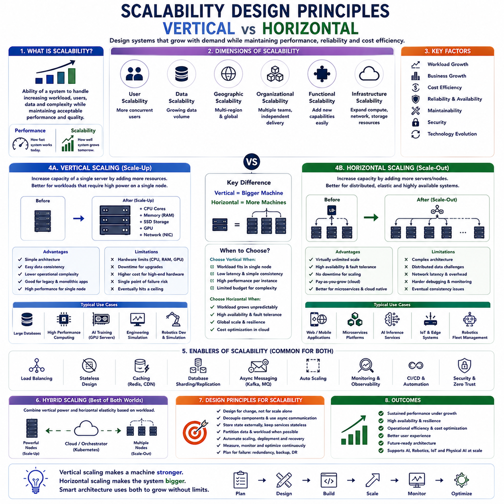
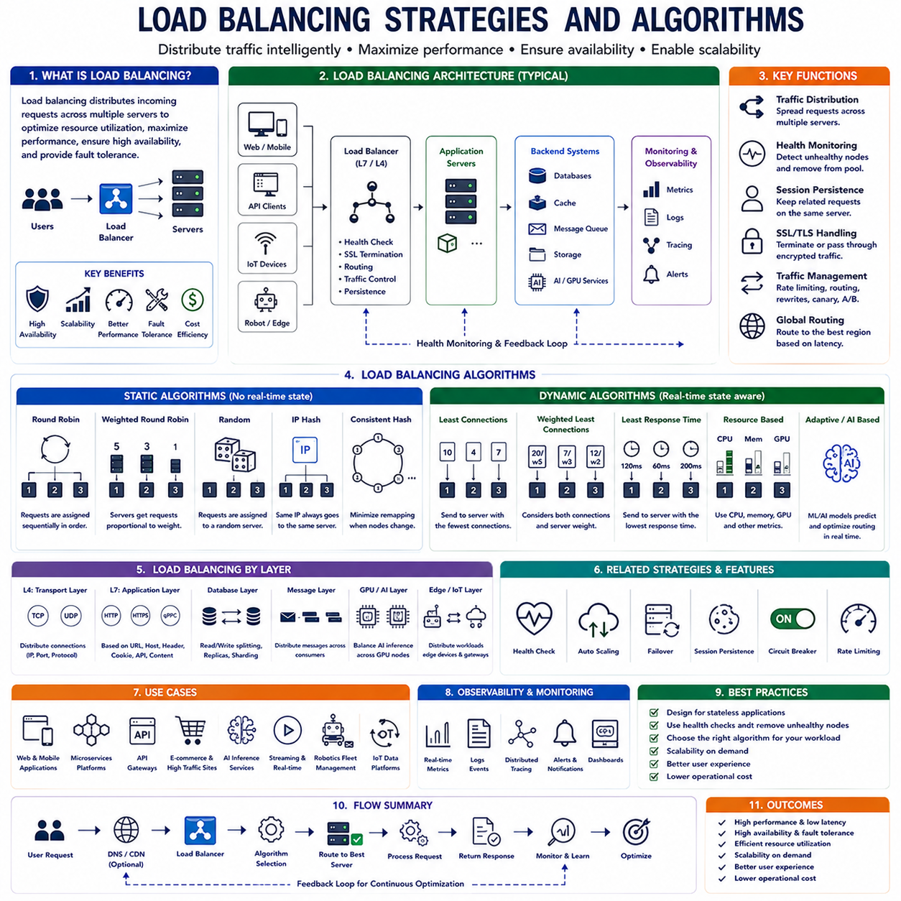
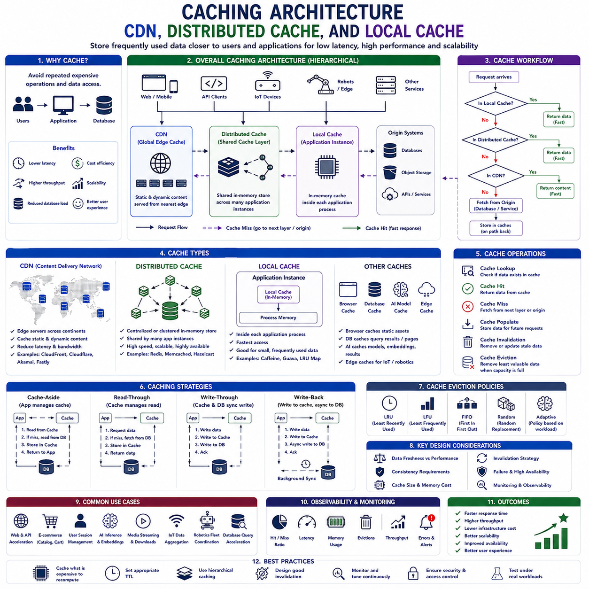
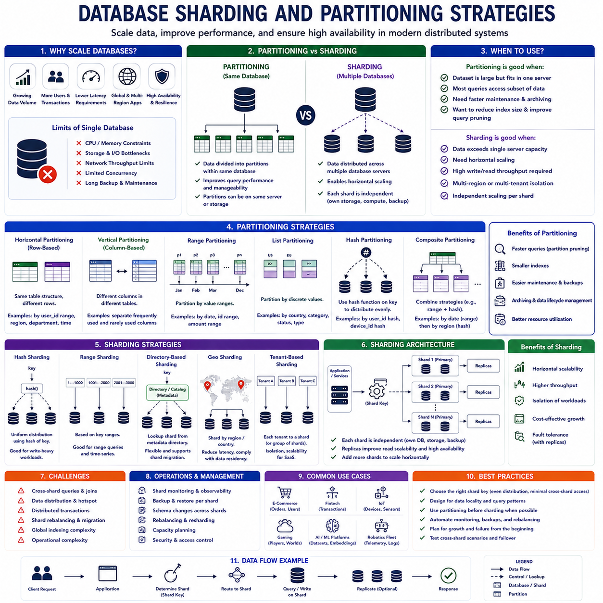
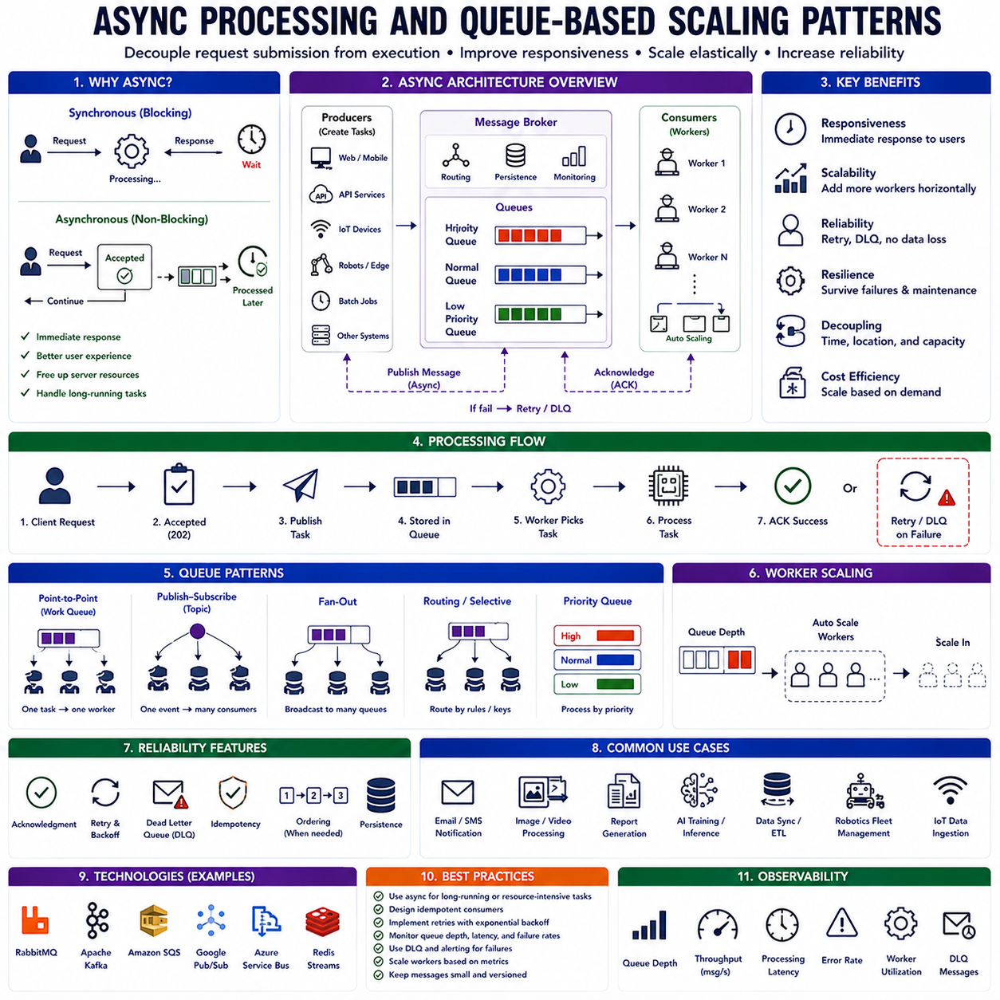
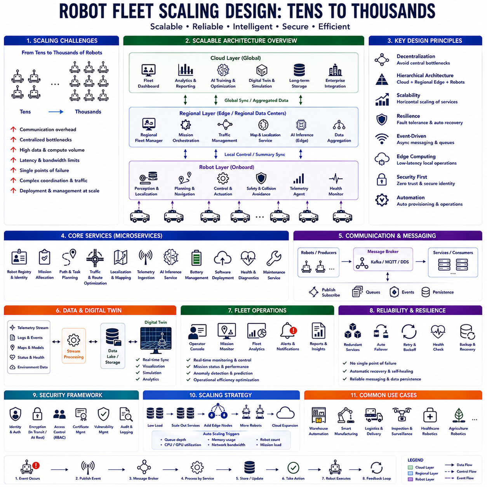
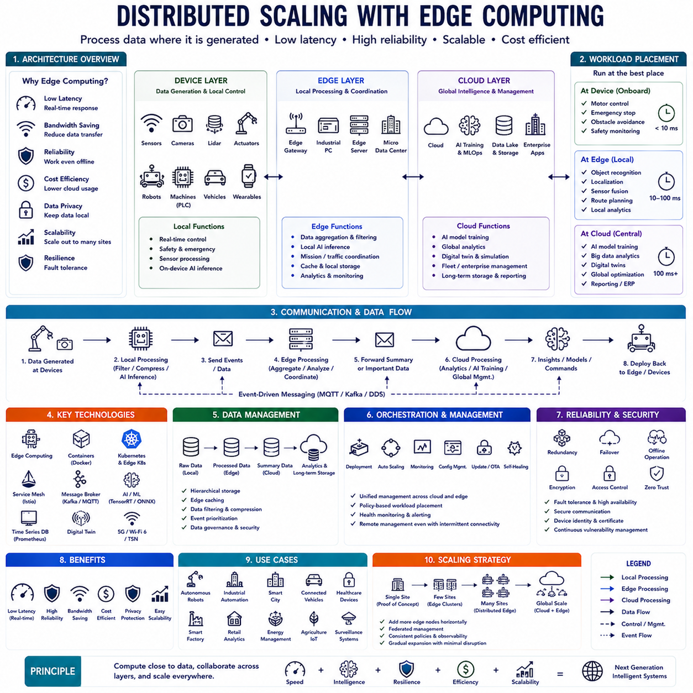
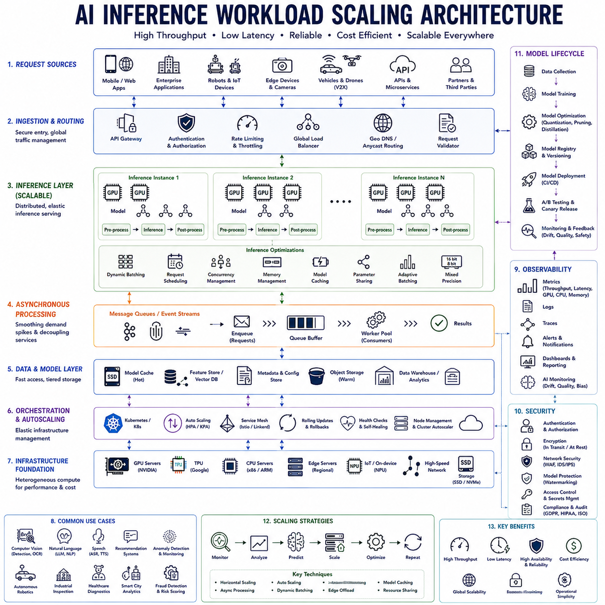
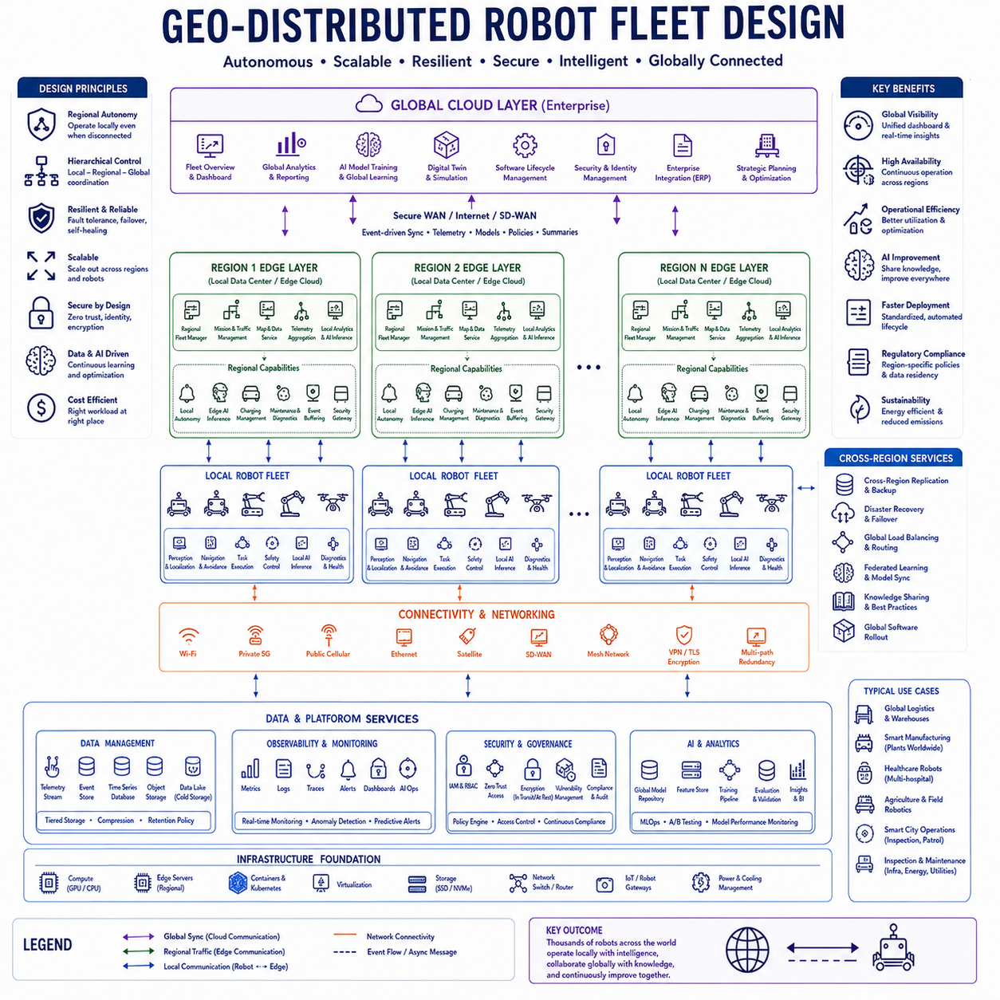
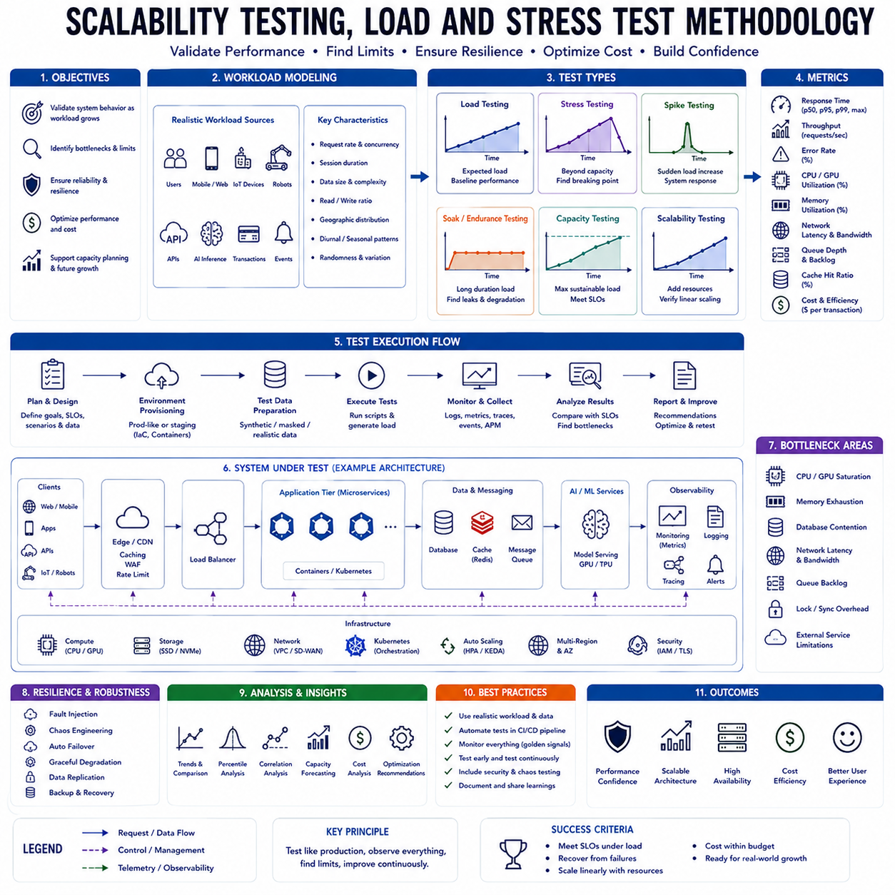

**Volume 1 Software Architecture Fundamentals**


# 09. Scalable System Design

##  

## 09.01 Scalability Design Principles: Vertical vs. Horizontal

{width="7.268055555555556in" height="7.268055555555556in"}

Scalability has become one of the most fundamental quality attributes of modern software architecture because software systems must continuously adapt to increasing workloads, expanding datasets, growing numbers of users, and evolving business requirements without sacrificing performance, reliability, or operational stability. Traditional software systems were often designed to support relatively predictable workloads running on fixed hardware infrastructure. In contrast, modern cloud-native platforms, distributed enterprise applications, artificial intelligence services, autonomous robotic fleets, Internet of Things ecosystems, industrial automation systems, financial platforms, healthcare systems, and Physical AI environments experience highly dynamic workloads that fluctuate according to user demand, business growth, geographical expansion, seasonal variation, and real-time operational events. Consequently, scalability is no longer an optional optimization but rather a fundamental architectural principle that must be considered from the earliest stages of software system design. A scalable architecture enables organizations to increase computational capacity, storage capability, communication throughput, and operational efficiency while minimizing redesign effort, controlling operational cost, and preserving long-term maintainability.

Scalability should not be confused with performance, although the two concepts are closely related. Performance measures how efficiently a software system responds under a specific workload, typically through metrics such as response latency, throughput, resource utilization, and processing speed. Scalability, however, evaluates how effectively the system maintains acceptable performance as workload increases. A highly optimized application may exhibit excellent performance under current operating conditions while failing completely when the workload doubles. Conversely, a scalable system may exhibit moderate performance initially but continue operating efficiently as demand increases through systematic expansion of computational resources. Scalability therefore represents the ability to sustain quality attributes throughout changing operational conditions rather than maximizing performance under fixed circumstances.

Modern software engineering recognizes several dimensions of scalability. User scalability measures the ability to support increasing numbers of concurrent users. Transaction scalability evaluates processing capacity for growing business operations. Data scalability addresses continuously expanding databases, file repositories, sensor streams, and machine learning datasets. Geographic scalability supports worldwide deployment across multiple regions and cloud providers. Organizational scalability enables multiple development teams to evolve software independently without introducing excessive coordination complexity. Functional scalability allows new business capabilities to be integrated without disrupting existing services. Infrastructure scalability accommodates evolving computational resources, networking capacity, storage systems, GPU clusters, and cloud platforms. Together these dimensions establish comprehensive scalability throughout the software lifecycle.

Scalability strategies are traditionally classified into two primary architectural approaches known as Vertical Scaling and Horizontal Scaling. These approaches represent fundamentally different philosophies regarding computational expansion. Vertical scaling increases the capacity of existing computing resources by upgrading hardware capabilities. Horizontal scaling instead expands computational capacity by adding additional computing nodes operating collaboratively within distributed architectures. Modern enterprise systems frequently combine both approaches according to workload characteristics, infrastructure constraints, financial considerations, and operational requirements.

Vertical scaling, frequently referred to as scaling up, enhances system capacity by increasing the computational resources available within a single machine. Additional processor cores, faster CPUs, expanded memory, larger storage devices, more powerful GPUs, higher network bandwidth, faster solid-state storage, and improved hardware accelerators collectively increase the computational capability of existing infrastructure without fundamentally changing software architecture. Applications originally designed for single-server deployment frequently benefit from vertical scaling because software modification remains relatively limited while hardware improvements directly increase computational performance.

Vertical scaling offers several practical advantages. Software architecture often remains comparatively simple because applications continue executing within centralized environments. Data consistency becomes easier to maintain because centralized databases eliminate distributed synchronization complexity. Operational management requires fewer infrastructure components, simplifying deployment, monitoring, backup strategies, security administration, configuration management, and maintenance procedures. Legacy enterprise applications, engineering simulation software, high-performance databases, enterprise resource planning systems, scientific computing workloads, GPU-intensive artificial intelligence training, and embedded robotics development frequently utilize vertical scaling due to their computational characteristics.

Database systems historically illustrate successful vertical scaling strategies. Large enterprise relational databases often benefit from expanded memory allowing greater cache utilization, additional processor cores improving query parallelism, faster storage reducing transaction latency, and specialized hardware accelerators optimizing database operations. Applications requiring strong transactional consistency, complex analytical processing, or centralized information management frequently achieve substantial performance improvements through vertical hardware expansion without introducing distributed system complexity.

Artificial intelligence training also commonly employs vertical scaling. Large GPU servers containing multiple accelerator cards interconnected through high-bandwidth communication channels enable efficient deep learning model training. Increasing GPU memory, computational throughput, tensor processing capability, interconnect bandwidth, storage performance, and processor capacity allows increasingly complex neural network architectures to execute efficiently within centralized training environments. High-performance AI clusters frequently begin with vertically scaled nodes before expanding toward distributed training infrastructure.

Robotics development similarly benefits from vertical scaling during simulation, perception development, reinforcement learning, digital twin execution, sensor fusion experimentation, and autonomous navigation research. Complex simulation environments frequently require powerful GPU servers, expanded memory, high-speed storage, and multicore processors capable of executing computationally intensive workloads locally before deployment to distributed robotic fleets. Vertical scaling therefore provides efficient development environments supporting sophisticated computational experimentation.

Despite these advantages, vertical scaling possesses inherent limitations. Every computing platform eventually reaches maximum hardware capacity beyond which additional expansion becomes impossible or economically impractical. Processor socket limitations, memory capacity constraints, GPU availability, storage bandwidth, thermal management, electrical power consumption, cooling infrastructure, and motherboard architecture collectively restrict maximum vertical growth. Hardware upgrades also frequently require planned downtime because computational resources must be physically replaced or reconfigured. Consequently, continuous business operation becomes increasingly difficult as infrastructure approaches physical limitations.

Single-system dependency represents another important limitation of vertical scaling. Centralized architectures inherently create potential single points of failure because hardware malfunction, operating system failure, power disruption, storage corruption, or network interruption may simultaneously disable the entire application. Although redundancy techniques improve availability, centralized computing fundamentally provides fewer fault isolation opportunities than distributed architectures. Mission-critical applications therefore frequently require complementary resilience mechanisms beyond simple hardware expansion.

Horizontal scaling, commonly known as scaling out, adopts an entirely different architectural philosophy. Rather than increasing the computational capacity of individual machines, horizontal scaling distributes workload across multiple independent computing nodes collaborating through network communication. Additional application servers, database replicas, storage clusters, GPU nodes, message brokers, edge devices, or robotic controllers collectively increase total system capacity while preserving service continuity. Modern cloud computing environments strongly favor horizontal scaling because infrastructure expansion becomes highly automated through virtualization, container orchestration, cloud resource management, and distributed deployment platforms.

One of the greatest strengths of horizontal scaling lies in its theoretically unlimited expansion capability. As workload increases, organizations simply provision additional computing resources rather than replacing existing infrastructure. Cloud platforms automatically allocate new virtual machines, Kubernetes clusters deploy additional application containers, distributed databases replicate storage capacity, message queues distribute communication traffic, and load balancers redirect client requests across expanding computational resources. Infrastructure therefore grows incrementally according to business demand rather than requiring large periodic hardware investments.

Availability and fault tolerance also improve significantly under horizontal architectures. Because applications execute across multiple independent nodes, failure of individual components typically affects only limited portions of system functionality. Load balancers automatically redirect requests toward healthy instances while orchestration platforms restart failed services, provision replacement resources, or redistribute computational workloads. Distributed redundancy therefore substantially improves operational resilience compared with centralized architectures dependent upon individual hardware systems.

Cloud-native software exemplifies horizontal scalability principles. Stateless application services execute within containers managed by orchestration platforms capable of automatically increasing or decreasing deployment size according to workload demand. Auto-scaling mechanisms continuously monitor processor utilization, memory consumption, request frequency, queue length, response latency, and business metrics before dynamically adjusting infrastructure capacity. Elastic resource allocation enables organizations to optimize operational cost while maintaining acceptable service quality throughout changing demand patterns.

Microservices architecture naturally complements horizontal scaling because individual services scale independently according to workload characteristics. Authentication services, payment processing, recommendation engines, inventory management, search infrastructure, AI inference platforms, and reporting systems frequently experience substantially different computational demands. Independent service scaling prevents unnecessary infrastructure expansion while enabling resource allocation according to actual business requirements. This selective scalability significantly improves operational efficiency compared with monolithic applications requiring entire system replication.

Distributed data management becomes essential within horizontally scalable architectures. Instead of maintaining centralized databases, distributed systems frequently employ replication, partitioning, sharding, distributed caching, event streaming, and eventually consistent storage mechanisms. Database replicas improve read scalability while partitioning distributes storage across multiple nodes. Distributed caching reduces backend workload by storing frequently accessed information closer to application services. These architectural techniques collectively enable sustained growth beyond the capacity of individual database servers.

Load balancing represents one of the fundamental enabling technologies supporting horizontal scalability. Incoming client requests are distributed across multiple application instances according to predefined algorithms including round-robin distribution, least-connections scheduling, weighted routing, geographic proximity, response latency, session affinity, or resource utilization. Effective load balancing maximizes resource efficiency while preventing localized overload conditions. Modern software-defined networking platforms increasingly integrate intelligent traffic management directly within cloud infrastructure.

State management introduces one of the greatest architectural challenges within horizontally scalable systems. Applications maintaining user sessions, transactional information, workflow progress, AI inference context, robotic mission state, or distributed coordination data cannot simply replicate processing nodes without addressing state synchronization. Stateless application design therefore becomes a primary architectural objective because independent service instances may process requests interchangeably. External state storage using distributed databases, caches, message queues, and object storage enables horizontal scalability while preserving application consistency.

Distributed communication significantly influences scalability design. Synchronous communication simplifies programming models but introduces tighter coupling and increased latency. Asynchronous messaging improves scalability by decoupling services through event-driven architectures, publish-subscribe communication, message queues, and streaming platforms. Distributed event processing enables independent system components to evolve, scale, and recover without requiring tightly synchronized execution. Modern enterprise architectures increasingly favor asynchronous communication for large-scale distributed systems.

Artificial Intelligence platforms require specialized scalability strategies because training and inference exhibit substantially different computational characteristics. Model training frequently employs vertically scaled GPU clusters with high-bandwidth communication supporting synchronized distributed optimization. Production inference instead emphasizes horizontally scalable deployment where independent inference servers process requests concurrently across geographically distributed edge locations, cloud infrastructure, and specialized accelerator hardware. Hybrid scalability therefore optimizes both training efficiency and inference responsiveness.

Edge Artificial Intelligence extends horizontal scalability toward geographically distributed environments. Intelligent sensors, industrial controllers, autonomous vehicles, collaborative robots, mobile devices, and smart infrastructure execute localized inference while cloud platforms coordinate global model management, analytics, retraining, and fleet optimization. Computational workload therefore becomes distributed across hierarchical infrastructure layers including edge devices, local gateways, regional data centers, and centralized cloud platforms. Hierarchical scalability minimizes communication latency while improving operational resilience.

Robotics and Physical AI present unique scalability challenges extending beyond conventional cloud computing. Individual autonomous robots execute perception, localization, mapping, planning, navigation, manipulation, safety supervision, and actuator control locally because real-time decision making cannot depend exclusively upon remote cloud infrastructure. However, fleet coordination, mission allocation, predictive maintenance, software updates, digital twins, operational analytics, and AI model management benefit substantially from horizontally scalable cloud platforms. Modern robotic ecosystems therefore integrate vertically optimized edge computing with horizontally scalable fleet management infrastructure.

Fleet scalability becomes increasingly important as organizations deploy hundreds or thousands of autonomous robots. Centralized fleet management platforms coordinate task scheduling, traffic management, charging optimization, software distribution, operational monitoring, and telemetry collection across geographically distributed robotic populations. Horizontal cloud infrastructure enables expanding fleet management without redesigning operational software while preserving centralized governance and system-wide optimization.

Scalability design also influences software maintainability. Excessively centralized architectures eventually become difficult to modify because growing complexity accumulates within monolithic implementations. Distributed architectures improve modularity but introduce additional operational complexity through service coordination, network communication, distributed debugging, version compatibility, deployment orchestration, and infrastructure monitoring. Successful scalability therefore requires balancing architectural simplicity against future growth expectations rather than maximizing distribution unnecessarily.

Economic considerations significantly influence scalability strategy selection. Vertical scaling frequently provides lower initial operational complexity but eventually encounters rapidly increasing hardware costs as specialized enterprise servers become progressively more expensive. Horizontal scaling introduces greater architectural complexity but frequently enables incremental infrastructure investment aligned with business growth. Cloud computing further transforms financial planning through consumption-based pricing where organizations pay only for actively utilized computational resources. Cost optimization therefore becomes an integral architectural consideration alongside technical scalability.

Observability becomes increasingly important as scalable architectures expand. Distributed systems generate enormous quantities of logs, metrics, traces, infrastructure telemetry, AI monitoring statistics, robotic operational data, network analytics, and business performance indicators. Comprehensive observability platforms provide unified visibility across expanding infrastructure while supporting proactive performance optimization, fault diagnosis, resource planning, capacity forecasting, cybersecurity monitoring, and operational governance. Without effective observability, horizontally scalable systems rapidly become operationally unmanageable despite technical correctness.

Security architecture must likewise evolve alongside scalability. Expanding infrastructure introduces additional communication channels, identity relationships, deployment environments, access control policies, container images, cloud services, APIs, robotic endpoints, AI inference services, and software supply chain dependencies. Zero Trust architecture, identity federation, encrypted communication, certificate management, infrastructure isolation, continuous vulnerability assessment, and runtime security monitoring collectively support secure scalability throughout distributed environments.

Modern software engineering increasingly recognizes that scalability should be considered during initial architectural design rather than introduced after deployment. Retrofitting scalability into architectures originally designed for limited workloads often requires extensive redesign because data management, communication protocols, deployment strategies, operational monitoring, security models, testing methodologies, and organizational processes all depend upon fundamental architectural assumptions. Early scalability planning therefore substantially reduces long-term engineering cost while improving business adaptability.

Vertical and horizontal scaling should not be viewed as mutually exclusive alternatives. Successful enterprise systems frequently employ hybrid scalability combining powerful computational nodes with distributed deployment infrastructure. Individual database servers may scale vertically while application services scale horizontally. AI training clusters utilize vertically optimized GPU servers coordinated through horizontally distributed infrastructure. Robotic edge computers perform real-time processing locally while cloud services expand horizontally for fleet coordination. Hybrid scalability therefore enables organizations to exploit the strengths of both architectural approaches while minimizing their respective limitations.

Ultimately, scalability design represents one of the defining architectural principles supporting sustainable software evolution throughout modern digital ecosystems. Vertical scaling provides computational simplicity, centralized management, and rapid hardware enhancement for workloads benefiting from powerful individual systems. Horizontal scaling enables virtually unlimited expansion, operational resilience, geographic distribution, cloud elasticity, and fault tolerance through collaborative distributed computing. Contemporary cloud-native software, artificial intelligence platforms, autonomous robotic systems, distributed enterprise applications, industrial automation infrastructure, and Physical AI ecosystems increasingly integrate both scalability strategies according to workload characteristics, operational objectives, financial constraints, and long-term business strategy. By understanding the principles, tradeoffs, architectural implications, and complementary strengths of vertical and horizontal scalability, software architects establish resilient systems capable of supporting continuous technological evolution while maintaining high performance, operational reliability, business agility, and sustainable growth over many years of expanding computational demand.

확장성(Scalability)은 현대 소프트웨어 아키텍처(Software Architecture)에서 가장 중요한 품질 속성(Quality Attribute) 가운데 하나이다. 소프트웨어는 사용자(User), 데이터(Data), 서비스(Service), AI 모델(Model), 로봇(Robot), IoT(Internet of Things) 장치가 지속적으로 증가하는 환경에서도 성능(Performance), 안정성(Reliability), 운영 효율(Operation Efficiency)을 유지해야 한다. 따라서 확장성은 단순한 성능 향상이 아니라 미래의 성장에 대응할 수 있는 구조를 설계하는 핵심 원칙이다.

확장성은 성능(Performance)과 혼동되는 경우가 많지만 두 개념은 다르다. 성능은 현재의 작업 부하(Workload)에서 얼마나 빠르게 처리하는지를 의미하며, 응답 시간(Response Time), 처리량(Throughput), CPU 사용률 등을 평가한다. 반면 확장성은 사용자가 증가하거나 데이터가 늘어날 때에도 이러한 성능을 지속적으로 유지할 수 있는 능력을 의미한다. 즉, 확장성은 변화하는 환경에서도 품질을 유지하는 능력이다.

현대 시스템에서는 다양한 형태의 확장성이 요구된다. 사용자 확장성(User Scalability)은 동시 접속자의 증가를 의미하며, 데이터 확장성(Data Scalability)은 데이터베이스(Database)와 파일(File)의 증가를 처리하는 능력이다. 또한 지역 확장성(Geographic Scalability), 조직 확장성(Organizational Scalability), 기능 확장성(Function Scalability), 인프라 확장성(Infrastructure Scalability) 등 여러 측면에서 시스템은 지속적으로 성장할 수 있어야 한다.

확장 전략은 크게 수직 확장(Vertical Scaling, Scale-Up)과 수평 확장(Horizontal Scaling, Scale-Out)으로 구분된다. 수직 확장은 하나의 서버(Server)의 성능을 높이는 방식이며, 수평 확장은 여러 대의 서버를 추가하여 전체 시스템의 처리 능력을 높이는 방식이다. 현대의 대규모 시스템은 두 방식을 적절히 조합하여 사용하는 경우가 많다.

수직 확장(Vertical Scaling)은 기존 서버의 하드웨어를 업그레이드하여 성능을 높이는 방식이다. CPU 코어(Core)를 늘리고, 메모리(RAM)를 확장하며, SSD, GPU, 네트워크(Network) 대역폭 등을 향상시켜 하나의 서버가 더 많은 작업을 수행하도록 만든다. 기존 애플리케이션 구조를 크게 변경하지 않아도 되므로 비교적 구현이 단순하다는 장점이 있다.

수직 확장의 가장 큰 장점은 아키텍처가 단순하다는 것이다. 하나의 서버에서 대부분의 처리가 이루어지므로 데이터 일관성(Data Consistency)을 유지하기 쉽고, 운영(Operation), 백업(Backup), 보안(Security), 모니터링(Monitoring)도 상대적으로 단순하다. ERP(Enterprise Resource Planning), 대규모 데이터베이스, 과학 계산(Scientific Computing), AI 학습(Training) 서버 등에서 널리 사용된다.

데이터베이스(Database)는 대표적인 수직 확장 사례이다. 메모리를 늘려 캐시(Cache)를 확대하고, CPU를 증가시켜 병렬 쿼리(Query)를 처리하며, SSD를 이용하여 입출력(I/O) 속도를 향상시킨다. 특히 높은 트랜잭션(Transaction) 일관성이 필요한 금융 시스템이나 기업용 데이터베이스에서는 수직 확장이 여전히 매우 중요한 전략이다.

AI 학습(Training) 환경도 수직 확장을 적극 활용한다. 여러 개의 GPU를 하나의 서버에 장착하고, GPU 간 고속 인터커넥트(Interconnect)를 이용하여 대규모 딥러닝(Deep Learning) 모델을 학습한다. GPU 메모리, Tensor 연산 성능, CPU 처리 능력을 동시에 향상시켜 복잡한 AI 모델을 효율적으로 학습할 수 있다.

로봇 개발에서도 수직 확장은 중요한 역할을 한다. 디지털 트윈(Digital Twin), 강화학습(Reinforcement Learning), 센서 융합(Sensor Fusion), 자율주행 시뮬레이션(Simulation) 등은 매우 높은 GPU 성능을 요구하므로 하나의 고성능 워크스테이션(Workstation)이나 GPU 서버를 이용하여 개발하는 경우가 많다.

그러나 수직 확장은 명확한 한계를 가진다. 서버는 CPU 소켓(Socket), 메모리 슬롯(Slot), GPU 개수, 전력(Power), 냉각(Cooling) 등의 물리적인 제한이 존재한다. 또한 고성능 장비일수록 비용이 급격히 증가하며, 업그레이드를 위해 시스템을 중단해야 하는 경우도 많다. 따라서 무한정 확장할 수는 없다.

또한 수직 확장은 단일 장애점(Single Point of Failure)을 만들 가능성이 있다. 하나의 서버가 고장 나면 전체 서비스가 중단될 수 있기 때문이다. 이중화(Redundancy)를 적용할 수는 있지만 기본적으로 중앙 집중형(Centralized) 구조라는 한계를 가진다.

수평 확장(Horizontal Scaling)은 여러 대의 서버를 함께 사용하는 방식이다. 기존 서버를 교체하는 것이 아니라 새로운 서버를 계속 추가하여 처리 능력을 증가시킨다. 클라우드(Cloud), 쿠버네티스(Kubernetes), 마이크로서비스(Microservices)는 모두 이러한 수평 확장을 기본 개념으로 사용한다.

수평 확장의 가장 큰 장점은 거의 무한에 가까운 확장이 가능하다는 것이다. 사용자가 증가하면 서버를 추가하고, 트래픽(Traffic)이 감소하면 서버를 제거하여 운영 비용(Cost)을 절감할 수 있다. 이러한 자동 확장(Auto Scaling)은 현대 클라우드 시스템의 핵심 기능이다.

수평 확장은 높은 가용성(Availability)과 장애 허용(Fault Tolerance)도 제공한다. 여러 대의 서버가 동시에 동작하므로 한 대가 고장 나더라도 로드 밸런서(Load Balancer)가 자동으로 다른 서버로 요청을 전달한다. 따라서 서비스 중단 없이 안정적으로 운영할 수 있다.

클라우드 네이티브(Cloud-Native)는 대표적인 수평 확장 구조이다. 컨테이너(Container)를 여러 개 실행하고, 쿠버네티스가 CPU 사용률, 메모리 사용량, 요청(Request) 수 등을 분석하여 자동으로 서버 수를 조절한다. 이를 통해 운영 비용과 성능을 동시에 최적화할 수 있다.

마이크로서비스(Microservices)는 수평 확장을 더욱 효율적으로 만든다. 인증(Authentication), 결제(Payment), 검색(Search), 추천(Recommendation), AI 추론(Inference) 등 각각의 서비스가 독립적으로 확장될 수 있으므로 필요한 서비스만 증설하면 된다. 이는 전체 시스템을 복제하는 것보다 훨씬 효율적이다.

수평 확장에서는 데이터 관리(Data Management)가 매우 중요하다. 데이터베이스 복제(Database Replication), 샤딩(Sharding), 파티셔닝(Partitioning), 분산 캐시(Distributed Cache) 등을 이용하여 데이터를 여러 서버에 분산 저장하고 동시에 처리할 수 있도록 설계한다.

로드 밸런서(Load Balancer)는 수평 확장의 핵심 구성 요소이다. 들어오는 요청을 여러 서버에 균등하게 분배하여 특정 서버에 부하가 집중되지 않도록 한다. 라운드 로빈(Round Robin), 최소 연결 수(Least Connection), 응답 시간(Response Time) 기반 분산 등 다양한 알고리즘이 사용된다.

상태 관리(State Management)는 수평 확장의 가장 어려운 문제 중 하나이다. 여러 서버가 동시에 동작하므로 사용자 세션(Session), 트랜잭션, AI 추론 상태 등을 공유해야 한다. 이를 해결하기 위해 상태 비저장(Stateless) 설계를 지향하며, 필요한 상태는 Redis와 같은 외부 저장소(External Storage)에 관리한다.

서비스 간 통신(Communication)은 수평 확장에서 중요한 설계 요소이다. 동기 통신(Synchronous Communication)은 구현이 쉽지만 서비스 간 결합도가 높아진다. 반면 비동기 메시징(Asynchronous Messaging)은 이벤트(Event) 기반으로 서비스를 연결하여 독립적인 확장성과 높은 안정성을 제공한다.

AI 플랫폼은 수직 확장과 수평 확장을 모두 활용한다. 모델 학습(Training)은 GPU 서버를 이용한 수직 확장이 일반적이며, 모델 추론(Inference)은 여러 개의 추론 서버를 이용하는 수평 확장이 일반적이다. 따라서 AI 시스템은 하이브리드(Hybrid) 확장 구조를 갖는 경우가 많다.

엣지 AI(Edge AI)는 계층형(Hierarchical) 확장 구조를 사용한다. 센서(Sensor), 로봇(Robot), 차량(Vehicle)에서는 로컬(Local)에서 추론을 수행하고, 클라우드에서는 모델 관리(Model Management), 재학습(Retraining), 분석(Analytics)을 수행한다. 이를 통해 응답 속도와 운영 효율을 동시에 확보할 수 있다.

자율주행 로봇과 물리 AI(Physical AI)는 일반적인 클라우드 시스템보다 더욱 복잡한 확장 전략을 요구한다. 로봇 내부에서는 실시간 제어(Real-Time Control), 위치 추정(Localization), 인식(Perception), 경로 계획(Path Planning)을 로컬에서 수행해야 하며, 클라우드에서는 플릿 관리(Fleet Management), AI 모델 업데이트(Update), 디지털 트윈(Digital Twin), 운영 분석(Operation Analytics)을 담당한다.

수백 대 이상의 로봇을 운영하는 플릿(Fleet) 환경에서는 중앙 관리 시스템이 작업(Task Allocation), 충전(Charging), 소프트웨어 업데이트, 운영 모니터링(Monitoring), 원격 진단(Remote Diagnostics)을 수행한다. 이러한 시스템은 수평 확장을 통해 로봇 수가 증가해도 지속적으로 운영될 수 있어야 한다.

확장성은 유지보수성(Maintainability)에도 영향을 미친다. 지나치게 큰 단일 시스템(Monolithic System)은 시간이 지날수록 수정이 어려워지고 기술 부채(Technical Debt)가 증가한다. 반면 지나치게 분산된 시스템은 운영 복잡도가 증가한다. 따라서 적절한 균형(Balance)을 유지하는 것이 중요하다.

경제성(Economics) 역시 확장 전략 선택의 중요한 요소이다. 초기에는 수직 확장이 저렴할 수 있지만 일정 수준을 넘으면 고성능 서버 비용이 급격히 증가한다. 반대로 수평 확장은 초기 설계는 복잡하지만 클라우드 기반의 사용량(Pay-as-you-Go) 과금 모델을 통해 장기적으로 비용을 절감할 수 있다.

관측성(Observability)은 확장성이 증가할수록 더욱 중요해진다. 분산 시스템에서는 로그(Log), 메트릭(Metrics), 분산 추적(Distributed Trace), AI 모니터링, 로봇 텔레메트리(Telemetry), 네트워크 상태 등을 통합적으로 수집하여 시스템 전체를 실시간으로 분석해야 한다.

보안(Security) 역시 확장성과 함께 발전해야 한다. 서버가 증가하면 API, 네트워크, 컨테이너, AI 서비스, 로봇 장치 등 공격 대상도 증가한다. 따라서 제로 트러스트(Zero Trust), 인증(Authentication), 암호화(Encryption), 인증서 관리(Certificate Management), 취약점 분석(Vulnerability Assessment) 등을 함께 적용해야 한다.

현대 소프트웨어에서는 확장성을 개발 이후에 추가하는 것이 아니라 초기 설계 단계부터 고려해야 한다. 이미 완성된 시스템에 확장성을 추가하려면 데이터 구조, 통신 방식, 배포 구조, 보안 모델 등을 모두 수정해야 하는 경우가 많다. 따라서 초기 아키텍처 단계에서 확장 전략을 설계하는 것이 장기적인 비용 절감에 매우 중요하다.

수직 확장과 수평 확장은 서로 경쟁 관계가 아니라 상호 보완적인 기술이다. 실제 대규모 시스템은 데이터베이스는 수직 확장을 적용하고, 애플리케이션 서버는 수평 확장을 적용하는 하이브리드(Hybrid) 구조를 가장 많이 사용한다. AI 시스템 역시 학습은 수직 확장, 추론은 수평 확장을 적용하며, 자율주행 로봇은 로컬 컴퓨터의 수직 확장과 클라우드의 수평 확장을 함께 활용한다.

결론적으로 확장성 설계 원칙(Scalability Design Principles)은 현대 소프트웨어 아키텍처의 핵심 요소이다. 수직 확장(Vertical Scaling)은 단순한 구조와 높은 계산 성능을 제공하며, 수평 확장(Horizontal Scaling)은 무한에 가까운 확장성과 높은 가용성을 제공한다. 클라우드, AI 플랫폼, 자율주행 로봇, 산업 자동화, 물리 AI 시스템에서는 두 방식을 적절히 결합한 하이브리드 확장 전략이 가장 효과적이다. 이러한 확장성 설계를 통해 시스템은 성능, 안정성, 운영 효율, 비즈니스 민첩성을 장기간 유지하면서 지속적으로 성장할 수 있다.

##  

## 09.02 Load Balancing Strategies and Algorithms

{width="7.268055555555556in" height="7.268055555555556in"}

Load balancing has become one of the most fundamental architectural mechanisms in modern distributed software systems because computational workloads continue to increase in scale, diversity, and unpredictability. Cloud-native applications, microservices platforms, artificial intelligence services, edge computing infrastructures, autonomous robotic fleets, industrial automation systems, financial transaction platforms, e-commerce services, healthcare information systems, Internet of Things ecosystems, and Physical AI environments must simultaneously serve thousands or even millions of concurrent requests while maintaining high availability, low latency, operational stability, and efficient resource utilization. As computational resources expand horizontally across multiple servers, containers, GPU clusters, databases, and edge devices, an intelligent mechanism is required to distribute incoming workloads fairly and efficiently among available computing resources. Load balancing fulfills this role by dynamically directing requests toward appropriate processing nodes, preventing localized overload, maximizing infrastructure utilization, improving fault tolerance, and enabling continuous scalability throughout the software lifecycle.

Load balancing should not be viewed merely as a networking technology or a hardware appliance. Rather, it represents a comprehensive architectural strategy for workload distribution across distributed computing environments. Every request entering a distributed system must eventually be assigned to one or more computational resources capable of processing that request efficiently. Without effective load balancing, certain servers become overloaded while others remain underutilized, causing unnecessary latency, resource waste, service degradation, and increased operational risk. Properly designed load balancing architectures continuously optimize workload distribution while adapting to changing infrastructure availability, user demand, hardware performance, geographical conditions, and application behavior.

The primary objective of load balancing is to maximize overall system efficiency rather than maximizing the utilization of individual servers. Efficient systems maintain balanced computational workloads across all available resources while minimizing response latency, maximizing throughput, preserving fault tolerance, reducing operational cost, and maintaining consistent user experience. Consequently, load balancing directly contributes to multiple software quality attributes including scalability, reliability, availability, performance, maintainability, resilience, and operational efficiency.

Modern software systems encounter highly dynamic workloads. User activity fluctuates throughout the day. Business transactions increase during promotional campaigns. Artificial intelligence inference workloads vary according to customer demand. Robotic fleets generate unpredictable communication patterns depending upon operational missions. Sensor networks continuously produce variable data streams. Cloud-native infrastructures automatically scale according to resource consumption. Static workload distribution therefore becomes insufficient because optimal resource allocation continuously changes during system operation. Load balancing algorithms must consequently operate dynamically while adapting to real-time infrastructure conditions.

Load balancing architectures generally operate at multiple layers of modern computing environments. Network-level load balancing distributes incoming network connections across multiple servers. Transport-layer load balancing manages TCP and UDP communication sessions. Application-layer load balancing evaluates application-specific information including URLs, HTTP headers, cookies, authentication state, API endpoints, and request content before determining optimal routing decisions. Database load balancing distributes read and write operations across replicated storage systems. Message brokers balance asynchronous event processing across distributed consumers. GPU scheduling distributes artificial intelligence inference workloads among accelerator resources. Edge orchestration allocates computational tasks across geographically distributed edge computing platforms. Together these layers establish comprehensive workload management throughout distributed software ecosystems.

Modern load balancing strategies may be classified according to several architectural perspectives. Static load balancing algorithms make routing decisions based upon predefined policies independent of current system conditions. Dynamic load balancing algorithms continuously evaluate infrastructure state before selecting target resources. Centralized load balancing relies upon dedicated controllers maintaining global system visibility. Distributed load balancing allows multiple nodes to coordinate workload allocation collaboratively without centralized authority. Local load balancing optimizes nearby computational resources, whereas global load balancing distributes workloads across multiple geographic regions, cloud providers, and distributed infrastructures.

Static load balancing algorithms provide architectural simplicity and minimal computational overhead. Since routing decisions follow predetermined policies, implementation complexity remains relatively low while decision latency becomes highly predictable. Round Robin represents one of the simplest and most widely adopted static algorithms. Incoming requests are sequentially distributed across available servers regardless of computational load or hardware capability. Every server therefore receives approximately equal numbers of requests over time. Round Robin functions effectively whenever computational resources possess similar performance characteristics and incoming requests require approximately equivalent processing effort.

Weighted Round Robin extends the conventional Round Robin algorithm by recognizing that distributed computing resources frequently possess different computational capacities. More powerful servers receive proportionally larger portions of incoming workload according to predefined weighting factors. High-performance GPU servers, multicore processors, expanded memory configurations, or optimized hardware platforms therefore process greater workloads than smaller computational nodes. Weighted Round Robin preserves algorithmic simplicity while improving infrastructure utilization across heterogeneous computing environments.

Random load balancing represents another straightforward static strategy. Incoming requests are assigned randomly among available computational resources. Although seemingly simplistic, random distribution often achieves surprisingly balanced workload allocation across sufficiently large request populations. Random algorithms also eliminate predictable routing patterns that occasionally contribute to cybersecurity resilience by reducing deterministic traffic behavior. Nevertheless, random distribution may temporarily generate workload imbalance during smaller request volumes.

Hash-based load balancing introduces deterministic routing according to predefined request characteristics. Source IP addresses, destination addresses, user identifiers, session identifiers, URLs, authentication tokens, or request attributes undergo hash computation determining destination servers consistently. Identical users therefore repeatedly access identical backend resources, simplifying session persistence while reducing synchronization overhead. Hash-based routing frequently supports distributed caching, stateful applications, user-specific processing, and geographically localized services.

Although static algorithms provide computational efficiency, they cannot adapt automatically to changing operational conditions. Server failures, varying processor utilization, memory consumption, network latency, GPU workloads, storage performance, and application-specific computational complexity remain invisible to static routing policies. Dynamic load balancing therefore introduces continuous infrastructure awareness supporting adaptive workload optimization according to real-time operational behavior.

Least Connections represents one of the most widely deployed dynamic load balancing algorithms. Instead of distributing requests equally, the algorithm continuously monitors active connections established with each backend server. New requests are assigned to the server maintaining the fewest active connections, assuming that fewer connections generally indicate lower computational load. Least Connections performs particularly well whenever client session duration varies significantly because servers processing long-lived connections naturally receive fewer additional requests until workload equalizes.

Weighted Least Connections extends this strategy by incorporating heterogeneous hardware capability. High-capacity servers supporting additional processor cores, expanded memory, GPU acceleration, or optimized networking receive proportionally larger workloads despite maintaining greater connection counts. Weighted dynamic algorithms therefore simultaneously consider infrastructure capacity and operational utilization when selecting optimal routing decisions.

Least Response Time algorithms prioritize servers demonstrating the fastest operational responsiveness rather than simply counting active connections. Continuous monitoring evaluates response latency generated by backend systems under current operating conditions. Requests are subsequently directed toward resources exhibiting lowest processing delay. Least Response Time algorithms frequently outperform connection-based approaches because actual application responsiveness depends upon processor utilization, memory pressure, storage performance, network latency, GPU contention, and software implementation efficiency rather than connection counts alone.

Resource-based load balancing further extends dynamic evaluation by monitoring processor utilization, memory consumption, storage bandwidth, GPU availability, network throughput, cache utilization, thermal conditions, power consumption, and application-specific performance indicators. Artificial intelligence inference platforms particularly benefit from resource-aware scheduling because GPU memory availability frequently determines computational capability more accurately than conventional processor utilization metrics. Modern orchestration platforms increasingly integrate comprehensive infrastructure telemetry supporting intelligent workload allocation according to multidimensional resource evaluation.

Adaptive load balancing represents one of the most sophisticated routing approaches available today. Machine learning models, predictive analytics, historical workload analysis, reinforcement learning, statistical forecasting, and operational telemetry collectively estimate future computational demand before workload actually arrives. Rather than merely reacting to existing infrastructure conditions, adaptive algorithms proactively allocate computational resources anticipating future workload evolution. Predictive scaling significantly improves responsiveness during rapidly changing operational environments including e-commerce promotions, financial trading periods, industrial manufacturing cycles, autonomous robotic missions, and cloud-native service deployment.

Application-aware load balancing recognizes that different requests frequently require substantially different computational effort. Static resource allocation assumes every request imposes equivalent workload, which rarely reflects practical operation. Lightweight authentication requests differ significantly from artificial intelligence inference tasks, multimedia processing, financial analytics, robotic perception pipelines, medical image analysis, or scientific simulations. Application-aware routing therefore examines request content before selecting computational resources optimized for corresponding processing requirements. Specialized GPU inference servers, high-memory database nodes, storage-intensive processing clusters, or edge computing platforms receive workloads matching their architectural strengths.

Geographic load balancing distributes user requests across multiple regional infrastructure deployments according to geographic proximity, regulatory requirements, network latency, disaster recovery strategy, cloud provider availability, operational cost, and business continuity planning. Global organizations frequently deploy applications simultaneously across multiple continents to minimize user latency while improving fault tolerance. Domain Name System routing, Anycast networking, regional edge infrastructure, cloud traffic management services, and intelligent geographic routing collectively support worldwide workload distribution.

Cloud computing has fundamentally transformed load balancing through elasticity and infrastructure automation. Auto Scaling mechanisms continuously provision or terminate computational resources according to monitored workload characteristics including processor utilization, request frequency, memory consumption, queue depth, GPU availability, and business-specific metrics. Load balancers therefore integrate closely with orchestration platforms including Kubernetes, cloud resource managers, container schedulers, serverless computing environments, and infrastructure automation frameworks. Dynamic resource allocation significantly improves operational efficiency while minimizing unnecessary infrastructure cost.

Container orchestration platforms increasingly integrate sophisticated load balancing directly into service management infrastructure. Kubernetes Services, Ingress Controllers, Service Mesh technologies, and internal proxy architectures automatically distribute traffic across dynamically changing container deployments. Application instances frequently appear or disappear during continuous deployment, rolling updates, auto-scaling operations, infrastructure failures, or maintenance activities. Integrated service discovery therefore continuously updates routing information while preserving uninterrupted client communication despite evolving backend infrastructure.

Service Mesh architecture extends load balancing beyond conventional traffic distribution toward comprehensive service communication management. Sidecar proxies intercept application communication while providing intelligent routing, retry policies, circuit breaking, observability, encryption, traffic shaping, fault injection, canary deployment support, and progressive rollout management. Service Mesh therefore transforms communication infrastructure into programmable software enabling sophisticated operational optimization throughout microservices ecosystems.

Artificial Intelligence platforms require specialized load balancing because inference workloads exhibit highly variable computational complexity. Image classification, natural language processing, speech recognition, multimodal reasoning, reinforcement learning, and generative AI consume substantially different computational resources depending upon model architecture, input size, GPU availability, memory allocation, and accelerator capability. AI inference schedulers therefore evaluate GPU utilization, model residency, inference latency, batch optimization opportunities, thermal conditions, and accelerator topology before allocating computational workloads. Intelligent GPU scheduling significantly improves inference throughput while minimizing latency.

Distributed AI training introduces additional load balancing considerations distinct from inference deployment. Training workloads require synchronized communication among GPU clusters exchanging gradient updates, model parameters, optimizer states, and distributed datasets. Communication-aware scheduling minimizes network bottlenecks while balancing computational effort across heterogeneous accelerator resources. Efficient training therefore depends simultaneously upon computational load balancing and communication optimization.

Robotics and Physical AI environments introduce unique workload distribution challenges because real-time constraints frequently prohibit exclusive reliance upon centralized cloud infrastructure. Autonomous robots continuously execute localization, perception, sensor fusion, obstacle detection, motion planning, safety monitoring, and actuator control locally while communicating telemetry, mission status, diagnostics, AI model updates, and fleet coordination information through distributed cloud services. Load balancing therefore operates simultaneously across onboard edge computers, regional gateways, cloud infrastructure, GPU inference servers, and fleet management platforms.

Fleet management systems coordinating hundreds or thousands of autonomous robots require sophisticated load balancing supporting mission allocation, traffic management, charging coordination, predictive maintenance, digital twins, software updates, AI model distribution, and telemetry analytics. Mission scheduling algorithms balance operational workload across robotic populations while cloud platforms balance computational processing supporting fleet-wide optimization. Geographic load balancing further distributes robotic communication among regional infrastructure minimizing communication latency while preserving operational resilience.

Fault tolerance represents one of the most valuable benefits provided by intelligent load balancing. Health monitoring continuously evaluates backend infrastructure through heartbeat messages, availability checks, response latency measurements, application diagnostics, resource utilization, communication integrity, storage accessibility, AI inference health, robotic connectivity, and operational telemetry. Failed or degraded resources are automatically removed from routing decisions until recovery occurs. Client applications therefore continue operating despite infrastructure failures without requiring manual intervention.

Session persistence introduces another important architectural consideration. Certain applications maintain user authentication state, shopping carts, workflow progress, AI conversational context, robotic mission information, or long-running computational sessions requiring repeated communication with identical backend resources. Sticky sessions preserve user affinity through cookies, session identifiers, source addresses, or application tokens ensuring consistent backend routing throughout session duration. However, excessive session persistence may reduce load balancing efficiency by limiting routing flexibility. Modern architectures increasingly favor stateless application design minimizing dependence upon sticky sessions.

Load balancing also supports software deployment strategies including rolling updates, blue-green deployment, canary releases, feature flags, progressive rollout, and A/B experimentation. Traffic may gradually shift toward newly deployed software versions while continuously monitoring operational quality. Load balancers therefore become essential components supporting continuous delivery, DevOps automation, MLOps deployment, AI model rollout, and robotic software updates while minimizing operational risk.

Observability significantly enhances load balancing effectiveness. Continuous monitoring collects request latency, throughput, error rates, processor utilization, memory consumption, network statistics, GPU metrics, robotic telemetry, queue depth, cache efficiency, service dependencies, and user experience indicators. Comprehensive dashboards visualize infrastructure health while predictive analytics identify emerging bottlenecks before operational degradation occurs. Feedback generated through observability continuously improves routing policies, capacity planning, infrastructure optimization, and operational resilience.

Security considerations increasingly influence load balancing architecture. Distributed Denial of Service mitigation, Web Application Firewalls, Transport Layer Security termination, certificate management, identity-aware routing, API gateway integration, rate limiting, Zero Trust networking, bot detection, geographic access control, and intrusion monitoring frequently integrate directly within modern load balancing infrastructure. Consequently, load balancers evolve beyond simple traffic distribution devices toward comprehensive application delivery and cybersecurity platforms.

Economic optimization represents another major objective of intelligent load balancing. Efficient workload distribution maximizes infrastructure utilization while minimizing unnecessary hardware acquisition, cloud resource consumption, energy usage, cooling requirements, operational complexity, and maintenance effort. Cloud-native infrastructures dynamically provision computational resources according to actual demand, ensuring organizations pay primarily for actively utilized infrastructure rather than maintaining permanently oversized deployments. Sustainable scalability therefore depends upon balanced optimization of performance, reliability, availability, and operational cost.

No single load balancing algorithm performs optimally under every operational condition. Round Robin provides simplicity and predictable distribution. Least Connections adapts effectively to variable session duration. Least Response Time optimizes user experience through latency awareness. Resource-based scheduling improves heterogeneous infrastructure utilization. Geographic routing minimizes worldwide communication latency. AI-driven adaptive algorithms anticipate future demand while continuously optimizing operational efficiency. Successful software architecture therefore selects routing strategies according to application characteristics, workload variability, infrastructure diversity, quality attribute priorities, and business objectives rather than pursuing universally optimal algorithms.

Ultimately, load balancing strategies and algorithms represent foundational technologies enabling modern distributed software architecture. They transform collections of independent computational resources into cohesive, resilient, scalable, and efficient computing platforms capable of supporting continuously growing workloads. By intelligently distributing requests across cloud infrastructure, microservices, databases, GPU clusters, edge computing environments, autonomous robotic fleets, artificial intelligence services, and Physical AI ecosystems, load balancing directly contributes to high availability, operational resilience, predictable performance, business continuity, and sustainable technological evolution. As software systems become increasingly distributed, autonomous, intelligent, and globally interconnected, sophisticated load balancing will remain one of the most essential architectural mechanisms supporting reliable digital infrastructure throughout future generations of software engineering.

부하 분산(Load Balancing)은 현대 분산 소프트웨어 시스템(Distributed Software Systems)의 핵심 아키텍처 기술 가운데 하나이다. 클라우드(Cloud), 마이크로서비스(Microservices), 인공지능(AI), 자율주행 로봇(Autonomous Robot), IoT(Internet of Things), 산업 자동화(Industrial Automation), 금융(Finance), 의료(Healthcare) 시스템은 수많은 사용자와 요청(Request)을 동시에 처리해야 한다. 이러한 환경에서 특정 서버(Server)에만 부하가 집중되면 성능 저하와 장애가 발생하므로, 요청을 여러 서버에 효율적으로 분산하는 기술이 반드시 필요하다.

부하 분산은 단순히 네트워크(Network) 트래픽을 나누는 기술이 아니다. 시스템 전체의 성능(Performance), 확장성(Scalability), 가용성(Availability), 신뢰성(Reliability), 운영 효율(Operation Efficiency)을 높이기 위한 핵심 아키텍처 전략이다. 들어오는 요청을 현재 가장 적절한 서버나 서비스로 전달하여 특정 자원(Resource)에 과부하가 발생하지 않도록 하고 전체 시스템의 균형을 유지하는 것이 목적이다.

부하 분산의 핵심 목표는 개별 서버의 성능을 최대화하는 것이 아니라 전체 시스템의 효율을 극대화하는 것이다. 이를 통해 응답 시간(Response Time)을 최소화하고 처리량(Throughput)을 향상시키며, 자원 활용률(Resource Utilization)을 높이고 장애 발생 시에도 서비스를 지속적으로 제공할 수 있도록 한다.

현대 시스템은 매우 동적인 작업 부하(Workload)를 가진다. 시간대에 따라 사용자 수가 달라지고, 이벤트나 할인 행사에서는 트래픽이 폭증하며, AI 추론(Inference)이나 로봇 플릿(Fleet)의 통신량도 지속적으로 변화한다. 따라서 고정된 방식으로 요청을 분배하는 것만으로는 충분하지 않으며, 실시간 운영 상황에 따라 유연하게 요청을 분산하는 기술이 필요하다.

부하 분산은 다양한 계층(Layer)에서 수행된다. 네트워크 계층(Network Layer)은 연결(Connection)을 여러 서버로 분산하며, 전송 계층(Transport Layer)은 TCP와 UDP 세션(Session)을 관리한다. 애플리케이션 계층(Application Layer)은 URL, API(Application Programming Interface), 쿠키(Cookie), 사용자 인증(Authentication) 정보를 분석하여 적절한 서버를 선택한다. 또한 데이터베이스(Database), 메시지 큐(Message Queue), GPU 클러스터(GPU Cluster), 엣지 컴퓨팅(Edge Computing)에서도 각각의 부하 분산 기술이 사용된다.

부하 분산 전략은 크게 정적 부하 분산(Static Load Balancing)과 동적 부하 분산(Dynamic Load Balancing)으로 구분된다. 정적 방식은 미리 정의된 규칙에 따라 요청을 분산하며, 현재 시스템 상태를 고려하지 않는다. 반면 동적 방식은 CPU, 메모리(Memory), 응답 시간(Response Time), 연결 수(Connection Count) 등을 지속적으로 모니터링하여 실시간으로 가장 적합한 서버를 선택한다.

가장 대표적인 정적 알고리즘은 라운드 로빈(Round Robin)이다. 서버들을 순서대로 하나씩 선택하여 요청을 분배하는 방식이다. 모든 서버가 동일한 성능을 가지고 있고 요청의 처리 시간이 비슷할 경우 매우 효율적으로 동작하며 구현도 단순하다.

가중치 라운드 로빈(Weighted Round Robin)은 서버마다 서로 다른 성능을 고려한 방식이다. CPU 성능이 높거나 GPU가 장착된 서버에는 더 많은 요청을 보내고, 상대적으로 성능이 낮은 서버에는 적은 요청을 전달한다. 이 방식은 성능이 서로 다른 서버가 혼합된 환경에서 자원 활용률을 크게 향상시킨다.

랜덤(Random) 알고리즘은 서버를 무작위(Randomly)로 선택한다. 매우 단순한 방식이지만 요청이 충분히 많아지면 자연스럽게 균등한 분산 효과를 얻을 수 있다. 또한 예측 가능한 패턴이 적어 일부 보안(Security) 측면에서도 장점을 가진다.

해시(Hash) 기반 부하 분산은 사용자 IP(IP Address), 세션(Session), 쿠키(Cookie), 사용자 ID(User ID) 등을 해시 함수(Hash Function)에 입력하여 항상 동일한 서버를 선택하는 방식이다. 동일한 사용자는 지속적으로 같은 서버를 사용하므로 세션 유지(Session Persistence)가 필요한 웹 서비스(Web Service)에서 많이 활용된다.

정적 알고리즘은 단순하고 빠르지만 현재 서버의 상태를 고려하지 못하는 한계가 있다. 특정 서버가 과부하 상태이거나 장애가 발생해도 동일한 규칙으로 요청을 전달하기 때문에 비효율이 발생할 수 있다. 이러한 문제를 해결하기 위해 동적 부하 분산 알고리즘이 사용된다.

가장 널리 사용되는 동적 알고리즘은 최소 연결 수(Least Connections) 방식이다. 각 서버가 현재 처리 중인 연결(Connection)의 개수를 확인하여 가장 적은 연결을 가진 서버로 새로운 요청을 전달한다. 요청 처리 시간이 일정하지 않은 시스템에서 매우 효과적으로 동작한다.

가중치 최소 연결 수(Weighted Least Connections)는 서버 성능과 현재 연결 수를 동시에 고려한다. 성능이 높은 서버는 더 많은 연결을 허용하고, 성능이 낮은 서버는 적은 연결만 처리하도록 하여 전체 시스템의 균형을 유지한다.

최소 응답 시간(Least Response Time) 알고리즘은 연결 수보다 실제 응답 시간을 기준으로 서버를 선택한다. 응답 시간이 가장 빠른 서버를 우선적으로 사용하기 때문에 사용자 경험(User Experience)을 향상시키는 데 효과적이다. CPU 사용률, 메모리, 디스크(Disk), 네트워크(Network) 상태 등을 종합적으로 반영할 수 있다.

자원 기반(Resource-Based) 부하 분산은 CPU 사용률, 메모리 사용량, GPU 사용률, 디스크 입출력(I/O), 네트워크 대역폭(Bandwidth), 온도(Thermal) 등을 지속적으로 분석하여 가장 여유 있는 서버를 선택한다. AI 추론 서버나 GPU 클러스터에서는 GPU 메모리와 GPU 사용률이 가장 중요한 선택 기준이 된다.

최근에는 적응형 부하 분산(Adaptive Load Balancing)이 등장하고 있다. 머신러닝(Machine Learning), 강화학습(Reinforcement Learning), 예측 분석(Predictive Analytics)을 이용하여 미래의 트래픽을 예측하고 미리 서버를 준비한다. 단순히 현재 상태에 반응하는 것이 아니라 향후 부하를 예측하여 선제적으로 대응하는 방식이다.

애플리케이션 인식(Application-Aware) 부하 분산은 요청의 내용을 분석하여 적합한 서버를 선택한다. 로그인 요청(Authentication), AI 추론(Inference), 이미지 처리(Image Processing), 데이터 분석(Data Analytics)은 필요한 자원이 다르므로 각각의 요청을 가장 적합한 서버로 전달하여 효율을 높인다.

지역 기반(Geographic) 부하 분산은 사용자의 위치(Location)에 따라 가장 가까운 데이터센터(Data Center)로 요청을 전달한다. DNS(Domain Name System), 애니캐스트(Anycast), CDN(Content Delivery Network)을 이용하여 네트워크 지연(Latency)을 최소화하고 글로벌(Global) 서비스를 효율적으로 운영한다.

클라우드 컴퓨팅(Cloud Computing)은 부하 분산 기술을 크게 발전시켰다. 오토 스케일링(Auto Scaling)은 CPU 사용률, 메모리, 요청 수(Request Count), 큐(Queue) 길이 등을 분석하여 서버를 자동으로 추가하거나 제거한다. 이를 통해 성능과 운영 비용(Cost)을 동시에 최적화할 수 있다.

쿠버네티스(Kubernetes)는 서비스(Service), 인그레스(Ingress), 서비스 메시(Service Mesh)를 이용하여 컨테이너(Container)에 대한 부하 분산을 자동으로 수행한다. 컨테이너가 생성되거나 삭제될 때도 자동으로 새로운 서버 목록을 반영하여 서비스 중단 없이 요청을 처리한다.

서비스 메시(Service Mesh)는 단순한 부하 분산을 넘어 서비스 간 통신 전체를 관리한다. 재시도(Retry), 서킷 브레이커(Circuit Breaker), 트래픽 제어(Traffic Control), 관측성(Observability), 암호화(Encryption), 카나리 배포(Canary Deployment) 등을 함께 제공하여 현대 마이크로서비스의 핵심 기술이 되었다.

AI 플랫폼에서는 일반적인 웹 서비스보다 더욱 복잡한 부하 분산이 필요하다. 이미지 인식(Image Recognition), 자연어 처리(NLP, Natural Language Processing), 음성 인식(Speech Recognition), 생성형 AI(Generative AI)는 각각 필요한 GPU 자원이 다르다. 따라서 GPU 사용률, 메모리, 모델(Model) 위치 등을 고려하여 요청을 적절한 서버에 분배한다.

AI 학습(Training)에서도 부하 분산은 중요하다. 여러 GPU 서버가 동시에 모델을 학습하므로 그래디언트(Gradient), 모델 파라미터(Parameter), 데이터셋(Dataset)을 효율적으로 분산해야 한다. 계산 부하뿐 아니라 GPU 간 통신 부하까지 함께 최적화하는 것이 핵심이다.

자율주행 로봇과 물리 AI(Physical AI)는 독특한 부하 분산 구조를 가진다. 로봇 내부에서는 위치 추정(Localization), 인식(Perception), 경로 계획(Path Planning), 모터 제어(Control)를 로컬(Local)에서 수행해야 하며, 클라우드에서는 AI 모델 업데이트(Update), 플릿 관리(Fleet Management), 디지털 트윈(Digital Twin), 운영 분석(Operation Analytics)을 담당한다.

플릿 관리(Fleet Management)는 수백 대 이상의 로봇을 동시에 관리해야 한다. 작업 할당(Task Allocation), 충전 관리(Charging), 교통 제어(Traffic Management), 원격 업데이트(Remote Update), 텔레메트리(Telemetry) 수집 등을 여러 서버에 분산하여 처리함으로써 대규모 로봇 시스템도 안정적으로 운영할 수 있다.

장애 허용(Fault Tolerance)은 부하 분산의 가장 큰 장점 가운데 하나이다. 헬스 체크(Health Check)를 통해 서버의 상태를 지속적으로 확인하고 장애가 발생한 서버는 자동으로 제외한다. 이후 복구가 완료되면 다시 서비스에 포함시켜 운영 중단 없이 안정적인 서비스를 제공한다.

세션 지속성(Session Persistence)은 일부 시스템에서 중요한 기능이다. 로그인 상태, 장바구니(Shopping Cart), AI 대화(Context), 장시간 수행되는 작업(Long-running Task)은 동일한 서버에서 처리되어야 한다. 이를 위해 쿠키(Cookie), 세션 ID(Session ID), IP 주소 등을 이용한 스티키 세션(Sticky Session)을 사용한다. 그러나 현대 시스템은 상태 비저장(Stateless) 구조를 지향하여 이러한 의존성을 줄이고 있다.

부하 분산은 소프트웨어 배포(Deployment)에도 활용된다. 롤링 업데이트(Rolling Update), 블루-그린 배포(Blue-Green Deployment), 카나리 배포(Canary Release), A/B 테스트(AB Testing)에서는 새로운 버전으로 일부 사용자만 우선 연결하고 문제가 없으면 점진적으로 전체 사용자에게 확장한다.

관측성(Observability)은 효과적인 부하 분산을 위해 필수적이다. 응답 시간, 처리량, CPU, GPU, 메모리, 네트워크, AI 추론 속도, 로봇 텔레메트리 등을 지속적으로 모니터링하여 병목(Bottleneck)을 조기에 발견하고 부하 분산 정책을 지속적으로 개선한다.

보안(Security) 기능도 현대 부하 분산 장비에 통합되고 있다. DDoS(Distributed Denial of Service) 방어, 웹 애플리케이션 방화벽(WAF, Web Application Firewall), TLS 종료(TLS Termination), API Gateway, 접근 제어(Access Control), 속도 제한(Rate Limiting), 제로 트러스트(Zero Trust) 등이 함께 제공되어 부하 분산기가 보안 플랫폼(Security Platform)의 역할도 수행한다.

경제성(Economics)은 부하 분산 설계에서 매우 중요한 요소이다. 효율적인 부하 분산은 서버 활용률을 높여 불필요한 하드웨어 투자와 클라우드 비용을 줄일 수 있다. 특히 사용량 기반(Pay-as-you-Go) 클라우드 환경에서는 자동 확장과 부하 분산을 함께 적용하여 비용을 크게 절감할 수 있다.

모든 환경에서 가장 우수한 단일 알고리즘은 존재하지 않는다. 라운드 로빈은 단순성과 예측 가능성이 뛰어나고, 최소 연결 수는 세션 길이가 다양한 환경에 적합하며, 최소 응답 시간은 사용자 경험을 향상시킨다. 자원 기반 알고리즘은 GPU 클러스터에 적합하고, AI 기반 적응형 알고리즘은 미래의 부하까지 예측할 수 있다. 따라서 시스템의 특성에 맞는 알고리즘을 선택하거나 여러 알고리즘을 조합하는 것이 가장 효과적이다.

결론적으로 부하 분산 전략과 알고리즘(Load Balancing Strategies and Algorithms)은 현대 분산 시스템의 핵심 기술이다. 요청을 여러 서버, 데이터베이스, GPU, AI 플랫폼, 엣지 컴퓨팅, 자율주행 로봇 플릿에 지능적으로 분산함으로써 높은 가용성(Availability), 확장성(Scalability), 성능(Performance), 운영 안정성(Operational Resilience), 비용 효율성(Cost Efficiency)을 동시에 달성할 수 있다. 클라우드, AI, 마이크로서비스, 자율주행 로봇, 물리 AI 시대가 발전할수록 부하 분산 기술은 더욱 지능적이고 자동화된 형태로 발전하며 현대 소프트웨어 아키텍처의 핵심 구성 요소로 자리 잡게 될 것이다.

##  

## 09.03 Caching Architecture: CDN / Distributed Cache / Local Cache

{width="7.268055555555556in" height="7.268055555555556in"}

Caching has become one of the most fundamental optimization techniques in modern software architecture because contemporary software systems must process enormous volumes of data while maintaining low latency, high throughput, excellent user experience, and efficient utilization of computational resources. Cloud-native applications, distributed enterprise systems, artificial intelligence platforms, autonomous robotic fleets, Internet of Things infrastructures, industrial automation systems, e-commerce services, financial transaction platforms, healthcare information systems, multimedia streaming platforms, and Physical AI ecosystems continuously generate requests for frequently accessed data. Processing every request directly from primary databases or computational services significantly increases response latency, infrastructure cost, network congestion, and operational complexity. Caching addresses these challenges by storing frequently accessed information in faster storage layers positioned closer to computational resources or end users. Rather than serving as an optional optimization mechanism, caching has evolved into a fundamental architectural principle supporting scalability, reliability, responsiveness, and operational efficiency throughout modern distributed software systems.

Caching fundamentally exploits the observation that many software workloads repeatedly access identical or highly similar information. User profiles, product catalogs, configuration parameters, authentication tokens, machine learning models, sensor calibration data, navigation maps, software libraries, multimedia content, recommendation results, weather information, robotics localization maps, digital twins, and operational metadata frequently remain unchanged for relatively long periods while being requested repeatedly by numerous clients. Instead of repeatedly retrieving identical information from slower storage systems or recomputing expensive operations, cache architectures temporarily store previously generated results within high-speed storage technologies. Subsequent requests therefore obtain required information immediately without unnecessary database access, computational processing, or network communication.

The primary objective of caching is not merely improving response speed but optimizing the overall efficiency of software systems. Reduced database workload, minimized computational overhead, lower network utilization, decreased infrastructure cost, improved scalability, enhanced availability, better fault tolerance, reduced energy consumption, and superior user experience collectively represent important benefits derived from effective caching strategies. Consequently, caching directly contributes to numerous software quality attributes including performance, scalability, reliability, availability, maintainability, resilience, and operational sustainability.

Caching should not be considered a single technology but rather a hierarchy of coordinated storage layers distributed throughout modern computing environments. Contemporary software systems frequently employ multiple cache levels simultaneously, each optimized according to access latency, storage capacity, update frequency, geographic distribution, consistency requirements, and computational characteristics. Processor caches accelerate instruction execution. Memory caches optimize application performance. Local application caches reduce repeated object construction. Distributed caches coordinate information among multiple application instances. Content Delivery Networks accelerate global multimedia distribution. Edge caches minimize communication latency. Browser caches reduce web traffic. Database caches improve query performance. Artificial intelligence inference caches eliminate redundant model execution. Together these cache layers establish comprehensive performance optimization throughout distributed software ecosystems.

Cache architecture relies upon several fundamental principles governing data lifecycle management. Cache population determines how information enters cache storage. Cache lookup evaluates whether requested information already exists within available cache layers. Cache hit occurs when requested information is successfully retrieved from cache without accessing slower backend resources. Cache miss requires retrieving information from original data sources before optionally storing newly obtained results within cache. Cache eviction removes obsolete or less frequently accessed entries when storage capacity becomes constrained. Cache invalidation updates cached information whenever original data changes. Collectively these mechanisms define cache behavior throughout application execution.

Cache effectiveness is frequently measured through hit ratio, representing the proportion of requests successfully served directly from cache storage. High cache hit ratios generally indicate efficient workload optimization because fewer requests require expensive backend processing. However, maximizing hit ratio alone does not necessarily optimize overall system performance. Cache consistency, freshness, memory utilization, storage overhead, invalidation latency, synchronization complexity, and operational maintainability must also be considered during cache architecture design. Successful cache systems therefore balance multiple competing quality attributes rather than optimizing isolated performance metrics.

Local cache represents the simplest and fastest form of application-level caching. Information is stored directly within the memory space of individual software processes, allowing extremely low retrieval latency because communication with external infrastructure becomes unnecessary. Frequently accessed configuration data, application settings, lookup tables, compiled expressions, machine learning preprocessing parameters, robotics calibration values, navigation constants, sensor transformation matrices, user session metadata, and computational results commonly benefit from local in-memory storage. Local cache provides exceptional performance because processor memory access significantly outperforms network communication or database retrieval.

Despite excellent performance, local cache introduces important architectural limitations. Each application instance maintains independent cache contents, preventing automatic synchronization among distributed services. Cloud-native deployments executing numerous application containers may therefore maintain inconsistent cached information whenever underlying data changes. Cache coherence becomes increasingly difficult as application scale expands because every independent instance must invalidate or refresh locally stored information consistently. Consequently, local cache functions most effectively for relatively static data exhibiting infrequent modification.

Distributed cache addresses these synchronization challenges by providing centralized or clustered cache infrastructure shared among multiple application instances. Rather than storing cached information independently within every application process, distributed cache systems maintain coordinated in-memory storage accessible through network communication. Multiple application servers therefore retrieve identical cached information while preserving consistency throughout distributed deployments. Popular distributed cache platforms frequently support clustering, replication, partitioning, persistence, fault tolerance, and automatic scalability enabling enterprise-grade operational reliability.

Distributed caching significantly improves scalability because computational workload associated with repeated database queries becomes concentrated within specialized high-performance memory infrastructure. Databases therefore process substantially fewer repetitive requests, allowing backend systems to focus upon transactional operations requiring persistent storage. Cloud-native microservices particularly benefit from distributed caching because independently scalable application instances access shared cache infrastructure without requiring direct coordination among application processes.

Data partitioning represents one of the fundamental techniques supporting distributed cache scalability. Rather than storing every cached object within a single memory server, cache entries are distributed across multiple nodes according to partitioning algorithms including consistent hashing, key-based routing, range partitioning, or application-specific distribution strategies. Partitioning increases aggregate storage capacity while balancing computational workload across distributed memory infrastructure. Additional cache nodes may subsequently be introduced incrementally as storage requirements expand.

Replication further enhances distributed cache availability by maintaining multiple copies of cached information across independent infrastructure nodes. Hardware failures, network interruptions, maintenance activities, or regional outages therefore affect only limited portions of cache availability because replicated information remains accessible through alternative infrastructure. High-availability cache architectures frequently integrate replication, automatic failover, distributed consensus algorithms, and continuous health monitoring supporting uninterrupted production operation.

Cache consistency introduces one of the most challenging aspects of distributed cache architecture. Whenever underlying application data changes, corresponding cache entries must eventually reflect updated information. Strong consistency immediately propagates updates throughout distributed cache infrastructure but often increases communication overhead and operational latency. Eventual consistency permits temporary differences among cache replicas while gradually synchronizing information over time. Modern software systems frequently balance consistency requirements according to business priorities including performance, scalability, fault tolerance, regulatory compliance, and operational complexity.

Cache invalidation has frequently been described as one of the most difficult problems within software engineering because determining precisely when cached information should expire requires comprehensive understanding of application semantics. Premature invalidation unnecessarily reduces cache effectiveness while delayed invalidation risks serving outdated information. Time-to-Live expiration automatically removes cache entries after predefined durations regardless of data modification. Event-driven invalidation responds directly to underlying database changes. Explicit invalidation allows application logic to remove affected entries immediately following update operations. Hybrid invalidation strategies frequently combine multiple mechanisms balancing freshness against operational efficiency.

Read-through caching simplifies application development by automatically retrieving missing information whenever cache lookup fails. Applications request information directly from cache infrastructure without explicitly managing backend retrieval. Cache systems transparently query underlying databases, populate cache storage, and subsequently return requested information. Read-through architecture therefore separates application logic from cache management responsibilities while improving maintainability.

Write-through caching updates cache storage simultaneously with persistent database modification. Every write operation therefore immediately maintains cache consistency because newly stored information becomes available for subsequent retrieval without requiring explicit invalidation. Although write latency may increase slightly due to additional cache updates, read operations consistently observe current information. Financial systems, inventory management, industrial automation, healthcare information platforms, and other consistency-sensitive applications frequently employ write-through strategies.

Write-back caching postpones persistent storage updates until convenient synchronization opportunities arise. Applications initially modify cache storage while delayed background processes eventually propagate accumulated changes toward persistent databases. Write-back architectures substantially improve write performance because applications avoid immediate database communication. However, temporary inconsistency and potential data loss during infrastructure failure require careful operational consideration. High-performance analytical processing, telemetry aggregation, AI feature collection, and sensor data acquisition frequently benefit from controlled write-back strategies.

Cache-aside architecture remains one of the most widely implemented caching patterns within enterprise software. Applications explicitly manage cache interactions by first attempting cache retrieval before querying underlying databases. Following successful database retrieval, applications manually populate cache storage for future requests. Cache-aside provides maximum application flexibility because developers control precisely which information enters cache infrastructure while optimizing invalidation according to business semantics. Cloud-native microservices frequently adopt cache-aside due to architectural simplicity and implementation flexibility.

Content Delivery Networks extend caching principles beyond application infrastructure toward geographically distributed global communication. Multimedia files, software downloads, web pages, images, videos, documentation, application assets, artificial intelligence models, firmware updates, digital maps, and robotics software packages are replicated across worldwide edge infrastructure located physically close to end users. Geographic proximity substantially reduces communication latency while minimizing backbone network utilization. Large-scale internet platforms depend extensively upon Content Delivery Networks supporting global service responsiveness despite enormous user populations.

Content Delivery Networks operate through strategically positioned edge servers distributed across numerous geographic regions. Rather than retrieving every request from centralized origin infrastructure, nearby edge locations serve previously cached content whenever available. Origin servers therefore experience dramatically reduced workload while users receive significantly faster responses. Intelligent routing algorithms continuously direct requests toward optimal edge infrastructure according to geographic location, network conditions, infrastructure availability, regulatory requirements, and operational performance.

Edge computing naturally complements Content Delivery Network architecture by extending computational capability beyond simple content distribution. Instead of merely caching static information, modern edge platforms increasingly execute localized application logic, artificial intelligence inference, data preprocessing, robotics coordination, sensor fusion, industrial automation, augmented reality processing, and Internet of Things analytics. Cached information therefore combines with localized computation minimizing communication latency while improving operational resilience.

Browser caching provides another important optimization layer supporting web application performance. Browsers automatically store previously downloaded resources including images, style sheets, JavaScript libraries, fonts, multimedia assets, application manifests, and configuration files. Subsequent website visits reuse locally stored resources whenever permitted by cache policies, eliminating unnecessary network communication. Browser cache significantly improves user experience while reducing server workload and internet bandwidth consumption.

Database management systems incorporate multiple cache layers optimizing query execution. Buffer pools maintain frequently accessed database pages within memory, avoiding repeated storage retrieval. Query result caches preserve expensive analytical computation. Index caches accelerate lookup operations. Execution plan caches eliminate repeated query optimization. Together these mechanisms substantially improve database responsiveness while reducing storage subsystem workload. Modern database performance frequently depends more heavily upon efficient cache utilization than raw storage performance.

Artificial Intelligence introduces specialized caching opportunities extending beyond traditional software architecture. Machine learning models frequently execute computationally expensive inference repeatedly upon identical or highly similar inputs. Inference result caching preserves previously generated predictions whenever deterministic model behavior permits safe reuse. Feature caches store preprocessed numerical representations avoiding repeated feature engineering computation. Embedding caches preserve vector representations supporting semantic search and recommendation systems. Model parameter caching accelerates repeated model loading. Collectively these optimizations substantially reduce GPU workload while improving inference responsiveness.

Large Language Models particularly benefit from sophisticated caching strategies because autoregressive text generation repeatedly computes identical intermediate representations. Prompt caching preserves attention computations associated with repeated prompt prefixes. Context caching accelerates conversational interaction by retaining previous inference state. Token caching optimizes repeated vocabulary processing. Distributed inference infrastructure increasingly integrates advanced cache architectures supporting cost-effective large-scale generative AI deployment.

Robotics and Physical AI require specialized cache architectures supporting real-time autonomous operation. Autonomous robots continuously access localization maps, navigation graphs, semantic environment representations, sensor calibration parameters, obstacle databases, mission definitions, behavioral policies, machine learning models, digital twins, equipment configuration, operational procedures, and maintenance information. Local onboard caches provide deterministic real-time responsiveness while cloud infrastructure maintains synchronized fleet-wide information. Hierarchical caching therefore enables autonomous operation despite intermittent network connectivity.

Fleet management systems coordinating numerous autonomous robots employ distributed caching for mission allocation, operational telemetry, predictive maintenance, traffic coordination, software updates, battery optimization, localization reference maps, and collaborative perception. Frequently accessed operational information remains available locally while less frequently accessed historical analytics reside within centralized cloud infrastructure. Hybrid cache architectures therefore balance communication efficiency against centralized coordination.

Internet of Things ecosystems similarly require hierarchical caching because geographically distributed sensors continuously generate large data volumes unsuitable for immediate cloud transmission. Local gateways temporarily cache sensor measurements while performing aggregation, filtering, anomaly detection, compression, and event prioritization before forwarding selected information toward cloud infrastructure. Hierarchical caching significantly reduces communication bandwidth while improving responsiveness for localized decision making.

Cache eviction policies determine which information should be removed whenever storage capacity becomes constrained. Least Recently Used removes entries exhibiting longest periods without access, assuming recently accessed information remains more valuable. Least Frequently Used prioritizes long-term access frequency rather than recency. First-In First-Out removes oldest entries regardless of access history. Random eviction minimizes computational overhead through probabilistic replacement. Adaptive replacement algorithms combine multiple heuristics optimizing workload-specific behavior. Selection depends upon application access patterns, computational characteristics, memory constraints, and operational objectives.

Observability significantly enhances cache effectiveness through continuous monitoring of hit ratio, miss ratio, memory utilization, eviction frequency, synchronization latency, replication health, network throughput, storage consumption, application responsiveness, database workload reduction, AI inference acceleration, robotics communication efficiency, and infrastructure availability. Operational dashboards visualize cache performance while predictive analytics identify optimization opportunities supporting continuous architectural improvement.

Security considerations increasingly influence cache architecture because cached information frequently contains sensitive business data, authentication credentials, personal information, financial transactions, medical records, robotics operational status, or artificial intelligence models. Encryption, access control, identity management, secure key handling, cache isolation, memory protection, audit logging, and secure invalidation collectively protect cache infrastructure against unauthorized access while preserving regulatory compliance. Zero Trust architecture increasingly extends security principles throughout distributed cache environments.

Economic optimization represents another significant motivation for cache architecture. Memory infrastructure generally costs substantially less than repeatedly expanding databases, network bandwidth, GPU resources, or computational servers processing identical requests. Effective caching therefore reduces operational expenditure while delaying expensive infrastructure expansion. Cloud-native deployments particularly benefit because reduced backend workload directly decreases infrastructure consumption billed according to processor utilization, storage operations, network communication, and accelerator usage.

Despite numerous benefits, caching should never be applied indiscriminately. Excessive caching increases architectural complexity, synchronization overhead, debugging difficulty, memory consumption, consistency management, operational maintenance, and infrastructure cost. Information exhibiting extremely rapid modification, minimal reuse, strict transactional consistency, or unpredictable access patterns may provide limited caching benefit. Effective cache architecture therefore requires comprehensive workload analysis balancing performance improvement against operational complexity.

Ultimately, caching architecture represents one of the foundational optimization strategies supporting modern distributed software systems. Local cache provides extremely low-latency application acceleration. Distributed cache coordinates high-performance data sharing throughout cloud-native infrastructure. Content Delivery Networks minimize worldwide communication latency through geographically distributed edge storage. Browser caches improve end-user responsiveness while reducing network traffic. Database caches accelerate persistent storage operations. Artificial intelligence caches optimize inference efficiency. Robotics and Physical AI employ hierarchical cache architectures enabling deterministic real-time autonomy alongside cloud-scale fleet coordination. Together these complementary caching mechanisms establish resilient, scalable, efficient, and economically sustainable software ecosystems capable of supporting continuously expanding workloads throughout future generations of cloud computing, artificial intelligence, distributed enterprise platforms, autonomous robotics, and intelligent Physical AI systems.

캐싱 아키텍처(Caching Architecture)는 현대 소프트웨어 시스템에서 가장 중요한 성능 최적화 기술 가운데 하나이다. 클라우드(Cloud), 마이크로서비스(Microservices), 인공지능(AI), 자율주행 로봇(Autonomous Robot), IoT(Internet of Things), 산업 자동화(Industrial Automation), 금융(Finance), 의료(Healthcare) 시스템은 동일한 데이터를 반복적으로 조회하는 경우가 매우 많다. 모든 요청을 데이터베이스(Database)나 원본 서버(Origin Server)에서 처리하면 응답 시간이 증가하고 서버 부하가 급격히 높아진다. 캐시는 이러한 문제를 해결하기 위해 자주 사용하는 데이터를 빠른 저장소(Fast Storage)에 임시 저장하여 즉시 제공하는 기술이다.

캐싱의 목적은 단순히 응답 속도를 높이는 것이 아니다. 데이터베이스 접근을 줄이고, CPU와 GPU의 계산 부하를 감소시키며, 네트워크(Network) 사용량을 줄이고, 서버(Server)의 처리 능력을 향상시키며, 전체 시스템의 운영 비용(Operation Cost)을 절감하는 것이 핵심 목표이다. 따라서 캐시는 성능(Performance), 확장성(Scalability), 가용성(Availability), 신뢰성(Reliability), 운영 효율(Operation Efficiency)을 동시에 향상시키는 핵심 아키텍처 기술이다.

캐싱은 동일하거나 유사한 데이터가 반복적으로 사용된다는 특성을 이용한다. 사용자 정보(User Profile), 상품 정보(Product Catalog), 설정(Configuration), 인증 토큰(Authentication Token), AI 모델(Model), 지도(Map), 센서 보정값(Sensor Calibration), 디지털 트윈(Digital Twin), 추천 결과(Recommendation), 환경 데이터(Environment Data) 등은 짧은 시간 동안 여러 번 요청되는 경우가 많다. 이러한 데이터를 메모리(Memory)와 같은 빠른 저장소에 보관하면 원본 데이터를 반복적으로 조회할 필요가 없어진다.

현대 시스템에서는 단일 캐시가 아니라 여러 계층(Cache Layer)을 동시에 사용한다. CPU 캐시(CPU Cache)는 프로세서 내부에서 동작하며, 메모리 캐시(In-Memory Cache)는 애플리케이션 성능을 높인다. 로컬 캐시(Local Cache)는 프로그램 내부에서 데이터를 저장하고, 분산 캐시(Distributed Cache)는 여러 서버가 동일한 캐시를 공유한다. CDN(Content Delivery Network)은 전 세계 사용자에게 콘텐츠를 빠르게 제공하며, 브라우저 캐시(Browser Cache), 데이터베이스 캐시(Database Cache), AI 캐시(AI Cache), 엣지 캐시(Edge Cache) 등 다양한 형태가 함께 사용된다.

캐시는 기본적으로 몇 가지 핵심 동작 과정을 가진다. 먼저 캐시 조회(Cache Lookup)를 수행하여 데이터가 존재하는지 확인한다. 데이터가 존재하면 캐시 히트(Cache Hit)가 발생하여 즉시 반환된다. 데이터가 없으면 캐시 미스(Cache Miss)가 발생하며 원본 데이터베이스나 서버에서 데이터를 가져온 후 캐시에 저장한다. 이후 동일한 요청은 캐시에서 바로 처리된다. 저장 공간이 부족하면 캐시 제거(Cache Eviction)가 수행되며 오래된 데이터를 삭제한다.

캐시의 효율성은 캐시 히트율(Cache Hit Ratio)로 평가된다. 히트율이 높을수록 데이터베이스 접근이 줄어들고 전체 시스템의 성능이 향상된다. 그러나 히트율만 높다고 좋은 캐시는 아니다. 데이터 최신성(Freshness), 일관성(Consistency), 메모리 사용량(Memory Usage), 갱신 비용(Update Cost), 운영 복잡도(Operation Complexity)를 함께 고려해야 한다.

로컬 캐시(Local Cache)는 가장 단순하면서도 가장 빠른 캐시이다. 애플리케이션 내부 메모리에 데이터를 저장하기 때문에 네트워크 통신이 필요하지 않으며 매우 낮은 지연 시간(Low Latency)을 제공한다. 설정 정보(Configuration), 상수(Constant), 룩업 테이블(Lookup Table), AI 전처리 값(Preprocessing Data), 센서 보정값, 사용자 세션(Session) 등이 대표적인 저장 대상이다.

하지만 로컬 캐시는 여러 서버 간 데이터를 공유할 수 없다는 한계를 가진다. 클라우드 환경에서는 동일한 애플리케이션이 여러 개의 인스턴스(Instance)로 실행되는데 각각 독립적인 캐시를 유지한다. 따라서 하나의 서버에서 데이터가 변경되어도 다른 서버는 이를 알지 못해 데이터 불일치(Data Inconsistency)가 발생할 수 있다.

이러한 문제를 해결하기 위해 분산 캐시(Distributed Cache)가 사용된다. Redis, Memcached와 같은 시스템은 여러 서버가 하나의 캐시를 공유하도록 구성한다. 모든 애플리케이션 서버는 동일한 캐시를 사용하므로 데이터 일관성을 유지하기 쉽고 데이터베이스의 부하를 크게 줄일 수 있다.

분산 캐시는 확장성도 매우 뛰어나다. 데이터를 여러 캐시 서버에 분산 저장(Partitioning)하여 메모리 용량을 확장할 수 있으며, 새로운 서버를 추가하면 캐시 용량도 함께 증가한다. 이를 통해 대규모 클라우드 서비스에서도 높은 성능을 유지할 수 있다.

분산 캐시에서는 복제(Replication) 기능도 중요하다. 동일한 데이터를 여러 서버에 저장하여 하나의 서버가 장애를 일으켜도 다른 서버가 서비스를 계속 제공할 수 있도록 한다. 장애 조치(Failover), 클러스터(Cluster), 헬스 체크(Health Check)를 함께 적용하면 매우 높은 가용성을 확보할 수 있다.

캐시 일관성(Cache Consistency)은 가장 어려운 문제 가운데 하나이다. 데이터베이스의 내용이 변경되면 캐시도 함께 변경되어야 한다. 즉시 모든 캐시를 갱신하는 강한 일관성(Strong Consistency)은 정확하지만 성능이 떨어질 수 있으며, 시간이 지나면서 점진적으로 동기화하는 최종 일관성(Eventual Consistency)은 성능은 좋지만 잠시 오래된 데이터를 제공할 수 있다.

캐시 무효화(Cache Invalidation)는 "컴퓨터 과학에서 가장 어려운 문제 중 하나"라고 불릴 정도로 중요하다. 데이터가 변경되면 기존 캐시를 제거하거나 갱신해야 한다. TTL(Time-To-Live)은 일정 시간이 지나면 자동으로 삭제하며, 이벤트(Event) 기반 무효화는 데이터베이스 변경 이벤트가 발생하면 즉시 캐시를 삭제한다. 명시적 무효화(Explicit Invalidation)는 애플리케이션이 직접 캐시를 갱신하는 방식이다.

읽기 전용 캐시(Read-Through Cache)는 캐시에 데이터가 없으면 캐시가 자동으로 데이터베이스를 조회하여 데이터를 저장한다. 애플리케이션은 캐시만 호출하면 되므로 구현이 단순해진다. 반면 캐시 어사이드(Cache-Aside)는 애플리케이션이 직접 캐시를 조회하고 데이터베이스 접근 여부를 결정한다. 현재 가장 널리 사용되는 캐시 구조이다.

쓰기 방식에도 여러 전략이 존재한다. Write-Through Cache는 데이터베이스와 캐시를 동시에 갱신하여 항상 최신 데이터를 유지한다. Write-Back Cache는 먼저 캐시에만 저장하고 나중에 데이터베이스를 갱신한다. Write-Back은 매우 빠르지만 장애 발생 시 데이터 손실 가능성을 고려해야 한다.

콘텐츠 전송 네트워크(CDN, Content Delivery Network)는 캐싱을 전 세계적으로 확장한 기술이다. 이미지(Image), 동영상(Video), 웹 페이지(Web Page), 소프트웨어 다운로드, AI 모델(Model), 지도(Map) 등을 세계 각 지역의 엣지 서버(Edge Server)에 저장하여 사용자가 가장 가까운 서버에서 콘텐츠를 받을 수 있도록 한다.

CDN은 사용자와 가까운 위치에 데이터를 저장하므로 네트워크 지연(Latency)을 크게 줄일 수 있다. 또한 원본 서버(Origin Server)의 부하를 감소시키고 국제 인터넷 백본(Backbone) 사용량을 줄여 대규모 글로벌 서비스(Global Service)의 성능을 크게 향상시킨다.

최근 CDN은 단순한 파일 저장을 넘어 엣지 컴퓨팅(Edge Computing)으로 발전하고 있다. AI 추론(Inference), 데이터 전처리(Preprocessing), IoT 데이터 분석, 로봇 제어 일부를 엣지에서 수행하여 응답 시간을 더욱 줄이고 클라우드 의존성을 낮춘다.

브라우저 캐시(Browser Cache)는 사용자의 웹 브라우저에 이미지, CSS, JavaScript, 폰트(Font), 동영상 등을 저장하는 기술이다. 동일한 웹사이트를 다시 방문하면 인터넷에서 다시 다운로드하지 않고 로컬 저장소(Local Storage)의 데이터를 사용하므로 웹 페이지가 훨씬 빠르게 표시된다.

데이터베이스(Database) 역시 다양한 캐시를 사용한다. 버퍼 풀(Buffer Pool)은 디스크 페이지를 메모리에 저장하며, 쿼리 캐시(Query Cache)는 실행 결과를 저장한다. 실행 계획 캐시(Execution Plan Cache)는 SQL 최적화 결과를 저장하여 반복적인 쿼리(Query) 수행 속도를 크게 향상시킨다.

AI 시스템에서는 특별한 캐시 전략이 사용된다. 동일한 입력에 대한 추론 결과(Inference Result)를 저장하는 추론 캐시(Inference Cache), 특징 벡터(Embedding)를 저장하는 임베딩 캐시(Embedding Cache), 모델 파라미터(Model Parameter)를 저장하는 모델 캐시(Model Cache) 등이 대표적이다. 이를 통해 GPU 계산량을 크게 줄일 수 있다.

대규모 언어 모델(LLM, Large Language Model)은 프롬프트 캐시(Prompt Cache), 토큰 캐시(Token Cache), 컨텍스트 캐시(Context Cache)를 사용한다. 반복적으로 등장하는 프롬프트와 중간 계산 결과를 저장하여 생성형 AI(Generative AI)의 응답 속도를 높이고 GPU 비용을 절감한다.

자율주행 로봇과 물리 AI(Physical AI)는 계층형 캐시(Hierarchical Cache)를 사용한다. 로봇 내부에는 지도(Map), 센서 보정값, AI 모델, 경로(Path), 환경 정보(Environment Information)를 저장하고, 클라우드에는 플릿(Fleet) 관리 정보, 디지털 트윈, 운영 분석 데이터를 저장한다. 이를 통해 네트워크가 끊겨도 로봇은 독립적으로 동작할 수 있다.

플릿 관리(Fleet Management)는 여러 대의 로봇이 동일한 지도, 작업(Task), 소프트웨어 업데이트(Update), 유지보수 정보(Maintenance Information)를 공유하기 때문에 분산 캐시를 적극 활용한다. 자주 사용하는 데이터를 로컬과 클라우드에 동시에 저장하여 통신량을 줄이고 운영 효율을 높인다.

IoT 환경에서도 계층형 캐시가 중요하다. 수많은 센서(Sensor)는 데이터를 먼저 게이트웨이(Gateway)에 저장하고 필터링(Filter), 압축(Compression), 이상 탐지(Anomaly Detection)를 수행한 후 필요한 데이터만 클라우드로 전송한다. 이를 통해 네트워크 사용량과 클라우드 비용을 크게 절감할 수 있다.

캐시 저장 공간이 부족하면 제거 정책(Cache Eviction Policy)을 사용한다. LRU(Least Recently Used)는 가장 오래 사용하지 않은 데이터를 삭제하고, LFU(Least Frequently Used)는 가장 적게 사용한 데이터를 삭제한다. FIFO(First-In First-Out)는 가장 먼저 저장된 데이터를 제거하며, Random은 무작위(Random)로 삭제한다. 최근에는 여러 알고리즘을 조합한 적응형(Adaptive) 제거 정책도 많이 사용된다.

효율적인 캐시 운영을 위해서는 관측성(Observability)이 필수적이다. 캐시 히트율(Hit Ratio), 미스율(Miss Ratio), 메모리 사용량, 제거 횟수(Eviction Count), 동기화 지연(Synchronization Latency), 데이터베이스 부하 감소 효과 등을 지속적으로 모니터링하여 캐시 정책을 최적화한다.

캐시는 민감한 데이터를 저장할 수도 있으므로 보안(Security)도 매우 중요하다. 인증(Authentication), 접근 제어(Access Control), 암호화(Encryption), 키 관리(Key Management), 감사 로그(Audit Log), 메모리 보호(Memory Protection)를 적용하여 개인정보(Personal Information), 금융 데이터(Financial Data), 의료 정보(Medical Information), AI 모델 등을 안전하게 보호해야 한다.

캐싱은 운영 비용 절감에도 큰 역할을 한다. 메모리 비용은 반복적으로 데이터베이스를 확장하거나 GPU 서버를 증설하는 것보다 훨씬 저렴한 경우가 많다. 특히 클라우드에서는 데이터베이스 접근 횟수와 네트워크 사용량이 줄어들어 전체 운영 비용을 크게 절감할 수 있다.

그러나 모든 데이터를 캐싱하는 것이 항상 좋은 것은 아니다. 자주 변경되는 데이터, 거의 재사용되지 않는 데이터, 매우 높은 일관성이 필요한 데이터는 캐시의 효과가 크지 않을 수 있다. 따라서 캐시 적용 여부는 데이터 접근 패턴과 운영 특성을 충분히 분석한 후 결정해야 한다.

결론적으로 캐싱 아키텍처(Caching Architecture)는 현대 소프트웨어 시스템의 핵심 성능 최적화 기술이다. 로컬 캐시(Local Cache)는 가장 빠른 응답을 제공하고, 분산 캐시(Distributed Cache)는 클라우드 환경에서 데이터 공유와 확장성을 지원하며, CDN은 전 세계 사용자에게 콘텐츠를 빠르게 전달한다. 또한 브라우저 캐시, 데이터베이스 캐시, AI 캐시, 로봇 캐시가 함께 계층적으로 동작하여 성능, 확장성, 가용성, 비용 효율성을 동시에 향상시킨다. 이러한 다계층 캐싱 전략은 클라우드, AI, 자율주행 로봇, 산업 자동화, 물리 AI 시대의 핵심 소프트웨어 아키텍처 기술로 자리 잡고 있다.

##  

## 09.04 Database Sharding and Partitioning Strategies

{width="7.268055555555556in" height="7.268055555555556in"}

Modern software systems are experiencing unprecedented growth in data volume, transaction frequency, concurrent users, and geographical distribution. Cloud-native platforms, financial services, e-commerce systems, industrial automation, healthcare information systems, artificial intelligence platforms, Internet of Things ecosystems, autonomous robotic fleets, and Physical AI infrastructures continuously generate massive amounts of structured and unstructured data that must be stored, queried, updated, analyzed, and synchronized in real time. Traditional monolithic database architectures that rely on a single database server eventually encounter physical limitations including processor capacity, memory constraints, storage bandwidth, network throughput, transaction concurrency, backup duration, and maintenance windows. As organizations continue expanding their digital services, database scalability becomes one of the most critical architectural challenges. Database Sharding and Database Partitioning have therefore emerged as fundamental architectural strategies for building scalable, highly available, and high-performance data platforms capable of supporting modern distributed software systems.

Database scalability should not be interpreted simply as increasing storage capacity. A scalable database architecture must simultaneously support larger datasets, higher transaction throughput, increasing numbers of concurrent users, lower query latency, improved fault tolerance, efficient backup strategies, geographical expansion, operational resilience, and continuous business growth. Consequently, scalability involves architectural decisions affecting data organization, query execution, transaction management, replication, consistency, fault recovery, and operational governance. Sharding and partitioning represent complementary approaches that address these challenges by distributing data intelligently rather than relying exclusively upon increasingly powerful hardware.

Although the terms partitioning and sharding are frequently used interchangeably, they describe different architectural concepts. Partitioning generally refers to dividing data into multiple logical or physical segments within the same database management environment. These partitions may reside within a single database server or within tightly coordinated storage infrastructure while remaining under unified database management. Sharding, by contrast, distributes data across multiple independent database servers, each managing only a subset of total information. Every shard operates as an autonomous database instance capable of independent scaling, maintenance, backup, and fault recovery. Consequently, partitioning primarily optimizes database organization and query performance, whereas sharding fundamentally enables horizontal scalability across distributed infrastructure.

Database partitioning begins with the observation that many database queries access only limited portions of total stored information. Customer records may be organized geographically. Financial transactions frequently correspond to specific time periods. Sensor measurements naturally belong to individual devices. Industrial manufacturing data may correspond to production lines. Robotic telemetry often relates to individual fleets or operational regions. Artificial intelligence datasets frequently group according to projects or experiments. Instead of maintaining all information within identical storage structures, partitioning organizes related data into separate segments enabling more efficient query execution and resource utilization.

Horizontal partitioning divides database tables according to rows rather than columns. Every partition maintains identical table structure while storing different subsets of records. Customer identifiers, geographic regions, organizational departments, production facilities, or chronological ranges frequently determine horizontal partition allocation. Applications continue interacting with identical logical schemas while database management systems transparently identify relevant partitions during query execution. Since individual queries frequently access only limited row subsets, scanning unnecessary data becomes avoidable, significantly improving execution efficiency.

Vertical partitioning instead separates database tables according to columns. Frequently accessed attributes remain together within optimized storage structures while infrequently used information resides separately. Customer names, contact information, authentication credentials, profile images, preferences, historical activity, and analytical metadata often exhibit substantially different access frequencies. Separating these attributes reduces unnecessary storage access because routine business operations retrieve only immediately required information. Vertical partitioning also improves cache utilization, memory efficiency, and storage optimization throughout database execution.

Functional partitioning organizes data according to business capabilities rather than technical characteristics. Customer information, inventory management, financial accounting, order processing, logistics, human resources, sensor management, robotic operations, artificial intelligence experiments, maintenance scheduling, and reporting systems maintain independent storage structures aligned with business responsibilities. Functional decomposition naturally complements domain-driven design, microservices architecture, organizational scalability, and independent software evolution.

Range partitioning represents one of the most widely adopted partitioning strategies. Data values falling within predefined numerical, temporal, or alphabetical intervals become stored within corresponding partitions. Financial transactions may separate monthly or yearly records. Sensor measurements frequently partition chronologically. Customer identifiers may divide according to numerical intervals. Manufacturing production data commonly organizes according to production batches. Range partitioning substantially accelerates analytical queries because database engines immediately eliminate irrelevant partitions before execution begins.

List partitioning groups data according to explicitly defined categorical values. Geographic regions, product categories, organizational departments, device types, customer classifications, robot fleets, manufacturing facilities, or business units frequently determine partition allocation. Queries targeting specific categories subsequently access only relevant storage segments rather than scanning complete datasets. List partitioning therefore provides straightforward implementation whenever logical business classifications remain relatively stable throughout system evolution.

Hash partitioning distributes records according to deterministic hash functions computed from selected key attributes. Rather than manually defining storage boundaries, hash algorithms automatically balance record distribution across available partitions. Uniform workload distribution significantly improves storage utilization while minimizing partition imbalance. Hash partitioning performs particularly well whenever application queries primarily depend upon primary identifiers rather than chronological or categorical characteristics. However, analytical queries spanning broad data ranges may require accessing numerous partitions simultaneously.

Composite partitioning combines multiple partitioning strategies within hierarchical storage organization. Data may first partition according to chronological intervals before further subdividing geographically, organizationally, or through hash distribution. Large enterprise databases frequently employ composite partitioning because multidimensional data organization simultaneously optimizes analytical processing, operational transactions, storage management, and maintenance activities. Composite strategies provide substantial flexibility but require careful architectural planning to avoid unnecessary complexity.

Database partitioning offers several important operational benefits beyond query optimization. Maintenance activities including backup, restoration, indexing, statistics generation, compression, archival, migration, and deletion frequently operate independently upon individual partitions rather than complete databases. Historical partitions may transition toward lower-cost storage while current operational information remains within high-performance infrastructure. Partition-level maintenance substantially reduces operational disruption while improving administrative efficiency throughout large-scale database environments.

Despite these advantages, partitioning remains fundamentally constrained by underlying server infrastructure whenever all partitions ultimately reside within centralized database systems. Processor limitations, memory capacity, storage bandwidth, networking throughput, and hardware availability eventually restrict maximum scalability. Organizations experiencing continuous business growth therefore frequently adopt database sharding as the next stage of architectural evolution.

Database sharding distributes information across multiple independent database servers, each responsible for managing only a subset of total application data. Rather than expanding individual database hardware indefinitely, organizations horizontally scale database capacity by introducing additional shards whenever workload increases. Each shard independently stores, indexes, processes, backs up, monitors, and maintains allocated information while collectively supporting complete application functionality. Sharding therefore transforms centralized database architecture into distributed data infrastructure capable of theoretically unlimited expansion.

The fundamental objective of sharding is workload distribution rather than simple storage expansion. Transaction processing, query execution, indexing operations, backup activities, replication traffic, storage utilization, processor consumption, memory allocation, and network communication all become distributed across multiple infrastructure nodes. Consequently, aggregate system capacity increases approximately proportionally with available hardware resources, assuming effective workload balancing and appropriate application architecture.

Successful sharding depends critically upon selecting appropriate shard keys determining record placement throughout distributed infrastructure. Customer identifiers, tenant identifiers, geographic regions, organizational divisions, account numbers, device identifiers, robotic fleet identifiers, production facilities, or application-specific business attributes frequently serve as shard keys. Effective shard keys distribute workload evenly while minimizing cross-shard communication and supporting predominant application query patterns.

Hash-based sharding represents one of the most common shard allocation strategies. Deterministic hash functions compute destination shards according to selected key values, automatically distributing records uniformly throughout available infrastructure. Balanced distribution prevents storage hotspots while maximizing hardware utilization. However, range queries frequently require accessing multiple shards because adjacent logical values rarely remain physically colocated following hash distribution.

Range-based sharding allocates data according to contiguous value intervals rather than hash computation. Customer identifiers, timestamps, transaction numbers, manufacturing batches, or sensor identifiers frequently determine shard allocation boundaries. Analytical processing benefits because sequential information remains physically organized. Nevertheless, rapidly growing value ranges may eventually generate uneven workload concentration requiring periodic shard rebalancing or dynamic boundary adjustment.

Directory-based sharding introduces centralized metadata maintaining explicit mapping between business entities and physical shard locations. Rather than computing shard placement algorithmically, applications consult shard directories identifying current storage destinations. Directory approaches provide exceptional flexibility because records relocate without changing application logic. However, directory infrastructure itself requires high availability, consistency, fault tolerance, and operational resilience because centralized metadata becomes critical system infrastructure.

Geographic sharding increasingly supports multinational cloud-native applications. Data belonging to specific countries, continents, regulatory jurisdictions, manufacturing regions, robotic deployments, or customer populations remains physically located near corresponding operational environments. Geographic distribution minimizes communication latency while supporting regulatory compliance, data sovereignty requirements, disaster recovery, and localized operational management. Global cloud providers frequently integrate geographic sharding directly within managed database services.

Multi-tenant Software-as-a-Service platforms commonly employ tenant-based sharding where organizational customers receive dedicated database infrastructure according to business growth. Small customers may initially share common shards while larger enterprise tenants eventually migrate toward dedicated database instances. Tenant isolation improves security, operational independence, regulatory compliance, performance predictability, and maintenance flexibility throughout software lifecycle evolution.

Artificial Intelligence platforms increasingly require specialized sharding strategies because machine learning datasets frequently exceed centralized storage capacity. Training samples, feature repositories, experiment metadata, vector embeddings, model registries, inference logs, reinforcement learning experiences, robotics telemetry, digital twins, and sensor archives naturally distribute across multiple storage clusters. Distributed data pipelines therefore coordinate sharded datasets supporting parallel machine learning processing throughout large-scale AI infrastructure.

Vector databases supporting semantic search and retrieval-augmented generation introduce additional sharding considerations. Embedding vectors require efficient nearest-neighbor search across distributed infrastructure while preserving acceptable query latency. Partitioning vector space according to clustering algorithms, semantic similarity, locality-sensitive hashing, or hierarchical indexing significantly improves retrieval performance while supporting continuously expanding knowledge repositories.

Robotics and Physical AI generate enormous operational datasets ideally suited for distributed sharding architectures. Individual autonomous robots continuously produce localization information, sensor measurements, camera images, lidar point clouds, battery diagnostics, navigation maps, actuator telemetry, mission logs, maintenance records, environmental observations, and artificial intelligence inference results. Fleet-wide storage rapidly exceeds centralized database capacity. Sharding according to robotic fleets, operational regions, manufacturing facilities, deployment projects, or geographical locations enables scalable data management supporting thousands of simultaneously operating autonomous systems.

Internet of Things ecosystems similarly benefit from sharding because millions of connected sensors continuously transmit operational measurements requiring efficient ingestion and long-term storage. Device identifiers, gateway locations, industrial facilities, sensor categories, time intervals, or communication regions frequently determine shard allocation. Distributed storage significantly improves ingestion throughput while supporting real-time analytics and predictive maintenance.

Database replication frequently complements sharding by improving availability and read scalability. Primary shards process write operations while replica databases support read queries, analytical processing, reporting, backup generation, machine learning feature extraction, or disaster recovery. Combining sharding with replication enables simultaneous horizontal scaling, operational resilience, and high availability throughout enterprise database infrastructure.

Cross-shard communication introduces one of the most significant architectural challenges associated with database sharding. Queries requiring information distributed across multiple shards often experience increased latency because multiple independent databases participate within single logical operations. Distributed joins, cross-shard aggregation, global indexing, transaction coordination, and analytical processing therefore require specialized architectural consideration. Successful sharding minimizes cross-shard dependencies through careful domain decomposition and application-aware data organization.

Distributed transactions further increase architectural complexity because maintaining atomic consistency across independent database servers requires sophisticated coordination mechanisms. Two-phase commit protocols, distributed consensus algorithms, saga patterns, compensating transactions, event-driven consistency, and eventual consistency models each provide alternative approaches balancing correctness, performance, fault tolerance, and implementation complexity. Modern cloud-native applications increasingly favor eventual consistency combined with business-level compensation rather than globally synchronized distributed transactions.

Shard rebalancing becomes necessary whenever business growth generates uneven workload distribution. Customer acquisition, geographic expansion, changing application behavior, robotic fleet deployment, industrial production growth, or artificial intelligence dataset expansion may overload specific shards while others remain underutilized. Automated shard migration redistributes selected records among infrastructure nodes while preserving continuous application availability. Dynamic rebalancing therefore supports sustainable long-term scalability despite evolving operational characteristics.

Observability plays an essential role within partitioned and sharded database architectures. Query latency, shard utilization, partition size, replication health, storage growth, transaction throughput, network communication, consistency delay, cache efficiency, backup duration, robotic telemetry ingestion, AI dataset expansion, and operational anomalies require continuous monitoring. Comprehensive observability enables proactive capacity planning, infrastructure optimization, performance tuning, fault diagnosis, and operational governance across distributed database ecosystems.

Security considerations become increasingly important as database architectures distribute sensitive information across multiple infrastructure components. Authentication, authorization, encryption, identity management, network isolation, secure replication, audit logging, regulatory compliance, access control, key management, and zero-trust networking collectively protect distributed database environments against unauthorized access while preserving operational flexibility. Geographic sharding further supports compliance with regional privacy regulations by maintaining jurisdiction-specific data residency.

Economic optimization also motivates database distribution strategies. Rather than replacing centralized enterprise hardware with increasingly expensive high-end servers, organizations gradually expand distributed infrastructure through commodity computing resources aligned with business growth. Cloud-native deployment further supports consumption-based resource allocation where database capacity expands dynamically according to operational demand. Incremental horizontal scalability frequently proves more economically sustainable than periodic large-scale hardware replacement.

Database partitioning and sharding should not be interpreted as universally applicable solutions. Smaller applications frequently perform efficiently within centralized database systems where distributed complexity remains unnecessary. Successful architectural decision making therefore depends upon workload characteristics, business growth expectations, operational maturity, regulatory requirements, application architecture, organizational capabilities, and long-term strategic objectives. Premature distribution frequently introduces unnecessary operational complexity exceeding immediate scalability requirements.

Modern software architecture increasingly combines multiple database optimization strategies including partitioning, sharding, replication, distributed caching, Content Delivery Networks, event streaming, microservices decomposition, cloud-native orchestration, artificial intelligence optimization, and observability platforms into unified data management ecosystems. Rather than relying upon isolated scalability mechanisms, organizations integrate complementary architectural techniques supporting sustainable growth throughout continuously evolving digital platforms.

Ultimately, database sharding and partitioning represent foundational architectural strategies enabling modern software systems to manage continuously expanding data volumes while maintaining high performance, operational resilience, scalability, and long-term sustainability. Partitioning optimizes data organization and query execution within coordinated database environments, while sharding fundamentally transforms centralized storage into horizontally scalable distributed infrastructure. Together these complementary approaches provide essential capabilities supporting cloud-native enterprise systems, financial platforms, industrial automation, artificial intelligence ecosystems, autonomous robotics, Internet of Things infrastructures, and Physical AI environments. As digital transformation continues accelerating worldwide, effective data distribution strategies will remain central to building resilient, scalable, intelligent, and economically sustainable software architectures capable of supporting future generations of distributed computing.

데이터베이스 샤딩(Database Sharding)과 파티셔닝(Database Partitioning)은 현대 소프트웨어 아키텍처에서 대규모 데이터를 효율적으로 저장하고 처리하기 위한 핵심 기술이다. 클라우드(Cloud), 금융(Finance), 전자상거래(E-Commerce), 산업 자동화(Industrial Automation), 인공지능(AI), 자율주행 로봇(Autonomous Robot), IoT(Internet of Things), 물리 AI(Physical AI) 시스템은 지속적으로 증가하는 데이터와 사용자 요청을 처리해야 한다. 기존의 단일 데이터베이스(Database)는 CPU, 메모리(Memory), 저장장치(Storage), 네트워크(Network)의 물리적 한계에 도달하게 되므로 데이터를 분산하여 관리하는 구조가 필수적이다.

데이터베이스 확장성(Database Scalability)은 단순히 저장 공간을 늘리는 것이 아니다. 데이터 양(Data Volume), 동시 사용자(Concurrent Users), 트랜잭션(Transaction), 조회(Query), 분석(Analytics), 백업(Backup), 장애 복구(Disaster Recovery)까지 모두 고려해야 한다. 따라서 현대 데이터베이스는 데이터를 어떻게 분산하고 관리할 것인지가 핵심 설계 요소가 된다.

파티셔닝(Partitioning)과 샤딩(Sharding)은 비슷한 개념처럼 보이지만 목적이 다르다. 파티셔닝은 하나의 데이터베이스 내부에서 데이터를 여러 영역으로 나누는 방식이며, 샤딩은 데이터를 여러 개의 독립적인 데이터베이스 서버(Database Server)에 분산하여 저장하는 방식이다. 즉, 파티셔닝은 데이터 구조를 최적화하는 기술이고, 샤딩은 데이터베이스 자체를 수평 확장(Horizontal Scaling)하는 기술이다.

데이터베이스 파티셔닝(Database Partitioning)은 많은 조회(Query)가 전체 데이터가 아닌 일부 데이터만 접근한다는 점에서 시작된다. 예를 들어 고객(Customer)은 지역별, 거래(Transaction)는 날짜별, 센서 데이터(Sensor Data)는 장치(Device)별, 로봇 데이터는 플릿(Fleet)별로 구분할 수 있다. 관련된 데이터를 하나의 파티션(Partition)에 모으면 불필요한 데이터 검색을 줄이고 조회 성능을 크게 향상시킬 수 있다.

수평 파티셔닝(Horizontal Partitioning)은 테이블(Table)의 행(Row)을 기준으로 데이터를 분리한다. 테이블 구조는 동일하지만 서로 다른 데이터 집합을 저장한다. 고객 ID(Customer ID), 지역(Region), 시간(Time), 생산 라인(Production Line) 등이 대표적인 분리 기준이다. 대부분의 조회는 필요한 파티션만 검색하므로 처리 속도가 향상된다.

수직 파티셔닝(Vertical Partitioning)은 테이블의 열(Column)을 기준으로 데이터를 분리한다. 자주 사용하는 컬럼은 하나의 테이블에 모으고, 거의 사용하지 않는 대용량 컬럼은 별도의 테이블에 저장한다. 예를 들어 고객 이름(Name), 연락처(Contact)는 자주 조회하지만 프로필 이미지(Profile Image)는 자주 사용하지 않을 수 있다. 이러한 구조는 메모리 사용량과 캐시(Cache) 효율을 향상시킨다.

기능 파티셔닝(Functional Partitioning)은 업무 영역(Business Domain)을 기준으로 데이터를 분리한다. 고객(Customer), 주문(Order), 재고(Inventory), 회계(Accounting), 인사(Human Resources), AI 실험(AI Experiment), 로봇 운영(Robot Operation) 등 업무별로 독립적인 데이터 구조를 유지한다. 이는 마이크로서비스(Microservices)와 도메인 주도 설계(DDD, Domain-Driven Design)와도 잘 어울리는 구조이다.

범위 파티셔닝(Range Partitioning)은 가장 많이 사용되는 방식 가운데 하나이다. 날짜(Date), 시간(Time), 번호(Number), 생산 Batch 등을 기준으로 일정 범위를 하나의 파티션으로 구성한다. 예를 들어 거래 데이터를 월(Month) 또는 연도(Year) 단위로 저장하면 특정 기간을 조회할 때 필요한 파티션만 검색하므로 성능이 크게 향상된다.

리스트 파티셔닝(List Partitioning)은 특정한 값(Value)에 따라 데이터를 분리한다. 국가(Country), 지역(Region), 부서(Department), 제품(Product), 로봇 플릿(Fleet), 공장(Factory) 등이 대표적인 기준이다. 특정 지역이나 특정 사업부의 데이터를 자주 조회하는 시스템에서 매우 효과적이다.

해시 파티셔닝(Hash Partitioning)은 해시 함수(Hash Function)를 이용하여 데이터를 자동으로 여러 파티션에 균등하게 분산한다. 데이터가 특정 파티션에 집중되는 현상을 줄일 수 있으며 저장 공간 활용률이 매우 우수하다. 반면 범위 조회(Range Query)에서는 여러 파티션을 동시에 검색해야 하는 단점이 있다.

복합 파티셔닝(Composite Partitioning)은 여러 가지 방법을 동시에 사용하는 방식이다. 예를 들어 먼저 날짜 기준으로 나눈 후 다시 지역별 또는 해시 방식으로 세분화한다. 대규모 기업 시스템에서는 이러한 다단계 구조를 많이 사용하며, 조회 성능과 운영 효율을 동시에 확보할 수 있다.

파티셔닝은 조회 성능뿐 아니라 운영(Operation)에도 큰 장점을 제공한다. 백업(Backup), 복원(Restore), 인덱스(Index) 생성, 데이터 압축(Compression), 아카이브(Archive), 삭제(Delete) 등을 전체 데이터가 아니라 필요한 파티션만 대상으로 수행할 수 있으므로 유지보수 시간이 크게 단축된다.

그러나 파티셔닝은 기본적으로 하나의 데이터베이스 시스템 내부에서 동작하기 때문에 서버의 CPU, 메모리, 디스크, 네트워크 한계를 근본적으로 해결하지는 못한다. 데이터가 계속 증가하면 결국 수평 확장을 위해 샤딩(Sharding)이 필요해진다.

데이터베이스 샤딩(Database Sharding)은 데이터를 여러 개의 독립적인 데이터베이스 서버에 분산 저장하는 기술이다. 각 샤드(Shard)는 전체 데이터의 일부만 관리하며 독립적으로 저장, 조회, 백업, 복구, 확장이 가능하다. 새로운 서버를 추가하면 전체 데이터베이스의 처리 능력도 함께 증가한다.

샤딩의 핵심 목적은 저장 공간을 늘리는 것이 아니라 작업 부하(Workload)를 분산하는 것이다. 조회(Query), 저장(Insert), 수정(Update), 인덱스(Index), 백업(Backup), 네트워크(Network) 사용량을 여러 서버로 나누어 처리함으로써 전체 시스템의 처리 능력을 크게 향상시킨다.

효율적인 샤딩을 위해서는 샤드 키(Shard Key)를 적절하게 선택해야 한다. 고객 ID(Customer ID), 회사(Tenant), 지역(Region), 계정(Account), 장치(Device), 로봇 플릿(Fleet), 생산 공장(Factory) 등이 대표적인 샤드 키이다. 좋은 샤드 키는 데이터를 균등하게 분산하면서도 대부분의 조회가 하나의 샤드에서 처리될 수 있도록 해야 한다.

해시 샤딩(Hash Sharding)은 가장 널리 사용하는 방식이다. 샤드 키를 해시 함수에 입력하여 저장할 샤드를 결정한다. 데이터가 균등하게 분산되므로 특정 서버에 부하가 집중되는 것을 방지할 수 있다. 그러나 범위 조회는 여러 샤드를 동시에 검색해야 하는 경우가 많다.

범위 샤딩(Range Sharding)은 고객 번호(Customer ID), 날짜(Date), 거래 번호(Transaction Number) 등을 기준으로 일정 구간을 하나의 샤드에 저장한다. 시간 기반 분석이나 통계 처리에는 매우 유리하지만 특정 범위에 데이터가 집중될 가능성이 있어 주기적인 재조정(Rebalancing)이 필요하다.

디렉터리 샤딩(Directory Sharding)은 별도의 메타데이터(Metadata)를 이용하여 데이터가 어느 샤드에 저장되어 있는지를 관리한다. 데이터 위치를 자유롭게 변경할 수 있어 매우 유연하지만 메타데이터 서버 자체가 중요한 핵심 인프라가 되므로 높은 가용성(Availability)이 요구된다.

지역 기반 샤딩(Geographic Sharding)은 국가(Country), 대륙(Continent), 지역(Region)별로 데이터를 분산한다. 사용자는 가까운 지역의 데이터베이스를 사용하므로 응답 속도가 빨라지고 데이터 주권(Data Sovereignty)과 개인정보 규제(Privacy Regulation)도 만족시킬 수 있다.

SaaS(Software as a Service)에서는 테넌트 기반 샤딩(Tenant-Based Sharding)을 많이 사용한다. 작은 고객은 하나의 샤드를 공유하고, 대기업 고객은 전용 샤드를 사용하는 방식이다. 고객 간 성능 간섭을 줄이고 유지보수와 보안(Security)을 향상시킬 수 있다.

AI 플랫폼은 매우 큰 데이터셋(Dataset)을 처리하기 때문에 샤딩이 필수적이다. 학습 데이터(Training Data), 특징 데이터(Feature Store), 임베딩(Embedding), 모델(Model), 실험 데이터(Experiment), 추론 로그(Inference Log) 등을 여러 샤드에 분산 저장하여 병렬 학습과 대규모 AI 서비스를 지원한다.

벡터 데이터베이스(Vector Database)는 의미 기반 검색(Semantic Search)과 RAG(Retrieval-Augmented Generation)를 위해 수억 개 이상의 벡터(Vector)를 저장한다. 벡터 공간(Vector Space)을 클러스터링(Clustering), 해시(Hash), 계층 구조(Hierarchical Structure) 등으로 샤딩하여 검색 성능을 향상시킨다.

자율주행 로봇과 물리 AI는 방대한 운영 데이터를 생성한다. 위치 추정(Localization), LiDAR(Point Cloud), 카메라(Image), 배터리(Battery), 경로(Path), AI 추론 결과(Inference Result), 유지보수(Maintenance) 정보 등을 지속적으로 저장해야 하므로 로봇 플릿(Fleet), 지역(Region), 프로젝트(Project) 단위로 샤딩하는 것이 일반적이다.

IoT 환경 역시 수백만 개의 센서가 지속적으로 데이터를 생성하므로 샤딩이 필수적이다. 센서 ID(Device ID), 게이트웨이(Gateway), 공장(Factory), 지역(Region), 시간(Time)을 기준으로 데이터를 분산 저장하면 실시간 수집(Ingestion)과 분석(Analytics)이 훨씬 효율적으로 이루어진다.

샤딩은 복제(Replication)와 함께 사용되는 경우가 많다. 각 샤드는 Primary 데이터베이스와 여러 Replica를 운영한다. Primary는 쓰기(Write)를 담당하고 Replica는 읽기(Read), 분석, 백업 등을 처리하여 성능과 가용성을 동시에 확보한다.

샤딩의 가장 어려운 문제는 샤드 간 통신(Cross-Shard Communication)이다. 여러 샤드에 저장된 데이터를 동시에 조회하거나 조인(Join)해야 하는 경우 응답 시간이 증가하고 시스템이 복잡해진다. 따라서 설계 단계에서 가능한 한 하나의 샤드 안에서 대부분의 작업이 수행되도록 데이터 모델을 설계하는 것이 중요하다.

분산 트랜잭션(Distributed Transaction)도 중요한 과제이다. 여러 샤드에 걸친 데이터를 동시에 수정하려면 2단계 커밋(2PC, Two-Phase Commit), 사가 패턴(Saga Pattern), 이벤트 기반(Event-Driven) 처리, 최종 일관성(Eventual Consistency) 등을 사용하여 데이터 정합성을 유지해야 한다.

운영 중에는 특정 샤드에 데이터가 집중될 수 있으므로 샤드 재분배(Shard Rebalancing)가 필요하다. 새로운 고객 증가, 특정 지역의 성장, 로봇 플릿 확대 등에 따라 데이터를 다른 샤드로 이동하여 부하를 균등하게 유지한다.

관측성(Observability)은 분산 데이터베이스에서 매우 중요하다. 샤드별 저장 용량(Storage Capacity), 응답 시간(Query Latency), 복제 상태(Replication Health), 네트워크(Network), AI 데이터 증가율, 로봇 텔레메트리(Telemetry) 등을 지속적으로 모니터링하여 병목(Bottleneck)을 조기에 발견해야 한다.

보안(Security)도 샤딩 환경에서는 더욱 중요하다. 인증(Authentication), 접근 제어(Access Control), 암호화(Encryption), 키 관리(Key Management), 감사 로그(Audit Log), 네트워크 분리(Network Isolation)를 적용하여 여러 데이터베이스에 분산된 민감한 정보를 안전하게 보호해야 한다.

샤딩은 경제성(Economics) 측면에서도 유리하다. 매우 비싼 고성능 서버를 계속 업그레이드하는 대신 일반적인 서버를 필요할 때마다 추가하여 점진적으로 확장할 수 있다. 클라우드 환경에서는 사용량 기반(Pay-as-you-Go) 과금 모델과도 잘 맞아 비용 효율성이 높다.

그러나 모든 시스템에 샤딩이 필요한 것은 아니다. 데이터 규모가 작고 사용자 수가 적은 시스템은 단일 데이터베이스가 오히려 관리가 쉽고 성능도 충분하다. 샤딩은 운영 복잡도를 크게 증가시키므로 충분한 규모와 성장 가능성이 있는 경우에 적용하는 것이 바람직하다.

현대 소프트웨어는 파티셔닝, 샤딩, 복제(Replication), 분산 캐시(Distributed Cache), CDN(Content Delivery Network), 이벤트 스트리밍(Event Streaming), 마이크로서비스(Microservices), AI 데이터 관리 등을 함께 결합하여 통합 데이터 플랫폼(Data Platform)을 구축한다. 하나의 기술만 사용하는 것이 아니라 여러 기술을 조합하여 장기적인 확장성과 안정성을 확보하는 것이 현대 데이터베이스 아키텍처의 핵심이다.

결론적으로 데이터베이스 파티셔닝(Database Partitioning)과 샤딩(Database Sharding)은 대규모 데이터 처리를 위한 핵심 확장 기술이다. 파티셔닝은 데이터 구조를 최적화하여 조회 성능과 운영 효율을 높이고, 샤딩은 여러 데이터베이스 서버로 데이터를 분산하여 수평 확장성과 높은 처리 성능을 제공한다. 클라우드, AI, 금융, 산업 자동화, 자율주행 로봇, IoT, 물리 AI 시대에는 이 두 기술이 데이터 플랫폼의 핵심 아키텍처로 자리 잡고 있으며, 지속적으로 증가하는 데이터와 사용자 요구를 안정적으로 처리하기 위한 필수 기술로 활용되고 있다.

##  

## 09.05 Async Processing and Queue-Based Scaling Patterns

{width="7.268055555555556in" height="7.268055555555556in"}

As modern software systems continue evolving toward cloud-native, distributed, event-driven, and artificial intelligence-oriented architectures, the traditional synchronous request-response model increasingly becomes insufficient for supporting large-scale computational workloads. Enterprise applications, financial transaction systems, industrial automation platforms, autonomous robotic fleets, Internet of Things infrastructures, healthcare systems, multimedia processing platforms, and Physical AI ecosystems frequently execute operations whose processing time ranges from milliseconds to several minutes or even hours. Waiting synchronously for every operation to complete significantly reduces system responsiveness, increases resource consumption, limits scalability, and degrades user experience. Consequently, asynchronous processing and queue-based scaling have emerged as fundamental architectural principles enabling software systems to process enormous workloads efficiently while maintaining responsiveness, elasticity, reliability, and operational resilience. Rather than treating asynchronous execution merely as a programming technique, modern software architecture recognizes asynchronous processing as a comprehensive system-level strategy supporting scalability, fault tolerance, distributed computing, and long-term operational sustainability.

Traditional synchronous architectures operate according to a simple execution model in which clients send requests and remain blocked until complete processing finishes and responses are returned. This approach functions effectively for lightweight operations such as authentication, simple database queries, configuration retrieval, or short computational tasks. However, operations involving machine learning inference, multimedia transcoding, robotics perception, digital twin simulation, scientific computation, report generation, payment settlement, large database updates, software deployment, or fleet-wide coordination often require significantly longer execution times. Maintaining active client connections throughout these operations unnecessarily consumes computational resources, increases infrastructure costs, and reduces the ability to serve additional requests. Asynchronous processing eliminates this limitation by immediately acknowledging request acceptance while delegating lengthy operations to independent background execution environments.

The fundamental principle of asynchronous processing is the separation of request submission from task execution. Instead of completing work immediately within the original request context, applications package computational tasks into discrete work units that can be executed independently at later times. Clients receive immediate confirmation that requests have been accepted, while dedicated background workers process queued tasks according to available computational capacity. This architectural decoupling substantially improves responsiveness because frontend services remain available for new requests without waiting for previous operations to complete.

Queue-based architectures provide the primary infrastructure supporting asynchronous execution. Message queues temporarily store work items awaiting execution while coordinating communication between producers generating tasks and consumers responsible for processing them. Rather than establishing direct dependencies among software components, applications exchange information indirectly through durable queues capable of buffering workload fluctuations. Queue infrastructure therefore isolates computational variability from user-facing services while supporting independent scaling, fault tolerance, operational flexibility, and workload prioritization.

One of the most important architectural advantages of queue-based systems is temporal decoupling. Producers generating computational requests need not execute simultaneously with consumers performing actual work. Tasks remain safely stored within persistent queue infrastructure until processing resources become available. Temporary infrastructure failures, maintenance windows, network interruptions, traffic spikes, or computational overload therefore do not immediately affect request acceptance. Queue persistence transforms volatile runtime communication into durable operational workflows capable of surviving transient infrastructure disruptions.

Asynchronous architectures also introduce location decoupling. Producers and consumers operate independently across different servers, cloud regions, edge devices, containers, operating systems, programming languages, or organizational boundaries. Communication occurs exclusively through standardized messaging infrastructure rather than direct service invocation. Consequently, software components evolve independently while preserving interoperability through stable message contracts rather than tightly coupled application interfaces.

Capacity decoupling further enhances scalability. Incoming workload frequently exceeds immediate processing capability during peak operational periods. Instead of rejecting requests or overwhelming computational infrastructure, queues absorb temporary workload surges while gradually releasing tasks toward available processing resources. Worker processes continuously consume queued tasks according to current infrastructure capacity, smoothing workload variability throughout distributed systems. Capacity buffering therefore enables software platforms to tolerate sudden traffic increases without immediate infrastructure expansion.

Message queues fundamentally consist of producers, brokers, queues, consumers, acknowledgments, and persistence mechanisms. Producers generate computational work items representing business operations requiring execution. Message brokers manage routing, persistence, delivery guarantees, and workload distribution. Queues temporarily store messages awaiting processing. Consumers retrieve messages and perform corresponding business logic. Acknowledgment protocols confirm successful execution while enabling retry mechanisms following processing failures. Persistent storage protects queued information against infrastructure outages, ensuring operational continuity.

Queue-based architectures support multiple communication patterns according to application requirements. Point-to-point messaging assigns individual tasks to exactly one consumer, ensuring work executes only once under normal operating conditions. Publish-subscribe communication distributes identical events simultaneously toward multiple independent consumers supporting event-driven architectures. Fan-out messaging broadcasts notifications broadly throughout distributed systems. Routing patterns selectively direct messages according to application-defined criteria. Topic-based communication categorizes events semantically, allowing consumers to subscribe selectively according to business interests.

Work queues represent one of the most common asynchronous processing patterns. Every incoming request becomes transformed into an independent task awaiting execution. Multiple worker processes retrieve queued tasks concurrently, collectively increasing processing throughput according to available computational resources. Work queue architecture naturally supports horizontal scalability because additional worker instances immediately increase aggregate processing capacity without requiring application redesign.

Task scheduling frequently complements queue-based processing by controlling execution timing according to business requirements. Immediate tasks execute as rapidly as possible following submission. Delayed tasks begin after predefined waiting intervals. Scheduled tasks execute according to specific calendar times. Periodic tasks repeat continuously supporting maintenance activities, monitoring, synchronization, data aggregation, AI retraining, robotic diagnostics, or predictive analytics. Queue infrastructure therefore integrates naturally with workflow scheduling supporting comprehensive operational automation.

Worker scalability represents one of the greatest strengths of asynchronous architecture. Since individual workers operate independently, infrastructure expands horizontally simply by introducing additional processing instances. Cloud-native orchestration platforms automatically provision workers according to queue depth, processor utilization, memory consumption, GPU availability, or business-specific metrics. Dynamic worker scaling significantly improves operational efficiency because computational resources align continuously with actual workload rather than peak capacity planning.

Load balancing naturally integrates with asynchronous processing. Rather than frontend services distributing client requests directly among application servers, message brokers balance queued tasks across available worker populations. Workers retrieve tasks independently whenever computational capacity permits, eliminating centralized scheduling bottlenecks while maximizing infrastructure utilization. Distributed task consumption therefore inherently supports scalable workload balancing.

Asynchronous processing substantially improves fault tolerance because temporary worker failures do not immediately result in task loss. Unacknowledged messages remain safely stored within queue infrastructure until successfully processed or reassigned toward alternative workers. Automatic retries, dead-letter queues, exponential backoff algorithms, and failure isolation collectively ensure resilient execution despite hardware failures, software defects, network interruptions, or infrastructure maintenance activities.

Retry strategies constitute essential architectural components supporting reliable asynchronous execution. Temporary failures frequently arise from network congestion, unavailable external services, resource exhaustion, or transient infrastructure disruptions rather than permanent software defects. Controlled retry mechanisms automatically reattempt failed operations after progressively increasing waiting intervals, avoiding unnecessary workload amplification during unstable operating conditions. Exponential backoff significantly improves operational stability compared with immediate repeated execution attempts.

Dead-letter queues provide controlled isolation for tasks repeatedly failing normal execution. Instead of endlessly retrying permanently invalid operations, problematic messages migrate toward dedicated storage enabling manual investigation, debugging, operational analysis, or corrective intervention. Dead-letter queues therefore prevent defective tasks from continuously consuming computational resources while preserving diagnostic visibility into application failures.

Idempotency becomes critically important within asynchronous architectures because retry mechanisms may occasionally execute identical operations multiple times. Financial transactions, inventory updates, robotic commands, software deployment, AI model registration, user account creation, or industrial automation workflows must produce consistent outcomes regardless of repeated execution. Idempotent processing therefore guarantees operational correctness despite duplicate message delivery, infrastructure recovery, or distributed retry behavior.

Ordering guarantees require careful architectural consideration. Certain business processes tolerate arbitrary execution sequences, whereas financial settlement, manufacturing operations, robotic control, workflow progression, software deployment, or inventory management frequently depend upon deterministic execution order. Queue systems therefore provide configurable ordering semantics balancing scalability against consistency. Strict global ordering generally limits parallelism, whereas partitioned ordering enables concurrent processing across independent task groups.

Priority queues support differentiated workload management according to business importance. Emergency notifications, safety-critical robotic commands, cybersecurity alerts, payment authorization, healthcare diagnostics, AI inference requests, or customer-facing interactions frequently require preferential processing compared with routine background analytics, maintenance operations, archival activities, or reporting workloads. Priority scheduling therefore optimizes user experience while preserving predictable service quality under heavy computational load.

Event-driven architecture naturally complements asynchronous processing because events represent immutable descriptions of completed business activities rather than direct service requests. Customer registration, payment completion, robotic mission arrival, AI model deployment, inventory modification, sensor observation, maintenance completion, software release, or manufacturing milestones generate events distributed toward multiple independent consumers. Event-driven communication significantly reduces coupling while enabling flexible system evolution through independently deployable services.

Microservices architecture relies extensively upon asynchronous communication because tightly synchronized service interactions frequently introduce cascading failures, increased latency, operational fragility, and deployment dependencies. Message queues enable services to exchange information independently while preserving operational autonomy. Individual services therefore evolve, deploy, scale, fail, and recover without directly impacting unrelated application components. Asynchronous messaging consequently represents one of the foundational communication mechanisms supporting cloud-native microservices ecosystems.

Cloud-native computing further enhances asynchronous processing through elastic infrastructure management. Container orchestration platforms continuously monitor queue depth, processing latency, worker utilization, memory consumption, GPU availability, and business metrics before automatically provisioning additional worker instances whenever demand increases. Serverless computing environments extend this capability further by creating execution environments dynamically for individual queued tasks, eliminating permanently allocated computational infrastructure.

Artificial Intelligence platforms depend heavily upon asynchronous processing because many machine learning operations require substantial computational time. Model training, hyperparameter optimization, dataset preprocessing, feature engineering, inference batching, vector indexing, reinforcement learning simulation, and multimodal reasoning frequently execute independently from user interactions. Queue infrastructure coordinates GPU allocation, computational scheduling, workload prioritization, experiment management, and distributed execution while maximizing accelerator utilization throughout AI development and deployment pipelines.

Inference serving also benefits significantly from asynchronous architecture. High-throughput inference platforms batch similar requests together before executing neural network models collectively, improving GPU efficiency while reducing inference cost. Asynchronous queues accumulate compatible inference requests before triggering optimized batch execution. Consequently, computational throughput increases substantially without compromising application responsiveness.

Robotics and Physical AI introduce additional asynchronous processing requirements because autonomous systems continuously perform concurrent perception, localization, mapping, planning, diagnostics, telemetry transmission, fleet coordination, maintenance prediction, software updates, mission scheduling, sensor recording, digital twin synchronization, and artificial intelligence inference. Many of these activities execute independently from real-time motion control. Queue-based architectures therefore separate deterministic control loops from computationally intensive background processing, preserving operational safety while supporting sophisticated autonomous functionality.

Fleet management systems coordinating numerous autonomous robots rely extensively upon asynchronous messaging. Mission assignments, telemetry aggregation, battery monitoring, predictive maintenance, software deployment, digital map distribution, collaborative perception, operational analytics, AI model synchronization, and cloud-edge coordination all occur asynchronously through distributed message infrastructure. Queue buffering accommodates communication interruptions, network variability, robotic mobility, and geographically distributed deployment environments while maintaining fleet-wide operational consistency.

Internet of Things ecosystems similarly generate continuous streams of asynchronous sensor observations requiring scalable processing. Millions of connected devices transmit measurements independently according to operational events rather than synchronized schedules. Queue infrastructure absorbs enormous ingestion workloads before routing data toward analytics platforms, machine learning pipelines, storage systems, visualization dashboards, anomaly detection services, or predictive maintenance applications. Event buffering therefore transforms unpredictable sensor communication into manageable processing workflows.

Industrial automation increasingly adopts asynchronous architecture for production monitoring, quality inspection, predictive maintenance, equipment diagnostics, logistics coordination, digital twins, and manufacturing execution systems. Production machinery continuously generates operational events requiring independent processing according to business priorities rather than immediate synchronized execution. Queue-based workflows improve manufacturing resilience while enabling scalable analytics supporting continuous operational optimization.

Distributed workflow orchestration frequently builds upon asynchronous messaging by coordinating complex business processes involving multiple independent services. Individual workflow stages execute sequentially or concurrently according to predefined dependencies while exchanging state transitions through queue infrastructure. Long-running workflows therefore remain resilient despite infrastructure failures because intermediate execution state persists independently from application processes. Workflow engines frequently combine queues, state machines, timers, retries, compensation logic, and event-driven communication supporting sophisticated enterprise automation.

Observability plays an essential role within asynchronous systems because request execution no longer occurs immediately following submission. Queue depth, processing latency, worker utilization, throughput, retry frequency, failure rates, dead-letter volume, resource consumption, message age, acknowledgment delay, robotic telemetry processing, AI inference backlog, and infrastructure health require continuous monitoring. Comprehensive observability enables proactive capacity planning, operational optimization, fault diagnosis, and service reliability management across distributed asynchronous ecosystems.

Security considerations extend throughout asynchronous communication infrastructure. Authentication, authorization, message encryption, transport security, identity verification, audit logging, integrity validation, replay protection, access control, key management, and zero-trust networking collectively secure message exchange while preserving operational flexibility. Sensitive financial transactions, healthcare records, industrial control commands, AI models, and robotic mission data therefore remain protected throughout asynchronous processing pipelines.

Economic efficiency represents another important motivation supporting queue-based architectures. Instead of maintaining permanently oversized infrastructure capable of handling rare workload peaks, organizations provision computational resources dynamically according to queued demand. Cloud-native worker scaling, serverless execution, GPU scheduling, and workload prioritization significantly reduce infrastructure cost while maintaining acceptable processing performance. Resource optimization therefore aligns operational expenditure closely with actual business activity.

Despite numerous advantages, asynchronous architecture introduces additional complexity compared with synchronous execution. Developers must manage eventual consistency, message serialization, retry behavior, duplicate delivery, monitoring, distributed tracing, workflow coordination, failure recovery, ordering semantics, debugging, and operational governance. Consequently, asynchronous processing should be introduced selectively for workloads genuinely benefiting from temporal decoupling rather than replacing every synchronous interaction indiscriminately.

Hybrid architectures frequently provide the most practical solution by combining synchronous and asynchronous communication according to application characteristics. Lightweight validation, authentication, configuration retrieval, health monitoring, and interactive user operations remain synchronous because immediate responses improve user experience. Computationally intensive analytics, multimedia processing, AI inference, report generation, robotic coordination, sensor aggregation, software deployment, and large-scale data synchronization execute asynchronously through queue infrastructure. Hybrid communication therefore balances responsiveness, simplicity, scalability, and operational efficiency throughout modern software ecosystems.

Ultimately, asynchronous processing and queue-based scaling patterns represent foundational architectural principles enabling software systems to process continuously expanding workloads while maintaining responsiveness, resilience, scalability, and economic sustainability. By separating request submission from execution, buffering computational variability through durable queues, distributing work across independently scalable processing resources, and coordinating distributed workflows through reliable messaging infrastructure, asynchronous architectures establish robust foundations supporting cloud-native enterprise platforms, financial services, industrial automation, artificial intelligence ecosystems, autonomous robotic fleets, Internet of Things deployments, and Physical AI environments. As distributed computing continues advancing toward increasingly autonomous, intelligent, and globally interconnected systems, asynchronous processing will remain one of the most essential architectural strategies for building resilient software capable of supporting future generations of scalable digital infrastructure.

비동기 처리(Asynchronous Processing)와 큐 기반 확장(Queue-Based Scaling)은 현대 소프트웨어 아키텍처에서 대규모 작업을 효율적으로 처리하기 위한 핵심 기술이다. 클라우드(Cloud), 마이크로서비스(Microservices), 인공지능(AI), 자율주행 로봇(Autonomous Robot), IoT(Internet of Things), 산업 자동화(Industrial Automation), 금융(Finance), 의료(Healthcare), 물리 AI(Physical AI) 시스템은 수많은 요청(Request)을 동시에 처리해야 한다. 모든 요청을 즉시 처리하는 동기 방식(Synchronous Processing)은 시스템의 응답성을 저하시킬 수 있으므로, 긴 작업은 비동기 방식으로 처리하는 구조가 필수적이다.

전통적인 동기 처리(Synchronous Processing)는 클라이언트(Client)가 요청(Request)을 보내면 서버(Server)가 작업을 모두 완료한 후 결과(Response)를 반환하는 방식이다. 로그인(Login), 간단한 조회(Query), 설정(Configuration) 읽기와 같은 짧은 작업에는 적합하지만, AI 추론(Inference), 동영상 변환(Video Transcoding), 대용량 데이터 분석, 로봇 플릿(Fleet) 제어와 같이 오래 걸리는 작업에는 비효율적이다. 작업이 끝날 때까지 연결(Connection)을 유지해야 하므로 서버 자원을 많이 소비하게 된다.

비동기 처리(Asynchronous Processing)는 요청 접수(Request Acceptance)와 실제 작업(Task Execution)을 분리하는 방식이다. 사용자의 요청을 즉시 접수한 후 백그라운드(Background)에서 작업을 수행하며, 사용자는 작업이 완료될 때까지 기다릴 필요가 없다. 따라서 사용자 경험(User Experience)이 향상되고 서버의 응답성(Response Time)도 크게 개선된다.

비동기 처리를 구현하기 위한 핵심 기술이 메시지 큐(Message Queue)이다. 메시지 큐는 작업(Task)을 임시로 저장한 후 처리 가능한 시점에 작업자(Worker)가 가져가 실행하도록 한다. 요청을 생성하는 생산자(Producer)와 실제 작업을 수행하는 소비자(Consumer)를 분리하여 서로 직접 연결되지 않도록 만든다. 이 구조는 시스템의 결합도(Coupling)를 낮추고 확장성을 크게 향상시킨다.

큐 기반 아키텍처(Queue-Based Architecture)의 가장 큰 장점은 시간적 분리(Temporal Decoupling)이다. 요청을 생성하는 시스템과 작업을 수행하는 시스템이 동시에 실행될 필요가 없다. 작업은 큐(Queue)에 안전하게 저장되며, 서버가 일시적으로 중단되거나 유지보수(Maintenance)를 수행하더라도 작업은 손실되지 않는다.

또한 위치 분리(Location Decoupling)도 가능하다. 생산자와 소비자는 서로 다른 서버(Server), 클라우드(Cloud), 지역(Region), 운영체제(OS), 프로그래밍 언어(Language)에서 동작할 수 있다. 오직 메시지(Message)만을 주고받기 때문에 독립적인 개발과 배포가 가능하다.

용량 분리(Capacity Decoupling)는 큐 기반 시스템의 또 다른 중요한 특징이다. 갑작스럽게 많은 요청이 들어오더라도 즉시 처리하지 않고 큐에 저장한 후 작업자가 순차적으로 처리한다. 따라서 순간적인 트래픽(Traffic) 증가에도 서비스는 안정적으로 동작하며 시스템이 과부하(Overload)에 빠지는 것을 방지할 수 있다.

메시지 큐(Message Queue)는 생산자(Producer), 브로커(Broker), 큐(Queue), 소비자(Consumer), 확인 응답(Acknowledgement), 영속 저장(Persistence)으로 구성된다. 생산자는 작업을 생성하고 브로커는 이를 큐에 저장하며, 소비자는 큐에서 작업을 가져와 실행한다. 작업이 정상적으로 완료되면 확인 응답을 보내고, 실패하면 재시도(Retry)를 수행하거나 별도의 큐로 이동시킨다.

큐 기반 시스템은 다양한 메시징 패턴(Messaging Pattern)을 지원한다. Point-to-Point는 하나의 작업을 하나의 소비자가 처리하는 방식이며, Publish-Subscribe는 하나의 이벤트(Event)를 여러 소비자가 동시에 처리한다. Fan-Out은 모든 소비자에게 메시지를 전달하며, Topic 기반은 특정 주제(Topic)를 구독한 서비스만 메시지를 수신한다.

워크 큐(Work Queue)는 가장 많이 사용하는 비동기 패턴이다. 모든 작업을 큐에 저장하고 여러 작업자(Worker)가 동시에 작업을 가져가 처리한다. 작업자는 독립적으로 동작하므로 서버를 추가하면 전체 처리량(Throughput)도 함께 증가하여 자연스럽게 수평 확장(Horizontal Scaling)이 가능해진다.

작업 스케줄링(Task Scheduling)도 큐 기반 구조와 함께 사용된다. 즉시 실행(Immediate Execution), 일정 시간 후 실행(Delayed Task), 예약 실행(Scheduled Task), 반복 실행(Periodic Task)을 지원하여 AI 재학습(Retraining), 데이터 동기화(Synchronization), 시스템 유지보수(Maintenance), 로봇 진단(Diagnostics) 등을 자동으로 수행할 수 있다.

작업자 확장성(Worker Scalability)은 큐 기반 구조의 가장 큰 장점이다. 큐에 작업이 많아지면 새로운 작업자를 자동으로 생성하고, 작업량이 감소하면 작업자를 줄일 수 있다. 쿠버네티스(Kubernetes)와 같은 오케스트레이션(Orchestration) 플랫폼은 큐 길이(Queue Depth), CPU, 메모리(Memory), GPU 사용량 등을 분석하여 자동으로 작업자 수를 조절한다.

로드 밸런싱(Load Balancing)도 큐와 자연스럽게 결합된다. 프론트엔드(Frontend)가 직접 작업자를 선택하는 것이 아니라 여러 작업자가 큐에서 작업을 가져가는 Pull 방식으로 동작한다. 따라서 별도의 복잡한 스케줄러(Scheduler)가 없어도 작업이 자연스럽게 분산된다.

비동기 시스템은 장애 허용(Fault Tolerance) 능력이 매우 뛰어나다. 작업자가 작업을 처리하다가 장애가 발생하면 확인 응답(Acknowledgement)이 전달되지 않으므로 메시지는 큐에 그대로 남아 다른 작업자가 다시 처리할 수 있다. 따라서 서버 장애가 발생해도 작업 손실 없이 서비스를 계속 운영할 수 있다.

재시도(Retry)는 비동기 시스템의 핵심 기능이다. 네트워크(Network), 외부 API(Application Programming Interface), 데이터베이스(Database) 등의 일시적인 오류는 일정 시간 후 다시 실행하면 정상적으로 처리되는 경우가 많다. 따라서 즉시 반복하지 않고 점차 대기 시간을 늘리는 지수 백오프(Exponential Backoff)를 사용하여 시스템 부하를 줄인다.

데드 레터 큐(DLQ, Dead Letter Queue)는 반복적으로 실패하는 작업을 별도로 저장하는 공간이다. 동일한 작업을 무한히 반복하면 시스템 자원을 낭비하게 되므로 일정 횟수 이상 실패하면 DLQ로 이동하여 관리자가 원인을 분석하고 수정하도록 한다.

멱등성(Idempotency)은 비동기 시스템에서 반드시 고려해야 하는 개념이다. 동일한 메시지가 여러 번 처리되더라도 결과는 한 번 실행한 것과 동일해야 한다. 결제(Payment), 주문(Order), 로봇 명령(Command), 소프트웨어 배포(Deployment) 등은 중복 실행되어서는 안 되므로 멱등성이 매우 중요하다.

메시지 순서(Ordering)도 중요한 설계 요소이다. 금융 거래(Transaction), 제조 공정(Manufacturing Process), 로봇 제어(Control)는 순서가 바뀌면 문제가 발생할 수 있다. 반면 일반적인 로그(Log)나 분석(Analytics)은 순서가 크게 중요하지 않을 수도 있다. 따라서 업무 특성에 따라 순서를 보장할지 여부를 결정해야 한다.

우선순위 큐(Priority Queue)는 긴급한 작업을 먼저 처리하는 구조이다. 긴급 경보(Alert), 안전 제어(Safety Control), 의료 데이터(Medical Data), AI 추론(Inference), 결제 승인(Payment Authorization)은 일반 분석 작업보다 높은 우선순위를 부여하여 빠르게 처리한다.

이벤트 기반 아키텍처(Event-Driven Architecture)는 비동기 처리와 매우 잘 어울린다. 회원 가입(User Registration), 결제 완료(Payment Completed), 로봇 도착(Robot Arrived), 센서 이벤트(Sensor Event), AI 모델 배포(Model Deployment) 등 다양한 이벤트가 발생하면 여러 서비스가 이를 독립적으로 처리할 수 있다.

마이크로서비스(Microservices)는 비동기 메시징을 적극 활용한다. 서비스 간 직접 호출(Call)을 최소화하고 메시지 큐를 이용하여 데이터를 교환한다. 따라서 하나의 서비스가 장애가 발생해도 다른 서비스는 독립적으로 동작할 수 있으며 전체 시스템의 안정성이 향상된다.

클라우드 네이티브(Cloud-Native) 환경에서는 오토 스케일링(Auto Scaling)을 이용하여 큐의 길이, CPU 사용률, GPU 사용량 등을 분석하고 작업자를 자동으로 생성하거나 제거한다. 서버리스(Serverless) 환경에서는 작업 하나마다 실행 환경을 자동으로 생성하여 매우 높은 자원 효율성을 제공한다.

AI 플랫폼은 비동기 처리를 적극적으로 활용한다. 모델 학습(Model Training), 하이퍼파라미터 최적화(Hyperparameter Optimization), 데이터 전처리(Preprocessing), 특징 생성(Feature Engineering), 배치 추론(Batch Inference), 벡터 인덱싱(Vector Indexing) 등 대부분의 작업은 오랜 시간이 걸리므로 큐를 통해 순차적으로 처리한다.

AI 추론(Inference)에서는 여러 요청을 모아서 한 번에 처리하는 배치 처리(Batch Processing)가 많이 사용된다. 큐에 일정량의 요청이 쌓이면 GPU에서 한꺼번에 처리하여 GPU 활용률(Utilization)을 높이고 운영 비용(Cost)을 절감할 수 있다.

자율주행 로봇과 물리 AI는 다양한 작업을 동시에 수행한다. 위치 추정(Localization), 센서 융합(Sensor Fusion), 경로 계획(Path Planning), 원격 진단(Remote Diagnostics), 디지털 트윈(Digital Twin), AI 추론, 플릿 관리(Fleet Management) 등은 서로 다른 시간에 수행되므로 비동기 처리 구조가 필수적이다.

플릿 관리 시스템(Fleet Management System)은 수백 대의 로봇을 동시에 제어해야 한다. 작업 할당(Task Assignment), 배터리 모니터링(Battery Monitoring), 원격 업데이트(Remote Update), 텔레메트리(Telemetry), AI 모델 동기화(Model Synchronization)는 모두 큐를 이용하여 안정적으로 처리된다.

IoT 시스템도 비동기 처리 구조를 사용한다. 수백만 개의 센서(Sensor)가 동시에 데이터를 전송하므로 메시지 큐를 통해 데이터를 수집하고 분석 시스템(Analytics), AI 모델, 데이터베이스 등으로 순차적으로 전달한다. 이를 통해 갑작스러운 데이터 증가에도 안정적으로 운영할 수 있다.

산업 자동화(Industrial Automation)에서도 생산 설비(Machine), 품질 검사(Quality Inspection), 예지 보전(Predictive Maintenance), 물류(Logistics) 등의 이벤트(Event)를 비동기적으로 처리한다. 이를 통해 제조 시스템 전체의 안정성과 확장성을 향상시킨다.

워크플로우 오케스트레이션(Workflow Orchestration)은 여러 작업을 순서대로 연결하는 기술이다. 상태 머신(State Machine), 타이머(Timer), 재시도(Retry), 보상 트랜잭션(Compensation Transaction) 등을 함께 사용하여 복잡한 업무 프로세스를 자동으로 관리한다.

비동기 시스템에서는 관측성(Observability)이 매우 중요하다. 큐 길이(Queue Depth), 처리 속도(Processing Rate), 작업자 사용률(Worker Utilization), 재시도 횟수(Retry Count), 실패율(Failure Rate), 메시지 대기 시간(Message Age), AI 추론 대기 시간(Inference Backlog) 등을 지속적으로 모니터링하여 시스템 상태를 관리한다.

보안(Security)도 메시지 큐에서 매우 중요하다. 인증(Authentication), 권한 관리(Authorization), 메시지 암호화(Encryption), 접근 제어(Access Control), 감사 로그(Audit Log), 무결성 검증(Integrity Verification) 등을 적용하여 금융, 의료, AI 모델, 로봇 제어 데이터 등을 안전하게 보호해야 한다.

경제성(Economics)은 비동기 처리의 또 다른 장점이다. 최대 트래픽에 맞추어 항상 많은 서버를 운영하는 대신 큐를 이용하여 작업량에 따라 작업자를 자동으로 조절할 수 있으므로 클라우드 비용을 크게 절감할 수 있다.

그러나 모든 작업을 비동기로 처리하는 것은 바람직하지 않다. 사용자 인증(Authentication), 간단한 조회(Query), 설정 읽기(Configuration)처럼 즉각적인 응답이 필요한 작업은 동기 방식이 더 적합하다. 반대로 AI 학습, 보고서 생성(Report Generation), 영상 처리(Video Processing), 로봇 플릿 관리 등은 비동기 방식이 훨씬 효율적이다.

따라서 현대 시스템은 동기(Synchronous)와 비동기(Asynchronous)를 함께 사용하는 하이브리드(Hybrid) 구조를 채택한다. 즉시 응답이 필요한 기능은 동기로 처리하고, 시간이 오래 걸리는 작업은 메시지 큐를 이용한 비동기 처리로 수행하여 응답성(Response), 확장성(Scalability), 안정성(Reliability), 운영 효율(Operation Efficiency)을 동시에 확보한다.

결론적으로 비동기 처리와 큐 기반 확장 패턴(Async Processing and Queue-Based Scaling Patterns)은 현대 분산 시스템의 핵심 아키텍처이다. 요청과 실행을 분리하고, 메시지 큐를 통해 작업을 안전하게 저장하며, 독립적인 작업자가 병렬 처리함으로써 높은 확장성, 장애 허용성, 운영 안정성, 비용 효율성을 동시에 제공한다. 클라우드, AI, 마이크로서비스, 자율주행 로봇, IoT, 물리 AI 시대에는 이러한 비동기 아키텍처가 대규모 서비스를 안정적으로 운영하기 위한 필수적인 설계 원칙으로 자리 잡고 있다.

##  

## 09.06 Robot Fleet Scaling Design: Tens to Thousands

{width="7.268055555555556in" height="7.268055555555556in"}

As autonomous robotics continues expanding across manufacturing, logistics, healthcare, agriculture, mining, smart cities, defense, inspection, warehousing, construction, and Physical AI applications, individual autonomous robots are increasingly being replaced by coordinated robotic fleets operating as intelligent distributed systems. While a single autonomous robot primarily focuses on local perception, navigation, planning, and execution, modern enterprises require hundreds or even thousands of robots working collaboratively across geographically distributed environments. Consequently, robot fleet scalability has emerged as one of the most important architectural challenges in contemporary robotics software engineering. Fleet scalability should not be interpreted simply as increasing the number of connected robots. Instead, it represents the capability of an entire robotic ecosystem to maintain consistent performance, reliability, safety, operational efficiency, and manageability as the fleet expands from several robots to thousands of autonomous agents operating simultaneously across multiple facilities, regions, and cloud infrastructures.

The transition from tens of robots to thousands fundamentally changes software architecture requirements. Small deployments often rely on centralized coordination where a single fleet management server maintains complete awareness of every robot. Such architectures perform adequately for limited deployments because communication overhead, computational workload, and mission complexity remain manageable. However, as fleet size increases, centralized decision making eventually becomes a performance bottleneck. Communication latency rises, computational demand exceeds available infrastructure, synchronization becomes increasingly difficult, and single points of failure threaten overall operational reliability. Consequently, large-scale robotic systems require distributed architectural principles emphasizing decentralization, hierarchical coordination, workload distribution, regional autonomy, and cloud-edge collaboration.

Fleet scalability begins with architectural decomposition. Rather than considering the robotic fleet as one monolithic system, software architects divide functionality into multiple independent services responsible for navigation management, mission allocation, localization support, robot registration, authentication, telemetry collection, health monitoring, battery management, software deployment, artificial intelligence inference, digital twin synchronization, analytics, predictive maintenance, and operator interfaces. Microservices architecture naturally supports fleet scalability because individual services expand independently according to workload characteristics without requiring complete system redesign.

Cloud-native infrastructure further enhances fleet scalability by allowing robotic services to scale horizontally. Multiple service instances execute simultaneously within container orchestration environments where Kubernetes, cloud orchestration platforms, or edge clusters automatically increase computational capacity according to fleet activity. Robot registration services may require minimal scaling, whereas telemetry ingestion, artificial intelligence inference, or mapping services frequently require substantial computational expansion during peak operational periods. Independent service scaling optimizes infrastructure utilization while reducing operational cost.

Hierarchical fleet architecture represents one of the most effective organizational models for supporting thousands of autonomous robots. Instead of connecting every robot directly to centralized cloud infrastructure, robots communicate primarily with regional edge gateways responsible for localized coordination. Regional fleet managers subsequently synchronize summarized operational information with centralized cloud services responsible for global optimization, reporting, analytics, software lifecycle management, and enterprise integration. Hierarchical communication significantly reduces bandwidth consumption while minimizing latency associated with geographically distributed deployments.

Edge computing plays an increasingly important role within scalable fleet architecture. Autonomous robots require deterministic responses for perception, localization, obstacle avoidance, motion planning, safety supervision, and actuator control. These functions cannot depend upon continuous cloud connectivity because communication delays may compromise operational safety. Edge computing infrastructure therefore hosts latency-sensitive services including local mapping, regional mission coordination, perception assistance, collaborative localization, sensor fusion, and temporary data storage. Cloud infrastructure focuses instead upon computationally intensive analytics, digital twins, artificial intelligence model training, historical reporting, predictive maintenance, and fleet-wide optimization.

Communication architecture fundamentally determines fleet scalability. Small robotic systems frequently employ direct request-response communication between robots and centralized servers. Large-scale deployments instead adopt publish-subscribe messaging, asynchronous event processing, message brokers, distributed queues, and service mesh communication supporting loosely coupled interaction among independent components. Event-driven communication minimizes synchronization overhead because robots exchange operational events rather than continuously polling centralized services. Telemetry updates, mission completion notifications, battery warnings, obstacle reports, software deployment events, localization updates, and diagnostic information propagate efficiently throughout distributed messaging infrastructure.

Message brokers become central infrastructure components supporting fleet scalability. Technologies such as Apache Kafka, RabbitMQ, MQTT brokers, cloud messaging platforms, or DDS middleware distribute operational events among fleet management services while buffering temporary communication spikes. Robots generate enormous volumes of telemetry including localization estimates, battery status, sensor observations, actuator diagnostics, environmental measurements, AI inference results, mission progress, and health reports. Queue-based communication prevents communication overload while allowing backend services to process information according to available computational resources.

Robot registration and identity management become increasingly important as fleet size expands. Every robot requires globally unique identification supporting authentication, authorization, configuration management, software lifecycle tracking, hardware inventory, maintenance history, digital certificates, cryptographic identity, operational ownership, and security policy enforcement. Identity services must support dynamic onboarding, decommissioning, firmware updates, certificate rotation, and secure communication throughout the operational lifetime of every autonomous platform.

Mission allocation evolves significantly between small and large robotic fleets. Small deployments often employ simple centralized scheduling where operators manually assign tasks or centralized algorithms optimize workload globally. Large fleets require distributed scheduling algorithms balancing workload among regional coordinators while considering robot capability, battery availability, geographic proximity, payload capacity, environmental constraints, traffic congestion, maintenance schedules, charging availability, artificial intelligence specialization, and operational priorities. Dynamic mission allocation continuously adapts as environmental conditions evolve throughout daily operation.

Task orchestration extends beyond simple mission assignment toward comprehensive workflow coordination. Large industrial facilities frequently require sequential operations involving multiple autonomous robots collaborating with manufacturing equipment, warehouse automation, inspection platforms, elevators, automated doors, charging stations, and human operators. Workflow orchestration coordinates these interactions through event-driven state machines supporting fault recovery, resource reservation, dependency management, priority scheduling, and operational synchronization across distributed robotic ecosystems.

Traffic management becomes increasingly complex as fleet density increases. Dozens of robots navigating shared operational environments may tolerate relatively simple collision avoidance mechanisms. Hundreds or thousands of robots require sophisticated traffic optimization preventing congestion, deadlock, resource contention, and operational inefficiency. Fleet traffic management therefore incorporates reservation systems, dynamic route optimization, predictive congestion analysis, cooperative navigation, priority policies, intersection coordination, speed regulation, and adaptive rerouting. Distributed traffic controllers frequently coordinate localized navigation while centralized optimization continuously improves overall transportation efficiency.

Localization infrastructure also evolves with fleet scalability. Individual robots typically perform onboard localization using lidar, cameras, inertial sensors, wheel odometry, GNSS, or sensor fusion algorithms. Large fleets increasingly benefit from collaborative localization where robots share environmental observations improving mapping accuracy throughout operational environments. Shared localization services maintain continuously updated global maps incorporating observations contributed by numerous autonomous platforms operating simultaneously.

Map management introduces another significant scalability consideration. Enterprise robotic deployments often operate across multiple factories, warehouses, campuses, hospitals, airports, agricultural regions, or mining facilities. Rather than maintaining one enormous global map, scalable architecture organizes environments into hierarchical map repositories supporting version control, regional updates, differential synchronization, semantic annotations, access control, localization optimization, and incremental deployment. Robots download only required map segments corresponding to assigned operational regions.

Artificial intelligence increasingly influences fleet scalability because modern robots continuously execute perception, object recognition, semantic understanding, anomaly detection, predictive planning, natural language interaction, and multimodal reasoning. Executing every AI model onboard every robot becomes economically impractical as computational complexity increases. Cloud-edge hybrid inference therefore distributes AI workloads intelligently between onboard computers, regional GPU servers, and centralized cloud infrastructure. Time-critical perception executes locally, whereas computationally intensive reasoning, large language models, digital twin analytics, and fleet-wide optimization leverage scalable cloud resources.

Model lifecycle management becomes increasingly challenging within large robotic fleets. Thousands of autonomous systems require coordinated software deployment, AI model updates, configuration synchronization, rollback capability, compatibility verification, staged rollout, canary deployment, and version governance. Fleet software management therefore resembles cloud-native DevOps practices where continuous integration, continuous deployment, infrastructure automation, and observability extend naturally into autonomous robotics ecosystems. Progressive deployment strategies minimize operational risk by validating updates gradually before fleet-wide distribution.

Telemetry collection represents one of the largest scalability challenges within enterprise robotics. Every robot continuously generates localization data, battery measurements, actuator diagnostics, sensor observations, environmental conditions, communication quality metrics, mission status, artificial intelligence confidence scores, safety events, operator interactions, and maintenance indicators. Collectively, thousands of robots may generate terabytes of operational information daily. Scalable telemetry architecture therefore employs edge aggregation, stream processing, distributed messaging, hierarchical storage, compression, filtering, event prioritization, and cloud-native analytics supporting sustainable long-term fleet operation.

Digital twin technology complements scalable telemetry by maintaining virtual representations of individual robots, operational environments, infrastructure assets, missions, and enterprise workflows. Rather than simply displaying robot locations, digital twins continuously synchronize operational state, health information, environmental conditions, software versions, battery characteristics, maintenance history, artificial intelligence performance, and predictive operational analytics. Fleet-level digital twins enable simulation, optimization, operator training, anomaly detection, maintenance planning, and strategic decision support across thousands of autonomous systems.

Battery management becomes a critical architectural service as fleet size increases. Charging hundreds of robots simultaneously without intelligent coordination may overload electrical infrastructure while reducing operational availability. Fleet battery management continuously predicts energy consumption, charging demand, mission priorities, charging station utilization, battery degradation, environmental influences, and maintenance requirements. Predictive charging algorithms maximize fleet productivity by balancing operational availability against infrastructure constraints.

Predictive maintenance similarly depends upon scalable fleet analytics. Instead of servicing robots according to fixed schedules, operational telemetry enables machine learning models to estimate remaining useful life for motors, gearboxes, batteries, sensors, computing hardware, communication modules, braking systems, steering assemblies, and actuators. Predictive maintenance reduces operational cost while minimizing unexpected failures through data-driven maintenance scheduling coordinated across the entire robotic fleet.

Fault tolerance becomes increasingly important as fleet size expands because hardware failures become statistically inevitable. Large-scale robotic architecture assumes continuous component failures while preserving overall operational continuity. Distributed redundancy, automatic failover, regional autonomy, health monitoring, software self-healing, message persistence, checkpoint recovery, rolling updates, redundant communication paths, and autonomous recovery procedures collectively ensure resilient fleet operation despite localized infrastructure failures.

Network architecture significantly influences fleet scalability. Wireless communication infrastructure must simultaneously support robot control, telemetry transmission, software updates, artificial intelligence inference, digital twin synchronization, video streaming, remote diagnostics, operator interaction, and cybersecurity monitoring. Wi-Fi, private 5G, industrial Ethernet, mesh networking, satellite communication, and edge gateways frequently coexist within hybrid communication environments optimized according to operational requirements. Bandwidth management, quality-of-service policies, adaptive compression, and communication prioritization ensure reliable connectivity under varying network conditions.

Cybersecurity grows increasingly important as robotic fleets become critical enterprise infrastructure. Every robot represents a network-connected cyber-physical endpoint requiring authentication, authorization, encrypted communication, secure boot, firmware integrity verification, certificate management, intrusion detection, zero-trust networking, identity governance, vulnerability management, and continuous security monitoring. Large robotic fleets demand centralized security governance combined with distributed policy enforcement ensuring consistent cybersecurity throughout geographically distributed deployments.

Observability represents one of the foundational architectural capabilities supporting fleet scalability. Modern fleet management continuously monitors robot availability, mission completion rates, communication latency, localization accuracy, battery utilization, processor workload, GPU utilization, sensor health, network quality, queue depth, software deployment status, artificial intelligence inference latency, maintenance indicators, traffic congestion, charging station occupancy, and operator workload. Distributed observability platforms aggregate metrics, logs, traces, operational events, and diagnostic information into unified dashboards supporting real-time decision making.

Artificial intelligence increasingly enhances fleet observability through anomaly detection, predictive diagnostics, workload forecasting, mission optimization, traffic prediction, energy modeling, failure anticipation, and autonomous operational recommendations. Rather than merely displaying historical telemetry, intelligent fleet management systems proactively identify emerging operational risks before failures affect production environments. Predictive fleet analytics therefore become essential components supporting autonomous enterprise operations.

Economic scalability represents another major design objective. Managing thousands of robots should not require proportionally increasing operational personnel or infrastructure expenditure. Automation therefore extends throughout provisioning, software deployment, monitoring, maintenance scheduling, configuration management, security policy enforcement, digital twin synchronization, reporting, artificial intelligence lifecycle management, and infrastructure orchestration. Cloud-native automation enables relatively small operational teams to supervise very large robotic deployments efficiently.

Scalable robotic architecture also requires organizational scalability. Development teams responsible for navigation, perception, fleet management, cybersecurity, cloud infrastructure, digital twins, AI inference, DevOps, maintenance analytics, and enterprise integration must collaborate without creating tightly coupled software dependencies. Domain-driven design, service ownership, API governance, infrastructure-as-code, continuous delivery, and standardized communication protocols collectively support long-term organizational evolution alongside technical scalability.

The progression from tens to hundreds of robots introduces moderate increases in communication, scheduling, and monitoring complexity. Expanding toward thousands of robots fundamentally transforms architecture into a distributed cyber-physical ecosystem requiring cloud-edge collaboration, hierarchical coordination, intelligent workload distribution, regional autonomy, automated operations, predictive analytics, artificial intelligence optimization, and resilient communication infrastructure. Architectural decisions appropriate for pilot deployments frequently become inadequate for enterprise-scale robotic operations.

Modern robotics platforms therefore increasingly adopt layered scalability strategies combining onboard autonomy, regional edge intelligence, cloud-native orchestration, distributed messaging, asynchronous processing, digital twins, artificial intelligence services, observability platforms, cybersecurity frameworks, and infrastructure automation into cohesive operational ecosystems. Rather than relying upon centralized control, scalable fleets distribute computational responsibility intelligently across multiple architectural layers according to latency, reliability, computational complexity, and operational requirements.

Ultimately, robot fleet scaling design represents far more than increasing robot count. It is the systematic engineering of distributed autonomous ecosystems capable of coordinating thousands of intelligent machines while preserving safety, responsiveness, resilience, maintainability, operational efficiency, and economic sustainability. Through cloud-native architecture, hierarchical coordination, edge computing, distributed messaging, artificial intelligence, digital twins, predictive maintenance, observability, and automation, scalable fleet management establishes the technological foundation for future smart factories, intelligent logistics networks, autonomous transportation systems, precision agriculture, healthcare robotics, industrial inspection, defense operations, and next-generation Physical AI infrastructures where thousands of robots collaborate seamlessly as coordinated intelligent agents within globally connected digital ecosystems.

로봇 플릿 확장 설계(Robot Fleet Scaling Design)는 현대 자율주행 로봇(Autonomous Robot) 시스템에서 가장 중요한 아키텍처 요소 가운데 하나이다. 제조(Manufacturing), 물류(Logistics), 의료(Healthcare), 농업(Agriculture), 광산(Mining), 스마트시티(Smart City), 국방(Defense), 산업 검사(Industrial Inspection), 물리 AI(Physical AI) 환경에서는 단일 로봇보다 수백\~수천 대의 로봇이 협력하여 작업하는 형태로 발전하고 있다. 따라서 확장성은 단순히 로봇 수를 늘리는 것이 아니라, 전체 시스템이 성능과 안정성을 유지하면서 지속적으로 성장할 수 있는 능력을 의미한다.

수십 대(Tens)의 로봇과 수천 대(Thousands)의 로봇을 운영하는 것은 아키텍처 요구사항이 완전히 다르다. 소규모 플릿(Fleet)은 중앙 서버(Central Server)가 모든 로봇을 직접 관리할 수 있지만, 로봇 수가 증가하면 통신량(Communication), 계산량(Computation), 데이터(Data), 제어(Control)가 폭발적으로 증가한다. 결국 중앙 집중형(Centralized) 구조는 병목(Bottleneck)과 단일 장애점(Single Point of Failure)이 되므로 분산형(Distributed) 구조가 필수적이다.

확장 가능한 플릿은 기능(Function)을 여러 서비스(Service)로 분리하는 것에서 시작된다. 임무 관리(Mission Management), 경로 계획(Path Planning), 위치 추정(Localization), 텔레메트리(Telemetry), 배터리 관리(Battery Management), AI 추론(Inference), 소프트웨어 배포(Deployment), 디지털 트윈(Digital Twin), 유지보수(Maintenance) 등을 각각 독립적인 서비스로 분리하면 필요한 부분만 독립적으로 확장할 수 있다.

마이크로서비스(Microservices)는 이러한 플릿 구조와 매우 잘 맞는다. 각 서비스는 독립적으로 개발, 배포, 확장이 가능하며 특정 서비스의 부하만 증가하더라도 전체 시스템을 증설할 필요가 없다. 예를 들어 AI 추론 서비스만 GPU 서버를 추가하거나, 텔레메트리 서비스만 확장하는 것이 가능하다.

클라우드 네이티브(Cloud-Native)는 플릿 확장의 핵심 기반이다. 쿠버네티스(Kubernetes)와 같은 오케스트레이션(Orchestration) 플랫폼은 컨테이너(Container)를 자동으로 생성하거나 제거하여 로봇 증가에 맞추어 서비스를 수평 확장(Horizontal Scaling)한다. 따라서 인프라는 실제 작업량에 따라 자동으로 조정된다.

계층형(Hierarchical) 플릿 구조는 대규모 시스템에서 가장 효과적인 방식이다. 모든 로봇이 클라우드와 직접 통신하는 것이 아니라, 먼저 지역 엣지 게이트웨이(Edge Gateway)와 통신하고, 지역 서버가 다시 중앙 클라우드와 연결된다. 이를 통해 통신량을 줄이고 응답 속도를 높일 수 있다.

엣지 컴퓨팅(Edge Computing)은 대규모 플릿에서 매우 중요한 역할을 한다. 로봇은 실시간 제어(Real-Time Control), 장애물 회피(Obstacle Avoidance), 위치 추정(Localization), 센서 융합(Sensor Fusion)을 로컬(Local)에서 수행해야 한다. 반면 클라우드는 AI 학습(Model Training), 디지털 트윈, 운영 분석(Operation Analytics), 장기 데이터 저장을 담당한다.

통신 구조(Communication Architecture)는 플릿의 확장성을 결정하는 핵심 요소이다. 소규모 시스템은 요청-응답(Request-Response) 방식으로 충분하지만, 대규모 시스템은 이벤트 기반(Event-Driven), 발행-구독(Publish-Subscribe), 메시지 큐(Message Queue)를 사용하여 서비스 간 결합도를 낮춘다.

메시지 브로커(Message Broker)는 플릿 운영의 핵심 인프라이다. Apache Kafka, RabbitMQ, MQTT, DDS(Data Distribution Service) 등은 수많은 로봇에서 발생하는 위치 정보, 센서 데이터, AI 결과, 배터리 상태, 진단 정보 등을 안정적으로 전달한다. 큐 기반 구조를 사용하면 순간적인 데이터 증가에도 시스템이 안정적으로 운영된다.

로봇 등록(Robot Registration)과 신원 관리(Identity Management)도 중요하다. 모든 로봇은 고유 ID(ID), 인증(Authentication), 인증서(Certificate), 설정(Configuration), 소프트웨어 버전(Software Version), 하드웨어 정보(Hardware Inventory)를 관리해야 한다. 이를 통해 안전한 통신과 중앙 관리가 가능해진다.

임무 할당(Mission Allocation)은 로봇 수가 증가할수록 더욱 복잡해진다. 단순히 가장 가까운 로봇을 선택하는 것이 아니라 배터리(Battery), 현재 작업(Task), 적재 능력(Payload), 우선순위(Priority), 혼잡도(Congestion), AI 기능(AI Capability) 등을 종합적으로 고려하여 최적의 로봇을 선택해야 한다.

워크플로우 오케스트레이션(Workflow Orchestration)은 여러 로봇과 설비가 협력하는 환경에서 중요하다. 공장에서는 로봇, 자동문(Door), 엘리베이터(Elevator), 충전기(Charging Station), 검사 장비(Inspection Equipment)가 순차적으로 동작해야 하므로 이벤트(Event) 기반 상태 머신(State Machine)으로 작업을 관리한다.

교통 관리(Traffic Management)는 수백 대 이상의 로봇이 동시에 움직일 때 필수적이다. 단순한 충돌 회피(Collision Avoidance)만으로는 충분하지 않으며, 교차로 예약(Intersection Reservation), 경로 최적화(Route Optimization), 혼잡 예측(Congestion Prediction), 우선순위 제어(Priority Control)를 적용해야 한다.

위치 추정(Localization)은 대규모 플릿에서 협력형(Collaborative) 구조로 발전한다. 각각의 로봇이 독립적으로 위치를 계산하는 것이 아니라 여러 로봇이 동시에 환경 정보를 공유하여 지도(Map)의 정확도를 지속적으로 향상시킨다.

지도 관리(Map Management)는 여러 공장, 병원, 물류센터, 캠퍼스 등을 운영하는 기업에서 매우 중요하다. 하나의 거대한 지도를 사용하는 대신 지역별 지도(Map Segment)를 관리하고 버전 관리(Version Control), 차등 업데이트(Differential Update)를 수행하여 필요한 부분만 로봇에 배포한다.

AI는 플릿 운영의 핵심 요소이다. 객체 인식(Object Recognition), 경로 계획(Path Planning), 자연어 처리(NLP, Natural Language Processing), 이상 탐지(Anomaly Detection), 예측(Prediction) 등을 모두 로봇 내부에서 수행하기에는 계산량이 너무 크다. 따라서 실시간 AI는 로컬에서 수행하고 복잡한 AI는 GPU 서버와 클라우드에서 처리하는 하이브리드(Hybrid) 구조를 사용한다.

AI 모델 관리(Model Lifecycle Management)는 수천 대의 로봇에서 매우 중요하다. 새로운 모델(Model)을 배포하고, 점진적 배포(Canary Deployment), 롤백(Rollback), 버전 관리(Version Control), 호환성 검증(Compatibility Verification)을 수행해야 안정적인 운영이 가능하다.

텔레메트리(Telemetry)는 플릿 운영에서 가장 큰 데이터(Data)를 생성한다. 위치(Position), 속도(Velocity), 배터리, 모터(Motor), 센서(Sensor), AI 결과, 환경(Environment), 통신(Network) 정보를 지속적으로 수집한다. 수천 대의 로봇은 하루 수 테라바이트(TB)의 데이터를 생성할 수 있으므로 스트림 처리(Stream Processing)와 계층형 저장(Storage)이 필요하다.

디지털 트윈(Digital Twin)은 실제 로봇을 가상 환경에서 동일하게 표현한다. 위치, 상태(State), 소프트웨어 버전, AI 성능, 유지보수 정보 등을 실시간으로 동기화하여 시뮬레이션(Simulation), 운영 분석, 교육(Training), 장애 분석(Failure Analysis)에 활용한다.

배터리 관리(Battery Management)는 대규모 플릿에서 중요한 서비스이다. 수백 대의 로봇이 동시에 충전하면 전력(Power) 인프라에 큰 부하가 발생한다. 따라서 배터리 상태, 작업 우선순위, 충전기 사용률을 고려하여 예측 충전(Predictive Charging)을 수행해야 한다.

예지 보전(Predictive Maintenance)은 운영 비용을 크게 절감한다. 모터(Motor), 감속기(Gearbox), 배터리, 센서, 컴퓨터, 브레이크(Brake) 등의 상태를 지속적으로 분석하여 고장이 발생하기 전에 유지보수를 수행함으로써 가동률(Availability)을 높일 수 있다.

장애 허용(Fault Tolerance)은 수천 대 규모의 플릿에서 필수적이다. 일부 로봇이나 서버의 장애는 항상 발생한다고 가정해야 한다. 이중화(Redundancy), 자동 복구(Self-Healing), 장애 조치(Failover), 메시지 영속성(Persistence), 롤링 업데이트(Rolling Update)를 통해 전체 시스템은 계속 운영되어야 한다.

네트워크(Network)는 플릿의 성능을 좌우한다. Wi-Fi, Private 5G, 산업용 이더넷(Industrial Ethernet), 메시 네트워크(Mesh Network), 위성 통신(Satellite Communication)을 함께 사용할 수 있으며, QoS(Quality of Service), 데이터 압축(Compression), 우선순위(Priority)를 적용하여 안정적인 통신을 유지한다.

보안(Security)은 로봇 플릿이 증가할수록 더욱 중요해진다. 모든 로봇은 네트워크에 연결된 사이버-물리 시스템(Cyber-Physical System)이므로 인증(Authentication), 권한 관리(Authorization), 암호화(Encryption), 보안 부팅(Secure Boot), 제로 트러스트(Zero Trust), 침입 탐지(Intrusion Detection)를 적용해야 한다.

관측성(Observability)은 플릿 운영의 핵심이다. 로봇 상태(Status), 위치 정확도(Localization Accuracy), 배터리 사용량, CPU, GPU, 센서 건강도(Sensor Health), 네트워크 품질(Network Quality), AI 추론 속도, 작업 완료율(Mission Completion Rate) 등을 지속적으로 모니터링하여 운영자가 전체 플릿을 한눈에 파악할 수 있도록 해야 한다.

AI 기반 관측성(Intelligent Observability)은 단순한 모니터링을 넘어 이상 탐지(Anomaly Detection), 장애 예측(Failure Prediction), 교통 예측(Traffic Prediction), 에너지 최적화(Energy Optimization), 작업 추천(Recommendation)까지 자동으로 수행하여 운영 효율을 크게 향상시킨다.

경제성(Economic Scalability)은 플릿 설계의 중요한 목표이다. 로봇 수가 100배 증가하더라도 운영 인력이 100배 증가해서는 안 된다. 따라서 소프트웨어 배포, 모니터링, 유지보수, AI 모델 관리, 보안 정책 적용, 디지털 트윈 운영까지 최대한 자동화(Automation)해야 한다.

조직 확장성(Organizational Scalability)도 고려해야 한다. 내비게이션(Navigation), AI, 클라우드, 보안, 유지보수, 디지털 트윈, DevOps 팀이 독립적으로 개발하면서도 표준 API(Application Programming Interface)를 통해 협력할 수 있어야 한다.

수십 대(Tens)의 로봇에서 수백 대(Hundreds)로 확장될 때는 통신과 모니터링의 복잡성이 증가하는 수준이지만, 수천 대(Thousands) 이상으로 확장되면 시스템은 완전한 분산 사이버-물리 생태계(Distributed Cyber-Physical Ecosystem)로 변화한다. 따라서 계층형 제어(Hierarchical Control), 클라우드-엣지 협업(Cloud-Edge Collaboration), 자동화, AI 기반 운영이 반드시 필요하다.

현대 로봇 플랫폼은 로봇 내부 자율성(Onboard Autonomy), 엣지 서버(Edge Server), 클라우드(Cloud), 메시지 브로커(Message Broker), 디지털 트윈(Digital Twin), AI 서비스, 관측성 플랫폼(Observability Platform), 보안(Security), 자동화(Automation)를 하나의 통합 아키텍처로 구성한다. 각 계층은 지연 시간(Latency), 계산량(Computation), 안정성(Reliability)에 따라 역할을 분담한다.

결론적으로 로봇 플릿 확장 설계(Robot Fleet Scaling Design)는 단순히 로봇의 수를 늘리는 기술이 아니라, 수천 대의 자율 로봇이 하나의 지능형 생태계(Intelligent Ecosystem)로 협력할 수 있도록 만드는 핵심 소프트웨어 아키텍처이다. 클라우드 네이티브, 마이크로서비스, 엣지 컴퓨팅, AI, 디지털 트윈, 예지 보전, 관측성, 자동화 기술을 통합함으로써 스마트 팩토리(Smart Factory), 지능형 물류(Intelligent Logistics), 자율 운송(Autonomous Transportation), 정밀 농업(Precision Agriculture), 산업 검사(Industrial Inspection), 물리 AI 시스템을 안정적이고 경제적으로 운영할 수 있는 기반을 제공한다.

##  

## 09.07 Distributed Scaling with Edge Computing

{width="7.268055555555556in" height="7.268055555555556in"}

Distributed scaling has become one of the most important architectural principles in modern software engineering because computational workloads are increasingly generated outside traditional cloud data centers. Autonomous robots, industrial automation systems, connected vehicles, smart cities, healthcare devices, manufacturing equipment, Internet of Things ecosystems, unmanned aerial vehicles, intelligent transportation systems, and Physical AI platforms continuously generate massive streams of sensor data requiring immediate analysis and rapid decision making. While centralized cloud computing provides virtually unlimited computational resources, transmitting every piece of operational data to distant cloud infrastructure introduces communication latency, bandwidth limitations, network dependency, operational cost, and reliability challenges that are unacceptable for many real-time applications. Edge Computing has therefore emerged as a fundamental architectural paradigm that distributes computation closer to where data is generated while maintaining collaboration with centralized cloud infrastructure. Distributed scaling with edge computing is not simply about relocating computation from cloud servers to local devices. Instead, it represents a comprehensive architectural strategy that intelligently distributes computation, storage, networking, artificial intelligence, security, orchestration, and operational intelligence across multiple hierarchical computing layers to achieve scalable, resilient, low-latency, and economically sustainable distributed systems.

Traditional cloud computing architectures assume that computational intelligence primarily resides inside centralized data centers. Client devices collect information, transmit it through wide-area networks, wait for centralized processing, and receive computational results. This architecture functions effectively for business applications where response times measured in hundreds of milliseconds remain acceptable. Enterprise resource planning systems, email platforms, web applications, financial reporting, customer relationship management, and document collaboration generally tolerate cloud communication latency without significant operational consequences. However, modern cyber-physical systems frequently require deterministic responses within milliseconds. Autonomous robots must avoid obstacles immediately. Industrial machinery requires continuous safety monitoring. Medical devices cannot depend upon unpredictable internet connectivity. Intelligent transportation systems require real-time coordination. Artificial intelligence inference often demands local execution to preserve operational continuity. Consequently, centralized cloud computing alone becomes insufficient for supporting next-generation intelligent systems.

Edge computing addresses this challenge by relocating selected computational capabilities from centralized cloud environments toward geographically distributed infrastructure positioned physically closer to operational environments. Rather than processing every task within distant cloud servers, edge computing enables local gateways, industrial computers, embedded controllers, robotic onboard computers, regional micro data centers, telecommunications infrastructure, and intelligent field devices to execute latency-sensitive workloads independently. Cloud infrastructure continues performing large-scale analytics, historical storage, artificial intelligence model training, enterprise integration, digital twins, and long-term optimization, while edge systems execute real-time perception, local decision making, sensor fusion, autonomous control, localized artificial intelligence inference, and operational coordination.

The fundamental objective of distributed scaling with edge computing is workload optimization rather than merely reducing communication latency. Different computational tasks possess different requirements regarding response time, computational intensity, bandwidth consumption, energy efficiency, security, data privacy, reliability, availability, and consistency. Effective edge architecture therefore allocates every workload to the most appropriate computational layer according to operational characteristics. Time-critical control remains near physical devices. Computationally intensive training executes within cloud infrastructure. Regional coordination occurs within intermediate edge clusters. This hierarchical workload distribution maximizes overall system efficiency while minimizing operational cost.

Distributed edge architectures typically consist of multiple computational layers. The device layer includes sensors, actuators, embedded controllers, cameras, lidar systems, robotic onboard computers, programmable logic controllers, autonomous vehicles, wearable devices, and industrial equipment generating raw operational information. The edge layer contains nearby computational resources responsible for localized intelligence including industrial gateways, edge servers, micro data centers, factory computing clusters, regional GPU servers, and telecommunications edge infrastructure. The cloud layer provides centralized services supporting artificial intelligence training, enterprise databases, global optimization, long-term analytics, digital twins, software lifecycle management, fleet coordination, and organizational integration. Together these layers establish a hierarchical distributed computing ecosystem where computational responsibilities are allocated according to latency and scalability requirements.

Workload placement represents one of the most important architectural decisions within edge computing. Every computational activity should execute at the lowest practical layer capable of satisfying quality attribute requirements. Motion control, emergency braking, obstacle avoidance, sensor synchronization, motor control, safety monitoring, and industrial control loops require deterministic local execution because communication delays could compromise physical safety. Object recognition, localization, sensor fusion, visual inspection, speech recognition, and autonomous navigation frequently execute at nearby edge servers providing greater computational capability while maintaining acceptable latency. Artificial intelligence model training, enterprise analytics, predictive maintenance, historical reporting, resource optimization, software deployment, and global fleet management remain centralized within cloud infrastructure where virtually unlimited computational resources are available.

Artificial intelligence has become one of the primary drivers accelerating edge computing adoption. Deep learning models increasingly support robotics, manufacturing, healthcare, transportation, surveillance, agriculture, logistics, retail, and environmental monitoring. Executing every inference request within cloud infrastructure introduces network dependency, bandwidth consumption, operational cost, and unpredictable latency. Edge AI performs inference directly where sensor data originates, dramatically improving responsiveness while reducing communication overhead. Meanwhile, centralized cloud platforms periodically retrain models using aggregated operational data before distributing optimized models back toward edge infrastructure. This collaborative AI lifecycle balances local responsiveness with centralized intelligence.

Distributed scaling depends heavily upon horizontal expansion rather than centralized hardware upgrades. Instead of continuously replacing existing servers with increasingly powerful hardware, organizations deploy additional edge nodes whenever computational demand expands geographically or operationally. Every new manufacturing facility, warehouse, hospital, transportation hub, mining site, agricultural deployment, or smart city district may introduce independent edge infrastructure while maintaining integration with centralized cloud services. Horizontal expansion therefore aligns naturally with business growth while avoiding large-scale infrastructure replacement.

Containerization significantly enhances distributed scalability by enabling identical software services to execute consistently across cloud servers, regional edge clusters, industrial computers, and embedded robotics platforms. Containers encapsulate application logic together with required dependencies, allowing software deployment independent of underlying operating systems or hardware platforms. Kubernetes, lightweight Kubernetes distributions, container orchestration frameworks, and edge orchestration platforms automate deployment, scaling, monitoring, recovery, and lifecycle management throughout geographically distributed computing environments.

Edge orchestration extends conventional cloud orchestration toward distributed operational environments. Unlike centralized cloud infrastructure where network connectivity remains highly reliable, edge systems frequently experience intermittent communication, hardware diversity, constrained computational resources, varying power availability, environmental challenges, and remote deployment conditions. Edge orchestration therefore emphasizes autonomous operation, local decision making, workload migration, resilient synchronization, software version management, health monitoring, remote provisioning, and infrastructure self-healing capable of operating despite temporary cloud disconnection.

Data management becomes substantially more complex within distributed edge architectures because information exists simultaneously across multiple computational layers. Raw sensor streams frequently remain near operational environments due to bandwidth limitations. Processed features propagate toward regional edge clusters supporting collaborative analytics. Aggregated operational summaries synchronize with cloud infrastructure for historical storage, machine learning training, enterprise reporting, and strategic optimization. Hierarchical data management therefore minimizes unnecessary communication while preserving long-term organizational knowledge.

Edge caching further improves distributed scalability by storing frequently accessed information locally. Artificial intelligence models, navigation maps, digital twins, software packages, operational procedures, configuration parameters, semantic environment representations, predictive maintenance models, authentication credentials, and sensor calibration data remain available within nearby storage infrastructure. Local cache eliminates repeated cloud communication while preserving deterministic application responsiveness during temporary network disruptions.

Event-driven communication naturally complements distributed edge architectures because geographically distributed systems cannot rely exclusively upon synchronous request-response interactions. Sensors generate events whenever environmental conditions change. Robots publish localization updates, mission completion notifications, battery warnings, obstacle detection results, and maintenance alerts. Industrial equipment reports operational anomalies, production milestones, and quality measurements. Distributed message brokers, publish-subscribe middleware, asynchronous queues, event streaming platforms, and Data Distribution Service infrastructure efficiently propagate operational events throughout hierarchical computing layers while minimizing communication overhead.

Bandwidth optimization represents another important motivation supporting distributed edge computing. Modern industrial facilities, autonomous robotic fleets, connected vehicles, intelligent surveillance systems, and medical imaging platforms generate enormous multimedia datasets unsuitable for continuous cloud transmission. High-definition video streams, lidar point clouds, hyperspectral images, radar observations, and industrial sensor measurements frequently exceed available communication bandwidth. Edge preprocessing, feature extraction, compression, filtering, anomaly detection, and event selection dramatically reduce transmitted information while preserving operational value.

Distributed storage architecture similarly contributes to scalability by maintaining information according to operational relevance. Time-sensitive operational data remains near devices supporting immediate decision making. Frequently accessed information resides within edge clusters. Long-term archives, historical telemetry, artificial intelligence training datasets, enterprise reporting, and compliance records migrate toward centralized cloud storage. Tiered storage strategies balance access performance, storage cost, communication efficiency, and operational resilience.

Consistency management becomes increasingly important as distributed systems expand across numerous edge locations. Immediate global synchronization frequently proves impractical due to communication latency and intermittent connectivity. Consequently, many distributed edge architectures adopt eventual consistency where local systems continue operating autonomously before gradually synchronizing information with centralized infrastructure. Business applications requiring stronger consistency selectively employ distributed transactions, consensus algorithms, conflict resolution strategies, or version management according to operational requirements.

Fault tolerance represents one of the most significant architectural benefits provided by edge computing. Centralized cloud outages need not interrupt local operation because edge infrastructure maintains autonomous computational capability. Autonomous robots continue navigation despite temporary cloud disconnection. Manufacturing systems preserve production continuity. Medical devices maintain patient monitoring. Transportation systems continue localized coordination. Regional edge autonomy therefore substantially improves operational resilience throughout cyber-physical systems where uninterrupted operation remains essential.

Cybersecurity assumes increased importance within distributed architectures because computational infrastructure expands far beyond protected centralized data centers. Every edge device becomes a potential attack surface requiring authentication, authorization, encrypted communication, secure boot, certificate management, software integrity verification, vulnerability monitoring, intrusion detection, identity governance, hardware trust anchors, and zero-trust networking. Security policies must remain consistent throughout cloud, edge, gateway, and device layers while supporting autonomous operation during intermittent connectivity.

Observability provides comprehensive visibility throughout distributed edge ecosystems. Monitoring systems continuously collect processor utilization, GPU workload, memory consumption, storage capacity, communication latency, network bandwidth, application health, sensor quality, artificial intelligence inference latency, software deployment status, battery conditions, environmental metrics, robotic telemetry, industrial process measurements, and operational events across every computational layer. Distributed observability platforms aggregate logs, metrics, traces, diagnostics, and artificial intelligence predictions supporting proactive infrastructure management and capacity planning.

Artificial intelligence increasingly enhances edge observability through predictive analytics capable of anticipating failures before they occur. Machine learning models continuously evaluate infrastructure behavior identifying abnormal processor utilization, communication degradation, battery deterioration, thermal anomalies, storage exhaustion, robotic sensor drift, industrial equipment wear, cybersecurity threats, and network instability. Predictive observability therefore transforms reactive maintenance into proactive operational optimization.

Autonomous robotic fleets provide one of the clearest demonstrations of distributed edge scalability. Individual robots perform onboard localization, perception, obstacle avoidance, motion planning, actuator control, safety supervision, and immediate artificial intelligence inference. Regional edge servers coordinate local traffic management, collaborative mapping, shared perception, mission scheduling, charging optimization, and fleet communication. Centralized cloud infrastructure performs fleet-wide optimization, software deployment, artificial intelligence model training, digital twin synchronization, predictive maintenance, enterprise integration, and strategic operational analytics. This hierarchical architecture enables thousands of robots to operate collaboratively while maintaining deterministic local responsiveness.

Industrial automation similarly benefits from distributed edge computing. Production equipment continuously executes local safety control while edge infrastructure coordinates manufacturing lines, quality inspection, predictive maintenance, digital twins, and machine learning inference. Cloud platforms aggregate production information across multiple factories supporting enterprise resource planning, long-term optimization, supply chain coordination, sustainability analytics, and organizational decision support. Distributed architecture therefore balances real-time operational control with enterprise-wide intelligence.

Healthcare systems increasingly deploy edge computing to support wearable monitoring devices, bedside diagnostic equipment, intelligent imaging systems, surgical robotics, remote patient monitoring, emergency response coordination, and hospital automation. Sensitive patient information frequently remains within local medical infrastructure while anonymized analytical information contributes toward centralized research platforms. Distributed healthcare architecture therefore balances responsiveness, privacy, regulatory compliance, and collaborative medical intelligence.

Smart cities similarly require hierarchical distributed computing supporting traffic management, environmental monitoring, public safety, utility optimization, intelligent transportation, connected infrastructure, emergency response, and citizen services. Local intersections coordinate traffic signals autonomously while regional control centers optimize transportation corridors and centralized cloud platforms perform city-wide planning, predictive analytics, digital twins, and infrastructure management. Distributed edge scalability therefore enables urban systems to evolve organically according to geographic expansion.

Economic sustainability represents another major motivation supporting distributed edge architecture. Transmitting every sensor observation toward cloud infrastructure significantly increases bandwidth expenses, cloud processing charges, storage costs, and communication infrastructure requirements. Local computation dramatically reduces operational expenditure by filtering unnecessary information before transmission while utilizing regional computational resources more efficiently. Organizations therefore optimize infrastructure investment according to actual operational requirements rather than centralized worst-case capacity planning.

Distributed edge architectures nevertheless introduce additional complexity compared with centralized cloud systems. Software deployment, version management, configuration synchronization, security governance, fault diagnosis, distributed debugging, consistency management, workload placement, orchestration, observability, and operational governance all become substantially more challenging. Successful implementation therefore requires comprehensive architectural planning emphasizing automation, infrastructure-as-code, continuous deployment, standardized communication protocols, autonomous recovery, and lifecycle management throughout every computational layer.

Hybrid cloud-edge architecture has consequently become the dominant design paradigm for modern intelligent systems. Rather than choosing exclusively between cloud computing and edge computing, successful software platforms distribute computational responsibility intelligently according to latency sensitivity, computational intensity, communication cost, security requirements, reliability objectives, and business priorities. Real-time operational intelligence executes near physical devices while strategic optimization leverages centralized cloud capabilities. This balanced architectural approach provides superior scalability, operational resilience, responsiveness, and economic efficiency compared with purely centralized or purely decentralized alternatives.

Ultimately, distributed scaling with edge computing represents one of the defining architectural principles of next-generation intelligent systems. By distributing computation hierarchically across devices, gateways, edge clusters, regional infrastructure, and centralized cloud platforms, organizations create resilient digital ecosystems capable of supporting autonomous robotics, industrial automation, connected transportation, smart healthcare, Internet of Things deployments, artificial intelligence inference, digital twins, and Physical AI applications at global scale. As computational intelligence continues migrating toward physical environments, distributed edge architecture will remain essential for building scalable, reliable, low-latency, secure, and economically sustainable software systems capable of supporting the future of intelligent cyber-physical infrastructure.

분산 확장(Distributed Scaling)과 엣지 컴퓨팅(Edge Computing)은 현대 소프트웨어 아키텍처에서 가장 중요한 확장 전략 가운데 하나이다. 자율주행 로봇(Autonomous Robot), 산업 자동화(Industrial Automation), 스마트시티(Smart City), 커넥티드 차량(Connected Vehicle), 의료기기(Medical Device), IoT(Internet of Things), 물리 AI(Physical AI) 시스템은 실시간으로 대량의 데이터를 생성한다. 이러한 데이터를 모두 중앙 클라우드(Cloud)에서 처리하면 통신 지연(Latency), 대역폭(Bandwidth), 비용(Cost), 안정성(Reliability) 문제가 발생하므로 계산을 데이터가 생성되는 위치 가까이에서 수행하는 엣지 컴퓨팅이 필수적인 구조가 되었다.

기존의 클라우드 컴퓨팅(Cloud Computing)은 모든 데이터를 중앙 데이터센터(Data Center)로 전송하여 처리하는 방식이다. 이메일(Email), ERP(Enterprise Resource Planning), 웹 서비스(Web Service)와 같이 수백 밀리초(ms)의 응답 시간이 허용되는 시스템에는 적합하다. 그러나 자율주행, 산업 제어, 의료 장비와 같이 수 밀리초 수준의 응답이 필요한 시스템에서는 네트워크 지연이 치명적인 문제가 될 수 있다.

엣지 컴퓨팅은 계산을 중앙 클라우드에서 로컬(Local) 또는 사용자 가까운 위치로 이동시키는 기술이다. 산업용 컴퓨터(Industrial PC), 엣지 서버(Edge Server), 게이트웨이(Gateway), 로봇 온보드 컴퓨터(Onboard Computer), 통신사 MEC(Multi-access Edge Computing) 등이 데이터를 즉시 처리하여 빠른 응답을 제공한다. 반면 클라우드는 장기 저장(Storage), AI 학습(Model Training), 운영 분석(Analytics), 디지털 트윈(Digital Twin) 등을 담당한다.

분산 확장의 핵심 목적은 단순히 응답 시간을 줄이는 것이 아니라 작업(Task)을 가장 적절한 위치에서 수행하도록 분산하는 것이다. 실시간 제어(Control), 센서 융합(Sensor Fusion), 장애물 회피(Obstacle Avoidance)는 로컬에서 수행하고, AI 학습, 빅데이터 분석(Big Data Analytics), 글로벌 최적화(Global Optimization)는 클라우드에서 수행하는 계층적(Hierarchical) 구조가 가장 효율적이다.

분산 엣지 아키텍처는 일반적으로 장치 계층(Device Layer), 엣지 계층(Edge Layer), 클라우드 계층(Cloud Layer)으로 구성된다. 장치 계층은 센서(Sensor), 액추에이터(Actuator), 카메라(Camera), LiDAR, PLC(Programmable Logic Controller), 로봇 등을 포함한다. 엣지 계층은 산업용 서버, GPU 서버, 게이트웨이, 지역 데이터센터를 담당하며, 클라우드 계층은 AI 학습, 데이터 분석, 디지털 트윈, ERP 등 전사 시스템을 담당한다.

작업 배치(Workload Placement)는 엣지 컴퓨팅 설계에서 가장 중요한 요소이다. 응답 시간이 중요한 작업은 가장 가까운 장치에서 수행해야 한다. 모터 제어(Motor Control), 긴급 정지(Emergency Stop), 충돌 방지(Collision Avoidance)는 반드시 로컬에서 실행되어야 한다. 객체 인식(Object Recognition), 위치 추정(Localization), 음성 인식(Speech Recognition)은 엣지 서버에서 처리하고, AI 모델 학습, 통계 분석, 운영 최적화는 클라우드에서 수행하는 것이 일반적이다.

AI는 엣지 컴퓨팅을 발전시키는 가장 큰 원동력이다. 딥러닝(Deep Learning)은 산업 자동화, 로봇, 의료, 교통, 농업, 보안 등 다양한 분야에서 사용되지만 모든 추론(Inference)을 클라우드에서 수행하면 네트워크 의존성이 높아진다. 따라서 엣지 AI(Edge AI)는 추론을 로컬에서 수행하고, 클라우드는 학습(Training)과 모델 개선(Model Optimization)을 담당하는 협력 구조를 사용한다.

분산 확장은 수평 확장(Horizontal Scaling)을 기본 원칙으로 한다. 기존 서버를 더 큰 서버로 교체하는 대신 새로운 엣지 노드(Edge Node)를 추가하여 처리 능력을 높인다. 새로운 공장(Factory), 창고(Warehouse), 병원(Hospital), 농장(Farm), 물류센터(Logistics Center)가 추가될 때마다 독립적인 엣지 서버를 설치하여 자연스럽게 시스템을 확장할 수 있다.

컨테이너(Container)는 분산 확장을 매우 쉽게 만든다. 동일한 애플리케이션을 클라우드, 엣지 서버, 산업용 PC, 로봇 컴퓨터에서 동일하게 실행할 수 있기 때문이다. 쿠버네티스(Kubernetes), K3s, MicroK8s와 같은 경량 오케스트레이션(Orchestration) 플랫폼은 이러한 분산 배포를 자동으로 관리한다.

엣지 오케스트레이션(Edge Orchestration)은 클라우드보다 더 복잡한 환경을 관리한다. 엣지는 통신이 자주 끊기고 하드웨어 종류도 다양하며 전력(Power)과 네트워크(Network)가 제한될 수 있다. 따라서 자율 운영(Autonomous Operation), 자동 복구(Self-Healing), 원격 배포(Remote Deployment), 버전 관리(Version Management), 상태 모니터링(Health Monitoring)을 모두 지원해야 한다.

데이터 관리(Data Management)는 계층적으로 수행된다. 원시 데이터(Raw Data)는 장치 근처에 저장하고, 특징 데이터(Feature Data)는 엣지에서 관리하며, 요약 데이터(Summary Data)는 클라우드로 전송하여 장기 분석(Long-Term Analytics)과 AI 학습에 활용한다. 이를 통해 불필요한 네트워크 사용을 크게 줄일 수 있다.

엣지 캐시(Edge Cache)는 자주 사용하는 데이터를 로컬에 저장한다. AI 모델(Model), 지도(Map), 디지털 트윈(Digital Twin), 설정(Configuration), 소프트웨어 패키지(Software Package), 센서 보정값(Sensor Calibration) 등을 저장하여 반복적인 클라우드 접근을 줄이고 응답 속도를 향상시킨다.

이벤트 기반(Event-Driven) 통신은 분산 엣지 시스템과 매우 잘 어울린다. 센서 이벤트(Sensor Event), 로봇 위치(Location Update), 배터리 상태(Battery Status), AI 결과(Inference Result), 유지보수 알림(Maintenance Alert) 등을 메시지(Message) 형태로 전달하여 서비스 간 결합도를 낮추고 확장성을 높인다.

대역폭 최적화(Bandwidth Optimization)는 엣지 컴퓨팅의 중요한 목적이다. 고해상도 영상(Video), LiDAR 포인트 클라우드(Point Cloud), 레이더(Radar), 산업 센서 데이터는 그대로 클라우드에 전송하기에는 너무 크다. 엣지에서 전처리(Preprocessing), 압축(Compression), 특징 추출(Feature Extraction), 이상 탐지(Anomaly Detection)를 수행한 후 필요한 데이터만 클라우드에 전달한다.

분산 저장소(Distributed Storage)는 데이터 중요도에 따라 저장 위치를 달리한다. 실시간 데이터는 로컬에 저장하고, 자주 사용하는 데이터는 엣지 서버에 저장하며, 장기 보관 데이터는 클라우드에 저장한다. 이러한 계층형 저장(Tiered Storage)은 성능과 비용을 동시에 최적화한다.

일관성 관리(Consistency Management)는 분산 시스템에서 중요한 문제이다. 모든 데이터를 즉시 동기화하는 것은 현실적으로 어렵기 때문에 많은 시스템은 최종 일관성(Eventual Consistency)을 사용한다. 로컬은 독립적으로 동작하고, 일정 시간이 지나면 클라우드와 데이터를 동기화하는 방식이다.

장애 허용(Fault Tolerance)은 엣지 컴퓨팅의 중요한 장점이다. 클라우드와 연결이 끊겨도 로봇은 계속 주행할 수 있고, 공장은 생산을 지속할 수 있으며, 의료 장비는 환자를 계속 모니터링할 수 있다. 엣지의 독립적인 계산 능력은 시스템 전체의 안정성을 크게 향상시킨다.

보안(Security)은 분산 구조에서 더욱 중요하다. 모든 엣지 장치는 공격 대상이 될 수 있으므로 인증(Authentication), 권한 관리(Authorization), 암호화(Encryption), 보안 부팅(Secure Boot), 인증서 관리(Certificate Management), 제로 트러스트(Zero Trust)를 적용하여 클라우드와 동일한 수준의 보안을 유지해야 한다.

관측성(Observability)은 분산 시스템을 운영하기 위한 필수 요소이다. CPU, GPU, 메모리(Memory), 저장 공간(Storage), 네트워크 지연(Latency), AI 추론 시간(Inference Latency), 센서 상태(Sensor Health), 배터리 상태(Battery Health) 등을 클라우드와 엣지에서 동시에 모니터링하여 전체 시스템의 상태를 실시간으로 파악한다.

AI 기반 관측성(Intelligent Observability)은 단순한 모니터링을 넘어 이상 탐지(Anomaly Detection), 장애 예측(Failure Prediction), 통신 품질(Network Quality), 장비 열화(Thermal Degradation), 저장 공간 부족(Storage Exhaustion) 등을 미리 예측하여 장애 발생 전에 대응할 수 있도록 지원한다.

자율주행 로봇은 분산 엣지 컴퓨팅의 대표적인 사례이다. 로봇은 위치 추정(Localization), 장애물 회피, 모터 제어, AI 추론을 내부 컴퓨터에서 수행하고, 엣지 서버는 교통 관리(Traffic Management), 협업 지도(Collaborative Mapping), 임무 조정(Mission Coordination)을 담당한다. 클라우드는 AI 모델 학습, 디지털 트윈, 플릿 최적화(Fleet Optimization), 운영 분석을 수행한다.

산업 자동화에서도 동일한 구조를 사용한다. 생산 설비는 로컬에서 안전 제어(Safety Control)를 수행하고, 엣지 서버는 품질 검사(Quality Inspection), 예지 보전(Predictive Maintenance), AI 추론을 수행하며, 클라우드는 ERP, 공급망(Supply Chain), 생산 계획(Production Planning)을 담당한다.

의료 시스템(Healthcare System)은 환자 모니터링(Patient Monitoring), 의료 영상(Medical Imaging), 수술 로봇(Surgical Robot) 등을 엣지에서 처리하고, 연구 데이터와 장기 통계는 클라우드에서 관리한다. 이를 통해 응답성과 개인정보 보호(Privacy)를 동시에 만족시킬 수 있다.

스마트시티(Smart City)는 교통 신호(Traffic Signal), 환경 센서(Environment Sensor), 공공 안전(Public Safety), 에너지 관리(Energy Management)를 엣지에서 제어하며, 도시 전체의 디지털 트윈과 정책 분석은 중앙 클라우드에서 수행한다. 도시가 확장되더라도 지역 단위의 엣지 서버를 추가하여 자연스럽게 확장할 수 있다.

경제성(Economic Sustainability)도 엣지 컴퓨팅의 중요한 장점이다. 모든 데이터를 클라우드에 전송하면 네트워크 비용과 저장 비용이 크게 증가한다. 엣지에서 데이터를 선별하여 전송하면 클라우드 사용량을 줄일 수 있으며 전체 운영 비용도 절감된다.

그러나 분산 엣지 시스템은 중앙 집중형보다 복잡하다. 소프트웨어 배포(Deployment), 버전 관리(Version Management), 데이터 동기화(Synchronization), 보안(Security), 장애 분석(Fault Diagnosis), 운영 관리(Operation Management)가 훨씬 어려워진다. 따라서 자동화(Automation), Infrastructure as Code(IaC), 지속적 배포(CD, Continuous Deployment), 표준 API(Application Programming Interface)가 반드시 필요하다.

결과적으로 현대 시스템은 클라우드와 엣지를 함께 사용하는 하이브리드(Hybrid) 구조를 채택한다. 실시간 작업은 엣지에서 수행하고, 장기적인 분석과 AI 학습은 클라우드에서 수행하여 응답성, 확장성, 안정성, 비용 효율성을 동시에 확보한다.

결론적으로 분산 확장과 엣지 컴퓨팅(Distributed Scaling with Edge Computing)은 차세대 지능형 시스템(Intelligent System)의 핵심 아키텍처이다. 장치(Device), 게이트웨이(Gateway), 엣지 서버(Edge Server), 클라우드(Cloud)가 계층적으로 협력하여 계산을 분산함으로써 자율주행 로봇, 산업 자동화, IoT, 스마트시티, 의료 시스템, AI 플랫폼, 물리 AI 환경에서 높은 성능, 낮은 지연 시간, 높은 안정성, 뛰어난 확장성, 그리고 경제적인 운영을 동시에 실현할 수 있는 기반을 제공한다.

##  

## 09.08 AI Inference Workload Scaling Architecture

{width="7.268055555555556in" height="7.268055555555556in"}

Artificial Intelligence has rapidly evolved from an experimental research discipline into the computational foundation of modern software systems. Autonomous robots, industrial automation platforms, intelligent transportation systems, healthcare diagnostics, financial services, cybersecurity platforms, smart manufacturing, Internet of Things ecosystems, cloud-native enterprise applications, and Physical AI infrastructures increasingly depend upon continuous AI inference rather than occasional machine learning predictions. As organizations deploy larger neural networks and serve millions of inference requests daily, the challenge is no longer merely developing accurate AI models. Instead, architects must design scalable inference infrastructures capable of delivering consistent performance, low latency, high throughput, operational resilience, and cost efficiency under continuously changing workloads. AI Inference Workload Scaling Architecture therefore represents one of the most important architectural disciplines in modern intelligent computing, focusing on how computational resources are dynamically organized, distributed, optimized, and managed to support reliable large-scale inference across cloud, edge, and embedded environments.

Artificial intelligence systems generally consist of two major computational phases: model training and model inference. Training involves constructing neural network parameters through repeated optimization using large datasets, requiring enormous computational resources over extended periods. Inference, however, applies already trained models to new input data in real time or near real time. Although individual inference operations consume significantly fewer computational resources than training, inference workloads occur continuously throughout system operation and often greatly exceed training frequency. A model may be trained once every several weeks but execute millions of inference requests every hour. Consequently, inference architecture directly determines user experience, operational responsiveness, infrastructure utilization, and long-term operational cost.

Modern inference workloads exhibit highly dynamic characteristics. User requests fluctuate throughout the day according to geographical regions, business activity, seasonal demand, manufacturing schedules, transportation patterns, robotic missions, or emergency events. Artificial intelligence infrastructure must therefore accommodate unpredictable workload variation without compromising service quality. Static computational provisioning either wastes resources during low demand or becomes insufficient during peak activity. Scalable inference architecture addresses this challenge by dynamically adapting computational capacity according to continuously changing operational conditions.

Inference scalability should not be interpreted simply as adding more graphics processing units. Effective inference architecture simultaneously optimizes hardware utilization, software orchestration, model execution, workload distribution, request batching, memory allocation, communication efficiency, scheduling algorithms, caching strategies, observability, and infrastructure automation. Every architectural layer contributes toward maximizing throughput while preserving deterministic response times and predictable operational behavior.

Horizontal scaling represents the primary strategy supporting large-scale inference systems. Rather than relying exclusively upon increasingly powerful computational hardware, inference services distribute requests across multiple independent execution nodes operating concurrently. Every inference server processes only a subset of total workload while collectively supporting virtually unlimited expansion through additional computational resources. Horizontal architecture naturally aligns with cloud-native infrastructure where containerized inference services automatically scale according to demand.

Vertical scaling complements horizontal expansion by increasing computational capability within individual inference nodes. Larger GPUs, additional memory, faster storage, higher-bandwidth networking, specialized tensor accelerators, or multiple accelerator configurations improve local inference throughput. Vertical scaling remains valuable for exceptionally large foundation models requiring extensive computational resources unavailable on smaller devices. However, vertical expansion eventually encounters physical and economic limitations, making horizontal distribution essential for sustained long-term growth.

Cloud-native orchestration significantly enhances inference scalability by continuously monitoring workload metrics including request rate, queue depth, processor utilization, graphics processor utilization, memory consumption, response latency, throughput, and business-specific indicators. Kubernetes, serverless infrastructure, and cloud orchestration platforms automatically create or remove inference instances according to operational demand. Dynamic infrastructure scaling aligns computational resources closely with actual workload while minimizing unnecessary operational expenditure.

Containerization has fundamentally transformed inference deployment by encapsulating artificial intelligence models together with runtime libraries, dependencies, optimization frameworks, and execution environments. Identical containers execute consistently across cloud infrastructure, edge servers, industrial computers, autonomous robots, healthcare devices, and embedded platforms. Container portability simplifies software deployment, version management, rollback procedures, continuous integration, continuous deployment, and lifecycle governance throughout distributed inference ecosystems.

Inference serving frameworks provide standardized execution environments optimized specifically for machine learning models. These frameworks manage request routing, model loading, batching, scheduling, hardware allocation, concurrency management, monitoring, authentication, and version control while abstracting underlying hardware complexity from application developers. Standardized serving infrastructure accelerates deployment while improving operational consistency across heterogeneous computational environments.

Load balancing constitutes one of the most important architectural mechanisms supporting inference scalability. Incoming requests distribute dynamically among available inference servers according to processor utilization, graphics processor workload, memory availability, network latency, geographical proximity, hardware specialization, or current queue depth. Intelligent routing maximizes infrastructure utilization while preventing localized computational bottlenecks. Load balancing algorithms continuously adapt distribution strategies as infrastructure conditions evolve throughout operational lifecycles.

Request batching significantly improves computational efficiency by combining multiple inference requests into larger processing groups before executing neural network models. Modern graphics processors achieve substantially higher throughput when processing batches rather than isolated individual requests because computational overhead distributes across numerous simultaneous operations. Batch size optimization therefore represents a critical architectural tradeoff balancing throughput against response latency. Excessively small batches waste computational capacity, whereas excessively large batches increase user waiting time. Adaptive batching dynamically adjusts group sizes according to current workload conditions, maximizing efficiency without compromising responsiveness.

Asynchronous inference architecture further enhances scalability by separating request submission from computational execution. Clients immediately receive confirmation that inference requests have been accepted while background processing infrastructure schedules execution according to available computational resources. Message queues, asynchronous event processing, distributed scheduling, and workflow orchestration collectively prevent frontend services from becoming blocked during computationally intensive inference operations. Asynchronous execution therefore improves responsiveness while supporting substantially greater throughput under heavy operational demand.

Queue-based scheduling complements asynchronous inference by buffering temporary workload fluctuations. During peak demand, incoming requests temporarily accumulate within persistent message queues rather than overwhelming inference servers. Worker processes retrieve queued requests according to available computational capacity while automatic scaling mechanisms provision additional resources whenever sustained workload increases occur. Queue buffering therefore transforms unpredictable request patterns into manageable computational workflows supporting stable long-term operation.

Model caching represents another essential optimization strategy within scalable inference architecture. Frequently executed models remain loaded within graphics processor memory or system memory, eliminating repeated loading delays from persistent storage. Large language models, computer vision networks, speech recognition systems, recommendation models, robotics perception pipelines, and anomaly detection frameworks frequently benefit substantially from persistent memory residency. Intelligent cache management balances memory utilization against model availability according to operational usage patterns.

Parameter sharing further improves computational efficiency by enabling multiple inference requests to utilize identical model parameters simultaneously without redundant memory allocation. Shared execution environments minimize graphics memory consumption while increasing hardware utilization. Multi-tenant inference infrastructure particularly benefits from efficient parameter sharing because numerous applications frequently execute identical foundation models under different operational contexts.

Artificial intelligence model optimization directly influences scalable inference performance. Quantization reduces numerical precision while preserving acceptable prediction accuracy, substantially decreasing memory consumption and computational requirements. Pruning eliminates redundant neural network connections reducing model complexity. Knowledge distillation transfers predictive capability from larger teacher models toward smaller student models optimized specifically for inference deployment. Operator fusion combines multiple computational operations reducing execution overhead. Graph optimization reorganizes computational sequences improving accelerator efficiency. Collectively these optimization techniques significantly increase inference throughput while reducing operational cost.

Hardware heterogeneity increasingly characterizes modern inference infrastructure. Graphics processing units provide exceptional parallel computation supporting deep neural networks. Tensor processing units optimize matrix operations specifically for machine learning workloads. Field programmable gate arrays deliver energy-efficient specialized inference acceleration. Dedicated neural processing units integrate directly within embedded devices, autonomous robots, smartphones, industrial controllers, and intelligent cameras. General-purpose processors continue supporting lightweight inference, preprocessing, orchestration, and business logic. Scalable inference architecture therefore schedules workloads intelligently across heterogeneous computational resources according to application characteristics.

Edge inference has become increasingly important as artificial intelligence expands into cyber-physical systems requiring deterministic response times. Autonomous robots, industrial automation equipment, connected vehicles, surveillance systems, wearable healthcare devices, agricultural machinery, drones, and smart infrastructure frequently execute inference locally because communication latency or network dependency could compromise operational safety. Cloud infrastructure periodically distributes optimized models toward edge devices while local systems perform real-time prediction independently. Hybrid cloud-edge inference architecture therefore balances centralized intelligence with localized responsiveness.

Distributed inference extends scalability further by partitioning computational workloads across multiple interconnected accelerators or servers. Exceptionally large foundation models exceeding individual hardware memory capacity distribute parameters among numerous computational nodes executing collaboratively. Tensor parallelism, pipeline parallelism, sequence parallelism, and expert routing collectively enable inference for models containing hundreds of billions of parameters while preserving acceptable operational latency.

Mixture-of-Experts architectures introduce dynamic computational specialization where only selected neural network components activate for each inference request. Rather than executing complete models for every input, routing algorithms identify relevant expert networks according to request characteristics. Sparse activation substantially reduces computational cost while preserving model capability. Large-scale language models increasingly employ expert architectures supporting scalable inference across distributed hardware infrastructure.

Retrieval-Augmented Generation architectures further modify inference scaling by integrating external knowledge retrieval with language model reasoning. Rather than relying exclusively upon model parameters, inference pipelines retrieve relevant contextual information from vector databases before response generation. Consequently, scalable inference architecture must coordinate semantic retrieval, embedding computation, vector search, context assembly, language model execution, caching, and result generation across multiple specialized computational services.

Memory management represents one of the most critical aspects of inference scalability because modern foundation models frequently require hundreds of gigabytes of graphics memory. Efficient tensor allocation, memory pooling, activation reuse, parameter streaming, offloading strategies, unified memory architectures, and attention optimization collectively maximize hardware utilization while minimizing unnecessary data movement. Advanced memory optimization frequently determines whether large models execute successfully within practical infrastructure constraints.

Communication optimization similarly influences distributed inference performance. Model parameters, activation tensors, intermediate computations, synchronization signals, and inference results continuously exchange among computational devices throughout distributed execution. High-bandwidth networking, optimized communication libraries, tensor compression, asynchronous synchronization, communication overlap, and locality-aware scheduling collectively minimize networking overhead while preserving computational scalability.

Observability provides comprehensive operational visibility throughout inference infrastructure. Monitoring systems continuously collect request throughput, latency distributions, graphics processor utilization, processor workload, memory allocation, queue depth, batch efficiency, cache hit ratios, communication latency, model accuracy, hardware temperature, energy consumption, error frequency, and infrastructure health. Distributed observability platforms aggregate metrics, logs, traces, operational events, and artificial intelligence diagnostics supporting proactive capacity planning, performance optimization, and operational governance.

Artificial intelligence observability extends beyond infrastructure monitoring toward model behavior analysis. Prediction confidence, concept drift, data drift, feature distribution, hallucination frequency, fairness indicators, safety violations, anomaly detection, and business outcome quality require continuous evaluation throughout operational deployment. Production inference therefore integrates machine learning monitoring together with conventional software observability, enabling organizations to detect performance degradation before user experience deteriorates.

Security represents another foundational architectural consideration within inference systems. Artificial intelligence models constitute valuable intellectual property requiring protection against unauthorized access, model theft, adversarial attacks, prompt injection, inference manipulation, data leakage, and supply chain compromise. Authentication, authorization, encrypted communication, trusted execution environments, secure model distribution, confidential computing, watermarking, access governance, and continuous security monitoring collectively protect inference infrastructure throughout distributed deployment.

Cost optimization remains a primary architectural objective because large-scale inference frequently represents the dominant operational expense within artificial intelligence platforms. Dynamic resource allocation, intelligent workload scheduling, graphics processor sharing, adaptive batching, model optimization, request prioritization, spot computing resources, energy-aware scheduling, hardware specialization, and cloud-edge workload distribution collectively reduce infrastructure expenditure while preserving service quality. Economic scalability therefore requires balancing computational performance against operational efficiency rather than maximizing hardware utilization alone.

Autonomous robotics provides one of the clearest examples of scalable inference architecture. Onboard computers perform perception, obstacle detection, localization, sensor fusion, motion planning, safety supervision, and immediate decision making using local inference models. Regional edge servers support collaborative mapping, shared perception, fleet coordination, visual analytics, and high-performance inference unavailable onboard individual robots. Cloud infrastructure performs model training, digital twin synchronization, fleet-wide optimization, predictive maintenance, long-term analytics, and software lifecycle management. Hierarchical inference distribution enables thousands of robots to operate collaboratively while maintaining deterministic real-time responsiveness.

Industrial automation similarly benefits from scalable inference architecture. Manufacturing inspection systems continuously execute visual quality analysis, anomaly detection, predictive maintenance, production optimization, worker safety monitoring, and equipment diagnostics. Local edge inference preserves deterministic operational timing while cloud platforms aggregate manufacturing knowledge supporting enterprise optimization across multiple facilities.

Healthcare applications increasingly deploy distributed inference supporting medical imaging, patient monitoring, diagnostic assistance, surgical robotics, wearable sensors, and hospital automation. Sensitive patient information frequently remains within secure local infrastructure while anonymized analytical knowledge contributes toward centralized medical research platforms. Hierarchical inference architecture therefore balances responsiveness, regulatory compliance, privacy protection, and collaborative clinical intelligence.

Large language models introduce additional inference scaling challenges because conversational artificial intelligence demands low latency despite extremely large computational requirements. Prompt caching, token caching, prefix reuse, speculative decoding, continuous batching, streaming generation, parameter-efficient adaptation, retrieval augmentation, and distributed serving collectively improve language model responsiveness while reducing operational cost. Modern conversational platforms rely extensively upon these optimization strategies to support millions of simultaneous users.

Fault tolerance ensures continuous inference availability despite hardware failures, software defects, communication interruptions, or infrastructure maintenance. Redundant inference servers, automatic failover, checkpoint recovery, persistent queues, distributed scheduling, rolling software updates, health monitoring, and self-healing orchestration collectively maintain uninterrupted artificial intelligence services throughout enterprise deployment. High availability becomes particularly important for safety-critical robotics, healthcare diagnostics, financial systems, industrial automation, and public infrastructure where inference interruptions may produce significant operational consequences.

Hybrid inference architecture has consequently become the dominant design paradigm for modern artificial intelligence systems. Rather than executing every workload exclusively within cloud infrastructure or entirely upon edge devices, hybrid architecture distributes inference intelligently according to latency sensitivity, computational complexity, security requirements, bandwidth availability, operational cost, and business priorities. Lightweight real-time inference executes locally while computationally intensive reasoning, multimodal analysis, large language models, and strategic optimization leverage scalable cloud infrastructure. Dynamic workload placement therefore maximizes overall system efficiency while preserving deterministic operational responsiveness.

Ultimately, AI Inference Workload Scaling Architecture represents the systematic engineering of intelligent computational ecosystems capable of delivering reliable, scalable, secure, and economically sustainable artificial intelligence services across cloud, edge, and embedded environments. Through cloud-native orchestration, distributed serving, adaptive batching, asynchronous processing, heterogeneous hardware utilization, edge intelligence, observability, security, workload optimization, and hierarchical resource management, scalable inference architecture establishes the technological foundation supporting autonomous robotics, industrial automation, healthcare intelligence, financial analytics, smart cities, digital twins, Physical AI, and the next generation of globally distributed intelligent software systems.

AI 추론 워크로드 확장 아키텍처(AI Inference Workload Scaling Architecture)는 현대 인공지능(AI) 시스템에서 가장 중요한 설계 분야 가운데 하나이다. 자율주행 로봇(Autonomous Robot), 산업 자동화(Industrial Automation), 스마트 제조(Smart Manufacturing), 금융(Finance), 의료(Healthcare), IoT(Internet of Things), 물리 AI(Physical AI) 시스템은 하루에도 수백만\~수억 건의 AI 추론(Inference)을 수행한다. 따라서 정확한 AI 모델(Model)을 만드는 것뿐만 아니라, 대량의 추론 요청을 빠르고 안정적으로 처리할 수 있는 확장 가능한 아키텍처를 구축하는 것이 핵심 과제가 되었다.

AI 시스템은 크게 학습(Training)과 추론(Inference)으로 구분된다. 학습은 대규모 데이터셋(Dataset)을 이용하여 모델의 파라미터(Parameter)를 생성하는 과정이며 많은 GPU와 긴 시간이 필요하다. 반면 추론은 이미 학습된 모델을 이용하여 새로운 입력(Input)에 대해 결과를 생성하는 과정이다. 모델은 한 번 학습되지만 추론은 서비스가 운영되는 동안 지속적으로 수행되므로 전체 운영 비용과 성능은 대부분 추론 아키텍처에 의해 결정된다.

현대 AI 추론은 매우 동적인(Dynamic) 특성을 가진다. 사용자 수, 시간대(Time), 지역(Region), 공장 생산량, 로봇 운행 수, 이벤트(Event)에 따라 요청(Request)이 크게 변화한다. 따라서 고정된 서버만 사용하는 방식은 자원(Resource) 낭비나 성능 부족을 초래할 수 있다. AI 추론 시스템은 요청량 변화에 맞추어 자동으로 계산 자원을 확장하거나 축소할 수 있어야 한다.

AI 추론 확장은 단순히 GPU를 추가하는 것을 의미하지 않는다. 하드웨어(Hardware), 소프트웨어(Software), 모델(Model), 메모리(Memory), 네트워크(Network), 배치 처리(Batching), 스케줄링(Scheduling), 캐시(Cache), 관측성(Observability), 자동화(Automation)까지 모두 함께 최적화해야 한다. 이러한 요소가 균형을 이루어야 높은 처리량(Throughput)과 낮은 지연 시간(Latency)을 동시에 확보할 수 있다.

수평 확장(Horizontal Scaling)은 AI 추론 시스템에서 가장 많이 사용하는 방식이다. 하나의 강력한 서버만 사용하는 대신 여러 개의 추론 서버(Inference Server)가 동시에 요청을 처리한다. 새로운 서버를 추가할수록 처리 능력이 증가하므로 클라우드(Cloud) 환경에서 매우 효율적인 확장 방법이다.

수직 확장(Vertical Scaling)은 하나의 서버 성능을 높이는 방식이다. 더 강력한 GPU(Graphics Processing Unit), 많은 메모리, 빠른 저장장치(Storage), 고속 네트워크를 적용하여 추론 성능을 향상시킨다. 매우 큰 파운데이션 모델(Foundation Model)은 이러한 방식이 필요하지만 비용과 하드웨어 한계가 있으므로 장기적으로는 수평 확장이 함께 사용된다.

클라우드 네이티브(Cloud-Native)는 AI 추론 확장의 핵심 기반이다. 쿠버네티스(Kubernetes)와 같은 오케스트레이션(Orchestration) 플랫폼은 CPU, GPU, 메모리, 큐(Queue), 응답 시간(Response Time)을 지속적으로 분석하여 추론 서버를 자동으로 생성하거나 제거한다. 이를 통해 실제 요청량에 맞는 자원만 사용하여 비용을 절감할 수 있다.

컨테이너(Container)는 AI 모델을 어디에서나 동일하게 실행할 수 있도록 만든다. AI 모델과 라이브러리(Library), 실행 환경(Runtime)을 하나의 이미지(Image)로 패키징하여 클라우드, 엣지 서버(Edge Server), 산업용 PC, 로봇 컴퓨터에서 동일하게 실행할 수 있다. 따라서 배포(Deployment), 업데이트(Update), 롤백(Rollback)이 매우 쉬워진다.

AI 서빙 프레임워크(Inference Serving Framework)는 추론 서비스를 표준화하는 역할을 한다. 모델 로딩(Model Loading), 요청 처리(Request Processing), 배치(Batching), GPU 관리, 버전 관리(Version Management), 모니터링(Monitoring) 등을 자동으로 수행하여 개발자가 모델 자체에 집중할 수 있도록 지원한다.

로드 밸런싱(Load Balancing)은 AI 추론의 핵심 기술이다. 사용자의 요청을 여러 추론 서버에 균등하게 분산하여 특정 GPU만 과부하가 발생하는 것을 방지한다. CPU와 GPU 사용률(Utilization), 메모리 사용량, 네트워크 상태, 큐 길이(Queue Depth) 등을 고려하여 가장 적합한 서버로 요청을 전달한다.

배치 처리(Batching)는 GPU 활용률을 크게 높이는 기술이다. 여러 개의 추론 요청을 하나로 묶어 동시에 실행하면 GPU의 병렬 처리 능력을 최대한 활용할 수 있다. 그러나 배치가 너무 크면 응답 시간이 증가하므로 현재 요청량에 따라 자동으로 크기를 조절하는 적응형 배치(Adaptive Batching)가 많이 사용된다.

비동기 추론(Asynchronous Inference)은 요청과 실행을 분리하는 구조이다. 사용자는 요청이 접수되었다는 응답을 즉시 받고, 실제 AI 추론은 백그라운드(Background)에서 수행된다. 메시지 큐(Message Queue)를 이용하여 GPU 사용량을 최적화하고 대규모 요청을 안정적으로 처리할 수 있다.

큐 기반 처리(Queue-Based Processing)는 갑작스러운 요청 증가를 흡수하는 역할을 한다. 요청이 순간적으로 증가하더라도 큐에 저장한 후 GPU가 순차적으로 처리하므로 서버가 과부하되는 것을 방지할 수 있다. 필요하면 자동으로 새로운 GPU 서버를 추가하여 처리량을 증가시킨다.

모델 캐시(Model Cache)는 자주 사용하는 AI 모델을 GPU 메모리나 RAM에 계속 유지하는 기술이다. 매번 저장장치에서 모델을 다시 읽지 않아도 되므로 추론 시작 시간이 크게 줄어든다. 특히 대형 언어 모델(LLM, Large Language Model)에서는 필수적인 기술이다.

파라미터 공유(Parameter Sharing)는 여러 사용자가 동일한 모델을 동시에 사용할 때 메모리를 효율적으로 사용하는 방법이다. 동일한 모델을 여러 개 복사하지 않고 하나의 모델을 공유하여 GPU 메모리 사용량을 줄이고 처리 효율을 향상시킨다.

모델 최적화(Model Optimization)는 추론 성능을 크게 향상시킨다. 양자화(Quantization)는 숫자 정밀도를 줄여 메모리와 계산량을 감소시키고, 프루닝(Pruning)은 불필요한 연결(Connection)을 제거한다. 지식 증류(Knowledge Distillation)는 큰 모델의 성능을 작은 모델로 전달하여 추론 속도를 높인다.

AI 추론은 다양한 하드웨어를 함께 사용한다. GPU는 병렬 계산에 가장 적합하며, TPU(Tensor Processing Unit)는 행렬 연산을 최적화한다. FPGA(Field Programmable Gate Array)는 저전력 추론에 적합하고, NPU(Neural Processing Unit)는 스마트폰과 로봇의 엣지 AI에 많이 사용된다. CPU는 전처리와 제어를 담당한다.

엣지 AI(Edge AI)는 실시간성이 중요한 환경에서 사용된다. 자율주행 로봇, 산업 설비, 의료 장비, 드론(Drone), 스마트 카메라는 네트워크가 끊겨도 즉시 추론해야 하므로 로컬에서 AI를 실행한다. 클라우드는 모델 학습과 업데이트를 수행하고, 엣지는 실제 추론을 담당하는 협력 구조를 형성한다.

분산 추론(Distributed Inference)은 하나의 AI 모델을 여러 GPU 또는 여러 서버에 나누어 실행하는 기술이다. 수백억\~수천억 개의 파라미터(Parameter)를 가진 초거대 모델은 하나의 GPU에 모두 저장할 수 없기 때문에 여러 GPU가 협력하여 하나의 추론을 수행한다.

MoE(Mixture of Experts)는 필요한 일부 전문가 모델(Expert Model)만 활성화하는 구조이다. 모든 신경망을 실행하지 않고 입력 데이터에 맞는 일부 모델만 사용하므로 계산량을 크게 줄이면서도 높은 성능을 유지할 수 있다. 최신 대규모 언어 모델에서 많이 사용되는 기술이다.

RAG(Retrieval-Augmented Generation)는 AI 모델이 외부 데이터베이스(Vector Database)에서 관련 정보를 검색한 후 답변을 생성하는 구조이다. 따라서 추론 과정에는 벡터 검색(Vector Search), 임베딩(Embedding), 문맥(Context) 생성, LLM 추론이 함께 수행되므로 전체 추론 파이프라인(Pipeline)의 확장성이 매우 중요하다.

메모리 관리(Memory Management)는 초거대 AI 모델에서 가장 중요한 요소이다. 메모리 풀(Memory Pool), 텐서 재사용(Tensor Reuse), 파라미터 스트리밍(Parameter Streaming), 메모리 오프로딩(Offloading) 등을 사용하여 제한된 GPU 메모리에서도 큰 모델을 실행할 수 있도록 최적화한다.

통신 최적화(Communication Optimization)는 분산 추론에서 매우 중요하다. 여러 GPU가 중간 계산 결과를 지속적으로 교환하므로 고속 네트워크, 비동기 통신(Asynchronous Communication), 텐서 압축(Tensor Compression), 통신 오버랩(Communication Overlap)을 이용하여 통신 시간을 최소화한다.

관측성(Observability)은 AI 추론 시스템 운영의 핵심이다. 처리량(Throughput), 응답 시간(Latency), GPU 사용률(Utilization), 메모리 사용량, 배치 효율(Batch Efficiency), 캐시 적중률(Cache Hit Ratio), 큐 길이, 에너지 소비(Energy Consumption)를 지속적으로 모니터링하여 시스템을 최적화한다.

AI 관측성(AI Observability)은 단순한 시스템 모니터링을 넘어 모델 자체를 분석한다. 추론 신뢰도(Confidence), 데이터 드리프트(Data Drift), 개념 드리프트(Concept Drift), 환각(Hallucination), 공정성(Fairness), 이상 탐지(Anomaly Detection)를 지속적으로 분석하여 모델 품질을 유지한다.

보안(Security)은 AI 추론에서도 매우 중요하다. AI 모델은 중요한 지적 재산(Intellectual Property)이므로 인증(Authentication), 권한 관리(Authorization), 암호화(Encryption), 보안 실행 환경(Trusted Execution Environment), 모델 워터마킹(Watermarking), 접근 제어(Access Control)를 적용하여 모델과 데이터를 보호해야 한다.

운영 비용(Cost Optimization)은 AI 서비스에서 가장 큰 문제 가운데 하나이다. GPU 공유(GPU Sharing), 자동 스케일링(Auto Scaling), 적응형 배치(Adaptive Batching), 모델 최적화, 우선순위 기반 스케줄링(Priority Scheduling), 클라우드와 엣지의 작업 분산을 통해 비용을 최소화하면서도 높은 성능을 유지해야 한다.

자율주행 로봇은 AI 추론 확장 아키텍처의 대표적인 사례이다. 로봇 내부에서는 객체 인식(Object Recognition), 위치 추정(Localization), 장애물 회피, 경로 계획(Path Planning)을 수행하고, 엣지 서버는 협업 지도(Collaborative Mapping), 플릿 관리(Fleet Management), 고성능 비전(Vision)을 담당한다. 클라우드는 AI 학습, 디지털 트윈(Digital Twin), 예지 보전(Predictive Maintenance), 운영 분석을 수행한다.

산업 자동화에서는 제품 검사(Quality Inspection), 이상 탐지(Anomaly Detection), 설비 진단(Equipment Diagnostics), 예지 보전을 AI 추론으로 수행한다. 엣지 서버는 실시간 분석을 담당하고, 클라우드는 생산 공장 전체를 분석하여 장기적인 최적화를 수행한다.

의료 시스템은 의료 영상(Medical Imaging), 환자 모니터링(Patient Monitoring), 수술 로봇(Surgical Robot) 등에서 AI 추론을 수행한다. 민감한 의료 데이터는 병원 내부에서 처리하고, 익명화된 데이터만 클라우드에서 연구와 모델 개선에 활용하여 개인정보 보호와 AI 성능을 동시에 확보한다.

대규모 언어 모델(LLM)은 AI 추론 확장의 가장 어려운 분야이다. 프롬프트 캐시(Prompt Cache), 토큰 캐시(Token Cache), 연속 배치(Continuous Batching), 스트리밍 생성(Streaming Generation), 추측 디코딩(Speculative Decoding), RAG 등을 이용하여 응답 시간을 줄이고 GPU 비용을 절감한다.

장애 허용(Fault Tolerance)은 AI 추론 시스템에서 필수적이다. GPU 장애나 서버 장애가 발생해도 자동 장애 조치(Failover), 롤링 업데이트(Rolling Update), 상태 모니터링(Health Monitoring), 셀프 힐링(Self-Healing)을 통해 AI 서비스는 중단 없이 계속 운영되어야 한다.

현대 AI 플랫폼은 클라우드와 엣지를 함께 사용하는 하이브리드(Hybrid) 추론 구조를 채택한다. 실시간 추론은 엣지에서 수행하고, 복잡한 추론과 대규모 언어 모델은 클라우드에서 수행하여 응답성, 확장성, 비용 효율성을 동시에 확보한다.

결론적으로 AI 추론 워크로드 확장 아키텍처(AI Inference Workload Scaling Architecture)는 대규모 AI 서비스를 안정적으로 운영하기 위한 핵심 기술이다. 클라우드 네이티브, 컨테이너, 자동 스케일링, 로드 밸런싱, 배치 처리, 비동기 처리, 모델 최적화, GPU 활용, 엣지 AI, AI 관측성, 보안 기술을 통합함으로써 자율주행 로봇, 산업 자동화, 의료, 금융, 스마트시티, 디지털 트윈, 물리 AI 환경에서 높은 성능과 낮은 지연 시간, 뛰어난 확장성, 그리고 경제적인 운영을 동시에 실현할 수 있는 기반을 제공한다.

##  

## 09.09 Geo-Distributed Robot Fleet Design

{width="7.268055555555556in" height="7.268055555555556in"}

Modern autonomous robotic systems are no longer confined to a single warehouse, factory, hospital, or campus. Large enterprises increasingly deploy fleets of autonomous robots across multiple cities, countries, continents, and operational regions simultaneously. Global logistics providers operate autonomous mobile robots in distribution centers around the world. Manufacturing corporations maintain robotic production facilities across numerous countries. Healthcare organizations deploy service robots throughout geographically distributed hospitals. Agricultural companies operate autonomous machinery across multiple farming regions, while smart city infrastructures coordinate robotic inspection, maintenance, surveillance, and transportation systems over vast geographical areas. Consequently, robot fleet management has evolved from local fleet coordination toward geo-distributed fleet architecture, where thousands of autonomous systems operate across multiple independent locations while remaining integrated into a unified global operational ecosystem. Geo-Distributed Robot Fleet Design therefore represents one of the most advanced architectural disciplines in modern robotics software engineering, combining distributed computing, cloud-native infrastructure, edge intelligence, artificial intelligence, networking, cybersecurity, digital twins, and enterprise operations into a scalable global robotics platform.

A geographically distributed robotic fleet differs fundamentally from a conventional centralized fleet. Traditional fleet management assumes that all robots operate within a relatively small communication domain connected to a single control center. Under these conditions, centralized scheduling, centralized mapping, and centralized monitoring remain practical because communication latency is low, bandwidth is predictable, and operational environments share similar characteristics. However, global robotic deployments introduce significant architectural challenges. Communication latency varies between regions, network reliability differs across countries, regulatory requirements vary according to jurisdiction, environmental conditions differ substantially, and infrastructure failures become unavoidable. Consequently, geo-distributed architecture must emphasize regional autonomy, hierarchical coordination, distributed intelligence, operational resilience, and global synchronization rather than centralized control.

The primary architectural objective of geo-distributed fleet design is not simply connecting robots worldwide through cloud infrastructure. Instead, it is enabling geographically separated robotic ecosystems to operate independently while collaboratively contributing toward enterprise-wide intelligence, operational visibility, software governance, artificial intelligence improvement, and strategic optimization. Every regional deployment should continue functioning even during temporary communication failures with global cloud infrastructure, while simultaneously benefiting from globally shared knowledge whenever connectivity becomes available.

Hierarchical architecture forms the foundation of geo-distributed fleet design. Individual robots constitute the lowest operational layer, executing local perception, localization, navigation, obstacle avoidance, safety supervision, actuator control, and immediate artificial intelligence inference. Groups of robots communicate with regional edge infrastructure responsible for mission coordination, local traffic management, collaborative mapping, charging optimization, telemetry aggregation, software distribution, and regional analytics. Multiple regional fleet managers subsequently synchronize operational summaries with centralized cloud platforms supporting enterprise-wide optimization, digital twins, software lifecycle management, cybersecurity governance, artificial intelligence model training, historical analytics, and executive reporting. This hierarchical architecture minimizes unnecessary long-distance communication while preserving global operational consistency.

Regional autonomy represents one of the most important design principles within geo-distributed robotics. Every operational site should remain capable of independent execution even when disconnected from centralized cloud services. Local mission scheduling, safety management, navigation, charging coordination, emergency response, maintenance scheduling, and robot communication continue functioning autonomously during temporary network disruptions. Cloud infrastructure therefore enhances regional intelligence rather than replacing local operational capability. This decentralized philosophy substantially improves reliability because localized communication failures cannot interrupt physical operations.

Cloud-edge collaboration enables scalable global coordination without sacrificing real-time responsiveness. Time-critical robotic functions remain onboard individual robots or regional edge servers, ensuring deterministic behavior despite communication latency. Cloud infrastructure instead focuses upon computationally intensive activities including fleet-wide optimization, digital twin synchronization, predictive maintenance, enterprise analytics, software deployment, artificial intelligence model training, cross-site benchmarking, resource planning, and organizational decision support. Intelligent workload distribution therefore allocates computational responsibility according to latency sensitivity rather than organizational convenience.

Communication architecture fundamentally determines geo-distributed fleet scalability. Rather than relying upon synchronous request-response interactions between every robot and centralized cloud infrastructure, modern fleet platforms adopt event-driven communication through distributed message brokers, publish-subscribe middleware, asynchronous messaging, and regional event aggregation. Robots publish operational events including localization updates, mission completion, battery status, obstacle detection, artificial intelligence confidence, maintenance alerts, environmental observations, and diagnostic information. Regional infrastructure processes these events locally while selectively synchronizing higher-level operational knowledge toward global cloud services. Event-driven communication substantially reduces bandwidth consumption while preserving operational awareness throughout worldwide deployments.

Wide-area networking introduces significant architectural complexity because communication latency varies dramatically according to geographical distance. Robots operating within the same facility may communicate with sub-millisecond latency, whereas synchronization across continents may require hundreds of milliseconds. Software architecture must therefore distinguish between latency-sensitive operations requiring local execution and globally coordinated activities tolerant of delayed synchronization. Mission execution, obstacle avoidance, and safety control remain local, while business analytics, software governance, fleet reporting, and strategic planning occur centrally.

Network resilience requires comprehensive fault tolerance because geographically distributed deployments inevitably encounter intermittent connectivity, bandwidth limitations, service provider failures, environmental disruptions, and infrastructure maintenance. Geo-distributed fleet architecture therefore employs multiple communication technologies including industrial Ethernet, Wi-Fi, private 5G, public cellular networks, satellite communication, software-defined wide-area networking, mesh networking, and redundant communication gateways. Automatic communication failover ensures uninterrupted operation despite localized network failures.

Distributed identity management becomes increasingly important as robotic fleets expand globally. Every robot requires globally unique identification supporting authentication, authorization, certificate management, software licensing, operational ownership, hardware inventory, lifecycle governance, cybersecurity monitoring, maintenance history, and regulatory compliance. Identity infrastructure must remain globally consistent while supporting autonomous regional operation during temporary cloud disconnection. Certificate rotation, cryptographic trust, secure provisioning, and zero-trust authentication collectively establish reliable cybersecurity throughout worldwide robotic ecosystems.

Global software lifecycle management introduces additional architectural requirements. Thousands of geographically distributed robots require continuous software updates, firmware distribution, operating system maintenance, artificial intelligence model deployment, security patching, configuration synchronization, rollback capability, compatibility verification, staged rollout, and regional customization. Progressive deployment strategies minimize operational risk by validating updates within limited pilot regions before expanding toward worldwide distribution. Continuous integration and continuous deployment therefore extend naturally from enterprise software engineering into globally distributed autonomous robotics.

Artificial intelligence represents one of the primary drivers motivating geo-distributed fleet architecture. Individual robots continuously execute onboard inference supporting perception, localization, object recognition, semantic understanding, anomaly detection, speech interaction, and autonomous navigation. Regional edge infrastructure performs collaborative perception, shared mapping, visual analytics, traffic optimization, and localized reasoning requiring greater computational capability than onboard computers provide. Centralized cloud platforms aggregate operational datasets from worldwide deployments, retrain machine learning models using globally collected experience, and distribute optimized models back toward regional infrastructure. This collaborative artificial intelligence lifecycle enables continuous improvement across entire robotic ecosystems while preserving local operational autonomy.

Federated learning further enhances geographically distributed artificial intelligence by allowing regional deployments to improve machine learning models without transferring sensitive operational data toward centralized cloud infrastructure. Instead of transmitting raw datasets, regional systems exchange learned model updates preserving privacy, reducing communication bandwidth, and satisfying regulatory requirements regarding local data residency. Federated artificial intelligence therefore supports collaborative global intelligence while respecting geographical and organizational constraints.

Digital twin technology provides comprehensive operational visibility throughout geo-distributed robotic ecosystems. Individual robots maintain continuously synchronized digital representations including hardware configuration, software versions, battery characteristics, localization status, artificial intelligence performance, maintenance history, communication quality, and operational metrics. Regional digital twins represent entire facilities, warehouses, hospitals, factories, campuses, or transportation hubs. Enterprise digital twins aggregate worldwide operational information supporting strategic planning, simulation, predictive analytics, capacity forecasting, sustainability optimization, and executive decision making.

Mapping architecture requires careful design because geographically distributed fleets operate across numerous independent environments. Rather than maintaining one enormous global navigation map, architecture organizes environments into modular regional maps supporting version control, semantic annotation, collaborative editing, differential synchronization, access control, localization optimization, and staged deployment. Robots download only required maps corresponding to assigned operational areas while cloud infrastructure manages global repository governance.

Mission management evolves significantly within geo-distributed architecture. Local missions execute independently within regional facilities, while enterprise workflows frequently span multiple operational sites. Manufacturing processes, supply chain logistics, warehouse replenishment, airport operations, healthcare services, agricultural coordination, and inspection workflows may require coordinated activity across geographically separated fleets. Hierarchical mission orchestration therefore distinguishes local execution from enterprise-wide business processes while preserving regional operational independence.

Fleet scheduling similarly operates across multiple organizational layers. Local schedulers optimize robot utilization within individual facilities according to operational priorities, battery availability, traffic conditions, equipment status, and workforce coordination. Regional schedulers coordinate neighboring facilities while enterprise schedulers balance resources globally according to production planning, logistics optimization, seasonal demand, workforce allocation, maintenance planning, and strategic business objectives. Hierarchical scheduling therefore maximizes overall operational efficiency without overwhelming centralized decision-making infrastructure.

Telemetry collection represents one of the largest scalability challenges within geo-distributed robotics. Every robot continuously generates localization measurements, battery diagnostics, actuator telemetry, sensor observations, environmental conditions, communication statistics, artificial intelligence confidence, safety events, maintenance indicators, and mission progress. Worldwide robotic deployments may generate petabytes of operational information annually. Scalable telemetry architecture therefore employs hierarchical aggregation, edge filtering, event prioritization, distributed storage, stream processing, compression, intelligent summarization, and cloud-native analytics reducing communication overhead while preserving valuable organizational knowledge.

Distributed storage architecture complements telemetry scalability through hierarchical data management. Immediate operational data remains near robots supporting deterministic decision making. Frequently accessed regional information resides within edge infrastructure. Historical telemetry, artificial intelligence training datasets, enterprise reporting, digital twins, compliance archives, and long-term business intelligence migrate toward centralized cloud storage. Tiered storage optimizes communication efficiency, operational responsiveness, storage cost, and organizational knowledge retention simultaneously.

Observability becomes substantially more important as fleet deployments expand geographically. Operations teams require comprehensive visibility into robot health, communication latency, mission progress, localization accuracy, battery utilization, processor workload, graphics processor utilization, software deployment status, cybersecurity posture, environmental conditions, regional productivity, charging infrastructure, and enterprise-wide operational metrics. Distributed observability platforms aggregate logs, traces, metrics, alerts, operational events, and predictive analytics from every geographical region into unified operational dashboards supporting proactive infrastructure management.

Artificial intelligence increasingly enhances geo-distributed observability by identifying abnormal operational behavior before failures affect production systems. Machine learning models continuously evaluate telemetry identifying communication degradation, localization drift, hardware wear, cybersecurity anomalies, energy inefficiency, traffic congestion, scheduling imbalance, battery deterioration, environmental hazards, and maintenance requirements. Predictive observability transforms reactive fleet management into proactive operational optimization across worldwide deployments.

Cybersecurity represents a foundational architectural concern because geographically distributed robotic fleets become critical cyber-physical infrastructure. Every robot, edge gateway, cloud service, operator console, digital twin, communication channel, and software deployment pipeline requires comprehensive protection against unauthorized access, malware, supply chain attacks, firmware compromise, identity spoofing, ransomware, denial-of-service attacks, and artificial intelligence manipulation. Zero-trust networking, encrypted communication, hardware roots of trust, secure boot, certificate management, software attestation, continuous vulnerability monitoring, and security information event management collectively establish resilient global cybersecurity governance.

Regulatory compliance introduces additional architectural complexity because worldwide deployments frequently operate under different legal jurisdictions. Privacy regulations, industrial safety standards, cybersecurity legislation, export controls, data residency requirements, artificial intelligence governance, medical regulations, transportation standards, and operational certification vary significantly between countries. Geo-distributed fleet architecture must therefore support configurable regional policies while preserving consistent enterprise governance. Data localization, access auditing, retention policies, identity federation, encryption standards, and software distribution strategies adapt according to applicable regulatory frameworks.

Economic optimization represents another important architectural objective. Global robotic operations should minimize infrastructure expenditure while maximizing operational productivity. Cloud resources scale dynamically according to worldwide workload. Regional edge infrastructure shares computational resources among nearby facilities. Artificial intelligence workloads distribute intelligently according to computational complexity and communication cost. Automated operations reduce administrative overhead while predictive maintenance minimizes equipment downtime. Resource optimization therefore aligns infrastructure investment with measurable business value.

Operational scalability extends beyond computational infrastructure toward organizational processes. Engineering teams responsible for robotics software, artificial intelligence, cloud infrastructure, cybersecurity, networking, digital twins, DevOps, maintenance analytics, enterprise integration, and regional operations require standardized interfaces supporting independent development while preserving enterprise interoperability. Domain-driven architecture, infrastructure-as-code, continuous deployment, standardized APIs, service ownership, automated testing, and centralized governance collectively support sustainable organizational growth alongside technical scalability.

Disaster recovery planning becomes essential within geo-distributed robotics because localized disruptions should never compromise enterprise continuity. Regional infrastructure failures, natural disasters, communication outages, cybersecurity incidents, power interruptions, or cloud service disruptions require automatic workload redistribution toward unaffected operational regions whenever feasible. Distributed backups, cross-region replication, autonomous edge operation, redundant communication infrastructure, and cloud failover collectively ensure resilient worldwide fleet operation.

Sustainability increasingly influences geo-distributed architectural decisions. Energy-efficient edge computing reduces unnecessary cloud communication. Local artificial intelligence inference minimizes bandwidth consumption. Predictive charging optimizes battery utilization. Regional computational resources reduce long-distance data transmission. Intelligent workload placement balances environmental impact together with computational efficiency. Green computing principles therefore become integrated naturally into distributed robotics architecture supporting long-term environmental responsibility.

Geo-distributed robotics also enables collaborative global knowledge sharing. Operational experience collected from autonomous robots operating within factories, hospitals, agricultural fields, warehouses, transportation hubs, and smart cities contributes toward continuously improving artificial intelligence models, navigation algorithms, maintenance strategies, safety policies, operational procedures, and digital twin simulations. Every regional deployment benefits from collective organizational intelligence while preserving local operational independence. This continuous learning ecosystem significantly accelerates enterprise-wide innovation.

The architectural transition from local robotic deployments toward globally distributed fleets fundamentally transforms robotics software engineering. Rather than managing isolated autonomous machines, organizations increasingly engineer interconnected cyber-physical ecosystems integrating cloud-native computing, edge intelligence, distributed communication, artificial intelligence, digital twins, cybersecurity, observability, predictive analytics, and enterprise governance into cohesive worldwide operational platforms. Scalability therefore becomes an architectural property encompassing technology, operations, organizational processes, regulatory compliance, sustainability, and business strategy simultaneously.

Ultimately, Geo-Distributed Robot Fleet Design represents the systematic engineering of globally connected autonomous ecosystems capable of coordinating thousands of intelligent robots operating across multiple geographical regions while maintaining local autonomy, global visibility, operational resilience, cybersecurity, scalability, and economic sustainability. Through hierarchical cloud-edge architecture, distributed artificial intelligence, event-driven communication, digital twins, predictive analytics, federated learning, observability, and automated lifecycle management, geo-distributed fleet architecture establishes the technological foundation supporting the future of worldwide autonomous logistics, intelligent manufacturing, healthcare robotics, precision agriculture, smart cities, industrial inspection, defense operations, and next-generation Physical AI infrastructures operating seamlessly across the global digital landscape.

지리적으로 분산된 로봇 플릿 설계(Geo-Distributed Robot Fleet Design)는 현대 자율주행 로봇 시스템에서 가장 중요한 아키텍처 분야 가운데 하나이다. 과거에는 하나의 공장이나 물류센터에서 소수의 로봇을 운영하는 것이 일반적이었지만, 현재는 제조(Manufacturing), 물류(Logistics), 의료(Healthcare), 농업(Agriculture), 스마트시티(Smart City), 국방(Defense), 산업 검사(Industrial Inspection), 물리 AI(Physical AI) 분야에서 여러 도시와 국가에 걸쳐 수천 대의 로봇을 동시에 운영하는 시대가 되었다. 따라서 전체 플릿을 효율적으로 관리할 수 있는 글로벌 아키텍처가 필수적인 요소가 되었다.

지리적으로 분산된 플릿은 기존의 중앙 집중형(Centralized) 플릿과 근본적으로 다르다. 단일 공장에서는 하나의 중앙 서버가 모든 로봇을 직접 관리할 수 있지만, 여러 국가와 대륙에 분산된 로봇은 통신 지연(Latency), 네트워크(Network) 품질, 규제(Regulation), 환경(Environment), 운영 정책(Operation Policy)이 모두 다르다. 따라서 하나의 중앙 서버가 모든 것을 제어하는 방식은 더 이상 적합하지 않다.

지리적 분산 플릿의 핵심 목표는 단순히 전 세계의 로봇을 인터넷으로 연결하는 것이 아니다. 각 지역(Region)의 로봇이 독립적으로 운영되면서도, 클라우드(Cloud)를 통해 기업 전체의 운영 정보, AI 모델(AI Model), 유지보수(Maintenance), 운영 분석(Analytics), 디지털 트윈(Digital Twin)을 공유하는 것이다. 즉, 지역 자율성(Local Autonomy)과 글로벌 협업(Global Collaboration)을 동시에 만족해야 한다.

계층형(Hierarchical) 아키텍처는 이러한 구조의 핵심이다. 가장 아래 계층은 개별 로봇(Robot)으로, 위치 추정(Localization), 장애물 회피(Obstacle Avoidance), 경로 계획(Path Planning), 안전 제어(Safety Control), AI 추론(Inference)을 수행한다. 그 위에는 지역 엣지 서버(Regional Edge Server)가 있으며 임무 관리(Mission Management), 교통 관리(Traffic Management), 충전 관리(Charging Management), 텔레메트리(Telemetry)를 담당한다. 최상위에는 글로벌 클라우드(Global Cloud)가 위치하여 AI 학습(Model Training), 운영 분석, 디지털 트윈, 소프트웨어 배포(Deployment)를 수행한다.

지역 자율성(Regional Autonomy)은 지리적 분산 시스템에서 가장 중요한 원칙이다. 클라우드와 연결이 끊기더라도 지역 서버와 로봇은 계속 운영되어야 한다. 임무 수행(Mission Execution), 충돌 방지(Collision Avoidance), 충전 스케줄링(Charging Scheduling), 긴급 대응(Emergency Response)은 모두 지역 시스템에서 독립적으로 처리할 수 있어야 한다. 클라우드는 운영을 지원하는 역할이지, 필수 제어 장치는 아니다.

클라우드와 엣지의 협업(Cloud-Edge Collaboration)은 실시간성과 확장성을 동시에 만족시키는 구조이다. 실시간 제어는 로봇과 엣지에서 수행하고, AI 학습, 운영 최적화(Global Optimization), 디지털 트윈, 장기 분석(Long-Term Analytics)은 클라우드에서 수행한다. 작업의 특성에 따라 적절한 계층에서 계산을 수행하는 것이 핵심이다.

통신 구조(Communication Architecture)는 플릿 확장성을 결정하는 중요한 요소이다. 모든 로봇이 중앙 서버에 지속적으로 요청(Request)을 보내는 방식은 확장성이 낮다. 대신 이벤트 기반(Event-Driven), 발행-구독(Publish-Subscribe), 메시지 브로커(Message Broker)를 이용하여 로봇은 위치(Location), 배터리(Battery), AI 결과(Inference Result), 임무 완료(Mission Complete) 등의 이벤트만 전송하고 필요한 정보만 공유한다.

광역 네트워크(WAN, Wide Area Network)는 국가 간 운영에서 매우 중요한 요소이다. 같은 공장 안에서는 수 밀리초(ms)의 응답 시간이 가능하지만 대륙 간 통신은 수백 밀리초가 걸릴 수 있다. 따라서 실시간 제어는 반드시 지역에서 수행하고, 클라우드는 실시간성이 낮은 업무만 담당하도록 역할을 구분해야 한다.

네트워크 장애(Network Failure)에 대비한 설계도 필수적이다. Wi-Fi, Private 5G, 공용 이동통신(Cellular), 위성 통신(Satellite), SD-WAN(Software Defined Wide Area Network), 메시 네트워크(Mesh Network)를 함께 구성하여 하나의 통신망이 장애가 발생하더라도 다른 통신망으로 자동 전환(Failover)할 수 있도록 설계해야 한다.

로봇 신원 관리(Identity Management)는 글로벌 플릿에서 매우 중요하다. 모든 로봇은 고유 ID(ID), 인증(Authentication), 인증서(Certificate), 운영 이력(Operation History), 하드웨어(Hardware), 소프트웨어 버전(Software Version), 유지보수 기록(Maintenance History)을 중앙에서 관리해야 한다. 이를 통해 전 세계 어느 지역에서도 안전한 인증과 운영이 가능해진다.

소프트웨어 생명주기 관리(Software Lifecycle Management)는 수천 대의 로봇을 운영할 때 필수적인 기능이다. 운영체제(OS), 펌웨어(Firmware), AI 모델, 보안 패치(Security Patch)를 지속적으로 배포해야 하며, 점진적 배포(Canary Deployment), 롤백(Rollback), 버전 관리(Version Management)를 통해 장애 발생 위험을 최소화해야 한다.

AI는 지리적 분산 플릿의 핵심 요소이다. 로봇은 객체 인식(Object Recognition), 위치 추정(Localization), 자연어 처리(NLP, Natural Language Processing), 이상 탐지(Anomaly Detection)를 로컬에서 수행한다. 엣지 서버는 협업 인식(Collaborative Perception)과 공유 지도(Shared Mapping)를 담당하며, 클라우드는 전 세계 데이터를 이용하여 AI 모델을 지속적으로 학습하고 개선한다.

연합 학습(Federated Learning)은 글로벌 AI 운영에서 중요한 기술이다. 지역에서 생성된 데이터를 클라우드로 직접 전송하지 않고, AI 모델의 학습 결과만 공유한다. 이를 통해 개인정보 보호(Privacy), 데이터 주권(Data Sovereignty), 통신 비용(Bandwidth)을 동시에 해결할 수 있다.

디지털 트윈(Digital Twin)은 전 세계 로봇의 가상 복제(Virtual Replica)를 생성한다. 로봇 상태(Status), 위치(Position), AI 성능, 배터리(Battery), 센서(Sensor), 소프트웨어 버전 등을 실시간으로 동기화하여 운영 분석, 시뮬레이션(Simulation), 장애 분석(Failure Analysis), 교육(Training)에 활용한다.

지도 관리(Map Management)는 여러 국가에서 운영하는 플릿에서 매우 중요하다. 하나의 거대한 지도를 사용하는 것이 아니라 지역별 지도(Map Segment)를 독립적으로 관리하고, 버전 관리(Version Control), 차등 업데이트(Differential Update), 접근 제어(Access Control)를 통해 필요한 지도만 해당 지역의 로봇에 배포한다.

임무 관리(Mission Management)는 지역과 글로벌 계층으로 나누어진다. 지역에서는 개별 작업(Task)을 수행하고, 글로벌 수준에서는 여러 국가에 걸친 공급망(Supply Chain), 물류(Logistics), 생산(Manufacturing) 계획을 조정한다. 계층형 오케스트레이션(Hierarchical Orchestration)이 이러한 역할을 담당한다.

플릿 스케줄링(Fleet Scheduling)도 계층적으로 수행된다. 지역 스케줄러(Local Scheduler)는 충전(Charging), 배터리, 작업량을 고려하여 로봇을 운영하고, 글로벌 스케줄러(Global Scheduler)는 생산 계획, 물류 계획, 유지보수 일정을 종합적으로 최적화한다.

텔레메트리(Telemetry)는 글로벌 플릿에서 가장 큰 데이터(Data)를 생성한다. 위치 정보, 센서 데이터, 모터 상태, AI 결과, 네트워크 품질, 환경 정보 등이 지속적으로 생성되며 연간 페타바이트(PB) 규모까지 증가할 수 있다. 따라서 엣지에서 데이터를 요약(Summarization)하고 필요한 정보만 클라우드에 전달하는 계층형 데이터 관리가 필요하다.

분산 저장소(Distributed Storage)는 데이터 중요도에 따라 계층적으로 운영된다. 실시간 데이터는 로컬에 저장하고, 지역 데이터는 엣지 서버에서 관리하며, 장기 데이터는 클라우드에 저장한다. 이러한 구조는 응답성과 비용 효율성을 동시에 확보한다.

관측성(Observability)은 전 세계 플릿을 운영하기 위한 핵심 기능이다. 로봇 상태(Status), AI 성능, 위치 정확도(Localization Accuracy), 배터리 상태, GPU 사용률, 네트워크 지연(Latency), 작업 완료율(Mission Completion Rate) 등을 통합 대시보드(Dashboard)에서 실시간으로 확인할 수 있어야 한다.

AI 기반 관측성(Intelligent Observability)은 단순한 모니터링을 넘어 장애 예측(Failure Prediction), 통신 이상(Network Anomaly), 센서 열화(Sensor Drift), 배터리 수명(Battery Degradation), 교통 혼잡(Traffic Congestion)을 사전에 예측하여 운영 효율을 높인다.

사이버 보안(Cybersecurity)은 글로벌 플릿에서 가장 중요한 요소 가운데 하나이다. 모든 로봇, 엣지 서버, 클라우드, 운영자 콘솔(Console), 디지털 트윈은 인증(Authentication), 암호화(Encryption), 보안 부팅(Secure Boot), 제로 트러스트(Zero Trust), 침입 탐지(Intrusion Detection)를 적용하여 안전하게 보호되어야 한다.

국가마다 규제(Regulation)가 다르기 때문에 지역별 정책도 지원해야 한다. 개인정보 보호법, 산업 안전 규정, AI 규제, 데이터 저장 위치(Data Residency), 수출 규제(Export Control) 등이 국가마다 다르므로 동일한 시스템에서도 지역별 운영 정책을 다르게 적용할 수 있어야 한다.

경제성(Economic Optimization)도 매우 중요한 설계 목표이다. 클라우드는 필요한 만큼만 사용하고, 엣지는 여러 지역이 함께 공유하며, AI 추론은 가장 비용 효율적인 위치에서 수행하도록 작업을 분산해야 한다. 이를 통해 운영 비용을 최소화하면서도 높은 성능을 유지할 수 있다.

조직 확장성(Organizational Scalability)도 함께 고려해야 한다. AI 팀, 클라우드 팀, 로봇 팀, 보안 팀, 디지털 트윈 팀, DevOps 팀이 독립적으로 개발하면서도 표준 API(Application Programming Interface)를 통해 상호 협력할 수 있는 구조가 필요하다.

재해 복구(Disaster Recovery)는 글로벌 운영에서 반드시 고려해야 한다. 특정 지역의 데이터센터나 공장이 장애를 일으키더라도 다른 지역에서 서비스를 계속 운영할 수 있도록 지역 간 복제(Cross-Region Replication), 자동 장애 조치(Failover), 독립 운영(Local Autonomy)을 지원해야 한다.

지속 가능성(Sustainability)도 중요한 설계 요소이다. 엣지 AI를 이용하여 불필요한 데이터 전송을 줄이고, 예측 충전(Predictive Charging)과 에너지 최적화(Energy Optimization)를 통해 전력 소비를 최소화하며, 지역에서 처리 가능한 작업은 지역에서 수행하여 탄소 배출(Carbon Emission)을 줄이는 친환경(Green Computing) 아키텍처를 구축할 수 있다.

지리적으로 분산된 플릿은 글로벌 지식 공유(Global Knowledge Sharing)를 가능하게 한다. 하나의 공장에서 학습한 AI 모델과 운영 경험은 다른 국가의 공장에도 즉시 적용될 수 있다. 따라서 전 세계 로봇이 함께 학습하고 발전하는 지속적 학습(Continuous Learning) 생태계를 구축할 수 있다.

결국 지리적 분산 로봇 플릿 설계(Geo-Distributed Robot Fleet Design)는 단순히 여러 지역의 로봇을 연결하는 기술이 아니라, 전 세계에 분산된 수천 대의 자율 로봇을 하나의 지능형 생태계(Intelligent Ecosystem)로 통합하는 핵심 아키텍처이다. 클라우드-엣지 협업(Cloud-Edge Collaboration), 계층형 제어(Hierarchical Control), AI, 디지털 트윈, 연합 학습(Federated Learning), 관측성, 자동화, 사이버 보안 기술을 통합함으로써 글로벌 물류(Global Logistics), 스마트 제조(Smart Manufacturing), 의료 로봇(Healthcare Robotics), 스마트시티(Smart City), 정밀 농업(Precision Agriculture), 산업 검사(Industrial Inspection), 물리 AI 환경을 안정적이고 효율적으로 운영할 수 있는 기반을 제공한다.

##  

## 09.10 Scalability Testing: Load and Stress Test Methodology

{width="7.268055555555556in" height="7.268055555555556in"}

Scalability testing has become one of the most essential engineering activities in modern software architecture because distributed systems are expected to support continuously increasing workloads while maintaining stable performance, predictable response times, operational reliability, and economic efficiency. Cloud-native applications, artificial intelligence platforms, autonomous robotic fleets, industrial automation systems, Internet of Things ecosystems, financial transaction platforms, healthcare information systems, digital twins, edge computing infrastructures, and Physical AI environments all operate under dynamic workloads that fluctuate according to user demand, business growth, geographical expansion, seasonal variation, and unexpected operational events. Designing a scalable architecture alone is insufficient. Engineers must continuously validate that architectural assumptions remain correct under realistic operational conditions. Scalability Testing, Load Testing, and Stress Testing therefore represent complementary engineering methodologies used to systematically evaluate system behavior under increasing computational demand, identify architectural bottlenecks, validate resilience mechanisms, and establish confidence that software systems can continue operating reliably as workload grows from laboratory prototypes to enterprise-scale production environments.

Scalability testing differs fundamentally from functional testing. Functional testing determines whether software performs expected operations correctly, whereas scalability testing investigates how system behavior changes as workload continuously increases. A function may execute correctly under light demand but become unusable when thousands of concurrent users access the system simultaneously. Consequently, scalability testing focuses upon architectural characteristics including throughput, response latency, concurrency, resource utilization, elasticity, fault tolerance, communication efficiency, infrastructure automation, and operational sustainability rather than merely verifying functional correctness.

Performance engineering typically distinguishes several complementary testing methodologies. Load testing evaluates system behavior under anticipated operational workloads representing realistic production conditions. Stress testing deliberately exceeds expected capacity limits to determine failure characteristics and recovery capability. Spike testing introduces sudden workload increases evaluating responsiveness to unexpected demand surges. Soak testing maintains continuous workload over extended periods identifying resource leaks, thermal degradation, memory fragmentation, storage exhaustion, or cumulative performance deterioration. Capacity testing determines maximum sustainable operational throughput before quality objectives become unacceptable. Scalability testing encompasses these methodologies while specifically evaluating whether additional computational resources produce proportional performance improvement as infrastructure expands.

The primary objective of scalability testing is identifying architectural scalability limits before deployment. Every distributed system contains bottlenecks including processor limitations, graphics processor saturation, memory constraints, storage throughput restrictions, database contention, network bandwidth limitations, message queue congestion, synchronization overhead, cache inefficiency, software lock contention, and algorithmic complexity. Controlled scalability experiments systematically reveal these limitations while enabling architects to redesign infrastructure before production failures occur. Early identification substantially reduces long-term operational cost because architectural bottlenecks become increasingly difficult to correct after enterprise deployment.

Effective scalability testing begins with clearly defined workload models representing realistic production behavior. Artificial benchmarks producing unrealistic computational patterns frequently generate misleading conclusions because actual operational workloads exhibit considerable variability. User activity changes according to business hours, geographical regions, manufacturing schedules, logistics demand, robotic missions, environmental conditions, and emergency situations. Consequently, workload modeling should incorporate realistic user behavior, transaction diversity, request distribution, data complexity, communication frequency, artificial intelligence inference patterns, robotic telemetry generation, and operational randomness reflecting expected production environments.

Workload characterization represents one of the most important preparatory activities before testing begins. Engineers analyze transaction frequency, concurrent users, request arrival distributions, session duration, database operations, computational intensity, graphics processor utilization, communication volume, artificial intelligence inference complexity, storage access frequency, network latency, and geographical traffic distribution. Statistical workload characterization enables reproducible testing while ensuring benchmark scenarios accurately represent anticipated operational conditions rather than artificial laboratory assumptions.

Scalability testing typically evaluates three complementary dimensions of system growth. User scalability measures increasing numbers of concurrent users accessing software services simultaneously. Data scalability investigates expanding databases, telemetry repositories, digital twins, artificial intelligence datasets, and historical information. Computational scalability evaluates increasing processing intensity including artificial intelligence inference, robotics coordination, analytics, optimization, simulation, and distributed computation. Comprehensive scalability assessment requires simultaneous consideration of all three dimensions because production environments frequently experience concurrent growth across users, data, and computational complexity.

Performance metrics provide quantitative evidence supporting architectural evaluation. Response time measures latency experienced by users or connected systems. Throughput quantifies completed transactions per second, messages processed, artificial intelligence inference requests served, robotic missions completed, or database operations executed. Processor utilization, graphics processor workload, memory allocation, storage throughput, network bandwidth, queue depth, cache hit ratio, communication latency, energy consumption, and error frequency collectively describe infrastructure efficiency. Successful scalability architecture should increase throughput approximately proportionally as computational resources expand while maintaining stable latency and predictable resource utilization.

Response latency requires careful interpretation because average values frequently conceal important operational behavior. Median latency, percentile distributions, maximum response times, tail latency, and latency variance collectively provide substantially greater insight regarding user experience. Modern cloud platforms frequently monitor the ninety-fifth percentile and ninety-ninth percentile response latency because occasional extreme delays significantly influence perceived service quality despite acceptable average performance. Scalability testing therefore evaluates complete latency distributions rather than isolated statistical averages.

Concurrency testing represents another critical aspect of scalability evaluation because distributed systems increasingly support thousands or millions of simultaneous interactions. Thread management, asynchronous execution, event-driven communication, message queues, distributed scheduling, container orchestration, database connection pools, graphics processor sharing, and network communication collectively influence concurrent execution efficiency. Scalability testing therefore progressively increases concurrent workload until architectural bottlenecks emerge through resource contention or synchronization overhead.

Load testing evaluates software behavior under anticipated production conditions using gradually increasing workload while monitoring operational metrics continuously. Engineers establish baseline performance under light utilization before progressively introducing additional users, robotic missions, artificial intelligence requests, telemetry streams, industrial transactions, or communication events. Infrastructure monitoring identifies resource consumption trends allowing architects to determine whether computational resources expand proportionally with workload. Well-designed scalable systems exhibit approximately linear throughput improvement while maintaining acceptable latency throughout expected operational ranges.

Stress testing intentionally exceeds designed operational capacity to investigate failure behavior rather than normal performance. Engineers continue increasing workload beyond anticipated production limits until infrastructure becomes unstable or unavailable. Controlled overload reveals bottlenecks, synchronization failures, resource exhaustion, cascading failures, communication congestion, database deadlocks, memory depletion, graphics processor saturation, and software defects rarely observed during conventional testing. Stress testing therefore validates architectural resilience while demonstrating graceful degradation rather than catastrophic collapse.

Graceful degradation represents a particularly important quality attribute during stress conditions. Systems should not fail abruptly when capacity limits are exceeded. Instead, nonessential functionality should progressively reduce service quality while preserving critical operations. Artificial intelligence platforms may reduce inference precision, robotic fleets may postpone lower-priority missions, cloud services may temporarily reject excessive requests, and analytics pipelines may defer background computation. Scalability architecture should preserve safety, operational continuity, and essential business functionality despite temporary overload.

Spike testing evaluates infrastructure responsiveness under sudden workload changes rather than gradual increases. Real-world systems frequently encounter unexpected traffic surges resulting from promotional events, industrial production peaks, emergency situations, natural disasters, cybersecurity incidents, software releases, or simultaneous robotic mission activation. Scalability testing therefore introduces abrupt workload increases measuring automatic resource provisioning, load balancing effectiveness, queue behavior, response latency, and recovery characteristics. Successful cloud-native architecture rapidly adapts infrastructure without prolonged service disruption.

Soak testing investigates long-duration operational stability by maintaining sustained workload over hours or days. Some software defects remain invisible during short benchmarks because memory leaks, resource fragmentation, thermal accumulation, storage growth, logging overhead, communication buffers, database indexing, artificial intelligence caching, and operating system resource allocation gradually deteriorate performance. Extended operational testing identifies cumulative degradation while validating long-term sustainability under continuous production conditions.

Capacity testing establishes quantitative operational boundaries describing maximum sustainable workload while satisfying predefined service-level objectives. Organizations frequently define acceptable thresholds including maximum response latency, minimum throughput, graphics processor utilization limits, database availability, communication reliability, robotic mission completion rates, artificial intelligence inference accuracy, and infrastructure cost. Capacity testing determines practical operational limits supporting business planning, infrastructure procurement, cloud resource allocation, and future expansion strategies.

Elasticity testing evaluates automatic infrastructure adaptation under continuously changing workload. Cloud-native architecture should automatically provision additional computational resources whenever demand increases while releasing unnecessary infrastructure during reduced activity. Automatic scaling decisions depend upon processor utilization, graphics processor workload, queue depth, request arrival rate, artificial intelligence inference latency, memory consumption, robotic fleet activity, and business-specific operational metrics. Elasticity testing validates scaling policies ensuring responsive adaptation without unnecessary infrastructure expenditure.

Distributed systems require specialized scalability methodologies because computational workload spans multiple interconnected services rather than isolated applications. Microservices architecture introduces communication latency, service discovery, distributed tracing, message brokers, asynchronous queues, distributed databases, container orchestration, edge computing, and cloud synchronization. Comprehensive scalability evaluation therefore measures both individual service performance and overall system behavior under integrated production conditions.

Database scalability frequently determines overall application performance because persistent storage becomes a shared resource supporting numerous concurrent operations. Scalability testing evaluates query execution, indexing efficiency, transaction throughput, replication behavior, distributed consistency, partitioning strategies, connection pools, storage latency, caching efficiency, and synchronization overhead. Read-intensive and write-intensive workloads require distinct benchmarking because scaling characteristics frequently differ substantially between operational scenarios.

Caching significantly influences scalability results by reducing repetitive database access and computational workload. Testing methodology should therefore evaluate cache warm-up behavior, cache hit ratios, eviction strategies, distributed cache synchronization, memory utilization, invalidation latency, and cache recovery following infrastructure failures. Artificial benchmarks bypassing caching mechanisms frequently underestimate achievable production performance.

Message queues similarly require dedicated scalability evaluation because asynchronous communication frequently supports cloud-native infrastructure, robotic fleets, industrial automation, Internet of Things platforms, and artificial intelligence pipelines. Queue depth, message throughput, consumer scaling, acknowledgment latency, retry behavior, persistence overhead, partitioning efficiency, and communication reliability collectively determine distributed system responsiveness under increasing workload.

Artificial intelligence inference introduces additional scalability considerations beyond conventional business applications. Graphics processor utilization, model loading latency, inference batching efficiency, graphics memory allocation, accelerator sharing, tensor execution, communication overhead, and model optimization directly influence computational scalability. Artificial intelligence benchmarking therefore evaluates throughput, inference latency, batch efficiency, hardware utilization, energy consumption, and prediction consistency simultaneously.

Autonomous robotic fleets require specialized scalability methodologies reflecting cyber-physical operational characteristics. Scalability testing evaluates mission scheduling, fleet coordination, collaborative localization, digital twin synchronization, telemetry aggregation, traffic management, charging coordination, obstacle reporting, software deployment, and edge-cloud communication. Rather than measuring web requests alone, robotic scalability considers simultaneously increasing robot populations, sensor traffic, artificial intelligence inference, environmental complexity, and geographical distribution.

Geo-distributed scalability testing extends evaluation across multiple geographical regions where communication latency, bandwidth, regulatory constraints, cloud infrastructure, edge computing resources, and environmental conditions differ substantially. Testing verifies cross-region synchronization, disaster recovery, distributed identity management, software deployment, digital twin consistency, artificial intelligence model distribution, and operational continuity despite regional infrastructure failures. Multi-region scalability increasingly represents standard practice for globally distributed robotic ecosystems.

Fault injection provides another valuable methodology supporting scalability evaluation. Rather than assuming perfect infrastructure behavior, engineers deliberately introduce processor failures, graphics processor failures, database outages, communication interruptions, storage corruption, message loss, artificial intelligence inference delays, robotic disconnection, edge infrastructure failures, and cloud service degradation. Observing recovery behavior validates architectural resilience while exposing hidden operational weaknesses difficult to discover through conventional benchmarking.

Chaos engineering extends fault injection toward continuous operational validation. Controlled experiments intentionally disrupt production-like infrastructure verifying whether distributed systems maintain operational continuity despite unexpected failures. Cloud-native orchestration, automatic failover, message persistence, redundant communication, distributed scheduling, and autonomous recovery collectively contribute toward resilient scalability under realistic operational uncertainty.

Observability constitutes an essential prerequisite for meaningful scalability testing because architectural bottlenecks remain invisible without comprehensive operational monitoring. Distributed telemetry continuously captures processor utilization, graphics processor workload, memory allocation, storage performance, communication latency, network bandwidth, queue depth, artificial intelligence inference duration, robotic telemetry, software logs, distributed traces, environmental conditions, and infrastructure events. Unified observability platforms enable architects to correlate workload changes with infrastructure behavior throughout distributed computing environments.

Distributed tracing provides particularly valuable insight within microservices architecture because single operational requests frequently traverse numerous interconnected services. End-to-end tracing identifies communication bottlenecks, excessive serialization, redundant network calls, inefficient service orchestration, database contention, authentication overhead, and artificial intelligence processing delays. Scalability optimization therefore depends heavily upon comprehensive request tracing rather than isolated infrastructure metrics.

Statistical analysis transforms raw benchmark measurements into actionable engineering knowledge. Multiple independent test executions reduce experimental variability while confidence intervals quantify measurement uncertainty. Regression analysis identifies scalability trends. Queueing theory predicts future workload behavior. Capacity forecasting estimates infrastructure requirements supporting anticipated business growth. Rigorous statistical evaluation therefore increases confidence that scalability conclusions remain valid beyond individual benchmark executions.

Economic analysis complements technical scalability because computational expansion inevitably influences operational expenditure. Cloud infrastructure, graphics processing units, networking, storage, software licensing, energy consumption, cooling, maintenance, and personnel collectively determine total cost of ownership. Scalability testing therefore evaluates performance per dollar, inference cost, robotic mission cost, transaction efficiency, and infrastructure utilization alongside conventional technical metrics. Sustainable architecture balances computational capability with economic efficiency rather than maximizing raw performance alone.

Scalability testing should become an integral component of continuous integration and continuous deployment rather than isolated pre-release validation. Automated benchmarking executes regularly whenever infrastructure changes, software updates, artificial intelligence models evolve, databases expand, or robotic capabilities increase. Continuous scalability monitoring identifies performance regression immediately after deployment while preventing gradual architectural degradation throughout long-term software evolution.

Production feedback continuously improves scalability methodology because real operational workloads inevitably differ from laboratory assumptions. Telemetry collected from production infrastructure refines workload models, benchmark scenarios, capacity planning, artificial intelligence optimization, robotic coordination strategies, and cloud resource allocation. Scalability engineering therefore becomes an iterative lifecycle rather than a one-time certification activity performed before deployment.

Ultimately, Scalability Testing, Load Testing, and Stress Test Methodology represent the scientific validation process ensuring that modern distributed software architectures remain reliable, resilient, efficient, and economically sustainable as operational demand continuously increases. Through systematic workload modeling, realistic benchmarking, automated observability, distributed performance analysis, artificial intelligence evaluation, cloud-native orchestration, cyber-physical testing, statistical analysis, chaos engineering, and continuous optimization, scalability testing establishes objective engineering evidence that intelligent software systems can successfully evolve from experimental prototypes to globally deployed enterprise infrastructures supporting autonomous robotics, industrial automation, digital twins, cloud computing, edge intelligence, and next-generation Physical AI ecosystems.

확장성 테스트(Scalability Testing), 부하 테스트(Load Testing), 스트레스 테스트(Stress Testing)는 현대 소프트웨어 아키텍처에서 시스템이 증가하는 작업량(Workload)에서도 안정적인 성능(Performance), 응답성(Response Time), 신뢰성(Reliability), 경제성(Economic Efficiency)을 유지할 수 있는지를 검증하는 핵심 방법론이다. 클라우드(Cloud), AI 플랫폼(AI Platform), 자율주행 로봇(Autonomous Robot), 산업 자동화(Industrial Automation), IoT(Internet of Things), 디지털 트윈(Digital Twin), 물리 AI(Physical AI) 시스템은 지속적으로 증가하는 사용자와 데이터, 연산량을 처리해야 하므로 이러한 테스트는 필수적인 개발 과정이다.

확장성 테스트는 기능 테스트(Functional Testing)와 목적이 다르다. 기능 테스트는 시스템이 올바르게 동작하는지를 확인하지만, 확장성 테스트는 사용자가 증가하거나 데이터가 커질 때 시스템의 성능이 어떻게 변화하는지를 분석한다. 작은 규모에서는 정상적으로 동작하는 시스템도 수천 명의 사용자나 수백 대의 로봇이 동시에 접속하면 병목(Bottleneck)이 발생할 수 있으므로, 아키텍처 자체를 검증하는 과정이 필요하다.

성능 테스트(Performance Testing)는 여러 가지 방법으로 구분된다. 부하 테스트는 예상되는 실제 운영 환경의 작업량을 지속적으로 가하여 성능을 측정한다. 스트레스 테스트는 시스템의 한계를 넘는 과도한 부하를 발생시켜 장애 발생 시점과 복구 능력을 확인한다. 스파이크 테스트(Spike Testing)는 갑작스러운 트래픽 증가에 대한 대응 능력을 평가하며, 장시간 테스트(Soak Testing)는 메모리 누수(Memory Leak), 자원 고갈(Resource Exhaustion), 성능 저하를 확인하기 위해 수시간에서 수일 동안 지속적으로 시스템을 운영한다.

확장성 테스트의 가장 중요한 목적은 실제 서비스 전에 병목 지점(Bottleneck)을 발견하는 것이다. CPU, GPU, 메모리(Memory), 데이터베이스(Database), 저장장치(Storage), 네트워크(Network), 메시지 큐(Message Queue), 캐시(Cache), 동기화(Synchronization), 알고리즘(Algorithm) 등은 모두 잠재적인 병목 요소가 될 수 있다. 이러한 문제를 사전에 발견하면 운영 중 발생할 수 있는 장애를 크게 줄일 수 있다.

효과적인 확장성 테스트를 위해서는 현실적인 작업 부하 모델(Workload Model)을 먼저 정의해야 한다. 실제 서비스에서는 시간(Time), 지역(Region), 계절(Season), 생산 일정(Production Schedule), 물류(Logistics), 로봇 운행(Robot Mission) 등에 따라 요청(Request)이 크게 변한다. 따라서 테스트 환경도 이러한 실제 사용 패턴을 최대한 반영해야 신뢰성 있는 결과를 얻을 수 있다.

작업 부하 특성 분석(Workload Characterization)은 테스트의 기초가 된다. 동시 사용자 수(Concurrent Users), 요청 빈도(Request Rate), 세션(Session) 길이, 데이터 크기(Data Size), AI 추론(Inference), 데이터베이스 접근(Database Access), 네트워크 트래픽(Network Traffic), 센서 데이터(Sensor Data) 등을 분석하여 실제 운영 환경과 유사한 테스트 시나리오를 구성한다.

확장성은 일반적으로 사용자(User), 데이터(Data), 계산(Computation)의 세 가지 관점에서 평가한다. 사용자 수가 증가할 때 성능이 유지되는지, 데이터베이스 크기가 증가할 때 처리 속도가 유지되는지, AI 추론이나 시뮬레이션(Simulation)과 같은 계산량이 증가할 때 시스템이 안정적으로 동작하는지를 모두 확인해야 한다.

성능 지표(Metric)는 확장성 테스트의 핵심 평가 기준이다. 응답 시간(Response Time), 처리량(Throughput), CPU와 GPU 사용률(Utilization), 메모리 사용량, 저장장치 처리 속도(Storage Throughput), 네트워크 대역폭(Bandwidth), 큐 길이(Queue Depth), 캐시 적중률(Cache Hit Ratio), 에너지 소비(Energy Consumption), 오류율(Error Rate) 등을 종합적으로 분석하여 시스템의 상태를 평가한다.

응답 시간은 평균값(Average)만으로는 충분하지 않다. 평균은 정상적이더라도 일부 요청이 매우 느릴 수 있기 때문이다. 따라서 중앙값(Median), 95퍼센타일(P95), 99퍼센타일(P99), 최대 응답 시간(Maximum Latency) 등을 함께 분석하여 실제 사용자 경험(User Experience)을 평가한다.

동시성 테스트(Concurrency Testing)는 수천\~수백만 개의 요청이 동시에 발생할 때 시스템이 어떻게 동작하는지를 분석한다. 스레드(Thread), 비동기 처리(Asynchronous Processing), 이벤트(Event), 메시지 큐, 데이터베이스 연결(Connection Pool), GPU 공유(GPU Sharing) 등을 분석하여 동시 처리 능력을 평가한다.

부하 테스트(Load Testing)는 예상되는 운영 수준까지 점진적으로 작업량을 증가시키면서 시스템의 성능을 측정한다. CPU와 GPU 사용량, 응답 시간, 메모리, 처리량 등을 지속적으로 기록하여 확장성이 선형적으로 증가하는지 확인한다. 이상적인 구조라면 자원을 추가할수록 처리량도 거의 비례하여 증가해야 한다.

스트레스 테스트(Stress Testing)는 설계 용량을 초과하는 부하를 의도적으로 발생시킨다. 이를 통해 메모리 부족, 데이터베이스 병목, GPU 포화(Saturation), 통신 지연(Network Congestion), 데드락(Deadlock), 서비스 중단(Service Failure) 등을 확인할 수 있다. 목표는 시스템을 망가뜨리는 것이 아니라 어떤 방식으로 실패(Failure)하는지를 이해하는 것이다.

우수한 시스템은 급격한 장애 대신 점진적 성능 저하(Graceful Degradation)를 보여야 한다. 예를 들어 AI 플랫폼은 추론 정확도를 조금 낮추거나, 로봇 플릿(Fleet)은 우선순위가 낮은 임무를 연기하며, 클라우드는 일부 요청을 대기시키는 방식으로 핵심 기능은 계속 유지해야 한다.

스파이크 테스트(Spike Testing)는 갑작스러운 트래픽 증가를 평가한다. 이벤트(Event), 프로모션(Promotion), 생산 증가, 긴급 상황(Emergency), 대규모 로봇 임무 시작과 같이 순간적으로 요청이 폭증할 때 자동 확장(Auto Scaling), 로드 밸런싱(Load Balancing), 메시지 큐가 정상적으로 동작하는지를 확인한다.

장시간 테스트(Soak Testing)는 수시간 또는 수일 동안 동일한 부하를 유지하여 시스템의 장기 안정성을 평가한다. 메모리 누수, 로그(Log) 증가, 저장 공간 부족(Storage Exhaustion), 캐시(Cache) 문제, 운영체제(OS) 자원 고갈 등을 확인할 수 있으며 실제 운영 환경에서 매우 중요한 테스트이다.

용량 테스트(Capacity Testing)는 시스템이 안정적으로 처리할 수 있는 최대 용량(Maximum Capacity)을 측정한다. 응답 시간, 처리량, GPU 사용률, AI 추론 성능, 로봇 임무 완료율 등을 기준으로 실제 서비스 가능한 최대 사용자 수와 최대 로봇 수를 계산한다.

탄력성 테스트(Elasticity Testing)는 클라우드 네이티브(Cloud-Native) 환경에서 매우 중요하다. CPU, GPU, 메모리, 큐 길이 등을 기준으로 컨테이너(Container)나 서버(Server)가 자동으로 생성되고 제거되는지 확인하여 비용과 성능이 동시에 최적화되는지를 평가한다.

분산 시스템(Distributed System)은 일반적인 애플리케이션보다 테스트가 훨씬 복잡하다. 마이크로서비스(Microservices), 메시지 브로커(Message Broker), 서비스 디스커버리(Service Discovery), 컨테이너(Container), 엣지 컴퓨팅(Edge Computing), 클라우드(Cloud)가 함께 동작하므로 개별 서비스뿐 아니라 전체 시스템의 협력 동작을 함께 분석해야 한다.

데이터베이스(Database)는 가장 흔한 병목 요소이다. 쿼리(Query), 인덱스(Index), 복제(Replication), 샤딩(Sharding), 연결(Connection Pool), 캐시(Cache), 읽기(Read), 쓰기(Write) 성능을 각각 측정하여 데이터 증가에 따른 확장성을 분석한다.

캐시(Cache)는 시스템 성능에 큰 영향을 준다. 캐시 적중률(Cache Hit Ratio), 초기 캐시 생성(Cache Warm-up), 캐시 제거(Eviction), 분산 캐시(Distributed Cache) 동기화 등을 테스트하여 데이터베이스 접근을 얼마나 줄일 수 있는지 평가한다.

메시지 큐(Message Queue)는 비동기 시스템에서 핵심 요소이다. 큐 길이(Queue Depth), 메시지 처리량(Message Throughput), 소비자(Consumer) 수, 재시도(Retry), 영속성(Persistence), 파티셔닝(Partitioning) 등을 평가하여 대규모 이벤트(Event) 처리 능력을 검증한다.

AI 추론(Inference)은 일반적인 웹 서비스보다 훨씬 복잡하다. GPU 사용률(Utilization), 모델 로딩(Model Loading), 배치 처리(Batching), GPU 메모리(Graphics Memory), 추론 지연(Inference Latency), 에너지 소비(Energy Consumption)를 모두 측정하여 AI 서비스의 확장성을 평가한다.

자율주행 로봇 플릿은 별도의 확장성 테스트가 필요하다. 단순한 웹 요청이 아니라 로봇 수 증가, AI 추론 증가, 센서 데이터 증가, 텔레메트리(Telemetry), 지도(Map), 디지털 트윈(Digital Twin), 교통 관리(Traffic Management)를 동시에 증가시키면서 시스템이 정상적으로 동작하는지를 확인해야 한다.

지리적으로 분산된(Geo-Distributed) 시스템은 여러 국가와 지역에서 테스트를 수행해야 한다. 국가 간 통신 지연, 네트워크 품질, 클라우드 지역(Cloud Region), 엣지 서버(Edge Server), 데이터 복제(Replication), AI 모델 배포 등을 종합적으로 검증하여 글로벌 서비스의 안정성을 확보한다.

장애 주입(Fault Injection)은 실제 장애를 인위적으로 발생시키는 테스트이다. CPU, GPU, 데이터베이스, 네트워크, 메시지 큐, 엣지 서버, AI 서비스 등을 일부러 중단시켜 시스템이 자동으로 복구(Self-Healing)하는지 확인한다.

카오스 엔지니어링(Chaos Engineering)은 장애 주입을 더욱 발전시킨 개념이다. 운영 환경과 유사한 상태에서 지속적으로 장애를 발생시켜 시스템의 복원력(Resilience)을 검증한다. 자동 장애 조치(Failover), 메시지 영속성(Persistence), 중복(Redundancy), 자동 복구(Self-Healing)를 평가하는 대표적인 방법이다.

관측성(Observability)은 확장성 테스트의 핵심 기반이다. CPU, GPU, 메모리, 저장장치, 네트워크, AI 추론 시간, 센서 데이터, 로그(Log), 트레이스(Trace), 메트릭(Metric)을 실시간으로 수집하여 병목 현상을 정확하게 분석한다.

분산 추적(Distributed Tracing)은 마이크로서비스 환경에서 매우 중요하다. 하나의 요청(Request)이 여러 서비스를 거치면서 어디에서 지연(Latency)이 발생하는지를 확인할 수 있으며, 네트워크 병목, 데이터베이스 지연, 인증(Authentication), AI 추론 시간을 정확하게 분석할 수 있다.

테스트 결과는 통계 분석(Statistical Analysis)을 통해 해석해야 한다. 여러 번 반복 측정하여 신뢰 구간(Confidence Interval)을 계산하고, 회귀 분석(Regression Analysis), 큐잉 이론(Queueing Theory), 용량 예측(Capacity Forecasting)을 통해 향후 시스템 확장 계획을 수립한다.

경제성(Economic Efficiency)도 중요한 평가 요소이다. GPU, 클라우드, 네트워크, 저장장치, 전력(Power), 냉각(Cooling), 유지보수 비용을 모두 고려하여 단순한 최고 성능이 아니라 비용 대비 성능(Performance per Dollar)을 평가해야 한다.

확장성 테스트는 개발 완료 후 한 번 수행하는 작업이 아니라 지속적 통합(CI, Continuous Integration)과 지속적 배포(CD, Continuous Deployment)에 포함되어야 한다. 새로운 기능이나 AI 모델이 추가될 때마다 자동으로 성능을 검증하여 성능 저하(Regression)를 조기에 발견해야 한다.

운영 환경(Production)의 실제 데이터를 테스트에 지속적으로 반영하는 것도 중요하다. 실제 사용자 패턴, 로봇 운행 기록, AI 추론 요청을 분석하여 테스트 시나리오를 개선하면 운영 환경과 테스트 환경의 차이를 최소화할 수 있다.

결론적으로 확장성 테스트, 부하 테스트, 스트레스 테스트 방법론(Scalability Testing, Load Testing, and Stress Test Methodology)은 현대 소프트웨어 아키텍처의 품질을 객관적으로 검증하는 핵심 기술이다. 현실적인 작업 부하 모델, 자동화된 테스트, 관측성, 통계 분석, 카오스 엔지니어링, AI 및 로봇 전용 평가 기법을 통합함으로써 클라우드, 자율주행 로봇, 산업 자동화, 디지털 트윈, 엣지 컴퓨팅, 물리 AI 환경에서도 지속적으로 확장 가능하고 안정적이며 경제적인 차세대 소프트웨어 시스템을 구축할 수 있다.
