**Volume 1 Software Architecture Fundamentals**


# 10. Software-Defined Robot Architecture

##  

## 10.01 Concept and Vision of Software-Defined Robots

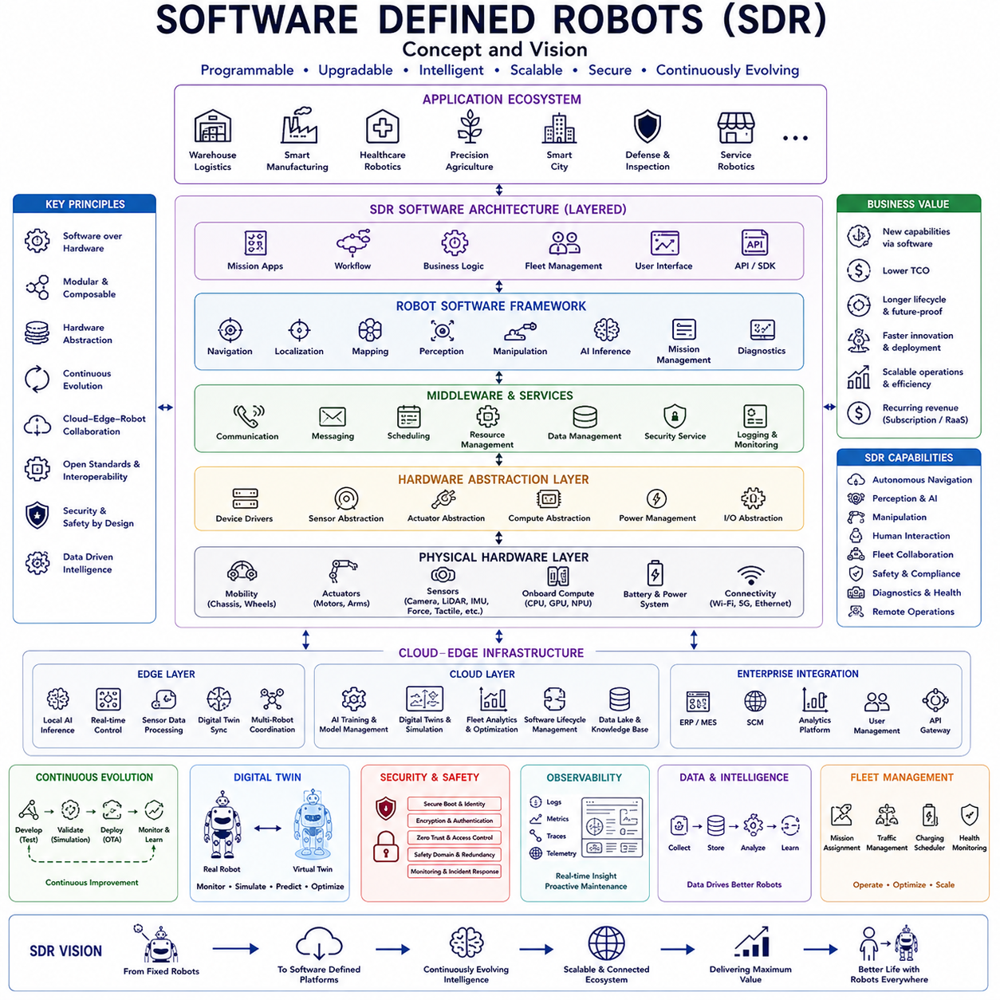{width="7.268055555555556in" height="7.268055555555556in"}

The robotics industry is currently undergoing one of the most significant paradigms shifts since the introduction of industrial automation. Traditional robots have historically been designed as tightly integrated systems in which hardware capabilities determined the overall functionality of the machine. Mechanical structures, electronic controllers, embedded software, sensors, and actuators were developed together as fixed products, making upgrades expensive, time-consuming, and often impossible without replacing substantial portions of the hardware. In contrast, the emergence of Software Defined Robots (SDR) introduces an entirely different philosophy in which robot capabilities are increasingly determined by software rather than hardware. Similar to the transformation from traditional networking to Software Defined Networking and from conventional vehicles to Software Defined Vehicles, Software Defined Robots represent the evolution of robotics into programmable, continuously evolving intelligent platforms whose functions can be enhanced, modified, optimized, and expanded throughout their operational lifetime through software updates rather than physical redesign.

The concept of Software Defined Robots is founded upon the separation of hardware capabilities from application intelligence. Instead of treating robots as fixed-purpose machines, SDR architecture views hardware as a standardized execution platform upon which multiple software-defined capabilities operate. Mechanical components provide mobility, manipulation, sensing, and computation, while software determines perception, decision making, navigation, manipulation strategies, mission execution, collaboration, safety behavior, human interaction, and autonomous learning. This separation fundamentally changes the economics of robotics because new business value can be created through software innovation without redesigning the physical platform.

Software Defined Robots transform robotics from product-centric engineering into platform-centric engineering. Traditional robotic products are delivered with predefined functionality that changes little after deployment. SDR platforms, however, continuously evolve throughout their operational lifecycle. New algorithms, artificial intelligence models, perception capabilities, motion planning strategies, security improvements, and operational applications can be deployed remotely, allowing robots to acquire entirely new capabilities years after installation. Consequently, the operational lifetime of robotic platforms extends significantly while reducing total ownership costs and protecting infrastructure investment.

At the architectural level, Software Defined Robots adopt layered system organization similar to modern cloud-native computing platforms. The physical hardware layer consists of mechanical systems, actuators, motors, batteries, power electronics, communication interfaces, cameras, LiDAR, radar, IMUs, GNSS receivers, force sensors, tactile sensors, environmental sensors, and onboard computing resources. Above the hardware layer resides a hardware abstraction layer that standardizes interfaces between software and physical devices. Middleware subsequently provides communication, resource management, scheduling, synchronization, messaging, and device orchestration. Robot operating frameworks execute navigation, perception, localization, manipulation, safety supervision, diagnostics, artificial intelligence inference, and mission management. Application software finally implements customer-specific workflows, business logic, operational policies, fleet coordination, and user interaction.

Hardware abstraction represents one of the most important architectural principles within Software Defined Robots. Application developers should not require detailed knowledge of individual motors, cameras, controllers, or sensor manufacturers. Instead, standardized software interfaces expose hardware capabilities through consistent application programming interfaces regardless of vendor implementation. This abstraction dramatically improves software portability while reducing dependency upon specific hardware platforms. Applications developed for one robotic platform can therefore migrate toward new hardware generations with minimal software modification.

The separation between hardware and software also accelerates innovation. Hardware development cycles typically require several years because mechanical engineering, manufacturing, certification, testing, and supply chain preparation involve substantial complexity. Software development, however, progresses much more rapidly through continuous integration, continuous deployment, automated testing, cloud-native development, and artificial intelligence optimization. Software Defined Robots enable software innovation to proceed independently from hardware evolution, allowing organizations to introduce new functionality continuously without waiting for future hardware generations.

Artificial intelligence serves as one of the primary driving technologies enabling Software Defined Robots. Modern robots increasingly rely upon machine learning for perception, semantic understanding, object recognition, speech interaction, manipulation planning, anomaly detection, predictive maintenance, and autonomous decision making. Because artificial intelligence models continuously improve through additional training and operational experience, SDR architecture enables robots to receive updated models through secure software distribution. Consequently, robotic intelligence evolves continuously while physical hardware remains unchanged.

Cloud-native computing further expands Software Defined Robot capabilities by extending computation beyond onboard hardware. Robots perform latency-sensitive operations locally while cloud infrastructure provides digital twins, fleet optimization, long-term analytics, model training, software lifecycle management, simulation, and enterprise integration. Edge computing complements cloud services by supporting computationally intensive inference and collaborative perception near operational environments. Together, cloud, edge, and onboard computing establish distributed intelligence supporting scalable robotic ecosystems.

Software Defined Robots also introduce modular software architecture. Rather than embedding all functionality within monolithic software systems, robot capabilities become independent software services communicating through standardized middleware. Navigation, localization, mapping, perception, motion control, manipulation, diagnostics, cybersecurity, artificial intelligence, and user interfaces operate as modular components capable of independent development, testing, deployment, replacement, and scaling. Modular architecture substantially improves maintainability while enabling parallel engineering across multiple development teams.

Containerization has become a fundamental deployment mechanism within Software Defined Robot platforms. Software components execute inside isolated containers together with their required runtime libraries and dependencies. Identical software packages therefore execute consistently across simulation environments, development workstations, edge servers, autonomous robots, testing laboratories, and cloud infrastructure. Containerization simplifies software deployment, rollback, version control, security management, and lifecycle governance throughout distributed robotic fleets.

Continuous software deployment fundamentally changes robotic maintenance. Traditional robotic systems frequently required physical service visits whenever software updates became necessary. Software Defined Robots instead support secure over-the-air updates allowing operating systems, middleware, artificial intelligence models, application software, firmware, cybersecurity patches, and configuration files to be distributed remotely. Organizations therefore maintain thousands of geographically distributed robots through centralized software lifecycle management without interrupting operational continuity unnecessarily.

Digital twins play a critical role within Software Defined Robot ecosystems. Every deployed robot maintains a continuously synchronized virtual representation including mechanical configuration, sensor calibration, software versions, artificial intelligence models, communication status, battery characteristics, operational history, maintenance records, environmental observations, and mission progress. Digital twins enable simulation, diagnostics, predictive maintenance, operational optimization, software validation, and artificial intelligence improvement before changes affect physical robots.

Simulation becomes increasingly important as software complexity grows. High-fidelity simulation environments accurately reproduce robot dynamics, sensor behavior, environmental interactions, communication latency, artificial intelligence perception, and multi-robot coordination. Developers validate software updates, autonomous behaviors, mission planning algorithms, safety functions, and artificial intelligence improvements within digital environments before deployment to operational fleets. Simulation therefore significantly reduces deployment risk while accelerating software innovation.

Cybersecurity represents a foundational requirement within Software Defined Robots because software increasingly determines robot behavior. Secure boot, trusted hardware modules, encrypted communication, certificate management, authentication, authorization, software signing, integrity verification, runtime monitoring, intrusion detection, vulnerability management, and zero-trust networking collectively protect robotic platforms against cyber threats. Since robots directly interact with physical environments, cybersecurity becomes inseparable from functional safety.

Functional safety remains equally essential despite increasing software flexibility. Safety-critical functions including emergency stopping, collision avoidance, motion supervision, actuator limitation, fault detection, redundancy management, and hazard mitigation require deterministic execution independent of application software. Software Defined Robot architecture therefore separates safety-certified execution domains from general-purpose application environments while maintaining coordinated system behavior.

Observability provides comprehensive operational insight throughout Software Defined Robot platforms. Logs, metrics, traces, sensor telemetry, actuator diagnostics, processor utilization, graphics processor workload, communication latency, battery performance, artificial intelligence confidence, mission execution statistics, and environmental observations continuously generate operational knowledge supporting proactive maintenance, software optimization, performance analysis, and fleet management. Observability transforms robotics from reactive maintenance toward predictive operational intelligence.

Artificial intelligence observability extends monitoring beyond infrastructure into model behavior. Engineers evaluate prediction confidence, perception accuracy, semantic consistency, localization reliability, hallucination detection, model drift, environmental adaptation, and operational fairness continuously during deployment. Production monitoring therefore becomes an integral component of responsible artificial intelligence lifecycle management within Software Defined Robot ecosystems.

Fleet management evolves substantially under the Software Defined Robot paradigm. Rather than monitoring individual machines independently, centralized fleet platforms coordinate mission assignment, traffic optimization, software deployment, charging schedules, artificial intelligence distribution, maintenance planning, digital twin synchronization, operational analytics, and enterprise integration across thousands of robots simultaneously. Fleet software increasingly becomes the primary operational interface through which organizations manage robotic infrastructure.

Software Defined Robots also transform application development. Instead of creating unique software for each robotic product, developers build reusable applications executing across standardized robotic platforms. Navigation software developed for warehouse robots may subsequently operate within hospital delivery robots or industrial inspection platforms after appropriate hardware abstraction. Application ecosystems therefore emerge similarly to smartphone software marketplaces, encouraging innovation through standardized development platforms.

Open standards play a crucial role in achieving interoperability across heterogeneous robotic ecosystems. Standard communication protocols, middleware interfaces, sensor abstractions, mapping formats, mission definitions, artificial intelligence model formats, software package structures, and cybersecurity frameworks reduce vendor lock-in while encouraging ecosystem-wide collaboration. Open architectures accelerate technological progress because independent organizations contribute interoperable software rather than isolated proprietary solutions.

Data becomes a strategic organizational asset within Software Defined Robot environments. Every robot continuously generates operational telemetry, perception observations, environmental measurements, maintenance records, navigation history, artificial intelligence inference, user interactions, and system diagnostics. Aggregated fleet data supports predictive maintenance, operational optimization, digital twins, simulation refinement, artificial intelligence retraining, safety improvement, and enterprise analytics. Consequently, software-defined robotics increasingly emphasizes knowledge management alongside physical automation.

Business models also evolve significantly. Traditional robotics companies primarily generated revenue through hardware sales and maintenance contracts. Software Defined Robots introduce recurring software subscriptions, cloud services, artificial intelligence capabilities, application marketplaces, premium navigation services, predictive maintenance platforms, digital twin analytics, cybersecurity services, and fleet management subscriptions. Revenue therefore shifts from one-time hardware transactions toward continuous software value creation throughout robot operational lifecycles.

The concept of Robot-as-a-Service naturally aligns with Software Defined Robot architecture. Customers increasingly purchase robotic capabilities rather than physical equipment ownership. Service providers continuously improve software, artificial intelligence, operational efficiency, cybersecurity, and analytics without requiring customers to replace hardware. Subscription-based robotics therefore becomes economically attractive for both providers and customers while accelerating technology adoption.

Software Defined Robots significantly reduce technological obsolescence. Rather than becoming outdated when newer algorithms emerge, robots receive continuous software enhancements extending operational relevance over many years. Artificial intelligence improvements, perception algorithms, navigation optimization, energy management, manipulation strategies, cybersecurity updates, and enterprise integration capabilities evolve continuously through software distribution. Long-term hardware investment consequently becomes substantially more sustainable.

Edge computing further strengthens Software Defined Robot architecture by enabling computationally intensive workloads to execute near operational environments. Artificial intelligence inference, collaborative perception, multi-robot coordination, digital twin synchronization, industrial analytics, and localized cloud services operate on regional edge infrastructure while latency-sensitive control remains onboard robots. Hybrid cloud-edge architecture balances computational scalability with deterministic operational responsiveness.

Scalability represents another defining characteristic of Software Defined Robots. Individual robots, multi-robot fleets, cloud infrastructure, artificial intelligence services, digital twins, and enterprise integration platforms all expand independently according to operational demand. Container orchestration, cloud-native infrastructure, distributed communication, event-driven architecture, and automated deployment collectively enable robotic ecosystems to scale from single experimental prototypes toward worldwide deployments involving thousands of autonomous systems.

Software Defined Robots also encourage continuous experimentation and innovation. New navigation algorithms, manipulation strategies, artificial intelligence models, human-machine interfaces, energy optimization techniques, and operational workflows can be deployed selectively to limited pilot fleets before global rollout. Progressive software deployment minimizes operational risk while accelerating technological evolution through continuous validation using real-world operational feedback.

Ultimately, Software Defined Robots represent far more than a technological upgrade to conventional robotics. They establish an entirely new architectural philosophy in which hardware provides standardized physical capability while software continuously defines intelligence, behavior, functionality, safety, adaptability, collaboration, and business value. Through hardware abstraction, modular architecture, cloud-native infrastructure, artificial intelligence integration, digital twins, edge computing, cybersecurity, over-the-air updates, continuous deployment, and open software ecosystems, Software Defined Robots create programmable autonomous platforms capable of evolving throughout their operational lifetime. This transformation establishes the technological foundation for next-generation intelligent factories, autonomous logistics, healthcare robotics, precision agriculture, smart cities, defense systems, industrial inspection, service robotics, and Physical AI ecosystems where continuous software innovation becomes the primary driver of robotic capability, scalability, sustainability, and long-term economic value.

소프트웨어 정의 로봇(Software Defined Robot, SDR)은 현대 로봇 산업이 하드웨어(Hardware) 중심에서 소프트웨어(Software) 중심으로 전환되는 새로운 패러다임(Paradigm)을 의미한다. 기존 로봇은 기계(Mechanics), 전자(Electronics), 제어기(Controller), 센서(Sensor), 소프트웨어가 하나의 고정된 제품으로 설계되었기 때문에 기능을 변경하거나 확장하려면 하드웨어를 교체해야 하는 경우가 많았다. 반면 SDR은 하드웨어를 공통 플랫폼으로 사용하고, 소프트웨어를 통해 기능과 성능을 지속적으로 개선하는 개념으로 발전하고 있다.

SDR의 핵심 철학은 하드웨어와 소프트웨어를 분리하는 것이다. 기계 구조는 이동(Mobility), 조작(Manipulation), 센싱(Sensing), 계산(Computation)을 담당하고, 소프트웨어는 인식(Perception), 의사결정(Decision Making), 자율주행(Autonomous Navigation), 임무 수행(Mission Execution), 협업(Collaboration), 안전(Safety), AI 기능을 정의한다. 따라서 동일한 하드웨어에서도 소프트웨어만 변경하면 전혀 다른 기능을 수행할 수 있는 로봇으로 발전할 수 있다.

소프트웨어 정의 로봇은 제품(Product) 중심이 아니라 플랫폼(Platform) 중심으로 설계된다. 기존 로봇은 출하 당시의 기능이 거의 유지되었지만, SDR은 운영 중에도 새로운 알고리즘(Algorithm), AI 모델(AI Model), 내비게이션(Navigation), 보안(Security), 사용자 기능(User Feature)을 지속적으로 추가할 수 있다. 따라서 하드웨어를 교체하지 않고도 수년 동안 새로운 기능을 계속 제공할 수 있다.

SDR은 계층형(Layered) 아키텍처를 기반으로 한다. 가장 아래에는 모터(Motor), 배터리(Battery), 카메라(Camera), LiDAR, IMU(Inertial Measurement Unit), GNSS(Global Navigation Satellite System), 액추에이터(Actuator)와 같은 하드웨어 계층이 존재한다. 그 위에는 하드웨어 추상화 계층(Hardware Abstraction Layer)이 위치하여 장치(Device)를 표준 인터페이스(Standard Interface)로 제공하며, 미들웨어(Middleware)는 통신(Communication), 메시징(Messaging), 동기화(Synchronization)를 담당한다. 최상위 계층에서는 AI, 자율주행, 플릿(Fleet), 애플리케이션(Application)이 실행된다.

하드웨어 추상화(Hardware Abstraction)는 SDR의 가장 중요한 설계 원칙 가운데 하나이다. 응용 프로그램(Application)은 특정 모터나 카메라 제조사에 의존하지 않고 표준 API(Application Programming Interface)를 통해 기능을 사용할 수 있다. 따라서 새로운 하드웨어가 추가되더라도 기존 소프트웨어를 거의 수정하지 않고 그대로 사용할 수 있어 이식성(Portability)과 유지보수성(Maintainability)이 크게 향상된다.

하드웨어와 소프트웨어를 분리하면 혁신 속도도 크게 향상된다. 하드웨어는 설계와 생산에 수년이 걸리지만, 소프트웨어는 지속적 통합(CI, Continuous Integration), 지속적 배포(CD, Continuous Deployment), 자동 테스트(Automated Testing)를 통해 빠르게 발전할 수 있다. SDR은 하드웨어 교체 없이 소프트웨어만 지속적으로 개선하여 새로운 기능을 빠르게 제공할 수 있다.

인공지능(AI)은 SDR을 가능하게 하는 핵심 기술이다. 현대 로봇은 객체 인식(Object Recognition), 음성 인식(Speech Recognition), 이상 탐지(Anomaly Detection), 조작 계획(Manipulation Planning), 자율주행(Navigation), 예지 보전(Predictive Maintenance)에 AI를 사용한다. AI 모델은 지속적으로 학습되고 개선되므로, SDR은 새로운 AI 모델을 원격으로 배포하여 로봇의 지능(Intelligence)을 계속 향상시킬 수 있다.

클라우드 네이티브(Cloud-Native)는 SDR의 확장성을 높이는 중요한 요소이다. 로봇 내부에서는 실시간 제어(Real-Time Control)를 수행하고, 클라우드(Cloud)는 디지털 트윈(Digital Twin), AI 학습(Model Training), 운영 분석(Analytics), 소프트웨어 관리(Lifecycle Management)를 담당한다. 엣지 컴퓨팅(Edge Computing)은 클라우드와 로봇 사이에서 AI 추론(Inference)과 협업 인식(Collaborative Perception)을 수행하여 전체 시스템의 응답성을 높인다.

모듈형 소프트웨어(Modular Software)는 SDR의 또 다른 특징이다. 내비게이션(Navigation), 위치 추정(Localization), 매핑(Mapping), AI, 진단(Diagnostics), 보안(Security), 사용자 인터페이스(UI)를 각각 독립적인 서비스(Service)로 개발할 수 있다. 따라서 필요한 기능만 개별적으로 업데이트하거나 교체할 수 있으며 여러 개발팀이 동시에 병렬 개발을 수행할 수 있다.

컨테이너(Container)는 SDR의 배포 방식을 혁신적으로 변화시킨다. 소프트웨어와 라이브러리(Library), 실행 환경(Runtime)을 하나의 컨테이너로 구성하면 개발 환경, 시뮬레이션(Simulation), 엣지 서버(Edge Server), 실제 로봇에서 동일하게 실행할 수 있다. 이를 통해 버전 관리(Version Control), 배포(Deployment), 롤백(Rollback)이 매우 쉬워진다.

OTA(Over-the-Air) 업데이트는 SDR의 핵심 기능이다. 과거에는 소프트웨어를 업데이트하기 위해 엔지니어가 현장을 방문해야 했지만, SDR은 운영체제(OS), AI 모델, 애플리케이션, 펌웨어(Firmware), 보안 패치(Security Patch)를 원격으로 배포할 수 있다. 수천 대의 로봇도 중앙에서 일괄적으로 관리할 수 있으므로 유지보수 비용이 크게 감소한다.

디지털 트윈(Digital Twin)은 SDR의 중요한 구성 요소이다. 실제 로봇의 상태(Status), 센서(Sensor), 배터리(Battery), AI 모델, 소프트웨어 버전, 유지보수 기록을 가상 공간에 동일하게 표현한다. 이를 이용하여 장애 분석(Failure Analysis), 예지 보전(Predictive Maintenance), 시뮬레이션, 운영 최적화(Operation Optimization)를 수행할 수 있다.

시뮬레이션(Simulation)은 SDR 개발 과정에서 필수적이다. 실제 로봇에 소프트웨어를 적용하기 전에 센서, 물리 환경, 통신(Network), AI 알고리즘을 가상 환경에서 검증한다. 이를 통해 운영 중 발생할 수 있는 위험을 줄이고 새로운 기능을 안전하게 테스트할 수 있다.

사이버 보안(Cybersecurity)은 SDR에서 더욱 중요한 요소가 된다. 소프트웨어가 로봇의 동작을 결정하기 때문에 보안 부팅(Secure Boot), 암호화(Encryption), 인증(Authentication), 인증서(Certificate), 제로 트러스트(Zero Trust), 침입 탐지(Intrusion Detection)를 통해 시스템을 보호해야 한다. 보안은 기능(Function)이 아니라 로봇의 기본 구조에 포함되어야 한다.

기능 안전(Function Safety)도 반드시 확보해야 한다. 긴급 정지(Emergency Stop), 충돌 방지(Collision Avoidance), 속도 제한(Speed Limitation), 장애 감지(Fault Detection)는 일반 애플리케이션과 분리된 안전 영역(Safety Domain)에서 독립적으로 실행되어야 하며, 소프트웨어 업데이트와 관계없이 항상 안전을 보장해야 한다.

관측성(Observability)은 SDR 운영의 핵심 요소이다. 로그(Log), 메트릭(Metric), 트레이스(Trace), 센서 데이터, CPU와 GPU 사용률(Utilization), AI 추론 결과, 배터리 상태, 임무 수행(Mission Execution) 정보를 지속적으로 수집하여 운영 상태를 실시간으로 분석하고 문제를 사전에 발견할 수 있다.

AI 관측성(AI Observability)은 AI 모델 자체를 지속적으로 평가하는 기술이다. 추론 신뢰도(Confidence), 데이터 드리프트(Data Drift), 모델 드리프트(Model Drift), 환각(Hallucination), 위치 추정 정확도(Localization Accuracy) 등을 분석하여 AI 모델이 실제 환경에서도 안정적으로 동작하는지 확인한다.

플릿 관리(Fleet Management)는 SDR 시대에 더욱 중요해진다. 중앙 시스템은 수천 대의 로봇에 대해 임무 배정(Mission Assignment), 충전(Charging), 교통 관리(Traffic Management), AI 모델 배포(Model Distribution), 소프트웨어 업데이트, 디지털 트윈 동기화(Synchronization)를 통합적으로 관리한다.

SDR은 애플리케이션 개발 방식도 변화시킨다. 특정 로봇 전용 소프트웨어를 만드는 대신 표준 플랫폼 위에서 동작하는 재사용 가능한 애플리케이션을 개발한다. 예를 들어 물류 로봇의 내비게이션 소프트웨어를 병원 서비스 로봇이나 산업 검사 로봇에서도 사용할 수 있어 소프트웨어 재사용성이 크게 향상된다.

개방형 표준(Open Standard)은 SDR 생태계(Ecosystem)의 핵심이다. 표준 통신 프로토콜(Protocol), 미들웨어(Middleware), 지도(Map), AI 모델 형식(Model Format), 미션(Mission) 정의를 사용하면 제조사가 달라도 동일한 플랫폼에서 상호 운용성(Interoperability)을 확보할 수 있으며 특정 업체에 대한 종속성(Vendor Lock-in)을 줄일 수 있다.

데이터(Data)는 SDR에서 매우 중요한 자산이다. 로봇은 센서 데이터, 운행 기록, AI 추론 결과, 환경 정보, 유지보수 이력, 사용자 상호작용(User Interaction)을 지속적으로 생성한다. 이러한 데이터를 분석하면 AI 성능 향상, 운영 최적화, 예지 보전, 디지털 트윈 개선, 기업 의사결정까지 지원할 수 있다.

비즈니스 모델(Business Model)도 변화한다. 기존에는 하드웨어 판매가 중심이었지만, SDR은 AI 서비스, 플릿 관리, 디지털 트윈, 클라우드 플랫폼, 보안 서비스, 애플리케이션 마켓플레이스(Marketplace)와 같은 지속적인 소프트웨어 서비스 중심으로 발전한다. 따라서 일회성 판매보다 구독형(Subscription) 서비스가 증가하게 된다.

RaaS(Robot-as-a-Service)는 SDR과 매우 잘 어울리는 개념이다. 고객은 로봇 자체를 구매하는 것이 아니라 로봇 기능(Function)을 서비스 형태로 이용한다. 공급자는 지속적으로 소프트웨어를 개선하고 고객은 하드웨어를 교체하지 않고도 최신 AI와 기능을 사용할 수 있다.

SDR은 기술 노후화(Obsolescence)를 크게 줄인다. 새로운 AI 알고리즘, 내비게이션, 에너지 관리(Energy Management), 보안 기능이 개발되면 하드웨어를 그대로 유지하면서 소프트웨어만 업데이트하면 된다. 따라서 로봇 플랫폼의 수명이 길어지고 투자 비용도 절감된다.

엣지 컴퓨팅(Edge Computing)은 SDR을 더욱 강력하게 만든다. 실시간 AI 추론, 협업 인식(Collaborative Perception), 플릿 협업, 디지털 트윈 동기화는 엣지 서버에서 수행하고, 로봇은 실시간 제어를 담당하며, 클라우드는 AI 학습과 장기 분석을 수행한다. 이러한 하이브리드(Hybrid) 구조는 확장성과 응답성을 동시에 제공한다.

확장성(Scalability)은 SDR의 중요한 특징이다. 로봇, AI 서비스, 클라우드, 디지털 트윈, 플릿 관리 시스템은 각각 독립적으로 확장될 수 있다. 컨테이너(Container), 이벤트 기반(Event-Driven) 아키텍처, 클라우드 네이티브 기술을 이용하면 하나의 로봇에서 수천 대의 글로벌(Global) 플릿까지 자연스럽게 확장할 수 있다.

SDR은 지속적인 실험과 혁신을 가능하게 한다. 새로운 AI 모델, 자율주행 알고리즘, 사용자 인터페이스(UI), 에너지 절감 기능을 일부 로봇에서 먼저 시험한 후 검증이 완료되면 전체 플릿으로 확대 적용할 수 있다. 이를 통해 운영 위험을 줄이면서도 혁신 속도를 높일 수 있다.

결론적으로 소프트웨어 정의 로봇(Software Defined Robot)은 단순히 소프트웨어를 많이 사용하는 로봇이 아니라, 하드웨어는 공통 플랫폼으로 유지하고 소프트웨어가 기능(Function), 지능(Intelligence), 안전(Safety), 협업(Collaboration), 확장성(Scalability), 비즈니스 가치(Business Value)를 지속적으로 정의하는 차세대 로봇 아키텍처이다. 하드웨어 추상화(Hardware Abstraction), 모듈형 소프트웨어(Modular Software), AI, 클라우드 네이티브, 엣지 컴퓨팅, 디지털 트윈, OTA 업데이트, 사이버 보안, 개방형 생태계를 통합함으로써 스마트 팩토리(Smart Factory), 자율 물류(Autonomous Logistics), 의료 로봇(Healthcare Robotics), 정밀 농업(Precision Agriculture), 스마트시티(Smart City), 산업 검사(Industrial Inspection), 물리 AI 플랫폼의 핵심 기반 기술로 자리매김하게 될 것이다.

##  

## 10.02 Hardware Abstraction and Virtualization Layer Design

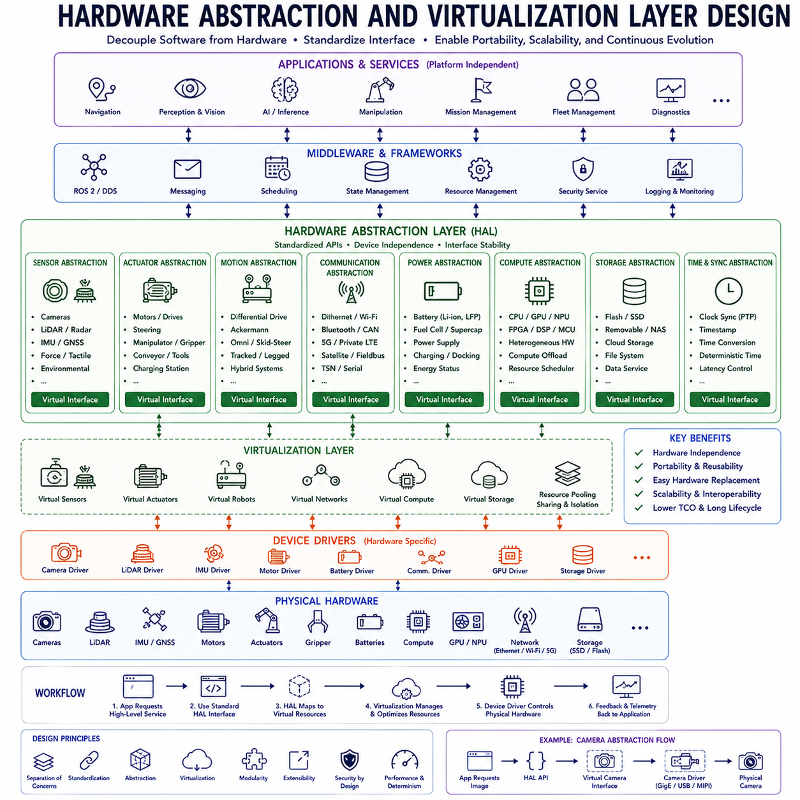{width="7.268055555555556in" height="7.268055555555556in"}

Modern robotics is evolving from hardware-oriented engineering toward software-defined intelligent platforms in which software determines functionality while hardware provides standardized execution capability. This transformation requires an architectural layer that separates physical hardware from application software, allowing robotic software to operate independently of specific device manufacturers, sensor models, controller implementations, or computing platforms. Hardware Abstraction and Virtualization Layer Design therefore represents one of the most fundamental architectural principles of Software Defined Robots, enabling portability, scalability, interoperability, maintainability, and long-term evolution of robotic systems. Rather than allowing applications to communicate directly with motors, sensors, actuators, and embedded controllers, the abstraction layer provides standardized interfaces while virtualization enables logical representations of hardware resources independent of their physical implementation.

Historically, robotic systems were tightly coupled to their hardware. Motion controllers were written specifically for individual motor drivers. Vision software depended on proprietary camera interfaces. Navigation algorithms required hardware-specific localization implementations. Every hardware replacement required extensive software modification because applications directly interacted with device-specific communication protocols and control interfaces. This tight coupling significantly increased engineering complexity, limited portability, slowed innovation, and reduced software reuse. Hardware abstraction fundamentally addresses these challenges by introducing a standardized interface between physical devices and higher software layers.

The primary objective of a Hardware Abstraction Layer is to isolate application software from hardware implementation details. Applications should request movement rather than commanding individual motors directly. Perception algorithms should request images rather than controlling camera registers. Localization software should obtain robot position without knowing which positioning technology generated the estimate. Artificial intelligence applications should request sensor observations without depending upon individual sensor manufacturers. This architectural separation dramatically simplifies software development while enabling hardware components to evolve independently from application logic.

Hardware abstraction introduces interface stability across multiple hardware generations. Robot manufacturers frequently upgrade processors, sensors, batteries, communication devices, cameras, LiDAR systems, inertial measurement units, motor controllers, or power electronics throughout product lifecycles. Without abstraction, every hardware modification propagates upward throughout the software stack requiring widespread redesign. With stable abstraction interfaces, hardware implementation changes remain localized within device drivers while higher software layers continue functioning without modification. Stable interfaces therefore preserve software investment throughout long-term platform evolution.

Virtualization extends hardware abstraction by representing physical resources through logical software entities independent of physical implementation. Applications no longer access specific devices directly but instead communicate with virtual devices providing standardized capabilities. Multiple physical sensors may collectively appear as one virtual perception system. Several motor controllers may expose one virtual mobility interface. Distributed computing resources may behave as one logical processing platform. Virtualization therefore hides hardware complexity while presenting consistent software interfaces across heterogeneous robotic platforms.

The Hardware Abstraction Layer typically resides immediately above embedded device drivers and below middleware services. Device drivers implement low-level communication with motors, encoders, cameras, LiDAR units, inertial sensors, force sensors, tactile sensors, batteries, communication interfaces, programmable logic controllers, and other hardware components. The abstraction layer converts device-specific commands into standardized interfaces while normalizing data formats, communication protocols, coordinate systems, timing information, error handling, and configuration management. Middleware subsequently consumes these standardized services supporting higher-level robotics frameworks and applications.

Sensor abstraction represents one of the most important responsibilities within hardware abstraction architecture. Modern robots frequently integrate cameras, LiDAR systems, radar sensors, ultrasonic sensors, inertial measurement units, GNSS receivers, force sensors, tactile arrays, temperature sensors, environmental sensors, and specialized industrial instrumentation. Every manufacturer implements unique communication protocols, calibration procedures, configuration parameters, synchronization mechanisms, and diagnostic interfaces. Sensor abstraction converts these heterogeneous implementations into standardized observation interfaces enabling perception software to operate independently from sensor hardware selection.

Camera abstraction provides a representative example of this architectural philosophy. Application software requests image streams, exposure parameters, timestamp information, intrinsic calibration, extrinsic calibration, synchronization status, and image metadata through standardized interfaces regardless of whether physical cameras originate from different manufacturers or utilize USB, Ethernet, GigE Vision, MIPI, Camera Link, or proprietary communication protocols. Replacing camera hardware therefore requires only driver modification while computer vision applications remain unchanged.

LiDAR abstraction similarly standardizes point cloud acquisition independent of sensor implementation. Different LiDAR manufacturers provide varying scan patterns, communication interfaces, calibration methods, timing synchronization, data packet structures, and operational characteristics. Hardware abstraction converts these differences into common point cloud representations, diagnostic interfaces, timestamp synchronization, coordinate transformations, and quality indicators. Mapping, localization, obstacle detection, and navigation algorithms consequently remain portable across multiple sensor platforms.

Actuator abstraction provides standardized control interfaces for motors, steering systems, robotic manipulators, grippers, conveyors, elevators, charging stations, pan-tilt mechanisms, industrial tools, and specialized mechanical subsystems. Applications issue velocity commands, position targets, force objectives, torque requests, or operational modes without understanding low-level motor communication protocols, encoder implementations, control frequencies, or electrical interfaces. Hardware abstraction translates high-level commands into device-specific execution while monitoring operational status continuously.

Motion abstraction further integrates multiple actuators into unified mobility interfaces. Differential drive robots, Ackermann steering vehicles, omnidirectional mobile platforms, skid-steering systems, tracked vehicles, legged robots, articulated manipulators, and hybrid locomotion systems all expose different physical control characteristics. Motion abstraction presents standardized mobility capabilities allowing navigation software to operate across diverse robotic platforms while translating generalized movement commands into platform-specific actuator coordination.

Communication abstraction standardizes interaction with networking hardware including Ethernet, Wi-Fi, Bluetooth, private cellular infrastructure, public mobile networks, satellite communication, industrial fieldbus systems, Controller Area Network, serial interfaces, and time-sensitive networking. Software components communicate through logical messaging services while abstraction layers manage protocol translation, quality-of-service policies, bandwidth optimization, redundancy, security, and fault recovery transparently.

Power abstraction enables applications to monitor and manage energy resources without depending upon battery technologies or power electronics implementation. Lithium-ion batteries, lithium iron phosphate systems, supercapacitors, fuel cells, hybrid energy storage, external power supplies, and wireless charging infrastructure all expose standardized operational metrics including remaining capacity, state of health, charging status, discharge characteristics, thermal conditions, estimated runtime, and energy consumption. Fleet management systems therefore optimize operational scheduling independently from battery hardware implementation.

Compute abstraction represents an increasingly important architectural capability as robotic platforms integrate heterogeneous processing resources. Modern robots frequently combine general-purpose processors, graphics processing units, neural processing units, field programmable gate arrays, digital signal processors, microcontrollers, and specialized artificial intelligence accelerators. Applications request computational services rather than targeting specific processors directly. Resource schedulers subsequently allocate workloads according to computational requirements, hardware availability, latency constraints, power consumption, and operational priorities.

Artificial intelligence virtualization extends compute abstraction toward distributed intelligence. Neural network inference may execute onboard robots, regional edge servers, centralized cloud infrastructure, or hybrid computational environments depending upon latency sensitivity, bandwidth availability, model complexity, and hardware utilization. Applications invoke logical inference services while virtualization dynamically selects optimal execution environments transparently. This architecture enables seamless migration between embedded intelligence and cloud-based reasoning without application redesign.

Device virtualization further improves hardware utilization by enabling multiple software components to share physical resources safely. Cameras may simultaneously support localization, obstacle detection, visual inspection, and teleoperation. Graphics processors execute multiple artificial intelligence models concurrently. Communication interfaces support independent application services through virtual networking. Storage resources provide isolated logical partitions supporting diagnostics, mapping, logging, artificial intelligence datasets, and operational applications. Controlled resource sharing significantly improves overall system efficiency.

Time virtualization provides deterministic execution independent of underlying hardware timing characteristics. Embedded controllers, operating systems, sensors, communication devices, and distributed computing resources frequently operate with different clock frequencies and synchronization precision. Hardware abstraction normalizes timestamp generation, clock synchronization, scheduling behavior, and temporal coordination supporting deterministic robotic operation throughout heterogeneous computational infrastructure.

Memory abstraction similarly separates software from physical storage implementation. Embedded flash memory, solid-state drives, removable storage, network-attached storage, distributed cloud storage, and persistent databases collectively appear through standardized storage services supporting configuration management, mapping repositories, artificial intelligence models, telemetry archives, digital twins, and operational logs. Applications therefore access logical storage rather than hardware-specific file systems.

Virtualization significantly enhances simulation capability because virtual hardware behaves identically to physical hardware from application perspectives. Robotics software developed using abstraction interfaces executes within simulation environments without modification. Simulated cameras, LiDAR systems, inertial sensors, actuators, communication networks, and environmental interactions replace physical devices while preserving identical software interfaces. Consequently, simulation becomes an integral component of continuous integration, software validation, artificial intelligence development, and autonomous behavior testing.

Digital twins naturally leverage hardware abstraction because virtual representations mirror standardized logical interfaces rather than proprietary hardware implementations. Every physical robot maintains corresponding virtual resources representing sensors, actuators, processors, batteries, communication systems, environmental observations, and operational state. Standardized abstraction interfaces simplify synchronization between physical systems and digital counterparts while supporting predictive maintenance, diagnostics, simulation, and operational optimization.

Cybersecurity benefits substantially from hardware abstraction because security services integrate centrally rather than individually within every hardware component. Authentication, authorization, encryption, certificate management, secure boot, trusted execution environments, hardware identity, software integrity verification, and intrusion detection operate through standardized security interfaces protecting diverse hardware consistently. Security policies therefore remain independent from device manufacturers while supporting enterprise-wide governance.

Functional safety similarly improves through standardized abstraction. Safety-certified software interacts with logical actuator interfaces, emergency stop mechanisms, sensor diagnostics, redundancy management, and fault detection services independently from underlying hardware implementation. Hardware changes therefore require limited recertification because certified interfaces remain stable while device-specific modifications remain isolated beneath abstraction layers.

Observability represents another important capability integrated within hardware abstraction architecture. Standardized monitoring interfaces continuously expose processor utilization, graphics processor workload, memory allocation, communication latency, battery performance, actuator diagnostics, sensor quality, thermal conditions, synchronization accuracy, and operational health. Higher-level fleet management systems collect these metrics uniformly across heterogeneous robotic platforms supporting predictive maintenance, capacity planning, artificial intelligence optimization, and operational analytics.

Error abstraction significantly simplifies application development by converting device-specific fault codes into standardized operational events. Different motor controllers, sensors, communication devices, and processors implement unique diagnostic mechanisms. Hardware abstraction categorizes failures according to common operational semantics including initialization errors, communication failures, calibration issues, synchronization problems, hardware degradation, thermal warnings, and critical safety faults. Applications therefore implement generalized recovery strategies rather than device-specific exception handling.

Configuration management becomes considerably more maintainable through hardware abstraction. Device parameters including calibration constants, communication settings, operational limits, synchronization configuration, coordinate transformations, safety constraints, artificial intelligence acceleration preferences, and hardware capabilities become centralized within structured configuration services. Software deployment, hardware replacement, calibration updates, and manufacturing customization consequently require configuration changes rather than application modification.

Scalability constitutes another major architectural advantage of hardware abstraction. Individual robots, industrial automation systems, collaborative robotic fleets, autonomous vehicles, agricultural platforms, healthcare robots, and inspection systems may utilize different hardware while sharing identical application software. Standardized interfaces allow organizations to deploy common software ecosystems across diverse robotic product families supporting substantial engineering reuse and reduced development cost.

Interoperability across multiple manufacturers represents a long-term vision enabled by standardized abstraction. Open robotics standards, middleware frameworks, sensor interfaces, communication protocols, and application programming interfaces allow hardware from independent vendors to cooperate within integrated robotic ecosystems. Vendor lock-in decreases while component competition accelerates innovation throughout the robotics industry.

Software-defined robotics fundamentally depends upon robust hardware abstraction because software portability becomes impossible when applications remain tightly coupled to hardware implementation. Hardware abstraction therefore serves as the enabling layer supporting over-the-air updates, modular applications, cloud-native deployment, edge computing, artificial intelligence portability, digital twins, simulation, lifecycle management, and continuous software evolution. Every software-defined capability ultimately relies upon standardized hardware interfaces maintaining stability throughout changing physical infrastructure.

Future robotic platforms will likely extend hardware virtualization beyond individual robots toward distributed physical resources. Sensors deployed throughout intelligent environments, collaborative robots, autonomous vehicles, drones, industrial infrastructure, warehouse equipment, cloud computing resources, and edge artificial intelligence accelerators will collectively appear as one unified programmable robotics platform. Applications will request perception, mobility, manipulation, computation, communication, or intelligence services without distinguishing whether resources originate onboard individual robots or distributed cyber-physical infrastructure.

Ultimately, Hardware Abstraction and Virtualization Layer Design establishes the architectural foundation enabling Software Defined Robots to evolve from tightly integrated mechanical products into flexible, programmable, continuously improving intelligent platforms. By separating software from hardware implementation through standardized interfaces, logical resource virtualization, modular architecture, distributed computing, cybersecurity integration, digital twins, simulation support, and cloud-edge interoperability, hardware abstraction transforms robotics into a sustainable software ecosystem capable of supporting rapid innovation, long operational lifecycles, scalable deployment, and next-generation Physical AI systems operating across heterogeneous hardware environments.

하드웨어 추상화 및 가상화 계층(Hardware Abstraction and Virtualization Layer)은 소프트웨어 정의 로봇(Software Defined Robot, SDR)의 핵심 기반 기술이다. 기존 로봇은 소프트웨어가 특정 모터(Motor), 센서(Sensor), 카메라(Camera), 제어기(Controller)에 직접 연결되어 있어 하드웨어가 변경되면 소프트웨어도 함께 수정해야 했다. 반면 하드웨어 추상화는 물리적인 장치와 응용 소프트웨어(Application Software)를 분리하여, 동일한 소프트웨어가 다양한 하드웨어에서 동작할 수 있도록 만드는 핵심 아키텍처이다.

기존 로봇 시스템은 하드웨어와 소프트웨어가 강하게 결합(Tight Coupling)되어 있었다. 모터 제어 프로그램은 특정 모터 드라이버(Motor Driver)에 맞게 작성되었고, 비전 시스템(Vision System)은 특정 카메라 제조사의 SDK(Software Development Kit)에 의존하였다. 이러한 구조에서는 하드웨어를 교체할 때마다 소프트웨어를 대규모로 수정해야 하므로 유지보수성과 확장성이 매우 낮았다.

하드웨어 추상화 계층(Hardware Abstraction Layer, HAL)의 가장 중요한 목적은 응용 프로그램을 하드웨어 세부 구현으로부터 분리하는 것이다. 응용 프로그램은 특정 모터를 직접 제어하는 대신 "이동(Move)" 명령만 호출하고, 카메라 제어 대신 "영상(Image)"을 요청하며, 위치 추정(Localization)은 어떤 센서가 사용되는지 알 필요 없이 위치 정보(Position)만 제공받는다. 이를 통해 응용 프로그램은 하드웨어 종류와 무관하게 동일하게 동작할 수 있다.

하드웨어 추상화는 여러 세대의 하드웨어(Hardware Generation)에서도 동일한 인터페이스(Interface)를 유지할 수 있도록 한다. 예를 들어 카메라, LiDAR, CPU, GPU, 배터리(Battery), GNSS(Global Navigation Satellite System)가 새로운 제품으로 교체되더라도 상위 소프트웨어는 변경할 필요가 없다. 변경 사항은 장치 드라이버(Device Driver) 내부에서만 처리되므로 플랫폼의 수명과 유지보수성이 크게 향상된다.

가상화(Virtualization)는 하드웨어 추상화를 한 단계 더 발전시킨 개념이다. 응용 프로그램은 실제 물리 장치가 아니라 가상 장치(Virtual Device)를 사용한다. 여러 개의 카메라는 하나의 가상 비전 시스템(Virtual Vision System)으로 보일 수 있고, 여러 개의 모터는 하나의 이동 시스템(Mobility System)처럼 동작한다. 또한 여러 개의 GPU나 서버는 하나의 계산 자원(Compute Resource)처럼 사용할 수 있다.

하드웨어 추상화 계층은 일반적으로 장치 드라이버(Device Driver)와 미들웨어(Middleware) 사이에 위치한다. 장치 드라이버는 실제 하드웨어와 직접 통신하고, HAL은 이를 표준 인터페이스(Standard Interface)로 변환한다. 미들웨어는 이러한 표준 인터페이스를 이용하여 내비게이션(Navigation), AI, 자율주행(Autonomous Navigation), 플릿(Fleet) 관리와 같은 상위 기능을 제공한다.

센서 추상화(Sensor Abstraction)는 HAL의 가장 중요한 기능 가운데 하나이다. 로봇에는 카메라, LiDAR, 레이더(Radar), IMU(Inertial Measurement Unit), GNSS, 초음파(Ultrasonic), 힘 센서(Force Sensor), 촉각 센서(Tactile Sensor) 등 다양한 센서가 사용된다. 제조사마다 데이터 형식(Data Format), 통신 방식(Communication Protocol), 보정(Calibration) 방법이 모두 다르지만 HAL은 이를 동일한 형태의 데이터로 변환하여 상위 소프트웨어에 제공한다.

카메라 추상화(Camera Abstraction)는 대표적인 사례이다. 응용 프로그램은 GigE Vision, USB Camera, MIPI Camera 등 어떤 인터페이스를 사용하는지 알 필요 없이 영상(Image), 시간 정보(Timestamp), 보정 정보(Calibration)만 사용한다. 카메라 제조사가 변경되어도 응용 프로그램은 수정되지 않는다.

LiDAR 추상화(LiDAR Abstraction)도 동일한 원리이다. 제조사마다 스캔 방식(Scan Pattern), 데이터 패킷(Packet), 좌표계(Coordinate System), 시간 동기화(Synchronization)가 다르지만 HAL은 이를 표준 포인트 클라우드(Point Cloud) 형태로 제공한다. 따라서 SLAM(Simultaneous Localization and Mapping), 장애물 회피(Obstacle Avoidance), 지도 작성(Mapping)은 센서 변경과 관계없이 동일하게 동작한다.

액추에이터 추상화(Actuator Abstraction)는 모터, 조향(Steering), 로봇팔(Manipulator), 그리퍼(Gripper), 컨베이어(Conveyor), 충전기(Charging Station)를 동일한 방식으로 제어한다. 응용 프로그램은 속도(Velocity), 위치(Position), 힘(Force), 토크(Torque)와 같은 명령만 전달하면 HAL이 이를 실제 장치 명령으로 변환하여 실행한다.

이동 추상화(Motion Abstraction)는 다양한 구동 방식(Drive System)을 하나의 인터페이스로 통합한다. 차동 구동(Differential Drive), 애커만 조향(Ackermann Steering), 스키드 스티어(Skid-Steer), 전방향 이동(Omnidirectional Drive), 다족 보행(Legged Robot) 등은 서로 다른 제어 방식을 사용하지만, 상위 내비게이션은 동일한 이동 인터페이스를 사용할 수 있다.

통신 추상화(Communication Abstraction)는 Ethernet, Wi-Fi, Bluetooth, CAN(Controller Area Network), RS-485, Private 5G, 위성 통신(Satellite Communication) 등 다양한 네트워크를 하나의 통신 서비스로 제공한다. 응용 프로그램은 통신 방식을 직접 다루지 않고 메시지(Message)만 송수신하면 된다.

전원 추상화(Power Abstraction)는 다양한 배터리 시스템(Battery System)을 동일한 방식으로 관리한다. 리튬이온(Lithium-Ion), LFP(Lithium Iron Phosphate), 연료전지(Fuel Cell), 슈퍼커패시터(Supercapacitor) 등 다양한 전원 장치를 동일한 API로 제어하여 잔량(State of Charge), 수명(State of Health), 충전 상태(Charging Status)를 통합 관리할 수 있다.

컴퓨팅 추상화(Compute Abstraction)는 CPU(Central Processing Unit), GPU(Graphics Processing Unit), NPU(Neural Processing Unit), FPGA(Field Programmable Gate Array)를 하나의 계산 자원처럼 사용할 수 있도록 한다. 응용 프로그램은 어떤 프로세서를 사용할지 신경 쓰지 않고 계산 서비스를 요청하면 시스템이 가장 적합한 하드웨어를 자동으로 선택한다.

AI 가상화(AI Virtualization)는 AI 추론(Inference)을 로봇 내부, 엣지 서버(Edge Server), 클라우드(Cloud) 중 가장 적절한 위치에서 실행하도록 지원한다. 응용 프로그램은 단순히 AI 서비스를 호출하면 되고, 시스템은 지연 시간(Latency), 네트워크(Network), GPU 사용률(Utilization)을 고려하여 최적의 실행 위치를 자동으로 선택한다.

장치 가상화(Device Virtualization)는 하나의 물리 장치를 여러 소프트웨어가 동시에 사용할 수 있도록 한다. 하나의 카메라는 자율주행, 객체 인식(Object Recognition), 원격 모니터링(Remote Monitoring), 품질 검사(Quality Inspection)에 동시에 활용될 수 있으며, GPU도 여러 AI 모델이 공유하여 사용할 수 있다.

시간 가상화(Time Virtualization)는 다양한 장치의 시계를 하나로 통합한다. 센서마다 시간 기준(Time Base)이 다르기 때문에 HAL은 시간 동기화(Time Synchronization)를 수행하여 모든 데이터가 동일한 기준 시간으로 처리되도록 한다.

메모리 추상화(Memory Abstraction)는 플래시 메모리(Flash Memory), SSD(Solid State Drive), NAS(Network Attached Storage), 클라우드 스토리지(Cloud Storage)를 하나의 저장소(Storage Service)처럼 사용할 수 있도록 한다. 응용 프로그램은 실제 저장 장치를 의식하지 않고 데이터를 저장하거나 읽을 수 있다.

가상화는 시뮬레이션(Simulation)에서도 매우 중요하다. 실제 하드웨어 대신 가상의 카메라, LiDAR, IMU, 모터를 사용하더라도 응용 프로그램은 동일한 인터페이스를 사용한다. 따라서 개발자는 실제 로봇 없이도 대부분의 소프트웨어를 개발하고 검증할 수 있다.

디지털 트윈(Digital Twin)은 하드웨어 추상화와 자연스럽게 연결된다. 실제 로봇과 동일한 가상 모델(Virtual Model)을 생성하여 센서, 모터, 배터리, CPU, AI 상태를 실시간으로 동기화한다. 이를 통해 장애 분석(Failure Analysis), 예지 보전(Predictive Maintenance), 운영 최적화(Operation Optimization)를 수행할 수 있다.

사이버 보안(Cybersecurity)도 HAL을 통해 통합적으로 관리된다. 인증(Authentication), 권한 관리(Authorization), 암호화(Encryption), 보안 부팅(Secure Boot), 인증서(Certificate), 침입 탐지(Intrusion Detection)를 공통 계층에서 제공하므로 하드웨어 종류와 관계없이 동일한 보안 정책을 적용할 수 있다.

기능 안전(Function Safety) 역시 HAL의 중요한 역할이다. 긴급 정지(Emergency Stop), 속도 제한(Speed Limitation), 충돌 방지(Collision Avoidance), 고장 감지(Fault Detection)는 하드웨어 종류와 관계없이 동일한 안전 인터페이스를 제공하며, 하드웨어가 변경되어도 안전 기능은 그대로 유지된다.

관측성(Observability)은 HAL을 통해 표준화된다. CPU, GPU, 메모리(Memory), 배터리(Battery), 센서 상태(Sensor Health), 통신(Network), 온도(Temperature), 동기화(Synchronization) 정보를 동일한 형식으로 수집하여 플릿 관리(Fleet Management)와 운영 분석에 활용할 수 있다.

오류 추상화(Error Abstraction)는 다양한 장치의 오류를 하나의 표준 오류 체계(Standard Error Model)로 변환한다. 제조사마다 오류 코드(Error Code)는 다르지만 HAL은 이를 통신 오류(Communication Error), 초기화 실패(Initialization Failure), 보정 오류(Calibration Error), 하드웨어 이상(Hardware Failure) 등으로 통합하여 응용 프로그램이 쉽게 처리할 수 있도록 한다.

설정 관리(Configuration Management)는 하드웨어 파라미터(Parameter)를 중앙에서 관리하는 기능이다. 센서 보정값(Calibration), 통신 설정(Network Configuration), 안전 제한(Safety Limit), AI 가속기 설정(AI Accelerator Configuration)을 하나의 설정 시스템으로 관리하여 하드웨어 변경 시에도 응용 프로그램 수정이 필요 없도록 한다.

하드웨어 추상화는 플랫폼 확장성(Scalability)을 크게 향상시킨다. 물류 로봇(Logistics Robot), 산업 검사 로봇(Inspection Robot), 의료 로봇(Healthcare Robot), 농업 로봇(Agricultural Robot)이 서로 다른 하드웨어를 사용하더라도 동일한 소프트웨어를 재사용할 수 있으므로 개발 비용을 크게 절감할 수 있다.

상호 운용성(Interoperability)도 HAL의 중요한 장점이다. 표준 인터페이스를 사용하면 서로 다른 제조사의 센서와 액추에이터를 자유롭게 조합할 수 있으며, 특정 제조사에 종속되는 벤더 종속성(Vendor Lock-in)을 줄일 수 있다.

소프트웨어 정의 로봇(SDR)은 하드웨어 추상화 없이는 구현될 수 없다. OTA(Over-the-Air) 업데이트, AI 모델 교체, 모듈형 애플리케이션(Modular Application), 디지털 트윈, 클라우드-엣지 협업(Cloud-Edge Collaboration)은 모두 HAL이 제공하는 표준 인터페이스를 기반으로 동작한다.

미래에는 개별 로봇뿐 아니라 여러 로봇과 주변 인프라까지 하나의 가상 플랫폼으로 통합될 것이다. 드론(Drone), AMR(Autonomous Mobile Robot), 산업 설비, 스마트 센서(Smart Sensor), 엣지 서버, 클라우드 AI가 하나의 논리적 플랫폼(Logical Platform)으로 동작하여 응용 프로그램은 실제 하드웨어의 위치나 종류를 알 필요 없이 필요한 서비스를 사용할 수 있게 될 것이다.

결론적으로 하드웨어 추상화 및 가상화 계층(Hardware Abstraction and Virtualization Layer)은 소프트웨어 정의 로봇의 핵심 기반 기술이다. 하드웨어와 소프트웨어를 분리하고 표준 인터페이스(Standard Interface), 자원 가상화(Resource Virtualization), AI 분산 실행, 디지털 트윈, 시뮬레이션, 클라우드-엣지 통합을 제공함으로써 로봇을 고정된 기계 제품이 아니라 지속적으로 진화하는 지능형 소프트웨어 플랫폼으로 전환시키는 핵심 아키텍처 역할을 수행한다.

##  

## 10.03 Runtime-Reconfigurable Robot SW Platform

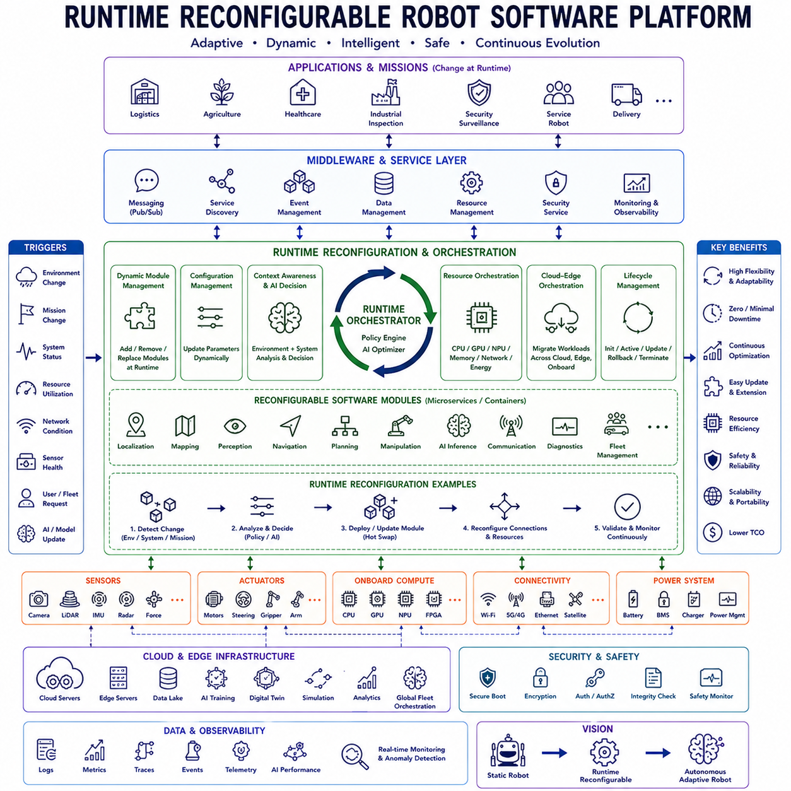{width="7.268055555555556in" height="7.268055555555556in"}

The rapid evolution of autonomous robotics, artificial intelligence, cloud computing, edge computing, and cyber-physical systems has fundamentally changed the way robotic software platforms are designed. Traditional robotic systems were generally deployed as static software environments in which hardware configuration, middleware components, communication interfaces, navigation algorithms, perception pipelines, safety mechanisms, and mission logic remained fixed throughout the operational lifetime of the robot. Any modification typically required stopping the robot, recompiling software, reinstalling applications, restarting middleware services, or even replacing embedded controllers. Such static architectures are increasingly incompatible with modern robotic environments where missions continuously evolve, artificial intelligence models improve rapidly, operational conditions change dynamically, and fleets must adapt to new business requirements without interrupting production. Runtime Reconfigurable Robot Software Platforms address these challenges by enabling robotic software systems to modify their internal configuration, computational resources, communication topology, functional components, artificial intelligence models, and operational behavior dynamically while the robot continues operating safely. This architectural paradigm transforms robots from static automation systems into continuously adaptive software-defined platforms capable of responding intelligently to changing operational environments.

Runtime reconfiguration refers to the capability of modifying software architecture during execution without shutting down the system. Unlike conventional configuration management performed before deployment, runtime reconfiguration allows robotic applications to add, remove, replace, upgrade, or reconfigure software modules while maintaining continuous operation. Navigation algorithms may change according to terrain conditions. Artificial intelligence models may switch depending on computational resources or environmental complexity. Communication protocols may adapt to network availability. Sensor fusion strategies may change when sensors fail. Computational workloads may migrate between onboard processors, edge servers, and cloud infrastructure without interrupting mission execution. Runtime reconfiguration therefore enables continuous adaptation rather than static execution.

The primary motivation behind runtime reconfigurable architecture is operational flexibility. Modern autonomous robots rarely execute identical missions throughout their lifecycle. Warehouse robots alternate between inventory inspection, material transportation, charging operations, and maintenance activities. Agricultural robots transition among planting, monitoring, spraying, harvesting, and environmental analysis. Healthcare robots perform delivery, patient interaction, disinfection, monitoring, and telepresence according to hospital schedules. Industrial inspection robots dynamically switch between visual inspection, thermal analysis, ultrasonic measurement, anomaly detection, and maintenance reporting. Each operational mode requires different software components, computational resources, communication patterns, artificial intelligence models, and safety constraints. Runtime reconfiguration allows these transitions without interrupting ongoing operations.

Software modularity provides the architectural foundation enabling runtime reconfiguration. Rather than implementing monolithic applications containing all robot functionality, software is organized into independent modules representing navigation, localization, perception, mapping, motion planning, manipulation, diagnostics, communication, cybersecurity, human-machine interaction, artificial intelligence inference, mission execution, and fleet coordination. Each module exposes standardized interfaces while remaining independently deployable, replaceable, configurable, and scalable. Module independence allows runtime management systems to modify individual capabilities without affecting unrelated software components.

Service-oriented architecture further extends modularity by exposing robotic functionality through standardized service interfaces. Applications invoke localization services, navigation services, perception services, manipulation services, mapping services, digital twin synchronization, or artificial intelligence inference without requiring knowledge regarding implementation details. Runtime orchestration platforms dynamically select available service implementations according to hardware resources, operational priorities, network conditions, safety policies, or computational optimization. Consequently, service implementations evolve independently while preserving application compatibility.

Middleware plays a central role within runtime reconfigurable platforms because communication between software modules must remain stable despite continuous architectural evolution. Publish-subscribe messaging, asynchronous communication, distributed event management, service discovery, resource registration, lifecycle management, and standardized data exchange enable software modules to join or leave operational systems without disrupting unrelated components. Middleware therefore provides the stable communication infrastructure supporting dynamic software composition.

Dynamic component lifecycle management represents another essential capability. Every software component progresses through initialization, configuration, activation, execution, suspension, update, replacement, recovery, and termination states managed by runtime orchestration services. Component lifecycle managers monitor software health continuously while coordinating safe transitions between operational states. New navigation modules may initialize before older implementations terminate, ensuring uninterrupted service continuity during software upgrades.

Configuration management extends beyond static parameter files toward dynamic runtime adaptation. Traditional robotic software typically loads configuration once during startup. Runtime reconfigurable platforms instead maintain centralized configuration services capable of modifying operational parameters while applications execute. Sensor calibration, communication bandwidth, artificial intelligence confidence thresholds, localization parameters, safety margins, obstacle avoidance behavior, motion constraints, battery management policies, and mission priorities adjust continuously according to changing operational conditions. Dynamic configuration enables responsive adaptation without application restarts.

Context awareness provides intelligent decision-making supporting runtime adaptation. Rather than applying predefined configuration changes, runtime platforms continuously analyze environmental conditions, robot status, computational workload, communication quality, energy availability, artificial intelligence confidence, sensor reliability, mission urgency, weather conditions, human activity, and infrastructure status. Context engines subsequently determine whether software reconfiguration improves operational performance. Runtime adaptation therefore becomes policy-driven rather than manually controlled.

Artificial intelligence significantly enhances runtime reconfiguration through autonomous optimization. Machine learning continuously evaluates system performance identifying opportunities for improving navigation efficiency, computational resource allocation, energy consumption, communication bandwidth, perception accuracy, manipulation precision, scheduling efficiency, and predictive maintenance. Artificial intelligence recommends or automatically performs software reconfiguration based upon learned operational experience rather than manually predefined engineering rules. Adaptive robotics therefore evolves continuously through operational feedback.

Resource management constitutes another critical architectural responsibility because runtime reconfiguration frequently modifies computational workloads. Modern robots integrate heterogeneous processors including general-purpose CPUs, graphics processing units, neural accelerators, field programmable gate arrays, microcontrollers, and digital signal processors. Runtime resource managers dynamically allocate software modules according to processor availability, latency requirements, thermal conditions, energy consumption, memory utilization, and computational complexity. Workloads migrate automatically between hardware resources optimizing performance continuously.

Cloud-edge collaboration substantially expands runtime reconfiguration capabilities. Time-critical software executes onboard robots while computationally intensive services operate on edge infrastructure or centralized cloud platforms. Runtime orchestration dynamically migrates artificial intelligence inference, collaborative mapping, digital twin synchronization, predictive maintenance, simulation, analytics, and optimization according to communication latency, available bandwidth, operational urgency, and cloud resource availability. Hybrid computing therefore becomes transparent to application software while maximizing computational efficiency.

Container technology provides practical deployment infrastructure supporting runtime reconfiguration. Individual software services execute within isolated containers encapsulating application code, libraries, runtime environments, artificial intelligence models, and configuration dependencies. Container orchestration platforms dynamically deploy, replace, suspend, restart, or migrate software services across distributed robotic infrastructure without affecting unrelated applications. Software deployment therefore becomes considerably safer, faster, and more predictable.

Microservices architecture complements containerization by decomposing robotic software into independently deployable services communicating through standardized application programming interfaces. Navigation, localization, mapping, perception, diagnostics, mission planning, cybersecurity, fleet coordination, artificial intelligence inference, and digital twin synchronization evolve independently while maintaining overall architectural stability. Runtime orchestration coordinates service interaction while supporting independent software evolution.

Hot swapping represents one of the most visible runtime reconfiguration capabilities. Software components, device drivers, communication interfaces, artificial intelligence models, navigation algorithms, or perception pipelines may be replaced during execution without stopping robot operation. New software initializes, synchronizes operational state, validates communication, and gradually assumes responsibility before previous implementations terminate gracefully. Hot swapping minimizes operational interruption while enabling continuous software evolution throughout production environments.

Artificial intelligence model switching further illustrates runtime adaptability. Robots frequently require multiple machine learning models optimized for different environmental conditions. Indoor navigation, outdoor navigation, low-light perception, thermal inspection, semantic segmentation, object recognition, anomaly detection, and speech interaction all require specialized models. Runtime orchestration selects appropriate models according to operational context while maintaining uninterrupted autonomous behavior.

Sensor management similarly benefits from runtime reconfiguration. Modern robots often integrate redundant sensing technologies including cameras, LiDAR systems, radar, inertial measurement units, ultrasonic sensors, tactile sensors, and environmental instrumentation. Runtime software continuously evaluates sensor health, calibration quality, synchronization accuracy, communication latency, and environmental suitability. Sensor fusion strategies adapt automatically when sensors degrade, become unavailable, or encounter adverse operating conditions. Consequently, robotic perception remains robust despite hardware failures or changing environments.

Communication reconfiguration enables adaptive networking across heterogeneous infrastructure. Robots frequently transition between Ethernet, Wi-Fi, private cellular networks, public mobile communication, satellite links, industrial fieldbus systems, and mesh networking according to operational location. Runtime communication managers dynamically adjust bandwidth allocation, protocol selection, message priorities, redundancy policies, encryption methods, and synchronization strategies ensuring continuous connectivity despite changing network availability.

Mission adaptation represents another important application of runtime reconfiguration. Operational objectives frequently evolve because of production priorities, customer requests, environmental conditions, equipment failures, emergency situations, or collaborative fleet optimization. Mission orchestration systems therefore modify task allocation, navigation routes, scheduling priorities, collaborative workflows, charging strategies, and artificial intelligence objectives dynamically while robots continue executing assigned responsibilities safely.

Functional safety imposes important constraints upon runtime reconfiguration. Safety-critical components require deterministic behavior independent of adaptive application software. Runtime platforms therefore separate certified safety functions from reconfigurable application domains while ensuring configuration changes cannot compromise collision avoidance, emergency stopping, motion supervision, actuator limitation, hazard detection, or fault management. Safety policies govern permissible runtime modifications ensuring adaptive behavior remains within certified operational boundaries.

Cybersecurity becomes increasingly important because runtime reconfiguration introduces additional attack surfaces. Dynamic software deployment, remote configuration, cloud synchronization, container management, application updates, artificial intelligence model distribution, and communication adaptation require strong authentication, authorization, encryption, integrity verification, certificate management, secure boot, trusted execution environments, runtime monitoring, and software attestation. Runtime flexibility must therefore remain tightly integrated with enterprise cybersecurity governance.

Observability serves as the operational foundation supporting runtime adaptation. Distributed telemetry continuously monitors processor utilization, graphics processor workload, memory allocation, battery performance, communication quality, sensor diagnostics, artificial intelligence confidence, navigation accuracy, actuator health, environmental conditions, software latency, container status, and service dependencies. Runtime orchestration platforms analyze these observations continuously identifying opportunities for optimization while detecting abnormal operational behavior requiring corrective reconfiguration.

Policy engines coordinate runtime decision-making through declarative operational rules rather than procedural software logic. Organizational policies specify acceptable safety limits, computational priorities, energy objectives, artificial intelligence confidence thresholds, communication quality requirements, cybersecurity constraints, regulatory compliance, maintenance scheduling, and fleet coordination objectives. Runtime adaptation therefore follows transparent governance policies ensuring predictable operational behavior across large robotic deployments.

Digital twins significantly enhance runtime reconfiguration by providing virtual environments supporting predictive analysis before configuration changes affect physical robots. Candidate software modifications execute within synchronized digital representations evaluating navigation performance, computational utilization, communication latency, safety margins, artificial intelligence accuracy, energy consumption, and mission completion probability. Only validated configurations subsequently deploy toward physical robotic systems, substantially reducing operational risk.

Simulation similarly enables continuous experimentation supporting runtime evolution. New software modules, artificial intelligence models, communication protocols, scheduling strategies, and mission workflows undergo extensive evaluation within realistic simulation environments before operational deployment. Runtime reconfiguration therefore integrates naturally with continuous integration, continuous deployment, automated testing, and model-based systems engineering.

Fleet-level runtime orchestration extends dynamic adaptation beyond individual robots toward coordinated multi-robot ecosystems. Fleet managers redistribute missions according to robot availability, computational resources, battery status, maintenance requirements, communication quality, geographical location, artificial intelligence capability, and operational priorities. Runtime orchestration therefore continuously optimizes entire robotic fleets rather than isolated autonomous systems.

Scalability remains a defining characteristic of runtime reconfigurable architecture. Individual robots, distributed edge infrastructure, centralized cloud platforms, digital twins, artificial intelligence services, and enterprise management systems all expand independently according to operational demand. New software services deploy dynamically as workload increases while unnecessary resources release automatically during reduced activity. Runtime orchestration therefore supports both computational scalability and operational elasticity.

Business continuity represents another significant advantage. Traditional robotic maintenance frequently required scheduled downtime for software upgrades or configuration changes. Runtime reconfiguration minimizes or eliminates operational interruption by applying modifications incrementally while production continues. Organizations therefore achieve higher equipment utilization, reduced maintenance cost, improved operational availability, and faster deployment of technological innovation.

Future runtime reconfigurable robotic platforms will increasingly integrate autonomous software evolution. Artificial intelligence will continuously evaluate operational performance, propose architectural improvements, optimize resource allocation, update artificial intelligence models, improve cybersecurity posture, refine navigation strategies, personalize human interaction, and coordinate distributed robotic ecosystems with minimal human intervention. Software adaptation will become an ongoing operational capability rather than an occasional maintenance activity.

Ultimately, Runtime Reconfigurable Robot Software Platforms establish the architectural foundation for next-generation Software Defined Robots by enabling continuous adaptation throughout operational lifecycles. Through modular software architecture, service-oriented design, dynamic configuration management, cloud-edge orchestration, containerized deployment, artificial intelligence optimization, digital twins, simulation, observability, cybersecurity integration, and policy-driven runtime governance, robotic systems evolve from static embedded machines into continuously adaptive intelligent platforms capable of responding autonomously to changing missions, environments, technologies, and business objectives while maintaining uninterrupted, safe, scalable, and reliable operation across future Physical AI ecosystems.

런타임 재구성 가능 로봇 소프트웨어 플랫폼(Runtime Reconfigurable Robot Software Platform)은 현대 자율주행 로봇(Autonomous Robot), 인공지능(AI), 클라우드(Cloud), 엣지 컴퓨팅(Edge Computing), 물리 AI(Physical AI)의 발전과 함께 등장한 차세대 소프트웨어 아키텍처이다. 기존 로봇은 한 번 설치되면 소프트웨어 구성이 거의 고정되어 있었으며, 기능을 변경하려면 시스템을 중지하고 프로그램을 다시 설치하거나 재부팅해야 했다. 반면 런타임 재구성 플랫폼은 로봇이 동작하는 동안에도 소프트웨어를 안전하게 변경하고 확장할 수 있도록 설계된다.

런타임 재구성(Runtime Reconfiguration)이란 시스템을 종료하지 않고 실행 중인 상태에서 소프트웨어의 구조와 구성을 변경하는 기술을 의미한다. 내비게이션(Navigation) 알고리즘을 교체하거나 AI 모델(AI Model)을 변경하고, 통신 방식(Communication Protocol)을 수정하거나 새로운 기능(Module)을 추가하는 작업을 로봇 운행을 중단하지 않고 수행할 수 있다. 이러한 능력은 소프트웨어 정의 로봇(Software Defined Robot)의 핵심 기술 가운데 하나이다.

이러한 플랫폼이 필요한 이유는 현대 로봇의 임무(Mission)가 매우 다양하기 때문이다. 물류 로봇(Logistics Robot)은 운반(Transportation), 재고 조사(Inventory Inspection), 충전(Charging), 유지보수(Maintenance)를 반복하며, 농업 로봇(Agricultural Robot)은 파종(Planting), 생육 모니터링(Monitoring), 방제(Spraying), 수확(Harvesting)을 수행한다. 병원 로봇(Healthcare Robot)은 배송(Delivery), 안내(Guidance), 소독(Disinfection), 원격 진료(Telepresence)를 상황에 따라 전환해야 한다. 이러한 변화에 즉시 대응하기 위해서는 런타임 재구성이 필수적이다.

모듈화(Modularity)는 런타임 재구성 플랫폼의 가장 중요한 기반이다. 하나의 거대한 프로그램(Monolithic Software) 대신 내비게이션, 위치 추정(Localization), 지도 작성(Mapping), 객체 인식(Object Recognition), AI 추론(Inference), 통신(Communication), 진단(Diagnostics), 보안(Security), 플릿(Fleet) 관리 등을 각각 독립적인 모듈(Module)로 개발한다. 각 모듈은 서로 표준 인터페이스(Standard Interface)를 통해 연결되므로 필요한 기능만 개별적으로 교체하거나 업데이트할 수 있다.

서비스 지향 아키텍처(Service-Oriented Architecture, SOA)는 이러한 모듈화를 더욱 발전시킨다. 응용 프로그램(Application)은 위치 추정 서비스(Localization Service), 내비게이션 서비스(Navigation Service), AI 서비스(AI Service), 지도 서비스(Mapping Service)를 호출하기만 하면 된다. 실제 구현은 상황에 따라 다른 서비스가 선택될 수 있으며, 응용 프로그램은 내부 구현 방식을 알 필요가 없다.

미들웨어(Middleware)는 런타임 재구성 플랫폼의 핵심 인프라이다. 발행-구독(Publish-Subscribe), 메시지(Message), 서비스 발견(Service Discovery), 이벤트(Event), 리소스 관리(Resource Management)를 제공하여 새로운 모듈이 실행 중에 추가되거나 제거되어도 전체 시스템이 안정적으로 동작하도록 지원한다. 미들웨어는 소프트웨어 구성 요소 간의 연결을 유지하는 핵심 역할을 수행한다.

구성 요소 생명주기 관리(Component Lifecycle Management)는 실행 중인 모듈의 상태를 관리한다. 각 모듈은 초기화(Initialization), 설정(Configuration), 활성화(Activation), 실행(Running), 일시 정지(Suspend), 업데이트(Update), 교체(Replacement), 종료(Termination)의 과정을 거친다. 런타임 관리자는 새로운 모듈을 먼저 실행한 후 기존 모듈을 안전하게 종료하여 서비스 중단 없이 교체를 수행한다.

구성 관리(Configuration Management)는 기존의 정적 설정 파일을 넘어 동적인 설정 변경을 지원한다. 센서 보정값(Calibration), AI 신뢰도(Confidence Threshold), 통신 대역폭(Bandwidth), 안전 거리(Safety Margin), 배터리 정책(Battery Policy), 이동 속도(Motion Limit)를 운영 중에도 실시간으로 수정할 수 있다. 이를 통해 환경 변화에 즉시 대응할 수 있다.

상황 인식(Context Awareness)은 런타임 재구성의 중요한 요소이다. 시스템은 현재의 환경(Environment), 배터리 상태(Battery Status), CPU와 GPU 사용률(Utilization), 네트워크 품질(Network Quality), AI 정확도, 센서 상태(Sensor Health), 임무 우선순위(Mission Priority)를 지속적으로 분석한다. 이러한 정보를 바탕으로 가장 적절한 소프트웨어 구성을 자동으로 선택한다.

인공지능(AI)은 런타임 재구성을 더욱 지능적으로 만든다. AI는 운영 데이터를 분석하여 에너지 소비(Energy Consumption), AI 추론(Inference), 내비게이션 효율(Navigation Efficiency), 통신 성능, 유지보수 필요성(Maintenance Requirement)을 학습한다. 이후 새로운 구성을 자동으로 추천하거나 직접 적용하여 시스템을 지속적으로 최적화할 수 있다.

자원 관리(Resource Management)는 런타임 재구성에서 매우 중요한 역할을 수행한다. 현대 로봇은 CPU(Central Processing Unit), GPU(Graphics Processing Unit), NPU(Neural Processing Unit), FPGA(Field Programmable Gate Array)를 함께 사용한다. 런타임 플랫폼은 현재의 부하(Workload), 메모리(Memory), 온도(Thermal Condition), 소비 전력(Power Consumption)을 고려하여 가장 적합한 프로세서에 작업을 자동으로 배치한다.

클라우드-엣지 협업(Cloud-Edge Collaboration)은 런타임 재구성의 범위를 더욱 확장한다. 실시간 제어는 로봇 내부에서 수행하고, AI 추론, 협업 지도(Collaborative Mapping), 디지털 트윈(Digital Twin), 데이터 분석(Analytics)은 엣지 서버나 클라우드에서 수행한다. 런타임 플랫폼은 네트워크 상태와 응답 시간(Latency)을 분석하여 작업을 가장 적절한 위치로 자동 이동(Migration)시킨다.

컨테이너(Container)는 런타임 재구성의 핵심 기술이다. 각각의 기능은 독립적인 컨테이너 안에서 실행되므로 새로운 기능을 배포하거나 기존 기능을 교체할 때 다른 서비스에 영향을 주지 않는다. 컨테이너 기반 플랫폼은 업데이트(Update), 롤백(Rollback), 확장(Scaling)을 매우 안전하게 수행할 수 있다.

마이크로서비스(Microservices)는 로봇 소프트웨어를 여러 개의 독립 서비스(Service)로 분리한다. 내비게이션, AI, 지도 작성, 진단, 통신, 디지털 트윈, 플릿 관리가 각각 독립적으로 개발되고 배포될 수 있으며, 전체 시스템은 표준 API(Application Programming Interface)를 통해 연결된다. 이를 통해 유지보수성과 개발 생산성이 크게 향상된다.

핫 스와핑(Hot Swapping)은 런타임 재구성의 대표적인 기능이다. 새로운 AI 모델, 내비게이션 알고리즘, 장치 드라이버(Device Driver), 통신 프로토콜(Protocol)을 시스템을 종료하지 않고 교체할 수 있다. 새로운 기능이 먼저 실행되고 정상 동작이 확인되면 기존 기능을 안전하게 종료하므로 서비스 중단이 발생하지 않는다.

AI 모델 전환(AI Model Switching)은 환경 변화에 따라 서로 다른 AI 모델을 사용하는 기술이다. 실내에서는 실내용 AI 모델을 사용하고, 실외에서는 실외 전용 모델을 사용하며, 야간에는 저조도(Low-Light) 모델을 자동으로 선택할 수 있다. 런타임 플랫폼은 현재 환경을 분석하여 가장 적합한 AI 모델을 자동으로 적용한다.

센서 관리(Sensor Management)는 런타임 재구성을 통해 더욱 유연해진다. 카메라(Camera), LiDAR, 레이더(Radar), IMU(Inertial Measurement Unit), 초음파(Ultrasonic) 센서의 상태를 지속적으로 감시하고, 특정 센서가 고장 나거나 정확도가 낮아지면 다른 센서를 이용하도록 센서 융합(Sensor Fusion)을 자동으로 변경한다.

통신 재구성(Communication Reconfiguration)은 네트워크 환경 변화에 대응한다. Ethernet, Wi-Fi, Private 5G, 공용 이동통신(Cellular), 위성 통신(Satellite Communication) 사이를 자동으로 전환하고, 대역폭(Bandwidth), 암호화(Encryption), 메시지 우선순위(Priority)를 실시간으로 조정하여 안정적인 연결을 유지한다.

임무 적응(Mission Adaptation)은 작업 환경 변화에 따라 임무를 실시간으로 수정하는 기능이다. 생산 일정(Production Schedule), 고객 요청(Customer Request), 긴급 상황(Emergency), 배터리 부족, 장비 고장 등이 발생하면 작업 우선순위와 이동 경로(Route), 충전 계획(Charging Strategy)을 자동으로 변경하여 운영 효율성을 유지한다.

기능 안전(Function Safety)은 런타임 재구성에서도 반드시 보장되어야 한다. 긴급 정지(Emergency Stop), 충돌 방지(Collision Avoidance), 속도 제한(Motion Limit), 장애 감지(Fault Detection)는 일반 애플리케이션과 분리된 안전 영역(Safety Domain)에서 실행된다. 따라서 소프트웨어가 변경되더라도 안전 기능은 영향을 받지 않는다.

사이버 보안(Cybersecurity)은 런타임 재구성에서 더욱 중요해진다. 원격 업데이트(Remote Update), 컨테이너 배포(Container Deployment), AI 모델 교체(Model Distribution)가 모두 실행 중에 이루어지므로 인증(Authentication), 권한 관리(Authorization), 암호화(Encryption), 보안 부팅(Secure Boot), 인증서(Certificate), 무결성 검증(Integrity Verification)이 반드시 적용되어야 한다.

관측성(Observability)은 런타임 플랫폼의 핵심 운영 기능이다. CPU, GPU, 메모리, 센서, 네트워크, AI 성능, 배터리, 소프트웨어 상태를 지속적으로 수집하여 시스템의 현재 상태를 실시간으로 분석한다. 이를 통해 새로운 구성이 필요한 시점을 자동으로 판단할 수 있다.

정책 엔진(Policy Engine)은 런타임 재구성의 의사결정을 담당한다. 안전 정책(Safety Policy), AI 신뢰도, 전력 소비, 통신 품질, 보안 정책(Security Policy), 유지보수 일정(Maintenance Schedule)을 기반으로 어떤 구성으로 변경할 것인지 자동으로 결정한다. 이는 사람이 직접 제어하지 않아도 시스템이 스스로 최적의 구성을 선택할 수 있도록 지원한다.

디지털 트윈(Digital Twin)은 런타임 재구성의 안전성을 높인다. 새로운 소프트웨어나 AI 모델을 실제 로봇에 적용하기 전에 디지털 트윈에서 먼저 실행하여 성능과 안정성을 검증한다. 검증이 완료된 경우에만 실제 로봇에 적용하므로 운영 위험을 크게 줄일 수 있다.

시뮬레이션(Simulation)은 지속적인 소프트웨어 진화를 지원한다. 새로운 AI 알고리즘, 내비게이션, 통신 구조를 가상 환경에서 반복적으로 시험한 후 실제 로봇으로 배포한다. 이는 지속적 통합(CI, Continuous Integration), 지속적 배포(CD, Continuous Deployment)와 자연스럽게 연결된다.

플릿 수준 런타임 오케스트레이션(Fleet-Level Runtime Orchestration)은 개별 로봇이 아니라 수백\~수천 대의 로봇을 대상으로 동작한다. 임무(Mission), 배터리, 유지보수, AI 모델, 통신 상태를 고려하여 플릿 전체의 소프트웨어 구성을 동적으로 변경함으로써 운영 효율을 극대화한다.

확장성(Scalability)은 런타임 재구성 플랫폼의 중요한 특징이다. 로봇, 엣지 서버, 클라우드, AI 서비스, 디지털 트윈은 각각 독립적으로 확장될 수 있으며, 필요한 경우 새로운 서비스를 자동으로 생성하고 사용하지 않는 서비스는 제거하여 자원을 효율적으로 활용한다.

비즈니스 연속성(Business Continuity)은 런타임 재구성이 제공하는 중요한 가치이다. 기존에는 소프트웨어를 업데이트하기 위해 생산을 중단해야 했지만, 런타임 플랫폼은 운영 중에도 기능을 변경할 수 있으므로 시스템 가동률(Availability)이 크게 향상되고 유지보수 비용도 감소한다.

미래의 런타임 재구성 플랫폼은 AI가 스스로 소프트웨어를 진화시키는 방향으로 발전할 것이다. AI는 운영 데이터를 분석하여 새로운 아키텍처를 제안하고, AI 모델을 자동으로 업데이트하며, 자원 배치를 최적화하고, 보안을 강화하며, 인간의 개입 없이도 지속적으로 플랫폼을 개선하는 자율 소프트웨어(Self-Evolving Software) 구조를 실현하게 될 것이다.

결론적으로 런타임 재구성 가능 로봇 소프트웨어 플랫폼(Runtime Reconfigurable Robot Software Platform)은 실행 중에도 소프트웨어를 안전하게 변경하고 최적화할 수 있는 차세대 소프트웨어 정의 로봇의 핵심 아키텍처이다. 모듈화(Modularity), 서비스 지향 아키텍처(Service-Oriented Architecture), 컨테이너(Container), 클라우드-엣지 협업(Cloud-Edge Collaboration), AI 기반 최적화, 디지털 트윈, 관측성, 정책 기반 자동화(Policy-Driven Automation)를 통합함으로써 변화하는 환경과 임무에 스스로 적응하는 지능형 로봇 플랫폼을 구현하며, 미래 물리 AI(Physical AI) 생태계의 핵심 기반 기술로 자리잡게 될 것이다.

##  

## 10.04 Robot OS Abstraction: RTOS / Linux / ROS2 Integration

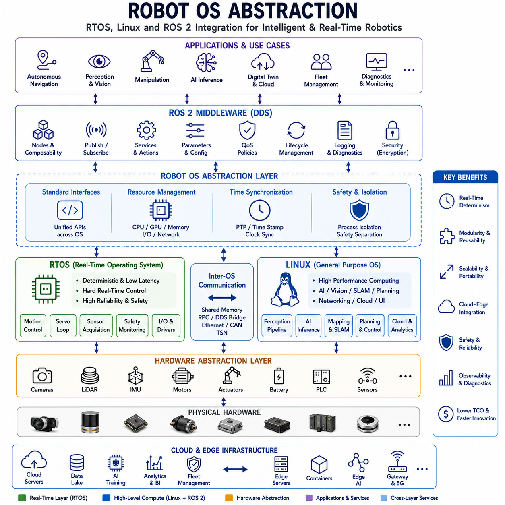{width="7.268055555555556in" height="7.268055555555556in"}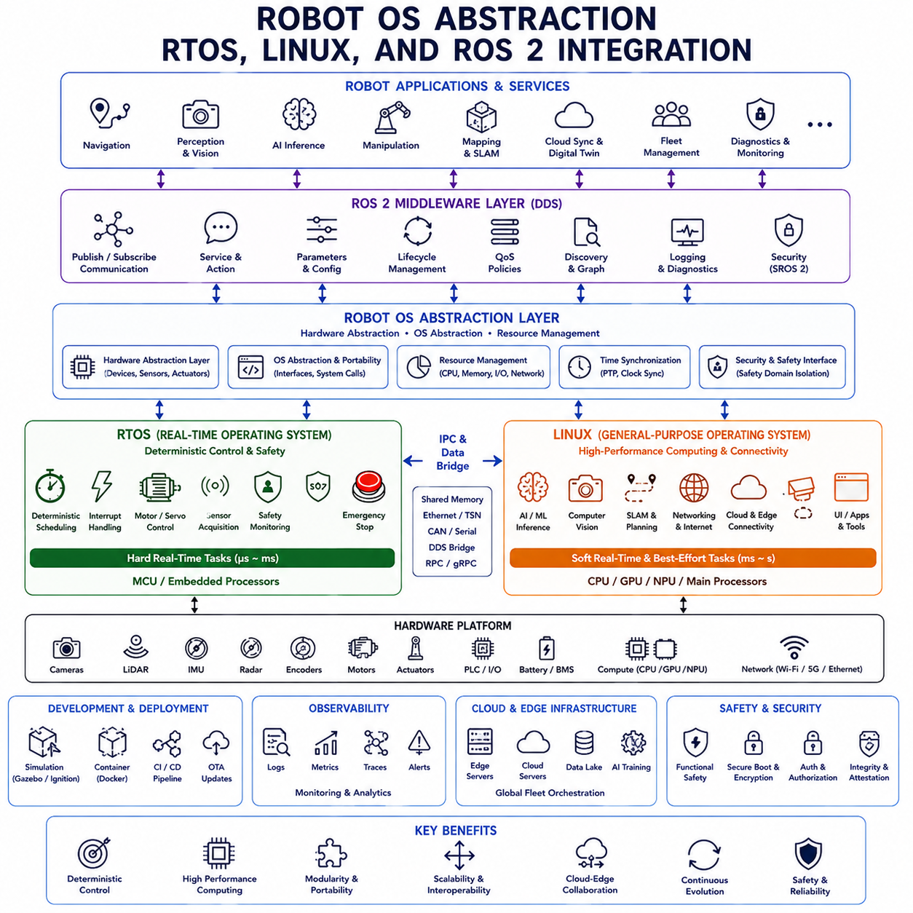{width="7.268055555555556in" height="7.268055555555556in"}

Modern autonomous robots have evolved into highly sophisticated cyber-physical systems that combine real-time motion control, artificial intelligence, cloud computing, edge computing, high-performance perception, distributed communication, functional safety, and software-defined architecture. Unlike traditional embedded controllers that executed a single deterministic control loop, contemporary robotic platforms simultaneously execute hundreds of software components with different timing requirements, computational characteristics, safety levels, and communication patterns. Low-level motor control requires deterministic execution measured in microseconds or milliseconds, while perception algorithms process gigabytes of sensor data using graphics processors. Artificial intelligence performs semantic reasoning, digital twins synchronize operational states with cloud infrastructure, and fleet management coordinates thousands of geographically distributed robots. These heterogeneous computational requirements cannot be satisfied by a single operating system architecture. Consequently, modern robotics increasingly adopts Robot Operating System abstraction, integrating Real-Time Operating Systems (RTOS), Linux operating systems, and Robot Operating System 2 (ROS 2) into a unified software platform capable of supporting deterministic control together with high-level intelligent autonomy. Robot OS abstraction therefore establishes the software foundation upon which next-generation Software Defined Robots and Physical AI systems are constructed.

Historically, robotic systems relied almost exclusively upon embedded real-time operating systems. Industrial controllers executed deterministic scheduling supporting motion control, sensor acquisition, programmable logic, and safety supervision. These systems provided excellent timing predictability but offered limited support for artificial intelligence, high-performance perception, cloud connectivity, graphical interfaces, software portability, distributed computing, and dynamic application deployment. Conversely, general-purpose operating systems such as Linux offered extensive software ecosystems, networking capabilities, development tools, cloud integration, and hardware support but lacked deterministic scheduling required for precise robotic control. The emergence of ROS 2 fundamentally changed robotics software architecture by enabling standardized middleware operating above multiple operating systems while allowing real-time controllers and high-level intelligence to coexist within integrated robotic platforms.

Robot OS abstraction refers to the architectural separation between robotic applications and underlying operating system implementations. Instead of developing applications specifically for RTOS, Linux, or proprietary embedded platforms, software communicates through standardized middleware, hardware abstraction layers, communication frameworks, and resource management services. Application software therefore becomes portable across multiple operating system environments while maintaining consistent behavior. This architectural philosophy closely resembles hardware abstraction in Software Defined Robots, where applications depend upon logical capabilities rather than implementation-specific infrastructure.

The Real-Time Operating System remains indispensable for deterministic robotic control. RTOS platforms prioritize predictable scheduling over maximum throughput, ensuring tasks execute within guaranteed timing boundaries regardless of computational load. Motor control, servo loops, encoder processing, inertial measurement acquisition, actuator synchronization, safety monitoring, emergency stop supervision, communication with programmable logic controllers, battery management, and hardware diagnostics all require deterministic execution. Missing timing deadlines within these functions may produce unstable motion, unsafe operation, inaccurate localization, or hardware damage. Consequently, RTOS provides the foundational execution environment supporting physical interaction between robots and their environments.

Deterministic scheduling distinguishes RTOS from conventional operating systems. Task execution priorities, interrupt latency, scheduling overhead, synchronization primitives, memory allocation, and communication mechanisms are designed to minimize execution variability. Real-time schedulers guarantee predictable worst-case execution time rather than maximizing average computational efficiency. Hard real-time tasks cannot tolerate missed deadlines because physical control depends upon precise temporal behavior. Soft real-time tasks allow limited timing variability while remaining responsive. Robot architecture therefore classifies software components according to timing criticality before allocating them across operating system layers.

Linux complements RTOS by providing extensive computational capability supporting sophisticated robotic software. Artificial intelligence inference, computer vision, simultaneous localization and mapping, path planning, semantic reasoning, cloud synchronization, container orchestration, digital twins, cybersecurity, user interfaces, simulation, fleet management, and data analytics execute efficiently within Linux environments. Unlike RTOS, Linux prioritizes throughput, flexibility, application portability, hardware compatibility, networking capability, storage management, and software ecosystem maturity. Modern autonomous robots therefore frequently execute Linux alongside embedded real-time controllers rather than replacing deterministic control infrastructure.

Linux also provides one of the world\'s largest open software ecosystems. Developers access mature compilers, debugging tools, networking libraries, cybersecurity frameworks, artificial intelligence runtimes, graphics drivers, cloud-native infrastructure, virtualization technologies, container orchestration, databases, distributed computing frameworks, and application development environments. Robotics software consequently benefits from decades of software engineering innovation extending far beyond traditional embedded systems. This extensive ecosystem substantially accelerates robotic software development while improving maintainability and portability.

The PREEMPT_RT Linux extension further narrows the gap between general-purpose computing and deterministic execution. PREEMPT_RT introduces enhanced scheduling determinism by reducing kernel latency, improving interrupt handling, and increasing scheduling predictability. Although PREEMPT_RT does not replace dedicated hard real-time operating systems for safety-critical control, it enables Linux to support numerous soft real-time robotic workloads including sensor processing, communication management, localization, perception pipelines, and moderate-frequency control applications. Hybrid architectures therefore frequently combine RTOS for hard real-time execution with PREEMPT_RT Linux supporting higher-level robotics software.

ROS 2 represents the standardized robotics middleware connecting heterogeneous operating systems into unified robotic platforms. Unlike conventional operating systems, ROS 2 does not replace Linux or RTOS. Instead, it provides communication infrastructure, standardized programming interfaces, distributed computation, lifecycle management, service discovery, parameter management, logging, diagnostics, and interoperability across independent software modules. ROS 2 therefore functions as the software integration layer enabling modular robotics architecture independent of underlying operating system implementation.

The transition from the original Robot Operating System toward ROS 2 addressed numerous architectural limitations affecting industrial robotics. ROS relied heavily upon centralized communication management unsuitable for deterministic distributed systems. ROS 2 instead adopts decentralized communication based upon the Data Distribution Service standard, enabling peer-to-peer communication, quality-of-service configuration, improved scalability, enhanced cybersecurity, and better support for embedded real-time execution. Consequently, ROS 2 provides significantly stronger foundations for industrial automation, autonomous vehicles, collaborative robotics, healthcare systems, and Physical AI applications.

Data Distribution Service forms the communication backbone of ROS 2. DDS implements publish-subscribe communication supporting distributed systems where software components exchange information asynchronously without requiring direct dependencies. Publishers generate sensor observations, localization estimates, navigation commands, artificial intelligence results, diagnostics, battery status, or mission updates. Subscribers consume relevant information according to application requirements. Quality-of-service policies define communication reliability, durability, latency, history depth, and synchronization characteristics ensuring communication behavior matches operational requirements.

Quality-of-service configuration represents one of ROS 2\'s most powerful capabilities. Different robotic applications require different communication guarantees. Motor commands require reliable low-latency delivery. Camera streams prioritize throughput over guaranteed delivery. Artificial intelligence inference tolerates occasional packet loss while navigation requires consistent localization updates. DDS quality-of-service policies therefore allow communication behavior to adapt according to application-specific requirements rather than applying identical communication semantics universally throughout robotic systems.

ROS 2 node architecture supports modular robotics software through independently executing computational components. Navigation, localization, mapping, perception, manipulation, diagnostics, communication, cybersecurity, digital twins, fleet coordination, artificial intelligence inference, battery management, and mission planning each execute within separate nodes communicating through standardized middleware interfaces. Node independence improves maintainability, testing, deployment, scalability, and software reuse while enabling distributed execution across multiple processors or computing devices.

Lifecycle management provides another important ROS 2 capability supporting software-defined robotics. Nodes transition systematically through unconfigured, inactive, active, finalized, and shutdown states managed by standardized lifecycle controllers. Runtime orchestration coordinates software activation, parameter configuration, diagnostics, recovery, updates, and shutdown procedures consistently across distributed robotic applications. Lifecycle management therefore enables safe runtime reconfiguration, container orchestration, cloud deployment, and automated software maintenance.

Hardware abstraction naturally integrates with ROS 2 architecture through standardized device interfaces. Cameras, LiDAR systems, inertial measurement units, motor controllers, battery systems, force sensors, robotic manipulators, programmable logic controllers, and industrial communication networks expose logical capabilities through ROS interfaces independent of manufacturer implementation. Applications therefore remain portable across hardware generations while preserving software compatibility throughout evolving robotic platforms.

Hybrid RTOS-Linux architecture has become the dominant design pattern within advanced autonomous robots. Dedicated microcontrollers or embedded processors execute RTOS supporting deterministic control loops, actuator management, safety supervision, encoder processing, and hardware diagnostics. High-performance processors simultaneously execute Linux supporting ROS 2 middleware, artificial intelligence inference, computer vision, mapping, navigation, cloud communication, digital twins, and application software. Bidirectional communication synchronizes low-level deterministic control with high-level intelligent decision-making while preserving timing integrity.

Interprocess communication between RTOS and Linux represents a significant architectural consideration. Shared memory, high-speed serial communication, Ethernet, Controller Area Network, Time-Sensitive Networking, Remote Procedure Calls, and DDS bridges enable efficient data exchange while minimizing communication latency. Real-time controllers continuously provide actuator status, sensor observations, battery information, and safety diagnostics to Linux environments. Linux applications subsequently generate navigation commands, artificial intelligence results, mission updates, configuration changes, and cloud synchronization transmitted toward deterministic controllers for execution.

Time synchronization becomes critically important within integrated Robot OS architecture because multiple processors, operating systems, sensors, communication devices, and distributed computing resources execute concurrently. Precision Time Protocol, hardware timestamping, synchronized clocks, deterministic scheduling, and coordinated sensor acquisition ensure perception, localization, mapping, artificial intelligence inference, and motion control operate upon temporally consistent information. Accurate temporal synchronization directly improves navigation precision, sensor fusion quality, digital twin consistency, and collaborative multi-robot coordination.

Artificial intelligence integration represents one of the strongest motivations for Linux and ROS 2 adoption. Modern robots execute neural networks supporting perception, semantic understanding, anomaly detection, object recognition, speech interaction, manipulation planning, predictive maintenance, and autonomous reasoning. Graphics processing units, neural accelerators, and machine learning runtimes operate efficiently within Linux environments while ROS 2 distributes inference requests throughout robotic software architecture. Artificial intelligence therefore becomes an integrated software service rather than isolated computational functionality.

Cloud-edge integration similarly depends heavily upon Robot OS abstraction. Local real-time control remains within RTOS while Linux executes ROS 2 gateways synchronizing telemetry, digital twins, artificial intelligence models, diagnostics, software updates, fleet management, predictive maintenance, and enterprise analytics with edge infrastructure and cloud services. Hybrid computing therefore becomes transparent to robotic applications because middleware abstracts communication complexity beneath standardized interfaces.

Containerization increasingly complements Robot OS abstraction by packaging ROS 2 applications together with runtime dependencies inside isolated execution environments. Navigation services, artificial intelligence models, perception pipelines, diagnostics, digital twins, cybersecurity monitoring, fleet management, and simulation execute within portable containers deployable across development workstations, simulation infrastructure, edge servers, cloud platforms, and operational robots. Container orchestration therefore simplifies deployment, rollback, software updates, version management, and distributed robotics lifecycle governance.

Cybersecurity becomes increasingly important because Robot OS abstraction connects robots with enterprise networks, cloud infrastructure, remote operators, autonomous fleets, and artificial intelligence services. Secure boot, encrypted DDS communication, certificate management, authentication, authorization, trusted execution environments, software signing, runtime monitoring, vulnerability management, and intrusion detection collectively protect robotic software throughout distributed operational environments. Cybersecurity therefore becomes an architectural layer integrated throughout Robot OS abstraction rather than an isolated application feature.

Functional safety remains independent from general-purpose software despite increasing system complexity. Emergency stopping, collision avoidance, actuator supervision, safety monitoring, redundancy management, and hazard detection execute within deterministic RTOS environments while Linux and ROS 2 provide higher-level autonomy. Safety-critical communication pathways remain isolated from noncritical application traffic ensuring adaptive software cannot compromise deterministic physical protection mechanisms.

Observability significantly improves integrated Robot OS architecture through standardized telemetry collection. Logs, metrics, traces, diagnostics, processor utilization, graphics processor workload, memory allocation, communication latency, battery performance, artificial intelligence confidence, navigation accuracy, and environmental observations aggregate through ROS 2 diagnostics supporting predictive maintenance, software optimization, fleet analytics, digital twins, and operational intelligence. Comprehensive observability transforms robots into continuously monitored intelligent software platforms.

Simulation constitutes another major advantage of Robot OS abstraction. High-fidelity digital environments execute identical ROS 2 applications operating on simulated sensors, actuators, communication networks, artificial intelligence models, and environmental interactions before deployment toward physical robots. Software therefore undergoes extensive validation within virtual environments while preserving compatibility with operational robotic hardware. Simulation accelerates development, reduces deployment risk, and supports continuous integration throughout robotics software lifecycles.

Software-defined robotics fundamentally depends upon Robot OS abstraction because runtime portability, hardware independence, modular software architecture, cloud-native deployment, edge computing, artificial intelligence integration, and continuous software evolution all require standardized operating system interfaces. Applications increasingly depend upon logical robotic capabilities rather than operating system implementation details. RTOS, Linux, and ROS 2 therefore cooperate as complementary architectural layers rather than competing execution environments.

Future robotic operating system architecture will likely evolve toward increasingly distributed execution where deterministic controllers, embedded processors, edge servers, cloud infrastructure, artificial intelligence accelerators, digital twins, and collaborative robotic fleets collectively operate as one integrated computational ecosystem. Runtime orchestration will dynamically allocate software components across heterogeneous operating systems according to timing requirements, computational complexity, safety constraints, energy availability, communication latency, and operational objectives. Developers will increasingly design software without considering individual operating system boundaries because Robot OS abstraction will automatically provide appropriate execution environments.

Ultimately, Robot OS Abstraction integrating RTOS, Linux, and ROS 2 establishes the software foundation supporting next-generation autonomous robotics. By combining deterministic real-time control, flexible high-performance computing, standardized middleware, distributed communication, artificial intelligence integration, cloud-edge interoperability, containerized deployment, cybersecurity, functional safety, and software-defined architecture, integrated Robot OS platforms transform robots into modular, scalable, continuously evolving intelligent systems capable of supporting industrial automation, autonomous logistics, healthcare robotics, precision agriculture, defense applications, collaborative manufacturing, smart cities, and future Physical AI ecosystems operating reliably across heterogeneous computational environments.

현대 자율주행 로봇(Autonomous Robot)은 단순한 임베디드 시스템(Embedded System)이 아니라 실시간 제어(Real-Time Control), 인공지능(AI), 클라우드 컴퓨팅(Cloud Computing), 엣지 컴퓨팅(Edge Computing), 디지털 트윈(Digital Twin), 플릿 관리(Fleet Management)를 동시에 수행하는 복합 사이버-물리 시스템(Cyber-Physical System)으로 발전하고 있다. 이러한 다양한 기능을 하나의 운영체제(Operating System)만으로 처리하기는 어렵기 때문에, 현대 로봇은 RTOS(Real-Time Operating System), Linux, ROS 2(Robot Operating System 2)를 통합한 계층형 소프트웨어 플랫폼을 사용한다.

기존 로봇은 대부분 RTOS 기반으로 개발되었다. RTOS는 모터 제어(Motor Control), 센서 획득(Sensor Acquisition), 안전 제어(Safety Control), 서보 제어(Servo Control)와 같이 수 밀리초(ms) 또는 마이크로초(μs) 단위의 정확한 실행이 필요한 작업에 매우 적합하다. 하지만 AI, 컴퓨터 비전(Computer Vision), 클라우드 연동, 데이터 분석, 사용자 인터페이스(UI)와 같은 복잡한 기능을 수행하기에는 소프트웨어 생태계가 제한적이었다.

반대로 Linux는 뛰어난 네트워크(Network), 파일 시스템(File System), 개발 도구(Development Tools), AI 프레임워크(AI Framework), GPU(Graphics Processing Unit) 지원을 제공한다. 컴퓨터 비전, 딥러닝(Deep Learning), 디지털 트윈, 데이터베이스(Database), 클라우드 서비스 등을 쉽게 구현할 수 있지만, 엄격한 실시간성(Determinism)을 보장하기는 어렵다. 따라서 RTOS와 Linux는 서로 경쟁 관계가 아니라 상호 보완적인 역할을 수행한다.

Robot OS 추상화(Robot OS Abstraction)는 응용 프로그램(Application)이 특정 운영체제에 의존하지 않도록 만드는 아키텍처이다. 응용 프로그램은 RTOS인지 Linux인지 구분하지 않고 표준 인터페이스(Standard Interface)를 통해 기능을 호출한다. 운영체제 차이는 미들웨어(Middleware)와 하드웨어 추상화 계층(Hardware Abstraction Layer)이 처리하므로, 동일한 애플리케이션을 여러 플랫폼에서 사용할 수 있다.

RTOS는 결정적 실행(Deterministic Execution)을 가장 중요한 목표로 한다. 태스크(Task)는 우선순위(Priority)에 따라 항상 일정한 시간 안에 실행되어야 하며, 인터럽트(Interrupt), 스케줄링(Scheduling), 메모리 관리(Memory Management)도 예측 가능한 시간 안에 수행된다. 모터 제어, 엔코더(Encoder), IMU(Inertial Measurement Unit), 긴급 정지(Emergency Stop), 안전 감시(Safety Monitoring)는 RTOS에서 실행되는 대표적인 기능이다.

실시간 시스템은 일반적으로 하드 실시간(Hard Real-Time)과 소프트 실시간(Soft Real-Time)으로 구분된다. 하드 실시간은 실행 시간이 반드시 보장되어야 하며, 지연이 발생하면 안전 문제가 발생할 수 있다. 반면 소프트 실시간은 일정 수준의 지연을 허용하지만 가능한 한 빠르게 응답해야 한다. 로봇은 이러한 특성에 따라 기능을 적절한 운영체제에 배치한다.

Linux는 고성능 계산(High-Performance Computing)에 적합하다. AI 추론(Inference), SLAM(Simultaneous Localization and Mapping), 객체 인식(Object Recognition), 경로 계획(Path Planning), 사용자 인터페이스, 디지털 트윈, 클라우드 통신, 플릿 관리 등은 Linux에서 수행된다. Linux는 풍부한 오픈소스(Open Source) 생태계를 제공하기 때문에 로봇 개발 생산성을 크게 향상시킨다.

Linux의 PREEMPT_RT 패치(PREEMPT_RT Patch)는 일반 Linux에 실시간 기능을 추가한 기술이다. 커널(Kernel)의 지연 시간을 줄이고 스케줄링을 개선하여 센서 처리, 통신, 위치 추정(Localization), 중간 수준의 제어(Control) 등 소프트 실시간 작업을 안정적으로 수행할 수 있도록 한다. 하지만 안전 제어와 같은 하드 실시간 작업은 여전히 전용 RTOS가 담당하는 것이 일반적이다.

ROS 2(Robot Operating System 2)는 운영체제 자체가 아니라 로봇 미들웨어(Robot Middleware)이다. RTOS나 Linux를 대체하는 것이 아니라, 그 위에서 통신(Communication), 서비스(Service), 메시지(Message), 파라미터(Parameter), 진단(Diagnostics), 생명주기(Lifecycle)를 관리하는 표준 플랫폼 역할을 수행한다. 이를 통해 다양한 운영체제를 하나의 통합된 로봇 플랫폼처럼 사용할 수 있다.

ROS에서 ROS 2로 발전하면서 가장 큰 변화는 DDS(Data Distribution Service)의 도입이다. ROS는 중앙 서버(Master)에 의존했지만, ROS 2는 분산형(Peer-to-Peer) 구조를 채택하였다. 이를 통해 확장성(Scalability), 신뢰성(Reliability), 실시간성, 산업용 적용성이 크게 향상되었다.

DDS는 발행-구독(Publish-Subscribe) 방식의 통신을 제공한다. 센서 데이터, 위치 정보, AI 결과, 진단 정보, 배터리 상태 등을 발행(Publish)하면 필요한 노드(Node)가 이를 구독(Subscribe)한다. 각 노드는 서로 직접 연결되지 않아도 되므로 시스템 구조가 유연하고 확장성이 뛰어나다.

ROS 2의 QoS(Quality of Service)는 매우 중요한 기능이다. 모터 명령은 높은 신뢰성(Reliability)과 낮은 지연(Latency)이 필요하지만, 카메라 영상은 일부 데이터 손실(Packet Loss)을 허용하면서도 높은 처리량(Throughput)이 중요하다. QoS는 이러한 요구사항에 맞게 통신 방식을 각각 다르게 설정할 수 있도록 지원한다.

ROS 2는 노드(Node) 기반 구조를 사용한다. 내비게이션(Navigation), 위치 추정(Localization), 지도 작성(Mapping), AI, 플릿 관리(Fleet Management), 진단(Diagnostics), 배터리 관리(Battery Management)는 각각 독립된 노드로 실행된다. 이러한 구조는 유지보수성(Maintainability), 확장성, 테스트(Test), 재사용성(Reusability)을 크게 향상시킨다.

노드 생명주기(Lifecycle Management)는 ROS 2의 중요한 기능이다. 각 노드는 초기화(Initialization), 비활성(Inactive), 활성(Active), 종료(Finalized) 상태를 표준 방식으로 관리한다. 이를 통해 실행 중에도 노드를 안전하게 교체하거나 업데이트할 수 있으며, 소프트웨어 정의 로봇(Software Defined Robot) 구현에 매우 중요한 역할을 한다.

하드웨어 추상화(Hardware Abstraction)는 ROS 2와 자연스럽게 연결된다. 카메라(Camera), LiDAR, IMU, 배터리(Battery), 모터(Motor), PLC(Programmable Logic Controller)는 모두 표준 인터페이스를 통해 ROS 2에 연결된다. 따라서 하드웨어 제조사가 변경되어도 응용 프로그램은 수정할 필요가 없다.

현대 자율주행 로봇은 대부분 RTOS와 Linux를 함께 사용하는 하이브리드(Hybrid) 구조를 채택한다. MCU(Microcontroller Unit) 또는 임베디드 프로세서는 RTOS를 실행하여 모터 제어와 안전 기능을 담당하고, 고성능 CPU와 GPU는 Linux를 실행하여 AI, 내비게이션, 비전(Vision), ROS 2를 담당한다. 두 시스템은 서로 데이터를 교환하며 하나의 로봇처럼 동작한다.

RTOS와 Linux 사이의 통신은 매우 중요하다. 공유 메모리(Shared Memory), Ethernet, CAN(Controller Area Network), TSN(Time Sensitive Networking), RPC(Remote Procedure Call), DDS Bridge 등을 이용하여 센서 데이터와 제어 명령을 빠르게 전달한다. RTOS는 하드웨어 상태를 Linux에 전달하고, Linux는 AI 결과와 이동 명령을 RTOS에 전달하여 실행한다.

시간 동기화(Time Synchronization)는 통합 Robot OS에서 핵심 요소이다. 카메라, LiDAR, IMU, GPS, CPU, GPU는 모두 서로 다른 시계를 사용하기 때문에 PTP(Precision Time Protocol), 하드웨어 타임스탬프(Hardware Timestamp), 클록 동기화(Clock Synchronization)를 이용하여 동일한 기준 시간으로 데이터를 처리해야 한다. 이는 센서 융합(Sensor Fusion)과 위치 추정 정확도를 크게 향상시킨다.

AI 통합(AI Integration)은 Linux와 ROS 2를 사용하는 가장 큰 이유 가운데 하나이다. 객체 인식, 음성 인식(Speech Recognition), 이상 탐지(Anomaly Detection), 예지 보전(Predictive Maintenance), 조작 계획(Manipulation Planning)은 GPU 기반 AI 모델을 사용한다. ROS 2는 AI 추론 서비스를 다른 노드와 연결하여 전체 로봇 시스템에서 활용할 수 있도록 지원한다.

클라우드-엣지 통합(Cloud-Edge Integration)도 Robot OS 추상화의 중요한 기능이다. RTOS는 실시간 제어를 담당하고, Linux는 ROS Gateway를 통해 디지털 트윈, AI 모델, 플릿 관리, 예지 보전, 운영 분석 데이터를 엣지 서버와 클라우드에 전달한다. 응용 프로그램은 이러한 복잡한 구조를 의식하지 않고 동일한 인터페이스만 사용하면 된다.

컨테이너(Container)는 Robot OS를 더욱 유연하게 만든다. ROS 2 노드와 AI 서비스를 각각 컨테이너로 구성하면 개발 환경, 시뮬레이션, 엣지 서버, 실제 로봇에서 동일하게 실행할 수 있다. 이를 통해 배포(Deployment), 버전 관리(Version Control), 롤백(Rollback), 유지보수가 매우 쉬워진다.

사이버 보안(Cybersecurity)은 Robot OS 추상화에서 매우 중요하다. ROS 2는 DDS 보안(Security), 암호화(Encryption), 인증(Authentication), 권한 관리(Authorization), 인증서(Certificate), 보안 부팅(Secure Boot), 신뢰 실행 환경(Trusted Execution Environment)을 통합하여 로봇을 안전하게 보호한다.

기능 안전(Function Safety)은 일반 애플리케이션과 분리되어야 한다. 긴급 정지(Emergency Stop), 충돌 방지(Collision Avoidance), 액추에이터 감시(Actuator Monitoring), 안전 제어는 RTOS에서 독립적으로 실행되며, Linux와 ROS 2에서 실행되는 AI나 애플리케이션 오류가 안전 기능에 영향을 주지 않도록 설계된다.

관측성(Observability)은 Robot OS 플랫폼을 지속적으로 개선하기 위한 핵심 기능이다. 로그(Log), 메트릭(Metric), 트레이스(Trace), CPU와 GPU 사용률(Utilization), 배터리 상태, 네트워크 품질(Network Quality), AI 정확도, 위치 추정 오차를 지속적으로 수집하여 예지 보전, 성능 최적화, 디지털 트윈 운영에 활용한다.

시뮬레이션(Simulation)은 Robot OS 추상화의 중요한 장점이다. 실제 로봇에서 실행하는 ROS 2 애플리케이션을 시뮬레이터에서도 그대로 실행할 수 있다. 가상의 센서와 액추에이터를 사용하여 실제 환경과 동일한 조건에서 테스트를 수행할 수 있으므로 개발 기간을 단축하고 운영 위험을 줄일 수 있다.

소프트웨어 정의 로봇(SDR)은 Robot OS 추상화 없이는 구현하기 어렵다. 하드웨어 독립성(Hardware Independence), 모듈형 아키텍처(Modular Architecture), 클라우드 네이티브(Cloud-Native), AI, OTA(Over-the-Air) 업데이트, 디지털 트윈은 모두 RTOS, Linux, ROS 2를 하나의 플랫폼으로 통합하는 Robot OS 추상화를 기반으로 동작한다.

미래의 Robot OS는 더욱 분산된 구조로 발전할 것이다. RTOS, Linux, 엣지 서버, 클라우드, AI 가속기(Accelerator), 디지털 트윈이 하나의 통합 컴퓨팅 플랫폼처럼 동작하며, 런타임(Runtime)에서 작업의 특성에 따라 적절한 위치에 자동으로 배치된다. 개발자는 운영체제를 직접 고려하지 않고 필요한 서비스만 호출하면 시스템이 최적의 실행 환경을 자동으로 선택하게 될 것이다.

결론적으로 Robot OS 추상화(Robot OS Abstraction)는 RTOS의 결정성(Determinism), Linux의 유연성(Flexibility), ROS 2의 표준화(Standardization)를 통합하는 차세대 로봇 소프트웨어 아키텍처이다. 실시간 제어, AI, 클라우드-엣지 협업, 사이버 보안, 기능 안전, 컨테이너, 디지털 트윈을 하나의 플랫폼으로 통합함으로써 산업 자동화(Industrial Automation), 자율 물류(Autonomous Logistics), 의료 로봇(Healthcare Robotics), 스마트 제조(Smart Manufacturing), 스마트시티(Smart City), 국방(Defense), 물리 AI 환경을 지원하는 미래형 지능형 로봇 플랫폼의 핵심 기반 기술이 될 것이다.

##  

## 10.05 Software-Defined Safety Functions

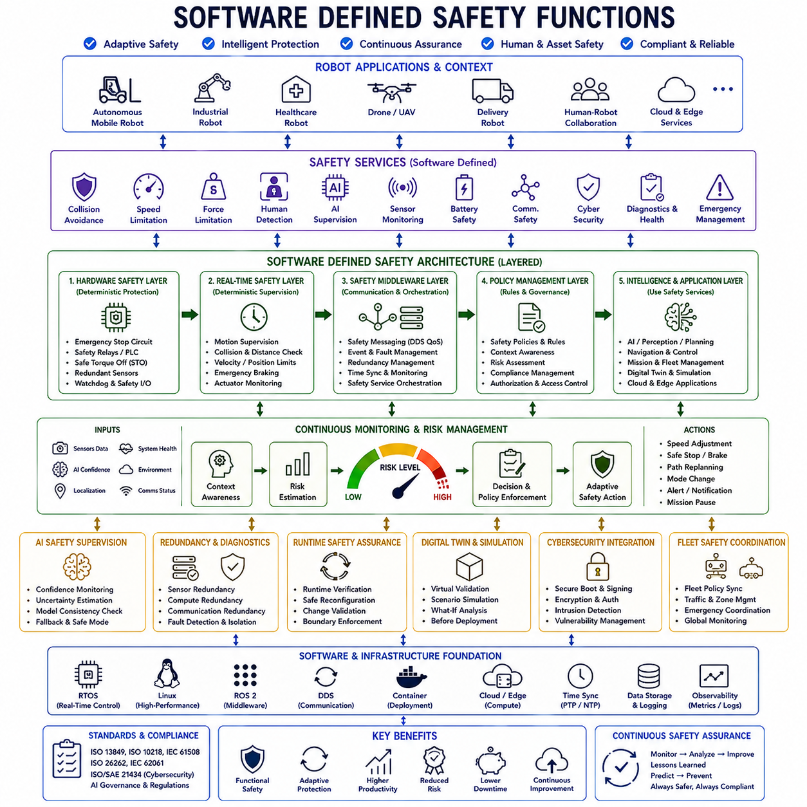{width="7.268055555555556in" height="7.268055555555556in"}{width="7.268055555555556in" height="7.268055555555556in"}

The rapid evolution of Software Defined Robots (SDRs), autonomous systems, cloud-native robotics, artificial intelligence, and cyber-physical systems has fundamentally transformed the way safety is designed, implemented, and maintained throughout robotic platforms. Traditional industrial robots typically relied on dedicated hardware safety circuits, isolated programmable logic controllers, emergency stop relays, safety-rated sensors, and fixed deterministic control logic to guarantee functional safety. While these approaches remain essential for protecting human operators and physical assets, they are increasingly insufficient for highly adaptive autonomous robots that continuously modify missions, update artificial intelligence models, communicate with cloud infrastructure, cooperate with other robots, and dynamically reconfigure software during operation. Software Defined Safety Functions represent the next evolutionary step in robotic safety architecture, combining certified hardware protection with adaptive software intelligence, policy-driven safety management, real-time risk assessment, distributed monitoring, and continuous operational verification. Rather than viewing safety as an isolated hardware subsystem, Software Defined Safety integrates safety into every software layer of modern robotic platforms while maintaining deterministic behavior, regulatory compliance, and predictable operational reliability.

The fundamental philosophy of Software Defined Safety is that safety should become programmable, configurable, observable, continuously verifiable, and dynamically adaptable while preserving deterministic execution for all safety-critical operations. Traditional safety systems generally assume that operating environments remain relatively static and predictable. Modern autonomous robots, however, operate in warehouses, hospitals, factories, logistics centers, construction sites, agricultural fields, airports, public facilities, and urban environments where environmental conditions, human activities, operational priorities, communication quality, and mission objectives change continuously. Safety systems must therefore evolve from static protection mechanisms into intelligent adaptive architectures capable of understanding operational context while maintaining certified safety guarantees.

Software Defined Safety does not replace hardware safety mechanisms. Instead, it extends and complements them through software intelligence operating above certified physical protection layers. Hardware emergency stop circuits, safety relays, redundant processors, watchdog timers, safety controllers, safe torque off mechanisms, redundant communication channels, and certified sensors continue providing deterministic physical protection independent of software execution. Software Defined Safety operates above these hardware foundations by coordinating safety policies, monitoring operational context, analyzing risk, managing safety configuration, supervising artificial intelligence behavior, validating runtime software changes, and supporting continuous safety optimization throughout robotic operations.

The architecture of Software Defined Safety typically follows multiple hierarchical safety layers. At the lowest level, certified hardware provides deterministic protection including emergency stop systems, actuator isolation, redundant sensor channels, motor shutdown mechanisms, programmable safety controllers, and electrical protection devices. Above hardware protection resides the Real-Time Safety Layer responsible for deterministic motion supervision, collision avoidance, velocity limitation, force limitation, emergency braking, actuator monitoring, and sensor validation. The Safety Middleware Layer subsequently coordinates communication, diagnostics, event management, fault propagation, and safety service orchestration. Above middleware, Policy Management defines operational rules governing safe behavior according to environmental conditions, organizational requirements, industrial standards, regulatory compliance, and mission priorities. Finally, artificial intelligence, fleet management, digital twins, cloud infrastructure, and runtime orchestration utilize safety services while remaining constrained by certified safety boundaries.

Risk assessment becomes a continuous operational process within Software Defined Safety rather than a one-time engineering activity performed during system certification. Traditional safety engineering identifies hazards before deployment and implements mitigation strategies accordingly. Modern autonomous robots continuously encounter changing environmental conditions including varying human density, lighting conditions, weather, floor quality, communication quality, equipment failures, unexpected obstacles, collaborative robots, moving vehicles, and changing operational objectives. Software Defined Safety continuously evaluates operational risk by integrating sensor observations, environmental context, artificial intelligence predictions, localization confidence, communication reliability, battery status, processor utilization, and hardware diagnostics. Dynamic risk estimation enables robots to adjust operational behavior proactively before hazardous situations develop.

Context awareness significantly enhances safety intelligence. Rather than applying identical safety constraints under every circumstance, Software Defined Safety adapts operational policies according to environmental conditions while preserving certified safety limits. Robots navigating empty warehouses may operate at higher velocities than robots interacting with hospital patients. Agricultural robots working autonomously at night require different safety parameters than service robots operating within crowded public facilities. Industrial inspection robots entering hazardous zones may activate specialized safety procedures unavailable during routine operation. Context-aware safety therefore improves both productivity and protection by balancing operational efficiency with risk management.

Policy-driven safety management represents one of the defining characteristics of Software Defined Safety. Rather than embedding safety behavior directly within application software, organizational safety requirements are expressed as configurable policies interpreted by dedicated safety engines. Policies define speed limitations, collaborative workspace restrictions, emergency response procedures, communication redundancy requirements, artificial intelligence confidence thresholds, cybersecurity requirements, maintenance constraints, environmental operating conditions, and mission-specific operational rules. Runtime safety managers enforce these policies consistently across robotic platforms while supporting centralized governance throughout distributed fleets.

Software modularity provides the architectural foundation supporting Software Defined Safety. Independent safety services manage collision detection, motion supervision, environmental monitoring, localization validation, communication diagnostics, actuator protection, battery safety, cybersecurity monitoring, artificial intelligence supervision, human detection, emergency management, and regulatory compliance. Each safety module exposes standardized interfaces while operating independently within certified architectural boundaries. Modularity simplifies certification, testing, maintenance, software updates, and future architectural evolution because safety components remain logically separated while cooperating through standardized communication infrastructure.

Artificial intelligence introduces both opportunities and challenges for robotic safety. Machine learning significantly improves perception, anomaly detection, predictive maintenance, semantic understanding, obstacle recognition, human detection, behavioral prediction, and operational optimization. However, artificial intelligence models inherently exhibit uncertainty, probabilistic reasoning, model drift, environmental sensitivity, and potential hallucinations. Software Defined Safety therefore introduces AI supervision layers continuously monitoring model confidence, inference consistency, environmental suitability, prediction uncertainty, sensor agreement, and operational reliability. Safety supervisors restrict autonomous decision-making whenever artificial intelligence confidence falls below predefined safety thresholds.

AI confidence estimation becomes particularly important for autonomous decision-making. Rather than accepting every machine learning prediction equally, Software Defined Safety evaluates prediction confidence together with environmental context and sensor consistency before authorizing safety-critical actions. Object detection uncertainty, semantic segmentation confidence, localization reliability, obstacle classification consistency, speech recognition probability, and trajectory prediction accuracy collectively influence operational decision-making. Robots automatically transition toward conservative operational modes whenever perception uncertainty increases beyond acceptable limits.

Sensor redundancy significantly improves Software Defined Safety robustness. Modern autonomous robots integrate cameras, LiDAR systems, radar, inertial measurement units, ultrasonic sensors, tactile arrays, force sensors, wheel encoders, GNSS receivers, environmental sensors, and internal diagnostics simultaneously. Safety supervision continuously evaluates sensor consistency while identifying calibration degradation, communication failures, synchronization problems, environmental interference, hardware faults, and conflicting observations. Redundant sensing enables continued safe operation despite partial hardware failures while supporting graceful degradation during adverse operational conditions.

Functional redundancy extends beyond sensors toward computational infrastructure. Safety-critical robotic systems frequently implement redundant processors, independent communication channels, duplicate power supplies, mirrored software services, backup localization systems, alternative navigation algorithms, and failover artificial intelligence models. Software Defined Safety coordinates redundancy management dynamically, selecting appropriate backup capabilities whenever primary systems degrade. Graceful degradation therefore replaces catastrophic failure, enabling robots to maintain essential safety functions despite partial system malfunctions.

Runtime safety verification distinguishes Software Defined Safety from conventional static safety architectures. Modern Software Defined Robots continuously receive software updates, configuration changes, artificial intelligence models, cybersecurity patches, mission definitions, and operational policies throughout deployment. Runtime verification continuously analyzes software behavior ensuring updates cannot violate certified safety constraints. New software modules execute within monitored environments validating communication behavior, computational resource usage, timing characteristics, memory allocation, and safety policy compliance before assuming operational responsibility.

Runtime reconfiguration introduces additional safety challenges because robotic software architecture may evolve while systems remain operational. Software Defined Safety therefore supervises component lifecycle transitions, validating initialization, configuration, activation, execution, suspension, replacement, recovery, and shutdown procedures. Safety monitors ensure software changes occur only within authorized operational windows while preserving deterministic control, communication integrity, actuator supervision, and emergency response capability.

Digital twins substantially strengthen Software Defined Safety by enabling virtual safety validation before operational deployment. Candidate software updates, artificial intelligence models, navigation algorithms, communication protocols, fleet coordination strategies, and policy modifications execute first within synchronized virtual environments representing actual robotic systems. Digital twins evaluate collision probability, computational performance, communication latency, battery consumption, actuator behavior, artificial intelligence accuracy, and mission completion under simulated operational conditions. Only validated software subsequently deploys toward physical robots, significantly reducing operational risk.

Simulation similarly supports Software Defined Safety throughout development and operational lifecycles. High-fidelity simulation environments reproduce physical dynamics, sensor behavior, communication delays, artificial intelligence perception, environmental variability, human interaction, equipment failures, and emergency situations. Safety engineers validate operational behavior across thousands of hazardous scenarios impossible or impractical to reproduce physically. Simulation therefore accelerates certification while improving confidence in autonomous behavior under rare operational conditions.

Cybersecurity has become inseparable from robotic safety because software increasingly controls physical behavior. Unauthorized software modification, communication attacks, malicious artificial intelligence manipulation, sensor spoofing, denial-of-service attacks, compromised software updates, and identity impersonation directly threaten safe robot operation. Software Defined Safety therefore integrates cybersecurity with functional safety through secure boot, software signing, certificate management, authentication, authorization, encrypted communication, trusted execution environments, runtime integrity verification, vulnerability management, and intrusion detection. Cyber resilience becomes an essential component of overall safety architecture.

Communication safety represents another important architectural consideration. Autonomous robots increasingly cooperate with cloud infrastructure, edge servers, collaborative robots, enterprise information systems, digital twins, and remote operators. Software Defined Safety continuously supervises communication latency, message integrity, synchronization quality, bandwidth availability, redundancy, encryption, authentication, and network reliability. Communication degradation automatically triggers operational adaptation including speed reduction, autonomous fallback behavior, local decision-making, or controlled mission suspension according to predefined safety policies.

Human-robot collaboration requires sophisticated Software Defined Safety mechanisms because robots increasingly share physical workspaces with people. Safety supervision continuously monitors human location, movement prediction, collaborative workspace boundaries, interaction distance, operator authorization, gesture recognition, voice commands, wearable safety devices, and environmental awareness. Dynamic safety zones adjust according to robot velocity, payload, environmental complexity, and human activity while preserving both productivity and operator protection.

Dynamic safety zoning illustrates adaptive safety implementation. Rather than defining permanently fixed exclusion zones, Software Defined Safety continuously recalculates safe operating boundaries according to robot speed, stopping distance, payload characteristics, sensor confidence, localization accuracy, obstacle movement, human proximity, and environmental conditions. Higher operational speeds require larger safety zones while reduced velocities permit closer collaborative interaction. Dynamic zoning therefore maximizes operational efficiency without compromising safety.

Fleet-level safety coordination extends Software Defined Safety beyond individual autonomous robots. Centralized fleet management coordinates traffic rules, collaborative missions, charging schedules, emergency response, maintenance operations, restricted zones, cybersecurity policies, software deployment, digital twin synchronization, and organizational governance across thousands of robots simultaneously. Fleet safety managers prevent conflicting robot behavior while supporting coordinated emergency procedures throughout geographically distributed operational environments.

Observability provides continuous operational visibility supporting Software Defined Safety. Standardized telemetry collects processor utilization, actuator diagnostics, communication latency, battery performance, sensor health, artificial intelligence confidence, localization accuracy, navigation quality, safety events, emergency activations, policy compliance, software integrity, and environmental conditions. Comprehensive observability enables predictive safety management, operational analytics, forensic investigation, certification evidence, and continuous system improvement.

Safety analytics transform operational telemetry into actionable engineering knowledge. Historical safety events, near misses, emergency stops, sensor degradation, environmental anomalies, artificial intelligence uncertainty, communication interruptions, battery behavior, and maintenance history collectively identify long-term safety trends. Machine learning subsequently predicts emerging safety risks while recommending preventive maintenance, software optimization, policy adjustment, hardware replacement, or operational training before hazardous conditions develop.

Compliance management becomes increasingly important as robotic systems operate across multiple regulatory environments. Software Defined Safety supports international standards including functional safety, machinery safety, autonomous systems, industrial automation, medical robotics, cybersecurity, software lifecycle management, and artificial intelligence governance. Compliance policies become configurable software artifacts rather than static engineering documentation, allowing organizations to adapt rapidly as regulations evolve while maintaining comprehensive traceability throughout software lifecycles.

Continuous safety assurance represents one of the most transformative characteristics of Software Defined Safety. Traditional certification frequently concludes before operational deployment, assuming system behavior remains unchanged. Software Defined Robots continuously evolve through software updates, artificial intelligence improvements, cloud integration, runtime reconfiguration, and changing operational requirements. Continuous assurance therefore monitors safety compliance throughout operational lifecycles rather than relying solely upon initial certification. Safety becomes an ongoing engineering process supported by automated verification, operational monitoring, digital twins, simulation, observability, and policy governance.

Future Software Defined Safety architectures will increasingly integrate autonomous safety intelligence. Artificial intelligence will continuously evaluate operational conditions, predict emerging hazards, optimize safety policies, coordinate distributed robotic fleets, supervise software evolution, validate runtime reconfiguration, recommend engineering improvements, and personalize human-robot interaction while remaining constrained by deterministic certified safety foundations. Adaptive safety will evolve continuously throughout operational lifecycles while preserving rigorous functional safety guarantees.

Ultimately, Software Defined Safety Functions establish the safety foundation for next-generation Software Defined Robots by integrating deterministic hardware protection, real-time supervision, adaptive software intelligence, policy-driven governance, artificial intelligence monitoring, digital twins, simulation, cybersecurity, observability, runtime verification, fleet coordination, and continuous safety assurance into one unified architectural framework. Rather than treating safety as a static hardware feature, Software Defined Safety transforms safety into a continuously evolving software capability capable of adapting intelligently to changing operational environments while maintaining deterministic behavior, regulatory compliance, human protection, system resilience, and trustworthy autonomous operation throughout future Physical AI ecosystems.

소프트웨어 정의 안전 기능(Software Defined Safety Functions)은 소프트웨어 정의 로봇(Software Defined Robot, SDR), 자율 시스템(Autonomous System), 클라우드 네이티브 로보틱스(Cloud-Native Robotics), 인공지능(AI), 사이버-물리 시스템(Cyber-Physical System)의 발전과 함께 등장한 차세대 안전(Safety) 아키텍처이다. 기존 산업용 로봇은 비상 정지(Emergency Stop), 안전 릴레이(Safety Relay), 안전 PLC(Safety PLC), 이중화 센서(Redundant Sensor)와 같은 하드웨어 중심의 안전 구조를 사용하였다. 그러나 현대의 자율주행 로봇은 AI 모델을 지속적으로 업데이트하고, 클라우드와 연결되며, 소프트웨어를 실시간으로 변경하기 때문에 기존 방식만으로는 충분하지 않다.

소프트웨어 정의 안전의 핵심 철학은 안전을 단순한 하드웨어 기능이 아니라 프로그래밍 가능한(Programmable), 설정 가능한(Configurable), 관측 가능한(Observable), 지속적으로 검증 가능한(Continuously Verifiable), 환경에 따라 적응 가능한(Adaptive) 기능으로 만드는 것이다. 단, 이러한 적응성은 항상 결정성(Determinism)을 유지하는 안전 제어를 기반으로 이루어져야 하며, 기능 안전(Function Safety)을 절대로 훼손해서는 안 된다.

소프트웨어 정의 안전은 기존의 하드웨어 안전 기능을 대체하지 않는다. 오히려 하드웨어 기반의 안전 장치 위에 지능형 소프트웨어 계층을 추가하는 구조이다. 비상 정지 회로(Emergency Stop Circuit), 안전 컨트롤러(Safety Controller), Safe Torque Off(STO), 워치독 타이머(Watchdog Timer), 이중화 프로세서(Redundant Processor)는 여전히 최하위 계층에서 안전을 보장한다. 그 위에서 소프트웨어는 위험 분석(Risk Assessment), 정책 관리(Policy Management), AI 감시, 운영 최적화 등을 수행한다.

소프트웨어 정의 안전은 계층형(Layered) 구조로 설계된다. 가장 아래에는 하드웨어 안전 계층(Hardware Safety Layer)이 존재하며, 그 위에는 실시간 안전 계층(Real-Time Safety Layer)이 위치하여 충돌 방지(Collision Avoidance), 속도 제한(Velocity Limitation), 힘 제한(Force Limitation), 긴급 제동(Emergency Braking)을 담당한다. 이후 안전 미들웨어(Safety Middleware)가 통신과 이벤트(Event)를 관리하고, 정책 관리 계층(Policy Management Layer)이 운영 규칙을 정의한다. 최상위에서는 AI, 플릿(Fleet), 디지털 트윈(Digital Twin), 클라우드가 안전 서비스를 활용한다.

위험 평가(Risk Assessment)는 기존처럼 개발 단계에서 한 번만 수행되는 작업이 아니다. 자율주행 로봇은 사람의 밀집도(Human Density), 조명(Lighting), 날씨(Weather), 바닥 상태(Floor Condition), 통신 품질(Network Quality), 배터리 상태(Battery Status)가 계속 변하는 환경에서 동작한다. 따라서 소프트웨어 정의 안전은 센서 정보, AI 결과, 위치 추정(Localization), 통신 상태를 실시간으로 분석하여 위험 수준(Risk Level)을 지속적으로 계산하고 대응한다.

상황 인식(Context Awareness)은 소프트웨어 정의 안전의 중요한 특징이다. 예를 들어 사람이 없는 물류창고(Warehouse)에서는 더 빠르게 이동할 수 있지만, 병원(Hospital)이나 공공시설(Public Facility)에서는 자동으로 속도를 줄이고 안전 거리를 확대한다. 산업 검사 로봇(Inspection Robot)은 위험 지역(Hazardous Zone)에 들어가면 별도의 안전 정책(Safety Policy)을 자동으로 적용한다. 즉 동일한 로봇도 상황에 따라 서로 다른 안전 전략을 적용할 수 있다.

정책 기반 안전 관리(Policy-Driven Safety Management)는 안전 규칙을 소프트웨어 정책으로 관리하는 방식이다. 속도 제한(Speed Limit), 작업 구역(Workspace), AI 신뢰도(Confidence Threshold), 통신 품질, 유지보수 일정(Maintenance Schedule), 환경 조건(Environment Condition) 등을 정책 형태로 정의하고, 정책 엔진(Policy Engine)이 이를 실시간으로 적용한다. 따라서 여러 대의 로봇도 동일한 안전 정책을 일관되게 사용할 수 있다.

모듈화(Modularity)는 소프트웨어 정의 안전을 유지보수하기 쉽게 만든다. 충돌 감지(Collision Detection), 위치 검증(Localization Validation), 배터리 안전(Battery Safety), AI 감시(AI Supervision), 통신 감시(Network Monitoring), 인간 감지(Human Detection), 비상 관리(Emergency Management)는 각각 독립적인 안전 모듈(Safety Module)로 구성된다. 필요한 모듈만 개별적으로 업데이트하거나 인증(Certification)을 수행할 수 있다.

인공지능(AI)은 안전 기능을 향상시키는 동시에 새로운 위험 요소도 만든다. AI는 객체 인식(Object Recognition), 이상 탐지(Anomaly Detection), 사람 인식(Human Detection), 예지 보전(Predictive Maintenance)을 수행하지만, 모델 드리프트(Model Drift), 환각(Hallucination), 환경 변화(Environment Change)에 의해 잘못된 판단을 내릴 수도 있다. 따라서 AI는 반드시 안전 감독(AI Safety Supervision) 아래에서 운영되어야 한다.

AI 신뢰도 평가(AI Confidence Estimation)는 매우 중요한 안전 기술이다. AI가 사람을 인식했다고 해서 바로 행동하지 않고, 예측 확률(Confidence), 다른 센서와의 일치성(Sensor Consistency), 환경 조건(Environment Condition)을 함께 평가한다. 신뢰도가 낮으면 로봇은 자동으로 속도를 줄이거나 정지하는 등 보수적인(Conservative) 동작을 수행한다.

센서 이중화(Sensor Redundancy)는 안전성을 크게 향상시킨다. 카메라(Camera), LiDAR, 레이더(Radar), IMU(Inertial Measurement Unit), 초음파(Ultrasonic), 힘 센서(Force Sensor), 엔코더(Encoder)를 동시에 사용하여 서로의 결과를 비교한다. 특정 센서가 고장 나거나 오차가 증가하면 다른 센서를 이용하여 안전 기능을 계속 유지한다.

기능 이중화(Functional Redundancy)는 센서뿐 아니라 계산 장치까지 확장된다. 이중 프로세서(Dual Processor), 이중 전원(Redundant Power Supply), 백업 AI 모델(Backup AI Model), 대체 내비게이션 알고리즘(Alternative Navigation Algorithm)을 준비하여 주요 기능이 고장 나더라도 안전 기능은 계속 동작하도록 설계한다. 이러한 구조는 갑작스러운 시스템 중단 대신 점진적인 성능 저하(Graceful Degradation)를 가능하게 한다.

런타임 안전 검증(Runtime Safety Verification)은 실행 중에도 소프트웨어가 안전한지 지속적으로 확인하는 기술이다. 새로운 AI 모델이나 소프트웨어를 설치하면 먼저 실행 상태를 감시하고 메모리(Memory), CPU, 통신(Network), 응답 시간(Response Time), 안전 정책 준수 여부를 검사한 후 정상이라고 판단될 때만 실제 제어를 수행하도록 한다.

런타임 재구성(Runtime Reconfiguration)은 새로운 안전 과제를 만든다. 실행 중인 시스템에서 소프트웨어를 교체할 경우 새로운 모듈이 정상적으로 초기화(Initialization)되고, 기존 모듈과 안전하게 교체되는지 지속적으로 검증해야 한다. 안전 관리자는 구성 변경이 안전 기능에 영향을 주지 않도록 모든 전환 과정을 감독한다.

디지털 트윈(Digital Twin)은 소프트웨어 정의 안전의 중요한 도구이다. 새로운 AI 모델, 내비게이션 알고리즘, 통신 구조를 실제 로봇에 적용하기 전에 디지털 트윈에서 먼저 시험한다. 충돌 가능성(Collision Probability), AI 정확도(Accuracy), 배터리 소비(Energy Consumption), 통신 지연(Latency)을 모두 평가한 후 안전성이 확인되면 실제 시스템에 배포한다.

시뮬레이션(Simulation)은 다양한 위험 상황(Hazard Scenario)을 반복적으로 시험하는 데 사용된다. 실제 환경에서는 재현하기 어려운 충돌, 통신 장애, 센서 고장, 긴급 상황(Emergency)을 가상 환경에서 반복적으로 검증하여 안전 기능의 신뢰성을 높일 수 있다.

사이버 보안(Cybersecurity)은 이제 안전과 분리될 수 없는 요소이다. 해킹(Hacking), 센서 위조(Sensor Spoofing), AI 모델 변조(Model Tampering), 통신 공격(Network Attack)은 모두 물리적 사고를 유발할 수 있다. 따라서 보안 부팅(Secure Boot), 암호화(Encryption), 인증(Authentication), 인증서(Certificate), 침입 탐지(Intrusion Detection), 신뢰 실행 환경(Trusted Execution Environment)을 안전 체계에 통합해야 한다.

통신 안전(Communication Safety)은 클라우드와 협업하는 로봇에서 매우 중요하다. 통신 지연(Latency), 패킷 손실(Packet Loss), 네트워크 장애(Network Failure)를 지속적으로 감시하며, 문제가 발생하면 자동으로 로컬 제어(Local Control) 모드로 전환하거나 속도를 감소시키고, 필요한 경우 안전 정지(Safe Stop)를 수행한다.

인간-로봇 협업(Human-Robot Collaboration)은 더욱 정교한 안전 기능을 요구한다. 소프트웨어 정의 안전은 사람의 위치(Position), 이동 방향(Motion Prediction), 작업 공간(Workspace), 음성 명령(Voice Command), 제스처(Gesture)를 지속적으로 분석하여 사람과 안전하게 협업할 수 있도록 지원한다.

동적 안전 구역(Dynamic Safety Zone)은 상황에 따라 안전 거리를 자동으로 조정하는 기술이다. 로봇 속도가 빠를수록 안전 구역을 넓게 설정하고, 저속에서는 사람과 더 가까이 작업할 수 있도록 허용한다. 또한 적재 중량(Payload), 센서 정확도, 위치 추정 오차까지 고려하여 실시간으로 안전 영역을 계산한다.

플릿 수준 안전(Fleet-Level Safety)은 개별 로봇을 넘어 전체 플릿을 대상으로 한다. 중앙 플릿 관리 시스템은 여러 대의 로봇이 동시에 이동할 때 교통 규칙(Traffic Rule), 작업 우선순위(Mission Priority), 충전 일정(Charging Schedule), 긴급 대응(Emergency Response)을 조정하여 전체 시스템의 안전성을 확보한다.

관측성(Observability)은 소프트웨어 정의 안전의 핵심 운영 기능이다. CPU, GPU, 센서 상태, AI 신뢰도, 배터리, 위치 정확도, 안전 이벤트(Safety Event), 비상 정지 기록(Emergency Stop Record)을 지속적으로 수집하여 현재 시스템의 안전 상태를 실시간으로 분석한다.

안전 분석(Safety Analytics)은 장기간 축적된 운영 데이터를 분석하는 기술이다. 비상 정지 횟수, 충돌 직전 상황(Near Miss), AI 오류, 센서 이상, 배터리 열화, 유지보수 기록을 분석하여 미래의 위험을 예측하고 예방 조치를 수행할 수 있다.

규정 준수(Compliance Management)는 다양한 국제 안전 규격을 지속적으로 만족시키는 기능이다. 기능 안전(Function Safety), 산업용 기계 안전(Machinery Safety), 의료 로봇(Medical Robotics), 사이버 보안(Cybersecurity), AI 거버넌스(AI Governance)와 같은 규정을 소프트웨어 정책으로 관리하여 국가와 산업 분야에 따라 유연하게 대응할 수 있다.

지속적인 안전 보증(Continuous Safety Assurance)은 소프트웨어 정의 안전의 가장 큰 특징이다. 기존 시스템은 인증(Certification)이 완료되면 안전성이 확보되었다고 가정했지만, SDR은 지속적으로 소프트웨어가 변경된다. 따라서 운영 중에도 자동 검증(Automated Verification), 시뮬레이션, 디지털 트윈, 관측성을 이용하여 안전성을 지속적으로 확인해야 한다.

미래에는 AI가 스스로 안전성을 향상시키는 자율 안전 시스템(Autonomous Safety Intelligence)으로 발전할 것이다. AI는 위험을 예측하고, 안전 정책을 자동으로 최적화하며, 소프트웨어 변경을 검증하고, 플릿 전체를 분석하여 사고를 예방하는 방향으로 발전할 것이다. 그러나 이러한 AI 역시 항상 결정적인 하드웨어 기반 안전 계층의 보호 아래에서 동작해야 한다.

결론적으로 소프트웨어 정의 안전 기능(Software Defined Safety Functions)은 하드웨어 안전(Hardware Safety), 실시간 제어(Real-Time Control), AI 감독(AI Supervision), 정책 기반 관리(Policy-Driven Management), 디지털 트윈(Digital Twin), 시뮬레이션(Simulation), 사이버 보안(Cybersecurity), 관측성(Observability), 런타임 검증(Runtime Verification), 플릿 안전(Fleet Safety)을 하나의 통합 아키텍처로 결합한 차세대 안전 기술이다. 이를 통해 변화하는 환경에서도 안전성과 유연성을 동시에 확보하는 지능형 로봇 플랫폼을 구현하며, 미래 물리 AI(Physical AI) 생태계에서 신뢰할 수 있는 자율 시스템의 핵심 기반 기술로 자리잡게 될 것이다.

##  

## 10.06 Dynamic Feature Update Architecture: OTA Linkage

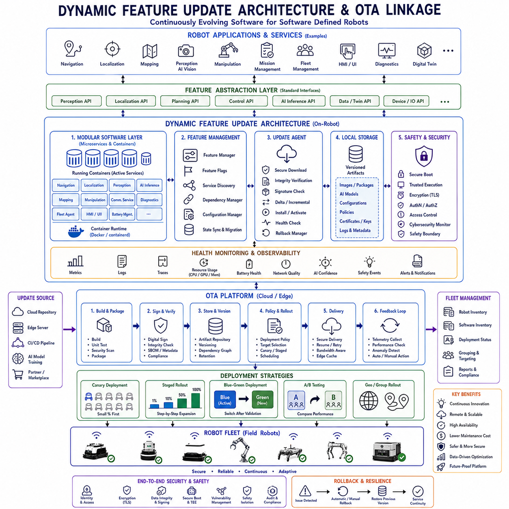{width="7.268055555555556in" height="7.268055555555556in"}

The rapid evolution of Software Defined Robots (SDRs), autonomous systems, cloud-native robotics, and Physical AI has fundamentally transformed the lifecycle of robotic software. Traditional robotic platforms were typically deployed as static systems in which hardware capabilities, embedded firmware, operating systems, middleware, navigation algorithms, perception software, and application logic remained largely unchanged throughout their operational lifetime. Software updates were infrequent, required manual intervention, and often involved scheduled downtime, on-site engineering support, or complete system replacement. This deployment model significantly limited the pace of innovation while increasing maintenance costs and operational disruption. Modern robotic ecosystems demand an entirely different lifecycle strategy in which robots continuously evolve through secure software updates, artificial intelligence improvements, feature expansion, cybersecurity patches, performance optimization, and operational policy refinement without interrupting mission execution. Dynamic Feature Update Architecture integrated with Over-the-Air (OTA) mechanisms establishes the technological foundation enabling robots to function as continuously evolving software-defined platforms rather than static embedded machines.

Dynamic Feature Update Architecture refers to the capability of introducing, modifying, replacing, enabling, disabling, or optimizing software functionality throughout the operational lifetime of a robotic system without requiring hardware replacement or manual software installation. Unlike conventional firmware updates that replace entire software images, dynamic feature updates focus on modular capability evolution. Individual services, artificial intelligence models, perception algorithms, navigation strategies, communication modules, cybersecurity policies, digital twin interfaces, user applications, and operational workflows can be updated independently while preserving uninterrupted system operation. This modular approach significantly reduces deployment risk while accelerating software innovation.

The concept of Over-the-Air updating extends beyond simple remote software installation. OTA becomes a comprehensive software lifecycle management framework encompassing software packaging, version management, dependency analysis, digital signing, integrity verification, staged deployment, rollback management, runtime validation, health monitoring, telemetry collection, compliance verification, and continuous software governance. OTA therefore evolves from a maintenance mechanism into the central nervous system governing software evolution across distributed robotic fleets.

The architectural philosophy of Dynamic Feature Update is founded upon software modularity. Monolithic robotic software systems cannot support selective runtime evolution because every software modification affects the entire application. Modern Software Defined Robots instead organize software into independent modules representing navigation, localization, mapping, perception, manipulation, diagnostics, fleet management, artificial intelligence inference, cybersecurity, battery management, communication services, digital twins, mission planning, and human-machine interaction. Each module exposes standardized interfaces while remaining independently deployable, versioned, tested, and replaceable. Dynamic feature updates therefore modify only the required functionality without disturbing unrelated software components.

Container technology provides one of the most effective implementation mechanisms supporting dynamic software evolution. Each software service executes within isolated containers encapsulating executable code, runtime libraries, configuration files, artificial intelligence models, middleware dependencies, and communication interfaces. Container images become immutable deployment artifacts distributed securely through OTA infrastructure toward robots, edge servers, and cloud platforms. Runtime orchestration activates new containers, validates operational health, synchronizes internal state, redirects service traffic, and gracefully removes obsolete software without interrupting robotic operation. Container isolation substantially improves deployment safety while simplifying rollback procedures.

Microservices architecture further strengthens dynamic update capability by decomposing robotic software into independently deployable services communicating through standardized APIs and middleware. Navigation, localization, perception, manipulation, digital twins, cybersecurity monitoring, fleet coordination, battery optimization, predictive maintenance, and AI inference evolve independently while maintaining stable communication interfaces. Because service dependencies remain explicitly defined, updating one capability rarely requires rebuilding unrelated applications. Consequently, software development teams can innovate continuously while minimizing operational disruption.

Feature abstraction separates business capabilities from implementation details. Rather than tightly coupling applications to specific algorithms or hardware implementations, robotic software interacts with logical feature interfaces representing perception, localization, obstacle avoidance, semantic understanding, mission execution, charging management, collaborative behavior, and diagnostics. Runtime feature managers dynamically select appropriate implementations according to software versions, hardware capabilities, artificial intelligence availability, operational policies, licensing, and deployment objectives. Feature abstraction therefore enables new implementations to replace previous versions transparently while preserving application compatibility.

Feature flags represent another important architectural mechanism supporting controlled software evolution. Newly developed functionality remains embedded within deployed software but initially disabled. Operational administrators gradually enable features according to deployment schedules, customer requirements, hardware compatibility, geographical regions, regulatory constraints, or pilot testing programs. Feature flags significantly reduce deployment risk because software installation becomes independent from feature activation. Organizations therefore validate deployment integrity before exposing new functionality to operational environments.

Progressive rollout strategies minimize operational risk during OTA deployment. Instead of updating entire robotic fleets simultaneously, software first deploys toward simulation environments, digital twins, laboratory robots, engineering fleets, pilot customers, regional deployments, and finally global operational infrastructure. Telemetry continuously evaluates software stability, artificial intelligence accuracy, communication quality, computational resource utilization, safety events, battery performance, and mission completion rates throughout every deployment stage. Deployment expands automatically only after predefined operational success criteria are satisfied.

Canary deployment provides one widely adopted rollout strategy. A small percentage of robots receive new software while the remaining fleet continues operating with previous versions. Operational metrics collected from canary robots identify software regressions, unexpected behavior, compatibility issues, communication anomalies, artificial intelligence degradation, cybersecurity concerns, or safety violations before large-scale deployment. Canary analysis substantially reduces organizational risk while accelerating continuous software innovation.

Blue-green deployment offers another deployment methodology supporting uninterrupted robotic operation. Existing software continues operating as the production environment while updated software initializes independently within parallel execution infrastructure. After successful validation, operational traffic transitions gradually toward the updated environment. Previous software remains immediately available for rollback whenever operational anomalies appear. Blue-green deployment therefore minimizes downtime while simplifying recovery procedures.

Rollback architecture represents one of the most critical design principles within Dynamic Feature Update systems. Software evolution inevitably introduces unforeseen issues despite extensive validation. OTA platforms therefore maintain previous software versions, configuration states, artificial intelligence models, communication parameters, and operational policies allowing immediate restoration whenever health monitoring identifies abnormal behavior. Automated rollback significantly improves operational resilience by limiting exposure to software defects while preserving service continuity.

Version management provides the governance foundation supporting continuous software evolution. Every software module, artificial intelligence model, firmware image, operating system component, middleware library, communication protocol, and configuration artifact maintains unique version identities together with compatibility metadata, dependency relationships, certification information, cybersecurity status, hardware requirements, and deployment history. Version repositories support reproducible deployments, regulatory compliance, debugging, maintenance planning, and long-term software lifecycle management.

Dependency management becomes increasingly important as robotic software ecosystems expand. Individual software services frequently depend upon middleware versions, artificial intelligence runtimes, graphics drivers, operating system kernels, hardware abstraction interfaces, communication libraries, security certificates, and configuration schemas. OTA orchestration continuously verifies dependency compatibility before deployment, preventing inconsistent software combinations that might compromise operational reliability or functional safety.

Runtime compatibility verification ensures newly deployed software integrates correctly with existing robotic infrastructure. Applications validate communication interfaces, middleware compatibility, timing behavior, memory allocation, processor utilization, artificial intelligence acceleration, sensor interfaces, actuator control, and digital twin synchronization before assuming operational responsibility. Runtime validation therefore detects integration problems before software influences mission execution.

Operating system updates constitute another important OTA capability. Embedded Linux distributions, real-time operating systems, middleware frameworks, security patches, device drivers, networking stacks, and virtualization layers evolve continuously throughout robotic lifecycles. Dynamic update architecture coordinates operating system maintenance while preserving application compatibility, deterministic behavior, and functional safety. Layered software architecture significantly simplifies operating system evolution because higher application layers remain insulated from infrastructure changes.

Firmware management extends OTA capabilities toward embedded controllers responsible for motor control, battery management, programmable logic, sensor interfaces, communication devices, and safety supervision. Firmware updates require particularly rigorous validation because failures directly affect physical hardware. Secure boot, cryptographic verification, redundant firmware storage, transactional update procedures, power-failure recovery, and deterministic rollback mechanisms collectively ensure firmware evolution remains reliable throughout distributed robotic deployments.

Artificial intelligence model distribution represents one of the most transformative applications of OTA infrastructure. Machine learning models continuously improve through retraining, operational feedback, expanded datasets, and algorithmic innovation. OTA platforms distribute optimized neural networks toward robots without modifying application software. Perception, object recognition, semantic segmentation, localization enhancement, speech interaction, anomaly detection, manipulation planning, and predictive maintenance capabilities therefore evolve continuously while preserving stable software architecture.

AI model management extends beyond simple distribution. Runtime orchestration evaluates model compatibility, computational requirements, hardware acceleration availability, confidence calibration, environmental suitability, and operational performance continuously. Multiple AI models may coexist simultaneously supporting regional deployment, environmental adaptation, customer customization, or staged rollout strategies. Dynamic model management therefore enables adaptive intelligence throughout robotic fleets.

Configuration management provides additional flexibility beyond software updates. Operational parameters including velocity limits, sensor calibration, communication bandwidth, localization thresholds, obstacle avoidance behavior, battery charging policies, cybersecurity settings, and fleet coordination rules frequently require modification without changing application software. OTA infrastructure distributes configuration updates independently from executable software, enabling rapid operational optimization while reducing deployment complexity.

Digital twins substantially strengthen OTA validation by executing candidate software updates within synchronized virtual environments before deployment toward physical robots. Virtual robots accurately reproduce mechanical dynamics, sensor behavior, communication characteristics, artificial intelligence inference, environmental interactions, battery performance, and mission execution. Software therefore undergoes realistic operational validation before influencing production systems, significantly reducing deployment risk while improving engineering confidence.

Simulation further complements digital twins by enabling large-scale software evaluation under diverse operational scenarios impossible to reproduce physically. Thousands of autonomous robots execute updated software within simulated warehouses, factories, hospitals, agricultural fields, airports, logistics centers, and urban environments while engineers evaluate communication scalability, navigation performance, artificial intelligence robustness, fleet coordination, energy consumption, and operational reliability. Simulation therefore becomes an integral stage within continuous deployment pipelines.

Cybersecurity forms the foundation of trustworthy OTA architecture because remote software distribution directly influences physical robot behavior. Every software package undergoes cryptographic signing, integrity verification, authentication, authorization, certificate validation, encryption, and secure transmission before installation. Trusted execution environments, secure boot mechanisms, hardware roots of trust, runtime integrity monitoring, vulnerability management, and software attestation collectively prevent unauthorized software modification while protecting robotic infrastructure against cyber threats.

Functional safety imposes strict constraints upon dynamic software evolution. Safety-critical software controlling emergency stopping, collision avoidance, actuator supervision, speed limitation, and hazard detection cannot be modified arbitrarily during operational execution. OTA orchestration therefore separates certified safety software from adaptive application layers while requiring additional verification, certification evidence, runtime validation, and deterministic testing before safety-related modifications become operational. Safety boundaries remain stable despite continuous software innovation.

Communication infrastructure represents another essential OTA component. Robots frequently operate across Ethernet, Wi-Fi, private cellular networks, satellite communication, industrial wireless systems, and edge computing gateways. OTA platforms adapt software distribution according to bandwidth availability, communication reliability, geographical location, operational schedules, energy status, and mission priorities. Large software packages may download incrementally while installations occur during charging periods or scheduled maintenance windows minimizing operational disruption.

Fleet management coordinates software evolution across thousands of geographically distributed robots. Centralized management platforms maintain inventory information describing software versions, hardware configurations, artificial intelligence models, battery characteristics, communication infrastructure, operational status, maintenance history, regional deployment policies, and customer-specific customization. Fleet orchestrators determine deployment priorities while balancing software consistency, operational continuity, regulatory compliance, and business objectives across complex robotic ecosystems.

Observability provides continuous operational feedback supporting intelligent OTA governance. Logs, metrics, distributed traces, diagnostics, processor utilization, graphics processor workload, memory allocation, battery health, communication quality, sensor diagnostics, artificial intelligence confidence, navigation accuracy, software latency, container status, and safety events collectively evaluate software quality after deployment. Observability therefore transforms software deployment into a measurable engineering process rather than a one-time installation activity.

Continuous Integration and Continuous Deployment pipelines automate software evolution throughout robotic development lifecycles. Source code modifications trigger automated compilation, unit testing, integration testing, simulation, digital twin validation, cybersecurity scanning, compliance verification, performance benchmarking, packaging, signing, container generation, and staged deployment preparation. Human intervention decreases while software quality, deployment frequency, and operational reliability improve substantially.

Business continuity constitutes one of the greatest organizational benefits provided by Dynamic Feature Update Architecture. Traditional robotic maintenance required planned downtime, engineering visits, manual software installation, operational interruption, and production delays. OTA-enabled Software Defined Robots instead evolve continuously while remaining operational. Organizations rapidly deploy cybersecurity patches, artificial intelligence improvements, operational enhancements, customer-specific functionality, regulatory updates, and performance optimization without interrupting mission execution. Equipment availability increases while lifecycle maintenance costs decline significantly.

Future Dynamic Feature Update Architecture will increasingly incorporate autonomous software evolution. Artificial intelligence will continuously analyze operational telemetry, identify software optimization opportunities, generate deployment recommendations, personalize robotic capabilities, coordinate distributed software rollout, predict deployment risks, validate runtime compatibility, optimize computational resource allocation, and orchestrate software evolution across global robotic ecosystems. Software updates will gradually transition from scheduled engineering events toward continuous autonomous adaptation driven by operational intelligence.

Ultimately, Dynamic Feature Update Architecture integrated with Over-the-Air linkage establishes the software lifecycle foundation supporting Software Defined Robots. Through modular software architecture, microservices, containers, feature abstraction, staged deployment, rollback management, runtime validation, artificial intelligence distribution, digital twins, simulation, cybersecurity, fleet orchestration, observability, and automated lifecycle governance, robotic platforms evolve continuously throughout operational lifetimes while preserving safety, reliability, security, scalability, and business continuity. This architectural paradigm transforms robots from static embedded products into intelligent software platforms capable of adapting rapidly to changing technologies, operational environments, regulatory requirements, customer expectations, and future Physical AI ecosystems through secure, continuous, and trustworthy software evolution.

동적 기능 업데이트 아키텍처(Dynamic Feature Update Architecture)와 OTA(Over-the-Air)는 소프트웨어 정의 로봇(Software Defined Robot, SDR)의 핵심 기술이다. 기존 로봇은 기능을 변경하려면 현장에서 직접 소프트웨어를 설치하거나 장비를 중단해야 했지만, SDR은 운영 중에도 새로운 기능을 추가하고 기존 기능을 개선할 수 있다. 이를 통해 로봇은 고정된 기계가 아니라 지속적으로 진화하는 소프트웨어 플랫폼으로 변화하게 된다.

동적 기능 업데이트(Dynamic Feature Update)는 하드웨어를 교체하지 않고도 새로운 기능을 추가하거나 기존 기능을 수정하는 기술이다. 기존의 펌웨어(Firmware) 전체를 교체하는 방식과 달리 필요한 기능(Module)만 선택적으로 업데이트한다. 내비게이션(Navigation), AI 모델(AI Model), 비전(Vision), 통신(Communication), 디지털 트윈(Digital Twin), 보안(Security), 사용자 인터페이스(UI)를 각각 독립적으로 변경할 수 있어 업데이트 시간과 위험을 크게 줄일 수 있다.

OTA(Over-the-Air)는 단순히 원격으로 소프트웨어를 설치하는 기능이 아니다. OTA는 소프트웨어 배포(Deployment), 버전 관리(Version Management), 의존성 관리(Dependency Management), 디지털 서명(Digital Signing), 무결성 검증(Integrity Verification), 단계별 배포(Staged Deployment), 롤백(Rollback), 상태 모니터링(Health Monitoring), 원격 진단(Remote Diagnostics)까지 포함하는 전체 소프트웨어 생명주기(Lifecycle) 관리 시스템이다.

동적 기능 업데이트는 모듈화(Modularity)를 기반으로 한다. 기존처럼 하나의 거대한 프로그램(Monolithic Software)이 아니라 내비게이션, 위치 추정(Localization), 지도 작성(Mapping), 객체 인식(Object Recognition), AI 추론(Inference), 플릿 관리(Fleet Management), 배터리 관리(Battery Management), 통신 서비스(Communication Service)를 각각 독립적인 모듈(Module)로 구성한다. 따라서 필요한 기능만 개별적으로 업데이트할 수 있다.

컨테이너(Container)는 동적 업데이트를 구현하는 대표적인 기술이다. 각 기능은 독립적인 컨테이너에서 실행되며 실행 파일, 라이브러리(Library), 설정(Configuration), AI 모델을 함께 포함한다. 새로운 컨테이너를 OTA로 배포한 후 정상 동작을 확인하면 기존 컨테이너를 종료하는 방식으로 운영하므로 서비스 중단 없이 업데이트를 수행할 수 있다.

마이크로서비스(Microservices)는 컨테이너와 함께 사용되는 핵심 아키텍처이다. 내비게이션, AI, 디지털 트윈, 진단(Diagnostics), 사이버 보안(Cybersecurity), 플릿 관리 등을 각각 독립 서비스(Service)로 구성하여 서로 표준 API(Application Programming Interface)를 통해 통신한다. 따라서 특정 기능만 업데이트해도 다른 서비스에는 영향을 주지 않는다.

기능 추상화(Feature Abstraction)는 응용 프로그램(Application)이 내부 구현을 알 필요 없이 기능만 호출하도록 만드는 기술이다. 예를 들어 위치 추정, 장애물 회피(Obstacle Avoidance), AI 인식, 충전 관리(Charging Management)는 동일한 인터페이스를 유지하며 내부 알고리즘은 언제든지 새로운 버전으로 교체할 수 있다. 이를 통해 응용 프로그램은 수정 없이 새로운 기능을 사용할 수 있다.

기능 플래그(Feature Flag)는 새로운 기능을 미리 설치해 두고 필요할 때만 활성화하는 기술이다. 소프트웨어는 이미 배포되어 있지만 기능은 비활성화되어 있으며, 고객(Customer), 지역(Region), 라이선스(License), 시험 운영(Pilot)에 따라 선택적으로 활성화할 수 있다. 이는 업데이트와 기능 공개를 분리하여 운영 위험을 줄여준다.

단계적 배포(Staged Deployment)는 OTA의 안전성을 높이는 중요한 전략이다. 새로운 소프트웨어는 먼저 시뮬레이션(Simulation), 디지털 트윈(Digital Twin), 개발용 로봇, 시험용 플릿(Pilot Fleet), 일부 고객에게 적용한 후 문제가 없을 때 전체 로봇으로 확대한다. 이를 통해 대규모 장애를 예방할 수 있다.

카나리 배포(Canary Deployment)는 소수의 로봇만 먼저 업데이트하는 방식이다. 이들 로봇의 성능, AI 정확도, 배터리, 통신, 안전 이벤트(Safety Event)를 지속적으로 분석하여 문제가 없다고 판단되면 나머지 로봇으로 배포를 확대한다. 이는 OTA에서 가장 널리 사용되는 안전한 배포 전략이다.

블루-그린 배포(Blue-Green Deployment)는 기존 소프트웨어와 새로운 소프트웨어를 동시에 실행하는 방식이다. 새로운 버전이 완전히 검증된 후에만 서비스가 새로운 버전으로 전환되며, 문제가 발생하면 즉시 이전 버전으로 복귀할 수 있다. 이를 통해 거의 무중단(Zero Downtime)에 가까운 업데이트가 가능하다.

롤백(Rollback)은 OTA에서 가장 중요한 안전 기능 가운데 하나이다. 새로운 기능에서 문제가 발생하면 이전 버전의 소프트웨어, AI 모델, 설정(Configuration), 운영 정책(Policy)을 자동으로 복원한다. 이를 통해 운영 장애 시간을 최소화하고 서비스 연속성(Service Continuity)을 보장할 수 있다.

버전 관리(Version Management)는 지속적인 소프트웨어 진화를 위한 핵심 기능이다. 운영체제(OS), 펌웨어(Firmware), ROS 2, AI 모델, 라이브러리, 컨테이너, 설정 파일은 각각 독립적인 버전을 가진다. 시스템은 버전 간의 호환성(Compatibility)과 변경 이력(History)을 관리하여 안정적인 운영을 지원한다.

의존성 관리(Dependency Management)는 복잡한 소프트웨어 생태계에서 매우 중요하다. 하나의 기능은 특정 ROS 2 버전, GPU 드라이버(Driver), AI 런타임(Runtime), 라이브러리, 운영체제에 의존할 수 있다. OTA 플랫폼은 이러한 의존성을 자동으로 검사하여 호환되지 않는 조합이 설치되지 않도록 방지한다.

런타임 호환성 검증(Runtime Compatibility Verification)은 설치 이후에도 시스템이 정상적으로 동작하는지를 확인하는 과정이다. 통신(Network), CPU와 GPU 사용률(Utilization), 메모리(Memory), 센서 인터페이스, 액추에이터(Actuator), 디지털 트윈 연결 상태를 자동으로 검사하여 이상이 있으면 즉시 업데이트를 중단하거나 롤백한다.

운영체제 업데이트(Operating System Update)도 OTA를 통해 수행된다. Linux, RTOS(Real-Time Operating System), ROS 2, 장치 드라이버(Device Driver), 네트워크 스택(Network Stack), 보안 패치(Security Patch)를 원격으로 배포할 수 있으며, 계층형 아키텍처(Layered Architecture)를 사용하므로 상위 애플리케이션은 영향을 거의 받지 않는다.

펌웨어 관리(Firmware Management)는 모터 제어기(Motor Controller), 배터리 관리 시스템(Battery Management System), PLC(Programmable Logic Controller), 센서 인터페이스 등의 저수준 장치를 대상으로 한다. 펌웨어는 하드웨어에 직접 영향을 미치므로 암호화된 업데이트, 이중 저장(Dual Image), 전원 장애 복구(Power Failure Recovery), 자동 롤백 등 매우 엄격한 보호 기능이 적용된다.

AI 모델 배포(AI Model Distribution)는 OTA의 가장 중요한 활용 분야 가운데 하나이다. 객체 인식(Object Recognition), 음성 인식(Speech Recognition), 이상 탐지(Anomaly Detection), 의미 분할(Semantic Segmentation), 예지 보전(Predictive Maintenance) 모델은 지속적으로 개선되며, OTA를 통해 새로운 AI 모델만 교체하여 응용 프로그램은 그대로 유지할 수 있다.

AI 모델 관리(AI Model Management)는 단순한 배포를 넘어 성능까지 관리한다. 여러 개의 AI 모델을 동시에 유지하면서 환경(Environment), 지역, 고객 요구사항에 따라 가장 적합한 모델을 선택할 수 있다. 또한 AI 성능을 지속적으로 평가하여 새로운 모델을 자동으로 추천하거나 교체할 수 있다.

설정 관리(Configuration Management)는 실행 파일을 변경하지 않고도 시스템을 최적화하는 기능이다. 최대 속도(Maximum Speed), 장애물 거리(Obstacle Distance), 센서 보정(Calibration), 충전 정책(Charging Policy), 통신 설정(Network Configuration) 등을 OTA를 통해 변경하여 운영 환경에 빠르게 대응할 수 있다.

디지털 트윈(Digital Twin)은 OTA의 안정성을 크게 향상시킨다. 새로운 소프트웨어는 실제 로봇에 적용되기 전에 동일한 디지털 트윈에서 실행되어 충돌 가능성(Collision Probability), AI 정확도, 배터리 소비(Energy Consumption), 네트워크 성능을 평가한다. 검증이 완료된 경우에만 실제 로봇으로 배포된다.

시뮬레이션(Simulation)은 수천 대의 로봇을 가상 환경에서 동시에 시험할 수 있도록 지원한다. 물류창고(Warehouse), 병원(Hospital), 공장(Factory), 공항(Airport), 스마트시티(Smart City) 환경에서 새로운 소프트웨어를 반복적으로 시험하여 AI, 통신, 플릿 운영, 에너지 소비를 검증한 후 실제 시스템에 적용한다.

사이버 보안(Cybersecurity)은 OTA의 핵심 요소이다. 모든 업데이트는 디지털 서명(Digital Signature), 암호화(Encryption), 인증(Authentication), 인증서(Certificate), 보안 부팅(Secure Boot), 신뢰 실행 환경(Trusted Execution Environment)을 이용하여 보호된다. 이를 통해 악성 코드나 변조된 소프트웨어가 설치되는 것을 방지한다.

기능 안전(Function Safety)은 OTA에서도 반드시 유지되어야 한다. 긴급 정지(Emergency Stop), 충돌 방지(Collision Avoidance), 속도 제한(Velocity Limitation), 안전 감시(Safety Monitoring)는 일반 애플리케이션과 분리된 안전 영역에서 실행되며, 업데이트 전후에도 동일한 안전 수준을 유지하도록 별도의 검증 절차를 수행한다.

통신 인프라(Communication Infrastructure)는 OTA를 안정적으로 수행하기 위한 기반이다. Ethernet, Wi-Fi, Private 5G, 이동통신(Cellular), 위성 통신(Satellite Communication)을 이용하여 소프트웨어를 전송하며, 네트워크 상태와 배터리 수준을 고려하여 충전 중이나 작업이 없는 시간에 자동으로 설치할 수 있다.

플릿 관리(Fleet Management)는 수백\~수천 대의 로봇에 대한 OTA를 통합 관리한다. 각 로봇의 하드웨어(Hardware), 소프트웨어 버전, AI 모델, 지역, 운영 상태, 고객 정보를 관리하고, 어떤 로봇을 언제 업데이트할지 자동으로 결정한다. 이를 통해 대규모 로봇 운영에서도 안정성과 일관성을 유지할 수 있다.

관측성(Observability)은 OTA의 성공 여부를 판단하는 핵심 기능이다. 로그(Log), 메트릭(Metric), 트레이스(Trace), CPU, GPU, 메모리, 배터리, AI 정확도, 통신 상태, 안전 이벤트를 지속적으로 수집하여 업데이트 이후 성능 변화를 분석한다. 문제가 발견되면 자동으로 롤백하거나 추가 업데이트를 중단할 수 있다.

지속적 통합 및 지속적 배포(CI/CD, Continuous Integration/Continuous Deployment)는 OTA와 긴밀하게 연결된다. 개발자가 코드를 수정하면 자동으로 컴파일(Compile), 테스트(Test), 시뮬레이션, 디지털 트윈 검증, 보안 검사(Security Scan), 성능 평가(Benchmark), 컨테이너 생성(Container Build), 디지털 서명, OTA 패키지 생성까지 자동으로 수행된다.

비즈니스 연속성(Business Continuity)은 동적 기능 업데이트 아키텍처가 제공하는 가장 큰 가치이다. 기존에는 업데이트를 위해 생산을 중단해야 했지만, OTA 기반 SDR은 운영을 계속하면서 AI 개선, 기능 추가, 보안 패치, 고객 맞춤 기능을 지속적으로 적용할 수 있다. 이로 인해 가동률(Availability)은 향상되고 유지보수 비용은 크게 감소한다.

미래에는 AI가 OTA 운영까지 자동으로 수행하는 자율 소프트웨어 진화(Autonomous Software Evolution)가 구현될 것이다. AI는 운영 데이터를 분석하여 새로운 기능을 추천하고, 최적의 배포 시점을 결정하며, 위험을 예측하고, 롤백 여부를 자동으로 판단하는 등 소프트웨어 진화를 스스로 관리하게 될 것이다.

결론적으로 동적 기능 업데이트 아키텍처(Dynamic Feature Update Architecture)와 OTA 연계(OTA Linkage)는 소프트웨어 정의 로봇의 핵심 생명주기 관리 기술이다. 모듈화(Modularity), 마이크로서비스(Microservices), 컨테이너(Container), 기능 추상화(Feature Abstraction), 단계적 배포(Staged Deployment), 롤백(Rollback), AI 모델 관리, 디지털 트윈, 시뮬레이션, 사이버 보안, 플릿 관리, 관측성을 통합함으로써 로봇을 지속적으로 진화하는 소프트웨어 플랫폼으로 전환시키며, 미래 물리 AI(Physical AI) 생태계에서 필수적인 기반 기술로 자리잡게 될 것이다.

##  

## 10.07 Heterogeneous Hardware (MCU / GPU / FPGA) SW Layer

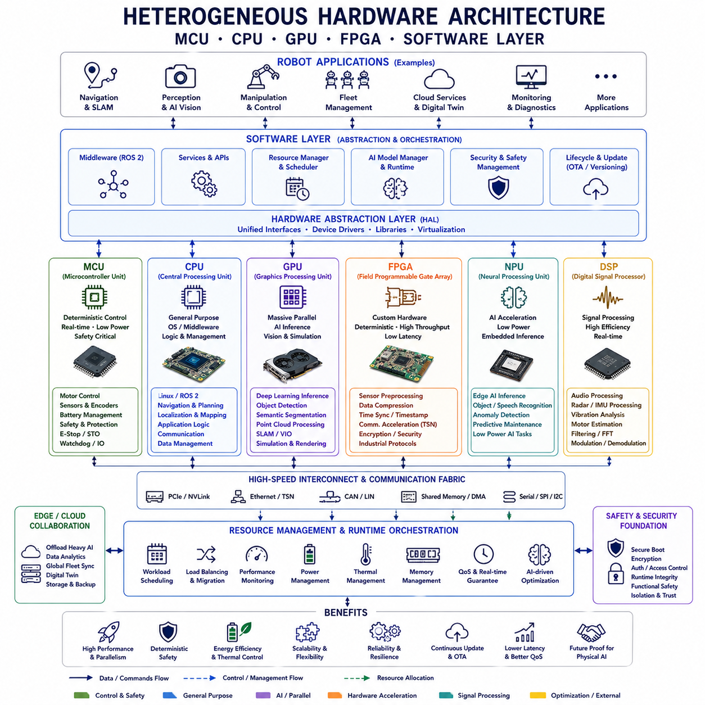{width="7.268055555555556in" height="7.268055555555556in"}

Modern autonomous robots are no longer built around a single processor architecture. Instead, they operate as heterogeneous computing systems that combine multiple specialized processing units, each optimized for different computational characteristics and real-time requirements. A contemporary Software Defined Robot (SDR) typically integrates Microcontroller Units (MCUs), Central Processing Units (CPUs), Graphics Processing Units (GPUs), Field Programmable Gate Arrays (FPGAs), Neural Processing Units (NPUs), Digital Signal Processors (DSPs), and dedicated hardware accelerators into one coordinated computing platform. Rather than competing with one another, these heterogeneous processors cooperate to execute robotic workloads according to timing constraints, computational complexity, energy efficiency, reliability, and safety requirements. The Heterogeneous Hardware Software Layer provides the architectural abstraction that enables software to utilize these diverse computational resources without becoming tightly coupled to specific hardware implementations. This software layer therefore becomes one of the most important foundations of Software Defined Robotics and future Physical AI platforms.

Historically, robotic controllers relied almost exclusively on microcontrollers or industrial programmable logic controllers that executed deterministic control algorithms. Motion control, sensor acquisition, encoder processing, and communication tasks were relatively lightweight and could be managed efficiently using embedded processors operating at low clock frequencies. As robotics evolved toward autonomous navigation, artificial intelligence, semantic perception, digital twins, and cloud-native architectures, computational demand increased dramatically. Real-time object detection, three-dimensional mapping, simultaneous localization and mapping, multimodal sensor fusion, large language models, reinforcement learning, predictive maintenance, collaborative fleet optimization, and digital simulation require computational performance far beyond the capabilities of traditional embedded controllers. Modern robots therefore distribute computational workloads across heterogeneous processors optimized for different classes of computation.

The fundamental philosophy of heterogeneous computing is that no single processor architecture provides optimal performance for every workload. Deterministic control favors simple processors with predictable execution behavior. Artificial intelligence benefits from massively parallel computation. Signal processing often requires dedicated hardware pipelines. Image processing exploits vectorized arithmetic. Encryption accelerates through specialized cryptographic engines. Hardware abstraction therefore enables applications to express computational requirements rather than processor-specific implementations, allowing runtime orchestration to allocate workloads intelligently according to available computational resources.

Microcontroller Units remain the foundation of physical robot control despite dramatic advances in high-performance computing. MCUs provide deterministic execution supporting motor control, actuator supervision, sensor acquisition, battery management, communication interfaces, safety monitoring, encoder processing, timing synchronization, and hardware diagnostics. Unlike application processors, microcontrollers prioritize predictable interrupt latency, deterministic scheduling, low power consumption, integrated peripherals, and direct hardware access. Because they frequently operate independently from high-level operating systems, MCUs continue functioning even if application software encounters unexpected failures. Consequently, they provide essential operational resilience within autonomous robotic systems.

Motor control illustrates the importance of MCU architecture. Precise velocity regulation, current control, field-oriented control, torque estimation, braking management, encoder feedback, and actuator protection require control loops executing at frequencies ranging from several kilohertz to tens of kilohertz. These deterministic timing requirements cannot reliably tolerate scheduling delays introduced by general-purpose operating systems. Dedicated MCUs therefore maintain precise actuator behavior while higher-level processors generate strategic motion objectives. This hierarchical separation significantly improves both performance and safety.

Safety supervision similarly relies heavily upon microcontroller infrastructure. Emergency stop processing, collision detection, hardware watchdog timers, redundant communication monitoring, thermal protection, overcurrent detection, voltage supervision, actuator limitation, battery protection, and safe torque off mechanisms operate independently from artificial intelligence or cloud connectivity. Safety-critical MCU software therefore establishes the trusted execution foundation protecting physical systems regardless of application software complexity.

General-purpose CPUs occupy the middle layer of heterogeneous robotic computing. CPUs execute operating systems, middleware, communication services, resource management, navigation algorithms, localization, path planning, digital twins, cybersecurity, diagnostics, runtime orchestration, fleet communication, software lifecycle management, and application logic. CPUs provide exceptional flexibility while supporting sophisticated operating system services including memory management, process scheduling, networking, storage, virtualization, container execution, and distributed computing. Although CPUs offer significantly greater computational capability than embedded microcontrollers, they remain optimized for sequential decision-making rather than massively parallel workloads.

Linux-based multicore processors have become particularly important because modern robotics increasingly depends upon cloud-native software engineering. Middleware frameworks, ROS 2 communication, artificial intelligence runtimes, container orchestration, databases, simulation environments, cybersecurity infrastructure, observability platforms, and digital twin synchronization all execute efficiently within CPU environments. CPUs therefore function as the software coordination center connecting deterministic embedded control with artificial intelligence acceleration.

Graphics Processing Units provide the computational foundation supporting modern robotic perception and artificial intelligence. Unlike CPUs optimized for sequential execution, GPUs contain thousands of computational cores capable of executing massive numbers of arithmetic operations simultaneously. Deep neural network inference, semantic segmentation, object detection, visual simultaneous localization and mapping, point cloud processing, multimodal sensor fusion, reinforcement learning, image enhancement, language models, generative artificial intelligence, and simulation all benefit dramatically from GPU acceleration. Contemporary autonomous robots increasingly depend upon GPUs because perception and decision-making require continuous parallel computation over enormous sensor datasets.

Artificial intelligence inference demonstrates GPU advantages particularly clearly. Modern perception systems frequently process multiple high-resolution cameras, LiDAR point clouds, radar observations, thermal imagery, inertial measurements, and environmental sensors simultaneously. Convolutional neural networks, transformer architectures, diffusion models, vision-language models, and multimodal reasoning algorithms require billions of arithmetic operations for each inference cycle. GPUs execute these computations efficiently through highly parallel architectures while supporting hardware acceleration libraries optimized specifically for machine learning workloads.

GPU utilization extends beyond artificial intelligence into robotic simulation and digital twins. Physics simulation, collision detection, particle systems, environmental rendering, synthetic sensor generation, reinforcement learning environments, digital twin synchronization, and virtual testing all exploit graphics processors extensively. High-performance simulation enables accelerated software development while validating autonomous behavior under thousands of operational scenarios before deployment toward physical robotic systems.

Field Programmable Gate Arrays occupy another unique position within heterogeneous robotic computing. Unlike fixed processors executing software instructions sequentially, FPGAs implement customized digital circuits configured specifically for individual computational tasks. Hardware pipelines execute multiple processing stages simultaneously without operating system overhead or instruction interpretation. Consequently, FPGAs deliver exceptional deterministic latency, energy efficiency, and throughput for specialized workloads including sensor preprocessing, communication acceleration, cryptography, video encoding, hardware synchronization, industrial communication protocols, and deterministic signal processing.

Sensor preprocessing provides an excellent FPGA application. High-speed cameras, LiDAR systems, radar sensors, industrial vision equipment, hyperspectral imagers, and scientific instrumentation frequently generate data exceeding processor bandwidth limitations. FPGAs perform hardware-level filtering, compression, synchronization, timestamping, feature extraction, protocol conversion, and sensor fusion before data reaches CPUs or GPUs. This hardware acceleration substantially reduces computational burden while minimizing communication latency.

Communication infrastructure similarly benefits from FPGA acceleration. Time-Sensitive Networking, Precision Time Protocol, industrial Ethernet, programmable packet processing, communication gateways, deterministic switching, encryption acceleration, network redundancy, and distributed synchronization require predictable hardware behavior difficult to achieve through software alone. FPGA implementations therefore support deterministic communication essential for collaborative robotics, industrial automation, and synchronized autonomous systems.

Hardware acceleration increasingly extends toward specialized Neural Processing Units optimized specifically for machine learning inference. NPUs consume substantially less power than GPUs while executing common neural network operations efficiently. Embedded robots frequently integrate NPUs supporting object detection, semantic understanding, speech recognition, gesture classification, predictive maintenance, and environmental perception where power consumption constrains GPU utilization. Runtime orchestration dynamically selects GPU or NPU execution according to computational complexity, latency requirements, thermal conditions, and energy availability.

Digital Signal Processors continue serving important roles within heterogeneous architectures despite growing artificial intelligence capability. Audio processing, radar signal interpretation, vibration analysis, inertial sensor filtering, communication modulation, adaptive filtering, motor estimation, and industrial instrumentation frequently benefit from DSP architectures optimized specifically for mathematical signal processing. DSPs therefore complement CPUs, GPUs, and MCUs by accelerating specialized numerical algorithms.

Heterogeneous hardware introduces significant software complexity because applications should remain independent from processor implementation details. Hardware abstraction layers therefore provide standardized computational interfaces separating software functionality from underlying execution resources. Applications request artificial intelligence inference, image processing, localization, communication, or sensor acquisition without explicitly selecting processors. Runtime resource managers subsequently allocate workloads across available MCUs, CPUs, GPUs, FPGAs, NPUs, and DSPs according to optimization objectives.

Runtime scheduling becomes considerably more sophisticated within heterogeneous robotic systems. Computational workloads vary continuously according to environmental complexity, mission priorities, battery status, thermal conditions, communication quality, hardware availability, and artificial intelligence demand. Runtime orchestrators monitor processor utilization, memory allocation, communication latency, energy consumption, hardware temperature, inference queues, and application priorities continuously while migrating workloads dynamically across heterogeneous computational resources. Dynamic scheduling maximizes system efficiency while preserving deterministic execution for safety-critical functionality.

Memory architecture represents another important challenge because heterogeneous processors frequently maintain independent memory spaces. CPUs access system memory differently than GPUs. FPGAs utilize configurable on-chip memory. Microcontrollers frequently execute from internal flash memory while maintaining independent RAM. Efficient software architecture therefore coordinates shared memory, zero-copy communication, direct memory access, memory coherency, cache management, and buffer synchronization ensuring data moves efficiently among computational resources without unnecessary duplication.

High-speed communication fabrics enable practical heterogeneous integration. PCI Express, NVLink, Ethernet, Controller Area Network, shared memory, Direct Memory Access, Time-Sensitive Networking, serial communication, and proprietary interconnects transfer information among heterogeneous processors while minimizing latency. Communication middleware abstracts hardware interfaces allowing software components to exchange information consistently regardless of processor location or communication mechanism.

Energy efficiency becomes increasingly important because autonomous robots operate under constrained battery resources. GPUs provide enormous computational capability but consume significant electrical power. Microcontrollers execute deterministic control with extremely low energy consumption. FPGAs frequently outperform CPUs for specialized algorithms while consuming substantially less power. Runtime energy management therefore allocates workloads according to battery availability, thermal conditions, mission urgency, charging schedules, and computational requirements. Adaptive resource allocation extends operational lifetime without compromising mission objectives.

Thermal management closely accompanies heterogeneous computing because concentrated computational workloads generate significant heat. Artificial intelligence inference, graphics processing, simulation, communication acceleration, and high-speed sensor processing may elevate processor temperatures beyond reliable operating limits. Runtime thermal managers continuously monitor processor temperatures while adjusting computational frequency, redistributing workloads, activating cooling systems, reducing inference frequency, or temporarily migrating computation toward edge infrastructure. Intelligent thermal orchestration therefore preserves hardware reliability throughout extended autonomous operation.

Cloud-edge collaboration extends heterogeneous computing beyond onboard processors. Embedded MCUs continue deterministic control while CPUs coordinate robotic software, GPUs accelerate perception, and computationally intensive artificial intelligence executes on nearby edge servers or centralized cloud infrastructure. Runtime orchestration dynamically determines optimal execution locations according to communication latency, bandwidth availability, computational demand, cybersecurity policies, and operational urgency. Consequently, heterogeneous computing evolves from individual processor integration toward distributed computational ecosystems spanning robots, edge infrastructure, and cloud platforms.

ROS 2 middleware naturally complements heterogeneous hardware by providing standardized communication independent of processor architecture. Individual software nodes execute on different processors while exchanging information through publish-subscribe communication, services, actions, and distributed middleware. Hardware abstraction therefore extends naturally into distributed heterogeneous execution where computational components operate across diverse processing architectures without requiring application redesign.

Containerization further improves heterogeneous software portability. Containers package applications together with runtime dependencies while remaining deployable across CPUs, GPUs, edge servers, cloud infrastructure, and simulation environments. Hardware-specific acceleration libraries remain isolated beneath standardized software interfaces allowing continuous deployment throughout heterogeneous robotic ecosystems.

Artificial intelligence increasingly assists heterogeneous resource management itself. Machine learning models continuously analyze processor utilization, communication latency, thermal behavior, battery consumption, workload characteristics, mission priorities, and operational history while recommending computational resource allocation dynamically. Predictive scheduling anticipates computational demand before workload spikes occur, improving overall system responsiveness while minimizing resource contention.

Cybersecurity becomes more complex within heterogeneous systems because every processor introduces additional attack surfaces. Secure boot, hardware roots of trust, encrypted communication, secure firmware updates, trusted execution environments, processor authentication, runtime integrity verification, and software attestation collectively protect distributed computational infrastructure. Security policies therefore span every computational layer rather than focusing exclusively upon operating systems or application software.

Functional safety similarly extends across heterogeneous architectures. Deterministic safety controllers remain isolated within trusted MCU environments while higher-level intelligence executes on Linux processors, GPUs, or cloud infrastructure. Safety boundaries ensure artificial intelligence, cloud communication, runtime software updates, or application failures cannot compromise emergency stopping, actuator limitation, collision avoidance, or certified protective mechanisms. Layered architectural separation therefore balances adaptive intelligence with deterministic physical protection.

Software Defined Robots fundamentally depend upon heterogeneous hardware because no single processor architecture satisfies simultaneously the deterministic control, high-performance perception, artificial intelligence reasoning, cloud integration, cybersecurity, simulation, digital twins, and fleet coordination required by modern autonomous systems. Hardware diversity therefore becomes an architectural strength rather than a design complication. Through standardized software layers, runtime orchestration, hardware abstraction, distributed communication, intelligent resource management, and adaptive scheduling, heterogeneous computing transforms collections of independent processors into one unified computational platform supporting continuous software evolution throughout robotic lifecycles.

Future Physical AI platforms will likely integrate even broader computational diversity including quantum accelerators, photonic processors, neuromorphic computing, domain-specific artificial intelligence accelerators, edge supercomputers, distributed cloud infrastructure, collaborative robotic networks, and autonomous computational marketplaces. Applications will increasingly request logical computational capabilities rather than specific hardware resources, allowing intelligent runtime orchestration to determine optimal execution environments automatically. Heterogeneous Hardware Software Layers will therefore become the universal computational foundation supporting adaptive, scalable, trustworthy, and continuously evolving Software Defined Robotics operating across increasingly complex cyber-physical ecosystems.

현대 자율주행 로봇(Autonomous Robot)은 하나의 프로세서(Processor)만으로 동작하지 않는다. 대신 MCU(Microcontroller Unit), CPU(Central Processing Unit), GPU(Graphics Processing Unit), FPGA(Field Programmable Gate Array), NPU(Neural Processing Unit), DSP(Digital Signal Processor)와 같은 다양한 연산 장치를 함께 사용하는 이기종 컴퓨팅(Heterogeneous Computing) 구조를 채택한다. 각 프로세서는 서로 경쟁하는 것이 아니라 자신에게 가장 적합한 연산을 담당하며, 이를 통합하는 소프트웨어 계층(Heterogeneous Hardware Software Layer)이 전체 시스템을 하나의 플랫폼처럼 동작하도록 만든다.

초기의 로봇은 대부분 MCU나 PLC(Programmable Logic Controller)를 기반으로 구성되었다. 모터 제어(Motor Control), 센서 읽기(Sensor Acquisition), 통신(Communication)과 같은 비교적 단순한 작업은 저성능 임베디드 프로세서만으로도 충분히 처리할 수 있었다. 그러나 자율주행, AI, 디지털 트윈(Digital Twin), 클라우드 연동이 요구되면서 연산량이 급격히 증가하였고, 하나의 프로세서만으로는 모든 기능을 수행하기 어려워졌다.

이기종 컴퓨팅의 핵심 철학은 "모든 작업을 하나의 프로세서가 수행하는 것이 아니라, 각 작업을 가장 적합한 프로세서에 배치한다."는 것이다. 실시간 제어(Real-Time Control)는 MCU가 담당하고, 운영체제와 애플리케이션(Application)은 CPU가 담당하며, AI 추론(Inference)은 GPU 또는 NPU가 수행하고, 초고속 데이터 처리와 통신은 FPGA가 담당한다. 이러한 역할 분담을 통해 성능과 효율을 동시에 확보할 수 있다.

MCU(Microcontroller Unit)는 여전히 로봇 제어의 핵심이다. 모터 구동, 배터리 관리(Battery Management), 엔코더(Encoder), IMU(Inertial Measurement Unit), 센서 입력, 긴급 정지(Emergency Stop), 안전 감시(Safety Monitoring)는 MCU에서 수행된다. MCU는 운영체제의 영향을 거의 받지 않으며 매우 짧은 응답 시간(Response Time)과 높은 결정성(Determinism)을 제공하므로 안전 기능을 담당하기에 가장 적합하다.

모터 제어는 MCU의 대표적인 역할이다. 전류 제어(Current Control), 속도 제어(Velocity Control), 토크 제어(Torque Control), FOC(Field Oriented Control), 브레이크(Brake) 제어는 수 kHz 이상의 높은 주기로 실행되어야 한다. 이러한 작업은 Linux와 같은 일반 운영체제에서는 정확한 실행 시간을 보장하기 어렵기 때문에 MCU가 독립적으로 수행한다.

MCU는 기능 안전(Function Safety)의 핵심 장치이기도 하다. 긴급 정지(Emergency Stop), Safe Torque Off(STO), 워치독 타이머(Watchdog Timer), 과전류(Over Current), 과전압(Over Voltage), 온도 보호(Thermal Protection), 액추에이터(Actuator) 감시는 MCU에서 항상 동작하며, 상위 AI 시스템이 고장 나더라도 로봇의 안전을 유지한다.

CPU(Central Processing Unit)는 시스템의 중앙 제어 역할을 수행한다. Linux 운영체제, ROS 2(Robot Operating System 2), 미들웨어(Middleware), 데이터베이스(Database), 내비게이션(Navigation), 위치 추정(Localization), 경로 계획(Path Planning), 디지털 트윈, 플릿 관리(Fleet Management), 사용자 인터페이스(UI)는 대부분 CPU에서 실행된다. CPU는 복잡한 논리 처리와 운영체제 서비스를 수행하는 데 가장 적합하다.

Linux 기반 CPU는 현대 로봇 소프트웨어의 중심이 된다. ROS 2, 컨테이너(Container), 네트워크(Network), 클라우드 서비스, AI 프레임워크, 데이터 저장(Storage), 시뮬레이션(Simulation), 사이버 보안(Cybersecurity) 등 대부분의 고수준 소프트웨어는 Linux 위에서 동작한다. 풍부한 오픈소스(Open Source) 생태계를 활용할 수 있다는 점도 큰 장점이다.

GPU(Graphics Processing Unit)는 대규모 병렬 연산(Parallel Computing)에 최적화되어 있다. AI 추론, 객체 인식(Object Recognition), 의미 분할(Semantic Segmentation), 비전 기반 SLAM(Simultaneous Localization and Mapping), 포인트 클라우드(Point Cloud) 처리, 이미지 처리(Image Processing)는 수천 개의 연산을 동시에 수행해야 하므로 GPU가 가장 효율적이다.

AI 추론(Inference)은 GPU 활용의 대표적인 사례이다. 여러 대의 카메라(Camera), LiDAR, 레이더(Radar), 열화상(Thermal Camera) 데이터를 동시에 처리하면서 객체 인식, 이상 탐지(Anomaly Detection), 행동 인식(Behavior Recognition), 음성 인식(Speech Recognition)을 수행한다. GPU는 이러한 대규모 연산을 CPU보다 훨씬 빠르게 처리할 수 있다.

GPU는 AI뿐 아니라 시뮬레이션(Simulation)과 디지털 트윈(Digital Twin)에도 널리 활용된다. 물리 엔진(Physics Engine), 충돌 검사(Collision Detection), 환경 렌더링(Rendering), 가상 센서(Synthetic Sensor), 강화학습(Reinforcement Learning) 환경을 GPU에서 실행하여 실제 로봇을 배포하기 전에 다양한 환경을 검증할 수 있다.

FPGA(Field Programmable Gate Array)는 소프트웨어가 아니라 하드웨어 자체를 프로그래밍할 수 있는 장치이다. 일반 프로세서처럼 명령어를 순차적으로 실행하는 것이 아니라 회로(Circuit)를 직접 구성하여 병렬 처리한다. 따라서 매우 낮은 지연 시간(Latency)과 높은 처리량(Throughput), 뛰어난 전력 효율(Energy Efficiency)을 제공한다.

FPGA는 센서 전처리(Sensor Preprocessing)에 자주 사용된다. 초고속 카메라, LiDAR, 레이더에서 생성되는 대용량 데이터를 압축(Compression), 필터링(Filtering), 시간 동기화(Time Synchronization), 특징 추출(Feature Extraction)한 후 CPU나 GPU로 전달하여 전체 시스템의 부하를 크게 줄인다.

통신 가속(Communication Acceleration)도 FPGA의 중요한 역할이다. TSN(Time Sensitive Networking), PTP(Precision Time Protocol), 산업용 Ethernet, 암호화(Encryption), 네트워크 스위치(Network Switch) 기능을 하드웨어 수준에서 처리하여 매우 안정적이고 예측 가능한 통신을 제공한다.

NPU(Neural Processing Unit)는 AI 연산만을 위해 설계된 전용 프로세서이다. GPU보다 소비 전력(Power Consumption)이 훨씬 낮으면서도 객체 인식, 음성 인식, 의미 분석(Semantic Understanding)과 같은 AI 모델을 효율적으로 실행할 수 있다. 배터리 기반 이동 로봇에서는 GPU와 함께 매우 중요한 역할을 수행한다.

DSP(Digital Signal Processor)는 신호 처리(Signal Processing)에 특화된 프로세서이다. 오디오(Audio), 레이더(Radar), IMU 데이터 처리, 진동 분석(Vibration Analysis), 모터 추정(Motor Estimation), 통신 변조(Modulation)와 같은 수학적 연산을 CPU보다 훨씬 효율적으로 수행한다.

이기종 하드웨어는 소프트웨어 개발을 복잡하게 만들 수 있기 때문에 하드웨어 추상화 계층(Hardware Abstraction Layer, HAL)이 반드시 필요하다. 응용 프로그램은 특정 GPU나 FPGA를 직접 제어하지 않고 AI 추론, 이미지 처리(Image Processing), 센서 획득(Sensor Acquisition)과 같은 기능만 요청한다. 시스템은 가장 적합한 프로세서를 자동으로 선택하여 작업을 수행한다.

런타임 스케줄링(Runtime Scheduling)은 이기종 컴퓨팅에서 매우 중요한 기술이다. AI 부하, CPU 사용률, GPU 점유율(Utilization), 메모리(Memory), 배터리 상태, 온도(Thermal Condition), 임무 우선순위(Mission Priority)를 지속적으로 분석하여 작업을 가장 적합한 프로세서로 자동 배치한다.

메모리 구조(Memory Architecture)는 이기종 시스템의 중요한 설계 요소이다. CPU, GPU, FPGA, MCU는 서로 다른 메모리 공간을 사용하기 때문에 공유 메모리(Shared Memory), DMA(Direct Memory Access), Zero Copy, 캐시(Cache), 버퍼(Buffer) 동기화를 적절히 설계해야 데이터 복사를 최소화하고 성능을 극대화할 수 있다.

고속 인터커넥트(High-Speed Interconnect)는 프로세서 간 데이터 교환을 담당한다. PCIe(Peripheral Component Interconnect Express), NVLink, Ethernet, CAN(Controller Area Network), TSN(Time Sensitive Networking), 공유 메모리 등을 사용하여 CPU, GPU, FPGA, MCU가 지연 없이 협력할 수 있도록 지원한다.

전력 관리(Power Management)는 이동 로봇에서 매우 중요한 요소이다. GPU는 매우 높은 성능을 제공하지만 많은 전력을 소비한다. MCU는 매우 적은 전력으로 동작하며 FPGA는 특정 작업에서 CPU보다 높은 전력 효율을 제공한다. 시스템은 현재 배터리 상태를 고려하여 작업을 적절한 프로세서에 분배함으로써 운용 시간을 최대화한다.

열 관리(Thermal Management)는 고성능 AI 로봇에서 반드시 고려해야 한다. GPU와 CPU는 장시간 AI 추론을 수행하면 높은 열을 발생시키므로 시스템은 온도를 지속적으로 감시하고 필요하면 클록(Clock)을 낮추거나 일부 연산을 엣지 서버(Edge Server)로 이동시키는 방식으로 과열을 방지한다.

클라우드-엣지 협업(Cloud-Edge Collaboration)은 이기종 컴퓨팅을 로봇 외부까지 확장한다. MCU는 실시간 제어를 수행하고 CPU는 ROS 2와 애플리케이션을 실행하며 GPU는 AI를 담당한다. 그러나 대규모 AI나 데이터 분석은 엣지 서버 또는 클라우드에서 수행할 수 있다. 시스템은 통신 상태와 지연 시간을 고려하여 작업 위치를 자동으로 결정한다.

ROS 2는 이기종 하드웨어를 통합하는 중요한 미들웨어이다. 서로 다른 프로세서에서 실행되는 노드(Node)가 Publish-Subscribe, Service, Action을 통해 통신하므로 CPU, GPU, MCU, FPGA를 하나의 통합 플랫폼처럼 사용할 수 있다.

컨테이너(Container)는 이기종 환경에서도 동일한 소프트웨어를 실행할 수 있도록 한다. ROS 2 노드, AI 서비스, 플릿 관리, 디지털 트윈은 컨테이너로 패키징되어 CPU, GPU, 엣지 서버, 클라우드 등 다양한 환경에서 동일하게 실행될 수 있다.

AI는 이기종 자원 관리에도 활용된다. AI는 CPU와 GPU 사용률, 온도, 배터리 상태, 통신 지연, 작업 부하를 지속적으로 분석하여 어떤 프로세서에 작업을 배치하는 것이 가장 효율적인지를 스스로 결정하는 지능형 스케줄링(Intelligent Scheduling)을 수행하게 된다.

사이버 보안(Cybersecurity)은 이기종 시스템에서 더욱 중요하다. MCU, CPU, GPU, FPGA 각각이 새로운 공격 표면(Attack Surface)이 되므로 보안 부팅(Secure Boot), 하드웨어 신뢰 루트(Hardware Root of Trust), 암호화, 펌웨어 검증(Firmware Verification), 실행 무결성(Runtime Integrity)을 모든 계층에 적용해야 한다.

기능 안전(Function Safety)은 이기종 구조에서도 독립적으로 유지된다. MCU 기반의 안전 제어는 Linux, GPU, AI, 클라우드와 완전히 분리되어 운영되므로 상위 시스템에 문제가 발생해도 긴급 정지, 충돌 방지, 속도 제한과 같은 핵심 안전 기능은 계속 유지된다.

소프트웨어 정의 로봇(SDR)은 이기종 하드웨어 없이는 구현하기 어렵다. MCU는 결정성(Determinism), CPU는 유연성(Flexibility), GPU는 AI 성능, FPGA는 초고속 처리, NPU는 저전력 AI, DSP는 신호 처리를 담당하며, 이들을 하나의 소프트웨어 계층(Heterogeneous Hardware Software Layer)이 통합하여 하나의 컴퓨팅 플랫폼처럼 동작하도록 만든다.

미래의 물리 AI(Physical AI)는 더욱 다양한 프로세서를 활용하게 될 것이다. 광 컴퓨팅(Photonic Computing), 뉴로모픽 프로세서(Neuromorphic Processor), 양자 가속기(Quantum Accelerator), 차세대 AI 가속기, 엣지 슈퍼컴퓨터(Edge Supercomputer)가 하나의 플랫폼으로 통합될 것이며, 응용 프로그램은 특정 하드웨어를 직접 선택하지 않고 필요한 연산만 요청하면 시스템이 가장 적합한 연산 자원을 자동으로 선택하는 구조로 발전할 것이다.

결론적으로 이기종 하드웨어 소프트웨어 계층(Heterogeneous Hardware Software Layer)은 MCU, CPU, GPU, FPGA, NPU, DSP를 하나의 통합 컴퓨팅 플랫폼으로 연결하는 핵심 아키텍처이다. 하드웨어 추상화(Hardware Abstraction), 런타임 스케줄링(Runtime Scheduling), 자원 관리(Resource Management), 클라우드-엣지 협업, ROS 2, 컨테이너, AI 기반 최적화를 결합함으로써 고성능·고신뢰·고확장성의 소프트웨어 정의 로봇을 구현하며, 미래 물리 AI 시대의 핵심 기반 기술로 자리잡게 될 것이다.

##  

## 10.08 Software-Defined Communication Layer Design

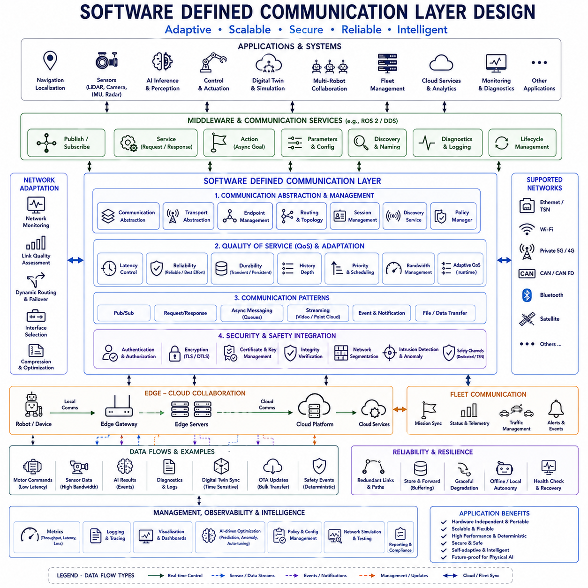{width="7.268055555555556in" height="7.268055555555556in"}

Modern autonomous robots have evolved from isolated electromechanical machines into highly connected cyber-physical systems operating across heterogeneous computing environments. Contemporary robotic platforms continuously exchange information among sensors, actuators, embedded controllers, edge servers, cloud platforms, digital twins, fleet management systems, artificial intelligence services, industrial automation infrastructure, and collaborative robots. Unlike traditional embedded communication systems designed primarily for point-to-point data exchange, modern Software Defined Robots (SDRs) require communication architectures capable of dynamically adapting to changing operational conditions, computational workloads, network topologies, security requirements, and mission objectives. Software Defined Communication Layer Design provides the architectural foundation enabling communication infrastructure to evolve continuously through software while abstracting hardware-specific networking technologies beneath standardized interfaces. Rather than treating communication as a fixed infrastructure component, Software Defined Communication transforms networking into an adaptive software capability that supports scalable, resilient, secure, and intelligent robotic ecosystems.

Historically, robotic communication architectures were tightly coupled to hardware implementations. Motor controllers communicated through Controller Area Network buses, programmable logic controllers exchanged information using industrial fieldbus protocols, sensors relied upon dedicated serial interfaces, and supervisory computers communicated through Ethernet. Each communication mechanism was designed independently according to specific hardware capabilities, resulting in fragmented software architectures where applications required explicit knowledge of underlying communication protocols. As robotic systems expanded toward distributed intelligence, cloud-native computing, edge computing, artificial intelligence, and multi-robot collaboration, hardware-dependent communication became increasingly difficult to maintain, extend, and optimize. Software Defined Communication addresses these limitations by separating logical communication services from physical networking infrastructure.

The fundamental philosophy of Software Defined Communication is that applications should communicate through abstract services rather than directly managing transport protocols, hardware interfaces, routing mechanisms, message serialization, quality-of-service policies, or network topology. Software modules express communication intent while dedicated communication layers determine optimal transmission mechanisms according to runtime conditions. This architectural separation enables communication infrastructure to evolve independently from application software while improving portability, scalability, maintainability, and operational flexibility.

Communication abstraction begins by defining logical communication services independent of physical transport technologies. Applications publish sensor observations, request navigation services, exchange localization updates, distribute artificial intelligence inference results, synchronize digital twins, coordinate fleet missions, or report diagnostics without specifying Ethernet, Wi-Fi, Controller Area Network, Time-Sensitive Networking, 5G, Bluetooth, satellite communication, or cloud messaging infrastructure. Communication middleware subsequently selects appropriate transport mechanisms according to performance requirements, hardware availability, security policies, and operational context.

Modern robotic communication requirements extend far beyond simple message transmission. Autonomous robots simultaneously exchange deterministic control commands, high-bandwidth video streams, three-dimensional point clouds, artificial intelligence model updates, telemetry, software deployment packages, digital twin synchronization data, cybersecurity events, diagnostic information, maintenance reports, operational policies, and collaborative mission coordination. Each information category exhibits distinct latency, bandwidth, reliability, synchronization, security, and persistence requirements. Software Defined Communication therefore supports differentiated communication services optimized according to application-specific quality requirements rather than applying identical communication semantics universally.

Middleware constitutes the central software layer implementing communication abstraction. Modern robotics increasingly adopts middleware frameworks such as ROS 2 communication infrastructure based upon the Data Distribution Service standard because middleware provides standardized interfaces supporting publish-subscribe communication, request-response services, asynchronous messaging, lifecycle management, distributed discovery, parameter synchronization, diagnostics, logging, and interoperability across heterogeneous computational environments. Middleware isolates applications from communication complexity while enabling software portability across diverse hardware architectures.

Publish-subscribe communication represents one of the most important architectural patterns within Software Defined Communication. Information producers publish sensor data, localization estimates, battery status, navigation updates, artificial intelligence results, diagnostics, or environmental observations without requiring knowledge of information consumers. Subscribers automatically receive relevant data according to declared interests. Decoupling publishers from subscribers substantially improves modularity because software components evolve independently while maintaining standardized communication interfaces. New applications simply subscribe to existing information streams without modifying data producers.

Request-response communication complements publish-subscribe architectures for interactive services requiring explicit responses. Navigation systems request localization estimates, digital twins retrieve diagnostic reports, operators query battery health, artificial intelligence services request sensor observations, and maintenance software retrieves configuration information. Service-oriented communication therefore supports structured interactions while preserving architectural modularity.

Asynchronous communication significantly improves robotic scalability because software components no longer block while waiting for responses. Commands, sensor observations, artificial intelligence tasks, diagnostics, fleet coordination events, cybersecurity alerts, software deployment notifications, and maintenance requests enter communication queues processed independently according to resource availability. Asynchronous messaging improves responsiveness while supporting distributed computation across heterogeneous processors, edge infrastructure, and cloud platforms.

Quality-of-Service management represents one of the defining capabilities of Software Defined Communication. Different robotic workloads require fundamentally different communication characteristics. Motor commands require extremely low latency and deterministic delivery. Camera streams prioritize throughput over guaranteed reliability. Artificial intelligence inference tolerates occasional packet loss while digital twin synchronization requires ordered delivery. Safety monitoring demands deterministic communication independent of background traffic. Software Defined Communication therefore assigns individualized quality-of-service policies controlling latency, reliability, durability, bandwidth allocation, history depth, synchronization, priority, and persistence according to application requirements.

Dynamic Quality-of-Service adaptation further extends communication flexibility. Rather than relying upon static communication parameters, runtime communication managers continuously evaluate processor utilization, network congestion, battery status, wireless signal quality, mission priorities, communication latency, environmental interference, and operational objectives. Communication policies automatically adjust transmission frequency, compression levels, message priorities, routing strategies, redundancy, and synchronization intervals to maintain optimal operational performance under changing environmental conditions.

Communication virtualization introduces another important architectural capability. Applications communicate through logical communication channels independent of physical networking infrastructure. Underlying communication may transition seamlessly among Ethernet, Wi-Fi, private cellular networks, Time-Sensitive Networking, industrial wireless systems, satellite communication, or edge gateways without requiring application modification. Virtual communication channels therefore provide hardware independence while enabling adaptive network utilization throughout robotic lifecycles.

Time synchronization constitutes a critical requirement because modern robotic perception depends upon precise temporal alignment among distributed sensors, processors, communication devices, and cloud infrastructure. Cameras, LiDAR systems, radar sensors, inertial measurement units, Global Navigation Satellite Systems, edge servers, digital twins, and fleet management platforms continuously exchange timestamped information requiring consistent temporal interpretation. Precision Time Protocol, hardware timestamping, synchronized clocks, deterministic scheduling, and distributed timing services collectively ensure coherent system behavior despite geographically distributed computation.

Deterministic communication becomes particularly important for real-time robotic control. Motion coordination, synchronized manipulation, distributed actuation, collaborative robotics, industrial automation, and safety supervision require communication latency measured in microseconds or milliseconds with predictable timing characteristics. Time-Sensitive Networking provides deterministic Ethernet communication supporting bounded latency, synchronized scheduling, traffic prioritization, fault tolerance, and high reliability. Software Defined Communication integrates deterministic networking transparently beneath standardized software interfaces allowing applications to exploit precise timing without managing low-level communication complexity.

Edge computing fundamentally influences communication architecture because computational workloads increasingly distribute dynamically among robots, nearby edge servers, and cloud infrastructure. Artificial intelligence inference, digital twins, simulation, data analytics, fleet optimization, predictive maintenance, and software deployment frequently execute outside individual robots. Software Defined Communication therefore supports intelligent workload distribution by continuously evaluating communication latency, bandwidth availability, processor utilization, cybersecurity constraints, battery status, and operational urgency before selecting appropriate execution locations.

Cloud communication extends robotic capabilities beyond onboard computation. Cloud services provide centralized fleet management, software lifecycle governance, artificial intelligence model training, long-term telemetry storage, digital twin synchronization, predictive maintenance analytics, business intelligence, operational dashboards, and enterprise integration. Software Defined Communication abstracts cloud interaction through standardized service interfaces while adapting automatically to changing communication quality, network availability, security policies, and regulatory requirements.

Fleet communication introduces additional architectural complexity because hundreds or thousands of robots cooperate simultaneously across warehouses, factories, hospitals, agricultural environments, airports, logistics centers, and smart cities. Fleet management continuously coordinates mission assignments, traffic control, charging schedules, software deployment, operational policies, safety events, digital twins, maintenance activities, and resource optimization. Scalable communication infrastructure therefore becomes essential for maintaining operational consistency throughout geographically distributed robotic ecosystems.

Multi-robot collaboration requires communication supporting shared perception, cooperative localization, distributed mapping, collaborative manipulation, swarm coordination, obstacle sharing, traffic negotiation, and mission synchronization. Software Defined Communication enables collaborative intelligence by providing standardized communication services independent of robot manufacturers, hardware architectures, communication protocols, or deployment environments. Collaborative robotic systems therefore evolve through software rather than requiring hardware redesign.

Communication resilience represents another essential architectural objective. Autonomous robots frequently encounter wireless interference, network congestion, communication interruptions, hardware failures, infrastructure outages, and degraded connectivity. Software Defined Communication continuously monitors communication health while dynamically selecting alternative routing paths, redundant communication links, local autonomy modes, edge gateways, or degraded operational strategies. Graceful degradation ensures robots continue performing essential functions despite partial communication failures.

Redundant communication pathways substantially improve reliability. Critical information may simultaneously traverse Ethernet, wireless networks, industrial communication buses, private cellular infrastructure, satellite communication, or dedicated safety channels. Communication orchestrators evaluate transmission success continuously while automatically selecting healthy communication paths whenever primary infrastructure becomes unavailable. Redundancy therefore transforms communication failures into manageable operational events rather than catastrophic system outages.

Cybersecurity has become inseparable from robotic communication because every network connection represents a potential attack surface. Software Defined Communication integrates authentication, authorization, encryption, certificate management, secure key exchange, message integrity verification, secure boot, trusted execution environments, network segmentation, intrusion detection, anomaly monitoring, vulnerability management, and zero-trust networking principles throughout communication architecture. Communication security therefore becomes an intrinsic software capability rather than an external infrastructure component.

Communication observability provides continuous operational insight supporting optimization, maintenance, and incident response. Telemetry continuously measures latency, throughput, packet loss, bandwidth utilization, synchronization quality, routing efficiency, communication failures, processor utilization, message queues, protocol behavior, security events, and application communication patterns. Observability transforms communication infrastructure into a measurable software platform enabling predictive maintenance, automated optimization, root-cause analysis, and continuous performance improvement.

Artificial intelligence increasingly assists communication management itself. Machine learning continuously analyzes communication patterns, predicts congestion, identifies anomalies, recommends routing optimization, prioritizes traffic, forecasts bandwidth requirements, detects cybersecurity threats, and dynamically adjusts quality-of-service policies according to operational context. Intelligent communication orchestration therefore becomes adaptive rather than statically configured.

Digital twins rely heavily upon Software Defined Communication because virtual representations require continuous synchronization with physical robotic systems. Sensor observations, localization updates, operational status, artificial intelligence results, actuator behavior, environmental conditions, and maintenance information continuously propagate between robots and virtual models. Communication architecture therefore directly influences digital twin fidelity, latency, consistency, and predictive capability.

Containerized microservices further strengthen communication abstraction. Individual software services communicate through standardized APIs, message brokers, service meshes, and middleware rather than direct network programming. Containers remain portable across robots, edge servers, cloud infrastructure, and simulation environments because communication dependencies become standardized software services independent of deployment location. Service meshes additionally provide load balancing, routing, authentication, encryption, observability, and traffic management transparently beneath application logic.

Software updates similarly depend upon communication infrastructure. Over-the-Air deployment distributes operating systems, firmware, artificial intelligence models, configuration files, cybersecurity patches, containers, middleware, and application software toward distributed robotic fleets. Software Defined Communication manages bandwidth allocation, deployment prioritization, rollback coordination, package integrity verification, staged rollout strategies, and deployment telemetry while minimizing operational disruption.

Functional safety introduces additional communication requirements. Emergency stopping, safety supervision, actuator limitation, collision avoidance, and protective monitoring require deterministic communication isolated from noncritical application traffic. Safety communication channels remain logically separated while utilizing certified communication mechanisms supporting bounded latency, redundancy, fault detection, and deterministic scheduling. Software Defined Communication therefore balances adaptive software flexibility with uncompromising functional safety guarantees.

Software Defined Communication naturally complements Software Defined Networking principles increasingly adopted throughout industrial automation. Centralized communication controllers maintain global visibility regarding network topology, communication policies, bandwidth allocation, routing strategies, security rules, and quality-of-service configuration while distributed communication agents execute runtime decisions locally. This separation between control and data planes substantially improves communication flexibility, scalability, automation, and policy consistency.

Future Software Defined Communication will evolve toward fully autonomous communication ecosystems. Artificial intelligence will continuously optimize communication topology, predict network failures, coordinate distributed computational resources, personalize communication policies, negotiate bandwidth allocation among robotic fleets, orchestrate cloud-edge collaboration, validate cybersecurity posture, and synchronize digital twins without human intervention. Communication infrastructure will increasingly become self-managing, self-healing, self-optimizing, and context-aware while supporting rapidly evolving Physical AI ecosystems.

Ultimately, Software Defined Communication Layer Design establishes the communication foundation supporting next-generation Software Defined Robots by integrating communication abstraction, middleware, publish-subscribe messaging, request-response services, asynchronous processing, Quality-of-Service management, deterministic networking, edge-cloud collaboration, fleet communication, multi-robot coordination, cybersecurity, observability, digital twins, containerized microservices, Over-the-Air deployment, functional safety, and intelligent communication orchestration into one unified architectural framework. Through standardized software interfaces rather than hardware-dependent networking implementations, communication evolves continuously alongside robotic software, enabling scalable, resilient, secure, adaptive, and trustworthy autonomous systems capable of operating efficiently across increasingly complex cyber-physical environments.

현대 자율주행 로봇(Autonomous Robot)은 더 이상 독립적으로 동작하는 기계가 아니라 센서(Sensor), 액추에이터(Actuator), 엣지 컴퓨팅(Edge Computing), 클라우드(Cloud), 디지털 트윈(Digital Twin), 플릿 관리(Fleet Management), 인공지능(AI)이 지속적으로 정보를 교환하는 사이버-물리 시스템(Cyber-Physical System)으로 발전하였다. 이러한 환경에서는 단순한 네트워크 연결이 아니라 소프트웨어 정의 통신 계층(Software Defined Communication Layer)이 필수적인 기반 기술이 된다.

기존 로봇의 통신은 CAN(Controller Area Network), RS-232, RS-485, Ethernet, 산업용 필드버스(Fieldbus)와 같이 하드웨어 중심으로 설계되었다. 각 장치는 특정 통신 방식에 직접 연결되었으며, 응용 프로그램(Application)도 이러한 프로토콜(Protocol)을 직접 처리해야 했다. 따라서 새로운 장치를 추가하거나 네트워크를 변경할 경우 전체 소프트웨어를 수정해야 하는 문제가 있었다.

소프트웨어 정의 통신(Software Defined Communication)의 핵심 철학은 응용 프로그램이 실제 통신 방식(Ethernet, Wi-Fi, 5G, TSN, CAN 등)을 알 필요 없이 논리적인 서비스(Logical Service)만 사용하도록 만드는 것이다. 응용 프로그램은 단순히 데이터를 보내거나 받기만 하면 되고, 실제 통신 방식과 경로(Route)는 통신 계층이 자동으로 결정한다.

통신 추상화(Communication Abstraction)는 이러한 구조의 핵심이다. 내비게이션(Navigation), 위치 추정(Localization), AI 추론(Inference), 디지털 트윈, 플릿 관리(Fleet Management), 진단(Diagnostics)은 모두 동일한 인터페이스(Standard Interface)를 사용하여 통신한다. 실제 데이터는 Ethernet, Wi-Fi, Private 5G, TSN(Time-Sensitive Networking), 위성 통신(Satellite Communication) 등 가장 적합한 네트워크를 통해 자동으로 전달된다.

현대 로봇에서는 다양한 종류의 데이터가 동시에 전송된다. 모터 제어 명령(Motion Command), 카메라 영상(Video Stream), LiDAR 포인트 클라우드(Point Cloud), AI 결과, 진단 정보(Diagnostics), 배터리 상태(Battery Status), 소프트웨어 업데이트(OTA), 디지털 트윈 동기화(Digital Twin Synchronization)는 각각 요구되는 대역폭(Bandwidth), 지연 시간(Latency), 신뢰성(Reliability)이 다르므로 하나의 통신 방식으로는 모두 최적화할 수 없다.

미들웨어(Middleware)는 소프트웨어 정의 통신의 중심 계층이다. ROS 2(Robot Operating System 2)와 DDS(Data Distribution Service)는 Publish-Subscribe, Service, Action, Parameter, Diagnostics를 표준 방식으로 제공한다. 응용 프로그램은 네트워크를 직접 제어하지 않고 미들웨어를 통해 통신하므로 하드웨어와 독립적인 구조를 유지할 수 있다.

Publish-Subscribe 구조는 현대 로봇에서 가장 널리 사용되는 통신 방식이다. 센서, AI, 위치 추정, 배터리 관리, 내비게이션은 필요한 정보를 Publish하면 다른 모듈은 원하는 데이터만 Subscribe한다. 발행자(Publisher)는 누가 데이터를 사용하는지 알 필요가 없으며, 구독자(Subscriber)도 데이터 생성 방식을 알 필요가 없다. 이러한 구조는 모듈화(Modularity)와 확장성(Scalability)을 크게 향상시킨다.

Request-Response 방식은 명령(Command)과 질의(Query)에 적합하다. 예를 들어 배터리 상태 조회, 위치 정보 요청, AI 서비스 호출, 디지털 트윈 정보 조회는 요청(Request)을 보내고 응답(Response)을 받는 형태로 이루어진다. Publish-Subscribe와 함께 사용하여 효율적인 서비스 지향 아키텍처(Service-Oriented Architecture)를 구성한다.

비동기 통신(Asynchronous Communication)은 현대 로봇의 핵심 기술이다. AI 추론, 진단, 플릿 관리, 로그(Log), 이벤트(Event), 유지보수 요청(Maintenance Request)은 즉시 처리하지 않고 메시지 큐(Message Queue)에 저장한 후 순차적으로 처리한다. 이를 통해 CPU와 네트워크 부하를 줄이고 전체 시스템의 응답성을 높일 수 있다.

QoS(Quality of Service)는 ROS 2와 DDS의 가장 중요한 기능이다. 모터 제어는 매우 낮은 지연 시간(Low Latency)과 높은 신뢰성(Reliability)이 필요하지만, 카메라 영상은 일부 패킷(Packet)이 손실되어도 높은 처리량(Throughput)이 더 중요하다. QoS는 각 데이터에 맞는 통신 정책을 개별적으로 설정하여 효율적인 네트워크 운영을 가능하게 한다.

동적 QoS(Dynamic QoS)는 네트워크 상태에 따라 통신 정책을 자동으로 변경하는 기술이다. 배터리 상태, 무선 신호 세기, CPU 부하, 네트워크 혼잡(Congestion), 임무 우선순위(Mission Priority)를 지속적으로 분석하여 데이터 전송 주기(Frequency), 압축률(Compression), 우선순위(Priority)를 자동으로 조정한다.

통신 가상화(Communication Virtualization)는 응용 프로그램이 실제 네트워크를 의식하지 않도록 만든다. Ethernet, Wi-Fi, 5G, TSN, Bluetooth, 위성 통신을 사용하는지와 관계없이 응용 프로그램은 동일한 API(Application Programming Interface)를 사용한다. 네트워크가 변경되어도 응용 프로그램은 수정할 필요가 없다.

시간 동기화(Time Synchronization)는 자율주행에서 매우 중요한 요소이다. 카메라(Camera), LiDAR, 레이더(Radar), IMU(Inertial Measurement Unit), GNSS(Global Navigation Satellite System), 엣지 서버는 모두 동일한 기준 시간(Time Reference)을 사용해야 정확한 센서 융합(Sensor Fusion)이 가능하다. 이를 위해 PTP(Precision Time Protocol), 하드웨어 타임스탬프(Hardware Timestamp), 클록 동기화(Clock Synchronization)를 사용한다.

결정적 통신(Deterministic Communication)은 실시간 제어에서 필수적이다. 모터 제어, 협동 로봇(Collaborative Robot), 안전 제어(Safety Control), 산업 자동화(Industrial Automation)는 항상 동일한 시간 안에 데이터가 전달되어야 한다. TSN(Time-Sensitive Networking)은 이러한 요구사항을 만족시키는 대표적인 기술이며, 소프트웨어 정의 통신은 TSN을 일반 응용 프로그램이 쉽게 사용할 수 있도록 추상화한다.

엣지 컴퓨팅(Edge Computing)은 통신 구조를 더욱 복잡하게 만든다. 일부 AI 연산은 로봇 내부에서 수행하고, 대규모 AI 모델이나 데이터 분석은 엣지 서버 또는 클라우드에서 수행한다. 통신 계층은 지연 시간, 대역폭, 전력 소비, 네트워크 품질을 분석하여 어떤 작업을 어디에서 수행할지를 자동으로 결정한다.

클라우드 통신(Cloud Communication)은 플릿 관리, AI 모델 학습, OTA(Over-the-Air), 디지털 트윈, 장기 데이터 저장, 운영 분석을 지원한다. 응용 프로그램은 클라우드의 위치나 네트워크 상태를 고려하지 않고 동일한 서비스 인터페이스를 사용하며, 통신 계층이 자동으로 연결을 관리한다.

플릿 통신(Fleet Communication)은 수백\~수천 대의 로봇을 동시에 운영하기 위한 핵심 기술이다. 각 로봇은 임무(Mission), 충전 상태(Charging Status), 위치(Position), 교통 상황(Traffic), AI 모델, 유지보수 정보를 지속적으로 공유한다. 통신 계층은 이러한 데이터를 효율적으로 분배하여 전체 플릿이 하나의 시스템처럼 동작하도록 지원한다.

다중 로봇 협업(Multi-Robot Collaboration)은 공유 지도(Shared Map), 협업 위치 추정(Cooperative Localization), 공동 작업(Collaborative Manipulation), 군집 제어(Swarm Control)를 가능하게 한다. 소프트웨어 정의 통신은 제조사나 하드웨어가 달라도 표준 인터페이스를 통해 서로 협력할 수 있도록 지원한다.

통신 복원력(Communication Resilience)은 무선 장애, 네트워크 혼잡, 통신 단절(Network Failure) 상황에서도 운영을 지속하기 위한 기술이다. 시스템은 네트워크 상태를 지속적으로 감시하고 필요하면 다른 경로(Route)로 자동 전환하거나 로컬 자율주행(Local Autonomous Mode)으로 전환하여 안전한 운영을 유지한다.

이중화 통신(Redundant Communication)은 중요한 데이터를 여러 경로로 동시에 전송한다. Ethernet과 Wi-Fi, Private 5G, 위성 통신 등을 함께 사용하여 하나의 네트워크가 실패하더라도 다른 통신 경로를 통해 데이터를 전달한다. 이를 통해 시스템 신뢰성(Reliability)을 크게 향상시킬 수 있다.

사이버 보안(Cybersecurity)은 통신 계층에서 가장 중요한 요소 가운데 하나이다. 모든 통신은 인증(Authentication), 권한 관리(Authorization), 암호화(Encryption), 인증서(Certificate), 메시지 무결성(Message Integrity), Zero Trust Network를 적용하여 보호된다. 통신 자체가 보안 기능을 내장하므로 외부 공격으로부터 시스템을 안전하게 보호할 수 있다.

관측성(Observability)은 통신 계층의 상태를 지속적으로 분석하는 기능이다. 지연 시간(Latency), 패킷 손실(Packet Loss), 처리량(Throughput), 네트워크 사용률(Network Utilization), 메시지 큐(Message Queue), QoS 상태를 지속적으로 수집하여 성능을 분석하고 문제를 조기에 발견한다.

AI 기반 통신 관리(AI-Based Communication Management)는 미래 통신 기술의 핵심이다. AI는 네트워크 혼잡을 예측하고, 최적의 라우팅(Routing)을 선택하며, 대역폭을 자동으로 조정하고, 사이버 공격을 탐지하며, QoS를 실시간으로 최적화하여 가장 효율적인 통신 환경을 유지한다.

디지털 트윈(Digital Twin)은 지속적인 데이터 동기화가 필요하다. 실제 로봇의 위치, 센서 데이터, AI 결과, 배터리 상태, 유지보수 정보가 실시간으로 디지털 트윈에 전달되고, 디지털 트윈의 분석 결과도 다시 실제 로봇으로 전달된다. 따라서 통신 계층은 매우 높은 신뢰성과 낮은 지연 시간을 제공해야 한다.

컨테이너(Container)와 마이크로서비스(Microservices)는 통신 구조를 더욱 유연하게 만든다. 각 서비스는 Service Mesh(Message Broker 포함)를 통해 통신하며, 로봇 내부, 엣지 서버, 클라우드 어디에서 실행되더라도 동일한 인터페이스를 사용한다. 따라서 배포 위치와 관계없이 동일한 소프트웨어를 사용할 수 있다.

OTA(Over-the-Air)는 통신 계층을 통해 운영체제(OS), 펌웨어(Firmware), AI 모델, 컨테이너, 보안 패치(Security Patch), 설정(Configuration)을 원격으로 배포한다. 통신 계층은 대역폭 관리, 패키지 검증(Integrity Verification), 단계적 배포(Staged Deployment), 롤백(Rollback)을 자동으로 수행하여 안전한 업데이트를 지원한다.

기능 안전(Function Safety)은 통신에서도 반드시 보장되어야 한다. 긴급 정지(Emergency Stop), 충돌 방지(Collision Avoidance), 안전 감시(Safety Monitoring)는 일반 데이터와 분리된 독립 통신 채널을 사용하여 항상 결정적인(Deterministic) 응답 시간을 유지한다.

소프트웨어 정의 네트워크(SDN, Software Defined Networking)는 소프트웨어 정의 통신과 자연스럽게 연결된다. 중앙 컨트롤러(Central Controller)는 네트워크 전체를 관리하고, 개별 통신 장치는 데이터 전송만 수행한다. 이를 통해 정책 기반 네트워크 관리와 자동 최적화가 가능해진다.

미래의 소프트웨어 정의 통신은 AI가 스스로 네트워크를 관리하는 자율 통신 시스템(Autonomous Communication System)으로 발전할 것이다. AI는 통신 경로를 자동으로 변경하고, 장애를 예측하며, 클라우드와 엣지 간 연산을 최적화하고, 디지털 트윈과 플릿 전체를 실시간으로 동기화하는 지능형 통신 인프라를 구현하게 될 것이다.

결론적으로 소프트웨어 정의 통신 계층 설계(Software Defined Communication Layer Design)는 통신 추상화(Communication Abstraction), 미들웨어(Middleware), Publish-Subscribe, QoS(Quality of Service), 비동기 통신(Asynchronous Communication), TSN(Time-Sensitive Networking), 엣지-클라우드 협업(Edge-Cloud Collaboration), 플릿 통신(Fleet Communication), 다중 로봇 협업(Multi-Robot Collaboration), 사이버 보안(Cybersecurity), 관측성(Observability), OTA, 기능 안전(Function Safety)을 하나의 통합 플랫폼으로 구성하는 핵심 기술이다. 이를 통해 통신은 하드웨어 중심 구조에서 벗어나 지속적으로 진화하는 소프트웨어 기반 플랫폼으로 발전하며, 미래 소프트웨어 정의 로봇과 물리 AI(Physical AI)의 핵심 기반 기술이 된다.

##  

## 10.09 Fleet-Level Software-Defined Infrastructure

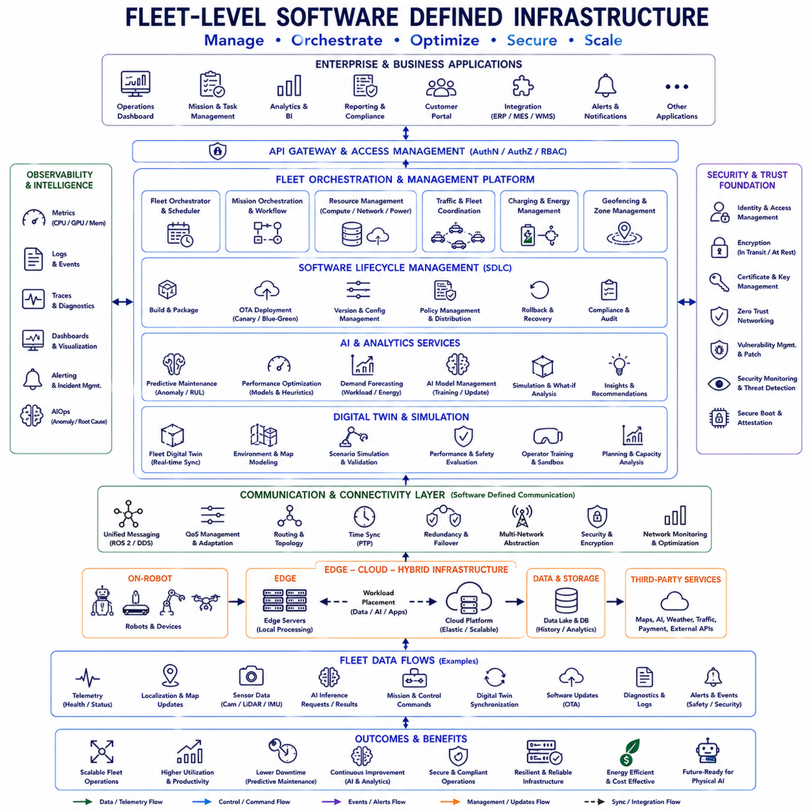{width="7.268055555555556in" height="7.268055555555556in"}

The rapid advancement of autonomous robotics has transformed the operational focus from individual intelligent robots toward coordinated robotic ecosystems composed of hundreds or even thousands of interconnected autonomous systems. Traditional robotic deployments treated each robot as an independent machine configured, managed, updated, monitored, and maintained individually. While this approach was adequate for small-scale installations, it becomes increasingly inefficient as organizations deploy large robotic fleets operating across warehouses, manufacturing facilities, hospitals, airports, agricultural fields, logistics centers, ports, campuses, and smart cities. Fleet-Level Software Defined Infrastructure represents the architectural evolution required to manage these distributed robotic ecosystems as unified software platforms rather than collections of isolated hardware devices. Through centralized orchestration, cloud-native services, distributed intelligence, policy-driven automation, software-defined networking, digital twins, artificial intelligence, and continuous lifecycle management, Fleet-Level Software Defined Infrastructure enables scalable, resilient, secure, and continuously evolving robotic operations suitable for future Physical AI environments.

The traditional fleet management model primarily focused on task scheduling, traffic control, battery monitoring, and robot status reporting. Although these functions remain important, modern Software Defined Robotics requires considerably broader infrastructure capabilities. Every robot continuously evolves through software updates, artificial intelligence improvements, cybersecurity patches, operational policy refinement, digital twin synchronization, runtime configuration changes, hardware abstraction, communication optimization, and collaborative intelligence. Fleet infrastructure therefore extends beyond operational coordination into comprehensive software lifecycle governance encompassing deployment, orchestration, monitoring, analytics, optimization, compliance, security, resilience, and intelligent resource management across globally distributed robotic platforms.

The fundamental philosophy of Fleet-Level Software Defined Infrastructure is that software, rather than hardware, defines operational capability. Individual robots become standardized computational platforms while software dynamically determines behavior, intelligence, communication, safety, mission execution, collaboration, and resource utilization. Hardware diversity remains supported through standardized abstraction layers, enabling heterogeneous robotic platforms to participate within common operational ecosystems regardless of manufacturer, processor architecture, sensor configuration, actuator implementation, communication technology, or deployment environment. This architectural decoupling dramatically improves scalability while reducing long-term operational complexity.

Fleet infrastructure is typically organized into multiple hierarchical layers. The physical layer consists of robots, sensors, embedded controllers, charging stations, communication gateways, industrial automation systems, edge servers, and cloud infrastructure. Above the physical layer, hardware abstraction provides standardized interfaces independent of specific device implementations. Middleware coordinates communication, service discovery, distributed messaging, diagnostics, lifecycle management, and interoperability. Fleet orchestration subsequently manages mission scheduling, traffic optimization, software deployment, artificial intelligence distribution, digital twins, cybersecurity, predictive maintenance, operational analytics, and organizational policy enforcement. Business applications finally interact with fleet services through standardized application programming interfaces supporting enterprise integration, customer workflows, operational dashboards, reporting, and decision support.

Centralized orchestration represents one of the defining characteristics of Fleet-Level Software Defined Infrastructure. Rather than configuring individual robots manually, fleet orchestration platforms maintain comprehensive awareness regarding robot status, mission progress, computational resources, communication quality, battery conditions, software versions, artificial intelligence models, geographical location, operational health, environmental context, maintenance schedules, and organizational priorities. Orchestration engines continuously allocate resources while balancing productivity, safety, energy consumption, computational demand, and operational objectives throughout the entire robotic ecosystem.

Mission orchestration extends considerably beyond simple task assignment. Complex robotic operations frequently require collaborative execution involving multiple autonomous vehicles, robotic manipulators, inspection systems, drones, edge computing resources, artificial intelligence services, and enterprise software systems. Fleet orchestration decomposes business objectives into coordinated subtasks, schedules execution according to resource availability, synchronizes collaborative activities, manages interdependencies, supervises execution progress, reallocates resources dynamically, and adapts operational plans continuously in response to environmental changes or unexpected events.

Resource management becomes significantly more sophisticated within large robotic ecosystems because computational resources extend beyond individual robots. Modern fleets utilize onboard processors, graphics processing units, neural accelerators, programmable logic devices, nearby edge servers, centralized cloud infrastructure, digital twin platforms, communication gateways, and distributed storage systems simultaneously. Fleet-Level Software Defined Infrastructure continuously evaluates computational demand, communication latency, processor utilization, battery availability, artificial intelligence workload, and operational urgency before allocating resources dynamically across heterogeneous computing environments.

Software-defined resource allocation enables infrastructure to respond intelligently to changing operational conditions. Artificial intelligence inference may execute onboard robots during network interruptions while migrating toward edge servers under favorable communication conditions. Digital twins synchronize with cloud platforms whenever bandwidth becomes available. High-priority inspection missions temporarily reserve graphics processing resources while routine monitoring tasks utilize lower-power computational alternatives. Runtime orchestration therefore maximizes overall system efficiency while preserving deterministic operation for safety-critical activities.

Communication infrastructure constitutes another foundational element of fleet-level architecture. Autonomous robots continuously exchange telemetry, localization updates, sensor observations, navigation plans, mission coordination messages, artificial intelligence inference requests, digital twin synchronization data, diagnostics, software deployment packages, cybersecurity events, maintenance information, and operational policies. Fleet-Level Software Defined Infrastructure abstracts underlying communication technologies including Ethernet, Wi-Fi, private cellular networks, Time-Sensitive Networking, industrial wireless systems, satellite communication, and edge gateways through standardized software-defined communication services supporting adaptive routing, quality-of-service management, redundancy, encryption, and fault tolerance.

Fleet-wide Quality-of-Service management becomes particularly important because communication priorities vary substantially among robotic workloads. Safety-critical commands require deterministic low-latency communication. Video streams prioritize bandwidth efficiency. Software deployment tolerates delayed delivery. Artificial intelligence synchronization may execute opportunistically according to network utilization. Fleet infrastructure continuously adjusts communication policies dynamically according to mission priority, network congestion, battery status, geographical distribution, processor availability, and operational objectives, ensuring communication resources remain aligned with business priorities.

Digital twins fundamentally transform fleet management by creating synchronized virtual representations of every robot, charging station, communication device, operational environment, and supporting infrastructure. Digital twins continuously receive telemetry describing localization, actuator status, battery performance, environmental observations, computational resource utilization, artificial intelligence confidence, communication quality, software versions, maintenance history, and operational events. Virtual infrastructure enables predictive analysis, software validation, performance optimization, maintenance planning, incident investigation, operator training, and scenario simulation before modifications affect physical operations.

Simulation complements digital twins by supporting fleet-scale operational evaluation. Thousands of autonomous robots may execute collaborative missions within realistic virtual environments reproducing warehouses, factories, hospitals, airports, logistics centers, agricultural fields, ports, campuses, or smart cities. Engineers evaluate traffic management, communication scalability, computational resource allocation, battery consumption, artificial intelligence behavior, software updates, emergency procedures, and cybersecurity resilience under diverse operational scenarios. Fleet simulation therefore reduces deployment risk while accelerating continuous software evolution.

Artificial intelligence becomes increasingly important throughout fleet infrastructure rather than remaining confined to individual robots. Machine learning analyzes operational telemetry, predicts battery degradation, forecasts maintenance requirements, optimizes traffic patterns, recommends charging schedules, allocates computational resources, detects communication anomalies, identifies cybersecurity threats, predicts mission completion times, and continuously improves fleet-wide operational efficiency. Artificial intelligence therefore evolves into the central optimization engine governing distributed robotic ecosystems.

Predictive maintenance illustrates the advantages of fleet-level intelligence. Rather than servicing robots according to fixed maintenance schedules, fleet infrastructure continuously analyzes motor vibration, battery health, actuator performance, communication reliability, processor temperatures, sensor calibration, artificial intelligence confidence, operational history, and diagnostic events. Machine learning predicts component degradation before failures occur, enabling maintenance during planned operational windows while minimizing unexpected downtime.

Fleet-wide software lifecycle management constitutes another defining capability of Software Defined Infrastructure. Operating systems, firmware, middleware, artificial intelligence models, application software, cybersecurity patches, configuration files, communication policies, and digital twin definitions evolve continuously throughout operational lifecycles. Over-the-Air deployment platforms distribute software securely using staged rollout strategies, canary deployment, blue-green deployment, runtime validation, rollback mechanisms, telemetry analysis, and compliance verification. Software evolution therefore becomes continuous rather than episodic.

Configuration management extends software lifecycle governance beyond executable code. Operational policies controlling navigation behavior, obstacle avoidance, communication bandwidth, battery charging thresholds, artificial intelligence confidence levels, cybersecurity requirements, localization parameters, traffic rules, safety policies, and collaborative workflows may be updated dynamically across entire fleets without modifying application software. Policy-driven infrastructure significantly improves operational flexibility while maintaining organizational consistency.

Cybersecurity becomes increasingly complex because fleet infrastructure interconnects robots, cloud platforms, edge computing resources, industrial automation systems, enterprise information systems, digital twins, mobile operators, maintenance personnel, and external service providers. Fleet-Level Software Defined Infrastructure therefore integrates authentication, authorization, encryption, certificate management, secure boot, software attestation, hardware roots of trust, vulnerability management, intrusion detection, zero-trust networking, runtime integrity monitoring, and security policy orchestration consistently across every infrastructure component. Centralized governance substantially improves cybersecurity visibility while reducing operational risk.

Identity management provides secure authentication for robots, operators, edge servers, cloud services, digital twins, artificial intelligence modules, software packages, and communication endpoints. Every infrastructure component maintains cryptographically verifiable identities supporting secure communication, software deployment, access control, auditability, and regulatory compliance throughout globally distributed robotic ecosystems.

Observability forms the operational intelligence foundation supporting fleet infrastructure. Standardized telemetry continuously collects processor utilization, graphics processing workload, battery health, actuator diagnostics, communication latency, localization accuracy, sensor integrity, artificial intelligence confidence, mission progress, software deployment status, cybersecurity events, maintenance indicators, environmental observations, and operator interactions. Logs, metrics, distributed traces, dashboards, alerts, and predictive analytics collectively provide comprehensive visibility across every infrastructure component.

Operational analytics transform raw telemetry into actionable organizational knowledge. Historical mission execution, battery utilization, communication quality, software deployment success, maintenance activities, charging behavior, traffic congestion, artificial intelligence performance, safety incidents, and environmental conditions collectively identify optimization opportunities supporting continuous operational improvement. Business intelligence therefore becomes tightly integrated with robotic infrastructure management.

Fleet resilience depends upon distributed redundancy rather than individual hardware reliability alone. Robots dynamically assume responsibilities previously assigned to failed units. Communication routes automatically reroute around infrastructure outages. Edge servers provide localized operation during cloud interruptions. Distributed software repositories support autonomous recovery following network partitions. Battery-aware mission scheduling compensates for charging infrastructure failures. Graceful degradation therefore replaces catastrophic operational disruption throughout large-scale robotic ecosystems.

Load balancing represents another critical fleet capability. Computational workloads, communication traffic, charging demand, mission assignments, artificial intelligence inference requests, storage utilization, and software deployment activities distribute dynamically according to resource availability. Infrastructure continuously redistributes workloads preventing localized bottlenecks while maximizing overall fleet productivity. Intelligent balancing significantly improves scalability as fleet size increases from tens toward thousands of autonomous systems.

Energy optimization increasingly influences fleet infrastructure because battery-powered robots operate within constrained energy budgets. Fleet orchestration coordinates charging schedules, computational allocation, communication intensity, mission priorities, artificial intelligence processing, edge offloading, and transportation routes according to battery availability and charging infrastructure capacity. Coordinated energy management substantially increases operational availability while reducing infrastructure costs.

Functional safety extends naturally into fleet-level orchestration. Individual robots maintain deterministic local safety systems while centralized infrastructure coordinates collaborative safety policies including traffic management, restricted zones, emergency response, collision avoidance among multiple robots, evacuation procedures, operator notifications, and infrastructure shutdown coordination. Fleet-wide safety therefore combines local deterministic protection with distributed situational awareness.

Compliance management becomes increasingly important because global robotic fleets frequently operate across multiple regulatory jurisdictions. Fleet infrastructure centrally manages software certification, operational policies, cybersecurity controls, safety documentation, audit records, software provenance, artificial intelligence governance, and maintenance traceability supporting regulatory compliance throughout distributed deployments. Policy-driven governance enables organizations to adapt rapidly as international regulations evolve.

Cloud-native architecture fundamentally shapes Fleet-Level Software Defined Infrastructure. Microservices, containers, orchestration platforms, service meshes, distributed databases, event-driven architectures, serverless computing, and declarative infrastructure management collectively provide scalable software foundations supporting continuous evolution. Infrastructure components remain independently deployable while communicating through standardized software-defined interfaces. Cloud-native engineering therefore dramatically improves maintainability, scalability, resilience, and deployment agility.

Edge computing complements centralized cloud infrastructure by executing latency-sensitive workloads near operational environments. Artificial intelligence inference, digital twin synchronization, communication gateways, local mission coordination, predictive maintenance, and temporary data storage operate at edge locations while cloud platforms perform long-term analytics, global optimization, software lifecycle governance, enterprise integration, and historical data management. Fleet infrastructure dynamically balances workloads across edge and cloud according to operational requirements.

Future Fleet-Level Software Defined Infrastructure will increasingly evolve toward autonomous infrastructure management. Artificial intelligence will continuously optimize resource allocation, software deployment, communication topology, cybersecurity posture, digital twin synchronization, charging coordination, maintenance planning, traffic management, and collaborative mission execution without human intervention. Infrastructure itself will become adaptive, predictive, self-healing, self-optimizing, and context-aware while supporting continuously evolving Software Defined Robotics operating across global Physical AI ecosystems.

Ultimately, Fleet-Level Software Defined Infrastructure establishes the operational backbone supporting next-generation autonomous robotic ecosystems. By integrating software-defined resource management, centralized orchestration, digital twins, cloud-native architecture, edge computing, distributed artificial intelligence, adaptive communication, Over-the-Air software lifecycle management, observability, cybersecurity, predictive maintenance, collaborative mission coordination, policy-driven governance, and continuous optimization into one unified architectural framework, robotic fleets evolve from collections of independent machines into intelligent distributed software platforms capable of scalable, resilient, secure, and continuously adaptive operation throughout future industrial, commercial, public, and Physical AI environments.

플릿 수준 소프트웨어 정의 인프라(Fleet-Level Software Defined Infrastructure)는 개별 로봇을 독립적으로 운영하던 기존 방식에서 벗어나 수백\~수천 대의 자율주행 로봇(Autonomous Robot)을 하나의 통합 소프트웨어 플랫폼으로 관리하는 차세대 아키텍처이다. 기존에는 각 로봇을 개별적으로 설정(Configuration), 업데이트(Update), 유지보수(Maintenance)해야 했지만, 소프트웨어 정의 인프라는 중앙에서 전체 플릿(Fleet)을 통합 관리하여 운영 효율성과 확장성을 크게 향상시킨다.

기존 플릿 관리(Fleet Management)는 작업 할당(Task Scheduling), 교통 제어(Traffic Control), 배터리 관리(Battery Monitoring), 상태 모니터링(Status Monitoring)에 집중하였다. 그러나 현대의 소프트웨어 정의 로봇(Software Defined Robot, SDR)은 AI 모델(AI Model), OTA(Over-the-Air), 디지털 트윈(Digital Twin), 사이버 보안(Cybersecurity), 정책 기반 운영(Policy-Driven Operation), 런타임(Runtime) 재구성까지 지속적으로 변화하므로 훨씬 더 복합적인 인프라가 요구된다.

플릿 수준 소프트웨어 정의 인프라의 핵심 철학은 "하드웨어(Hardware)가 아니라 소프트웨어(Software)가 로봇의 기능을 결정한다."는 것이다. 개별 로봇은 표준화된 하드웨어 플랫폼으로 유지하고, AI, 내비게이션(Navigation), 통신(Communication), 안전(Safety), 임무 수행(Mission Execution)은 모두 소프트웨어를 통해 정의하고 변경한다. 따라서 서로 다른 제조사의 로봇도 동일한 플랫폼에서 함께 운영할 수 있다.

플릿 인프라는 일반적으로 계층형(Layered) 구조를 가진다. 가장 아래에는 로봇, 센서(Sensor), 충전기(Charging Station), 엣지 서버(Edge Server), 클라우드(Cloud)가 위치한다. 그 위에는 하드웨어 추상화(Hardware Abstraction), 미들웨어(Middleware), 통신 계층(Communication Layer), 플릿 오케스트레이션(Fleet Orchestration), AI 서비스(AI Service), 비즈니스 애플리케이션(Business Application)이 순차적으로 구성되어 하나의 통합 플랫폼을 형성한다.

중앙 오케스트레이션(Centralized Orchestration)은 플릿 수준 인프라의 핵심이다. 중앙 시스템은 모든 로봇의 위치(Position), 배터리(Battery), 임무(Mission), AI 모델, 소프트웨어 버전(Software Version), 네트워크(Network), 유지보수 상태를 실시간으로 파악한다. 이를 기반으로 가장 적절한 로봇을 선택하여 작업을 배정하고, 전체 플릿의 생산성과 안전성을 동시에 최적화한다.

미션 오케스트레이션(Mission Orchestration)은 단순한 작업 분배를 넘어선다. 하나의 업무를 여러 개의 하위 작업(Subtask)으로 분해하고, 여러 대의 AMR(Autonomous Mobile Robot), 로봇팔(Robot Arm), 드론(Drone), AI 서버가 동시에 협업하도록 조정한다. 또한 작업 진행 상황을 지속적으로 감시하면서 환경 변화에 따라 계획을 자동으로 수정한다.

자원 관리(Resource Management)는 개별 로봇을 넘어 전체 시스템의 CPU(Central Processing Unit), GPU(Graphics Processing Unit), NPU(Neural Processing Unit), FPGA(Field Programmable Gate Array), 엣지 서버, 클라우드 자원을 하나의 컴퓨팅 풀(Computing Pool)처럼 운영한다. 시스템은 연산 부하, 배터리, 네트워크 상태를 고려하여 작업을 가장 적합한 장치에 자동으로 배치한다.

소프트웨어 정의 자원 할당(Software Defined Resource Allocation)은 환경 변화에 따라 AI 추론(Inference)과 데이터 처리를 자동으로 이동시키는 기술이다. 네트워크가 불안정하면 AI를 로봇 내부에서 실행하고, 통신 상태가 양호하면 엣지 서버나 클라우드에서 수행한다. 이를 통해 성능과 전력 효율(Energy Efficiency)을 동시에 확보할 수 있다.

플릿 수준 통신 인프라(Communication Infrastructure)는 모든 로봇이 지속적으로 데이터를 교환할 수 있도록 지원한다. 위치 정보(Localization), 센서 데이터(Sensor Data), AI 결과, 소프트웨어 업데이트, 디지털 트윈 동기화, 유지보수 정보(Maintenance Data)를 Ethernet, Wi-Fi, Private 5G, TSN(Time-Sensitive Networking) 등을 통해 안전하고 효율적으로 전달한다.

QoS(Quality of Service)는 플릿 통신에서도 매우 중요하다. 모터 제어 명령은 낮은 지연(Low Latency)이 필요하지만, 영상(Video) 데이터는 높은 대역폭(Bandwidth)이 요구된다. OTA 패키지는 즉시 전송될 필요가 없으며, AI 모델은 상황에 따라 전송 시점을 조정할 수 있다. 플릿 인프라는 이러한 요구사항을 자동으로 분석하여 통신 우선순위를 조정한다.

디지털 트윈(Digital Twin)은 플릿 수준 관리의 핵심 기술이다. 모든 로봇과 충전기, 통신 장비, 작업 환경을 가상 공간에 동일하게 복제하여 실시간으로 동기화한다. 이를 통해 성능 분석, 장애 예측(Failure Prediction), 유지보수 계획, 소프트웨어 검증, 작업 최적화를 실제 환경에 적용하기 전에 미리 수행할 수 있다.

시뮬레이션(Simulation)은 플릿 전체를 대상으로 수행된다. 수천 대의 로봇이 동시에 물류창고(Warehouse), 병원(Hospital), 공장(Factory), 공항(Airport), 스마트시티(Smart City) 환경에서 작업하는 상황을 가상으로 실행하여 교통 흐름(Traffic Flow), AI 성능, 배터리 소비, 통신 품질을 분석하고 운영 정책을 최적화한다.

AI는 개별 로봇뿐 아니라 플릿 전체를 최적화하는 역할을 수행한다. AI는 교통 흐름을 분석하고, 충전 계획(Charging Schedule)을 수립하며, 유지보수 시기를 예측하고, 통신(Network)을 최적화하며, AI 모델의 성능을 지속적으로 개선한다. 결과적으로 AI는 플릿 전체의 운영 효율을 향상시키는 중앙 최적화 엔진(Central Optimization Engine)이 된다.

예지 보전(Predictive Maintenance)은 플릿 AI의 대표적인 활용 사례이다. 모터 진동(Vibration), 배터리 열화(Battery Degradation), 센서 상태, 통신 품질, CPU와 GPU 온도, AI 신뢰도(Confidence)를 지속적으로 분석하여 고장을 미리 예측한다. 이를 통해 갑작스러운 장애를 줄이고 계획된 유지보수를 수행할 수 있다.

플릿 수준 소프트웨어 생명주기 관리(Software Lifecycle Management)는 운영체제(OS), 펌웨어(Firmware), ROS 2, AI 모델, 애플리케이션(Application), 보안 패치(Security Patch)를 전체 플릿에 자동으로 배포한다. OTA(Over-the-Air), 카나리 배포(Canary Deployment), 블루-그린 배포(Blue-Green Deployment), 자동 롤백(Rollback)을 통해 안정적인 업데이트를 수행한다.

설정 관리(Configuration Management)는 실행 파일을 변경하지 않고도 운영 정책을 수정하는 기능이다. 최대 속도(Maximum Speed), 장애물 회피(Obstacle Avoidance), AI 신뢰도, 통신 대역폭, 충전 정책, 교통 규칙(Traffic Rule)을 중앙에서 변경하면 전체 플릿에 즉시 반영할 수 있다.

사이버 보안(Cybersecurity)은 플릿 수준에서 더욱 중요하다. 로봇, 엣지 서버, 클라우드, 운영자, 디지털 트윈이 모두 연결되어 있기 때문에 인증(Authentication), 권한 관리(Authorization), 암호화(Encryption), 인증서(Certificate), 보안 부팅(Secure Boot), Zero Trust Network를 통합적으로 적용하여 전체 시스템을 보호한다.

신원 관리(Identity Management)는 모든 구성 요소의 신뢰성을 보장한다. 각 로봇, 운영자, 서버, AI 서비스, 소프트웨어 패키지는 고유한 디지털 신원(Digital Identity)을 가지며, 이를 기반으로 안전한 통신과 소프트웨어 배포를 수행한다.

관측성(Observability)은 플릿 운영의 핵심 기능이다. CPU, GPU, 메모리(Memory), 배터리, AI 정확도, 위치 오차(Localization Error), 네트워크 품질, 안전 이벤트(Safety Event), 소프트웨어 상태를 지속적으로 수집하여 대시보드(Dashboard)와 분석 시스템에 제공한다. 이를 통해 운영자는 전체 플릿의 상태를 실시간으로 파악할 수 있다.

운영 분석(Operational Analytics)은 축적된 데이터를 활용하여 시스템을 지속적으로 개선한다. 작업 수행 시간(Mission Time), 충전 패턴, 통신 품질, AI 성능, 유지보수 기록을 분석하여 병목 구간(Bottleneck), 에너지 낭비, 장애 원인을 찾아내고 운영 정책을 최적화한다.

플릿 복원력(Fleet Resilience)은 일부 로봇이 고장 나더라도 전체 시스템이 계속 동작하도록 만드는 기술이다. 고장 난 로봇의 작업은 다른 로봇이 자동으로 이어받고, 통신 장애가 발생하면 다른 네트워크로 자동 전환하며, 클라우드 장애 시에는 엣지 서버가 대신 서비스를 제공한다. 이를 통해 전체 운영은 지속적으로 유지된다.

부하 분산(Load Balancing)은 CPU, GPU, 네트워크, 충전기, AI 서버의 부하를 균등하게 분산시키는 기술이다. 특정 서버나 로봇에 작업이 집중되지 않도록 전체 자원을 균형 있게 활용하여 시스템 성능과 확장성을 향상시킨다.

에너지 최적화(Energy Optimization)는 플릿 수준에서 매우 중요하다. 충전기 사용 시간, 배터리 잔량, 임무 우선순위, AI 연산 부하를 종합적으로 고려하여 충전 일정을 자동으로 조정하고, 일부 연산을 엣지 서버로 이동시켜 전체 운영 시간을 최대화한다.

기능 안전(Function Safety)은 플릿 수준에서도 유지된다. 각 로봇은 자체적인 긴급 정지(Emergency Stop)와 충돌 방지(Collision Avoidance)를 수행하고, 중앙 시스템은 교통 관리(Traffic Management), 위험 구역(Hazard Zone), 대피(Evacuation), 다중 로봇 충돌 방지를 관리하여 전체 플릿의 안전성을 확보한다.

규정 준수(Compliance Management)는 국제 안전 규격과 보안 규정을 지속적으로 만족시키는 기능이다. 소프트웨어 인증(Certification), AI 거버넌스(AI Governance), 보안 정책(Security Policy), 유지보수 기록을 중앙에서 관리하여 국가와 산업 분야별 규정 변화에도 유연하게 대응할 수 있다.

클라우드 네이티브(Cloud-Native) 아키텍처는 플릿 수준 인프라의 핵심 기반이다. 마이크로서비스(Microservices), 컨테이너(Container), 서비스 메시(Service Mesh), 이벤트 기반(Event-Driven) 구조를 이용하여 독립적으로 배포하고 확장할 수 있으므로 유지보수성과 확장성이 크게 향상된다.

엣지 컴퓨팅(Edge Computing)은 지연 시간이 중요한 작업을 담당한다. AI 추론, 디지털 트윈 동기화, 로컬 플릿 제어(Local Fleet Control)는 엣지 서버에서 수행하고, 장기 데이터 분석과 글로벌 최적화(Global Optimization)는 클라우드에서 수행한다. 시스템은 상황에 따라 작업을 자동으로 분산한다.

미래의 플릿 수준 소프트웨어 정의 인프라는 AI가 스스로 운영하는 자율 인프라(Autonomous Infrastructure)로 발전할 것이다. AI는 자원 할당(Resource Allocation), 소프트웨어 배포, 통신(Network), 충전 계획, 유지보수, 교통 흐름, 사이버 보안까지 자동으로 최적화하며, 사람의 개입 없이 플릿 전체를 지속적으로 개선하는 방향으로 발전할 것이다.

결론적으로 플릿 수준 소프트웨어 정의 인프라(Fleet-Level Software Defined Infrastructure)는 중앙 오케스트레이션(Centralized Orchestration), 소프트웨어 정의 자원 관리(Software Defined Resource Management), 디지털 트윈(Digital Twin), 클라우드-엣지 협업(Cloud-Edge Collaboration), AI 기반 최적화(AI-Driven Optimization), OTA(Over-the-Air), 관측성(Observability), 사이버 보안(Cybersecurity), 예지 보전(Predictive Maintenance), 정책 기반 운영(Policy-Driven Operation)을 하나의 통합 플랫폼으로 결합한 차세대 로봇 운영 인프라이다. 이를 통해 수백\~수천 대의 자율주행 로봇을 하나의 지능형 소프트웨어 시스템처럼 운영할 수 있으며, 미래 물리 AI(Physical AI) 시대의 핵심 기반 기술로 자리잡게 될 것이다.

##  

## 10.10 Certification and Verification for SDR

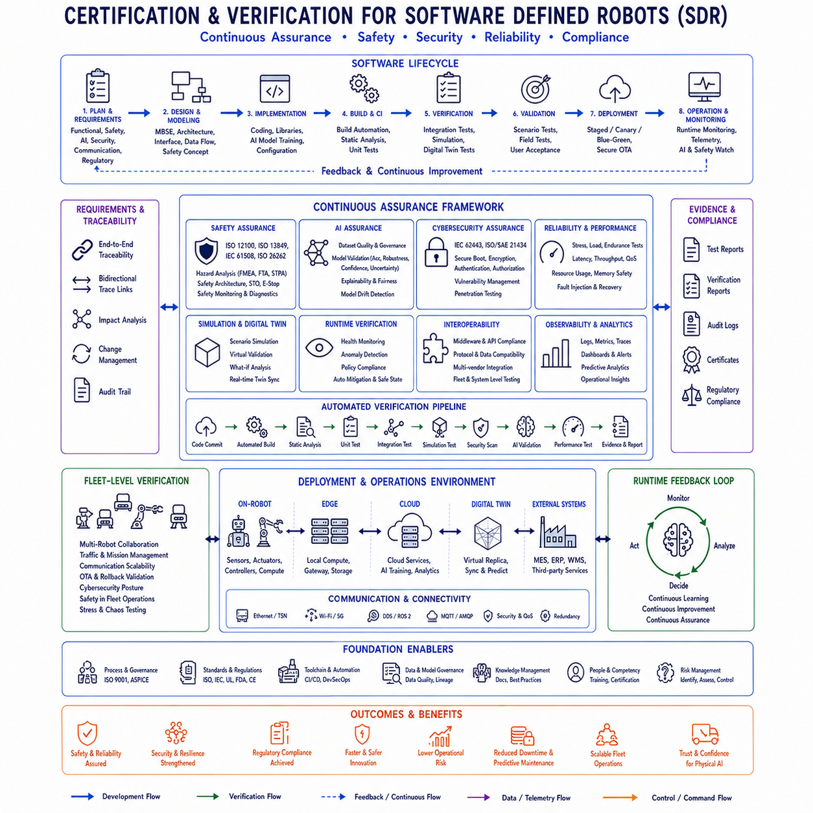{width="7.268055555555556in" height="7.268055555555556in"}

Software Defined Robots (SDRs) represent a fundamental shift in robotics engineering by separating software functionality from hardware implementation and enabling continuous evolution throughout the operational lifetime of robotic systems. Unlike conventional robots, where hardware and software were tightly integrated and changed infrequently, SDRs continuously receive software updates, artificial intelligence improvements, configuration modifications, cybersecurity patches, communication enhancements, digital twin synchronization, and cloud-based optimization. This continuous evolution introduces unprecedented flexibility, but it also creates significant challenges for certification, verification, validation, compliance management, and long-term operational assurance. Traditional certification methodologies assume that certified systems remain largely unchanged after deployment. Software Defined Robotics fundamentally breaks this assumption because operational capabilities continue evolving throughout deployment. Consequently, Certification and Verification for SDRs must transition from one-time approval processes toward continuous assurance frameworks capable of validating safety, reliability, cybersecurity, artificial intelligence behavior, software quality, and regulatory compliance throughout the complete software lifecycle.

Historically, robotic certification focused primarily on hardware reliability, electrical safety, mechanical integrity, electromagnetic compatibility, and deterministic embedded software. Testing occurred during product development, certification bodies evaluated the final system configuration, and approved products entered production with only minor maintenance updates throughout their operational lifetime. Industrial robots, medical devices, aerospace systems, and automotive controllers all followed this relatively static certification philosophy. Although periodic maintenance and firmware updates occurred occasionally, software functionality remained largely stable after regulatory approval.

Software Defined Robotics requires an entirely different certification philosophy because software becomes the primary mechanism defining robot capability. Artificial intelligence models evolve continuously. Navigation algorithms improve through software updates. Cloud services introduce new operational features. Edge computing dynamically reallocates workloads. Fleet management policies change according to operational objectives. Digital twins continuously refine predictive models. Communication infrastructure adapts to changing network environments. Every software update potentially alters robot behavior, requiring verification mechanisms capable of ensuring continuous trustworthiness without interrupting operational evolution.

The fundamental objective of SDR certification is no longer certifying a fixed product but certifying an adaptive software platform capable of evolving safely under controlled governance. Certification therefore shifts from validating individual software releases toward validating software development processes, lifecycle management procedures, runtime monitoring mechanisms, deployment governance, software update policies, verification automation, and operational observability. Instead of asking whether one software version is safe, certification increasingly evaluates whether the complete software ecosystem maintains safety despite continuous evolution.

Continuous Assurance becomes the central architectural principle supporting Software Defined Robotics certification. Rather than performing verification exclusively before deployment, Continuous Assurance integrates verification activities throughout software development, continuous integration, simulation, digital twin evaluation, runtime monitoring, fleet operation, predictive analytics, and software evolution. Every software modification triggers automated verification pipelines ensuring safety, reliability, cybersecurity, performance, interoperability, and compliance remain within certified operational boundaries before deployment proceeds toward production systems.

Software lifecycle governance forms the organizational foundation supporting certification. Source code management, software version control, configuration management, dependency tracking, artifact signing, software provenance, reproducible builds, automated testing, deployment authorization, rollback procedures, audit logging, and operational telemetry collectively provide traceability throughout the entire software lifecycle. Every executable component, artificial intelligence model, firmware image, configuration file, communication policy, and deployment package maintains complete historical records documenting creation, verification, approval, deployment, operational performance, modification history, and retirement. Traceability therefore becomes essential for regulatory compliance, incident investigation, and long-term software governance.

Verification and Validation remain complementary but distinct engineering activities. Verification answers whether software has been built correctly according to specifications, architectural requirements, coding standards, safety constraints, cybersecurity policies, and software quality objectives. Validation evaluates whether the completed robotic system satisfies operational expectations, customer requirements, environmental constraints, mission objectives, and real-world usability. Software Defined Robotics requires continuous execution of both verification and validation because operational behavior evolves throughout deployment.

Requirements traceability becomes considerably more important within Software Defined Robotics because software continuously changes over time. Functional requirements, safety requirements, communication requirements, cybersecurity requirements, artificial intelligence requirements, operational constraints, regulatory obligations, and business objectives establish traceability relationships extending through software architecture, implementation, automated tests, simulation scenarios, digital twins, deployment pipelines, runtime monitoring, operational telemetry, maintenance activities, and certification evidence. Comprehensive traceability enables regulators, engineers, auditors, and operators to demonstrate that every operational capability remains linked to verified engineering requirements.

Model-Based Systems Engineering substantially improves certification efficiency by establishing formal engineering models representing functional architecture, hardware topology, software structure, communication flows, safety mechanisms, timing behavior, artificial intelligence pipelines, operational policies, and deployment infrastructure. System models enable consistency analysis, impact assessment, automated documentation, simulation, requirement verification, and digital certification evidence throughout software evolution. Changes introduced into architectural models automatically propagate throughout engineering documentation, reducing certification complexity while improving design consistency.

Simulation represents one of the most powerful verification technologies supporting Software Defined Robotics. Autonomous navigation, artificial intelligence behavior, communication scalability, battery management, fleet coordination, collaborative robotics, obstacle avoidance, emergency procedures, cybersecurity incidents, sensor failures, environmental variation, and operational anomalies can all be evaluated safely within virtual environments before software reaches physical robots. Large-scale simulation dramatically increases testing coverage while reducing operational risk and development cost.

Digital Twins extend simulation by maintaining synchronized virtual representations of deployed robotic systems. Unlike conventional offline simulation, Digital Twins continuously receive telemetry describing sensor observations, localization accuracy, battery health, actuator performance, communication latency, processor utilization, artificial intelligence confidence, maintenance history, software versions, environmental conditions, and operational events. Candidate software updates execute within Digital Twins under realistic operational conditions before deployment toward physical fleets. Continuous synchronization therefore transforms verification into an operational capability rather than an isolated engineering activity.

Artificial Intelligence introduces entirely new verification challenges because machine learning systems behave probabilistically rather than deterministically. Classical software verification relies upon predictable program execution where identical inputs always produce identical outputs. Neural networks instead generate statistical predictions influenced by training datasets, environmental conditions, sensor quality, computational precision, and model architecture. Artificial intelligence verification therefore emphasizes robustness, confidence estimation, uncertainty quantification, explainability, adversarial resilience, dataset representativeness, model drift detection, fairness analysis, and continuous operational monitoring rather than deterministic correctness alone.

AI model validation begins during dataset preparation. Training datasets require comprehensive quality evaluation addressing completeness, diversity, representativeness, labeling accuracy, environmental coverage, operational relevance, bias detection, and statistical balance. Poor dataset quality directly compromises operational safety regardless of model architecture. Continuous dataset governance therefore becomes an integral component of Software Defined Robotics certification.

Artificial Intelligence models further require independent verification following training. Accuracy, precision, recall, robustness, latency, computational efficiency, confidence calibration, uncertainty estimation, explainability, resilience against adversarial inputs, and environmental adaptability all require systematic evaluation before deployment. Benchmark datasets alone remain insufficient because operational environments continuously evolve. Runtime monitoring therefore complements offline evaluation by continuously measuring artificial intelligence behavior throughout deployment.

Runtime Verification introduces another defining capability of Software Defined Robotics certification. Traditional verification concluded before product deployment. Software Defined Robots instead execute continuous runtime supervision evaluating software health, processor utilization, communication integrity, memory allocation, safety constraints, actuator behavior, localization accuracy, cybersecurity status, artificial intelligence confidence, operational policies, and mission execution. Runtime monitors detect deviations from certified operational boundaries while triggering mitigation strategies including graceful degradation, safe stopping, workload redistribution, rollback, or operator notification whenever anomalies appear.

Safety certification remains one of the highest priorities throughout Software Defined Robotics. Functional safety architectures isolate deterministic safety controllers from adaptive artificial intelligence and cloud-based software components. Emergency stopping, collision avoidance, actuator limitation, safety monitoring, redundant sensing, hardware supervision, watchdog timers, and safe torque control continue operating independently from application software. Safety certification therefore validates architectural separation ensuring software evolution cannot compromise deterministic protective mechanisms.

Hazard analysis evolves continuously alongside software. Hazard Identification, Failure Mode and Effects Analysis, Fault Tree Analysis, System-Theoretic Process Analysis, cybersecurity threat modeling, artificial intelligence risk assessment, communication failure analysis, and operational scenario evaluation execute repeatedly throughout software evolution. Continuous hazard assessment ensures emerging software capabilities remain consistent with certified safety objectives despite changing operational environments.

Cybersecurity certification has become inseparable from safety certification because cyber attacks increasingly produce direct physical consequences. Secure boot, encrypted communication, software signing, hardware roots of trust, certificate management, vulnerability assessment, penetration testing, runtime integrity verification, intrusion detection, authentication, authorization, secure software updates, and zero-trust networking collectively establish cybersecurity assurance throughout robotic lifecycles. Continuous vulnerability management replaces periodic security evaluation because threats evolve continuously alongside software.

Communication verification ensures robotic software maintains reliable operation despite distributed computational environments. Middleware interoperability, Quality-of-Service behavior, deterministic networking, communication redundancy, synchronization accuracy, packet integrity, latency guarantees, bandwidth management, network resilience, and distributed service discovery require systematic validation throughout software evolution. Communication infrastructure therefore becomes a certifiable software subsystem rather than merely physical networking hardware.

Interoperability testing becomes increasingly important because Software Defined Robotics integrates heterogeneous processors, operating systems, middleware frameworks, communication technologies, cloud services, edge infrastructure, industrial automation platforms, enterprise applications, and third-party artificial intelligence services. Verification evaluates interface compatibility, protocol compliance, semantic consistency, data integrity, synchronization behavior, software version compatibility, and distributed system resilience across heterogeneous ecosystems. Standardized interfaces significantly simplify interoperability certification while supporting long-term architectural flexibility.

Software quality assurance continues serving as a fundamental certification component. Static code analysis, coding standard compliance, architectural consistency verification, dependency management, software complexity measurement, memory safety evaluation, concurrency analysis, unit testing, integration testing, system testing, regression testing, performance benchmarking, stress testing, reliability analysis, and software maintainability collectively establish engineering quality supporting trustworthy robotic software evolution.

Continuous Integration and Continuous Deployment pipelines automate substantial portions of certification evidence generation. Every software modification automatically triggers source code analysis, unit testing, integration testing, simulation, Digital Twin evaluation, cybersecurity scanning, software packaging, documentation generation, artifact signing, deployment preparation, compliance verification, and audit logging. Automation significantly improves verification consistency while reducing human error throughout large-scale software development.

Operational telemetry transforms deployed robotic fleets into continuous verification environments. Logs, metrics, distributed traces, diagnostics, safety events, artificial intelligence confidence, communication quality, processor utilization, battery performance, actuator behavior, localization accuracy, software deployment history, cybersecurity incidents, environmental conditions, and mission outcomes continuously provide evidence supporting operational assurance. Observability therefore becomes an essential certification capability rather than merely an operational monitoring tool.

Fleet-Level Verification extends certification beyond individual robots toward distributed autonomous ecosystems. Collaborative robotics, traffic management, charging coordination, distributed artificial intelligence, cloud-edge workload allocation, communication scalability, software deployment, emergency response, cybersecurity posture, and operational policy enforcement all require verification across hundreds or thousands of coordinated robotic systems. Fleet verification therefore evaluates emergent system behavior rather than isolated component functionality.

Compliance management ensures Software Defined Robotics remains aligned with evolving regulatory requirements throughout operational lifecycles. Functional safety, machinery directives, medical device regulations, cybersecurity frameworks, artificial intelligence governance, privacy protection, software quality standards, cloud computing regulations, and environmental requirements continuously evolve internationally. Software Defined Infrastructure enables policy-driven adaptation supporting regulatory compliance without requiring hardware redesign.

Evidence management becomes increasingly digital within Software Defined Robotics. Engineering documentation, architectural models, software artifacts, automated test results, simulation reports, Digital Twin analyses, operational telemetry, software deployment history, cybersecurity assessments, compliance records, audit logs, artificial intelligence validation reports, and maintenance activities collectively form continuously updated certification evidence repositories. Digital evidence supports regulatory audits while reducing manual documentation effort.

Certification authorities increasingly recognize that Software Defined Robotics requires adaptive regulatory methodologies rather than conventional product certification. Future certification frameworks will likely emphasize certified engineering processes, continuous software governance, automated verification pipelines, Digital Twin validation, runtime monitoring, operational observability, artificial intelligence oversight, cybersecurity resilience, software provenance, and lifecycle management instead of static software evaluation alone. Regulatory organizations are gradually transitioning toward risk-based certification supporting continuous software evolution while preserving public trust and operational safety.

Future Software Defined Robotics will likely implement Autonomous Verification supported by artificial intelligence. Machine learning systems will continuously analyze software changes, architectural impacts, operational telemetry, simulation outcomes, Digital Twin predictions, cybersecurity posture, safety constraints, regulatory requirements, and deployment risk while automatically generating verification plans, certification evidence, compliance reports, and deployment recommendations. Autonomous verification will substantially accelerate software evolution while maintaining rigorous engineering assurance throughout increasingly complex robotic ecosystems.

Ultimately, Certification and Verification for Software Defined Robots establish the engineering trust framework supporting continuously evolving autonomous systems. By integrating lifecycle governance, continuous assurance, traceability, model-based engineering, simulation, Digital Twins, artificial intelligence validation, runtime verification, cybersecurity certification, functional safety, interoperability testing, observability, automated software pipelines, compliance management, digital evidence, fleet-wide verification, and adaptive regulatory governance into one unified architectural process, Software Defined Robotics becomes capable of evolving continuously without sacrificing safety, reliability, security, regulatory compliance, or public confidence. This transformation from static certification toward continuous operational assurance represents one of the most significant engineering paradigm shifts underlying the future development of trustworthy Physical AI ecosystems.

소프트웨어 정의 로봇(Software Defined Robot, SDR)은 소프트웨어와 하드웨어를 분리하여 로봇의 기능을 지속적으로 진화시키는 차세대 로봇 아키텍처이다. 기존 로봇은 제품 출시 이후 하드웨어와 소프트웨어가 거의 변경되지 않았지만, SDR은 OTA(Over-the-Air), AI 모델(AI Model), 운영 정책(Operational Policy), 사이버 보안(Cybersecurity), 디지털 트윈(Digital Twin) 등을 지속적으로 업데이트한다. 따라서 인증(Certification)과 검증(Verification)도 기존의 일회성 방식에서 지속적인 검증 체계로 변화해야 한다.

기존 인증 방식은 제품 개발이 완료된 후 최종 제품을 시험(Test)하고 인증하는 구조였다. 산업용 로봇, 자동차, 의료기기(Medical Device)는 대부분 이러한 방식을 사용하였다. 그러나 SDR은 운영 중에도 소프트웨어가 지속적으로 변경되므로 출시 시점의 인증만으로는 전체 생명주기(Lifecycle)의 안전성과 신뢰성을 보장할 수 없다.

SDR 인증의 핵심 철학은 고정된 제품(Product)을 인증하는 것이 아니라 지속적으로 진화하는 소프트웨어 플랫폼(Software Platform)을 인증하는 것이다. 즉 특정 버전만 안전한 것이 아니라 업데이트(Update), AI 개선, 설정 변경(Configuration Change), 정책 변경까지 포함한 전체 소프트웨어 운영 체계가 항상 안전하게 유지되는지를 검증하는 것이 중요하다.

지속적 보증(Continuous Assurance)은 SDR 인증의 핵심 개념이다. 기존에는 개발 단계에서만 검증을 수행했지만, SDR은 개발, CI/CD(Continuous Integration/Continuous Deployment), 시뮬레이션(Simulation), 디지털 트윈(Digital Twin), 운영(Runtime), OTA 업데이트 이후까지 지속적으로 검증을 수행한다. 이를 통해 시스템이 항상 인증된 상태를 유지할 수 있다.

소프트웨어 생명주기 관리(Software Lifecycle Management)는 인증의 기반이 된다. 소스 코드(Source Code), AI 모델, 펌웨어(Firmware), 운영체제(OS), 설정(Configuration), 라이브러리(Library), OTA 패키지(Package)는 모두 버전 관리(Version Management)와 변경 이력(Change History)을 유지한다. 모든 변경 사항은 추적 가능성(Traceability)을 확보하여 언제 어떤 이유로 변경되었는지를 명확하게 기록해야 한다.

검증(Verification)과 확인(Validation)은 서로 다른 개념이다. 검증은 설계 요구사항(Requirement)에 맞게 시스템이 정확하게 구현되었는지를 확인하는 과정이며, 확인은 실제 사용 환경에서 사용자의 목적과 운영 요구사항을 만족하는지를 평가하는 과정이다. SDR에서는 이 두 과정이 운영 기간 내내 반복적으로 수행된다.

요구사항 추적성(Requirements Traceability)은 매우 중요하다. 기능 요구사항(Function Requirement), 안전 요구사항(Safety Requirement), AI 요구사항, 보안 요구사항(Security Requirement)은 소프트웨어 구조, 테스트(Test), 시뮬레이션, 디지털 트윈, 운영 데이터까지 모두 연결된다. 이를 통해 특정 기능이 어떤 요구사항을 만족하는지 명확하게 확인할 수 있다.

모델 기반 시스템 엔지니어링(Model-Based Systems Engineering, MBSE)은 인증 효율을 크게 향상시킨다. 시스템 구조(System Architecture), 하드웨어(Hardware), 소프트웨어(Software), 통신(Communication), AI, 안전(Safety)을 모델(Model)로 정의하여 설계 변경 시 관련 문서와 검증 항목이 자동으로 업데이트되도록 지원한다.

시뮬레이션(Simulation)은 SDR 인증에서 매우 중요한 역할을 한다. 자율주행(Autonomous Navigation), AI 추론(Inference), 센서 오류(Sensor Failure), 통신 장애(Network Failure), 충돌(Collision), 긴급 상황(Emergency)을 실제 환경에서 반복적으로 시험하기 어렵기 때문에 가상 환경에서 다양한 조건을 검증한다.

디지털 트윈(Digital Twin)은 시뮬레이션보다 한 단계 발전된 기술이다. 실제 로봇의 센서 데이터, 위치, 배터리 상태(Battery Status), AI 결과, 통신 상태를 지속적으로 반영하여 가상 환경을 실시간으로 동기화한다. 새로운 소프트웨어나 AI 모델은 실제 로봇에 배포하기 전에 디지털 트윈에서 먼저 검증된다.

AI는 기존 소프트웨어와 달리 확률적(Probabilistic)으로 동작하기 때문에 새로운 검증 방법이 필요하다. 동일한 입력이라도 항상 동일한 결과를 보장하지 않으므로 정확도(Accuracy), 신뢰도(Confidence), 불확실성(Uncertainty), 설명 가능성(Explainability), 적대적 공격(Adversarial Attack)에 대한 강건성(Robustness)을 종합적으로 평가해야 한다.

AI 모델 검증(AI Model Validation)은 데이터셋(Dataset) 관리부터 시작된다. 학습 데이터는 다양성(Diversity), 대표성(Representativeness), 정확성(Label Accuracy), 편향(Bias), 환경(Environment) 커버리지를 충분히 확보해야 한다. 데이터 품질이 낮으면 아무리 우수한 AI 모델이라도 안전한 운영을 보장할 수 없다.

AI 모델은 학습 후에도 지속적으로 검증된다. 정확도, 정밀도(Precision), 재현율(Recall), 추론 속도(Inference Latency), 연산 효율성(Computational Efficiency), 환경 적응성(Environment Adaptability)을 평가하며, 운영 중에도 성능을 지속적으로 모니터링하여 모델 드리프트(Model Drift)를 감시한다.

런타임 검증(Runtime Verification)은 SDR의 가장 큰 특징 가운데 하나이다. CPU, GPU, 메모리(Memory), 통신(Network), AI 신뢰도, 센서 상태(Sensor Health), 위치 추정(Localization), 안전 정책(Safety Policy)을 운영 중에도 지속적으로 감시한다. 이상이 발견되면 자동으로 성능 저하 모드(Graceful Degradation), 안전 정지(Safe Stop), 롤백(Rollback), 운영자 알림(Notification)을 수행한다.

기능 안전(Function Safety)은 SDR에서도 가장 중요한 인증 대상이다. 긴급 정지(Emergency Stop), 충돌 방지(Collision Avoidance), 속도 제한(Velocity Limitation), Safe Torque Off(STO), 워치독 타이머(Watchdog Timer)는 AI 및 일반 애플리케이션과 분리된 독립 계층에서 실행되며, 소프트웨어 업데이트와 관계없이 항상 동일한 안전성을 유지해야 한다.

위험 분석(Hazard Analysis)은 지속적으로 수행된다. FMEA(Failure Mode and Effects Analysis), FTA(Fault Tree Analysis), STPA(System-Theoretic Process Analysis), 사이버 보안 위협 분석(Cybersecurity Threat Analysis), AI 위험 평가(AI Risk Assessment)를 반복적으로 수행하여 새로운 소프트웨어가 기존 위험도를 증가시키지 않는지를 검증한다.

사이버 보안 인증(Cybersecurity Certification)은 기능 안전만큼 중요해지고 있다. 보안 부팅(Secure Boot), 암호화(Encryption), 인증(Authentication), 인증서(Certificate), 침입 탐지(Intrusion Detection), 무결성 검증(Integrity Verification), Zero Trust Network는 운영 중에도 지속적으로 검증되어야 하며, 새로운 보안 취약점(Vulnerability)이 발견되면 즉시 대응할 수 있어야 한다.

통신 검증(Communication Verification)은 분산 시스템에서 필수적이다. ROS 2(Robot Operating System 2), DDS(Data Distribution Service), QoS(Quality of Service), TSN(Time-Sensitive Networking), 통신 지연(Latency), 패킷 손실(Packet Loss), 동기화(Time Synchronization)를 지속적으로 시험하여 안정적인 분산 제어를 보장한다.

상호운용성(Interoperability) 검증은 서로 다른 제조사의 장비가 함께 동작하는 환경에서 중요하다. 서로 다른 운영체제(OS), 프로세서(Processor), 센서, 통신 프로토콜(Protocol), AI 서비스가 표준 인터페이스(Standard Interface)를 통해 정상적으로 연동되는지를 확인한다.

소프트웨어 품질 보증(Software Quality Assurance)은 인증의 기본이다. 정적 분석(Static Analysis), 단위 시험(Unit Test), 통합 시험(Integration Test), 회귀 시험(Regression Test), 성능 시험(Performance Test), 스트레스 시험(Stress Test), 메모리 검사(Memory Analysis), 코드 품질(Code Quality)을 지속적으로 수행하여 소프트웨어의 신뢰성을 확보한다.

CI/CD(Continuous Integration/Continuous Deployment)는 인증 자동화를 지원한다. 개발자가 코드를 수정하면 자동으로 빌드(Build), 테스트(Test), 시뮬레이션, 디지털 트윈 검증, 보안 검사(Security Scan), 성능 분석(Benchmark), 문서 생성(Document Generation), 서명(Signing), OTA 패키지 생성이 수행되어 인증 자료(Evidence)가 자동으로 축적된다.

운영 데이터(Operational Telemetry)는 지속적인 인증 자료가 된다. 로그(Log), 메트릭(Metric), AI 신뢰도, 배터리 상태, 센서 정확도, 통신 품질, 안전 이벤트(Safety Event), 유지보수 기록을 지속적으로 수집하여 실제 운영 환경에서도 시스템이 인증 조건을 만족하는지를 확인한다.

플릿 수준 검증(Fleet-Level Verification)은 개별 로봇이 아니라 전체 플릿(Fleet)을 대상으로 수행된다. 다중 로봇 협업(Multi-Robot Collaboration), 교통 제어(Traffic Control), 충전 계획(Charging Schedule), AI 공유, OTA 업데이트, 사이버 보안 상태를 통합적으로 검증하여 전체 시스템의 안정성을 보장한다.

규정 준수(Compliance Management)는 국가와 산업 분야의 규정을 지속적으로 만족시키는 기능이다. 기능 안전(Function Safety), 의료 규격(Medical Regulation), AI 거버넌스(AI Governance), 개인정보 보호(Privacy Protection), 클라우드 보안(Cloud Security) 등을 정책 기반(Policy-Driven)으로 관리하여 변화하는 국제 규정에도 유연하게 대응할 수 있다.

디지털 증거 관리(Digital Evidence Management)는 인증 문서를 자동으로 생성하고 관리하는 기술이다. 설계 문서(Design Document), 테스트 결과(Test Report), AI 검증 결과, 시뮬레이션 결과, 운영 데이터, 보안 검사 결과를 지속적으로 저장하여 규제 기관(Regulatory Authority)의 감사(Audit)에 활용할 수 있도록 한다.

미래의 인증 체계는 정적인 제품 인증(Product Certification)에서 지속적인 운영 인증(Continuous Operational Certification)으로 발전할 것이다. 규제 기관은 특정 소프트웨어 버전보다 개발 프로세스(Process), CI/CD, 디지털 트윈, 런타임 모니터링(Runtime Monitoring), AI 관리 체계, 소프트웨어 생명주기 관리 전체를 평가하는 방향으로 변화할 가능성이 높다.

향후에는 AI가 인증 과정까지 지원하는 자율 검증(Autonomous Verification)이 등장할 것이다. AI는 코드 변경 영향(Impact Analysis), 운영 데이터, 시뮬레이션 결과, 디지털 트윈, 보안 상태를 분석하여 자동으로 시험 계획(Test Plan)을 생성하고, 인증 자료를 작성하며, 배포 가능 여부를 판단하는 지능형 인증 시스템으로 발전하게 될 것이다.

결론적으로 소프트웨어 정의 로봇 인증 및 검증(Certification and Verification for SDR)은 소프트웨어 생명주기 관리(Software Lifecycle Management), 지속적 보증(Continuous Assurance), 요구사항 추적성(Requirements Traceability), MBSE(Model-Based Systems Engineering), 시뮬레이션(Simulation), 디지털 트윈(Digital Twin), AI 검증(AI Validation), 런타임 검증(Runtime Verification), 기능 안전(Function Safety), 사이버 보안(Cybersecurity), CI/CD 자동화, 운영 데이터 기반 검증(Operational Telemetry), 플릿 수준 검증(Fleet-Level Verification), 규정 준수(Compliance Management)를 하나의 통합 프레임워크로 결합하는 차세대 인증 체계이다. 이는 지속적으로 진화하는 소프트웨어 정의 로봇과 미래 물리 AI(Physical AI)의 신뢰성, 안전성, 보안성, 규제 적합성을 보장하는 핵심 기반 기술이 될 것이다.
