**Volume 1 Software Architecture Fundamentals**

# 11. Cross-Platform SW Design

## 11.01 Necessity and Scope of Cross-Platform Design

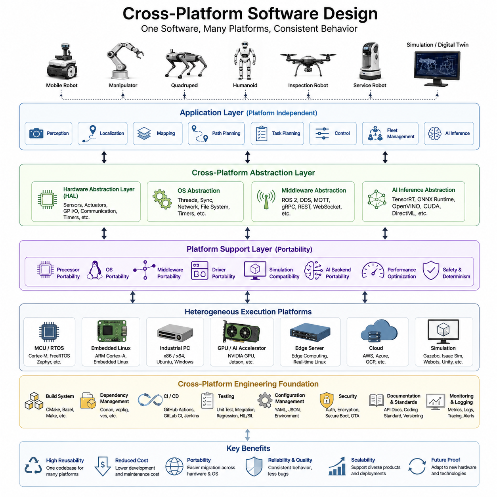{width="7.268055555555556in" height="7.268055555555556in"}

The uploaded library structure places **"23_11_01_Necessity_and_Scope_of_Cross_Platform_Design"** as the opening chapter of **Volume 23 → 23.11 Cross-Platform Software Design**, indicating that this section should establish the motivation, objectives, architectural boundaries, engineering principles, and practical scope for the remaining chapters on HAL, portability, build systems, multi-platform CI/CD, and long-term maintenance.

Cross-platform software design has become one of the most fundamental architectural requirements in modern software engineering, particularly in robotics, autonomous systems, embedded intelligence, and Physical AI. Unlike traditional software that targets a single operating system or processor family, modern robotic software must operate consistently across a diverse collection of hardware platforms, operating systems, middleware frameworks, and computing environments. A single robotic product may include microcontrollers executing hard real-time firmware, embedded Linux computers performing perception, GPU accelerators executing deep learning inference, cloud servers coordinating fleets, and simulation platforms supporting development and verification. These heterogeneous environments must cooperate as one integrated system while maintaining consistent functionality, predictable behavior, and sustainable maintainability throughout the product lifecycle.

Historically, software applications were often tightly coupled to specific hardware platforms. Device drivers, operating system services, communication interfaces, memory management, and processor-specific optimizations were deeply embedded within application logic. Although this approach could maximize performance for a particular platform, it significantly increased development cost whenever new hardware was introduced. Every processor migration required extensive code modifications, retesting, and platform-specific debugging. As organizations expanded their product portfolios, duplicated implementations accumulated rapidly, increasing technical debt and making long-term maintenance increasingly difficult.

The emergence of embedded Linux, standardized middleware, virtualization technologies, containerization, cloud computing, and hardware abstraction techniques fundamentally changed software engineering practices. Modern software architecture increasingly emphasizes platform independence, modular interfaces, reusable components, and clearly separated responsibilities. Rather than embedding platform-specific knowledge throughout an application, developers isolate hardware dependencies within dedicated abstraction layers, allowing business logic, algorithms, and application services to remain largely independent from the underlying execution environment.

In robotics, the need for cross-platform design is even more pronounced because robots inherently integrate heterogeneous computing resources. A single autonomous mobile robot may simultaneously execute motor control on a real-time microcontroller, localization on an embedded ARM processor, perception on an NVIDIA GPU, mission planning on an industrial x86 computer, and fleet coordination within cloud infrastructure. Each computing element differs in processor architecture, operating system, timing characteristics, memory capacity, compiler behavior, communication protocol, and available hardware accelerators. Without careful architectural separation, software complexity grows exponentially as additional hardware configurations are introduced.

Cross-platform software design therefore represents much more than simply compiling identical source code on multiple operating systems. It encompasses architectural strategies that maximize software portability while minimizing platform-specific implementation effort. It defines engineering methodologies that enable consistent functionality across heterogeneous execution environments without sacrificing performance, reliability, safety, or maintainability. Successful cross-platform design balances abstraction with optimization, allowing common software assets to be shared broadly while preserving opportunities for platform-specific performance enhancements where necessary.

The scope of cross-platform design begins with processor portability. Modern embedded systems commonly utilize ARM Cortex-M microcontrollers, ARM Cortex-A application processors, x86 industrial computers, RISC-V processors, digital signal processors, field-programmable gate arrays, and specialized AI accelerators. Each architecture provides unique instruction sets, memory hierarchies, cache organizations, interrupt handling mechanisms, compiler optimizations, and floating-point capabilities. Portable software should isolate processor-specific functionality so that algorithmic logic remains independent of architectural implementation details.

Operating system portability forms another essential dimension of cross-platform engineering. Robotic systems frequently combine FreeRTOS, Zephyr, embedded Linux, PREEMPT_RT Linux, Ubuntu, Windows, Android, QNX, or proprietary real-time operating systems. Every operating system exposes different scheduling models, synchronization primitives, networking APIs, filesystem implementations, timing services, and device management mechanisms. Cross-platform architecture establishes common interfaces that shield higher software layers from these implementation differences while preserving deterministic system behavior.

Middleware portability is equally important. Robotic applications increasingly rely on middleware frameworks such as ROS 2, DDS, MQTT, gRPC, ZeroMQ, REST APIs, WebSocket communication, and proprietary industrial communication protocols. Individual projects may migrate from one middleware technology to another as requirements evolve. Well-designed software isolates communication mechanisms from application behavior, allowing message transport technologies to change without requiring major modifications to planning, perception, localization, or control algorithms.

Hardware abstraction represents one of the central principles supporting cross-platform architecture. Rather than allowing application components to directly manipulate GPIO pins, serial interfaces, cameras, LiDAR devices, inertial sensors, motor controllers, or networking hardware, abstraction layers expose standardized interfaces representing functional capabilities rather than physical implementations. Sensor applications request observations without knowing whether data originates from USB cameras, Ethernet cameras, simulation models, or prerecorded datasets. Motion controllers generate velocity commands without depending on specific motor driver manufacturers. Such abstraction significantly increases software reuse while simplifying testing and hardware replacement.

Cross-platform software design also encompasses development environment independence. Large engineering organizations frequently utilize Windows workstations for desktop development, Linux servers for continuous integration, embedded Linux targets for deployment, and cloud infrastructure for simulation and testing. Source code, build systems, dependency management, automated testing pipelines, and deployment procedures should operate consistently across these environments. Developers should avoid assumptions regarding filesystem layouts, compiler behavior, scripting languages, or platform-specific utilities whenever portable alternatives exist.

Simulation compatibility forms another important aspect of portability. Modern robotics increasingly depends upon digital twins, synthetic data generation, software-in-the-loop simulation, hardware-in-the-loop verification, and physics-based testing. Ideally, identical software modules should execute within simulation environments and physical robots with minimal modification. This capability dramatically accelerates algorithm validation, regression testing, and safety verification while reducing development cost. Cross-platform architecture therefore promotes common interfaces between simulated hardware and physical devices so that higher-level software remains unaware of execution context.

Artificial intelligence introduces additional dimensions to cross-platform engineering. AI models may execute on GPUs, NPUs, CPUs, TPUs, FPGA accelerators, or cloud inference services. Deployment frameworks such as TensorRT, ONNX Runtime, OpenVINO, CUDA, Vulkan Compute, and DirectML provide different optimization opportunities depending on target hardware. A portable AI architecture separates model interfaces from inference implementations, enabling consistent application behavior regardless of execution backend while allowing platform-specific optimization when appropriate.

Performance optimization must coexist with portability rather than opposing it. One common misconception suggests that portable software inevitably sacrifices performance. In reality, effective architecture separates common algorithmic behavior from optimized execution paths. Most application logic remains platform independent, while performance-critical kernels utilize architecture-specific implementations selected during compilation or runtime. This layered optimization strategy allows systems to achieve both portability and computational efficiency without duplicating entire software stacks.

Cross-platform design also plays a major role in software quality assurance. Maintaining multiple independent implementations across different hardware platforms frequently introduces behavioral inconsistencies, undocumented feature divergence, and incompatible bug fixes. Shared codebases significantly reduce these risks because improvements automatically benefit all supported platforms. Unified testing frameworks, automated regression testing, and common validation procedures further ensure consistent functional behavior across heterogeneous environments.

Maintainability represents another primary motivation for adopting cross-platform architecture. Industrial robotic systems often remain operational for ten to twenty years while hardware technologies evolve every few years. Processors become obsolete, operating systems reach end-of-life, communication standards evolve, and AI accelerators improve dramatically. Software that depends heavily upon specific hardware becomes increasingly expensive to maintain over such long product lifecycles. Portable architectures minimize migration costs by isolating platform dependencies within well-defined interfaces that can be updated independently of higher-level application logic.

Scalability also benefits substantially from cross-platform engineering. Organizations rarely develop only one robotic product. Instead, they build families of autonomous mobile robots, manipulators, quadrupeds, humanoids, inspection systems, logistics robots, service robots, and industrial automation platforms. Although these products differ mechanically, they often share localization algorithms, perception pipelines, navigation software, diagnostics, fleet communication, mission management, and AI inference modules. Cross-platform architecture maximizes software reuse across entire product portfolios, reducing engineering effort while improving software consistency.

The scope of cross-platform software extends beyond software portability alone. It also includes standardized configuration management, build automation, package management, dependency isolation, compiler abstraction, continuous integration, deployment pipelines, documentation standards, coding conventions, version compatibility policies, interface evolution strategies, and lifecycle maintenance planning. These engineering disciplines collectively ensure that software remains portable not only technically but also organizationally throughout years of continuous development.

Safety-critical robotics introduces additional requirements for platform-independent architecture. Safety functions should produce equivalent behavior regardless of processor family or operating system. Emergency stop mechanisms, fault monitoring, watchdog supervision, health diagnostics, redundancy management, and recovery procedures require deterministic implementation across all supported platforms. Cross-platform design therefore emphasizes clearly specified interfaces, deterministic timing assumptions, repeatable verification procedures, and traceable safety requirements independent of underlying hardware.

Security considerations further expand the architectural scope. Authentication mechanisms, encrypted communication, secure boot processes, firmware integrity verification, access control, certificate management, and secure software updates should operate consistently across heterogeneous devices. Platform diversity should not create inconsistent security policies or expose weaker implementations on specific hardware targets. Unified security architecture simplifies compliance while reducing attack surfaces across distributed robotic ecosystems.

Another significant objective involves protecting software investments. Research organizations and industrial manufacturers invest enormous resources developing navigation algorithms, perception pipelines, planning systems, control software, and AI models. Hardware platforms inevitably change over time, but core intellectual property should remain reusable across future generations of products. Cross-platform architecture ensures that valuable algorithms survive processor migrations, operating system upgrades, and hardware evolution with minimal redevelopment effort.

Cross-platform engineering also supports collaborative development across geographically distributed teams. Different development groups may specialize in embedded firmware, robotics middleware, cloud infrastructure, artificial intelligence, simulation, safety engineering, or industrial integration. Standardized interfaces allow independent teams to develop components simultaneously while maintaining compatibility through well-defined contracts rather than platform-specific assumptions. This modular organization significantly improves productivity for large-scale software projects.

Successful cross-platform design requires disciplined architectural governance. Engineers must carefully distinguish between stable interfaces and platform-dependent implementations. Abstraction should be introduced only where genuine variability exists, avoiding unnecessary complexity while preserving sufficient flexibility for future evolution. Excessive abstraction can increase maintenance costs, whereas insufficient abstraction creates tight coupling that limits portability. Architectural decisions should therefore be guided by realistic product roadmaps, expected hardware evolution, long-term maintenance requirements, and organizational development capabilities.

From an educational perspective, understanding the necessity and scope of cross-platform software design prepares engineers to construct software ecosystems rather than isolated applications. Future robotic platforms will increasingly combine heterogeneous processors, AI accelerators, distributed cloud services, digital twins, autonomous fleets, and continuously evolving hardware technologies. Engineers who master cross-platform architectural principles can develop reusable software assets that remain functional despite changing technological landscapes, thereby extending product longevity while reducing engineering cost.

Ultimately, cross-platform software design is not merely a technical convenience but a strategic architectural philosophy. It enables software to transcend individual processors, operating systems, hardware vendors, and deployment environments, allowing organizations to focus on innovation rather than repeated platform migration. For robotics, autonomous systems, and Physical AI, cross-platform architecture establishes the foundation upon which scalable, maintainable, portable, secure, and future-ready intelligent systems can be built. As robotic ecosystems continue expanding toward increasingly heterogeneous and distributed computing infrastructures, cross-platform design will remain one of the defining principles of sustainable software architecture and a critical enabler for next-generation intelligent machines.

## 11.02 HAL Design Patterns [w/Code]

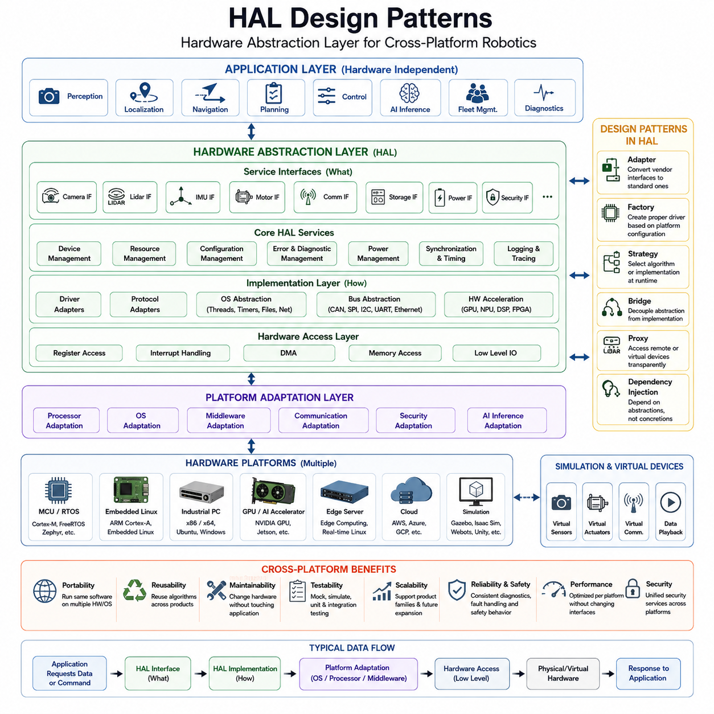{width="7.268055555555556in" height="7.268055555555556in"}

The uploaded structure places **"23_11_02_HAL_Design_Patterns_[w/Code]"** immediately after the introductory chapter on Cross-Platform Software Design, indicating that this chapter should transition from architectural motivation into the practical implementation of a **Hardware Abstraction Layer (HAL)**. It serves as the foundation for processor portability, operating system independence, reusable device drivers, simulation compatibility, and maintainable robotics software architectures.

The Hardware Abstraction Layer, commonly referred to as HAL, is one of the most influential architectural concepts in modern embedded systems, robotics software, industrial automation, and Physical AI platforms. As robotic systems become increasingly heterogeneous, integrating multiple processors, operating systems, communication buses, sensors, actuators, and artificial intelligence accelerators, software developers face the challenge of supporting rapidly evolving hardware without continuously rewriting application logic. The Hardware Abstraction Layer addresses this challenge by establishing a stable software boundary between hardware-dependent implementations and hardware-independent application components. Rather than allowing business logic, perception algorithms, localization modules, motion planners, or fleet management systems to directly manipulate registers, communication peripherals, or processor-specific instructions, HAL exposes standardized software interfaces that describe device capabilities instead of hardware implementation details.

The fundamental philosophy behind HAL is the separation of concerns. Hardware devices inevitably change throughout a product\'s lifecycle due to cost optimization, component shortages, technological advancements, or product differentiation. Application software, however, should remain stable regardless of whether a camera is connected through USB, Ethernet, MIPI CSI, or PCI Express, whether a motor controller communicates through CAN, EtherCAT, or RS-485, or whether an IMU originates from different manufacturers. By introducing a carefully designed abstraction layer, hardware variability becomes isolated within replaceable implementation modules while the remainder of the software ecosystem continues to operate without modification.

Historically, embedded software tightly coupled application logic with hardware-specific programming. Developers frequently embedded direct register manipulation, interrupt service routines, peripheral initialization, timing logic, and communication protocols inside application modules. While this approach initially appeared efficient, it produced software that became increasingly difficult to maintain as systems evolved. Every hardware revision required widespread source code modification, creating duplicated implementations, inconsistent behaviors, regression risks, and significant maintenance costs. HAL emerged as an architectural response to these limitations, enabling software reuse while dramatically improving portability and long-term maintainability.

A modern Hardware Abstraction Layer does not merely provide wrapper functions around device drivers. Instead, it establishes an architectural contract between software layers. Upper software components describe what they require rather than how hardware should accomplish those operations. For example, perception software requests an image frame instead of configuring image sensors, setting DMA transfers, or managing camera synchronization. Motion controllers command wheel velocities rather than manipulating PWM registers or motor driver protocols. Localization modules obtain inertial measurements without understanding sensor calibration registers or SPI transactions. This separation allows application software to remain stable while hardware implementations evolve independently.

An effective HAL architecture normally consists of multiple hierarchical layers rather than a single interface. The lowest layer directly communicates with physical hardware through processor registers, communication buses, interrupt handlers, and vendor-specific software development kits. Above this resides the device adaptation layer responsible for translating hardware-specific behaviors into standardized interfaces. Higher still exists the service abstraction layer that exposes functional capabilities to application software. Each successive layer reduces hardware awareness while increasing software portability, enabling application components to focus exclusively on domain logic.

One of the primary design objectives of HAL is interface stability. Stable interfaces ensure that application software remains unaffected even when hardware implementations change significantly. Interface design should therefore prioritize functionality over implementation. Rather than exposing processor-specific concepts, interfaces should represent meaningful system operations. A camera interface might define methods for initialization, frame acquisition, parameter configuration, synchronization, and diagnostics. Internal implementation details remain hidden behind these interfaces, allowing multiple hardware implementations to coexist without affecting software architecture.

Object-oriented programming significantly enhances HAL implementation through interface inheritance, polymorphism, and dependency inversion. Abstract base classes define common device behaviors while concrete implementations provide hardware-specific functionality. Application software depends only upon abstract interfaces rather than concrete hardware drivers. During system initialization, dependency injection mechanisms instantiate appropriate hardware implementations according to platform configuration, enabling identical application software to execute across multiple hardware platforms without recompilation whenever runtime flexibility is desired.

Dependency inversion represents one of the most important architectural principles supporting Hardware Abstraction Layers. High-level application modules should never depend directly upon low-level hardware implementations. Instead, both depend upon common abstractions. This architectural relationship substantially reduces coupling while increasing modularity, testability, and software longevity. Hardware becomes replaceable without requiring modifications throughout the application architecture, significantly reducing technical debt during product evolution.

HAL design must carefully balance abstraction with performance. Excessive abstraction introduces unnecessary function calls, memory allocations, synchronization overhead, and increased execution latency. Conversely, insufficient abstraction exposes hardware details throughout application software, reducing portability and maintainability. Successful HAL implementations identify stable functional boundaries where abstraction provides long-term engineering value without significantly affecting deterministic execution. Performance-critical operations may employ inline functions, compile-time optimization, template specialization, or platform-specific acceleration while preserving identical external interfaces.

Embedded robotics frequently requires deterministic real-time behavior. Therefore, HAL implementations should avoid introducing unpredictable latency through excessive dynamic allocation, virtual dispatch within hard real-time control loops, blocking synchronization mechanisms, or unnecessary context switching. Time-critical motor control, encoder processing, sensor synchronization, emergency stop handling, and safety monitoring often require carefully optimized HAL implementations that preserve deterministic execution while maintaining architectural consistency.

Cross-platform portability forms one of the strongest motivations for adopting HAL. Modern robotic products frequently migrate between ARM Cortex-M microcontrollers, ARM Cortex-A embedded processors, industrial x86 computers, RISC-V architectures, and GPU-accelerated edge computing platforms. Each processor family differs in memory hierarchy, compiler behavior, interrupt architecture, cache organization, and instruction set. A properly designed HAL isolates these architectural differences within processor adaptation modules, enabling higher-level software to remain processor independent throughout hardware evolution.

Operating system abstraction extends HAL beyond hardware interfaces. Robotics platforms frequently combine FreeRTOS, Zephyr, embedded Linux, PREEMPT_RT Linux, Ubuntu, Windows, Android, or QNX within distributed robotic systems. Operating systems provide different implementations of threading, synchronization, timers, networking, filesystems, and scheduling. Rather than allowing application software to invoke operating system APIs directly, OS abstraction interfaces expose standardized services representing logical system operations. Consequently, software portability extends naturally across heterogeneous operating environments.

Communication abstraction represents another essential design pattern. Industrial robots interact through CAN, CAN FD, EtherCAT, Modbus, Ethernet/IP, OPC UA, DDS, MQTT, WebSocket, REST, and proprietary communication protocols. Rather than binding application logic to specific communication technologies, HAL defines generic communication interfaces capable of sending messages, receiving data streams, monitoring connection status, and reporting communication health. Individual transport protocols implement these interfaces independently, allowing communication technologies to evolve without affecting application behavior.

Sensor abstraction provides one of the clearest demonstrations of HAL principles. Cameras, LiDAR sensors, radar systems, inertial measurement units, GNSS receivers, wheel encoders, ultrasonic sensors, and tactile arrays all differ substantially in communication protocols, calibration procedures, synchronization methods, and configuration parameters. Nevertheless, perception software requires standardized observations rather than hardware implementation knowledge. HAL therefore transforms diverse sensor interfaces into unified representations supporting timestamp synchronization, calibration metadata, health monitoring, and standardized measurement formats.

Actuator abstraction follows similar principles. Mobile robots, manipulators, humanoids, quadrupeds, conveyor systems, industrial machines, and autonomous vehicles employ motors from numerous manufacturers using different communication interfaces and control capabilities. Rather than embedding motor driver knowledge throughout control software, actuator HAL interfaces describe target positions, velocities, torques, operational modes, diagnostic information, and fault reporting. Underlying implementations translate these commands into hardware-specific communication protocols while preserving identical application behavior.

Simulation compatibility significantly benefits from well-designed Hardware Abstraction Layers. Modern robotics increasingly relies upon Software-in-the-Loop, Hardware-in-the-Loop, Digital Twin environments, synthetic datasets, and physics-based simulation. Rather than replacing application software during simulation, HAL substitutes simulated hardware implementations beneath identical application interfaces. Cameras generate synthetic images instead of physical sensor frames. Simulated encoders replace mechanical wheel measurements. Virtual GPS receivers emulate realistic positioning errors. Because application software remains unchanged, simulation accurately reflects real-world system behavior while greatly improving testing efficiency.

Artificial intelligence introduces additional opportunities for abstraction. AI inference may execute through TensorRT, ONNX Runtime, OpenVINO, CUDA, Vulkan Compute, CPU inference engines, NPUs, TPUs, or cloud-based inference services. Rather than coupling perception software to particular inference frameworks, HAL can expose standardized model execution interfaces accepting tensors, configuration parameters, and execution contexts while allowing different inference engines to implement optimized backend behavior. This approach enables seamless migration between hardware accelerators while preserving identical application logic.

Resource management represents another important responsibility of HAL. Embedded systems frequently possess limited memory, constrained computational resources, and strict power consumption requirements. HAL should centralize resource allocation, device initialization, power state transitions, hardware reset procedures, fault recovery mechanisms, and graceful shutdown operations. Centralized resource management improves consistency while simplifying debugging and reliability analysis.

Error handling requires careful architectural consideration. Hardware failures inevitably occur due to communication loss, sensor malfunction, electrical interference, overheating, calibration errors, or unexpected operating conditions. Rather than propagating vendor-specific error codes throughout application software, HAL should define standardized diagnostic models capable of representing device availability, health status, warning conditions, recoverable failures, and critical faults. Consistent diagnostic interfaces significantly simplify fault management across heterogeneous hardware ecosystems.

Configuration management is equally important. Different hardware platforms frequently require distinct calibration parameters, communication addresses, timing characteristics, safety thresholds, and operating limits. HAL should externalize such configuration into structured configuration files or parameter servers rather than embedding hardware assumptions directly within source code. Configuration-driven initialization enables identical software binaries to support multiple hardware variants through deployment configuration rather than recompilation.

Scalability remains one of the greatest long-term advantages of Hardware Abstraction Layers. Organizations rarely develop a single robotic platform. Instead, product portfolios expand toward autonomous mobile robots, outdoor delivery systems, industrial manipulators, inspection robots, quadrupeds, humanoids, and collaborative robots. Although hardware differs considerably among these products, many software capabilities remain identical. Navigation, localization, mapping, diagnostics, fleet communication, logging, AI inference, and mission management become reusable software assets supported by common HAL interfaces, dramatically reducing engineering effort across product generations.

Testing strategies benefit substantially from abstraction. Mock implementations, virtual devices, software simulators, and hardware emulators can replace physical hardware during automated testing. Unit tests validate application logic without requiring physical sensors or actuators. Integration testing verifies communication between software components through simulated devices. Continuous integration pipelines execute thousands of automated tests independent of laboratory hardware availability. Consequently, development velocity increases while regression risks decrease significantly.

Safety-critical robotics demands especially rigorous HAL design. Emergency stop systems, watchdog supervision, redundant sensing, safe motor shutdown, diagnostic monitoring, and fail-safe behaviors should never depend upon application-specific implementation details. HAL provides standardized safety interfaces ensuring consistent behavior regardless of processor family, operating system, or communication technology. Such architectural consistency greatly simplifies certification, verification, and long-term maintenance of safety-related software.

Cybersecurity considerations also influence HAL architecture. Secure boot procedures, cryptographic hardware modules, trusted platform modules, encrypted communication, secure firmware updates, authentication services, and integrity verification mechanisms often depend upon hardware-specific security capabilities. Rather than exposing these details throughout application software, HAL encapsulates platform-specific security implementations behind unified cryptographic and authentication interfaces, enabling consistent security policies across heterogeneous computing environments.

Several common design patterns frequently appear within Hardware Abstraction Layer implementations. The Adapter Pattern converts vendor-specific device interfaces into standardized application interfaces. The Factory Pattern selects appropriate hardware implementations according to platform configuration. The Strategy Pattern enables runtime selection among alternative hardware algorithms. The Proxy Pattern manages remote devices transparently. The Bridge Pattern separates abstraction from implementation, allowing both to evolve independently. Dependency Injection further improves modularity by eliminating compile-time dependencies upon specific hardware drivers. Collectively these architectural patterns establish flexible, extensible, and maintainable HAL frameworks capable of supporting diverse hardware ecosystems.

Modern software engineering increasingly combines HAL with interface definition languages, service-oriented architectures, middleware abstraction, dependency management frameworks, automated code generation, and continuous integration pipelines. Together these technologies enable organizations to develop reusable platform-independent software libraries while supporting rapidly changing hardware technologies. As robotics evolves toward Software-Defined Robots, AI-native architectures, heterogeneous computing, and increasingly intelligent Physical AI platforms, Hardware Abstraction Layers become even more essential because hardware diversity continues expanding rather than diminishing.

Ultimately, Hardware Abstraction Layer design is not merely a software engineering technique but a strategic architectural investment. It protects software assets from hardware obsolescence, accelerates product development, simplifies testing, reduces maintenance costs, supports long-term scalability, and enables organizations to reuse valuable algorithms across multiple generations of robotic platforms. Well-designed HAL architectures transform hardware variability from a significant engineering challenge into a manageable implementation detail, allowing software developers to focus on delivering intelligent functionality rather than continually adapting to changing hardware technologies.

## 11.03 Platform Build Systems: CMake / Bazel / Cross-Compilation

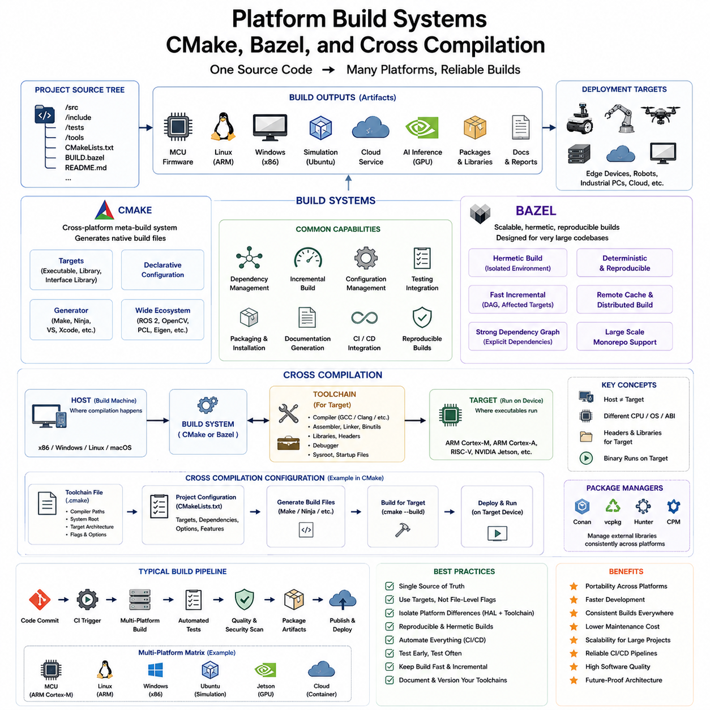{width="7.268055555555556in" height="7.268055555555556in"}

The uploaded engineering library places **"23_11.03 Platform Build Systems: CMake, Bazel, and Cross Compilation"** immediately after the chapter on Hardware Abstraction Layer design, indicating that the natural progression is from software portability principles toward practical multi-platform software construction. Once hardware dependencies have been isolated through HAL, developers require build systems capable of producing executable binaries for multiple processors, operating systems, and deployment targets from a unified source tree. This chapter therefore focuses on the architectural principles, engineering methodologies, and implementation strategies that enable portable software construction using modern build systems, with particular emphasis on CMake, Bazel, and cross-compilation workflows.

Modern software engineering has evolved far beyond compiling source files through manually maintained Makefiles or integrated development environments that are tightly coupled to a single operating system. Contemporary robotics, embedded systems, industrial automation, autonomous vehicles, and Physical AI platforms frequently target multiple processor architectures, heterogeneous operating systems, cloud environments, simulation platforms, and hardware accelerators simultaneously. A single software project may produce firmware for microcontrollers, Linux applications for embedded ARM processors, desktop tools for Windows, simulation modules for Ubuntu, cloud services running inside containers, and GPU-accelerated AI inference engines. Managing such diversity manually is impractical, making build systems one of the most critical components of modern software architecture.

A build system is much more than a compilation tool. It represents the complete automation framework responsible for transforming source code into deployable software artifacts. Build systems manage dependency analysis, compiler invocation, linker configuration, source organization, package generation, testing, installation, documentation generation, artifact publication, and integration with continuous integration pipelines. Modern build systems also provide reproducibility, scalability, configuration management, and platform independence, ensuring that identical source code consistently produces equivalent software regardless of the developer\'s workstation or deployment environment.

Historically, software projects relied upon handwritten Makefiles. Although GNU Make introduced powerful dependency tracking and incremental compilation capabilities, large projects gradually became difficult to maintain. Build configurations often contained platform-specific assumptions, compiler-dependent options, duplicated rules, and inconsistent dependency management. As software complexity increased and product families expanded across multiple hardware architectures, organizations recognized the need for higher-level build configuration languages capable of generating platform-specific build files automatically while maintaining a unified project description.

CMake emerged as one of the most influential solutions addressing these challenges. Rather than functioning as a compiler itself, CMake serves as a meta-build system that generates native build files for multiple development environments. Developers describe project structure, targets, dependencies, compiler requirements, and installation rules using platform-independent configuration scripts. CMake subsequently generates Makefiles, Ninja build files, Visual Studio projects, Xcode projects, or other native build systems appropriate for the target environment. This architecture enables identical project descriptions to support Linux, Windows, macOS, embedded Linux, and cross-compilation toolchains without duplicating build logic.

One of CMake\'s greatest strengths lies in its widespread adoption throughout the robotics ecosystem. ROS 2, OpenCV, PCL, Eigen, TensorRT integrations, numerous embedded Linux frameworks, and thousands of open-source robotics libraries utilize CMake as their primary build infrastructure. Consequently, engineers developing autonomous mobile robots, industrial manipulators, quadrupeds, humanoids, or Physical AI platforms naturally benefit from extensive community support, mature tooling, and broad compatibility across development environments.

CMake organizes software around logical targets rather than individual source files. Executable applications, shared libraries, static libraries, interface libraries, and testing components become first-class architectural entities within project configuration. Dependencies are expressed between targets rather than through compiler flags manually repeated across multiple build scripts. This target-oriented architecture greatly improves maintainability while reducing duplicated configuration throughout large software repositories.

Modern CMake emphasizes declarative configuration rather than procedural scripting. Developers describe desired relationships among software components, compiler features, include directories, interface requirements, compile definitions, and package dependencies. The build system automatically propagates these requirements throughout dependent targets while minimizing manual configuration effort. Such declarative design improves readability, reduces configuration errors, and simplifies project evolution as software architecture expands.

Bazel represents a different philosophy of software construction. Originally developed for extremely large software repositories, Bazel emphasizes reproducibility, scalability, hermetic builds, distributed compilation, and deterministic dependency management. Whereas traditional build systems frequently depend upon the surrounding operating system environment, Bazel carefully isolates build execution to ensure identical outputs regardless of developer workstation configuration. This property becomes particularly valuable within organizations managing thousands of software modules across geographically distributed engineering teams.

Hermetic builds constitute one of Bazel\'s defining characteristics. Every compilation action executes within a carefully controlled environment containing only explicitly declared dependencies. Hidden environmental assumptions, undeclared libraries, system-specific compiler behavior, or accidental filesystem access become impossible. Consequently, software builds become deterministic, reproducible, and highly reliable, substantially reducing the "works on my machine" problems historically associated with complex software development.

Bazel also introduces sophisticated dependency analysis enabling highly efficient incremental builds. Rather than recompiling entire software systems after minor modifications, Bazel precisely identifies affected components through dependency graphs. Only software directly influenced by source modifications undergoes recompilation, dramatically reducing build times within large-scale software repositories. Combined with distributed execution and remote build caching, Bazel supports engineering organizations maintaining millions of lines of source code while preserving rapid developer feedback.

Large robotics organizations increasingly explore Bazel because autonomous systems integrate perception, localization, planning, control, artificial intelligence, cloud infrastructure, simulation, visualization, testing, and deployment within unified software repositories. Such projects often exceed the scalability limitations of traditional build infrastructures. Bazel\'s emphasis on modularity, deterministic execution, remote caching, and reproducibility aligns naturally with these requirements, although adoption generally requires greater architectural discipline than CMake.

Despite philosophical differences, both CMake and Bazel share common objectives. They seek to eliminate manual compilation procedures, automate dependency management, improve portability, simplify configuration, support continuous integration, and increase software maintainability. Organizations select between them according to project scale, engineering culture, existing toolchains, and long-term architectural strategy. Smaller and medium-sized robotics projects frequently favor CMake due to ecosystem compatibility, whereas very large organizations managing monolithic repositories often adopt Bazel for its superior scalability.

Cross-compilation represents another essential capability of modern build systems. Embedded software is frequently developed on powerful desktop workstations while executing upon entirely different processor architectures. Developers may use x86 Linux or Windows workstations to produce firmware for ARM Cortex-M microcontrollers, Linux applications for ARM Cortex-A processors, GPU applications for NVIDIA Jetson devices, or software targeting RISC-V industrial controllers. Native compilation becomes impossible because executable binaries generated for the development workstation cannot execute directly upon target hardware. Cross-compilation resolves this challenge by employing toolchains capable of generating machine code for foreign processor architectures.

The cross-compilation process fundamentally separates the host platform from the target platform. The host represents the computer performing compilation, whereas the target represents the device executing generated software. Host and target may differ in processor architecture, operating system, binary format, instruction set, floating-point capabilities, memory organization, and available runtime libraries. Successful cross-compilation therefore requires careful configuration of compiler toolchains, system headers, runtime libraries, linker scripts, startup code, and deployment procedures.

Toolchains constitute the foundation of cross-compilation. A toolchain includes compilers, assemblers, linkers, binary utilities, debuggers, runtime libraries, startup objects, and supporting utilities configured specifically for a particular target architecture. GCC, LLVM Clang, ARM GNU Toolchain, NVIDIA CUDA toolchains, and vendor-specific embedded development kits all provide specialized toolchains optimized for different hardware environments. Build systems abstract these toolchains through configuration files so that application developers rarely interact directly with compiler invocation details.

CMake supports cross-compilation through dedicated toolchain files describing target processor characteristics, compiler locations, system root directories, library search paths, compiler options, linker behavior, and platform-specific configuration. Once properly defined, identical application source code may be compiled for desktop Linux, embedded ARM Linux, Windows, or custom embedded systems simply by selecting alternative toolchain configurations. This separation significantly improves software portability while reducing duplicated project configuration.

Cross-compilation introduces several architectural considerations extending beyond compiler configuration. Build scripts must distinguish between programs executing during compilation and programs executing upon the target device. Code generators, configuration utilities, interface compilers, protocol compilers, and asset processing tools generally execute upon the host workstation regardless of target architecture. Generated software, however, executes upon embedded hardware. Proper build system architecture clearly separates host tools from target applications, preventing architecture mismatches throughout the build process.

Dependency management becomes considerably more complex within cross-compilation environments. Libraries required during compilation may differ from libraries required during execution. Header files, binary libraries, package managers, SDK versions, compiler options, ABI compatibility, and processor-specific optimizations must remain synchronized across the entire software ecosystem. Modern build systems therefore provide package discovery mechanisms, version constraints, imported targets, and dependency propagation models simplifying management of heterogeneous software stacks.

Package managers increasingly complement build systems by automating external dependency acquisition. Conan, vcpkg, Hunter, CPM, and similar tools download, configure, compile, and integrate third-party libraries according to platform-specific requirements. Rather than manually installing dependencies upon each developer workstation, package managers ensure consistent library versions across development environments while integrating naturally with CMake or Bazel build workflows. Such automation significantly improves reproducibility while reducing configuration effort.

Continuous Integration and Continuous Deployment pipelines depend heavily upon modern build systems. Every software modification should automatically trigger compilation across multiple supported architectures, execution of automated unit tests, static analysis, security scanning, code quality evaluation, packaging, artifact publication, and deployment verification. Build systems therefore become integral components of software lifecycle automation rather than isolated compilation utilities. Successful robotics organizations treat build infrastructure as production software requiring careful architectural planning and long-term maintenance.

Multi-target build configuration represents another important capability. Modern robotics software frequently supports desktop simulation, embedded deployment, cloud execution, hardware diagnostics, development tools, automated testing, and production releases from a unified repository. Build systems manage alternative configurations through build options, feature flags, conditional compilation, platform selection, optimization profiles, and deployment targets while minimizing duplicated configuration logic. Careful architectural organization prevents platform-specific complexity from contaminating application software.

Conditional compilation should be employed judiciously. Excessive use of preprocessor directives frequently reduces readability while increasing maintenance complexity. Rather than scattering platform-specific conditional logic throughout application code, architectural best practices recommend isolating hardware differences within abstraction layers selected during build configuration. Consequently, application logic remains largely platform independent while build systems determine appropriate implementations according to selected target environments.

Compiler feature management also benefits from modern build systems. Rather than manually specifying language standards, warning options, optimization levels, architecture extensions, sanitizers, profiling instrumentation, or debug information, build configurations express these requirements declaratively. Build systems subsequently translate abstract feature requirements into compiler-specific options appropriate for GCC, Clang, MSVC, or embedded toolchains. Such abstraction significantly improves portability while simplifying long-term project evolution.

Testing infrastructure integrates naturally with contemporary build environments. Unit testing frameworks, integration testing, simulation-based validation, hardware-in-the-loop verification, benchmark execution, code coverage analysis, and regression testing become automated build targets executed consistently across supported platforms. Rather than treating testing as an independent activity, modern engineering incorporates validation directly into build pipelines, ensuring continuous software quality throughout development.

Security also influences build architecture. Software supply chain security requires verification of external dependencies, reproducible builds, artifact signing, integrity validation, vulnerability scanning, and secure package distribution. Build systems increasingly integrate cryptographic verification, software bill of materials generation, license compliance analysis, and dependency auditing to strengthen software development security throughout the engineering lifecycle.

Containerization further enhances reproducibility by encapsulating build environments within standardized execution platforms. Docker containers frequently host complete toolchains, package managers, compilers, and build utilities, eliminating workstation-specific configuration differences. Combined with CMake or Bazel, containerized build environments enable identical compilation procedures across developer workstations, continuous integration servers, cloud infrastructure, and release engineering systems.

Robotics software presents unique build challenges because many components span simulation, embedded firmware, real-time control, artificial intelligence, perception pipelines, cloud infrastructure, visualization, and operator interfaces simultaneously. Build systems must therefore coordinate multiple programming languages, code generation tools, hardware SDKs, middleware frameworks, GPU toolchains, and deployment targets within coherent engineering workflows. Successful architectural organization carefully separates reusable software libraries, hardware adaptation layers, application modules, testing infrastructure, simulation assets, and deployment packages while maintaining consistent dependency relationships throughout the repository.

As Software-Defined Robotics, Physical AI, and heterogeneous computing continue advancing, build systems increasingly become strategic architectural infrastructure rather than simple developer utilities. Organizations investing in modular build configuration, reproducible software construction, deterministic dependency management, scalable compilation, automated testing, and cross-platform deployment establish strong engineering foundations supporting long-term product evolution. The combination of CMake for broad ecosystem compatibility, Bazel for large-scale deterministic software construction, and robust cross-compilation workflows enables software teams to efficiently deliver reliable applications across diverse hardware architectures without sacrificing maintainability or engineering productivity.

Ultimately, platform build systems represent the operational backbone of cross-platform software engineering. Hardware abstraction enables portable software architecture, but build systems transform that architecture into deployable executable products across heterogeneous platforms. Through disciplined build configuration, reproducible dependency management, automated testing, scalable compilation, and carefully designed cross-compilation strategies, modern software organizations create maintainable engineering ecosystems capable of supporting decades of technological evolution while preserving software quality, portability, and long-term sustainability.

## 11.04 Portability Design for ARM / x86 / RISC-V

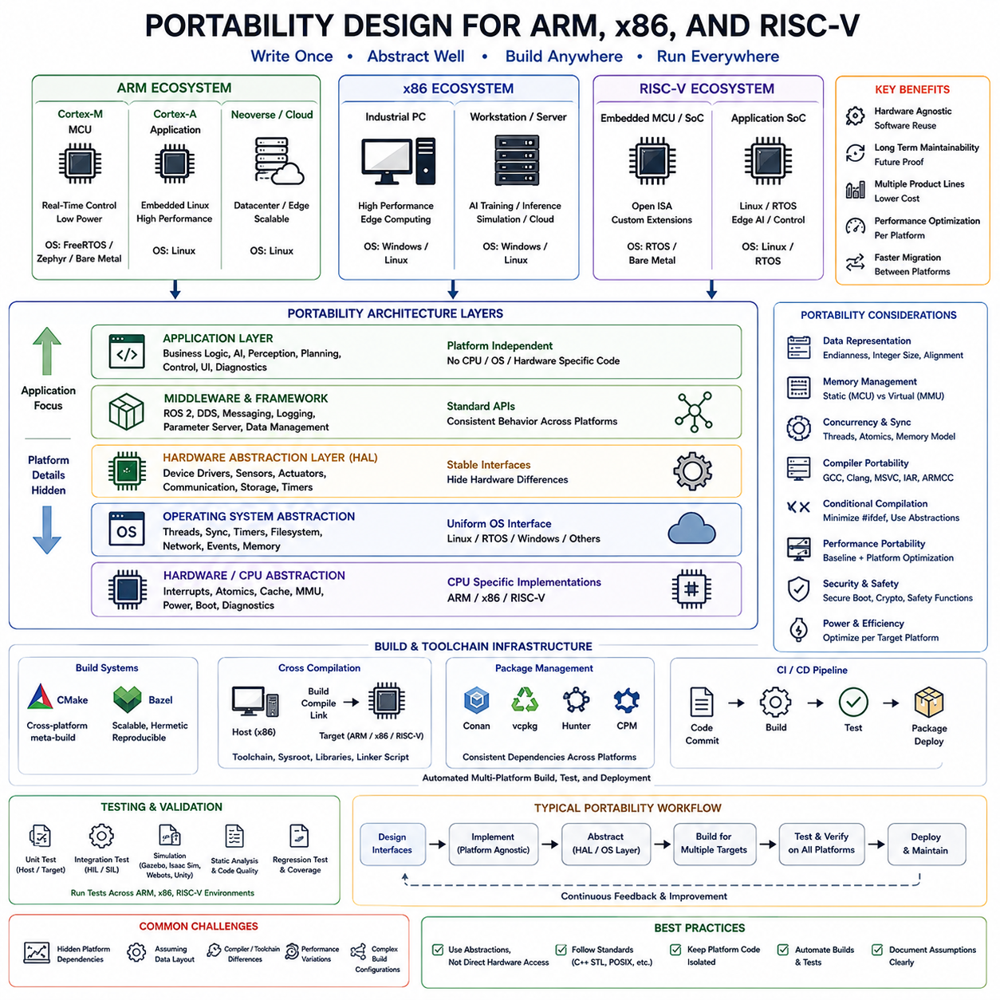{width="7.268055555555556in" height="7.268055555555556in"}

The uploaded engineering library identifies **"23_11.04 Portability Design for ARM, x86, and RISC-V"** as the fourth chapter within the Cross-Platform Software Design section. Following the discussion of Hardware Abstraction Layer design and modern build systems, this chapter naturally focuses on architectural methodologies that enable a single software codebase to execute efficiently across heterogeneous processor architectures. The objective is not merely source-level compatibility but sustainable long-term software portability that preserves maintainability, performance, scalability, safety, and future extensibility throughout evolving robotics and Physical AI platforms.

Software portability has become one of the defining characteristics of modern robotics software architecture. Unlike traditional embedded products that targeted a single processor family for their entire lifecycle, contemporary robotic systems frequently evolve through multiple hardware generations. A product may begin with an ARM Cortex-M microcontroller during prototype development, migrate to an ARM Cortex-A embedded Linux platform during commercial deployment, incorporate x86 industrial computers for high-performance edge computing, and eventually adopt RISC-V processors or specialized AI accelerators as technology advances. Organizations that tightly couple software to one processor architecture quickly accumulate technical debt, while those adopting portability-oriented architectural principles preserve software investments across decades of hardware evolution.

Processor portability should not be misunderstood as merely recompiling identical source code using different compilers. True portability encompasses software architecture, data representation, compiler behavior, memory organization, synchronization models, hardware abstraction, build automation, testing methodology, deployment strategies, and long-term maintainability. Successful portability allows application logic to remain stable despite substantial differences in processor instruction sets, operating systems, hardware peripherals, compiler implementations, cache hierarchies, floating-point capabilities, and performance characteristics.

ARM has become the dominant processor architecture throughout embedded computing and robotics because of its outstanding balance between computational performance, power efficiency, ecosystem maturity, and scalability. The ARM architecture spans tiny Cortex-M microcontrollers performing deterministic real-time control, Cortex-R processors supporting safety-critical applications, Cortex-A processors executing embedded Linux, and Neoverse platforms powering cloud infrastructure. This architectural continuity allows organizations to reuse development knowledge across diverse computational environments while maintaining relatively consistent programming models.

ARM Cortex-M processors primarily address deeply embedded real-time control applications. These processors emphasize deterministic interrupt handling, predictable execution timing, low power consumption, and direct peripheral control. Motor controllers, battery management systems, safety controllers, sensor acquisition modules, and communication gateways frequently execute on Cortex-M devices using FreeRTOS, Zephyr, or bare-metal firmware. Software targeting Cortex-M environments must carefully manage limited memory resources, deterministic scheduling, and strict real-time requirements while minimizing dynamic allocation and computational overhead.

ARM Cortex-A processors represent a different execution environment oriented toward embedded Linux systems. They support virtual memory, multicore execution, advanced cache hierarchies, hardware virtualization, floating-point acceleration, multimedia processing, and sophisticated operating systems. Autonomous mobile robots commonly execute perception, localization, mapping, planning, communication, and middleware services on Cortex-A processors integrated within embedded Linux platforms. Although Cortex-M and Cortex-A share the ARM instruction family, software architecture differs substantially because operating system capabilities, memory management, and execution environments change dramatically.

Industrial x86 processors dominate high-performance edge computing within robotics due to their exceptional computational capabilities, mature software ecosystem, abundant memory support, advanced debugging infrastructure, and compatibility with desktop development environments. x86 platforms frequently host ROS 2 middleware, artificial intelligence inference engines, digital twin simulations, fleet management services, cloud gateways, visualization tools, and industrial control applications. High-performance GPUs, PCI Express peripherals, extensive storage systems, and virtualization technologies further strengthen x86\'s position in industrial robotics and Physical AI deployments.

RISC-V has emerged as an increasingly important processor architecture due to its open instruction set architecture, extensibility, academic adoption, industrial flexibility, and rapidly expanding ecosystem. Unlike proprietary architectures, RISC-V permits organizations to customize processor implementations according to application-specific requirements without licensing proprietary instruction sets. Robotics manufacturers increasingly investigate RISC-V for embedded controllers, AI accelerators, edge computing platforms, safety processors, and specialized robotic hardware. Although ecosystem maturity currently trails ARM and x86, RISC-V\'s long-term strategic significance continues growing across industrial automation and intelligent systems.

Architectural differences among ARM, x86, and RISC-V extend well beyond instruction encoding. Each processor family exhibits distinct memory models, interrupt architectures, cache behavior, atomic operations, vector processing capabilities, compiler optimizations, debugging tools, boot procedures, binary formats, and operating system ecosystems. Software designed without consideration of these differences often contains implicit architectural assumptions that hinder portability. Consequently, portability-oriented architecture requires deliberate separation between processor-dependent implementation and processor-independent application logic.

The Hardware Abstraction Layer forms the foundation supporting processor portability. Application software should never manipulate processor registers, interrupt controllers, timers, cache management instructions, or architecture-specific synchronization primitives directly. Instead, processor-specific implementations reside beneath standardized interfaces representing logical capabilities such as timing services, communication channels, synchronization mechanisms, memory allocation, and hardware resource management. Consequently, processor migration affects only abstraction layer implementations while preserving upper application architecture.

Operating system abstraction complements processor portability. ARM Cortex-M platforms commonly execute FreeRTOS or Zephyr, ARM Cortex-A processors typically utilize embedded Linux, x86 systems often run Ubuntu or Windows, and RISC-V environments may support Linux or emerging embedded operating systems. Rather than embedding operating system APIs throughout application code, software architecture defines standardized interfaces for threading, synchronization, timers, networking, filesystem access, and event handling. Individual operating systems implement these interfaces according to their capabilities while preserving identical application behavior.

Data representation constitutes another critical portability consideration. Although modern ARM, x86, and RISC-V processors generally employ little-endian byte ordering, architectural assumptions regarding integer size, pointer width, memory alignment, floating-point representation, and compiler-specific data layouts should never appear within portable software. Explicit fixed-width integer types, standardized serialization formats, carefully defined communication protocols, and compiler-independent structure layouts significantly improve software reliability across heterogeneous architectures.

Memory management strategies differ considerably among processor families. Small Cortex-M microcontrollers frequently operate without memory management units, relying upon static allocation and deterministic resource usage. Cortex-A and x86 processors support virtual memory, dynamic allocation, sophisticated paging systems, and protected address spaces. Portable software therefore separates memory management policies from application logic, allowing embedded deployments to employ deterministic allocation while desktop environments utilize more flexible resource management without altering application algorithms.

Concurrency models similarly require architectural abstraction. Multicore x86 processors frequently execute dozens of concurrent software threads, whereas embedded Cortex-M systems may perform deterministic scheduling with only a few real-time tasks. Processor architectures also differ in atomic instruction support, cache coherency, memory consistency models, synchronization primitives, and interrupt behavior. Portable concurrency frameworks therefore expose standardized synchronization interfaces while hiding architecture-specific implementation details beneath operating system or hardware abstraction layers.

Compiler portability represents another significant engineering challenge. GCC, Clang, MSVC, ARM Compiler, IAR Embedded Workbench, and vendor-specific toolchains each interpret optimization directives, warning behaviors, language extensions, inline assembly, and code generation differently. Software relying upon compiler-specific extensions inevitably sacrifices portability. Successful cross-platform architecture emphasizes standardized programming language features, compiler-independent build configuration, strict warning management, and continuous validation across multiple toolchains to ensure consistent software behavior.

Build systems play an essential role supporting processor portability. Modern CMake, Bazel, and cross-compilation toolchains enable identical software repositories to produce executables for ARM Cortex-M firmware, ARM Cortex-A Linux applications, x86 desktop software, RISC-V embedded systems, and simulation environments through configuration rather than source modification. Carefully organized toolchain files, compiler abstraction, dependency management, and automated build pipelines eliminate manual platform-specific compilation procedures while preserving architectural consistency.

Conditional compilation inevitably appears within portable software, but its usage should remain carefully controlled. Excessive reliance upon architecture-specific preprocessor directives scattered throughout application code rapidly reduces readability and maintainability. Instead, platform-specific implementations should remain localized within abstraction layers while application software depends exclusively upon architecture-independent interfaces. Build systems subsequently select appropriate implementations according to target processor configuration, greatly simplifying software evolution.

Performance portability presents one of the most difficult architectural challenges. ARM processors prioritize power efficiency, x86 systems maximize computational throughput, and RISC-V implementations vary considerably according to processor configuration. Identical algorithms may therefore exhibit dramatically different performance characteristics across architectures. Portable software should separate algorithmic correctness from platform optimization, allowing architecture-specific acceleration without compromising common interfaces or software maintainability.

Artificial intelligence workloads illustrate this principle clearly. Neural network inference may execute on ARM CPUs, NVIDIA GPUs attached to x86 systems, integrated NPUs within embedded processors, FPGA accelerators, or future RISC-V vector extensions. Rather than coupling perception software directly to specific inference engines or processor instructions, portable AI frameworks define common inference interfaces supporting multiple computational backends. Hardware-specific optimization occurs beneath stable application interfaces, allowing AI deployment across heterogeneous computing platforms.

Simulation compatibility further reinforces processor portability. Robotics development increasingly depends upon desktop simulation executing on x86 workstations while deployment targets ARM embedded computers. Ideally, identical application software should execute within Gazebo, Isaac Sim, Webots, Unity-based digital twins, and physical robotic hardware without modification. Processor-independent software architecture enables this capability by separating hardware interaction from application behavior through standardized abstraction layers.

Communication protocols require similar architectural treatment. Processor architectures frequently differ in peripheral interfaces supporting CAN, SPI, I2C, UART, Ethernet, PCI Express, USB, and industrial communication standards. Portable communication frameworks describe logical messaging behavior rather than physical hardware interaction. Device drivers implement architecture-specific communication while higher software layers process standardized messages independent of processor architecture.

Testing methodology becomes increasingly important as processor diversity expands. Software validated only upon one architecture frequently contains hidden portability defects. Continuous integration systems should automatically compile, analyze, and execute tests across ARM, x86, and RISC-V toolchains whenever feasible. Static analysis, unit testing, simulation-based validation, hardware-in-the-loop testing, and regression testing collectively identify portability issues early in development, substantially reducing migration effort during future hardware transitions.

Safety-critical robotics imposes additional portability requirements. Emergency stop processing, watchdog supervision, redundant communication, fault monitoring, deterministic timing, and safety diagnostics must exhibit identical functional behavior regardless of processor architecture. Hardware differences should influence implementation efficiency but never alter safety behavior. Consequently, portability architecture supports certification by establishing consistent software interfaces while permitting architecture-specific optimization beneath validated abstractions.

Cybersecurity also benefits from processor-independent architecture. Authentication mechanisms, secure boot procedures, cryptographic services, firmware integrity verification, encrypted communication, and trusted execution environments vary among ARM, x86, and RISC-V platforms. Rather than embedding processor-specific security implementation throughout application software, security services reside behind standardized cryptographic interfaces, enabling consistent organizational security policies despite heterogeneous hardware deployments.

Power consumption considerations frequently influence processor selection within robotics. ARM processors generally deliver exceptional energy efficiency suitable for battery-powered autonomous systems. x86 processors provide higher computational performance at greater power consumption, making them appropriate for industrial edge computing and AI-intensive workloads. Emerging RISC-V processors increasingly offer flexible optimization opportunities balancing performance, efficiency, customization, and cost. Portability-oriented software architecture permits organizations to optimize hardware selection according to application requirements without sacrificing software reuse.

Scalability constitutes another major advantage of processor-independent design. Robotics manufacturers rarely produce only one hardware platform. Product portfolios commonly include educational robots, autonomous mobile robots, outdoor vehicles, industrial manipulators, quadrupeds, humanoids, inspection robots, and logistics platforms. Although computational hardware differs significantly among these products, software assets such as localization, perception, navigation, diagnostics, fleet communication, mission planning, and AI inference remain highly reusable when developed using portability-oriented architectural principles.

Future technological evolution further reinforces the necessity of portability. AI accelerators, heterogeneous multicore processors, chiplet architectures, domain-specific processors, quantum coprocessors, neuromorphic computing, and increasingly specialized robotic hardware will continue transforming computational platforms. Software tightly coupled to today\'s processors risks rapid obsolescence, whereas portability-oriented architecture preserves valuable intellectual property despite continuous hardware innovation.

Effective portability design therefore emphasizes stable interfaces, standardized programming practices, hardware abstraction, operating system independence, compiler neutrality, reproducible build systems, automated testing, deterministic behavior, modular software organization, and architecture-specific optimization isolated beneath common abstractions. Such principles allow organizations to maintain a unified software ecosystem supporting multiple processor families simultaneously while minimizing maintenance cost and maximizing long-term software sustainability.

Ultimately, portability design for ARM, x86, and RISC-V represents far more than compatibility among processor architectures. It establishes a strategic software engineering philosophy ensuring that valuable algorithms, application logic, artificial intelligence models, safety functions, and robotic capabilities remain independent from transient hardware technologies. As robotics advances toward Software-Defined Robots, heterogeneous Physical AI systems, and continuously evolving computing platforms, processor portability will become one of the most important architectural foundations supporting sustainable innovation, long product lifecycles, and efficient software reuse across future generations of intelligent machines.

## 11.05 Common Interface Design for Embedded Linux and RTOS

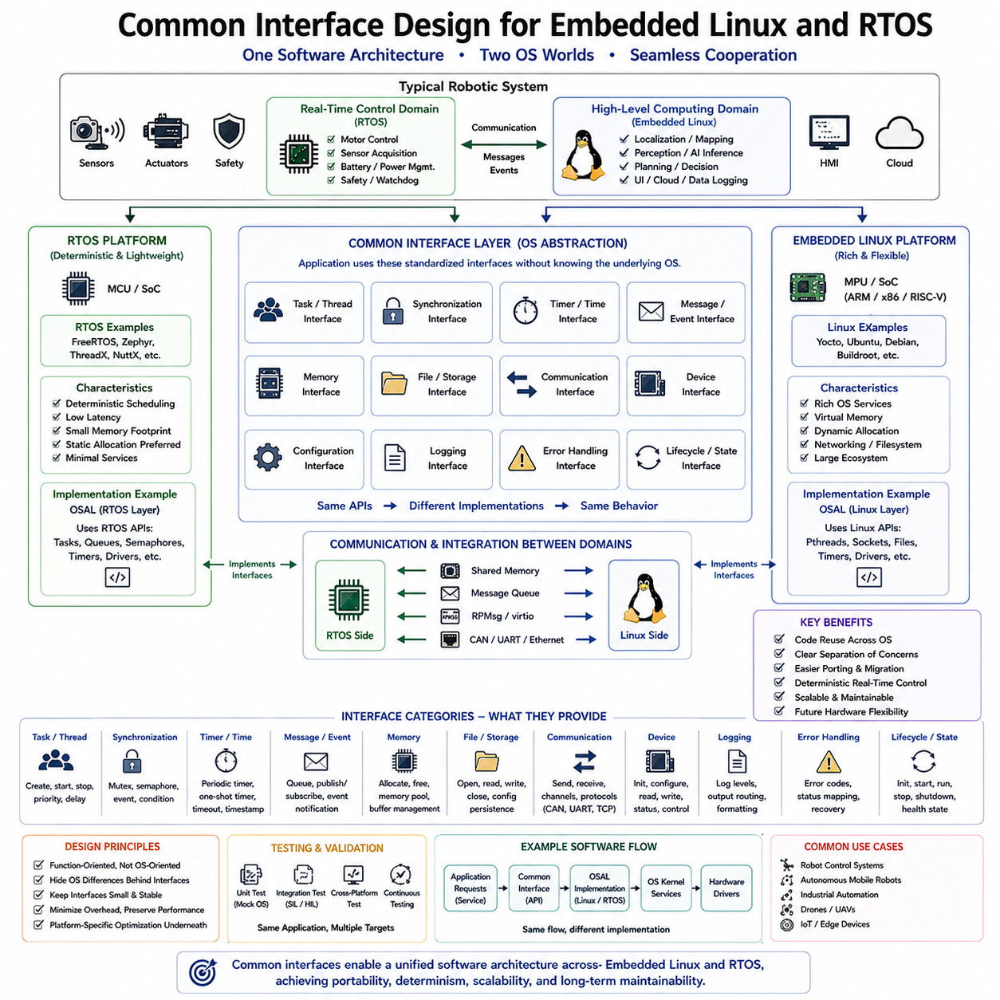{width="7.268055555555556in" height="7.268055555555556in"}

The uploaded engineering library places **"23_11.05 Common Interface Design for Embedded Linux and RTOS"** within the Cross-Platform Software Design section immediately after processor portability and before ROS 2 cross-platform build strategies. This placement is significant because, after establishing hardware abstraction, build systems, and processor portability, software engineers must address one of the most challenging aspects of embedded robotics: designing software interfaces that operate consistently across fundamentally different execution environments. Embedded Linux and Real-Time Operating Systems (RTOS) differ considerably in scheduling models, memory management, execution semantics, synchronization mechanisms, and resource availability. Nevertheless, modern robotics increasingly requires both environments to cooperate seamlessly within a unified software architecture. This chapter therefore focuses on architectural methodologies for designing common software interfaces that maximize code reuse while preserving deterministic real-time behavior and maintaining portability across heterogeneous embedded platforms.

Modern robotic systems rarely execute entirely within a single operating system. Instead, they combine multiple computational domains optimized for different responsibilities. Low-level motor control, battery management, sensor acquisition, safety supervision, and deterministic communication frequently execute within an RTOS running on microcontrollers. Higher-level perception, localization, mapping, artificial intelligence inference, mission planning, cloud connectivity, and user interfaces generally execute on embedded Linux platforms equipped with significantly greater computational resources. Although these execution environments differ fundamentally, they collectively represent one integrated robotic system. Consequently, software architecture must provide common interfaces capable of spanning both operating system domains without compromising performance, determinism, maintainability, or portability.

The primary challenge originates from the contrasting design philosophies of Embedded Linux and RTOS environments. Linux emphasizes flexibility, process isolation, virtual memory, rich networking capabilities, dynamic resource management, extensive middleware support, and sophisticated application ecosystems. Real-Time Operating Systems prioritize deterministic scheduling, bounded interrupt latency, predictable execution timing, minimal resource consumption, and guaranteed response behavior under constrained computational resources. These contrasting priorities influence virtually every aspect of software execution, making direct software portability difficult without careful architectural abstraction.

A common interface should therefore represent functional capabilities rather than operating system implementation details. Application software should request services through standardized interfaces describing logical operations instead of invoking operating-system-specific APIs directly. Whether a timing request ultimately uses Linux POSIX timers or RTOS hardware timers should remain invisible to higher application layers. Similarly, message passing, synchronization, logging, file access, diagnostics, memory allocation, and device management should all appear through consistent software interfaces independent of the underlying execution environment.

One of the most important architectural principles supporting common interface design is separation of operating system dependency from application behavior. Business logic, control algorithms, perception pipelines, localization modules, communication protocols, and artificial intelligence components should avoid direct interaction with Linux system calls or RTOS kernel services whenever practical. Instead, operating system functionality should reside beneath abstraction interfaces implemented independently for each supported execution environment. This architectural separation significantly reduces coupling while improving portability and simplifying long-term maintenance.

Thread management illustrates this principle particularly well. Embedded Linux commonly utilizes POSIX threads supporting dynamic creation, priorities, scheduling policies, affinity control, synchronization primitives, and extensive runtime management capabilities. RTOS environments provide task scheduling mechanisms optimized for deterministic execution and limited memory resources. Although implementation details differ substantially, application software generally requires only logical concepts such as creating execution contexts, starting background activities, synchronizing operations, and controlling execution priorities. Common threading interfaces therefore expose these logical capabilities while allowing operating system implementations to select appropriate kernel mechanisms.

Synchronization represents another area requiring careful abstraction. Linux applications frequently employ mutexes, condition variables, semaphores, read-write locks, futexes, and atomic operations. RTOS implementations often provide simplified synchronization primitives emphasizing deterministic timing and minimal computational overhead. Common synchronization interfaces should therefore describe intended coordination behavior rather than exposing kernel-specific synchronization mechanisms. Higher-level software remains independent from operating system implementation while synchronization performance remains optimized within each environment.

Timing services require similar treatment. Linux supports multiple timer mechanisms including POSIX timers, high-resolution timers, monotonic clocks, real-time clocks, and asynchronous timer events. RTOS kernels generally utilize hardware timers tightly integrated with deterministic scheduling. Despite implementation differences, applications typically require periodic execution, timeout handling, elapsed time measurement, timestamp generation, and scheduling delays. Standardized timing interfaces allow these capabilities to remain consistent across heterogeneous operating systems while preserving platform-specific optimization beneath the abstraction layer.

Memory management presents particularly significant architectural differences. Embedded Linux employs virtual memory, dynamic allocation, paging, protected address spaces, shared libraries, sophisticated allocators, and memory mapping mechanisms. RTOS environments frequently operate without memory management units, emphasizing static allocation, deterministic resource consumption, and predictable execution timing. Portable software should therefore avoid embedding operating system memory assumptions throughout application logic. Instead, allocation policies should remain configurable through common memory management interfaces capable of supporting both deterministic embedded deployment and flexible Linux execution.

Dynamic memory allocation deserves special consideration because inappropriate usage frequently undermines portability. Linux applications commonly allocate and release memory throughout execution without significant concern regarding fragmentation or allocation latency. Real-time systems often prohibit unrestricted dynamic allocation because unpredictable allocation behavior may violate timing requirements. Common interface design therefore encourages centralized memory services capable of supporting platform-specific allocation strategies while preserving identical application interfaces. Linux implementations may employ conventional heap allocation whereas RTOS deployments utilize fixed memory pools, static allocation, or deterministic allocators.

File system abstraction introduces another important portability challenge. Embedded Linux provides sophisticated hierarchical file systems supporting permissions, symbolic links, persistent storage, large files, and concurrent access. Many RTOS deployments either provide simplified file systems or operate entirely without persistent storage. Nevertheless, application software often requires configuration management, parameter persistence, logging, calibration data, and diagnostic record storage. Rather than depending directly upon POSIX file APIs, software should utilize generalized storage interfaces capable of adapting to available storage capabilities within each operating environment.

Logging systems similarly require abstraction. Linux applications frequently generate extensive textual logs stored within persistent file systems, transmitted across networks, or integrated with centralized observability platforms. RTOS environments often possess limited storage capacity and communication bandwidth, requiring compact binary logging or real-time diagnostic transmission. Common logging interfaces therefore define standardized logging semantics while permitting platform-specific optimization according to available computational resources and deployment requirements.

Communication interfaces represent one of the most critical components within cross-platform robotics software. Linux applications frequently employ TCP/IP sockets, UNIX domain sockets, shared memory, DDS middleware, MQTT messaging, REST APIs, WebSocket communication, gRPC, and advanced networking frameworks. RTOS systems generally communicate through CAN, UART, SPI, I2C, shared memory buffers, lightweight messaging protocols, or deterministic fieldbus networks. Despite technological diversity, application software primarily exchanges structured messages, events, commands, and telemetry. Communication abstraction therefore separates message semantics from transport implementation, enabling software portability across heterogeneous operating environments.

Device management also benefits significantly from common interface design. Linux exposes hardware through device files, kernel drivers, system services, udev management, and dynamically discoverable hardware interfaces. RTOS platforms typically initialize hardware statically during startup with deterministic resource allocation. Rather than exposing these differences to application software, common device interfaces describe functional capabilities including initialization, configuration, status monitoring, diagnostics, calibration, and shutdown behavior. Hardware-specific implementations remain isolated beneath standardized software contracts.

Configuration management becomes particularly valuable when supporting multiple operating systems. Linux commonly utilizes configuration files, environment variables, parameter servers, databases, or distributed configuration services. RTOS environments generally rely upon static configuration tables, compile-time constants, or flash-resident parameter storage. Portable software should therefore obtain configuration through standardized configuration interfaces independent of storage mechanism. Such abstraction greatly simplifies deployment across heterogeneous platforms while preserving consistent application behavior.

Error handling requires careful standardization because operating systems frequently employ incompatible diagnostic models. Linux system calls typically return POSIX error codes, whereas RTOS kernels often define proprietary status values or hardware-specific diagnostic information. Common error interfaces should define architecture-independent diagnostic categories representing initialization failures, communication errors, resource exhaustion, timeout conditions, hardware faults, configuration errors, and recoverable operational issues. Consistent error semantics significantly simplify application development and improve system maintainability.

State management represents another important architectural consideration. Linux processes may terminate unexpectedly, restart dynamically, or migrate among computational resources. RTOS applications frequently execute continuously following system initialization with limited dynamic process management. Common lifecycle interfaces define standardized initialization, startup, operational, degraded, recovery, shutdown, and maintenance states independent of operating system implementation. Consequently, system orchestration remains consistent despite differing execution models.

Power management further illustrates operating system diversity. Embedded Linux supports sophisticated dynamic voltage scaling, processor frequency adjustment, suspend states, device power management, and thermal optimization. RTOS platforms frequently implement simpler power-saving mechanisms emphasizing deterministic wake-up behavior. Portable software should therefore describe desired operational states rather than manipulating hardware-specific power controls directly. Platform implementations optimize energy consumption according to hardware capabilities while preserving identical application interfaces.

Safety-critical robotics imposes especially demanding interface requirements. Emergency stop processing, watchdog supervision, health monitoring, fault detection, redundancy management, and safe shutdown behavior must remain functionally identical regardless of operating system implementation. Linux and RTOS environments may realize these capabilities differently, but safety semantics must remain absolutely consistent. Standardized safety interfaces therefore become essential architectural contracts supporting verification, certification, and long-term software evolution.

Artificial intelligence integration introduces additional opportunities for common interface design. AI inference frequently executes within Linux environments utilizing GPUs, NPUs, or advanced software frameworks. RTOS components generally coordinate sensor acquisition, preprocessing, deterministic control, and actuator execution surrounding AI computation. Common inference interfaces separate decision logic from execution infrastructure, enabling Linux-hosted AI modules to integrate naturally with RTOS-based real-time control systems through standardized software contracts.

Middleware integration represents another architectural priority. ROS 2 commonly executes within Linux environments due to dependency upon DDS middleware, POSIX APIs, and extensive networking support. RTOS systems often communicate with ROS 2 nodes indirectly through lightweight middleware bridges, custom transport protocols, or micro-ROS implementations. Common interface architecture should therefore avoid embedding middleware assumptions within application logic. Instead, middleware adapters translate standardized application interfaces into appropriate communication mechanisms according to deployment environment.

Testing methodology benefits enormously from standardized interfaces. Mock operating system implementations, simulated timing services, virtual communication channels, software emulators, and hardware-in-the-loop environments become feasible when application software depends exclusively upon abstract interfaces rather than concrete operating system services. Unit testing executes consistently across desktop simulation, embedded Linux, and RTOS environments without modifying application logic. Continuous integration pipelines therefore validate software portability throughout ongoing development rather than discovering operating system incompatibilities during deployment.

Cross-platform software maintenance also improves substantially through interface standardization. Organizations frequently maintain multiple generations of robotic products spanning diverse processor architectures and operating systems. Without common interfaces, every operating system migration requires widespread application modification. Standardized architectural boundaries localize operating system evolution within dedicated implementation layers while preserving stable application software. Such modularity significantly reduces engineering effort throughout long product lifecycles.

Performance considerations remain critically important despite architectural abstraction. Common interfaces should introduce minimal computational overhead while preserving deterministic execution within real-time environments. Careful interface granularity, efficient parameter passing, compile-time optimization, inline abstraction techniques, and platform-specific implementation enable software portability without sacrificing operational efficiency. Good interface design therefore balances flexibility with execution performance rather than treating these objectives as mutually exclusive.

Cybersecurity services similarly benefit from common architectural treatment. Authentication, secure communication, encryption, certificate management, secure storage, firmware validation, and integrity verification vary considerably between Linux and RTOS environments. Standardized security interfaces isolate platform-specific cryptographic implementations while enabling consistent organizational security policies across heterogeneous robotic platforms.

Scalability constitutes another significant advantage of common interface architecture. Product families frequently evolve from small educational robots utilizing RTOS microcontrollers toward industrial autonomous systems combining embedded Linux, cloud infrastructure, edge computing, and distributed intelligence. Software developed upon stable operating system abstractions naturally scales across increasingly sophisticated computational platforms while preserving algorithmic reuse and minimizing redevelopment effort.

Future robotics systems will likely integrate even greater diversity including heterogeneous multicore processors, AI accelerators, safety controllers, cloud-native services, digital twins, and distributed edge computing. Common interface design therefore extends beyond present operating systems toward a long-term architectural philosophy emphasizing functional abstraction over implementation specificity. By focusing upon logical system capabilities rather than transient operating system technologies, organizations preserve software investments despite continuous hardware and software evolution.

Ultimately, common interface design for Embedded Linux and RTOS establishes the architectural foundation enabling heterogeneous robotic computing platforms to function as one coherent software ecosystem. Through careful abstraction of operating system services, deterministic interface design, standardized lifecycle management, portable communication models, unified diagnostics, consistent safety semantics, and disciplined architectural separation, software developers create reusable application logic capable of executing efficiently across diverse embedded environments. Such architecture supports sustainable software evolution, simplifies maintenance, accelerates product development, and prepares robotic systems for future generations of increasingly heterogeneous intelligent computing platforms.

## 11.06 ROS2 Package Cross-Platform Build Strategy [w/Code]

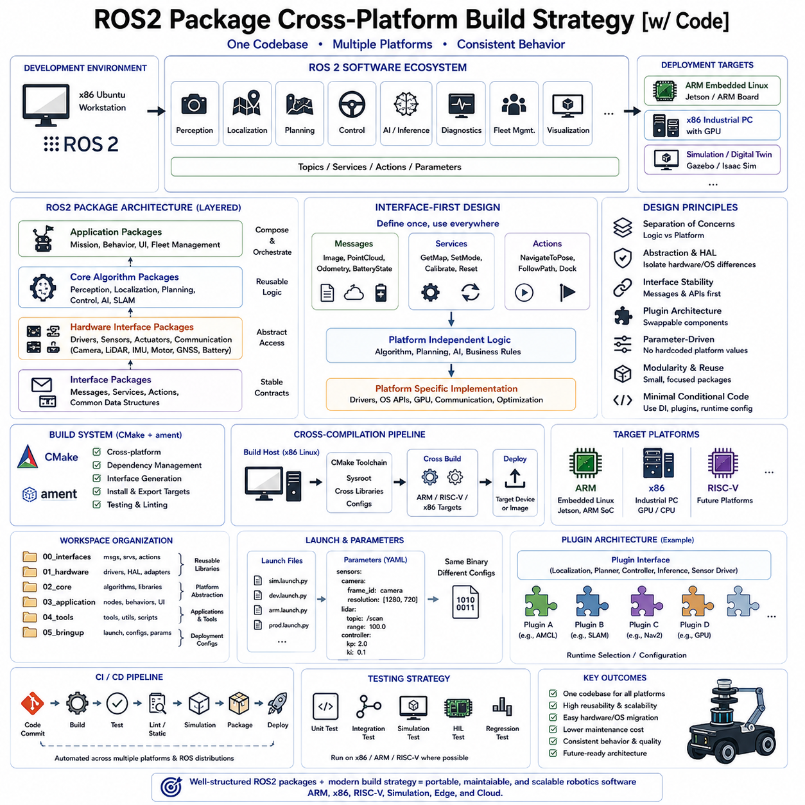{width="7.268055555555556in" height="7.268055555555556in"}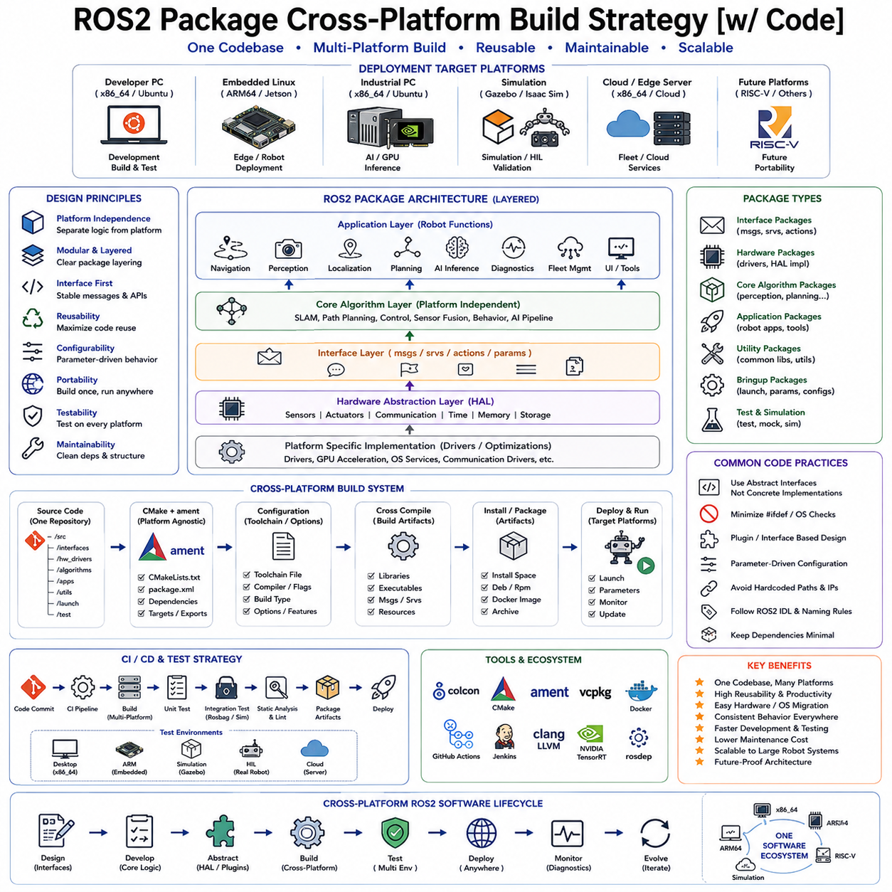{width="7.268055555555556in" height="7.268055555555556in"}

The uploaded engineering library positions **"23_11.06 ROS 2 Package Cross-Platform Build Strategy [w/Code]"** as the concluding technical chapter of the Cross-Platform Software Design section. After establishing the necessity of cross-platform architecture, Hardware Abstraction Layer design, modern build systems, processor portability, and common interfaces for Embedded Linux and RTOS, the next logical step is to demonstrate how these architectural principles are applied in practical ROS 2 software engineering. This chapter therefore focuses on designing ROS 2 packages that can be compiled, deployed, maintained, and executed across heterogeneous hardware platforms while preserving a single maintainable source tree. The emphasis is not merely on ROS 2 package creation but on building sustainable software architectures that support ARM, x86, RISC-V, simulation platforms, embedded Linux, cloud services, and future robotics hardware without unnecessary duplication of source code.

ROS 2 has become the dominant middleware framework for modern robotics because it provides standardized communication, distributed computation, modular software organization, and extensive community support. Unlike traditional monolithic robotic software, ROS 2 encourages decomposition of complex robotic functionality into independent software packages communicating through well-defined interfaces. Localization, mapping, perception, motion planning, navigation, diagnostics, artificial intelligence inference, hardware interfaces, visualization, fleet management, and cloud integration all become independent packages that cooperate through standardized message passing. This modular architecture naturally supports scalability, maintainability, and collaborative development across large engineering organizations.

Although ROS 2 itself is inherently cross-platform, achieving true portability requires considerably more than simply installing ROS 2 on different operating systems. A robotics organization may develop software on Ubuntu x86 workstations, deploy autonomous navigation on ARM-based embedded Linux computers, execute AI inference on GPU-equipped industrial PCs, validate algorithms within simulation environments, and eventually migrate portions of the software toward emerging RISC-V platforms. Without careful package architecture, each platform gradually accumulates unique modifications, leading to duplicated implementations, inconsistent behavior, increased maintenance costs, and growing technical debt. Cross-platform build strategies seek to eliminate this fragmentation by maintaining one logical software architecture supporting multiple deployment environments.

The fundamental principle of ROS 2 package portability is separation of platform-independent logic from platform-specific implementation. Application algorithms, navigation logic, perception pipelines, mission management, and business rules should remain independent of processor architecture, operating system, compiler, hardware interface, or deployment environment. Platform-dependent functionality---including hardware drivers, operating system services, GPU acceleration, communication interfaces, and optimization layers---should remain isolated within dedicated abstraction packages. This separation dramatically reduces software coupling while improving long-term maintainability.

ROS 2 package organization represents one of the most important architectural decisions affecting portability. Rather than constructing large packages containing hardware drivers, algorithms, visualization tools, launch configurations, and testing utilities simultaneously, software should be divided into clearly defined functional layers. Interface packages define messages, services, actions, and common data structures shared across the system. Hardware interface packages communicate directly with sensors and actuators. Core algorithm packages implement perception, localization, planning, control, and artificial intelligence independently of hardware. Application packages coordinate complete robotic behaviors using reusable lower-level software components. Such layered organization enables extensive software reuse while minimizing platform-specific modification.

Interface packages deserve particular attention because they establish stable contracts among independently developed software components. Messages, services, and actions should represent logical robotic concepts rather than hardware implementation details. Sensor messages should describe observations rather than communication protocols. Motion commands should specify desired robot behavior rather than motor controller registers. Diagnostic interfaces should communicate system health independently of underlying hardware implementation. Stable interfaces significantly simplify software evolution while enabling multiple hardware implementations to coexist beneath identical application software.

The build system plays a central role supporting ROS 2 portability. ROS 2 primarily employs CMake together with the ament build infrastructure, enabling packages to compile consistently across Linux, Windows, macOS, ARM embedded systems, x86 industrial computers, and simulation environments. Package configuration files describe dependencies, compiler requirements, interface generation, installation rules, testing procedures, and exported targets using platform-independent build descriptions. Consequently, software repositories remain largely independent of compiler-specific or operating-system-specific build logic.

Dependency management requires careful architectural planning within large ROS 2 systems. Direct dependencies among packages should remain minimal and reflect logical system architecture rather than implementation convenience. Hardware drivers should never depend upon application packages. Core algorithms should avoid unnecessary dependencies upon visualization or simulation utilities. Platform-specific optimization libraries should remain isolated behind hardware abstraction interfaces. Such dependency discipline significantly improves build scalability while reducing unnecessary recompilation throughout software evolution.

Cross-platform package design also emphasizes minimizing compile-time configuration. Excessive conditional compilation using preprocessor directives frequently introduces hidden complexity, reduces readability, and complicates testing. Instead, software architecture should employ dependency inversion, abstract interfaces, plugin mechanisms, and runtime configuration wherever practical. Build systems determine platform-specific implementations while application logic remains identical across supported architectures.

Plugin-based architectures provide particularly powerful mechanisms supporting ROS 2 portability. Rather than embedding hardware-specific implementations directly into navigation, perception, or localization algorithms, standardized plugin interfaces define expected functionality while individual plugins implement platform-specific behavior. Different LiDAR drivers, localization algorithms, motion planners, AI inference engines, or communication mechanisms become interchangeable components selected during deployment rather than compilation. This architectural flexibility substantially improves portability while simplifying long-term maintenance.

The ROS 2 component architecture further enhances cross-platform software reuse. Components encapsulate reusable computational units capable of executing independently or being dynamically composed within shared processes. Embedded platforms with limited computational resources may combine multiple components into single processes, reducing communication overhead. High-performance x86 systems may distribute identical components across separate processes to improve fault isolation and scalability. Application software remains unchanged while deployment strategies adapt according to hardware capabilities.

Launch systems represent another essential portability mechanism. ROS 2 launch descriptions define executable composition, parameter configuration, communication topology, namespace organization, and runtime initialization independently of operating system or processor architecture. Platform-specific deployment differences therefore remain isolated within launch configurations rather than embedded throughout application code. A single robotic application may employ alternative launch descriptions for simulation, desktop development, embedded deployment, cloud integration, or production systems while preserving identical software packages.

Parameter management significantly contributes to software portability. Hardcoded hardware assumptions should never appear within portable ROS 2 packages. Sensor calibration, communication addresses, controller gains, AI model paths, processor-specific optimization parameters, and deployment configuration should all reside within external parameter files. Parameter-driven software behavior allows identical binaries to support multiple robotic platforms simply by modifying deployment configuration rather than recompiling source code.

Hardware abstraction integrates naturally with ROS 2 package organization. Hardware drivers expose standardized interfaces representing cameras, LiDAR sensors, IMUs, motor controllers, GNSS receivers, battery systems, and communication devices. Core robotic algorithms interact exclusively through these abstract interfaces rather than directly accessing device drivers. Consequently, replacing physical hardware requires modification only within hardware interface packages while higher-level application software remains unaffected.

Cross-compilation constitutes another critical aspect of ROS 2 portability. Developers typically build ROS 2 software upon x86 Ubuntu workstations while deploying applications to ARM-based embedded Linux computers such as NVIDIA Jetson devices or industrial ARM processors. CMake toolchain files, sysroot configuration, cross-compiled dependency libraries, and architecture-specific package repositories enable automated generation of executable software for heterogeneous target platforms. Successful cross-compilation workflows eliminate manual platform-specific source modification while preserving consistent software behavior.

Workspace organization also influences maintainability. Large robotic projects frequently employ multiple workspaces separating reusable libraries, third-party dependencies, internal platform software, customer-specific applications, and experimental research modules. Such organization minimizes unnecessary recompilation while improving software version management. Overlay workspaces permit platform-specific extensions without modifying stable foundational software, thereby preserving long-term maintainability across multiple product generations.

Testing strategies must support every deployment platform. Unit tests verify algorithmic correctness independently of hardware. Integration tests validate communication among ROS 2 packages. Simulation environments confirm functional behavior before deployment. Hardware-in-the-loop systems evaluate real sensor interfaces under controlled conditions. Continuous integration pipelines automatically execute these validation stages across supported processor architectures whenever practical. Platform-independent testing substantially improves software quality while identifying portability issues early during development.

Simulation compatibility represents one of ROS 2\'s greatest strengths. Gazebo, Isaac Sim, Webots, Unity-based digital twins, and custom simulators commonly execute on x86 Linux workstations while physical robots operate on ARM embedded computers. Through standardized message interfaces and hardware abstraction layers, identical ROS 2 packages execute within both environments without source modification. Only hardware interface implementations change between simulation and physical deployment, dramatically accelerating development while reducing testing costs.

Artificial intelligence integration introduces additional portability considerations. AI inference packages frequently utilize TensorRT, ONNX Runtime, CUDA, OpenVINO, or CPU-based inference engines depending upon available hardware acceleration. Rather than coupling perception software directly to individual inference frameworks, standardized inference interfaces permit multiple execution backends while preserving identical application behavior. Platform-specific optimization therefore remains isolated beneath common software contracts.

Distributed robotics further extends portability requirements. Edge computers, cloud infrastructure, autonomous mobile robots, industrial controllers, and simulation platforms frequently execute different subsets of identical ROS 2 software repositories. Cross-platform package design enables organizations to deploy appropriate software components according to computational capabilities while preserving unified software architecture throughout the distributed robotic ecosystem.

Continuous Integration and Continuous Deployment have become indispensable within professional ROS 2 development. Every source code modification should automatically trigger package dependency analysis, compilation, unit testing, static analysis, interface generation, simulation validation, artifact packaging, documentation generation, and deployment verification across multiple supported architectures. Automated build pipelines ensure software quality while maintaining reproducibility throughout long-term project evolution.

Software version management requires careful coordination across ROS 2 distributions. Different robotic products may depend upon Humble, Iron, Jazzy, or future ROS 2 releases while sharing substantial portions of application software. Cross-platform architecture therefore emphasizes minimizing direct dependency upon distribution-specific implementation details. Stable abstraction interfaces, standardized message definitions, careful dependency management, and disciplined software organization significantly simplify migration between ROS 2 releases.

Real-time robotics introduces additional architectural considerations. Time-critical motor control frequently executes outside conventional ROS 2 communication layers within dedicated real-time controllers or RTOS environments. Higher-level ROS 2 packages communicate with these controllers through deterministic interfaces while preserving modular architecture. Such separation enables Linux-hosted ROS 2 applications to cooperate naturally with RTOS-based control systems without compromising deterministic execution requirements.

Cybersecurity increasingly influences ROS 2 package design. Authentication, encrypted communication, secure parameter storage, certificate management, secure software updates, and integrity verification should remain independent of processor architecture or deployment environment. Security functionality should therefore reside within reusable middleware services and platform abstraction layers rather than scattered throughout application packages. Consistent security architecture simplifies deployment across heterogeneous robotic systems while reducing maintenance complexity.

Scalability represents one of the greatest benefits of disciplined ROS 2 package organization. Educational robots, autonomous mobile robots, industrial manipulators, inspection robots, outdoor autonomous vehicles, collaborative robots, and humanoid platforms frequently share navigation, localization, perception, diagnostics, fleet communication, and artificial intelligence software despite substantial hardware differences. Well-designed cross-platform package architecture enables these software assets to evolve collectively across multiple product families while minimizing duplicated engineering effort.

Future robotics platforms will likely incorporate increasingly heterogeneous computing environments including AI accelerators, cloud-native services, digital twins, software-defined robotics, distributed edge intelligence, and specialized robotic processors. ROS 2 package architecture emphasizing hardware abstraction, stable interfaces, modular organization, dependency inversion, reproducible builds, parameter-driven configuration, automated testing, and cross-platform deployment provides the engineering foundation necessary to support this technological evolution.

Ultimately, ROS 2 package cross-platform build strategy represents considerably more than build automation or package organization. It establishes a comprehensive architectural methodology enabling one software ecosystem to support multiple processors, operating systems, hardware configurations, deployment environments, and future technologies while preserving maintainability, scalability, portability, and software quality. By carefully separating platform-independent application logic from hardware-specific implementation, organizing software around stable interfaces, employing reproducible build systems, integrating automated testing, and embracing modular package architecture, robotics organizations create sustainable software foundations capable of supporting decades of product evolution across rapidly changing computational platforms.

## 11.07 Common SW Components for AMR / Manipulator / Quadruped / Humanoid

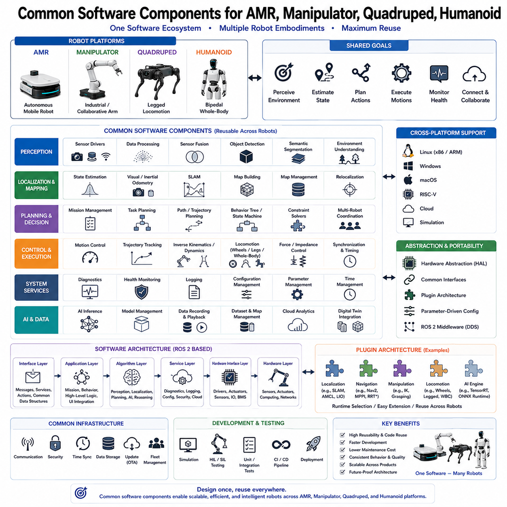{width="7.268055555555556in" height="7.268055555555556in"}

The uploaded engineering library places **"23_11.07 Common Software Components for AMR, Manipulator, Quadruped, and Humanoid"** near the conclusion of the Cross-Platform Software Design chapter. This placement is intentional because, after establishing hardware abstraction, platform-independent build systems, processor portability, operating system abstraction, and ROS 2 cross-platform package strategies, the next architectural objective is identifying software components that can be reused across multiple robot categories. Modern robotics is rapidly evolving toward software-defined robotic platforms where a significant portion of software remains identical regardless of whether the physical system is an Autonomous Mobile Robot (AMR), industrial manipulator, quadruped robot, humanoid robot, service robot, or future intelligent machine. This chapter therefore examines architectural methodologies for designing reusable software components that maximize code reuse, reduce maintenance costs, accelerate product development, and establish a common software ecosystem across diverse robotic platforms.

Historically, robotic software was developed separately for each hardware platform. Mobile robots possessed independent navigation software, manipulators utilized specialized motion control systems, quadruped robots employed unique locomotion frameworks, and humanoid robots maintained entirely separate software architectures. Although these systems shared numerous computational principles---including perception, localization, communication, diagnostics, planning, artificial intelligence, and safety monitoring---their software evolved independently because hardware differences dominated engineering decisions. As robotics systems became increasingly sophisticated, duplicated software assets accumulated rapidly, creating unnecessary maintenance effort and limiting software reuse across product families.

The emergence of modern software engineering principles, modular middleware, Hardware Abstraction Layers, ROS 2, cloud robotics, artificial intelligence, and distributed computing fundamentally changed this development paradigm. Contemporary robotics increasingly views software as a reusable engineering asset independent of mechanical embodiment. Rather than developing separate software stacks for every robot type, organizations now design platform-independent software components that can operate across wheeled robots, articulated manipulators, quadrupeds, humanoids, collaborative robots, logistics systems, inspection robots, agricultural platforms, and future robotic products. Mechanical diversity becomes an implementation concern rather than an architectural boundary.

The concept of common software components originates from the observation that nearly every autonomous robot performs similar computational activities despite significant differences in mechanical structure. Every robot perceives its environment through sensors, estimates state, plans actions, executes control commands, monitors system health, communicates with external systems, manages missions, records diagnostics, and increasingly performs artificial intelligence inference. The physical actuators differ substantially among robot types, but the majority of computational logic remains conceptually identical. Software architecture therefore benefits enormously from separating embodiment-specific functionality from embodiment-independent intelligence.

One of the most reusable software domains is perception. Cameras, LiDAR sensors, radar systems, depth sensors, tactile arrays, force sensors, IMUs, GNSS receivers, ultrasonic devices, and thermal cameras generate observations regardless of robot morphology. An AMR interprets sensor data to navigate warehouse environments. A manipulator uses identical perception pipelines for object detection and grasp planning. A quadruped employs similar environmental understanding for terrain traversal. Humanoid robots integrate multiple sensor modalities to interact naturally with human environments. Although application objectives differ, the underlying perception algorithms---including image processing, point cloud filtering, sensor fusion, object recognition, semantic segmentation, and environment representation---remain highly reusable across all robotic platforms.

Localization represents another universally applicable software component. Every autonomous robot requires estimation of its own position and orientation relative to the surrounding environment. AMRs estimate two-dimensional position within warehouses. Manipulators estimate end-effector pose relative to workpieces. Quadrupeds estimate body orientation while traversing uneven terrain. Humanoids maintain full-body pose estimation during dynamic locomotion and manipulation. Despite differing kinematic structures, localization software frequently employs identical mathematical frameworks involving sensor fusion, probabilistic estimation, Kalman filtering, graph optimization, visual odometry, inertial navigation, simultaneous localization and mapping, and uncertainty management. Well-designed localization frameworks therefore remain reusable across diverse robotic embodiments.

Mapping systems similarly demonstrate extensive software commonality. Mobile robots construct occupancy grids, manipulators generate local workspace representations, quadrupeds produce traversability maps, and humanoids maintain semantic environmental models supporting navigation and manipulation. Underlying software techniques---including point cloud integration, voxel representation, mesh generation, semantic annotation, obstacle classification, dynamic environment updates, and map persistence---remain largely independent of mechanical configuration. Mapping therefore naturally becomes a shared software service supporting multiple robot families.

Planning architecture also exhibits substantial reuse potential. Every autonomous system transforms goals into executable action sequences. AMRs compute navigation paths, manipulators generate collision-free arm trajectories, quadrupeds determine stable locomotion strategies, and humanoids coordinate simultaneous whole-body movement and manipulation. Although motion constraints differ, planning software frequently shares graph search algorithms, optimization frameworks, task decomposition, behavioral sequencing, decision trees, finite state machines, behavior trees, constraint solving, and mission management infrastructure. High-level planning therefore becomes largely independent from specific robot kinematics.

Motion control represents an area where abstraction becomes particularly valuable. Low-level actuator control necessarily differs among differential-drive vehicles, articulated manipulators, quadruped legs, and humanoid joints. Nevertheless, application software rarely interacts directly with motor controllers. Instead, standardized motion interfaces describe desired velocities, trajectories, forces, joint positions, operational modes, and synchronization requirements. Robot-specific controllers translate these abstract commands into embodiment-specific actuator behavior. Consequently, application software remains independent of mechanical implementation while lower control layers accommodate platform diversity.

Mission management provides another highly reusable software capability. Autonomous systems execute missions consisting of sequential tasks, conditional decisions, monitoring activities, recovery procedures, and completion criteria. Whether delivering warehouse inventory, assembling industrial products, inspecting infrastructure, traversing hazardous terrain, or assisting humans within domestic environments, robots require comparable mission orchestration capabilities. Task scheduling, workflow management, behavioral coordination, resource allocation, exception handling, and operational supervision therefore become common software services independent of robot morphology.

Artificial intelligence increasingly reinforces software commonality across robotic platforms. Deep learning models supporting object recognition, semantic segmentation, language understanding, anomaly detection, predictive maintenance, human interaction, reinforcement learning, and multimodal reasoning frequently operate independently of mechanical embodiment. AI software consumes sensor observations and produces semantic understanding or decision recommendations regardless of whether execution occurs upon an AMR, manipulator, quadruped, or humanoid. Consequently, AI inference frameworks, model management systems, optimization pipelines, and deployment infrastructure naturally become reusable software components.

Communication infrastructure also demonstrates extensive portability. Every intelligent robot exchanges information with operators, fleet management systems, cloud services, digital twins, databases, maintenance tools, simulation environments, and neighboring robotic systems. Communication mechanisms including DDS, MQTT, REST APIs, WebSocket protocols, gRPC services, industrial fieldbus networks, and cloud messaging frameworks remain independent of mechanical design. Standard communication interfaces therefore become foundational software assets supporting all robotic products.

System diagnostics represent another universally applicable software capability. Every robotic platform continuously monitors processor utilization, memory consumption, communication health, sensor availability, actuator status, battery condition, thermal behavior, software exceptions, hardware faults, network connectivity, and operational performance. Although diagnostic thresholds differ according to hardware configuration, diagnostic architecture remains largely identical. Standardized health monitoring services simplify maintenance while enabling consistent operational management across diverse robotic platforms.

Safety management similarly transcends robot embodiment. Emergency stop handling, watchdog supervision, fault detection, redundancy management, operational state monitoring, recovery procedures, safety logging, and protective shutdown behavior remain essential regardless of robot type. Safety architecture therefore benefits from standardized software components implementing common safety semantics while allowing platform-specific adaptation for different mechanical hazards and operational environments.

Configuration management becomes increasingly important as product portfolios expand. Rather than embedding hardware assumptions directly within source code, modern software systems externalize calibration parameters, communication addresses, operational limits, controller gains, sensor configuration, AI model selection, and deployment characteristics into structured configuration repositories. Configuration-driven software enables identical binaries to support multiple robotic platforms simply by changing deployment parameters, significantly improving maintainability and reducing engineering effort.

User interface architecture also demonstrates significant reuse. Operators require dashboards displaying system status, mission progress, diagnostics, environmental visualization, performance metrics, operational history, alarms, and maintenance information regardless of robot type. Although visualization content differs according to application domain, underlying interface frameworks, communication infrastructure, authentication mechanisms, logging systems, and configuration interfaces remain broadly reusable throughout robotic ecosystems.

Cloud integration further emphasizes software commonality. Fleet management, data analytics, software updates, digital twin synchronization, predictive maintenance, operational optimization, remote diagnostics, AI model deployment, and centralized mission coordination represent cloud services equally valuable for AMRs, manipulators, quadrupeds, humanoids, and collaborative robots. Common cloud interfaces significantly reduce software duplication while supporting scalable deployment across expanding robotic fleets.

Simulation infrastructure constitutes another highly reusable software domain. Modern robotics development increasingly depends upon Gazebo, Isaac Sim, Webots, Unity-based digital twins, Hardware-in-the-Loop validation, Software-in-the-Loop testing, synthetic data generation, and virtual commissioning. Standardized simulation interfaces enable identical application software to execute within simulated and physical environments regardless of robot embodiment. Such capability dramatically accelerates development while improving software reliability.

Hardware Abstraction Layers remain central to achieving software reuse. Sensors, actuators, communication devices, timing services, storage systems, networking interfaces, and processor resources should never appear directly within reusable application software. Instead, standardized abstraction layers isolate hardware-specific implementation beneath common software interfaces. Consequently, replacing wheeled locomotion with articulated legs or robotic arms affects only hardware adaptation modules while preserving upper software architecture.

ROS 2 package organization provides practical realization of common software components. Interface packages define shared messages, services, and actions. Core algorithm packages implement reusable computational logic. Hardware packages manage embodiment-specific interfaces. Application packages coordinate complete robotic behaviors through composition of reusable software modules. Such layered organization minimizes duplicated implementation while supporting independent software evolution across diverse robotic platforms.

Plugin architecture further enhances flexibility. Different localization algorithms, navigation planners, manipulation controllers, locomotion strategies, AI inference engines, and perception pipelines implement common interfaces while remaining interchangeable according to deployment requirements. AMRs may utilize two-dimensional navigation plugins, quadrupeds employ terrain-aware locomotion plugins, manipulators select inverse kinematics plugins, and humanoids execute whole-body motion plugins without altering application architecture. Runtime configurability therefore supports extensive product diversity within unified software ecosystems.

Component-based architecture also improves scalability. Reusable software components encapsulate perception, localization, planning, communication, diagnostics, mission management, AI inference, and visualization independently of deployment configuration. Embedded robots compose components according to available computational resources while industrial platforms distribute identical components across multiple processors or cloud infrastructure. Software architecture remains consistent despite significant differences in hardware capability.

Testing strategies become substantially more efficient when software components remain reusable. Unit tests validate common algorithms independently of robot embodiment. Simulation environments evaluate software across multiple virtual robot models. Continuous integration systems execute identical regression suites for AMRs, manipulators, quadrupeds, and humanoids simultaneously. Hardware-specific testing remains localized to embodiment-dependent interfaces while reusable software maintains consistent quality throughout product evolution.

Cybersecurity services likewise benefit from common architecture. Authentication, encrypted communication, certificate management, secure boot procedures, software integrity verification, role-based access control, secure parameter storage, and software update mechanisms remain independent of mechanical embodiment. Centralized security components simplify maintenance while ensuring consistent protection across heterogeneous robotic platforms.

Scalability represents perhaps the greatest long-term advantage of common software component design. Robotics organizations rarely develop only one product. Educational robots, logistics platforms, inspection systems, collaborative manipulators, outdoor autonomous vehicles, agricultural machines, humanoids, healthcare assistants, and industrial automation systems increasingly share identical software infrastructure despite dramatically different mechanical realization. Organizations investing in reusable software architecture therefore achieve significantly lower maintenance costs, faster development cycles, higher software quality, and more sustainable engineering practices.

Future robotics will likely evolve toward increasingly generalized intelligent machines combining locomotion, manipulation, perception, reasoning, communication, cloud intelligence, and human collaboration within unified software ecosystems. Boundaries separating AMRs, manipulators, quadrupeds, and humanoids will continue diminishing as multifunctional robots emerge. Consequently, software architecture emphasizing reusable components, stable interfaces, hardware abstraction, platform independence, modular package organization, and standardized communication becomes essential for long-term technological sustainability.

Ultimately, common software components represent one of the most important architectural principles supporting Software-Defined Robotics and Physical AI. By recognizing that intelligence, perception, planning, communication, diagnostics, safety, artificial intelligence, cloud integration, and mission management remain fundamentally independent of mechanical embodiment, organizations transform software from isolated product implementations into reusable strategic assets. Such architecture maximizes software reuse, accelerates innovation, simplifies maintenance, protects intellectual property, and establishes the engineering foundation upon which future generations of autonomous intelligent robotic systems can be efficiently developed across continuously evolving hardware platforms.

## 11.08 Multi-Target Build Configuration in CI/CD [w/Code]

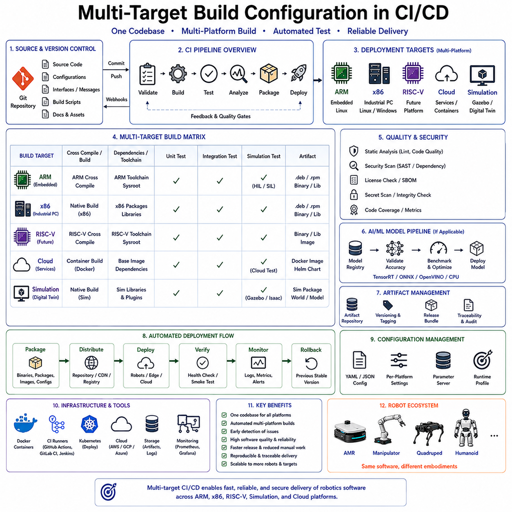{width="7.268055555555556in" height="7.268055555555556in"}

The uploaded engineering library positions **"23_11.08 Multi-Target Build Configuration in CI/CD"** as the concluding chapter of the Cross-Platform Software Design section. This placement is intentional because, after introducing hardware abstraction, build systems, processor portability, common interfaces, ROS 2 cross-platform package strategies, and reusable software components, the final architectural challenge is automating the construction, validation, testing, packaging, and deployment of software across multiple hardware platforms. Modern robotics organizations rarely build software for a single processor or operating system. Instead, they continuously deliver software to desktop development systems, embedded ARM computers, industrial x86 controllers, simulation platforms, cloud infrastructure, and increasingly heterogeneous AI accelerators. Consequently, Continuous Integration and Continuous Deployment (CI/CD) pipelines become essential infrastructure supporting scalable software engineering. This chapter examines architectural principles for designing multi-target build configurations that enable automated software delivery while preserving portability, reproducibility, software quality, and long-term maintainability.

Continuous Integration represents far more than automatically compiling source code after each commit. It establishes an engineering discipline in which every software modification is immediately validated against the entire software ecosystem. Source code is automatically compiled, dependencies are verified, interfaces are regenerated, static analysis is executed, unit tests are performed, integration tests are launched, simulation scenarios are evaluated, software packages are assembled, documentation is updated, and deployment artifacts are generated. Rather than postponing integration until late development phases, CI continuously verifies that software remains healthy throughout daily engineering activities.

Continuous Deployment extends this philosophy by automating software delivery after successful validation. Instead of manually copying executable files onto robotic platforms, CI/CD pipelines automatically package software, generate release artifacts, create installation packages, publish container images, update package repositories, distribute firmware, and deploy cloud services according to predefined quality gates. Such automation significantly reduces human error while improving software consistency across multiple deployment environments.

Modern robotic software introduces unique CI/CD challenges because software executes across numerous heterogeneous platforms simultaneously. Development commonly occurs on Ubuntu x86 workstations, autonomous navigation executes on ARM-based embedded Linux computers, artificial intelligence inference utilizes GPU-equipped industrial PCs, simulation operates on desktop workstations, cloud services execute inside container orchestration platforms, and low-level controllers operate on RTOS-based microcontrollers. Maintaining independent build processes for every platform rapidly becomes unmanageable. Multi-target build configuration therefore centralizes software construction while producing platform-specific artifacts automatically.

The fundamental principle of multi-target configuration is maintaining a single authoritative source repository supporting all deployment environments. Source code should not be duplicated merely because target processors differ. Instead, platform differences remain isolated within build configuration, toolchain definitions, hardware abstraction layers, deployment scripts, and runtime parameters. Application software therefore evolves as one coherent codebase while CI/CD infrastructure generates optimized binaries for each supported platform.

Version control systems constitute the foundation of automated software delivery. Every source modification, configuration change, dependency update, documentation revision, interface definition, build script adjustment, and deployment description becomes traceable through repository history. Branching strategies, merge requests, code review workflows, release tagging, semantic versioning, and artifact traceability collectively ensure that every deployed binary corresponds precisely to validated source revisions. Such traceability becomes particularly important for safety-critical robotics requiring reproducible certification and operational accountability.

Modern robotics organizations frequently adopt monorepository architectures supporting shared software libraries, hardware drivers, middleware interfaces, artificial intelligence models, simulation assets, testing infrastructure, cloud services, deployment scripts, and documentation within unified repositories. Multi-target CI/CD pipelines analyze repository changes, identify affected software modules, minimize unnecessary recompilation, and execute only required validation stages. Such scalability significantly reduces build time while preserving software quality across expanding engineering organizations.

Build systems serve as the operational engine underlying CI/CD automation. CMake, Bazel, ament, colcon, and cross-compilation toolchains cooperate to generate software for ARM, x86, RISC-V, simulation environments, cloud infrastructure, and embedded controllers. Rather than maintaining independent project configurations for every deployment target, parameterized build descriptions generate architecture-specific outputs according to selected target profiles. Consequently, adding support for new processors requires extending configuration rather than rewriting software architecture.

Multi-target pipelines commonly begin with source validation. Formatting verification, coding standard compliance, dependency consistency, license verification, configuration integrity, and static code analysis execute before compilation. Early detection of syntax errors, inconsistent interfaces, missing dependencies, deprecated APIs, or architectural violations prevents unnecessary resource consumption during later pipeline stages. Such validation also improves developer feedback by identifying problems immediately after code submission.

Compilation typically occurs simultaneously across multiple execution environments. Linux x86 builds validate desktop development. ARM cross-compilation generates embedded deployment artifacts. Windows builds verify platform compatibility when applicable. Simulation targets produce executable software for virtual environments. Cloud services compile containerized applications. Specialized AI targets generate optimized inference binaries utilizing CUDA, TensorRT, OpenVINO, or alternative acceleration frameworks. Parallel execution dramatically reduces overall pipeline duration while continuously validating cross-platform portability.

Cross-compilation represents one of the defining capabilities of multi-target CI/CD infrastructure. Developers rarely possess every target architecture locally, making automated cross-compilation indispensable. Dedicated toolchains, sysroot images, architecture-specific dependency repositories, compiler containers, and reproducible build environments enable CI servers to generate binaries for processors unavailable within local development environments. Such capability substantially simplifies support for diverse robotic hardware while maintaining consistent software quality.

Containerization further strengthens reproducibility throughout CI/CD workflows. Docker containers encapsulate compilers, package managers, middleware dependencies, SDKs, AI frameworks, operating system libraries, and build utilities within standardized execution environments. Consequently, software builds execute identically regardless of physical CI server configuration, cloud infrastructure, or local development workstation. Containerized pipelines eliminate many historical build inconsistencies arising from undocumented workstation configuration differences.

Dependency management becomes increasingly important within multi-target environments. Different deployment targets frequently require distinct library versions, processor optimizations, hardware SDKs, operating system packages, or AI acceleration frameworks. Rather than embedding such variation directly into application software, dependency management systems resolve platform-specific packages automatically according to build profiles. Centralized dependency definitions therefore simplify maintenance while improving long-term reproducibility.

Testing architecture forms another cornerstone of CI/CD automation. Unit tests verify individual software components independently of hardware. Integration tests evaluate communication among software modules. Simulation environments validate complete robotic workflows. Hardware-in-the-loop testing confirms interaction with physical devices. Regression testing ensures previously validated functionality remains operational despite ongoing development. Multi-target pipelines coordinate these validation stages across every supported processor architecture whenever practical, providing continuous confidence in software quality.

Simulation assumes an especially valuable role because physical robotic hardware frequently remains unavailable during continuous integration. Gazebo, Isaac Sim, Webots, Unity-based digital twins, and custom simulation frameworks execute realistic operational scenarios validating navigation, perception, planning, communication, manipulation, and mission management without requiring physical robots. Automated simulation testing significantly increases validation coverage while reducing hardware dependency throughout software development.

Static analysis complements conventional testing by identifying architectural defects without executing software. Memory safety violations, resource leaks, undefined behavior, concurrency hazards, coding standard violations, security vulnerabilities, portability issues, and performance anomalies become detectable immediately following compilation. Incorporating static analysis into CI/CD pipelines substantially improves software robustness while reducing downstream debugging effort.

Security verification increasingly constitutes an essential pipeline stage. Modern robotic systems depend upon extensive third-party software including middleware, artificial intelligence frameworks, communication libraries, operating system packages, container images, and cloud infrastructure. CI/CD pipelines therefore scan dependencies for known vulnerabilities, validate software integrity, verify cryptographic signatures, generate software bills of materials, enforce license compliance, and evaluate supply chain security before deployment. Such practices strengthen cybersecurity throughout the software lifecycle.

Artificial intelligence introduces additional deployment complexity requiring specialized CI/CD capabilities. Machine learning models evolve independently from application software, necessitating separate validation, benchmarking, optimization, quantization, compatibility verification, and deployment procedures. Pipelines may automatically evaluate inference accuracy, computational performance, GPU utilization, memory consumption, latency, and numerical consistency before publishing optimized models for embedded or cloud execution. AI lifecycle automation therefore becomes an integral component of modern robotics software engineering.

Artifact management represents another critical responsibility of CI/CD systems. Successful builds generate executable binaries, shared libraries, firmware images, Docker containers, ROS 2 packages, documentation, test reports, configuration archives, AI models, deployment scripts, and installation packages. Rather than storing these outputs informally, artifact repositories maintain versioned records supporting traceability, rollback, reproducibility, certification, and long-term product maintenance. Every deployed robot therefore references precisely identifiable software artifacts generated through validated pipelines.

Deployment automation extends beyond software packaging toward operational lifecycle management. Embedded robots may receive over-the-air firmware updates, industrial computers install new ROS 2 packages, cloud infrastructure deploys updated container images, fleet management services synchronize configuration changes, and digital twins automatically receive corresponding simulation assets. Automated deployment reduces operational complexity while improving software consistency across distributed robotic fleets.

Rollback capability represents an equally important architectural consideration. Software updates occasionally introduce unforeseen operational issues despite extensive testing. Multi-target CI/CD infrastructure therefore preserves previous validated releases, enabling rapid restoration of stable software versions without manual reconstruction. Automated rollback significantly improves operational reliability while reducing downtime in production robotic systems.

Configuration management plays a central role throughout deployment. Hardware calibration parameters, communication settings, AI model selection, safety limits, network addresses, mission configuration, sensor alignment, controller gains, and customer-specific customization should remain externalized from application software. CI/CD pipelines package appropriate configuration profiles according to deployment targets, allowing identical binaries to support diverse robotic platforms through parameterization rather than recompilation.

ROS 2 software particularly benefits from automated build orchestration. Colcon workspaces, interface generation, package dependency analysis, message compilation, launch configuration validation, parameter verification, simulation testing, and package installation become fully automated within CI/CD workflows. Such automation greatly simplifies maintenance of large ROS 2 ecosystems spanning hundreds of packages across multiple robotic platforms.

Scalability becomes increasingly important as robotics organizations expand product portfolios. Educational robots, autonomous mobile robots, industrial manipulators, quadrupeds, humanoids, inspection platforms, agricultural vehicles, and healthcare robots frequently share common software infrastructure while differing substantially in hardware implementation. Multi-target CI/CD pipelines automatically select relevant build configurations, testing procedures, deployment artifacts, and packaging strategies according to product definitions while preserving unified software architecture across the organization.

Performance optimization also integrates naturally into automated pipelines. Benchmark execution, execution profiling, memory consumption analysis, latency measurement, processor utilization, GPU performance evaluation, and power consumption monitoring execute continuously throughout development. Automated performance regression detection ensures optimization efforts remain effective while preventing unnoticed degradation as software evolves.

Quality metrics provide quantitative assessment supporting engineering decision-making. Build success rates, test coverage, defect density, code complexity, dependency health, security posture, documentation completeness, pipeline duration, deployment frequency, and operational reliability collectively characterize software maturity. Continuous measurement enables organizations to improve engineering processes systematically rather than relying solely upon subjective evaluation.

Cloud-native infrastructure increasingly influences robotics CI/CD architecture. Distributed build farms, remote artifact repositories, scalable simulation clusters, AI training services, container orchestration platforms, and centralized observability systems enable engineering organizations to manage growing computational requirements efficiently. Cloud integration further facilitates globally distributed development teams collaborating within unified software ecosystems.

Future robotics will continue expanding toward heterogeneous computing involving AI accelerators, software-defined robotics, distributed edge intelligence, cloud-native autonomy, digital twins, and continuously evolving hardware platforms. Multi-target CI/CD infrastructure provides the operational foundation supporting this evolution by ensuring software remains reproducible, portable, testable, secure, and deployable regardless of underlying computational architecture.

Ultimately, multi-target build configuration within CI/CD represents considerably more than automated compilation. It establishes a comprehensive engineering methodology integrating source management, reproducible builds, cross-compilation, dependency management, automated validation, simulation, security verification, artifact management, deployment automation, rollback capability, performance optimization, and lifecycle governance into one coherent software delivery ecosystem. Organizations embracing such architecture dramatically improve software quality, reduce maintenance costs, accelerate innovation, strengthen operational reliability, and establish sustainable engineering foundations capable of supporting increasingly sophisticated robotic systems across continuously expanding hardware and deployment environments.

## 11.09 HIL Cross-Platform Test Environment

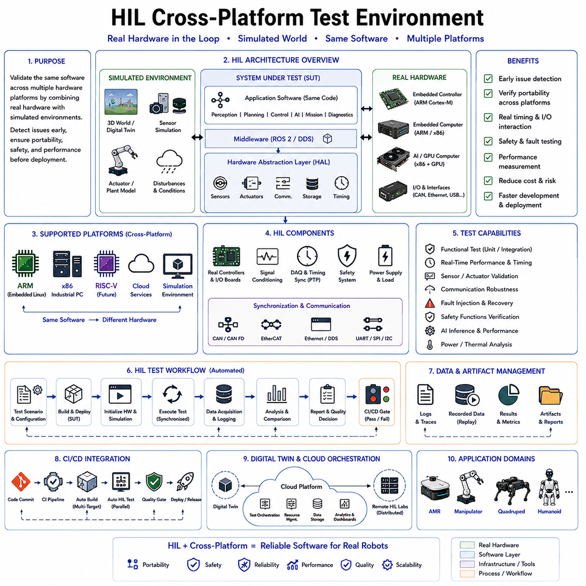{width="7.268055555555556in" height="7.268055555555556in"}

The uploaded engineering library positions **"23_11.09 HIL Cross-Platform Test Environment"** as the final verification topic within the Cross-Platform Software Design chapter. This placement is architecturally meaningful because, after defining hardware abstraction, cross-platform build systems, processor portability, reusable software components, and automated CI/CD pipelines, the final responsibility of software engineering is proving that software behaves identically across heterogeneous hardware platforms. A Hardware-in-the-Loop (HIL) Cross-Platform Test Environment establishes this confidence by connecting real hardware, simulated environments, embedded controllers, industrial computers, cloud services, and software automation into one unified validation framework. Rather than validating software only after complete system integration, HIL enables continuous verification throughout development while significantly reducing technical risk, improving software quality, and accelerating product deployment.

Modern robotics software is no longer developed for a single processor, operating system, or hardware configuration. Autonomous Mobile Robots, industrial manipulators, quadruped robots, humanoid platforms, inspection robots, agricultural machines, collaborative robots, and intelligent service systems all utilize different combinations of embedded processors, industrial computers, GPUs, microcontrollers, sensors, communication networks, and artificial intelligence accelerators. Although these systems often share common software architecture, they execute under significantly different computational conditions. Consequently, validating software solely within desktop simulation or solely on physical robots is insufficient. A comprehensive HIL environment bridges the gap between simulation and real hardware by executing production software against actual electronic components while virtualizing the remaining system.

Hardware-in-the-Loop differs fundamentally from conventional software testing. Traditional unit tests verify isolated software functions, integration tests validate communication among software modules, and simulation environments evaluate algorithmic behavior within virtual worlds. HIL extends these approaches by incorporating physical controllers, sensors, communication buses, timing hardware, and embedded processors into the testing environment. Software therefore interacts with real electrical interfaces while the surrounding physical environment remains computationally simulated. This combination provides significantly higher confidence than pure simulation while avoiding the expense and operational limitations of full-system physical testing.

The principal objective of HIL is deterministic validation of software behavior before deployment onto complete robotic platforms. Rather than discovering hardware integration problems during field trials, engineering teams identify timing issues, communication failures, synchronization errors, sensor interface problems, controller instability, and software defects within controlled laboratory environments. This dramatically reduces development risk while shortening system integration schedules.

Cross-platform HIL extends this concept further by supporting multiple processor architectures simultaneously. A modern robotics organization may validate ARM Cortex-M motor controllers, ARM Cortex-A embedded Linux computers, x86 industrial PCs, GPU-accelerated AI processors, RISC-V experimental hardware, and cloud-based fleet management software within one integrated testing framework. The same application software executes across all supported architectures while the HIL environment coordinates synchronized testing, data acquisition, fault injection, performance measurement, and result comparison.

One of the greatest architectural benefits of cross-platform HIL is verification of software portability. Hardware abstraction layers, operating system abstraction, ROS 2 middleware, communication interfaces, artificial intelligence frameworks, and reusable software components are intended to behave consistently regardless of underlying hardware. HIL testing continuously confirms these architectural assumptions by executing identical functional scenarios across heterogeneous computing platforms and comparing operational outcomes. Any platform-specific deviation becomes immediately detectable before deployment.

Processor diversity introduces numerous validation challenges that HIL environments effectively address. ARM embedded computers frequently emphasize power efficiency, x86 industrial computers prioritize computational throughput, microcontrollers execute deterministic real-time control, and AI accelerators optimize neural network inference. Although application software remains identical, timing characteristics, scheduling behavior, floating-point implementation, compiler optimization, cache architecture, and memory organization vary substantially. Cross-platform HIL enables quantitative comparison of functional correctness, execution latency, synchronization accuracy, and computational performance across these diverse execution environments.

The HIL environment typically consists of several tightly integrated architectural layers. The lowest layer contains actual embedded hardware including motor controllers, battery management systems, communication interfaces, safety processors, real-time controllers, sensor interfaces, and industrial I/O modules. Above this layer reside simulation computers generating virtual environments, sensor stimuli, dynamic system models, environmental conditions, and digital twins. Supervisory systems coordinate synchronization, test execution, data recording, performance analysis, fault injection, and automated reporting. Cloud infrastructure frequently manages test scheduling, artifact storage, analytics, and continuous integration while engineering workstations provide visualization, debugging, and interactive development capabilities.

Hardware abstraction significantly simplifies HIL architecture. Rather than exposing individual hardware devices directly to application software, standardized interfaces represent cameras, LiDAR sensors, IMUs, GNSS receivers, motor controllers, robotic joints, batteries, and communication systems. HIL implementations substitute either physical devices or virtual models beneath these interfaces according to testing objectives. Consequently, identical application software executes regardless of whether sensor observations originate from actual hardware or simulated environments.

Timing accuracy represents one of the most critical requirements within HIL systems. Robotic control software depends heavily upon deterministic execution frequencies, synchronized sensor acquisition, timestamp consistency, communication deadlines, and real-time scheduling. HIL environments therefore employ synchronized clocks, hardware timing references, precision timestamp generation, deterministic communication scheduling, and carefully controlled execution environments. Such infrastructure ensures laboratory validation accurately reflects operational deployment conditions.

Sensor simulation constitutes another essential capability. Cameras, LiDAR systems, IMUs, force sensors, tactile arrays, GPS receivers, encoders, radar units, ultrasonic sensors, and thermal cameras can all be simulated mathematically while maintaining realistic electrical interfaces. Embedded software therefore processes synthetic observations exactly as it would during physical deployment. Because environmental conditions remain completely programmable, engineers systematically evaluate edge cases including poor lighting, sensor failures, communication noise, adverse weather, vibration, electromagnetic interference, and unexpected operational disturbances.

Actuator simulation complements sensor emulation by modeling mechanical system response. Motor controllers generate physical control signals toward simulated mechanical loads representing robotic arms, wheeled vehicles, quadruped legs, humanoid joints, conveyors, industrial equipment, or autonomous platforms. Mechanical dynamics, inertia, friction, compliance, actuator saturation, backlash, external disturbances, and collision behavior are represented mathematically while preserving electrical compatibility with actual control hardware. Engineers therefore validate controller behavior without requiring complete mechanical prototypes.

Artificial intelligence introduces additional complexity requiring specialized HIL methodologies. AI perception algorithms frequently execute upon GPU-equipped industrial computers while deterministic control remains within embedded processors or RTOS environments. Cross-platform HIL verifies communication latency between AI inference engines and real-time controllers, evaluates computational deadlines, measures inference accuracy under realistic sensor conditions, validates fallback strategies, and analyzes computational resource utilization. Such testing becomes particularly important for safety-critical autonomous systems relying upon machine learning for environmental understanding.

Communication validation represents another major application of HIL. Modern robotic systems employ CAN, CAN FD, EtherCAT, Ethernet, DDS, MQTT, OPC UA, SPI, I2C, UART, PCI Express, wireless communication, and cloud networking simultaneously. Cross-platform HIL environments generate realistic network traffic, inject communication failures, simulate latency variation, evaluate bandwidth utilization, verify protocol compliance, and analyze fault recovery mechanisms. Communication robustness therefore becomes measurable under reproducible laboratory conditions.

ROS 2 integrates naturally into cross-platform HIL architecture because its modular communication model permits independent substitution of simulated and physical components. Hardware interface nodes communicate with actual embedded controllers while perception pipelines receive synthetic sensor observations generated by simulation. Navigation algorithms execute unchanged, diagnostics collect operational metrics, visualization tools monitor system state, and logging infrastructure records every interaction. Consequently, production ROS 2 software remains identical throughout simulation, HIL validation, and operational deployment.

Fault injection represents one of the most valuable capabilities unique to HIL environments. Physical robots rarely experience controlled failures safely during operational testing. HIL systems intentionally introduce sensor malfunctions, communication interruptions, actuator failures, battery degradation, processor overload, memory exhaustion, timing violations, corrupted messages, network congestion, and hardware faults while continuously monitoring software response. Recovery procedures, fault tolerance mechanisms, redundancy strategies, watchdog supervision, emergency stop behavior, and diagnostic reporting are therefore validated systematically under repeatable laboratory conditions.

Safety validation particularly benefits from HIL methodologies. Emergency stop circuits, safety processors, watchdog timers, redundant communication channels, safe motion controllers, power isolation systems, collision detection, operational state machines, and shutdown procedures can all be exercised repeatedly without exposing personnel or equipment to unnecessary risk. Certification activities frequently require precisely this level of repeatable safety verification before field deployment.

Performance measurement also becomes significantly more meaningful within cross-platform HIL environments. Engineers quantify processor utilization, memory consumption, communication latency, scheduling jitter, sensor processing delay, AI inference performance, network bandwidth, actuator response time, power consumption, and thermal behavior under realistic operational conditions. Performance baselines established through HIL provide objective references supporting future software optimization and regression analysis.

Automated testing constitutes another defining characteristic of modern HIL infrastructure. Test scenarios execute without continuous human supervision according to predefined scripts integrated directly into CI/CD pipelines. Every software revision automatically triggers hardware initialization, simulation startup, synchronized execution, result collection, statistical analysis, regression comparison, artifact generation, and reporting. Engineering teams therefore obtain continuous verification throughout software development rather than relying upon periodic manual testing campaigns.

Continuous Integration and Continuous Deployment integrate naturally with HIL environments. After successful compilation and unit testing, CI pipelines automatically reserve HIL hardware resources, deploy current software builds, execute predefined validation scenarios, collect execution logs, analyze diagnostic data, compare results against reference baselines, publish performance reports, and determine deployment eligibility according to configurable quality gates. Failed HIL validation prevents software progression toward production environments, thereby strengthening overall software reliability.

Digital Twin technology further enhances cross-platform HIL by providing continuously synchronized virtual representations of physical robotic systems. Mechanical models, sensor calibration, environmental conditions, operational history, AI perception, fleet behavior, and maintenance information remain consistent between virtual and physical systems. HIL therefore operates not merely upon isolated simulations but upon accurate digital replicas reflecting real operational platforms. This significantly improves predictive validation while supporting lifecycle management throughout deployed robotic fleets.

Cloud infrastructure increasingly extends HIL capabilities beyond individual laboratories. Distributed engineering organizations schedule HIL resources remotely, execute automated validation across geographically separated facilities, collect centralized analytics, share test artifacts, monitor software quality trends, and coordinate certification activities globally. Cloud-based orchestration dramatically increases HIL utilization while reducing infrastructure duplication throughout multinational robotics organizations.

Data recording and replay provide additional architectural advantages. Every sensor observation, actuator command, communication message, AI inference result, timing event, and diagnostic record generated during HIL execution can be preserved for subsequent analysis. Engineers reproduce complex failures precisely, compare software versions objectively, evaluate optimization strategies quantitatively, and construct regression test suites directly from operational scenarios. Recorded datasets also support AI training, synthetic validation, and future algorithm development.

Scalability remains a major design objective for cross-platform HIL systems. Small educational robots, warehouse AMRs, collaborative manipulators, quadrupeds, humanoids, inspection robots, autonomous agricultural vehicles, and industrial mobile platforms should all utilize one common validation framework despite substantial hardware diversity. Modular HIL architecture, standardized hardware abstraction, reusable simulation models, parameter-driven configuration, automated deployment, and common reporting infrastructure enable organizations to validate entire robotic product portfolios efficiently within unified engineering environments.

Cybersecurity testing increasingly integrates into HIL environments as robotic systems become network connected. Authentication mechanisms, encrypted communication, certificate validation, secure boot procedures, firmware integrity verification, OTA updates, access control, intrusion detection, and cloud communication can all be exercised under realistic operational conditions. Controlled cyberattack simulation enables organizations to evaluate resilience before deployment into operational environments.

Future robotic systems will incorporate increasingly heterogeneous computing platforms combining embedded controllers, AI accelerators, cloud-native services, distributed edge computing, digital twins, autonomous collaboration, and software-defined functionality. Cross-platform HIL environments provide the only practical methodology capable of validating these highly integrated ecosystems before field deployment. As system complexity continues increasing, laboratory validation infrastructure becomes equally critical to software architecture as application development itself.

Ultimately, the HIL Cross-Platform Test Environment represents the final verification layer supporting modern robotics software engineering. Hardware abstraction, reusable software components, ROS 2 middleware, cross-platform build systems, processor portability, and automated CI/CD pipelines collectively establish portable software architecture, but HIL provides objective evidence that these architectural principles remain valid across real heterogeneous hardware. By integrating deterministic testing, synchronized simulation, physical electronics, automated validation, fault injection, performance analysis, digital twins, and continuous deployment into one unified engineering ecosystem, organizations dramatically improve software quality, accelerate development, reduce operational risk, strengthen certification readiness, and establish sustainable engineering foundations capable of supporting future generations of intelligent robotic systems across continuously evolving hardware platforms.

## 11.10 Cross-Platform SW Maintenance Strategy

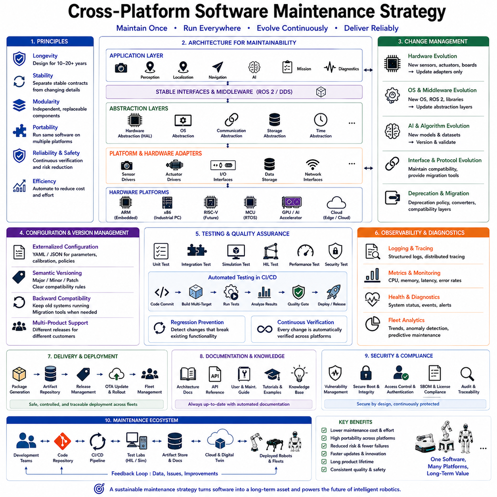{width="7.268055555555556in" height="7.268055555555556in"}

The uploaded engineering library concludes the Cross-Platform Software Design chapter with **"23_11.10 Cross-Platform Software Maintenance Strategy."** This final chapter serves as the culmination of every architectural concept introduced throughout the chapter, including hardware abstraction, platform-independent software design, processor portability, common interfaces, ROS 2 package organization, reusable software components, CI/CD automation, and Hardware-in-the-Loop verification. While these engineering practices establish an excellent foundation for software portability, the true measure of software architecture is determined over years of maintenance rather than during initial development. Robotic systems frequently remain in operation for ten to twenty years, during which processors evolve, operating systems change, communication protocols mature, artificial intelligence frameworks advance, and hardware platforms become obsolete. Consequently, cross-platform software maintenance must be viewed not as an afterthought but as a primary architectural objective that influences every design decision from the beginning of system development.

Historically, robotic software maintenance has been one of the most expensive aspects of product ownership. Many organizations initially optimized software architecture for rapid product delivery without considering long-term evolution. As hardware platforms diversified, individual engineering teams independently modified software for ARM processors, industrial x86 computers, specialized embedded controllers, cloud gateways, and customer-specific deployments. Over time these independent modifications produced fragmented software branches, duplicated functionality, inconsistent behavior, incompatible interfaces, and increasing technical debt. Eventually software maintenance consumed more engineering effort than new feature development, dramatically reducing innovation velocity while increasing operational risk.

Modern robotics therefore embraces software maintenance as an architectural discipline rather than merely a post-release support activity. The objective is to construct software ecosystems capable of continuous evolution without requiring repeated architectural redesign whenever processors, operating systems, hardware devices, communication technologies, or artificial intelligence frameworks change. Cross-platform maintenance strategy seeks to maximize software longevity by minimizing dependencies upon transient technologies while preserving stable application behavior throughout successive generations of robotic products.

The fundamental principle underlying cross-platform maintenance is separation between stable architectural contracts and evolving implementation details. Business logic, mission management, perception algorithms, navigation behavior, safety policies, communication semantics, and artificial intelligence workflows should remain conceptually stable across product generations. Processor architectures, operating system APIs, hardware interfaces, communication protocols, optimization libraries, compilers, and middleware implementations inevitably evolve. Successful software architecture therefore isolates these changing technologies beneath stable abstraction layers, allowing infrastructure evolution without disrupting application software.

Hardware abstraction remains one of the most important maintenance mechanisms. Sensors, actuators, storage devices, communication interfaces, timing services, networking hardware, graphics accelerators, artificial intelligence processors, and safety controllers inevitably change throughout product lifecycles. Rather than allowing application software to depend directly upon physical hardware, standardized Hardware Abstraction Layers define stable functional interfaces while hardware-specific implementations evolve independently. Consequently, replacing one LiDAR manufacturer with another, upgrading industrial computers, introducing new AI accelerators, or migrating toward future processor architectures requires modification only within isolated hardware adaptation modules.

Operating system abstraction provides similar long-term benefits. Embedded Linux distributions continuously evolve, RTOS kernels receive feature enhancements, cloud operating environments expand, and future computing platforms introduce entirely new execution models. Application software directly dependent upon operating system APIs becomes increasingly difficult to maintain over extended product lifecycles. Cross-platform maintenance therefore emphasizes operating system independence through standardized interfaces representing threading, synchronization, timing, storage, communication, configuration, diagnostics, and resource management. Stable abstractions dramatically simplify migration across operating system generations.

Software modularity represents another cornerstone of sustainable maintenance. Large monolithic software systems become progressively more difficult to understand, validate, modify, and extend as complexity increases. Modular architecture decomposes robotic functionality into well-defined components implementing perception, localization, mapping, planning, control, diagnostics, communication, artificial intelligence, cloud integration, safety supervision, and mission orchestration independently. Individual modules evolve according to their own technological requirements while preserving stable interfaces toward neighboring components. Consequently, software maintenance becomes localized rather than system-wide.

Stable interface design significantly influences long-term maintainability. Messages, services, actions, APIs, communication protocols, and software contracts should represent logical business concepts rather than transient implementation details. Sensor interfaces should communicate observations rather than hardware registers. Navigation interfaces should describe goals rather than wheel commands. Mission interfaces should represent operational intent rather than implementation procedures. Well-designed interfaces remain stable despite extensive internal implementation evolution, thereby protecting higher-level software from infrastructure changes.

Dependency management similarly determines maintenance scalability. Software modules should depend only upon clearly defined interfaces rather than concrete implementations whenever practical. Excessive direct dependencies propagate changes throughout large software systems, making even minor modifications increasingly expensive. Dependency inversion, interface segregation, plugin architectures, service-oriented communication, and layered software organization minimize coupling while improving adaptability. Such architecture substantially reduces maintenance effort throughout extended product lifecycles.

Version management becomes increasingly important within long-lived robotic systems. Multiple customer deployments frequently operate different software releases simultaneously while new product generations continue active development. Cross-platform maintenance therefore requires disciplined version control governing interfaces, communication protocols, configuration schemas, artificial intelligence models, documentation, deployment packages, and software dependencies. Semantic versioning, backward compatibility, deprecation policies, release planning, and long-term support branches collectively ensure predictable software evolution across heterogeneous deployments.

Backward compatibility represents one of the most valuable maintenance objectives. Customer systems should continue functioning reliably despite software evolution whenever practical. Communication interfaces, configuration formats, application programming interfaces, mission descriptions, diagnostic reports, and deployment procedures should preserve compatibility across software releases. When incompatible architectural changes become unavoidable, migration tools, compatibility layers, data conversion utilities, and comprehensive documentation significantly reduce operational disruption.

Configuration management contributes substantially to maintainability by separating operational variation from executable software. Hardware calibration, communication parameters, AI model selection, controller gains, customer customization, deployment settings, safety thresholds, and operational policies should remain externalized through structured configuration repositories rather than embedded within application source code. Consequently, supporting new robotic platforms frequently requires configuration updates rather than software modification, greatly reducing maintenance complexity.

Documentation forms another essential component of long-term software sustainability. Software architecture descriptions, interface specifications, deployment procedures, testing methodologies, configuration guides, troubleshooting documentation, hardware integration manuals, maintenance workflows, and API references should evolve continuously alongside source code. Outdated documentation rapidly becomes more harmful than absent documentation because engineering decisions increasingly rely upon inaccurate information. Modern maintenance strategies therefore integrate documentation generation directly into automated development workflows.

Automated testing serves as the primary defense against regression throughout continuous software evolution. Unit tests validate algorithmic correctness, integration tests verify module interaction, simulation environments evaluate functional behavior, Hardware-in-the-Loop testing confirms hardware compatibility, performance benchmarks detect optimization regressions, and security validation ensures ongoing resilience against emerging vulnerabilities. Every software modification automatically executes comprehensive validation suites, providing continuous confidence that maintenance activities preserve functional correctness across all supported platforms.

Continuous Integration and Continuous Deployment become indispensable maintenance infrastructure rather than merely development conveniences. Every source modification triggers automated compilation across supported processor architectures, interface verification, dependency validation, documentation updates, package generation, simulation testing, HIL execution, performance analysis, artifact publication, and deployment qualification. Maintenance therefore becomes a continuously verified engineering activity rather than periodic manual effort.

Cross-platform maintenance particularly benefits from reproducible build systems. Software must remain buildable years after original development despite evolving compilers, operating systems, package repositories, and dependency ecosystems. Containerized development environments, versioned toolchains, immutable build configurations, archived dependency repositories, and automated infrastructure provisioning collectively preserve reproducibility throughout extended product lifecycles. Organizations thereby retain the ability to rebuild historical software versions whenever maintenance, certification, or operational recovery requires them.

Artificial intelligence introduces new maintenance challenges extending beyond conventional software engineering. AI models evolve independently from application software while requiring continuous retraining, validation, optimization, deployment, and monitoring. Cross-platform maintenance therefore incorporates dedicated AI lifecycle management including dataset versioning, model repositories, inference benchmarking, hardware optimization, rollback capability, explainability analysis, and operational performance monitoring. Such discipline ensures artificial intelligence evolves safely alongside surrounding robotic software.

Cybersecurity maintenance has become equally critical. Robotic systems increasingly remain connected to enterprise networks, cloud services, industrial infrastructure, and remote maintenance platforms throughout operational lifetimes. Emerging vulnerabilities require continuous software updates addressing operating system patches, middleware security advisories, cryptographic library improvements, authentication mechanisms, certificate management, secure boot procedures, firmware integrity verification, and software supply chain protection. Maintenance strategy therefore incorporates systematic security monitoring, vulnerability assessment, automated dependency scanning, and controlled update deployment.

Observability substantially improves maintenance efficiency by providing continuous operational insight throughout deployed robotic fleets. Structured logging, distributed tracing, performance telemetry, health monitoring, diagnostic events, resource utilization metrics, communication statistics, AI inference analytics, safety reports, and predictive maintenance indicators collectively enable engineering organizations to identify operational trends before failures become critical. Cross-platform observability frameworks provide consistent operational visibility regardless of processor architecture or deployment environment.

Fault diagnosis similarly benefits from standardized maintenance architecture. Common diagnostic interfaces enable identical troubleshooting procedures across AMRs, manipulators, quadrupeds, humanoids, inspection robots, and future robotic platforms despite hardware diversity. Error classification, diagnostic reporting, recovery guidance, maintenance recommendations, and operational analytics become reusable engineering assets rather than product-specific implementations.

Digital Twin technology increasingly extends software maintenance beyond physical systems. Virtual representations continuously synchronize with deployed robots, reflecting hardware configuration, software versions, calibration parameters, operational history, environmental conditions, and maintenance records. Engineering teams validate software updates, investigate failures, reproduce operational scenarios, evaluate optimization strategies, and predict maintenance requirements using synchronized digital counterparts before modifying production systems. Such capability dramatically reduces maintenance risk while improving operational planning.

Fleet management introduces additional maintenance considerations because organizations rarely operate isolated robots. Hundreds or thousands of autonomous systems may require synchronized software updates, staged deployments, compatibility verification, configuration management, health monitoring, rollback coordination, security patching, and operational reporting. Cross-platform maintenance strategies therefore incorporate centralized lifecycle management supporting heterogeneous robotic populations through standardized operational infrastructure.

Scalability becomes increasingly important as organizations expand product portfolios. Educational robots, warehouse automation, industrial manipulators, autonomous inspection platforms, agricultural machines, collaborative robots, quadrupeds, humanoids, and healthcare assistants frequently share substantial portions of common software architecture. Maintenance strategies emphasizing reusable software components, stable interfaces, automated validation, centralized documentation, standardized deployment, and common infrastructure dramatically reduce engineering effort across expanding product families.

Organizational processes influence software maintenance as strongly as technical architecture. Coding standards, architectural governance, interface review procedures, documentation policies, testing requirements, release management, code ownership, issue tracking, knowledge sharing, mentoring, and engineering education collectively determine whether software remains maintainable throughout decades of evolution. Sustainable software ecosystems therefore require disciplined engineering culture in addition to well-designed technical architecture.

Future robotics will continue evolving toward Software-Defined Robotics, Physical AI, cloud-native autonomy, distributed intelligence, heterogeneous processors, AI accelerators, digital twins, collaborative robotic ecosystems, and continuously connected operational environments. Hardware technologies will change repeatedly, yet organizations must preserve software investments accumulated over many years. Cross-platform maintenance strategy therefore emphasizes architectural stability, reusable engineering assets, automated validation, continuous deployment, reproducible infrastructure, standardized interfaces, modular software organization, and disciplined lifecycle management as essential foundations supporting long-term technological evolution.

Ultimately, Cross-Platform Software Maintenance Strategy represents the final stage of mature robotics software engineering. Successful robotic software is not measured solely by initial functionality but by its ability to evolve gracefully across changing processors, operating systems, hardware platforms, artificial intelligence technologies, communication infrastructures, and customer requirements throughout decades of operational service. By combining hardware abstraction, operating system independence, modular architecture, stable interfaces, disciplined dependency management, automated testing, CI/CD automation, reproducible builds, comprehensive documentation, cybersecurity governance, Digital Twin integration, and lifecycle-oriented engineering processes, robotics organizations transform software from disposable project artifacts into sustainable strategic assets capable of supporting multiple generations of intelligent autonomous systems across continuously evolving technological landscapes.
