**Volume 1 Software Architecture Fundamentals**

# 12. Future Software Architecture

## 12.01 Future Trends in Software Architecture

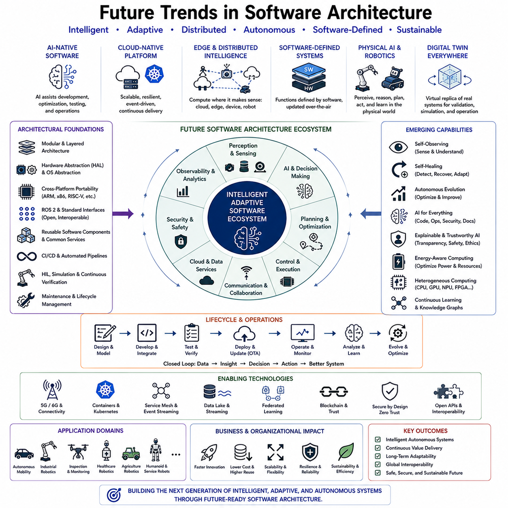{width="7.268055555555556in" height="7.268055555555556in"}

The uploaded engineering library begins **Chapter 23.12** with **"23_12.01 Future Trends in Software Architecture."** This chapter serves as the transition from today\'s mature software engineering practices toward the next generation of intelligent, autonomous, and continuously evolving software ecosystems. The preceding chapters established the architectural foundations required for long-term maintainability, including layered architecture, cross-platform portability, hardware abstraction, reusable software components, automated CI/CD pipelines, Hardware-in-the-Loop validation, and sustainable maintenance strategies. These principles remain fundamental, but future software architecture will increasingly be shaped by artificial intelligence, distributed computing, cloud-native systems, digital twins, autonomous software evolution, heterogeneous computing, and Software-Defined Robotics. Rather than viewing software as a static collection of executable programs, future architecture treats software as a living ecosystem capable of learning, adapting, optimizing, and evolving continuously throughout its operational lifetime.

Software architecture has historically evolved alongside advances in computing technology. Early systems were primarily monolithic applications tightly coupled with hardware. As networking matured, distributed architectures emerged, followed by service-oriented systems, microservices, cloud computing, containerization, and event-driven architectures. Each architectural generation reduced coupling while improving scalability, flexibility, maintainability, and organizational productivity. The next architectural transformation extends these principles further by integrating artificial intelligence directly into architectural decision making, system optimization, deployment automation, operational management, and software evolution itself.

One of the most significant future trends is the transition from application-centric software toward intelligent platform ecosystems. Traditional software products were designed for individual applications solving isolated problems. Future software architecture instead emphasizes reusable platform capabilities supporting multiple products simultaneously. Shared perception services, localization frameworks, communication infrastructure, artificial intelligence engines, security services, cloud integration, simulation environments, and operational analytics become common organizational assets rather than product-specific implementations. Such platforms enable organizations to develop diverse robotic systems while maximizing software reuse across expanding product portfolios.

Artificial intelligence will increasingly influence architectural decisions throughout the software lifecycle. Today AI primarily performs perception, prediction, planning, and data analysis. Future software architecture incorporates AI into code generation, software verification, dependency optimization, configuration management, automated debugging, test generation, documentation production, vulnerability detection, performance tuning, and deployment planning. Software engineering gradually evolves toward collaborative human-AI development environments where architects define high-level system objectives while AI continuously assists implementation, validation, optimization, and maintenance activities.

The emergence of AI-assisted software engineering fundamentally changes software architecture itself. Rather than manually designing every interface, dependency, deployment strategy, and optimization technique, architects increasingly define architectural policies, quality constraints, safety objectives, and organizational standards. Intelligent engineering systems automatically generate implementation details while continuously validating architectural consistency. Human engineers therefore transition from implementation-oriented activities toward architectural governance, strategic decision making, and system-level optimization.

Cloud-native architecture represents another defining future trend. Traditional enterprise software frequently migrated existing monolithic applications into cloud infrastructure without fundamental architectural redesign. Future cloud-native software is conceived from inception as distributed, elastic, resilient, observable, and continuously deployable. Stateless services, event-driven communication, container orchestration, service meshes, distributed storage, streaming analytics, and automated scaling become inherent architectural assumptions rather than optional deployment enhancements. Such architecture significantly improves flexibility while supporting globally distributed robotic ecosystems.

Edge computing simultaneously complements cloud-native architecture by relocating computational intelligence closer to physical systems. Autonomous robots require deterministic response times incompatible with cloud latency for safety-critical decision making. Consequently, future architecture increasingly distributes software across cloud infrastructure, edge computers, embedded processors, and specialized AI accelerators according to computational requirements. Intelligent workload orchestration dynamically balances processing between local autonomy and cloud-based optimization while maintaining operational continuity during communication disruptions.

Distributed intelligence therefore becomes one of the defining characteristics of future software systems. Rather than concentrating computational capability within centralized servers or individual robots, intelligent functionality becomes dynamically distributed throughout heterogeneous computational environments. Perception may execute locally, fleet optimization within regional edge infrastructure, predictive maintenance through cloud analytics, AI model training upon specialized GPU clusters, and long-term knowledge management within organizational data platforms. Software architecture must therefore emphasize seamless collaboration among distributed computational entities rather than isolated software execution.

Software-Defined Systems represent another transformative architectural paradigm. Historically, hardware capabilities largely determined system functionality. Future platforms increasingly separate physical hardware from software-defined behavior. Autonomous vehicles, industrial automation, communication networks, medical devices, and robotics become programmable platforms whose operational characteristics evolve through software updates rather than hardware replacement. Architecture therefore prioritizes modular software layers, standardized interfaces, secure update mechanisms, digital certification, configuration management, and continuous lifecycle evolution.

Software-Defined Robotics extends this concept specifically into intelligent robotic systems. Mobile robots, manipulators, quadrupeds, humanoids, collaborative robots, inspection platforms, healthcare assistants, and agricultural machines increasingly share identical software foundations despite mechanical diversity. Hardware abstraction layers, ROS 2 middleware, common artificial intelligence frameworks, modular software components, standardized communication interfaces, digital twins, and reusable autonomy services collectively enable organizations to develop broad robotic ecosystems rather than isolated products. Mechanical embodiment becomes an implementation choice while software intelligence remains largely reusable.

Physical Artificial Intelligence represents another major architectural evolution. Conventional software primarily processes digital information within isolated computational environments. Physical AI integrates continuous perception, reasoning, prediction, planning, manipulation, locomotion, communication, and learning within dynamic physical environments. Consequently, software architecture increasingly combines deterministic control systems, probabilistic reasoning, machine learning, symbolic knowledge representation, multimodal perception, real-time scheduling, and distributed decision making into unified computational frameworks supporting intelligent physical interaction.

Digital Twin technology fundamentally transforms software lifecycle management. Future software architecture maintains synchronized virtual representations of physical systems throughout operational lifetimes. Digital twins continuously integrate sensor observations, operational history, maintenance records, environmental conditions, software configuration, AI model evolution, and fleet analytics. Architects validate software updates, evaluate optimization strategies, investigate anomalies, simulate future operational scenarios, and predict maintenance requirements within virtual environments before modifying deployed systems. Consequently, software evolution becomes significantly more predictable and less operationally disruptive.

Continuous verification gradually replaces conventional episodic testing. Traditional software validation often occurred before product release through structured testing campaigns. Future architecture incorporates automated verification throughout operational lifecycles using simulation, Hardware-in-the-Loop testing, digital twins, runtime monitoring, AI-based anomaly detection, formal verification, behavioral analysis, and predictive diagnostics. Software quality therefore becomes continuously observable rather than periodically evaluated.

Self-observing software emerges as another important trend. Modern systems already generate logs, metrics, traces, and health reports. Future architecture extends observability toward autonomous operational understanding. Intelligent monitoring systems continuously analyze execution behavior, identify emerging performance degradation, predict hardware failures, detect abnormal communication patterns, recognize cybersecurity threats, recommend architectural improvements, and initiate automated recovery actions. Software therefore evolves from passive execution toward active operational awareness.

Self-healing architecture similarly gains increasing importance. Rather than requiring human intervention following every operational fault, future systems automatically isolate failures, restart services, migrate computational workloads, reconstruct distributed communication paths, restore configuration consistency, recover corrupted state, and adapt operational behavior according to current system health. Such resilience significantly improves availability while reducing operational maintenance effort throughout large distributed robotic fleets.

Cybersecurity increasingly becomes a primary architectural concern rather than an isolated technical feature. Autonomous robotic systems remain continuously connected to cloud infrastructure, industrial networks, AI services, and collaborative robotic ecosystems. Consequently, zero-trust architecture, hardware roots of trust, secure boot, encrypted communication, confidential computing, software supply chain verification, AI-assisted threat detection, runtime integrity monitoring, and continuous vulnerability assessment become foundational architectural principles integrated throughout every software layer.

Artificial intelligence itself introduces unique architectural requirements regarding trustworthiness, explainability, governance, fairness, safety, and accountability. Future software architecture increasingly incorporates explainable AI, confidence estimation, model validation, uncertainty quantification, operational monitoring, continuous retraining, dataset governance, ethical policy enforcement, and regulatory compliance directly into AI lifecycle management. Such capabilities become essential as AI assumes greater responsibility for autonomous decision making within safety-critical environments.

Heterogeneous computing profoundly influences future architectural design. General-purpose CPUs increasingly cooperate with GPUs, NPUs, TPUs, FPGAs, dedicated AI accelerators, real-time microcontrollers, quantum coprocessors, and specialized domain-specific processors. Software architecture therefore emphasizes hardware-independent computational abstractions enabling intelligent workload distribution according to performance, latency, energy consumption, safety, and operational requirements. Platform independence becomes increasingly valuable as computational diversity expands.

Energy-aware computing also becomes an important architectural objective. Future autonomous systems must balance computational capability against battery capacity, thermal constraints, environmental conditions, and operational endurance. Software increasingly monitors processor utilization, dynamically reallocates computational workloads, adjusts AI inference complexity, schedules background activities, and optimizes resource consumption according to available energy budgets. Architectural intelligence therefore extends beyond functional correctness toward holistic operational efficiency.

Autonomous software evolution represents perhaps the most ambitious future direction. Software systems increasingly analyze operational behavior, identify optimization opportunities, recommend architectural improvements, generate implementation alternatives, evaluate simulation outcomes, validate modifications automatically, and progressively evolve through controlled continuous deployment. Human architects maintain strategic governance while intelligent software ecosystems perform routine optimization, adaptation, and maintenance activities autonomously within predefined safety boundaries.

Knowledge-centric architecture gradually complements conventional data-centric design. Future software systems organize operational experience, engineering knowledge, semantic understanding, domain expertise, regulatory information, maintenance procedures, and organizational best practices within machine-understandable knowledge graphs supporting intelligent reasoning throughout software development and operational management. Software therefore evolves beyond processing data toward managing organizational intelligence itself.

Human-centered architecture remains equally important despite increasing automation. Future systems emphasize intuitive interaction, explainable behavior, collaborative decision making, adaptive interfaces, natural language communication, multimodal interaction, accessibility, personalization, and human-AI cooperation. Software architecture increasingly recognizes humans not merely as operators but as continuous collaborative participants within intelligent cyber-physical ecosystems.

Interoperability becomes increasingly valuable as autonomous systems cooperate across organizational boundaries. Standardized communication protocols, semantic information models, service discovery, digital identities, trust frameworks, federated learning, distributed knowledge sharing, and open interface specifications enable heterogeneous robotic platforms developed by independent organizations to collaborate seamlessly. Architectural openness therefore accelerates innovation while reducing vendor lock-in.

Lifecycle architecture ultimately expands beyond software itself toward complete organizational engineering ecosystems. Development environments, digital twins, simulation infrastructure, CI/CD pipelines, AI model management, fleet operations, cybersecurity governance, maintenance workflows, customer support, certification processes, and regulatory compliance become tightly integrated components of one continuously evolving architectural framework. Software architecture therefore becomes organizational architecture rather than merely technical design.

Future robotics particularly illustrates these architectural trends because intelligent autonomous systems simultaneously require real-time control, artificial intelligence, cloud integration, distributed communication, digital twins, heterogeneous computing, cybersecurity, safety assurance, continuous deployment, predictive maintenance, and lifelong software evolution. Successful robotic software architecture therefore increasingly depends upon flexible platforms capable of adapting continuously without compromising reliability, determinism, or operational safety.

Ultimately, the future of software architecture extends far beyond selecting programming languages, frameworks, or deployment technologies. Future architecture defines adaptive intelligent ecosystems integrating software, artificial intelligence, cloud computing, edge infrastructure, digital twins, cybersecurity, autonomous maintenance, distributed intelligence, and continuous lifecycle evolution into one coherent engineering discipline. Organizations embracing these architectural principles transform software from static executable artifacts into continuously evolving strategic platforms capable of supporting decades of innovation across rapidly changing technological landscapes. Such architecture provides the engineering foundation for Software-Defined Systems, Physical AI, autonomous robotics, intelligent infrastructure, and the next generation of globally connected cyber-physical ecosystems.

## 12.02 Self-Adaptive Architecture

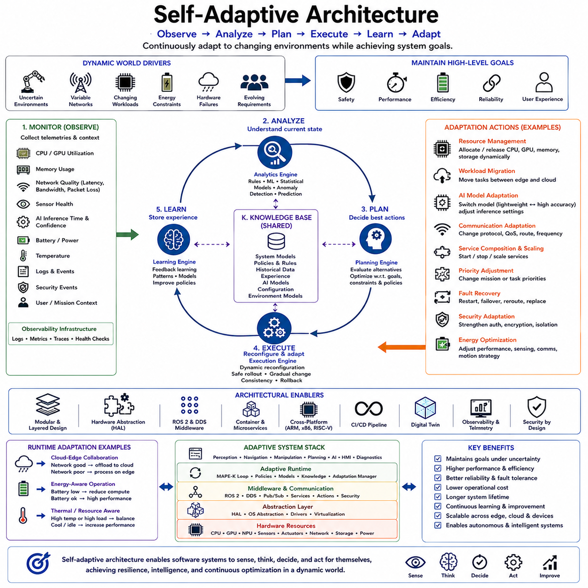{width="7.268055555555556in" height="7.268055555555556in"}

The uploaded engineering library positions **"23_12.02 Self-Adaptive Architecture"** immediately after the discussion of future software architecture because adaptability is expected to become one of the defining characteristics of next-generation software systems. Traditional software architectures were designed under the assumption that system requirements, hardware resources, operational environments, and user expectations remained relatively stable after deployment. Modern cyber-physical systems no longer operate under such assumptions. Autonomous robots, intelligent manufacturing systems, cloud-native applications, distributed AI platforms, smart infrastructure, and future Physical AI systems continuously encounter changing workloads, uncertain environments, evolving hardware platforms, fluctuating communication quality, dynamic resource availability, and unpredictable operational conditions. Consequently, future software architecture must evolve beyond static configuration toward adaptive systems capable of continuously observing themselves, reasoning about current conditions, making architectural decisions, and autonomously modifying their own operational behavior while maintaining safety, reliability, and performance.

Self-adaptive architecture represents an engineering paradigm in which software continuously monitors its own internal state together with external environmental conditions and dynamically adjusts system behavior according to predefined objectives. Rather than relying exclusively upon human operators or periodic software updates, adaptive systems automatically modify resource allocation, computational distribution, communication strategies, service composition, AI model selection, quality-of-service policies, operational priorities, and recovery mechanisms according to current operational circumstances. Adaptation therefore becomes an intrinsic architectural capability instead of an exceptional maintenance activity.

Historically, software systems depended heavily upon fixed assumptions established during system design. Processor performance, available memory, network bandwidth, sensor availability, environmental conditions, and operational workloads were considered largely predictable. As computing environments became increasingly distributed and autonomous, these assumptions gradually lost validity. Mobile robots move through unpredictable environments. Cloud resources expand and contract dynamically. Artificial intelligence workloads fluctuate continuously. Wireless communication quality varies significantly. Sensors degrade over time. Hardware components fail unexpectedly. User requirements evolve after deployment. Static architectural decisions therefore become increasingly inadequate for long-term autonomous operation.

The fundamental objective of self-adaptive architecture is maintaining system goals rather than preserving fixed implementation strategies. Mission completion, operational safety, response time, computational efficiency, energy consumption, availability, communication reliability, and user experience represent high-level objectives. Numerous implementation alternatives may satisfy these objectives under different operating conditions. Adaptive architecture continuously selects appropriate implementation strategies according to current environmental circumstances while preserving overall system intent.

One of the most influential conceptual models supporting self-adaptive systems is the feedback control loop. Traditional control theory continuously compares measured system behavior against desired reference behavior before computing corrective actions. Self-adaptive software applies identical principles to software architecture itself. Monitoring components observe operational behavior, analysis modules evaluate system health, planning components determine adaptation strategies, and execution mechanisms implement architectural changes. Continuous feedback enables software evolution without external intervention while preserving operational objectives despite changing conditions.

Modern adaptive systems frequently implement variants of the Monitor-Analyze-Plan-Execute architecture supported by shared knowledge repositories. Monitoring continuously collects operational metrics including processor utilization, memory consumption, communication latency, sensor health, AI inference performance, battery condition, environmental observations, network quality, fault reports, and user interaction patterns. Analytical components interpret these observations using statistical models, rule-based reasoning, optimization techniques, machine learning, predictive analytics, or hybrid approaches. Planning components evaluate alternative adaptation strategies according to architectural policies, safety constraints, resource availability, and operational priorities. Execution modules coordinate software reconfiguration while knowledge repositories preserve architectural models, historical observations, operational policies, learned experience, and system configuration information supporting future adaptation decisions.

Observation forms the foundation of every adaptive architecture. Software cannot adapt intelligently without accurate understanding of its current operational state. Modern systems therefore incorporate extensive observability infrastructure including structured logging, distributed tracing, performance telemetry, hardware diagnostics, environmental sensing, workload measurement, communication monitoring, security analytics, and AI operational metrics. These observations collectively establish situational awareness supporting informed architectural decision making.

Adaptive analysis extends beyond simple threshold detection toward comprehensive operational understanding. Processor utilization alone rarely indicates whether adaptation is necessary. Instead, adaptive reasoning considers relationships among multiple observations simultaneously. Increased processor utilization accompanied by stable response times may represent healthy workload growth, whereas identical utilization combined with increasing communication latency, thermal constraints, and battery depletion may indicate impending operational degradation. Artificial intelligence increasingly assists this analysis by recognizing complex patterns invisible to conventional rule-based monitoring.

Planning constitutes the architectural intelligence responsible for selecting appropriate adaptation strategies. Rather than reacting impulsively to every observed change, planning evaluates multiple alternative responses while considering operational objectives, safety constraints, resource limitations, long-term consequences, and architectural consistency. Computational workloads may migrate toward cloud infrastructure, AI inference models may switch between lightweight and high-accuracy variants, communication protocols may adjust quality-of-service parameters, software services may scale dynamically, or operational priorities may shift according to mission requirements. Effective planning therefore balances immediate operational needs against strategic architectural objectives.

Execution transforms planned adaptations into operational reality. Dynamic software reconfiguration requires careful coordination to avoid disrupting active services or compromising system integrity. Services migrate gradually, communication routes reconfigure without data loss, AI models transition safely between versions, redundant resources assume operational responsibility before component shutdown, configuration changes propagate consistently throughout distributed systems, and rollback mechanisms remain continuously available should adaptation produce undesirable consequences. Execution therefore emphasizes controlled evolution rather than abrupt architectural transformation.

Knowledge management distinguishes sophisticated adaptive systems from simple automated controllers. Architectural models describing system structure, dependency relationships, configuration policies, safety rules, historical operational experience, AI models, optimization strategies, environmental knowledge, maintenance records, and organizational objectives collectively guide adaptation decisions. Knowledge repositories therefore evolve continuously alongside operational software, enabling increasingly informed architectural behavior throughout system lifecycles.

Artificial intelligence substantially expands adaptive architectural capability. Conventional adaptive systems relied primarily upon manually defined rules and threshold values. Contemporary architectures increasingly employ machine learning, reinforcement learning, probabilistic reasoning, anomaly detection, predictive analytics, and generative AI to recognize operational patterns, anticipate future conditions, recommend optimization strategies, and continuously improve adaptation quality through accumulated experience. Human architects define strategic objectives while intelligent software increasingly determines tactical adaptation behavior.

Resource management represents one of the most common applications of adaptive architecture. Computational workloads fluctuate according to mission complexity, environmental conditions, user demand, AI processing requirements, and communication availability. Adaptive systems continuously balance processor utilization, memory allocation, GPU resources, storage capacity, network bandwidth, and energy consumption according to operational priorities. Rather than statically allocating computational resources during deployment, architecture evolves dynamically throughout system execution.

Cloud-edge collaboration provides an excellent illustration of adaptive architectural behavior. Autonomous robots frequently perform perception and safety-critical control locally while cloud infrastructure executes long-term analytics, AI model training, fleet optimization, and historical data management. Communication quality continuously influences workload distribution. High-bandwidth connectivity permits cloud-assisted reasoning whereas degraded communication shifts computational responsibility toward edge devices. Adaptive architecture therefore optimizes distributed intelligence according to continuously changing environmental conditions.

Energy-aware adaptation becomes increasingly important within battery-powered autonomous systems. Mobile robots, drones, wearable devices, and remote sensing platforms operate under strict energy constraints while simultaneously requiring sophisticated computational capability. Adaptive architecture continuously evaluates battery condition, processor utilization, AI workload, communication activity, environmental complexity, and mission urgency before dynamically adjusting computational fidelity, sensor activation, communication frequency, navigation strategy, or operational priorities. Such intelligent adaptation significantly extends operational endurance without compromising essential functionality.

Artificial intelligence inference similarly benefits from adaptive architecture. Modern robotic platforms frequently maintain multiple AI models optimized for different computational conditions. High-performance GPU resources support sophisticated multimodal reasoning during abundant computational availability. Lightweight models execute upon embedded processors during constrained operating conditions. Adaptive software dynamically selects appropriate inference engines according to processor availability, thermal behavior, energy reserves, mission importance, communication latency, and environmental complexity while preserving acceptable decision quality.

Communication adaptation further illustrates architectural flexibility. Distributed robotic systems frequently employ multiple communication technologies including Ethernet, Wi-Fi, 5G, satellite communication, industrial fieldbus networks, DDS middleware, MQTT messaging, and cloud services. Adaptive communication architecture continuously evaluates bandwidth, latency, packet loss, security requirements, operational priorities, and network availability before selecting appropriate communication mechanisms. Critical safety messages receive highest priority whereas nonessential telemetry may delay transmission under constrained network conditions.

Self-adaptive architecture also improves fault tolerance. Rather than terminating operation following hardware failures or software faults, adaptive systems isolate malfunctioning components, redistribute computational workloads, activate redundant resources, reconstruct communication pathways, restore corrupted state, restart failed services, and modify operational behavior according to remaining system capability. Graceful degradation therefore replaces catastrophic system failure whenever practical, significantly improving operational resilience.

Cybersecurity increasingly depends upon adaptive architectural behavior. Static defensive mechanisms struggle against continuously evolving cyber threats. Adaptive security architecture continuously monitors communication behavior, authentication patterns, software integrity, operational anomalies, network traffic, and hardware state before dynamically strengthening defensive measures according to perceived threat levels. Artificial intelligence assists by recognizing previously unseen attack patterns while automated response mechanisms isolate compromised components, revoke credentials, strengthen authentication policies, or modify communication pathways autonomously.

Self-adaptive architecture significantly enhances long-term maintainability. Traditional maintenance frequently required manual software updates addressing changing operational requirements. Adaptive systems instead accommodate many environmental changes automatically through dynamic reconfiguration, parameter adjustment, service migration, workload balancing, and policy adaptation. Human maintenance increasingly focuses upon strategic architectural improvement rather than routine operational adjustments.

Digital Twin technology provides powerful support for adaptive systems by maintaining synchronized virtual representations of operational environments. Adaptation strategies may first be evaluated within digital twins before deployment into physical systems. Predicted outcomes, safety implications, performance consequences, energy consumption, communication behavior, and operational risks become observable prior to real-world execution. Consequently, adaptation decisions become significantly more reliable while reducing operational uncertainty.

Continuous Integration and Continuous Deployment complement adaptive architecture by providing automated mechanisms supporting software evolution. Newly developed adaptation algorithms, optimized AI models, updated architectural policies, revised configuration strategies, security improvements, and performance enhancements automatically progress through validation pipelines before deployment. Adaptive software therefore evolves continuously while preserving engineering discipline through automated verification.

Cross-platform portability remains essential because adaptive behavior increasingly spans heterogeneous computing environments. Embedded processors, industrial computers, cloud infrastructure, AI accelerators, simulation platforms, and future computing architectures all participate within adaptive software ecosystems. Hardware abstraction, operating system independence, standardized communication interfaces, containerized deployment, and modular software organization collectively enable adaptation across diverse computational platforms without architectural fragmentation.

Observability assumes even greater importance within adaptive systems because software decisions increasingly depend upon accurate operational understanding. Comprehensive monitoring infrastructure captures processor utilization, memory consumption, communication quality, sensor health, AI confidence, environmental conditions, user interaction, security events, energy status, timing behavior, and system reliability continuously. These observations form the empirical foundation supporting autonomous architectural intelligence.

Verification becomes more challenging because adaptive systems no longer exhibit one fixed behavioral configuration. Validation therefore emphasizes correctness of adaptation policies rather than verification of individual execution states. Simulation, Hardware-in-the-Loop testing, formal verification, runtime monitoring, AI-assisted anomaly detection, digital twins, and continuous operational validation collectively ensure adaptive behavior remains safe despite dynamic architectural evolution.

Organizational governance remains indispensable despite increasing software autonomy. Human architects define operational objectives, safety policies, ethical constraints, regulatory compliance, architectural standards, security requirements, and acceptable adaptation boundaries. Adaptive software operates autonomously only within these carefully established governance frameworks, ensuring technological flexibility never compromises organizational accountability.

Future robotics provides perhaps the clearest demonstration of self-adaptive architecture. Autonomous Mobile Robots, industrial manipulators, quadrupeds, humanoids, collaborative robots, healthcare assistants, agricultural systems, and intelligent inspection platforms operate continuously within changing physical environments requiring dynamic perception, distributed intelligence, AI reasoning, cloud collaboration, safety management, communication optimization, energy efficiency, and fault recovery. Static software architectures cannot adequately satisfy these requirements over extended operational lifecycles. Self-adaptive architecture therefore becomes an essential enabling technology supporting future Physical AI systems.

Ultimately, self-adaptive architecture represents one of the most significant transformations in modern software engineering. Rather than constructing software that merely executes predefined algorithms, architects increasingly develop intelligent systems capable of understanding their own operational context, evaluating architectural alternatives, adapting computational behavior, recovering from unexpected disturbances, optimizing resource utilization, integrating artificial intelligence, collaborating across distributed computing environments, and evolving continuously throughout decades of operational service. By combining continuous observation, intelligent reasoning, automated planning, controlled execution, knowledge management, AI-assisted optimization, cloud-edge collaboration, digital twins, cybersecurity adaptation, and disciplined architectural governance, self-adaptive architecture establishes the engineering foundation for resilient, intelligent, autonomous, and continuously evolving software ecosystems supporting the next generation of Software-Defined Systems and Physical AI.

## 12.03 Neuromorphic Computing and New Architecture Paradigms

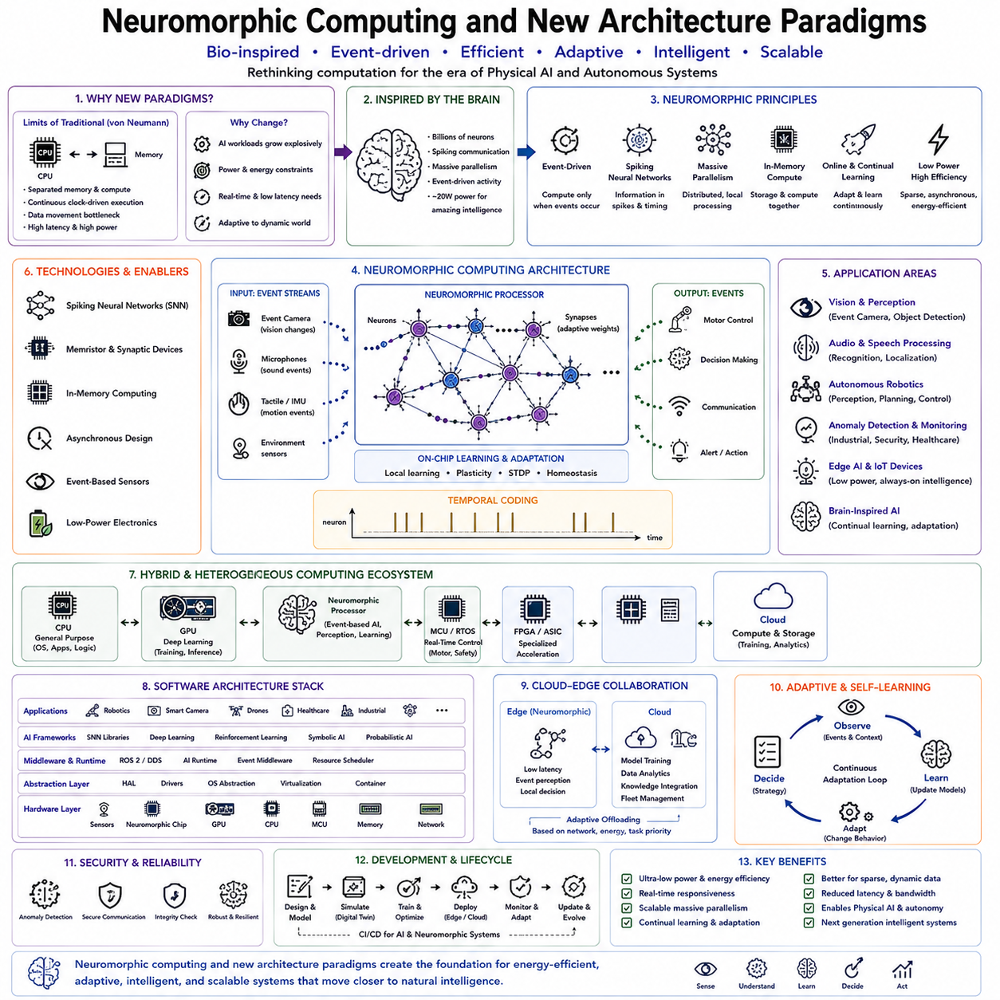{width="7.268055555555556in" height="7.268055555555556in"}

The uploaded engineering library introduces **"23_12.03 Neuromorphic Computing and New Architecture Paradigms"** as one of the most forward-looking topics in the Future Software Architecture chapter. This topic extends the discussion from self-adaptive software toward fundamentally new computational models inspired by biological intelligence rather than traditional digital computing. Conventional software architecture has evolved around deterministic processors, sequential instruction execution, centralized memory hierarchies, and clock-driven computation for decades. Although modern multi-core processors, GPUs, cloud computing, and distributed systems have dramatically expanded computational capability, they continue to inherit many architectural assumptions established during the early history of digital computers. As Artificial Intelligence, Physical AI, autonomous robotics, cognitive computing, and continuously learning cyber-physical systems become increasingly sophisticated, conventional computing paradigms begin approaching practical limitations regarding power efficiency, scalability, latency, memory bandwidth, and real-time adaptability. Neuromorphic computing represents one possible architectural direction capable of overcoming these limitations by fundamentally rethinking how intelligent computation is organized, executed, and integrated into future software systems.

Traditional computer architecture follows the von Neumann model, in which processing units and memory remain physically separated while instructions execute sequentially under centralized clock control. Every computational operation requires continuous movement of data between processors and memory, creating bottlenecks commonly referred to as the von Neumann bottleneck. Modern processors mitigate this limitation through caches, parallel execution, speculative processing, and increasingly sophisticated memory hierarchies, yet data movement remains one of the largest contributors to computational latency and energy consumption. Artificial intelligence workloads further amplify these challenges because deep neural networks repeatedly transfer enormous quantities of numerical parameters between memory and computation units throughout inference and training processes.

Neuromorphic computing seeks inspiration from biological nervous systems rather than conventional digital architectures. Human brains process sensory information, reasoning, perception, learning, motor coordination, and decision making using billions of interconnected neurons communicating through sparse asynchronous electrical spikes. Unlike conventional processors executing synchronized instruction streams, biological neural systems operate through massively parallel distributed activity while consuming remarkably little energy. Despite performing perception, adaptation, planning, and learning tasks vastly exceeding current artificial systems in flexibility, the human brain operates using approximately twenty watts of power, demonstrating extraordinary computational efficiency unavailable within traditional digital architectures.

The defining characteristic of neuromorphic architecture is event-driven computation. Conventional processors continuously execute instructions according to fixed clock frequencies regardless of whether meaningful information changes occur. Neuromorphic processors instead remain largely inactive until significant events generate neural spikes initiating localized computation. Information therefore propagates only when necessary rather than according to continuous synchronized execution cycles. This event-driven behavior dramatically reduces unnecessary computation while improving responsiveness for sparse real-world sensory signals including vision, hearing, tactile perception, and environmental monitoring.

Spiking Neural Networks represent one of the foundational computational models supporting neuromorphic systems. Conventional artificial neural networks exchange continuous numerical values representing neuron activations. Spiking neural networks instead communicate discrete temporal events resembling biological action potentials. Information becomes encoded not merely through numerical magnitude but also through spike timing, frequency, synchronization, and temporal relationships among distributed neural populations. Such representations naturally support temporal reasoning, sensory fusion, adaptive learning, and continuous interaction with dynamic physical environments.

Time itself therefore becomes an integral computational dimension within neuromorphic architecture. Conventional digital systems frequently process sequential snapshots of environmental information sampled at fixed intervals. Biological nervous systems instead process continuously evolving temporal patterns, allowing rapid response to environmental change while minimizing redundant computation. Future software architecture increasingly benefits from similar temporal information processing, particularly within autonomous robotics, intelligent sensing, continuous perception, and adaptive control systems.

Massive parallelism constitutes another defining architectural principle. Biological nervous systems execute countless computational activities simultaneously across distributed neural populations without centralized scheduling. Neuromorphic processors similarly distribute computation among numerous interconnected processing elements operating independently according to local communication events. Such organization eliminates many synchronization bottlenecks characteristic of traditional multi-core architectures while substantially improving scalability for distributed intelligent computation.

Memory organization also changes fundamentally within neuromorphic systems. Conventional architectures physically separate processing and memory, requiring continuous information transfer. Biological neurons integrate storage and computation within identical structural elements, allowing local learning and adaptation without centralized memory access. Emerging neuromorphic hardware increasingly incorporates similar computational-memory integration through synaptic devices, memristive technologies, in-memory computing, and distributed adaptive processing units. Consequently, computation occurs where information resides rather than transporting information toward centralized processors.

Learning mechanisms similarly evolve beyond conventional software paradigms. Most current artificial intelligence systems perform computationally expensive centralized training before deployment followed by fixed inference during operation. Biological intelligence continuously adapts through lifelong learning directly within operational environments. Neuromorphic architecture increasingly supports online adaptation, incremental learning, local synaptic modification, continual optimization, and experience-driven knowledge accumulation without requiring complete retraining. Such capability becomes particularly valuable for autonomous robots operating within unpredictable real-world environments over extended operational lifetimes.

Energy efficiency represents perhaps the greatest practical motivation behind neuromorphic computing. Artificial intelligence continues demanding exponentially increasing computational resources while battery-powered autonomous systems require continuously improving operational endurance. Event-driven computation, localized processing, sparse communication, asynchronous execution, and integrated memory collectively reduce computational energy requirements by several orders of magnitude compared with conventional architectures for suitable workloads. Future mobile robots, drones, wearable devices, distributed sensor networks, autonomous vehicles, and intelligent edge systems therefore stand to benefit substantially from neuromorphic acceleration.

Artificial perception represents one of the earliest application domains for neuromorphic systems. Biological vision continuously detects environmental change rather than reconstructing complete images repeatedly. Event-based vision sensors imitate this principle by generating output only when pixel intensity changes occur. Instead of transmitting thirty or sixty complete image frames every second regardless of environmental activity, event cameras communicate sparse asynchronous events corresponding to meaningful visual changes. Neuromorphic processors naturally process these event streams with minimal latency while dramatically reducing bandwidth, computation, and energy consumption.

Auditory perception similarly benefits from event-driven computation. Biological hearing emphasizes temporal pattern recognition, localization, adaptation, and continuous environmental awareness rather than periodic signal reconstruction. Neuromorphic auditory systems process acoustic events asynchronously, enabling rapid speech recognition, sound localization, anomaly detection, environmental monitoring, and adaptive interaction under highly dynamic conditions. Such capabilities become increasingly important for collaborative robots, intelligent assistants, healthcare systems, and autonomous surveillance platforms.

Robotics provides perhaps the most comprehensive application domain for neuromorphic architecture because autonomous systems simultaneously require perception, reasoning, planning, control, learning, communication, adaptation, and energy efficiency. Future Physical AI systems increasingly integrate conventional deterministic controllers with neuromorphic perception, adaptive learning, event-driven sensing, predictive reasoning, and intelligent decision support. Rather than replacing traditional software entirely, neuromorphic architecture complements existing computational models according to workload characteristics.

Hybrid computing therefore represents the most realistic near-term architectural direction. Conventional CPUs continue executing deterministic software logic, operating systems, communication middleware, database management, mission orchestration, and safety-critical control. GPUs accelerate large-scale neural network inference and model training. Real-time controllers maintain deterministic motion control. Neuromorphic processors specialize in event-driven perception, adaptive sensory processing, anomaly detection, continuous learning, and temporal reasoning. Software architecture coordinates these heterogeneous computational resources according to their respective strengths rather than seeking universal computational solutions.

Software abstraction becomes increasingly important as hardware diversity expands. Application developers should rarely require intimate understanding of individual processor architectures. Hardware abstraction layers, operating system services, middleware frameworks, computational schedulers, AI runtimes, and resource orchestration mechanisms collectively provide uniform software interfaces while transparently distributing workloads across CPUs, GPUs, NPUs, neuromorphic accelerators, cloud infrastructure, and future computational devices. Architectural portability therefore remains essential despite increasing computational heterogeneity.

Artificial intelligence itself evolves alongside neuromorphic hardware. Conventional deep learning relies heavily upon gradient-based optimization, centralized training, and static deployment. Neuromorphic AI increasingly emphasizes continual adaptation, online learning, self-organization, sparse representation, temporal reasoning, and biologically inspired computational principles. Future intelligent systems therefore combine symbolic reasoning, statistical learning, reinforcement learning, spiking neural computation, probabilistic inference, and knowledge representation within unified architectural frameworks rather than depending exclusively upon any single computational methodology.

Physical AI particularly benefits from neuromorphic principles because intelligent physical interaction depends heavily upon rapid perception, continuous adaptation, efficient sensor processing, and real-time decision making under uncertain environmental conditions. Autonomous robots navigating crowded environments, humanoids interacting with humans, quadrupeds traversing uneven terrain, drones responding to rapidly changing atmospheric conditions, and industrial manipulators collaborating safely with workers all require computational architectures capable of responding immediately to sparse environmental events while minimizing energy consumption.

Self-adaptive architecture integrates naturally with neuromorphic computing. Adaptive systems continuously monitor environmental conditions before modifying computational behavior according to operational objectives. Event-driven sensing significantly improves responsiveness while reducing monitoring overhead. Neuromorphic learning mechanisms further enable software adaptation through continuous operational experience rather than relying solely upon predefined engineering rules. Consequently, future adaptive architecture increasingly incorporates neuromorphic perception and learning as fundamental architectural capabilities.

Digital Twin technology similarly complements neuromorphic systems by providing virtual environments supporting continual learning and architectural optimization. Neuromorphic models trained within simulated environments gradually transfer learned representations toward physical deployment while maintaining synchronization with operational experience. Digital twins therefore become experimental laboratories supporting continuous architectural evolution without exposing physical systems to unnecessary operational risk.

Cloud-edge collaboration remains equally important despite increasing computational capability within neuromorphic processors. Edge devices execute low-latency event-driven perception while cloud infrastructure performs large-scale model optimization, long-term knowledge integration, collaborative learning, fleet analytics, and organizational knowledge management. Software architecture dynamically distributes computational responsibility across heterogeneous resources according to latency, bandwidth, energy availability, safety requirements, and operational priorities.

Security considerations likewise evolve within neuromorphic architectures. Event-driven distributed computation introduces novel attack surfaces requiring new approaches to authentication, integrity verification, anomaly detection, adversarial robustness, and runtime monitoring. Interestingly, neuromorphic systems may themselves contribute toward cybersecurity through adaptive anomaly recognition, continuous behavioral learning, distributed threat detection, and rapid response to evolving attack patterns. Future software architecture therefore integrates security directly into intelligent computational frameworks rather than treating protection as an isolated infrastructure component.

Programming methodologies inevitably evolve alongside neuromorphic hardware. Conventional sequential programming languages inadequately express massively parallel event-driven neural computation. Future software engineering increasingly employs declarative computation models, graph-based programming, neural execution frameworks, event-oriented languages, AI workflow orchestration, probabilistic programming, and hybrid symbolic-neural software representations. Architects consequently focus more upon computational intent and information flow than explicit instruction sequencing.

Standardization will become increasingly important as neuromorphic technologies mature. Common software frameworks, middleware abstractions, interoperability standards, programming interfaces, simulation environments, benchmarking methodologies, development tools, debugging infrastructure, and deployment pipelines collectively enable broader industrial adoption while preventing fragmentation among hardware vendors. Cross-platform portability therefore remains an essential architectural objective even within fundamentally new computational paradigms.

Future software architecture will likely embrace computational pluralism rather than universal architectural replacement. Conventional digital processors remain exceptionally effective for deterministic computation, numerical processing, transactional systems, and precise algorithmic execution. Neuromorphic computing introduces complementary strengths including event-driven perception, continual adaptation, temporal reasoning, sparse communication, energy efficiency, and biologically inspired learning. Successful architectural design therefore integrates multiple computational paradigms within cohesive software ecosystems rather than seeking complete technological substitution.

Engineering organizations adopting neuromorphic principles must also transform development processes. Simulation environments require event-driven modeling, testing methodologies evaluate adaptive temporal behavior, CI/CD pipelines incorporate heterogeneous hardware validation, observability extends toward neural activity monitoring, digital twins support continual adaptation, and maintenance strategies accommodate continuously learning computational systems. Software lifecycle management therefore expands significantly beyond conventional deterministic engineering practice.

The convergence of neuromorphic computing with Software-Defined Systems, Physical AI, distributed intelligence, digital twins, cloud-edge collaboration, self-adaptive architecture, and heterogeneous computing represents one of the most significant long-term directions for software architecture. Future intelligent systems will increasingly integrate deterministic software engineering with biologically inspired computation, enabling autonomous platforms capable of perceiving, learning, adapting, reasoning, collaborating, and evolving continuously while operating under strict energy, safety, and real-time constraints.

Ultimately, neuromorphic computing does not simply introduce faster processors or alternative hardware accelerators. It represents a profound architectural shift from clock-driven deterministic computation toward adaptive, event-driven, massively parallel, energy-efficient, biologically inspired intelligent systems. By integrating spiking neural computation, continual learning, temporal reasoning, distributed processing, heterogeneous computing, cloud-edge collaboration, digital twins, self-adaptive software, and standardized architectural abstractions, future software engineering establishes the technological foundation for the next generation of Software-Defined Systems, Physical AI, autonomous robotics, intelligent infrastructure, and continuously evolving cyber-physical ecosystems that approach the efficiency, flexibility, and adaptive intelligence observed within natural biological systems.

## 12.04 Impact of Quantum Computing on SW Architecture

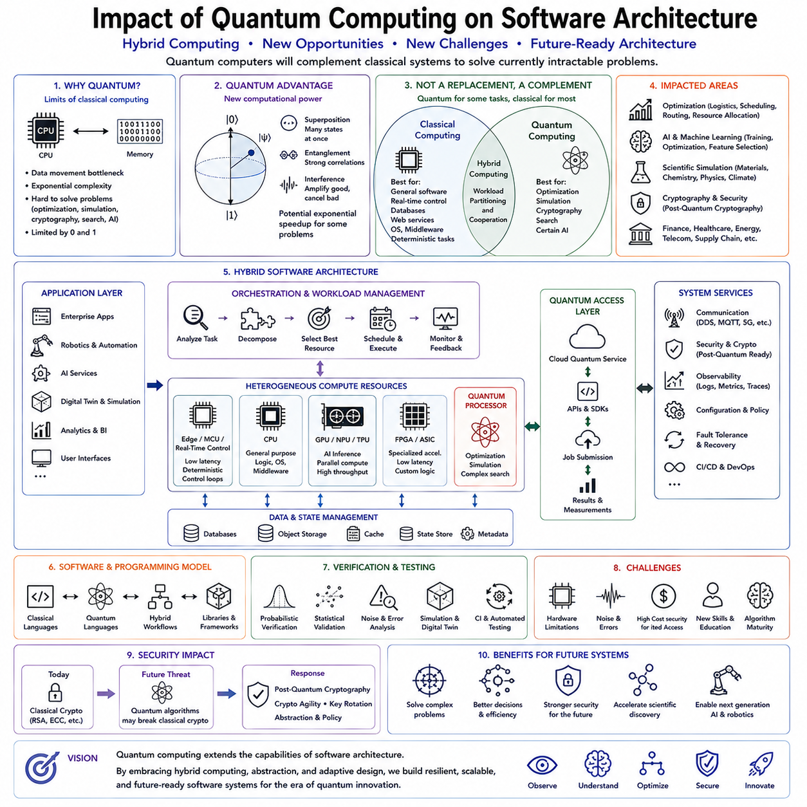{width="7.268055555555556in" height="7.268055555555556in"}

The uploaded engineering library introduces **"23_12.04 Impact of Quantum Computing on Software Architecture"** as a forward-looking exploration of how emerging quantum computing technologies may fundamentally reshape software engineering during the coming decades. Throughout the previous chapters, software architecture has evolved from monolithic systems toward distributed services, cloud-native infrastructure, artificial intelligence, cross-platform computing, self-adaptive software, neuromorphic architectures, and Software-Defined Systems. Each architectural transition was driven by advances in computing capability and changing application requirements. Quantum computing represents another potential paradigm shift, not because it will immediately replace conventional digital computers, but because it introduces an entirely different computational model capable of solving certain classes of problems that remain computationally intractable for even the most powerful classical supercomputers. Consequently, future software architecture must gradually evolve to accommodate hybrid classical-quantum computing while preserving portability, reliability, maintainability, security, and operational continuity.

For more than half a century, software architecture has been built upon deterministic digital computation. Classical processors execute instructions sequentially or in parallel using binary states represented by zeros and ones. Regardless of processor speed, multicore scalability, cloud distribution, or GPU acceleration, all modern computing platforms ultimately manipulate deterministic binary information. This computational foundation has proven remarkably successful across enterprise systems, embedded devices, autonomous robotics, scientific computing, and artificial intelligence. However, many optimization, simulation, cryptographic, molecular modeling, combinatorial search, and machine learning problems exhibit exponential computational complexity, causing execution time to increase dramatically as problem size expands. Even massive cloud infrastructures eventually encounter practical limitations when solving such computationally intensive tasks.

Quantum computing approaches computation from fundamentally different physical principles. Rather than encoding information exclusively as classical bits, quantum systems employ quantum bits, or qubits, capable of existing in superposition states representing multiple computational possibilities simultaneously. Furthermore, quantum entanglement enables strong correlations among qubits that have no equivalent within classical information processing. Quantum interference selectively amplifies correct computational pathways while suppressing undesirable alternatives. Collectively, these quantum mechanical phenomena enable algorithms capable of exploring extremely large solution spaces far more efficiently than conventional computational approaches for carefully selected classes of problems.

It is important to recognize that quantum computers are not universally faster than classical computers. Conventional processors remain superior for the overwhelming majority of everyday software workloads including operating systems, databases, web services, robotic control, graphical interfaces, business applications, embedded firmware, communication middleware, and deterministic real-time systems. Quantum computing instead complements classical computing by accelerating specific computational domains involving optimization, probabilistic modeling, cryptographic analysis, quantum simulation, complex search, large-scale mathematical computation, and selected machine learning algorithms. Consequently, future software architecture is expected to evolve toward hybrid computational ecosystems rather than complete replacement of existing computing platforms.

One of the earliest architectural impacts will involve computational workload partitioning. Current software architectures already distribute computation among CPUs, GPUs, TPUs, NPUs, edge devices, cloud infrastructure, and specialized accelerators according to workload characteristics. Quantum processors naturally extend this heterogeneous computing model. Conventional software continues executing deterministic control logic, communication protocols, databases, user interaction, middleware, robotics frameworks, and operational management while quantum processors solve carefully isolated computational subproblems benefiting from quantum acceleration. Software architecture therefore becomes responsible for intelligently identifying which computations should execute on classical infrastructure and which should be delegated toward quantum resources.

Optimization represents perhaps the most significant practical application domain influencing future software architecture. Modern logistics systems, autonomous fleet coordination, industrial scheduling, manufacturing optimization, transportation planning, robotic path planning, warehouse management, communication routing, energy distribution, and supply chain management all require solving complex optimization problems involving enormous numbers of interacting constraints. Classical optimization algorithms frequently approximate solutions because exhaustive search becomes computationally infeasible. Quantum optimization algorithms potentially evaluate vast solution spaces more efficiently, enabling software systems to generate improved operational decisions within practical time constraints.

Autonomous robotics provides numerous examples where quantum optimization may eventually influence architectural design. Multi-robot coordination, dynamic mission assignment, resource allocation, collision-free navigation, cooperative exploration, swarm intelligence, inspection scheduling, warehouse routing, charging infrastructure optimization, communication topology management, and long-term operational planning all involve combinatorial optimization problems that increase rapidly with system scale. While real-time control remains firmly within classical embedded processors, cloud-based planning services could eventually incorporate quantum optimization engines supporting strategic decision making for large robotic fleets.

Artificial intelligence represents another promising area of interaction between quantum computing and software architecture. Contemporary deep learning requires extensive computational resources during model training, hyperparameter optimization, feature selection, probabilistic inference, and high-dimensional optimization. Although current quantum machine learning remains largely experimental, future architectures may employ quantum processors for selected AI workloads while maintaining classical inference during operational deployment. Consequently, AI software architecture gradually evolves toward hybrid intelligence platforms integrating classical neural networks, probabilistic reasoning, symbolic knowledge representation, neuromorphic processing, and quantum optimization within unified computational ecosystems.

Simulation and scientific modeling provide another compelling application domain. Numerous scientific disciplines including materials science, chemistry, pharmaceutical discovery, climate modeling, molecular dynamics, quantum physics, energy systems, and advanced manufacturing require simulation of highly complex physical interactions that challenge classical computational capability. Software architectures supporting digital engineering, digital twins, advanced simulation, and predictive analytics may eventually integrate quantum simulation services capable of significantly improving scientific accuracy while reducing computational complexity for appropriate problem classes.

Cryptography represents one of the most widely discussed architectural consequences of quantum computing. Many widely deployed public-key cryptographic algorithms derive their security from mathematical problems believed difficult for classical computers to solve efficiently. Certain quantum algorithms theoretically reduce the computational difficulty of some of these problems, motivating global transition toward quantum-resistant cryptographic standards. Future software architecture therefore increasingly incorporates post-quantum cryptography, cryptographic agility, flexible certificate management, secure key rotation, hardware security modules, and algorithm-independent security abstractions capable of evolving alongside future cryptographic standards.

Consequently, software architecture must become cryptographically adaptable rather than depending permanently upon specific encryption algorithms. Security frameworks increasingly separate cryptographic policy from implementation, enabling organizations to replace underlying algorithms without redesigning application software. Such architectural flexibility proves valuable not only for quantum resilience but also for long-term cybersecurity maintenance across continuously evolving technological environments.

Cloud computing will likely serve as the primary access mechanism for quantum computational resources during the foreseeable future. Unlike CPUs and GPUs currently integrated directly into personal workstations, embedded computers, and industrial platforms, quantum processors require highly specialized environmental conditions including cryogenic cooling, electromagnetic isolation, sophisticated calibration, and continuous operational maintenance. Consequently, most organizations will access quantum computing through cloud-based quantum services rather than local deployment. Future software architecture therefore integrates quantum computation similarly to contemporary cloud AI services, invoking remote quantum resources only when computational benefits justify associated communication latency and operational complexity.

Hybrid cloud architecture naturally emerges from this deployment model. Edge devices, embedded controllers, industrial computers, enterprise servers, cloud-native applications, AI accelerators, and quantum computing services cooperate within unified distributed computational ecosystems. Time-critical robotic control continues executing locally, perception algorithms operate upon GPUs or NPUs, enterprise management executes within cloud infrastructure, while selected optimization or simulation tasks invoke remote quantum services asynchronously. Architectural orchestration therefore becomes increasingly sophisticated as computational diversity expands.

Programming models inevitably evolve alongside quantum computing. Conventional procedural, object-oriented, functional, and event-driven programming remain essential for classical computation. Quantum programming introduces entirely new computational abstractions including quantum circuits, reversible computation, probabilistic measurement, quantum state preparation, entanglement management, and hybrid execution workflows. Software architects therefore increasingly distinguish between application logic and computational strategy, enabling quantum implementations without disrupting higher-level business functionality.

Abstraction layers become even more important within hybrid quantum architectures. Application developers should rarely require direct interaction with quantum hardware characteristics. Instead, middleware, orchestration frameworks, computational schedulers, optimization libraries, AI runtimes, workflow engines, and hardware abstraction services transparently determine whether individual computational tasks execute upon CPUs, GPUs, neuromorphic processors, or quantum accelerators according to workload characteristics, performance objectives, energy constraints, security requirements, and economic considerations.

Quantum software engineering introduces new verification challenges because quantum computation fundamentally incorporates probabilistic behavior. Classical deterministic software typically produces identical outputs given identical inputs, whereas quantum algorithms often require repeated execution followed by statistical interpretation of measurement results. Consequently, software verification evolves beyond deterministic correctness toward probabilistic confidence, statistical validation, algorithmic convergence, uncertainty estimation, and hybrid verification methodologies combining formal methods with probabilistic analysis.

Testing methodologies similarly require adaptation. Conventional unit testing validates deterministic functional behavior under controlled conditions. Quantum software testing increasingly emphasizes algorithmic correctness, probability distribution analysis, noise resilience, hardware calibration sensitivity, numerical stability, hybrid workflow validation, and statistical confidence intervals. Continuous Integration pipelines eventually incorporate both classical regression testing and quantum algorithm validation according to available computational resources.

Digital Twin technology may play an especially important role during quantum software development. Because quantum hardware remains scarce and operationally expensive, digital twin environments simulate hybrid computational architectures before deployment. Architects evaluate workflow partitioning, communication latency, quantum workload selection, algorithmic efficiency, security implications, resource utilization, and operational performance within virtual environments prior to execution upon physical quantum infrastructure. Digital twins therefore become experimental laboratories supporting architectural optimization throughout hybrid computing evolution.

Artificial intelligence may itself assist quantum software engineering. AI-based optimization techniques identify computational kernels benefiting from quantum acceleration, recommend workload partitioning strategies, optimize hybrid execution schedules, generate quantum circuits, analyze algorithmic performance, detect implementation errors, recommend architectural improvements, and continuously refine computational efficiency through operational experience. AI and quantum computing therefore reinforce one another within future software engineering ecosystems.

Resource orchestration becomes significantly more complex within heterogeneous computational environments. Software architecture increasingly manages processors spanning embedded microcontrollers, CPUs, GPUs, TPUs, NPUs, neuromorphic accelerators, FPGA-based systems, cloud infrastructure, and quantum computing services simultaneously. Intelligent orchestration dynamically distributes computational workloads according to latency requirements, computational complexity, energy availability, communication quality, hardware accessibility, security constraints, operational priorities, and economic cost. Such orchestration becomes one of the defining responsibilities of future architectural frameworks.

Quantum computing also influences enterprise software architecture through increasingly sophisticated decision-support systems. Financial portfolio optimization, manufacturing scheduling, transportation planning, supply chain optimization, healthcare resource allocation, energy distribution, communication infrastructure planning, and strategic business analytics all involve optimization problems potentially benefiting from hybrid classical-quantum workflows. Enterprise software therefore evolves toward computational platforms capable of seamlessly integrating multiple specialized computational paradigms according to business requirements.

Importantly, software maintainability remains a primary architectural objective throughout this technological transition. Quantum computing should enhance software capability without introducing excessive architectural complexity. Modular software organization, stable interfaces, hardware abstraction, dependency isolation, service-oriented communication, containerized deployment, standardized APIs, and cross-platform portability collectively ensure quantum acceleration remains optional rather than mandatory. Organizations therefore preserve software investments accumulated across decades while gradually integrating emerging computational technologies.

Education and workforce development also become increasingly significant. Software architects of the future require understanding not only conventional software engineering but also distributed systems, artificial intelligence, cloud-native infrastructure, cybersecurity, heterogeneous computing, probabilistic reasoning, optimization theory, and fundamental quantum computing principles. Successful engineering organizations therefore cultivate interdisciplinary expertise combining computer science, mathematics, physics, systems engineering, and software architecture within collaborative development environments.

Although practical large-scale quantum computing continues advancing gradually, software architecture should begin preparing for eventual integration today by emphasizing modularity, computational abstraction, hardware independence, service decomposition, workflow orchestration, and flexible computational interfaces. Such preparation benefits software engineering regardless of quantum adoption because identical principles also improve cloud portability, heterogeneous computing, AI integration, and long-term maintainability.

Ultimately, the impact of quantum computing on software architecture extends far beyond introducing another hardware accelerator. Quantum computing encourages architects to rethink computation itself as a heterogeneous, distributed, service-oriented capability spanning deterministic processors, artificial intelligence accelerators, neuromorphic systems, cloud infrastructure, edge computing, and quantum resources working cooperatively within unified software ecosystems. By emphasizing computational abstraction, hybrid orchestration, adaptive resource management, cryptographic agility, probabilistic verification, modular architecture, cloud-native integration, and long-term technological flexibility, future software architecture establishes a resilient engineering foundation capable of embracing quantum innovation while preserving compatibility with existing digital systems. Rather than replacing classical software engineering, quantum computing expands its computational horizon, enabling future Software-Defined Systems, Physical AI, intelligent robotics, scientific computing, and globally connected cyber-physical ecosystems to solve increasingly sophisticated problems that remain beyond the practical reach of conventional computing alone.

## 12.05 Large Action Model-Based Software Architecture

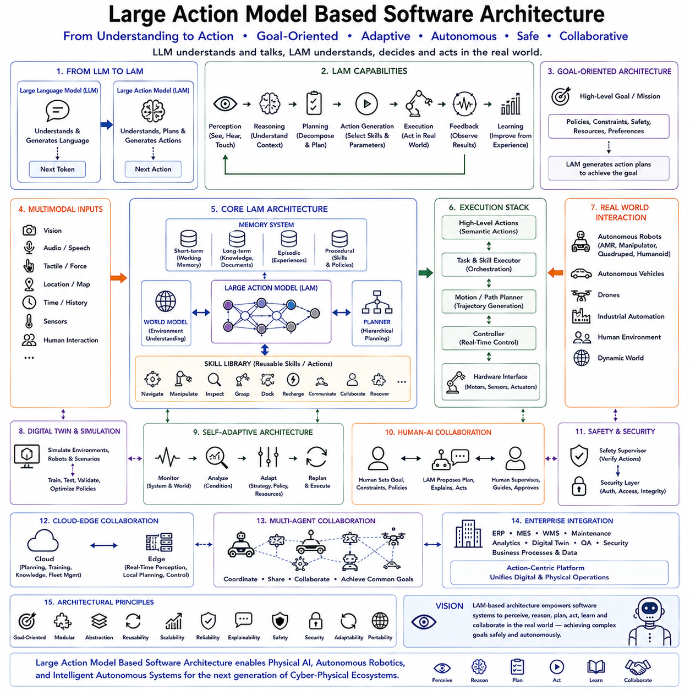{width="7.268055555555556in" height="7.268055555555556in"}

The uploaded engineering library introduces **"23_12.05 Large Action Model Based Software Architecture"** as one of the most transformative architectural concepts emerging in the era of Physical Artificial Intelligence. While Large Language Models fundamentally changed how software understands and generates human language, future autonomous systems require a deeper capability that extends beyond conversation into intelligent decision making and real-world execution. Large Action Models, commonly referred to as LAMs, represent this next evolutionary stage by shifting the architectural focus from generating language to generating executable behavior. Instead of merely predicting the next token within a sentence, a Large Action Model predicts the next meaningful action required to accomplish a goal. Consequently, software architecture evolves from being primarily information-centric toward becoming action-centric, where planning, execution, adaptation, verification, and continuous interaction with physical environments become first-class architectural responsibilities.

Traditional software architecture has generally assumed that software executes deterministic algorithms explicitly designed by human engineers. Applications receive predefined inputs, perform specified computations, and produce predictable outputs according to carefully implemented logic. Artificial intelligence introduced statistical reasoning into perception, prediction, and decision support, yet most operational behavior continued relying upon manually engineered workflows. Large Language Models further expanded natural language understanding but remain primarily communication-oriented systems. Large Action Models extend this progression by integrating perception, reasoning, planning, memory, execution, feedback, and adaptation into unified architectures capable of autonomously accomplishing complex tasks across digital and physical environments.

The conceptual distinction between Large Language Models and Large Action Models is fundamental. Language models predict linguistic sequences based upon textual context, enabling conversation, summarization, translation, programming assistance, and knowledge retrieval. Large Action Models instead predict sequences of executable operations based upon environmental state, operational objectives, available resources, historical experience, and current system constraints. Language becomes only one modality among many. Vision, tactile sensing, spatial understanding, temporal reasoning, robotic manipulation, navigation, communication, human interaction, and environmental feedback collectively influence action generation. Consequently, software architecture must integrate multimodal intelligence rather than treating language as the sole interface between humans and machines.

Large Action Models naturally align with the evolution toward Physical AI because intelligent physical systems continuously interact with changing environments rather than static digital information. Autonomous mobile robots navigate unpredictable spaces, manipulators perform dexterous object handling, quadrupeds traverse uneven terrain, humanoids collaborate with humans, industrial robots coordinate manufacturing activities, and autonomous vehicles continuously adapt to dynamic traffic conditions. These systems require software architectures capable of transforming high-level goals into adaptive sequences of physical actions while responding intelligently to unforeseen environmental changes.

Goal-oriented architecture therefore becomes a defining characteristic of LAM-based software systems. Rather than programming explicit procedures for every possible operational scenario, architects specify desired outcomes together with operational policies, safety constraints, resource limitations, and mission objectives. Large Action Models continuously generate executable plans leading toward these objectives while adapting behavior according to real-time observations. Software architecture consequently shifts from procedural workflow definition toward declarative goal specification, where intent becomes more important than predetermined implementation sequences.

Hierarchical decision making represents another essential architectural principle. Human cognition naturally decomposes complex objectives into progressively smaller subtasks until concrete physical actions become executable. Large Action Model architectures follow similar principles. High-level mission reasoning determines strategic objectives. Task planning decomposes missions into operational workflows. Skill selection chooses reusable behavioral capabilities. Motion planning generates executable trajectories. Low-level controllers finally execute deterministic motor commands. This hierarchical organization separates strategic reasoning from deterministic control while preserving scalability across increasingly sophisticated autonomous systems.

Software modularity remains critically important despite increasing model intelligence. Large Action Models should orchestrate existing software capabilities rather than replacing every engineering component with monolithic neural computation. Perception services, localization systems, mapping infrastructure, navigation frameworks, manipulation controllers, communication middleware, diagnostics, cybersecurity services, safety supervisors, cloud interfaces, digital twins, and hardware abstraction layers remain independently developed modules exposing standardized interfaces. The Large Action Model coordinates these capabilities through intelligent orchestration rather than direct implementation. Consequently, architectural maintainability, portability, and software reuse remain preserved despite increasing autonomy.

Action abstraction becomes one of the most valuable architectural concepts within LAM-based systems. Individual motor commands, actuator signals, communication packets, and sensor operations possess excessive implementation detail for intelligent reasoning. Large Action Models instead operate upon semantic actions representing meaningful operational capabilities such as navigate to destination, inspect equipment, grasp object, recharge battery, communicate status, verify safety, collect sample, or collaborate with another robot. Lower architectural layers translate these semantic actions into deterministic implementation procedures while preserving abstraction between cognitive reasoning and physical execution.

Skill libraries therefore emerge as reusable architectural assets. Complex robotic behaviors become encapsulated within parameterized action modules representing navigation, docking, manipulation, inspection, perception, communication, localization, recovery procedures, and collaborative operations. Large Action Models dynamically compose these reusable skills into increasingly sophisticated workflows according to operational objectives. New robotic capabilities consequently arise through intelligent orchestration of existing behavioral components rather than complete software redevelopment.

Memory architecture assumes substantially greater importance within LAM-based systems because effective action generation depends heavily upon accumulated experience. Future software architecture therefore distinguishes multiple forms of memory serving complementary purposes. Short-term operational memory maintains current environmental observations, active mission state, temporary reasoning context, and ongoing task progress. Long-term semantic memory preserves domain knowledge, engineering documentation, operational procedures, regulations, safety policies, and organizational expertise. Episodic memory records previous missions, environmental interactions, execution outcomes, and historical adaptation experience. Procedural memory stores reusable behavioral skills supporting future task execution. Collectively these memory systems provide contextual intelligence enabling increasingly sophisticated autonomous behavior.

Perception evolves beyond isolated sensor processing toward semantic environmental understanding. Conventional robotic perception frequently emphasizes object detection, localization accuracy, mapping quality, and numerical sensor fusion. Large Action Model architectures instead require perception capable of recognizing actionable environmental context. Identifying a door becomes less important than recognizing whether the door permits passage. Detecting a charging station becomes valuable because recharging supports future mission completion. Recognizing human intention becomes essential for collaborative interaction. Consequently, perception increasingly emphasizes operational meaning rather than geometric measurement alone.

Planning architecture similarly expands beyond conventional path planning toward comprehensive mission reasoning. Navigation planning remains necessary but becomes only one component within broader operational planning encompassing resource allocation, temporal scheduling, collaboration, communication, energy management, environmental adaptation, contingency preparation, safety verification, and long-term objective optimization. Large Action Models continuously revise plans according to environmental feedback rather than rigidly executing predetermined workflows.

Continuous feedback distinguishes intelligent action architectures from conventional automation. Every executed action generates environmental consequences subsequently observed through multimodal perception. These observations update internal world models, influence subsequent planning, refine future predictions, identify execution discrepancies, and improve behavioral policies through continual operational experience. Feedback therefore transforms software execution into continuous interaction rather than one-directional command issuance.

Self-adaptive architecture integrates naturally with Large Action Models. Previous discussions introduced software capable of monitoring operational state before dynamically modifying computational behavior. Large Action Models extend this concept toward adaptive behavioral intelligence. Rather than merely reallocating computational resources, adaptive action architectures modify mission strategies, behavioral policies, collaboration patterns, perception priorities, communication methods, and execution workflows according to continuously changing operational environments. Adaptation therefore encompasses both computational architecture and physical behavior simultaneously.

Digital Twin technology provides indispensable support for LAM-based software development. Intelligent action policies require extensive experimentation before deployment into physical environments. Digital twins simulate robotic platforms, environmental conditions, human interaction, sensor behavior, communication infrastructure, and operational uncertainty with high fidelity. Large Action Models therefore accumulate substantial behavioral experience within virtual environments before transferring learned capabilities toward physical deployment. Continuous synchronization between digital twins and operational systems further enables ongoing policy refinement throughout system lifecycles.

Simulation becomes significantly more valuable because action generation requires diverse experiential learning. Conventional software testing validates deterministic functionality through predefined scenarios. Large Action Models instead benefit from exposure to enormous numbers of environmental variations, operational disturbances, equipment failures, human behaviors, weather conditions, sensor degradation, communication interruptions, and unforeseen mission constraints. Simulation therefore evolves from verification infrastructure toward continuous behavioral education supporting lifelong architectural improvement.

Human-AI collaboration constitutes another defining architectural objective. Large Action Models should augment human capability rather than replace human judgment entirely. Human operators define strategic objectives, ethical boundaries, safety constraints, organizational priorities, and mission intent. Large Action Models generate operational alternatives, recommend execution strategies, coordinate robotic resources, monitor progress, explain reasoning, request clarification when uncertainty becomes excessive, and continuously adapt according to human guidance. Architectural transparency therefore becomes essential for maintaining operator trust and organizational accountability.

Explainability assumes heightened importance because autonomous action directly influences physical environments. Language generation errors may inconvenience users, whereas incorrect physical actions may damage equipment or endanger human safety. Large Action Model architectures therefore incorporate reasoning traces, confidence estimation, policy explanation, safety justification, execution visualization, decision provenance, and operational transparency supporting human understanding of autonomous behavior. Explainable architecture becomes a prerequisite for industrial deployment within safety-critical environments.

Safety architecture remains fundamentally deterministic despite increasing model intelligence. Large Action Models generate proposed behaviors, but independent safety supervisors continuously verify every planned action before physical execution. Safety policies, collision avoidance, operational constraints, regulatory compliance, hardware protection, emergency procedures, and human safety mechanisms remain implemented through formally validated deterministic software components. Intelligent reasoning therefore operates within carefully defined safety envelopes established by conventional engineering methodologies.

Cybersecurity similarly evolves within LAM-based architectures. Autonomous action generation introduces new attack surfaces extending beyond conventional software vulnerabilities. Architectural security therefore incorporates identity verification, secure communication, behavioral anomaly detection, policy validation, execution authorization, model integrity verification, trusted execution environments, secure update mechanisms, and continuous operational monitoring. Every generated action must satisfy organizational security policies before execution regardless of model confidence.

Cloud-edge collaboration becomes increasingly sophisticated because Large Action Models demand substantial computational resources while physical systems require deterministic low-latency response. Strategic reasoning, organizational knowledge management, long-term planning, collaborative learning, and fleet optimization frequently execute within cloud infrastructure. Real-time perception, local planning, safety verification, motion control, and immediate environmental interaction execute upon edge computers integrated directly within robotic platforms. Software architecture continuously partitions computational responsibilities according to latency, bandwidth, privacy, energy availability, and operational priorities.

Multi-agent collaboration represents one of the most powerful future applications of Large Action Models. Rather than controlling isolated autonomous systems, LAM-based architecture coordinates fleets of heterogeneous robots collaborating toward shared objectives. Autonomous mobile robots transport materials while manipulators perform assembly, quadrupeds inspect hazardous environments, drones provide aerial perception, humanoids interact with personnel, and cloud intelligence coordinates overall mission progress. Large Action Models reason across organizational workflows rather than individual robotic platforms, enabling coordinated intelligent ecosystems.

Enterprise integration becomes increasingly seamless because intelligent action extends beyond robotics into digital business processes. Manufacturing execution systems, enterprise resource planning, warehouse management, predictive maintenance, supply chain optimization, customer service, digital twins, quality assurance, cybersecurity monitoring, and organizational analytics increasingly interact through common action-oriented software architectures. Large Action Models therefore coordinate both digital and physical operational activities within unified enterprise ecosystems.

Software engineering itself gradually evolves under the influence of action-oriented architecture. Traditional programming emphasizes algorithm implementation, interface development, and procedural workflow definition. Future architects increasingly design reusable skills, semantic action interfaces, behavioral policies, knowledge structures, orchestration frameworks, simulation environments, safety constraints, and organizational objectives while intelligent models generate adaptive execution strategies. Software engineering consequently transitions from coding every operational detail toward architecting intelligent behavioral ecosystems.

Cross-platform portability remains an essential architectural requirement despite increasing AI sophistication. Large Action Models should orchestrate behavior consistently across embedded controllers, industrial computers, cloud platforms, autonomous robots, manipulators, humanoids, digital twins, and future heterogeneous computing infrastructure. Hardware abstraction, operating system independence, standardized middleware, service-oriented communication, containerized deployment, and modular software organization collectively preserve architectural flexibility while supporting continuous technological evolution.

The emergence of Large Action Models does not eliminate existing software architecture principles but rather elevates them into higher organizational intelligence. Layered architecture, modular design, abstraction, separation of concerns, deterministic safety control, reusable software components, cross-platform portability, CI/CD automation, digital twins, self-adaptive architecture, cloud-native deployment, heterogeneous computing, and cybersecurity all remain essential engineering foundations. Large Action Models integrate these capabilities through intelligent reasoning and adaptive orchestration, transforming isolated software components into coherent autonomous ecosystems capable of understanding goals, generating executable actions, learning continuously from experience, collaborating with humans, coordinating distributed intelligent systems, and evolving throughout decades of operational service.

Ultimately, Large Action Model Based Software Architecture represents a fundamental transition from software that merely processes information toward software that understands intent, generates meaningful actions, interacts continuously with dynamic physical environments, coordinates heterogeneous computational resources, learns from operational experience, collaborates naturally with humans, and autonomously accomplishes complex missions under real-world uncertainty. By combining multimodal perception, semantic action abstraction, hierarchical planning, reusable skill orchestration, digital twins, self-adaptive architecture, cloud-edge collaboration, deterministic safety supervision, organizational knowledge management, and lifelong learning, Large Action Models establish the architectural foundation for Software-Defined Robotics, Physical AI, intelligent autonomous enterprises, and the next generation of continuously evolving cyber-physical ecosystems where software no longer simply computes answers but actively performs intelligent work within the physical world.

## 12.06 AI Agent-Based Autonomous Software Composition

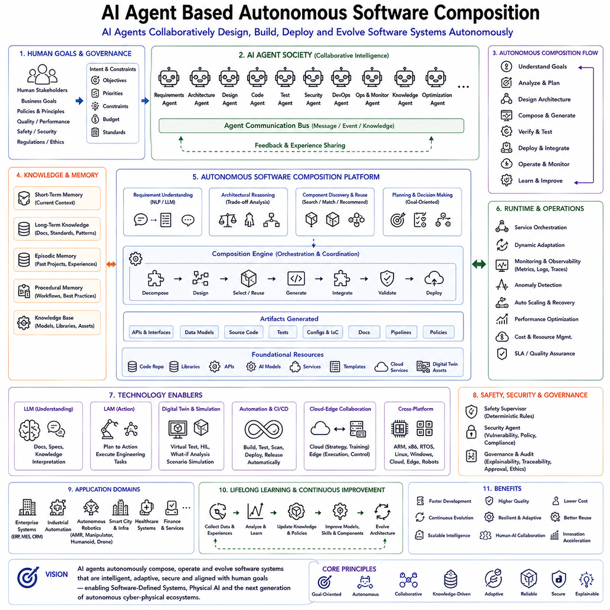{width="7.268055555555556in" height="7.268055555555556in"}

The uploaded engineering library introduces **"23_12.06 AI Agent Based Autonomous Software Composition"** as the next evolutionary step beyond Large Language Models, Large Action Models, and Self-Adaptive Architecture. While previous software architectures emphasized predefined workflows, modular software components, and intelligent planning, the next generation of software systems will increasingly become capable of autonomously composing, reorganizing, extending, and optimizing their own software structures through intelligent AI agents. Instead of treating software composition as an activity performed exclusively by human software engineers during development, future software architecture envisions continuously evolving software ecosystems where specialized AI agents collaboratively analyze requirements, design architectures, generate software modules, validate implementations, deploy services, monitor execution, learn from operational experience, and improve software throughout its entire lifecycle. Software therefore evolves from being manually assembled toward becoming continuously self-composing under carefully governed architectural principles.

Traditional software engineering assumes that human developers perform nearly every architectural activity. Requirements are analyzed manually, software components are designed by architects, source code is implemented by programmers, testing is created by quality engineers, deployment pipelines are configured by DevOps specialists, and operational maintenance is performed by system administrators. Automation has gradually improved individual engineering activities through integrated development environments, CI/CD pipelines, code generation tools, and AI-assisted programming, yet the overall architectural process remains largely human coordinated. AI Agent Based Autonomous Software Composition fundamentally extends automation by allowing multiple specialized intelligent agents to cooperate throughout software engineering itself.

An AI agent differs substantially from conventional software automation. Traditional automation executes predefined procedures according to explicitly programmed rules. AI agents instead operate autonomously toward defined objectives while reasoning about changing environments, selecting appropriate strategies, coordinating with other agents, adapting plans according to feedback, and continuously improving performance through accumulated experience. Each agent represents an intelligent architectural participant possessing specialized expertise while collaborating within larger engineering ecosystems.

Future software architecture increasingly consists of cooperative agent societies rather than isolated intelligent models. Individual agents specialize in requirements analysis, software architecture design, API definition, database modeling, interface generation, cybersecurity evaluation, AI model optimization, software testing, deployment planning, documentation generation, code review, dependency management, runtime monitoring, maintenance planning, and operational analytics. Rather than centralizing every engineering responsibility within one extremely large intelligence model, software engineering becomes distributed across specialized collaborative experts whose combined capability exceeds isolated intelligence.

Goal-oriented engineering provides the conceptual foundation supporting autonomous software composition. Human stakeholders define desired business objectives, operational policies, quality expectations, safety requirements, regulatory constraints, performance targets, and architectural principles. AI agents interpret these high-level objectives before collaboratively constructing software architectures capable of satisfying organizational goals. Consequently, software composition shifts from implementation-driven development toward objective-driven engineering where intent becomes the primary engineering artifact.

Requirements engineering undergoes substantial transformation within agent-based software composition. Human requirements frequently contain ambiguity, incompleteness, inconsistency, or evolving priorities. Intelligent requirements agents continuously analyze stakeholder communication, identify missing information, resolve conflicting objectives, recommend architectural alternatives, estimate implementation complexity, verify regulatory compliance, and maintain traceability throughout software evolution. Requirements therefore become living knowledge structures rather than static documentation created only during project initiation.

Architectural design similarly evolves toward collaborative intelligence. Dedicated architecture agents evaluate alternative software structures according to modularity, scalability, portability, maintainability, performance, security, reliability, fault tolerance, cloud readiness, cross-platform compatibility, AI integration, and organizational engineering standards. Rather than producing one fixed architecture during initial design, intelligent agents continuously reassess architectural quality throughout software evolution while recommending structural improvements according to changing operational requirements.

Component discovery becomes another important architectural capability. Modern organizations already possess extensive software repositories containing reusable modules, APIs, libraries, cloud services, middleware frameworks, AI models, digital twin components, robotic skills, security mechanisms, and operational utilities. Composition agents automatically identify reusable capabilities matching current engineering objectives before recommending integration rather than redundant redevelopment. Organizational software assets therefore become increasingly valuable as intelligent reuse accelerates engineering productivity.

Software generation extends beyond source code production toward complete architectural composition. Autonomous composition agents generate APIs, service interfaces, data models, workflow orchestration, deployment descriptors, infrastructure definitions, configuration policies, monitoring dashboards, documentation, test suites, cybersecurity policies, and operational playbooks simultaneously. Software architecture therefore emerges as an integrated engineering ecosystem rather than disconnected implementation artifacts produced independently by separate development teams.

Microservice architecture naturally complements autonomous composition because independently deployable services simplify intelligent assembly. AI agents analyze organizational requirements before selecting existing services, composing new functionality, defining communication interfaces, orchestrating workflows, establishing deployment relationships, and validating system consistency automatically. Service composition consequently becomes a continuous architectural activity rather than occasional manual integration.

Service orchestration acquires significantly greater intelligence through collaborative agent reasoning. Conventional workflow engines execute predefined sequences of service invocations. AI composition agents dynamically determine service ordering, execution priorities, resource allocation, fault recovery strategies, communication optimization, scalability policies, and runtime adaptation according to operational context. Workflows therefore become adaptive rather than statically programmed.

Large Language Models and Large Action Models provide complementary capabilities within autonomous composition architecture. Language models interpret documentation, engineering specifications, regulatory standards, customer requirements, and organizational knowledge. Action models transform these semantic objectives into executable engineering activities including software generation, testing, deployment, verification, monitoring, maintenance, and operational optimization. AI agents coordinate both reasoning paradigms while integrating them into coherent engineering workflows.

Knowledge management becomes central to autonomous software composition because engineering decisions require comprehensive organizational understanding. Architecture repositories preserve design principles, software patterns, coding standards, security policies, compliance regulations, deployment procedures, testing methodologies, historical project experience, operational metrics, customer feedback, and maintenance knowledge. AI agents continuously update this organizational knowledge while incorporating newly acquired engineering experience into future software composition decisions.

Memory architecture similarly supports increasingly sophisticated engineering intelligence. Short-term working memory maintains active engineering context during ongoing software composition. Long-term semantic memory stores architectural knowledge, software documentation, engineering standards, and organizational best practices. Episodic memory records completed projects, architectural evolution, deployment outcomes, and maintenance experience. Procedural memory preserves reusable engineering workflows supporting continuous improvement across future software projects.

Multi-agent collaboration distinguishes autonomous composition from isolated code generation. Architecture agents define structural organization. Implementation agents generate source code. Testing agents construct verification suites. Security agents evaluate vulnerabilities. Documentation agents produce technical references. DevOps agents prepare deployment infrastructure. Maintenance agents monitor operational behavior. Optimization agents recommend architectural refinement. Communication among these specialized agents produces engineering outcomes exceeding the capability of any individual intelligent model operating independently.

Conflict resolution therefore becomes an essential architectural capability. Different engineering objectives frequently compete. Security may reduce performance. Reliability may increase resource consumption. Scalability may complicate maintainability. Explainability may reduce optimization opportunities. Specialized negotiation agents evaluate competing architectural priorities according to organizational governance policies before producing balanced engineering decisions satisfying overall business objectives.

Continuous Integration and Continuous Deployment become autonomous engineering ecosystems rather than simple automation pipelines. Source code generation, architectural verification, dependency analysis, unit testing, integration testing, security validation, documentation updates, digital twin simulation, Hardware-in-the-Loop verification, performance benchmarking, deployment qualification, release approval, and operational monitoring increasingly occur through collaborative AI agent workflows. Human engineers supervise strategic objectives while routine engineering execution becomes progressively autonomous.

Digital Twin technology substantially improves autonomous software composition by providing realistic virtual environments supporting continuous architectural experimentation. AI agents evaluate newly generated software, deployment strategies, communication architectures, AI policies, robotic behaviors, cybersecurity mechanisms, and scalability improvements within simulated environments before modifying production systems. Consequently, software evolution becomes significantly safer while reducing operational risk.

Simulation expands beyond testing toward autonomous engineering education. Composition agents continuously explore alternative architectural designs, evaluate implementation strategies, compare optimization approaches, analyze failure scenarios, and accumulate engineering knowledge through extensive simulated experimentation. Continuous simulation therefore enables lifelong improvement in engineering competence analogous to operational learning within intelligent autonomous systems.

Cross-platform software composition becomes increasingly important because modern software spans embedded controllers, edge computers, cloud infrastructure, autonomous robots, mobile devices, industrial systems, digital twins, and heterogeneous computing platforms simultaneously. Composition agents automatically generate platform-specific implementations while preserving common architectural abstractions through hardware abstraction layers, middleware services, container technologies, cross-compilation frameworks, standardized APIs, and portable software components.

Cloud-edge collaboration introduces additional architectural complexity requiring intelligent orchestration. AI composition agents determine which software services should execute locally for deterministic response, which belong within regional edge infrastructure, which require centralized cloud processing, and how communication, security, deployment, fault recovery, and resource allocation should operate across distributed computing environments. Such decisions increasingly depend upon operational context rather than fixed deployment assumptions.

Large-scale enterprise software particularly benefits from autonomous composition because organizational information systems continuously evolve. Enterprise resource planning, manufacturing execution, warehouse management, digital twins, fleet management, predictive maintenance, cybersecurity monitoring, customer relationship management, supply chain optimization, business intelligence, and AI services increasingly integrate through agent-generated architectural workflows. Software composition therefore becomes an ongoing organizational capability rather than isolated project activity.

Robotics provides one of the strongest application domains for autonomous composition. Future robotic ecosystems include autonomous mobile robots, manipulators, humanoids, quadrupeds, drones, inspection systems, collaborative robots, warehouse automation, healthcare assistants, and industrial infrastructure operating cooperatively within dynamic environments. AI composition agents automatically assemble perception pipelines, navigation services, manipulation capabilities, communication interfaces, cloud coordination, digital twins, fleet management, cybersecurity policies, and safety supervision according to mission objectives and available hardware resources.

Safety governance remains indispensable despite increasing autonomy. Autonomous composition agents propose architectural structures and generate software artifacts, yet deterministic governance frameworks continuously verify compliance with safety standards, regulatory requirements, engineering policies, quality objectives, cybersecurity constraints, and organizational best practices. Human architects retain authority regarding strategic decisions while AI agents perform increasingly sophisticated engineering execution within carefully established governance boundaries.

Cybersecurity architecture similarly evolves through autonomous composition. Specialized security agents continuously analyze generated software, identify vulnerabilities, recommend secure architectural patterns, validate authentication mechanisms, evaluate encryption policies, inspect software dependencies, detect supply chain risks, generate security documentation, and monitor operational integrity throughout software lifecycles. Security therefore becomes continuously integrated rather than periodically reviewed.

Observability forms another critical architectural foundation because autonomous engineering requires continuous understanding of software behavior. Monitoring agents collect performance metrics, execution traces, resource utilization, communication quality, AI inference statistics, operational health indicators, deployment status, user interaction patterns, and security events. Analytical agents interpret these observations before recommending architectural adaptation, software optimization, maintenance activities, or operational intervention.

Self-adaptive architecture integrates naturally with autonomous composition. Previous chapters described software capable of adapting computational behavior during execution. Autonomous composition extends adaptation toward architectural evolution itself. Software agents continuously redesign workflows, optimize service relationships, replace obsolete components, upgrade dependencies, introduce new capabilities, restructure deployments, and improve operational efficiency while preserving organizational objectives. Architecture therefore becomes continuously evolving rather than periodically redesigned.

Large Action Models provide the execution intelligence enabling autonomous composition. While planning agents determine architectural objectives, action-oriented agents transform these plans into executable engineering activities including source generation, software integration, testing, deployment, configuration, monitoring, rollback, maintenance, documentation, and operational recovery. Intelligent engineering therefore progresses from reasoning toward autonomous implementation through coordinated action generation.

Economic efficiency also improves substantially through autonomous composition. Reusable software components, automated integration, intelligent architecture selection, continuous optimization, predictive maintenance, AI-assisted testing, cloud resource optimization, and automated documentation collectively reduce engineering effort while improving software quality. Organizations increasingly redirect human expertise toward innovation, strategic planning, ethics, and complex architectural reasoning rather than repetitive implementation activities.

Human engineers remain essential despite extensive automation. Strategic objectives, ethical governance, organizational priorities, customer relationships, safety policy, regulatory interpretation, architectural vision, innovation strategy, and interdisciplinary system integration continue requiring human judgment. Autonomous composition augments rather than replaces engineering expertise by automating repetitive implementation while empowering architects to concentrate upon higher-level engineering creativity.

Future software engineering therefore evolves toward collaborative intelligence rather than isolated human development. Humans establish vision. AI agents analyze requirements, compose architectures, generate software, validate implementation, deploy services, monitor operations, optimize performance, learn continuously, and recommend future improvements. Organizational software ecosystems become living engineering environments capable of evolving autonomously while remaining aligned with human strategic direction.

Ultimately, AI Agent Based Autonomous Software Composition represents one of the most profound transformations in the history of software architecture. Software no longer remains a static artifact manually assembled through sequential engineering activities but becomes a continuously evolving intelligent ecosystem composed by collaborative AI agents operating under human governance. By combining multi-agent collaboration, goal-oriented engineering, knowledge-driven reasoning, autonomous software generation, reusable architectural components, cloud-edge orchestration, Large Language Models, Large Action Models, Digital Twins, self-adaptive architecture, continuous verification, cybersecurity governance, and lifelong organizational learning, autonomous software composition establishes the engineering foundation for Software-Defined Systems, Physical AI, intelligent enterprises, autonomous robotics, and the next generation of continuously evolving cyber-physical ecosystems capable of designing, improving, deploying, and maintaining themselves throughout decades of technological evolution.

## 12.07 Zero-Trust Architecture and Built-in Security

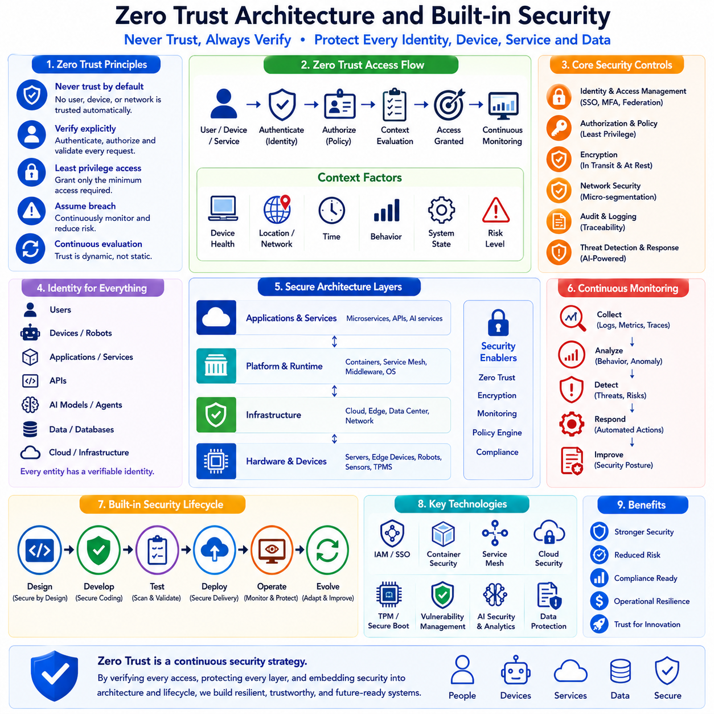{width="7.268055555555556in" height="7.268055555555556in"}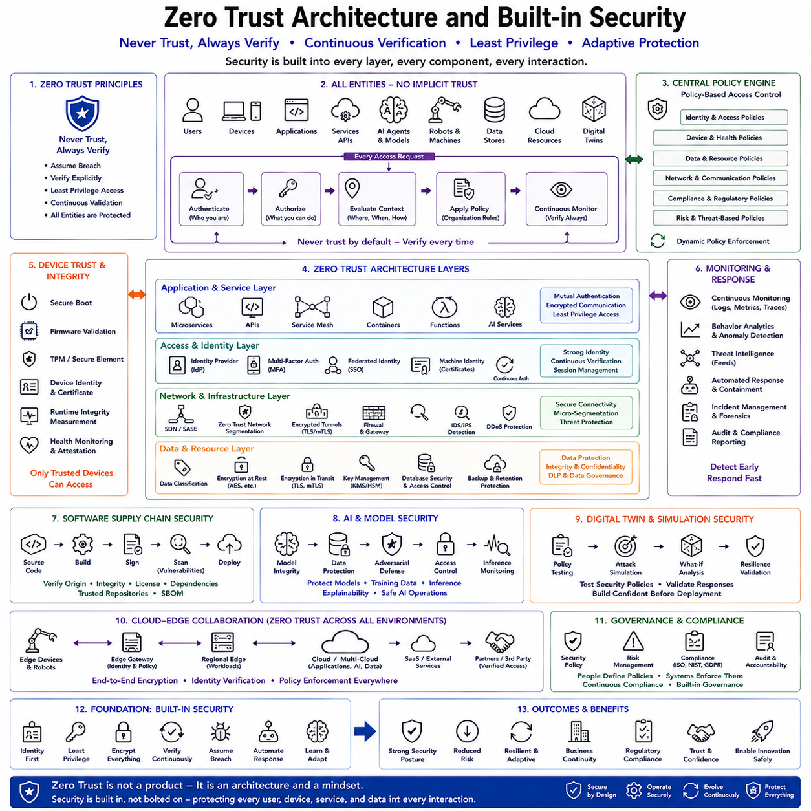{width="7.268055555555556in" height="7.268055555555556in"}

The uploaded engineering library introduces **"23_12.07 Zero Trust Architecture and Built-in Security"** as one of the most critical architectural foundations for future Software-Defined Systems, Physical AI, cloud-native platforms, and intelligent cyber-physical ecosystems. As software systems become increasingly distributed, autonomous, AI-driven, and interconnected, traditional perimeter-based security models become insufficient. Modern software no longer operates within isolated corporate networks protected by well-defined boundaries. Instead, applications execute across cloud environments, edge devices, embedded controllers, autonomous robots, digital twins, mobile platforms, industrial networks, and multi-cloud infrastructures while continuously exchanging information among heterogeneous systems. Under these conditions, software architecture can no longer assume that internal networks, authenticated devices, or trusted users remain inherently safe. Zero Trust Architecture fundamentally redefines software security by adopting the principle that no user, device, service, application, network segment, or computational resource should be trusted automatically, regardless of its physical location or previous authentication history. Trust becomes dynamic, continuously evaluated, and explicitly verified throughout every interaction.

Historically, enterprise security architectures were designed around the concept of a trusted internal network protected by firewalls and gateway defenses. Once users or devices successfully entered the organizational network, they frequently received broad access privileges under the assumption that internal communication represented relatively low security risk. This perimeter-based approach proved practical when software primarily operated within centralized data centers accessed through controlled organizational infrastructure. However, cloud computing, mobile devices, Internet of Things platforms, autonomous robotics, remote work environments, distributed AI services, and interconnected industrial automation have effectively dissolved traditional network boundaries. Modern attackers increasingly exploit compromised internal accounts, stolen credentials, software supply chains, trusted communication channels, and lateral movement across distributed systems, rendering perimeter security insufficient for protecting modern software ecosystems.

Zero Trust Architecture responds to these changes by replacing implicit trust with continuous verification. Every access request, regardless of origin, requires authentication, authorization, contextual evaluation, policy validation, and continuous monitoring before software resources become accessible. Identity rather than network location becomes the primary basis for security decisions. Every interaction therefore represents an independent security event evaluated according to current operational conditions instead of historical assumptions regarding trusted environments.

Identity becomes the central architectural element supporting Zero Trust systems. Users, services, software components, AI agents, robots, cloud applications, embedded devices, databases, APIs, digital twins, and infrastructure services all require verifiable digital identities. These identities extend beyond simple usernames or passwords toward cryptographic certificates, hardware security modules, trusted platform modules, secure enclaves, biometric verification, federated identity management, and machine identities supporting autonomous system interaction. Future software architecture therefore increasingly emphasizes identity-centric communication across every architectural layer.

Authentication correspondingly evolves into continuous rather than one-time verification. Conventional systems frequently authenticate users during login before assuming continued trust throughout extended operational sessions. Zero Trust Architecture instead continuously evaluates authentication validity according to device integrity, behavioral consistency, geographical context, communication patterns, operational risk, credential freshness, and ongoing security observations. Authentication therefore becomes an ongoing architectural capability integrated directly into runtime software behavior rather than an isolated entry procedure.

Authorization similarly becomes increasingly granular. Traditional role-based access control frequently grants broad permissions according to organizational position. Zero Trust systems instead implement least-privilege access where every user, service, process, AI agent, robotic platform, or software component receives only the minimum permissions necessary for immediate operational objectives. Authorization decisions continuously adapt according to contextual information, operational requirements, security posture, and organizational policy rather than static role assignments established during system deployment.

Policy-driven architecture forms another essential component of Zero Trust systems. Security decisions should not remain scattered throughout application source code as isolated implementation details. Instead, centralized policy engines evaluate access requests according to organizational rules describing identity, resource sensitivity, operational context, compliance requirements, environmental conditions, behavioral observations, risk assessments, and business objectives. Software architecture therefore separates security policy from application logic, enabling organizations to modify security behavior without redesigning operational software.

Context awareness substantially improves authorization quality. Identity alone rarely provides sufficient information for trustworthy security decisions. Zero Trust Architecture therefore incorporates environmental context including device health, operating system integrity, software version, geographic location, communication network, time of access, historical behavior, mission criticality, operational urgency, AI confidence, cybersecurity intelligence, and organizational risk levels. Security therefore becomes adaptive rather than static, responding intelligently to continuously changing operational conditions.

Device trust assumes particular importance within Software-Defined Systems and Physical AI. Autonomous robots, embedded controllers, industrial gateways, AI accelerators, edge computers, sensors, communication modules, and cloud services all participate within distributed software ecosystems. Each device continuously demonstrates operational integrity through secure boot mechanisms, cryptographic identity verification, firmware validation, runtime integrity measurement, trusted hardware modules, software attestation, configuration validation, and continuous health monitoring before participating in organizational workflows.

Secure Boot provides one foundational mechanism supporting trustworthy devices. During system startup, hardware verifies firmware authenticity before firmware validates operating system integrity, operating systems authenticate middleware components, and application software confirms AI models, configuration files, software libraries, and operational dependencies. Every execution stage therefore validates the next stage before permitting continued system initialization, establishing cryptographic chains of trust extending from hardware through complete software stacks.

Software supply chain security becomes increasingly significant because organizations rarely develop every software component internally. Modern applications integrate operating systems, open-source libraries, cloud frameworks, AI models, container images, middleware services, third-party APIs, development tools, and external dependencies originating from numerous suppliers. Zero Trust Architecture therefore extends verification beyond runtime operation toward continuous validation of software provenance, dependency integrity, digital signatures, vulnerability assessment, license compliance, reproducible builds, and trusted package repositories throughout development lifecycles.

Containerization naturally complements Zero Trust principles by isolating software services within independently controlled execution environments. Individual microservices operate inside containers possessing limited permissions, restricted communication capabilities, isolated file systems, and controlled resource access. Container orchestration platforms further enforce identity-based communication, encrypted service interaction, runtime policy enforcement, vulnerability monitoring, and automated compliance verification across distributed application ecosystems.

Microservice architecture significantly benefits from Zero Trust communication because every service interaction becomes authenticated and authorized independently. Rather than assuming internal service trust, APIs verify caller identity, validate access permissions, encrypt communication channels, inspect request integrity, evaluate behavioral anomalies, and record comprehensive audit information before processing requests. Internal communication therefore receives identical security attention traditionally reserved for external network access.

Service Mesh technologies increasingly support Zero Trust implementation by providing secure communication infrastructure independent of application logic. Mutual authentication, encrypted communication, traffic authorization, identity management, policy enforcement, telemetry collection, failure isolation, and runtime observability become transparent infrastructure capabilities rather than responsibilities distributed throughout individual software services. Architectural separation between business functionality and communication security significantly improves maintainability while reducing implementation complexity.

Encryption extends beyond protecting external communication channels. Data requires protection while stored, transmitted, processed, replicated, cached, and archived throughout complete software lifecycles. Future software architecture therefore integrates encryption across databases, distributed storage, cloud infrastructure, communication middleware, robotic telemetry, AI models, digital twins, backup repositories, and configuration management systems. Cryptographic agility further enables gradual migration toward future security algorithms including post-quantum cryptography as computational threats evolve.

Artificial intelligence introduces both opportunities and challenges within Zero Trust Architecture. AI systems themselves require protection because model theft, adversarial manipulation, prompt injection, unauthorized inference, training data poisoning, and model inversion attacks increasingly threaten intelligent software ecosystems. Simultaneously, AI substantially enhances cybersecurity through anomaly detection, behavioral analysis, adaptive policy recommendation, threat prediction, incident investigation, and automated response coordination. Future software architecture therefore integrates AI as both protected asset and intelligent security participant.

Behavioral analytics significantly strengthen Zero Trust decision making. Rather than relying exclusively upon identity credentials, software continuously analyzes operational behavior including communication frequency, application usage, navigation patterns, robotic motion characteristics, command sequences, AI inference behavior, network traffic, resource utilization, and interaction timing. Unexpected deviations from established behavioral baselines increase operational risk assessments, potentially triggering additional authentication, privilege reduction, or automated security intervention.

Continuous monitoring therefore becomes indispensable. Security no longer depends solely upon preventing unauthorized entry but instead emphasizes detecting suspicious behavior throughout ongoing software operation. Observability infrastructure collects logs, metrics, distributed traces, security events, AI operational statistics, hardware diagnostics, communication telemetry, runtime integrity measurements, and user interaction records supporting comprehensive situational awareness across distributed software ecosystems.

Autonomous incident response naturally complements continuous monitoring. When security observations indicate elevated operational risk, software architecture increasingly performs automated containment actions including communication isolation, credential revocation, workload migration, service suspension, robotic operational restrictions, policy tightening, forensic data preservation, and administrator notification. Response therefore evolves from reactive human intervention toward intelligent architectural resilience minimizing operational disruption while preserving organizational security.

Digital Twin technology provides valuable support for Zero Trust Architecture by enabling comprehensive cybersecurity experimentation within virtual environments. Security policies, authentication strategies, communication architectures, attack simulations, recovery procedures, AI defense mechanisms, software updates, and infrastructure changes undergo evaluation within digital twins before production deployment. Consequently, organizations improve security while minimizing operational risk associated with architectural modification.

Cloud-edge collaboration introduces additional Zero Trust considerations because software increasingly spans geographically distributed infrastructure. Edge devices operate within physically exposed environments while cloud platforms provide centralized intelligence, AI services, fleet management, and organizational knowledge. Every communication pathway therefore requires mutual authentication, encrypted transport, policy validation, identity verification, workload isolation, and continuous monitoring regardless of deployment location. Trust depends upon verified identity and operational integrity rather than physical proximity.

Autonomous robotics further amplifies Zero Trust requirements because physical actions directly influence real-world environments. Robots executing navigation, manipulation, inspection, transportation, healthcare assistance, infrastructure maintenance, or industrial automation must authenticate commands, verify mission authorization, validate software integrity, protect sensor information, secure communication channels, and continuously confirm safe operational status before executing physical behavior. Cybersecurity therefore becomes inseparable from functional safety within Physical AI architectures.

Zero Trust principles naturally integrate with Self-Adaptive Architecture. Previous architectural discussions described software capable of dynamically adjusting computational behavior according to environmental conditions. Security policies similarly adapt according to evolving threat intelligence, operational context, user behavior, communication quality, AI confidence, infrastructure integrity, regulatory requirements, and organizational objectives. Adaptive cybersecurity therefore becomes a continuously evolving architectural capability rather than static configuration established during deployment.

Large Action Models and AI Agent Based Software Composition introduce additional architectural security responsibilities. Autonomous AI systems capable of generating software, orchestrating services, controlling robots, or modifying operational workflows require strict identity management, authorization boundaries, policy validation, explainable reasoning, action verification, governance supervision, and comprehensive auditability. Every AI-generated action must satisfy deterministic security policies before influencing operational software or physical environments.

Governance remains fundamentally important despite increasing automation. Organizational leadership defines security objectives, compliance requirements, ethical principles, regulatory obligations, acceptable risk thresholds, identity policies, audit procedures, incident response strategies, and architectural standards. Intelligent software enforces these policies consistently while continuously adapting operational implementation according to changing environmental conditions. Human governance therefore establishes strategic security direction while autonomous systems execute tactical security operations.

Compliance management increasingly becomes integrated into architectural infrastructure rather than separate administrative activities. Financial regulations, healthcare privacy requirements, industrial safety standards, cybersecurity frameworks, government security controls, and organizational policies become machine-readable governance artifacts continuously evaluated during software execution. Compliance therefore transitions from periodic manual auditing toward continuous architectural verification embedded directly within operational systems.

Observability and auditability collectively ensure organizational accountability. Every authentication decision, authorization evaluation, policy modification, software deployment, AI action, robotic operation, configuration change, communication session, security incident, and administrative intervention generates immutable audit records supporting regulatory compliance, forensic investigation, operational transparency, and continuous organizational learning. Security architecture therefore emphasizes not only protection but also explainability and traceability.

Future Software-Defined Systems increasingly integrate Zero Trust principles directly into architectural foundations rather than implementing cybersecurity as supplementary functionality. Hardware abstraction layers, operating systems, middleware platforms, cloud infrastructure, AI frameworks, robotic software, communication protocols, digital twins, CI/CD pipelines, and autonomous orchestration services collectively participate within unified security ecosystems where trust remains continuously earned through verified identity, contextual authorization, behavioral consistency, cryptographic integrity, and adaptive policy enforcement.

Ultimately, Zero Trust Architecture and Built-in Security represent a profound architectural transformation from perimeter-oriented protection toward continuously verified intelligent software ecosystems. Security becomes an intrinsic architectural characteristic integrated throughout software design, implementation, deployment, operation, adaptation, maintenance, AI orchestration, robotic control, cloud-edge collaboration, and lifelong software evolution. By combining identity-centric architecture, continuous authentication, least-privilege authorization, contextual policy enforcement, secure software supply chains, encrypted communication, AI-assisted cybersecurity, adaptive security policies, digital twins, autonomous incident response, compliance automation, and human governance, Zero Trust Architecture establishes the security foundation for future Software-Defined Systems, Physical AI, autonomous robotics, intelligent enterprises, and globally interconnected cyber-physical ecosystems operating safely within increasingly complex and continuously evolving digital environments.

## 12.08 Sustainable Green Software Architecture

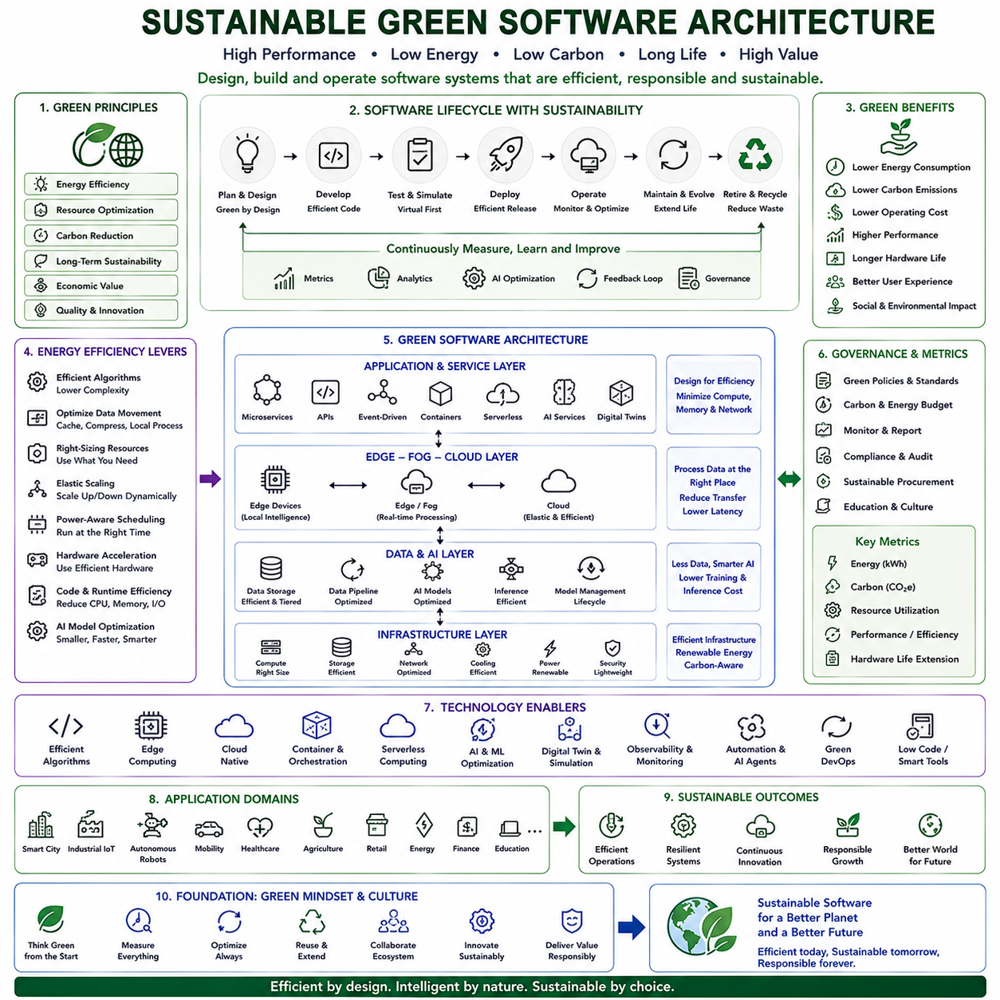{width="7.268055555555556in" height="7.268055555555556in"}

The uploaded engineering library introduces **"23_12.08 Sustainable Green Software Architecture"** as one of the defining architectural directions for future software systems in an era where environmental sustainability, energy efficiency, and responsible computing become as important as functionality, performance, and reliability. During the early decades of software engineering, architects primarily optimized systems for correctness, maintainability, scalability, availability, and operational efficiency. As cloud computing, artificial intelligence, hyperscale data centers, autonomous robotics, edge computing, and billions of connected devices continue expanding, software itself increasingly influences global energy consumption and carbon emissions. Consequently, software architecture is no longer evaluated solely by technical excellence but also by its environmental impact throughout the entire system lifecycle. Sustainable Green Software Architecture therefore represents a comprehensive engineering philosophy that integrates environmental responsibility directly into software design, implementation, deployment, operation, maintenance, and continuous evolution.

Historically, software engineering often assumed computational resources to be effectively unlimited. Improvements in processor performance, memory capacity, cloud elasticity, and distributed infrastructure encouraged developers to prioritize development speed and feature expansion over computational efficiency. Although hardware continuously became more powerful, energy consumption likewise increased as applications demanded larger AI models, more complex analytics, continuous cloud synchronization, and always-on digital services. Modern hyperscale cloud infrastructures consume enormous electrical power while artificial intelligence training alone may require thousands of high-performance processors operating continuously for extended periods. Future software architecture must therefore recognize energy as a primary architectural resource comparable to computation, storage, communication bandwidth, and financial cost.

Green software architecture does not imply sacrificing functionality or innovation in pursuit of environmental objectives. Instead, it seeks intelligent optimization that simultaneously improves software quality, operational efficiency, economic sustainability, and environmental responsibility. Well-designed software frequently consumes fewer computational resources, reduces operational costs, improves response times, extends hardware lifetime, enhances battery endurance, minimizes unnecessary communication, and lowers carbon emissions simultaneously. Sustainability therefore becomes aligned with engineering excellence rather than competing against technical performance.

Energy-aware architecture represents one of the foundational principles of sustainable software engineering. Every software component consumes computational resources including processor cycles, memory operations, storage access, communication bandwidth, graphics processing, AI inference, and network transmission. Although individual software operations appear insignificant, cumulative energy consumption across billions of devices becomes globally significant. Software architects therefore increasingly evaluate architectural alternatives according to computational efficiency, communication frequency, resource utilization, and overall energy impact throughout operational lifecycles.

Software efficiency begins with algorithm selection. Different algorithms solving identical computational problems may exhibit dramatically different execution characteristics. Time complexity, memory complexity, communication overhead, storage efficiency, cache utilization, numerical precision, concurrency behavior, and hardware acceleration collectively determine computational energy consumption. Consequently, architectural decisions regarding algorithm design influence environmental sustainability long before software reaches production deployment.

Data movement frequently consumes more energy than computation itself. Modern distributed software transfers information among cloud services, databases, AI accelerators, storage systems, mobile devices, robots, sensors, digital twins, and enterprise applications continuously. Every network transmission requires communication infrastructure, encryption, routing, storage synchronization, protocol processing, and endpoint computation. Sustainable architecture therefore minimizes unnecessary data movement through intelligent caching, edge computing, local processing, efficient synchronization, compression techniques, event-driven communication, and optimized data lifecycle management.

Cloud computing introduces both opportunities and responsibilities regarding environmental sustainability. Large cloud providers increasingly invest in renewable energy, advanced cooling systems, energy-efficient hardware, carbon-aware workload scheduling, and highly optimized infrastructure. Nevertheless, poorly designed cloud applications may waste substantial computational resources through excessive service replication, inefficient scaling policies, redundant communication, idle virtual machines, oversized containers, unnecessary storage, and excessive AI inference. Green software architecture therefore emphasizes efficient cloud utilization rather than assuming unlimited computational availability.

Elastic scalability naturally supports sustainable operation when implemented intelligently. Cloud-native software dynamically allocates computational resources according to actual workload rather than maintaining maximum infrastructure continuously. Automatic scaling, serverless computing, container orchestration, workload consolidation, intelligent scheduling, and resource pooling collectively reduce idle capacity while preserving service quality. Architectural elasticity therefore contributes simultaneously to operational efficiency and environmental sustainability.

Edge computing significantly complements sustainable software architecture by reducing unnecessary cloud communication. Processing sensor information, robotic perception, industrial analytics, healthcare monitoring, or autonomous vehicle intelligence locally often eliminates continuous transmission of large datasets toward centralized cloud infrastructure. Edge intelligence therefore decreases communication energy consumption while simultaneously improving latency, privacy, operational resilience, and real-time responsiveness. Hybrid cloud-edge architectures increasingly balance computational efficiency against communication cost according to workload characteristics.

Artificial intelligence presents unique sustainability challenges because modern AI models frequently require extraordinary computational resources during training and increasingly substantial resources during inference. Future software architecture therefore distinguishes carefully between centralized model training, distributed model optimization, compressed inference models, quantized neural networks, knowledge distillation, adaptive inference, and hardware-aware AI deployment. Sustainable AI architecture seeks equivalent intelligence using fewer computational resources without unnecessarily sacrificing model quality.

Model optimization becomes particularly valuable within Physical AI and autonomous robotics. Edge robots frequently operate from battery-powered energy systems where computational efficiency directly influences operational endurance. Smaller optimized neural networks, intelligent model selection, dynamic precision adjustment, event-driven inference, hardware acceleration, and multimodal sensor fusion collectively reduce computational energy while maintaining operational capability. Sustainable AI therefore becomes essential not only for environmental responsibility but also for practical autonomous system operation.

Battery-powered systems particularly illustrate the relationship between software architecture and sustainability. Autonomous mobile robots, drones, wearable devices, medical equipment, environmental sensors, agricultural platforms, and industrial inspection systems all operate under constrained energy budgets. Every unnecessary computation reduces operational duration. Sustainable architecture therefore optimizes scheduling, communication frequency, sensor activation, perception pipelines, navigation algorithms, idle behavior, computational precision, and workload allocation according to available energy resources.

Power-aware scheduling emerges as an increasingly important architectural capability. Rather than executing computationally intensive tasks immediately, software may intelligently postpone non-critical processing until renewable energy availability increases, communication costs decrease, charging opportunities become available, or workload consolidation improves computational efficiency. Future operating systems and orchestration platforms increasingly incorporate energy awareness alongside traditional performance optimization.

Carbon-aware computing extends sustainability beyond direct energy consumption. Electrical power generated from renewable energy sources produces substantially lower carbon emissions than fossil fuel generation. Future cloud platforms increasingly expose regional carbon intensity information allowing software orchestration systems to schedule computational workloads according to environmental impact. Non-time-critical processing may therefore execute when renewable energy availability reaches maximum levels, reducing overall carbon emissions without affecting operational functionality.

Lifecycle thinking distinguishes sustainable architecture from isolated optimization efforts. Environmental impact extends beyond operational execution into software development, testing, deployment, maintenance, hardware replacement, infrastructure utilization, and long-term system evolution. Well-designed software frequently remains operational longer, reduces unnecessary hardware upgrades, minimizes maintenance effort, improves software reuse, decreases infrastructure replacement frequency, and supports circular technology ecosystems emphasizing longevity rather than continuous replacement.

Software modularity contributes directly to sustainability because reusable components reduce duplicated engineering effort while extending software longevity. Modular architectures permit selective enhancement of individual capabilities without replacing entire systems. Hardware abstraction layers, standardized interfaces, service-oriented communication, containerized deployment, plugin architectures, and cross-platform portability collectively increase software lifetime while reducing environmental impact associated with complete redevelopment.

Cross-platform architecture similarly supports sustainability by enabling identical software capabilities across multiple hardware generations. Applications capable of operating efficiently upon embedded controllers, industrial computers, cloud infrastructure, edge platforms, and future heterogeneous processors reduce dependence upon hardware replacement. Software longevity therefore delays electronic waste while maximizing value extracted from existing computational infrastructure.

Maintainability becomes an environmental objective in addition to an engineering objective. Poorly maintained software frequently requires expensive redevelopment, unnecessary hardware upgrades, excessive cloud resources, or complete system replacement. Sustainable architecture therefore emphasizes readability, documentation, modularity, automated testing, continuous integration, architectural consistency, dependency management, and long-term software evolution preserving operational usefulness throughout extended service lifecycles.

Digital Twin technology contributes significantly to sustainability by reducing expensive physical experimentation. Product design, manufacturing optimization, robotic development, infrastructure planning, energy analysis, maintenance prediction, operational optimization, and failure investigation increasingly occur within virtual environments before physical implementation. Digital twins therefore minimize material waste, reduce engineering iterations, optimize energy consumption, and improve overall system efficiency throughout product lifecycles.

Simulation further enhances sustainable engineering by enabling extensive optimization before deployment. Software architects evaluate communication architectures, computational allocation, AI inference strategies, battery consumption, workload scheduling, cooling requirements, and infrastructure scalability under numerous operational scenarios without constructing physical prototypes. Continuous simulation therefore improves both engineering quality and environmental sustainability simultaneously.

Observability provides essential visibility into software sustainability. Performance metrics traditionally emphasize latency, throughput, availability, and resource utilization. Sustainable architecture expands monitoring toward computational energy consumption, processor efficiency, memory utilization, communication overhead, storage growth, battery discharge characteristics, cloud infrastructure efficiency, cooling requirements, and estimated carbon emissions. Continuous measurement enables informed architectural optimization rather than speculative environmental improvement.

Artificial intelligence itself increasingly assists sustainable software engineering. AI analyzes infrastructure utilization, predicts resource demand, optimizes cloud allocation, recommends architectural improvements, identifies inefficient software components, balances computational workloads, predicts battery consumption, schedules maintenance activities, and continuously improves overall energy efficiency through operational learning. Intelligent optimization therefore becomes a central capability supporting environmentally responsible software ecosystems.

Large Language Models and AI Agent Based Software Composition also influence software sustainability. Autonomous engineering agents increasingly generate optimized source code, eliminate redundant computation, recommend efficient architectural patterns, simplify workflows, identify obsolete dependencies, improve deployment efficiency, optimize communication protocols, and continuously refactor software toward improved computational efficiency. AI therefore becomes an active participant in environmental software optimization throughout software lifecycles.

Green DevOps extends sustainability into software delivery pipelines. Continuous Integration and Continuous Deployment traditionally emphasize automation, quality, and deployment frequency. Sustainable DevOps additionally minimizes redundant builds, optimizes testing strategies, reduces unnecessary virtual infrastructure, consolidates computational workloads, schedules energy-intensive activities intelligently, reuses build artifacts, and continuously evaluates infrastructure efficiency. Development processes therefore become environmentally optimized alongside operational software.

Containerization contributes positively when managed responsibly. Lightweight containers generally consume fewer resources than traditional virtual machines while improving workload consolidation and infrastructure utilization. However, excessive container replication, unnecessary orchestration complexity, oversized container images, and inefficient scaling policies may offset these advantages. Sustainable architecture therefore evaluates container deployment according to actual workload characteristics rather than technological preference alone.

Microservice architecture likewise requires balanced engineering judgment. Modular services improve maintainability, scalability, and organizational flexibility, yet excessive service decomposition increases communication overhead, network utilization, serialization costs, monitoring complexity, and infrastructure resource consumption. Sustainable software architecture therefore seeks architectural granularity appropriate for operational objectives rather than maximizing service fragmentation.

Physical AI introduces unique sustainability opportunities because intelligent systems increasingly interact directly with physical infrastructure. Autonomous robots optimize warehouse logistics, reduce transportation inefficiency, monitor environmental conditions, improve agricultural productivity, perform predictive maintenance, reduce industrial waste, inspect renewable energy infrastructure, optimize building energy consumption, and support precision resource management. Software architecture therefore contributes indirectly to environmental sustainability through intelligent automation extending beyond computational efficiency alone.

Cybersecurity and sustainability should not be considered competing priorities. Efficient cryptographic algorithms, optimized authentication workflows, intelligent security monitoring, adaptive policy enforcement, secure edge processing, and risk-aware communication collectively protect organizational assets while minimizing unnecessary computational overhead. Security architecture therefore benefits from efficiency optimization rather than excessive defensive redundancy.

Human-centered design also supports sustainability because intuitive software reduces training requirements, operational errors, unnecessary computation, duplicated workflows, and inefficient human interaction. Explainable AI, accessible interfaces, intelligent automation, adaptive user experiences, and workflow simplification collectively improve productivity while reducing wasted computational and organizational resources.

Economic sustainability naturally aligns with environmental sustainability. Reduced energy consumption lowers operational costs. Efficient cloud utilization minimizes infrastructure expenses. Improved maintainability decreases engineering effort. Extended hardware lifetime delays capital expenditure. Intelligent automation reduces repetitive operational tasks. Consequently, organizations increasingly recognize sustainability as a strategic business advantage rather than merely regulatory compliance or environmental responsibility.

Future software architects therefore evaluate systems according to multiple interconnected dimensions including functional capability, software quality, operational resilience, cybersecurity, maintainability, portability, scalability, explainability, economic efficiency, and environmental sustainability. Green software architecture does not replace traditional engineering objectives but extends them toward broader societal responsibility acknowledging software\'s growing influence upon global energy consumption, resource utilization, and environmental impact.

Ultimately, Sustainable Green Software Architecture represents the maturation of software engineering from purely computational optimization toward holistic systems thinking integrating technical excellence with environmental stewardship. By combining energy-aware algorithms, efficient cloud-edge collaboration, optimized artificial intelligence, modular software design, digital twins, lifecycle engineering, observability, AI-assisted optimization, Green DevOps, cross-platform portability, intelligent resource management, and continuous architectural evolution, sustainable software establishes the engineering foundation for future Software-Defined Systems, Physical AI, autonomous robotics, intelligent enterprises, and globally interconnected cyber-physical ecosystems that achieve technological advancement while simultaneously preserving environmental resources for future generations. Rather than treating sustainability as an external constraint imposed upon software engineering, Green Software Architecture recognizes environmental responsibility as an intrinsic characteristic of high-quality software systems designed for the long-term benefit of technology, society, and the planet.

## 12.09 Robot-AI Convergence: Future Architecture Roadmap

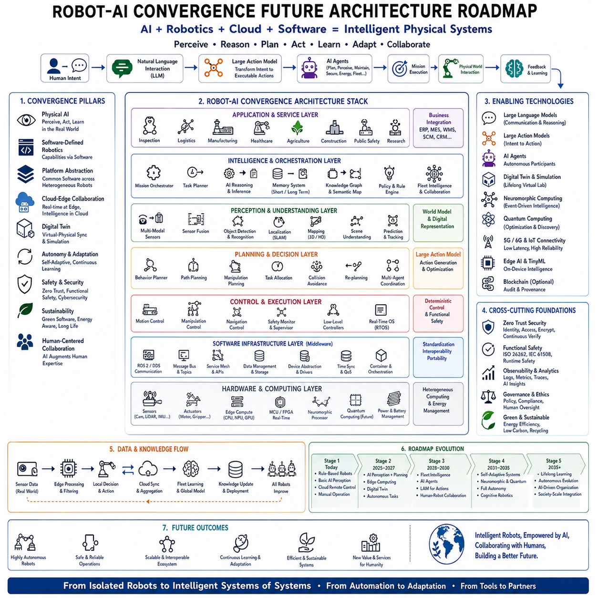{width="7.268055555555556in" height="7.268055555555556in"}

The uploaded engineering library introduces **"23_12.09 Robot-AI Convergence Future Architecture Roadmap"** as the concluding vision of the Future Software Architecture chapter, integrating all architectural concepts discussed throughout the book into a unified long-term roadmap. Earlier chapters examined software-defined systems, cloud-native computing, cross-platform engineering, AI-native architecture, digital twins, self-adaptive systems, neuromorphic computing, quantum computing, Large Action Models, AI agents, Zero Trust security, and sustainable software engineering as individual technological domains. However, the future will not be defined by any single technology in isolation. Instead, the next generation of intelligent systems will emerge through the convergence of robotics, artificial intelligence, distributed computing, autonomous software, and cyber-physical systems into a single integrated architectural ecosystem. The Robot-AI Convergence Roadmap therefore represents not merely a technological forecast but an architectural framework describing how software engineering, intelligent machines, cloud infrastructure, and human society may evolve together during the coming decades.

For many years, robotics and artificial intelligence developed along largely independent trajectories. Robotics focused primarily on mechanical systems, embedded controllers, motion planning, navigation, sensing, and physical interaction with the environment. Artificial intelligence concentrated on perception, reasoning, prediction, optimization, language understanding, and statistical learning using primarily cloud-based computational resources. Although AI gradually improved robotic perception and decision-making, robots generally remained deterministic machines executing predefined algorithms while AI remained largely confined to digital information processing. Future software architecture fundamentally dissolves this distinction by integrating intelligence directly into every layer of robotic systems while simultaneously embedding physical interaction into AI itself.

Physical AI represents the first major milestone within this convergence. Unlike conventional AI systems operating exclusively on digital information, Physical AI continuously interacts with dynamic real-world environments through sensors, actuators, communication systems, and autonomous decision making. Perception no longer terminates with object recognition but extends toward understanding environmental meaning, predicting future events, planning intelligent actions, executing physical behaviors, evaluating outcomes, and continuously adapting through operational experience. Consequently, software architecture evolves beyond computational reasoning toward complete perception-action-learning cycles operating continuously within physical environments.

Software-Defined Robotics naturally emerges from this transformation. Historically, robotic functionality depended heavily upon hardware specialization. Mechanical structures, embedded electronics, sensor configurations, and proprietary control software frequently determined platform capability. Future robots instead become software-defined platforms whose functionality evolves primarily through software updates rather than hardware replacement. Navigation capabilities, manipulation skills, inspection algorithms, collaborative behaviors, communication protocols, safety policies, AI reasoning, and operational workflows increasingly become software assets deployable across multiple robotic platforms regardless of underlying hardware implementation.

Platform abstraction therefore becomes an essential architectural principle supporting convergence. Autonomous mobile robots, manipulators, quadrupeds, humanoids, drones, industrial vehicles, service robots, and future intelligent machines should increasingly share common software foundations despite substantial physical differences. Hardware abstraction layers, standardized middleware, modular AI services, reusable behavioral skills, cross-platform software libraries, containerized deployment, and service-oriented communication collectively enable architectural portability across heterogeneous robotic ecosystems.

Artificial intelligence likewise evolves toward platform-independent intelligence. Rather than constructing separate AI systems for every robotic platform, future architectures increasingly separate domain knowledge, reasoning capability, planning intelligence, perception models, memory structures, communication interfaces, and behavioral policies from individual hardware implementations. AI therefore becomes reusable organizational knowledge deployable across numerous robotic embodiments according to operational requirements.

Layered software architecture continues serving as the structural foundation supporting convergence. Hardware abstraction isolates physical devices from higher software layers. Real-time operating systems manage deterministic control. Middleware coordinates communication among distributed services. Perception frameworks interpret multimodal sensor information. Localization, mapping, and navigation provide environmental awareness. Planning systems generate operational strategies. Artificial intelligence supplies reasoning, learning, adaptation, and prediction. Mission orchestration coordinates organizational objectives. Human interaction services provide natural communication. Cloud platforms support collaborative intelligence and organizational knowledge. This layered organization preserves engineering modularity while enabling continuous technological evolution.

Cloud-edge collaboration becomes one of the defining characteristics of Robot-AI convergence. Individual robots possess increasingly powerful edge computing platforms capable of executing real-time perception, motion planning, local reasoning, safety supervision, and immediate decision making. Cloud infrastructure complements these capabilities by providing large-scale model training, fleet coordination, digital twin synchronization, organizational knowledge management, software deployment, predictive maintenance, collaborative learning, and strategic optimization. Architectural responsibility therefore distributes dynamically across cloud and edge resources according to latency, bandwidth, privacy, computational complexity, and operational priorities.

Fleet intelligence extends autonomous capability beyond individual robotic platforms. Earlier generations of robots frequently operated independently with minimal collaboration. Future Robot-AI architectures instead coordinate thousands of heterogeneous autonomous systems through shared world models, collaborative planning, distributed knowledge, organizational memory, resource optimization, and mission orchestration. Individual robots contribute operational experience toward collective intelligence while organizational learning continuously improves future system performance.

Digital Twin technology becomes indispensable within converged architectures because every physical robot increasingly possesses corresponding virtual representations synchronized continuously throughout operational lifecycles. Digital twins maintain structural models, operational history, maintenance records, environmental context, AI behavior, sensor calibration, communication quality, energy consumption, and predictive diagnostics. Consequently, software architecture seamlessly integrates virtual and physical systems supporting continuous optimization, simulation, verification, and organizational learning.

Simulation evolves from engineering verification toward lifelong operational education. Autonomous robots continuously encounter new environments, unforeseen situations, changing regulations, evolving customer requirements, and emerging operational challenges. Digital simulation therefore becomes an ongoing learning environment where AI models, behavioral policies, collaborative strategies, and architectural improvements undergo extensive experimentation before deployment into physical systems. Continuous simulation dramatically reduces operational risk while accelerating organizational innovation.

Large Language Models introduce natural communication capabilities throughout robotic ecosystems. Human operators increasingly interact with autonomous systems through conversational interfaces rather than specialized programming languages or complex graphical interfaces. Robots interpret high-level objectives, request clarification when necessary, explain operational reasoning, summarize mission outcomes, document maintenance activities, generate engineering reports, and collaborate naturally with multidisciplinary teams. Language therefore becomes an architectural interface connecting human strategic intent with autonomous robotic execution.

Large Action Models extend conversational intelligence toward physical autonomy. Language understanding alone cannot accomplish real-world objectives. Large Action Models transform human intent into executable behavioral sequences encompassing navigation, manipulation, inspection, communication, collaboration, recovery procedures, maintenance activities, and mission completion. Software architecture therefore increasingly integrates language reasoning with physical action generation through unified intelligent planning frameworks.

AI Agent architectures further expand convergence by introducing specialized autonomous engineering participants operating throughout robotic ecosystems. Planning agents coordinate missions. Perception agents analyze sensor information. Maintenance agents monitor hardware health. Cybersecurity agents evaluate operational threats. Energy agents optimize battery utilization. Fleet management agents allocate resources. Documentation agents maintain engineering knowledge. Human collaboration agents facilitate communication. These specialized AI participants collectively transform robotic systems into cooperative intelligent organizations rather than isolated autonomous machines.

Memory architecture assumes unprecedented importance because future robots accumulate operational knowledge continuously throughout extended service lifetimes. Working memory maintains active mission context. Semantic memory preserves engineering knowledge, operational procedures, regulatory information, and organizational expertise. Episodic memory records completed missions, encountered environments, observed failures, and successful recovery strategies. Procedural memory stores reusable behavioral skills supporting future task execution. Organizational memory aggregates experience from entire robotic fleets, enabling continuous collective intelligence unavailable to isolated autonomous systems.

Self-adaptive architecture fundamentally changes robotic software behavior. Traditional robots execute predefined algorithms until human engineers update software manually. Future Robot-AI systems continuously observe operational performance before adapting planning strategies, perception models, communication policies, AI model selection, computational allocation, energy management, collaborative workflows, and mission priorities according to changing environmental conditions. Adaptation therefore becomes continuous rather than episodic, allowing intelligent systems to evolve throughout operational lifecycles.

Heterogeneous computing provides the computational infrastructure supporting converged intelligence. Conventional CPUs continue executing deterministic software logic and operating systems. GPUs accelerate deep learning and perception. NPUs optimize edge inference. Real-time controllers manage motion control. Neuromorphic processors contribute event-driven sensing and adaptive learning. Quantum computing may eventually accelerate optimization and scientific reasoning. Software architecture orchestrates these diverse computational resources according to workload characteristics while hiding implementation complexity behind common abstraction layers.

Energy awareness likewise becomes fundamental because future robotic ecosystems operate across battery-powered mobile platforms, industrial infrastructure, renewable energy systems, cloud data centers, and distributed edge networks. Sustainable software architecture optimizes computation, communication, AI inference, sensor activation, workload scheduling, charging strategies, and cloud utilization according to both operational efficiency and environmental responsibility. Robot-AI convergence therefore integrates sustainability directly into architectural decision making rather than treating environmental concerns as external constraints.

Cybersecurity evolves from protecting isolated devices toward securing intelligent autonomous ecosystems. Zero Trust Architecture establishes continuous identity verification among robots, AI agents, cloud services, digital twins, enterprise platforms, and communication infrastructure. Every interaction undergoes authentication, authorization, behavioral analysis, policy validation, encryption, and continuous monitoring regardless of deployment location. Security therefore becomes an intrinsic architectural characteristic integrated across complete robotic software ecosystems.

Functional safety similarly expands beyond deterministic controller validation. Autonomous systems increasingly rely upon statistical AI models, adaptive planning, collaborative behavior, and self-modifying software components. Future safety architecture therefore combines deterministic control verification with explainable AI, runtime monitoring, behavioral validation, independent safety supervisors, digital twin simulation, formal verification, and continuous operational auditing. Safety becomes dynamic while preserving rigorous engineering assurance.

Observability provides comprehensive visibility throughout converged robotic ecosystems. Software continuously collects telemetry regarding hardware health, AI inference quality, navigation accuracy, communication performance, cybersecurity status, battery utilization, environmental interaction, mission progress, human collaboration, and organizational efficiency. Analytical intelligence transforms these observations into predictive maintenance recommendations, architectural improvements, operational optimization, and strategic planning guidance supporting continuous organizational evolution.

Enterprise integration represents another defining characteristic of future Robot-AI convergence. Autonomous systems increasingly interact seamlessly with Enterprise Resource Planning systems, Manufacturing Execution Systems, Warehouse Management Systems, Digital Twins, Supply Chain Management platforms, Customer Relationship Management services, predictive analytics, financial systems, quality management, and regulatory compliance infrastructure. Robotic software therefore becomes an integrated organizational capability rather than isolated automation technology.

Standardization becomes increasingly essential as robotic ecosystems expand globally. Common communication protocols, middleware interfaces, AI model formats, behavioral skill definitions, safety frameworks, digital twin standards, cloud APIs, cybersecurity policies, lifecycle management procedures, and software deployment mechanisms collectively enable interoperability across hardware manufacturers, software vendors, research institutions, industrial organizations, and governmental infrastructure. Architectural openness therefore accelerates innovation while preventing technological fragmentation.

Software engineering itself undergoes profound transformation throughout this convergence. Human architects increasingly define strategic objectives, ethical principles, governance policies, organizational knowledge, safety requirements, sustainability goals, and system vision. AI agents generate software implementations, compose services, optimize architectures, validate behavior, maintain documentation, deploy updates, monitor operations, and recommend continuous improvements. Software engineering therefore becomes collaborative intelligence combining human creativity with autonomous computational execution.

The roadmap toward Robot-AI convergence is necessarily evolutionary rather than revolutionary. Early stages emphasize intelligent perception, cloud robotics, digital twins, and modular software architectures. Intermediate stages introduce self-adaptive systems, AI agents, Large Action Models, collaborative fleets, heterogeneous computing, and organizational knowledge sharing. Long-term evolution integrates neuromorphic intelligence, quantum optimization, lifelong learning, autonomous software composition, sustainable computing, explainable AI, human-centered collaboration, and globally interconnected intelligent infrastructure. Each architectural generation builds upon previous engineering foundations while gradually increasing system autonomy, adaptability, scalability, and intelligence.

Importantly, human participation remains central throughout future robotic ecosystems. Artificial intelligence augments rather than replaces human expertise. Engineers establish architectural principles, ethical constraints, regulatory compliance, organizational priorities, innovation strategies, and societal objectives. Robots execute physical tasks, AI analyzes complex information, digital twins support experimentation, autonomous software manages operational complexity, and humans provide strategic direction, creativity, accountability, and long-term vision. Successful convergence therefore depends upon effective human-machine collaboration rather than technological substitution.

Ultimately, the Robot-AI Convergence Future Architecture Roadmap represents far more than a forecast of emerging technologies. It defines an integrated engineering philosophy in which robotics, artificial intelligence, software architecture, cloud computing, edge intelligence, digital twins, autonomous software composition, cybersecurity, sustainability, heterogeneous computing, and human collaboration evolve together into unified intelligent ecosystems. Future Software-Defined Systems will no longer consist merely of applications executing upon computers but of continuously learning, self-adaptive, secure, sustainable, collaborative cyber-physical organizations capable of perceiving, reasoning, communicating, acting, learning, and evolving throughout decades of technological advancement. By integrating modular software architecture, AI-native design, reusable intelligence, cloud-edge collaboration, lifelong learning, organizational memory, autonomous engineering, Zero Trust security, Green Software principles, and human-centered governance, the Robot-AI Convergence Roadmap establishes the architectural foundation for the next era of intelligent civilization, where software and robotics become inseparable components of an adaptive, connected, and continuously evolving technological ecosystem.

## 12.10 Hills Robotics Mid/Long-Term SW Architecture Evolution

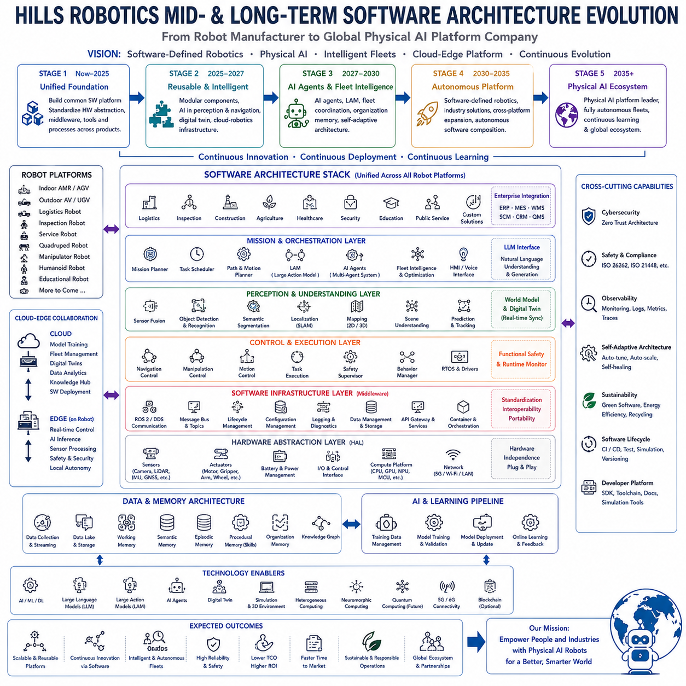{width="7.268055555555556in" height="7.268055555555556in"}

The uploaded engineering library concludes with **"23_12.10 Hills Robotics Mid- and Long-Term Software Architecture Evolution"**, which presents a practical roadmap describing how Hills Robotics can progressively transform from a conventional mobile robot manufacturer into a global Physical AI platform company. Rather than viewing software architecture as a static technical asset supporting individual robot products, this roadmap envisions software as the primary strategic capability that continuously expands across robot platforms, cloud services, autonomous intelligence, enterprise integration, and AI-driven digital ecosystems. The objective is not merely to develop better robots, but to establish a unified Software-Defined Robotics platform capable of supporting multiple industries, multiple robot types, and multiple generations of artificial intelligence over several decades.

The software architecture evolution begins with the recognition that robotics is undergoing the same transformation previously experienced by smartphones and cloud computing. Hardware gradually becomes standardized while software increasingly determines product capability, differentiation, scalability, and commercial value. Mechanical improvements continue to remain important, but software intelligence, reusable architectures, AI integration, cloud connectivity, and continuous software evolution ultimately become the primary competitive advantages. Consequently, Hills Robotics should regard every robot platform as a software platform first and a mechanical platform second.

The first stage of architectural evolution focuses on establishing a unified software foundation across existing robotic products. Rather than developing independent software stacks for each robot model, Hills Robotics should define a common architecture consisting of Hardware Abstraction Layers, standardized middleware, reusable perception modules, navigation services, communication frameworks, diagnostics, configuration management, and software deployment infrastructure. This shared platform enables multiple robot products to evolve together while minimizing duplicated engineering effort.

Hardware abstraction plays a particularly important role during this foundational stage. Different robot platforms---including indoor Autonomous Mobile Robots, outdoor autonomous vehicles, heavy logistics platforms, inspection robots, educational robots, healthcare robots, quadrupeds, manipulators, and future humanoid systems---should expose standardized software interfaces independent of underlying hardware implementations. Sensors, actuators, batteries, motor controllers, cameras, LiDAR systems, GNSS receivers, IMUs, robotic arms, communication devices, and computing platforms become interchangeable beneath stable software abstractions, greatly simplifying future product expansion.

The middleware architecture should similarly become standardized across the organization. ROS 2 provides an excellent communication foundation for distributed robotic systems, while DDS enables scalable, real-time data exchange among autonomous software components. Common communication interfaces, message definitions, lifecycle management, configuration frameworks, logging systems, diagnostics, monitoring, and software packaging should be shared throughout every robotic platform developed by the company. Software engineers therefore contribute improvements benefiting the entire product portfolio rather than isolated projects.

Once a unified software platform has been established, architectural evolution progresses toward modular reusable capabilities. Instead of viewing perception, localization, mapping, navigation, manipulation, inspection, fleet communication, charging management, cybersecurity, diagnostics, and safety as product-specific implementations, Hills Robotics should organize these capabilities into reusable software libraries deployable across every robotic platform. Software components become organizational assets that continuously increase in value through repeated reuse rather than disposable implementations tied to individual projects.

Artificial intelligence gradually becomes integrated throughout every architectural layer. Initially, AI enhances perception through object detection, semantic segmentation, obstacle recognition, human detection, terrain classification, anomaly detection, and predictive maintenance. As computational capability increases, AI progressively expands into localization, path planning, task scheduling, mission orchestration, autonomous inspection, fleet optimization, predictive diagnostics, energy management, and human-robot interaction. AI therefore transitions from isolated perception algorithms toward becoming an architectural capability influencing complete robotic behavior.

The next architectural milestone involves the introduction of Physical AI. Rather than limiting artificial intelligence to recognizing environmental information, robots increasingly understand semantic context, predict future situations, evaluate operational objectives, generate behavioral strategies, execute autonomous actions, observe outcomes, and continuously improve through accumulated experience. Physical AI therefore integrates perception, reasoning, planning, action, feedback, and learning into unified software architectures capable of operating continuously within dynamic real-world environments.

Digital Twin technology becomes a core engineering infrastructure supporting long-term architectural evolution. Every physical robot should possess a continuously synchronized virtual counterpart maintaining structural configuration, operational history, software versions, AI models, maintenance records, environmental maps, sensor calibration, communication quality, battery health, and performance metrics. Digital twins support engineering validation, predictive maintenance, software simulation, AI training, operational optimization, customer support, and organizational learning without disrupting production systems.

Cloud robotics naturally emerges as software capabilities mature. Individual robots continue executing real-time control, safety supervision, sensor processing, and immediate decision making locally through powerful edge computing platforms. Meanwhile, cloud infrastructure manages fleet coordination, digital twin synchronization, AI model training, software deployment, organizational knowledge, predictive maintenance, customer analytics, enterprise integration, and collaborative learning. This cloud-edge architecture allows Hills Robotics to continuously improve deployed robotic fleets through centralized software intelligence while preserving deterministic local autonomy.

Fleet intelligence represents another important phase within software evolution. Early robotic systems frequently operate independently. Future Hills Robotics platforms should instead coordinate hundreds or thousands of autonomous systems through shared environmental understanding, collaborative task allocation, organizational memory, distributed optimization, predictive scheduling, and cloud-based mission orchestration. Individual operational experience contributes continuously toward collective fleet intelligence, allowing every deployed robot to benefit from knowledge acquired throughout the global installed base.

Software architecture subsequently evolves toward Software-Defined Robotics. Hardware platforms become stable, reusable mechanical foundations while software continuously expands functionality through updates. Navigation algorithms improve without replacing sensors. Inspection capabilities evolve through AI model updates. New communication protocols become available through software deployment. Safety policies, cybersecurity mechanisms, diagnostics, manipulation skills, cloud services, and customer applications all evolve independently of hardware replacement. Software therefore becomes the principal mechanism supporting long-term product differentiation.

Cross-platform software architecture significantly strengthens this strategy. Rather than maintaining separate software organizations for indoor robots, outdoor robots, logistics vehicles, agricultural platforms, educational systems, inspection robots, and future humanoids, Hills Robotics should establish one common software platform supporting heterogeneous robotic embodiments. Hardware differences remain isolated beneath abstraction layers while common AI, middleware, cloud services, mission planning, diagnostics, cybersecurity, and fleet management operate consistently across every robotic family.

As artificial intelligence continues advancing, Large Language Models become integrated into operational workflows. Engineers, operators, maintenance personnel, and customers increasingly interact with robotic systems through natural language rather than specialized programming interfaces. Robots interpret mission objectives, explain operational status, summarize maintenance activities, generate inspection reports, answer technical questions, and collaborate naturally with human users. Language therefore becomes the universal interaction interface connecting human expertise with autonomous robotic execution.

Large Action Models subsequently extend language understanding into autonomous behavior generation. Rather than executing only predefined task sequences, robotic software increasingly transforms high-level human objectives into executable action plans incorporating navigation, manipulation, inspection, logistics, collaboration, charging, maintenance, recovery procedures, and mission completion. Large Action Models therefore establish the architectural bridge connecting conversational intelligence with physical autonomy.

AI Agent architectures represent another major milestone in Hills Robotics software evolution. Specialized intelligent agents collaborate continuously throughout robotic ecosystems. Mission planning agents coordinate operational objectives. Perception agents interpret multimodal sensor information. Maintenance agents predict hardware failures. Fleet agents allocate organizational resources. Cybersecurity agents monitor system integrity. Energy agents optimize battery utilization. Documentation agents maintain engineering knowledge. Together these specialized AI participants transform robotic platforms into cooperative intelligent organizations capable of autonomous operational management.

Knowledge management correspondingly becomes an organizational asset of increasing strategic importance. Software architecture should preserve engineering documentation, deployment procedures, operational policies, maintenance experience, customer requirements, regulatory compliance information, AI training data, robotic behaviors, diagnostic knowledge, and engineering best practices within centralized knowledge systems continuously accessible to both human engineers and AI agents. Organizational intelligence therefore accumulates throughout decades of engineering rather than remaining isolated within individual development teams.

Memory architecture similarly extends across deployed robotic fleets. Working memory supports ongoing operational tasks. Semantic memory preserves engineering principles, environmental understanding, operational procedures, and technical documentation. Episodic memory records completed missions, encountered anomalies, customer interactions, and operational outcomes. Procedural memory stores reusable robotic skills deployable throughout diverse applications. Collective organizational memory integrates experience acquired from every deployed robotic platform, continuously improving future autonomous behavior.

Self-Adaptive Architecture fundamentally changes long-term software evolution. Instead of requiring manual software modification whenever environments change, future robotic platforms increasingly observe operational behavior before adapting computational resource allocation, AI model selection, communication strategies, navigation policies, mission priorities, cloud synchronization, battery management, and collaborative workflows automatically. Adaptation therefore becomes continuous throughout software lifecycles rather than occurring only during engineering redesign.

Cybersecurity becomes deeply integrated throughout architectural evolution. Zero Trust Architecture establishes identity-centric communication among robots, cloud services, AI agents, digital twins, enterprise systems, and development infrastructure. Authentication, authorization, encryption, behavioral analysis, software integrity verification, supply-chain security, continuous monitoring, and adaptive security policies become foundational architectural services protecting every software interaction regardless of deployment location or organizational boundary.

Functional safety similarly expands beyond conventional deterministic motion control. Future robotic platforms increasingly combine statistical AI reasoning with deterministic safety supervision. Independent safety controllers validate AI-generated actions before execution, digital twins evaluate software updates prior to deployment, runtime monitoring detects behavioral anomalies, explainable AI supports engineering verification, and continuous auditing preserves regulatory compliance. Safety therefore evolves into an integrated architectural discipline encompassing complete intelligent robotic ecosystems.

Sustainability becomes another defining architectural objective. Hills Robotics should optimize energy consumption through efficient AI inference, intelligent workload scheduling, adaptive sensor activation, cloud-edge collaboration, predictive charging strategies, hardware-aware software optimization, modular software reuse, digital simulation, lifecycle engineering, and environmentally responsible computing. Green Software Architecture not only reduces environmental impact but also extends battery endurance, decreases operational costs, and improves overall product competitiveness.

Enterprise integration substantially broadens the value proposition of future robotic platforms. Autonomous systems increasingly communicate seamlessly with Enterprise Resource Planning systems, Manufacturing Execution Systems, Warehouse Management Systems, predictive maintenance platforms, Digital Twins, supply-chain management, quality assurance systems, AI analytics, and organizational knowledge services. Robots therefore evolve from isolated automation devices into intelligent participants within complete enterprise information ecosystems.

Future Hills Robotics platforms should also embrace heterogeneous computing architectures. Conventional CPUs continue executing operating systems and business logic. GPUs accelerate AI inference and computer vision. NPUs optimize edge intelligence. Real-time microcontrollers provide deterministic motion control. Emerging neuromorphic processors may support event-driven sensing and adaptive learning. Eventually, quantum computing services may contribute optimization and scientific reasoning capabilities through cloud-based computational resources. Software architecture should abstract these heterogeneous processing technologies behind portable computational frameworks ensuring long-term flexibility.

Standardization remains essential for long-term scalability. Internal software standards governing APIs, middleware interfaces, message definitions, robotic behaviors, AI deployment, cybersecurity, software packaging, digital twins, fleet communication, and lifecycle management should align wherever possible with international standards including ROS 2, DDS, OpenAPI, container technologies, cloud-native infrastructure, cybersecurity frameworks, and future robotics interoperability standards. Open architecture encourages ecosystem growth while protecting long-term software investments.

The long-term vision extends beyond manufacturing robots toward establishing Hills Robotics as a Software-Defined Robotics ecosystem provider. Customers increasingly purchase continuously evolving intelligent platforms rather than fixed hardware products. Software subscriptions, AI capability updates, fleet intelligence services, digital twin analytics, predictive maintenance, cloud robotics, autonomous software composition, engineering knowledge platforms, developer ecosystems, and industry-specific solution packages collectively establish sustainable recurring business models extending well beyond initial hardware deployment.

This architectural evolution naturally supports Hills Robotics\' strategic expansion into multiple industries. Indoor logistics, outdoor autonomous mobility, healthcare, precision agriculture, smart factories, infrastructure inspection, security patrol, environmental monitoring, education, defense support, public services, and future humanoid robotics increasingly share common software foundations despite highly diverse operational requirements. Software therefore becomes the unifying organizational capability enabling broad market diversification without proportional increases in engineering complexity.

Ultimately, the Hills Robotics Mid- and Long-Term Software Architecture Evolution roadmap represents a transition from product-centric engineering toward platform-centric intelligence. The company evolves from manufacturing individual robotic systems into operating a continuously expanding intelligent software ecosystem integrating Physical AI, cloud-edge collaboration, Digital Twins, AI Agents, Large Action Models, Zero Trust cybersecurity, Green Software Architecture, Software-Defined Robotics, lifelong organizational learning, and autonomous software evolution. By treating software architecture as the organization\'s primary strategic asset, Hills Robotics establishes a technological foundation capable of supporting decades of innovation while adapting continuously to emerging artificial intelligence, heterogeneous computing, autonomous robotics, and global cyber-physical ecosystems. This long-term architectural vision positions Hills Robotics not merely as a robotics company, but as a future Physical AI platform provider whose software continuously creates new capabilities, new industries, and new forms of intelligent collaboration between humans, machines, and connected digital infrastructure.
